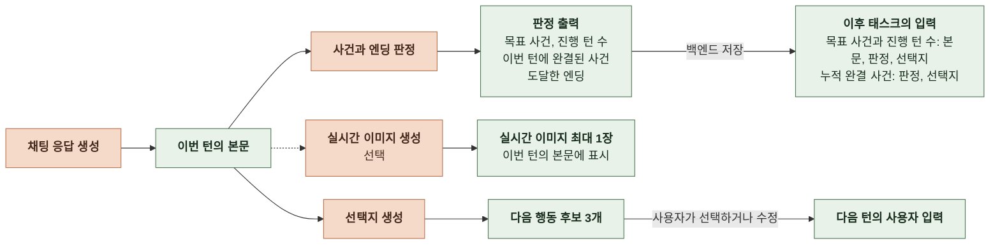
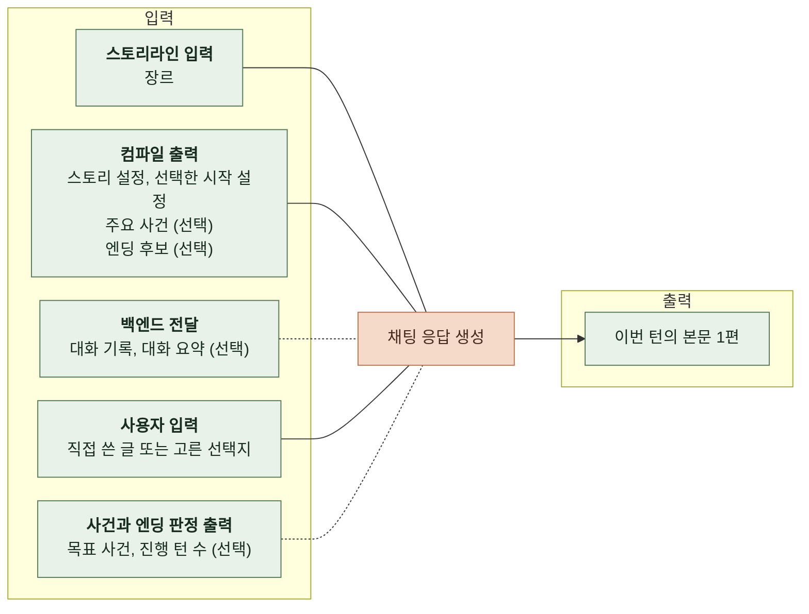
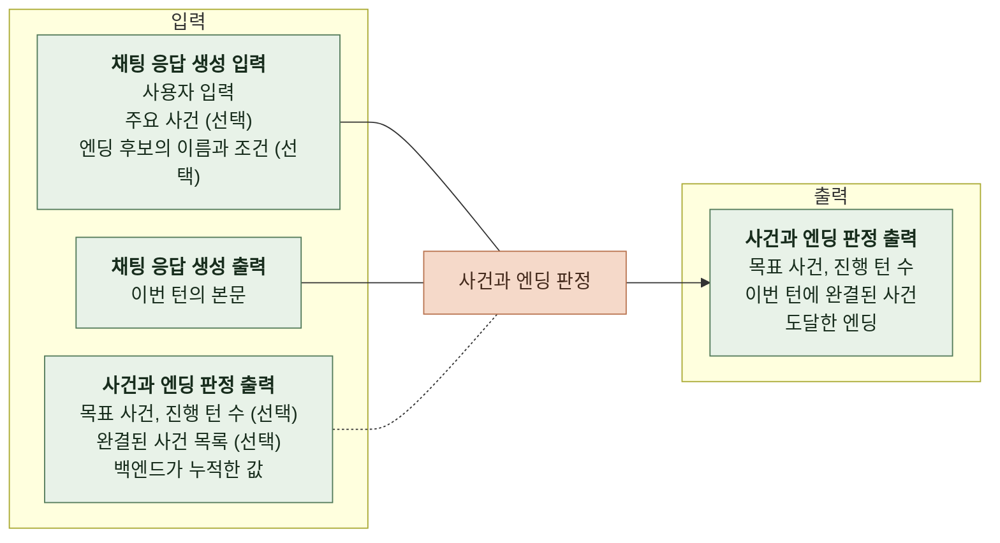
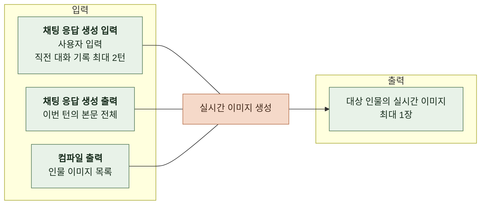
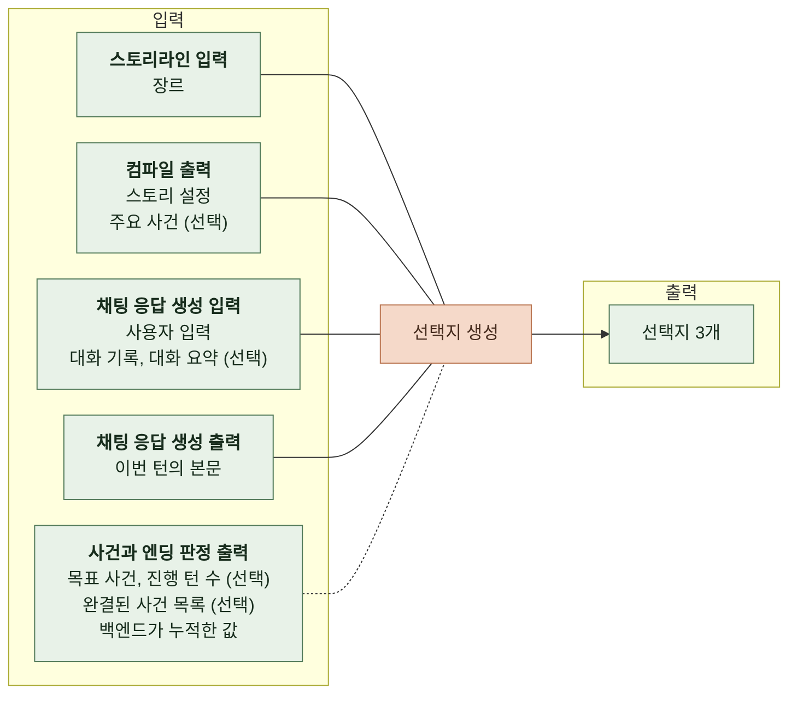

# 3. 태스크 정의

본 문서는 채팅의 사용자 기대와 운영 요구사항을 AI가 수행할 과제로 구체화한다.

본문 생성, 사건과 엔딩 판정, 실시간 이미지 생성과 선택지 생성의 입력, 출력과 적용 조건을 정의한다.

 

### 3-1 전체 흐름

 

### 3-2 채팅 응답 생성

 

**1. 입력**

| 항목 | 출처 | 필수 여부 | 비어 있을 때 |
|---|---|---|---|
| 장르 | 스토리라인 생성 입력 | 필수 | 해당 없음 |
| 스토리 설정   세계관, 주변 인물, 주인공, 전개 규칙 | 스토리 컴파일 출력 | 필수 | 해당 없음 |
| 시작 설정   이름, 시작 상황, 프롤로그 | 스토리 컴파일 출력 중 사용자가 고른 시작 설정 | 필수 | 해당 없음 |
| 대화 기록 | 백엔드가 전달한 이전 사용자 입력과 본문, 오프닝 | 선택 | 과거 대화 없이 나머지 입력을 사용함 |
| 대화 요약 | 백엔드가 전달한 대화 요약 | 선택 | 요약 없이 생성함 |
| 사용자 입력 | 사용자가 직접 쓴 글 또는 고른 선택지 | 필수 | 해당 없음 |
| 주요 사건   이름, 설명, 키 문장 | 스토리 컴파일 출력 | 선택 | 주요 사건 없이 생성함 |
| 목표 사건과 진행 턴 수 | 이전 턴의 사건과 엔딩 판정 출력 | 선택 | 목표 사건 없음 |
| 엔딩 후보   이름, 엔딩 조건, 엔딩 에필로그 | 스토리 컴파일 출력 중 백엔드가 전달한 후보 | 선택 | 엔딩 후보 없음 |

 

**2. 출력**

| 항목 | 설명 |
|---|---|
| 이번 턴의 본문 1편 | 사용자 입력에 이어지는 상황 설명과 주변 인물의 대사   엔딩에 도달하는 턴에는 해당 엔딩의 결말을 담음 |

 

### 3-3 사건과 엔딩 판정

 

**1. 입력**

| 항목 | 출처 | 필수 여부 | 비어 있을 때 |
|---|---|---|---|
| 사용자 입력 | 이번 턴의 채팅 응답 생성 입력 | 필수 | 해당 없음 |
| 이번 턴의 본문 | 채팅 응답 생성 출력 | 필수 | 해당 없음 |
| 주요 사건   이름, 설명, 키 문장 | 이번 턴의 채팅 응답 생성 입력 | 선택 | 사건 판정 대상 없음 |
| 목표 사건과 진행 턴 수 | 이전 턴의 사건과 엔딩 판정 출력 | 선택 | 목표 사건 없음 |
| 완결된 사건 목록 | 백엔드가 이전 판정 결과를 누적한 목록 | 선택 | 완결된 사건 없음 |
| 엔딩 후보의 이름과 조건 | 이번 턴의 채팅 응답 생성 입력 | 선택 | 엔딩 판정 대상 없음 |

 

**2. 출력**

| 항목 | 설명 |
|---|---|
| 목표 사건 | 다음 턴의 본문과 선택지에서 진행할 미완결 사건   주요 사건 중 최대 1개이며 해당 사건이 없으면 값 없음 |
| 진행 턴 수 | 목표 사건과 관련된 대화가 진행된 턴 수 |
| 이번 턴에 완결된 사건 | 이번 본문에서 마무리된 주요 사건   최대 1개이며 완결된 사건이 없으면 값 없음   백엔드가 완결된 사건 목록에 추가함 |
| 도달한 엔딩 | 조건을 충족하고 이번 본문이 해당 결말로 끝난 엔딩   엔딩 후보 중 최대 1개이며 도달한 엔딩이 없으면 값 없음   백엔드가 도달 기록을 저장하고 클라이언트가 표시함 |

 

### 3-4 실시간 이미지 생성

 

**1. 입력**

| 항목 | 출처 | 용도 |
|---|---|---|
| 이번 턴의 본문 전체 | 채팅 응답 생성 출력 | 대상 인물과 현재 장면, 표정의 기준 |
| 사용자 입력 | 이번 턴의 채팅 응답 생성 입력 | 현재 장면의 맥락 |
| 직전 대화 기록 최대 2턴 | 이번 턴의 채팅 응답 생성 입력에 포함된 대화 기록 | 사용자 입력과 AI 본문이 짝을 이룬 최근 대화   짝이 없는 오프닝이나 메시지는 제외함 |
| 인물 이미지 목록 | 스토리 컴파일 출력의 인물 이미지 | 대상 인물의 기본 이미지를 골라 외형의 기준으로 사용함 |

 

**2. 출력**

| 항목 | 설명 |
|---|---|
| 대상 인물의 실시간 이미지 | 기본 이미지가 있는 인물 중 이번 본문에서 가장 먼저 말한 인물의 이미지   턴마다 최대 1장   해당 인물의 첫 대사 앞에 기본 이미지 대신 표시함 |

 

### 3-5 선택지 생성

 

**1. 입력**

| 항목 | 출처 | 필수 여부 | 비어 있을 때 |
|---|---|---|---|
| 장르 | 스토리라인 생성 입력 | 필수 | 해당 없음 |
| 스토리 설정   세계관, 주변 인물, 주인공, 전개 규칙 | 스토리 컴파일 출력 | 필수 | 해당 없음 |
| 대화 기록 | 백엔드가 전달한 이번 턴 이전의 대화 | 선택 | 과거 대화 없이 나머지 입력을 사용함 |
| 대화 요약 | 백엔드가 전달한 대화 요약 | 선택 | 요약 없이 생성함 |
| 사용자 입력 | 이번 턴의 채팅 응답 생성 입력 | 필수 | 해당 없음 |
| 이번 턴의 본문 | 채팅 응답 생성 출력 | 필수 | 해당 없음 |
| 주요 사건 | 스토리 컴파일 출력 | 선택 | 특정 사건과 무관한 행동을 제안함 |
| 목표 사건과 진행 턴 수 | 사건과 엔딩 판정 출력 | 선택 | 목표 사건 없음 |
| 완결된 사건 목록 | 백엔드가 판정 결과를 누적한 목록 | 선택 | 완결된 사건 없음 |

 

**2. 출력**

| 항목 | 설명 |
|---|---|
| 목표 진행 선택지 1개 | 목표 사건으로 이어지는 행동   목표 사건이 없으면 현재 맥락에 맞는 주요 사건으로 이어지는 행동 |
| 다른 사건 선택지 1개 | 목표 사건이 아닌 미완결 사건으로 이어지는 행동 |
| 자유 맥락 선택지 1개 | 현재 장면의 인물과 분위기에 맞는 행동   주요 사건과 무관해도 됨 |
