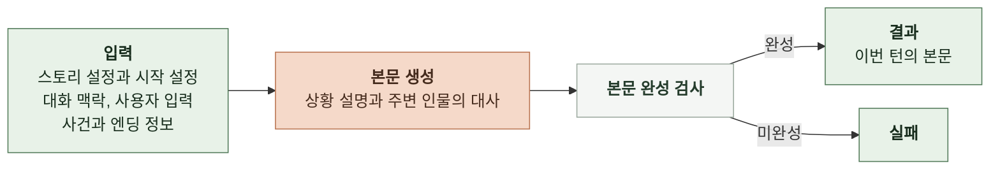
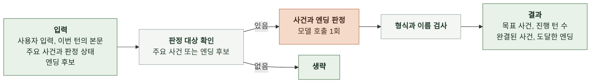
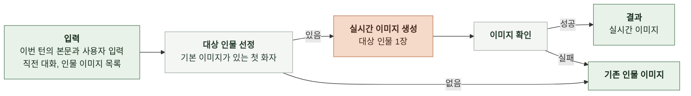
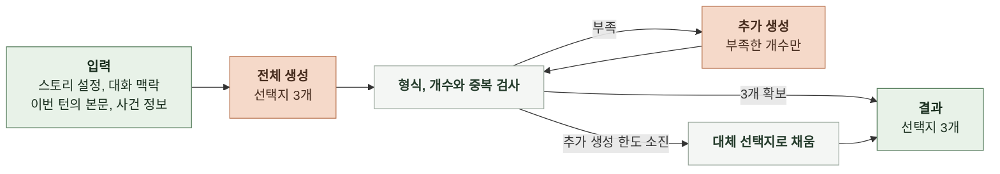

# 4-1 인지 구조 설계

본 문서는 태스크별 입력으로 결과를 만드는 판단과 생성 구조를 설계한다.

생성, 검사와 보완 단계를 나누고 각 단계에서 모델과 코드가 맡는 역할을 정한다.

 

### 4-1-1 서브태스크의 인지 구조

**1. 채팅 응답 생성**

- 엔딩 조건을 충족하면 해당 에필로그에 따라 결말을 쓴다.
- 안전성 기준에 따른 우회 서술은 본문 생성 프롬프트에서 처리하며 별도 검수 모델은 쓰지 않는다.
- 본문 생성에 실패하면 후속 작업을 하지 않는다.
- 본문 완성 후 판정과 이미지 생성을 병렬로 수행하고 선택지는 별도로 요청한다.
- 본문은 생성되는 대로 전달하되 실시간 이미지를 요청한 턴은 이미지가 정해진 뒤 전달한다.

 

**2. 사건과 엔딩 판정**

- 목록에 없는 이름과 이미 완결된 사건은 해당 값만 비운다.
- 목표 사건이 이번 턴에 완결됐으면 목표 사건을 비운다.
- 엔딩 도달이 불확실하면 도달하지 않은 것으로 본다.
- 판정 결과가 비었거나 형식이 깨지면 실패로 처리한다.
- 판정을 시작하지 못하거나 시간 초과되면 기존 목표와 진행 턴 수를 유지하고 완결 사건과 도달 엔딩은 비운다.
- 판정에 실패해도 본문은 전달한다.

 

**3. 실시간 이미지 생성**

- 실시간 이미지는 요청된 턴에만 생성한다.
- 기본 이미지의 외형을 유지하며 본문과 대화 맥락에 맞는 표정과 상황을 그린다.
- 생성한 이미지만 대상 인물의 첫 대사 앞에 연결하고 다른 인물 이미지는 유지한다.
- 이미지 생성에 실패해도 재호출 없이 본문을 전달한다.

 

**4. 선택지 생성**

- 주요 사건이 없거나 모두 완결됐으면 특정 사건으로 이끌지 않는다.
- 유효한 선택지는 유지하고 부족한 개수만 최대 2회 추가 생성한다.
- 선택지가 3개를 넘으면 앞의 3개만 남긴다.

 

### 4-1-2 모델과 코드의 책임

코드는 사건 완결이나 엔딩 도달을 임의로 만들지 않는다.

본문 생성과 판정에는 별도 보완 호출을 하지 않는다.

| 맡는 쪽 | 맡는 일 |
|---|---|
| 모델 | 본문, 이미지와 선택지 생성   사건 진행과 완결, 엔딩 도달 판정 |
| 코드 | 프롬프트 구성, 형식과 이름 검사   이미지 선정과 연결, 대체 선택지 적용   시간 한도 관리와 결과 조립 |
