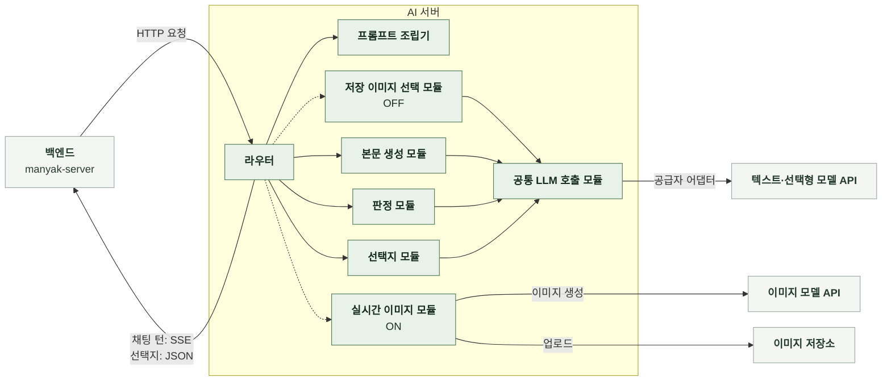
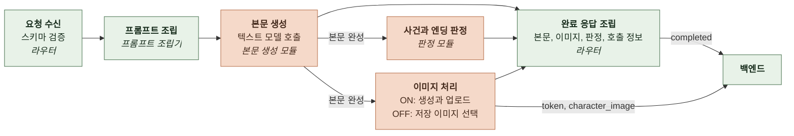
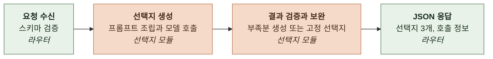

# 4-2 소프트웨어 구조 설계

본 문서는 채팅의 인지 구조를 소프트웨어 구성 요소와 데이터 흐름으로 구체화한다.

백엔드, AI 서버와 외부 모델의 책임 경계, 요청 처리 흐름과 구성 요소별 역할을 정한다.

 

### 4-2-1 시스템 경계

| 경계 밖 | 역할 | 연결 방식 |
|---|---|---|
| 백엔드 | 대화 기록과 사건 진행 상태 저장, 요청 재료 구성 | 채팅 턴은 HTTP 요청과 SSE 응답, 선택지는 HTTP 요청과 JSON 응답 |
| 텍스트 모델 API | 본문 생성, 사건과 엔딩 판정, 선택지 생성 | 공통 LLM 호출 모듈의 공급자 어댑터 |
| 이미지 선택 API | 대화와 후보 이름으로 저장 이미지 선택 | 공통 LLM 호출 모듈의 TypeSafe 어댑터 |
| 이미지 모델 API | 실시간 이미지 생성 | 이미지 생성 모듈 |
| 이미지 저장소 | 생성한 이미지 보관 | 백엔드가 제공한 업로드 주소로 저장 |

 

### 4-2-2 요청 처리 흐름

**1. 채팅 턴**

- 라우터는 본문 완성 후 판정과 이미지 처리를 병렬로 실행한다.
- `image_slots`가 있으면 실시간 이미지를 생성하고, 없으면 저장 이미지를 선택한다.
- 이미지 처리 후 `token`과 `character_image`를 전달하고 판정 결과를 합쳐 완료한다.
- 본문 생성에 실패하면 `error` 이벤트로 종료하고 후속 작업을 실행하지 않는다.
- 판정과 이미지 처리의 실패 대체 결과는 완료 응답에 반영한다.

 

**2. 선택지**

백엔드는 채팅 턴 완료 후 이번 본문을 포함해 선택지를 별도로 요청한다.

 

### 4-2-3 구성 요소

| 구성 요소 | 입력 | 출력 | 책임 |
|---|---|---|---|
| 라우터 | 채팅 턴 또는 선택지 요청 | SSE 또는 JSON 응답 | 스키마 검증, 실행 순서와 대기 시간 관리, 응답 조립 |
| 프롬프트 조립기 | 채팅 턴 입력과 프롬프트 템플릿 | 모델 메시지 목록 | 설정, 대화 기록과 사용자 입력 배치 |
| 본문 생성 모듈 | 모델 메시지와 인물 이미지 목록 | 본문과 이미지 이벤트, 완성된 본문 | 본문 스트리밍과 인물 이미지 연결 |
| 판정 모듈 | 채팅 턴 입력과 완성된 본문 | 사건과 엔딩 판정 출력 | 판정 프롬프트 조립, 모델 호출과 결과 검증 |
| 실시간 이미지 모듈 | 본문, 대화 맥락, 기본 이미지와 업로드 위치 | 이미지 주소를 반영한 본문과 이벤트 | 대상 선택, 생성과 업로드, 실패 시 기본 이미지 유지 |
| 저장 이미지 선택 모듈 | 완성된 본문, 대화 맥락과 인물별 이미지 목록 | 선택 이미지를 반영한 본문과 이벤트 | 후보 구성, 단일 선택 호출, 대체 이미지 적용과 순차 전송 |
| 선택지 모듈 | 선택지 입력과 완성된 본문 | 선택지 3개 | 프롬프트 조립, 모델 호출, 검증과 부족분 보완 |
| 공통 LLM 호출 모듈 | 모델 메시지와 모델 설정 | 텍스트, 스트림 또는 선택 결과, 호출 정보 | 공급자 선택과 모델 호출 |
