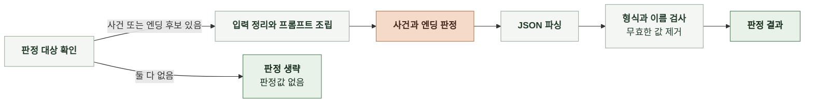
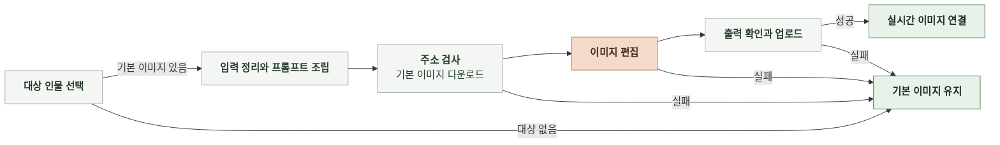
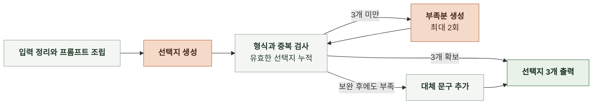

# 6-1 AI 실행

본 문서는 채팅의 인지 구조를 실제 AI 실행 절차로 구체화한다.

입력 전처리, 프롬프트 조립, 모델과 호출 설정, 결과 검사와 보완, 최종 출력까지의 처리 순서를 정한다.

<br>

### 6-1-1 채팅 응답 생성


<br>

**1. 모델 및 파라미터**

| 항목 | 값 |
|---|---|
| 프로덕션 모델 | `gpt-6-luna` |
| 환경 변수명 | `CHAT_MODEL` |
| 추론 강도 | `none` |
| 출력 토큰 한도 | 호출 인자에 지정하지 않음 |
| 생성 온도 | 호출 인자에 지정하지 않음 |
| JSON 모드 | `False` |
| 모델 출력 형식 | 텍스트 스트림 |
| SDK 호출 제한 시간 | 90초 |

<br>

**2. 입력 전처리**

| 대상 | 처리 규칙 |
|---|---|
| 시작 설정 | 이름, 프롤로그, 시작 상황을 제목으로 구분해 연결 |
| 대화 기록 | 전달 순서 유지, `USER`와 `ASSISTANT`를 `user`와 `assistant`로 변환 |
| 프롤로그, 시작 상황, 대화 기록의 이미지 마커 | `[[...]]`와 바로 뒤의 줄바꿈 최대 2개 제거 |
| 주요 사건 | 사건마다 이름, 설명, 키 문장을 한 줄로 구성 |
| 목표 사건 | 이름과 진행 턴 수를 한 줄로 구성 |
| 엔딩 후보 | 이름, 달성 조건, 에필로그를 한 줄로 구성 |
| 사건, 목표 사건, 엔딩 후보가 없음 | `(없음)`으로 표기 |
| 사용자 입력, 스토리 설정, 대화 요약 | 전달받은 문자열 사용 |
| 입력 길이 | 요약하거나 길이에 맞춰 자르지 않음 |

<details>
<summary><b>대화 기록 전처리 예시</b></summary>

<br>

**1) 전처리 전**

```json
{
  "role": "ASSISTANT",
  "content": "[[https://images.example.com/doyun.webp]]\n\n도윤: 기록장을 확인해 보죠."
}
```

<br>

**2) 전처리 후**

```json
{
  "role": "assistant",
  "content": "도윤: 기록장을 확인해 보죠."
}
```

</details>

<br>

**3. 프롬프트 조립**

`prompt/chat/`의 템플릿에서 frontmatter를 제외한 본문을 사용한다. `src/services/chat_assembler.py`의 `assemble`이 다음 순서로 메시지를 조립한다.

| 순서 | 역할 | 내용 |
|---|---|---|
| 1 | `system` | `SAFETY` → `CORE` → `STORY` → `CHARACTER` → `USER` 템플릿 |
| 2 | `user`, `assistant` | 전처리한 대화 기록 |
| 3 | `user` | 이번 사용자 입력 |
| 4 | `system` | `MEMORY` 템플릿에 대화 요약을 채운 현재 상태 |
| 5 | `system` | `CHARACTER` → `STORY` → `CORE` → `SAFETY`의 `<phi_core>` 부분을 다시 배치한 핵심 규칙 |

| 템플릿 | 채우는 자리 | 들어가는 값 |
|---|---|---|
| `STORY-TEMPLATE.md` | `{{장르}}` | 장르 |
| `STORY-TEMPLATE.md` | `{{world_setting}}` | 세계관 |
| `STORY-TEMPLATE.md` | `{{start_setting}}` | 전처리한 시작 설정 |
| `STORY-TEMPLATE.md` | `{{rule_setting}}` | 전개 규칙 |
| `STORY-TEMPLATE.md` | `{{main_events}}` | 주요 사건 목록 |
| `STORY-TEMPLATE.md` | `{{target_main_event}}` | 목표 사건과 진행 턴 수 |
| `STORY-TEMPLATE.md` | `{{endings}}` | 엔딩 후보 목록 |
| `CHARACTER-TEMPLATE.md` | `{{character_setting}}` | 주변 인물 설정 |
| `USER-TEMPLATE.md` | `{{user_role_setting}}` | 주인공 설정 |
| `MEMORY-TEMPLATE.md` | `{{summary}}` | 대화 요약, 없으면 빈 문자열 |

`SAFETY`와 `CORE`에는 입력을 채우는 자리가 없다. 인물 이미지 목록과 업로드 슬롯은 본문 모델에 전달하지 않는다.

<br>

**4. 모델 호출과 형식 검사**

조립한 메시지로 본문을 스트리밍 생성한다. 수신한 조각을 누적하면서 줄머리의 화자 표기를 정리하고 인물 이미지를 연결한다.

| 대상 | 처리 규칙 |
|---|---|
| 굵은 화자 표기 | `**도윤:**`, `**도윤**:`을 `도윤:`으로 변환 |
| 인물 이름 | 정식 이름 우선 대조<br>한글 세 글자 이름은 성을 뺀 두 글자, 공백으로 나뉜 이름은 두 글자 이상인 조각도 대조 |
| 같은 별칭을 쓰는 인물 | 어느 인물인지 구분되지 않는 별칭은 이미지 연결에서 제외 |
| 인물별 첫 대사 | 대사 앞에 이미지 이벤트 삽입 |
| 반복 대사 | 같은 정식 이름의 이미지는 다시 삽입하지 않음 |
| 완료 본문 | 앞뒤 공백 제거, 화자 표기 정리, 이미지 위치에 저장 마커 삽입 |

<br>

**5. 재생성 및 보완**

본문의 재생성이나 보완 호출은 없다. 전송 오류와 스트림 실패 처리는 오류 처리 문서에서 다룬다. ([7-1 오류 처리](7-1-ERROR-HANDLING.md))

<br>

**6. 최종 출력**

본문과 판정의 사용량을 합산하고 템플릿 버전을 `meta`에 담는다. 응답 필드는 계약을 따른다. ([5-2 채팅 턴 요청과 결과](5-CONTRACT.md#5-2-채팅-턴-요청과-결과), [5-5 요청 헤더와 메타데이터](5-CONTRACT.md#5-5-요청-헤더와-메타데이터))

| 조건 | 처리 순서 |
|---|---|
| 실시간 이미지 미요청 | 생성 중 본문과 인물 이미지 이벤트 전달 → 본문 종료 후 판정 → 완료 응답 |
| 실시간 이미지 요청 | 본문 수집 → 판정과 이미지 처리 병렬 실행 → 본문과 이미지 이벤트 전달 → 판정 결과를 합쳐 완료 응답 |
| 연결 종료 | 모델 스트림을 닫고 진행 중인 판정과 이미지 작업 취소 |

<br>

### 6-1-2 사건과 엔딩 판정



<br>

**1. 모델 및 파라미터**

| 항목 | 값 |
|---|---|
| 모델 | 본문과 같은 `CHAT_MODEL` |
| 추론 강도 | 본문과 같음 |
| 출력 토큰 한도 | 256 |
| 생성 온도 | 호출 인자에 지정하지 않음 |
| JSON 모드 | `True` |
| 모델 출력 형식 | JSON 객체 |
| 전체 호출 제한 시간 | 60초와 `120초 - 턴 경과 시간 - 15초` 중 작은 값<br>SDK 재시도 포함 |

<br>

**2. 입력 전처리**

| 대상 | 처리 규칙 |
|---|---|
| 주요 사건과 엔딩 후보 | 둘 다 없으면 판정 호출 생략 |
| 주요 사건, 목표 사건 | 본문 생성과 같은 문자열 형식 사용 |
| 완결 사건 | 사건 이름마다 `- `를 붙여 줄바꿈으로 연결 |
| 엔딩 후보 | 이름과 달성 조건만 사용, 에필로그 제외 |
| 이번 본문 | 이미지 저장 마커 제거 |
| 비어 있는 사건과 엔딩 정보 | `(없음)`으로 표기 |

<br>

**3. 프롬프트 조립**

`src/services/chat_judgement.py`의 `_build_user`가 `prompt/chat/JUDGEMENT-TEMPLATE.md`의 입력 부분을 채운다. `[SYSTEM]`과 `[USER]`를 각각 `system`, `user` 메시지로 전달한다.

| 템플릿 자리 | 들어가는 값 |
|---|---|
| `{{main_events}}` | 주요 사건 목록 |
| `{{target_main_event}}` | 이전 목표 사건과 진행 턴 수 |
| `{{occurred_main_event_names}}` | 누적 완결 사건 이름 |
| `{{endings}}` | 엔딩 후보 이름과 달성 조건 |
| `{{user_input}}` | 이번 사용자 입력 |
| `{{ai_output}}` | 이미지 마커를 제거한 이번 본문 |

<br>

**4. 모델 호출과 형식 검사**

판정을 한 번 호출하고 코드 펜스를 제거한 뒤 JSON 객체로 파싱한다. 빈 응답과 JSON 객체가 아닌 응답은 실패로 처리한다.

| 출력 항목 | 검사와 보정 |
|---|---|
| 목표 사건 | 주요 사건 목록에 있고 아직 완결되지 않은 이름인지 확인<br>진행 턴 수가 0 이상의 정수인지 확인 |
| 이번 완결 사건 | 주요 사건 목록에 있고 누적 완결 목록에는 없는 이름인지 확인 |
| 도달한 엔딩 | 전달한 엔딩 후보 이름인지 확인 |
| 유효하지 않은 값 | 해당 필드만 `null`로 변경 |
| 목표 사건과 이번 완결 사건이 같음 | 목표 사건을 `null`로 변경 |

<details>
<summary><b>판정 결과 보정 예시</b></summary>

<br>

**1) 모델 출력**

```json
{
  "target_main_event": {"name": "원본 발견", "progress_turns": 3},
  "occurred_main_event_name": "원본 발견",
  "ending_name": null
}
```

<br>

**2) 보정 후**

```json
{
  "target_main_event": null,
  "occurred_main_event_name": "원본 발견",
  "ending_name": null
}
```

</details>

<br>

**5. 재생성 및 보완**

판정의 재생성이나 보완 호출은 없다. 판정 실패와 시간 초과의 대체 결과는 오류 처리 문서에서 다룬다. ([7-1 오류 처리](7-1-ERROR-HANDLING.md))

현재 구현은 자체 대기 시간 초과에만 기존 목표를 유지한다. 공급자 시간 초과는 판정 3필드를 `null`로 반환하므로, 시간 초과 시 목표를 유지하는 설계와 다르다. ([4-1-1 서브태스크의 인지 구조](4-1-DESIGN-COGNITIVE-ARCHITECTURE.md#4-1-1-서브태스크의-인지-구조))

<br>

**6. 최종 출력**

검사한 목표 사건, 진행 턴 수, 이번 완결 사건과 도달한 엔딩을 본문 완료 응답에 합친다. ([5-2 채팅 턴 요청과 결과](5-CONTRACT.md#5-2-채팅-턴-요청과-결과))

<br>

### 6-1-3 실시간 이미지



<br>

**1. 모델 및 파라미터**

| 항목 | 값 |
|---|---|
| 모델 기본값 | `gpt-image-2.5-flare` |
| 환경 변수명 | `IMAGE_MODEL` |
| 생성 품질 기본값 | `low` (`IMAGE_QUALITY`) |
| 이미지 크기 기본값 | `1024x768` (`IMAGE_SIZE`) |
| 호출 방식 | 기본 이미지를 첨부한 `images.edit` |
| 출력 형식 | `webp` |
| 호출당 생성 장수 | 1 |
| SDK 호출 제한 시간 기본값 | 60초 (`IMAGE_TIMEOUT`), 연결 제한 10초 |
| 전체 작업 제한 시간 | 다운로드, 생성, 업로드 합계 최대 30초<br>턴의 남은 시간과 본문 전송 여유에 따라 단축 |

<br>

**2. 입력 전처리**

태스크 정의는 이번 본문 전체를 이미지 입력으로 정한다. 현재 `build_child_image_input`은 본문 시작부터 대상 인물의 첫 대사 줄 끝까지만 전달한다. ([3-4 실시간 이미지 생성](3-TASK-DEFINITION.md#3-4-실시간-이미지-생성))

| 대상 | 처리 규칙 |
|---|---|
| 생성 여부 | `image_slots`가 있을 때만 실행 |
| 대상 인물 | `image_name`이 `인물이름_기본`이고 URL이 비어 있지 않은 인물 중 첫 화자 선택 |
| 최근 대화 | 인접한 `USER`와 `ASSISTANT` 쌍을 뒤에서 최대 2개 찾아 시간순으로 배치<br>짝이 없는 오프닝과 메시지 제외 |
| 대화의 이미지 마커 | 최근 대화와 이번 본문에서 제거 |
| 업로드 주소 | 생성 전에 `IMAGE_UPLOAD_ALLOWED_HOSTS`의 호스트인지 검사 |
| 기본 이미지 주소 | HTTPS, `IMAGE_PARENT_ALLOWED_HOSTS`의 호스트, 사용자 정보 없음, 포트 443 또는 생략 |
| 기본 이미지 다운로드 | 리다이렉트 없이 다운로드, 50,000,000바이트 이상이면 중단 |
| 기본 이미지 형식 | 파일 시그니처로 PNG, JPEG, WebP 확인<br>리사이징 없이 첨부 |

<br>

**3. 프롬프트 조립**

`src/services/image/child_prompt.py`의 `build_child_image_prompt`가 `prompt/image/CHILD-IMAGE-TEMPLATE.md`의 `{{dialogue_input}}`을 채운다. 인물 이름과 대화의 각 줄을 `> `로 시작하는 인용문으로 넣는다.

| 입력 블록 | 들어가는 값 |
|---|---|
| `target_character` | 대상 인물의 정식 이름 |
| `recent_turns` | 최근 최대 2턴의 사용자 입력과 AI 본문<br>현재 턴 기준 `-2`, `-1` 순서 |
| `current_turn` | 이번 사용자 입력과 이미지 생성에 사용할 본문 |

<details>
<summary><b>이미지 프롬프트 입력 예시</b></summary>

<br>

```text
## dialogue_input

target_character:
> 도윤

### recent_turns

#### turn (relative_to_current: -1)

user_message:
> 기록장의 출처를 묻는다.

ai_response:
> 도윤: 지하 보관실에서 가져왔습니다.

### current_turn

user_message:
> 기록장에 남은 흔적을 살핀다.

ai_response:
> *기록장 가장자리에 푸른 흔적이 떠오른다.*
> 도윤: 흔적이 아직 남아 있었군요.
```

</details>

<br>

**4. 모델 호출과 형식 검사**

1. 기본 이미지와 조립한 프롬프트로 이미지 1장을 편집한다.
2. 응답의 Base64를 디코딩하고 비어 있지 않은 이미지 바이너리인지 확인한다.
3. 슬롯의 `upload_url`에 `Content-Type: image/webp`로 바이너리를 `PUT`한다.
4. 2xx 응답을 받으면 슬롯의 `public_url`을 결과 주소로 사용한다.

<br>

**5. 재생성 및 보완**

이미지 재생성, SDK 편집 재시도와 업로드 재시도는 없다. 단계별 실패 처리는 오류 처리 문서에서 다룬다. ([7-1 오류 처리](7-1-ERROR-HANDLING.md))

<br>

**6. 최종 출력**

본문 수집과 이미지 작업을 기다리는 동안 10초 간격으로 `ping`을 보낸다. 이미지 처리 후 판정이 남아 있으면 판정을 기다린 뒤 완료 응답을 보낸다.

| 종료 상태 | 출력 처리 |
|---|---|
| 생성과 업로드 성공 | 대상 인물의 첫 이미지 이벤트, 저장 마커와 완료 이미지 목록을 새 이미지 이름과 URL로 교체 |
| 대상 인물 없음 또는 생성 실패 | 기본 이미지 유지 |
| 본문 전달 | 이미지 위치를 유지하며 본문을 12자씩 나눠 전달<br>기본 간격 0.03초, 전체 전송 8초와 남은 시간 절반 이내로 간격 조정 |

<br>

### 6-1-4 선택지



<br>

**1. 모델 및 파라미터**

| 항목 | 값 |
|---|---|
| 모델 설정 | `CHAT_CHOICE_MODEL`, 코드 기본값 `deepseek-flash` |
| 추론 설정 | `deepseek-flash`는 비추론 |
| 출력 토큰 한도 | 512 |
| 생성 온도 | 호출 인자에 지정하지 않음 |
| JSON 모드 | `True` |
| 모델 출력 형식 | `choices` 배열을 담은 JSON 객체 |
| SDK 호출 제한 시간 | 호출마다 60초 |

<br>

**2. 입력 전처리**

| 대상 | 처리 규칙 |
|---|---|
| 대화 기록 | 이미지 마커 제거, `USER`는 `주인공:`, `ASSISTANT`는 `이야기:`로 표기하고 빈 줄로 연결 |
| 이번 본문 | 이미지 마커 제거 |
| 주요 사건, 목표 사건 | 본문 생성과 같은 문자열 형식 사용 |
| 완결 사건 | 사건 이름마다 `- `를 붙여 줄바꿈으로 연결 |
| 비어 있는 대화 기록과 사건 정보 | `(없음)`으로 표기 |
| 비어 있는 대화 요약 | `(아직 없음)`으로 표기 |
| 입력 길이 | 요약하거나 길이에 맞춰 자르지 않음 |

<br>

**3. 프롬프트 조립**

`src/services/chat_choices.py`의 `_build_user`가 `prompt/chat/CHOICES-TEMPLATE.md`의 입력 부분을 채운다. `[SYSTEM]`과 `[USER]`를 각각 `system`, `user` 메시지로 전달한다.

| 템플릿 자리 | 들어가는 값 |
|---|---|
| `{{장르}}` | 장르 |
| `{{world_setting}}` | 세계관 |
| `{{character_setting}}` | 주변 인물 설정 |
| `{{user_role_setting}}` | 주인공 설정 |
| `{{rule_setting}}` | 전개 규칙 |
| `{{main_events}}` | 주요 사건 목록 |
| `{{target_main_event}}` | 목표 사건과 진행 턴 수 |
| `{{occurred_main_event_names}}` | 누적 완결 사건 이름 |
| `{{summary}}` | 대화 요약 |
| `{{history}}` | 전처리한 대화 기록 |
| `{{user_input}}` | 이번 사용자 입력 |
| `{{ai_output}}` | 이미지 마커를 제거한 이번 본문 |

<br>

**4. 모델 호출과 형식 검사**

1. 선택지 3개를 요청하고 코드 펜스를 제거한 뒤 JSON으로 파싱한다.
2. JSON 객체에 `choices` 배열이 있는지 확인한다.
3. 문자열 항목만 남기고 앞뒤 공백을 제거한다.
4. 빈 문자열과 이미 확보한 문구와 정확히 같은 항목을 제외한다.
5. 유효한 선택지를 수신 순서대로 누적한다.

<br>

**5. 재생성 및 보완**

| 항목 | 처리 규칙 |
|---|---|
| 실행 조건 | 유효한 선택지가 3개 미만 |
| 보완 입력 | 최초 입력 뒤에 확보한 선택지와 부족한 개수를 추가 |
| 생성 범위 | 기존 선택지와 방향이 겹치지 않는 부족분만 요청 |
| 결과 처리 | 기존 선택지를 유지하고 같은 검사로 누적 |
| 최대 횟수 | 최초 호출 이후 2회 |
| 보완 후 부족분 | 고정 대체 문구를 중복 없이 추가 |

<details>
<summary><b>선택지 보완 예시</b></summary>

<br>

```text
확보한 선택지: 지하 보관실로 향한다.
부족한 개수: 2개

최초 입력 + 확보한 선택지 + 다른 방향의 선택지 2개 요청
→ 새 선택지의 공백, 빈 값과 중복 검사
→ 기존 선택지에 추가
```

</details>

<br>

**6. 최종 출력**

누적한 선택지 중 앞의 3개를 반환한다. 호출별 사용량과 보완 횟수를 합산하고 `CHOICES` 템플릿 버전은 `NEXT_ACTIONS` 키로 기록한다. ([5-3 선택지 요청과 결과](5-CONTRACT.md#5-3-선택지-요청과-결과), [5-5 요청 헤더와 메타데이터](5-CONTRACT.md#5-5-요청-헤더와-메타데이터))
