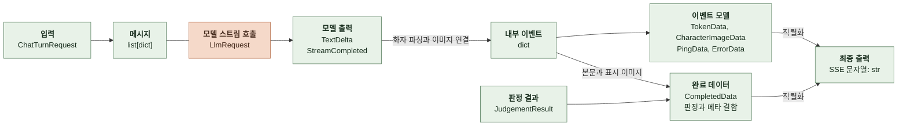
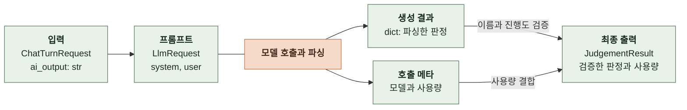
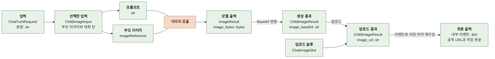
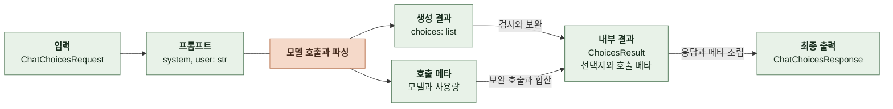
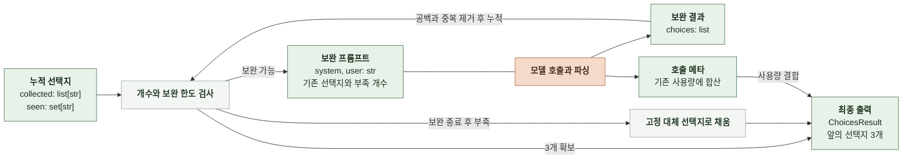

```mermaid
%%{init: {"themeVariables": {"fontSize": "18px"}, "flowchart": {"curve": "basis", "htmlLabels": true, "nodeSpacing": 24, "rankSpacing": 48}}}%%
flowchart LR
    I[" "] -->|ChatTurnRequest| A["<b>chat_turn / _event_stream</b><br/>요청 수신과 관측 시작"]
    A -->|ChatTurnRequest| B["<b>assemble</b><br/>메시지 조립"]
    B -->|"list[dict]"| C["<b>stream_chat_turn</b><br/>본문 생성과 화자 파싱"]
    C -.->|"image_slots 있음, dict"| D["<b>stream_with_child_image</b><br/>이미지 연결 (선택)"]
    C -->|"image_slots 없음, dict"| E["<b>_event_stream</b><br/>이벤트 변환과 판정 대기"]
    D -.->|dict| E
    E -->|"이벤트 이름, dict"| F["<b>_sse</b><br/>SSE 직렬화"]
    F -->|str| O[" "]
    classDef code fill:#F4F6F4,stroke:#9BA99E,color:#253C2C
    class A,B,C,D,E,F code
    style I fill:none,stroke:none
    style O fill:none,stroke:none
```

```mermaid
%%{init: {"themeVariables": {"fontSize": "18px"}, "flowchart": {"curve": "linear", "htmlLabels": true, "nodeSpacing": 24, "rankSpacing": 48}}}%%
flowchart LR
    I[" "] -->|"ChatTurnRequest, str"| A["<b>generate_judgement</b><br/>대상과 남은 시간 확인"]
    A -->|"ChatTurnRequest, str"| B["<b>_build_user</b><br/>판정 입력 조립"]
    B -->|"str → LlmRequest"| C["<b>llm.complete</b><br/>JSON 생성"]
    C -->|"LlmResult.text → dict"| D["<b>_sanitize</b><br/>이름과 진행도 검증"]
    D -->|JudgementResult| E["<b>_event_stream</b><br/>완료 이벤트에 결합"]
    E -->|CompletedData| O[" "]
    classDef code fill:#F4F6F4,stroke:#9BA99E,color:#253C2C
    class A,B,C,D,E code
    style I fill:none,stroke:none
    style O fill:none,stroke:none
```

```mermaid
%%{init: {"themeVariables": {"fontSize": "18px"}, "flowchart": {"curve": "linear", "htmlLabels": true, "nodeSpacing": 24, "rankSpacing": 48}}}%%
flowchart LR
    I[" "] -->|"AsyncIterator[dict], ChatTurnRequest"| A["<b>stream_with_child_image</b><br/>본문 수집"]
    A -->|"요청 필드, str"| B["<b>build_child_image_input</b><br/>인물과 장면 선택"]
    B -->|ChildImageInput| C["<b>generate_child_image</b><br/>프롬프트와<br/>부모 이미지 준비"]
    C -->|"str, ImageReference"| D["<b>generate_image</b><br/>참조 이미지로 생성"]
    D -->|"ImageResult →<br/>ChildImageResult"| E["<b>upload_child_image</b><br/>지정 슬롯에 업로드"]
    E -->|"ChildImageResult →<br/>이미지 매핑"| F["<b>render_chat_images</b><br/>이벤트와 저장 마커 재구성"]
    F -->|"tuple[list[dict], str, list[dict]]"| O[" "]
    classDef code fill:#F4F6F4,stroke:#9BA99E,color:#253C2C
    class A,B,C,D,E,F code
    style I fill:none,stroke:none
    style O fill:none,stroke:none
```

```mermaid
%%{init: {"themeVariables": {"fontSize": "18px"}, "flowchart": {"curve": "linear", "htmlLabels": true, "nodeSpacing": 24, "rankSpacing": 48}}}%%
flowchart LR
    I[" "] -->|ChatChoicesRequest| A["<b>chat_choices / generate_choices</b><br/>요청 수신과 생성 흐름 관리"]
    A -->|"ChatTurnRequest, str"| B["<b>_build_user</b><br/>입력 조립"]
    B -->|"system: str, user: str"| C["<b>_call</b><br/>모델 호출과 JSON 파싱"]
    C -->|list| D["<b>_accumulate</b><br/>유효한 선택지 누적"]
    D -->|"collected: list[str]"| E["<b>generate_choices</b><br/>보완과 결과 구성"]
    E -->|ChoicesResult| F["<b>chat_choices</b><br/>응답과 메타 조립"]
    F -->|ChatChoicesResponse| O[" "]
    classDef code fill:#F4F6F4,stroke:#9BA99E,color:#253C2C
    class A,B,C,D,E,F code
    style I fill:none,stroke:none
    style O fill:none,stroke:none
```

# 6-2 소프트웨어 구현

본 문서는 채팅의 생성과 판정을 구현하는 코드 구조와 구현 규칙을 정의한다.

태스크별 파일 배치, 데이터 모델, 함수 인터페이스와 변환 책임, 공통 모듈의 의존 관계를 정한다.

 

### 6-2-1 파일 배치

| 구성 요소 | 구현 위치 (`manyak-ai` 기준) | 사용 범위 |
|---|---|---|
| API 라우터 | `src/api/v1/chat.py` | 채팅 턴과 선택지 요청, SSE 조립, 후속 작업 관리 |
| 입출력 스키마 | `src/schemas/chat_turn.py`, `chat_choices.py` | 채팅 요청, 이벤트와 선택지 응답 |
| 응답 메타 | `src/schemas/response_meta.py` | 채팅과 스토리 공통 |
| 본문 프롬프트 조립 | `src/services/chat_assembler.py` | 채팅 메시지 조립 |
| 본문 생성과 이미지 표시 | `src/services/chat_llm.py` | 텍스트 스트림, 화자 파싱, 이미지 이벤트와 저장 마커 |
| 이미지 마커 제거 | `src/services/chat_image_markers.py` | 본문, 판정, 선택지와 이미지 입력 공통 |
| 사건과 엔딩 판정 | `src/services/chat_judgement.py` | 판정 호출과 결과 검증 |
| 실시간 이미지 연결 | `src/services/chat_child_image.py` | 본문 수집, 이미지 생성과 업로드, 이벤트 재구성 |
| 이미지 입력과 프롬프트 | `src/services/image/child_input.py`, `child_prompt.py` | 부모 이미지와 장면 선택, 프롬프트 조립 |
| 이미지 생성과 업로드 | `src/services/image/generate_child.py`, `upload_child.py` | 부모 이미지 다운로드, 생성, 업로드 |
| 선택지 생성 | `src/services/chat_choices.py` | 선택지 호출, 보완과 결과 조립 |
| 프롬프트 자산 | `prompt/chat/` | 본문 레이어, 판정, 선택지와 실시간 이미지 템플릿 |
| 공통 모델 호출 | `src/services/llm/`, `src/services/image/` | 채팅과 스토리가 공급자 어댑터 재사용 |
| 설정과 관측 | `src/core/`, `src/main.py` | 설정 로딩, 기동 검증, 요청 문맥과 호출 기록 공통 |

 

### 6-2-2 채팅 응답 생성

**처리 흐름**

 

**데이터 처리 흐름**

 

**1. 구현 위치와 역할**

| 구성 요소 | 구현 위치 (`manyak-ai` 기준) | 역할 |
|---|---|---|
| 라우터 | `src/api/v1/chat.py` | 요청 문맥 전달, 판정 작업 시작과 회수, 이벤트 모델 변환 |
| 메시지 조립 | `src/services/chat_assembler.py` | 템플릿과 요청을 `role`, `content` 메시지로 변환 |
| 스트림 서비스 | `src/services/chat_llm.py` | 공통 LLM 스트림 소비, 화자 파싱과 이미지 표시 |
| 마커 정리 | `src/services/chat_image_markers.py` | 이전 응답의 저장용 이미지 문법 제거 |
| 공통 LLM 호출 | `src/services/llm/__init__.py` | 모델 등록부로 공급자 어댑터 선택 |

 

**2. 데이터 모델**

| 데이터와 필드 | 타입 | 의미와 조건 |
|---|---|---|
| 입력 | `ChatTurnRequest` | 검증된 채팅 턴 요청 |
| `messages` | `list[dict]` | `role`, `content`로 구성한 모델 입력 |
| `TextDelta.text` | `str` | 공급자가 전달한 텍스트 조각 |
| `StreamCompleted` | 공통 스트림 완료 모델 | 실제 모델, 공급자와 사용량 |
| 내부 이벤트의 `event` | `str` | `token`, `character_image`, `completed`, `error` 등 이벤트 종류 |
| 토큰 이벤트의 `text` | `str` | 화자 문법을 정리한 텍스트 조각 |
| 이미지 이벤트의 `name`, `image_name`, `image_url` | 각각 `str` | 표시할 인물과 이미지 |
| 완료 이벤트의 `ai_output` | `str` | 저장용 이미지 마커를 포함한 본문 |
| 완료 이벤트의 `character_images` | `list[dict]` | 이번 응답에서 표시한 이미지 |
| 완료 이벤트의 `model`, `provider` | 각각 `str` | 본문 호출의 모델과 공급자 |
| 완료 이벤트의 `input_tokens`, `output_tokens` | 각각 `int \| None` | 본문 호출의 사용량 |
| 최종 출력 | `CompletedData` | 본문, 판정, 이미지와 `ChatResponseMeta` 결합 |

 

**3. 함수 인터페이스**

| 함수 | 소속 | 입력 | 출력 | 실행 방식 |
|---|---|---|---|---|
| `chat_turn` | 라우터 | `ChatTurnRequest` | `StreamingResponse` | 비동기 |
| `_event_stream` | 라우터 | 요청, `ConnectionMetadata` | `AsyncGenerator[str, None]` | 비동기 생성기 |
| `assemble` | 메시지 조립 | `ChatTurnRequest` | `list[dict]` | 동기 |
| `stream_chat_turn` | 스트림 서비스 | 메시지, `character_images` | `AsyncIterator[dict]` | 비동기 생성기 |
| `_SpeakerLabelStreamParser.feed` | 화자 파서 | `str` | `list[dict]` | 동기, 파서 상태 갱신 |
| `_SpeakerLabelStreamParser.flush` | 화자 파서 | 없음 | `list[dict]` | 동기, 남은 버퍼 배출 |
| `render_chat_images` | 스트림 서비스 | 본문, 이미지 매핑 | `tuple[list[dict], str, list[dict]]` | 동기 |
| `strip_character_image_syntax` | 마커 정리 | `str` | `str` | 동기 |
| `_sse` | 라우터 | 이벤트 이름, `dict` | `str` | 동기 |

 

**4. 처리 순서와 데이터 변환**

| 순서 | 담당 | 입력 → 출력 | 처리 |
|---|---|---|---|
| 1 | `chat_turn` | 요청 → 스트리밍 응답 | 연결 메타데이터를 복사해 생성기에 전달 |
| 2 | `_event_stream` | 요청 → 관측 문맥 | 생성기 내부에서 요청 관측 시작 |
| 3 | `assemble` | 요청 → 메시지 목록 | 레이어, 이력, 사용자 입력, 메모리와 PHI 조립 |
| 4 | `stream_chat_turn` | 공통 스트림 → 내부 이벤트 | 텍스트 누적, 화자 파싱, 이미지 이벤트와 저장 마커 구성 |
| 5 | `_event_stream` | 본문 완료 → 판정 작업 | 본문 완료 시 판정 시작. 이미지 슬롯이 있으면 이미지 모듈의 콜백으로 시작 |
| 6 | `stream_with_child_image` | 내부 이벤트 → 재구성한 이벤트 | 이미지 슬롯이 있는 요청의 생성과 업로드 연결 |
| 7 | `_event_stream` | 내부 이벤트와 판정 → 이벤트 모델 | 판정 대기 중 ping 전송, 본문과 판정 사용량 합산 |
| 8 | `_sse` | 모델의 `dict` → SSE | 외부 필드 별칭을 적용한 데이터 직렬화 |

 

**5. 구현 규칙과 의존성**

| 대상 | 적용 규칙 |
|---|---|
| 상태 소유 | 텍스트 버퍼와 화자 파서는 요청마다 생성한다. 입력 요청과 이력을 수정하지 않는다. |
| 이벤트 경계 | 서비스는 내부 `dict`를 반환한다. 외부 스키마 변환과 SSE 직렬화는 라우터가 담당한다. |
| 완료 조립 | `completed`는 판정 결과를 기다린다. 선택지는 별도 요청으로 생성하므로 `choices`는 빈 목록이다. |
| 자원 해제 | LLM 반복자를 `aclosing`으로 닫는다. `_ChatStreamingResponse`는 전송 종료 시 이벤트 생성기를 닫는다. |
| 작업 회수 | 요청 종료 시 미완료 판정 작업을 취소하고 `gather`로 회수한다. 정리 작업은 `shield`로 보호한다. |

 

### 6-2-3 사건과 엔딩 판정

**처리 흐름**

 

**데이터 처리 흐름**

 

**1. 구현 위치와 역할**

| 구성 요소 | 구현 위치 (`manyak-ai` 기준) | 역할 |
|---|---|---|
| 판정 서비스 | `src/services/chat_judgement.py` | 입력 조립, 모델 호출, 판정 검증과 사용량 구성 |
| 출력 모델 | `src/schemas/chat_turn.py` | `TargetMainEventOut`과 완료 이벤트 정의 |
| 호출과 결합 | `src/api/v1/chat.py` | 판정 시간 배정, 비동기 작업 관리, 완료 이벤트 결합 |

 

**2. 데이터 모델**

| 데이터와 필드 | 타입 | 의미와 조건 |
|---|---|---|
| `req`, `ai_output` | `ChatTurnRequest`, `str` | 사건과 엔딩 설정, 이번 턴 본문 |
| `budget_seconds` | `float \| None` | 라우터가 전달한 남은 시간 |
| 모델 출력 | `dict` | JSON 객체로 파싱한 판정 |
| `JudgementResult.target_main_event` | `TargetMainEventOut \| None` | 검증한 목표 사건과 진행도 |
| `JudgementResult.occurred_main_event_name` | `str \| None` | 검증한 발생 사건 이름 |
| `JudgementResult.ending_name` | `str \| None` | 검증한 엔딩 이름 |
| `JudgementResult.input_tokens`, `output_tokens` | 각각 `int \| None` | 판정 호출 사용량 |

 

**3. 함수 인터페이스**

| 함수 | 소속 | 입력 | 출력 | 실행 방식 |
|---|---|---|---|---|
| `generate_judgement` | 판정 서비스 | 요청, 본문, `budget_seconds` | `JudgementResult` | 비동기 |
| `_build_user` | 판정 서비스 | 요청, 본문 | `str` | 동기 |
| `_sanitize` | 판정 서비스 | 요청, `dict` | `JudgementResult` | 동기 |
| `_frozen` | 판정 서비스 | 요청 | `JudgementResult` | 동기 |

 

**4. 처리 순서와 데이터 변환**

| 순서 | 담당 | 입력 → 출력 | 처리 |
|---|---|---|---|
| 1 | `generate_judgement` | 요청과 시간 → 실행 여부 | 판정 대상과 남은 시간 확인 |
| 2 | `_build_user` | 요청과 본문 → 프롬프트 | 이미지 마커 제거 후 판정 입력 조립 |
| 3 | `llm.complete` | `LlmRequest` → `LlmResult` | `asyncio.wait_for` 안에서 호출 |
| 4 | `generate_judgement` | 생성 문자열 → `dict` | 코드 펜스 제거, JSON 객체 검사 |
| 5 | `_sanitize` | `dict` → `JudgementResult` | 요청의 사건과 엔딩 이름에 대조해 결과 구성 |
| 6 | `generate_judgement` | 판정 결과 → 사용량을 포함한 결과 | 새 결과 객체에 호출 사용량 추가 |

 

**5. 구현 규칙과 의존성**

| 대상 | 적용 규칙 |
|---|---|
| 결과 변경 | 정상 판정은 새 `JudgementResult`를 구성한다. 공용 빈 결과 `_EMPTY`를 수정하지 않는다. |
| 시간 전달 | 라우터가 계산한 남은 시간을 받아 호출 한도에 반영한다. |
| 설정 오류 | 공급자 확인은 복구용 예외 처리 밖에서 수행한다. 설정 오류를 빈 판정으로 바꾸지 않는다. |
| 복구 경계 | 예상한 호출 오류와 파싱 오류를 처리한다. 비동기 취소는 상위로 전파한다. |

 

### 6-2-4 실시간 이미지

**처리 흐름**

 

**데이터 처리 흐름**

 

**1. 구현 위치와 역할**

| 구성 요소 | 구현 위치 (`manyak-ai` 기준) | 역할 |
|---|---|---|
| 스트림 연결 | `src/services/chat_child_image.py` | 본문 수집, 제한 시간 관리, ping, 이미지 결과 연결 |
| 입력 조립 | `src/services/image/child_input.py` | 부모 이미지와 대화 턴 선택 |
| 프롬프트 조립 | `src/services/image/child_prompt.py` | 선택한 입력을 템플릿에 삽입 |
| 이미지 생성 | `src/services/image/generate_child.py` | 부모 다운로드, 공통 이미지 호출과 Base64 변환 |
| 업로드 | `src/services/image/upload_child.py` | 업로드 주소 검증, PUT, 공개 URL 반환 |
| 표시 변환 | `src/services/chat_llm.py` | 이미지 이벤트와 저장 마커를 같은 매핑으로 구성 |

 

**2. 데이터 모델**

`ChildImageTurn`, `ChildImageInput`, `ChildImageResult`는 `frozen=True` 데이터 클래스다. 업로드 결과는 `dataclasses.replace`로 새 객체를 만든다.

| 데이터와 필드 | 타입 | 의미와 조건 |
|---|---|---|
| `ChildImageTurn.user_message`, `ai_response` | 각각 `str` | 이미지 입력으로 선택한 한 턴 |
| `ChildImageInput.parent_image` | `CharacterImageMapping` | 선택한 인물의 부모 이미지 |
| `ChildImageInput.recent_turns` | `tuple[ChildImageTurn, ...]` | 이전 대화 턴 |
| `ChildImageInput.current_turn` | `ChildImageTurn` | 이번 사용자 입력과 선택한 장면 |
| `ImageReference.image_bytes` | `bytes` | 다운로드한 부모 이미지 |
| `ImageReference.content_type`, `filename` | 각각 `str` | 공급자에게 전달할 파일 정보 |
| `ImageResult.image_bytes` | `bytes` | 생성한 이미지 |
| `ChildImageResult.name`, `image_name` | 각각 `str` | 인물과 이미지 식별자 |
| `ChildImageResult.image_base64` | `str \| None` | 생성한 이미지의 Base64 문자열 |
| `ChildImageResult.content_type` | `str` | 기본값 `image/webp` |
| `ChildImageResult.error` | `str \| None` | 생성 또는 업로드 실패 사유 |
| `ChildImageResult.image_url` | `str \| None` | 업로드 성공 시 공개 URL |
| `ChildImageObservation` | 관측용 데이터 클래스 | `status`, `reason`, `duration_ms`, `parent_fallback`, `prompt_version` 기록 |

 

**3. 함수 인터페이스**

| 함수 | 소속 | 입력 | 출력 | 실행 방식 |
|---|---|---|---|---|
| `stream_with_child_image` | 스트림 연결 | 이벤트 반복자, 요청, `deadline`, 완료 콜백, 관측 객체 | `AsyncIterator[dict]` | 비동기 생성기 |
| `build_child_image_input` | 입력 조립 | 이미지 매핑, 이력, 사용자 입력, 본문 | `ChildImageInput \| None` | 동기 |
| `build_child_image_prompt` | 프롬프트 조립 | `ChildImageInput` | `str` | 동기 |
| `generate_child_image` | 이미지 생성 | `ChildImageInput` | `ChildImageResult` | 비동기 |
| `_download_parent` | 이미지 생성 | `url: str` | `ImageReference` | 비동기 |
| `generate_image` | 공통 이미지 호출 | 프롬프트, `purpose="child"`, `reference` | `ImageResult` | 비동기 |
| `validate_upload_url` | 업로드 | `ChatImageSlot` | `httpx.URL` | 동기 |
| `upload_child_image` | 업로드 | `ChildImageResult`, `ChatImageSlot` | `ChildImageResult` | 비동기 |

 

**4. 처리 순서와 데이터 변환**

| 순서 | 담당 | 입력 → 출력 | 처리 |
|---|---|---|---|
| 1 | `stream_with_child_image` | 본문 이벤트 → 완료 본문 | 본문을 수집하고 완료 콜백으로 판정 시작 |
| 2 | `build_child_image_input` | 요청과 본문 → `ChildImageInput` | 부모가 있는 화자와 이미지 입력 장면 선택 |
| 3 | `validate_upload_url` | 슬롯 → 검증한 주소 | 생성에 앞서 업로드 주소 검증 |
| 4 | `generate_child_image` | 입력 → 프롬프트와 참조 이미지 | 템플릿 조립, 부모 이미지 다운로드 |
| 5 | `generate_image` | 프롬프트와 참조 → `ImageResult` | 공통 어댑터로 이미지 생성 |
| 6 | `generate_child_image` | 이미지 바이트 → `ChildImageResult` | Base64 변환과 인물 정보 결합 |
| 7 | `upload_child_image` | 생성 결과와 슬롯 → 업로드 결과 | Base64 검증, PUT, 공개 URL 설정 |
| 8 | `stream_with_child_image` | 공개 URL → 내부 이벤트 | 대상 인물 매핑을 교체하고 표시 이벤트와 저장 본문 재구성 |

 

**5. 구현 규칙과 의존성**

| 대상 | 적용 규칙 |
|---|---|
| 시간 관리 | 단조 시계 기준 `deadline`을 전달한다. 생성과 업로드를 남은 시간 안에서 실행한다. |
| 입력 보존 | 요청의 이력과 이미지 매핑을 수정하지 않는다. 대상 인물의 매핑만 새 URL로 교체한다. |
| 프롬프트 삽입 | 대화 입력을 한 번 치환한다. 삽입한 사용자 문자열을 템플릿으로 다시 해석하지 않는다. |
| 업로드 클라이언트 | `httpx.AsyncHTTPTransport`의 재시도를 끄고 환경 프록시를 사용하지 않는다. 응답과 클라이언트를 닫는다. |
| 취소 | 스트림 종료 시 생성 작업을 취소하고 회수한다. 대기 중에는 ping을 전송한다. |
| 관측 상태 | 요청별 `ChildImageObservation`을 전달하고 이미지 연결 모듈이 갱신한다. 라우터가 종료 시 기록한다. |

 

### 6-2-5 선택지

**처리 흐름**

 

**데이터 처리 흐름**

 

**데이터 처리 흐름 (보완 생성)**

 

**1. 구현 위치와 역할**

| 구성 요소 | 구현 위치 (`manyak-ai` 기준) | 역할 |
|---|---|---|
| 라우터 | `src/api/v1/chat.py` | 선택지 요청 관측과 응답 조립 |
| 입출력 모델 | `src/schemas/chat_choices.py` | 요청과 응답 정의 |
| 선택지 서비스 | `src/services/chat_choices.py` | 프롬프트 조립, 호출, 파싱, 누적과 보완 |

 

**2. 데이터 모델**

| 데이터와 필드 | 타입 | 의미와 조건 |
|---|---|---|
| 입력 | `ChatChoicesRequest` | `ChatTurnRequest`를 확장하고 `ai_output` 추가 |
| `system`, `user` | 각각 `str` | 선택지 전용 프롬프트 |
| `collected` | `list[str]` | 검증을 통과한 선택지, 입력 순서 유지 |
| `seen` | `set[str]` | 중복 검사용 문자열 |
| `ChoicesResult.choices` | `list[str]` | 최종 선택지 3개 |
| `ChoicesResult.input_tokens`, `output_tokens` | 각각 `int \| None` | 최초 호출과 보완 호출의 사용량 합계 |
| `ChoicesResult.retry_count` | `int` | 보완 호출 횟수 |
| `ChoicesResult.model`, `provider` | 각각 `str` | 호출 모델과 공급자. `provider`는 키워드 인자로 전달 |
| 최종 출력 | `ChatChoicesResponse` | 선택지와 `StoryResponseMeta` |

 

**3. 함수 인터페이스**

| 함수 | 소속 | 입력 | 출력 | 실행 방식 |
|---|---|---|---|---|
| `chat_choices` | 라우터 | `ChatChoicesRequest` | `ChatChoicesResponse` | 비동기 |
| `generate_choices` | 선택지 서비스 | `ChatTurnRequest`, `ai_output: str` | `ChoicesResult` | 비동기 |
| `_build_user` | 선택지 서비스 | 요청, 본문 | `str` | 동기 |
| `_call` | 선택지 서비스 | `system: str`, `user: str` | `tuple[list, str, int \| None, int \| None]` | 비동기 |
| `_accumulate` | 선택지 서비스 | `collected`, `seen`, `raw: object` | `None` | 동기, 누적 목록과 집합 수정 |
| `_refill_suffix` | 선택지 서비스 | `existing: list[str]`, `need: int` | `str` | 동기 |

 

**4. 처리 순서와 데이터 변환**

| 순서 | 담당 | 입력 → 출력 | 처리 |
|---|---|---|---|
| 1 | `_build_user` | 요청과 본문 → 프롬프트 | 이미지 마커 제거 후 장면과 설정 조립 |
| 2 | `_call` | 프롬프트 → 배열과 사용량 | 공통 LLM 호출, JSON 파싱, `choices` 배열 검사 |
| 3 | `_accumulate` | 원시 배열 → 누적 선택지 | 문자열만 선택, 양끝 공백과 중복 제거 |
| 4 | `_refill_suffix` | 누적 결과 → 보완 지시 | 기존 선택지와 부족 개수를 프롬프트에 추가 |
| 5 | `generate_choices` | 누적 결과 → `ChoicesResult` | 보완 후 부족분을 채우고 호출 사용량 합산 |
| 6 | `chat_choices` | 내부 결과 → 응답 모델 | 선택지, 프롬프트 버전과 호출 메타 조립 |

 

**5. 구현 규칙과 의존성**

| 대상 | 적용 규칙 |
|---|---|
| 상태 소유 | 누적 목록과 중복 검사 집합은 호출마다 생성한다. `_accumulate`만 해당 값을 갱신한다. |
| 호출 분리 | 본문 생성과 별도 엔드포인트로 실행한다. 선택지 메타에 본문 사용량을 합산하지 않는다. |
| 모델 선택 | `settings.chat_choice_model`을 사용하고 공급자는 모델 등록부에서 확인한다. |
| 결과 구성 | `ChoicesResult`는 내부 결과다. 외부 메타와 JSON 응답은 라우터에서 구성한다. |

 

### 6-2-6 공통 구현 규칙

| 대상 | 규칙 |
|---|---|
| 역할 분리 | 라우터는 요청 문맥, 비동기 작업과 외부 출력을 관리한다. 서비스는 입력 조립, 모델 실행과 결과 변환을 담당한다. |
| 이름과 타입 | 함수와 변수는 `snake_case`, 클래스는 `PascalCase`를 사용한다. 입력과 반환 타입을 명시한다. |
| 모델 호출 | 텍스트는 `llm.complete`와 `llm.stream`, 이미지는 `generate_image`를 사용한다. 공급자 SDK와 클라이언트 생성은 공통 어댑터에 둔다. |
| 설정 | `src/core/config.py`의 `settings`를 사용한다. 서비스에서 환경 변수를 직접 읽거나 비밀값을 하드코딩하지 않는다. |
| 비동기 | 외부 호출을 기다리는 함수는 비동기로, 입력 조립과 결과 검사는 동기로 작성한다. 취소를 일반 실패로 숨기지 않는다. |
| 호출 한도 | 호출마다 제한 시간을 지정한다. 보완은 정해진 횟수와 시간 안에서 수행한다. |
| 오류 | 호출 오류, 출력 형식 오류와 설정 오류를 구분한다. 검증에 실패한 판정을 임의 성공값으로 채우지 않는다. |
| 자원 해제 | 스트림 반복자, HTTP 응답과 클라이언트를 닫는다. 생성한 비동기 작업은 종료 시 취소하고 회수한다. |
| 사용량 | 실제 호출 결과로 합산한다. 사용량을 알 수 없는 `None`을 사용량 0과 구분한다. |
| 로그와 관측 | 모듈별 `logging`과 공통 관측 함수를 사용한다. 비밀값과 업로드 서명 URL을 로그에 남기지 않는다. Sentry에 프롬프트와 출력 원문을 보내지 않는다. |
| 프롬프트 변경 | 템플릿은 LF로 저장한다. 내용 변경 시 `version`과 `updated`를 함께 갱신한다. |
| 실행 코드 공유 | 평가용 생성 로직을 복제하지 않고 운영의 조립, 실행과 검증 함수를 재사용한다. |
| 테스트 경계 | 라우터 테스트는 생성 함수와 관측 함수를 대체한다. 서비스 테스트는 공통 LLM 호출, 이미지 생성과 업로드를 대체한다. |

 

**공통 LLM 호출의 입력과 출력**

`llm.complete`는 비동기로 `LlmResult`를 반환한다. `llm.stream`은 동기 함수로 비동기 반복자를 반환하며, 호출부가 `async for`로 소비한다.

| 모델 | 필드 | 타입 | 채팅에서의 용도 |
|---|---|---|---|
| `LlmRequest` | `model` | `str` | 호출할 모델 |
| | `messages` | `list[Message]` | `role`, `content`로 구성한 입력 |
| | `max_tokens` | `int \| None` | 출력 토큰 한도 |
| | `timeout` | `float \| None` | 호출 제한 시간(초) |
| | `temperature` | `float \| None` | 생성 온도 |
| | `json_mode` | `bool` | 판정과 선택지의 JSON 출력 지정 |
| `LlmResult` | `text` | `str` | 판정과 선택지의 생성 문자열 |
| | `model`, `provider` | 각각 `str` | 실제 모델과 공급자 |
| | `usage` | `TokenUsage` | 호출 사용량 |
| | `finish_reason` | `str \| None` | 공급자가 반환한 종료 사유 |
| `TextDelta` | `text` | `str` | 본문 스트림의 텍스트 조각 |
| `StreamCompleted` | `model`, `provider` | 각각 `str` | 본문 호출 모델과 공급자 |
| | `usage` | `TokenUsage` | 본문 호출 사용량 |
| | `finish_reason` | `str \| None` | 공급자가 반환한 종료 사유 |
| `TokenUsage` | `input_tokens`, `output_tokens` | 각각 `int \| None` | 입력과 출력 사용량 |
| | `cache_creation_input_tokens`, `cache_read_input_tokens` | 각각 `int \| None` | 캐시 사용량. 전체 입력 토큰에 다시 더하지 않음 |

 

**외부 의존성**

의존성 선언과 테스트 실행 명령은 구현 저장소에서 관리한다. ([pyproject.toml](../../../../manyak-ai/pyproject.toml), [scripts/test.sh](../../../../manyak-ai/scripts/test.sh))

| 의존성 | 사용 범위와 관리 |
|---|---|
| Python, FastAPI, Pydantic | Python 3.11 이상. FastAPI 라우터와 Pydantic 모델로 외부 입출력 검증 |
| 공급자 SDK | `src/services/llm/`과 `src/services/image/`의 어댑터에서 사용. 클라이언트 생성과 재사용은 어댑터가 관리 |
| HTTPX | 부모 이미지 다운로드와 생성 이미지 업로드 |
| 관측 도구 | `src/core/`에서 요청 문맥과 공통 관측 함수 제공. 라우터는 생성기 안에서 관측 문맥을 열고 하위 호출에 전달 |
| 버전 관리 | `pyproject.toml`에서 의존성 범위 관리. 공통 어댑터 변경 시 채팅과 스토리 호출 테스트를 함께 확인 |
