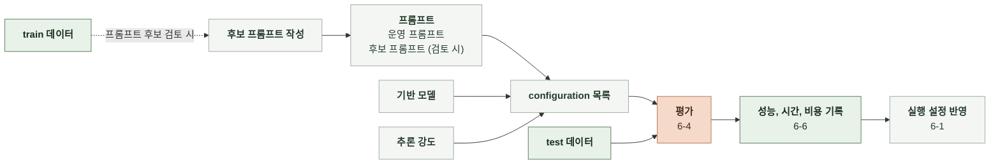

# 6-3 AI 정렬

사용자 기대와 운영 목표에 맞춰 AI 결과를 개선할 대상, 방법과 비교 기준을 정한다.

 

### 6-3-1 채팅 응답 생성

기반 모델과 추론 강도(effort), 프롬프트의 configuration별로 채팅 응답의 성능, 응답 시간과 비용을 비교해 운영에 사용할 configuration을 선택한다.

 

**1. 비교 설정**

| 항목 | 비교 범위 |
|---|---|
| 기반 모델 | 아래 후보 모델 목록 |
| 프롬프트 | 1. 모델 비교는 운영 프롬프트 1개  2. 프롬프트 후보 검토는 운영 프롬프트와 후보 프롬프트 N개 |
| 추론 강도 | `none`, `low`, `medium`, `high`, `xhigh` 중 해당 모델이 지원하는 값 |
| 데이터 | test 데이터 1개만 사용 |

| 공급자 | 후보 모델 |
|---|---|
| OpenAI | `gpt-6.1-sol`, `gpt-6-sol`, `gpt-6-luna` |
| Anthropic | `opus-5.5`, `sonnet-5.5`, `haiku-5.5` |
| Google | `gemini-3.8-flash`, `gemini-3.7-flash` |
| Alibaba | `qwen-3.8` |
| Z.ai | `glm-5.2` |
| Moonshot | `kimi-k3` |
| DeepSeek | `deepseek-v4.1-flash`, `deepseek-v4-pro-0813` |

 

**2. 평가 순서**

1. 비교할 프롬프트 버전, 기반 모델과 지원하는 effort로 configuration을 구성한다.
2. 각 configuration으로 채팅 응답을 생성하고 채점한다. configuration별 실제 호출 모델 ID와 호출 설정을 기록한다. ([6-4 AI 평가 방법](6-4-AI-EVALUATION-METHOD.md))
3. configuration별 설정과 성능, 시간, 비용을 표와 그래프로 비교한다. ([6-6 AI 성능 보고](6-6-AI-PERFORMANCE-REPORT.md))

 

**3. 개선 대상**

| 대상 | 확인 자료 | 확인할 문제 |
|---|---|---|
| 채팅 재미 점수 | train 데이터의 6-4 평가 결과 | 낮은 점수를 받은 응답에서 전개 반복, 인물의 성격과 말투 불일치, 세계관과 규칙 위반, 앞선 대화와의 모순 여부 |
| 본문 재생성률 | Langfuse 추적의 `is_regenerated` | 재생성된 턴의 이전 응답과 대화 맥락에서 반복되는 문제 |
| 채팅 응답 실패율 | Langfuse 추적, 오류 로그 | 본문 생성 호출이 실패한 원인 |
| 응답 시간 | Langfuse 추적의 호출 시간 | 본문 생성 호출의 지연 |
| 생성 비용 | Langfuse 추적의 사용량 | 본문 호출의 입력과 출력 토큰 사용량과 모델 단가 |

 

**4. 개선 방법**

프롬프트 후보는 train 사례를 보고 작성하고, 후보 프롬프트의 configuration을 운영 프롬프트의 configuration과 함께 test로 평가한다.

| 문제 | 개선 방법 |
|---|---|
| 채팅이 재미없음   (채팅 재미 점수가 낮음) | 프롬프트 수정   모델과 추론 강도 교체 |
| 재생성이 많음   (본문 재생성률 목표 초과) | 재생성된 턴의 문제를 찾아 프롬프트 수정   모델과 추론 강도 교체 |
| 응답이 느리거나 비쌈   (시간과 비용 상한 초과) | 프롬프트 길이 축소 모델과 추론 강도 교체 |

 

### 6-3-2 공통 개선 규칙

| 대상 | 규칙 |
|---|---|
| 모델 학습 | 모델을 직접 학습하지 않는다. |
| 파인튜닝 | 기존 모델의 가중치를 추가 학습으로 조정하지 않는다. |
| 에이전트 도입 | 성능 개선을 위해 에이전트 구조를 도입하지 않는다. |
| 모델 서빙 | 오픈소스 모델을 직접 배포해 서빙하지 않는다. |
| 파이프라인 구조 | 채팅 응답 생성의 호출 단계를 추가하거나 분리하지 않는다. |
