# 6-4 AI 평가 방법

채팅 AI의 성능, 시간과 비용을 평가하는 데이터와 채점 방법을 정한다.

 

### 6-4-1 채팅 응답 생성

평가 데이터와 채점 장치는 `manyak-ai/evaluation/`에 있다. ([6-5-1 채팅 응답 생성](6-5-AI-EVALUATION-IMPLEMENTATION.md#6-5-1-채팅-응답-생성))

 

**1. 평가 범위**

| 항목 | 내용 |
|---|---|
| 평가 대상 | configuration(프롬프트 버전, 모델, 추론 강도)의 출력 |
| 평가 단위 | 채팅 1개의 마지막 AI 답변 1개 |
| 생성 입력 | 1~N−1턴 대화 N번째 사용자 입력 응답 직전의 생성 설정 |
| 실행 경로 | 기준 AI 레포의 프롬프트 조립, 모델 호출과 출력 파서를 그대로 사용 사건과 엔딩 판정, 선택지, 이미지 호출 제외 |
| 생성 설정 | 프롬프트 버전, 모델과 추론 강도는 6-3-1의 configuration을 따름 |
| 채점 대상 | 생성한 답변을 붙인 N턴 대화 전체 |

 

**2. 데이터셋 샘플링**

| 제외 조건 |
|---|
| 일반 제작 스토리의 채팅 |
| 삭제된 채팅이나 스토리 |
| 제외 요청이 있는 채팅 |
| 1~2턴 채팅 |
| 마지막 턴 이후 7일이 지나지 않은 채팅 |
| 채점기 개발에 쓴 채팅 |
| 개발자 채팅 |
| 엔딩에 도달한 채팅 |
| 스토리 태그에 성인·가학 태그가 있는 채팅 |
| 생성 입력이 남아 있지 않거나 손상된 레거시 채팅(보존 기한이 지난 채팅 포함) |
| 안전성 문제가 있는 채팅 |
| 서비스 취지에서 벗어난 입력(탈옥, 현실 정치 등)이 있는 채팅 |
| 마지막 사용자 입력이 대화를 끝내는 채팅 |

 

**3. 평가 데이터**

| 항목 | train | test |
|---|---|---|
| 용도 | 프롬프트를 고칠 때 사례 확인 | grid search와 configuration 비교의 점수 |
| 위치 | `evaluation/datasets/train/` | `evaluation/datasets/test/` |
| 규모 | test에 넣지 않은 운영 수집본 계속 추가 | 60개 |
| 사례 열람 | 허용 | 점수와 집계만 확인 사례 원문은 보지 않음 |
| 변경 | 추가 가능 | 고정 입력 해시로 변경 여부 검사 새로 뽑으면 새 버전으로 만들고 이전 버전 결과와 비교하지 않음 |

<b>test 데이터셋 분포</b>

<table>
<tr>
<td>

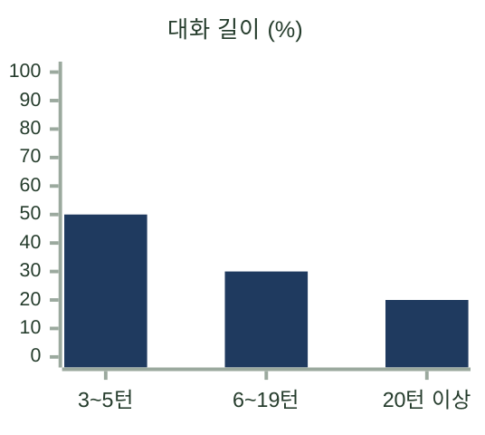

</td>
<td>

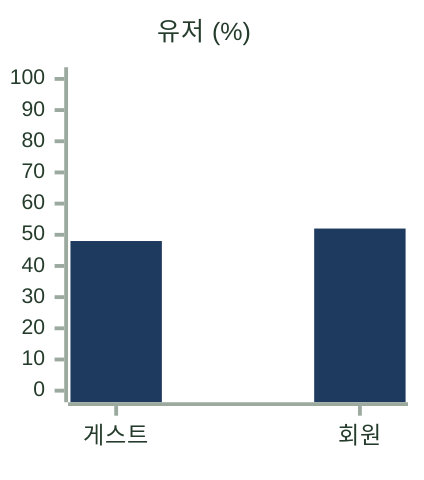

</td>
</tr>
<tr>
<td>

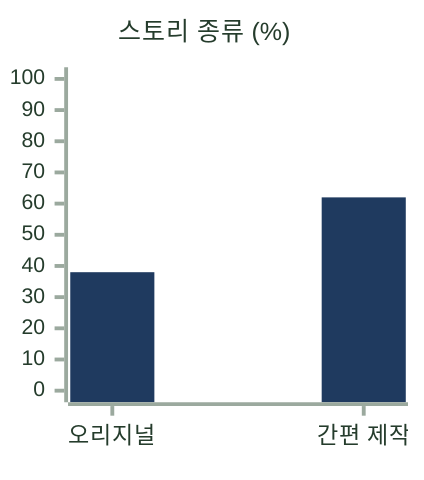

</td>
<td>

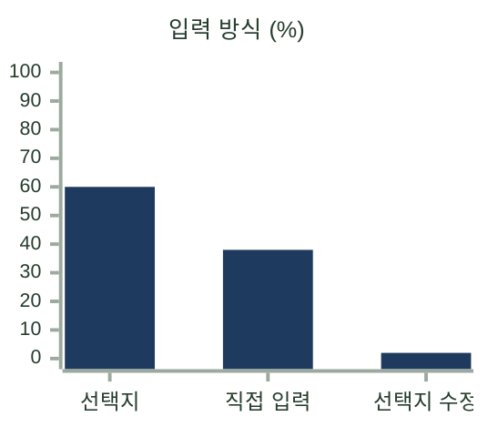

</td>
</tr>
<tr>
<td>

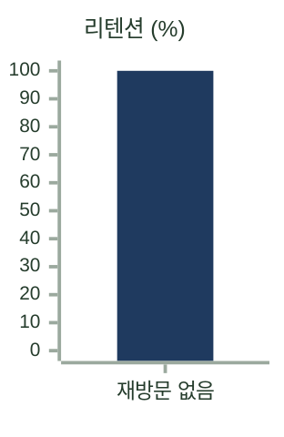

</td>
<td>

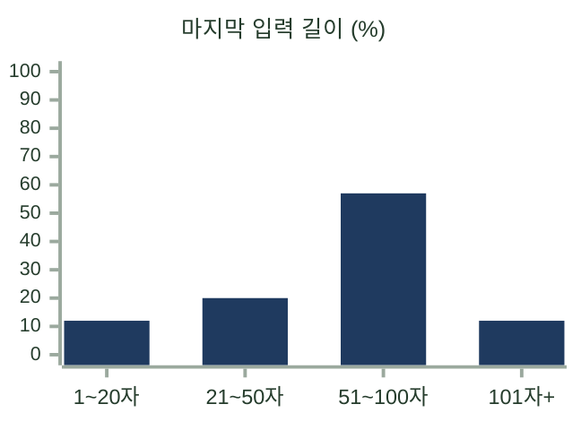

</td>
</tr>
<tr>
<td>

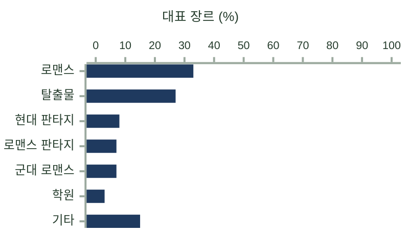

</td>
<td>

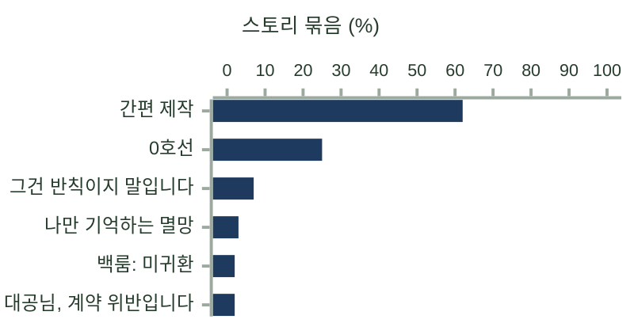

</td>
</tr>
<tr>
<td>

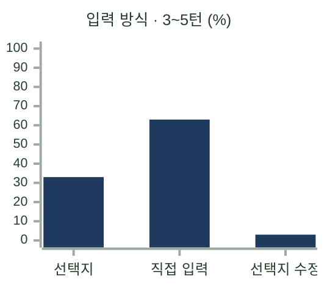

</td>
<td>

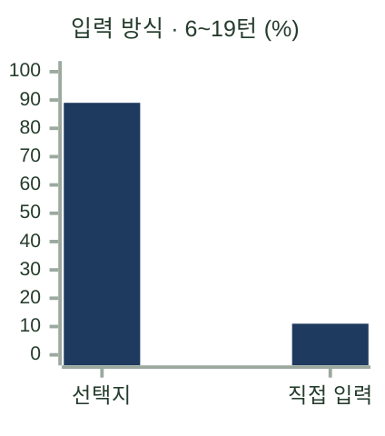

</td>
</tr>
<tr>
<td>

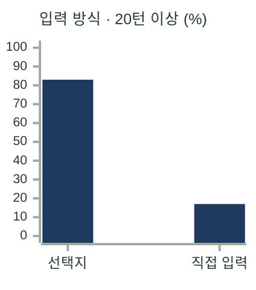

</td>
<td>

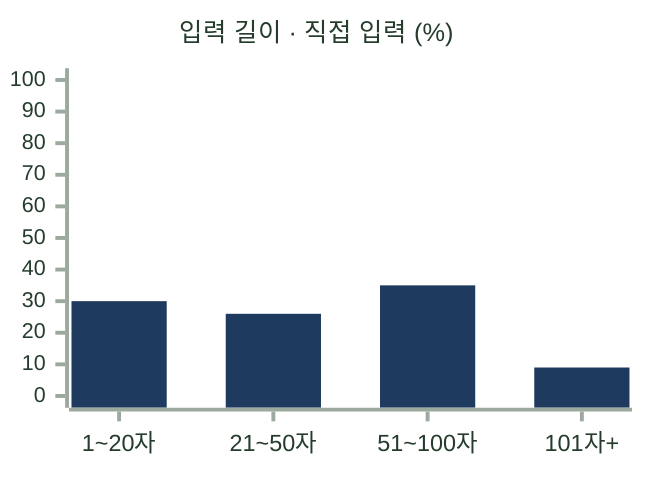

</td>
</tr>
<tr>
<td>

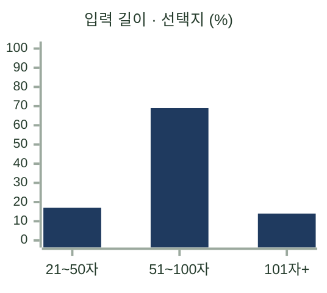

</td>
<td>

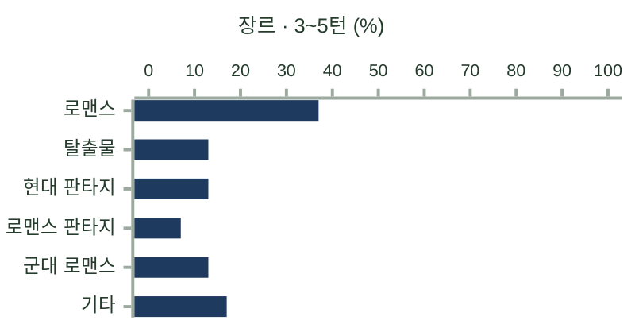

</td>
</tr>
<tr>
<td>

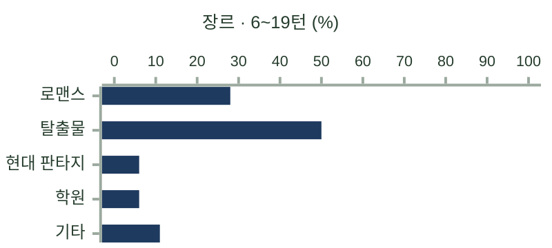

</td>
<td>

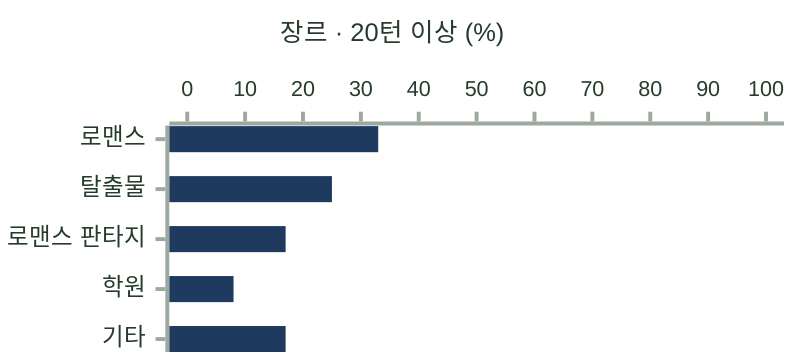

</td>
</tr>
</table>

 

**4. 평가 모델**

| 항목 | 내용 |
|---|---|
| 모델 | `gpt-5.6-sol`, 추론 강도 `medium` |
| 생성 모델과의 관계 | 생성 모델과 다른 모델 사용 |
| 채점 프롬프트 | chat-judge v0.2 고정본 `evaluation/` 안에 보관 |
| 채점 질문 | 마지막 정상 AI 응답까지 읽은 사용자가 다음 행동이나 대사를 이어가고 싶은 정도 완결된 이야기는 처음부터 결말까지의 재미와 여운 |
| 채점 입력 | `sample_id`, `prologue`, `turns` 태그와 인물 정보는 전달하지 않음 |
| 출력 | 0~100점 정수 1개 |
| 호출 방식 | 대화 1개당 별도 호출 다른 답변과 점수는 전달하지 않음 |
| 반복 | 답변당 독립 채점 3회 |
| 학습 | 평가 모델을 학습하지 않음 채점 프롬프트만 개선 |
| 사람 평가와의 비교 | 사람이 두 채팅 중 고른 쪽에 더 높은 점수를 준 쌍의 비율 v0.2는 72쌍에서 6회 평균 70.4% |

 

**5. 평가 지표**

채팅 응답 실패율과 본문 재생성률은 오프라인 평가에서 계산하지 않고 운영 기록으로 확인한다. ([2-2 운영 요구사항](2-2-OPERATION-REQUIREMENTS.md), [7-3 관측](7-3-OBSERVABILITY.md))

| 지표 | 계산 방법 | 2-2 목표 |
|---|---|---|
| 채팅 재미 점수 | 답변별 채점 3회의 평균을 구한 뒤 데이터셋 전체 입력의 평균 | — |
| 턴당 본문 생성 비용 | 입력별 최초 호출과 재생성의 API 비용 `cost_usd`를 합산한 뒤 평균 호출 비용이 하나라도 미측정이면 해당 입력의 총비용은 평균에서 빼고 개수를 함께 기록 | 목표 $0.01 이하, 상한 $0.03 |
| 본문 생성 시간 | 입력별 최초 요청 시작부터 재생성을 포함한 최종 종료까지의 p95 | 기록만 함 채팅 응답 완료 시간은 운영 기록으로 판정 |

 

**6. 반복과 실패 처리**

| 항목 | 처리 |
|---|---|
| 채점 변동 | 같은 답변의 채점 3회로 채점 점수의 변동만 확인 답변을 다시 생성했을 때의 편차는 측정하지 않음 |
| 빈 본문, 잘림 종료 | 같은 입력으로 1회 재생성해 채점 configuration별 재생성 횟수 기록 재생성 후에도 같으면 해당 입력은 실패로 처리 |
| 실패 | 재시도 후에도 생성이나 채점이 실패하면 해당 configuration의 평가 전체를 실패로 처리 성공한 입력만 모아 평균을 내지 않음 |
| 비교 조건 | 데이터셋, 채점 프롬프트, 채점 입력과 반복 횟수가 같은 결과끼리만 비교 |
