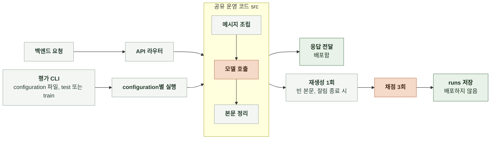

# 6-5 AI 평가 구현

채팅 AI의 평가 방법을 실행하는 프로그램의 구조와 동작을 정한다.

 

### 6-5-1 채팅 응답 생성

6-4-1의 평가 방법을 6-3-1의 configuration별로 실행하고 결과를 기록한다. 평가 프로그램은 운영 코드를 그대로 호출하며, 진입점만 평가 CLI로 분리한다. ([6-3-1 채팅 응답 생성](6-3-AI-ALIGNMENT.md#6-3-1-채팅-응답-생성), [6-4-1 채팅 응답 생성](6-4-AI-EVALUATION-METHOD.md#6-4-1-채팅-응답-생성))

 

**1. 위치와 배포**

| 항목 | 내용 |
|---|---|
| 평가 코드 | `manyak-ai/evaluation/` |
| 배포 | 배포 이미지에 포함하지 않음 Dockerfile은 `src`와 `prompt`만 복사 |
| 평가 데이터 | `evaluation/datasets/train/`, `evaluation/datasets/test/` Git 제외 |
| 실행 결과 | `evaluation/runs/` Git 제외 |
| 채점 프롬프트 | `evaluation/` 안에 고정본으로 보관 버전과 해시를 결과에 기록 |

 

**2. CLI 명령**

| 명령 | 동작 | 모델 호출 |
|---|---|---|
| `plan` | configuration 목록, 예상 생성과 채점 호출 수, 예상 비용 출력 | 없음 |
| `run` | configuration별 생성과 채점 실행 `--confirm-live`가 없으면 입력과 설정 검사만 함 | `--confirm-live`일 때만 |
| `report` | 저장된 결과로 configuration별 표와 그래프 생성 | 없음 |

 

**3. configuration 파일**

| 항목 | 내용 |
|---|---|
| 모델 | 6-3-1의 후보 모델 중 실행할 목록 |
| 추론 강도 | `none`, `low`, `medium`, `high`, `xhigh` 중 실행할 목록 |
| 프롬프트 | 실행할 프롬프트 버전 목록 |
| 데이터셋 | train 또는 test 데이터셋 이름 |
| configuration 생성 | 모델, 추론 강도와 프롬프트 버전의 모든 configuration 모델이 지원하지 않는 추론 강도는 제외 |

 

**4. 운영 코드 공유**

| 단계 | 호출할 운영 코드 |
|---|---|
| 메시지 조립 | `src/services/chat_assembler.py` |
| 본문 생성과 화자 정리 | `src/services/chat_llm.py` |
| 모델 호출 | `src/services/llm/` |

- 평가용으로 운영 코드를 복사하거나 다시 만들지 않는다.
- 모델과 추론 강도는 호출 설정 값으로만 바꾼다.
- 프롬프트 버전은 `prompt/`의 템플릿 파일을 교체해 적용한다.
- 사건과 엔딩 판정, 선택지, 이미지 호출은 실행하지 않는다.

 

**5. 실행 관리**

| 항목 | 처리 |
|---|---|
| 한도 | 동시 호출 수, 전체 호출 수와 전체 시간의 한도를 설정 파일에 지정 한도에 도달하면 새 호출을 시작하지 않고 중단 |
| 재개 | 같은 실행 ID로 다시 실행하면 완료된 생성과 채점 결과를 재사용 |
| 설정 검사 | 첫 실행의 설정 해시를 저장하고, 재개할 때 설정이 다르면 실행을 거부 |
| 재생성 | 빈 본문이나 잘림 종료면 같은 입력으로 1회 재생성 |

 

**6. 채점**

| 항목 | 내용 |
|---|---|
| 채점 설정 | 6-4-1의 평가 모델, 채점 프롬프트와 반복 횟수 사용 |
| 호출 경로 | Codex CLI `codex exec` 채점 1회마다 별도 세션으로 호출 |
| 채점 입력 | 생성한 답변을 붙인 N턴 대화의 `sample_id`, `prologue`, `turns` |
| 분리 | 생성과 채점을 별도 단계로 실행하고 실패를 각각 기록 |

 

**7. 기록**

| 항목 | 처리 |
|---|---|
| 저장 위치 | `evaluation/runs/<실행 ID>/<configuration ID>/` |
| 생성 결과 | 입력별 생성 답변, 요청과 응답 모델 이름, 추론 강도, 프롬프트 버전 |
| 채점 결과 | 입력별 채점 3회의 점수와 평균 |
| configuration 상태 | 6-4-1의 실패 기준에 따라 configuration별 평가 완료 또는 실패 상태 기록 ([6-4-1 채팅 응답 생성](6-4-AI-EVALUATION-METHOD.md#6-4-1-채팅-응답-생성)) |
| 호출 기록 | 실패한 최초 호출과 재생성을 포함해 호출별 시간과 비용을 각각 기록 입력별 전체 소요 시간과 합산 비용도 기록 |
| 요약 | configuration별 채팅 재미 점수, 턴당 본문 생성 비용, 본문 생성 시간 p95, 재생성 횟수와 실패 입력 수 |
| 버전 | 실행 ID, `manyak-ai` 커밋, 데이터셋 이름과 입력 해시, 채점 프롬프트 버전과 해시 |
