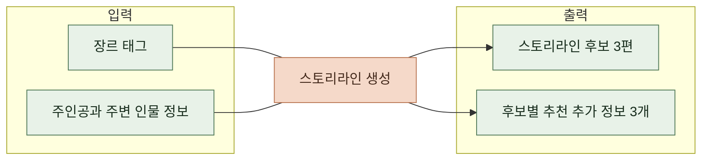
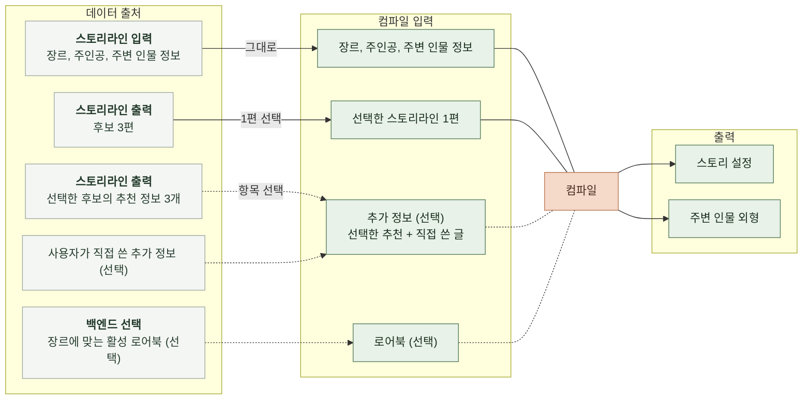
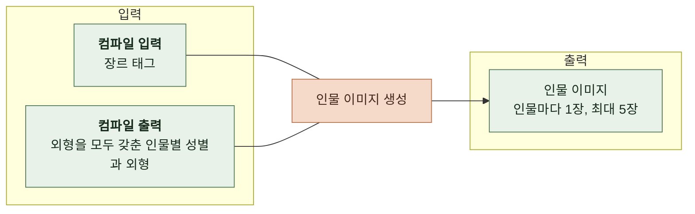
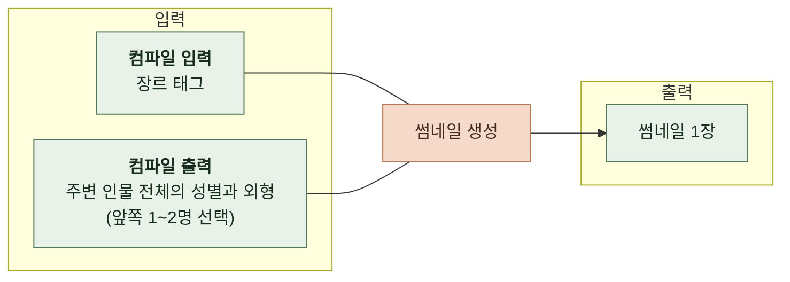
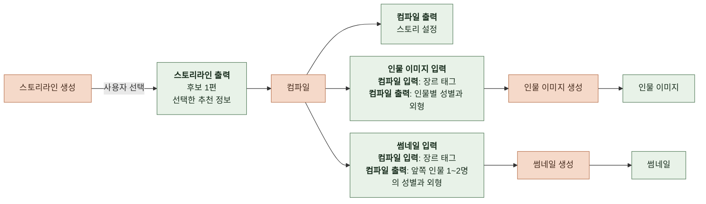

# 3. 태스크 정의

| 항목 | 값 |
|---|---|
| 적용 태스크 | 스토리라인 생성, 스토리 컴파일 |
| 버전 | 0.1 |

이 문서는 유저 스토리와 운영 요구사항을 바탕으로 입력, 출력, 품질 기준과 결과 종류를 정한다. ([유저 스토리](2-1-USER-STORY.md), [운영 요구사항](2-2-OPERATION-REQUIREMENTS.md))

처리 방식은 인지 구조와 소프트웨어 설계에서 정한다. ([4-1 인지 구조 설계](4-1-DESIGN-COGNITIVE-ARCHITECTURE.md), [4-2 소프트웨어 구조 설계](4-2-DESIGN-SOFTWARE-ARCHITECTURE.md))

필드 이름과 형식은 계약에서 정한다. ([5-CONTRACT.md](5-CONTRACT.md))

스토리라인 생성과 컴파일은 백엔드가 별도로 요청한다. 컴파일 요청 안에서는 스토리 설정을 만든 뒤 이미지를 생성한다. 이미지 생성은 별도 외부 요청이 아니며, 각 요청은 이전 요청의 상태를 저장하지 않는다. 스토리라인 생성은 이름을 입력한 주변 인물이 후보에 등장하는지 확인한다. 컴파일은 장르 태그, 주인공의 이름과 성별, 주변 인물의 이름을 입력값으로 유지한다. 비워 둔 이름과 성별은 AI가 정한다. 인물 이름은 서로 달라야 한다.

정답이 있는 평가 데이터는 아직 없다. 평가에 사용할 입력과 출력별 정답 기준은 미정이다. 평가 방법을 정하려면 이 기준이 필요하다. ([6-4 평가 방법](6-4-AI-EVALUATION-METHOD.md))

 

### 3-1 스토리라인 생성

태그와 인물 정보를 받아 사용자가 고를 후보를 만든다. 그림은 요청 한 건의 입력과 출력이다.

 

**입력**

| 항목 | 필수 여부 | 비어 있을 때 | 입력 제약 |
|---|---|---|---|
| 장르 태그 | 필수 | 해당 없음 | 별도 기재 없음 |
| 주인공의 이름, 성별, 특징 태그 | 항목은 필수, 값은 선택 | AI가 이야기에 맞게 정한다 | 특징 태그 최대 3개 |
| 주변 인물별 이름, 성별, 특징 태그 | 선택 | 주변 인물이 없으면 AI가 필요한 인물을 정한다 | 주변 인물 최대 5명   인물별 특징 태그 최대 3개   입력한 인물 이름이 서로 같으면 잘못된 입력으로 본다 |

 

**출력**

| 항목 | 용도 | 품질 기준 |
|---|---|---|
| 스토리라인 3편 | 사용자가 선택 화면에서 읽고 하나를 고른다 | 장르와 분위기를 반영한다   이름을 입력한 인물이 모두 등장하고, 후보마다 사건과 갈등이 다르다 |
| 후보별 추천 추가 정보 3개 | 사용자가 추가 정보 화면에서 선택한다 | 해당 후보의 설정을 구체화하며, 세 항목의 내용이 서로 다르다 |

 

**결과**

| 결과 | 조건 | 전달 및 확인 |
|---|---|---|
| 완료 | 줄거리 3편과 추천 추가 정보를 모두 갖췄다 | 사용자에게 결과를 전달한다 |
| 부분 완료 | 출력 형식은 갖췄지만 이름을 입력한 인물이 일부 후보에서 빠졌다 | 사용자에게 결과를 전달한다   운영자는 인물 누락이 발생한 후보 번호를 확인할 수 있어야 한다 |
| 실패 | 필요한 출력을 갖춘 후보 3편을 만들지 못했다 | 사용자에게 오류를 전달한다 |

 

### 3-2 컴파일

사용자가 후보 한 편을 고르면 백엔드가 컴파일을 요청한다. 장르 태그와 인물 정보도 다시 전달한다. 이 절은 스토리 설정과 인물 외형을 만드는 단계를 다룬다.

 

**입력**

| 항목 | 출처 | 필수 여부 | 비어 있을 때 |
|---|---|---|---|
| 선택한 스토리라인 | 사용자가 고른 후보 한 편 | 필수 | 해당 없음 |
| 추가 정보 | 사용자가 쓰거나 선택한 추천 정보 | 선택 | 스토리라인만으로 설정을 확장한다 |
| 장르, 주인공, 주변 인물 정보 | 스토리라인 생성에 사용한 입력 | 필수 | 스토리라인 생성 입력 참고 ([스토리라인 생성 입력](#3-1-스토리라인-생성)) |
| 로어북의 이름과 내용 | 백엔드가 장르 태그에 맞춰 고른 활성 로어북 | 선택 | 참고 자료 없이 설정을 확장한다 |

 

**출력**

| 항목 | 용도 | 품질 기준 |
|---|---|---|
| 제목, 한 줄 소개, 상세 소개 | 목록과 상세 화면에 표시한다 | 선택한 스토리라인의 내용을 소개한다 |
| 세계관 설정 | 매 채팅 턴의 배경으로 사용한다 | 스토리라인, 추가 정보, 로어북과 모순되지 않는다 |
| 주변 인물 설정 | AI가 인물을 연기할 때 사용한다 | 사용자가 입력한 주변 인물을 모두 포함한다   인물별 성격, 말투, 동기, 주인공을 대하는 태도를 담는다   입력한 이름을 유지한다 |
| 주인공 설정 | 사용자의 역할을 정한다 | 사용자가 1인칭으로 연기할 역할과 목표를 담는다 |
| 전개 규칙 | 채팅의 문체와 진행 방식을 정한다 | 장르와 분위기에 맞고 다른 설정과 모순되지 않는다 |
| 시작 설정의 이름, 시작 상황, 프롤로그 | 채팅 첫 화면에 표시한다 | 시작 상황과 주인공이 누구인지 알 수 있다 |
| 첫 선택지 3개 | 사용자가 첫 턴에서 고른다 | 시작 상황에 맞는 서로 다른 행동을 제시한다 |
| 주요 사건 3~5개 | 이야기의 진행을 판단할 때 사용한다 | 스토리라인의 사건을 따르며 순서대로 이어질 수 있다 |
| 엔딩 3개 | 이야기의 끝을 판정할 때 사용한다 | 좋은 결말, 보통 결말, 나쁜 결말을 하나씩 담는다   달성 조건은 주요 사건과 연결된다 |
| 주변 인물 외형 | 인물 이미지와 썸네일 생성에 사용한다 | 인물 설정과 일치하며 그림으로 표현할 만큼 구체적이다 |

설정과 외형을 만든 뒤 인물 이미지와 썸네일을 생성한다. 아래 기준은 이미지 생성까지 마친 컴파일 요청에 적용한다.

 

**결과**

| 결과 | 조건 | 전달 및 확인 |
|---|---|---|
| 완료 | 스토리 설정과 외형, 인물 이미지와 썸네일을 모두 갖췄다 | 사용자에게 결과를 전달한다 |
| 부분 완료 | 필수 스토리 설정은 갖췄지만 엔딩, 인물 외형, 인물 이미지 또는 썸네일이 일부 또는 전부 없다 | 사용자에게 결과를 전달한다   운영자는 누락된 항목과 이미지 생성 실패를 확인할 수 있어야 한다 |
| 실패 | 제목과 소개, 세계관 설정, 주변 인물 설정, 주인공 설정, 전개 규칙, 시작 설정, 첫 선택지, 주요 사건 중 필수 항목을 갖추지 못했다 | 사용자에게 오류를 전달한다 |

 

### 3-3 인물 이미지 생성

인물 이미지 생성은 컴파일 요청에 포함된다. 외형을 모두 갖춘 주변 인물마다 한 장씩 만든다. 일반적인 생성 실패는 해당 인물의 실패로만 처리한다. 인물 이미지 로직에서 예상하지 못한 오류가 발생하면 남은 생성을 취소하고 인물 이미지 목록을 비워서 반환할 수 있다.

 

**입력**

| 항목 | 출처 | 용도 |
|---|---|---|
| 장르 태그 | 컴파일 요청의 입력 | 이미지의 장르와 분위기를 정한다 |
| 생성 대상인 인물의 성별과 외형 | 컴파일 단계의 출력 중 외형을 모두 갖춘 인물 | 그 인물의 이미지를 만든다 |

 

**출력**

| 항목 | 용도 | 품질 기준 | 생성 장수 |
|---|---|---|---|
| 인물 이미지 | 채팅에서 해당 인물이 말할 때 표시한다 | 설정의 외형과 성별에 맞고 다른 인물과 구분된다 | 외형을 갖춘 주변 인물마다 1장, 최대 5장 |

 

**결과**

| 결과 | 조건 | 전달 및 확인 |
|---|---|---|
| 완료 | 생성 대상인 인물의 이미지를 모두 만들었다 | 스토리 설정과 함께 컴파일 결과로 반환한다 |
| 부분 완료 | 외형이 부족해 생략했거나 일부 인물의 이미지를 만들지 못했다 | 생성된 이미지와 인물별 실패 항목을 반환한다 |
| 실패 | 모든 대상의 이미지 생성에 실패했거나 인물 이미지 로직에서 예상하지 못한 오류가 발생했다 | 일반적인 실패는 인물별 실패 항목을 반환한다   예상하지 못한 오류는 빈 인물 이미지 목록을 반환한다   인물 이미지 없이 컴파일 결과를 전달한다 |

 

### 3-4 썸네일 생성

썸네일 생성은 컴파일 요청에 포함되며 인물 이미지와 별개로 만든다. 인물 이미지를 합성해서 만들지 않는다. 외형을 모두 갖춘 앞쪽 인물 1~2명을 사용하고, 해당하는 인물이 없으면 첫 번째 인물의 채워진 정보만 사용하며, 주변 인물이 없으면 장르 태그만 사용한다.

 

**입력**

| 항목 | 출처 | 용도 |
|---|---|---|
| 장르 태그 | 컴파일 요청의 입력 | 썸네일의 장르와 분위기를 정한다 |
| 주변 인물 전체의 성별과 외형 | 컴파일 단계의 출력 | 썸네일에 넣을 인물 1~2명을 고르고 그 외형을 그린다 |

 

**출력**

| 항목 | 용도 | 품질 기준 | 생성 장수 |
|---|---|---|---|
| 썸네일 | 스토리 목록과 상세 화면에 표시한다 | 장르와 분위기를 드러내며 선택한 인물의 외형과 일치한다 | 스토리마다 1장 |

 

**결과**

| 결과 | 조건 | 전달 및 확인 |
|---|---|---|
| 완료 | 썸네일을 만들었다 | 스토리 설정과 함께 컴파일 결과로 반환한다 |
| 실패 | 썸네일을 만들지 못했다 | 실패 사유를 담아 썸네일 없이 컴파일 결과를 전달한다   운영자는 실패를 확인할 수 있어야 한다 |

 

### 3-5 전체 흐름

컴파일 요청의 장르 태그와 컴파일이 만든 주변 인물 외형은 인물 이미지 생성과 썸네일 생성의 입력이 된다. 두 생성은 같은 요청 안에서 따로 진행하며, 결과는 스토리 설정과 함께 컴파일 결과로 묶인다. 이미지가 없어도 필수 스토리 설정을 갖췄으면 결과를 반환한다.

 

**예시**

아래 값은 작업을 설명하기 위한 가상 사례이며 평가 정답이 아니다. 정확한 요청과 응답 형식은 계약의 예시를 따른다. ([5 계약](5-CONTRACT.md))

| 단계 | 입력 예시 | 결과 예시 |
|---|---|---|
| 스토리라인 생성 | 장르 `판타지`, `미스터리`   주인공 `서린`(여성, 호기심 많음·꼼꼼함)   주변 인물 `도윤`(남성, 침착함·과묵함) | 서린과 도윤이 마법 도서관의 사라진 기록을 추적하는 후보를 포함해 스토리라인 3편과 후보별 추천 정보 3개를 만든다. |
| 컴파일 | 첫 번째 후보 선택   추가 정보 `지워진 기록은 지하 보관실에 흔적으로 남는다.` | 도서관 세계관, 서린과 도윤의 설정, 시작 장면, 첫 선택지 3개, 주요 사건과 엔딩을 만든다. |
| 이미지 생성 | 도윤의 성별과 외형   장르 `판타지`, `미스터리` | 도윤의 인물 이미지 1장과 스토리 썸네일 1장을 만든다. 이미지가 실패해도 스토리 설정은 반환한다. |
