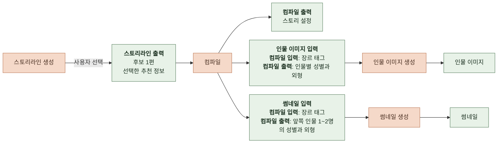
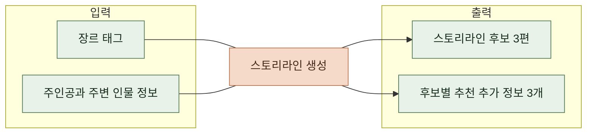
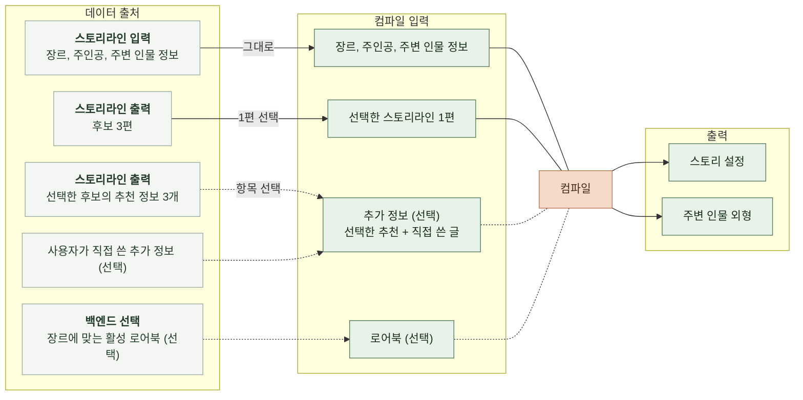
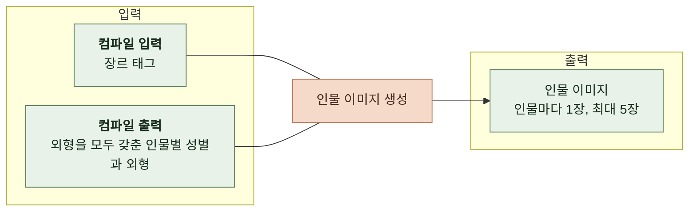
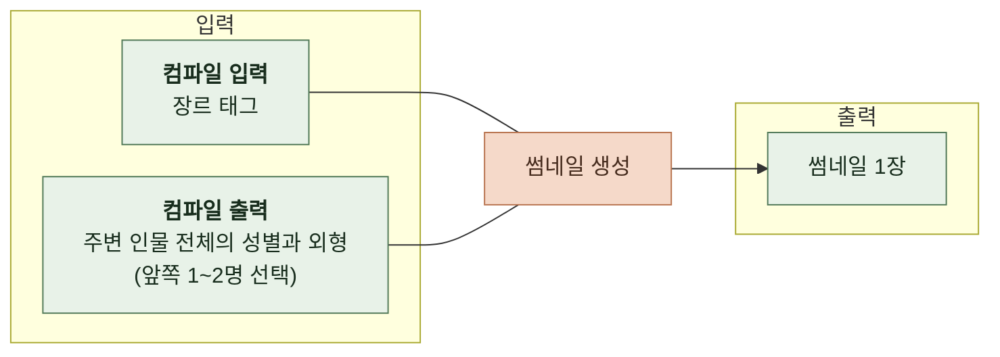

# 3. 태스크 정의

본 문서는 ([2-1 유저 스토리](2-1-USER-STORY.md), [2-2 운영 요구사항](2-2-OPERATION-REQUIREMENTS.md))에서 정의한 기대와 운영 조건을 수행 가능한 과제로 구체화한다.

스토리라인, 스토리 설정, 인물 이미지와 썸네일을 만드는 데 필요한 입력과 각 출력의 의미를 설명한다. 입력값의 반영 조건, 결과의 필수 항목과 허용 범위를 정하고, 대표 사례로 작업 간 연결을 보여준다.

 

### 3-1 전체 흐름

```mermaid
%%{init: {"flowchart": {"curve": "basis", "htmlLabels": true, "nodeSpacing": 24, "rankSpacing": 48}}}%%
flowchart LR
    A["스토리라인 생성"] -->|사용자 선택| B["<b>스토리라인 출력</b><br/>후보 1편<br/>선택한 추천 정보"]
    B --> C["컴파일"]
    C --> E["<b>컴파일 출력</b><br/>스토리 설정"]
    C --> F["<b>인물 이미지 입력</b><br/><b>컴파일 입력</b>: 장르 태그<br/><b>컴파일 출력</b>: 인물별 성별과 외형"]
    C --> G["<b>썸네일 입력</b><br/><b>컴파일 입력</b>: 장르 태그<br/><b>컴파일 출력</b>: 앞쪽 인물 1~2명의 성별과 외형"]
    F --> H["인물 이미지 생성"]
    G --> I["썸네일 생성"]
    H --> J["인물 이미지"]
    I --> K["썸네일"]
    classDef data fill:#E8F2E8,stroke:#527A59,color:#182D1D
    classDef task fill:#F5D9C9,stroke:#B97450,color:#452B1D
    class B,E,F,G,J,K data
    class A,C,H,I task
```

컴파일 요청의 장르 태그와 컴파일이 만든 주변 인물 외형은 인물 이미지 생성과 썸네일 생성의 입력이 된다. 두 생성은 같은 요청 안에서 따로 진행하며, 결과는 스토리 설정과 함께 컴파일 결과로 묶인다. 이미지가 없어도 필수 스토리 설정을 갖췄으면 결과를 반환한다.

 

### 3-2 스토리라인 생성

```mermaid
%%{init: {"flowchart": {"curve": "basis", "nodeSpacing": 24, "rankSpacing": 48}}}%%
flowchart LR
    subgraph IN["입력"]
        A["장르 태그"]
        B["주인공과 주변 인물 정보"]
    end
    T["스토리라인 생성"]
    subgraph OUT["출력"]
        C["스토리라인 후보 3편"]
        D["후보별 추천 추가 정보 3개"]
    end
    A --- T
    B --- T
    T --> C
    T --> D
    classDef data fill:#E8F2E8,stroke:#527A59,color:#182D1D
    classDef task fill:#F5D9C9,stroke:#B97450,color:#452B1D
    class A,B,C,D data
    class T task
```

태그와 인물 정보를 받아 사용자가 고를 후보를 만든다. 그림은 요청 한 건의 입력과 출력이다.

 

**1. 입력**

| 항목 | 필수 여부 | 비어 있을 때 | 입력 제약 |
|---|---|---|---|
| 장르 태그 | 필수 | 해당 없음 | 별도 기재 없음 |
| 주인공의 이름, 성별, 특징 태그 | 선택 | AI가 이야기에 맞게 정함 | 특징 태그 최대 3개 |
| 주변 인물별 이름, 성별, 특징 태그 | 선택 | 주변 인물이 없으면 AI가 필요한 인물을 정함 | 주변 인물 최대 5명   인물별 특징 태그 최대 3개   입력한 인물 이름이 서로 같으면 잘못된 입력으로 봄 |

 

**2. 출력**

| 항목 | 설명 |
|---|---|
| 스토리라인 3편 | 사용자가 하나를 고르는 이야기 전개 방향 후보 |
| 후보별 추천 추가 정보 3개 | 각 후보의 설정을 보강하도록 AI가 제안하는 문장   사용자가 골라 컴파일의 추가 정보로 넘김 |

 

### 3-3 컴파일

```mermaid
%%{init: {"flowchart": {"curve": "basis", "htmlLabels": true, "nodeSpacing": 24, "rankSpacing": 48}}}%%
flowchart LR
    subgraph SOURCE["데이터 출처"]
        A["<b>스토리라인 입력</b><br/>장르, 주인공, 주변 인물 정보"]
        B["<b>스토리라인 출력</b><br/>후보 3편"]
        C["<b>스토리라인 출력</b><br/>선택한 후보의 추천 정보 3개"]
        D["사용자가 직접 쓴 추가 정보 (선택)"]
        E["<b>백엔드 선택</b><br/>장르에 맞는 활성 로어북 (선택)"]
    end
    subgraph IN["컴파일 입력"]
        F["장르, 주인공, 주변 인물 정보"]
        G["선택한 스토리라인 1편"]
        H["추가 정보 (선택)<br/>선택한 추천 + 직접 쓴 글"]
        I["로어북 (선택)"]
    end
    T["컴파일"]
    subgraph OUT["출력"]
        J["스토리 설정"]
        K["주변 인물 외형"]
    end
    A -->|그대로| F
    B -->|1편 선택| G
    C -.->|항목 선택| H
    D -.-> H
    E -.-> I
    F --- T
    G --- T
    H -.- T
    I -.- T
    T --> J
    T --> K
    classDef data fill:#E8F2E8,stroke:#527A59,color:#182D1D
    classDef task fill:#F5D9C9,stroke:#B97450,color:#452B1D
    classDef source fill:#F4F6F4,stroke:#9BA99E,color:#253C2C
    class A,B,C,D,E source
    class F,G,H,I,J,K data
    class T task
```

사용자가 후보 한 편을 고르면 백엔드가 컴파일을 요청한다. 장르 태그와 인물 정보도 다시 전달한다. 이 절은 스토리 설정과 인물 외형을 만드는 단계를 다룬다.

 

**1. 입력**

| 항목 | 출처 | 필수 여부 | 비어 있을 때 |
|---|---|---|---|
| 선택한 스토리라인 | 사용자가 고른 후보 한 편 | 필수 | 해당 없음 |
| 추가 정보 | 사용자가 쓰거나 선택한 추천 정보 | 선택 | 스토리라인만으로 설정을 확장함 |
| 장르, 주인공, 주변 인물 정보 | 스토리라인 생성에 사용한 입력 | 필수 | 스토리라인 생성 입력 참고 ([3-2 태스크 정의](#3-2-스토리라인-생성)) |
| 로어북의 이름과 내용 | 백엔드가 장르 태그에 맞춰 고른 활성 로어북 | 선택 | 참고 자료 없이 설정을 확장함 |

 

**2. 출력**

설정과 외형을 만든 뒤 인물 이미지와 썸네일을 생성한다.

| 항목 | 설명 |
|---|---|
| 제목, 한 줄 소개, 상세 소개 | 스토리를 소개하는 글 세 가지 |
| 세계관 설정 | 이야기의 배경이 되는 세계와 상황을 적은 글 |
| 주변 인물 설정 | AI가 연기할 주변 인물마다 성격, 말투, 동기와 주인공을 대하는 태도를 적은 글 |
| 주인공 설정 | 사용자가 1인칭으로 연기할 인물의 역할과 목표를 적은 글 |
| 전개 규칙 | 채팅의 문체와 이야기를 진행하는 방식을 적은 글 |
| 시작 설정의 이름, 시작 상황, 프롤로그 | 채팅이 시작되는 장면의 이름과 상황, 첫 화면에 보여 줄 도입부 글 |
| 첫 선택지 3개 | 첫 턴에서 사용자가 고를 수 있는 행동 세 가지 |
| 주요 사건 3~5개 | 이야기를 엔딩 쪽으로 이끄는 사건   이름, 설명과 키 문장으로 구성됨 |
| 엔딩 3개 | 이야기의 결말   이름, 최소 턴 수, 달성 조건과 에필로그 가이드로 구성됨 |
| 주변 인물 외형 | 인물 이미지와 썸네일을 그리기 위한 인물별 외형   나이대, 체형, 얼굴, 머리 모양, 의상과 시각적 대표 특징으로 구성됨 |

 

### 3-4 인물 이미지 생성

```mermaid
%%{init: {"flowchart": {"curve": "basis", "htmlLabels": true, "nodeSpacing": 24, "rankSpacing": 48}}}%%
flowchart LR
    subgraph IN["입력"]
        A["<b>컴파일 입력</b><br/>장르 태그"]
        B["<b>컴파일 출력</b><br/>외형을 모두 갖춘 인물별 성별과 외형"]
    end
    T["인물 이미지 생성"]
    subgraph OUT["출력"]
        C["인물 이미지<br/>인물마다 1장, 최대 5장"]
    end
    A --- T
    B --- T
    T --> C
    classDef data fill:#E8F2E8,stroke:#527A59,color:#182D1D
    classDef task fill:#F5D9C9,stroke:#B97450,color:#452B1D
    class A,B,C data
    class T task
```

인물 이미지 생성은 컴파일 요청에 포함된다. 외형을 모두 갖춘 주변 인물마다 한 장씩 만든다. 일반적인 생성 실패는 해당 인물의 실패로만 처리한다. 인물 이미지 로직에서 예상하지 못한 오류가 발생하면 남은 생성을 취소하고 인물 이미지 목록을 비워서 반환할 수 있다.

 

**1. 입력**

| 항목 | 출처 | 용도 |
|---|---|---|
| 장르 태그 | 컴파일 요청의 입력 | 이미지의 장르와 분위기를 정함 |
| 생성 대상인 인물의 성별과 외형 | 컴파일 단계의 출력 중 외형을 모두 갖춘 인물 | 그 인물의 이미지를 만듦 |

 

**2. 출력**

| 항목 | 생성 장수 |
|---|---|
| 인물 이미지 | 외형을 갖춘 주변 인물마다 1장, 최대 5장 |

 

### 3-5 썸네일 생성

```mermaid
%%{init: {"flowchart": {"curve": "basis", "htmlLabels": true, "nodeSpacing": 24, "rankSpacing": 48}}}%%
flowchart LR
    subgraph IN["입력"]
        A["<b>컴파일 입력</b><br/>장르 태그"]
        B["<b>컴파일 출력</b><br/>주변 인물 전체의 성별과 외형<br/>(앞쪽 1~2명 선택)"]
    end
    T["썸네일 생성"]
    subgraph OUT["출력"]
        C["썸네일 1장"]
    end
    A --- T
    B --- T
    T --> C
    classDef data fill:#E8F2E8,stroke:#527A59,color:#182D1D
    classDef task fill:#F5D9C9,stroke:#B97450,color:#452B1D
    class A,B,C data
    class T task
```

썸네일 생성은 컴파일 요청에 포함되며 인물 이미지와 별개로 만든다. 인물 이미지를 합성해서 만들지 않는다. 외형을 모두 갖춘 앞쪽 인물 1~2명을 사용하고, 해당하는 인물이 없으면 첫 번째 인물의 채워진 정보만 사용하며, 주변 인물이 없으면 장르 태그만 사용한다.

 

**1. 입력**

| 항목 | 출처 | 용도 |
|---|---|---|
| 장르 태그 | 컴파일 요청의 입력 | 썸네일의 장르와 분위기를 정함 |
| 주변 인물 전체의 성별과 외형 | 컴파일 단계의 출력 | 썸네일에 넣을 인물 1~2명을 고르고 그 외형을 그림 |

 

**2. 출력**

| 항목 | 생성 장수 |
|---|---|
| 썸네일 | 스토리마다 1장 |

 

 

**3. 예시**

아래 값은 작업을 설명하기 위한 가상 사례이며 평가 정답이 아니다. 정확한 요청과 응답 형식은 계약의 예시를 따른다.

| 단계 | 입력 예시 | 결과 예시 |
|---|---|---|
| 스토리라인 생성 | 장르 `판타지`, `미스터리`   주인공 `서린`(여성, 호기심 많음, 꼼꼼함)   주변 인물 `도윤`(남성, 침착함, 과묵함) | 서린과 도윤이 마법 도서관의 사라진 기록을 추적하는 후보를 포함해 스토리라인 3편과 후보별 추천 정보 3개를 만듦 |
| 컴파일 | 첫 번째 후보 선택   추가 정보 `지워진 기록은 지하 보관실에 흔적으로 남는다.` | 도서관 세계관, 서린과 도윤의 설정, 시작 장면, 첫 선택지 3개, 주요 사건과 엔딩을 만듦 |
| 이미지 생성 | 도윤의 성별과 외형   장르 `판타지`, `미스터리` | 도윤의 인물 이미지 1장과 스토리 썸네일 1장을 만듦   이미지가 실패해도 스토리 설정은 반환함 |
