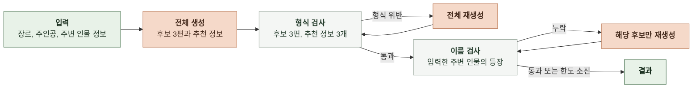
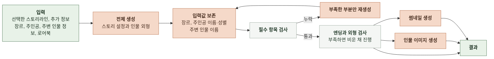

# 4-1 인지 구조 설계

| 항목 | 값 |
|---|---|
| 적용 태스크 | 스토리라인 생성, 스토리 컴파일 |
| 버전 | 0.1 |

이 문서는 태스크의 입력을 결과로 만드는 판단 구조를 정한다. ([3번 태스크](3-TASK-DEFINITION.md))

구성 요소와 요청 처리 순서는 소프트웨어 설계에서 정한다. ([4-2 소프트웨어 구조 설계](4-2-DESIGN-SOFTWARE-ARCHITECTURE.md))

모델과 설정값은 AI 실행에서 정한다. ([6-1 AI 실행](6-1-AI-EXECUTION.md))

 

### 4-1-1 판단 단계

| 로직 | 기본 생성 | 검사 | 보완 | 종료 |
|---|---|---|---|---|
| 스토리라인 생성 | 후보 3편과 후보별 추천 정보 생성 | 형식과 입력 인물의 등장 여부 확인 | 형식은 전체 재생성   인물 누락은 해당 후보만 재생성 | 완료, 부분 완료 또는 실패 |
| 컴파일 | 스토리 설정과 인물 외형 생성 | 입력값 보존, 필수 항목, 엔딩과 외형 확인 | 부족한 블록이나 인물 필드만 재생성 | 완료, 부분 완료 또는 실패 |
| 이미지 생성 | 인물 이미지와 썸네일 생성 | 이미지별 성공 여부 확인 | 별도 보완 호출 없음 | 성공 결과와 일반적인 실패 항목을 포함   예상하지 못한 인물 이미지 오류는 빈 목록으로 반환 |

 

**스토리라인 생성**

- 형식이 어긋나면 후보 3편을 다시 생성한다
- 이름을 입력한 주변 인물이 빠지면 해당 후보만 다시 생성한다
- 한도 안에 해결하지 못해도 형식이 유효하면 부분 완료로 반환한다

 

**컴파일**

- 입력한 장르, 주인공의 이름과 성별, 주변 인물의 이름은 코드가 유지한다
- 필수 항목이 비면 해당 부분만 다시 생성하며 한도 안에 채우지 못하면 실패한다
- 엔딩이나 외형이 부족하면 부분 완료로 처리한다
- 외형이 부족한 인물의 이미지는 만들지 않는다

 

### 4-1-2 모델과 코드의 책임

| 맡는 쪽 | 맡는 일 |
|---|---|
| 모델 | 이야기 내용, 후보 간 차이, 문체, 인물의 성격과 외형, 사건과 엔딩 구성 |
| 코드 | 개수와 형식 검사, 필수 항목 확인, 입력값 보존, id 부여, 통글 변환, 이미지 호출과 결과 조립 |

코드는 내용을 채우지 않는다. 정해진 입력값과 id 처럼 코드로 확정할 수 있는 값만 바로잡는다. 필수 항목이 끝내 비면 임의로 채우지 않고 실패로 처리한다.

 

### 4-1-3 상태와 지식

| 대상 | 관리 주체 | 기준 |
|---|---|---|
| AI 요청 상태 | AI 서버 | 응답을 마치면 저장하지 않는다 |
| 사용자와 제작 진행 상태 | 백엔드 | 선택한 후보와 저장된 스토리를 관리한다 |
| 컴파일 입력 | 백엔드 | 컴파일에 필요한 값을 요청마다 모두 전달한다 |
| 로어북 | 백엔드 | 장르에 맞는 항목을 골라 요청에 포함한다 |
| 로어북 사용 | AI 서버 | 프롬프트 참고 자료로만 사용하며 따로 검색하거나 저장하지 않는다 |

 

### 4-1-4 경계와 종료

| 단계 | 반복 한도 | 성공 | 한도 소진 |
|---|---|---|---|
| 스토리라인 형식 재생성 | 최대 2회 | 완료 | 실패 |
| 스토리라인 인물 누락 보완 | 최대 2회 | 완료 | 부분 완료 |
| 컴파일 필수 항목 보완 | 최대 2회 | 완료 | 실패 |
| 컴파일 엔딩 보완 | 필수 항목 보완에 포함 | 완료 | 엔딩이 없는 부분 완료 |
| 컴파일 외형 보완 | 필수 항목 보완에 포함 | 완료 | 해당 인물 이미지가 없는 부분 완료 |
| 이미지 생성 | 코드의 별도 재호출 없음 | 해당 이미지 생성 | 일반적인 실패는 해당 이미지만 실패   인물 이미지 로직의 예상하지 못한 오류는 인물 이미지 목록 전체를 비움 |

시간 한도와 계층별 재시도 책임은 계약과 오류 처리의 복구 기준을 따른다. ([5-6 시간과 복구](5-CONTRACT.md#5-6-시간과-복구), [7-1-3 복구 구분](7-1-ERROR-HANDLING.md#7-1-3-복구-구분))

 

### 4-1-5 접근과 근거

| 방식 | 사용 여부 | 이유 |
|---|---|---|
| 전체 생성 후 부분 보완 | 사용 | 이야기 전체의 일관성을 유지하면서 부족한 부분만 다시 만들 수 있다 |
| 인물 이미지와 썸네일의 개별 생성 | 사용 | 일반적인 실패는 이미지별로 분리한다   인물 이미지 로직의 예상하지 못한 오류는 인물 이미지 목록을 비우고 스토리 설정은 반환한다 |
| 여러 단계로 나눈 텍스트 생성 | 사용하지 않음 | 이야기 요소를 따로 만들면 서로 어긋나고 호출이 늘어난다 |
| RAG | 사용하지 않음 | 로어북은 백엔드가 요청에 포함하며 AI 서버가 검색할 저장소가 없다 |
| 에이전트와 도구 호출 | 사용하지 않음 | 외부 상태를 살피거나 도구로 판단할 작업이 없다 |
| 별도 모델을 이용한 결과 판정 | 사용하지 않음 | 형식과 필수 항목은 코드로 확인할 수 있다 |

스토리라인과 컴파일은 첫 호출에서 전체 결과를 만든다. 검사에 실패한 경우에만 전체 또는 일부를 다시 생성한다.
