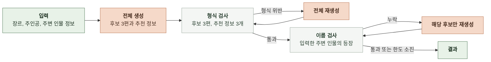
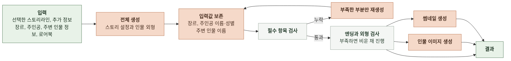
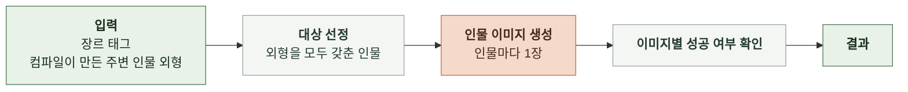
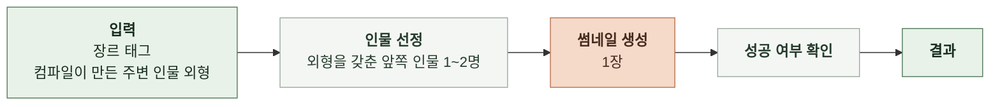

# 4-1 인지 구조 설계

본 문서는 ([3 태스크 정의](3-TASK-DEFINITION.md))에서 정의한 입력으로 출력을 만드는 인지 구조를 설계한다.

생성과 검증을 어떤 단계로 나누고, 각 단계에서 모델과 코드가 무엇을 담당하는지 정한다.

 

### 4-1-1 서브태스크의 인지 구조

| 로직 | 기본 생성 | 검사 | 보완 |
|---|---|---|---|
| 스토리라인 생성 | 후보 3편과 후보별 추천 정보 생성 | 형식과 입력 인물의 등장 여부 확인 | 형식은 전체 재생성   인물 누락은 해당 후보만 재생성 |
| 컴파일 | 스토리 설정과 인물 외형 생성 | 입력값 보존, 필수 항목, 엔딩과 외형 확인 | 부족한 블록이나 인물 필드만 재생성 |
| 이미지 생성 | 인물 이미지와 썸네일 생성 | 이미지별 성공 여부 확인 | 별도 보완 호출 없음 |

 

**1. 스토리라인 생성**

```mermaid
%%{init: {"flowchart": {"curve": "basis", "htmlLabels": true, "nodeSpacing": 24, "rankSpacing": 48}}}%%
flowchart LR
    A["<b>입력</b><br/>장르, 주인공, 주변 인물 정보"] --> B["<b>전체 생성</b><br/>후보 3편과 추천 정보"]
    B --> C["<b>형식 검사</b><br/>후보 3편, 추천 정보 3개"]
    C -->|형식 위반| D["<b>전체 재생성</b>"]
    D --> C
    C -->|통과| E["<b>이름 검사</b><br/>입력한 주변 인물의 등장"]
    E -->|누락| F["<b>해당 후보만 재생성</b>"]
    F --> E
    E -->|통과 또는 한도 소진| G["<b>결과</b>"]
    classDef data fill:#E8F2E8,stroke:#527A59,color:#182D1D
    classDef task fill:#F5D9C9,stroke:#B97450,color:#452B1D
    classDef check fill:#F4F6F4,stroke:#9BA99E,color:#253C2C
    class A,G data
    class B,D,F task
    class C,E check
```

- 형식이 어긋나면 후보 3편을 다시 생성한다
- 이름을 입력한 주변 인물이 빠지면 해당 후보만 다시 생성한다
- 한도 안에 해결하지 못해도 형식이 유효하면 부분 완료로 반환한다

 

**2. 스토리 컴파일**

```mermaid
%%{init: {"flowchart": {"curve": "basis", "htmlLabels": true, "nodeSpacing": 24, "rankSpacing": 48}}}%%
flowchart LR
    A["<b>입력</b><br/>선택한 스토리라인, 추가 정보<br/>장르, 주인공, 주변 인물 정보, 로어북"] --> B["<b>전체 생성</b><br/>스토리 설정과 인물 외형"]
    B --> C["<b>입력값 보존</b><br/>장르, 주인공 이름·성별<br/>주변 인물 이름"]
    C --> D["<b>필수 항목 검사</b>"]
    D -->|누락| E["<b>부족한 부분만 재생성</b>"]
    E --> C
    D -->|통과| F["<b>엔딩과 외형 검사</b><br/>부족하면 비운 채 진행"]
    F --> I["<b>인물 이미지 생성</b>"]
    F --> J["<b>썸네일 생성</b>"]
    F --> K["<b>결과</b>"]
    I --> K
    J --> K
    classDef data fill:#E8F2E8,stroke:#527A59,color:#182D1D
    classDef task fill:#F5D9C9,stroke:#B97450,color:#452B1D
    classDef check fill:#F4F6F4,stroke:#9BA99E,color:#253C2C
    class A,K data
    class B,C,E,I,J task
    class D,F check
```

- 입력한 장르, 주인공의 이름과 성별, 주변 인물의 이름은 코드가 유지한다
- 필수 항목이 비면 해당 부분만 다시 생성하며 한도 안에 채우지 못하면 실패한다
- 엔딩이나 외형이 부족하면 부분 완료로 처리한다
- 외형이 부족한 인물의 이미지는 만들지 않는다

 

**3. 인물 이미지 생성**

```mermaid
%%{init: {"flowchart": {"curve": "basis", "htmlLabels": true, "nodeSpacing": 24, "rankSpacing": 48}}}%%
flowchart LR
    A["<b>입력</b><br/>장르 태그<br/>컴파일이 만든 주변 인물 외형"] --> B["<b>대상 선정</b><br/>외형을 모두 갖춘 인물"]
    B --> C["<b>인물 이미지 생성</b><br/>인물마다 1장"]
    C --> D["<b>이미지별 성공 여부 확인</b>"]
    D --> E["<b>결과</b>"]
    classDef data fill:#E8F2E8,stroke:#527A59,color:#182D1D
    classDef task fill:#F5D9C9,stroke:#B97450,color:#452B1D
    classDef check fill:#F4F6F4,stroke:#9BA99E,color:#253C2C
    class A,E data
    class C task
    class B,D check
```

- 외형을 모두 갖춘 주변 인물마다 이미지를 한 장씩 만든다
- 실패한 이미지는 다시 생성하지 않는다

 

**4. 썸네일 생성**

```mermaid
%%{init: {"flowchart": {"curve": "basis", "htmlLabels": true, "nodeSpacing": 24, "rankSpacing": 48}}}%%
flowchart LR
    A["<b>입력</b><br/>장르 태그<br/>컴파일이 만든 주변 인물 외형"] --> B["<b>인물 선정</b><br/>외형을 갖춘 앞쪽 인물 1~2명"]
    B --> C["<b>썸네일 생성</b><br/>1장"]
    C --> D["<b>성공 여부 확인</b>"]
    D --> E["<b>결과</b>"]
    classDef data fill:#E8F2E8,stroke:#527A59,color:#182D1D
    classDef task fill:#F5D9C9,stroke:#B97450,color:#452B1D
    classDef check fill:#F4F6F4,stroke:#9BA99E,color:#253C2C
    class A,E data
    class C task
    class B,D check
```

- 외형을 모두 갖춘 앞쪽 인물 1~2명으로 한 장을 만든다
- 주변 인물이 없으면 장르 태그만 쓴다
- 인물 이미지와 별개로 만들며 인물 이미지를 합성하지 않는다
- 실패하면 다시 만들지 않고 썸네일만 실패로 처리한다

 

### 4-1-2 모델과 코드의 책임

코드는 내용을 채우지 않는다. 정해진 입력값과 id 처럼 코드로 확정할 수 있는 값만 바로잡는다. 재생성 후에도 필수 항목을 채우지 못했다면 실패로 처리한다.

| 맡는 쪽 | 맡는 일 |
|---|---|
| 모델 | 이야기 내용, 후보 간 차이, 문체, 인물의 성격과 외형, 사건과 엔딩 구성 |
| 코드 | 개수와 형식 검사, 필수 항목 확인, 입력값 보존, id 부여, 마크다운 본문 변환, 이미지 호출과 결과 조립 |
