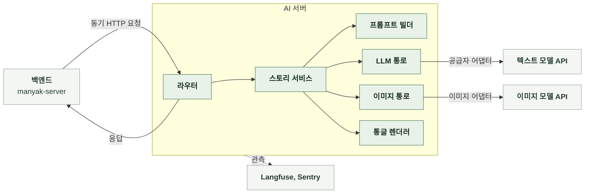
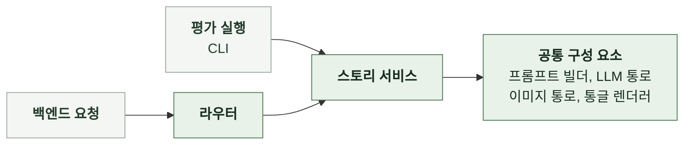

# 4-2 소프트웨어 구조 설계

| 항목 | 값 |
|---|---|
| 적용 태스크 | 스토리라인 생성, 스토리 컴파일 |
| 버전 | 0.1 |

이 문서는 인지 구조를 실행할 구성 요소와 데이터 흐름을 정한다. ([4-1 인지 구조](4-1-DESIGN-COGNITIVE-ARCHITECTURE.md))

파일과 함수 구조는 소프트웨어 구현에서 정한다. ([6-2 소프트웨어 구현](6-2-SOFTWARE-IMPLEMENTATION.md))

 

### 4-2-1 시스템 경계

| 경계 밖 | 역할 | 연결 방식 |
|---|---|---|
| 백엔드 | 사용자와 제작 진행 관리 스토리와 이미지 저장 | 동기 HTTP 요청 대기 한도와 재요청 관리 |
| 텍스트 모델 API | 스토리라인과 컴파일 본문 생성 | 공급자 어댑터로 호출 |
| 이미지 모델 API | 인물 이미지와 썸네일 생성 | 이미지 어댑터로 호출 |
| Langfuse, Sentry | 호출, 비용과 오류 기록 | 기록 실패가 요청 결과에 영향 없음 |

AI 서버는 백엔드 요청만 받는다. 저장소와 큐를 두지 않으며 요청 상태를 남기지 않는다. 백엔드가 저장과 재요청을 관리한다.

 

### 4-2-2 요청 처리 흐름

| 로직 | 처리 순서 |
|---|---|
| 스토리라인 생성 | 요청 수신 스키마 검증 프롬프트 조립 LLM 호출 결과 검증과 보완 응답 조립 |
| 컴파일 | 요청 수신 스키마 검증 프롬프트 조립 LLM 호출 결과 검증과 보완 통글 변환 응답 조립 |
| 이미지 생성 | 컴파일 결과 검증 인물 이미지와 썸네일 동시 생성 결과별 성공과 실패 수집 컴파일 응답 조립 |

인물 이미지와 썸네일은 동시에 만든다. 일반적인 생성 실패는 이미지별로 처리한다. 인물 이미지 로직에서 예상하지 못한 오류가 발생하면 인물 이미지 목록을 비우며, 썸네일과 컴파일 결과는 반환한다.

 

### 4-2-3 구성 요소

| 구성 요소 | 입력 | 출력 | 책임 |
|---|---|---|---|
| 라우터 | HTTP 요청 | 내부 요청 또는 HTTP 응답 | 스키마 검증과 요청 전달 |
| 스토리 서비스 | 검증한 요청 | 응답 데이터 | 생성부터 결과 조립까지 순서 관리 |
| 프롬프트 빌더 | 태스크 입력과 참고 정보 | 프롬프트 | 태스크별 프롬프트 조립 |
| LLM 통로 | 프롬프트와 모델 설정 | 텍스트와 호출 메타데이터 | 공급자 선택과 텍스트 모델 호출 |
| 통글 렌더러 | 세분 항목 JSON | 통글 | 세분 항목을 최종 본문으로 변환 |
| 이미지 통로 | 장르와 인물 외형 | 이미지 결과 | 이미지 모델 호출 실패 시 이미지 예외 발생 |
| 관측 계층 | 호출 기록과 오류 | 추적 정보와 오류 보고 | 비용과 실행 상태 기록 |

스토리 서비스만 전체 순서를 관리한다. 다른 구성 요소는 요청 상태를 저장하지 않는다.

 

### 4-2-4 내부 데이터 모델

| 데이터 | 내부 형식 | 변환 책임 |
|---|---|---|
| 스토리라인 모델 응답 | 텍스트 | LLM 통로가 반환 스토리 서비스가 JSON으로 파싱하고 검증한 뒤 번호 부여 |
| 컴파일 모델 응답 | 텍스트 | LLM 통로가 반환 스토리 서비스가 JSON으로 파싱하고 검증 |
| 컴파일 최종 본문 | 통글 | 통글 렌더러가 세분 항목을 변환 |
| 이미지 호출 결과 | 이미지 데이터 또는 이미지 예외 | 이미지 통로가 성공 결과를 반환하거나 실패 예외를 발생시킴 스토리 서비스가 컴파일 응답 형식으로 변환 |
| 호출 기록 | 모델, 프롬프트 버전, 토큰 수, 재호출 수 | 각 통로가 수집 스토리 서비스가 응답에 포함 |

라우터는 외부 요청을 내부 입력으로 바꾼다. 스토리 서비스는 내부 결과를 외부 응답으로 조립한다. 외부 필드의 이름과 형식은 계약에서 정한다. ([5 계약](5-CONTRACT.md))

 

### 4-2-5 상태와 자원

| 대상 | 기준 |
|---|---|
| 요청 상태 | 응답 후 삭제 |
| 중복 요청 | 요청마다 실행 중복 방지는 백엔드가 담당 |
| SDK 클라이언트 | 프로세스에서 재사용 |
| 이미지 동시 실행 | 인물 이미지 최대 5건과 썸네일 1건 동시 실행 |
| 호출 취소 | 백엔드 연결이 끝나도 진행 중인 모델 호출은 유지 |
| 프롬프트와 모델 등록 정보 | 서버가 시작할 때 읽는 설정 제품 상태로 저장하지 않음 |

취소되지 않은 모델 호출에는 비용이 발생한다.

 

### 4-2-6 공통 실행 경로

| 경로 | 진입점 | 공통 실행 | 현재 상태 |
|---|---|---|---|
| 운영 | 라우터 | 스토리 서비스 | 구현 |
| 평가 | 평가 CLI | 스토리 서비스 | 미구현 |

운영과 평가는 같은 스토리 서비스를 사용해 같은 프롬프트와 모델 호출 코드를 실행한다.

개발용 스크립트의 실행 경로는 아직 통일되지 않았다. 일부는 HTTP로 요청하고, 일부는 스토리 서비스를 직접 호출한다. 결과를 모아 기록하는 기능도 없다. 평가 기준은 평가 방법, 실행 경로는 평가 구현에서 정한다. ([6-4 평가 방법](6-4-AI-EVALUATION-METHOD.md), [6-5 평가 구현](6-5-AI-EVALUATION-IMPLEMENTATION.md))
