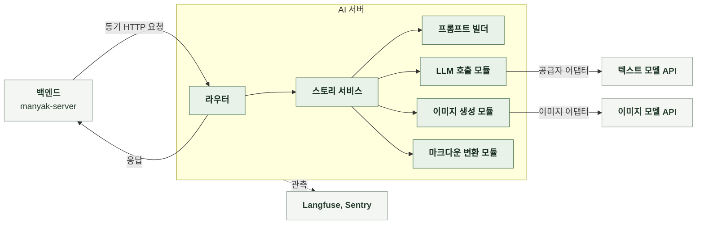
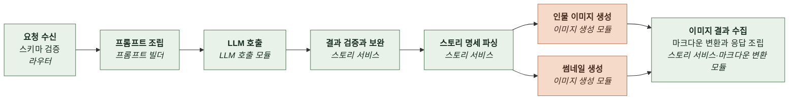

# 4-2 소프트웨어 구조 설계

본 문서는 ([4-1 인지 구조 설계](4-1-DESIGN-COGNITIVE-ARCHITECTURE.md))에서 정의한 인지 구조를 소프트웨어 구성 요소와 데이터 흐름으로 구체화한다.

백엔드, AI 서버와 외부 모델 사이의 책임 경계를 구분하고, 요청이 어떤 구성 요소를 거쳐 응답으로 완성되는지 설명한다. 구성 요소별 입력과 출력, 내부 데이터 변환, 상태와 자원 관리를 정한다.

 

### 4-2-1 시스템 경계

| 경계 밖 | 역할 | 연결 방식 |
|---|---|---|
| 백엔드 | 사용자와 제작 진행 관리 스토리와 이미지 저장 | 동기 HTTP 요청 대기 한도와 재요청 관리 |
| 텍스트 모델 API | 스토리라인과 컴파일 본문 생성 | 공급자 어댑터로 호출 |
| 이미지 모델 API | 인물 이미지와 썸네일 생성 | 이미지 어댑터로 호출 |

```mermaid
%%{init: {"flowchart": {"curve": "basis", "htmlLabels": true, "nodeSpacing": 24, "rankSpacing": 48}}}%%
flowchart LR
    B["<b>백엔드</b><br/>manyak-server"] -->|동기 HTTP 요청| R["<b>라우터</b>"]
    subgraph AI["AI 서버"]
        R --> S["<b>스토리 서비스</b>"]
        S --> P["<b>프롬프트 빌더</b>"]
        S --> L["<b>LLM 호출 모듈</b>"]
        S --> I["<b>이미지 생성 모듈</b>"]
        S --> T["<b>마크다운 변환 모듈</b>"]
    end
    L -->|공급자 어댑터| M["<b>텍스트 모델 API</b>"]
    I -->|이미지 어댑터| G["<b>이미지 모델 API</b>"]
    AI -.->|관측| O["<b>Langfuse, Sentry</b>"]
    R -->|응답| B
    classDef ext fill:#F4F6F4,stroke:#9BA99E,color:#253C2C
    classDef comp fill:#E8F2E8,stroke:#527A59,color:#182D1D
    class B,M,G,O ext
    class R,S,P,L,I,T comp
```

AI 서버는 백엔드 요청만 받는다. 저장소와 큐를 두지 않으며 요청 상태를 남기지 않는다. 백엔드가 저장과 재요청을 관리한다.

 

### 4-2-2 요청 처리 흐름

요청은 라우터에서 검증한 뒤 스토리 서비스가 순서대로 처리한다. 각 단계의 담당 구성 요소는 노드 아래에 적었다.

 

**1. 스토리라인 생성**

```mermaid
%%{init: {"flowchart": {"curve": "basis", "htmlLabels": true, "nodeSpacing": 24, "rankSpacing": 48}}}%%
flowchart LR
    A["<b>요청 수신</b><br/>스키마 검증<br/><i>라우터</i>"] --> B["<b>프롬프트 조립</b><br/><i>프롬프트 빌더</i>"]
    B --> C["<b>LLM 호출</b><br/><i>LLM 호출 모듈</i>"]
    C --> D["<b>결과 검증과 보완</b><br/><i>스토리 서비스</i>"]
    D --> E["<b>응답 조립</b><br/><i>스토리 서비스</i>"]
    classDef comp fill:#E8F2E8,stroke:#527A59,color:#182D1D
    class A,B,C,D,E comp
```

 

**2. 컴파일**

인물 이미지와 썸네일은 동시에 만든다. 일반적인 생성 실패는 이미지별로 처리한다.

```mermaid
%%{init: {"flowchart": {"curve": "basis", "htmlLabels": true, "nodeSpacing": 24, "rankSpacing": 48}}}%%
flowchart LR
    A["<b>요청 수신</b><br/>스키마 검증<br/><i>라우터</i>"] --> B["<b>프롬프트 조립</b><br/><i>프롬프트 빌더</i>"]
    B --> C["<b>LLM 호출</b><br/><i>LLM 호출 모듈</i>"]
    C --> D["<b>결과 검증과 보완</b><br/><i>스토리 서비스</i>"]
    D --> E["<b>스토리 명세 파싱</b><br/><i>스토리 서비스</i>"]
    E --> F["<b>인물 이미지 생성</b><br/><i>이미지 생성 모듈</i>"]
    E --> G["<b>썸네일 생성</b><br/><i>이미지 생성 모듈</i>"]
    F --> H["<b>이미지 결과 수집</b><br/>마크다운 변환과 응답 조립<br/><i>스토리 서비스·마크다운 변환 모듈</i>"]
    G --> H
    classDef comp fill:#E8F2E8,stroke:#527A59,color:#182D1D
    classDef img fill:#F5D9C9,stroke:#B97450,color:#452B1D
    class A,B,C,D,E,H comp
    class F,G img
```

 

### 4-2-3 구성 요소

스토리 서비스만 전체 순서를 관리한다. 다른 구성 요소는 요청 상태를 저장하지 않는다.

| 구성 요소 | 입력 | 출력 | 책임 |
|---|---|---|---|
| 라우터 | HTTP 요청 | 내부 요청 또는 HTTP 응답 | 스키마 검증과 요청 전달 |
| 스토리 서비스 | 검증한 요청 | 응답 데이터 | 생성부터 결과 조립까지 순서 관리 |
| 프롬프트 빌더 | 태스크 입력과 참고 정보 | 프롬프트 | 태스크별 프롬프트 조립 |
| LLM 호출 모듈 | 프롬프트와 모델 설정 | 텍스트와 호출 메타데이터 | 공급자 선택과 텍스트 모델 호출 |
| 마크다운 변환 모듈 | `StorySpec`, 썸네일 결과 | 응답 데이터 | 설정을 마크다운 본문으로 변환하고 컴파일 응답 구성 |
| 이미지 생성 모듈 | 장르와 인물 외형 | 이미지 결과 | 이미지 모델 호출 실패 시 이미지 예외 발생 |
| 관측 계층 | 호출 기록과 오류 | 추적 정보와 오류 보고 | 비용과 실행 상태 기록 |
