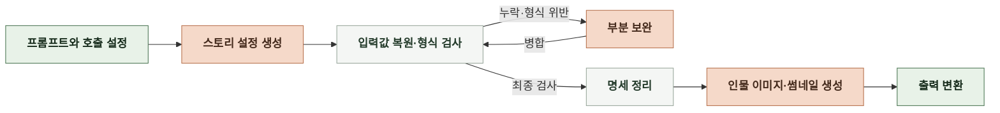

# 6-1 AI 실행

본 문서는 인지 구조 설계를 실제 AI 실행 절차로 구체화한다. ([4-1 인지 구조 설계](4-1-DESIGN-COGNITIVE-ARCHITECTURE.md))

입력 전처리 과정과 전처리한 입력으로 프롬프트를 조립해 모델에 전달하는 과정을 설명한다. 사용하는 모델과 호출 설정, 생성 결과를 스토리 본문과 이미지로 출력하기까지의 처리 순서를 다룬다.

<br>

### 6-1-1 스토리라인


<br>

**1. 모델 및 파라미터**

- 사용자 대기 시간을 줄이기 위해 `gemini-3.7-flash`를 사용한다.
- 비교 평가 결과는 [6-6 AI 성능 보고](6-6-AI-PERFORMANCE-REPORT.md)에 기록되어 있지 않다.

| 항목 | 값 |
|---|---|
| 모델 | `gemini-3.7-flash` |
| 환경 변수명 | `STORYLINES_MODEL` |
| 추론 강도 | `medium` |
| 출력 토큰 한도 | `6,144` |
| 생성 온도 | `0.75` |
| JSON 모드 | `True` |
| 모델 출력 형식 | `application/json` |

<br>

**2. 입력 전처리**

| 대상 | 처리 규칙 |
|---|---|
| 이름 | NFC 정규화 후 앞뒤 공백 제거 <br> 내부의 연속 공백·개행을 공백 한 칸으로 변환 <br> 빈 문자열은 `None`으로 변환 |
| 성별 | 한글로 표기 |
| 특징 태그 | NFC 정규화 후 앞뒤 공백과 빈 항목 제거 <br> 문자열이 아닌 항목은 스키마 검증에서 422로 거부 <br> 남은 태그는 쉼표로 연결 |
| 인물 표기 | 인물마다 이름·성별·특징을 한 줄로 구성 |
| 주변 인물 목록 | 입력 순서대로 순번 부여 |
| 인물 수·특징 태그 수 | 백엔드에서 검증하며 AI 서버는 별도로 검사하지 않음 |
| 입력 길이 | 요약하거나 길이에 맞춰 자르지 않음 |

<details>
<summary><strong>스토리라인 전처리 예시</strong></summary>

<br>

**전처리 전**

```json
{"name": " 도윤 ", "gender": "MALE", "features": [" 침착함 ", "", "과묵함"]}
```

**전처리 후**

```text
1) 이름: 도윤 / 성별: 남성 / 특징: 침착함, 과묵함
```

</details>

<br>

**3. 프롬프트 조립**

| 용도 | 원본 (`manyak-ai` 기준) | 조립 함수 |
|---|---|---|
| 최초 생성·전체 재생성 | `prompt/story/STORYLINES-TEMPLATE.md` | `src/services/prompt.py`의 `build_storylines_prompt` |
| 인물 누락 보완 | `src/services/prompt.py` | `build_storylines_refill_prompt` |

<br>

`STORYLINES` 템플릿에 장르·주인공·주변 인물 정보를 채운다. 템플릿의 작성 규칙과 입력을 채운 프롬프트를 함께 모델에 전달한다.

| 템플릿 자리 | 들어가는 값 | 예시 |
|---|---|---|
| `{{장르_태그}}` | 쉼표로 연결한 장르 | 판타지, 미스터리 |
| `{{주인공}}` | 주인공 표기 한 줄 | 이름: 서린 / 성별: 여성 / 특징: 호기심 많음, 꼼꼼함 |
| `{{주변_인물_수}}` | 입력 주변 인물 수 | 1 |
| `{{주변_인물}}` | 순번을 붙인 주변 인물 목록 | 1) 이름: 도윤 / 성별: 남성 / 특징: 침착함, 과묵함 |

<details>
<summary><strong>프롬프트 입력 예시</strong></summary>

<br>

```text
장르: 판타지, 미스터리
주인공: 이름: 서린 / 성별: 여성 / 특징: 호기심 많음, 꼼꼼함
입력 주변 인물 수: 1명
주변 인물:
1) 이름: 도윤 / 성별: 남성 / 특징: 침착함, 과묵함
```

</details>

<br>

**4. 모델 호출과 형식 검사**

조립한 프롬프트와 1단계의 설정으로 후보 3편을 생성한다. 코드는 출력의 형식을 먼저 확인한 뒤, 이름을 입력한 주변 인물이 각 후보에 등장하는지 검사한다.

<details>
<summary><strong>출력 검증의 상세 규칙</strong></summary>

<br>

1. 빈 본문을 확인하고 코드 펜스를 제거한 뒤 JSON 객체로 파싱한다.
2. 후보 3편, 후보별 추천 정보 3개, 필드 타입과 비어 있지 않은 줄거리를 확인한다.
3. 후보 번호를 결과 순서대로 `1`, `2`, `3`으로 정리한다.
4. 이름을 입력한 주변 인물의 이름을 NFC 정규화 후 부분 문자열로 대조한다. 주인공과 이름을 입력하지 않은 주변 인물은 검사하지 않는다.

</details>

<br>

**5. 재생성 및 보완**

출력에서 인물이 누락되면 3번의 인물 누락 보완 프롬프트로 해당 후보를 수정한다. 보완 출력은 수정한 후보만 담은 `stories` 배열로 받으며, `id`로 기존 후보를 찾아 교체하고 나머지는 유지한다. 병합 후 형식이 깨지면 교체 전 후보로 되돌린다. 추가 보완에는 현재 유지된 후보 3편을 사용한다.

실행 실패 처리는 [7-1 오류 처리](7-1-ERROR-HANDLING.md)를 따른다.

| 항목 | 전체 재생성 | 인물 누락 보완 |
|---|---|---|
| 실행 조건 | 파싱 또는 형식 검사 실패 | 후보에 입력한 주변 인물 누락 |
| 입력 구성 | 최초 프롬프트 재사용 | 최초 입력 + 현재 후보 3편 + 수정할 후보 번호와 지시 |
| 생성 범위 | 후보 3편 전체 | 인물이 누락된 후보만 |
| 작성 규칙 | 최초 생성 규칙 유지 | 기존 규칙·이야기 흐름을 유지하며 누락 인물이 사건에 관여하도록 수정 |
| 맥락 | 최초 입력 | 수정하지 않는 후보도 포함해 이야기 간 차이 유지 |
| 결과 처리 | 파싱·형식 재검사 | 수정 후보 병합 후 형식·인물 누락 재검사 |
| 최대 횟수 | 2회 | 2회 |
| 시간 한도 | 최초 생성과 합계 90초 <br> 최초 생성 시작 후 60초부터 새 재생성 시작 안 함 | 호출마다 90초 |

<details>
<summary><strong>인물 누락 보완 예시</strong></summary>

<br>

**1) 보완 입력 조립**

```text
[최초 입력 프롬프트]
장르·주인공·주변 인물 정보

[현재 생성 결과]
후보 1: 서린과 도윤의 도서관 조사
후보 2: 서린 혼자 오래된 편지를 추적하는 이야기
후보 3: 서린과 도윤이 장서의 증언을 모으는 이야기

[수정 대상과 지시 요약]
대상: 2번 후보
도윤이 사건에 관여하도록 수정하고 나머지 후보는 출력하지 않음

[출력 형식]
stories 배열에 id=2인 수정 후보와 추천 정보 3개만 포함
```

<br>

**2) 보완 출력**

```json
{
  "stories": [
    {
      "id": 2,
      "storyline": "서린은 오래된 편지를 발견하고 사서 도윤과 함께 발신인을 추적한다.",
      "recommended_infos": [
        "편지는 보름달이 뜨는 밤에만 읽을 수 있다.",
        "도윤의 스승이 같은 편지를 보관하고 있었다.",
        "편지를 읽을 때마다 도서관의 방 하나가 과거 모습으로 바뀐다."
      ]
    }
  ]
}
```

<br>

**3) 결과 반영 및 재검사**

```text
후보 1: 유지
후보 2: 서린 혼자 편지 추적 → 서린과 도윤이 함께 발신인 추적
후보 3: 유지

병합 → 형식과 인물 누락 재검사
```

</details>

<br>

**6. 최종 출력**

| 종료 상태 | 출력 결과 |
|---|---|
| 검증 통과 | 후보 3편과 후보별 추천 정보 3개 |
| 인물 보완 소진 | 형식이 유효한 현재 결과 출력, 누락 경고 기록 |
| 형식 복구 실패 또는 보완 호출 실패 | 실패 출력 |

<br>

### 6-1-2 컴파일



<br>

**1. 모델 및 파라미터**

- 비교 평가 결과는 [6-6 AI 성능 보고](6-6-AI-PERFORMANCE-REPORT.md)에 기록되어 있지 않다.

| 항목 | 값 |
|---|---|
| 모델 | `gemini-3.7-flash` |
| 환경 변수명 | `STORY_COMPILE_MODEL` |
| 추론 강도 | `medium` |
| 출력 토큰 한도 | `16,384` |
| 생성 온도 | `0.75` |
| JSON 모드 | `True` |
| 모델 출력 형식 | `application/json` |

<br>

**2. 입력 전처리**

| 대상 | 처리 규칙 |
|---|---|
| 인물 정보 | [스토리라인의 전처리 규칙](#6-1-1-스토리라인)에 따라 이름·성별·특징 정리 |
| 주변 인물 목록 | `input-1`부터 내부 식별자 부여 <br> 모델 출력의 인물과 입력 인물을 연결해 이름 복원 |
| 선택한 스토리라인·추가 정보 | 원문 그대로 사용 |
| 입력 길이 | 요약하거나 길이에 맞춰 자르지 않음 |

<details>
<summary><strong>컴파일 전처리 예시</strong></summary>

<br>

**전처리 전**

```json
{"name": " 도윤 ", "gender": "MALE", "features": [" 침착함 ", "", "과묵함"]}
```

**전처리 후**

```text
[input_character_id: input-1] 이름: 도윤 / 성별: 남성 / 특징: 침착함, 과묵함
```

</details>

<br>

**3. 프롬프트 조립**

| 용도 | 원본 (`manyak-ai` 기준) | 조립 함수 |
|---|---|---|
| 최초 생성 | `prompt/story/COMPILE-TEMPLATE-gemini.md` | `src/services/prompt.py`의 `build_compile_prompt` |
| 누락 블록·인물 필드 보완 | `src/services/prompt.py` | `build_refill_prompt` |

<br>

`COMPILE_GEMINI` 템플릿에 선택한 스토리라인과 전처리한 입력을 채운다. 최초 생성과 보완은 같은 템플릿의 작성 규칙을 사용한다.

| 템플릿 자리 | 들어가는 값 | 예시 |
|---|---|---|
| `{{선택_스토리라인}}` | 선택한 줄거리 원문 | 서린과 도윤이 마법 도서관의 사라진 기록을 추적한다. |
| `{{추가정보}}` | 추가 정보, 빈 문자열이면 `(없음)` | 지워진 기록은 지하 보관실에 흔적으로 남는다. |
| `{{장르_태그}}` | 쉼표로 연결한 장르 | 판타지, 미스터리 |
| `{{주인공}}` | 주인공 표기 한 줄 | 이름: 서린 / 성별: 여성 / 특징: 호기심 많음, 꼼꼼함 |
| `{{주변_인물_수}}` | 입력 주변 인물 수 | 1 |
| `{{주변_인물}}` | 내부 식별자를 붙인 인물 목록 | [input_character_id: input-1] 이름: 도윤 / 성별: 남성 / 특징: 침착함, 과묵함 |

<details>
<summary><strong>프롬프트 입력 예시</strong></summary>

<br>

```text
선택 스토리라인: 서린과 도윤이 마법 도서관의 사라진 기록을 추적한다.
추가정보: 지워진 기록은 지하 보관실에 흔적으로 남는다.
장르: 판타지, 미스터리
주인공: 이름: 서린 / 성별: 여성 / 특징: 호기심 많음, 꼼꼼함
입력 주변 인물 수: 1명
주변 인물:
[input_character_id: input-1] 이름: 도윤 / 성별: 남성 / 특징: 침착함, 과묵함
참고 로어북: (없음)
```

</details>

<br>

**4. 모델 호출과 형식 검사**

조립한 프롬프트와 1단계의 설정으로 스토리 설정과 인물 외형을 생성한다. 출력을 JSON으로 읽고 입력값을 복원한 뒤, 필수 블록과 인물 필드의 누락·형식 위반을 검사한다.

<details>
<summary><strong>출력 검증의 상세 규칙</strong></summary>

<br>

1. 출력을 JSON 객체로 파싱한다. 최초 출력의 파싱 실패는 전체 재생성으로 복구하지 않는다.
2. 장르와 입력한 주인공 이름·성별을 복원한다. 주변 인물은 내부 식별자로 입력 인물을 찾아 이름을 복원한다.
3. 필수 블록과 엔딩의 누락·형식을 검사한다.
4. 입력 인물의 누락·식별자 불일치, 이름 누락·중복, 외형 누락을 검사한다.

</details>

<br>

**5. 재생성 및 보완**

출력에 누락이나 형식 위반이 있으면 3번의 보완 프롬프트로 필요한 블록·인물 필드만 수정한다. 보완 대상이 아닌 항목은 출력에서 제외하고 기존 값을 유지한다. 병합 후 입력값을 복원하고 다시 검사한다. 인물 카드 전체를 다시 받는 호출에서는 카드 순서가 바뀔 수 있으므로 개별 인물 필드 수정은 보완 대상에서 제외한다.

실행 실패 처리는 [7-1 오류 처리](7-1-ERROR-HANDLING.md)를 따른다.

| 항목 | 부분 보완 |
|---|---|
| 실행 조건 | 필수 블록·엔딩·인물 필드의 누락 또는 형식 위반 |
| 입력 구성 | 최초 입력 + 현재 결과 전체 JSON + 블록별 지시 + 인물 필드별 지시 + 출력할 키 |
| 생성 범위 | 보완 대상으로 지정한 블록 전체 또는 인물 필드 |
| 작성 규칙 | 최초 생성 규칙 유지 |
| 결과 처리 | 병합 후 입력값 복원, 누락·형식 재검사 |
| 최대 횟수 | 2회, 전체 재생성 없음 |
| 시간 한도 | 최초 생성과 각 보완 호출마다 90초 |

| 발견한 문제 | 보완 프롬프트에 추가하는 정보 | 출력 결과 |
|---|---|---|
| 필수 블록이나 엔딩의 누락·형식 위반 | 다시 작성할 블록 이름 | 같은 이름의 최상위 키에 블록 전체 |
| 입력 인물 누락·식별자 불일치 | `character_setting` 블록과 인물 구성 수정 지시 | 입력 인물 식별자와 관계·역할을 유지한 인물 카드 전체 |
| 인물 이름 누락·중복 또는 외형 누락 | 인물 카드의 0부터 시작하는 위치와 필드 이름 | `character_updates` 배열에 `index`와 해당 필드만 포함 |

<details>
<summary><strong>블록과 인물 필드를 함께 보완하는 예시</strong></summary>

<br>

**1) 보완 입력 조립**

실제 보완 입력에는 현재 결과의 전체 JSON이 들어간다.

```text
[최초 입력 프롬프트]
선택 스토리라인·추가 정보·장르·주인공·내부 식별자가 붙은 주변 인물

[입력값을 복원한 현재 결과]
suggested_inputs: []
prompt_settings.character_setting[0]: 이름은 도윤, hair는 빈 문자열

[수정 대상]
블록: suggested_inputs
인물 필드: index 0의 hair

[출력할 키]
suggested_inputs, character_updates
```

<br>

**2) 보완 출력**

```json
{
  "suggested_inputs": ["기록장을 빛에 비춰 본다", "도윤에게 푸른 흔적을 가리킨다", "기록장의 보관 위치를 확인한다"],
  "character_updates": [
    {"index": 0, "hair": "짧은 검은 머리"}
  ]
}
```

<br>

**3) 결과 반영과 재검사**

```text
suggested_inputs: [] → 보완 출력의 선택지 3개
character_setting[0].hair: "" → "짧은 검은 머리"
나머지 필드: 유지

입력값 복원 → 누락과 형식 재검사
```

</details>

<br>

**6. 최종 출력**

엔딩과 외형을 정리하고 `StorySpec`으로 파싱한다. 검증한 인물 카드와 장르를 [인물 이미지](#6-1-3-인물-이미지)와 [썸네일](#6-1-4-썸네일) 생성에 전달한 뒤 컴파일 출력을 조립한다.

| 종료 상태 | 출력 결과 |
|---|---|
| 검증 통과 | 스토리 설정과 생성된 이미지 |
| 보완 후에도 엔딩이 불완전함 | 엔딩 빈 배열로 진행 |
| 보완 후에도 외형이 부족함 | 빈 외형 값을 정리하고 해당 인물 이미지 생략 |
| 이미지 생성 실패 | 스토리 설정과 이미지별 `error` |
| 필수 항목 복구 실패 또는 보완 호출 실패 | 실패 출력 |

| 출력 항목 | 변환 규칙 |
|---|---|
| `world_setting` | 세계관·전제·갈등을 제목으로 구분한 마크다운 |
| `character_setting` | 인물별 이름·성별·성격·말투·동기·주인공을 대하는 태도를 마크다운으로 변환 |
| `user_role_setting` | 호칭·성별·역할·배경·성격·입력 선호를 마크다운으로 변환 |
| `rule_setting` | 전개 규칙·문체 톤·분량 배분을 마크다운으로 변환 |
| 시작 설정·추천 입력·주요 사건·엔딩 | 각각의 JSON 필드로 출력 |
| 내부 인물 ID | 출력에서 제외 |
| 장르 | 마크다운 본문에서 제외 |
| 이미지 | WebP 바이너리를 Base64 문자열로 변환 |

<br>

### 6-1-3 인물 이미지


<br>

**1. 모델 및 파라미터**

- 비교 평가 결과는 [6-6 AI 성능 보고](6-6-AI-PERFORMANCE-REPORT.md)에 기록되어 있지 않다.

| 항목 | 값 |
|---|---|
| 모델 | `gpt-image-2.5-flare` |
| 환경 변수명 | `IMAGE_MODEL` |
| 생성 품질 | `low` |
| 이미지 크기 | `1024x768` |
| 출력 형식 | `webp` |
| 호출당 생성 장수 | `1` |

<br>

**2. 입력 전처리**

| 대상 | 처리 규칙 |
|---|---|
| 장르 | 태그를 쉼표로 연결 |
| 성별·외형 | 인물 카드의 값을 그대로 사용 |
| 외형 6개 | 나이대·체형·얼굴·머리 모양·의상·시각적 대표 특징이 모두 있어야 생성 |
| 이름·이야기 본문 | 이미지 입력에서 제외 |
| 입력 단위 | 외형이 완성된 인물마다 1건 |

<br>

**3. 프롬프트 조립**

| 용도 | 원본 (`manyak-ai` 기준) | 조립 함수 |
|---|---|---|
| 인물 이미지 생성 | `prompt/image/CHARACTER-IMAGE-TEMPLATE.md` | `src/services/image/prompt.py`의 `build_image_prompt` |

<br>

`CHARACTER_IMAGE` 템플릿에 장르·성별·외형을 채운다. 완성된 `<image_prompt>` 문자열을 모델에 전달한다.

| 템플릿 자리 | 들어가는 값 | 예시 |
|---|---|---|
| `{{genre}}` | 쉼표로 연결한 장르 | 판타지, 미스터리 |
| `{{gender}}` | 성별 | 남성 |
| `{{age}}` | 나이대 | 30대 초반 |
| `{{body}}` | 체형 | 키가 크고 마른 체형 |
| `{{visual_identity}}` | 시각적 대표 특징 | 은색 책 모양 브로치 |
| `{{face}}` | 얼굴 | 갸름한 얼굴과 짙은 눈썹 |
| `{{hair}}` | 머리 모양 | 짧은 검은 머리 |
| `{{outfit}}` | 의상 | 남색 사서 제복 |

<details>
<summary><strong>프롬프트 입력 예시</strong></summary>

<br>

**조립 전**

```json
{
  "name": "도윤",
  "gender": "남성",
  "age": "30대 초반",
  "body": "키가 크고 마른 체형",
  "face": "갸름한 얼굴과 짙은 눈썹",
  "hair": "짧은 검은 머리",
  "outfit": "남색 사서 제복",
  "visual_identity": "은색 책 모양 브로치"
}
```

<br>

**조립 후**

```xml
<character>
  <genre>판타지, 미스터리</genre>
  <gender>남성</gender>
  <age>30대 초반</age>
  <body>키가 크고 마른 체형</body>
  <visual_identity>은색 책 모양 브로치</visual_identity>
  <face>갸름한 얼굴과 짙은 눈썹</face>
  <hair>짧은 검은 머리</hair>
  <outfit>남색 사서 제복</outfit>
</character>
```

</details>

<br>

**4. 모델 호출과 형식 검사**

조립한 프롬프트와 1단계의 설정으로 인물마다 이미지 1장을 생성한다. 출력의 Base64 데이터를 디코딩해 WebP 바이너리로 받는다.

<details>
<summary><strong>출력 검증의 상세 규칙</strong></summary>

<br>

1. 출력에 Base64 이미지 데이터가 있는지 확인한다.
2. Base64 데이터가 디코딩되는지 확인한다. 이미지 내용은 검사하지 않는다.

</details>

<br>

**5. 재생성 및 보완**

생성된 이미지의 재생성·보완 호출은 없다. 전송 오류의 SDK 재시도와 실패 처리는 [7-1 오류 처리](7-1-ERROR-HANDLING.md)를 따른다.

| 항목 | 처리 규칙 |
|---|---|
| 재생성·보완 | 코드에서 별도로 호출하지 않음 |
| SDK 재시도 | 전송 오류 시 최대 2회 |
| 시간 한도 | 호출마다 60초, 연결 제한 10초 |

<br>

**6. 최종 출력**

| 종료 상태 | 출력 결과 |
|---|---|
| 생성 성공 | WebP 이미지 1장, [컴파일 출력](#6-1-2-컴파일)에서 Base64 문자열로 변환 |
| 외형 부족 | 생성 생략, `appearance_missing` |
| 생성 실패 | 이미지의 `error`로 전달, 컴파일 전체는 유지 |

<br>

### 6-1-4 썸네일


<br>

**1. 모델 및 파라미터**

- 비교 평가 결과는 [6-6 AI 성능 보고](6-6-AI-PERFORMANCE-REPORT.md)에 기록되어 있지 않다.

| 항목 | 값 |
|---|---|
| 모델 | `gpt-image-2.5-flare` |
| 환경 변수명 | `IMAGE_MODEL` |
| 생성 품질 | `low` |
| 이미지 크기 | `768x1024` |
| 출력 형식 | `webp` |
| 호출당 생성 장수 | `1` |

<br>

**2. 입력 전처리**

| 대상 | 처리 규칙 |
|---|---|
| 입력 | 컴파일의 인물 카드 사용, 생성된 인물 이미지는 합성하지 않음 |
| 장르 | 태그를 쉼표로 연결 |
| 인물 선택 | 외형이 완성된 인물 중 카드 순서대로 최대 2명 선택 |
| 외형이 완성된 인물이 없음 | 첫 카드의 채워진 정보 사용 |
| 인물 카드가 없음 | 인물 목록을 `없음`으로 표기 |
| 인물 정보 | 성별·나이대·체형·시각적 대표 특징·얼굴·머리 모양·의상 순서로 구성 |
| 이름·빈 외형 값 | 이름은 제외하고 빈 값은 태그째 제외 |

<br>

**3. 프롬프트 조립**

| 용도 | 원본 (`manyak-ai` 기준) | 조립 함수 |
|---|---|---|
| 썸네일 생성 | `prompt/image/THUMBNAIL-IMAGE-TEMPLATE.md` | `src/services/image/prompt.py`의 `build_thumbnail_prompt` |

<br>

`THUMBNAIL_IMAGE` 템플릿에 장르와 인물별 `<character>` 블록을 채운다. 표지 스타일과 구도 지시를 포함한 `<image_prompt>` 문자열을 모델에 전달한다.

| 템플릿 자리 | 들어가는 값 | 예시 |
|---|---|---|
| `{{genre}}` | 쉼표로 연결한 장르 | 판타지, 미스터리 |
| `{{characters}}` | 선택한 인물의 `<character>` 블록, 카드가 없으면 `없음` | `<character><gender>남성</gender><hair>짧은 검은 머리</hair></character>` |

<details>
<summary><strong>프롬프트 입력 예시</strong></summary>

<br>

**1) 인물 외형 정보가 모두 있는 경우**

```xml
<genre>판타지, 미스터리</genre>
<characters>
  <character>
    <gender>남성</gender>
    <age>30대 초반</age>
    <body>키가 크고 마른 체형</body>
    <visual_identity>은색 책 모양 브로치</visual_identity>
    <face>갸름한 얼굴과 짙은 눈썹</face>
    <hair>짧은 검은 머리</hair>
    <outfit>남색 사서 제복</outfit>
  </character>
</characters>
```

<br>

**2) 외형이 완성된 인물이 없어 첫 카드의 일부 정보만 사용하는 경우**

```xml
<genre>판타지, 미스터리</genre>
<characters>
  <character>
    <gender>남성</gender>
    <hair>짧은 검은 머리</hair>
  </character>
</characters>
```

<br>

**3) 인물 카드가 없어 장르와 표지 지시로 생성하는 경우**

```xml
<genre>판타지, 미스터리</genre>
<characters>
없음
</characters>
```

</details>

<br>

**4. 모델 호출과 형식 검사**

조립한 프롬프트와 1단계의 설정으로 썸네일 1장을 생성한다. 출력의 Base64 데이터를 디코딩해 WebP 바이너리로 받는다.

<details>
<summary><strong>출력 검증의 상세 규칙</strong></summary>

<br>

1. 출력에 Base64 이미지 데이터가 있는지 확인한다.
2. Base64 데이터가 디코딩되는지 확인한다. 이미지 내용은 검사하지 않는다.

</details>

<br>

**5. 재생성 및 보완**

생성된 썸네일의 재생성·보완 호출은 없다. 전송 오류의 SDK 재시도와 실패 처리는 [7-1 오류 처리](7-1-ERROR-HANDLING.md)를 따른다.

| 항목 | 처리 규칙 |
|---|---|
| 재생성·보완 | 코드에서 별도로 호출하지 않음 |
| SDK 재시도 | 전송 오류 시 최대 2회 |
| 시간 한도 | 호출마다 60초, 연결 제한 10초 |

<br>

**6. 최종 출력**

| 종료 상태 | 출력 결과 |
|---|---|
| 생성 성공 | WebP 이미지 1장, [컴파일 출력](#6-1-2-컴파일)에서 Base64 문자열로 변환 |
| 생성 실패 | 썸네일의 `error`로 전달, 컴파일 전체는 유지 |
