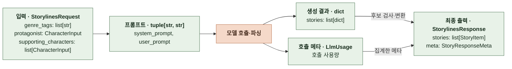
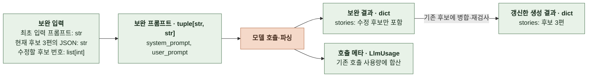
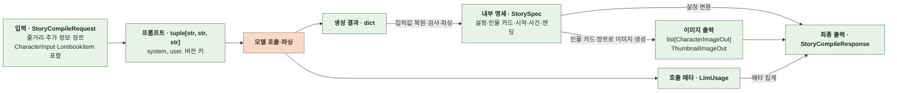
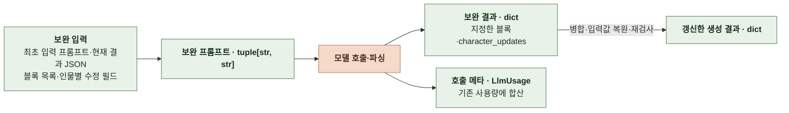
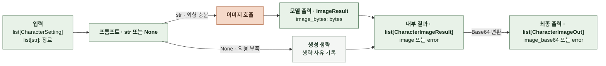
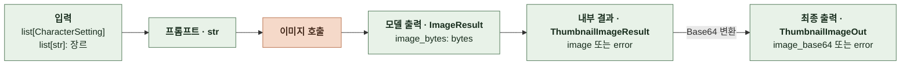

```mermaid
%%{init: {"themeVariables": {"fontSize": "18px"}, "flowchart": {"curve": "basis", "htmlLabels": true, "nodeSpacing": 24, "rankSpacing": 48}}}%%
flowchart LR
    I[" "] -->|StorylinesRequest| A["<b>generate_storylines</b><br/>입력 분해"]
    A -->|"list[str], CharacterInput, list[CharacterInput]"| B["<b>build_storylines_prompt</b><br/>프롬프트 조립"]
    B -->|"tuple[str, str]"| C["<b>_complete_json</b><br/>모델 호출·파싱"]
    C -->|"dict, LlmUsage"| D["<b>generate_storylines</b><br/>검사·보완·출력 조립"]
    D -->|StorylinesResponse| O[" "]
    classDef code fill:#F4F6F4,stroke:#9BA99E,color:#253C2C
    class A,B,C,D code
    style I fill:none,stroke:none
    style O fill:none,stroke:none
```

```mermaid
%%{init: {"themeVariables": {"fontSize": "18px"}, "flowchart": {"curve": "basis", "htmlLabels": true, "nodeSpacing": 24, "rankSpacing": 48}}}%%
flowchart LR
    I[" "] -->|"CharacterSetting, list[str]"| A["<b>build_image_prompt</b><br/>프롬프트 조립"]
    A -->|str| B["<b>generate_image</b><br/>이미지 호출"]
    B -->|ImageResult| C["<b>generate_character_images</b><br/>결과 수집"]
    C -->|"list[CharacterImageResult]"| D["<b>_generate_character_images_safe</b><br/>출력 변환"]
    D -->|"list[CharacterImageOut]"| O[" "]
    classDef data fill:#E8F2E8,stroke:#527A59,color:#182D1D
    classDef task fill:#F5D9C9,stroke:#B97450,color:#452B1D
    classDef code fill:#F4F6F4,stroke:#9BA99E,color:#253C2C
    class A,B,C,D code
    style I fill:none,stroke:none
    style O fill:none,stroke:none
```

# 6-2 소프트웨어 구현

간편 제작의 스토리라인 생성, 컴파일, 인물 이미지 생성과 썸네일 생성을 구현하는 코드 구조를 설명한다. 서브태스크마다 데이터 모델, 함수 인터페이스와 변환 책임을 정한다.

외부 입력과 출력 형식은 계약 문서를, 모델 설정과 프롬프트, 실행 절차는 AI 실행 문서를 따른다. ([5 계약](5-CONTRACT.md), [6-1 AI 실행](6-1-AI-EXECUTION.md))

 

### 6-2-1 파일 배치

| 구성 요소 | 파일 | 공유 범위 |
|---|---|---|
| 라우터 | `src/api/v1/story.py` | 스토리 전용 |
| 스토리 서비스 | `src/services/story_llm.py` | 스토리 전용 |
| 프롬프트 빌더 | `src/services/prompt.py`   `src/services/image/prompt.py` | 스토리 전용 |
| LLM 호출 모듈 | `src/services/llm/__init__.py`, `base.py`, `registry.py`   어댑터 `openai_sdk.py`, `anthropic_sdk.py`, `google_sdk.py` | 채팅과 공유 |
| 이미지 생성 모듈 | `src/services/image/__init__.py`, `base.py`, `openai_api.py` | 채팅의 자식 이미지와 공유 |
| 인물 이미지, 썸네일 생성 | `src/services/image/generate_characters.py`   `src/services/image/generate_thumbnail.py` | 스토리 전용 |
| 마크다운 변환 모듈 | `src/services/story_compile_render.py` | 스토리 전용 |

 

### 6-2-2 스토리라인 생성

**처리 흐름**

 

**데이터 처리 흐름**

 

**데이터 처리 흐름 (보완 생성)**

 

**1. 구현 위치와 역할**

| 구성 요소 | 구현 위치 (`manyak-ai` 기준) | 역할 |
|---|---|---|
| 스키마 | `src/schemas/story.py` | 입력 검증, 입력·출력 모델 정의 |
| 라우터 | `src/api/v1/story.py` | 입력 전달, 서비스 호출, 관측 |
| 스토리 서비스 | `src/services/story_llm.py` | 생성·검사·보완 순서 관리, 출력 조립 |
| 프롬프트 빌더 | `src/services/prompt.py` | 최초 생성·보완 프롬프트 조립 |
| LLM 호출 모듈 | `src/services/llm/` | 공급자 호출, 사용량 수집, 공급자 예외 변환 |

 

**2. 데이터 모델**

입력에 포함된 인물 정보로 프롬프트를 만들고, 생성 결과를 검사·보완해 최종 후보를 구성한다. 각 모델 호출의 사용량은 별도로 집계해 최종 출력의 메타에 넣는다.

 

**입력**

| 데이터·필드 | 타입 | 의미와 조건 |
|---|---|---|
| `StorylinesRequest.genre_tags` | `list[str]` | 장르 태그 |
| `StorylinesRequest.protagonist` | `CharacterInput` | 입력 모델에 포함된 주인공 |
| `StorylinesRequest.supporting_characters` | `list[CharacterInput]` | 입력 모델에 포함된 주변 인물. 생략·`null`이면 빈 목록 |
| `CharacterInput.name` | `str \| None` | 기본 `None`. NFC 정규화와 공백 정리 후 빈 이름은 `None` |
| `CharacterInput.gender` | `Literal["MALE", "FEMALE"] \| None` | 기본 `None` |
| `CharacterInput.features` | `list[str]` | 기본 빈 목록. `null`도 빈 목록으로 변환, 문자열 공백·빈 항목 정리 |

 

**프롬프트**

| 데이터·필드 | 타입 | 의미와 조건 |
|---|---|---|
| `(system_prompt, user_prompt)` | `tuple[str, str]` | 최초 생성은 입력 정보로 조립   보완 시 현재 후보와 수정할 후보 번호를 추가 |

 

**모델 호출 결과**

| 데이터·필드 | 타입 | 의미와 조건 |
|---|---|---|
| `dict`의 `stories` | `list[dict]` | 최초 생성은 후보 3편, 보완 출력은 수정 후보만 포함   후보 필드는 아래 `StoryItem`과 동일. `id`로 기존 후보와 연결해 병합 |
| `LlmUsage` | `LlmUsage` | 각 모델 호출에서 생성 결과와 함께 출력   최초·보완 호출의 사용량을 집계해 최종 출력의 `meta`에 반영   [LlmUsage 필드 정의](../../../../manyak-ai/src/services/story_llm.py#L68) |

 

**보완 대상**

| 데이터·필드 | 타입 | 의미와 조건 |
|---|---|---|
| `missing` | `list[int]` | 생성 결과를 검사해 추출한 후보 위치, 0부터 시작   프롬프트에는 1을 더해 `missing_ids`로 전달 |

 

**최종 출력**

호출 메타와 외부 필드의 필수 여부, 예시는 계약 문서를 따른다. ([5-5 요청 헤더와 메타데이터](5-CONTRACT.md#5-5-요청-헤더와-메타데이터), [5-2 스토리라인 요청과 결과](5-CONTRACT.md#5-2-스토리라인-요청과-결과))

| 데이터·필드 | 타입 | 의미와 조건 |
|---|---|---|
| `StorylinesResponse.stories` | `list[StoryItem]` | 검사·보완을 마친 후보 3편 |
| `StoryItem.id` | `int` | 출력 목록에 포함된 후보의 번호 1, 2, 3 |
| `StoryItem.storyline` | `str` | 줄거리. 공백만 있는 값은 검증 실패 |
| `StoryItem.recommended_infos` | `list[str]` | 추천 추가 정보 3개 |
| `StorylinesResponse.meta` | `StoryResponseMeta \| None` | 기본 `None`. 서비스가 집계한 호출 메타를 채움 |

 

**3. 함수 인터페이스**

| 함수 | 소속 | 입력 | 출력 | 실행 방식 |
|---|---|---|---|---|
| `generate_storylines` | 라우터 | `StorylinesRequest` | `StorylinesResponse` | 비동기 |
| `generate_storylines` | 스토리 서비스 | `StorylinesRequest` | `StorylinesResponse` | 비동기 |
| `build_storylines_prompt` | 프롬프트 빌더 | 장르 태그, 주인공, 주변 인물 | `tuple[str, str]` | 동기 |
| `_complete_json` | 스토리 서비스 | 프롬프트, 호출 설정, 검증 함수 | `tuple[dict, LlmUsage]` | 비동기 |
| `_validate_storylines` | 스토리 서비스 | 생성 결과 `dict` | `None` | 동기 |
| `_normalize_storyline_ids` | 스토리 서비스 | 후보 `dict` | `None` (전달받은 후보 데이터를 직접 수정) | 동기 |
| `_missing_name_indexes` | 스토리 서비스 | 후보 `dict`, `required_names: tuple[str, ...]` | `list[int]` | 동기 |
| `build_storylines_refill_prompt` | 프롬프트 빌더 | `original_user_prompt: str`, `current_stories_json: str`, `missing_ids: list[int]` | `tuple[str, str]` | 동기 |
| `_merge_storylines` | 스토리 서비스 | 기존 `dict`, 보완 `dict`, 대상 위치 `list[int]` | `None` (전달받은 후보 데이터를 직접 수정) | 동기 |

 

**4. 처리 순서와 데이터 변환**

모델, 프롬프트와 보완 조건은 AI 실행 문서를 따른다. ([6-1-1 스토리라인](6-1-AI-EXECUTION.md#6-1-1-스토리라인))

| 순서 | 담당 | 입력 → 출력 | 처리 |
|---|---|---|---|
| 1 | 스키마 검증기 | 입력 JSON → `StorylinesRequest` | 이름·특징 정규화, 이름 중복 검사. 라우터 진입 전에 실행 |
| 2 | 라우터의 `generate_storylines` | 입력 모델 → 서비스 | 관측을 시작하고 서비스 호출 |
| 3 | `build_storylines_prompt` | 장르·인물 → 프롬프트 튜플 | 템플릿에 입력 배치 |
| 4 | `_complete_json` | 프롬프트 → `dict`, `LlmUsage` | 모델 호출·JSON 파싱, `_validate_storylines`로 형식 검사 |
| 5 | `_normalize_storyline_ids`, `_missing_name_indexes` | 후보 `dict` → 보완 대상 위치 | 번호를 1, 2, 3으로 정리하고 입력한 주변 인물의 누락 검사 |
| 6 | `build_storylines_refill_prompt`, `_complete_json` | 현재 후보·대상 번호 → 보완 `dict`, `LlmUsage` | 보완 프롬프트 조립 후 모델 호출 |
| 7 | `_merge_storylines`와 검사 함수 | 기존·보완 `dict` → 갱신한 후보 | 지정한 후보만 교체하고 형식·번호·인물 누락 재검사 |
| 8 | 서비스의 `generate_storylines` | 후보·합산한 사용량 → `StorylinesResponse` | 후보를 `StoryItem`으로 변환하고 서버가 만든 `meta` 추가 |

 

**5. 구현 규칙과 의존성**

공통 구현 기준은 공통 구현 규칙을 따른다. ([6-2-6 공통 구현 규칙](#6-2-6-공통-구현-규칙))

| 대상 | 적용 규칙 |
|---|---|
| 병합과 복원 | 병합 전 후보 딕셔너리 목록을 복사   병합 후 형식이 깨진 경우에만 이전 후보로 복원 |
| 형식 검사 | `_validate_storylines`는 후보 수·필드·빈 줄거리·추천 정보 수를 검사하고 위반 시 `_InvalidAiResponse` 발생 |
| 인물 검사 | 주인공과 이름을 입력하지 않은 주변 인물은 제외 |
| 설정·템플릿 | 호출 시점의 `settings.storylines_model` 사용   프롬프트 빌더가 템플릿과 `STORYLINES_VERSION` 제공 |
| 관측 | 보완 후에도 남은 인물 누락을 경고로 보고 |

 

### 6-2-3 컴파일

**처리 흐름**

 

**데이터 처리 흐름**

 

**데이터 처리 흐름 (보완 생성)**

 

**1. 구현 위치와 역할**

| 구성 요소 | 구현 위치 (`manyak-ai` 기준) | 역할 |
|---|---|---|
| 스키마 | `src/schemas/story_compile.py` | 입력·내부 명세·출력 모델 정의 |
| 라우터 | `src/api/v1/story.py` | 입력 전달, 서비스 호출, 관측 |
| 스토리 서비스 | `src/services/story_llm.py` | 생성·보완·명세 검사·이미지 생성 순서 관리 |
| 프롬프트 빌더 | `src/services/prompt.py` | 생성·보완 프롬프트 조립 |
| 출력 변환 | `src/services/story_compile_render.py` | 명세를 마크다운과 구조화된 출력으로 변환 |
| 이미지 생성 | `src/services/image/generate_characters.py`   `generate_thumbnail.py` | 인물 이미지·썸네일 생성 |

 

**2. 데이터 모델**

입력으로 프롬프트를 만들고, 생성 결과를 검사·보완해 `StorySpec`으로 변환한다. 명세와 이미지 결과를 최종 출력에 합친다.

 

**입력**

| 데이터·필드 | 타입 | 의미와 조건 |
|---|---|---|
| `StoryCompileRequest.selected_storyline` | `str` | 선택한 줄거리 |
| `StoryCompileRequest.additional_info` | `str` | 추가 정보, 기본 빈 문자열 |
| `StoryCompileRequest.genre_tags` | `list[str]` | 장르 태그 |
| `StoryCompileRequest.protagonist` | `CharacterInput` | 주인공 필드는 스토리라인 입력과 동일하다. ([6-2-2 스토리라인 생성](#6-2-2-스토리라인-생성)) |
| `StoryCompileRequest.supporting_characters` | `list[CharacterInput]` | 주변 인물, 기본 빈 목록 |
| `StoryCompileRequest.lorebooks` | `list[LorebookItem] \| None` | 로어북, 기본 빈 목록 |
| `LorebookItem.name`, `content` | 각각 `str` | 입력에 포함된 로어북의 이름·내용 |

 

**프롬프트**

| 데이터·필드 | 타입 | 의미와 조건 |
|---|---|---|
| 최초 생성 `(system, user, version_key)` | `tuple[str, str, str]` | 작성 규칙·입력 프롬프트·템플릿 버전 키 |
| 보완 `(system, user)` | `tuple[str, str]` | 현재 결과와 보완 대상으로 조립 |

 

**모델 호출 결과**

| 데이터·필드 | 타입 | 의미와 조건 |
|---|---|---|
| 생성·보완 결과 | `dict` | 명세 파싱 전 JSON 객체, 입력값 복원·병합 대상 |
| `input_character_id` | `str` | 인물 카드의 `input-1` 등 식별자, 이름 복원에 사용하고 명세 파싱 전에 제거 |
| 호출 사용량 | `LlmUsage` | 최초·보완 호출 사용량을 집계해 출력 메타에 반영   [LlmUsage 필드 정의](../../../../manyak-ai/src/services/story_llm.py#L68) |

 

**보완 대상**

| 데이터·필드 | 타입 | 의미와 조건 |
|---|---|---|
| 블록 목록 | `list[str]` | 누락 경로를 보완할 블록 이름으로 변환 |
| 인물 필드 | `dict[int, tuple[str, ...]]` | 0부터 시작하는 인물 위치와 수정 필드   인물 카드 전체를 보완할 때는 비움 |

 

**검증한 명세 · StorySpec**

| 모델 | 필드 | 타입, 제약 |
|---|---|---|
| `StorySpec` | `meta` | `Meta` |
| | `prompt_settings` | `PromptSettings` |
| | `start` | `Start` |
| | `suggested_inputs` | `list[str]`, 정확히 3개 |
| | `main_events` | `list[MainEvent]`, 3~5개 |
| | `endings` | `list[Ending]`, 0개 또는 3개. 기본 빈 배열 |
| `Meta` | `title`, `one_line_intro`, `description`, `genre` | 각각 `str` |
| `PromptSettings` | `world_setting`, `rule_setting`, `tone_setting`, `length_ratio` | 각각 `str` |
| | `plot_setting` | `PlotSetting` |
| | `character_setting` | `list[CharacterSetting]`, 1~5명 |
| | `user_role_setting` | `UserRoleSetting` |
| `PlotSetting` | `premise`, `conflict` | 각각 `str` |
| `CharacterSetting` | `name`, `gender`, `personality`, `tone`, `motivation`, `attitude_to_user` | 각각 `str` |
| | `description` | `CharacterDescription`: 앞뒤 공백 제거 후 1~80자, 개행, 탭 없는 `str` |
| | `age`, `body`, `face`, `hair`, `outfit`, `visual_identity` | 각각 `str`, 기본 빈 문자열. 이미지 생성용 외형 |
| `UserRoleSetting` | `name`, `gender`, `role`, `background`, `personality` | 각각 `str` |
| | `preference` | `str`, 기본 빈 문자열 |
| `Start` | `name`, `prologue`, `start_situation` | 각각 `str` |
| `MainEvent` | `name`, `description`, `key_sentence` | 각각 `str` |
| `Ending` | `name`, `achievement_condition`, `epilogue` | 각각 `str` |
| | `min_turns` | `int`, 1 이상 |

 

**이미지 생성 결과**

| 데이터·필드 | 타입 | 의미와 조건 |
|---|---|---|
| 인물 이미지 | `list[CharacterImageOut]` | 인물별 이미지 또는 실패 코드 |
| 썸네일 | `ThumbnailImageOut` | 이미지 또는 실패 코드를 담은 필수 객체 |

 

**최종 출력**

| 데이터·필드 | 타입 | 의미와 조건 |
|---|---|---|
| `StoryCompileResponse.stories` | `StoriesOut` | 제목·한 줄 소개·설명 |
| `story_settings` | `StorySettingsOut` | 세계관·인물·사용자 역할·규칙 마크다운 |
| `story_start_settings` | `StoryStartSettingsOut` | 시작 이름·상황·프롤로그 |
| `story_suggested_inputs` | `list[str]` | 추천 입력 3개 |
| `story_main_events` | `list[StoryMainEventOut]` | 주요 사건 3~5개 |
| `story_endings` | `list[StoryEndingOut]` | 엔딩 0개 또는 3개 |
| `character_introductions` | `list[CharacterIntroductionOut]` | 인물별 이름·소개 |
| `character_appearances` | `list[CharacterAppearanceOut]` | 인물별 이름·성별·외형 |
| `character_images` | `list[CharacterImageOut]` | 인물 이미지 |
| `thumbnail_image` | `ThumbnailImageOut` | 썸네일 |
| `meta` | `StoryResponseMeta \| None` | 서비스가 집계한 호출 메타 |

 

**3. 함수 인터페이스**

| 함수 | 소속 | 입력 | 출력 | 실행 방식 |
|---|---|---|---|---|
| `create_story_compile` | 라우터 | `StoryCompileRequest` | `StoryCompileResponse` | 비동기 |
| `compile_story` | 스토리 서비스 | `StoryCompileRequest` | `StoryCompileResponse` | 비동기 |
| `build_compile_prompt` | 프롬프트 빌더 | 줄거리·추가 정보·장르·인물·로어북, `provider` | `tuple[str, str, str]` | 동기 |
| `_complete_json` | 스토리 서비스 | 프롬프트·호출 설정 | `tuple[dict, LlmUsage]` | 비동기 |
| `build_refill_prompt` | 프롬프트 빌더 | `original_user_prompt: str`, `current_data_json: str`, `missing_blocks: list[str]`, `character_fields: dict[int, tuple[str, ...]] \| None`, `provider: str \| None` | `tuple[str, str]` | 동기 |
| `_merge_blocks` | 스토리 서비스 | 기존·보완 `dict`, 블록 목록 | `None` (기존 결과 수정) | 동기 |
| `_merge_character_field_repairs` | 스토리 서비스 | 기존·보완 `dict`, 수정 필드 | `None` (기존 결과 수정) | 동기 |
| `_generate_character_images_safe` | 스토리 서비스 | 인물 카드 목록·장르 | `list[CharacterImageOut]` | 비동기 |
| `_generate_thumbnail_image_safe` | 스토리 서비스 | 인물 카드 목록·장르 | `ThumbnailImageOut` | 비동기 |
| `spec_to_response` | 출력 변환 | `StorySpec`, `thumbnail_image: ThumbnailImageOut` | `StoryCompileResponse` | 동기 |

 

**4. 처리 순서와 데이터 변환**

모델, 프롬프트와 보완 조건은 AI 실행 문서를 따른다. ([6-1-2 컴파일](6-1-AI-EXECUTION.md#6-1-2-컴파일))

| 순서 | 담당 | 입력 → 출력 | 처리 |
|---|---|---|---|
| 1 | 스키마 검증기·라우터 | 입력 JSON → `StoryCompileRequest` | 인물 정규화·이름 중복 검사 후 서비스 호출 |
| 2 | `build_compile_prompt` | 입력 모델의 필드 → 프롬프트·버전 키 | 공급자에 맞는 템플릿 선택 |
| 3 | `_complete_json` | 프롬프트 → `dict`, `LlmUsage` | 모델 호출·JSON 파싱 |
| 4 | `compile_story` | 생성 결과 → 보완한 `dict` | 입력값 복원, 블록·인물 검사, 보완·병합·재검사 |
| 5 | `compile_story` | 보완한 `dict` → `StorySpec` | 엔딩·외형 정리, 내부 식별자 제거, 명세 검증 |
| 6 | 이미지 생성의 두 `_safe` 함수 | 인물 카드·장르 → 이미지 출력 | 인물 이미지와 썸네일 동시 생성 |
| 7 | `spec_to_response` | 명세·썸네일 → `StoryCompileResponse` | 설정 마크다운 변환·구조화 필드 조립 |
| 8 | `compile_story` | 출력 객체 → 최종 출력 | 인물 이미지·호출 메타 추가 |

 

**5. 구현 규칙과 의존성**

공통 구현 기준은 공통 구현 규칙을 따른다. ([6-2-6 공통 구현 규칙](#6-2-6-공통-구현-규칙))

| 대상 | 적용 규칙 |
|---|---|
| 입력값 보존 | 장르·입력한 주인공 이름과 성별·주변 인물 이름을 생성 결과에 복원 |
| 인물 연결 | `input_character_id`로 입력 인물과 연결하고 `StorySpec` 파싱 전에 제거 |
| 보완 단위 | 블록 전체 또는 인물 필드만 병합   인물 카드 전체 보완과 위치 기반 필드 보완은 함께 수행하지 않음 |
| 실행 순서 | 검증한 명세로 인물 이미지·썸네일을 `asyncio.gather`로 동시 생성 |
| 출력 조립 | `spec_to_response`에 실제 썸네일 결과 전달   서비스가 인물 이미지와 집계한 메타 추가 |
| 설정·템플릿 | `settings.story_compile_model`과 공급자에 맞는 템플릿 사용   선택한 버전 키를 출력 메타에 기록 |
| 부분 완료 | 불완전한 엔딩·외형은 6-1의 정리 기준 적용   이미지 실패가 필수 스토리 출력을 중단하지 않음 |

 

### 6-2-4 인물 이미지 생성

**처리 흐름**

 

**데이터 처리 흐름**

 

**1. 구현 위치와 역할**

| 구성 요소 | 구현 위치 (`manyak-ai` 기준) | 역할 |
|---|---|---|
| 입력·출력 스키마 | `src/schemas/story_compile.py` | 인물 카드·이미지 출력 모델 정의 |
| 프롬프트 빌더 | `src/services/image/prompt.py` | 인물·장르로 프롬프트 조립 |
| 생성 모듈 | `src/services/image/generate_characters.py` | 이미지 호출·내부 결과 구성 |
| 공통 이미지 호출 | `src/services/image/__init__.py` | 용도·설정을 적용해 공급자 어댑터 호출 |
| 출력 변환 | `src/services/story_llm.py` | `_generate_character_images_safe`에서 Base64·오류 코드 변환 |

 

**2. 데이터 모델**

컴파일의 검증된 인물 카드와 장르를 입력으로 사용한다.

 

**입력**

| 데이터·필드 | 타입 | 의미와 조건 |
|---|---|---|
| `characters` | `list[CharacterSetting]` | 컴파일 명세에 포함된 주변 인물 카드다. ([6-2-3 컴파일](#6-2-3-컴파일)) |
| `genre_tags` | `list[str]` | 장르 태그 |

 

**프롬프트**

| 데이터·필드 | 타입 | 의미와 조건 |
|---|---|---|
| `prompt` | str \| None | 인물별 성별·외형·장르로 조립, 외형 부족이면 `None` |

 

**모델 호출 결과**

| 데이터·필드 | 타입 | 의미와 조건 |
|---|---|---|
| `ImageResult.image_bytes` | `bytes` | WebP 바이너리 |
| `ImageResult.model`, `provider` | 각각 `str` | 실제 모델·공급자 |

 

**내부 결과**

| 데이터·필드 | 타입 | 의미와 조건 |
|---|---|---|
| `CharacterImageResult.name` | `str` | 입력 인물 이름 |
| `CharacterImageResult.image` | `ImageResult \| None` | 기본 `None`, 생성 성공 시 이미지 |
| `CharacterImageResult.error` | `str \| None` | 기본 `None`, 실패 시 사유 |

 

**최종 출력**

| 데이터·필드 | 타입 | 의미와 조건 |
|---|---|---|
| `CharacterImageOut.name` | `str` | 입력 인물 이름 |
| `CharacterImageOut.image_name` | `str` | 인물 이름으로 만든 이미지 이름 |
| `CharacterImageOut.image_base64` | `str \| None` | 생성한 WebP의 Base64 문자열 |
| `CharacterImageOut.content_type` | `str` | `image/webp` |
| `CharacterImageOut.error` | `str \| None` | 실패 시 계약의 오류 코드 |

 

**3. 함수 인터페이스**

| 함수 | 소속 | 입력 | 출력 | 실행 방식 |
|---|---|---|---|---|
| `_generate_character_images_safe` | 스토리 서비스 | 인물 카드 목록·장르 | `list[CharacterImageOut]` | 비동기 |
| `generate_character_images` | 생성 모듈 | `characters: list[CharacterSetting]`, `genre_tags: list[str]` | `list[CharacterImageResult]` | 비동기 |
| `build_image_prompt` | 프롬프트 빌더 | `CharacterSetting, list[str]` | `str \| None` | 동기 |
| `generate_image` | 공통 이미지 호출 | `prompt: str`   `purpose="character"` | `ImageResult` | 비동기 |

 

**4. 처리 순서와 데이터 변환**

프롬프트와 생성 조건은 AI 실행 문서를 따른다. ([6-1-3 인물 이미지](6-1-AI-EXECUTION.md#6-1-3-인물-이미지))

| 순서 | 담당 | 입력 → 출력 | 처리 |
|---|---|---|---|
| 1 | `build_image_prompt` | 인물 카드·장르 → 프롬프트 | 인물마다 프롬프트 조립, 외형 부족이면 생성 생략 |
| 2 | `generate_image` | 프롬프트 → `ImageResult` | 인물 용도로 WebP 이미지 생성 |
| 3 | `generate_character_images` | 이미지 결과 → `list[CharacterImageResult]` | 인물별 병렬 실행 후 입력 순서로 결과 수집 |
| 4 | `_generate_character_images_safe` | 내부 결과 → `list[CharacterImageOut]` | Base64 변환·이미지 이름 부여·실패 코드 변환 |

 

**5. 구현 규칙과 의존성**

공통 구현 기준은 공통 구현 규칙을 따른다. ([6-2-6 공통 구현 규칙](#6-2-6-공통-구현-규칙))

| 대상 | 적용 규칙 |
|---|---|
| 병렬 처리 | `asyncio.Semaphore(5)`로 동시 호출 제한   `asyncio.gather`로 입력 인물 순서 유지 |
| 생성 생략 | 외형 부족이면 해당 인물 결과에 사유 기록, 카드가 없으면 빈 목록 |
| 부분 실패 | 일반 생성 실패는 해당 인물의 결과에만 기록 |
| 묶음 실패 | 예상하지 못한 예외는 남은 인물 작업을 취소하고 상위로 전파   `_safe`에서 보고 후 빈 목록으로 변환, 취소는 상위로 전파 |

 

### 6-2-5 썸네일 생성

**처리 흐름**

 

**데이터 처리 흐름**

 

**1. 구현 위치와 역할**

| 구성 요소 | 구현 위치 (`manyak-ai` 기준) | 역할 |
|---|---|---|
| 입력·출력 스키마 | `src/schemas/story_compile.py` | 인물 카드·이미지 출력 모델 정의 |
| 프롬프트 빌더 | `src/services/image/prompt.py` | 인물·장르로 프롬프트 조립 |
| 생성 모듈 | `src/services/image/generate_thumbnail.py` | 이미지 호출·내부 결과 구성 |
| 공통 이미지 호출 | `src/services/image/__init__.py` | 용도·설정을 적용해 공급자 어댑터 호출 |
| 출력 변환 | `src/services/story_llm.py` | `_generate_thumbnail_image_safe`에서 Base64·오류 코드 변환 |

 

**2. 데이터 모델**

컴파일의 검증된 인물 카드와 장르를 입력으로 사용한다.

 

**입력**

| 데이터·필드 | 타입 | 의미와 조건 |
|---|---|---|
| `characters` | `list[CharacterSetting]` | 컴파일 명세에 포함된 주변 인물 카드다. ([6-2-3 컴파일](#6-2-3-컴파일)) |
| `genre_tags` | `list[str]` | 장르 태그 |

 

**프롬프트**

| 데이터·필드 | 타입 | 의미와 조건 |
|---|---|---|
| `prompt` | str | 선택한 인물의 외형·장르로 만든 표지 입력 |

 

**모델 호출 결과**

| 데이터·필드 | 타입 | 의미와 조건 |
|---|---|---|
| `ImageResult.image_bytes` | `bytes` | WebP 바이너리 |
| `ImageResult.model`, `provider` | 각각 `str` | 실제 모델·공급자 |

 

**내부 결과**

| 데이터·필드 | 타입 | 의미와 조건 |
|---|---|---|
| `ThumbnailImageResult.image` | `ImageResult \| None` | 기본 `None`, 생성 성공 시 이미지 |
| `ThumbnailImageResult.error` | `str \| None` | 기본 `None`, 실패 시 사유 |

 

**최종 출력**

| 데이터·필드 | 타입 | 의미와 조건 |
|---|---|---|
| `ThumbnailImageOut.image_name` | `Literal["썸네일_기본"]` | 고정 이미지 이름 |
| `ThumbnailImageOut.image_base64` | `str \| None` | 생성한 WebP의 Base64 문자열 |
| `ThumbnailImageOut.content_type` | `Literal["image/webp"]` | `image/webp` |
| `ThumbnailImageOut.error` | `ThumbnailErrorCode \| None` | 실패 시 계약의 오류 코드 |

 

**3. 함수 인터페이스**

| 함수 | 소속 | 입력 | 출력 | 실행 방식 |
|---|---|---|---|---|
| `_generate_thumbnail_image_safe` | 스토리 서비스 | 인물 카드 목록·장르 | `ThumbnailImageOut` | 비동기 |
| `generate_thumbnail_image` | 생성 모듈 | `characters: list[CharacterSetting]`, `genre_tags: list[str]` | `ThumbnailImageResult` | 비동기 |
| `build_thumbnail_prompt` | 프롬프트 빌더 | `list[CharacterSetting], list[str]` | `str` | 동기 |
| `generate_image` | 공통 이미지 호출 | `prompt: str`   `purpose="thumbnail"`   `size=THUMBNAIL_IMAGE_SIZE` (`str`) | `ImageResult` | 비동기 |

 

**4. 처리 순서와 데이터 변환**

프롬프트와 생성 조건은 AI 실행 문서를 따른다. ([6-1-4 썸네일](6-1-AI-EXECUTION.md#6-1-4-썸네일))

| 순서 | 담당 | 입력 → 출력 | 처리 |
|---|---|---|---|
| 1 | `build_thumbnail_prompt` | 인물 카드·장르 → 프롬프트 | 외형이 완성된 앞의 최대 2명 선택   없으면 첫 카드의 일부 정보, 카드가 없으면 장르·표지 지시 사용 |
| 2 | `generate_image` | 프롬프트 → `ImageResult` | 썸네일 용도·세로 크기로 이미지 1장 생성 |
| 3 | `generate_thumbnail_image` | 이미지 결과 → `ThumbnailImageResult` | 성공 이미지 또는 실패 사유 구성 |
| 4 | `_generate_thumbnail_image_safe` | 내부 결과 → `ThumbnailImageOut` | Base64 변환·이미지 이름 부여·실패 코드 변환 |

 

**5. 구현 규칙과 의존성**

공통 구현 기준은 공통 구현 규칙을 따른다. ([6-2-6 공통 구현 규칙](#6-2-6-공통-구현-규칙))

| 대상 | 적용 규칙 |
|---|---|
| 인물 선택 | 컴파일의 전체 카드 목록을 빌더에 전달, 빌더가 표지 인물 선택 |
| 실행 단위 | 카드 목록으로 썸네일 1장 생성   인물 이미지 병렬 처리의 세마포어 밖에서 실행 |
| 출력 객체 | 성공·실패 모두 `ThumbnailImageOut` 출력   Base64 데이터와 오류 코드 중 정확히 하나만 값이 있음 |
| 실패 변환 | 예상하지 못한 예외는 보고 후 `generation_failed`로 변환   취소는 상위 호출로 전파 |

 

### 6-2-6 공통 구현 규칙

| 대상 | 규칙 |
|---|---|
| 역할 분리 | 라우터는 입력·출력을 연결하고, 서비스는 생성 흐름을 조합한다. 프롬프트 조립과 출력 변환은 각각의 모듈에서 처리한다. |
| 모델 호출 | 서비스는 공통 호출 모듈을 사용한다. 공급자 SDK는 어댑터에서만 사용하고, 모델 등록부는 공통 호출 모듈에서 접근한다. |
| 데이터 타입 | 함수의 입력·출력에 타입을 명시한다. 외부 입출력은 `schemas`의 모델을, 공급자 호출은 공용 타입을 사용한다. |
| 비동기 | 라우터와 외부 호출을 기다리는 함수는 비동기로 작성한다. 프롬프트 조립·파싱·형식 검사는 동기로 작성한다. |
| 설정 | 설정과 비밀값은 `settings`로 읽는다. 서비스에서 환경 변수를 직접 읽거나 키·주소를 하드코딩하지 않는다. |
| 호출 한도 | 모델 호출에 제한 시간을 지정한다. 재생성·보완은 정해진 횟수와 시간 한도 안에서 수행한다. |
| 오류 구분 | 전송 오류·출력 형식 오류·설정 오류를 구분한다. 코드 결함을 모델 호출 실패로 바꾸지 않고, 취소는 상위 호출로 전파한다. |
| 출력 구성 | 생성 결과를 검사한 뒤 출력 모델로 변환한다. 사용량·모델명 등 호출 메타는 실제 호출 결과로 구성한다. |
| 로그와 오류 보고 | 로그는 `logging`을 사용하고 호출 실패는 공통 오류 보고 함수를 사용한다. Sentry에 프롬프트·출력 원문을 보내지 않는다. |
| 프롬프트 변경 | 템플릿은 LF 줄바꿈으로 저장한다. 내용을 변경하면 `version`과 `updated`를 함께 갱신한다. |
| 실행 코드 공유 | 운영 API와 평가 CLI는 같은 생성 함수를 사용한다. 테스트에서는 외부 모델 호출과 관측 함수를 대체한다. |

 

**공통 LLM 호출의 입력과 출력**

스토리라인과 컴파일은 `_complete_json`에서 `llm.complete(LlmRequest)`를 비동기로 호출한다. 반환된 `LlmResult.text`는 JSON으로 파싱하고 사용량은 `LlmUsage`로 정리한다.

| 모델 | 필드 | 타입 | 스토리 서비스에서의 용도 |
|---|---|---|---|
| `LlmRequest` | `model` | `str` | 호출할 모델 이름 |
| | `messages` | `list[Message]` | `role`과 `content`가 문자열인 메시지. `system`, `user` 순서로 프롬프트 전달 |
| | `max_tokens` | `int \| None` | 출력 토큰 한도 |
| | `timeout` | `float \| None` | 남은 호출 시간(초)을 지정. `None`이면 SDK 기본값 적용 |
| | `temperature` | `float \| None` | 생성 온도 |
| | `json_mode` | `bool` | JSON 객체를 받도록 `True` 지정 |
| `LlmResult` | `text` | `str` | 생성 본문. 빈 값과 JSON 형식은 `_complete_json`이 검사 |
| | `model`, `provider` | 각각 `str` | 실제 모델과 공급자. 모델 이름이 응답에 없으면 요청 이름 사용 |
| | `usage` | `TokenUsage` | 호출별 토큰 사용량 |
| `TokenUsage` | `input_tokens`, `output_tokens` | 각각 `int \| None` | 입력과 출력 토큰. 알 수 없으면 `None` |
| | `cache_creation_input_tokens`, `cache_read_input_tokens` | 각각 `int \| None` | 진단용 캐시 사용량. 전체 입력 토큰에 다시 더하지 않음 |
