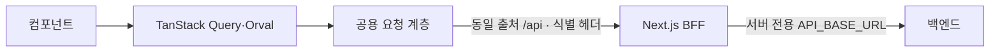

# 1-1-web-design

## 문서 정보

| 항목 | 값 |
| --- | --- |
| 버전 | v0.2 |
| 작성일 | 2026-09-09 |
| 수정일 | 2026-09-14 |
| 대상 | manyak-web |
| 작성 목적 | 웹의 현재 요청·라우팅·인증·관측 구조를 설명합니다. |
| 기준 코드 | [manyak-web](../../../manyak-web) |

## 읽는 순서

- [웹 Spec](../spec/3-2-web-spec.md)으로 계약을 확인한 뒤 요청 흐름 → 라우팅 → 인증 → 관측 순서로 읽습니다.

## 목차

- [1-1-1. 검증된 기술 환경과 요청 흐름](#1-1-1-검증된-기술-환경과-요청-흐름)
- [1-1-2. 라우팅·레이아웃·공통 셸](#1-1-2-라우팅레이아웃공통-셸)
- [1-1-3. BFF 프록시·토큰 세션](#1-1-3-bff-프록시토큰-세션)
- [1-1-4. 관측 연동](#1-1-4-관측-연동)
- [1-1-5. 테스트·Definition of Done](#1-1-5-테스트definition-of-done)

---

[공통 스펙](../spec/3-1-client-spec.md)과 [웹 스펙](../spec/3-2-web-spec.md)을 충족하는 현재 구조입니다. 역사적 선택은 [웹 ADR](../adr/1-2-web-adr.md)을 따릅니다.

## 1-1-1. 검증된 기술 환경과 요청 흐름

### 기술 환경

| 책임 | 기술·정본 |
| --- | --- |
| 렌더·타입 | Next.js App Router, React·React Compiler, TypeScript |
| 요청·검증 | TanStack Query, Orval, Zod |
| UI | Base UI·shadcn/ui, CVA, Tailwind CSS, motion, sonner, next-themes |
| 관측·테스트 | Amplitude·Sentry, Vitest·Playwright |
| 버전·실행 환경 | [package.json](../../../manyak-web/package.json)·[pnpm-lock.yaml](../../../manyak-web/pnpm-lock.yaml). 코드 작성·실행 규칙은 [웹 AGENTS](../../../manyak-web/AGENTS.md) |

### 요청 흐름

브라우저 요청은 BFF를 통합니다. 서버 직접 조회는 `API_BASE_URL` 절대 URL과 생성 URL 빌더를 사용합니다. Orval도 Next.js 환경 변수 우선순위로 같은 값의 `/v3/api-docs`를 읽습니다.

### SSE 클라이언트 구현 (웹)

채팅은 `fetch`·`ReadableStream`으로 SSE를 읽으며 공용 `fetchWithTimeout`을 우회하므로 클라이언트 시간 상한이 없습니다. EOF·오류·확정 교체 결과는 [공통 SSE 계약](../spec/3-1-client-spec.md#sse-스트리밍-계약)을 따릅니다.

진행 중 `token`·`character_image`를 도착 순서의 `text | character_image` 조각으로 관리합니다. 완료 후 상세의 `aiOutput`을 [chat-message-segments](../../../manyak-web/src/features/chats/_shared/utils/chat-message-segments.ts)로 파싱해 같은 조각 렌더를 사용합니다. 이어쓰기·재생성·상세·공유가 이 경로를 공유합니다. 이미지 블록은 텍스트 문단의 형제로 두어 `
` 안에 중첩하지 않습니다. URL 검증은 [원격 이미지](#원격-이미지-최적화), 표현은 [웹 표현 값](#웹-표현-값)을 따릅니다.

### 게스트 서재 상태 판정 (웹)

| 저장소 상태 | 의미·처리 |
| --- | --- |
| `null` | SSR·미하이드레이션: 로딩 |
| `[]` | 읽기 완료·비어 있음: 빈 상태 |
| `string[]` | 배치 조회 후 목록 표시 |

[use-created-stories](../../../manyak-web/src/features/studio/menu/hooks/use-created-stories.ts)는 게스트의 ID 목록 변경 시 `placeholderData`로 이전 카드를 유지하며 현재 ID에 없는 카드는 제외합니다. 새 스토리 배치 조회가 기존 목록을 스켈레톤으로 바꾸지 않고 낙관 삭제도 유지합니다.

로컬 ID 목록에는 세션이 `unauthenticated`로 확정됐을 때만 씁니다. `authenticated`와 세션 판정 전(`loading`)은 회원 목록 무효화만 합니다. 제작 탭의 완성 폴링은 세션 판정을 기다리지 않아 `loading` 중에도 완성이 도착할 수 있는데, 이를 게스트로 취급하면 회원의 스토리 ID가 로컬에 남아 로그아웃 뒤 게스트 서재에 노출됩니다([creation-side-effects](../../../manyak-web/src/features/stories/_shared/utils/creation-side-effects.ts)).

웹 채팅 목록 변환은 `lastStoryPreview=null`을 제외합니다. 빈 문자열은 안내 문구로 표시하며 제목이 없는 삭제된 스토리의 채팅은 유지합니다. Android 목록에 이 필터를 적용하지 않습니다.

### 게스트 저장소 키 (웹)

키·직렬화의 실제 값은 각 `*-storage.ts`가 소유합니다. 사용자 보존 계약은 [웹 사용자 모델](../spec/3-2-web-spec.md#웹-사용자-모델)을 따릅니다.

| 저장소 | 값·소유 코드 |
| --- | --- |
| localStorage 스토리·채팅 ID | `manyak:created-story-ids`·`manyak:created-chat-ids`, 최신순 JSON 배열. [스토리 저장소](../../../manyak-web/src/features/stories/_shared/utils/story-id-storage.ts)·[채팅 저장소](../../../manyak-web/src/features/chats/_shared/utils/chat-id-storage.ts) |
| localStorage 안내 | `manyak:onboarding-seen`의 `'1'`, `manyak:chat-tour-seen`·`manyak:chat-choices-hint-seen`. 체험 사용량은 브라우저에 두지 않고 서버 조회([체험 잔여 패칭](#체험-잔여-패칭-웹))를 따른다 |
| localStorage 채팅 설정 | `manyak:chat-input-mode`의 `'block' \| 'plain'`, `manyak:chat-choices-enabled`·`manyak:chat-realtime-image-enabled`의 `'true' \| 'false'`(기본 on). [입력 모드](../../../manyak-web/src/features/chats/room/hooks/use-chat-input-mode.ts)·[on/off 저장](../../../manyak-web/src/features/chats/room/hooks/use-stored-toggle.ts) |
| IndexedDB 제작 | Dexie DB `manyak-creation`의 `pendingCreations`, `storyCompletions`, `metadata`. [DB 정의](../../../manyak-web/src/features/stories/_shared/utils/creation-db.ts), [제작 저장소](../../../manyak-web/src/features/stories/_shared/utils/creation-request-storage.ts) |
| localStorage 제작 세대 | `manyak:creation-epoch`의 정수. 세션 종료를 비동기 DB 삭제보다 먼저 알리고 이전 세대의 작업을 차단함. 초안 본문은 보관하지 않음 |
| sessionStorage 재개 의도 | `manyak:story-draft-resume-intent`의 `requestId`. 진행 카드가 이동 전에 기록하고 퍼널이 진입 시 한 번 읽어 그 레코드만 복원. 없으면 새 세션 |
| sessionStorage 게스트 채팅·로그인 초안 | `manyak:guest-chat-ids`의 JSON 배열(이전 버전에서 탭에만 보관한 채팅 ID. 신규 채팅은 localStorage 서재에 저장하며 기존 탭 ID도 자동 이관과 핸드오프에 포함)과 `manyak:chat-login-draft:{chatId}`의 입력 본문(전송 본문과 같은 직렬화, 채팅방 마운트 시 두 컴포저에 되살리고 삭제). [guest-chat-storage](../../../manyak-web/src/features/chats/_shared/utils/guest-chat-storage.ts)·[chat-login-draft-storage](../../../manyak-web/src/features/chats/room/utils/chat-login-draft-storage.ts) |
| sessionStorage 로그인 진행 표시 | `manyak:pending-login`의 `'1'`. 공통 소셜 로그인 시작 함수가 OAuth로 떠나기 전에 기록하고 동의 게이트가 fail-closed 판정에 읽는다. 동의 완료·로그아웃에서 지운다. [pending-login-storage](../../../manyak-web/src/features/auth/_shared/utils/pending-login-storage.ts) |
| localStorage 결제 대기 주문 | `manyak:pending-credit-order`의 `{orderId, savedAt}`. 그로블 결제창 이동 직전에 기록하고 복귀 폴링에 쓴다(24시간 TTL). 결과 확정·닫기·로그아웃·세션 만료·탈퇴에서 지우며, 확정 뒤 카드 유지는 컴포넌트 상태가 맡는다. [주문 저장소](../../../manyak-web/src/features/my/credits/utils/pending-credit-order-storage.ts) |

편집 테이블은 `KEYWORD_DRAFT`, `STORY_DRAFT`, `STORYLINE_GENERATION`을, 완성 테이블은 `STORY_COMPLETION`을 requestId 기본 키로 보관합니다. 초기화는 Effect에서 이관을 마친 뒤 읽기 전용 `useLiveQuery`를 시작합니다. 두 목록은 같은 읽기 트랜잭션으로 조회하고 같은 origin의 Dexie 변경을 구독합니다. 비동기 조회 중 상태, 빈 목록, 오류를 구분합니다.

- 기존 두 localStorage 키는 검증 후 한 DB 트랜잭션에서 이관합니다. metadata의 완료 표시로 재실행을 막고, 기존 DB 레코드는 덮지 않습니다. 유효한 항목만 이관하며 손상 항목이 있는 원문은 지우지 않습니다. 완전히 검증된 원문도 커밋 이후 같은 값이 남아 있을 때만 삭제합니다. 단계 전환 후에도 유지하는 `storageOrder`로 날짜 없는 레코드와 동률의 순서를 보존합니다.
- 편집은 300ms 디바운스로 저장하며 실행 중 쓰기 뒤 최신 대기값을 처리합니다. 저장 배지는 실제 완료와 입력 revision을 확인합니다. 명시적 이탈과 생성 요청은 저장 완료를 기다립니다. `visibilitychange(hidden)`와 `pagehide`는 flush를 시작하지만 종료 시 비동기 완료를 보장하지 않습니다. 실패 문구는 [웹 제작 계약](../spec/3-2-web-spec.md#3-2-3-웹-제작-흐름)을 따르며 구현 상수는 `TOAST_MESSAGE`입니다.
- 소유 requestId 교체, 완성 요청 삽입과 초안 삭제, 실패 초안 복원과 완성 기록 삭제는 상태 확인부터 변경까지 한 트랜잭션입니다. 결과를 실제 승격하거나 완료 ID를 확정한 경로만 기존 부수효과를 수행합니다. 서버 요청과 분석은 DB 트랜잭션 밖에 둡니다.
- 회원 상태 정리는 localStorage의 작은 세대값을 먼저 변경하고 DB metadata의 세대와 두 데이터 테이블을 함께 갱신합니다. 이전 세대의 쓰기는 거부합니다. DB 정리 실패 시 다음 접근이 먼저 정리를 재시도합니다. 새 세대에서는 legacy 데이터를 재이관하지 않습니다. 세대값 기록 자체가 실패하면 현재 탭의 제작 저장소 접근도 차단합니다. 이 세대값은 로그인 자격 증명이나 서버 권한 검증 수단이 아닙니다.
- 레코드의 `createdAt`(ISO)은 처음 저장(upsert)에 찍고 갱신·교체·완성 이관·강등에서 기존 값을 유지합니다. 퍼널의 `persistOwnRecord`가 단계 전환으로 `requestId`가 바뀔 때 이전 소유 레코드의 값을 새 레코드로 옮깁니다. 초안·완성 중 카드 모두 `formatDateTime`(KST `yyyy-MM-dd HH:mm`)으로 표시하고 값이 없는 구 레코드는 날짜 줄을 생략합니다. 제작 탭 구독 훅은 두 목록을 `sortByCreatedAtDesc`로 최신순 정렬해 넘깁니다(구 레코드는 뒤, 저장 순 유지).
- 목록 연산은 모두 `requestId` 기준 upsert·교체·제거입니다. 같은 `requestId`의 `STORYLINE_GENERATION`은 늦은 초안 자동 저장이 덮지 않습니다. 서버 결과는 같은 `requestId`의 레코드만 교체·제거합니다.
- 퍼널 한 세션은 레코드를 최대 한 건 소유합니다. [use-story-create-funnel](../../../manyak-web/src/features/stories/new/hooks/use-story-create-funnel.ts)의 `ownedRequestIdRef`와 `persistOwnRecord`가 모든 목록 쓰기를 거치며, 단계 전환(키워드 초안→생성 요청, 재생성, 복원 뒤 자동 저장)으로 `requestId`가 바뀌면 저장소 트랜잭션에서 기존 기록 삭제와 새 기록 저장을 함께 처리합니다. 실패 시 기존 기록을 유지합니다.
- 진입은 [use-story-create-draft](../../../manyak-web/src/features/stories/new/hooks/use-story-create-draft.ts)가 세션스토리지 재개 의도를 읽고 비동기 이관 및 조회 후 그 레코드만 복원합니다(초안은 저장 단계로, 생성 중이면 로딩 화면으로). 의도가 없으면 새 세션이며 다른 레코드는 건드리지 않습니다. 이어서/새로 만들기 다이얼로그는 없습니다.
- `addStoryCompletionRequest`가 완성 레코드를 목록에 넣고 제출 원본 초안(`generationRequest.requestId`)만 제거한 뒤 POST하고 제작 탭으로 replace합니다. 언마운트 후 응답은 `resolveSuccessSettlement`·`resolveErrorSettlement`가 판정합니다. 성공·네트워크 오류·409는 카드 폴링에 맡기고, 그 외 확정 `FetchError`는 `demotePendingCompletionToDraft` 후 토스트로 처리합니다. 강등은 목록에서 요청을 빼고 `generationRequest.requestId`를 키로 `STORY_DRAFT`를 upsert합니다. 퍼널의 `use-creation-request-recovery`는 `requestId` 인자로 자기 세션의 스토리라인 생성만 복구하며 다른 세션의 레코드와 완성 요청을 복원하지 않습니다.
- [use-creation-progress-polling](../../../manyak-web/src/features/studio/menu/hooks/use-creation-progress-polling.ts)은 제작 카드가 보일 때 카드마다 5초마다 조회합니다. 퍼널 복구는 보이는 동안 3초입니다. 두 경로는 [use-is-creation-request-pending](../../../manyak-web/src/features/stories/_shared/hooks/use-is-creation-request-pending.ts)으로 QueryClient의 MutationCache에서 생성 단계 mutationKey의 진행 중 POST `requestId` 목록을 구독하고 렌더에서 레코드와 비교합니다(`useMutationState`는 캐시 이벤트에만 스냅샷을 갱신하므로 필터에 레코드를 넣지 않습니다). 원 POST가 끝날 때까지 쿼리와 캐시 결과 판정을 보류해 요청 등록 전 404와 재시도 전 FAILED를 소비하지 않습니다. 별도 저장소나 고정 지연은 두지 않으며, 새로고침 후에는 메모리의 원 POST가 없으므로 저장 레코드로 즉시 복구합니다. 사용자 결과는 [웹 제작 상태 표](../spec/3-2-web-spec.md#웹-제작-흐름)를 따릅니다.
- 완성 폴링은 카드마다 돌며 `createdStoryId`를 확정하고 부수효과를 적용하되 레코드를 즉시 제거하지 않습니다. [created-story-list](../../../manyak-web/src/features/studio/menu/components/created-story-list.tsx)가 새 ID를 목록에서 확인하면 해당 카드의 중복 노출을 렌더에서 막은 뒤 Effect에서 그 요청만 비동기로 정리합니다. 진행·완성 행은 같은 `ul`의 `AnimatePresence(mode="popLayout")`에서 전환하며, 기존 스토리 행의 ID key와 DOM을 유지합니다.
- `resolveCreationRecovery`로 결과를 판정하고 `replacePendingCreationRequest`·`markPendingStoryCreated` 선점에 성공한 경로만 게스트 카운터·ID·픽셀·회원 목록 무효화를 적용합니다. 저장에 실패하면 제출하지 않고 편집값을 유지합니다. 구버전에서 이미 `createdStoryId`까지 저장한 편집 초안은 기존 채팅 재시도 경로로 복원합니다.
- 진행 카드의 재개 동작은 `sessionStorage` 의도로 연결하고 새 제작(FAB)은 의도 없이 이동합니다. 카드 삭제는 그 `requestId`만 제거합니다. FAB은 `MainScrollProvider`가 넘기는 `overlayContainer`(메인 레이아웃의 positioned 스크롤 래퍼)에 포털로 `absolute` 배치해 스크롤·당김 새로고침의 이동을 따라가지 않습니다(스크롤 콘텐츠 안의 `absolute`는 콘텐츠 끝으로 밀려 가려지고, `sticky`는 당김 변환을 따라감).

### 데이터 패칭 기본 옵션 (웹)

[query-client.ts](../../../manyak-web/src/lib/query-client.ts): `retry: false`, `staleTime: 60초`, `refetchOnWindowFocus: false`, `throwOnError: false`. 화면이 오류 상태·명시적 재시도를 처리합니다.

### 이프 정책 수치 패칭 (웹)

[useCreditPolicy](../../../manyak-web/src/hooks/use-credit-policy.ts)는 생성 훅의 200 본문을 반환하고 미수신·실패에는 `undefined`를 반환합니다. 기본 staleTime을 사용합니다. `formatCreditAmount`는 미수신 값에 `000`, 화면은 `animate-pulse`를 적용합니다. 토스트·공유 제목은 `useCreditPolicySnapshot`으로 이벤트 시점의 캐시를 읽으며 캐시 도착을 보장하지는 않습니다. 표시 계약·남은 확인은 [공통 Spec](../spec/3-1-client-spec.md#이프-정책-수치-표시)을 따릅니다.

### 체험 잔여 패칭 (웹)

[useTrials](../../../manyak-web/src/hooks/use-trials.ts)는 `GET /users/me/trials`의 200 본문을 반환하고 미수신·실패에는 `undefined`를 반환합니다. 세션 상태(`useSession().status`)를 쿼리 키에 넣어 로그인·로그아웃 때 게스트·회원 응답이 섞이지 않게 하고 `loading` 동안은 조회하지 않습니다. 잔여 계산(`limit - used`, `limit: null`은 무제한)·게스트 선차단 판정·잔여 표시 여부는 [guest-trial.ts](../../../manyak-web/src/features/auth/_shared/utils/guest-trial.ts)가 소유합니다. 채팅 턴 완료([chat-room.tsx](../../../manyak-web/src/features/chats/room/components/chat-room.tsx))와 스토리라인 생성·스토리 완성 부수효과([creation-side-effects.ts](../../../manyak-web/src/features/stories/_shared/utils/creation-side-effects.ts))가 `getGetTrialsQueryKey()`로 무효화해 세션별 키를 모두 다시 조회합니다. 잔여 문구·자리표시는 채팅 [constants.ts](../../../manyak-web/src/features/chats/room/constants.ts)의 `buildTrialRemainingLabel`·`formatTrialRemaining`이 만듭니다. 표시 계약은 [공통 Spec](../spec/3-1-client-spec.md#입력창과-선택지)을 따릅니다.

### 커서 목록 패칭 (웹)

이프 내역만 `getMyCreditTransactions`를 `useInfiniteQuery`로 감쌉니다. `nextCursor`를 그대로 넘기고 `limit`·`type`은 생략해 서버 기본 50건·전체를 사용합니다.

- sentinel은 `useInView(initialInView: false)`로 관찰합니다. 다음 요청 진행·실패 중에는 자동 요청을 멈추고 실패는 재시도 버튼으로 처리합니다.
- 받은 항목이 없을 때만 전체 오류를 표시합니다. 다음 페이지 오류는 `isFetchNextPageError`로 목록 아래에 표시해 기존 항목을 유지합니다.
- `gcTime: 0`으로 이탈 시 페이지를 버리고 재진입 때 첫 페이지부터 읽습니다. 잔액은 별도 `useMe(refetchOnMount: 'always')`를 사용합니다.

## 1-1-2. 라우팅·레이아웃·공통 셸

### 라우트 등록과 호환

URL·접근 조건의 정본은 [웹 라우팅 표](../spec/3-2-web-spec.md#라우팅-테이블), 실제 등록은 [src/app](../../../manyak-web/src/app)입니다. 일반 제작·수정 경로는 계약에 포함되어 있지만 현재 등록되어 있지 않습니다.

`/create`는 `/studio`로, `/create/story`·`/studio/story`·`/stories/new`는 `/studio/story/simple`로 영구 리다이렉트합니다. 다이얼로그·신고 시트·이미지 뷰어는 별도 화면 라우트를 만들지 않습니다. 이미지 뷰어는 이미지를 화면 전체 박스에 contain으로 그려 박스가 여백까지 덮으므로, 탭 지점이 원본 비율로 다시 계산한 그림 영역 안이면 닫지 않습니다([contained-image](../../../manyak-web/src/lib/contained-image.ts)). 확대·이동은 브라우저 기본 확대를 `touch-action: none`으로 막고 포인터 이벤트로 직접 처리합니다. 그림 위 두 번의 클릭이 300ms·30px 안이면 더블 탭으로 보고, 8px 넘게 움직인 포인터는 탭이 아니라 끌기·핀치로 봅니다. 배율·이동량 계산은 [image-zoom](../../../manyak-web/src/lib/image-zoom.ts)이 Android `FullscreenImageViewer`와 같은 값(2.5배, 1~5배, 영역 밖 이동 금지)으로 맡습니다. `naturalWidth`는 `srcset` 밀도로 나눈 값이라 1px 테스트 이미지는 0이 되므로 E2E 이미지는 60px로 둡니다.

### 라우팅 규칙

라우트 그룹은 권한이 아닌 셸을 나눕니다. `(main)`만 헤더·하단 탭을 공유하며 `(story)`·`(chat)`은 별도 레이아웃 없이 루트를 상속합니다. 그 밖의 화면은 자체 헤더를 사용하고 법적 문서·서비스 안내는 로고 홈 링크 헤더를 공유합니다.

- 루트 제목 템플릿은 `%s - 마냑`이며 기본값은 `src/constants/site.ts`입니다. 법적 문서·서비스 안내는 콘텐츠 제목, 스토리·채팅·공유는 조회한 제목을 사용합니다. 클라이언트 조회 전에는 서버 제목을 유지합니다.
- 상세 색인은 공개 오리지널 목록 포함 여부로 판정합니다. 사용자 스토리·판정 실패는 `noindex, nofollow`; 오리지널은 제목·소개·canonical·OG를 생성합니다. 썸네일 조회 실패에는 브랜드 이미지를 사용합니다.
- 공유 메타데이터는 공유본과 스토리 썸네일을 조회합니다. 실패에는 기본 제목과 `noindex, nofollow`를 반환하고 화면 조회는 계속합니다. 색인 범위는 [웹 Spec](../spec/3-2-web-spec.md#문서-열람과-검색-노출)을 따릅니다.
- 사이트맵과 상세 색인 판정은 `GET /stories?filter=original`을 50개씩 커서로 끝까지(최대 10페이지) 이어 읽은 오리지널 목록을 씁니다. 한 페이지라도 실패하면 목록 전체를 읽지 못한 것으로 다뤄 사이트맵은 정적 공개 페이지만 반환하고 상세는 색인을 허용하지 않습니다. 홈 서버 컴포넌트는 5초 제한으로 기본 필터·정렬(전체·인기순)의 `GET /stories` 첫 페이지를 읽어 무한 Query 초기 데이터에 넣으며 실패하면 클라이언트 조회로 이어집니다. 두 fetch는 [backend-story-client](../../../manyak-web/src/lib/stories/backend-story-client.ts)가 서버 데이터 캐시에 60초 재검증(`revalidate`)으로 재사용합니다. 홈은 동적 API를 쓰지 않으므로 이로써 60초 ISR 정적 페이지가 되어 탭 이동이 CDN·라우터 캐시에서 즉시 열리고, 목록 갱신은 백그라운드 재생성이 맡습니다(`no-store`였을 때는 요청마다 서버 렌더돼 탭 이동마다 백엔드를 기다렸습니다). 필터·정렬 URL 쿼리는 `searchParams`(동적 API) 대신 클라이언트 `useSearchParams`로 읽어 ISR을 유지하고, 이를 감싼 Suspense 폴백에 기본 필터·정렬 목록을 그려 정적 HTML에 첫 페이지가 실리게 합니다. 쿼리가 있는 URL을 새로고침하면 기본 목록 HTML 뒤에 선택한 목록을 클라이언트에서 조회합니다. 필터·정렬 줄은 홈 페이지가 스크롤 영역 맨 위에 `sticky`로 두고, 목록과는 URL 쿼리로만 연결됩니다(같은 Suspense 폴백 방식). 숨김 여부는 `(main)` 레이아웃이 스크롤 방향으로 정해 `MainScrollContext`로 내려 주며, 한 방향으로 8px 넘게 누적된 스크롤만 반영하고(트랙패드 잔떨림 무시) 상단 64px 구간에서는 항상 보입니다. 바는 자리를 비우지 않고 `translate`로만 드나들어 목록 높이와 스크롤 위치가 바뀌지 않습니다(자리를 접는 방식은 재노출 때 스크롤 영역이 줄어 목록이 튀었습니다). 사라짐은 150ms 가속 곡선, 나타남은 300ms 감속 곡선이고 숨은 뒤 `invisible`로 포커스에서 빠지며 모션 줄이기 설정에서는 전이를 끕니다. 사이트맵·상세 메타데이터도 같은 캐시를 공유해 최대 60초 늦은 목록을 봅니다.
- 루트의 `WebSite`·`Organization` JSON-LD는 로마자 `alternateName`·공식 SNS `sameAs`를 포함합니다. 인라인 JSON의 `<`를 이스케이프해 `</script>` 조기 종료를 막습니다. 검색 결과·오타 보정 효과를 보장하지 않습니다.

### 히스토리 처리

| 이동 | 구현 |
| --- | --- |
| 카드 → 상세, 제작 → 퍼널 | `Link`; 초안이 있으면 먼저 재개 확인 |
| 상세 → 새 채팅 | `replace` |
| 완성 제출 → 제작 | 저장 성공 뒤 `replace('/studio')`; 직접 복구·저장 실패 예외는 웹 Spec |
| 채팅 헤더 뒤로 | `push('/chats')` |
| 스토리·채팅 삭제 성공 | 각각 `replace('/studio')`·`replace('/chats')`; 목록 삭제는 현재 화면 유지 |
| 하단 탭 | `Link replace`, 정확한 pathname 일치로 `aria-current="page"` |
| 퍼널 X·브라우저 back | 예약 저장 flush 후 `replace('/studio')` |
| 온보딩 완료 | 열람 저장 후 목적지로 `replace` |
| 마이 → 서비스 안내·법적 문서 | 새 탭 |

### 레이아웃 구조

루트만 관측·Query·Motion·테마 Provider와 토스트를 두고 `max-w-md`·`h-dvh` 중앙 프레임을 만듭니다. Motion Provider 안쪽의 `ConsentGate`가 앱 프레임·토스트·로그인 후 부수 효과 컴포넌트(`AnalyticsUserSync`·`AutoMigration`·`InviteOnboardingSheet`·`PushTokenSync`·`PushPromptSheet`)를 함께 감싸 회원 접근 상태를 내려줍니다([동의 게이트](#동의-게이트-웹)). `lang="ko"`, `viewportFit: cover`, 하단 `env(safe-area-inset-bottom)`을 적용합니다.

루트 프레임과 이를 대체하는 `global-error.tsx`는 `100dvh`로 동적 뷰포트 높이를 따릅니다. 브라우저 도구 막대가 접히거나 펼쳐질 때 프레임 높이도 갱신하며, 키보드 처리는 기존 `VisualViewport`와 화면별 입력 로직을 유지합니다.

메인 레이아웃을 포함한 각 화면은 `h-full`로 루트 높이를 따르며 헤더 / 스크롤 본문 / 푸터의 flex column입니다. CTA·하단 탭은 본문과 형제로 두고 본문만 스크롤합니다. 스크롤·오버레이의 구현 규칙은 [웹 AGENTS](../../../manyak-web/AGENTS.md)를 따릅니다.

문서의 `html`과 `body`는 `globals.css`에서 `bg-background`를 사용합니다. `body`의 절대 위치 가상 요소 두 개가 `--container-md`를 넘는 좌우 여백만 `bg-border`로 칠하고 포인터 입력은 통과시킵니다. 앱 프레임의 `max-w-md`와 같은 너비 토큰을 사용하며, 화면 폭이 그 이하이면 여백 너비는 0입니다. 루트 오류 화면도 같은 전역 스타일을 공유합니다.

- 상세·피드백·공유는 `scroll-fade-b`; 온보딩은 본문 안에 시작 버튼·푸터를 두며 하단 페이드·고정 CTA를 두지 않습니다.
- 제작 단계 푸터의 키워드·비용 행은 공용 상단 슬롯을 씁니다. 텍스트 입력 포커스가 있고 `VisualViewport`(대체 `innerHeight`)가 기준보다 120px 이상 줄면 푸터를 숨기고 복원 시 다시 표시합니다. 포커스만으로 숨기지 않습니다.
- Drawer는 앱 프레임에 포털하고 투어는 `body`에 포털합니다. 투어 카드 좌표는 앱 프레임 폭·하이라이트 변을 기준으로 제한하며 세로 가용 공간을 `max-height`로 설정합니다. 채팅방 헤더는 flex 형제가 아니라 스크롤 영역 위 `absolute` 오버레이입니다. 탭으로 숨기고 나타날 때 스크롤 영역 높이가 바뀌면 읽던 위치가 튀기 때문입니다. 높이는 화면 루트의 `--chat-header-height` 하나로 정하고 헤더 `h-`와 메시지 목록 `pt-`가 같은 변수를 씁니다(목록 위 여백은 메시지 스크롤러의 시작 정렬 기준에도 반영됩니다). 탭 판정은 [header-toggle-tap](../../../manyak-web/src/features/chats/room/utils/header-toggle-tap.ts)이 조작 요소와 텍스트 선택을 걸러 내고, 포인터가 눌릴 때 입력 요소에 포커스가 있었으면(키보드 닫기 탭) 전환하지 않으며 투어 중에는 항상 표시합니다. 숨긴 헤더는 `invisible`로 접근·포커스 대상에서도 제외하고 200ms 페이드이며, 데스크톱 스크롤바 트랙 위쪽 끝은 헤더에 가려집니다. 공유 열람은 헤더·CTA를 in-flow로 항상 고정합니다.

### 공통 셸

`next-themes`가 기기 선택값과 시스템 테마를 적용합니다. 레이아웃·키보드·안전 영역 계약은 [웹 Spec](../spec/3-2-web-spec.md#3-2-5-반응형접근성브라우저-지원)을 따릅니다.

메인 레이아웃의 스크롤러는 `components/motion/pull-to-refresh`(beui 이식, `LazyMotion strict`에 맞춰 `m` 컴포넌트 사용, 네이티브 터치 리스너만 두고 마우스·펜 포인터 경로는 없음)이며 이프 충전의 무료 충전·내역 탭도 같은 컴포넌트가 스크롤러입니다. 새로고침은 `useRefreshActiveQueries`가 `queryClient.refetchQueries({ type: 'active' })`로 화면이 구독 중인 쿼리만 다시 읽고, 마이 탭은 `disabled`로 두고 네이티브 터치 리스너를 연결하지 않습니다. 활성 화면으로 돌아오면 리스너를 다시 연결합니다. 비활성화 시 진행 중인 당김은 복원하되 이미 시작한 새로고침은 완료까지 유지합니다. 스크롤 상태(`MainScrollProvider`)는 홈과 제작에서만 컴포넌트의 `onScroll`로 받습니다. 홈은 필터 바의 스크롤 방향을, 제작은 FAB 축소 여부만 계산하며 탭 전환 시 유지되는 스크롤러의 실제 위치와 표시 상태를 동기화합니다.

### 상단 헤더·하단 네비게이션

메인 헤더는 현재 섹션을 표시하며 홈만 로고와 스크린 리더용 `h1` "홈"을 사용합니다. 홈·채팅·제작의 로그인 버튼은 세션이 게스트로 확정된 뒤 표시하고 마이 헤더에는 두지 않습니다. 하단 4탭의 라벨·경로는 웹 Spec을 따릅니다.

일반 하위 화면의 `BackHeader`는 고정 제목과 뒤로가기만 담당합니다. 로그인 화면은 직접 진입 시 홈으로 돌아가는 `fallbackHref`를 지정합니다.

상세 헤더는 히어로 위 absolute입니다. 스크롤 비율로 배경·전경색을 보간하고 본문 `h1`이 가려지면 제목을 표시합니다. 실제 DOM 마운트를 effect 의존성에 포함해 지연 스켈레톤 뒤에도 listener·IntersectionObserver를 연결합니다.

### 오리지널 태그 이미지 (웹)

`ORIGINAL_TAG_SRC`(`src/features/stories/list/constants.ts`)가 디자인 원본 `public/stories/manyak-original-tag-black-green-translucent.svg`를 가리킵니다. 배경만 반투명으로 두고 CSS 블러를 도안 모서리에 클리핑합니다. `next/image unoptimized`로 제공하며 `dangerouslyAllowSVG`를 켜지 않습니다.

### 스토리 좋아요 버튼·집계 배지 (웹)

계약은 [공통 Spec](../spec/3-1-client-spec.md#fe-screen-003-스토리-상세)의 **스토리 좋아요**가 소유합니다.

- `StoryDetailCta`가 CTA 행 왼쪽에 `Button variant="ghost" size="icon-lg"`와 `heart-outline-icon`·`heart-filled-icon`(`currentColor`, 선택 `text-destructive`)을 두고 `aria-pressed`·`aria-busy`로 상태를 전달합니다. 게스트 탭은 `isLikeLoginOpen`으로 `LoginRequiredSheet`를 엽니다.
- [use-story-like](../../../manyak-web/src/features/stories/detail/hooks/use-story-like.ts)가 진행 중 상세 조회를 취소하고 캐시 스냅샷을 보관한 뒤 `isLiked`와 `likeCount`를 즉시 바꿉니다. 생성 훅의 등록 또는 취소 요청이 실패하면 스냅샷을 복원하고, 204 성공이면 상세와 공개 목록(`GET /stories` 접두 키) 쿼리를 무효화합니다. 조회 취소부터 요청 완료까지 ref로 중복 호출을 막고 버튼을 비활성화합니다.
- `StoryLikeCount`는 `StoryTurnCount`와 같은 배지로 턴 수 왼쪽에 둡니다. 제작 카드는 하단 메타에 하트·좋아요 수 → 턴 수 → 제작일 순입니다. 두 지표 모두 [format-count](../../../manyak-web/src/lib/format-count.ts)의 `formatCompactCount`로 축약합니다.

### 스토리 상세 CTA 배경 연결 (웹)

`useStoryFooterBackground`가 남은 스크롤 거리와 메타 높이의 2배(최소 160px)를 기준으로 `smoothstep`·`color-mix(in oklab, …)`을 적용합니다. 바닥에서 `--muted`, 그 밖에서는 `--background`로 연결하며 CTA·main은 `bg-inherit`를 공유합니다. 본문은 기본 배경을 유지하고 메타가 없으면 보간하지 않습니다.

passive listener·requestAnimationFrame·ResizeObserver로 스크롤·크기 변경을 반영하고 언마운트 때 모두 해제합니다.

### 바텀 시트 (웹)

`src/components/ui/drawer.tsx`는 shadcn Base UI Drawer(`@base-ui/react/drawer`) 기반입니다. 시트는 `DrawerContent`의 `container`로 앱 프레임(`#app-frame`)에 포탈하며, 이때 Backdrop·Viewport·Popup을 `absolute`로 프레임 안에 가둡니다. 닫기 잠금은 `disablePointerDismissal`로 처리합니다.

`DrawerContent`에는 `overflow-y-auto`를 두지 않습니다. 팝업 아래 틈을 메우는 bleed(`::after`)까지 스크롤 영역에 잡힙니다. 스크롤은 시트 본문 래퍼(`min-h-0 overflow-y-auto overscroll-contain`)가 맡습니다.

### 바텀 시트 닫기 버튼 (웹)

닫기는 `variant="ghost"`·`size="lg"`·`w-full`(양옆 꽉 채움, 보조색 텍스트)입니다. 신고 버튼 아래 4px, 초대 등록 버튼 아래 8px 간격을 사용합니다. 보상 지급 뒤 플래그 저장 실패의 닫기 재시도도 같은 변형·크기를 사용합니다. 요청 잠금·실패 복구는 공통 Spec을 따릅니다.

### 법적 콘텐츠 소스 (웹)

[terms-content.ts](../../../manyak-web/src/features/legal/content/terms-content.ts)·[privacy-content.ts](../../../manyak-web/src/features/legal/content/privacy-content.ts)가 시행일·버전·본문의 정본입니다. Android `LegalUrlProvider`가 `WEB_BASE_URL/terms`·`/privacy`를 만들고 `LegalDocumentScreen` WebView가 같은 본문을 표시합니다. 미래 시행일을 현재 시행본으로 부르지 않습니다. 문서 버전을 개정할 때는 백엔드 `MANYAK_LEGAL_TERMS_VERSION`과 `MANYAK_LEGAL_PRIVACY_VERSION`의 요구 버전을 공개 본문에 맞춰야 합니다. 프런트엔드 본문 변경만으로 서버의 재동의 요구 버전은 바뀌지 않습니다. 공지 기간과 실제 공개일을 확인한 뒤 시행일을 확정합니다.

### 게스트 동의 시트 (웹)

[GuestConsentProvider](../../../manyak-web/src/features/auth/_shared/components/guest-consent-provider.tsx)는 회원 ConsentGate 내부에서 제작과 채팅에 하나의 비동기 확인 함수를 제공합니다. 회원 동의가 끝났거나 유효한 게스트 기록이 있으면 통과하고 세션 판정 중에는 차단합니다. 한 동작만 대기하며 경로 또는 인증 상태가 바뀌면 취소합니다.

기존 Drawer를 앱 프레임에 표시합니다. 시트용 히스토리를 먼저 소비한 뒤 대기 중인 생성이나 전송 요청을 재개합니다. `useGuestConsentOpen`이 열린 상태를 전달하고 제작 퍼널은 `usePreventPageLeave`의 `ignoreBack`으로 자기 뒤로가기 처리를 건너뛰므로 동의 시트만 닫힙니다. 제작 진입점은 동의를 요청하지 않으며 `use-story-create-funnel`의 생성 핸들러가 입력 검증 뒤 공용 확인 함수를 호출합니다. [문구 상수](../../../manyak-web/src/features/auth/_shared/constants/guest-consent.ts)와 [상세 내용](../../../manyak-web/src/features/legal/content/guest-consent-content.ts)이 안내를 소유하며 사용자 계약은 [웹 Spec](../spec/3-2-web-spec.md#게스트-이용-동의)을 따릅니다.

[GuestConsentSheet](../../../manyak-web/src/features/auth/_shared/components/guest-consent-sheet.tsx)가 생성된 `useGetConsents1`과 `useRecordConsents1`을 호출합니다. 동작별 시트 마운트마다 조회하며 사용하지 않는 조회 캐시는 즉시 제거하고 포커스 복귀 시 자동 재조회는 하지 않습니다. [응답 검증](../../../manyak-web/src/features/auth/_shared/utils/guest-consent-status.ts)은 비어 있지 않은 `requiredVersion`과 boolean `needsConsent`가 모두 있을 때만 유효한 상태로 처리합니다. 이미 동의했다면 Drawer를 표시하지 않고 대기 요청을 재개합니다. 저장 완료는 전송한 버전과 응답 버전의 일치 및 `needsConsent: false`로 확인합니다. 버전 충돌 시 상세를 열고 재조회하되 자동 제출하지 않습니다. 취소와 언마운트 뒤 응답은 원래 동작을 재개하지 않습니다.

`X-Manyak-Device-Id`는 공통 mutator의 기존 분석 식별자 헤더를 재사용합니다. 동의 전용 식별자를 만들지 않습니다. production에서는 Amplitude SDK 또는 기존 식별자 쿠키, development에서는 기존 개발용 폴백을 사용합니다. 식별자 누락으로 서버가 오류를 반환하면 조회 오류로 차단합니다. 기존 `manyak:guest-consent` 로컬 기록과 메모리 폴백은 더 이상 읽거나 쓰지 않습니다. 서버 API는 `guestPrivacy`만 기록하며 회원 동의로 이관하거나 다른 게스트 API의 요청을 차단하지 않습니다.

### 온보딩 소개 이미지 (웹)

[온보딩 상수](../../../manyak-web/src/features/onboarding/constants.ts)의 `ONBOARDING_SECTIONS`가 문구·순서·이미지 경로를 관리하고, 문구 계약은 [웹 온보딩](../spec/3-2-web-spec.md#fe-screen-007-온보딩-페이지)을 따릅니다. `public/onboarding/*-light.webp`·`*-dark.webp`는 1082×2402 원본을 무손실 변환한 WebP입니다. `onboarding-landing.tsx`의 `SceneCard`는 `next/image` 두 장 중 `next-themes`가 적용한 `.dark` 클래스에 맞는 한 장만 CSS로 표시합니다. 별도 테마 상태나 마운트 대기 없이 첫 표시·테마 전환을 처리하며, 숨긴 이미지는 접근성 트리에서도 제외됩니다.

### 온보딩 진입 게이트 (웹)

노출 계약은 [웹 온보딩](../spec/3-2-web-spec.md#fe-screen-007-온보딩-페이지)을 따릅니다.

1. `proxy.ts`가 메인 4탭에서 열람·NextAuth 쿠키 모두 없으면 원본 쿼리 전체와 `from`을 보존해 `/onboarding`으로 보냅니다. 쿠키 유무는 인증 확정 판정이 아닙니다.
2. 페이지 가드가 세션·로컬 ID·열람 상태를 읽습니다. 대상이 아니면 열람 쿠키를 복구하고 허용된 메인 탭 `from`(기본 홈)으로 돌아갑니다. 열람은 localStorage·쿠키에 함께 기록해 루프를 막습니다.
3. 검색봇·링크 스크래퍼는 게이트만 우회합니다. `daumoa`·`kakaotalk-scrap` 등 구체 UA로 앱 UA와 구분합니다. AI/LLM 크롤러 허용을 이 목록에서 추정하지 않습니다.

### 스토리 신고 진입점 (웹)

상세·오리지널 카드 `story-options-menu`(`card-options-sheet` 래퍼), 채팅 `chat-menu-drawer`(바텀 시트, 시트를 닫은 뒤 신고 시트를 엶), 목록 `card-options-sheet`(바텀 시트)가 공용 `story-report-sheet`를 엽니다. 세 곳의 항목 버튼은 공용 `option-menu-button`입니다. 채팅 시작 훅 `use-start-chat`은 스토리 상세 CTA와 채팅 메뉴 드로어가 함께 쓰므로 `stories/_shared/hooks`에 둡니다. 상세 메뉴는 `canReport`·`canDelete`가 모두 거짓이면 트리거도 숨깁니다. 채팅의 삭제된 참조 스토리는 `useChatDetail`이 신고 ID를 `null`로 정리합니다. 삭제는 공용 훅을 공유합니다.

### 웹 표현 값

공통 Spec의 동작을 웹 컴포넌트로 표현하는 값입니다. 같은 값을 화면별 Spec·QA에서 다시 정의하지 않습니다.

| 영역 | 표현 |
| --- | --- |
| 기본·서사 서체 | Pretendard / MaruBuri. `.font-maruburi` 한 곳에서 자간 -2%·행간 175%. 본문 16px(28px), 추천 14px(24.5px) |
| 목록 행 | 가로 16px·세로 8px 패딩, 열 간격 16px, 하단 8px. 제작 표지 128px·3:4, 채팅 표지 48px·3:4·모서리 12px. 옵션 아이콘 위로 1px 보정; 스켈레톤 동일 |
| 홈·상세 | 표지 3:4. 상세 헤더 56px, 로딩 지연 300ms·펄스 1.4초, Select 모서리 10px, 메타 패딩·행 간격 16px |
| 제작 FAB·진행 카드 | FAB hover 3% 확대·primary 불투명도 유지. 진행→완성 카드는 같은 자리에서 opacity 200ms ease-out으로 교체. 빠지는 행은 popLayout으로 새 행과 겹쳐 페이드하고 기존 행은 layout="position"으로 필요한 위치 변화만 200ms 보간. 완성 중 제목은 공용 `TextShimmer`에 4초 주기를 지정. 점 격자는 `ImageGeneration`의 `interactive` 옵션을 활성화해 hover·fine pointer 환경에서 포인터를 추적하며, 영역 밖에서는 자동 이동. 동작 줄이기에서 행 교체는 즉시, 위치·확대·장식 모션 중지 |
| 제작 퍼널 로딩 | 스토리라인 생성·스토리 완성은 `StoryGeneratingLoading`을 공유하며 `ReasoningText`의 문구 전환 간격과 쉬머 주기를 각각 4초로 지정. 문구 왼쪽 로더는 `ReasoningText` 기본값(`Loader` dots 14px) |
| 채팅 스트림 로딩 | 로딩 블록은 500ms EASE_OUT 페이드로 등장하고, 첫 조각이 오면 `AnimatePresence mode="popLayout"`으로 흐름에서 빠져 본문 위에서 150ms 페이드로 퇴장한다(본문은 200ms 페이드 등장). 로딩이 차지하는 높이는 로딩이 흐름에 있는 마운트 시점에 래퍼 `min-height`로 미리 잡아 앵커 아이템이 줄어들지 않게 한다(응답 도착 뒤에 재면 popLayout이 먼저 로딩을 빼며 강제 레이아웃된 프레임에 스크롤이 스페이서 높이만큼 클램프된다). 블록 패딩은 좌우 16px에 실시간 이미지 켬이면 위·아래 20px, 끔이면 16px. 실시간 이미지 켬이면 `ReasoningText`(문구 전환·쉬머 각 4초, 제작 퍼널과 동일)가 y 8px→0·500ms로 먼저 올라오고, 20px 아래 4:3 `ImageGeneration`(generating, 제작 진행 카드와 동일)이 150ms 늦게 opacity 0→1·y 16px→0·scale 0.97→1을 600ms로 떠오른다(reduced motion은 페이드만) |
| 메인 헤더·탭 | 헤더 20px semibold, 탭 아이콘 24px outline/filled와 같은 전경색 라벨. ORIGINAL 태그 72×26px·좌상단 11px/우하단 6px 클리핑 |
| 제작 탭·푸터 | 전체 폭 3등분 라인 탭, 위아래 탭 패딩 없음·선택선이 기준선 덮음. 본문 위 16px·아래 32px, 선택 키워드·비용 행 높이 40px와 CTA 간격 8px. 키워드 그룹 간격 24px |
| 인물·추가 정보 | 이름/성별 3:2. 주변 인물 폼 좌우 16px, 헤더 이름·삭제 14px·순번 12px. 추가 정보 목록/자유 입력 사이와 패널 아래 32px |
| 입력·추천 | 일반 입력 최대 `20dvh`. 비용은 전송 왼쪽 8px·12px 보조색. 메시지 세로 20px·가로 16px. 추천 목록 위 12px·항목 간 8px; 8px 이동·300ms ease-out·80ms 순차 지연, 같은 묶음은 1회 |
| 재생성·인물 이미지 | 재생성 아래 20px+추천 위 12px. 이미지 4:3·object-contain·좌우 16px·곡률 20px·1px 시맨틱 보더. 앞 텍스트→이미지 40px, 이미지→뒤 텍스트 20px; 첫 이미지 위 추가 여백 없음 |
| 계정·공유 | 잔액 카드 안쪽 16px. 초대 시트 제목/설명 8px·설명/폼 32px. 탈퇴 체크박스는 motion `Checkbox`(20px·2px `muted-foreground/50` 보더, 체크 시 `primary` 채움+패스 그리기)·문구 간격 16px. 신고 사유는 motion `RadioGroup`(20px·2px 보더, 선택 점은 `layoutId` 스프링 이동)·행 높이 40px. 공유 화면 진입 opacity 150ms |

## 1-1-3. BFF 프록시·토큰 세션

### 인증 API 라우트

| 라우트 | 책임 |
| --- | --- |
| `/api/auth/[...nextauth]` | OAuth 시작·콜백·세션, 연동 전용 `link-*` 포함 |
| `/api/auth/handoff-session` | 코드 검증 후 httpOnly 쿠키 이전. 무효·만료 404, 코드 원문 미반환 |

### BFF 프록시

`/api/[...path]`는 `host`·브라우저 `cookie`를 제거하고 식별 헤더와 서버에서 결정한 Authorization을 전달합니다. `cache: no-store`, 응답 본문 스트리밍 통과를 사용합니다. `API_BASE_URL` 누락은 500입니다. 배포 실행 시간 상한은 코드의 요청 제한과 별개이며 [배포 문서](4-deployment.md)·운영 설정에서 확인합니다.

### 요청 타임아웃

공용 브라우저 데이터 요청과 BFF 인증 요청은 200초입니다. 백엔드 동기 컴파일 예산 180초에 전달·재발급 여유 20초를 둡니다. SSE는 이 계층을 우회하므로 같은 상한이 적용되지 않습니다.

### 토큰 세션 (BFF)

NextAuth OAuth 세션과 백엔드 access·refresh용 httpOnly·SameSite 쿠키를 함께 사용합니다. UI 회원 판정은 `useSession().status`, 회원 데이터는 `GET /auth/me`입니다.

로그인은 provider 인증 → 백엔드 로그인 → 회원 조회 검증 → 토큰 쿠키 기록 순서입니다. 회원 검증 전에 쿠키를 확정해 반쪽 세션을 남기지 않습니다. [backend-session.ts](../../../manyak-web/src/lib/auth/backend-session.ts)의 `ensureFreshAccessToken`가 요청 전 access 만료 임박과 refresh 결과를 처리합니다.

| 상태 | BFF 처리 |
| --- | --- |
| 유효 access 또는 재발급 성공 | Authorization에 access 주입 |
| refresh 4xx, 또는 유효 access·refresh를 확보하지 못하고 NextAuth 세션만 존재 | 쿠키·청크 쿠키 정리, 401·`x-manyak-session-expired: 1`. 익명 요청으로 전환하지 않음. 값이 빈 NextAuth 세션 쿠키는 없는 것으로 본다 — Auth.js signOut의 `Max-Age=0` 삭제가 같은 요청의 `cookies().set()` 병합에서 유실되면 빈 값 쿠키가 남는데, 이를 회원으로 판정하면 로그아웃 직후 첫 요청이 401이 된다 |
| 재발급 5xx·네트워크 오류 | 쿠키 유지. 기존 access가 있으면 best-effort 전달, 없으면 503 |
| 토큰·세션 모두 없음 | 게스트 요청 |
| access 없이 refresh만 남음 | 재발급 시도 |
| 회원 요청에 백엔드가 401 응답 | 만료 전 access를 백엔드가 거절한 경우(다른 기기 탈퇴·로그아웃으로 family 폐기, 서버 키 회전 등). 강제 재발급 1회 후 새 access를 받았으면 버퍼링한 본문으로 같은 요청을 한 번 재시도한다. 재발급 4xx면 위 만료 처리(쿠키 정리, 401·만료 헤더). 일시 실패로 같은 access가 돌아오면 재시도 없이 백엔드 401을 그대로 통과시킨다. 게스트 요청의 401은 손대지 않는다 |

로그아웃은 서버 실패에도 로컬 정리를 끝냅니다. 탈퇴는 204 이후 정리합니다. 토큰은 브라우저 JS·로그에 노출하지 않습니다. 명시적 로그아웃·탈퇴·세션 만료 로그아웃의 브라우저 측 정리(이 기기의 푸시 토큰 서버 삭제·폐기, 분석 사용자 초기화, 탭 로그인 표시, 제작 복구·완성 요청·결제 확인 레코드)는 [clear-local-member-state](../../../manyak-web/src/features/auth/_shared/utils/clear-local-member-state.ts) 한 곳이 소유하고 세 호출처가 공유합니다. 필수 동의 전 로그아웃(`signOutBeforeConsent`)은 회원 데이터를 연 적이 없어 이 정리를 쓰지 않습니다.

NextAuth 세션의 잔존 여부는 쿠키 이름뿐 아니라 비어 있지 않은 값으로 판정합니다. 로그아웃 뒤 빈 세션 쿠키나 빈 청크만 남고 BFF 토큰도 없으면 게스트로 처리합니다. 값이 있는 세션 쿠키나 청크가 남았을 때의 불일치 401 처리는 유지합니다.

Auth.js의 `__Secure-` 세션 쿠키와 청크를 삭제할 때는 실행 모드와 무관하게 `Secure`를 붙입니다. ngrok 등 HTTPS 개발 환경에서도 이 접두사를 사용하므로 운영 모드 여부만으로 삭제 속성을 정하면 브라우저가 삭제를 거부하고 만료 401이 반복됩니다. 접두사가 없는 HTTP 로컬 쿠키의 삭제 속성은 기존 정책을 유지합니다.

### 동의 게이트 (웹)

사용자 계약은 [공통 동의 모델](../spec/3-1-client-spec.md#fe-screen-010-서비스-이용약관개인정보-처리방침)과 [웹 사용자 모델](../spec/3-2-web-spec.md#웹-사용자-모델)을 따릅니다. 판정은 루트 레이아웃의 [consent-gate](../../../manyak-web/src/features/auth/_shared/components/consent-gate.tsx) 한 곳에서 하고, 결과는 `useMemberAccess()`의 `isMember`(인증 + 필수 동의 완료)·`isGuest`(비로그인 확정)로 하위 트리가 재사용합니다. 프로바이더 밖 기본값은 둘 다 `false`입니다.

- **조회.** `useSession().status`가 `authenticated`일 때만 `GET /users/me/consents`를 사용자 ID를 포함한 키로 `staleTime: Infinity`로 한 번 조회합니다. 갱신은 기록 성공 응답을 `setQueryData`로 반영하거나 시트의 재시도로만 합니다.
- **단계.** `guest` / `checking`(세션 판정·조회 중, 401 세션 만료 처리 중) / `required`(필요 항목 있음 + 이 탭 로그인 표시 있음) / `stale-login`(필요 항목 있음 + 표시 없음 → `signOutBeforeConsent`가 `signOut({ redirect: false })`로 세션·백엔드 토큰만 비우고 페이지를 다시 불러오지 않아 같은 화면이 그 자리에서 게스트로 바뀜) / `blocked`(`/terms`·`/privacy`에서 필요 항목 있음 → 시트·로그아웃 없이 회원 기능만 잠금) / `satisfied` / `load-error`(네트워크·5xx, 재시도) / `forbidden`(403). `isMember`는 `satisfied`에서만 참입니다.
- **시트.** [consent-sheet](../../../manyak-web/src/features/auth/_shared/components/consent-sheet.tsx)는 `Drawer`를 `disablePointerDismissal`과 no-op `onOpenChange`로 잠그고, `showSwipeHandle={false}`와 팝업의 `data-base-ui-swipe-ignore` 속성으로 스와이프 제스처 자체를 무시하며, `initialFocus`를 팝업 자신에 둡니다. 동의 없이 나가는 버튼은 없고 403 단계에만 로그아웃 버튼을 두며, 열린 동안 `useCloseOnBack`으로 뒤로가기를 `signOutBeforeConsent`(동의하지 않음)로 연결합니다. 체크 상태는 요구 버전 묶음에 매여 있어 재조회로 버전이 바뀌면 초기화됩니다. 기록 본문은 `buildConsentRequest`가 조회 응답의 `requiredVersion`으로만 만듭니다([consent-status](../../../manyak-web/src/features/auth/_shared/utils/consent-status.ts)).
- **부수 효과 순서.** `AnalyticsUserSync`·`useAutoMigration`·`InviteOnboardingSheet`와 회원 전용 자동 조회(`/users/me/stories`·`/users/me/chats`·`/auth/me`·`/users/me/invite`)는 `status === 'authenticated'` 대신 `isMember`로 열립니다. 인증 확정 → 동의 조회 → (필요 시 시트·기록) → `satisfied` → 부수 효과 순서입니다.
- **보호 기능 진입.** 제작과 채팅의 생성 및 전송 요청은 [게스트 동의 시트](#게스트-동의-시트-웹)의 공용 확인 함수를 사용합니다. 회원 필수 동의가 남은 상태는 차단합니다. 채팅방 생성은 게스트에게 열려 있으며 새 ID를 지속 저장소 서재에 추가합니다. `/studio/story/simple`은 `isMember` 또는 `isGuest`이면 즉시 퍼널을 표시하고, 세션 및 회원 동의 판정 전에는 스피너를 표시합니다. 게스트 전용 진입 동의 화면은 두지 않습니다.
- **복귀 경로.** 로그인 시트는 `readCurrentAppPath()`(pathname + search + hash)를 `resolveLoginCallbackUrl`로 검증해 `redirectTo`로 보냅니다.
- **한계.** `sessionStorage` 표시는 탭 복원·복제·`noopener` 없는 새 창에서 복사·복원될 수 있어 보안 경계가 아닙니다. 서버는 미동의 회원의 다른 API를 막지 않으므로 이 게이트는 UI·부수 효과를 fail-closed로 잠그는 앱 수준 장치이며, 정본은 항상 동의 조회 API입니다.

### 웹 푸시 (웹)

사용자 계약은 [웹 PWA 푸시](../spec/3-2-web-spec.md#pwa-푸시)를 따릅니다. Firebase JS SDK(`firebase/app`·`firebase/messaging`)로 FCM 등록 토큰을 받고 서버가 토큰으로 발송합니다(SDK 12의 FID 기반 `register`는 서버 발송 대상 계약이 달라 쓰지 않습니다). 오프라인 캐싱·next-pwa·Serwist는 두지 않습니다.

- **설정과 게이팅.** [lib/push/config.ts](../../../manyak-web/src/lib/push/config.ts)가 `NEXT_PUBLIC_FIREBASE_*` 4개와 `NEXT_PUBLIC_FIREBASE_VAPID_KEY`를 읽고 하나라도 비면 `IS_PUSH_ENABLED=false`로 전체를 끕니다. 분석·픽셀과 달리 production 게이팅은 없습니다(localhost는 보안 컨텍스트라 로컬에서 수신을 확인해야 하기 때문). E2E는 `playwright.config`가 VAPID 키를 비워 끕니다.
- **매니페스트·서비스 워커.** [app/manifest.ts](../../../manyak-web/src/app/manifest.ts)가 `/manifest.webmanifest`를 만들고 아이콘은 `public/icons/`(192·512·maskable)입니다. `icon-192.png` 경로는 서버 `MANYAK_PUSH_WEB_ICON_URL` 기본값과 같아야 합니다. [public/firebase-messaging-sw.js](../../../manyak-web/public/firebase-messaging-sw.js)는 compat SDK만 초기화하며 Firebase 설정은 등록 URL 쿼리스트링으로 받습니다(SW는 env를 못 읽음). `next.config.ts`가 SW 응답에 `no-store`를 붙입니다.
- **토큰 수명주기.** [lib/push/messaging.ts](../../../manyak-web/src/lib/push/messaging.ts)가 Messaging 지연 초기화·토큰 발급·폐기·포그라운드 구독을 감쌉니다. 루트의 `PushTokenSync`([use-push-token-sync](../../../manyak-web/src/features/my/_shared/hooks/use-push-token-sync.ts))가 `isMember`이고 권한 `granted`일 때 토큰을 발급해 생성된 `useRegister`로 PUT하고 성공 토큰을 `manyak:push-token`에 둡니다. 토큰 발급은 시작 시점과 서비스 워커 등록 직후에 `navigator.onLine`을 확인해 오프라인이면 건너뜁니다. 권한 변경(`manyak:push-permission-changed`)과 연결 복구(`online`) window 이벤트에서 재동기화하며, 회원 상태가 해제되거나 컴포넌트가 해제되면 리스너를 제거합니다. `clearLocalMemberState`가 [revoke-push-token](../../../manyak-web/src/features/my/_shared/utils/revoke-push-token.ts)으로 저장 토큰을 DELETE하고 `deleteToken()`을 fire-and-forget합니다.
- **권한 요청과 광고 동의.** `usePushTokenSync`가 회원 판정 뒤 페이지 로드당 한 번 Android의 앱 시작 역할을 한다: 권한이 미결정이고 기기 플래그(`manyak:push-permission-asked`)가 없으면 `Notification.requestPermission()`을 부르고, 광고 동의 재진입 횟수([marketing-consent-storage](../../../manyak-web/src/features/my/_shared/utils/marketing-consent-storage.ts), `manyak:marketing-consent:{userId}`)를 올려 재질문 차례면 탭 내 외부 스토어([marketing-consent-store](../../../manyak-web/src/features/my/_shared/utils/marketing-consent-store.ts))에 신호를 둔다. 필수 동의 시트([consent-sheet](../../../manyak-web/src/features/auth/_shared/components/consent-sheet.tsx))는 제출 클릭에서 같은 조건으로 권한을 먼저 요청한 뒤 동의를 기록하고, 선택 항목의 답을 `onRecorded`로 게이트에 넘기면 게이트가 스토어에 싣는다. 루트의 `MarketingConsentSheet`가 두 신호를 구독해 답을 [use-marketing-consent](../../../manyak-web/src/features/my/_shared/hooks/use-marketing-consent.ts)로 처리(허용이면 `GET` 뒤 광고만 켠 `PUT`과 통지, 거절이면 기록)하고 재질문 시트를 띄운다. 권한·iOS·설치본 판정은 [push-permission](../../../manyak-web/src/features/my/_shared/utils/push-permission.ts)의 순수 함수와 `usePushPromptState`(`useSyncExternalStore`, 서버 스냅샷은 미지원)가 맡는다.
- **설정 화면.** `features/my/notifications`가 생성된 `useGetPushSettings`(회원일 때만)와 [use-push-settings-update](../../../manyak-web/src/features/my/_shared/hooks/use-push-settings-update.ts)를 씁니다. 저장은 항상 세 값 전체 교체이며 광고를 끄면 야간을 함께 끕니다. 처리 결과 통지는 프롬프트와 같은 `PushConsentNoticeDialog`를 쓰고 일시는 의사 표시 시점의 기기 시각입니다. 문구 정본은 [push-copy](../../../manyak-web/src/features/my/_shared/constants/push-copy.ts)입니다.
- **한계.** 백그라운드 알림은 브라우저가 `webpush.notification`으로 표시해 `recipientId`를 대조하지 못합니다. 서비스 워커 캐시(`updateViaCache: 'none'`)와 Firebase compat 스크립트는 gstatic CDN에서 받습니다.

### 소셜 로그인·계정 연동 (웹 구현)

- Google 로그인과 `link-google` provider는 동일하게 `checks: ['pkce', 'state', 'nonce']`를 명시합니다. 이는 팝업 전용 요건이 아닌 보안 정책으로, 인가 코드와 요청 상태 검증에 OIDC ID 토큰의 nonce 검증을 더합니다. 팝업과 일반 redirect 모두 같은 `/api/auth/callback/google`과 기존 백엔드 세션 발급을 사용합니다. 기존 Google 클라이언트 ID, secret과 Console callback 등록을 재사용합니다.
- Kakao는 issuer `https://kauth.kakao.com`의 OIDC, `client_secret_post`, scope `openid`를 명시합니다. `/api/auth/callback/{provider}`는 각 콘솔 등록과 일치해야 합니다.
- 공통 시작 함수가 `redirected`·`failed`로 진행 잠금을 제어하고 `pageshow(persisted)`에서 bfcache로 복원된 잠금을 해제합니다. OAuth 실패는 `/login?error=…`로 돌아옵니다.
- `link-google`·`link-kakao`는 자격증명을 명시한 연동 전용 provider입니다. 링크 코드는 httpOnly 쿠키에 두고 `/my/link/continue?target=`가 대상 OAuth를 시작합니다. Google 재인증에는 현재 세션의 `login_hint`를 사용할 수 있습니다.
- 연동 콜백은 기존 세션 쿠키를 복호화해 원래 클레임을 반환합니다. 새 OAuth 프로필로 세션을 교체하지 않으며 기존 세션이 없으면 실패시킵니다. 연동 전용 콜백 URL 등록도 필요합니다.
- 현재 계정 연동은 같은 탭에서 두 단계 인증을 이어갑니다. 원래 회원 세션을 보존하며 연동 완료를 확인하는 팝업은 지원하지 않아 인앱 진입을 제한합니다. 로그인 팝업에서 회원 세션을 확인하는 것만으로는 계정 연동 성공을 판정할 수 없습니다. 이 제한을 Google 인증이 모든 인앱에서 불가능하다는 뜻으로 해석하지 않습니다.
- 동의·연동 실패의 사용자 결과는 [공통 계정 계약](../spec/3-1-client-spec.md#fe-screen-008-로그인마이-페이지)을 따릅니다.

#### 인앱 브라우저의 Google 인증 팝업

[start-google-popup-login](../../../manyak-web/src/features/auth/_shared/utils/start-google-popup-login.ts)은 클릭 중 빈 팝업을 먼저 열고 `signIn('google', { redirect: false })`로 얻은 Google 인가 URL을 그 창에 로드합니다. 코드 교환과 PKCE, state, nonce 검증은 Auth.js가 처리하며 별도 Google SDK나 Credentials provider는 추가하지 않습니다. Auth.js의 단일 Google 트랜잭션 쿠키에 맞춰 문서 안에서 중복 팝업을 막습니다.

성공 후 `/api/auth/popup-complete?attempt=<UUID>`가 원래 창에 완료 여부만 알립니다. 이 Route Handler는 루트 레이아웃을 실행하지 않습니다. 응답은 `no-store`, `no-referrer`, 인라인 스크립트 nonce와 프레임 차단 CSP를 사용합니다. 안내 문구는 [popup-login](../../../manyak-web/src/lib/auth/popup-login.ts)의 `POPUP_LOGIN_COPY`가 소유합니다.

원래 창은 `postMessage`의 origin, source와 시도 UUID를 모두 확인합니다. 알림을 자격증명으로 신뢰하지 않고 Auth.js 세션을 재조회한 뒤 생성 API 클라이언트의 `me()` 응답 회원 ID가 일치할 때만 검증된 상대 경로로 전체 이동합니다. 인증 확인용 `/auth/me` 호출은 로그인 완료 검사이며 회원 기능을 허용하는 판정이 아닙니다. `start-social-login`이 팝업을 열기 전에 원래 탭에 기록한 로그인 표시로 동의 절차를 이어갑니다. 이동한 원래 탭의 ConsentGate에서 서버 필수 동의를 확인하고 완료한 뒤에만 온보딩과 자동 이관을 시작합니다.

창 닫힘과 원래 문서의 focus 또는 visibility 복귀는 세션 재확인의 계기입니다. COOP(Cross-Origin-Opener-Policy)로 창 연결이 끊겨도 `popup.closed`가 true가 될 수 있으므로 미인증 상태를 즉시 취소로 확정하지 않습니다. 실제 닫힘과 참조 단절을 구별할 수 없을 때는 인증 완료 또는 5분 만료까지 기다립니다. OAuth 오류로 `/login?error=…`에 도착하거나 명시적인 실패 메시지를 받으면 팝업을 정리하고 실패를 반환합니다.

5분 만료는 리스너와 타이머 및 UI 잠금만 정리하고 인증창은 유지합니다. 명시적 재시도 때 이전 창을 닫을 수 있으면 정리합니다. 이전 `signIn` HTTP 요청의 늦은 응답이 새 PKCE 쿠키를 덮어쓰지 않도록 응답 대기 중에는 새 시작 요청을 막습니다. 세션 조회와 회원 조회의 await 뒤에는 시도가 이미 끝났는지 확인해 늦은 결과가 원래 창을 이동시키지 못하게 합니다. 이 잠금은 현재 문서 범위이며 COOP로 분리된 창을 강제로 닫거나 이미 진행 중인 서버 인증을 취소하지는 않습니다. OAuth callback의 PKCE, state, nonce 검증은 유지합니다.

COOP나 앱의 창 처리로 opener가 없을 때 완료 화면은 수동 복귀 안내를 남깁니다. 쿠키 저장소가 분리되면 완료 메시지만으로 원래 창에 세션을 생성할 수 없습니다. 제품 범위와 실기기 확인은 [웹 계약](../spec/3-2-web-spec.md#인앱-브라우저와-로그인-핸드오프)을 따릅니다.

### 원격 이미지 최적화

| 경계 | 허용 범위 |
| --- | --- |
| Next 이미지 최적화 | Google `lh3.googleusercontent.com` 전체, `api.manyak.app`·`dev-api.manyak.app`의 `/profile-presets/**`, `cdn.manyak.app`·`dev-cdn.manyak.app` 전체. [next.config.ts](../../../manyak-web/next.config.ts) |
| 인물 이미지 런타임 | HTTPS + 정확한 운영·개발 CDN 호스트 + `/characters/generated/`·`/characters/originals/`·`/chat-images/`(실시간 이미지). 스트림·저장 마커·상세 인물 카드에 동일 적용 |
| 저장 마커 파싱 | 독립된 `[[URL]]` 한 줄 + 빈 줄 하나 + 비어 있지 않은 `인물명:` 대사 라벨 + 위 URL 허용 범위. 불일치는 이미지 요청 없이 일반 본문 유지 |

최적화기의 호스트 허용이 임의 모델 출력 URL을 허용하지는 않습니다. 이전 `[[인물이름:URL]]` 형식은 지원하지 않습니다. 이미지 실패·대체 텍스트·뷰어는 공통 계약을 따릅니다.

### 인앱 브라우저 감지와 탈출 스킴

루트 `in-app-browser-observer`는 SSR에서 미감지 상태, 클라이언트에서 UA를 판정합니다. 진입을 차단하거나 자동 탈출하지 않습니다.

| UA | 외부 전환 시도 |
| --- | --- |
| `KAKAOTALK` | `kakaotalk://web/openExternal?url=…` |
| `Instagram`·`Barcelona` | Android `intent://`, iOS `x-safari-`; 사용자 클릭과 수동 외부 열기 안내 병행 |

탈출 스킴과 안내는 이미 발급된 `/login/continue?handoff=…` 링크의 복구에만 사용합니다. 새 로그인은 [웹 지원 표](../spec/3-2-web-spec.md#인앱-브라우저와-로그인-핸드오프)에 따라 일반 로그인 화면과 Google 인증 팝업을 사용합니다.

### 인앱 게스트 허용·로그인 핸드오프

신규 핸드오프 생성, pending 저장과 캠페인 URL 조립 코드는 제거했습니다. 기존 `/login/continue` 랜딩, pending 읽기와 삭제 및 `use-handoff-cleanup`은 이미 발급된 링크와 이관 결과 복구에 필요하므로 유지합니다.

모든 소셜 CTA는 [start-social-login](../../../manyak-web/src/features/auth/_shared/utils/start-social-login.ts)을 사용하며 인증 시작 전 원래 탭에 로그인 진행 표시를 남깁니다. 감지 대상인 KakaoTalk, Instagram, Threads는 OS에 관계없이 Google 팝업을 시도하고 Kakao는 같은 탭의 Auth.js redirect를 사용합니다. 홈과 마이의 로그인 링크는 일반 `/login`을 열며, 기존 게스트 한도와 로그인 필요 시트의 진입 조건은 유지합니다. 신규 핸드오프 생성과 외부 전환 직행은 없습니다.

기존에 발급된 핸드오프는 다음 복구 경로를 유지합니다.

1. 기존 `/login/continue?handoff=…` 링크를 인앱에서 열면 외부 전환 안내를 유지합니다. 외부 랜딩은 코드를 검증해 짧은 httpOnly 쿠키로 옮기고 주소에서 코드만 제거합니다. 함께 전달된 UTM은 유지합니다. `Cache-Control: no-store`와 `Referrer-Policy: no-referrer`를 적용하고, 이관 건수를 보여준 뒤 사용자 클릭으로 로그인을 시작합니다. 성공 수령 시 온보딩 열람도 기록합니다.
2. BFF는 첫 백엔드 로그인 전에 쿠키를 읽어 `handoffCode`를 로그인 본문에 싣습니다. 핸드오프가 없으면 Amplitude 쿠키의 device ID를 헤더로 전달합니다. 회원 체험 시드가 확정된 뒤 보충하지 않습니다.
3. 로그인 자체가 시드와 이관을 소비하므로 별도 소비 API를 호출하지 않습니다. 성공 후 검증된 앱 내 상대 callbackPath로 이동하고 [동의 게이트](#동의-게이트-웹)에서 필수 동의를 받은 뒤 이관 결과를 반영합니다. 서버의 이관 1회, 시도 5회 상한을 따릅니다.
4. 인앱 복귀 시 이관에 성공한 ID만 제거합니다. 발급 뒤 만든 데이터와 `migrationClosed`로 이관하지 못한 ID는 보존합니다. 새 로그인은 같은 저장소의 [use-auto-migration](../../../manyak-web/src/features/auth/_shared/hooks/use-auto-migration.ts)에서 회원 필수 동의 완료 후 기존 게스트 데이터를 이관합니다.

코드·토큰·공유 식별자는 관측 데이터에서 제외합니다. 실패 분기는 [인증 QA](../qa/auth.md)로 확인합니다.

## 1-1-4. 관측 연동

### 발화 경로

수동 이벤트는 단일 관측 진입점에서 `screen_name`을 결정하고 Sentry breadcrumb 후 활성 Amplitude로 전달합니다. 화면 마운트·직렬화 props 변경, 액션 핸들러, 노출 관찰 훅이 이 경로를 사용합니다. 노출 비율·시간·중복 억제값과 이벤트 목록은 [분석 Spec](../spec/6-analytics.md)을 따릅니다.

### 활성 조건·상관관계

프로덕션에서 기본 전송하고 그 밖에서는 콘솔 디버그를 사용합니다. 초기화한 Amplitude device ID를 Sentry user와 API의 `X-Manyak-Device-Id`·`X-Manyak-Session-Id`에 연결합니다. 수집·제외 기준은 분석 Spec을 따릅니다.

## 1-1-5. 테스트·Definition of Done

### 테스트 범위

| 수단 | 경계 |
| --- | --- |
| Vitest | SSE·저장·상태 전환 등 순수 로직 |
| Playwright Pixel 5 | 전체 기능·요청 계약 |
| iPhone 13 | `e2e/smoke/` 핵심 진입·이동과 `e2e/auth/in-app-login.spec.ts` 팝업 로그인. COOP 참조 단절 케이스는 Chromium에서만 실행 |
| 비주얼 회귀 | Linux 기준 `e2e/visual/`; UI 변경 시 diff 검토. macOS는 스냅샷 비교 제외 |

### e2e ↔ US 매핑

[QA 인덱스](../qa/AGENTS.md)의 도메인별 케이스·자동화 열과 [e2e](../../../manyak-web/e2e)의 실제 테스트를 함께 확인합니다. 실행되지 않는 skip과 미작성 계약은 통과로 처리하지 않습니다.

### Definition of Done

변경 범위에 따른 필수 명령은 [웹 AGENTS](../../../manyak-web/AGENTS.md), 수동·실기기 검수는 QA, 실행 환경·결과·릴리스 근거는 해당 계획·PR에 남깁니다. 문서 편집과 제품 실행 검증을 구분합니다.
