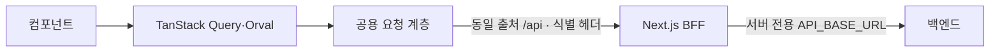

# 1-1-web-design

## 문서 정보

| 항목 | 값 |
| --- | --- |
| 버전 | v0.2 |
| 작성일 | 2026-09-09 |
| 수정일 | 2026-09-14 |
| 대상 | manyak-web |
| 작성 목적 | 웹의 현재 요청·라우팅·인증·관측 구조를 설명합니다. |
| 기준 코드 | [manyak-web](../../../manyak-web) |

## 읽는 순서

- [웹 Spec](../spec/3-2-web-spec.md)으로 계약을 확인한 뒤 요청 흐름 → 라우팅 → 인증 → 관측 순서로 읽습니다.

## 목차

- [1-1-1. 검증된 기술 환경과 요청 흐름](#1-1-1-검증된-기술-환경과-요청-흐름)
- [1-1-2. 라우팅·레이아웃·공통 셸](#1-1-2-라우팅레이아웃공통-셸)
- [1-1-3. BFF 프록시·토큰 세션](#1-1-3-bff-프록시토큰-세션)
- [1-1-4. 관측 연동](#1-1-4-관측-연동)
- [1-1-5. 테스트·Definition of Done](#1-1-5-테스트definition-of-done)

---

[공통 스펙](../spec/3-1-client-spec.md)과 [웹 스펙](../spec/3-2-web-spec.md)을 충족하는 현재 구조입니다. 역사적 선택은 [웹 ADR](../adr/1-2-web-adr.md)을 따릅니다.

## 1-1-1. 검증된 기술 환경과 요청 흐름

### 기술 환경

| 책임 | 기술·정본 |
| --- | --- |
| 렌더·타입 | Next.js App Router, React·React Compiler, TypeScript |
| 요청·검증 | TanStack Query, Orval, Zod |
| UI | Base UI·shadcn/ui, CVA, Tailwind CSS, motion, vaul, sonner, next-themes |
| 관측·테스트 | Amplitude·Sentry, Vitest·Playwright |
| 버전·실행 환경 | [package.json](../../../manyak-web/package.json)·[pnpm-lock.yaml](../../../manyak-web/pnpm-lock.yaml). 코드 작성·실행 규칙은 [웹 AGENTS](../../../manyak-web/AGENTS.md) |

### 요청 흐름

브라우저 요청은 BFF를 통합니다. 서버 직접 조회는 `API_BASE_URL` 절대 URL과 생성 URL 빌더를 사용합니다. Orval도 Next.js 환경 변수 우선순위로 같은 값의 `/v3/api-docs`를 읽습니다.

### SSE 클라이언트 구현 (웹)

채팅은 `fetch`·`ReadableStream`으로 SSE를 읽으며 공용 `fetchWithTimeout`을 우회하므로 클라이언트 시간 상한이 없습니다. EOF·오류·확정 교체 결과는 [공통 SSE 계약](../spec/3-1-client-spec.md#sse-스트리밍-계약)을 따릅니다.

진행 중 `token`·`character_image`를 도착 순서의 `text | character_image` 조각으로 관리합니다. 완료 후 상세의 `aiOutput`을 [chat-message-segments](../../../manyak-web/src/features/chats/_shared/utils/chat-message-segments.ts)로 파싱해 같은 조각 렌더를 사용합니다. 이어쓰기·재생성·상세·공유가 이 경로를 공유합니다. 이미지 블록은 텍스트 문단의 형제로 두어 `
` 안에 중첩하지 않습니다. URL 검증은 [원격 이미지](#원격-이미지-최적화), 표현은 [웹 표현 값](#웹-표현-값)을 따릅니다.

### 게스트 서재 상태 판정 (웹)

| 저장소 상태 | 의미·처리 |
| --- | --- |
| `null` | SSR·미하이드레이션: 로딩 |
| `[]` | 읽기 완료·비어 있음: 빈 상태 |
| `string[]` | 배치 조회 후 목록 표시 |

[use-created-stories](../../../manyak-web/src/features/studio/menu/hooks/use-created-stories.ts)는 게스트의 ID 목록 변경 시 `placeholderData`로 이전 카드를 유지하며 현재 ID에 없는 카드는 제외합니다. 새 스토리 배치 조회가 기존 목록을 스켈레톤으로 바꾸지 않고 낙관 삭제도 유지합니다.

웹 채팅 목록 변환은 `lastStoryPreview=null`을 제외합니다. 빈 문자열은 안내 문구로 표시하며 제목이 없는 삭제된 스토리의 채팅은 유지합니다. Android 목록에 이 필터를 적용하지 않습니다.

### 게스트 저장소 키 (웹)

키·직렬화의 실제 값은 각 `*-storage.ts`가 소유합니다. 사용자 보존 계약은 [웹 사용자 모델](../spec/3-2-web-spec.md#웹-사용자-모델)을 따릅니다.

| 저장소 | 값·소유 코드 |
| --- | --- |
| localStorage 스토리·채팅 ID | `manyak:created-story-ids`·`manyak:created-chat-ids`, 최신순 JSON 배열. [스토리 저장소](../../../manyak-web/src/features/stories/_shared/utils/story-id-storage.ts)·[채팅 저장소](../../../manyak-web/src/features/chats/_shared/utils/chat-id-storage.ts) |
| localStorage 안내 | `manyak:onboarding-seen`의 `'1'`, `manyak:chat-tour-seen`·`manyak:chat-choices-hint-seen`. 체험 사용량은 브라우저에 두지 않고 서버 조회([체험 잔여 패칭](#체험-잔여-패칭-웹))를 따른다 |
| localStorage 채팅 설정 | `manyak:chat-input-mode`의 `'block' \| 'plain'`, `manyak:chat-choices-enabled`·`manyak:chat-realtime-image-enabled`의 `'true' \| 'false'`(기본 on). [입력 모드](../../../manyak-web/src/features/chats/room/hooks/use-chat-input-mode.ts)·[on/off 저장](../../../manyak-web/src/features/chats/room/hooks/use-stored-toggle.ts) |
| localStorage 제작 | `manyak:pending-creation-request`의 JSON 판별 유니언. [제작 저장소](../../../manyak-web/src/features/stories/_shared/utils/creation-request-storage.ts) |
| sessionStorage 재개 의도 | `manyak:story-draft-resume-intent`의 `requestId`. 제작 화면에서 이동 전에 기록해 퍼널 재개 확인을 생략 |
| localStorage 결제 대기 주문 | `manyak:pending-credit-order`의 `{orderId, savedAt}`. 그로블 결제창 이동 직전에 기록하고 복귀 폴링에 쓴다(24시간 TTL). [주문 저장소](../../../manyak-web/src/features/my/credits/utils/pending-credit-order-storage.ts) |

제작 슬롯은 `KEYWORD_DRAFT`·`STORY_DRAFT`·`STORYLINE_GENERATION`·`STORY_COMPLETION` 중 한 건입니다. 읽기·쓰기·삭제 예외를 처리하며 실패를 저장 성공으로 표시하지 않습니다.

- 편집은 300ms 디바운스, `visibilitychange(hidden)`·`pagehide`에서 flush합니다. 복원 직후 삭제하지 않습니다. 저장 중·성공 배지는 실제 쓰기 결과를 따릅니다.
- 진행 요청은 draft보다, `STORY_DRAFT`는 늦은 `KEYWORD_DRAFT`보다 우선합니다. 서버 결과는 같은 `requestId`의 레코드만 교체·제거합니다.
- 완성 제출 레코드 저장 성공 뒤 POST하고 제작 탭으로 replace합니다. 언마운트 후 응답은 `resolveSuccessSettlement`·`resolveErrorSettlement`가 판정합니다. 성공·네트워크 오류·409는 복구에 맡기고, 그 외 확정 `FetchError`는 `demotePendingCompletionToDraft` 후 토스트로 처리합니다.
- [use-creation-progress-polling](../../../manyak-web/src/features/studio/menu/hooks/use-creation-progress-polling.ts)은 제작 카드가 보일 때 5초마다 조회합니다. 퍼널 복구는 보이는 동안 3초입니다. 두 경로는 [use-is-creation-request-pending](../../../manyak-web/src/features/stories/_shared/hooks/use-is-creation-request-pending.ts)으로 QueryClient의 MutationCache에서 생성 단계의 mutationKey와 requestId가 같은 진행 중 POST를 구독합니다. 원 POST가 끝날 때까지 쿼리와 캐시 결과 판정을 보류해 요청 등록 전 404와 재시도 전 FAILED를 소비하지 않습니다. 별도 저장소나 고정 지연은 두지 않으며, 새로고침 후에는 메모리의 원 POST가 없으므로 저장 레코드로 즉시 복구합니다. 사용자 결과는 [웹 제작 상태 표](../spec/3-2-web-spec.md#웹-제작-흐름)를 따릅니다.
- 완성 폴링은 `createdStoryId`를 확정하고 부수효과를 적용하되 레코드를 즉시 제거하지 않습니다. [created-story-list](../../../manyak-web/src/features/studio/menu/components/created-story-list.tsx)가 새 ID를 목록에서 확인하면 같은 렌더에서 진행 카드와 완성 카드를 교체한 뒤 슬롯을 정리합니다. 진행·완성 행은 같은 `ul`의 `AnimatePresence(mode="popLayout")`에서 전환하며, 기존 스토리 행의 ID key와 DOM을 유지합니다.
- `resolveCreationRecovery`로 결과를 판정하고 `replacePendingCreationRequest`·`markPendingStoryCreated` 선점에 성공한 경로만 게스트 카운터·ID·픽셀·회원 목록 무효화를 적용합니다. 직접 복구에서 완성 `storyId`는 채팅 성공 전까지 보존해 채팅만 재시도합니다.
- 진행 카드·새 제작의 재개 동작은 `sessionStorage` 의도로 연결합니다. 새로 만들기·삭제는 다이얼로그 대상과 현재 `requestId`가 같을 때만 슬롯을 제거합니다.

### 데이터 패칭 기본 옵션 (웹)

[query-client.ts](../../../manyak-web/src/lib/query-client.ts): `retry: false`, `staleTime: 60초`, `refetchOnWindowFocus: false`, `throwOnError: false`. 화면이 오류 상태·명시적 재시도를 처리합니다.

### 이프 정책 수치 패칭 (웹)

[useCreditPolicy](../../../manyak-web/src/hooks/use-credit-policy.ts)는 생성 훅의 200 본문을 반환하고 미수신·실패에는 `undefined`를 반환합니다. 기본 staleTime을 사용합니다. `formatCreditAmount`는 미수신 값에 `000`, 화면은 `animate-pulse`를 적용합니다. 토스트·공유 제목은 `useCreditPolicySnapshot`으로 이벤트 시점의 캐시를 읽으며 캐시 도착을 보장하지는 않습니다. 표시 계약·남은 확인은 [공통 Spec](../spec/3-1-client-spec.md#이프-정책-수치-표시)을 따릅니다.

### 체험 잔여 패칭 (웹)

[useTrials](../../../manyak-web/src/hooks/use-trials.ts)는 `GET /users/me/trials`의 200 본문을 반환하고 미수신·실패에는 `undefined`를 반환합니다. 세션 상태(`useSession().status`)를 쿼리 키에 넣어 로그인·로그아웃 때 게스트·회원 응답이 섞이지 않게 하고 `loading` 동안은 조회하지 않습니다. 잔여 계산(`limit - used`, `limit: null`은 무제한)·게스트 선차단 판정·잔여 표시 여부는 [guest-trial.ts](../../../manyak-web/src/features/auth/_shared/utils/guest-trial.ts)가 소유합니다. 채팅 턴 완료([chat-room.tsx](../../../manyak-web/src/features/chats/room/components/chat-room.tsx))와 스토리라인 생성·스토리 완성 부수효과([creation-side-effects.ts](../../../manyak-web/src/features/stories/_shared/utils/creation-side-effects.ts))가 `getGetTrialsQueryKey()`로 무효화해 세션별 키를 모두 다시 조회합니다. 잔여 문구·자리표시는 채팅 [constants.ts](../../../manyak-web/src/features/chats/room/constants.ts)의 `buildTrialRemainingLabel`·`formatTrialRemaining`이 만듭니다. 표시 계약은 [공통 Spec](../spec/3-1-client-spec.md#입력창과-선택지)을 따릅니다.

### 커서 목록 패칭 (웹)

이프 내역만 `getMyCreditTransactions`를 `useInfiniteQuery`로 감쌉니다. `nextCursor`를 그대로 넘기고 `limit`·`type`은 생략해 서버 기본 50건·전체를 사용합니다.

- sentinel은 `useInView(initialInView: false)`로 관찰합니다. 다음 요청 진행·실패 중에는 자동 요청을 멈추고 실패는 재시도 버튼으로 처리합니다.
- 받은 항목이 없을 때만 전체 오류를 표시합니다. 다음 페이지 오류는 `isFetchNextPageError`로 목록 아래에 표시해 기존 항목을 유지합니다.
- `gcTime: 0`으로 이탈 시 페이지를 버리고 재진입 때 첫 페이지부터 읽습니다. 잔액은 별도 `useMe(refetchOnMount: 'always')`를 사용합니다.

## 1-1-2. 라우팅·레이아웃·공통 셸

### 라우트 등록과 호환

URL·접근 조건의 정본은 [웹 라우팅 표](../spec/3-2-web-spec.md#라우팅-테이블), 실제 등록은 [src/app](../../../manyak-web/src/app)입니다. 일반 제작·수정 경로는 계약에 포함되어 있지만 현재 등록되어 있지 않습니다.

`/create`는 `/studio`로, `/create/story`·`/studio/story`·`/stories/new`는 `/studio/story/simple`로 영구 리다이렉트합니다. 다이얼로그·신고 시트·이미지 뷰어는 별도 화면 라우트를 만들지 않습니다.

### 라우팅 규칙

라우트 그룹은 권한이 아닌 셸을 나눕니다. `(main)`만 헤더·하단 탭을 공유하며 `(story)`·`(chat)`은 별도 레이아웃 없이 루트를 상속합니다. 그 밖의 화면은 자체 헤더를 사용하고 법적 문서·서비스 안내는 로고 홈 링크 헤더를 공유합니다.

- 루트 제목 템플릿은 `%s - 마냑`이며 기본값은 `src/constants/site.ts`입니다. 법적 문서·서비스 안내는 콘텐츠 제목, 스토리·채팅·공유는 조회한 제목을 사용합니다. 클라이언트 조회 전에는 서버 제목을 유지합니다.
- 상세 색인은 공개 오리지널 목록 포함 여부로 판정합니다. 사용자 스토리·판정 실패는 `noindex, nofollow`; 오리지널은 제목·소개·canonical·OG를 생성합니다. 썸네일 조회 실패에는 브랜드 이미지를 사용합니다.
- 공유 메타데이터는 공유본과 스토리 썸네일을 조회합니다. 실패에는 기본 제목과 `noindex, nofollow`를 반환하고 화면 조회는 계속합니다. 색인 범위는 [웹 Spec](../spec/3-2-web-spec.md#문서-열람과-검색-노출)을 따릅니다.
- 사이트맵은 요청마다 오리지널 목록을 읽고 실패하면 정적 공개 페이지만 반환합니다. 홈 서버 컴포넌트도 5초 제한으로 목록을 읽어 Query 초기 데이터에 넣으며 실패하면 클라이언트 조회로 이어집니다.
- 루트의 `WebSite`·`Organization` JSON-LD는 로마자 `alternateName`·공식 SNS `sameAs`를 포함합니다. 인라인 JSON의 `<`를 이스케이프해 `</script>` 조기 종료를 막습니다. 검색 결과·오타 보정 효과를 보장하지 않습니다.

### 히스토리 처리

| 이동 | 구현 |
| --- | --- |
| 카드 → 상세, 제작 → 퍼널 | `Link`; 초안이 있으면 먼저 재개 확인 |
| 상세 → 새 채팅 | `replace` |
| 완성 제출 → 제작 | 저장 성공 뒤 `replace('/studio')`; 직접 복구·저장 실패 예외는 웹 Spec |
| 채팅 헤더 뒤로 | `push('/chats')` |
| 스토리·채팅 삭제 성공 | 각각 `replace('/studio')`·`replace('/chats')`; 목록 삭제는 현재 화면 유지 |
| 하단 탭 | `Link replace`, 정확한 pathname 일치로 `aria-current="page"` |
| 퍼널 X·브라우저 back | 예약 저장 flush 후 `replace('/studio')` |
| 온보딩 완료 | 열람 저장 후 목적지로 `replace` |
| 마이 → 서비스 안내·법적 문서 | 새 탭 |

### 레이아웃 구조

루트만 관측·Query·Motion·테마 Provider와 토스트를 두고 `max-w-md`·`h-svh` 중앙 프레임을 만듭니다. `lang="ko"`, `viewportFit: cover`, 하단 `env(safe-area-inset-bottom)`을 적용합니다.

각 화면은 헤더 / 스크롤 본문 / 푸터의 flex column입니다. CTA·하단 탭은 본문과 형제로 두고 본문만 스크롤합니다. 스크롤·오버레이의 구현 규칙은 [웹 AGENTS](../../../manyak-web/AGENTS.md)를 따릅니다.

- 상세·피드백·공유는 `scroll-fade-b`; 온보딩은 본문 안에 시작 버튼·푸터를 두며 하단 페이드·고정 CTA를 두지 않습니다.
- 제작 단계 푸터의 키워드·비용 행은 공용 상단 슬롯을 씁니다. 텍스트 입력 포커스가 있고 `VisualViewport`(대체 `innerHeight`)가 기준보다 120px 이상 줄면 푸터를 숨기고 복원 시 다시 표시합니다. 포커스만으로 숨기지 않습니다.
- Drawer는 앱 프레임에 포털하고 투어는 `body`에 포털합니다. 투어 카드 좌표는 앱 프레임 폭·하이라이트 변을 기준으로 제한하며 세로 가용 공간을 `max-height`로 설정합니다. 숨긴 채팅 헤더는 `aria-hidden`·`inert`로 접근 대상에서도 제외합니다.

### 공통 셸

`next-themes`가 기기 선택값과 시스템 테마를 적용합니다. 레이아웃·키보드·안전 영역 계약은 [웹 Spec](../spec/3-2-web-spec.md#3-2-5-반응형접근성브라우저-지원)을 따릅니다.

### 상단 헤더·하단 네비게이션

메인 헤더는 현재 섹션을 표시하며 홈만 로고와 스크린 리더용 `h1` "홈"을 사용합니다. 홈·채팅·제작의 로그인 버튼은 세션이 게스트로 확정된 뒤 표시하고 마이 헤더에는 두지 않습니다. 하단 4탭의 라벨·경로는 웹 Spec을 따릅니다.

상세 헤더는 히어로 위 absolute입니다. 스크롤 비율로 배경·전경색을 보간하고 본문 `h1`이 가려지면 제목을 표시합니다. 실제 DOM 마운트를 effect 의존성에 포함해 지연 스켈레톤 뒤에도 listener·IntersectionObserver를 연결합니다.

### 오리지널 태그 이미지 (웹)

`ORIGINAL_TAG_SRC`(`src/features/stories/list/constants.ts`)가 디자인 원본 `public/stories/manyak-original-tag-black-green-translucent.svg`를 가리킵니다. 배경만 반투명으로 두고 CSS 블러를 도안 모서리에 클리핑합니다. `next/image unoptimized`로 제공하며 `dangerouslyAllowSVG`를 켜지 않습니다.

### 스토리 좋아요 버튼·집계 배지 (웹)

렌더 호출은 비활성화되어 있고 `use-story-like.ts`·`story-like-count.tsx`·상수·아이콘·생성 API 훅은 남아 있습니다. 중단한 테스트는 [스토리 QA](../qa/stories.md#좋아요-재노출-검증)에서 확인합니다.

### 스토리 상세 CTA 배경 연결 (웹)

`useStoryFooterBackground`가 남은 스크롤 거리와 메타 높이의 2배(최소 160px)를 기준으로 `smoothstep`·`color-mix(in oklab, …)`을 적용합니다. 바닥에서 `--muted`, 그 밖에서는 `--background`로 연결하며 CTA·main은 `bg-inherit`를 공유합니다. 본문은 기본 배경을 유지하고 메타가 없으면 보간하지 않습니다.

passive listener·requestAnimationFrame·ResizeObserver로 스크롤·크기 변경을 반영하고 언마운트 때 모두 해제합니다.

### 바텀 시트 스크롤 (웹)

vaul `DrawerContent`에는 `overflow-y-auto`를 두지 않습니다. vaul이 러버밴드 틈을 메우려고 시트 아래에 깔아 두는 `::after`(높이 200%)까지 스크롤 영역에 잡혀 시트 높이의 2배만큼 빈 스크롤이 생깁니다. 스크롤은 시트 본문 래퍼(`min-h-0 overflow-y-auto overscroll-contain`)가 맡습니다. 입력 필드가 없는 시트(채팅 설정)는 `repositionInputs={false}`로 vaul의 키보드 대응(높이 재계산)을 끕니다.

### 바텀 시트 닫기 버튼 (웹)

닫기는 `size="xs"`·`w-fit self-center`입니다. 신고 버튼 아래 4px, 초대 등록 버튼 아래 8px 간격을 사용합니다. 보상 지급 뒤 플래그 저장 실패의 닫기 재시도도 같은 크기·정렬을 사용합니다. 요청 잠금·실패 복구는 공통 Spec을 따릅니다.

### 법적 콘텐츠 소스 (웹)

[terms-content.ts](../../../manyak-web/src/features/legal/content/terms-content.ts)·[privacy-content.ts](../../../manyak-web/src/features/legal/content/privacy-content.ts)가 시행일·버전·본문의 정본입니다. Android `LegalUrlProvider`가 `WEB_BASE_URL/terms`·`/privacy`를 만들고 `LegalDocumentScreen` WebView가 같은 본문을 표시합니다. 미래 시행일을 현재 시행본으로 부르지 않습니다.

### 온보딩 진입 게이트 (웹)

노출 계약은 [웹 온보딩](../spec/3-2-web-spec.md#fe-screen-007-온보딩-페이지)을 따릅니다.

1. `proxy.ts`가 메인 4탭에서 열람·NextAuth 쿠키 모두 없으면 원본 쿼리 전체와 `from`을 보존해 `/onboarding`으로 보냅니다. 쿠키 유무는 인증 확정 판정이 아닙니다.
2. 페이지 가드가 세션·로컬 ID·열람 상태를 읽습니다. 대상이 아니면 열람 쿠키를 복구하고 허용된 메인 탭 `from`(기본 홈)으로 돌아갑니다. 열람은 localStorage·쿠키에 함께 기록해 루프를 막습니다.
3. 검색봇·링크 스크래퍼는 게이트만 우회합니다. `daumoa`·`kakaotalk-scrap` 등 구체 UA로 앱 UA와 구분합니다. AI/LLM 크롤러 허용을 이 목록에서 추정하지 않습니다.

### 스토리 신고 진입점 (웹)

상세 `story-options-menu`, 채팅 `chat-options-menu`, 목록 `card-options-dialog`가 공용 `story-report-sheet`를 엽니다. 상세 메뉴는 `canReport`·`canDelete`가 모두 거짓이면 트리거도 숨깁니다. 채팅의 삭제된 참조 스토리는 `useChatDetail`이 신고 ID를 `null`로 정리합니다. 카드 축소판은 각 카드의 `compact` 변형을 재사용하고 삭제는 공용 훅을 공유합니다.

### 웹 표현 값

공통 Spec의 동작을 웹 컴포넌트로 표현하는 값입니다. 같은 값을 화면별 Spec·QA에서 다시 정의하지 않습니다.

| 영역 | 표현 |
| --- | --- |
| 기본·서사 서체 | Pretendard / MaruBuri. `.font-maruburi` 한 곳에서 자간 -2%·행간 175%. 본문 16px(28px), 추천 14px(24.5px) |
| 목록 행 | 가로 16px·세로 8px 패딩, 열 간격 16px, 하단 8px. 제작 표지 128px·3:4, 채팅 표지 48px·3:4·모서리 12px. 옵션 아이콘 위로 1px 보정; 스켈레톤 동일 |
| 홈·상세 | 표지 3:4. 상세 헤더 56px, 로딩 지연 300ms·펄스 1.4초, Select 모서리 10px, 메타 패딩·행 간격 16px |
| 제작 FAB·진행 카드 | FAB hover 3% 확대·primary 불투명도 유지. 진행→완성 카드는 같은 자리에서 opacity 200ms ease-out으로 교체. 빠지는 행은 popLayout으로 새 행과 겹쳐 페이드하고 기존 행은 layout="position"으로 필요한 위치 변화만 200ms 보간. 완성 중 제목은 공용 `TextShimmer`에 4초 주기를 지정. 점 격자는 `ImageGeneration`의 `interactive` 옵션을 활성화해 hover·fine pointer 환경에서 포인터를 추적하며, 영역 밖에서는 자동 이동. 동작 줄이기에서 행 교체는 즉시, 위치·확대·장식 모션 중지 |
| 제작 퍼널 로딩 | 스토리라인 생성·스토리 완성은 `StoryGeneratingLoading`을 공유하며 `ReasoningText`의 문구 전환 간격과 쉬머 주기를 각각 4초로 지정. 문구 왼쪽 로더는 `ReasoningText` 기본값(`Loader` dots 14px) |
| 채팅 스트림 로딩 | 로딩 블록은 500ms EASE_OUT 페이드로 등장하고, 첫 조각이 오면 `AnimatePresence mode="popLayout"`으로 흐름에서 빠져 본문 위에서 150ms 페이드로 퇴장한다(본문은 200ms 페이드 등장). 로딩이 차지하는 높이는 로딩이 흐름에 있는 마운트 시점에 래퍼 `min-height`로 미리 잡아 앵커 아이템이 줄어들지 않게 한다(응답 도착 뒤에 재면 popLayout이 먼저 로딩을 빼며 강제 레이아웃된 프레임에 스크롤이 스페이서 높이만큼 클램프된다). 블록 패딩은 좌우 16px에 실시간 이미지 켬이면 위·아래 20px, 끔이면 16px. 실시간 이미지 켬이면 `ReasoningText`(문구 전환·쉬머 각 4초, 제작 퍼널과 동일)가 y 8px→0·500ms로 먼저 올라오고, 20px 아래 4:3 `ImageGeneration`(generating, 제작 진행 카드와 동일)이 150ms 늦게 opacity 0→1·y 16px→0·scale 0.97→1을 600ms로 떠오른다(reduced motion은 페이드만) |
| 메인 헤더·탭 | 헤더 20px semibold, 탭 아이콘 24px outline/filled와 같은 전경색 라벨. ORIGINAL 태그 72×26px·좌상단 11px/우하단 6px 클리핑 |
| 제작 탭·푸터 | 전체 폭 3등분 라인 탭, 위아래 탭 패딩 없음·선택선이 기준선 덮음. 본문 위 16px·아래 32px, 선택 키워드·비용 행 높이 40px와 CTA 간격 8px. 키워드 그룹 간격 24px |
| 인물·추가 정보 | 이름/성별 3:2. 주변 인물 폼 좌우 16px, 헤더 이름·삭제 14px·순번 12px. 추가 정보 목록/자유 입력 사이와 패널 아래 32px |
| 입력·추천 | 일반 입력 최대 `20dvh`. 비용은 전송 왼쪽 8px·12px 보조색. 메시지 세로 20px·가로 16px. 추천 목록 위 12px·항목 간 8px; 8px 이동·300ms ease-out·80ms 순차 지연, 같은 묶음은 1회 |
| 재생성·인물 이미지 | 재생성 아래 20px+추천 위 12px. 이미지 4:3·object-contain·좌우 16px·곡률 20px·1px 시맨틱 보더. 앞 텍스트→이미지 40px, 이미지→뒤 텍스트 20px; 첫 이미지 위 추가 여백 없음 |
| 계정·공유 | 잔액 카드 안쪽 16px. 초대 시트 제목/설명 8px·설명/폼 32px. 탈퇴 체크박스 1px 보더·문구 간격 16px. 공유 화면 진입 opacity 150ms |

## 1-1-3. BFF 프록시·토큰 세션

### 인증 API 라우트

| 라우트 | 책임 |
| --- | --- |
| `/api/auth/[...nextauth]` | OAuth 시작·콜백·세션, 연동 전용 `link-*` 포함 |
| `/api/auth/handoff-session` | 코드 검증 후 httpOnly 쿠키 이전. 무효·만료 404, 코드 원문 미반환 |

### BFF 프록시

`/api/[...path]`는 `host`·브라우저 `cookie`를 제거하고 식별 헤더와 서버에서 결정한 Authorization을 전달합니다. `cache: no-store`, 응답 본문 스트리밍 통과를 사용합니다. `API_BASE_URL` 누락은 500입니다. 배포 실행 시간 상한은 코드의 요청 제한과 별개이며 [배포 문서](4-deployment.md)·운영 설정에서 확인합니다.

### 요청 타임아웃

공용 브라우저 데이터 요청과 BFF 인증 요청은 200초입니다. 백엔드 동기 컴파일 예산 180초에 전달·재발급 여유 20초를 둡니다. SSE는 이 계층을 우회하므로 같은 상한이 적용되지 않습니다.

### 토큰 세션 (BFF)

NextAuth OAuth 세션과 백엔드 access·refresh용 httpOnly·SameSite 쿠키를 함께 사용합니다. UI 회원 판정은 `useSession().status`, 회원 데이터는 `GET /auth/me`입니다.

로그인은 provider 인증 → 백엔드 로그인 → 회원 조회 검증 → 토큰 쿠키 기록 순서입니다. 회원 검증 전에 쿠키를 확정해 반쪽 세션을 남기지 않습니다. [backend-session.ts](../../../manyak-web/src/lib/auth/backend-session.ts)의 `ensureFreshAccessToken`가 요청 전 access 만료 임박과 refresh 결과를 처리합니다.

| 상태 | BFF 처리 |
| --- | --- |
| 유효 access 또는 재발급 성공 | Authorization에 access 주입 |
| refresh 4xx, 또는 유효 access·refresh를 확보하지 못하고 NextAuth 세션만 존재 | 쿠키·청크 쿠키 정리, 401·`x-manyak-session-expired: 1`. 익명 요청으로 전환하지 않음 |
| 재발급 5xx·네트워크 오류 | 쿠키 유지. 기존 access가 있으면 best-effort 전달, 없으면 503 |
| 토큰·세션 모두 없음 | 게스트 요청 |
| access 없이 refresh만 남음 | 재발급 시도 |

로그아웃은 서버 실패에도 로컬 정리를 끝냅니다. 탈퇴는 204 이후 정리합니다. 토큰은 브라우저 JS·로그에 노출하지 않습니다.

### 소셜 로그인·계정 연동 (웹 구현)

- Kakao는 issuer `https://kauth.kakao.com`의 OIDC, `client_secret_post`, scope `openid`를 명시합니다. `/api/auth/callback/{provider}`는 각 콘솔 등록과 일치해야 합니다.
- 공통 시작 함수가 `redirected`·`failed`로 진행 잠금을 제어하고 `pageshow(persisted)`에서 bfcache로 복원된 잠금을 해제합니다. OAuth 실패는 `/login?error=…`로 돌아옵니다.
- `link-google`·`link-kakao`는 자격증명을 명시한 연동 전용 provider입니다. 링크 코드는 httpOnly 쿠키에 두고 `/my/link/continue?target=`가 대상 OAuth를 시작합니다. Google 재인증에는 현재 세션의 `login_hint`를 사용할 수 있습니다.
- 연동 콜백은 기존 세션 쿠키를 복호화해 원래 클레임을 반환합니다. 새 OAuth 프로필로 세션을 교체하지 않으며 기존 세션이 없으면 실패시킵니다. 연동 전용 콜백 URL 등록도 필요합니다.
- 동의·연동 실패의 사용자 결과는 [공통 계정 계약](../spec/3-1-client-spec.md#fe-screen-008-로그인마이-페이지)을 따릅니다.

### 원격 이미지 최적화

| 경계 | 허용 범위 |
| --- | --- |
| Next 이미지 최적화 | Google `lh3.googleusercontent.com` 전체, `api.manyak.app`·`dev-api.manyak.app`의 `/profile-presets/**`, `cdn.manyak.app`·`dev-cdn.manyak.app` 전체. [next.config.ts](../../../manyak-web/next.config.ts) |
| 인물 이미지 런타임 | HTTPS + 정확한 운영·개발 CDN 호스트 + `/characters/generated/`·`/characters/originals/`·`/chat-images/`(실시간 이미지). 스트림·저장 마커·상세 인물 카드에 동일 적용 |
| 저장 마커 파싱 | 독립된 `[[URL]]` 한 줄 + 빈 줄 하나 + 비어 있지 않은 `인물명:` 대사 라벨 + 위 URL 허용 범위. 불일치는 이미지 요청 없이 일반 본문 유지 |

최적화기의 호스트 허용이 임의 모델 출력 URL을 허용하지는 않습니다. 이전 `[[인물이름:URL]]` 형식은 지원하지 않습니다. 이미지 실패·대체 텍스트·뷰어는 공통 계약을 따릅니다.

### 인앱 브라우저 감지와 탈출 스킴

루트 `in-app-browser-observer`는 SSR에서 미감지 상태, 클라이언트에서 UA를 판정합니다. 진입을 차단하거나 자동 탈출하지 않습니다.

| UA | 외부 전환 시도 |
| --- | --- |
| `KAKAOTALK` | `kakaotalk://web/openExternal?url=…` |
| `Instagram`·`Barcelona` | Android `intent://`, iOS `x-safari-`; 사용자 클릭과 수동 외부 열기 안내 병행 |

provider별 적용은 [웹 지원 표](../spec/3-2-web-spec.md#인앱-브라우저와-로그인-핸드오프)를 따릅니다. 실제 전환은 앱 버전에 영향을 받으므로 실기기 QA와 수동 대체 경로를 유지합니다.

### 인앱 게스트 허용·로그인 핸드오프

모든 소셜 CTA는 `start-social-login`을 사용합니다. 홈·마이 직행 단축은 Instagram·Threads만 적용하고 KakaoTalk은 `/login`에서 provider를 선택합니다.

1. 서버에 게스트 스토리·채팅 ID, 원본 device ID, callbackPath, 출처 앱을 보내 핸드오프를 생성합니다. device ID 해시는 서버가 하므로 클라이언트에서 해시하지 않습니다.
2. 외부 전환 전에 주소를 `/login/continue?handoff=…`로 교체합니다. URL에는 코드와 SDK 캠페인 쿠키의 비어 있지 않은 UTM 6종(`utm_source`·`utm_medium`·`utm_campaign`·`utm_term`·`utm_content`·`utm_id`)만 싣습니다. 콘텐츠 ID·device ID·토큰·`fbclid`는 싣지 않습니다.
3. 외부 랜딩은 코드를 검증해 짧은 httpOnly 쿠키로 옮기고 주소에서 코드만 제거합니다. UTM은 유지합니다. `Cache-Control: no-store`·`Referrer-Policy: no-referrer`를 적용하고, 이관 건수를 보여준 뒤 사용자 클릭으로 로그인을 시작합니다. 성공 수령 시 온보딩 열람도 기록합니다.
4. BFF는 **첫 백엔드 로그인 전에** 쿠키를 읽어 `handoffCode`를 로그인 본문에 싣습니다. 핸드오프가 없으면 Amplitude 쿠키의 device ID를 헤더로 전달합니다. 회원 체험 시드가 확정된 뒤 보충하지 않습니다.
5. 로그인 자체가 시드·이관을 소비하므로 별도 소비 API를 호출하지 않습니다. 성공 후 검증된 앱 내 상대 callbackPath로 이동합니다. 서버의 이관 1회·시도 5회 상한을 따릅니다.
6. 인앱 복귀 시 이관에 성공한 ID만 제거합니다. 발급 뒤 만든 데이터·`migrationClosed`로 이관하지 못한 ID는 보존합니다. 일반 로그인 이관도 [use-auto-migration](../../../manyak-web/src/features/auth/_shared/hooks/use-auto-migration.ts)의 평가 결과별 정리를 따릅니다.

코드·토큰·공유 식별자는 관측 데이터에서 제외합니다. 실패 분기는 [인증 QA](../qa/auth.md)로 확인합니다.

## 1-1-4. 관측 연동

### 발화 경로

수동 이벤트는 단일 관측 진입점에서 `screen_name`을 결정하고 Sentry breadcrumb 후 활성 Amplitude로 전달합니다. 화면 마운트·직렬화 props 변경, 액션 핸들러, 노출 관찰 훅이 이 경로를 사용합니다. 노출 비율·시간·중복 억제값과 이벤트 목록은 [분석 Spec](../spec/6-analytics.md)을 따릅니다.

### 활성 조건·상관관계

프로덕션에서 기본 전송하고 그 밖에서는 콘솔 디버그를 사용합니다. 초기화한 Amplitude device ID를 Sentry user와 API의 `X-Manyak-Device-Id`·`X-Manyak-Session-Id`에 연결합니다. 수집·제외 기준은 분석 Spec을 따릅니다.

## 1-1-5. 테스트·Definition of Done

### 테스트 범위

| 수단 | 경계 |
| --- | --- |
| Vitest | SSE·저장·상태 전환 등 순수 로직 |
| Playwright Pixel 5 | 전체 기능·요청 계약 |
| Desktop Chrome·iPhone 13 | `e2e/smoke/` 핵심 진입·이동 |
| 비주얼 회귀 | Linux 기준 `e2e/visual/`; UI 변경 시 diff 검토. macOS는 스냅샷 비교 제외 |

### e2e ↔ US 매핑

[QA 인덱스](../qa/AGENTS.md)의 도메인별 케이스·자동화 열과 [e2e](../../../manyak-web/e2e)의 실제 테스트를 함께 확인합니다. 실행되지 않는 skip과 미작성 계약은 통과로 처리하지 않습니다.

### Definition of Done

변경 범위에 따른 필수 명령은 [웹 AGENTS](../../../manyak-web/AGENTS.md), 수동·실기기 검수는 QA, 실행 환경·결과·릴리스 근거는 해당 계획·PR에 남깁니다. 문서 편집과 제품 실행 검증을 구분합니다.
