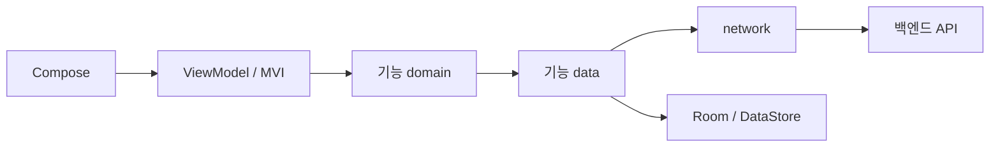

# 1-2-android-design

## 문서 정보

| 항목 | 값 |
| --- | --- |
| 버전 | v0.5 |
| 작성일 | 2026-09-09 |
| 수정일 | 2026-09-26 |
| 대상 | manyak-android |
| 작성 목적 | 모듈 책임, 상태 수명, 인증·제작·알림의 실패와 복구 경계를 설명합니다. |
| 기준 코드 | [manyak-android](../../../manyak-android) |

## 읽는 순서

- 공통·Android Spec으로 사용자 계약을 확인한 뒤 모듈 → UI 상태 → 담당 기능 순서로 읽습니다. API 필드·화면별 수용 기준은 Spec을 참조하고 이 문서에서는 내부 책임과 수명을 확인합니다.

## 목차

- [1-2-1. 기술 환경과 요청 흐름](#1-2-1-기술-환경과-요청-흐름)
- [1-2-2. 모듈과 소유권](#1-2-2-모듈과-소유권)
- [1-2-3. UI 상태와 작업 수명](#1-2-3-ui-상태와-작업-수명)
- [1-2-4. 내비게이션과 화면](#1-2-4-내비게이션과-화면)
- [1-2-5. 인증과 세션](#1-2-5-인증과-세션)
- [1-2-6. 푸시와 알림](#1-2-6-푸시와-알림)
- [1-2-7. 제작과 상태 복원](#1-2-7-제작과-상태-복원)
- [1-2-8. 관측](#1-2-8-관측)
- [1-2-9. 검증 방법](#1-2-9-검증-방법)

---

[공통 스펙](../spec/3-1-client-spec.md)과 [Android 스펙](../spec/3-3-android-spec.md)을 구현하는 구조입니다. 선택 이유는 [Android ADR](../adr/1-3-android-adr.md)을 따릅니다.

## 1-2-1. 기술 환경과 요청 흐름

| 구분 | 기준 |
| --- | --- |
| 언어·UI | Kotlin, Jetpack Compose, Material 3. 정확한 버전은 [버전 카탈로그](../../../manyak-android/gradle/libs.versions.toml) 참조 |
| Android | minSdk 24, compileSdk·targetSdk 37 |
| 빌드 | 빌드 JDK 25, JVM bytecode 11. AGP·Gradle은 [앱 빌드 설정](../../../manyak-android/app/build.gradle.kts)·[Wrapper](../../../manyak-android/gradle/wrapper/gradle-wrapper.properties) 참조 |
| 구조 | 직접 구현 MVI, Hilt, Navigation 3 |
| 통신·이미지 | Retrofit, OkHttp, kotlinx.serialization, okhttp-sse, Coil |
| 푸시 | Firebase Cloud Messaging — Crashlytics와 같은 Firebase 프로젝트·BOM |
| 저장 | Room, DataStore, Android Keystore |
| 관측 | Amplitude, Firebase Crashlytics |

Android는 BFF 없이 백엔드에 직접 요청합니다. `network`는 공용 HTTP 전송과 인증 연동 포트를, 기능 `data`는 DTO·매핑·Repository 구현을 소유합니다. API 정본은 [백엔드 Spec](../spec/4-backend-server-spec.md)입니다.

## 1-2-2. 모듈과 소유권

### 모듈 구성과 의존 방향

17개 Gradle 모듈과 별도 included build인 `build-logic`을 사용합니다. `app`만 Application이며 `common`도 Android 기반 MVI·리소스·저장을 포함하는 Android Library입니다. `entity/domain/data/presentation`은 필요한 모듈 내부의 패키지이며 별도 Gradle 모듈이 아닙니다.

| 모듈 | 책임·허용 의존 |
| --- | --- |
| `app` | 조립 지점. 내비게이션 연결, DI, 세션 종료 조정, 실제 기능 모듈 결합 |
| `common` | `DomainError`·`DomainResult`, 공유 모델·계약. 다른 프로젝트 모듈에 의존하지 않음 |
| `designsystem` | 공용 Compose UI·토큰·리소스. 값과 콜백을 받으며 Repository에 의존하지 않음 |
| `navigation` | 경로·결과 타입. 다른 프로젝트 모듈에 의존하지 않음 |
| `network` | HTTP·인증 포트. `common`에 의존 |
| `analytics` | 관측 어댑터. `common`에 의존하며 기능 모델 대신 자체 값·기본 타입을 받음 |
| `auth` | 인증·토큰·세션. `common`, `network`에 의존 |
| `report` | 신고 흐름·`StoryReportController`. `common`, `network`, `designsystem`, `analytics`에 의존 |
| `home`, `chat`, `studio`, `story`, `create`, `my`, `login`, `legal`, `notification` | 기능 소유권. 필요한 공통 모듈·`auth`를 사용하고 HTTP 의존은 data로 제한. 신고 소비 기능만 `report` 사용 |

기능은 실제 책임에 필요한 내부 패키지만 만들고 단순 위임 UseCase·빈 계층·하위 UI 전용 ViewModel을 추가하지 않습니다. `create/presentation/state`는 공유 퍼널 상태를, `my/data`는 profile·invite의 저장 인스턴스 구성을 소유합니다.

화면 기능 간 직접 의존을 만들지 않습니다. `app`이 콜백을 연결하고 기능 간 호출은 아래 공유 계약으로 연결합니다. `domain/entity`는 Android·Compose·Retrofit·Room·data 구현에 의존하지 않으며, `presentation`도 data·network 구현을 직접 참조하지 않습니다. `entity`의 domain 의존은 `DomainError` 값 같은 허용 예외로 제한합니다.

### 공유 계약과 구현 소유자

| 계약·상태 | 소유자와 소비 방식 |
| --- | --- |
| `ChatStarter` | `common` 계약, `chat` 구현. 다른 기능의 채팅 시작 요청을 연결 |
| `CreationProgressAccess` | `common` 계약, `create` 구현. 제작 요약 관찰·폐기·새로고침만 노출 |
| `StoryDeletion` | `common` 계약, `studio` 구현. 상세 화면의 삭제와 목록 상태를 연결 |
| `SignupOnboardingWriter` | `common` 계약, `my`의 초대 상태 구현. `auth`가 가입 결과를 전달 |
| `SessionTokenAccess` | `network` 포트, `auth`의 `SessionTokenManager` 구현 |
| `UserProfile`·초대 온보딩 | `my` 저장소가 정본. 같은 DataStore 파일에 여러 인스턴스를 만들지 않음 |
| `CreditPolicy`, 공유 `StorySummary`·DTO | 기존 공유 타입은 `common`에 유지. 비즈니스 Repository 구현은 옮기지 않음 |
| `StoryReportController` | 채팅 목록·채팅방·제작·스토리 상세에서 사용. 별도 공용 ViewModel·Singleton을 추가하지 않음 |

`SessionTerminationCoordinator`와 `UserScopedStore` 목록 조립은 `app`이 소유합니다. Hilt는 Singleton·ViewModel·제작 저장소의 ActivityRetained 수명을 사용하며 별도 사용자 세션 Component는 두지 않습니다. 인증 클라이언트 → Interceptor → 토큰 관리자 → 재발급 API → 무인증 클라이언트 경로는 지연 주입과 재발급 single-flight로 순환·재귀 호출을 막습니다.

리소스는 기능·designsystem·common·app의 실제 소유권에 맞춥니다. `build-logic`은 공통 빌드 설정을 소유하고 앱 서명 설정을 가져가지 않습니다. 공개 타입은 소비 지점에 필요한 최소 범위로 두되 Hilt 생성 코드의 접근성을 확인합니다.

### 구조 검사와 호환성

`checkModuleArchitecture`는 Gradle 의존과 Kotlin PSI 참조를 검사합니다. import alias·완전 수식 이름·typealias도 검사하지만 완전한 의미 분석이나 reflection 검증은 아닙니다. 루트 `check`와 CI에 연결합니다.

패키지 이동 때문에 DB 파일명·버전·스키마 identity hash, DataStore 파일·키, Keystore alias, 직렬화된 경로 이름·패키지, Application ID·Manifest·백업 제외 규칙을 바꾸지 않습니다. 구조 변경을 이유로 destructive migration이나 일괄 저장소 삭제를 사용하지 않습니다.

## 1-2-3. UI 상태와 작업 수명

`MviViewModel<I, S, E, F>`는 Intent → side effect → ReducerEvent → 순수 reducer → 불변 UiState 흐름을 사용합니다. ViewModel 밖이나 비동기 작업에서 `MutableStateFlow`를 직접 갱신하지 않습니다.

- Intent·ReducerEvent·UiEffect는 각각 용량 64, `SUSPEND` 방식의 bounded Channel과 단일 소비자를 사용합니다. 버리기 정책이나 결과를 무시한 `trySend`를 쓰지 않습니다.
- UiEffect는 `receiveAsFlow`로 제공하고 STARTED 상태의 단일 host가 소비합니다. 정지 중에는 큐에 남고 소비한 이벤트는 재생하지 않으며 ViewModel 종료 시 사라집니다. 반드시 처리해야 하는 결과는 확인 가능한 지속 상태로 모델링합니다.
- 비동기 작업은 명시적인 자식 코루틴과 요청별 single-flight로 중복을 막습니다. `CancellationException`을 일반 오류로 삼키지 않습니다.
- 재시도 책임은 한 계층에 두며 소셜 로그인·계정 연동을 자동 반복하지 않습니다. 공용 `apiCall`은 전송 오류를 도메인 오류로 매핑하고 UI 문구는 presentation이 소유합니다.
- 무거운 IO·암복호화는 호출된 함수가 주입받은 dispatcher에서 실행합니다. `stateIn`·`shareIn`은 scope·시작 조건·구독자 부재 시 유지 시간을 명시합니다.
- 화면 작업은 ViewModel, 프로세스 내 제작 실행·푸시 등록은 앱 수명을 사용합니다. 프로세스 사망을 넘겨야 하는 상태는 Room 등 저장소에서 복구하며 WorkManager·Foreground Service로 실행을 유지하지 않습니다.

## 1-2-4. 내비게이션과 화면

Navigation 3의 typed `NavKey`와 루트 back stack을 사용합니다. 경로 연결은 `app`의 콜백이며 기능 ViewModel에 back stack을 주입하지 않습니다. 인증·메인 그래프는 별도 back stack이며 세션 상태에 따라 선택합니다. Pending은 어느 그래프도 열지 않고 CleanupFailed는 정리 재시도 화면만 엽니다. 로그인·로그아웃 전환 때 이전 stack을 버리며 로그아웃 처리자가 화면 이동을 별도로 수행하지 않습니다.

직렬화 가능한 경로에는 storyId·chatId처럼 복원 가능한 식별자만 담고 목적지에서 데이터를 다시 읽습니다. 경로 값은 생성 시점에 ViewModel에 주입하며 저장 상태에서 경로 키를 다시 해석하지 않습니다. 공용 법적 문서는 두 그래프에서 열 수 있고 진입한 화면으로 돌아갑니다. 메인 탭은 홈·채팅·제작·마이입니다.

로그인·탭·상세·제작·채팅·마이 화면의 사용자 동작은 [공통 Spec](../spec/3-1-client-spec.md), 플랫폼 적용 차이는 [Android Spec](../spec/3-3-android-spec.md)이 정본입니다. 화면 구현에서는 다음 경계를 유지합니다.

- 홈 카드·상세 히어로의 `StoryThumbnail`은 좋아요 수·누적 턴 수 배지를, 제작 `MyStoryCard`의 메타는 좋아요 수·턴 수·제작일을 그립니다. 두 수는 `designsystem`의 `formatCompactCount`로 축약합니다. 상세 `StartChatCta`는 `StoryDetailUiState.canLike`(내 스토리가 아님)일 때 채팅 시작 버튼 왼쪽에 좋아요 버튼을 두고 `StoryDetailViewModel`의 `ToggleLike`로 등록·취소합니다. 요청 중에는 버튼을 잠그고 응답 뒤 0.5초 쿨다운으로 연타를 거르며, 실패하면 상태·수를 유지하고 토스트를 띄웁니다.
- 시트 닫기는 `ManyakTextButton`을 사용하고, 마이 메뉴 규격·선택 컨트롤 행의 리플과 접근성 규칙은 [Android 디자인 시스템](../../../manyak-android/DESIGN.md#컴포넌트)을 따릅니다.
- 카드 옵션·상세 옵션·채팅 메뉴는 `designsystem`의 `ManyakOptionsSheet`·`ManyakOptionItem`으로 그립니다. 시트 열림은 제작·채팅 목록에서 ViewModel의 대상 카드 상태(`optionsTarget`)가, 상세·채팅방에서 화면의 `rememberSaveable`이 들어 구성 변경에서 유지합니다. 삭제 확인·신고 시트는 옵션 시트를 닫은 뒤 엽니다. 채팅방 메뉴의 새 채팅은 `ChatRoomViewModel`이 `ChatRepository`(`ChatStarter`)로 single-flight 생성하고 진행 상태를 소유하며, `app`이 백스택 맨 위 `ChatRoomRoute`를 새 방으로 바꿔 끼웁니다. 내 이프 카드는 `designsystem/credit/CreditBalanceCard`를 마이와 함께 쓰고, 채팅방은 메뉴를 열 때 `UserProfileRepository.refresh()`로 잔액을 다시 읽습니다. 공유하기는 `ChatRepository.createShareLink`가 `DataLayerConfig.webBaseUrl`로 웹 열람 URL을 완성해 돌려주고, 화면이 `common`의 `shareText`(초대와 같은 `ACTION_SEND` 공유 시트)로 보냅니다.
- 홈은 `HomeRepository.publicStories`로 `GET /stories`를 토큰 없는 클라이언트(`@PlainClient`)로 부릅니다. `HomeViewModel`이 조회 조건(`StoryListQuery`)·커서·다음 페이지 상태를 소유하고, 첫 페이지와 다음 페이지를 한 작업으로 직렬화해 조건을 바꾸면 진행 중인 요청을 취소합니다. 조건을 바꾸면 새 첫 페이지가 올 때까지 보던 목록을 남기고(골격은 목록이 비었을 때만), 응답이 300ms를 넘으면 그 목록을 반투명으로 흐립니다. 페이지를 이을 때 `id` 중복은 먼저 받은 쪽을 남깁니다. 필터·정렬 바는 그리드 위에 겹친 오버레이이고 그리드는 바 높이만큼 위 여백을 비워, 바가 `graphicsLayer` 이동으로 숨고 나타나도 목록 위치가 바뀌지 않습니다. 숨김은 그리드가 실제로 소비한 스크롤을 `NestedScrollConnection`으로 누적해 아래로 8dp면 숨기고 위로 32dp면 다시 보이며, 맨 위 64dp 안에서는 항상 보입니다. 모션은 웹과 같은 곡선·시간(사라짐 150ms 가속, 나타남 300ms 감속)입니다. 그리드 스크롤 상태는 첫 페이지를 받을 때마다 오르는 `firstPageVersion`을 키로 `rememberSaveable`에 두어, 조건 변경·새로고침으로 새 첫 페이지가 오면 맨 위에서 시작하고 구성 변경에서는 위치를 지킵니다. 스크롤 상태를 이어 쓰면 그리드가 첫 카드를 키로 따라가 정렬로 밀려난 카드 위치까지 내려갑니다. ORIGINAL 태그는 `StorySummary.isOriginal`로만 그립니다. 목록 끝 재시도는 이프 내역과 같은 `designsystem`의 `LoadMoreFooter`, 정렬 메뉴는 셀렉트와 같은 `ManyakSelectMenu`를 씁니다.
- 목록의 필터·선택·로딩과 채팅 스트림 상태는 해당 ViewModel이 소유합니다. 도메인 호출·데이터 복구를 Composable 재구성에 연결하지 않습니다.
- `designsystem`의 `FullscreenImageViewer`는 이미지 URL과 닫기 콜백을 받아 확대·이동·뒤로가기 처리를 공유합니다. 상세·채팅 ViewModel의 `imageViewerUrl`이 열린 대상을 소유하며 저장 상태나 라우트에 넣지 않습니다. 상세 재조회에서 대상 이미지가 사라지면 닫습니다. `CharacterImage`는 URL 허용 검사·로드 실패 처리 뒤 탭을 화면 콜백으로 전달하고, 분석 이벤트는 화면 ViewModel이 기록합니다.
- 채팅의 텍스트·인물 이미지 순서를 유지하고 진행 중 렌더와 저장된 턴의 렌더를 같은 표현 규칙으로 연결합니다. SSE 완료·실패·재생성·선택지 계약은 공통 Spec을 따릅니다. `CharacterImage`의 허용 경로는 `/characters/generated/`·`/characters/originals/`·`/chat-images/`(실시간 인물 이미지, `chat-images/{chatId}/{turn}-{uuid}.webp`)입니다.
- 채팅 설정 시트의 실시간 이미지·AI 추천 입력·블럭 입력은 기기 귀속 `@DeviceDataStore`(`device_id`와 같은 파일)의 `chat_realtime_image_enabled`·`chat_choices_enabled`·`chat_input_mode` 키에 저장하며 `UserScopedStore`에 참여하지 않습니다. `ChatPreferencesRepository`는 진입 시 한 번 읽는 값이고 화면 상태가 정본이라 저장 실패가 방금 바꾼 선택을 되돌리지 않습니다. 실시간 이미지는 전송 시점 값을 `StreamingTurn`에 스냅샷해 요청 본문 `realtimeImage`(항상 명시)와 진행 블록이 같은 값을 쓰고, 시트 열림은 화면의 `rememberSaveable`이 들어 구성 변경에서 유지합니다.
- 채팅 스트리밍 블록은 로딩과 본문을 같은 자리에 두고 첫 조각(글자·이미지)에서 로딩을 페이드로 뺍니다. 로딩이 그려지는 동안 잰 높이를 `rememberSaveable`에 두고 본문이 그만큼 자랄 때까지 최소 높이로 유지해 상단 앵커가 내려앉지 않게 하며, 재생성도 같은 블록을 씁니다. 실시간 이미지를 켠 턴은 `designsystem`의 `CyclingPhrases`와 `ImageGenerationLoading`(4:3, `CharacterImage`와 같은 모양)을, 끈 턴은 기존 시머 한 줄을 보입니다. 대화 최상단의 AI 생성 안내 문구는 목록 항목이라 재생성 앵커 인덱스가 안내·프롤로그 수를 더합니다.
- 추가 정보의 편집 버튼도 `keepKeyboardOnTap`을 사용하고, `AdditionalInfoRows`는 채팅과 같은 삭제 전 포커스 이동 순서를 적용합니다. 퇴장 중인 입력과 삭제 버튼은 비활성화합니다.
- 채팅 작성 버튼은 공통 `keepKeyboardOnTap`으로 루트의 바깥 탭 포커스 해제에서 제외합니다. `BlockInputList`는 현재 포커스와 블럭별 `FocusRequester`를 컴포지션 수명에 두고, 삭제할 입력을 비활성화하기 전에 남은 입력으로 포커스를 옮깁니다.
- 구성 변경은 Activity 재생성으로 처리합니다. `configChanges`나 화면 방향 고정으로 우회하지 않습니다. 화면 폭을 제한한 스크롤 레이아웃과 상태 복원으로 대응합니다.
- 제작 편집 저장소는 ActivityRetained 수명을 가지며, 화면 destination의 STOP을 앱 이탈로 해석하지 않습니다.

## 1-2-5. 인증과 세션

### 세션과 프로필의 정본

세션은 `Pending`·`Guest`·회원·`CleanupFailed`로 구분합니다. 회원 여부는 복호화 가능한 토큰 쌍으로 판단하며 `/auth/me` 성공을 로그인 성립 조건으로 삼지 않습니다. 프로필은 `my` 저장소의 단일 정본입니다.

로그인·토큰을 가진 기동·계정 연동 성공·마이 노출·출석/초대 성공에서 프로필을 갱신합니다. 마이 재노출 요청은 5초 간격으로 제한합니다. 네트워크 실패는 회원 세션을 유지하며 명시적인 `ACCOUNT_SUSPENDED`만 해당 사유로 중앙 종료합니다. 모든 403을 로그아웃으로 처리하지 않습니다.

### 약관 동의 게이트

`legal/consent`가 동의 조회·기록 API(`GET·POST /users/me/consents`)·`ConsentRepository`·`LegalConsentViewModel`·시트를 소유합니다. 루트는 `NotificationPermissionRequest(onSettled)`가 끝난 뒤 `LegalConsentSheet(enabled = true)`로 시트를 그리고, ViewModel의 `isSatisfied`로 나머지 안내(초대 코드·광고 재질문)를 잠급니다. 선택 항목은 OS 권한 상태와 무관하게 항상 싣습니다. 완료 판정은 서버 기록 성공 하나이며 로컬 플래그를 두지 않습니다.

ViewModel은 액티비티 수명이라 준비 플래그 대신 `SessionRepository.sessionState`를 보고 회원이 될 때마다 다시 조회하며, 회원이 아니면 상태를 비웁니다. 조회는 세션 수집을 막지 않는 별도 작업으로 돌려 조회 중의 로그아웃·재로그인이 접히지 않게 합니다. `CONSENT_VERSION_MISMATCH`와 기록 응답에 남은 `needsConsent`는 같은 안내로 재조회하고 체크를 비웁니다. 401·403은 세션 종료 흐름이 처리하므로 시트는 재시도만 둡니다.

시트는 `ManyakBottomSheet(dismissEnabled = false, dismissOnBackPress = !isLocked)`로 끌어내리기·스크림을 막고 뒤로가기만 `signOut`으로 잇습니다. 전문은 백스택 대신 시트 위 `Dialog`에 `LegalDocumentScreen`을 문서별 ViewModel 키로 띄웁니다 — 모달 시트가 아래 화면을 덮어 백스택의 문서가 보이지 않기 때문입니다. 선택 항목인 광고 알림 동의는 체크만 받고 성공 시 `marketingAnswer`로 남기며, 루트가 `MarketingConsentViewModel`에 넘긴 뒤 소비 표시를 보냅니다. 세부 결정은 [Android 계획](../../../manyak-android/docs/plans/legal-consent.md)과 [A-044](../adr/1-3-android-adr.md#a-044)를 참조합니다.

### 토큰 저장과 만료 판정

토큰은 Android Keystore 키로 암호화해 DataStore에 저장합니다. 사용자 상호작용이 필요한 키는 사용하지 않으며 하드웨어 보안 저장소 제공 여부를 필수 조건으로 삼지 않습니다. `allowBackup=false`와 토큰·정리 journal의 백업 제외 규칙을 함께 유지합니다. 토큰은 auth/data와 network 포트 안에서만 다루며 UI·로그로 보내지 않습니다.

읽기 결과는 없음·사용 가능·손상·일시적 읽기 실패로 나눕니다. 일시 실패는 유한 재시도하고, 손상은 토큰만 지우지 않고 중앙 세션 정리를 거칩니다. 무한 Pending은 허용하지 않습니다.

토큰 쌍, `expiresIn`, `elapsedRealtime`, wall clock, `BOOT_COUNT` 또는 `UNAVAILABLE`을 한 스냅샷으로 저장합니다. 만료 여유는 60초입니다. 같은 부팅에서는 음수가 아닌 경과 시간 둘 중 큰 값으로 판정하고 음수·앵커 누락·부팅 변경은 신뢰하지 않고 재발급합니다. 부팅 식별 불가 환경은 성공한 재발급 뒤 프로세스 내 확인 상태와 새 monotonic 앵커를 사용해 재발급 루프를 막고, 프로세스 재시작 시 다시 확인합니다.

### 재발급과 세션 경합

앱 전체 single-flight로 재발급을 합치며 재발급 API는 무인증 클라이언트를 사용합니다. 회전된 토큰 쌍을 저장한 뒤 대기 요청을 깨웁니다. 원 요청의 401은 같은 세션 generation일 때 재발급 한 번과 원 요청 재전송 한 번만 허용합니다.

재발급 401 또는 정지 403은 중앙 종료, 네트워크 실패는 기존 세션 유지입니다. 회전 토큰 저장 실패는 `LocalTokenPersistenceFailed`로 종료하며 메모리의 새 토큰으로 서버 로그아웃을 시도합니다. 이전 refresh 토큰을 재사용하지 않습니다. 서버 회전 후 로컬 저장 전 프로세스가 종료된 경우 다음 기동에서 재로그인이 필요할 수 있습니다.

`SessionGate`는 인증 작업과 결과 반영을 세션 generation으로 검사합니다. 취소만으로 늦은 결과를 막을 수 없으므로 generation 검사·commit·종료 barrier 전환을 같은 잠금 경계에 둡니다.

### 중앙 로그아웃과 복구

사용자 로그아웃은 먼저 푸시 등록 작업을 닫고 cancel/join한 뒤, 정상 AuthGate가 열려 있는 동안 현재 FCM 토큰 DELETE를 최대 3초 시도합니다. 강제 종료·재시작 정리에서는 이 단계를 생략합니다. 삭제 실패는 로그아웃을 막지 않으며 서버에 늦게 도착한 PUT이 토큰을 복구할 수 있으므로 삭제 성공만으로 계정 격리를 보장하지 않습니다.

1. generation·단계·새 device ID 후보를 journal에 원자적으로 기록하고 barrier를 닫습니다. 인증 작업을 cancel/join합니다. journal 기록 실패 시 파괴적 정리를 시작하지 않습니다.
2. 메모리에 보관한 토큰으로 서버 로그아웃을 best effort로 시도합니다.
3. 토큰과 만료 앵커를 삭제합니다.
4. `UserScopedStore`의 프로필·초대·표시 알림을 정리합니다. 제작 두 테이블은 삭제하지 않고 ownerId로 격리합니다.
5. Google `clearCredentialState`와 Kakao 로컬 상태를 모두 정리합니다. Google 정리 실패는 완료를 막으며 Kakao는 원격 오류와 로컬 정리 결과를 구분합니다.
6. 분석 사용자·Crashlytics 사용자 정보를 해제하고 journal에 고정된 새 device ID를 저장·SDK에 주입합니다.
7. journal을 삭제한 뒤 Guest와 인증 그래프를 공개합니다.

성공한 단계만 checkpoint하고 재시작 시 같은 device ID 후보로 멱등 재개합니다. 유한 backoff 뒤에도 실패하면 `CleanupFailed`로 journal을 보존하고 새 로그인을 막습니다. 정리 중 상태는 공개적으로 Pending이며 이전 계정 결과를 반영하지 않습니다.

### 소셜 로그인·계정 연동·기기 식별

Google Credential Manager와 Kakao SDK를 사용하며 Kakao 초기화는 Activity 이전 Application에서 완료합니다. SDK 인증과 서버 로그인 호출을 분리해 계정 연동이 계정 전환으로 이어지지 않게 합니다. Kakao fallback은 앱 미설치·미로그인에만 적용하고 사용자 취소에는 적용하지 않습니다. 프로세스 사망 뒤 인증 진행 표시는 복원하지 않습니다.

Google은 서버 Web client ID의 `aud`와 Android `azp` allowlist를, Kakao는 환경별 같은 앱의 Native key `aud`와 debug·upload·Play Signing 키 해시를 맞춥니다. 필수 설정 누락은 명확한 실패로 처리합니다.

계정 연동은 현재 계정 재인증 → 메모리 전용 link code → 대상 공급자 신규 인증 순서입니다. 두 인증 모두 새 인증을 요구하고 Google nonce를 사용합니다. 재인증 enum은 대문자, 공급자 경로는 소문자입니다. 연동 403·409는 상태·사유를 유지하며 일괄 세션 종료하지 않습니다.

기기 UUID는 DataStore에 지속하며 최초 로그인·API·Amplitude 이벤트 전에 동일 값을 주입합니다. 빈 기기 ID를 전송하지 않습니다. 회원 체험 시드에 사용된 식별자를 정상 흐름에서 되돌릴 수 없으므로 초기 주입 순서를 지킵니다.

### 이프 정책 캐시

`CreditPolicy`는 앱 Singleton StateFlow로 한 번 조회하고 CompositionLocal로 전달합니다. 고정 수치를 폴백으로 쓰지 않으며 최초 실패는 placeholder, 기존 값이 있으면 그 값을 유지합니다. 화면마다 재요청하지 않습니다.

### 체험 잔여 조회

`GET /users/me/trials`는 `common`의 `TrialsRepository` 계약과 `my`의 Singleton 구현이 소유하며 결과는 메모리 StateFlow에만 둡니다. 루트가 세션이 회원이 될 때마다 조회하고 `LocalTrials`로 전달합니다. 소모 시점인 채팅 턴 `completed`와 스토리 완성 확정 뒤에 다시 조회하며 화면 진입마다 재요청하지 않습니다. 잔여 계산(`limit - used`, `limit` null은 무제한)은 엔티티가 맡고, 채팅 정가·적용가는 `chat`의 순수 함수가 정책·잔여·실시간 이미지 여부로 계산합니다. 회원 귀속 값이라 `UserScopedStore`로 종료 정리에 참여해 다음 회원에게 이전 잔여를 보이지 않습니다. 실패는 기존 값을 유지하고 응답 전에는 적용가를 확정하지 않습니다.

## 1-2-6. 푸시와 알림

### 푸시 토큰 등록

`notification`이 FirebaseMessagingService·등록기·토큰 API·권한·수신·표시·수신 동의를 소유합니다. `app`은 google-services 플러그인과 권한 UI·세션 종료 연결을 조립합니다.

앱 수명의 registrar가 회원 전환의 `getToken()`과 `onNewToken()`을 같은 직렬 경로로 처리하고 `platform=ANDROID`로 PUT합니다. 별도 FCM 토큰 영속 저장·재전송 큐는 없으며 네트워크·5xx 실패는 다음 등록 계기에서 재시도합니다.

푸시 등록의 403은 generation을 검사하는 `SessionGate.commit` 안에서 `ACCOUNT_SUSPENDED` 종료로 넘깁니다. 공통 Interceptor는 401 재발급만 담당합니다. 로그아웃 barrier와 등록 작업의 순서는 앞 절을 따릅니다.

### 수신·표시와 계정 격리

payload의 `recipientId`를 현재 프로필 ID와 대조합니다. Pending·프로필 대기는 합계 최대 5초이며 일치하는 회원을 확인하지 못하면 폐기합니다. 표시 직전 다시 확인하고 계정 전환을 넘어 알림을 보관하지 않습니다. 로그아웃의 `UserScopedStore` 정리는 표시 알림을 `cancelAll`합니다.

서비스 채널은 HIGH·PRIVATE, 마케팅 채널은 DEFAULT·PUBLIC입니다. foreground·background 모두 시스템 알림을 사용하며 type+target에서 안정된 알림 ID를 만듭니다. title이 없으면 표시하지 않고 알 수 없는 type의 진입 목적지는 홈입니다.

### 알림 진입과 권한

`PushEntry`는 payload의 `deepLink`가 있으면 그 URL을 정본으로 삼아 `:navigation`의 `DeepLink`가 내부 목적지로 해석합니다 — `https`이고 호스트가 `manyak.app`·`www.manyak.app`일 때 `/stories/{id}`→스토리 상세, `/my/credits`→이프 충전(쿼리는 무시, 무료 탭이 기본)이며 그 외는 홈입니다. 해석에 실패해도 `type` 매핑으로 되돌아가지 않습니다. `deepLink`가 없는 payload(프로모션·업데이트 전에 만든 PendingIntent)만 스토리 완성→storyId 상세, 출석→이프, 프로모션·미지원·필수 값 누락→홈으로 매핑합니다. 이동 시 공통 셸+목적지로 정리해 상세 화면을 중복 적재하지 않습니다. 파서는 `java.net.URI`를 쓰며 App Links(HTTPS intent-filter·`assetlinks.json`)는 아직 없습니다.

`onCreate`·`onNewIntent`에서 루트 ViewModel의 pending 값을 SavedStateHandle로 전달합니다. 프로세스 복원 때 최초 Intent를 다시 해석하지 않습니다. 로그인 대기 진입은 회원·프로필 확인 뒤 recipient가 일치할 때만 소비하고 불일치하면 홈으로 보냅니다.

Android 13+ 알림 권한 안내는 설치 단위 플래그로 한 번 수행합니다. 로그아웃 시 플래그를 지우지 않으며 권한 거부는 세션·토큰 등록을 막지 않고 반복 요청하지 않습니다.

### 광고 알림 수신 동의

`notification/consent`가 재질문 시트·처리 결과 다이얼로그·질문 단계 저장소를 소유합니다. 첫 질문은 약관 동의 시트의 선택 항목이며, 루트가 그 답을 `MarketingConsentIntent.AnsweredInConsentSheet`로 같은 ViewModel에 넘깁니다. 허용이면 `GET /users/me/push-settings`로 서비스 값을 읽어 광고만 켠 `PUT`으로 저장하고 통지하며, 거절이면 첫 거절로 기록합니다. 루트는 이 저장·통지가 도는 동안(`isBusy`) 알림 권한·초대 코드 안내를 시작하지 않습니다.

재질문 순서는 루트가 정합니다 — 알림 권한 응답과 약관 동의가 끝난 뒤 루트 ViewModel이 초대 코드 안내의 `pending`(초기값 참)을 읽어 끝났을 때만 `MarketingConsentSheet(enabled = true)`입니다. 시트는 `claimPrompt()`가 참이고 `areNotificationsEnabled`가 참이며 서버 `marketingPush`가 거짓일 때만 뜹니다.

질문 단계는 사용자 귀속 DataStore(`marketing-consent`)에 거절 횟수(0 미질문·1 한 번 거절·2 닫힘)와 첫 거절 뒤 재진입 횟수로 두고 `UserScopedStore`로 로그아웃 정리 대상입니다. `claimPrompt()`는 호출마다 재진입을 세어 거절 1회일 때 세 번째부터 참을 돌려주고, 두 번째 거절·허용은 닫힘으로 기록합니다. 단계 도입 전의 "물었음" 값은 한 번 거절로 읽습니다. 기록은 사용자가 답한 뒤에 남기며 저장 실패는 시트를 유지합니다. ViewModel은 세션이 회원이 아니게 되면 준비 표시를 되돌려 같은 프로세스의 재로그인에서도 판정합니다. 처리 결과 통지(`ConsentNotice`)의 일시는 서버 응답이 아니라 의사 표시 시점의 기기 시각이며, 시트 허용과 설정 화면의 광고·야간 토글이 같은 `ConsentNoticeDialog`를 씁니다. 세부 결정은 [Android 계획](../../../manyak-android/docs/plans/legal-consent.md)과 [A-044](../adr/1-3-android-adr.md#a-044)를 참조합니다.

## 1-2-7. 제작과 상태 복원

### 제작 카드와 다중 완성 진행

Room DB v4는 퍼널 세션의 `draftId`를 기본 키로 여러 행을 두는 `pending_story_creation`과 requestId별 `story_completion_request`를 분리합니다. 모든 읽기·쓰기는 현재 ownerId로 제한하며 신원을 모르면 빈 결과를 읽고 쓰기는 실패합니다. 로그아웃에도 두 테이블을 보존합니다. 탈퇴 뒤 남은 행의 물리 삭제는 미해결입니다.

두 테이블은 처음 임시 저장 시각 `createdAt`을 둡니다. `PendingStoryCreationDao.save`는 행이 없을 때만 지금 시각을 쓰고 있으면 기존 값(이전 버전 행의 null 포함)을 유지합니다. 조회는 `createdAt IS NULL, createdAt DESC`(완성 요청은 이어서 `submittedAt DESC`)로 정렬해 제작 탭이 그대로 그립니다.

퍼널 세 라우트는 `draftId`를 싣습니다. 새 제작은 앱이 진입할 때 UUID를 만들고, 초안 카드는 그 초안의 ID로 재개 체인을 쌓습니다. 단계 ViewModel은 assisted 인자로 받은 ID를 `StorylineGenerationStore.bind`로 맡기며, 다른 초안을 맡으면 앞 세션의 생성 실행을 끊고 메모리를 비웁니다. 키워드 초안 → 생성 요청 → 생성 결과는 같은 행을 덮고, 스토리라인 복구는 그 초안을 재개한 퍼널에서만 합니다.

완성 요청 삽입과 제출한 `draftId` 초안 삭제는 한 DAO 트랜잭션이며, 요청의 `createdAt`은 그 초안에서 이어받습니다(초안이 저장된 적 없으면 제출 시각). 저장 실패 시 전송하지 않습니다. `StoryCompletionExecutor`는 앱 수명, requestId별 single-flight, `SessionGate.withAuthWork/commit`으로 실행하며 서로 다른 요청을 전역 직렬화하지 않습니다.

| 결과·복구 | 처리 |
| --- | --- |
| POST 성공 | Completed 저장 |
| 네트워크·401·403 | 서버 수락 여부를 단정하지 않고 불확실 상태 유지 |
| 그 외 실패·409 | GET 요청 조회로 복구하고 조회 404는 Failed |
| 사용자 새로고침의 미수락 요청 | GET 404이면 같은 저장 명령·requestId로 다시 전송 |
| 제작 탭의 미완료 카드 | STARTED·노출 중 5초 폴링 |
| 스토리라인 복구 | STARTED 중 3초 폴링. 완성 요청 폴링과 별개 |
| 완료 카드 제거 | 서버 목록에서 storyId를 확인한 뒤 제거. 아직 없으면 추가 조회와 완료 카드 유지 |

v1→v2는 레거시 완성 요청을 pending으로 옮기고 해석하지 못하는 원문을 보존합니다. v2→v3의 빈 ownerId는 다음 회원 세션에서 귀속합니다. v3→v4는 기본 키가 바뀌어 편집 테이블을 새로 만들어 옮기며, 남은 초안은 `legacy-{id}` ID와 빈 `createdAt`을 받습니다. destructive migration을 사용하지 않습니다.

### 제작 로딩 표현

`designsystem`의 `ImageGenerationLoading`은 비율·접근성 라벨을 받아 테마 배경·테두리와 위치·크기·밝기가 함께 변하는 점 패턴을 그립니다. `studio`의 Completing 표지는 3:4로 사용합니다. 4:3도 같은 컴포넌트로 표현하며 API·폴링 상태를 직접 소유하지 않습니다.

`rememberTextShimmerBrush`는 채팅의 기존 브러시를 공용화한 것으로, `create`의 순환 문구와 `studio`의 완성 제목은 4초 주기, 채팅 대기 문구는 기존 2초·색을 사용합니다. 4초마다 글자 단위로 교차하는 순환 문구는 `designsystem`의 `CyclingPhrases`가 소유하며 스토리라인 생성과 채팅 실시간 이미지 턴의 로딩이 함께 씁니다. 애니메이션은 Compose 수명에 종속되며, 지연 힌트의 시작 시각과 노출 상태는 `rememberSaveable`로 구성 변경을 견딥니다. 표현 값은 [디자인 시스템](../../../manyak-android/DESIGN.md#퍼널)을 따릅니다.

### 편집 저장과 복원

ActivityRetained 제작 저장소는 저장 버튼과 `Activity.onStop`에서 저장합니다. `isChangingConfigurations=true`는 제외하며 destination의 STOP은 저장 계기가 아닙니다. 저장은 Mutex로 직렬화하고 API 전송 전에 진행 중 저장을 join합니다.

요청 명령·성공 결과는 즉시 영속화합니다. 늦게 전달되는 UiState가 아닌 실제 저장 snapshot으로 중복을 판단합니다. 재개만으로 초안을 소비하지 않고 폐기는 대상 초안만 정리하며 새 제작은 다른 초안을 건드리지 않습니다. 복원 stack은 키워드, `[storyline]`, `[storyline, additional]`로 단계에 맞춰 구성합니다.

## 1-2-8. 관측

분석 이벤트·식별자·수집 제한은 [분석 Spec](../spec/6-analytics.md)이 정본입니다. Android는 Amplitude와 Firebase Crashlytics를 사용하고 Firebase Analytics는 사용하지 않습니다.

- 첫 이벤트 이전에 공용 device ID를 주입합니다. 로그인은 공개 사용자 ID, 로그아웃은 세션 정리 순서에 맞춰 사용자 해제와 device ID 교체를 수행합니다.
- Crashlytics는 release에서 활성화하고 debug에서는 끕니다. release는 R8을 적용하고 빌드마다 mapping 파일을 Crashlytics에 올립니다. 빌드·매핑 상태는 [배포 Design](4-deployment.md#manyak-android-ci)에서 확인합니다. 토큰·입력 원문·PII를 보내지 않으며 개별 오류 연결은 request ID를 사용합니다. 예상한 4xx·취소는 보고 대상에서 제외합니다.
- 화면 이벤트는 현재 화면 소유 ViewModel의 노출 guard로 구성 변경 중 중복을 막습니다. 노출 집계 조건은 분석 Spec을 따릅니다. reducer에 관측 호출을 넣지 않습니다.
- breadcrumb는 Amplitude 어댑터에서 연결해 화면에서 중복 발화하지 않습니다. 지속 Crashlytics 키는 `screen_name`을 사용하고 개별 식별자는 breadcrumb로 연결합니다.
- ANR은 API 30+ Crashlytics와 그 이전 Android vitals의 관측 범위를 구분합니다.

화면별 `screen_name`과 필수 프로퍼티는 [분석 Spec](../spec/6-analytics.md)과 [AnalyticsEvent](../../../manyak-android/analytics/src/main/java/app/manyak/analytics/entity/AnalyticsEvent.kt)에서 확인합니다.

## 1-2-9. 검증 방법

변경 영역에 맞춰 구현 저장소의 `checkModuleArchitecture`, 루트 `check`, 기존 단위·기기·CI 검증을 사용합니다. 사용자 수용 기준은 [Android Spec](../spec/3-3-android-spec.md), 앱 검증 절차는 [Android AGENTS](../../../manyak-android/AGENTS.md), 실행 결과는 해당 기능 계획·PR에 남깁니다.

| 경계 | 필수 확인 |
| --- | --- |
| 모듈 이동 | 허용 의존·PSI 검사, Hilt 생성 코드, Manifest·경로 직렬화·저장 식별자 호환 |
| 인증 | 동시 401 단일 재발급, 회전 토큰 저장 실패, 손상·시계·부팅 식별 불가, 늦은 응답 generation 차단 |
| 로그아웃 | 각 단계 실패·프로세스 종료 후 journal 재개, 공급자 정리 실패 시 새 로그인 차단 |
| 푸시 | 회원 전환·늦은 PUT·403·recipient 불일치·Pending 5초 제한·로그아웃 알림 제거 |
| 제작 | 저장 실패 시 미전송, 복수 요청 독립 실행, 409·404 복구, 계정 격리, DB 마이그레이션 |
| 화면·복원 | 회전·프로세스 재생성·back stack·SSE 중단·이미지 순서·키보드·접근성 |
