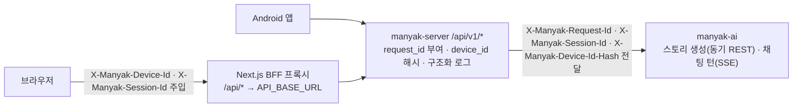

# 2-backend-server-design

## 문서 정보

| 항목 | 값 |
| --- | --- |
| 버전 | v0.2 |
| 작성일 | 2026-09-09 |
| 수정일 | 2026-09-13 |
| 대상 | manyak-server |
| 작성 목적 | 백엔드의 현재 기술 환경·요청 경계·저장 구조·동시성·운영 연결을 설명합니다. |
| 기준 코드 | `manyak-server` dev `d4fe174`, Flyway V81. 계약은 [백엔드 Spec](../spec/4-backend-server-spec.md), 코드와의 차이는 [추적 문서](../planning/backend-deployment-tracking.md)가 소유합니다. |

## 읽는 순서

- Spec에서 계약을 확인한 뒤 이 문서에서 현재 내부 구조를 읽습니다. 선택 이유는 [백엔드 ADR](../adr/2-backend-server-adr.md), 남은 구현 차이·검증은 [백엔드·배포 추적](../planning/backend-deployment-tracking.md)을 따릅니다. 코드가 바뀌면 이 문서를 함께 갱신합니다.

## 목차

- [2-1. 기술 환경과 요청 흐름](#2-1-기술-환경과-요청-흐름)
- [2-2. 저장소와 데이터 수명](#2-2-저장소와-데이터-수명)
- [2-3. 원장과 동시성](#2-3-원장과-동시성)
- [2-4. 메트릭과 운영 연동](#2-4-메트릭과-운영-연동)
- [2-5. 런타임 설정](#2-5-런타임-설정)
- [2-6. 실패·복구와 검증](#2-6-실패복구와-검증)

## 2-1. 기술 환경과 요청 흐름

### 기술 환경

| 분류 | 기술 |
| --- | --- |
| 언어·런타임 | Kotlin 2.2.21, Java 21 (Temurin) |
| 프레임워크 | Spring Boot 4.0.6, Spring MVC + `SseEmitter`(SSE), WebClient(AI 스트림 수신) |
| 영속성 | Spring Data JPA, PostgreSQL(운영)·H2(테스트), Flyway 마이그레이션 |
| 캐시·토큰 저장소 | Redis (refresh 토큰) |
| 인증 | Spring Security, OAuth2 Resource Server(JWT), 소셜 OIDC ID 토큰 검증(Nimbus: Google·Kakao 공용) |
| 관측 | Logstash Logback Encoder(JSON 구조화 로그), Sentry, Spring Actuator |
| API 문서 | SpringDoc OpenAPI (Swagger UI) |
| 빌드·배포 | Gradle(Kotlin DSL), Docker multi-stage, GitHub Actions |

### 핵심 아키텍처

이 서버의 핵심 특성은 다음과 같습니다.

| # | 특징 | 요지 | 상세 |
| --- | --- | --- | --- |
| 1 | 전원 게스트 + 선택적 인증 | MVP는 인증 없이 동작합니다. 대부분의 엔드포인트는 익명을 허용하되, 유효한 토큰이 오면 `user_id`를 귀속합니다. | [§4-5](../spec/4-backend-server-spec.md#4-5-인증과-권한) |
| 2 | 내부·외부 식별자 구분 | 내부 PK와 외부 식별자를 구분합니다. 공개 식별자와 예외의 정본은 Spec §4-4입니다. | [§4-4](../spec/4-backend-server-spec.md#4-4-데이터-모델) |
| 3 | AI 프록시 | 스토리 생성은 동기 REST로, 채팅 턴은 SSE로 AI 서버를 호출하고 결과를 저장·중계합니다. | [§4-3-3](../spec/4-backend-server-spec.md#4-3-api-계약) |
| 4 | 상관관계 관측 | 모든 요청에 `request_id`를 부여하고 `device_id_hash`로 익명 식별을 이어 로그·Sentry·`ai_call_logs`를 연결합니다. | [§4-7](../spec/4-backend-server-spec.md#4-7-운영과-관측) |
| 5 | 소프트 삭제 | 스토리·채팅 삭제는 `deleted_at` 기록으로 처리하고 조회에서 제외합니다. | [§4-4](../spec/4-backend-server-spec.md#4-4-데이터-모델) |
| 6 | 남용 방지 다층 방어 | 게스트+선택 인증 구조는 남용 표면이 넓으므로 체험 한도·이관 1회·교차 차단·관측을 계층으로 쌓습니다. | 아래 [남용 방지 설계](#남용-방지-설계) |

### 요청 흐름

### 도메인 모듈

기존 문서에 정리된 주요 도메인과 공통 계층의 책임은 다음과 같습니다.

| 모듈 | 담당 |
| --- | --- |
| `auth` | 소셜 로그인(Google·Kakao), JWT 발급·검증, refresh 토큰 저장소 |
| `story` | 스토리 조회·삭제, 간편 제작 퍼널, 로어북, 스토리 AI 클라이언트 |
| `chat` | 채팅 생성·조회·삭제, 턴 SSE 스트리밍, 채팅 AI 클라이언트 |
| `feedback` | 피드백 저장, Slack 알림 |
| `push` | 토큰의 플랫폼에 따라 안드로이드는 data-only로 발송하고 웹은 data에 webpush notification과 클릭 링크를 추가합니다. 공통 수신자 식별과 동의 판정은 유지합니다 |
| `global` | 보안 설정, 공통 오류 응답, 상관관계 필터, 구조화 로그, `ai_call_logs` |

### 남용 방지 설계

전원 게스트 + 선택적 인증(특징 1)은 진입 마찰을 없애는 대신 남용 표면을 넓힙니다. 개별 방어 계약은 여러 절에 흩어져 있어, 여기서는 그것들이 이루는 방어 계층만 지도로 묶습니다(계약 본문·수치는 각 절이 정본이며 여기서 재정의하지 않습니다).

| 계층 | 막는 것 | 장치 |
| --- | --- | --- |
| 진입 상한 | 가입 전 무한 무료 사용 | 디바이스별 체험 한도(스토리라인 5·스토리 1·채팅 턴 5): [§4-3-7](../spec/4-backend-server-spec.md#4-3-api-계약) |
| 전환 차단 | 게스트 콘텐츠 반복 이관 파밍 | 이관 계정당 1회 잠금 + 게스트↔회원 교차 접근 차단: [§4-3-5](../spec/4-backend-server-spec.md#4-3-api-계약)·[§4-5](../spec/4-backend-server-spec.md#4-5-인증과-권한) |
| 재가입 차단 | 탈퇴·재가입 반복으로 계정 단위 1회성 혜택 재수령 | 소셜 연동 tombstone + 보상 신원·소진 표식·정지 상태 승계: [§4-3-5](../spec/4-backend-server-spec.md#4-3-api-계약)·[§4-3-7](../spec/4-backend-server-spec.md#4-3-api-계약) |
| 회원 재화 보호 | 선차감 후 실패의 과금·이중 환불 | charge-once/refund-once + 선차감 대사 배치 + 보상 멱등 키: [§4-3-7](../spec/4-backend-server-spec.md#4-3-api-계약) |
| 관측 보완 | 우회 시도 사후 탐지 | 상관관계 관측 + 호출량·카운터 키 증가 추이: [§4-7](../spec/4-backend-server-spec.md#4-7-운영과-관측) |

디바이스 헤더 변조, 기기 변경, 게스트 간 접근과 미인증 쓰기 rate limit은 [추적 RISK-01~04](../planning/backend-deployment-tracking.md#수용한-한계)에서 관리합니다.

## 2-2. 저장소와 데이터 수명

RDB 변경은 [Flyway](../../../manyak-server/src/main/resources/db/migration), 전체 컬럼·ERD는 [dbdoc](../../../manyak-server/dbdoc)으로 대조합니다. 아래는 현재 저장 책임과 수명입니다.

| 그룹 | 테이블 | 역할 |
| --- | --- | --- |
| 사용자 | `users` | 계정과 상태, 프로필, 이관, 재가입, 보상 신원, 푸시 동의를 저장합니다. 닉네임은 소문자·공백 제거 키로 유일성을 보장합니다. 재가입 계정은 원래 보상 신원을 이어받습니다([회원·인증](../spec/4-backend-server-spec.md#4-3-api-계약), [보상](../spec/4-backend-server-spec.md#4-3-api-계약)) |
| 사용자 | `social_accounts` | 소셜 연동. `(provider, provider_user_id)`와 `(user_id, provider)`를 각각 유일하게 유지합니다. 탈퇴 시 행을 지우지 않고 `deleted_at`을 기록하며 재가입·계정 연동 때 재사용합니다([§4-5](../spec/4-backend-server-spec.md#4-5-인증과-권한)) |
| 사용자 | `device_push_tokens` | (V72, KNK-1131) 회원 기기의 FCM 등록 토큰. `user_id`(FK users, `ON DELETE CASCADE`: 탈퇴는 soft delete라 실제 정리는 서비스) · `token`(varchar 512, **UNIQUE**: 토큰은 설치본 주소라 전역 유일, 재등록=갱신·소유자 이전의 최종 방어선) · `platform`(V80·KNK-1271에서 CHECK 허용값을 `ANDROID`·`WEB`으로 확장) · `created_at` · `updated_at`(마지막 등록 시각, 상한 축출 기준). `user_id` 인덱스. 게스트 기기는 저장하지 않습니다([§4-3-5](../spec/4-backend-server-spec.md#4-3-api-계약)) |
| 검색 | OpenSearch `stories-{env}` 인덱스 | 공개 스토리 검색용 **파생 사본**(정본은 `stories`·`story_characters`). 문서 id = `publicId`, nori 분석 필드(제목·소개·인물명)·`genres` keyword·카드 필드·`visible`. 커밋 뒤 **비동기** 색인(AFTER_COMMIT + @Async), 실패 시 재색인 러너로 복구. 테이블이 아니라 마이그레이션·dbdoc 대상이 아닙니다([§4-3-1](../spec/4-backend-server-spec.md#4-3-api-계약) 스토리 검색) |
| 사용자 | `push_campaigns` | 프로모션 푸시의 예약 시각, 상태, 대상·성공·건너뜀 수, 시작·종료 시각을 기록합니다. 운영자가 SQL로 등록하고 스케줄러가 `SCHEDULED → SENDING` 조건부 갱신으로 선점합니다([§4-3-5](../spec/4-backend-server-spec.md#4-3-api-계약)) |
| 사용자 | `push_message_templates` | (V74, KNK-1116) 푸시 문구 오버라이드. `template_key`(varchar 64, 인덱스: PK가 아님: 같은 키의 기간별 행을 미리 넣어 교체를 예약) · `title`(varchar 100) · `body`(varchar 300) · `effective_from`(timestamptz not null default now) · `effective_until`(timestamptz nullable: NULL이면 영구) · `created_at`. 읽기 규칙은 `credit_policies`와 동일(유효 행 없으면 yml 기본 문구, 여럿이면 `effective_from` 최신). 시드 없음, 관리자 API 없음([§4-3-5](../spec/4-backend-server-spec.md#4-3-api-계약) 출석 리마인드) |
| 스토리 | `stories` | 제목·소개·장르·소유자·삭제 상태를 저장합니다. 프리셋 표지 키와 생성·업로드 표지 URL이 공존하며, 검수 상태가 `APPROVED`인 URL을 우선 노출합니다([§4-3-8](../spec/4-backend-server-spec.md#4-3-api-계약)) |
| 스토리 | `story_settings` | 스토리 설정 마크다운 문자열 4개(1:1) |
| 스토리 | `story_start_settings` | 시작 설정(스토리 1:N, KNK-515·V42). `public_id`는 `POST /chats`의 `startSettingId`이며 순서는 PK 오름차순입니다. 추천 입력과 엔딩이 이 설정에 속합니다 |
| 스토리 | `story_suggested_inputs` | 추천 입력(시작 설정별 목록, `input_order`) |
| 간편 제작 | `story_creation_tags` | 태그. `PREDEFINED` · `CUSTOM`, 카테고리 3종. `normalized_name` 컬럼: trim → 내부 공백 제거 → lowercase, 유니크 제약을 `(tag_source, tag_type, normalized_name)`으로 교체: 태그 파편화 병합([§4-3-2](../spec/4-backend-server-spec.md#4-3-api-계약)) |
| 간편 제작 | `story_creation_sessions` | 간편 제작 진행(퍼널 1회). 컬럼: `creation_request_id`(UUID nullable, V49: FK 제약 없는 요청 ID 바인딩. 익명 세션의 회수 재실행이 "이 세션을 만든 그 요청"인지 검증, [§4-3-2](../spec/4-backend-server-spec.md#4-3-api-계약)) |
| 간편 제작 | `story_creation_requests` | 생성 요청 복구·멱등. `request_id`(UUID 유니크) · `stage` · `status`(`PENDING`·`COMPLETED`·`FAILED`) · 소유 주체(회원 또는 게스트 디바이스 ID 해시) · `result_json`(COMPLETED 응답 replay용) · `updated_at`(aged PENDING 회수 판정 앵커, [§4-3-2](../spec/4-backend-server-spec.md#4-3-api-계약)) |
| 간편 제작 | `story_creation_characters` | 진행의 인물 행. `role`(`PROTAGONIST` · `SUPPORTING_CHARACTER`) · `name`(≤30자, nullable) · `gender`(`MALE` · `FEMALE`, nullable) · `sort_order`. 주인공은 세션당 1행(부분 유니크 인덱스)이고 `sort_order`는 1 고정, 주변 인물은 `(세션, role, sort_order)` 유니크입니다. 인물 특징 태그는 `story_creation_session_tags`가 이 행을 참조합니다([§4-3-2](../spec/4-backend-server-spec.md#4-3-api-계약)) |
| 간편 제작 | `story_creation_session_tags` | 진행이 선택한 태그. 유니크 키는 `(creation_session_id, character_id, tag_id)`이며 `NULLS NOT DISTINCT`(PostgreSQL 16)라 `character_id`가 NULL인 장르 행도 세션 안에서 중복되지 않습니다(V56). **장르는 `character_id`가 NULL**이고 인물 특징은 `character_id`로 인물에 귀속합니다. 행 id 오름차순이 곧 저장·회수 재구성 응답 순서입니다 |
| 간편 제작 | `story_creation_storylines` | AI 생성 스토리라인 후보 |
| 간편 제작 | `story_creation_storyline_recommended_infos` | 스토리라인별 추천 추가 정보 |
| 간편 제작 | `story_creation_storyline_ratings` | 스토리라인 평가(GOOD·BAD, 사용자당 1건) |
| 채팅 | `story_chats` | 소유자·시작 설정·현재 턴·상태·재생성 횟수를 저장합니다. 목표 사건, 진행 턴 수, 도달 엔딩으로 런타임 상태를 관리하며 참조 대상 삭제에는 `ON DELETE SET NULL`을 사용합니다([§4-3-10](../spec/4-backend-server-spec.md#4-3-api-계약)) |
| 채팅 | `story_messages` | 메시지 행. role은 `USER`·`ASSISTANT`·`SYSTEM`. 현행 기록은 `created_at`이며 재생성 시 타임스탬프를 갱신하지 않습니다. |
| 채팅 | `story_choices` | 메시지별 선택지를 순서대로 저장합니다. 다음 턴 트랜잭션이 선택 여부·시각과 원문 수정 여부를 기록합니다. `is_edited IS NULL`은 선택 기록이 없다는 뜻이며 V55 이전 행은 복원할 원본이 없어 백필하지 않습니다([§4-3-3](../spec/4-backend-server-spec.md#4-3-api-계약)) |
| 채팅 | `story_chat_shares` | 채팅 공유 링크([§4-3-11](../spec/4-backend-server-spec.md#4-3-api-계약)). `public_id`(UUID v4: 공유 열람 토큰) · `chat_id`(FK) · `turn_cutoff`(발급 시점 `current_turn`) · `created_at`, `(chat_id, turn_cutoff)` 유니크(멱등 재발급). 삭제 컬럼 없음: 유효성은 원본 채팅 `deleted_at`에 종속 |
| 로어북 | `lorebooks` | 장르 공용 용어 사전 |
| 로어북 | `story_lorebooks` | 스토리-로어북 연결 |
| 스토리 | `story_endings` | `start_setting_id`에 속하는 엔딩. `name` · `min_turns` · `achievement_condition` · `epilogue`를 가지며 시작 설정당 최대 10개입니다. 레거시 행은 `enabled=false`로 보존합니다([§4-3-10](../spec/4-backend-server-spec.md#4-3-api-계약)) |
| 피드백 | `feedbacks` | 피드백 본문·이메일·플랫폼·앱 버전. (V43): `user_agent`(nullable, 512자: 요청 헤더 원문, [§4-3-4](../spec/4-backend-server-spec.md#4-3-api-계약)) |
| 이프 | `credit_wallets` | 사용자별 지갑(V24). `user_id`(unique FK) · `balance`. 최초 적립 시 지연 생성. 조회 잔액의 정본은 로트 합([§4-3-7](../spec/4-backend-server-spec.md#4-3-api-계약))이며 지갑 행은 차감·적립 직렬화 락의 앵커 |
| 이프 | `credit_lots` | 적립 로트(V39). `user_id` · `transaction_id`(적립·환불 원장 행, 레거시 승계는 NULL) · `original_amount`(> 0) · `remaining`(0~원금) · `expires_at`(NULL=무기한) · 보상·환불 30일 만료·FIFO 차감의 잔여 추적. 이용내역 만료일 배치 해석용 `transaction_id` 인덱스는 V64입니다. |
| 이프 | `credit_policies` | (V66, KNK-1056) 적립·소모 수치 오버라이드. `policy_key`(PK) · `amount` · `effective_until`(nullable: NULL이면 상시) · `updated_at`, `CHECK (amount BETWEEN 0 AND 10000)`. 행이 없으면 `application.yml` 기본값 |
| 이프 | `credit_transactions` | 불변 원장(V24·V28). `wallet_id` · `amount`(적립 양수/소모 음수) · `reason`(enum) · `idempotency_key`(unique, nullable) · `ref_type`/`ref_id`. 이용내역 커서 조회용 `(user_id, created_at DESC, id DESC)` 인덱스는 V65 |
| 이프 | `users.invite_code` · `users.inviter_user_id` | 사용자당 고유 초대 코드(unique, V25)와 초대자 FK(V26·V27: 초대 보상 판정용). (KNK-567·V47): 초대자 FK 저장 시점이 가입 트랜잭션에서 코드 입력(redeem) 트랜잭션으로 이동했고, 초대 코드는 혼동 문자 제외 집합으로 전량 재발급(V47 리셋, [§4-3-7](../spec/4-backend-server-spec.md#4-3-api-계약)) |
| 이프 | Redis `guest_trial:{deviceIdHash}:*` | 게스트 체험 한도 카운터. `storyline_generation` · `story_creation` · `chat_turn` 3종을 디바이스 ID 해시별로 저장 |
| 이프 | Redis `member_trial:{users.id}:story_creation` · `member_trial:{users.id}:chat_turn` | 회원 공유 체험 **사용량** 카운터. 키 없음은 사용량 0이며 일일 리셋·TTL이 없습니다. 정상 시드와 운영 보정 계약은 [§4-3-7](../spec/4-backend-server-spec.md#4-3-api-계약)을 따릅니다 |
| 인증 | Redis `login_handoff:{codeHash}` · `login_handoff_claim:{codeHash}` | 로그인 핸드오프 임시 보관(TTL 30분, 소비 결과는 24시간). 게스트 ID 배열·원본 디바이스 ID·복귀 경로·상태, `_claim` 키는 소비 멱등 판정용([§4-3-5](../spec/4-backend-server-spec.md#4-3-api-계약)) |
| 스토리 | `story_main_events` | 주요 사건(스토리당 최대 10, V29). `name` · `description` · `key_sentence` · `sort_order`: 런타임 의미와 판정 계약은 [§4-3-10](../spec/4-backend-server-spec.md#4-3-api-계약)(, V41) |
| 채팅 | `story_chat_main_events` | (V41) 채팅 ↔ 완결(거쳐온) 주요 사건 기록. `chat_id` · `main_event_id` · `created_at`, `(chat_id, main_event_id)` 유니크. 거쳐온 사건 순서는 조회 시 `story_main_events.sort_order`로 정렬 |
| 스토리 | `story_public_snapshots` | `story_id` PK·FK, `snapshot` JSON, 생성·갱신 시각. 마지막 공개 상태의 표시·AI 생성 재료를 보존합니다(V69). |
| 스토리 | `user_story_ending_reaches` | 사용자·스토리별 도달 엔딩 집계. `ending_name_snapshot` NOT NULL과 `(user_id, story_id, ending_name_snapshot)` 유니크(V71). `ending_id`는 nullable 보조 참조이며 FK 삭제 시 SET NULL(V70)로 도달 행을 보존합니다. |
| 채팅 | `story_messages.reached_ending_id` | (V41) 엔딩 도달 턴의 ASSISTANT 메시지에 기록(FK nullable 컬럼, `ON DELETE SET NULL`) |
| 이미지 | `image_presets` | Flyway로 등록하는 이미지 카탈로그입니다. 불변 `image_key`, 유형, 의미 태그, 등록·비활성 시각을 저장합니다. 행은 삭제하지 않으며 확정 시각과 비활성 시각으로 과거 턴의 이미지 목록을 재구성합니다([§4-3-9](../spec/4-backend-server-spec.md#4-3-api-계약)) |
| 이미지 | `story_characters` | 인물 소유 행. `story_id`·`name`과 레거시 `image_url`을 가지며 V76의 이미지 정본은 `story_character_images`입니다. 레거시 컬럼 제거 시점은 [추적 SCHEMA-02](../planning/backend-deployment-tracking.md#미결-결정)에서 확인합니다. |
| 이미지 | `story_character_images` | 인물별 이미지 여러 장을 이름·URL·검수 상태·순서와 함께 저장합니다. `(character_id, image_name)`은 유일하며 V76에서 기존 이미지를 `{이름}_기본`으로 옮겼습니다. 채팅 요청과 상세 응답이 이 테이블을 사용합니다([§4-3-8](../spec/4-backend-server-spec.md#4-3-api-계약)) |
| 채팅 | `story_message_versions` | 재생성 시 이전 AI 출력·선택지를 보존하는 버전 이력(V37). `message_id` · `version_number`(`(message_id, version_number)` 유니크) · `content` · `choices` · `created_at`, 활성본은 `story_messages`/`story_choices` 제자리 유지([§4-3-9](../spec/4-backend-server-spec.md#4-3-api-계약)) |
| 관측 | `ai_call_logs`(+`_prompt_versions`) | AI 호출 이력([§4-7](../spec/4-backend-server-spec.md#4-7-운영과-관측)) |

| 결제 저장소 | 역할 |
| --- | --- |
| `credit_orders` (V78·V79) | 서버 상품 스냅샷·구매 채널·주문 상태·구매 참조·환불 회수 상태를 보존합니다. 상품 DB는 따로 두지 않습니다. |
| `groble_refund_marks` (V79) | 결제 완료보다 먼저 도착한 Groble 환불 사실을 보존해 이후 잘못 적립하지 않게 합니다. |

재가입 계정의 `reward_identity_user_id`는 1회성 혜택 신원이며 지갑 소유 계정과 구분합니다. 인물 이미지의 현재 읽기·쓰기는 `story_character_images`가 소유합니다. `story_characters.image_url`은 이전 코드와 롤링 호환을 위한 잔존 컬럼으로, 현재 이미지 정본이 아닙니다. 현재 Flyway는 V81까지 존재합니다.

공개 스냅샷의 보존 대상과 복원 규칙은 계약이므로 [Spec §4-4 공개 스냅샷과 과거 기록 복원](../spec/4-backend-server-spec.md#공개-스냅샷과-과거-기록-복원)이 소유합니다.

## 2-3. 원장과 동시성

원장 불변·보상 행·멱등 키·선차감 대사 배치의 계약은 [Spec §4-3-7 원장과 동시성](../spec/4-backend-server-spec.md#원장과-동시성)이 소유합니다. 현재 구현의 구조적 요점과 한계는 다음과 같습니다.

- 모든 차감·적립은 지갑 행 비관적 락 안에서 원장·로트를 함께 쓰고, 최초 지갑 생성만 `REQUIRES_NEW` 독립 트랜잭션으로 분리해 동시 첫 적립의 유니크 위반을 흡수합니다.
- 채팅 SSE 워커는 전용 스레드풀(core 4·max 16·큐 100, MDC 전파)에서 돌고, 스케줄 거부·큐 대기 취소는 완료 콜백 안전망이 환불·복원합니다. 선차감 대사 배치는 `fixedDelay`(기본 15분, 초기 지연 60초)로 직렬화하고 그룹별 실패를 격리합니다.
- 초대 월 상한의 집계 범위는 보상 신원 전체지만 직렬화는 지갑 단위라 재가입 전후 다른 지갑의 경합에서 1회 초과할 수 있습니다([추적 CREDIT-02](../planning/backend-deployment-tracking.md#수용한-한계)). 혼합 단가의 개수 대사는 회원 미보상 가능성이 남습니다([추적 CREDIT-01](../planning/backend-deployment-tracking.md#수용한-한계)).

## 2-4. 메트릭과 운영 연동

구조화 로그·Sentry·`ai_call_logs`가 개별 사건을 남긴다면, 메트릭은 시계열 집계로 RED(Rate·Error·Duration)와 **AI 호출 지연**을 봅니다. Micrometer로 계측하고 **OTLP push**로 Grafana Cloud에 보냅니다. Prometheus·Grafana를 별도 EC2에 자체 호스팅하지 않습니다: 단일 인스턴스 운영에서 스크레이프 대상과 관리 대상을 늘리는 비용이 이득보다 큽니다.

**수집 경로**: `OtlpMeterRegistry`(micrometer-registry-otlp)가 step 주기마다 Grafana Cloud OTLP 게이트웨이로 push합니다. 운영은 스크레이프 엔드포인트(`/actuator/prometheus`)를 **노출하지 않습니다**. push 방식이라 인바운드 경로가 필요 없고, 노출하면 인증 없이 내부 지표가 공개됩니다. actuator 노출 목록은 운영에서 `health,info`를 유지하고 로컬에만 `prometheus`를 더합니다: export 내용을 눈으로 확인하는 용도이자, 로컬 Compose의 Prometheus가 긁는 대상입니다. **pull 경로는 로컬 전용이며 운영 구성으로 승격하지 않습니다**([`4-deployment.md §4-8`](4-deployment.md)).

**지표 카탈로그**

| 메트릭 | 태그 | 출처 | 용도 |
| --- | --- | --- | --- |
| `http.server.requests` | `uri`(경로 템플릿)·`method`·`status`·`outcome` | Spring Boot 자동 | RED: 요청률·5xx 오류율·p95 응답시간 |
| `manyak.ai.call.duration` | `feature`(enum 4종)·`outcome`(`success`/`failure`) | `AiCallRecorder` | AI API 호출 지연·실패율. `ai_call_logs.latency_ms`와 같은 구간을 재는 집계 뷰 |
| `manyak.story.creation.duration` | `outcome`(`success`/`failure`/`rejected`) | `SimpleStoryCreationService` | 간편 스토리 완성 처리시간(AI 호출 + 저장 포함) |
| JVM·프로세스·DB 커넥션 풀 | 바인더별 기본 태그 | Micrometer 기본 바인더(자동 등록) | CPU·힙·GC·스레드·커넥션 풀: 이름은 아래 표 |

기본 바인더 지표는 대시보드 패널 단위로 묶어 씁니다.

| 패널 | 메트릭 |
| --- | --- |
| CPU | `process.cpu.usage`·`system.cpu.usage`·`system.load.average.1m` |
| 힙 | `jvm.memory.used`·`jvm.memory.max`·`jvm.memory.committed`·`jvm.memory.usage.after.gc` |
| GC | `jvm.gc.pause`·`jvm.gc.overhead`·`jvm.gc.memory.allocated` |
| 스레드 | `jvm.threads.live`·`jvm.threads.states` |
| DB 커넥션 풀 | `hikaricp.connections.{active,idle,pending,max}` **또는** `jdbc.connections.{active,idle,max}` |

DB 커넥션 풀은 **둘 중 하나만 고릅니다.** `hikaricp.*`(Hikari 자체 tracker)와 `jdbc.*`(Boot pool metadata)가 함께 등록되어 같은 값을 두 이름으로 내보내므로, 두 계열로 패널을 만들면 중복입니다. `jvm.gc.pause`는 GC가 실제로 발생한 뒤에야 나타나므로 기동 직후 패널이 비어 보이는 것이 정상입니다.

위 이름은 바인더 실측 기준이며, 전체 앱 컨텍스트에서 최종 등록까지 확인한 것은 아닙니다. 로컬 기동 후 `/actuator/prometheus`로 확인합니다(서버 레포 `http/common/metrics-prometheus.http`).

**카디널리티 규칙**: 메트릭 태그에는 **고유값을 넣지 않습니다**. `user_id`·`story_id`·`chat_id`·`request_id`·`device_id_hash`는 금지이며, 개별 추적은 구조화 로그와 `ai_call_logs`의 몫입니다. 태그는 유한 enum으로만 둡니다(`feature` 4종 × `outcome` 2종 = 8 시계열). `uri`는 Spring이 경로 변수를 템플릿(`/api/v1/stories/{storyId}`)으로 치환해 적재하므로 안전합니다.

**히스토그램 비용**: p95를 서버측에서 계산하려면 percentile histogram이 필요한데, 시계열 하나가 `le` 버킷 수만큼 불어납니다. Micrometer Timer의 기본 구간은 1ms\~30s이고 이때 버킷은 **69개**입니다(micrometer 1.16.5 실측). 엔드포인트 39개 × 상태 코드 3\~5종 × 69이면 8k\~13k로 Grafana Cloud 무료 티어 한도(10k active series)에 걸리므로, 메트릭별 기대 구간을 좁혀 버킷을 자릅니다.

| 메트릭 | 구간 | 버킷 수(실측) | 근거 |
| --- | --- | ---: | --- |
| (기본값 참고) | 1ms\~30s | 69 | Micrometer `AbstractTimerBuilder` 기본 |
| `http.server.requests` | 10ms\~10s | 47 | 일반 HTTP 응답 구간 |
| `manyak.ai.call.duration` | 100ms\~240s | 54 | AI 타임아웃 최대 180초(compile)보다 **위**여야 타임아웃 직전 분포가 보인다 |
| `manyak.story.creation.duration` | 100ms\~240s | 54 | 위와 같음(스토리 완성 = compile 호출 포함) |

버킷 수는 **scrape 프레임 기준**입니다: `registry.scrape`가 실제로 뱉는 `_bucket` 라인 수(min/max clamp 경계와 `+Inf` 포함)이고, Grafana Cloud가 과금·집계에서 보는 것도 이 프레임입니다. `PercentileHistogramBuckets.buckets`의 순수 버킷 집합을 직접 세면 프레임 차이로 일관되게 3 적게 나옵니다(66·44·51). 100ms\~240s의 54는 100ms\~120s(49)에 상한 확대분 +5를 더한 값이고, 증가분 +5는 두 프레임에서 동일합니다.

상한은 **타임아웃보다 높게** 둡니다. 같거나 낮으면 느린 정상 호출이 `+Inf` 구간에 합쳐져 타임아웃 직전의 p95·p99를 구분할 수 없습니다.

`http.server.requests`의 10초 상한은 **의도적으로 AI 대기 엔드포인트를 덮지 않습니다.** 그 경로의 지연은 전용 `manyak.*` 타이머가 담당하고, HTTP 히스토그램 상한을 올리면 버킷이 엔드포인트 수만큼 곱해져 비용이 큽니다. 대신 AI 엔드포인트의 HTTP p95는 10초에서 상한값으로 집계된다는 점을 알고 받아들입니다.

**환경 구분**: `service.name` 하나로 가릅니다. 운영은 `spring.application.name`(=`manyak-server`)이 그대로 리소스 속성이 되고, 로컬만 `OTEL_SERVICE_NAME=manyak-server-local`로 덮어씁니다. Grafana Cloud는 `service.name`을 모든 메트릭의 **`service_name` 라벨**로 승격하므로 조인 없이 환경을 나눌 수 있습니다(PromQL 필터도 `service_name="manyak-server"`: 로컬 실습으로 확인). `deployment.environment` 리소스 속성은 `target_info`에만 실려 조회 때마다 조인이 필요하므로 쓰지 않습니다.

**조회 시 이름·단위 주의**: 같은 Timer라도 노출 경로에 따라 메트릭 이름이 다릅니다. 로컬 `/actuator/prometheus`에는 `manyak_story_creation_duration_seconds_*`로 나오지만 **Grafana Cloud에는 `manyak_story_creation_duration_milliseconds_*`로 도착합니다**(OTLP 전송의 기본 시간 단위가 달라 이름까지 바뀜). 대시보드·알림 쿼리는 기억에 의존하지 말고 Grafana Metrics browser에서 실제 수신된 이름을 먼저 확인합니다.

**전송 주기**: 운영 60초, 로컬 10초. 주기가 짧을수록 DPM(datapoints per minute) 과금이 비례해 늘고, 단일 인스턴스 서비스에서 60초보다 촘촘한 해상도가 주는 이득은 없습니다.

**OTLP는 기본으로 끕니다.** 레지스트리는 모든 프로파일에서 자동 구성되며 endpoint가 없으면 `http://localhost:4318/v1/metrics`로 전송을 시도합니다. 환경에 관계없이 endpoint와 헤더를 먼저 넣고 `MANYAK_OTLP_METRICS_ENABLED=true`를 설정합니다. 메트릭 전송 실패는 사용자 요청에 영향을 주지 않게 격리합니다([Spec §4-7](../spec/4-backend-server-spec.md#4-7-운영과-관측)).

**미주입과 빈 값은 다릅니다.** Spring Boot 4.0.6의 `PropertiesConfigAdapter.obtain`은 null만 검사합니다. URL이 빈 문자열이면 기본값을 찾지 않고 빈 값 그대로 micrometer에 전달합니다.

| URL 속성 상태 | 결과 |
| --- | --- |
| 미주입(null) | `OTEL_EXPORTER_OTLP_METRICS_ENDPOINT` → `OTEL_EXPORTER_OTLP_ENDPOINT` → `http://localhost:4318/v1/metrics` 순으로 찾아 전송 |
| 빈 문자열(`""`) | 빈 URL로 push 시도. localhost로 보내는 요청이 아니라 매 step 전송 오류 |

운영 시크릿 JSON에서 키를 빈 값으로 두면 이 경로를 타므로 **OTLP 키는 빈 값으로 남기지 않습니다.** 끄려면 키를 넣지 않거나, 토글을 `false`로 둡니다.

`OtlpConfig`는 `System.getenv`에서 표준 `OTEL_*` 변수를 직접 읽습니다. Spring `Environment`와 프로파일을 거치지 않으므로 운영에서는 충돌을 피하려고 Spring 전용 변수명을 씁니다([§2-5](#2-5-런타임-설정)).

**측정 범위 주의**: `manyak.story.creation.duration`은 실제 생성 콜백만 감쌉니다. AI 호출 없이 저장된 결과를 돌려주는 **조회 경로 두 가지는 의도적으로 제외**합니다: ① 멱등 재요청(`recordOrRun`의 COMPLETED replay: [§4-3-2](../spec/4-backend-server-spec.md#4-3-api-계약))은 콜백 자체가 실행되지 않아 자연히 빠지고, ② 회수 재실행 재구성은 콜백은 타지만 AI·저장이 없어 `aiCallLogId`가 `null`인 것으로 판별해 제외합니다. 포함하면 아주 짧은 시간이 섞여 p95가 실제 생성 비용보다 낙관적으로 왜곡됩니다.

**실패는 다시 둘로 나눕니다**. `outcome`이 3값인 이유입니다.

| 값 | 의미 | 걸리는 시간 |
| --- | --- | --- |
| `success` | 생성·저장까지 끝난 호출 | 수 초\~180초 |
| `failure` | 생성을 시도하다 깨진 호출: AI compile 실패(502·타임아웃)·응답 검증 실패·저장 경합 | 수 초\~180초 |
| `rejected` | 생성 시도 **이전에** 거부된 4xx: 세션 없음(404)·소유권(403)·이미 생성됨(409)·태그 오류(400)·이프 부족과 게스트 한도(402) | 밀리초(DB 조회 몇 번) |

**판별 기준은 HTTP 상태가 아니라 compile 시작 여부입니다.** compile을 마친 뒤에도 4xx가 날 수 있기 때문입니다: 같은 세션에 `requestId`가 다른 완성 요청 둘이 겹치면 둘 다 잠금 없는 초기 검사를 통과해 compile을 호출하고, 진 쪽이 잠금을 잡은 뒤 409(세션 소실 시 404)를 던집니다. 이건 AI 호출을 이미 마친 **실제 생성 실패**이므로 `failure`입니다. 따라서 compile 진입 여부를 먼저 보고, 진입했으면 상태 코드와 무관하게 `failure`, 진입 전 4xx만 `rejected`, 그 외(5xx·비 HTTP 예외)는 `failure`입니다.

4xx를 `failure`에서 떼는 이유는 두 갈래를 한 히스토그램에 섞으면 **거부 비중에 따라 실패 p95가 요동치기** 때문입니다. 거부가 늘수록 밀리초 표본이 늘어 p95가 오히려 **낮아지므로**, AI가 실제로 느려지는데 지표는 개선된 것처럼 보이는 역전이 생깁니다. 실패 건수 알림도 404 급증만으로 오발화합니다. **알림과 p95는 `outcome="failure"`만 봐야 합니다.** 태그 값이 2에서 3으로 늘어도 유한 enum이라 카디널리티는 안전합니다(위 카디널리티 규칙).

**알림**: 임계값은 운영 데이터가 쌓인 뒤 정합니다. 서버가 중단되면 지표가 No Data 상태가 되므로, 알림 규칙에서 이 상태를 무시할지 별도 심각도로 다룰지도 함께 정합니다. AI 호출 지연·실패율 알림도 운영 기준선을 확인한 뒤 추가합니다([배포 Design §4-9](4-deployment.md#4-9-검수-관측-롤백)).

## 2-5. 런타임 설정

값은 배포 파이프라인이 주입하며 문서·레포에 싣지 않습니다.

| 환경 변수 | 필수 | 용도 |
| --- | --- | --- |
| `MANYAK_DB_URL` · `MANYAK_DB_USERNAME` · `MANYAK_DB_PASSWORD` | 예 | PostgreSQL 연결 |
| `SPRING_DATA_REDIS_HOST` · `SPRING_DATA_REDIS_PORT` | 예(운영) | Redis 연결. 로컬 기본 `localhost:6379` |
| `MANYAK_AI_BASE_URL` | 예 | AI 서버 base URL(scheme 포함). 기동 시 scheme·host를 검증해 잘못된 값이면 부팅 실패(스텁 모드에서는 불필요). 연결 5초·이벤트 간 60초 등 타임아웃은 `manyak.ai.*` 프로퍼티([§4-3-3](../spec/4-backend-server-spec.md#4-3-api-계약)) |
| `MANYAK_AI_CHAT_STUB` · `MANYAK_AI_STORY_STUB` | 아니오 | AI 스텁 토글(`manyak.ai.chat.stub` · `manyak.ai.story.stub`). `true`면 실제 AI 호출 없이 스텁 응답: 채팅 스텁은 고정 서사 문구에 `userInput` 앞 24자를 에코해 3자 청크로 스트리밍하고 고정 선택지 3개를 반환, 스토리 스텁은 결정적 더미 스토리라인 3개(`"[스텁] 스토리라인 N: {장르}"`)·더미 compile을 즉답합니다. 스텁 호출은 meta `model`·`provider`가 `"stub"`으로 `ai_call_logs`에서 구분됩니다. 미설정·`false`가 기본(실제 호출)이고 환경 변수가 프로필 yaml보다 우선하므로 임의 환경에서 켤 수 있습니다. 프로필 기본값은 local=`true`·prod=`false` |
| `MANYAK_IMAGE_BASE_URL` | 아니오 | 이미지 CDN base URL(기본 `https://cdn.manyak.app`): `imageKey` → 서빙 URL 조합용(`{base}/{prefix}/{imageKey}.png`, `_sm` 변형 포함: [§4-3-9](../spec/4-backend-server-spec.md#4-3-api-계약)) |
| `MANYAK_CREDIT_*` | 아니오 | 이프 정책값 오버라이드: `SIGNUP_REWARD`(1000) · `INVITE_REWARD`(2000) · `INVITE_MONTHLY_CAP`(10) · `ATTENDANCE_REWARD`(250) · `STORY_CREATION_COST`(250) · `CHAT_TURN_COST`(20) · `POLICY_REFRESH_{ENABLED(true), INTERVAL_MS(60000)}` · `RECONCILIATION_{ENABLED(true), INTERVAL_MS(900000), INITIAL_DELAY_MS(60000), CHARGE_AGE_THRESHOLD(PT15M)}` |
| `MANYAK_GUEST_TRIAL_*` | 아니오 | 게스트 체험 한도 오버라이드: `STORYLINE_LIMIT`(5) · `STORY_CREATION_LIMIT`(1) · `CHAT_TURN_LIMIT`(5) |
| `MANYAK_CORS_ALLOWED_ORIGINS` | 예 | CORS 허용 origin(콤마 구분) |
| `MANYAK_AUTH_JWT_SECRET` | 예 | access JWT HS256 키(32바이트 이상). 미주입 시 기본값이 빈 문자열이라 기동 실패(잘못된 운영 기동 조기 차단). JWT issuer·TTL은 `manyak.auth.jwt.*` yml 전용(환경 변수 바인딩 없음) |
| `MANYAK_GOOGLE_CLIENT_IDS` | 예 | Google OAuth client ID 목록(콤마 구분). 값이 없으면 모든 Google 로그인을 거부 |
| `MANYAK_KAKAO_CLIENT_IDS` | 카카오 로그인 사용 시 예 | 같은 카카오 디벨로퍼스 앱의 REST API 키(웹 `aud`)와 네이티브 앱 키(Android `aud`) 목록. 플랫폼 키가 빠지면 해당 플랫폼 로그인만 401이고, 값이 없으면 모든 Kakao 로그인을 거부. Google에는 영향 없음 |
| `MANYAK_FCM_SERVICE_ACCOUNT_JSON` | 아니오 | Firebase 서비스 계정 JSON **원문**. 비어 있으면 FCM 빈을 만들지 않아 푸시 설정 없이 기동하고 발송하지 않습니다([§4-3-5](../spec/4-backend-server-spec.md#4-3-api-계약) 발송 모듈). 앱과 같은 Firebase 프로젝트에서 발급. Secrets Manager `manyak/<env>/app` JSON에 키로 넣고, **태스크 정의 `secrets`에 그 키를 노출하는 terraform apply가 함께 필요**합니다: 값만 넣으면 컨테이너에 들어가지 않습니다(dev·prod 모두 Terraform 참조가 존재하며 실제 활성화는 배포 기록으로 확인) |
| `MANYAK_PUSH_WEB_ICON_URL` | 아니오 | 웹 푸시 알림 아이콘 URL. 기본값 `https://manyak.app/icons/icon-192.png` |
| `MANYAK_OPENSEARCH_ENDPOINT` | 아니오 | 검색 저장소 OpenSearch 엔드포인트(`https://` 없이 호스트, KNK-1141). 비어 있으면 검색 503·색인을 건너뛰고 기동합니다. 인증은 태스크 역할 SigV4라 시크릿이 없습니다([§4-3-1](../spec/4-backend-server-spec.md#4-3-api-계약) 스토리 검색) |
| `MANYAK_OPENSEARCH_STORY_INDEX` | 아니오 | 스토리 검색 인덱스 이름. 기본 `stories-dev`, 운영은 `stories-prod` |
| `MANYAK_OPENSEARCH_REINDEX_ON_STARTUP` | 아니오 | `true`면 기동 시 전체 재색인 1회. 초기 적재·복구용이며 끝나면 되돌립니다(켜 두면 배포마다 재색인) |
| `MANYAK_ANALYTICS_DEVICE_ID_PEPPER` | 아니오 | `device_id` 해시 pepper. 미설정 시 구 이름 `MANYAK_ANALYTICS_ANONYMOUS_ID_PEPPER`로 폴백(전환기), 둘 다 없으면 무염 해시 |
| `MANYAK_ANALYTICS_AMPLITUDE_ENABLED` · `MANYAK_AMPLITUDE_API_KEY` | 아니오 | 서버 분석 이벤트(`server_*`) Amplitude 발행. `ENABLED` 기본 `false`, 켜려면 `true` + API 키 필요(둘 중 하나 없으면 발행하지 않음) |
| `MANYAK_AMPLITUDE_BASE_URL` | 아니오 | Amplitude HTTP V2 base URL. 기본 `https://api2.amplitude.com`(EU는 `https://api.eu.amplitude.com`). `application.yml` 전용(`.env.example` 미포함) |
| `MANYAK_SLACK_FEEDBACK_WEBHOOK_URL` | 아니오 | 피드백 Slack 알림. 미설정 시 알림 생략 |
| `MANYAK_ASSET_BASE_URL` | 아니오 | 프로필 프리셋 이미지 서빙 base URL(기본 `https://api.manyak.app`): `profile_image_url = {base}/profile-presets/{명사}.png`([§4-5](../spec/4-backend-server-spec.md#4-5-인증과-권한)). 후속 S3/CDN 전환은 이 값 치환만으로 됨 |
| `MANYAK_GOOGLE_FORM_FEEDBACK_ID` · `MANYAK_GOOGLE_FORM_FEEDBACK_{BODY,EMAIL,PLATFORM,APP_VERSION}_ENTRY` · `MANYAK_GOOGLE_FORM_BASE_URL` | 아니오 | 피드백 구글 폼 적재(KNK-618, [§4-3-4](../spec/4-backend-server-spec.md#4-3-api-계약)). form ID 미설정이면 건너뜀: live form ID는 운영에만 둬 로컬 실행이 실 스프레드시트를 오염시키지 않음. entry ID는 공개 식별자라 yml 기본값 보유, base URL은 테스트 mock 전용 오버라이드 |
| `SENTRY_DSN` · `SENTRY_ENVIRONMENT` · `SENTRY_TRACES_SAMPLE_RATE` | 아니오 | Sentry 연동. DSN 미설정 시 비활성 |
| `MANYAK_OTLP_METRICS_ENABLED` | 아니오 | 메트릭 OTLP push 토글(`management.otlp.metrics.export.enabled`). 기본 `false`: 켠 채 endpoint를 주지 않으면 레지스트리가 `localhost:4318`로 불필요하게 전송합니다([§2-4](#2-4-메트릭과-운영-연동)) |
| `MANAGEMENT_OTLP_METRICS_EXPORT_URL` · `MANAGEMENT_OTLP_METRICS_EXPORT_HEADERS_AUTHORIZATION` | 메트릭 사용 시 예([배포 Design §4-6](4-deployment.md#4-6-런타임-설정과-시크릿)) | 운영용 Grafana Cloud URL과 인증 헤더. AI 컨테이너의 OTel 설정과 충돌하지 않도록 Spring 전용 이름을 사용합니다. 운영 URL은 `/v1/metrics`까지 포함해야 하며 인증값은 `Basic …` 형식입니다. 로컬의 표준 `OTEL_*` 변수는 경로를 자동으로 붙이고 헤더 공백을 인코딩합니다. 실제 값은 문서에 기록하지 않습니다 |
| `OTEL_SERVICE_NAME` | 아니오 | 리소스 `service.name` 오버라이드. 미설정 시 `spring.application.name`(=`manyak-server`)이 쓰이므로 **운영은 주입하지 않습니다**. 로컬만 `manyak-server-local`로 구분합니다 |

| 추가 환경 변수 | 필수 조건 | 용도 |
| --- | --- | --- |
| `MANYAK_GROBLE_WEBHOOK_SECRET` | Groble 사용 시 | webhook HMAC 검증. 비어 있으면 관련 주문 생성·webhook 503 |
| `MANYAK_GOOGLE_PLAY_SERVICE_ACCOUNT_JSON` · `MANYAK_GOOGLE_PLAY_PACKAGE_NAME` | Google Play 사용 시 | 구매 검증·voided 대사. 비어 있으면 구매는 503, 대사는 실행하지 않음 |
| `MANYAK_CHARACTER_IMAGE_BUCKET` · `MANYAK_CHARACTER_IMAGE_REGION` · `MANYAK_CHARACTER_IMAGE_BASE_URL` | 생성 이미지 저장 시 | S3 업로드·URL 생성. 필요한 설정과 prefix IAM을 함께 공급 |
| `MANYAK_SLACK_REPORT_WEBHOOK_URL` | 신고 알림 사용 시 | 신고 전용 알림. 신고 저장과 알림 성공을 구분 |

환경별 태스크 참조·IAM·재배포는 [배포 Design](4-deployment.md#4-6-런타임-설정과-시크릿)을 따릅니다. 설정 코드의 존재는 외부 결제·푸시·관측이 활성화되었다는 증거가 아닙니다.

## 2-6. 실패·복구와 검증

- 외부 HTTP·SSE 실패 의미는 [Spec §4-6](../spec/4-backend-server-spec.md#4-6-오류와-예외-처리)을 따릅니다. 원장 복구는 §2-3의 대사, 검색 파생 사본 복구는 §2-2의 재색인 경로가 담당합니다.
- API·권한 검수는 [Spec §4-8](../spec/4-backend-server-spec.md#4-8-검수-체크리스트)의 검수 수단을 사용하고 기동·설정·롤백은 [배포 Design](4-deployment.md)을 확인합니다.
- 이 문서와 코드의 차이, 수용한 한계, 미결 항목은 [추적 문서](../planning/backend-deployment-tracking.md)가 관리합니다. 이전 종합 문서 원문은 [Git 스냅샷](https://github.com/KIM-N-KANG/knk-harness/blob/56333a3/docs/design/2-backend-server-design.md)으로 보존합니다.
