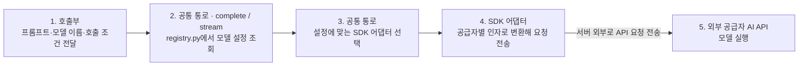
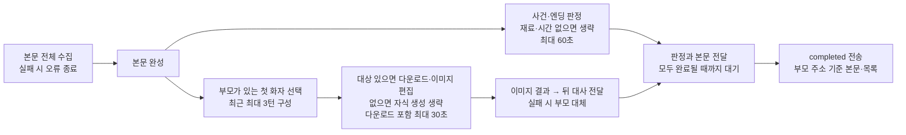

# 3-ai-server-design

## 문서 정보

| 항목 | 값 |
| --- | --- |
| 버전 | v0.14 |
| 작성일 | 2026-09-09 |
| 수정일 | 2026-09-12 |
| 대상 | manyak-ai |
| 작성 목적 | AI 호출 계층, 모델·프롬프트 설정과 관측 실패의 격리 구조를 설명합니다. |
| 기준 | [Spec](../spec/5-ai-server-spec.md)의 dev 기준 및 자식 이미지 작업 브랜치 기준을 따릅니다. 운영 배포 검증과 구분합니다. |

## 읽는 순서

- Spec에서 계약을 확인한 뒤 책임 경계와 담당 기능을 읽습니다. 당시 선택 이유는 ADR, 남은 분리·검증은 [재구성 계획](../planning/product-document-reorganization.md)을 따릅니다.

## 목차

- [3-1. 호출 경계와 요청 흐름](#3-1-호출-경계와-요청-흐름)
- [3-2. 프롬프트와 모델 설정](#3-2-프롬프트와-모델-설정)
- [3-3. 관측과 런타임 설정](#3-3-관측과-런타임-설정)
- [3-4. 상태 수명·실패와 검증](#3-4-상태-수명실패와-검증)

---

AI 호출 계층, 모델·프롬프트 설정과 관측 실패의 격리 구조를 설명합니다.

## 3-1. 호출 경계와 요청 흐름

Python 3.11·FastAPI·Pydantic v2 기반입니다.

텍스트 LLM 호출은 호출부·모델 특성·SDK 어댑터의 세 층으로 나뉩니다.

| 층 | 책임 | 구현 |
| --- | --- | --- |
| 호출부 | 프롬프트·모델·출력 길이·시간 제한을 요청하고, 결과 검증·보완 호출·실패 시 대체 처리를 담당 | `story_llm.py`, `chat_llm.py` 등 기능별 서비스 |
| 모델 특성 | 모델별 공급자·어댑터·추론 설정·지원 인자·한도를 정의 | [registry.py](../../../manyak-ai/src/services/llm/registry.py) |
| SDK 어댑터 | 공통 요청을 공급자별 SDK 인자로 바꾸고, 응답·토큰 사용량·오류를 공통 형식으로 반환 | [llm/](../../../manyak-ai/src/services/llm)의 `openai_sdk.py`, `anthropic_sdk.py`, `google_sdk.py` |

호출부가 요청을 넘기면 [공통 통로](../../../manyak-ai/src/services/llm/__init__.py)가 모델 등록부에서 설정을 조회하고, 해당 SDK 어댑터를 선택해 공급자 API를 호출합니다. 아래 그림의 1~4는 AI 서버 내부 처리입니다. 4번 SDK 어댑터가 서버 밖으로 요청을 전송하면, 5번 외부 공급자 서버에서 모델을 실행합니다.

응답은 SDK 어댑터가 공통 형식으로 바꿔 공통 통로를 통해 호출부에 돌려줍니다. `complete()`는 완성된 결과를, `stream()`은 생성 중인 본문 조각과 완료 정보를 전달합니다. 공급자 오류도 공통 오류 형식으로 변환합니다.

DeepSeek과 GPT는 OpenAI SDK 어댑터를 공유합니다. Anthropic과 Google은 각각의 SDK 어댑터를 사용합니다.

이미지는 [별도 이미지 통로](../../../manyak-ai/src/services/image)의 `generate_image()`를 사용합니다. 인물·썸네일·자식 이미지 생성 호출부가 프롬프트를 넘기면, 이미지 모델 매핑과 설정을 적용해 `openai_api.py`의 Images API 어댑터로 전달합니다. 이미지 결과·오류도 텍스트와 별도의 공통 형식으로 반환합니다.

### 자식 이미지가 있는 채팅 흐름

[chat_child_image.py](../../../manyak-ai/src/services/chat_child_image.py)가 본문을 수집하고,
[child_input.py](../../../manyak-ai/src/services/image/child_input.py)가 부모가 있는 첫 화자와
최근 대화를 고릅니다. [child_prompt.py](../../../manyak-ai/src/services/image/child_prompt.py)는
`CHILD-IMAGE-TEMPLATE.md`에 대화 재료를 XML 텍스트로 넣어 이스케이프합니다. 채팅 본문은
저장 마커를 제거한 복사본을 사용하고 요청 이력은 수정하지 않습니다.

[generate_child.py](../../../manyak-ai/src/services/image/generate_child.py)는 부모를 내려받아
참조 이미지로 첨부합니다. 이미지 어댑터는 참조가 있으면 OpenAI `images.edit`를 호출하며
SDK 재시도를 0으로 지정합니다. 컴파일의 `images.generate`는 기존 재시도 설정을 유지합니다.
부모 다운로드는 `IMAGE_PARENT_ALLOWED_HOSTS`의 HTTPS 호스트만 허용하고 사용자 정보·443
외 포트·리다이렉트를 거부합니다. 50,000,000바이트 이상이면 중단하며 PNG·JPEG·WebP 파일
시그니처를 검사합니다. 허용 호스트 기본값은 설정 코드가 소유합니다.

판정과 이미지 처리는 본문 완성 후 동시에 시작하며, 각각 남은 턴 시간에 맞춰 제한을 줄입니다.
앞 지문은 이미지 결과를 기다리기 전에 보냅니다. 백엔드는 이미지 이벤트를 받으면 저장 후
자식 또는 부모를 선택하고, 저장 중에는 뒤 대사 중계를 기다립니다. AI는 백엔드 저장 결과를
기다리지 않고 `completed`를 보내며, 백엔드가 최종 본문 마커·목록을 맞춰 턴을 저장합니다.

어느 호출을 기다리든 연결이 끊기면 진행 중인 작업을 취소하고 정리합니다. 그림의 두 병렬
구간은 서로의 완료를 기다리지 않습니다. 이미지가 먼저 끝나면 판정 중에도 대사가 전달됩니다.

판정은 본문 완료 콜백에서 별도 작업으로 시작합니다. 이미지 완료 시각을 생성 작업 내부에서
검사하므로 앞 지문 전송 지연은 생성 시간 초과로 취급하지 않습니다. `render_chat_images`로
이벤트와 저장 본문을 함께 만들고, 선택한 인물의 이벤트에만 자식 데이터를 추가합니다.
AI는 저장 URL을 알 수 없어 부모 주소로 본문·목록을 완성합니다. 저장·표시 규칙은
[Spec의 부모·자식 이미지](../spec/5-ai-server-spec.md#부모-이미지와-자식-이미지)를 따릅니다.

## 3-2. 프롬프트와 모델 설정

본문은 SAFETY·CORE·STORY·CHARACTER·USER를 앞쪽 시스템 메시지로 조립하고, History·사용자 입력 뒤에 MEMORY 요약과 핵심 지시 재주입(PHI)을 둡니다. 충돌 우선순위는 SAFETY > CORE > MEMORY > STORY > CHARACTER > USER입니다. 선택지·판정은 별도 프롬프트입니다. [레이어 책임](../../../manyak-ai/spec/chat/1-PROMPT-LAYER.md)과 [배치](../../../manyak-ai/spec/chat/2-LAYER-PLACEMENT.md)가 상세 정본입니다.

| 용도 | 기준 모델·설정 | 시간 제한의 의미 |
| --- | --- | --- |
| 스토리라인 | `STORYLINES_MODEL`: deepseek-flash, temperature 0.75, 출력 한도 6144 | SDK 90초. invalid 응답 재호출 경로는 전체 60초 예산 |
| 컴파일 | `STORY_COMPILE_MODEL`: 기본 gpt-5.6-terra, 추론 medium, 출력 한도 16384. Gemini 공급자 선택 시 전용 템플릿 | SDK 90초(이미지 시간 별도) |
| 본문 | `CHAT_MODEL`: deepseek-flash, 출력 토큰 상한 미지정 | 첫 토큰 제한 90초 |
| 선택지 | `CHAT_MODEL`, 출력 한도 512 | SDK 호출당 60초, 누적 호출 전체 제한 아님 |
| 판정 | `CHAT_MODEL`, 출력 한도 256 | SDK 재시도 포함 60초와 남은 턴 예산 중 작은 값 |
| 컴파일 이미지 | `IMAGE_MODEL`: gpt-image-2.5-flare, `IMAGE_QUALITY=low` | `IMAGE_TIMEOUT=60`은 시도당 제한, 한 장의 전체 제한 아님 |
| 자식 이미지 | 같은 `IMAGE_MODEL`·크기·화질, 부모 첨부 편집, SDK 재시도 없음 | 다운로드 포함 30초와 남은 턴 예산 중 작은 값 |

이미지 모델 기본값은 `gpt-image-2.5-flare`입니다. 자식 이미지 브랜치의 후속 변경으로
Flare와 날짜 고정 모델 `gpt-image-2.5-flare-2026-09-08`을 등록했습니다. 부모·자식·표지는
같은 설정을 사용하며, 환경 변수에 `IMAGE_MODEL`이 지정되어 있으면 그 값이 우선합니다.
Flare의 Langfuse 단가 설정과 실제 이미지 생성은 아직 검증하지 않았습니다.

자식 이미지 프롬프트 `CHILD-IMAGE-TEMPLATE.md`는 버전 2입니다. 부모 인물을 성인으로
한정하지 않고 실제 연령대와 외형을 유지하도록 지시합니다. 이미지 품질 실측은 미실시입니다.

자식 이미지 요청은 본문 수집에도 `턴 시작 + 120초 - 15초` 마감 시각을 적용합니다.

위 값은 기준 코드의 설정이며 현재 운영 설정을 다시 조회한 결과가 아닙니다. 판정 예산은 `120초 - AI에서 잰 경과 시간 - 안전 여유 15초`로 계산하므로 백엔드 대기열 시간을 정확히 반영하지 못합니다. SDK 자동 재시도로 실제 대기가 길어질 수 있으며, 품질·속도·비용 비교에서 재시도까지 포함해야 합니다.

등록된 모델만 호출하며 공급자·허용 인자·한도·가격 근거는 [텍스트 등록부](../../../manyak-ai/src/services/llm/registry.py)와 이미지 등록부가 소유합니다. DeepSeek의 옛 이름(`deepseek-v4-flash`·`deepseek-v4-pro`)은 등록하지 않으므로 설정에 남아 있으면 기동 검사에서 실패합니다. `CHAT_MODEL`의 Anthropic 선택은 기동에서 차단합니다. Google은 뒤쪽 지시문 유실 문제가 남아 채팅용으로 사용할 수 없지만 등록부 차단은 미반영입니다. 선택한 텍스트 공급자 키·주소·기능 지원을 기동 검사하며, 이미지 검사는 별도여서 OpenAI 키가 항상 필요합니다. 검사는 문자열·설정 검사로 실제 인증 성공을 보장하지 않습니다.

프롬프트는 `prompt/` 파일의 frontmatter `version`이 정본입니다. 수정 시 `version`·`updated`를 올리고 LF로 저장하며 변경 이력은 git에 남깁니다. frontmatter·버전 누락은 기동 실패입니다. 버전 키는 스토리라인 `STORYLINES`, 컴파일 `COMPILE` 또는 `COMPILE_GEMINI`와 이미지 2종(`CHARACTER_IMAGE`·`THUMBNAIL_IMAGE`), 채팅 6레이어와 `JUDGEMENT`, 선택지 `NEXT_ACTIONS`입니다. 자식 이미지 버전은 채팅 완료 meta에 합산하지 않고 루트 관측 `child_image.prompt_version`에 기록합니다.

## 3-3. 관측과 런타임 설정

Langfuse는 키·JP 주소·prod 환경이 모두 충족될 때만 켭니다. 요청마다 trace를 분리하고 SDK 기록 실패는 AI 응답에 전파하지 않습니다. 본 작업 예외는 그대로 전파합니다. 종료 시 flush하며 실패하면 마지막 미전송 배치가 유실될 수 있습니다. OpenAI SDK 텍스트 호출(DeepSeek·GPT)은 `langfuse.openai` 자동 계측이 하위 호출 관측을 만들고 Anthropic·Google은 이 관측이 미완입니다. 이미지 호출(`images.generate`·`images.edit`)은 자동 계측이 감싸지 않으므로 [이미지 어댑터](../../../manyak-ai/src/services/image/openai_api.py)가 [`observe_generation`](../../../manyak-ai/src/core/langfuse.py)으로 generation 관측을 직접 엽니다. 인물 이미지는 병렬 작업마다 관측이 따로 열리고 모두 컴파일 trace 아래에 붙습니다. 응답을 받은 직후 usage를 먼저 기록해 응답 해석에 실패해도 과금분이 남습니다. 비용 계산은 Langfuse 프로젝트의 모델 단가에 의존하며, 이미지는 세부 키(`input_text`·`input_image`·`output_image`)에만 단가를 등록해 표준 키와 이중 계산되지 않게 합니다. deepseek-flash 단가는 피크·오프피크 두 구간으로 등록돼 있습니다. gpt-image-2 단가도 등록돼 있습니다. DeepSeek 텍스트 호출은 어댑터가 호출마다 피크 시간(UTC 월~금 01:00~04:00·06:00~10:00, 시작 포함·끝 제외) 여부를 판정해 metadata `pricing_window`(`peak`·`off_peak`)를 싣고, Langfuse의 조건 구간이 이 값으로 단가를 고릅니다. 이 인자는 `langfuse.openai` 래퍼가 걷어내는 것이라 Langfuse가 꺼져 있을 때는 공급자 API로 새지 않도록 붙이지 않습니다. 판정은 호출 시작 시각 기준이며 시간대 경계를 넘는 긴 호출은 한쪽 구간으로 잡힙니다. 장르 라벨은 스토리 제작에만 붙이며 직접 입력 장르 예외·원문 보존·평가 활용·제외·삭제는 [분석 명세 §6-7](../spec/6-analytics.md#6-7-개인정보와-원문-수집-원칙)을 따릅니다.

자식 이미지 generation의 이름은 `이미지 생성:자식`이며 병렬 작업에 복사된 호출 컨텍스트를
통해 같은 채팅 trace에 붙습니다. 입력 프롬프트는 기존 원문 수집 규칙을 따르고 부모 첨부
파일·생성 바이너리는 기록하지 않습니다. 사용량이 없는 실패를 0원으로 추정하지 않습니다.

루트 관측의 `child_image`에는 다음을 기록합니다. 다운로드 전에 실패하여 이미지 API를 부르지
못한 경우에도 이 결과는 남습니다. 요청마다 별도 객체를 만들며 기능이 꺼져 있으면 생략합니다.

| 필드 | 값·의미 |
| --- | --- |
| `status` | `not_started`, `skipped`, `success`, `failed`, `cancelled` |
| `reason` | 성공 시 null. `body_incomplete`, `no_parent`, `body_error`, `body_timeout`, `timeout`, `rate_limited`, `rejected`, `generation_failed`, `cancelled`, `unexpected_error` |
| `duration_ms` | 부모 다운로드 포함 생성 시간. 취소 정리 포함; 시작하지 않았으면 null |
| `parent_fallback` | AI가 부모 대체 이벤트를 만들면 true. 백엔드 저장 실패·클라이언트 표시 성공 여부는 알 수 없음 |
| `prompt_version` | 자식 이미지 프롬프트 버전 |

이미지 시간 제한 래퍼에서 예상하지 못한 일반 예외가 발생하면
`status=failed`, `reason=unexpected_error`로 기록하고 `generation_failed` 결과를 반환합니다.
이벤트 전달부는 부모 대체 정보를 붙이고 뒤 대사·완료 전달을 계속합니다.
오류 원문은 응답이나 이 관측에 넣지 않습니다.

관측용 시간 제한 래퍼 바깥의 `CancelledError`는 요청 취소로 기록합니다. 정리가 끝난 시각이
마감을 넘었다는 이유로 취소를 시간 초과로 바꾸지 않습니다. 사용량·비용은 generation에만
남기고 루트 metadata에 복사하지 않습니다. 새 metadata에 인물 이름·이미지 이름·URL·대화
원문·base64를 넣지 않습니다.

환경 변수의 이름·기본값은 [설정 코드](../../../manyak-ai/src/core/config.py), 배포 적용은 [배포 명세](4-deployment.md)를 따릅니다. [`.env.example`](../../../manyak-ai/.env.example)은 일부 설정이 빠진 참고용입니다. 이미지 설정은 `IMAGE_MODEL`·`IMAGE_QUALITY`·`IMAGE_SIZE`(기본 `1024x768`)·`IMAGE_TIMEOUT`이며, 텍스트 모델 선택과 관계없이 `OPENAI_API_KEY`가 필요합니다. Google 텍스트 모델을 선택하면 `GEMINI_API_KEY`도 필요합니다.

## 3-4. 상태 수명·실패와 검증

기능별 서비스가 요청 단위로 프롬프트·검증·보완 호출을 조정하고 공통 어댑터가 공급자 결과·usage·오류를 정규화합니다. 스토리·채팅의 영속 상태는 백엔드가 소유합니다. 모델 등록부와 프롬프트는 기동 설정이며 제품 진행 상태 저장소가 아닙니다.

- 기능별 보완·fallback·시간 예산은 [API 처리 계약](../spec/5-ai-server-spec.md#5-3-api-기능과-처리-흐름)을 따릅니다. 본문 SSE 실패와 판정 실패의 처리 결과를 합치지 않습니다.
- 공급자 SDK 재시도와 서비스 추가 호출은 별개입니다. `retry_count`·토큰 누락 의미는 [관측 계약](../spec/5-ai-server-spec.md#5-6-운영과-관측)을 따릅니다.
- 자식 이미지 요청은 본문·판정·이미지 작업을 취소하고 정리 완료를 기다립니다. `_ChatStreamingResponse`는 전송 도중 연결 종료도 스트림을 명시적으로 닫아 처리합니다. 정리 구간은 반복 취소로 중단되지 않도록 보호합니다.
- 관측 실패는 본 작업 실패와 분리합니다. SDK 기록 실패가 응답을 실패시키지 않으며 본 작업 예외는 그대로 전달합니다.
- API·부분 실패·관측 격리는 기존 `scripts/test.sh`·`scripts/test.ps1`을 사용합니다. 라이브 프롬프트 품질·비용 실측은 [검수 기준](../spec/5-ai-server-spec.md#5-7-검수와-남은-제약)의 별도 범위입니다.

자식 이미지 브랜치 검증은 Docker의 병렬 실행·시간 초과·전달 지연·HTTP 연결 종료·관측 테스트로 확인했습니다. 추가로 이미지 내부 예외 뒤 부모 대체·본문 완료와 오류 원문 비노출을 재현 테스트로 확인했습니다. AI 커밋 `c5f6ba91e5de`의 관련 Docker 테스트는 91개 통과했습니다. 실제 모델 품질·Langfuse 전송·백엔드 저장 연동은 미검증입니다. 컴파일 이미지의 전체 시간 예산 문제는 이 변경으로 해소되지 않습니다.
