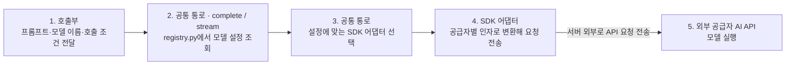

# 3-ai-server-design

AI 호출 계층, 모델·프롬프트 설정과 관측 실패의 격리 구조를 설명합니다.

| 항목 | 값 |
| --- | --- |
| 버전 | v0.1 |
| 작성일 | 2026-09-09 |
| 수정일 | 2026-09-09 |
| 대상 | manyak-ai |
| 작성 목적 | AI 호출 계층, 모델·프롬프트 설정과 관측 실패의 격리 구조를 설명합니다. |
| 기준 | [원래 Spec](../spec/5-ai-server-spec.md)의 기준 코드와 후속 기록을 이관했습니다. 이번 편집은 새 코드·운영 검증이 아닙니다. |

### 읽는 순서

Spec에서 계약을 확인한 뒤 책임 경계와 담당 기능을 읽습니다. 당시 선택 이유는 ADR, 남은 분리·검증은 [재구성 계획](../planning/product-document-reorganization.md)을 따릅니다.

### 목차

- [3-1. 호출 경계와 요청 흐름](#3-1-호출-경계와-요청-흐름)
- [3-2. 프롬프트와 모델 설정](#3-2-프롬프트와-모델-설정)
- [3-3. 관측과 런타임 설정](#3-3-관측과-런타임-설정)
- [3-4. 상태 수명·실패와 검증](#3-4-상태-수명실패와-검증)

## 3-1. 호출 경계와 요청 흐름

Python 3.11·FastAPI·Pydantic v2 기반입니다.

텍스트 LLM 호출은 호출부·모델 특성·SDK 어댑터의 세 층으로 나뉩니다.

| 층 | 책임 | 구현 |
| --- | --- | --- |
| 호출부 | 프롬프트·모델·출력 길이·시간 제한을 요청하고, 결과 검증·보완 호출·실패 시 대체 처리를 담당 | `story_llm.py`, `chat_llm.py` 등 기능별 서비스 |
| 모델 특성 | 모델별 공급자·어댑터·추론 설정·지원 인자·한도를 정의 | [registry.py](../../../manyak-ai/src/services/llm/registry.py) |
| SDK 어댑터 | 공통 요청을 공급자별 SDK 인자로 바꾸고, 응답·토큰 사용량·오류를 공통 형식으로 반환 | [llm/](../../../manyak-ai/src/services/llm)의 `openai_sdk.py`, `anthropic_sdk.py`, `google_sdk.py` |

호출부가 요청을 넘기면 [공통 통로](../../../manyak-ai/src/services/llm/__init__.py)가 모델 등록부에서 설정을 조회하고, 해당 SDK 어댑터를 선택해 공급자 API를 호출합니다. 아래 그림의 1~4는 AI 서버 내부 처리입니다. 4번 SDK 어댑터가 서버 밖으로 요청을 전송하면, 5번 외부 공급자 서버에서 모델을 실행합니다.

응답은 SDK 어댑터가 공통 형식으로 바꿔 공통 통로를 통해 호출부에 돌려줍니다. `complete()`는 완성된 결과를, `stream()`은 생성 중인 본문 조각과 완료 정보를 전달합니다. 공급자 오류도 공통 오류 형식으로 변환합니다.

DeepSeek과 GPT는 OpenAI SDK 어댑터를 공유합니다. Anthropic과 Google은 각각의 SDK 어댑터를 사용합니다.

이미지는 [별도 이미지 통로](../../../manyak-ai/src/services/image)의 `generate_image()`를 사용합니다. 인물·썸네일 생성 호출부가 프롬프트를 넘기면, 이미지 모델 매핑과 설정을 적용해 `openai_api.py`의 Images API 어댑터로 전달합니다. 이미지 결과·오류도 텍스트와 별도의 공통 형식으로 반환합니다.

## 3-2. 프롬프트와 모델 설정

본문은 SAFETY·CORE·STORY·CHARACTER·USER를 앞쪽 시스템 메시지로 조립하고, History·사용자 입력 뒤에 MEMORY 요약과 핵심 지시 재주입(PHI)을 둡니다. 충돌 우선순위는 SAFETY > CORE > MEMORY > STORY > CHARACTER > USER입니다. 선택지·판정은 별도 프롬프트입니다. [레이어 책임](../../../manyak-ai/spec/chat/1-PROMPT-LAYER.md)과 [배치](../../../manyak-ai/spec/chat/2-LAYER-PLACEMENT.md)가 상세 정본입니다.

| 용도 | 기준 모델·설정 | 시간 제한의 의미 |
| --- | --- | --- |
| 스토리라인 | `STORYLINES_MODEL`: deepseek-v4-flash, temperature 0.75, 출력 한도 6144 | SDK 90초. invalid 응답 재호출 경로는 전체 60초 예산 |
| 컴파일 | `STORY_COMPILE_MODEL`: 기본 gpt-5.6-terra, 추론 medium, 출력 한도 16384. Gemini 공급자 선택 시 전용 템플릿 | SDK 90초(이미지 시간 별도) |
| 본문 | `CHAT_MODEL`: deepseek-v4-flash, 출력 토큰 상한 미지정 | 첫 토큰 제한 90초 |
| 선택지 | `CHAT_MODEL`, 출력 한도 512 | SDK 호출당 60초, 누적 호출 전체 제한 아님 |
| 판정 | `CHAT_MODEL`, 출력 한도 256 | SDK 재시도 포함 60초와 남은 턴 예산 중 작은 값 |
| 이미지 | `IMAGE_MODEL`: gpt-image-2-2026-04-21, `IMAGE_QUALITY=low` | `IMAGE_TIMEOUT=60`은 시도당 제한, 한 장의 전체 제한 아님 |

위 값은 기준 코드의 설정이며 현재 운영 설정을 다시 조회한 결과가 아닙니다. 판정 예산은 `120초 - AI에서 잰 경과 시간 - 안전 여유 15초`로 계산하므로 백엔드 대기열 시간을 정확히 반영하지 못합니다. SDK 자동 재시도로 실제 대기가 길어질 수 있으며, 품질·속도·비용 비교에서 재시도까지 포함해야 합니다.

등록된 모델만 호출하며 공급자·허용 인자·한도·가격 근거는 [텍스트 등록부](../../../manyak-ai/src/services/llm/registry.py)와 이미지 등록부가 소유합니다. `CHAT_MODEL`의 Anthropic 선택은 기동에서 차단합니다. Google은 뒤쪽 지시문 유실 문제가 남아 채팅용으로 사용할 수 없지만 등록부 차단은 미반영입니다. 선택한 텍스트 공급자 키·주소·기능 지원을 기동 검사하며, 이미지 검사는 별도여서 OpenAI 키가 항상 필요합니다. 검사는 문자열·설정 검사로 실제 인증 성공을 보장하지 않습니다.

프롬프트는 `prompt/` 파일의 frontmatter `version`이 정본입니다. 수정 시 `version`·`updated`를 올리고 LF로 저장하며 변경 이력은 git에 남깁니다. frontmatter·버전 누락은 기동 실패입니다. 버전 키는 스토리라인 `STORYLINES`, 컴파일 `COMPILE` 또는 `COMPILE_GEMINI`와 이미지 2종(`CHARACTER_IMAGE`·`THUMBNAIL_IMAGE`), 채팅 6레이어와 `JUDGEMENT`, 선택지 `NEXT_ACTIONS`입니다.

## 3-3. 관측과 런타임 설정

Langfuse는 키·JP 주소·prod 환경이 모두 충족될 때만 켭니다. 요청마다 trace를 분리하고 SDK 기록 실패는 AI 응답에 전파하지 않습니다. 본 작업 예외는 그대로 전파합니다. 종료 시 flush하며 실패하면 마지막 미전송 배치가 유실될 수 있습니다. OpenAI SDK 호출(DeepSeek·GPT)만 하위 호출 관측을 제공하고 Anthropic·Google은 이 관측이 미완입니다. 장르 라벨은 스토리 제작에만 붙이며 직접 입력 장르 예외·원문 보존·평가 활용·제외·삭제는 [분석 명세 §6-7](../spec/6-analytics.md#6-7-개인정보와-원문-수집-원칙)을 따릅니다.

환경 변수의 이름·기본값은 [설정 코드](../../../manyak-ai/src/core/config.py), 배포 적용은 [배포 명세](4-deployment.md)를 따릅니다. [`.env.example`](../../../manyak-ai/.env.example)은 일부 설정이 빠진 참고용입니다. 이미지 설정은 `IMAGE_MODEL`·`IMAGE_QUALITY`·`IMAGE_SIZE`(기본 `1024x768`)·`IMAGE_TIMEOUT`이며, 텍스트 모델 선택과 관계없이 `OPENAI_API_KEY`가 필요합니다. Google 텍스트 모델을 선택하면 `GEMINI_API_KEY`도 필요합니다.

## 3-4. 상태 수명·실패와 검증

기능별 서비스가 요청 단위로 프롬프트·검증·보완 호출을 조정하고 공통 어댑터가 공급자 결과·usage·오류를 정규화합니다. 스토리·채팅의 영속 상태는 백엔드가 소유합니다. 모델 등록부와 프롬프트는 기동 설정이며 제품 진행 상태 저장소가 아닙니다.

- 기능별 보완·fallback·시간 예산은 [API 처리 계약](../spec/5-ai-server-spec.md#5-3-api-기능과-처리-흐름)을 따릅니다. 본문 SSE 실패와 판정 실패의 처리 결과를 합치지 않습니다.
- 공급자 SDK 재시도와 서비스 추가 호출은 별개입니다. `retry_count`·토큰 누락 의미는 [관측 계약](../spec/5-ai-server-spec.md#5-6-운영과-관측)을 따릅니다.
- 관측 실패는 본 작업 실패와 분리합니다. SDK 기록 실패가 응답을 실패시키지 않으며 본 작업 예외는 그대로 전달합니다.
- API·부분 실패·관측 격리는 기존 `scripts/test.sh`·`scripts/test.ps1`을 사용합니다. 라이브 프롬프트 품질·비용 실측은 [검수 기준](../spec/5-ai-server-spec.md#5-7-검수와-남은-제약)의 별도 범위입니다.
