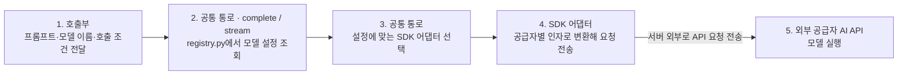
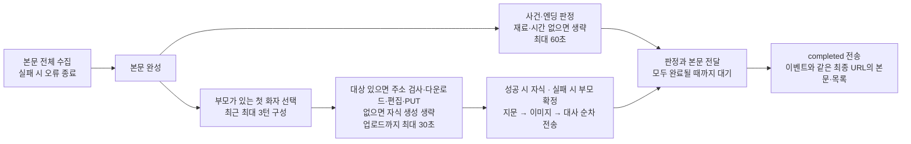

# 3-ai-server-design

## 문서 정보

| 항목 | 값 |
| --- | --- |
| 버전 | v0.23 |
| 작성일 | 2026-09-09 |
| 수정일 | 2026-09-26 |
| 대상 | manyak-ai |
| 작성 목적 | AI 호출 계층, 모델·프롬프트 설정과 관측 실패의 격리 구조를 설명합니다. |
| 기준 | [Spec](../spec/5-ai-server-spec.md)의 기준 코드·브랜치를 따릅니다. dev 머지·운영 배포 검증과 구분합니다. |

## 읽는 순서

- Spec에서 계약을 확인한 뒤 책임 경계와 담당 기능을 읽습니다. 당시 선택 이유는 ADR을 따릅니다.

## 목차

- [3-1. 호출 경계와 요청 흐름](#3-1-호출-경계와-요청-흐름)
- [3-2. 프롬프트와 모델 설정](#3-2-프롬프트와-모델-설정)
- [3-3. 관측과 런타임 설정](#3-3-관측과-런타임-설정)
- [3-4. 상태 수명·실패와 검증](#3-4-상태-수명실패와-검증)
- [3-5. 게시물 검수의 구현 상태](#3-5-게시물-검수의-구현-상태)

---

AI 호출 계층, 모델·프롬프트 설정과 관측 실패의 격리 구조를 설명합니다.

## 3-1. 호출 경계와 요청 흐름

Python 3.11·FastAPI·Pydantic v2 기반입니다.

텍스트 LLM 호출은 호출부·모델 특성·SDK 어댑터의 세 층으로 나뉩니다.

| 층 | 책임 | 구현 |
| --- | --- | --- |
| 호출부 | 프롬프트·모델·출력 길이·시간 제한을 요청하고, 결과 검증·보완 호출·실패 시 대체 처리를 담당 | `story_llm.py`, `chat_llm.py` 등 기능별 서비스 |
| 모델 특성 | 모델별 공급자·어댑터·추론 설정·지원 인자·한도를 정의 | [registry.py](../../../manyak-ai/src/services/llm/registry.py) |
| SDK 어댑터 | 공통 요청을 공급자별 SDK 인자로 바꾸고, 응답·토큰 사용량·오류를 공통 형식으로 반환 | [llm/](../../../manyak-ai/src/services/llm)의 `openai_sdk.py`, `anthropic_sdk.py`, `google_sdk.py` |

호출부가 요청을 넘기면 [공통 통로](../../../manyak-ai/src/services/llm/__init__.py)가 모델 등록부에서 설정을 조회하고, 해당 SDK 어댑터를 선택해 공급자 API를 호출합니다. 아래 그림의 1~4는 AI 서버 내부 처리입니다. 4번 SDK 어댑터가 서버 밖으로 요청을 전송하면, 5번 외부 공급자 서버에서 모델을 실행합니다.

응답은 SDK 어댑터가 공통 형식으로 바꿔 공통 통로를 통해 호출부에 돌려줍니다. `complete()`는 완성된 결과를, `stream()`은 생성 중인 본문 조각과 완료 정보를 전달합니다. 공급자 오류도 공통 오류 형식으로 변환합니다.

DeepSeek과 GPT는 OpenAI SDK 어댑터를 공유합니다. Anthropic과 Google은 각각의 SDK 어댑터를 사용합니다.

이미지는 [별도 이미지 통로](../../../manyak-ai/src/services/image)의 `generate_image()`를 사용합니다. 인물·썸네일·자식 이미지 생성 호출부가 프롬프트를 넘기면, 이미지 모델 매핑과 설정을 적용해 `openai_api.py`의 Images API 어댑터로 전달합니다. 이미지 결과·오류도 텍스트와 별도의 공통 형식으로 반환합니다.

### 스토리라인 라우터와 서비스

이 절은 Spec의 「스토리라인 서비스 구조 기준」에 표시한 dev 구현입니다.

| 담당 | 역할 |
| --- | --- |
| [라우터](../../../manyak-ai/src/api/v1/story.py) | `POST /api/v1/story/storylines` 요청의 관측을 시작하고 서비스를 한 번 호출합니다. 성공 응답 메타 또는 실패 HTTP 예외에서 재호출 횟수를 읽어 기록하고 결과를 반환합니다. |
| [서비스](../../../manyak-ai/src/services/story_llm.py) | `generate_storylines(request: StorylinesRequest) -> StorylinesResponse`에서 프롬프트 준비·인물 이름 추출·모델 호출·검증·보완·최종 응답 조립을 수행합니다. |

서비스는 기존 `build_storylines_prompt()`를 사용하고, 이름이 있는 주변 인물을 누락 검사
대상으로 추출합니다. 응답에는 이야기 후보와 실제 모델·공급자·프롬프트 버전·토큰·재호출
횟수를 담은 `StoryResponseMeta`를 넣습니다. LLM이 반환한 최상위 `meta`는 사용하지 않습니다.
형식 오류 재호출과 인물 보완의 조건·한도는 기존 정책을 유지합니다.

개발 도구는 같은 요청 모델로 서비스를 직접 호출해 완성 응답을 받습니다. HTTP 라우터의
요청 단위 관측은 직접 호출에 포함되지 않습니다. 컴파일은 기존부터
`compile_story(request) -> StoryCompileResponse` 방식으로 생성과 응답 조립을 담당합니다.
외부 계약은 [Spec](../spec/5-ai-server-spec.md#5-9-1-스토리라인-생성), 선택 이유는
[ADR](../adr/3-ai-server-adr.md#스토리라인-생성-준비와-응답-조립을-서비스에서-수행)을 따릅니다.

### 스토리 인물 구성과 컴파일 검증

[프롬프트 조립](../../../manyak-ai/src/services/prompt.py)은 `supporting_characters`의 배열 길이를 스토리라인·컴파일 본호출과 보완 요청에 전달합니다. 컴파일 입력에는 순서별 `input_character_id`를 붙입니다. 기본·Gemini 템플릿 모두 이름이 정해진 입력을 이야기 속 인물에 먼저 연결하고, 이름 미정 입력은 아직 연결하지 않은 인물에 연결하도록 지시합니다. 호칭만 있는 인물도 대상이며 사용자 지정 값이 우선입니다.

[컴파일 서비스](../../../manyak-ai/src/services/story_llm.py)는 입력이 있을 때 카드 수와 각 입력 ID가 정확히 일대일인지 확인합니다. 카드 순서는 달라도 됩니다. 누락·중복·미등록 ID·문자열이 아닌 ID·카드 수 불일치는 카드 블록 보완 대상으로 모읍니다. 블록을 다시 받는 차수에는 기존 배열 위치에 대한 개별 필드 수정 요청을 함께 보내지 않습니다.

기존 최대 2회 보완 한도 안에서 다른 블록·인물 필드 문제와 함께 처리합니다. 보완 후 사용자 이름을 ID로 다시 적용하고 같은 검사를 반복합니다. 불일치가 남으면 이미지·표지 호출 전에 502를 반환하고, 통과하면 내부 ID를 제거한 뒤 응답 스키마 검사와 이미지 생성을 수행합니다. 0명 입력은 입력 ID 대응 검사를 건너뛰되 필수 필드·이름·카드 1~5명 스키마 검증은 유지합니다.

보완 프롬프트는 직전 결과의 잘못 만든 인물이 아니라 원래 선택한 이야기의 인물·관계를 기준으로 삼도록 지시합니다. 별도 인물 명단 API나 의미 판정 LLM 호출은 없습니다. API 계약과 품질 기준의 구분은 [Spec의 컴파일](../spec/5-ai-server-spec.md#5-3-3-스토리-컴파일)을 따릅니다.

### 자식 이미지가 있는 채팅 흐름

[chat_child_image.py](../../../manyak-ai/src/services/chat_child_image.py)가 본문을 수집하고,
[child_input.py](../../../manyak-ai/src/services/image/child_input.py)가 부모가 있는 첫 화자와
최근 대화를 고릅니다. [child_prompt.py](../../../manyak-ai/src/services/image/child_prompt.py)는
`CHILD-IMAGE-TEMPLATE.md`에 대화 재료를 XML 텍스트로 넣어 이스케이프합니다. 채팅 본문은
저장 마커를 제거한 복사본을 사용하고 요청 이력은 수정하지 않습니다.

[generate_child.py](../../../manyak-ai/src/services/image/generate_child.py)는 부모를 내려받아
참조 이미지로 첨부합니다. 이미지 어댑터는 참조가 있으면 OpenAI `images.edit`를 호출하며
SDK 재시도를 0으로 지정합니다. 컴파일의 `images.generate`는 기존 재시도 설정을 유지합니다.
부모 다운로드는 `IMAGE_PARENT_ALLOWED_HOSTS`의 HTTPS 호스트만 허용하고 사용자 정보·443
외 포트·리다이렉트를 거부합니다. 50,000,000바이트 이상이면 중단하며 PNG·JPEG·WebP 파일
시그니처를 검사합니다. 허용 호스트 기본값은 설정 코드가 소유합니다.

`image_slots`가 있으면 이 경로를 사용합니다. [upload_child.py](../../../manyak-ai/src/services/image/upload_child.py)는
유료 생성 전에 `upload_url`의 HTTPS 호스트가 `IMAGE_UPLOAD_ALLOWED_HOSTS`와 정확히 일치하는지
검사합니다. 기본값은 빈 배열로, 미설정·거부 시 다운로드·생성·업로드를 생략합니다.
생성한 base64를 바이트로 변환해 `Content-Type: image/webp`로 PUT하며 재시도·리다이렉트는
하지 않습니다. HTTP 2xx이면 슬롯의 `public_url`을 사용합니다. 응답 본문·S3 HEAD·CDN 조회는
수행하지 않습니다. `key`는 주소 조립에 사용하지 않으며 주소 간 일치는 백엔드가 책임집니다.

판정과 이미지 처리는 본문 완성 후 동시에 시작하며, 각각 남은 턴 시간에 맞춰 제한을 줄입니다.
이미지 결과가 정해질 때까지 앞 지문도 보내지 않습니다. AI는 업로드 성공이면 자식, 실패이면 부모를
선택한 뒤 앞 지문부터 전송합니다. 이미지는 원래 위치에 두고 대사와 뒤 지문을 이어 보냅니다.
완료 본문·목록도 같은 이미지를 사용하며
백엔드는 AI가 보낸 최종 본문·참조를 해당 턴·응답 버전에 저장합니다.

어느 호출을 기다리든 연결이 끊기면 진행 중인 작업을 취소하고 정리합니다. 그림의 두 병렬
구간은 서로의 완료를 기다리지 않습니다. 이미지가 먼저 끝나면 판정 중에도 대사가 전달됩니다.

판정은 본문 완료 콜백에서 별도 작업으로 시작합니다. 이미지 완료 시각을 생성·업로드 작업 내부에서
검사하므로 결과 전송 지연은 생성 시간 초과로 취급하지 않습니다. `render_chat_images`로
이벤트와 저장 본문을 함께 만듭니다. 성공하면 선택한 인물의 매핑만 복사본에서 바꾸고 다시
렌더링합니다. 같은 부모 URL을 쓰는 다른 인물은 바꾸지 않으며 요청 원본을 보존합니다.
이벤트와 본문·목록에 base64는 넣지 않습니다. 저장·표시 규칙은
[Spec의 부모·자식 이미지](../spec/5-ai-server-spec.md#부모-이미지와-자식-이미지)를 따릅니다.

`_stream_rendered`는 완성된 본문의 텍스트 이벤트를 최대 12자씩 나눠 전송합니다. 조각마다
기본 30ms를 기다리되, 전체 대기 합계가 8초와 전송 시작 시 남은 시간의 절반을 넘지 않도록
간격을 줄입니다. 실행·네트워크 지연은 별도이므로 화면 표시 간격을 보장하는 값은 아닙니다.
생성 대상이 없는 슬롯 요청도 같은 방식으로 보내고, 슬롯이 없는 요청은 기존 실시간 스트림을
사용합니다. 각 텍스트 조각·이미지 전송 전에 마감 시각을 검사하며 초과하면 `error`만 보내고
종료합니다. 연결 종료 시 본문 순차 전송도 중단합니다.

## 3-2. 프롬프트와 모델 설정

본문은 SAFETY·CORE·STORY·CHARACTER·USER를 앞쪽 시스템 메시지로 조립하고, History·사용자 입력 뒤에 MEMORY 요약과 핵심 지시 재주입(PHI)을 둡니다. 충돌 우선순위는 SAFETY > CORE > MEMORY > STORY > CHARACTER > USER입니다. 선택지·판정은 별도 프롬프트입니다. [레이어 책임](../../../manyak-ai/spec/chat/1-PROMPT-LAYER.md)과 [배치](../../../manyak-ai/spec/chat/2-LAYER-PLACEMENT.md)가 상세 정본입니다.

| 용도 | 기준 모델·설정 | 시간 제한의 의미 |
| --- | --- | --- |
| 스토리라인 | `STORYLINES_MODEL`: deepseek-flash, temperature 0.75, 출력 한도 6144 | SDK 90초. invalid 응답 재호출 경로는 전체 60초 예산 |
| 컴파일 | `STORY_COMPILE_MODEL`: 기본 gpt-5.6-terra, 추론 medium, 출력 한도 16384. Gemini 공급자 선택 시 전용 템플릿 | SDK 90초(이미지 시간 별도) |
| 본문 | `CHAT_MODEL`: deepseek-flash, 출력 토큰 상한 미지정 | 첫 토큰 제한 90초 |
| 선택지 | `CHAT_MODEL`, 출력 한도 512 | SDK 호출당 60초, 누적 호출 전체 제한 아님 |
| 판정 | `CHAT_MODEL`, 출력 한도 256 | SDK 재시도 포함 60초와 남은 턴 예산 중 작은 값 |
| 컴파일 이미지 | `IMAGE_MODEL`: gpt-image-2.5-flare, `IMAGE_QUALITY=low` | `IMAGE_TIMEOUT=60`은 시도당 제한, 한 장의 전체 제한 아님 |
| 자식 이미지 | 같은 `IMAGE_MODEL`·크기·화질, 부모 첨부 편집·직접 업로드, SDK·PUT 재시도 없음 | 다운로드·생성·업로드 합계 30초와 남은 턴 예산 중 작은 값 |

이미지 모델 기본값은 `gpt-image-2.5-flare`입니다. 자식 이미지 브랜치의 후속 변경으로
Flare와 날짜 고정 모델 `gpt-image-2.5-flare-2026-09-08`을 등록했습니다. 부모·자식·표지는
같은 설정을 사용하며, 환경 변수에 `IMAGE_MODEL`이 지정되어 있으면 그 값이 우선합니다.
Flare의 Langfuse 단가 설정과 실제 이미지 생성은 아직 검증하지 않았습니다.

자식 이미지 프롬프트 `CHILD-IMAGE-TEMPLATE.md`는 버전 2입니다. 부모 인물을 성인으로
한정하지 않고 실제 연령대와 외형을 유지하도록 지시합니다. 이미지 품질 실측은 미실시입니다.

자식 이미지 요청의 전체 마감은 `턴 시작 + 120초 - 15초`입니다. 본문 수집 전에 남은 시간의
4분의 1과 8초 중 작은 값을 본문 순차 전송용으로 남깁니다. 본문 수집은 이 시간을 뺀 시각까지,
이미지 다운로드·생성·업로드는 그 시각과 시작 후 30초 중 먼저 오는 시각까지 수행합니다.
판정은 본문 완성 후 시작하며 전송용 시간을 별도로 빼지 않고 전체 마감과 60초 중 작은 예산을
사용합니다. 이미지 시간 초과 후에도 부모 이미지와 글을 전송할 시간을 남기는 구조입니다.

위 값은 기준 코드의 설정이며 현재 운영 설정을 다시 조회한 결과가 아닙니다. 판정 예산은 `120초 - AI에서 잰 경과 시간 - 안전 여유 15초`로 계산하므로 백엔드 대기열 시간을 정확히 반영하지 못합니다. SDK 자동 재시도로 실제 대기가 길어질 수 있으며, 품질·속도·비용 비교에서 재시도까지 포함해야 합니다.

등록된 모델만 호출하며 공급자·허용 인자·한도·가격 근거는 [텍스트 등록부](../../../manyak-ai/src/services/llm/registry.py)와 이미지 등록부가 소유합니다. DeepSeek의 옛 이름(`deepseek-v4-flash`·`deepseek-v4-pro`)은 등록하지 않으므로 설정에 남아 있으면 기동 검사에서 실패합니다. `CHAT_MODEL`의 Anthropic 선택은 기동에서 차단합니다. Google은 뒤쪽 지시문 유실 문제가 남아 채팅용으로 사용할 수 없지만 등록부 차단은 미반영입니다. 선택한 텍스트 공급자 키·주소·기능 지원을 기동 검사하며, 이미지 검사는 별도여서 OpenAI 키가 항상 필요합니다. 검사는 문자열·설정 검사로 실제 인증 성공을 보장하지 않습니다.

프롬프트는 `prompt/` 파일의 frontmatter `version`이 정본입니다. 수정 시 `version`·`updated`를 올리고 LF로 저장하며 변경 이력은 git에 남깁니다. frontmatter·버전 누락은 기동 실패입니다. 버전 키는 스토리라인 `STORYLINES`, 컴파일 `COMPILE` 또는 `COMPILE_GEMINI`와 이미지 2종(`CHARACTER_IMAGE`·`THUMBNAIL_IMAGE`), 채팅 6레이어와 `JUDGEMENT`, 선택지 `NEXT_ACTIONS`입니다. 자식 이미지 버전은 채팅 완료 meta에 합산하지 않고 루트 관측 `child_image.prompt_version`에 기록합니다.

## 3-3. 관측과 런타임 설정

Langfuse는 키·JP 주소·prod 환경이 모두 충족될 때만 켭니다. 요청마다 trace를 분리하고 SDK 기록 실패는 AI 응답에 전파하지 않습니다. 본 작업 예외는 그대로 전파합니다. 종료 시 flush하며 실패하면 마지막 미전송 배치가 유실될 수 있습니다. OpenAI SDK 텍스트 호출(DeepSeek·GPT)은 `langfuse.openai` 자동 계측이 하위 호출 관측을 만들고 Anthropic·Google은 이 관측이 미완입니다. 이미지 호출(`images.generate`·`images.edit`)은 자동 계측이 감싸지 않으므로 [이미지 어댑터](../../../manyak-ai/src/services/image/openai_api.py)가 [`observe_generation`](../../../manyak-ai/src/core/langfuse.py)으로 generation 관측을 직접 엽니다. 인물 이미지는 병렬 작업마다 관측이 따로 열리고 모두 컴파일 trace 아래에 붙습니다. 응답을 받은 직후 usage를 먼저 기록해 응답 해석에 실패해도 과금분이 남습니다. 비용 계산은 Langfuse 프로젝트의 모델 단가에 의존하며, 이미지는 세부 키(`input_text`·`input_image`·`output_image`)에만 단가를 등록해 표준 키와 이중 계산되지 않게 합니다. deepseek-flash 단가는 피크·오프피크 두 구간으로 등록돼 있습니다. gpt-image-2 단가도 등록돼 있습니다. DeepSeek 텍스트 호출은 어댑터가 호출마다 피크 시간(UTC 월~금 01:00~04:00·06:00~10:00, 시작 포함·끝 제외) 여부를 판정해 metadata `pricing_window`(`peak`·`off_peak`)를 싣고, Langfuse의 조건 구간이 이 값으로 단가를 고릅니다. 이 인자는 `langfuse.openai` 래퍼가 걷어내는 것이라 Langfuse가 꺼져 있을 때는 공급자 API로 새지 않도록 붙이지 않습니다. 판정은 호출 시작 시각 기준이며 시간대 경계를 넘는 긴 호출은 한쪽 구간으로 잡힙니다. 장르 라벨은 스토리 제작에만 붙이며 직접 입력 장르 예외·원문 보존·평가 활용·제외·삭제는 [분석 명세 §6-7](../spec/6-analytics.md#6-7-개인정보와-원문-수집-원칙)을 따릅니다.

자식 이미지 generation의 이름은 `이미지 생성:자식`이며 병렬 작업에 복사된 호출 컨텍스트를
통해 같은 채팅 trace에 붙습니다. 입력 프롬프트는 기존 원문 수집 규칙을 따르고 부모 첨부
파일·생성 바이너리는 기록하지 않습니다. 사용량이 없는 실패를 0원으로 추정하지 않습니다.

루트 관측의 `child_image`에는 다음을 기록합니다. 다운로드 전에 실패하여 이미지 API를 부르지
못한 경우에도 이 결과는 남습니다. 요청마다 별도 객체를 만들며 기능이 꺼져 있으면 생략합니다.

| 필드 | 값·의미 |
| --- | --- |
| `status` | `not_started`, `skipped`, `success`, `failed`, `cancelled` |
| `reason` | 성공 시 null. `body_incomplete`, `no_parent`, `body_error`, `body_timeout`, `invalid_upload_url`, `timeout`, `rate_limited`, `rejected`, `generation_failed`, `cancelled`, `unexpected_error` |
| `duration_ms` | 주소 검사·부모 다운로드·생성·업로드 시간. 취소 정리 포함; 시작하지 않았으면 null |
| `parent_fallback` | AI가 부모 대체 이벤트를 만들면 true. 백엔드 저장 실패·클라이언트 표시 성공 여부는 알 수 없음 |
| `prompt_version` | 자식 이미지 프롬프트 버전 |

이미지 시간 제한 래퍼에서 예상하지 못한 일반 예외가 발생하면
`status=failed`, `reason=unexpected_error`로 기록하고 `generation_failed` 결과를 반환합니다.
이벤트 전달부는 부모 대체 정보를 붙이고 뒤 대사·완료 전달을 계속합니다.
오류 원문은 응답이나 이 관측에 넣지 않습니다.

관측용 시간 제한 래퍼 바깥의 `CancelledError`는 요청 취소로 기록합니다. 정리가 끝난 시각이
마감을 넘었다는 이유로 취소를 시간 초과로 바꾸지 않습니다. 사용량·비용은 generation에만
남기고 루트 metadata에 복사하지 않습니다. 새 metadata에 인물 이름·이미지 이름·URL·대화
원문·base64를 넣지 않습니다.

`success`는 생성·업로드 성공, `failed`는 생성·업로드 실패입니다. 주소 거부는
`skipped`·`invalid_upload_url`로 기록하고 부모로 대체합니다. 업로드 HTTP·데이터 오류는
`generation_failed`, 네트워크 시간 초과는 `timeout`입니다. 업로드가 실패해도 이미 수행한
생성 사용량은 남습니다. 주소 검사·부모 다운로드에서 중단하면 이미지 generation은 없습니다.
채팅·선택지 모두 관측 입력에서 `image_slots`를 제외합니다. 업로드는 서명 URL의 INFO 로그
출력을 피하기 위해 `httpx.AsyncHTTPTransport`를 직접 사용하며 예외 원문·응답 본문을 기록하지 않습니다.

[main.py](../../../manyak-ai/src/main.py)의 `RequestValidationError` 처리기는 채팅 턴·선택지
경로에서 오류별 `type`·`loc`·`msg`만 남긴 새 예외를 기본 응답 처리기에 전달합니다.
필수 필드 누락 시 `input`에 요청 본문 전체가 들어갈 수 있으므로 슬롯 오류만 가리지 않습니다.
비채팅 API는 기존 오류 응답을 유지합니다. 모델의 `repr=False`는 오류 응답을 가리지 않으므로
이 처리는 모델 표시·관측 입력 제외와 별도로 적용합니다.

환경 변수의 이름·기본값은 [설정 코드](../../../manyak-ai/src/core/config.py), 배포 적용은 [배포 명세](4-deployment.md)를 따릅니다. [`.env.example`](../../../manyak-ai/.env.example)은 일부 설정이 빠진 참고용입니다. 이미지 설정은 `IMAGE_MODEL`·`IMAGE_QUALITY`·`IMAGE_SIZE`(기본 `1024x768`)·`IMAGE_TIMEOUT`이며, 텍스트 모델 선택과 관계없이 `OPENAI_API_KEY`가 필요합니다. Google 텍스트 모델을 선택하면 `GEMINI_API_KEY`도 필요합니다.

## 3-4. 상태 수명·실패와 검증

기능별 서비스가 요청 단위로 프롬프트·검증·보완 호출을 조정하고 공통 어댑터가 공급자 결과·usage·오류를 정규화합니다. 스토리·채팅의 영속 상태는 백엔드가 소유합니다. 모델 등록부와 프롬프트는 기동 설정이며 제품 진행 상태 저장소가 아닙니다.

- 기능별 보완·fallback·시간 예산은 [API 처리 계약](../spec/5-ai-server-spec.md#5-3-api-기능과-처리-흐름)을 따릅니다. 본문 SSE 실패와 판정 실패의 처리 결과를 합치지 않습니다.
- 공급자 SDK 재시도와 서비스 추가 호출은 별개입니다. `retry_count`·토큰 누락 의미는 [관측 계약](../spec/5-ai-server-spec.md#5-6-운영과-관측)을 따릅니다.
- 자식 이미지 요청은 본문·판정·이미지 생성·업로드 작업을 취소하고 정리 완료를 기다립니다. `_ChatStreamingResponse`는 전송 도중 연결 종료도 스트림을 명시적으로 닫아 처리합니다. 정리 구간은 반복 취소로 중단되지 않도록 보호합니다. 취소는 이미 업로드된 S3 파일의 삭제를 보장하지 않으며 AI에는 삭제 경로가 없습니다.
- 관측 실패는 본 작업 실패와 분리합니다. SDK 기록 실패가 응답을 실패시키지 않으며 본 작업 예외는 그대로 전달합니다.
- API·부분 실패·관측 격리는 기존 `scripts/test.sh`·`scripts/test.ps1`을 사용합니다. 라이브 프롬프트 품질·비용 실측은 [검수 기준](../spec/5-ai-server-spec.md#5-7-검수와-남은-제약)의 별도 범위입니다.

자식 이미지 직접 업로드 구현 단계에서 관련 Docker 테스트 130개가 통과했고, 같은 부모 URL을
쓰는 다른 인물 보존 테스트를 추가해 1개 별도 실행·통과했습니다. 병렬 실행·시간 초과·연결 종료·
업로드 실패 시 부모 대체·최종 URL 일치·슬롯 관측 제외를 확인했습니다. API 테스트는 본문 SDK·
외부 HTTP·업로드 함수를 대체하며, 별도 업로드 테스트와 일부 채팅 테스트는 HTTP 전송만 대체합니다.
실제 S3 저장·CDN 조회·모델 품질·Langfuse 전송·백엔드 저장·클라이언트 표시는 미검증입니다.
[채팅 API 테스트](../../../manyak-ai/tests/test_chat_api.py)는 슬롯 필수값 누락·개수 초과·
잘못된 URL·일반 필수값 누락 시 서명 URL 비노출과 비채팅 API의 오류 형식 보존을 확인합니다.
이번 문서 갱신에서는 테스트 코드를 대조했으며 Docker 테스트를 재실행하지 않았습니다.
컴파일 이미지의 전체 시간 예산 문제는 이 변경으로 해소되지 않습니다.

## 3-5. 게시물 검수의 구현 상태

이 절은 KNK-1120의 승인된 목표 구조입니다. 검수 구현은 dev 반영 전이며 Langfuse 연결과
실제 모델 실측도 남아 있습니다. 아래 설명을 dev·운영 구현 완료로 해석하지 않습니다.

라우터는 `src/api/v1/moderation/story.py`에 두고 공통 LLM 통로의 텍스트·이미지 메시지로 호출합니다.
모델은 `MODERATION_MODEL`(기본 `gpt-5.6-luna`)·`MODERATION_FALLBACK_MODEL`(기본 `deepseek-flash`)로
고릅니다. 등록 모델·지원 기능은 기동 시 확인하지만 검수 전용 공급자 키 누락으로 서버 전체를 막지
않습니다. 호출 시 설정 실패도 대체 모델로 넘깁니다. 다른 기능에 필요한 키 검사는 유지합니다.
OpenAI 추론 강도는 `high`, SDK 내부 재시도는 0이며 서비스가 기본·대체 모델을 각각 최대 1회 호출합니다.

백엔드가 보낸 검수 대상 원본의 서빙 URL(노출 폴백 적용 전)을 서버가 내려받아 base64로 전달합니다.
허용 호스트 목록은 `IMAGE_PARENT_ALLOWED_HOSTS`를 사용합니다. dev에서도 운영 CDN(`cdn.manyak.app`)을
허용해야 합니다. 기본 목록은 `cdn.manyak.app`·`dev-cdn.manyak.app`입니다. 빈 주소는 다운로드하지 않습니다.
다운로드는 최대 5장을 동시에 처리하며 정상 이미지와 준비 오류를 각각 모읍니다.
실패한 URL은 모델 입력에서 제외하되 원래 배열 인덱스를 유지합니다. 정상 이미지가 남으면 텍스트와 함께
검수하고, 이미지가 있었지만 전부 준비에 실패하면 모델 호출을 생략합니다. 이미지가 없는 요청은 텍스트를 검수합니다.

모델이 `rule: null`로 보고한 이미지 경로를 모두 `IMAGE_UNREADABLE`로 변환합니다. 준비 오류와 합쳐
`image_errors`를 원래 입력 순서로 반환합니다. 이미지 오류가 하나라도 있으면 최종 `REJECTED`로
응답하되, 모델이 찾은 텍스트·이미지 내용 위반은 `issues`에 보존합니다. 대표 오류의 우선순위는 [Spec §5-9-6](../spec/5-ai-server-spec.md#5-9-6-게시물-검수)을 따릅니다.
합계 용량 초과는 백엔드가 검수 요청 전에 차단하고 사용자에게 이미지 크기·장수 축소를 안내합니다.
백엔드 사전 계산에는 원본 이미지의 base64 변환 크기와 텍스트·JSON·AI 프롬프트를 위한 여유가 필요합니다.
구체적인 상한·계산 방식은 백엔드 명세에서 정합니다. AI 서버는 마지막 방어로 실제 요청 본문
48MiB 검사를 유지하며, 검수 서비스에서만 수행하고 공통 LLM 어댑터에 넣지 않습니다.
이미지 합계가 한도를 넘으면 추가 바이트를 보관하지 않되 남은 파일 검사를 계속하고,
준비된 이미지 전체와 기존 오류를 목록에 담아 모델 호출 없이 거절합니다.

시간 제한은 이미지 준비 30초·모델 호출 60초·요청 전체 150초이며 환경 변수로 조정합니다.
시간 초과 시 진행 중·대기 중 다운로드를 취소하고 미완료 이미지 각각에 다운로드 실패를 기록합니다.
실행 실패는 Sentry에 보고하고 호출마다 모델·토큰을 기록합니다. Langfuse에는 최종 결과와 모델 호출을
연결하고 `storyId`(스토리 `public_id(UUID)`)를 메타데이터 `story_id`에 기록할 예정입니다(KNK-1371).

승인된 입력·판정·오류 계약은 [Spec §5-3-6](../spec/5-ai-server-spec.md#5-3-6-게시물-검수)과
[§5-9-6](../spec/5-ai-server-spec.md#5-9-6-게시물-검수), 결정 근거는
[검수 결정 기록](../adr/3-ai-server-adr.md#게시물의-명백한-금지-내용-검수와-실패-시-게시-차단)에 있습니다.
