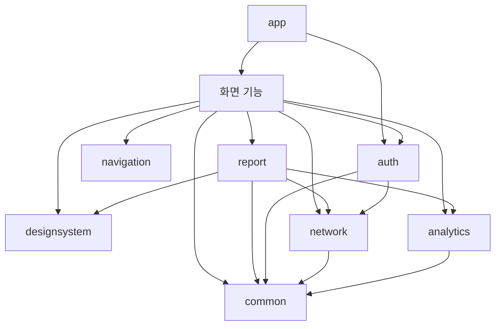

# Android 모듈 아키텍처

- 작성일: 2026-09-05
- 작업: KNK-1197
- 대응 브랜치: 하네스 `docs/KNK-1197-improve-folder-structure`, Android `refactor/KNK-1197-improve-folder-structure`. 이 브랜치의 구조 변경은 `dev` 병합 전 변경으로 구분합니다.
- 상태: **구현·로컬 검증 완료**. Android 작업 브랜치의 구현이며 아직 병합·배포된 상태를 뜻하지 않습니다.
- 기준: 하네스 `dev`의 `eaf081c`, Android `refactor/KNK-1197-improve-folder-structure`의 `5ee07c6`.
- `3-3-android-app.md`에서 위임한 모듈 상세 규칙의 정본: 이 문서. 파일 이동·검증 실행 계획은 [Android 실행 계획](../../../manyak-android/docs/plans/module-reorganization.md)이 소유합니다.

## 1. 목표와 변경 경계

큰 기능과 기반 기능을 최상위 Gradle 모듈로 구성합니다. 각 기능은 자신의 데이터 접근부터 화면까지 소유하고, 여러 화면을 포함하는 기능은 내부 하위 기능 패키지로 나눕니다. `core`는 제거하고 최소 공통 기반만 하나의 `common` 모듈로 모읍니다.

사용자와 합의한 방향은 다음과 같습니다.

- 최상위: `app`, `auth`, `network`, `analytics`, `navigation`, `designsystem`, `common`, `chat`, `create`, `home`, `studio`, `my`, `story`, `login`, `legal`, `report`.
- `build-logic`은 공통 빌드 플러그인을 제공하는 included build입니다. `gradle/`은 Wrapper·버전 카탈로그 디렉터리입니다.
- `entity`, `domain`, `data`, `presentation` 및 `chat/list` 같은 하위 기능은 **패키지**입니다. 각각을 Gradle 모듈로 만들지 않습니다.
- 실제 코드가 없는 계층, 단순 Repository 위임 UseCase, 각 기능의 일괄 `api`/`impl` 모듈 분리는 만들지 않습니다.
- 이번 계획의 구현은 구조 변경입니다. API·사용자 흐름·UI·분석 이벤트·저장 형식·인증 정책 변경을 섞지 않습니다.

코드 검토에서 확인한 네 신고 화면의 공유 업무는 `report`가 소유합니다(§6). 런타임 모듈은 16개이며, `build-logic`은 별도 included build입니다.

## 2. 기준과 현행 스펙의 관계

기준 스펙은 하네스 `dev`의 `eaf081c`에서 확인했습니다. 이번 변경의 정본은 대응 작업 브랜치의 [3-3-android-app.md](../product-specs/3-3-android-app.md)와 이 문서입니다. Android `_project.md`에 남은 초기 구조 PR의 병합 대기 안내보다 이 기준 커밋과 실제 `settings.gradle.kts`를 우선했습니다.

KNK-1197은 중앙 core의 데이터 소유, 화면 루트 패키지 강제, 문자열 전량 core:ui 배치, 계층별 JVM 모듈 규칙을 대체합니다. 화면·사용자 흐름의 구현 상태는 바꾸지 않으며 구조 검증 기록은 Android 실행 계획에서 관리합니다.

[3-1-client.md](../product-specs/3-1-client.md)의 화면·상태·사용자 흐름과 [6-analytics.md](../product-specs/6-analytics.md)의 이벤트 의미는 유지합니다. API 소유권 분석은 현재 Android 인터페이스의 배치 분석이며 서버 계약을 새로 검증한 결과가 아닙니다. 구현 중 서버 필드·상태 코드 판단이 필요하면 Swagger 또는 서버 코드를 별도로 확인합니다.

## 3. 목표 구조와 책임

```text
manyak-android/
├── build-logic/                # included build
├── gradle/                     # Wrapper·버전 카탈로그
├── app/                        # Application·DI 조립·백스택·세션 종료 조율
├── auth/                       # 인증·계정 연동·토큰·세션
├── network/                    # HTTP·직렬화·공통 통신 오류 변환
├── analytics/                  # 이벤트·식별·분석/크래시 SDK
├── navigation/                 # 라우트·화면 결과 계약
├── designsystem/               # 테마·시각적 공용 컴포넌트
├── common/                     # 아래 네 계층은 패키지
│   └── …/{entity,domain,data,presentation}/
├── chat/                       # 목록·채팅방·SSE·입력 설정
├── create/                     # 제작 단계·진행 저장·복구
├── home/                       # 오리지널 스토리 목록
├── studio/                     # 내 스토리 목록·삭제·제작 진입
├── my/                         # 프로필·충전·초대·피드백·탈퇴·라이선스
├── story/                      # 상세·시작 설정·이미지 뷰어
├── login/                      # 로그인 화면
├── legal/                      # 공용 웹 문서 화면
└── report/                     # 공유 신고 업무
```

`app`만 Application입니다. `common`은 MVI·Android 리소스·공통 저장 기반을 포함하므로 Android Library로 구성합니다. 다른 코드 모듈도 실제 Android 사용에 맞는 Library 플러그인을 사용합니다. 독립 JVM 모듈이 필요한 경우에만 별도 결정하며, 이번에 계층별 Gradle 모듈을 추가하지 않습니다.

### 3.1 기능 내부 패키지

| 기능 | 하위 패키지 | 공통으로 남길 것 |
| --- | --- | --- |
| chat | `list/presentation`, `room/presentation/{composer,message,suggestion}` | 채팅 모델·Repository·API, 여러 화면이 쓰는 처리만 모듈 루트 계층 |
| create | `keyword/presentation`, `storyline/presentation`, `additionalinfo/presentation` | `presentation/state`의 퍼널 상태·임시 저장 조율, 공통 로딩·프레임 UI, 생성 계약·데이터 구현 |
| my | `profile`, `credit`, `invite`, `feedback`, `withdrawal`, `licenses` | 실제 재사용하는 헤더·폼은 `presentation/component`; profile·invite가 공유하는 저장 인스턴스 구성은 `data` |
| story | `detail/presentation` | 이미지 뷰어·시작 설정 등 상세 내부 UI를 컴포넌트 패키지로 구분 |
| home·studio·login·legal | 각 기능의 필요한 계층·`presentation/component` | 단일 화면을 빈 하위 기능으로 다시 감싸지 않음 |

하위 기능 전용 모델·규칙·구현이 있으면 그 하위에 `entity`·`domain`·`data`를 둡니다. 서로 다른 하위 기능이 쓰는 것만 모듈 루트 계층으로 올립니다. 예를 들어 `my/credit`은 자체 entity/domain/data/presentation을 소유하지만 `my/withdrawal`은 기존 인증 계약을 사용하는 presentation만으로 충분합니다.

### 3.2 계층과 상태 소유

- `entity`: 기능 모델·값 타입. 서버 DTO와 Room Entity는 `data`가 소유합니다.
- `domain`: Repository 계약·실제 비즈니스 규칙. entity를 사용할 수 있습니다.
- `data`: API·DTO·DB·DataStore·Repository 구현·Hilt 바인딩. domain/entity를 사용합니다.
- `presentation`: Compose·ViewModel·UI 상태·사용자 동작. domain/entity와 공개 기반 계약을 사용합니다.
- 화면 ViewModel은 기존 MVI를 유지합니다. 상태는 ViewModel, reducer는 순수 함수, 일회성 Effect는 기존 소비 의미를 유지합니다.
- 모듈 공통 `create/presentation/state`가 기존 ActivityRetained 퍼널 상태를 소유합니다. 하위 화면 ViewModel끼리 참조하거나 화면마다 생성 스토어를 복제하지 않습니다.
- 하위 UI를 분리한다는 이유로 ViewModel이나 코루틴 스코프를 추가하지 않습니다. 기존 네트워크 요청 횟수·Flow 구독 수·취소·복구 시점을 유지합니다.

## 4. common의 범위와 의존 규칙

### 4.1 허용하는 공통 코드

| 계층 | 공통 소유 코드 | 소유권 기준 |
| --- | --- | --- |
| entity | 공통 오류가 사용하는 `AuthProvider`, 여러 소비자가 쓰는 UserProfile·CreditPolicy·재개 요약 값 | 같은 의미로 실제 교환하는 최소 값만. 제작 명령·전체 채팅 모델은 제외 |
| domain | DomainError·DomainResult, UserProfileRepository·CreditPolicyRepository, 제작 재개/폐기·채팅 시작의 최소 계약, UserScopedStore | 소비 기능이 구현 모듈을 의존하지 않도록 하는 경계만 공개 |
| data | 기기 ID 저장·공통 기기 설정·공용 날짜 해석 등 | 다른 프로젝트 모듈을 호출하지 않는 실제 공통 구현. 네트워크 업무 Repository는 제외 |
| presentation | MviViewModel·공통 오류/세션 안내 문구 변환·LocalCreditPolicy와 표시용 숫자 변환 | 디자인 시스템을 직접 조립하지 않는 화면 기반 |

`AuthProvider`와 공통 세션 안내 값은 예외적으로 common에 둡니다. 현재 DomainError·공통 오류 문구·로그인·계정 연동이 사용하므로, 이를 auth로 모두 옮기면 `common → auth → common`이 됩니다. 토큰·인증 작업·SDK 내부 모델까지 공통화하지 않습니다.

`CreditAmount.kt`는 파일째 이동하지 않습니다. 정책 전달·숫자 변환은 common, 스켈레톤 맥박처럼 시각적인 로딩 표현은 designsystem이 소유하게 나눕니다. 현재 `creditAmountAlpha`가 디자인 시스템 헬퍼를 호출하므로 그대로 옮기면 common의 역참조 금지 규칙을 위반합니다.

### 4.2 프로젝트 모듈 의존 허용표

아래는 허용 상한입니다. 실제 사용하지 않는 의존성은 추가하지 않습니다.

| 소비 모듈 | 허용하는 프로젝트 의존 |
| --- | --- |
| common | 없음 |
| designsystem | 없음 — 값·콜백을 받아 시각적으로 표현 |
| navigation | 없음 — 실제 화면·ViewModel을 모름 |
| network | common |
| analytics | common |
| auth | common, network |
| report | common, network, designsystem, analytics |
| 화면 기능 8개 | 필요한 common·designsystem·analytics·navigation·auth; data에서 network; 신고 소비 화면만 report |
| app | 실제 조립하는 모든 모듈 |



`Feature → network`는 기능 data 계층에서만 허용합니다. 화면 기능끼리 직접 참조하지 않습니다. report는 여러 화면이 사용하도록 공개된 공유 업무 모듈이며 화면 기능을 역참조하지 않습니다. 도표는 컴파일 의존이며, app의 모든 조립 의존을 반복해서 그리지는 않았습니다.

### 4.3 공개 범위와 강제 수준

- 모듈 밖에서 사용하는 진입 컴포저블·계약·입출력 타입만 공개합니다. DTO·Repository 구현·내부 UI는 가능한 한 internal/private로 둡니다. Hilt 생성에 필요한 가시성은 실제 컴파일로 확인합니다.
- domain/entity에서 Android·Compose·Retrofit·Room·data/presentation 구현 참조를 금지합니다. entity의 domain 참조도 금지하되 공통 값 타입인 DomainError는 스트림 실패 페이로드 등에 사용할 수 있습니다. presentation에서 data·network 구현과 리소스 이외의 저장 세부 참조를 금지합니다.
- 한 Gradle 모듈 안의 패키지는 컴파일 격리가 아닙니다. common 통합으로 기존 core:domain의 JVM 모듈 강제를 잃는 비용을 수용하고, 의존 검사·리뷰를 필수로 둡니다.
- `checkModuleArchitecture`는 Gradle 프로젝트 의존과 프로덕션 Kotlin PSI를 검사합니다. import 별칭·전체 경로 참조·typealias 연결을 포함하며, 루트 check와 CI에 연결됩니다. 컴파일러의 전체 의미 분석이나 리플렉션·문자열 기반 로딩 검사는 아니므로 공개 API의 의미는 리뷰에서도 확인합니다.
- 공용 Compose 의존성을 designsystem의 `api`로 전부 노출하지 않습니다. 소비 모듈의 실제 라이브러리는 명시하거나 build-logic으로 반복 설정합니다. 모듈이 의존하지 않은 라이브러리를 우연히 사용하는 구조를 만들지 않습니다.

## 5. 데이터 소유권과 기능 간 연결

현재 StoryRepository·ChatRepository·UserApi의 모든 동작을 common에 그대로 옮기지 않습니다. 아래 계약은 구현된 내부 경계이며 서버 API 신설을 뜻하지 않습니다.

| 기능/데이터 | 구현 소유자 | 소비자에게 제공할 것 |
| --- | --- | --- |
| 오리지널 스토리 목록 | home/data | home 내부 Repository. 다른 소비자가 없는 전용 동작은 common 제외 |
| 내 스토리 목록·삭제 | studio/data | studio 내부 Repository |
| 스토리 상세 | story/data | 상세 전용 계약. 현재 create에는 상세 조회 호출이 없으므로 이 목적의 공유 조회 포트는 만들지 않음 |
| 채팅 생성·목록·상세·SSE·입력 설정 | chat/data | 다른 기능에는 common/domain의 `ChatStarter`와 생성된 ID만 공개 |
| 제작 API·생성 명령·Room 진행 레코드 | create/data·entity | studio에는 common/domain의 `CreationProgressAccess`만 공개 |
| 프로필 조회·캐시 | my/profile/data | common의 기존 UserProfileRepository 계약으로 auth·app·my가 접근 |
| 초대 코드·안내 표시 | my/invite | UI용 읽기/소비 계약은 my 내부, 인증 후 표시 기록은 common의 최소 writer 계약 |
| 충전·출석·내역·공개 이프 정책 | my/credit/data | 전역 정책의 계약·값만 common, 조회 시작과 전역 제공은 app |
| 계정 연동·탈퇴 인증 처리 | auth | my/profile·withdrawal의 UI는 공개 auth/domain 계약 사용 |
| 피드백 | my/feedback | 기능 내부 계약·구현 |
| 신고 | report | 공용 시트·상태·신고 계약, 다른 스토리 조회 동작은 노출하지 않음 |

`CreationProgressAccess`에는 읽기뿐 아니라 **폐기**도 필요합니다. StudioViewModel이 현재 record를 관찰하고 clear()를 호출하므로, 요약에는 기존 단계 구분·완성 중 여부·재개 위치가 들어가고 관찰·폐기 결과가 계약에 남아야 합니다. 전체 생성 명령·캐릭터·추가 정보·영속 페이로드는 create가 소유합니다. 요약 단계에서 분석 이벤트의 기존 stage 구분도 보존합니다.

동일 동작의 API·Repository·캐시를 화면별로 복제하지 않습니다. 현재 UserApi는 인증/프로필·채팅 목록·스토리 목록/삭제·충전·초대를 혼합하므로 소유 동작별 인터페이스로 나누되 Retrofit 애너테이션·직렬화 필드·인증 클라이언트 선택은 그대로 유지합니다. DTO가 같은 필드를 갖는다는 이유만으로 미리 공통화하지 않습니다.

## 6. 신고와 디자인 시스템의 경계

현재 신고는 **chat의 목록·채팅방, studio, story의 네 화면(세 모듈)**이 사용합니다. Home에는 현재 신고 소비가 없습니다. StoryReportController가 Repository·분석·비동기 작업을 다루므로 순수 디자인 시스템이 아닙니다.

신고는 `report/{entity,domain,data,presentation}`이 소유합니다. 신고 API·사유·상태·Controller·시트를 모으고 각 화면은 필요한 공개 타입과 진입점만 사용합니다. 기존 화면 ViewModel의 상태 전이와 주입한 CoroutineScope를 유지하며, 별도 싱글턴 상태나 ViewModel을 만들어 신고 상태를 화면 사이에 공유하지 않습니다.

대안인 common 배치는 data가 network를, presentation이 designsystem을 역참조하므로 채택하지 않습니다. 각 화면에 복제하는 방법도 네 벌의 제출/분석 규칙을 만들어 채택하지 않습니다. 추가 모듈 수를 엄격히 제한해야 한다는 새 제약이 생기면 이 한 항목을 재검토하고, 구현 중 임의로 common으로 되돌리지 않습니다.

StoryThumbnail·StoryGenreBadge·CharacterImage처럼 문자열·URL·값만 받고 데이터 조회를 하지 않는 시각적 요소는 이름에 Story가 있어도 designsystem 후보입니다. 저장소를 사용하는 신고와 이름만으로 동일하게 분류하지 않습니다.

## 7. 인증·저장·복원 경계에서 보존할 것

### 7.1 auth와 network

AuthInterceptor는 network의 SessionTokenAccess를 참조하고 auth의 SessionTokenManager가 구현합니다. network에 토큰 접근 계약(현재 세대, 유효 토큰 조회, 401 이후 갱신)과 필요한 결과 타입을 두고 auth의 토큰 관리자가 구현합니다. network는 auth의 구현이나 세션 클래스에 의존하지 않습니다.

런타임 주입 경로도 확인합니다. `인증 클라이언트 → 인터셉터 → 토큰 접근 구현 → 토큰 갱신 API → 비인증 클라이언트`로 끝나야 합니다. 갱신 API가 인증 클라이언트를 다시 사용해서는 안 됩니다. 현재 Lazy·단일 갱신 작업·세대 검사 의미를 유지하고, 모듈 의존 검사만으로 Hilt 런타임 순환까지 해결됐다고 보지 않습니다.

인증 키·서버 주소 주입, 토큰 저장 성공 후 세션 공개, 갱신 합류·재시도 상한, 취소·오프라인·정지 계정 처리와 로그 노출 정책은 변경하지 않습니다.

### 7.2 신규 가입 안내·프로필

SessionRepositoryImpl은 common/domain의 SignupOnboardingWriter를 주입받습니다. my/invite의 InviteOnboardingStore가 구현합니다. 이는 ViewModel Effect나 로그인 화면 콜백으로 옮길 일이 아닙니다.

기존 순서인 토큰 영속 → 세대 확인 후 회원 상태 공개 → 프로필 갱신 시작 → 신규 가입 안내 기록을 유지합니다. 안내 쓰기 실패의 현재 처리도 보존합니다. 실패 정책이나 경쟁 상태의 동작 개선 필요가 발견되면 구조 변경과 별도 문제로 기록합니다.

프로필 구현은 세션 세대·종료 신호를 사용하므로 auth의 필요한 공개 계약만 사용합니다. auth는 common의 프로필 계약을 사용합니다. 따라서 `my → auth`는 가능하지만 `auth → my`는 금지입니다. 토큰 관리자가 프로필 구현을 다시 요구하는 객체 그래프를 만들지 않습니다.

### 7.3 저장소 수명·종료 정리

- app의 SessionTerminationCoordinator가 정리 순서·종료 저널·분석 식별 해제를 계속 조율합니다.
- auth는 토큰·제공자 정리, my는 프로필/초대 안내, create는 진행 레코드 정리를 제공합니다. common의 UserScopedStore 계약과 app의 중앙 등록 목록으로 누락을 확인합니다.
- 진행 쓰기 차단·기존 작업 처리·데이터 삭제·세션 공개 순서를 보존합니다. 저장소 이동을 이유로 기존 계정 데이터의 정리 범위를 줄이지 않습니다.
- 프로필 캐시와 초대 안내는 현재 같은 DataStore 파일을 사용합니다. my 안에서 **파일당 하나의 인스턴스**를 유지하고, 하위 기능별로 같은 파일을 중복 생성하지 않습니다.
- 기기 ID는 common/data에서 한 값을 저장하고 network·analytics에 동일한 값이 전달되도록 app에서 연결합니다. 테마·채팅 입력 설정의 기기 귀속 의미를 유지합니다.

### 7.4 직렬화와 설치 호환성

- 모듈 경로 변경과 Kotlin 패키지명 변경은 분리합니다. 일반 내부 코드 패키지는 최종 소유 구조에 맞추되 영속 형식에 영향을 주는 타입은 별도 목록으로 관리합니다.
- Routes.kt의 타입은 모듈을 navigation으로 옮겨도 첫 전환에서는 기존 Kotlin 패키지·직렬화 이름·필드를 유지합니다. 패키지 변경이 필요하면 기존 이름을 명시적으로 고정하고 실제 저장된 백스택을 복원하는 검증을 선행합니다.
- Room DB 파일명·버전·테이블·컬럼·identity hash, DataStore 파일명·키, 암호 키 별칭, 직렬화된 레코드의 discriminator/필드, 백업 제외 규칙을 유지합니다. 패키지 이동만을 이유로 DB 버전을 올리거나 데이터를 지우지 않습니다.
- ManyakDatabase는 현재 제작 진행 한 테이블이므로 create가 소유합니다. 스키마 출력 경로를 이동할 때 기존 스키마 이력을 함께 옮기고 identity hash/SQL을 비교합니다.
- Application ID·매니페스트 클래스·소셜 SDK 초기화·리다이렉트 설정·BuildConfig·서명·Firebase 배선은 app 중심 구성을 유지합니다.

## 8. 리소스·분석·빌드 경계

- 문자열·아이콘은 실제 사용처로 소유자를 정합니다. 기능 전용은 기능, 시각적 공용 자산은 designsystem, 공통 오류/상태 문구는 common, 탭 셸 전용은 app입니다. 이름 접두사만으로 자동 이동하지 않습니다.
- XML 참조·Preview·테스트·다른 모듈의 R 참조를 포함해 소비자를 확인하고, 문자열 값·포맷 인자·배열 순서·리소스 qualifier를 보존합니다. 양쪽 R을 쓰는 파일은 명시적으로 구분합니다.
- AnalyticsEvent가 현재 참조하는 ChatInputMode·StoryTagCategory·StorylineRating·StoryReportReason은 기능/업무 소유 모델로 이동합니다. 이벤트 모듈은 자신의 이벤트 값 타입 또는 기본 값을 받고, 변환은 호출 기능이 담당합니다. 이벤트명·프로퍼티 키·값·발화 횟수는 유지합니다.
- navigation은 경로·결과 계약만 소유합니다. 이동 객체를 화면에 넘기지 않고 app이 값·콜백으로 연결하며 기존 탭 백스택·세션 그래프 제거·재개 체인을 유지합니다.
- build-logic은 반복되는 Android Library·Compose·Hilt/KSP·정적 검사 설정만 추출합니다. SDK/버전 정본은 기존 설정에서 가져오고 이번 작업으로 올리지 않습니다. 앱 서명·환경 주입·외부 서비스 설정은 app에 남깁니다.
- included build의 검사도 CI 게이트에 연결합니다. 생성된 Gradle/KSP 소스를 수동 소스처럼 포맷/검사하지 않고, configuration cache와 호환되는 제외 설정을 검증합니다.

## 9. 계획 검토에서 반영한 보완

| 등급 | 상황과 예상 문제 | 계획에 반영한 해결 |
| --- | --- | --- |
| 재설계 | common에 실제 공용 코드라는 이유로 신고·스켈레톤 호출까지 이동하면 network/designsystem 역참조 발생 | §4·6: common의 외부 프로젝트 의존 금지, 신고 업무 분리, 금액 표현 함수 분리 |
| 재설계 | auth/network의 컴파일 순환을 끊어도 인증 갱신 객체 그래프가 순환할 수 있음 | §7.1: 토큰 접근 계약과 비인증 갱신 경로, Hilt 조립 검증 |
| 보완 | 제작 진행을 읽기 계약으로만 줄이면 스튜디오의 폐기와 분석 단계 정보가 사라짐 | §5: 요약·관찰·폐기 계약 명시 |
| 보완 | 공통 오류 타입이 AuthProvider를 참조해 common/auth 순환 발생 | §4.1: 실제 공유 값만 common에 유지 |
| 보완 | 신규 가입 안내를 화면 Effect로 옮기면 로그인 화면 소멸과 함께 처리 유실 | §7.2: writer 포트와 기존 실행 순서 유지 |
| 보완 | 저장 클래스를 일괄 rename하면 이전 설치의 진행·백스택 복원이 깨짐 | §7.4: 직렬화 이름·저장 식별자 보존과 이전 값 복원 검증 |
| 확인 | 패키지 계층 분리가 컴파일 격리로 오인됨 | §4.3: Android Library 비용 명시, 소스·모듈 경계 검사 |

가장 큰 위험은 **인증 경계 이동 중 토큰 갱신·세션 세대·종료 정리의 동작이 바뀌는 것**입니다. 이를 독립 단계로 검증하며 폴더 이동과 동시에 실패 정책을 고치지 않습니다.

설계 검토 뒤 수행한 모듈별 빌드·Hilt·테스트·저장 호환성 검증과 기기 확인 범위는 Android 실행 계획의 실행 기록이 소유합니다. 서버 API 계약과 제품 동작을 새로 정의하지 않았습니다.

## 10. 구현 기록

후속 사용자 요청에 따라 하네스 문서 커밋 `4c3468d`·`c2abefc`를 `docs/KNK-1197-improve-folder-structure` 브랜치로 옮겼습니다. 두 커밋은 그대로 보존했고 로컬 `dev`는 작업 전 `eaf081c`로 복원했습니다. Android의 모듈 커밋은 기존 브랜치에 유지합니다.

Android의 모듈 이전은 한 모듈의 소유 코드·소비자 연결·관련 검증을 하나의 커밋으로 묶었습니다. 기반 모듈과 각 기능을 순차 이전한 뒤 app을 최종 조립했으며, 전환 중 common에 임시로 남겼던 기능 계약도 모두 해당 기능으로 이동했습니다. 최종 모듈 등록에는 core/feature가 없습니다. 등록에서 빠진 뒤에도 작업 트리에 남아 있던 빈 `core/`·`feature/` 디렉터리는 2026-09-05에 삭제해 등록과 폴더가 일치합니다.

[Android 실행 기록](../../../manyak-android/docs/plans/module-reorganization.md)에 전체 검사·릴리스 조립·설치 및 로그인 화면 비교 결과를 기록합니다. 인증 이후 실제 기기 흐름과 사용자 제작 데이터의 기기 재개는 미실행이며, 저장 호환성은 합성 JSON fixture·스키마 비교·단위 테스트로 확인했습니다. 이 범위를 넘어 실제 계정의 모든 흐름을 검증했다고 해석하지 않습니다.

### 최종 소유권 보완

- StoryDeletion은 common의 최소 삭제 계약이고 studio가 구현합니다. 상세는 이 계약을 사용하며 studio를 직접 의존하지 않습니다. 목록·상세에서 삭제 API를 중복 구현하지 않습니다.
- StorySummary와 기존 StorySummaryDto·StoryAuthorDto는 home/studio 및 상세의 실제 공유 타입이므로 common에 남깁니다. common에는 업무 API·Repository 구현을 두지 않습니다.
- CreationProgressAccess는 진행 요약 관찰·폐기를 공개하고, CreationProgressSummary는 단계·재개 지점과 계산된 완성 중 여부만 담습니다. 전체 제작 입력·명령·Room 행은 create가 소유합니다.
- common/domain의 SignupOnboardingWriter를 auth가 호출하고 my가 구현합니다. 전체 초대 안내 Repository는 my/invite가 소유합니다.
