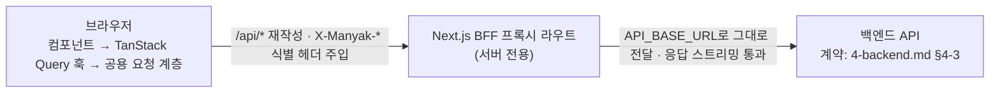

# 3-2-WEB-APP

이 문서는 **마냑 웹 프론트엔드의 플랫폼 구현 계약**을 정의합니다. 기술 환경, 라우팅·레이아웃, BFF 프록시·토큰 세션, 브라우저 지원, 관측 배선, 테스트·검수 기준을 다룹니다. 화면·사용자 흐름·API 계약 등 플랫폼 무관 스펙은 [`3-1-client.md`](./3-1-client.md)가 소유하며, 이 문서는 그 계약을 웹이 어떻게 충족하는지만 적습니다.

```text
§3-2-1  문서 목적·범위와 관련 문서
§3-2-2  검증된 기술 환경과 요청 흐름
§3-2-3  라우팅·레이아웃·공통 셸
§3-2-4  BFF 프록시·토큰 세션
§3-2-5  반응형·접근성·브라우저 지원
§3-2-6  관측 연동
§3-2-7  테스트·Definition of Done
```

| 항목      | 값                                                                |
| --------- | ----------------------------------------------------------------- |
| 버전      | v0.19                                                             |
| 작성일    | 2026-08-02                                                        |
| 수정일    | 2026-08-02                                                        |
| 대상      | 마냑 웹 프론트엔드                                                |
| 작성 목적 | 웹 프론트엔드의 플랫폼 구현·연동·검수 기준을 정의합니다.          |
| 기준 코드 | `../manyak-web` (Next.js 16 App Router, React 19)                 |
| 이력      | `3-frontend.md` v0.17(2026-07-01~07-28)을 KNK-765에서 분리        |

---

## 3-2-1. 문서 목적·범위와 관련 문서

### 목적

이 문서는 마냑 웹 프론트엔드 개발자가 웹 플랫폼 구현(라우팅, BFF, 브라우저 대응, 관측, 테스트)을 결정하는 기준입니다. 화면·흐름·API 계약은 [`3-1-client.md`](./3-1-client.md)를 기준으로 구현하고, 이 문서는 웹에서만 성립하는 계약을 더합니다.

### 범위

- 기술 스택과 핵심 요청 흐름(BFF 프록시)
- 라우팅 테이블, 라우트 그룹, 레이아웃·공통 셸, SEO·색인
- BFF 프록시 계약, 요청 타임아웃, 토큰 세션(httpOnly 쿠키)
- 반응형·접근성·브라우저 지원, 인앱 브라우저 감지·탈출·핸드오프
- 관측(이벤트 발화 경로), 테스트 범위와 Definition of Done

### 제외 범위

- 화면별 스펙, 퍼널·채팅 흐름, 게스트 데이터 모델, API 사용 계약, 입력 검증 (담당: [`3-1-client.md`](./3-1-client.md))
- 백엔드 내부 구현과 API 상세 스키마 (담당: [`4-backend.md`](./4-backend.md))
- 이벤트 카탈로그, 식별자 정책, 지표 (원천: [`6-analytics.md`](./6-analytics.md))
- 코드 구조, 컴포넌트 래퍼 목록, 환경 변수, 배포 런북 (프론트엔드 개발 문서·README가 소유)

### 관련 문서와 경계

| 문서                                       | 소유 영역                        | 이 문서와의 관계                     |
| ------------------------------------------ | -------------------------------- | ------------------------------------ |
| [`3-1-client.md`](./3-1-client.md)         | 클라이언트 공통 화면·흐름·계약   | 이 문서가 구현하는 계약의 정본       |
| [`3-3-android-app.md`](./3-3-android-app.md) | 안드로이드 앱 플랫폼 구현        | 같은 공통 계약의 병렬 구현           |
| [`4-backend.md`](./4-backend.md)           | API 명세, 데이터 모델            | API 상세를 위임                      |
| [`6-analytics.md`](./6-analytics.md)       | 이벤트·식별자·헤더·Sentry 기준   | 카탈로그는 위임, 발화 배선만 정의    |

---

## 3-2-2. 검증된 기술 환경과 요청 흐름

클라이언트 공통 아키텍처 축([`3-1-client.md §3-1-2`](./3-1-client.md#3-1-2-핵심-아키텍처)) 위에서, 웹을 규정하는 플랫폼 축은 **BFF 프록시 단일 창구**입니다 — 브라우저는 백엔드를 직접 호출하지 않고 동일 출처 `/api/*`가 `API_BASE_URL`로 전달합니다(상세: [§3-2-4](#3-2-4-bff-프록시토큰-세션)).

### 기술 환경

| 분류        | 기술                                                                                     |
| ----------- | ---------------------------------------------------------------------------------------- |
| 프레임워크  | Next.js 16.2.6 (App Router), React 19.2.4, React Compiler                                |
| 데이터 패칭 | TanStack Query 5, Orval 8 (OpenAPI 코드 생성)                                            |
| UI          | Base UI, shadcn/ui, CVA, Tailwind CSS 4, motion, vaul, sonner, next-themes               |
| 검증·타입   | TypeScript 5, Zod 4                                                                      |
| 관측        | Amplitude(`@amplitude/unified`), Sentry(`@sentry/nextjs`)                                |
| 테스트      | Vitest(유닛), Playwright(e2e·비주얼 회귀: Pixel 5 전체, Desktop Chrome·iPhone 13 스모크) |
| 런타임      | Node.js 20+, pnpm 10.28.2                                                                |

### 요청 흐름



`API_BASE_URL`은 클라이언트 번들에 노출되지 않는 서버 전용 값입니다. 브라우저는 항상 동일 출처 `/api`만 호출합니다([§3-2-4](#3-2-4-bff-프록시토큰-세션)). Orval 코드 생성도 Next.js 환경 변수 우선순위로 같은 값을 읽어 `${API_BASE_URL}/v3/api-docs`를 스펙 출처로 사용하므로, 런타임 프록시와 생성 계약이 서로 다른 백엔드를 조용히 가리키지 않습니다(KNK-832, 정본: `manyak-web/orval.config.ts`).

> React Compiler를 사용하므로 `useMemo`, `useCallback`을 직접 작성하지 않습니다.

### SSE 클라이언트 구현 (웹)

채팅 SSE 계약([`3-1-client.md §3-1-5`](./3-1-client.md#3-1-5-채팅-플레이와-sse-스트리밍))의 웹 수신 구현은 `fetch`+`ReadableStream`입니다.

**결정 기록 — SSE 클라이언트 구현 방식**

- **배경.** 채팅 턴은 사용자 입력을 본문에 실은 `POST` 요청의 응답을 SSE로 받는 계약입니다([`4-backend.md §4-3-3`](./4-backend.md)). 브라우저 표준 SSE 클라이언트를 그대로 쓸지가 갈림길이었습니다.

| 대안               | 채택 안 한 이유                                          |
| ------------------ | -------------------------------------------------------- |
| 표준 `EventSource` | GET만 지원해 `POST` 본문(`userInput`)을 보낼 수 없습니다 |

- **영향.** 이벤트 파싱과 스트림 종료 감지를 직접 구현합니다(EOF 처리 계약은 공통 문서 소유). 채팅 스트림은 공용 요청 계층(`fetchWithTimeout`)을 우회해 맨 `fetch`를 쓰므로 클라이언트 타임아웃이 없습니다.

### 게스트 서재 상태 판정 (웹)

게스트 서재의 "알 수 없음/비어 있음 구분" 계약([`3-1-client.md §3-1-6`](./3-1-client.md#3-1-6-게스트-데이터-모델))을 웹은 3-state로 구현합니다. `localStorage`는 서버 렌더 시점에 접근할 수 없기 때문입니다.

| 상태       | 의미                           | 화면 처리         |
| ---------- | ------------------------------ | ----------------- |
| `null`     | SSR·미하이드레이션(알 수 없음) | 로딩으로 취급     |
| `[]`       | 하이드레이션됨, 비어 있음      | 빈 상태           |
| `string[]` | 데이터 있음                    | 배치 조회 후 목록 |

**결정 기록 — 서재 상태 3-state 판정**

- **배경.** `localStorage`는 서버 렌더 시점에 접근할 수 없습니다. "비어 있음"과 "아직 알 수 없음"을 구분하지 않으면 하이드레이션 직후 빈 상태가 깜빡입니다.

| 대안                         | 채택 안 한 이유                                                                                          |
| ---------------------------- | -------------------------------------------------------------------------------------------------------- |
| 빈 배열 단일 초기값(2-state) | SSR·미하이드레이션 구간이 빈 상태로 렌더돼 데이터가 있는 사용자에게도 "빈 서재 → 목록" 깜빡임이 보입니다 |

- **영향.** 목록 화면은 `null`을 로딩으로 처리해야 하고, 온보딩 노출 조건도 `ids != null`을 전제합니다(공통 계약 FE-SCREEN-007).

### 게스트 저장소 키 (웹)

게스트 데이터의 논리 구조·정리 규칙은 [`3-1-client.md §3-1-6`](./3-1-client.md#3-1-6-게스트-데이터-모델)이 소유하며, 웹의 실제 저장 수단은 `localStorage`이고 키 정본은 다음과 같습니다.

| 키                         | 공통 데이터 항목                                | 형식                                             |
| -------------------------- | ----------------------------------------------- | ------------------------------------------------ |
| `manyak:created-story-ids` | 생성 스토리 ID 목록                             | JSON 문자열 배열, 최신순                         |
| `manyak:created-chat-ids`  | 생성 채팅 ID 목록                               | JSON 문자열 배열, 최신순                         |
| `manyak:guest-usage`       | 게스트 사용량 카운터                            | `{storylineCreate, storyCreate, chat}` JSON 객체 |
| `manyak:onboarding-seen`   | 온보딩 열람 플래그                              | `'1'`                                            |

퍼널 진행·자동 저장 슬롯(`manyak:pending-creation-request`), 채팅 안내 플래그(`manyak:chat-tour-seen`·`manyak:chat-choices-hint-seen`), 재개 의도 세션스토리지(`manyak:story-draft-resume-intent`)도 웹 키 정본은 이 문서 소유입니다(계약은 각각 [`3-1-client.md §3-1-4`](./3-1-client.md#3-1-4-스토리-생성-퍼널)·[§3-1-5](./3-1-client.md#3-1-5-채팅-플레이와-sse-스트리밍)).

퍼널 슬롯의 웹 구현 계약은 다음과 같습니다(KNK-994).

- `manyak:pending-creation-request`는 `localStorage`의 JSON 판별 유니언 한 건입니다. `KEYWORD_DRAFT`·`STORY_DRAFT` 편집본과 `STORYLINE_GENERATION`·`STORY_COMPLETION` 진행 요청이 같은 슬롯을 쓰며, 읽기·쓰기·삭제는 저장소 차단·용량 초과에서도 화면을 깨뜨리지 않도록 모두 예외를 흡수합니다.
- 편집본은 마지막 변경 300ms 뒤 동기적으로 쓰고, `visibilitychange`로 문서가 hidden이 되거나 `pagehide`가 발생하면 예약된 쓰기를 즉시 flush합니다. 복원한 편집본은 읽은 직후 삭제하지 않습니다. 헤더 뱃지는 입력 변경 즉시 `임시 저장중`, 쓰기 성공 뒤 `임시 저장됨`, 쓰기 실패 시 숨김입니다.
- 저장 함수가 태그 우선순위를 강제합니다. `STORYLINE_GENERATION`·`STORY_COMPLETION`은 draft보다 우선하고, `STORY_DRAFT`는 지연된 `KEYWORD_DRAFT`보다 우선합니다. 요청 시작 때 진행 레코드를 먼저 저장하고, 스토리라인 201 성공은 같은 `requestId`를 가진 `STORY_DRAFT`로 원자적으로 교체합니다.
- 복구 조회는 `document.visibilityState === 'visible'`일 때만 TanStack Query를 활성화하고 3초 `refetchInterval`을 사용합니다. 네트워크 오류와 재사용 `requestId`의 409는 진행 레코드를 유지하고, 서버 HTTP 실패·복구 404는 해당 레코드를 제거합니다. 완성 201 뒤에는 생성된 `storyId`를 `STORY_COMPLETION` 레코드에 확정하고 채팅 201 성공 전까지 유지합니다. 새로고침 복구는 해당 ID를 기준으로 이미 적용한 게스트 카운터·로컬 ID 부수효과를 건너뛰고 채팅만 다시 만듭니다.
- 제작 배너에는 닫기나 저장본 삭제 제어를 두지 않고, "이어서 만들기"로 들어올 때만 `sessionStorage`의 `manyak:story-draft-resume-intent`에 현재 `requestId`를 이동 전에 동기적으로 기록해 바로 복원합니다. 제작 화면의 FAB·빈 상태 CTA는 draft가 있으면 링크 이동을 막고 제작 화면에서 이어서/새로 만들기 다이얼로그를 먼저 표시합니다. 제작 화면의 다이얼로그는 바깥 영역·Escape 닫기를 허용하며, 닫을 때 경로와 draft 슬롯을 그대로 유지합니다. 이어서는 같은 재개 의도를 기록한 뒤 이동하고, 새로 만들기는 다이얼로그가 대상으로 삼은 `requestId`와 현재 슬롯이 일치할 때만 기존 draft를 제거한 뒤 이동합니다. 딥링크 진입은 퍼널에서 같은 다이얼로그를 표시하되 선택 전 닫기를 막습니다(KNK-994, 2026-08-27 결정).

### 데이터 패칭 기본 옵션 (웹)

공통 계약("자동 재시도·화면 복귀 자동 재조회 없이 오류를 상태로 반환" — [`3-1-client.md §3-1-7`](./3-1-client.md#3-1-7-api-연동에러-처리-계약))의 웹 구현은 TanStack Query 기본 옵션으로 고정합니다: `retry: false`, `staleTime: 60초`, `refetchOnWindowFocus: false`, `throwOnError: false`.

---

## 3-2-3. 라우팅·레이아웃·공통 셸

### 라우팅 테이블

이 표는 **사용자 화면 라우트 인벤토리**입니다(+ BFF 프록시·검색 크롤러 메타데이터 라우트). NextAuth·핸드오프 세션 등 인증 API 라우트는 [§3-2-4](#3-2-4-bff-프록시토큰-세션)의 인증 라우트 표가 소유합니다. KNK-988에서 메인 제작 화면(`/create`)을 추가하고 간편 제작 퍼널을 `/create/story`로 옮겼으며, KNK-994에서 제작 허브를 `/studio`, 간편 제작을 역할이 드러나는 `/studio/story/simple`로 변경했습니다. 기존 `/create`·`/create/story`·`/studio/story`·`/stories/new`는 북마크·외부 링크 호환을 위해 대응하는 새 경로로 영구 리다이렉트합니다. 회원가입 별도 경로·대시보드·설정·관리자 경로는 없습니다. 동적 세그먼트 `[id]`는 문자열입니다.

| 경로                                    | 화면 ID       | 라우트 그룹 | 화면                      | 레이아웃 chrome        |
| --------------------------------------- | ------------- | ----------- | ------------------------- | ---------------------- |
| `/`                                     | FE-SCREEN-001 | `(main)`    | 홈(오리지널 스토리 목록)  | 헤더 + 하단탭          |
| `/studio` `Phase 1 · 구현`              | FE-SCREEN-013 | `(main)`    | 제작(내 스토리 목록)      | 헤더 + 하단탭          |
| `/studio/story/simple`                  | FE-SCREEN-002 | `(story)`   | 간편 스토리 생성 퍼널     | 없음(자체 헤더)        |
| `/create`                               | —             | `(main)`    | `/studio` 영구 리다이렉트  | —                      |
| `/create/story`                         | —             | `(story)`   | `/studio/story/simple` 영구 리다이렉트 | —          |
| `/studio/story`                         | —             | `(story)`   | `/studio/story/simple` 영구 리다이렉트 | —          |
| `/stories/new`                          | —             | `(story)`   | `/studio/story/simple` 영구 리다이렉트 | —          |
| `/stories/[id]`                         | FE-SCREEN-003 | `(story)`   | 스토리 상세               | 없음(자체 헤더)        |
| `/chats`                                | FE-SCREEN-004 | `(main)`    | 채팅 목록                 | 헤더 + 하단탭          |
| `/chats/[id]`                           | FE-SCREEN-005 | `(chat)`    | 채팅 화면                 | 없음(자체 헤더)        |
| `/my/feedback`                          | FE-SCREEN-006 | `(my)`      | 피드백                    | 뒤로가기 헤더(탭 없음) |
| `/onboarding`                           | FE-SCREEN-007 | `(onboarding)` | 온보딩                 | 로고 헤더(탭 없음)     |
| `*`                                     | FE-SCREEN-999 | —           | Not Found                 | 최소 셸                |
| `/api/[...path]`                        | —             | —           | BFF 프록시(라우트 핸들러) | —                      |
| `/robots.txt` `/sitemap.xml`            | —             | —           | 검색 크롤러 메타데이터 라우트 | —                  |
| `/login` `Phase 1 · 구현`               | FE-SCREEN-008 | `(auth)`    | 로그인                    | 뒤로가기 헤더(탭 없음) |
| `/login/continue` `Phase 1 · 구현`      | FE-SCREEN-008 | `(auth)`    | 로그인 핸드오프 외부 랜딩([§3-2-5](#3-2-5-반응형접근성브라우저-지원)) | 뒤로가기 헤더(탭 없음, 폴백 홈) |
| `/my` `Phase 1 · 구현`                  | FE-SCREEN-008 | `(main)`    | 마이 페이지               | 헤더 + 하단탭          |
| `/my/invite` `Phase 1 · 구현`           | FE-SCREEN-008 | `(my)`      | 친구 초대                 | 뒤로가기 헤더(탭 없음) |
| `/my/link/continue` `Phase 1 · 구현`    | FE-SCREEN-008 | `(my)`      | 계정 연동 중계(스피너만)  | 없음                   |
| `/studio/story/general` `Phase 1 · 계획` | FE-SCREEN-009 | `(story)`  | 일반 제작 폼              | 없음(자체 헤더)        |
| `/stories/[id]/edit` `Phase 1 · 계획`   | FE-SCREEN-009 | `(story)`   | 스토리 수정(동일 폼)      | 없음(자체 헤더)        |
| `/terms` `Phase 1 · 구현`               | FE-SCREEN-010 | `(legal)`   | 서비스이용약관            | 뒤로가기 헤더(탭 없음) |
| `/privacy` `Phase 1 · 구현`             | FE-SCREEN-010 | `(legal)`   | 개인정보처리방침          | 뒤로가기 헤더(탭 없음) |
| `/my/about` `Phase 1 · 구현`            | FE-SCREEN-011 | `(my)`      | 서비스 안내               | 뒤로가기 헤더(탭 없음) |
| `/share/[shareId]` `Phase 1 · 구현`          | FE-SCREEN-012 | `(share)`   | 채팅 공유 열람            | 없음(자체 헤더)        |

오버레이 화면(별도 라우트 없음): 옵션 메뉴+삭제 확인 다이얼로그(스토리 상세), 썸네일 이미지 뷰어(FE-SCREEN-003), 채팅 옵션 메뉴+채팅 삭제 확인 다이얼로그(FE-SCREEN-005, [3-1-client.md §3-1-5](./3-1-client.md#3-1-5-채팅-플레이와-sse-스트리밍)), 키워드 추가 다이얼로그, 선택 키워드 드로어, 생성 이탈 확인 다이얼로그, 스토리라인 재선택 경고 다이얼로그.

### 라우팅 규칙

- **기본 화면은 접근 제어가 없습니다.** `/login`·`/my`는 게스트·회원 모두 접근 가능하며(회원이 `/login`에 진입해도 차단하지 않음, `/my`는 회원이면 프로필·로그아웃을, 게스트면 로그인 버튼을 표시), 경로 가드는 두지 않습니다. `/my/invite`는 회원 전용 화면이라 게스트를 `/login`으로 보냅니다. 로그인 성공 후 홈으로 이동하는 것은 화면 내 이동이지 공통 라우트 가드가 아닙니다.
- **라우트 그룹은 권한이 아니라 chrome을 가릅니다.** `(main)`은 상단 헤더와 하단 탭을 두르는 탭 화면, `(story)`·`(chat)`·`(auth)`·`(my)`·`(legal)`·`(share)`는 헤더·하단탭이 없는(또는 뒤로가기 헤더만 있는) 전체 화면입니다.
- 존재하지 않는 경로는 Not Found 화면을 표시하고 홈(`/`)으로 돌아가는 링크를 제공합니다.
- **문서 제목(브라우저 탭)은 `제목 - 마냑`으로 통일합니다.** 루트 레이아웃이 제목 템플릿을 선언하므로 각 화면은 자기 제목만 선언하면 되고, 제목을 선언하지 않은 화면은 기본 문서 제목을 표시합니다 — 현재 값은 `마냑 - 나만의 스토리를 만들고 채팅으로 이어나가는 AI 스토리챗 서비스`이고, 정본은 `src/constants/site.ts`의 `DEFAULT_TITLE`입니다(카피는 변동값이라 이 문서의 값은 예시입니다). 브랜드명 단독으로는 검색엔진과 사용자가 서비스 성격을 알 수 없어 기본값에 카테고리 문구를 붙입니다(KNK-713). 고유 제목을 쓰는 화면은 스토리 제목을 쓰는 스토리 상세·채팅방·공유 열람과, 본문 정본의 문서 제목을 정적으로 선언하는 약관·개인정보처리방침입니다(KNK-713 — 둘 다 색인 대상이라 SERP에 구별되는 제목이 필요합니다). 스토리 제목을 쓰는 셋은 로그인 세션·게스트 식별자나 공유 UUID로 상세를 읽어야 해 서버 메타데이터만으로는 제목이 확정되지 않으므로, 클라이언트에서 데이터를 받은 뒤 제목을 덮어씁니다 — 제목이 비어 있는 동안에는 손대지 않아 서버가 렌더한 기본 제목이 남습니다. 공유 열람은 서버가 공유본을 직접 읽어 링크 미리보기용 메타데이터도 만들지만, 그 조회가 실패해도 탭 제목은 클라이언트 덮어쓰기로 같은 형식을 유지합니다.
- **검색 크롤러는 온보딩 게이트를 적용받지 않습니다.** 크롤러는 쿠키를 보내지 않아 항상 신규 방문자로 판정되고, 그 결과 대표 URL(`/`)이 307 리다이렉트로만 응답해 색인되지 않습니다(KNK-699). 프록시는 User-Agent로 검색 크롤러(Googlebot·Yeti·Daumoa 등)와 링크 미리보기 스크래퍼(카카오톡·페이스북 등)를 판별해 게이트 없이 통과시킵니다. 봇에게 별도 콘텐츠를 만들어 주는 것이 아니라 게이트만 우회하므로 봇이 받는 응답은 열람 쿠키를 가진 사용자가 받는 것과 동일합니다. 판별 키워드는 실사용자 인앱브라우저 UA와 겹치지 않아야 합니다 — 다음 앱이 `DaumApps`이므로 검색봇은 `daumoa`로, 카카오톡 인앱이 `KAKAOTALK`이므로 스크랩봇은 `kakaotalk-scrap`으로 정확히 지정합니다. AI/LLM 크롤러는 수집 허용 정책이 별도 결정 사안이라 이 목록에 포함하지 않습니다.
- **색인 범위는 `/robots.txt`와 페이지 메타데이터가 정합니다.** 개인화·인증·생성 화면(`/chats`·`/studio`·`/my`·`/login`·`/stories/`)과 BFF 프록시(`/api/`)를 수집에서 제외하고, 핸드오프 외부 랜딩(`/login/continue`)은 일회용 코드가 실리는 URL이라 페이지 메타데이터로 `noindex, nofollow`를 선언하며, `/sitemap.xml`에는 정적 공개 페이지(`/`·`/terms`·`/privacy`)만 싣습니다. 온보딩은 퍼널 페이지이고 대표 URL이 홈이므로 페이지 자체에 `noindex`를 선언합니다 — robots.txt로 크롤을 막으면 크롤러가 그 지시를 읽지 못해 기존 색인이 남으므로 크롤은 허용합니다. 유효한 채팅 공유 열람(`/share/[shareId]`)은 공유자가 외부 공개를 선택한 콘텐츠로 보고 색인을 허용합니다. 공유 URL은 목록 API가 없는 동적 URL이라 사이트맵에는 싣지 않고 외부 공유 링크를 통해 검색 엔진이 발견하게 합니다. 삭제·오류 등 서버 메타데이터 조회에 실패한 공유 URL은 검색 결과에 남지 않도록 `noindex, nofollow`를 반환합니다(KNK-713).
- **브랜드 엔티티는 구조화 데이터로 선언합니다.** 루트 레이아웃이 `WebSite`·`Organization` JSON-LD(schema.org)를 모든 화면 `<head>`에 싣습니다. '마냑'은 검색량이 큰 '마약'과 한 글자 차이라 구글이 오타로 간주해 대체 검색어를 먼저 보여주므로, `alternateName`에 로마자 표기(`manyak`·`Manyak`)를 함께 선언해 브랜드명임을 학습시키고, `sameAs`로 공식 SNS 프로필(인스타그램)을 연결해 엔티티 신호를 보강합니다(KNK-713). 신생 브랜드의 자동 보정은 브랜드 검색량이 쌓이면 완화되는 문제이며, 구조화 데이터는 그 속도를 앞당기는 온사이트 수단입니다. JSON-LD를 인라인할 때 `<`를 유니코드로 이스케이프해 `</script>` 조기 종료를 막습니다.

### 화면 전환 규칙

`replace`와 `push`의 선택이 히스토리 동작을 결정하므로 규칙을 고정합니다.

| 출발 → 도착             | 트리거                | 방식                | 근거                                    |
| ----------------------- | --------------------- | ------------------- | --------------------------------------- |
| 스토리 카드 → 상세      | 카드 탭               | `Link`              | —                                       |
| 제작 FAB·빈 상태 → 퍼널     | 탭                 | `Link`              | —                                       |
| 상세 CTA → 채팅 화면    | "채팅 시작하기"       | `replace`           | 뒤로가기 재진입으로 채팅 중복 생성 방지 |
| 퍼널 완료 → 채팅 화면   | 스토리·채팅 생성 완료 | `replace`           | 동상                                    |
| 채팅 화면 뒤로          | 헤더 back             | `push('/chats')`    | 진입 경로와 무관하게 채팅 목록으로 복귀 |
| 상세 뒤로               | 헤더 back             | `back()`            | 히스토리 기반 복귀                      |
| 스토리 삭제(상세)       | 삭제 성공             | `replace('/studio')` | 삭제된 상세로 되돌아오지 않도록        |
| 채팅 삭제(채팅 화면)    | 삭제 성공             | `replace('/chats')` | 삭제된 채팅으로 되돌아오지 않도록       |
| 하단 탭 이동            | 탭 클릭               | `Link replace`      | 탭 전환을 히스토리에 쌓지 않음          |
| 메인 진입 → 온보딩      | 신규 방문자 판정      | 서버 리다이렉트     | proxy가 첫 응답 전에 처리(깜빡임 없음)  |
| 온보딩 CTA → 퍼널       | "첫 장면 만들기"      | `replace`           | 동상. 퍼널 이탈은 제작으로 대체 이동    |
| 생성 퍼널 → 제작        | 헤더 X·브라우저 back  | 예약된 자동 저장 flush 후 `replace('/studio')` | 진입 이력과 무관하게 제작 허브로 복귀 |
| 기존 제작 URL → 새 URL  | `/create`·`/create/story`·`/studio/story` 직접 접근 | 영구 리다이렉트 | 기존 북마크·외부 링크 호환(KNK-994) |
| 온보딩 건너뛰기 → 홈    | "나중에 하기"         | `replace`           | 동상                                    |

### 레이아웃 구조

- **루트 레이아웃** — 유일하게 프로바이더(관측·쿼리·모션·테마)와 전역 토스트를 두는 레이아웃입니다. 콘텐츠를 `max-w-md`(중앙 정렬) × `h-svh`(전체 뷰포트 높이) 단일 컬럼 모바일 셸로 감쌉니다. `lang="ko"`, 뷰포트 `viewportFit: cover`를 설정합니다.
- **`(main)` 레이아웃** — 상단 헤더, 스크롤 콘텐츠 영역, 하단 네비게이션을 렌더합니다.
- **`(story)`·`(chat)` 그룹** — 레이아웃이 없습니다. 루트만 상속하며, 각 화면이 자체 헤더를 렌더합니다.
- **단일 프레임 flex 컬럼** — 각 화면은 루트 앱 프레임 안에서 헤더 / 스크롤 영역 / 푸터(하단 네비·CTA)로 나뉜 flex 컬럼입니다. 헤더·하단 네비·CTA는 스크롤 영역의 형제 요소라 스크롤과 무관하게 항상 제자리에 있고, 스크롤은 콘텐츠 영역 내부에서만 일어납니다. 스크롤 끝에서 앱 프레임 전체가 밀리는 러버밴드(macOS/iOS)가 생기지 않아야 합니다. 스크롤을 따라가지 않는 오버레이가 필요하면 콘텐츠 영역 위에 둡니다. 구현 규칙(클래스·속성)은 웹 레포 개발 문서(`AGENTS.md` 레이아웃·스크롤 절)가 소유합니다.

### 공통 셸

- 모바일 전용 단일 컬럼(`max-w-md`)입니다. 하단 요소는 `env(safe-area-inset-bottom)`로 안전 영역을 확보합니다.
- 테마는 기본으로 시스템 설정(OS 다크 모드)을 따르고, 마이 페이지의 테마 변경 메뉴에서 시스템 설정·라이트·다크를 선택할 수 있습니다(FE-SCREEN-008, [§3-2-5](#3-2-5-반응형접근성브라우저-지원)).

### 상단 헤더·하단 네비게이션

- **상단 헤더** — `(main)` 화면에서 현재 섹션 라벨(`홈`·`채팅`·`제작`·`마이`)을 20px semibold로 표시하고, 로고는 홈(`/`)에서만 함께 표시합니다. 스크롤 여부와 무관하게 보더 없이 렌더합니다. 홈·채팅·제작 헤더는 게스트에게만 오른쪽 끝에 secondary 로그인 버튼(→ `/login`)을 노출합니다 — 세션 판별 중에는 표시하지 않아 회원에게 깜빡이지 않고, 마이 탭 헤더에는 두지 않습니다. 마이 탭 내부에는 별도 로그인 진입점이 있습니다: 게스트는 본문의 로그인 버튼(→ `/login`), 회원은 프로필·로그아웃을 표시합니다. 게스트/회원 판정 소스는 [§3-2-4](#3-2-4-bff-프록시토큰-세션)입니다.
- **하단 네비게이션** — `(main)` 그룹에서만 노출하는 고정 4탭입니다(KNK-988). 각 탭은 위에 24px 아이콘, 아래에 라벨을 표시하며 비활성은 outline, 활성은 filled 아이콘을 사용합니다. 활성·비활성 아이콘과 라벨은 모두 전경색을 사용하고 형태로 선택 상태를 구분합니다. 홈=집, 채팅=말풍선, 제작=원 안의 plus, 마이=사용자 아이콘입니다. 각 링크의 접근 가능한 이름도 같은 라벨로 제공하고 하단 안전 영역을 별도로 더합니다. 피드백은 하단 탭에서 빠지고 마이 페이지 내 항목(`/my/feedback`)으로 이동했습니다.

| 순서 | 라벨   | 경로     |
| ---- | ------ | -------- |
| 1    | 홈     | `/`      |
| 2    | 채팅   | `/chats` |
| 3    | 제작   | `/studio` |
| 4    | 마이   | `/my`    |

- 활성 탭은 경로 정확 일치로 판단하고 `aria-current="page"`를 적용합니다. 탭은 `replace`로 이동해 히스토리에 쌓지 않습니다.

### 오리지널 태그 이미지 (웹)

오리지널 카드 썸네일 좌상단에 얹는 ORIGINAL 태그(계약은 [`3-1-client.md §3-1-3` FE-SCREEN-001](./3-1-client.md#3-1-3-화면별-스펙))의 웹 자산 정본은 `public/stories/manyak-original-tag-black-green-translucent.svg`이며, 경로 정본은 상수 `ORIGINAL_TAG_SRC`(`src/features/stories/list/constants.ts`)입니다.

- 디자인 에셋에 같은 도안의 변형(색 3종 `green-white`·`black-green`·`black-white` × 불투명·`-translucent`)이 함께 있어 **파일명을 원본 그대로** 두고, 교체는 파일을 `public/stories/`에 추가한 뒤 상수의 파일명만 바꾸는 것으로 끝냅니다. **변형이 필요하면 SVG를 직접 손보지 말고 디자인 에셋의 공식 파일을 가져옵니다** — 손으로 고치면 디자인 원본과 갈라집니다.
- 현재 값은 검정 반투명(배경만 `fill-opacity` 0.20, 초록 심볼·흰 글자는 불투명)입니다. 배경 도형에만 투명도를 주는 구조라 CSS `opacity`로 태그 전체를 흐리게 하는 것과는 다릅니다 — 글자·심볼 대비는 그대로 유지해야 합니다.
- **블러는 CSS가 담당합니다.** 태그 이미지에 `backdrop-blur-md`를 걸어 썸네일 우하단의 누적 턴 수 뱃지(`bg-black/20 backdrop-blur-md`)와 질감을 맞춥니다. SVG에는 `backdrop-filter`가 없어 자산만으로는 재현되지 않습니다. 블러는 요소의 border box 전체에 적용되므로 태그 도안의 라운드(원본 92/46 → 표시 폭 72px 기준 좌상단 11px·우하단 6px)로 클리핑해 도형 밖 직사각형 모서리로 새지 않게 합니다.
- PNG 대신 SVG를 씁니다 — 카드에서 쓰는 크기(72×26)가 작아 래스터는 고밀도 화면에서 뭉개지고, 파일도 SVG가 2.6KB로 PNG(35KB)보다 훨씬 작습니다.
- `next/image`에 `unoptimized`를 붙여 서빙합니다. 벡터라 최적화할 것이 없고, 이미지 최적화기는 기본 설정에서 SVG를 거부합니다(`dangerouslyAllowSVG` 미설정 — 켜지 않습니다).

### 법적 콘텐츠 소스 (웹)

서비스이용약관·개인정보처리방침의 화면 계약과 "모든 플랫폼 동일 시행일·버전·본문" 동일성 계약은 [`3-1-client.md §3-1-3` FE-SCREEN-010](./3-1-client.md#3-1-3-화면별-스펙)이 소유합니다. 웹의 콘텐츠 정본은 웹 레포 `src/features/legal/content/terms-content.ts`·`privacy-content.ts`이며 페이지가 이를 렌더합니다(초기의 `docs/legal/*.md` 마크다운 초안은 TS 모듈로 정본을 일원화하며 삭제 — KNK-616). 플랫폼 중립 공유 정본은 아직 없어, Android 구현 전에 공유 정본 또는 동기화 방법 결정이 필요합니다(공통 문서의 간극 기록 참조).

### 온보딩 진입 게이트 (웹)

온보딩 노출 판정·화면 계약의 정본은 [`3-1-client.md §3-1-3` FE-SCREEN-007](./3-1-client.md#3-1-3-화면별-스펙)입니다. 웹은 그 게이트를 서버 프록시(`proxy.ts`)로 구현합니다.

- 서버 프록시가 메인 4탭(`/`·`/chats`·`/studio`·`/my`) 요청에서 열람 쿠키(`manyak_onboarding_seen`)와 NextAuth 세션 쿠키가 모두 없으면 원래 목적지를 `from` 쿼리에 담아 `/onboarding`으로 리다이렉트합니다. 클라이언트 리다이렉트는 홈이 먼저 그려져 화면이 깜빡이므로 첫 응답 전에 처리합니다.
- 리다이렉트 URL에는 원본 요청의 쿼리스트링을 전부 이어붙입니다(`from`과 병합) — 서버 리다이렉트는 브라우저가 원본 URL을 한 번도 렌더하지 않으므로, 쿼리를 버리면 UTM 같은 유입 파라미터를 분석 SDK가 수집할 기회 자체가 사라집니다. 특정 키 화이트리스트가 아닌 전체 전달이라 향후 추가될 파라미터(초대코드·레퍼럴 등)도 함께 보존됩니다.
- 노출 판정의 정본(비로그인 + 저장된 스토리·채팅 0개 + 미열람)은 로컬 스토리지라 서버가 읽을 수 없으므로 프록시는 쿠키 부재만으로 낙관적으로 보내고, 세부 판정은 페이지 가드가 맡습니다 — 미충족(회원·생성 이력·열람)이면 열람 쿠키를 심고 `from` 경로(메인 탭만 허용, 기본 홈)로 되돌려 재리다이렉트 루프를 막습니다. 열람 처리는 로컬스토리지와 쿠키에 함께 저장합니다. `/onboarding` 직접 접근도 같은 가드가 처리합니다.
- 검색 크롤러·링크 스크래퍼는 이 게이트를 적용받지 않고 요청한 경로를 그대로 받으며(KNK-699, 위 라우팅 규칙), 온보딩 페이지 자체는 검색 색인에서 제외(`noindex`)합니다.
- 생성 퍼널은 온보딩 경유 여부를 별도로 저장하지 않으며, 모든 뒤로가기를 제작 화면으로 보냅니다(KNK-988, [`3-1-client.md §3-1-4`](./3-1-client.md#3-1-4-스토리-생성-퍼널)).

**검수 기준**

- 쿼리가 붙은 첫 진입(예: UTM 파라미터)은 온보딩으로 리다이렉트되어도 원본 쿼리가 `from`과 함께 유지되어야 합니다. (KNK-695, e2e `smoke/onboarding`)
- 검색 크롤러 User-Agent 요청은 온보딩으로 리다이렉트되지 않고 요청한 경로가 200으로 응답되어야 하며, 인앱브라우저(카카오톡·다음 앱·네이버 앱)는 크롤러로 판정되지 않아야 합니다. (KNK-699, e2e `seo/crawler-indexing`)

### 검수 기준

- 하단 탭의 동일한 전경색과 outline/filled 아이콘·보이는 라벨·접근 가능한 이름으로 홈·채팅·제작·마이를 오갈 수 있어야 합니다. (US-8-1, KNK-988, e2e `smoke/navigation`)
- `(story)`·`(chat)`·`(auth)`·`(my)` 화면에는 하단 탭과 상단 헤더가 나타나지 않아야 합니다.
- 모바일 안전 영역에서 하단 탭과 고정 CTA가 잘리지 않아야 합니다.
- 콘텐츠를 끝까지 스크롤해도 헤더·하단 네비를 포함한 앱 프레임 전체가 밀리지 않아야 합니다(macOS/iOS 러버밴드).

---

## 3-2-4. BFF 프록시·토큰 세션

브라우저와 백엔드 사이의 호출 창구 계약입니다. 무엇을 언제 호출하고 실패를 어떻게 처리하는지(소비 계약)는 [`3-1-client.md §3-1-7`](./3-1-client.md#3-1-7-api-연동에러-처리-계약)이 소유하고, 이 절은 웹의 전달 계층만 정의합니다.

### 인증 API 라우트

화면이 아닌 서버 전용 인증 라우트입니다. 라우팅 표([§3-2-3](#3-2-3-라우팅레이아웃공통-셸))는 사용자 화면 중심이므로 이 표가 인벤토리 정본입니다.

| 라우트                      | 역할                                                                                                     |
| --------------------------- | -------------------------------------------------------------------------------------------------------- |
| `/api/auth/[...nextauth]`   | NextAuth OAuth 시작·콜백·세션(로그인 프로바이더와 연동 전용 변형 `link-*`의 콜백 포함 — 아래 소셜 로그인·계정 연동) |
| `/api/auth/handoff-session` | 핸드오프 코드를 백엔드 확인 API로 검증하고 httpOnly 쿠키로 옮기는 라우트(무효·만료는 404 전달, 코드 원문은 응답 본문에 미반환 — [§3-2-5](#3-2-5-반응형접근성브라우저-지원) 핸드오프 흐름 5) |

### BFF 프록시

- 브라우저는 항상 동일 출처 `/api/*`만 호출합니다. 서버 전용 프록시 라우트가 `API_BASE_URL`로 전달합니다.
- 프록시는 `host` 헤더를 제거하고 나머지 헤더(식별자 포함)를 그대로 전달하며, `cache: no-store`로 요청하고 응답 본문을 스트리밍 통과시킵니다. `API_BASE_URL`이 없으면 500을 반환합니다.
- `API_BASE_URL`은 이 프록시 동작에 필요한 유일한 필수 값이며 클라이언트에 노출되지 않습니다. 그 외 환경 변수(관측 키 등)는 README·배포 문서가 소유합니다.
- **프록시는 세 번째 타임아웃 층입니다.** 라우트가 Vercel 함수로 실행되므로 자체 실행 시간 상한을 가지며, 이 값이 클라이언트 타임아웃(아래 요청 타임아웃 절의 200초)보다 짧으면 백엔드 응답이 오기 전에 프록시가 먼저 끊어 클라이언트 여유가 무의미해집니다. 코드에 `maxDuration`을 선언하지 않아 프로젝트 기본값을 따르며, 2026-07-29 기준 Vercel 프로젝트 `manyak`의 기본 상한은 300초입니다(Fluid Compute 활성). 레포에 근거가 남지 않는 값이므로 클라이언트 타임아웃을 300초에 가깝게 올리거나 Fluid Compute 설정을 바꿀 때는 Vercel 대시보드(Settings → Functions)를 먼저 확인해야 합니다 — 상한을 넘긴 요청은 Vercel 로그에 `FUNCTION_INVOCATION_TIMEOUT`(504)으로 남습니다.

**결정 기록 — 백엔드 호출 창구(BFF 프록시 단일화)**

- **배경.** 브라우저가 백엔드 API를 직접 호출할지, 동일 출처 프록시를 단일 창구로 둘지의 갈림길입니다. 백엔드 주소를 클라이언트 번들에 노출하지 않고, 회원 토큰을 브라우저 JS에 주지 않는 것이 전제입니다.

| 대안                                | 채택 안 한 이유                                                                                                                                    |
| ----------------------------------- | -------------------------------------------------------------------------------------------------------------------------------------------------- |
| 브라우저가 백엔드를 직접 호출(CORS) | `API_BASE_URL`이 클라이언트 번들에 노출되고, httpOnly 쿠키의 access 토큰을 `Authorization` 헤더로 주입하는 계층(아래 토큰 세션)을 둘 곳이 없습니다 |

- **영향.** 프록시가 응답 본문을 그대로 스트리밍 통과해야 채팅 SSE가 버퍼링 없이 동작합니다([3-1-client.md §3-1-5](./3-1-client.md#3-1-5-채팅-플레이와-sse-스트리밍)). 회원 세션의 토큰 보관·선제 재발급도 이 계층이 수행합니다.

### 요청 타임아웃

- 브라우저 데이터 요청과 BFF→백엔드 인증 요청의 타임아웃은 요청마다 200초입니다. 백엔드의 최장 동기 요청 예산(스토리 컴파일 180초 — [`4-backend.md`](./4-backend.md)의 AI 호출 타임아웃 표) 위에 20초의 여유를 둔 값입니다. 두 값이 같으면 네트워크 왕복과 BFF 토큰 리프레시만큼 클라이언트가 항상 먼저 끊겨, 백엔드가 자기 타임아웃으로 만든 에러 응답이 클라이언트의 `TimeoutError`에 가려집니다. 단, 채팅 스트리밍은 이 경로를 우회하므로 클라이언트 타임아웃이 없습니다([3-1-client.md §3-1-5](./3-1-client.md#3-1-5-채팅-플레이와-sse-스트리밍)).

### 토큰 세션 (BFF) — `Phase 1 · 구현`

- 웹 구현은 NextAuth(소셜 OAuth 리다이렉트 플로우) + BFF 프록시 자체 httpOnly 쿠키를 함께 쓰는 하이브리드입니다. 선제 재발급은 BFF 프록시가 수행합니다.
- **provider 추가는 NextAuth 프로바이더 선언으로 처리합니다** (`Phase 1 · 구현`, KNK-721·KNK-728). 카카오는 기본 제공 프로바이더(`type: "oauth"`, issuer 없음)를 쓰지 않고 **issuer `https://kauth.kakao.com`를 지정한 OIDC 프로바이더로 직접 선언**합니다 — 기본 프로바이더는 `jwks_uri`를 모르는 채 토큰 응답에 실려 온 `id_token`의 서명 검증을 시도해 콜백이 실패하고, OIDC 선언은 discovery로 검증 키를 얻어 통과합니다. **토큰 엔드포인트 인증 방식도 `client_secret_post`로 명시**해야 합니다 — 카카오 discovery의 `token_endpoint_auth_methods_supported`는 `client_secret_post` 하나뿐인데, Auth.js(`@auth/core` 0.41)는 `token_endpoint_auth_method` 미지정 시 `client_secret_basic`(Authorization 헤더)으로 보내 인가 성공 후 토큰 교환이 `invalid_client`로 실패합니다. 콜백 완주(인가 → 토큰 교환 → 백엔드 로그인 200)는 로컬 검증 항목에 포함합니다. 인가 요청 scope는 `openid` 단독으로 고정합니다(콘솔에 동의항목을 두지 않으므로 다른 scope를 요청하면 인가가 거절됩니다 — [`4-backend.md §4-5`](./4-backend.md)). 콜백 경로는 `/api/auth/callback/{provider}`이며 카카오 콘솔의 **REST API 키** 리다이렉트 URI에 등록된 값과 정확히 일치해야 합니다(와일드카드 미지원 — apex·`www`·로컬을 각각 등록).
- 로그인 콜백에서 백엔드 로그인 호출은 provider별 경로(`POST /auth/login/{provider}`)로 갈리고, 나머지(핸드오프 코드 전달·토큰 쿠키 보관·신규 가입 판정)는 동일합니다.
- 로그인 응답의 access·refresh 토큰은 BFF 프록시가 httpOnly·SameSite 쿠키로 보관합니다. 브라우저 JS에 토큰을 노출하지 않아 XSS 탈취를 막습니다.
- BFF는 백엔드 요청 전에 access 만료 임박을 확인해 `POST /auth/token/refresh`로 선제 재발급합니다(백엔드 계약은 [`4-backend.md §4-5`](./4-backend.md)). 만료 토큰을 백엔드로 보내지 않으므로 회원 요청이 익명으로 통과하는 일이 없습니다.
- 재발급 실패(refresh 만료·회전 재사용)면 세션 쿠키를 폐기하고 게스트 모드로 전환합니다.
- **회원 요청의 익명 전달 차단** — 회원이던 세션이 인증을 잃은 요청은 백엔드로 전달하지 않고 프록시가 즉시 응답합니다. 익명으로 전달하면 회원의 요청(특히 쓰기)이 게스트 콘텐츠로 잘못 귀속되기 때문입니다.
  - **확정 만료**(재발급 4xx 확정 거절) — 세션 쿠키를 폐기하고 `401` + 세션 만료 헤더로 응답해 클라이언트의 능동 로그아웃을 신호합니다.
  - **일시 강등**(네트워크·5xx로 이번 요청의 토큰 미확보, 기존 access 토큰도 없음) — 세션을 보존한 채 `503`과 "일시적인 인증 오류입니다. 잠시 후 다시 시도해주세요"로 응답해 재시도에 맡깁니다.
- NextAuth 세션 쿠키는 JWT가 약 4KB를 넘으면 `.0`, `.1` 청크로 분할 저장되므로, 세션 감지·폐기는 정확 일치가 아니라 접두사 기준으로 청크 쿠키까지 함께 처리합니다.
- **모드 판정 소스** — 브라우저 JS는 토큰을 볼 수 없으므로, BFF가 세션 쿠키 유무를 담은 값을 SSR에 전달하거나 `GET /auth/me`(회원이면 200, 게스트면 401)로 판정합니다. 이 값이 마이 페이지 회원 상태·데이터 소스 전환·분석 `is_logged_in`의 단일 기준입니다.

**결정 기록 — 토큰 보관 위치(BFF httpOnly 쿠키)**

- **배경.** 로그인 응답의 access·refresh 토큰을 어디에 보관할지의 갈림길입니다.

| 대안                                                                                | 채택 안 한 이유                                      |
| ----------------------------------------------------------------------------------- | ---------------------------------------------------- |
| 브라우저 저장소(`localStorage` 등)에 보관하고 JS가 `Authorization` 헤더를 직접 주입 | 토큰이 브라우저 JS에 노출돼 XSS로 탈취될 수 있습니다 |

- **영향.** 브라우저가 토큰을 볼 수 없으므로 게스트/회원 모드 판정 소스를 별도로 정의해야 하고(위), 만료 임박 선제 재발급도 BFF가 수행합니다. 웹 구현은 NextAuth 리다이렉트 플로우와 BFF 자체 쿠키를 함께 쓰는 하이브리드가 됩니다.

### 소셜 로그인·계정 연동 (웹 구현)

로그인·계정 연동의 화면·흐름 계약은 [`3-1-client.md §3-1-3` FE-SCREEN-008](./3-1-client.md#3-1-3-화면별-스펙)이 정본입니다. 이 절은 그 계약의 웹 전용 구현을 적습니다.

- **진행 중 잠금의 웹 상세** (KNK-760) — 공통 시작 함수는 페이지 이탈 시작 여부(`redirected`/`failed`)를 반환하며, OAuth 리다이렉트 전 공백의 중복 탭(핸드오프 이중 생성 포함)을 잠금으로 막습니다. OAuth 화면에서 뒤로가기로 복귀하면 bfcache가 잠금 상태까지 복원할 수 있으므로 `pageshow`(persisted)에서 상태를 리셋합니다.
- **계정 연동 플로우의 웹 상세** (KNK-740) — 링크 코드는 httpOnly 쿠키로 보관하고, 재인증 후 중계 화면(`/my/link/continue?target=`)이 대상 provider OAuth를 시작합니다. 두 OAuth는 NextAuth의 연동 전용 프로바이더 변형(`link-google`·`link-kakao`)을 써서 로그인 경로(백엔드 로그인 호출·세션 교체)를 타지 않습니다. 현재 provider가 Google이면 재인증 OAuth에 세션의 이메일을 `login_hint`로 실어, 구글 세션이 살아 있을 때 계정 선택 화면 없이 자동 통과시킵니다(KNK-760) — 재인증 대상은 현재 계정 하나로 고정이라 힌트가 선택을 뺏지 않고, 다른 계정을 골라 403 `REAUTH_FAILED`가 나는 사고도 줄입니다.
- **로그인 실패 복귀** — OAuth 콜백 단계 실패(토큰 교환 오류·콘솔 설정 오류 등)는 NextAuth가 `error` 쿼리와 함께 `/login`으로 복귀시킵니다(`pages.error`).
- **운영 요건** — 연동 전용 프로바이더는 콜백 URL이 갈라지므로(`/api/auth/callback/link-google` · `/api/auth/callback/link-kakao`) Google·Kakao 콘솔에 리디렉션 URI를 추가 등록해야 합니다. 누락하면 연동만 실패하고 로그인은 정상 동작해 증상이 늦게 드러납니다.

**결정 기록 — 연동 전용 NextAuth 프로바이더 변형(2026-08-01, KNK-740)**

- **배경.** 연동은 현재 세션을 유지한 채 **신선한 ID 토큰만** 받아와야 합니다(재인증은 발급 10분 이내 토큰을 요구). 기존 로그인 플로우를 그대로 타면 백엔드 로그인이 호출돼 세션이 교체됩니다.

| 대안                                          | 채택 안 한 이유                                                                                                                          |
| --------------------------------------------- | ---------------------------------------------------------------------------------------------------------------------------------------- |
| 커스텀 OAuth 라우트를 직접 구현                | state·nonce·PKCE·토큰 교환과 카카오 특이사항(jwks_uri·`client_secret_post`)을 손으로 다시 구현해야 해 보안 표면이 늘어납니다             |
| 기존 로그인 프로바이더 재사용 + 플래그로 분기 | 콜백 URL이 같아 로그인과 연동을 서버에서 구분할 수 없고, 분기 실패 시 연동 시도가 세션 교체로 이어집니다                                 |

- **영향.** Auth.js가 프로바이더 id로 환경 변수를 추론하므로(`AUTH_LINK_GOOGLE_ID`는 존재하지 않음) 변형에는 자격증명을 명시합니다. 콜백 URL이 하나 더 생겨 콘솔 등록이 배포 선행 조건이 됩니다. 연동 콜백에서 jwt 콜백은 세션 클레임을 갱신하지 않는데, Auth.js는 OAuth 콜백의 jwt 콜백에 기존 세션 토큰이 아니라 **프로바이더 프로필로 새로 만든 토큰**을 넘기므로 "그대로 두기"만으로는 세션이 유지되지 않습니다 — 연동 콜백은 세션 쿠키를 직접 복호화해 기존 클레임을 복원·반환합니다(`src/lib/auth/session-token.ts`, KNK-740 버그 수정). 복원된 세션이 없으면(로그인 세션 없이 도달) 로그인 자체를 실패시켜 사용자 귀속 없는 세션 발급을 막습니다.

---

## 3-2-5. 반응형·접근성·브라우저 지원

### 반응형: 모바일 전용

- 레이아웃은 `max-w-md` 단일 컬럼으로 고정한 모바일 전용입니다. 데스크톱 다단 레이아웃을 제공하지 않습니다.
- e2e는 Mobile Chrome(Pixel 5) 단일 프로젝트로 실행합니다.
- 안전 영역(`env(safe-area-inset-bottom)`)과 `viewportFit: cover`를 사용합니다.

### 모바일 검수 기준

- 주요 CTA가 첫 화면에서 확인 가능해야 합니다.
- 가로 스크롤이 발생하지 않아야 합니다.
- 입력 폼 사용 중 화면이 깨지지 않아야 합니다(`interactiveWidget: resizes-content`).

### 접근성 기준

- 클릭 가능한 요소는 키보드로 접근 가능하고 focus가 시각적으로 확인되어야 합니다.
- 폼 입력에 label을 연결하고 오류는 `aria-invalid`·오류 메시지(`role=alert`)로 노출합니다.
- 다이얼로그는 열릴 때 포커스를 내부로 이동하되, 첫 버튼·입력란이 아니라 **팝업 자체에 두는 것을 기본**으로 합니다(공용 Dialog·AlertDialog 기본값, KNK-760). 첫 요소가 버튼이면 여는 즉시 포커스 링이 그려지고, 입력란이면 모바일 키보드가 함께 올라와 안내와 버튼을 가리기 때문입니다(KNK-715 초대 코드 다이얼로그 결정의 일반화). 특정 요소에 초점이 필요한 다이얼로그만 `initialFocus`로 덮어씁니다.
- 로딩·상태 영역은 `role=status`와 `aria-label`로 안내합니다.
- 색상만으로 상태를 구분하지 않습니다.

### 테마·서체

- 테마는 시스템 설정(OS 다크 모드)이 기본이며, 마이 페이지의 테마 변경 메뉴로 시스템 설정·라이트·다크를 선택할 수 있습니다(FE-SCREEN-008). 선택값은 기기 단위로 저장됩니다.
- 기본 서체는 Pretendard, 서사 텍스트(프롤로그·대화)는 MaruBuri를 적용합니다.

### 브라우저 지원

| 브라우저                    | 지원                        |
| --------------------------- | --------------------------- |
| 모바일 Chrome 최신          | 필수(e2e 기준)              |
| 모바일 Safari 최신          | 필수                        |
| 데스크톱 Chrome·Safari 최신 | 권장(모바일 셸 그대로 표시) |

### 원격 이미지 최적화

원격 이미지는 Next.js 이미지 최적화 허용 목록을 최소 경로로 제한합니다. Google 계정 이미지는 `lh3.googleusercontent.com`, 프로필 프리셋은 운영 `api.manyak.app/profile-presets/**`와 개발 `dev-api.manyak.app/profile-presets/**`, 스토리 썸네일은 `cdn.manyak.app/thumbnails/**`만 허용합니다. 개발 백엔드는 환경별 base URL을 `profile_image_url`에 전체 URL로 저장하므로, 개발 호스트가 빠지면 로그인은 성공해도 해당 사용자의 프로필 프리셋 렌더링이 Next.js에서 차단됩니다(KNK-388·KNK-827·KNK-832, 정본: `manyak-web/next.config.ts`).

### 인앱 브라우저 감지와 탈출 스킴 — `Phase 1 · 구현`(KNK-567·KNK-592·KNK-681)

카카오톡 인앱 브라우저는 Google OAuth를 차단해 로그인·가입이 불가능하고, 인앱 브라우저의 저장소는 실제 브라우저와 격리되어 거기서 쌓은 게스트 데이터가 고립됩니다([`4-backend.md §4-3-7`](./4-backend.md) 결정 기록). 루트 레이아웃의 클라이언트 컴포넌트(`in-app-browser-observer.tsx`)가 `navigator.userAgent`로 인앱 브라우저를 감지하며(서버 렌더에서는 항상 미감지로 렌더해 hydration 불일치가 없어야 합니다), **현행 동작은 감지 이벤트(`client_inappBrowser_detected`) 발행과 로그인 전환 방식 판정뿐입니다** — 진입 시 차단·탈출은 실행하지 않습니다.

> **이전 동작(폐기)** — 초기 구현(KNK-567·KNK-592)은 감지 시 전체 화면 차단 오버레이를 모든 앱 UI 위에 표시하고, 카카오톡에서는 진입 0.3초 후 `kakaotalk://web/openExternal`로 자동 탈출시킨 뒤 1.3초에 `kakaotalk://inappbrowser/close`로 인앱 창을 닫았습니다(iOS는 close 미동작·복귀 시 오버레이 유지 — 2026-07-13 실기기 확인). 아래 '인앱 게스트 허용·로그인 핸드오프' 개편(KNK-681)이 반영되며 전면 차단·진입 즉시 탈출은 **제거 완료**됐고, 이 문단은 결정 이력 보존용입니다.

감지 로직과 아래 탈출 스킴은 **로그인 시점의 외부 브라우저 전환 수단**으로 재사용합니다(구현: `external-browser-escape.ts`).

| 인앱       | UA 패턴                  | 로그인 시점 전환 수단                                                                                                                                                                              |
| ---------- | ------------------------ | ---------------------------------------------------------------------------------------------------------------------------------------------------------------------------------------------------- |
| 카카오톡   | `KAKAOTALK`              | `kakaotalk://web/openExternal?url=...`로 핸드오프 URL을 기본 브라우저에서 엽니다. 외부 전환이 필요한 provider(Google)에만 쓰며, 카카오 로그인은 인앱에서 직접 수행합니다(아래 분기 표)               |
| 인스타그램 | `Instagram`              | Android는 `intent://{host}{path}#Intent;scheme={프로토콜};end`, iOS는 `x-safari-{현재 URL}` 스킴을 시도합니다(사용자 클릭 제스처 필요). ⋯ 메뉴의 '외부 브라우저에서 열기' 수동 경로 안내를 병행합니다 |
| 쓰레드     | `Barcelona`(앱 코드네임) | 인스타그램과 동일                                                                                                                                                                                  |

- **비공식 스킴 리스크** — 카카오톡 탈출 스킴과 인스타그램·쓰레드의 `intent://`·`x-safari-` 경로 모두 공식 보장이 없는 진입점이라 앱 업데이트로 깨질 수 있습니다. 수동 경로 안내가 항상 받쳐야 하며, 실기기 확인을 매 릴리스 수행합니다.
- **루프 없음** — 외부 브라우저에는 인앱 UA가 없으므로 전환 후 재감지가 발생하지 않습니다.

**검수 기준** — 일반 브라우저에서는 감지 로직이 어떤 UI도 표시하지 않아야 합니다. 인앱 브라우저 진입 시 차단 오버레이·자동 탈출이 실행되지 않고 게스트 기능이 그대로 동작해야 하며(아래 개편 검수 기준), 감지 이벤트가 `app` 값과 함께 1회 발행돼야 합니다.

### 인앱 게스트 허용·로그인 핸드오프 — `Phase 1 · 구현`(KNK-681·KNK-682)

위 전면 차단을 대체한 개편으로, 웹 코드에 구현되어 있습니다(핸드오프 생성 `start-social-login.ts` · 외부 랜딩 `/login/continue`(`login-continue-screen.tsx`) · 코드 확인·세션 쿠키 이전 `/api/auth/handoff-session` · 인앱 복귀 정리 `handoff-cleanup.ts` · 로그인 직행 단축 `in-app-login-shortcut.ts`). 광고 유입 사용자가 서비스를 체험하기 전에 외부 브라우저 요구를 만나 이탈한다는 가설에 따라, 인앱 브라우저에서 게스트 기능 전체(온보딩·스토리 생성·채팅·목록)를 허용하고 로그인 시점에만 외부 브라우저로 전환합니다(US-9-8). Google OAuth는 임베디드 브라우저를 차단하므로(`disallowed_useragent`) **Google 로그인**은 외부 브라우저가 필수입니다.

**카카오 로그인은 카카오톡 인앱에서 외부 전환이 필요 없습니다** (`Phase 1 · 구현`, KNK-721·KNK-728). 카카오는 자사 인앱 브라우저에서 카카오 로그인을 지원하므로 `disallowed_useragent`에 해당하는 차단이 없습니다. 카카오톡 인앱에서 카카오 버튼을 누르면 **핸드오프를 만들지 않고 그 자리에서 로그인**하며, 게스트 데이터와 디바이스 ID가 같은 저장소에 그대로 있으므로 기존 로그인 흐름(FE-SCREEN-008)의 자동 마이그레이션이 그대로 동작합니다. 핸드오프는 저장소 격리를 잇기 위한 장치인데 이 경로에는 격리 자체가 없습니다.

| 인앱 | Google 버튼 | 카카오 버튼 |
| --- | --- | --- |
| 카카오톡 | 핸드오프 생성 → 외부 전환 | **인앱에서 직접 로그인**(핸드오프 없음) |
| 인스타그램·쓰레드 | 핸드오프 생성 → 외부 전환 | 핸드오프 생성 → 외부 전환(아래 검증 전까지) |
| 없음(일반 브라우저) | 기존 로그인 흐름 | 기존 로그인 흐름 |

- **인스타그램·쓰레드는 보수적으로 둡니다.** 카카오가 지원을 보장하는 것은 자사 인앱이며, 제3자 웹뷰에서 카카오 로그인이 완주하는지는 검증되지 않았습니다. 실기기로 확인되기 전까지는 기존 핸드오프 경로를 그대로 태웁니다 — 잘못 열었다가 웹뷰 안에서 실패하면 사용자가 로그인을 아예 못 하는 반면, 핸드오프는 한 단계 느릴 뿐 검증된 경로입니다.
- **분기 기준은 provider와 감지된 앱의 조합**입니다. 공통 시작 함수가 `(provider, inAppBrowser)`로 판정하며, 감지 로직(위 UA 표)은 그대로 재사용합니다.
- **검수 기준** — 카카오톡 실기기에서 카카오 버튼을 누르면 외부 브라우저 전환 없이 로그인이 완료되고, 인앱에서 만든 스토리·채팅이 그대로 이관돼야 합니다. 같은 화면의 Google 버튼은 종전대로 외부 전환이어야 합니다.

인앱 브라우저와 외부 브라우저는 저장소가 격리되어 두 가지가 끊깁니다: 게스트 데이터 ID 배열([3-1-client.md §3-1-6](./3-1-client.md#3-1-6-게스트-데이터-모델))과 게스트 체험 사용량의 디바이스 ID([`4-backend.md §4-3-7`](./4-backend.md)). 외부 전환 전에 두 가지를 서버에 임시 보관하는 **로그인 핸드오프**로 잇습니다(US-9-9). 핸드오프 API 계약(생성·확인·소비·상태 조회)의 정본은 [`4-backend.md §4-3-5 로그인 핸드오프`](./4-backend.md)입니다.

**핸드오프 흐름**

1. **감지 용도 전환** — 인앱 감지(위 UA 표)는 유지하되 차단 오버레이를 제거하고, 로그인 전환 방식 결정과 분석 태깅([`6-analytics.md §6-4-2-12`](./6-analytics.md))에만 사용합니다.
2. **공통 로그인 진입점** — 모든 소셜 로그인 CTA(로그인 화면·게스트 한도 다이얼로그)는 공통 시작 함수를 거칩니다. 인앱이 아니면 provider와 무관하게 기존 로그인 흐름(FE-SCREEN-008) 그대로입니다. 인앱에서는 홈 헤더·마이의 로그인 버튼도 `/login`을 거치지 않고 공통 시작 함수로 직행합니다 — 인앱의 `/login`은 전환 안내로 이어지는 중간 단계일 뿐이기 때문입니다(복귀 경로는 버튼을 누른 현재 화면). **단, 카카오톡 인앱은 직행 단축에서 제외합니다**(`Phase 1 · 구현`, KNK-721·KNK-728) — 카카오 로그인이 인앱에서 그대로 완료되므로(위 분기 표) 카카오톡의 `/login`은 중간 단계가 아니라 방식 선택 화면입니다. 홈 헤더·마이의 로그인 버튼은 `/login`으로 정상 이동해 사용자가 provider를 고르게 하고, 직행 단축은 모든 provider가 외부 전환을 요구하는 인앱(인스타그램·쓰레드)에만 유지합니다.
3. **핸드오프 생성** — 인앱에서 로그인을 선택하면 서버에 스토리·채팅 ID 배열, 원본 디바이스 ID, 복귀 경로, 출처 앱을 저장하고 일회용 핸드오프 코드를 발급받습니다. 디바이스 ID는 **원문으로** 저장합니다 — 서버가 pepper를 붙여 내부에서 해시하므로 클라이언트 해시는 이중 해시가 되어 게스트 사용량 키와 일치하지 않습니다.
4. **주소 교체 후 전환** — 외부 전환을 시도하기 전에 현재 주소를 `/login/continue?handoff={코드}`로 바꿉니다. 자동 전환이 실패해도 ⋯ 메뉴의 '외부 브라우저에서 열기'가 현재 주소를 그대로 외부 브라우저에 전달하기 때문입니다. 카카오톡은 `openExternal` 스킴에 핸드오프 URL을 직접 넘기고, 인스타그램·쓰레드는 위 표의 스킴 시도와 수동 안내를 유지합니다. URL에는 일회용 코드와 **유입 출처(UTM) 파라미터**만 싣고 스토리 ID·디바이스 ID·토큰은 넣지 않습니다. 유입 출처를 함께 싣는 이유는 외부 브라우저가 저장소 격리로 유입 정보를 물려받지 못하는 데다, 스킴 실행이라 `referrer`도 비어 URL이 유일한 전달 수단이기 때문입니다(KNK-964). 값은 분석 SDK가 이미 이 사용자에게 귀속시킨 캠페인 쿠키에서 읽어 UTM 계열 6종(`utm_source`·`utm_medium`·`utm_campaign`·`utm_term`·`utm_content`·`utm_id`)만 전달하고, 빈 값은 싣지 않습니다 — SDK가 캠페인 없는 진입에 빈 문자열을 기록하므로 그대로 실으면 외부 브라우저의 귀속을 빈 값으로 덮어씁니다. 클릭 ID(`fbclid` 등)는 현재 Meta 전환 이벤트가 전부 인앱에서 발화해 전달하지 않습니다.
5. **외부 랜딩** — `/login/continue`는 코드를 확인 API로 검증해 짧은 수명의 httpOnly 쿠키로 옮기고 주소에서 즉시 제거합니다(`Cache-Control: no-store`, `Referrer-Policy: no-referrer`). **제거 대상은 비밀값인 코드뿐이고 유입 출처 파라미터는 남깁니다** — 분석 SDK 초기화가 이 시점보다 늦으면 유입 출처를 읽을 기회가 사라지기 때문입니다(KNK-964). 확인 응답의 옮길 스토리·채팅 건수를 보여주고 사용자가 직접 로그인 버튼(카카오·Google — `/login`과 동일한 세로 배치, KNK-728)을 누릅니다 — 전달받은 링크만으로 타인 계정의 이관 기회가 소모되는 것을 완화합니다. 로그인 `redirectTo`는 확인 응답의 `callbackPath`로 정합니다(복귀 경로는 인앱이 저장한 뒤 서버 핸드오프에만 남아, 외부 브라우저는 이 응답으로만 알 수 있음 — [`4-backend.md §4-3-5`](./4-backend.md)). 핸드오프 수령에 성공하면 이 브라우저를 온보딩 노출 대상에서 제외합니다(온보딩 완료 마킹 — 쿠키·로컬스토리지) — 핸드오프 유입 사용자는 인앱에서 이미 서비스를 체험했으므로, 로그인 취소 후 게스트 진입이나 로그아웃 후 재방문에서 온보딩이 다시 뜨지 않아야 합니다.
6. **시드 시점** — BFF는 핸드오프 쿠키를 백엔드 로그인(`POST /auth/login/{provider}`) 호출 **전에** 읽어, 코드를 로그인 요청의 `handoffCode`로 함께 보냅니다. 서버가 핸드오프에 보관된 원본 디바이스 ID를 헤더보다 우선해 회원 체험 시드에 사용합니다([`4-backend.md §4-3-5 로그인 핸드오프`](./4-backend.md)). 디바이스 ID 없이 첫 로그인 호출이 나가면 소진 시드가 1회성으로 확정되어 되돌릴 수 없습니다. 핸드오프가 없으면 요청 쿠키의 Amplitude 디바이스 ID를 헤더로 싣습니다(KNK-683).
7. **이관·복귀** — 별도 소비 호출은 없습니다. `handoffCode`를 실은 로그인 호출 자체가 시드와 이관을 함께 처리하므로([`4-backend.md §4-3-5`](./4-backend.md)), 로그인 완료가 곧 이관 완료입니다. 이후 복귀 경로로 이동합니다(로그인 전에 상세로 이동하면 소유권 403과 경쟁하므로 완료 후 이동). 이관 1회 잠금·시도 5회 상한은 그대로 적용되며, `migrationClosed` 응답은 기존 처리(로컬 ID 보존·안내, [3-1-client.md §3-1-7](./3-1-client.md#3-1-7-api-연동에러-처리-계약))를 따릅니다. 복귀 경로는 기존 callbackUrl 검증(앱 내 상대 경로만 허용)을 재사용합니다.
8. **인앱 복귀 정리** — 사용자가 인앱 브라우저로 돌아오면 핸드오프 상태를 조회해 **이관에 성공한 ID만** `localStorage`에서 제거합니다. 배열 전체를 비우면 핸드오프 생성 후 새로 만든 게스트 데이터까지 지워집니다. 이관이 닫혀 실패한 ID는 여전히 게스트 소유이므로 제거하지 않습니다.

**배포 순서(결정 기록 — 반영 완료)** — 서버 핸드오프 → 로그인 콜백 연결 → CTA 통합 → 랜딩·전환 → 복귀 정리 → 분석 → 실기기 검증을 마친 뒤 **마지막에** 전면 차단을 제거하는 순서로 진행했습니다. 차단을 먼저 제거하면 핸드오프 없는 기간에 쌓인 인앱 게스트 데이터가 외부 로그인에서 이관되지 못하기 때문입니다. 현재 코드에는 전면 차단이 제거되어 있습니다(위 감지 절).

**결정 기록 — 인앱 복귀 정리는 핸드오프 상태 조회 API를 사용**

- **배경.** 인앱 복귀 시 이관된 로컬 ID를 정리하는 판별 수단의 갈림길입니다.

| 대안                        | 채택 안 한 이유                                                                                                                                             |
| --------------------------- | ------------------------------------------------------------------------------------------------------------------------------------------------------------ |
| 리소스 조회 403으로 판별    | ID마다 개별 조회가 필요해 요청이 ID 수만큼 늘고, 403은 "내 소유가 아니게 됨"만 알려줘 이관 성공·타인 클레임·삭제를 구분하지 못합니다                        |

- **영향.** 상태 조회 한 번으로 이관 성공 ID 목록, 만료·`migrationClosed` 안내, 인앱 측 퍼널 종결 계측을 함께 해결합니다.

**결정 기록 — 게스트 데이터 식별은 ID 스냅샷 방식 유지**

- **배경.** 핸드오프가 옮길 게스트 데이터를 무엇으로 식별할지의 갈림길입니다.

| 대안                                        | 채택 안 한 이유                                                                                                                                                          |
| ------------------------------------------- | ------------------------------------------------------------------------------------------------------------------------------------------------------------------------ |
| 콘텐츠 행에 `guest_device_hash` 컬럼 추가   | 콘텐츠 행에 디바이스 식별자를 저장하지 않는 기존 PII 경계([`4-backend.md §4-3-7`](./4-backend.md))를 깨고, 스키마·이관 계약 변경 반경이 큽니다                           |

- **영향.** 기존 `/auth/migrate` 계약과 원자 클레임을 그대로 재사용합니다. 파생 비용으로 "핸드오프 이후 생성분 보존" 규칙(흐름 8)이 필요합니다.

**미결 — 게스트 체험 이중 사용 수용 여부**

게스트 체험 카운터는 브라우저별 디바이스 ID가 키이므로, 차단 제거 후에는 인앱에서 한도를 소진한 게스트가 로그인 없이 링크만 외부 브라우저로 옮겨 새 한도를 받을 수 있습니다. 핸드오프의 디바이스 ID 연결은 로그인을 거칠 때만 동작하므로 이 경로는 막지 못합니다. 차단 제거로 새로 열리는 구멍이며, 헤더 변조 우회 수용([`4-backend.md §4-3-7`](./4-backend.md))과 같은 결로 수용할지 결정이 필요합니다. 결정 전까지 발생 규모를 계측으로 관찰합니다([`6-analytics.md §6-4-2-12`](./6-analytics.md)).

**검수 기준**

- 인앱 브라우저(카카오톡·인스타그램·쓰레드)에서 게스트로 스토리를 만들고 채팅할 수 있어야 합니다. (US-9-8)
- 인앱에서 로그인을 선택하면 외부 브라우저 랜딩을 거쳐 로그인이 완료되고, 인앱에서 만든 스토리·채팅이 계정에 보이며 원래 화면으로 복귀해야 합니다. (US-9-9)
- 인앱에서 게스트 체험을 일부 사용한 뒤 핸드오프로 로그인하면 회원 잔여 체험이 인앱 사용량을 이어받아야 합니다.
- 외부 로그인 후 인앱으로 돌아오면 이관된 ID만 정리되고, 핸드오프 생성 후 만든 게스트 데이터는 남아야 합니다.
- 이미 이관한 계정(`migrationClosed`)으로 로그인하면 인앱 게스트 데이터가 보존되고 안내가 표시돼야 합니다.
- 카카오톡·인스타그램·쓰레드 × iOS·Android 실기기에서 전환 흐름을 확인해야 합니다(자동 전환 실패 시 수동 경로 동작 포함).

### Safari·애니메이션·입력 UX 검수 기준 — `Phase 1 · 계획`

퀄리티 개선 범위의 사용감 개선입니다. Playwright의 Mobile Safari(iPhone 13) 프로젝트는 `e2e/smoke/`의 핵심 진입·이동만 자동 검증합니다. 주소창·가상 키보드·안전 영역처럼 에뮬레이션으로 재현하기 어려운 항목은 실기기(iOS Safari 최신) 수동 검수가 기준입니다. 구현 상세(속성·라이브러리)는 프론트엔드 코드가 소유하고, 이 절은 검수 기준만 고정합니다.

**Safari 렌더링**

- 채팅 스트리밍 중 토큰 누적·하단 고정 스크롤([3-1-client.md §3-1-5](./3-1-client.md#3-1-5-채팅-플레이와-sse-스트리밍))이 iOS Safari에서 Chrome과 동일하게 동작해야 합니다(렌더 밀림·잔상·깜빡임 없음).
- 주소창·툴바 확장/축소에 따른 뷰포트 변화에서 하단 고정 CTA·입력창이 가려지거나 이중 스크롤이 생기지 않아야 합니다(`svh`·`dvh` 기준 유지).
- 안전 영역(노치·홈 인디케이터)에서 하단 네비게이션·컴포저가 겹치지 않아야 합니다.

**애니메이션**

- 화면 전환([§3-2-3](#3-2-3-라우팅레이아웃공통-셸))과 채팅 버블 등장이 스크롤·스트리밍 성능을 떨어뜨리지 않아야 합니다(전환 중 입력 차단 없음).
- OS의 동작 줄이기(`prefers-reduced-motion`) 설정 시 장식성 애니메이션이 비활성화돼야 합니다.

**채팅 입력 UX**

- 모바일 키보드가 열릴 때 입력창과 마지막 메시지가 함께 보여야 하고(`interactiveWidget: resizes-content` 유지), 키보드가 닫힐 때 스크롤 위치가 튀지 않아야 합니다.
- 전송 직후 입력창이 비워지고 포커스가 유지돼야 하며, 스트리밍 중 전송 잠금([3-1-client.md §3-1-5](./3-1-client.md#3-1-5-채팅-플레이와-sse-스트리밍))이 시각적으로 구분돼야 합니다.
- IME 조합 중 `Enter`가 전송으로 오인되지 않아야 합니다(iOS·Android 공통).

---

## 3-2-6. 관측 연동

이벤트 카탈로그·프로퍼티·식별자 정책·Sentry 수집 기준은 [`6-analytics.md`](./6-analytics.md)가 소유합니다. 이 섹션은 프론트엔드가 이벤트를 **어떻게 발화하는지**만 정의합니다.

### 발화 경로

모든 수동 이벤트는 단일 진입점을 통합니다. 진입점은 이벤트 이름에서 `screen_name`을 도출하고, 항상 Sentry breadcrumb를 남긴 뒤 활성 시 Amplitude로 전송합니다.

| 경로             | 발화 시점                 | 기준                        |
| ---------------- | ------------------------- | --------------------------- |
| 화면 진입        | 마운트 시 `*_viewed` 발화 | 직렬화 props 변경 시 재발화 |
| 노출(impression) | 50% 이상 1000ms 노출 시   | 동일 키 30초 중복 억제      |
| 액션             | 클릭·제출 등 핸들러       | —                           |

### 활성 조건·상관관계

- 애널리틱스·Sentry는 프로덕션에서만 기본 전송합니다. 그 외에는 콘솔 디버그만 남깁니다.
- 초기화 후 Amplitude `device_id`를 Sentry user로 설정합니다.
- API 요청에 `X-Manyak-Device-Id`·`X-Manyak-Session-Id`를 주입해 서버 로그와 익명 식별을 잇습니다([3-1-client.md §3-1-7](./3-1-client.md#3-1-7-api-연동에러-처리-계약) 요청 헤더, [`6-analytics.md §6-6`](./6-analytics.md)).
- 프론트엔드 Sentry 수집 기준(복구 가능한 4xx 제외 등)은 [`6-analytics.md §6-6-4`](./6-analytics.md)를 따릅니다.

---

## 3-2-7. 테스트·Definition of Done

스펙이 테스트로 연결되도록 정의합니다. 이 앱은 이미 e2e 테스트명에 `(US-*)` 형태로 US ID를 표기합니다.

### 테스트 범위

| 유형                 | 도구                                                 | 대상                                                                                  | 필수                                  |
| -------------------- | ---------------------------------------------------- | ------------------------------------------------------------------------------------- | ------------------------------------- |
| 유닛                 | Vitest                                               | 순수 로직(SSE 파서, 강조 삽입, 헤더 가시성, 온보딩 저장, 단계 매핑, 태그 카테고리 등) | 필수                                  |
| e2e                  | Playwright Mobile Chrome(Pixel 5)                    | 전체 기능·요청 계약                                                                   | 필수                                  |
| 교차 브라우저 스모크 | Playwright Desktop Chrome·Mobile Safari(iPhone 13)   | `e2e/smoke/`의 핵심 진입·이동                                                         | 필수                                  |
| 비주얼 회귀          | Playwright Mobile Chrome(Pixel 5), Linux 기준 이미지 | `e2e/visual/`의 안정된 정적 화면                                                      | UI 변경 시 기준 이미지 검토·갱신 필수 |

### e2e ↔ US 매핑

| e2e 스펙                                  | 검증 화면·흐름                                                                                         | 관련 US                   |
| ----------------------------------------- | ------------------------------------------------------------------------------------------------------ | ------------------------- |
| `smoke/navigation`                        | 동일 전경색의 outline/filled 아이콘 + 라벨 하단 탭 이동·홈/채팅/제작/마이 헤더                         | US-8-1, KNK-988           |
| `smoke/onboarding`                        | 첫 방문 온보딩·1회 노출                                                                                | US-2-5, US-8-3            |
| `stories/story-list`                      | 목록 표시·이동·상세 경유 삭제·재시도                                                                   | US-2-1·2·4·6              |
| `stories/story-detail`                    | 상세 표시(썸네일·턴 수·생성일)·썸네일 뷰어·시작 상황 선택·채팅 시작 스피너·삭제·재시도                 | US-4-1·2·3·4              |
| `stories/story-create`                    | 키워드·커스텀 키워드 클릭 검증·스토리라인 생성 스피너·생성 퍼널 완주 → 채팅 화면                       | US-3                      |
| `stories/story-create-limit`              | 제작 딥링크 백스톱·스토리라인/스토리 한도 선차단·402 분기·성공 카운터                                  | US-10-3·4·5               |
| `stories/story-guest-limit`               | 제작 탭 FAB·상세 채팅 시작의 게스트 선차단과 402 분기                                                 | US-10-4·5                 |
| `stories/general-create` `Phase 1 · 계획` | 방식 선택·일반 제작 등록·수정 폼 왕복                                                                  | US-3-15·16, US-4-5        |
| `chats/chat-list`                         | 채팅 목록·재개·빈 상태                                                                                 | US-5-1·2·4                |
| `chats/chat-room`                         | 프롤로그·빈 입력의 무작위 추천 전송·스트리밍·선택지·실패·옵션 메뉴 삭제·응답 재생성 교체와 실패 복원 | US-5-3, US-6-1·2·3·4·8·10 |
| `chats/chat-guest-limit`                  | 채팅 턴의 게스트 선차단·체험 한도/크레딧 부족 402 분기                                                 | US-10-4·5                 |
| `chats/chat-ending` `Phase 1 · 계획`      | 엔딩 배지 표시·도달 후 계속 진행·스토리 상세 본 엔딩 배지                                              | US-4-6, US-6-13·14        |
| `feedback/feedback`                       | 제출·이메일 선택·빈 본문 클릭 검증·제출 스피너·실패                                                    | US-7-1·2·3                |
| `my/login-page`                           | 소셜 로그인(Google·Kakao 구현)·이관 안내·약관 링크·로그인 로딩                      | US-9-1·2·10               |
| `my/my-page`                              | 마이 게스트·회원 상태·헤더                                                                             | US-9-1·5, US-10-1·2       |
| `my/invite`                               | 초대 코드 조회·복사·공유·입력 오류·등록 스피너·신규 가입 온보딩                                        | US-10-2                   |
| `visual/*-visual`                         | 계정·채팅·약관·마이·온보딩·스토리의 안정된 정적 상태                                                   | 각 화면의 연결 US         |

### Definition of Done

- 모든 화면과 흐름이 정상 동작해야 합니다.
- 화면별 로딩·빈 상태·에러 처리가 스펙대로 구현되어야 합니다.
- 게스트 서재 저장·재조회·삭제(낙관적·롤백)가 동작해야 합니다.
- 스토리 생성 퍼널이 완주 시 채팅 화면으로 진입하고, 완성 재시도가 스토리를 중복 생성하지 않아야 합니다.
- 채팅 스트리밍이 토큰 누적·완료 반영·실패 안내를 스펙대로 처리해야 합니다.
- 주요 폼 검증 규칙이 스펙과 일치해야 합니다.
- `pnpm typecheck && pnpm lint && pnpm test`와 `pnpm test:e2e`가 통과해야 합니다.
- 전체 E2E는 Pixel 5에서, 교차 브라우저 스모크는 Desktop Chrome·iPhone 13에서 통과해야 합니다.
- UI를 의도적으로 변경하면 `pnpm test:e2e:visual:update`로 Linux 기준 이미지를 갱신하고 diff를 검토해야 합니다. 로컬 macOS 실행은 렌더링 차이 때문에 스냅샷 비교를 건너뜁니다.
- API 실패 시 사용자 친화 메시지가 표시되어야 합니다.
