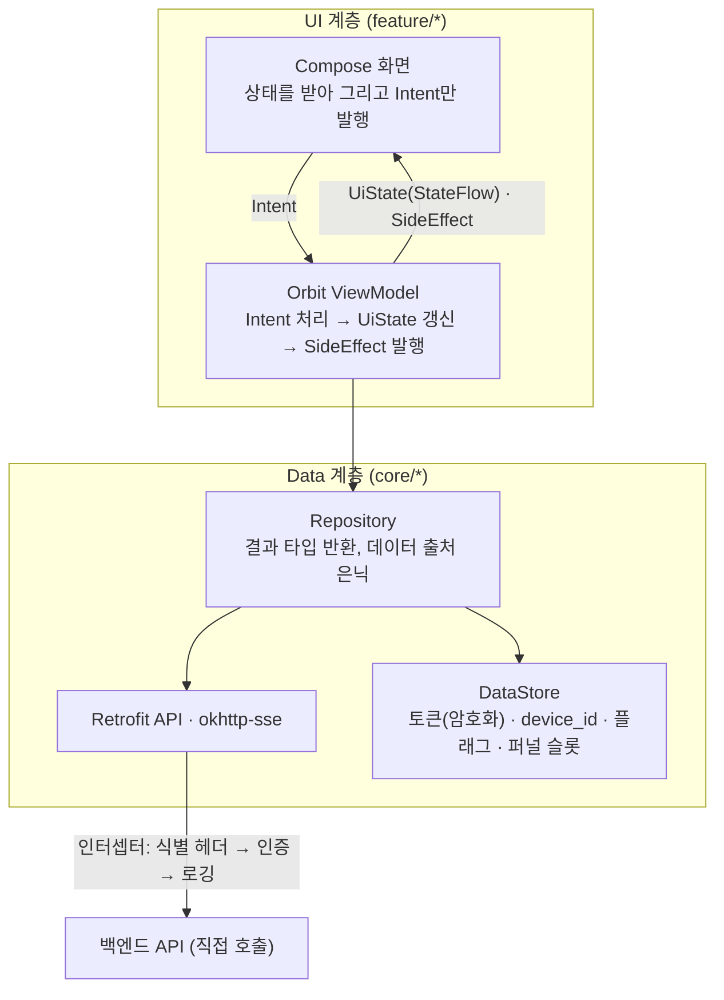
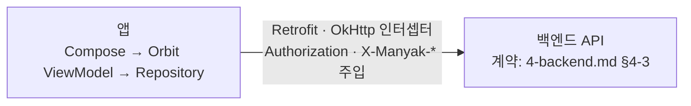

# 3-3-ANDROID-APP

이 문서는 **마냑 안드로이드 네이티브 앱의 플랫폼 구현 계약**을 정의합니다. 화면·사용자 흐름·API 계약 등 플랫폼 무관 스펙은 [`3-1-client.md`](./3-1-client.md)가 소유하며, 이 문서는 그 계약을 안드로이드 앱이 어떻게 충족하는지만 적습니다. 웹 구현의 병렬 문서는 [`3-2-web-app.md`](./3-2-web-app.md)입니다.

> **작성 상태** — 안드로이드 앱 확장은 **Phase 2** 범위입니다([`roadmap.md §R-4`](../planning/roadmap.md)). 2026-08-03 기술 선택 인터뷰(KNK-772)로 v1 범위·기술 스택·아키텍처·배포 전략을 확정했고, 이 문서는 그 결정을 담습니다. 기준 코드(`../manyak-android`)는 아직 프로젝트 초기 세팅 단계이므로, **이 문서의 스택·구조는 "구현 기준"이며 "구현 완료"가 아닙니다.** 코드로 검증된 값(빌드 환경·CI)과 결정값을 절마다 구분해 적습니다. 값이 없는 항목은 `TBD`로 두고 추측으로 채우지 않습니다.

```text
§3-3-1  문서 목적·범위와 관련 문서
§3-3-2  기술 환경·아키텍처와 요청 흐름
§3-3-3  내비게이션·화면 구조 대응
§3-3-4  API 연동·인증 세션
§3-3-5  디바이스 지원·접근성·앱 라이프사이클
§3-3-6  관측 연동
§3-3-7  테스트·빌드·Definition of Done
```

| 항목      | 값                                                             |
| --------- | -------------------------------------------------------------- |
| 버전      | v0.6                                                           |
| 작성일    | 2026-08-02                                                     |
| 수정일    | 2026-08-03                                                     |
| 대상      | 마냑 안드로이드 네이티브 앱 (`Phase 2`)                        |
| 작성 목적 | 안드로이드 앱의 플랫폼 구현·연동·검수 기준을 정의합니다.       |
| 기준 코드 | `../manyak-android` (Kotlin, Jetpack Compose)                  |
| 이력      | v0.5 골격을 KNK-772 기술 선택 인터뷰(2026-08-03) 결과로 본문 확정 |

**규칙 강도 표기** — `MUST`(위반하면 계약 위반), `SHOULD`(정당한 사유 없이 어기지 않음), `MAY`(선택)를 이 문서 전체에서 일관되게 사용합니다.

---

## 3-3-1. 문서 목적·범위와 관련 문서

### 목적

이 문서는 마냑 안드로이드 앱 개발자가 플랫폼 구현(아키텍처, 내비게이션, API 연동, 인증 세션, 디바이스 대응, 관측, 테스트, 배포)을 결정하는 기준입니다. 화면·흐름·API 계약은 [`3-1-client.md`](./3-1-client.md)를 기준으로 구현하고, 이 문서는 안드로이드에서만 성립하는 계약을 더합니다.

### 앱은 로그인 필수입니다 — 공통 계약의 플랫폼 예외

**안드로이드 앱은 로그인한 회원만 사용합니다**(2026-08-03 팀 결정). 앱을 처음 실행하면 로그인 게이트가 뜨고, 로그인하기 전에는 어떤 화면도 열람할 수 없습니다. 웹은 게스트 우선 모델을 그대로 유지하므로, 이 결정은 **웹과 앱의 사용자 모델이 갈리는 유일한 지점**이자 이 문서 전체의 전제입니다.

그 결과 [`3-1-client.md`](./3-1-client.md)의 다음 계약은 **앱에 적용하지 않습니다**. 각 항목은 웹 전용으로 남고, 3-1도 같은 예외를 기록합니다.

| 3-1 계약 | 앱 비적용 사유 |
| --- | --- |
| FE-SCREEN-007 온보딩 | 로그인 게이트가 첫 실행 경험을 대체합니다(§3-3-3) |
| FE-SCREEN-012 채팅 공유 열람 | 공유 링크는 웹이 열람합니다. 앱은 App Link를 선언하지 않습니다(§3-3-3) |
| [§3-1-6](./3-1-client.md#3-1-6-게스트-데이터-모델) 게스트 데이터 모델 전체 | 게스트가 존재하지 않아 로컬 서재·사용량 카운터·배치 재조회·상태 판정이 모두 불필요합니다(§3-3-4) |
| 게스트 데이터 자동 이관(`POST /auth/migrate`) | 이관 대상인 로컬 게스트 데이터가 앱에 없습니다 |
| 402 응답의 게스트 분기(로그인 유도 다이얼로그) | 앱 사용자는 전원 회원이라 크레딧 부족 분기만 남습니다 |

**웹 게스트 데이터의 연속성은 앱에서 단절됩니다.** 웹에서 게스트로 만든 스토리는 그 브라우저에서 로그인해 이관해야 회원 서재에 들어오고, 앱은 회원 서재만 조회합니다. 앱이 별도 구제 경로를 제공하지 않는 것은 결정 사항입니다.

### 범위

- 기술 스택, 앱 아키텍처(계층·상태 모델·패키지 구조)와 요청 흐름
- 로그인 게이트 화면(앱 전용), 내비게이션·백스택 규칙, 공통 화면 계약의 안드로이드 대응, 플랫폼 구현 상태 매트릭스
- API 연동 방식과 인증 세션(토큰 보관·선제 재발급·소셜 로그인·계정 연동)
- 디바이스 지원 범위, 접근성, 앱 라이프사이클과 상태 보존
- 관측(분석·크래시 배선), 테스트 범위, 빌드·배포 구성, Definition of Done

### 제외 범위

- 화면별 스펙, 퍼널·채팅 흐름, API 사용 계약, 입력 검증 (담당: [`3-1-client.md`](./3-1-client.md))
- 백엔드 내부 구현과 API 상세 스키마 (담당: [`4-backend.md`](./4-backend.md))
- 이벤트 카탈로그, 식별자 정책, 지표 (원천: [`6-analytics.md`](./6-analytics.md))
- 개발 환경 셋업 절차, 환경 변수 목록, 릴리스 런북 (안드로이드 레포 `README`가 소유)

### 관련 문서와 경계

| 문서                                   | 소유 영역                      | 이 문서와의 관계                   |
| -------------------------------------- | ------------------------------ | ---------------------------------- |
| [`3-1-client.md`](./3-1-client.md)     | 클라이언트 공통 화면·흐름·계약 | 이 문서가 구현하는 계약의 정본     |
| [`3-2-web-app.md`](./3-2-web-app.md)   | 웹 플랫폼 구현                 | 같은 공통 계약의 병렬 구현·선례. 앱이 인앱 브라우저로 여는 웹 경로(`/terms`·`/privacy`·`/my/about`)의 정본 |
| [`4-backend.md`](./4-backend.md)       | API 명세, 데이터 모델          | API 상세를 위임                    |
| [`6-analytics.md`](./6-analytics.md)   | 이벤트·식별자·헤더·Sentry 기준 | 카탈로그는 위임, 발화 배선만 정의  |
| [`roadmap.md`](../planning/roadmap.md) | Phase별 개발 범위·일정          | 앱 개발 시작 시점(Phase 2)의 근거   |

### 웹 계약과의 대응 원칙

[`3-1-client.md`](./3-1-client.md)는 웹 구현을 기준 예시로 서술된 부분이 있습니다(플랫폼 표기 원칙). 안드로이드 앱은 같은 계약을 플랫폼 수단으로 충족하며, 이 문서가 그 대응 규칙을 소유합니다.

| 공통 계약(웹 기준 표기)                                        | 안드로이드 대응                                                   |
| -------------------------------------------------------------- | ----------------------------------------------------------------- |
| URL 경로·히스토리(`push`/`replace`)                            | 타입 안전 라우트와 백스택 규칙 (§3-3-3)                           |
| 온보딩 진입 게이트(웹: 서버 프록시·쿠키)                       | 로그인 게이트로 대체 — 세션 유무로 시작 그래프 결정 (§3-3-3)      |
| `localStorage` 게스트 서재·카운터·플래그                       | 게스트 서재·카운터는 비적용. 기기 단위 플래그는 DataStore (§3-3-4) |
| BFF 프록시·httpOnly 쿠키 토큰 세션                             | 백엔드 직접 호출 + Keystore 암호화 DataStore 토큰 보관 (§3-3-4)   |
| 소셜 로그인(웹: NextAuth OAuth 리다이렉트)                     | Credential Manager(구글)·Kakao SDK(카카오)로 `idToken` 획득 (§3-3-4) |
| SSE 수신(웹: `fetch`+`ReadableStream`)                         | `okhttp-sse` (§3-3-2)                                             |
| 퍼널 이탈 가드(웹: `beforeunload`·히스토리 트래핑)             | `BackHandler` 인터셉트 + `onStop` 저장 (§3-3-5)                   |
| 카카오톡 공유(웹: 카카오 JS SDK)                               | Kakao SDK 공유 모듈. 채팅 공유 발급은 OS 공유 시트 (§3-3-4)       |
| 약관·개인정보처리방침 콘텐츠(웹: 웹 레포 TS 모듈)              | 웹 정본을 Chrome Custom Tabs로 열람 — 콘텐츠를 앱에 복제하지 않습니다 (§3-3-4) |
| 피드백 `platform: WEB`                                         | `platform: ANDROID` 고정 전송 (공통 계약 FE-SCREEN-006)           |
| 브라우저 지원·인앱 브라우저 감지 (앱은 개념 없음)              | OS 최소 버전·디바이스 지원 범위 (§3-3-5)                          |

---

## 3-3-2. 기술 환경·아키텍처와 요청 흐름

### 검증된 빌드 환경

기준 코드(`../manyak-android`)에서 확인된 값입니다(근거: `app/build.gradle.kts`, `gradle/libs.versions.toml`, `gradle/wrapper/gradle-wrapper.properties`, `gradle/gradle-daemon-jvm.properties`, `.github/workflows/android-ci.yml`).

| 분류                  | 값                                          |
| --------------------- | ------------------------------------------- |
| 언어                  | Kotlin 2.2.10                               |
| UI                    | Jetpack Compose(Compose BOM 2026.02.01), Material 3 |
| SDK                   | `compileSdk` 37 · `targetSdk` 37 · `minSdk` 24 (제품 지원 선언은 26 — §3-3-5) |
| 빌드                  | Android Gradle Plugin 9.3.1, Gradle 9.5.0   |
| 빌드 JDK              | Java 25 — Gradle daemon toolchain(`gradle-daemon-jvm.properties` `toolchainVersion=25`), CI도 Temurin 25 사용 |
| Java 컴파일 호환성    | source/target 11 — 산출물의 바이트코드 타깃이며, 개발·빌드에 쓰는 JDK 버전(위 Java 25)과 다른 값입니다 |
| 정적 검사             | ktlint, detekt, Android lint                |
| 단위 테스트           | JUnit                                       |
| UI 테스트 기반        | Compose UI Test, Espresso                   |

### 확정 스택

2026-08-03 결정입니다. 도입 버전은 구현 시점의 안정판을 쓰고 `gradle/libs.versions.toml`이 정본이 됩니다.

| 분류 | 선택 | 선택 이유(요약) |
| --- | --- | --- |
| UI 상태 관리 | **Orbit MVI** | 화면마다 단일 상태·인텐트·사이드이펙트를 강제해 상태 흐름이 균일해집니다. 팀 기술 학습 목표도 결정 요인입니다(아래 결정 기록) |
| 의존성 주입 | **Hilt** | 컴파일 타임에 의존 그래프 오류를 잡고, ViewModel 생성 배선과 테스트 대역 교체의 표준 경로를 제공합니다 |
| 내비게이션 | **Navigation Compose**(타입 안전 라우트) | 성숙도·자료·Hilt 통합이 가장 두텁습니다. Navigation 3은 구현 시점에 안정화 상태를 재확인합니다 |
| HTTP·직렬화 | **Retrofit + OkHttp + kotlinx.serialization** | 인터셉터가 토큰 주입·식별 헤더·로깅의 단일 지점이 되고, SSE도 같은 클라이언트 위에서 해결됩니다 |
| SSE | **okhttp-sse** | POST 본문을 실은 요청을 지원해 채팅 턴 계약을 충족하고, 검증된 SSE 파서를 재사용합니다 |
| 로컬 저장 | **DataStore**(Preferences + 커스텀 직렬화) | 관계형 데이터가 없어 Room이 필요하지 않습니다 |
| 이미지 로딩 | **Coil** | Compose 전용 API로 placeholder·실패 처리 계약을 그대로 구현합니다 |
| 소셜 로그인 | **Credential Manager**(구글) · **Kakao SDK v2**(카카오) | §3-3-4 |
| 분석·크래시 | **Amplitude Android SDK** · **Sentry Android SDK** · **Timber** | §3-3-6 |

**도입하지 않는 것과 그 이유** — Room(관계형 데이터·오프라인 요구 없음), WorkManager·Foreground Service(서버 복구 계약이 안전망 — §3-3-5), 응답 캐시 계층(§3-3-4), 원격 Feature Flag(§3-3-7), 멀티 모듈(출시 후 전환 — 아래).

**결정 기록 — UI 상태 관리로 Orbit MVI 채택(2026-08-03)**

- **배경.** 화면 상태를 어떤 패턴으로 관리할지의 갈림길입니다. 이 앱의 복잡도는 채팅(스트리밍 상태 기계)·퍼널(단계 상태와 임시 저장)·인증 세션 세 곳에 집중되고, 나머지 화면은 조회 후 렌더에 가깝습니다.

| 대안 | 채택 안 한 이유 |
| --- | --- |
| ViewModel + `StateFlow` 수제 UDF (공식 가이드 기본형) | 기술적으로 충분하지만, 인텐트·사이드이펙트의 형식화를 관례에만 의존해 화면마다 편차가 생길 수 있습니다. 팀의 기술 학습 목표(MVI 프레임워크 경험)도 충족하지 못합니다 |
| 수제 MVI(프레임워크 없이 3요소 직접 구현) | 상태 갱신 직렬화·사이드이펙트 전달 보장을 직접 처리해야 하고, 학습 목표 측면의 이득도 프레임워크 채택보다 작습니다 |

- **영향.** 화면마다 `UiState`·`Intent`·`SideEffect` 3요소를 고정 관례로 작성합니다(아래 UI 상태 모델). 테스트는 "인텐트를 넣고 상태를 단언"하는 형태로 단순해집니다(§3-3-7). 재검토 조건 — Orbit이 Compose·Kotlin 버전 추종을 막거나 유지보수가 정체되면 수제 MVI로 회귀합니다. 같은 패턴이라 이행은 기계적입니다.

### 계층과 책임

계층은 **UI**와 **Data** 둘입니다. Clean Architecture의 Domain 계층(전면 UseCase)과 DDD는 도입하지 않습니다.



| 계층 | 책임 | 금지 |
| --- | --- | --- |
| Compose 화면 | 상태 렌더, 사용자 입력을 Intent로 발행 | 화면이 직접 데이터를 조회하지 않습니다(`MUST NOT`) |
| Orbit ViewModel | Intent 처리, 상태 갱신, 1회성 사건 발행 | Retrofit·DataStore를 직접 호출하지 않습니다(`MUST NOT`) |
| Repository | 네트워크·로컬 접근, 결과 타입 변환 | UI 개념(문구·표시 상태)을 알지 않습니다 |

**UseCase 계층은 기본적으로 두지 않습니다.** 도메인 규칙(크레딧·한도·소유권·멱등·엔딩 판정)이 모두 백엔드에 있어, 대부분의 UseCase가 Repository 호출을 한 줄 위임하는 껍데기가 되기 때문입니다. 다음 조건 중 하나를 만족하는 지점만 UseCase로 추출합니다(`SHOULD`).

- 같은 로직을 ViewModel 두 곳 이상에서 사용하게 될 때
- ViewModel 하나가 Repository 세 개 이상을 조율하게 될 때

### 패키지 구조

단일 모듈(`app`)로 시작하고, 패키지를 기능 단위로 나눕니다.

```text
app/src/main/java/app/manyak/
├── core/
│   ├── network/        # Retrofit·OkHttp·인터셉터·SSE·결과 타입
│   ├── auth/           # 토큰 저장·선제 재발급·세션 상태
│   ├── datastore/      # Preferences·퍼널 슬롯 직렬화
│   ├── designsystem/   # 테마(브랜드 토큰)·Material 3 래퍼
│   ├── analytics/      # Amplitude 배선·이벤트 발화 헬퍼
│   └── navigation/     # 타입 안전 라우트 정의
├── feature/
│   ├── gate/           # 로그인 게이트(앱 전용 화면)
│   ├── home/           # FE-SCREEN-001
│   ├── funnel/         # FE-SCREEN-002
│   ├── storydetail/    # FE-SCREEN-003
│   ├── chatlist/       # FE-SCREEN-004
│   ├── chat/           # FE-SCREEN-005
│   ├── feedback/       # FE-SCREEN-006
│   └── my/             # FE-SCREEN-008·011 진입
└── MainActivity.kt     # 단일 Activity
```

의존 방향 규칙입니다. 두 규칙은 멀티 모듈 전환의 선행 조건이기도 합니다.

- `feature/*`끼리 직접 참조하지 않습니다(`MUST`). 화면 이동은 내비게이션 계층을 거치고, 공유 로직은 `core/*`로 내립니다.
- `core/*`는 `feature/*`를 알지 않습니다(`MUST`). 의존은 항상 `feature → core` 단방향입니다.

**결정 기록 — 단일 모듈로 시작(2026-08-03)**

- **배경.** 안드로이드 대형 앱과 구글 샘플은 `:app` + `:core:*` + `:feature:*` 멀티 모듈 구성을 씁니다. 구글의 모듈화 가이드는 모듈화를 "커진 코드베이스의 확장 문제를 푸는 수단"으로 규정합니다.

| 대안 | 채택 안 한 이유 |
| --- | --- |
| 처음부터 멀티 모듈 | 모듈 부트스트랩과 Gradle 규약 플러그인 작업이 초기 며칠을 소모해, 8월 12~14일 첫 배포 마일스톤(§3-3-7)과 충돌합니다. 화면 하나를 추가할 때마다 모듈 배선이 따라옵니다 |

- **영향.** 빌드 설정이 단순해지는 대신 계층 경계가 컴파일러로 강제되지 않으므로, 위 의존 방향 2규칙을 코드 리뷰가 지킵니다. **출시 후 첫 리팩터링으로 멀티 모듈 전환을 수행합니다**(후속 과제). 패키지를 모듈로 승격하는 형태라 전환 작업은 기계적입니다. 규약 플러그인도 그 시점에 도입하고, Version Catalog(`libs.versions.toml`)는 지금부터 사용합니다.

### UI 상태 모델

모든 화면은 다음 3요소를 정의합니다(`MUST`). 화면 코드의 구조가 균일해져 리뷰와 테스트가 같은 형태로 반복됩니다.

```kotlin
// 1. UiState — 화면이 그릴 수 있는 상태 전부를 담은 단일 불변 객체
data class ChatUiState(
    val turns: List<TurnUi> = emptyList(),
    val streaming: StreamingUi? = null,
    val composer: ComposerUi = ComposerUi(),
    val error: ErrorUi? = null,
)

// 2. Intent — 화면에서 일어날 수 있는 사용자 행동 전부
sealed interface ChatIntent {
    data class Send(val text: String, val source: UserSource) : ChatIntent
    data object Regenerate : ChatIntent
    data object DeleteConfirmed : ChatIntent
}

// 3. SideEffect — 상태가 아닌 1회성 사건
sealed interface ChatSideEffect {
    data class Snackbar(val message: String) : ChatSideEffect
    data object NavigateToChatList : ChatSideEffect
    data object ShowCreditDialog : ChatSideEffect
}
```

### 코루틴·Flow 사용 원칙

- 비동기 작업은 화면 스코프(Orbit 컨테이너)에서 실행합니다. `GlobalScope`를 사용하지 않습니다(`MUST NOT`).
- 화면보다 오래 살아야 하는 작업은 주입한 앱 스코프에서 실행하며, 허용 대상은 **토큰 재발급 · 분석 이벤트 발송 · 퍼널 슬롯 기록** 셋뿐입니다. 그 밖의 앱 스코프 사용은 코드 리뷰에서 사유를 요구합니다.
- 퍼널 생성 요청은 화면 스코프에 둡니다. 화면이 사라져 요청이 끊겨도 서버가 처리를 완주하고 복구 조회가 결과를 되찾기 때문입니다([`3-1-client.md §3-1-4`](./3-1-client.md#3-1-4-스토리-생성-퍼널)).
- 1회성 조회·변경은 `suspend` 함수로 반환합니다. `Flow`는 실제로 관찰이 필요한 대상(DataStore 값, SSE 스트림)에만 씁니다(`SHOULD`).
- `Dispatchers.IO`를 코드에 직접 쓰지 않고 주입받습니다. 테스트에서 교체하기 위해서입니다(`SHOULD`).

### 에러 표현과 재시도

- Repository는 실패를 예외로 던지지 않고 결과 타입으로 반환합니다(`MUST`). 분류는 **성공 / API 오류(`ApiErrorResponse`의 `code`·`status` 보존) / 네트워크 실패** 셋입니다. ViewModel이 `when`으로 모든 분기를 처리하므로 누락이 컴파일 단계에서 드러납니다.
- 402 응답은 화면마다 따로 처리하지 않고 공통 분기로 크레딧 부족 다이얼로그를 띄웁니다(`MUST`, 공통 계약 FE-SCREEN-008). 앱에는 게스트가 없어 로그인 유도 분기는 없습니다.
- 자동 재시도와 화면 복귀 자동 재조회를 두지 않습니다(`MUST`, [`3-1-client.md §3-1-7`](./3-1-client.md#3-1-7-api-연동에러-처리-계약)). 재시도는 항상 사용자의 명시적 행동입니다.

### 요청 흐름

브라우저와 달리 앱은 백엔드를 직접 호출합니다. 전달 계층이 없어 SSE 버퍼링 문제가 발생하지 않고, 타임아웃도 한 층입니다.



**결정 기록 — 백엔드 직접 호출(2026-08-03)**

- **배경.** 웹은 BFF 프록시를 단일 창구로 두고 브라우저가 백엔드를 직접 호출하지 않습니다([`3-2-web-app.md §3-2-4`](./3-2-web-app.md#3-2-4-bff-프록시토큰-세션)). 그 근거는 두 가지였습니다 — `API_BASE_URL`을 클라이언트 번들에 노출하지 않는 것과, 회원 토큰을 브라우저 JS에 주지 않는 것(XSS 탈취 방지)입니다. 앱에서도 같은 구조가 필요한지가 갈림길입니다.

| 대안 | 채택 안 한 이유 |
| --- | --- |
| 웹 BFF 프록시 경유 | 앱에는 XSS 위협 모델이 없고 APK에서 API 주소를 숨기는 것도 불가능해, 두 근거가 모두 성립하지 않습니다. 얻는 것 없이 왕복 지연·함수 실행 비용·장애 지점이 늘고, 웹 배포가 앱 장애 요인이 됩니다 |
| 모바일 전용 게이트웨이 신설 | 응답을 가공·집계할 수요가 없습니다. 화면과 API가 이미 1:1로 맞습니다 |

- **영향.** 토큰 주입과 선제 재발급을 앱의 네트워킹 계층이 직접 수행합니다(§3-3-4). 타임아웃 층이 하나로 줄어 일반 요청은 클라이언트 상한 하나만 둡니다. 환경별 `API_BASE_URL`은 빌드 타입으로 주입합니다(§3-3-7).

### 요청 타임아웃

| 대상 | 값 | 근거 |
| --- | --- | --- |
| 일반 요청 | 200초 | 백엔드의 최장 동기 요청 예산(스토리 컴파일 180초 — [`4-backend.md`](./4-backend.md)) 위에 여유를 둔 값으로, 웹 클라이언트와 같습니다 |
| 채팅·재생성 SSE | 클라이언트 상한 없음 | 공통 계약을 따릅니다. 종료는 백엔드의 두 층 상한(전체 상한·이벤트 간 idle 상한)에 위임합니다 |

SSE에 클라이언트 상한이 없는 것은 웹과 공유하는 간극입니다([`3-1-client.md §3-1-9`](./3-1-client.md#3-1-9-mvp-제외-범위와-스펙-구현-간극) G5). 상한을 도입할 때는 웹과 함께 결정합니다.

### SSE 클라이언트 구현

채팅 턴은 사용자 입력을 본문에 실은 `POST` 요청의 응답을 SSE로 받는 계약이라([`3-1-client.md §3-1-5`](./3-1-client.md#3-1-5-채팅-플레이와-sse-스트리밍)), GET 전용 클라이언트를 쓸 수 없습니다.

**결정 기록 — SSE 수신에 `okhttp-sse` 사용(2026-08-03)**

- **배경.** 표준 SSE 클라이언트 다수가 GET 전용이라 각 플랫폼이 수신을 직접 구현해야 합니다. 웹은 브라우저에 SSE 파서가 없어 `fetch`+`ReadableStream`으로 파싱까지 직접 구현했습니다.

| 대안 | 채택 안 한 이유 |
| --- | --- |
| Retrofit `@Streaming` + 직접 파싱 | 웹의 직접 구현을 재연하는 선택입니다. 앱에는 검증된 SSE 파서가 있는데 줄 분할·멀티라인 `data:`·주석 처리 같은 엣지 케이스를 다시 떠안을 이유가 없습니다 |
| 서드파티 SSE 라이브러리 | `okhttp-sse`가 공식·경량으로 충분해 의존을 늘릴 명분이 없습니다 |

- **영향.** 스트리밍 전용 OkHttp 인스턴스를 읽기 타임아웃 없이 구성합니다. 인증·식별 헤더 인터셉터가 스트림 요청에도 그대로 적용되어 선제 재발급이 자동으로 걸립니다. 이벤트는 `callbackFlow`로 감싸 `Flow`로 노출하고, 화면 이탈 시 Flow 취소가 곧 스트림 중단입니다(계약의 "조용히 종료").

구현이 충족해야 하는 계약입니다(원천: [`3-1-client.md §3-1-5`](./3-1-client.md#3-1-5-채팅-플레이와-sse-스트리밍)).

- `token` 이벤트는 JSON(`{"text":"..."}`)과 원문 텍스트를 모두 허용합니다(`MUST`).
- `completed` 수신 시 누적 텍스트를 버리고 상세를 다시 조회해 서버 확정본을 표시합니다(`MUST`).
- `completed`·`error` 없이 스트림이 끝나면(EOF) 실패로 확정하고 상세를 다시 조회합니다(`MUST`). 사용자 취소로 중단한 스트림은 제외합니다.
- 402는 스트림이 열리기 전 동기 응답이므로 위의 402 공통 분기로 합류합니다(`MUST`).
- 재생성 스트림도 같은 구현을 재사용합니다.

---

## 3-3-3. 내비게이션·화면 구조 대응

### 로그인 게이트 (앱 전용 화면)

[`3-1-client.md`](./3-1-client.md)의 화면 인벤토리에 없는 앱 전용 화면입니다. 이 문서가 스펙을 소유합니다.

| 항목 | 값 |
| --- | --- |
| 목적 | 서비스를 간단히 소개하고 소셜 로그인으로 진입시킵니다 |
| 진입 조건 | 인증 세션이 없을 때 앱의 시작 화면입니다. 세션 만료·로그아웃 시에도 이 화면으로 돌아옵니다 |
| 구성 | 로고, 한 줄 서비스 소개, 가입 보상 고지, 카카오·구글 로그인 버튼, 기존 계정 안내 문구 |
| 사용자 액션 | 로그인 버튼 → 각 프로바이더 인증 → 성공 시 홈으로 이동하며 게이트를 백스택에서 제거 |
| 상태 | 기본 / 로그인 진행 중(버튼 잠금 + 스피너) / 실패(안내 문구 표시 후 재시도 가능) |

- **가입 보상 고지** — 회원가입 500 크레딧을 고지합니다(수치 정본: [`4-backend.md §4-3-7`](./4-backend.md)). 문구는 정책 수치가 바뀌면 함께 갱신합니다.
- **기존 계정 안내** — "Web에서 이미 로그인했다면 해당 계정으로 로그인해 주세요" 계열의 안내를 버튼 근처에 둡니다(`MUST`). 프로바이더가 다르면 별개 계정이 생성되고([`4-backend.md §4-5`](./4-backend.md)), 이미 갈라진 계정을 합치는 기능은 없기 때문입니다. 앱은 로그인이 강제라 웹보다 이 사고의 빈도가 높습니다.
- **화면 구성 범위** — v1은 미니멀 구성입니다. 채팅 예시를 보여 주는 리치한 소개 화면은 후속 개선으로 둡니다(`TBD` — 디자인 리소스 확보 후).
- **계측** — 신규 이벤트를 만들지 않고 `client_login_viewed`를 재사용합니다(§3-3-6).

### 내비게이션 구조

- **단일 Activity**입니다(`MUST`). 화면 전환은 모두 Compose 내비게이션이 처리합니다.
- **그래프 2개** — `auth` 그래프(로그인 게이트)와 `main` 그래프(나머지 전체)로 나눕니다. 앱 시작 시 세션 유무로 시작 그래프를 정하고, 로그인 성공 시 `auth`를, 로그아웃·세션 만료 시 `main`을 백스택에서 제거합니다(`MUST`). 게이트로 되돌아가는 뒤로가기가 생기면 안 됩니다.
- **화면 간 데이터 전달은 식별자만** 넘깁니다(`MUST`). 목적지 화면이 그 식별자로 데이터를 다시 조회합니다.

### 화면 전환 규칙

웹의 화면 전환 규칙([`3-2-web-app.md §3-2-3`](./3-2-web-app.md#3-2-3-라우팅레이아웃공통-셸))과 같은 계약을 안드로이드 수단으로 충족합니다.

| 상황 | 웹 수단 | 안드로이드 대응 | 근거 |
| --- | --- | --- | --- |
| 하단 3탭 이동 | `Link replace` | 백스택에 쌓지 않고 탭별 상태를 보존·복원. 어느 탭에서든 뒤로가기는 앱 종료 | 탭 전환을 히스토리에 남기지 않는 계약 |
| 상세 CTA → 채팅 화면 | `replace` | 채팅으로 이동하며 상세를 백스택에서 제거 | 뒤로가기 재진입으로 채팅이 중복 생성되지 않도록 |
| 퍼널 완료 → 채팅 화면 | `replace` | 퍼널을 백스택에서 제거 | 동상 |
| 채팅 화면 뒤로 | `push('/chats')` | 진입 경로와 무관하게 채팅 목록으로 이동 | 공통 계약 |
| 스토리·채팅 삭제 성공 | `replace` | 삭제된 화면을 백스택에서 제거하고 목록으로 | 삭제된 화면으로 되돌아오지 않도록 |
| 퍼널 이탈 가드 | `beforeunload`·히스토리 트래핑 | `BackHandler`로 뒤로가기를 흡수한 뒤 계약대로 임시 저장 또는 경고 | [§3-3-5](#3-3-5-디바이스-지원접근성앱-라이프사이클) |
| 이미지 뷰어 닫기 | 더미 히스토리 | `BackHandler`로 화면 이동 없이 뷰어만 닫기 | 공통 계약(FE-SCREEN-003) |

### 컴포넌트 대응 규칙

공통 계약이 웹 어휘로 서술한 요소의 안드로이드 대응입니다.

| 공통 계약(웹 어휘) | 안드로이드 대응 |
| --- | --- |
| 토스트(완료·실패 안내) | Material 3 Snackbar. 시스템 `Toast`는 사용하지 않습니다 |
| 확인 다이얼로그(삭제·공유·402·이탈) | Material 3 AlertDialog. 초기 포커스를 팝업 자체에 두는 계약을 따릅니다 |
| 바텀 드로어(선택 키워드) | Material 3 ModalBottomSheet |
| 드롭다운 메뉴(옵션 ⋮·입력 설정) | Material 3 DropdownMenu |
| 생성 FAB(스크롤 시 라벨 접힘) | Material 3 Extended FAB의 확장·축소 상태 |
| 풀스크린 이미지 뷰어 | 전체 화면 오버레이 + `BackHandler` |
| 채팅 첫 진입 안내 투어·인라인 힌트 | 커스텀 오버레이(대응 컴포넌트 없음). v1 범위이며 구현 순서는 후순위입니다 |
| 키보드 대응(`resizes-content`) | edge-to-edge + `imePadding` |
| 안전 영역(`safe-area-inset`) | `WindowInsets` 패딩 |
| 채팅 헤더 show/hide | 스크롤 연동 상단 바. 숨긴 헤더는 접근성 트리에서 제외합니다 |
| (웹에 없음) | **당겨서 새로고침** — 홈·채팅 목록에 추가합니다. 안드로이드 관례이며 "자동 재조회 없음" 계약과 충돌하지 않습니다(사용자의 명시적 행동) |

**디자인 시스템** — Material 3 컴포넌트를 뼈대로 쓰고 색·타이포그래피·모서리 반경을 웹 디자인 토큰 값으로 교체합니다. 토큰 정본은 웹 레포의 Tailwind 설정이며, 서체는 공통 계약대로 Pretendard(기본)·MaruBuri(서사 텍스트)를 앱에 번들합니다. 화면 코드는 Material 3 컴포넌트를 직접 호출하지 않고 `core/designsystem`의 래퍼를 사용합니다(`SHOULD`). 목표는 웹과의 픽셀 일치가 아니라 **같은 브랜드로 보이는 네이티브 앱**입니다.

### 플랫폼 구현 상태 매트릭스

**공통 계약 상태(`확정`·`방향 합의`·`미정`)·웹 구현 상태(`구현`·`부분 구현`·`미구현`)·로드맵 Phase의 용어·판정 기준과 값의 정본은 [`3-1-client.md §3-1-1` 상태 정본 표](./3-1-client.md#상태-정본-표)입니다.** 이 표는 3-1의 화면(FE-SCREEN) 원자 행을 그대로 옮겨 적고, **Android 목표 범위·현재 상태 두 열만 이 문서가 소유합니다.**

Android 목표 범위의 값은 다음 넷입니다.

| 값 | 의미 |
| --- | --- |
| `v1` | 첫 출시 범위이며 Definition of Done의 대상입니다 |
| `v1 · 앱 선행` | 웹이 아직 구현하지 않았지만 앱이 먼저 구현합니다(아래 예외 조건 충족) |
| `웹 추종` | 웹이 구현한 뒤 따라갑니다 |
| `선행 조건 대기` | 공통 계약 또는 서버·AI 구현이 선행되어야 착수할 수 있습니다 |
| `비적용` | 앱에 해당 개념이 없습니다 |

**범위 결정 원칙** — 웹 구현 상태가 앱 목표 범위의 상한입니다(`MUST`). 예외는 **서버 구현이 완료되어 클라이언트 렌더만 남은 항목**뿐이며, 이 경우 앱이 웹보다 먼저 구현할 수 있습니다. 앱은 릴리스마다 스토어 심사를 거쳐 "나중에 추가"의 비용이 웹보다 크기 때문입니다.

| 공통 ID | 기능 | 로드맵 Phase | 공통 계약 상태 | 웹 구현 상태 | Android 목표 범위 | Android 현재 상태 | 플랫폼 차이·비고 | 관련 절 |
| --- | --- | --- | --- | --- | --- | --- | --- | --- |
| — | **로그인 게이트(앱 전용)** | Phase 2 | 앱 소유 | 비적용 | v1 | 미착수 | 앱 전용 신규 화면 | §3-3-3 |
| FE-SCREEN-001 | 스토리 목록 기본 | MVP | 확정 | 구현 | v1 | 미착수 | 데이터 소스는 회원 서재 API | §3-3-4 |
| FE-SCREEN-001 | 카드 썸네일(US-2-7) | Phase 1 | 확정 | 구현 | v1 | 미착수 | — | §3-3-3 |
| FE-SCREEN-002 | 생성 퍼널 기본 | MVP | 확정 | 구현 | v1 | 미착수 | 이탈 가드는 `BackHandler` | §3-3-5 |
| FE-SCREEN-002 | 백그라운드 생성 복귀·제작 임시 저장 | Phase 1 | 확정 | 구현 | v1 | 미착수 | 슬롯은 DataStore, `onStop` 저장 보강 | §3-3-5 |
| FE-SCREEN-002 | 키워드 단계 개편(KNK-621) | Phase 1 | 방향 합의 | 미구현 | 선행 조건 대기 | 미착수 | 공통 계약 확정 대기 | — |
| FE-SCREEN-003 | 스토리 상세 기본 | MVP | 확정 | 구현 | v1 | 미착수 | — | §3-3-3 |
| FE-SCREEN-003 | 썸네일 히어로·이미지 뷰어·시작 설정 선택 | Phase 1 | 확정 | 구현 | v1 | 미착수 | 뷰어 닫기는 `BackHandler` | §3-3-5 |
| FE-SCREEN-003 | 본 엔딩 배지 | Phase 1 | 확정 | 미구현 | **v1 · 앱 선행** | 미착수 | 서버 완료·렌더만 잔여. 회원 `reachedEndings`만 사용(게스트 합산 비적용) | §3-3-3 |
| FE-SCREEN-004 | 채팅 목록·이어가기 기본 | MVP | 확정 | 구현 | v1 | 미착수 | 데이터 소스는 회원 서재 API | §3-3-4 |
| FE-SCREEN-004 | 카드 썸네일 | Phase 1 | 확정 | 구현 | v1 | 미착수 | — | §3-3-3 |
| FE-SCREEN-005 | 채팅 기본(SSE 스트리밍·선택지·삭제) | MVP | 확정 | 구현 | v1 | 미착수 | SSE는 `okhttp-sse` | §3-3-2 |
| FE-SCREEN-005 | 응답 재생성(US-6-10) | Phase 1 | 확정 | 구현 | v1 | 미착수 | — | §3-3-2 |
| FE-SCREEN-005 | 주요 사건 방향 선택지 | Phase 1 | 확정 | 구현 | v1 | 미착수 | 렌더만 | §3-3-3 |
| FE-SCREEN-005 | 채팅 공유 발급 | Phase 1 | 확정 | 구현 | v1 | 미착수 | 클립보드 복사 대신 OS 공유 시트 | §3-3-4 |
| FE-SCREEN-005 | 채팅 이미지 렌더(US-6-11) | Phase 1 | 확정 | 미구현 | 선행 조건 대기 | 미착수 | 서버·AI도 미구현 | — |
| FE-SCREEN-005 | 엔딩 도달 턴 배지(US-6-13) | Phase 1 | 확정 | 미구현 | **v1 · 앱 선행** | 미착수 | 서버 완료·렌더만 잔여 | §3-3-3 |
| FE-SCREEN-005 | 엔딩 도달 후 계속 진행(US-6-14) | Phase 1 | 확정 | 구현 | v1 | 미착수 | 입력 잠금은 스트리밍 여부로만 판정 | §3-3-3 |
| FE-SCREEN-006 | 피드백 | MVP | 확정 | 구현 | v1 | 미착수 | `platform: ANDROID` 고정 전송 | §3-3-1 |
| FE-SCREEN-007 | 온보딩 | MVP | 확정 | 구현 | **비적용** | — | 로그인 게이트가 대체 | §3-3-1 |
| FE-SCREEN-008 | 인증·마이 기본 | Phase 1 | 확정 | 구현 | v1 | 미착수 | 로그인·회원 서재·크레딧 잔액·출석·초대·계정 연동·402 다이얼로그 전부 포함. 자동 이관·게스트 한도는 비적용 | §3-3-4 |
| FE-SCREEN-008 | 신규 가입 초대 코드 입력 스텝 | Phase 1 | 확정 | 구현 | v1 | 미착수 | 로그인 응답 `isNewUser`로 판정 | §3-3-4 |
| FE-SCREEN-008 | 소모량 사전 고지 — 서비스 안내 정책 수치 | Phase 1 | 확정 | 구현 | v1 | 미착수 | 웹 페이지를 인앱 브라우저로 열람 | §3-3-4 |
| FE-SCREEN-008 | 소모량 사전 고지 — 채팅 헤더·각 소모 지점 | Phase 1 | 확정 | 미구현 | 웹 추종 | 미착수 | 웹도 미구현 | — |
| FE-SCREEN-009 | 일반 제작·스토리 수정 | Phase 1 | 확정 | 미구현 | 웹 추종 | 미착수 | 서버는 구현 완료 | — |
| FE-SCREEN-010 | 약관·개인정보처리방침 | Phase 1 | 확정 | 구현 | v1 | 미착수 | 웹 페이지를 인앱 브라우저로 열람 | §3-3-4 |
| FE-SCREEN-011 | 서비스 안내 | Phase 1 | 확정 | 구현 | v1 | 미착수 | 웹 페이지를 인앱 브라우저로 열람 | §3-3-4 |
| FE-SCREEN-012 | 채팅 공유 열람 | Phase 1 | 확정 | 구현 | **비적용** | — | 공유 링크는 웹이 열람. App Link 미선언 | §3-3-4 |

- **웹 전용 항목(Android 비적용)** — 인앱 브라우저 감지·로그인 핸드오프, BFF 프록시, SSR·하이드레이션, 브라우저 지원·SEO 기준([`3-2-web-app.md`](./3-2-web-app.md) 소유).
- **앱 전용 추가 항목** — 로그인 게이트, 당겨서 새로고침(홈·채팅 목록).

### Android 흐름 구현 매트릭스

흐름(FLOW) 단위 추적표입니다. 공통 계약·웹 구현 상태·로드맵 Phase 열을 두지 않습니다 — 그 세 축은 화면 원자 행이 정본이고, 흐름 단위로 다시 합성하면 정의되지 않은 파생값이 생기기 때문입니다.

| 흐름 ID | 이름 | 구성 화면 | Android 목표 범위 | Android 현재 상태 | 비고 |
| --- | --- | --- | --- | --- | --- |
| FLOW-001 | 첫 방문 온보딩 | 001 · 002 · 007 | **대체** | 미착수 | 앱의 첫 실행 흐름은 게이트 → 로그인 → 홈 |
| FLOW-002 | 스토리 생성 | 002 · 005 | v1 | 미착수 | 이탈 가드·백그라운드 복귀 포함 |
| FLOW-002A | 일반 제작 | 002 · 003 · 009 | 웹 추종 | 미착수 | — |
| FLOW-002B | 스토리 수정 | 003 · 009 | 웹 추종 | 미착수 | — |
| FLOW-003 | 탐색 → 플레이 시작 | 001 · 003 · 005 | v1 | 미착수 | — |
| FLOW-004 | 채팅 플레이(스트리밍) | 005 | v1 | 미착수 | — |
| FLOW-005 | 채팅 이어가기 | 004 · 005 | v1 | 미착수 | — |
| FLOW-006 | 스토리·채팅 삭제 | 003 · 004 · 005 | v1 | 미착수 | — |
| FLOW-007 | 피드백 제출 | 006 | v1 | 미착수 | `platform: ANDROID` |
| FLOW-008 | 잘못된 경로 접근 | 999 Not Found · 001 | **전용 화면 없음** | — | App Link를 선언하지 않아 임의 경로 진입이 없습니다. 리소스 404는 각 화면의 에러 상태로 처리합니다 |
| FLOW-009 | 서비스 정보 열람 | 008 · 010 · 011 | v1 | 미착수 | 법적 문서·서비스 안내는 인앱 브라우저 열람 |

---

## 3-3-4. API 연동·인증 세션

API 사용 계약([`3-1-client.md §3-1-7`](./3-1-client.md#3-1-7-api-연동에러-처리-계약))을 따릅니다. 이 절은 앱의 호출 창구·인증 세션·식별자 배선을 정의합니다.

### 인증 토큰 보관

| 항목 | 결정 |
| --- | --- |
| 저장 위치 | DataStore. 저장 전에 **Android Keystore**의 키로 암호화합니다(`MUST`) |
| 백업 | 토큰 저장 파일을 자동 백업에서 제외합니다(`MUST`, `dataExtractionRules`). 앱은 백업 자체를 비활성화하므로(§3-3-7) 이중 방어입니다 |
| 노출 | 토큰을 로그·분석 이벤트·크래시 리포트에 싣지 않습니다(`MUST`, §3-3-6) |

**결정 기록 — 토큰 저장에 Keystore 암호화 사용(2026-08-03)**

- **배경.** 안드로이드 앱 저장소는 샌드박스라 다른 앱이 접근할 수 없고, 구글의 암호화 래퍼(`EncryptedSharedPreferences`)는 지원이 중단됐습니다. 평문 저장으로 충분한지가 갈림길입니다.

| 대안 | 채택 안 한 이유 |
| --- | --- |
| DataStore 평문 저장 | 비루팅 기기에서는 충분하지만, refresh 토큰은 유효기간 14일로 계정 탈취와 사실상 등가입니다. 루팅 기기·포렌식·백업 유출 시 파일만으로 토큰이 노출됩니다 |

- **영향.** 소형 암호화 계층을 `core/auth`에 둡니다. Keystore 키가 손상된 기기에서는 복호화가 실패할 수 있으므로, 이 경우 세션을 폐기하고 재로그인을 유도합니다(`MUST`).

### 토큰 재발급

백엔드 토큰 정책([`4-backend.md §4-5`](./4-backend.md))의 두 성질이 앱 구현을 강제합니다. 첫째, **선택적 인증 경로는 만료 토큰을 401로 거절하지 않고 익명으로 통과시킵니다.** 둘째, **refresh 토큰은 1회용이며 이미 회전된 토큰이 다시 오면 토큰 계열 전체를 폐기합니다.**

| 규칙 | 내용 | 지키지 않으면 |
| --- | --- | --- |
| **선제 재발급**(`MUST`) | 요청 직전 access 토큰의 만료 시각을 확인해 임박(여유 60초)하면 먼저 `POST /auth/token/refresh`를 완료하고 본 요청을 보냅니다 | 만료 토큰이 익명으로 통과해 회원의 생성물이 주인 없는 콘텐츠로 저장되고, 본인 리소스 접근이 403이 됩니다 |
| **단일 비행**(`MUST`) | 재발급은 앱 전역에서 하나만 실행하고, 나머지 요청은 완료를 기다렸다가 새 토큰을 사용합니다 | 병렬 재발급의 두 번째 요청이 재사용 탐지에 걸려 토큰 계열이 폐기되고 사용자가 강제 로그아웃됩니다 |

재발급 실패는 원인에 따라 나눠 처리합니다.

| 실패 | 처리 |
| --- | --- |
| 401 (refresh 만료·계열 폐기) | 로컬 세션을 폐기하고 로그인 게이트로 이동합니다 |
| 403 (정지 계정) | 세션을 폐기하고 게이트로 이동하며 안내를 표시합니다. 정지 사유는 노출하지 않습니다(서버 계약) |
| 네트워크 오류 | 세션을 유지한 채 해당 요청만 실패로 처리합니다. 사용자가 재시도합니다 |

### 소셜 로그인과 계정 연동

백엔드는 `POST /auth/login/{provider}`에서 `{idToken}`을 받습니다([`4-backend.md §4-3-5`](./4-backend.md)). 앱은 각 프로바이더의 네이티브 SDK로 OIDC `idToken`을 획득해 그대로 제출합니다. 웹의 NextAuth 같은 중간 계층이 없습니다.

| 프로바이더 | 구현 수단 | 비고 |
| --- | --- | --- |
| 구글 | **Credential Manager + Sign in with Google** | 현행 공식 방법입니다. 구 Google Sign-In SDK는 지원이 중단되어 사용하지 않습니다(`MUST NOT`). 요청 시 지정하는 서버 클라이언트 ID는 백엔드가 `idToken` 검증에서 기대하는 값과 일치해야 합니다(구현 전 확인 항목) |
| 카카오 | **Kakao Android SDK v2** | 카카오톡이 설치돼 있으면 앱 간 로그인으로, 없으면 카카오계정 로그인으로 SDK가 분기합니다. **앱 간 로그인은 웹에 없는 경로라 앱의 로그인 경험이 웹보다 짧습니다.** OIDC로 발급된 `idToken`을 사용하며 scope는 웹과 같이 `openid` 단독입니다 |

**계정 연동**(`POST /auth/links/reauth` → `POST /auth/links/{provider}`)도 같은 SDK를 재사용합니다. 현재 프로바이더로 재인증해 신선한 `idToken`을 받고, 대상 프로바이더로 다시 `idToken`을 받아 링크 코드와 함께 제출합니다. 웹이 필요로 했던 연동 전용 프로바이더 변형과 세션 복원 처리([`3-2-web-app.md §3-2-4`](./3-2-web-app.md#3-2-4-bff-프록시토큰-세션))는 앱에 필요하지 않습니다. 콜백 URL이라는 개념이 없어 로그인 경로와 연동 경로가 구조적으로 분리되기 때문입니다.

**신규 가입 처리** — 로그인 응답의 `isNewUser`가 참이면 초대 코드 입력 스텝을 표시합니다(공통 계약 FE-SCREEN-008).

**운영 선행 조건** — 구글 Cloud Console과 카카오 개발자 콘솔에 각각 Android 클라이언트·플랫폼을 등록하고, **디버그 키·업로드 키·Play 앱 서명 키 3종의 지문(키 해시)을 모두 등록해야 합니다**(`MUST`). Play 앱 서명 키 지문을 빠뜨리면 로컬 빌드에서는 로그인이 되고 스토어 설치본에서만 실패하므로, 내부 테스트 트랙 설치본으로 검증합니다(§3-3-7 검수 항목).

### 식별자 배선

논리 식별자(`device_id`·`session_id`·`user_id`)의 의미·타입과 `X-Manyak-*` 헤더 계약은 플랫폼 공통이며 정본은 [`6-analytics.md §6-2`](./6-analytics.md)입니다. 앱의 매핑은 다음과 같습니다.

| 식별자 | 앱 매핑 |
| --- | --- |
| `device_id` | **앱이 첫 실행 시 생성한 UUID가 정본입니다.** DataStore에 보관하고, API 헤더와 분석 SDK가 모두 이 값을 사용합니다. 로그아웃 시 새로 발급합니다 |
| `session_id` | Amplitude SDK가 관리하는 세션 값을 그대로 사용합니다(§3-3-6) |
| `user_id` | 로그인 성공 시 사용자 공개 ID |

**결정 기록 — `device_id`를 앱이 직접 생성(2026-08-03)**

- **배경.** 웹은 Amplitude Browser SDK가 생성한 값을 `device_id`로 사용합니다. 공통 계약이 요구하는 것은 "익명 기기 단위의 문자열 식별자"이지 특정 SDK의 값이 아닙니다.

| 대안 | 채택 안 한 이유 |
| --- | --- |
| 분석 SDK 생성 값 사용(웹과 동일) | 로그인 구현이 분석 SDK 도입을 기다려야 하고, SDK 초기화 전 첫 요청에 값이 없는 문제(웹의 폴백 처리)를 그대로 물려받습니다. 분석 SDK를 교체하면 식별자가 흔들립니다 |

- **영향.** SDK 초기화 시 `setDeviceId`로 이 값을 주입해 분석과 API 헤더가 항상 같은 값을 보게 합니다. 로그아웃 시 재발급은 웹의 SDK `reset()` 계약과 같은 목적(공용 기기에서 다음 사용자의 행동이 이전 회원에게 귀속되는 것 방지)입니다.

**`X-Manyak-Device-Id`는 모든 요청에 싣습니다(`MUST`).** 특히 **첫 로그인 요청에서 이 헤더가 빠지면 안 됩니다.** 백엔드는 로그인 시 이 헤더로 회원 체험 시드를 1회 수행하는데, 헤더가 없으면 무료 체험을 모두 소진한 것으로 시드하고 그 결과는 1회성 마커로 잠겨 교정할 수 없습니다([`4-backend.md §4-3-7`](./4-backend.md)). 이 항목은 검수 기준에 포함합니다(§3-3-7).

### 로컬 저장소 구성

| 데이터 | 저장 방식 |
| --- | --- |
| 인증 토큰 | DataStore + Keystore 암호화 |
| `device_id` | Preferences DataStore |
| 테마 선택, 추천 입력 토글, 채팅 안내 투어·힌트 열람 플래그 | Preferences DataStore |
| 퍼널 진행 슬롯 | DataStore + `kotlinx.serialization` 직렬화(§3-3-5) |

게스트 서재·사용량 카운터·온보딩 플래그는 앱에 없습니다(§3-3-1). **Room을 도입하지 않습니다** — 관계형 데이터가 없고 오프라인을 지원하지 않기 때문입니다. 재검토 조건은 오프라인 캐시 또는 로컬 검색 요구가 생길 때입니다.

### 데이터 소스와 재조회

- 홈(FE-SCREEN-001)과 채팅 목록(FE-SCREEN-004)은 **회원 서재 API**(`GET /users/me/stories` · `GET /users/me/chats`)만 사용합니다. 게스트 배치 조회(`POST /stories/batch` 등)와 "알 수 없음/비어 있음" 상태 판정은 앱에 필요하지 않습니다.
- 응답 캐시 계층을 두지 않습니다. 재조회 규칙은 셋입니다.
  1. 화면 진입 시 조회합니다. 탭 전환은 화면 상태가 보존되므로 재조회하지 않습니다.
  2. 목록 화면(홈·채팅 목록)은 화면으로 복귀할 때 다시 조회합니다. 채팅을 진행하고 목록으로 돌아왔을 때 미리보기와 순서가 갱신되어야 하기 때문입니다.
  3. 변경 요청 뒤에는 계약이 지정한 조회를 명시적으로 수행합니다(예: SSE `completed` 후 상세 재조회).
- 공통 계약의 "자동 재조회 없음"은 오류 자동 재시도와 창 포커스 재조회를 금지하는 규칙이며, 위 2번(화면 복귀 재조회)과 당겨서 새로고침은 그 금지 대상이 아닙니다.

### 공유·법적 문서 열람

| 대상 | 앱 구현 |
| --- | --- |
| 채팅 공유 발급(FE-SCREEN-005) | 발급 API 호출 후 **OS 공유 시트**로 링크를 전달합니다. 웹의 클립보드 복사와 다른 수단이며, 확인 다이얼로그와 발급 계약 자체는 공통 계약을 따릅니다 |
| 초대 카카오톡 공유(FE-SCREEN-008) | **Kakao SDK 공유 모듈**을 사용합니다. 공유 가능 여부는 카카오톡 설치 여부로 판정하고, 불가하면 버튼을 비활성화합니다(공통 계약). 메시지 템플릿은 웹 구현과 동일하게 맞춥니다 |
| 약관·개인정보처리방침(FE-SCREEN-010), 서비스 안내(FE-SCREEN-011) | 웹 페이지(`/terms`·`/privacy`·`/my/about`)를 **Chrome Custom Tabs**로 엽니다. 콘텐츠를 앱에 복제하지 않습니다 |

**결정 기록 — 법적 문서·서비스 안내를 웹 정본으로 열람(2026-08-03)**

- **배경.** 약관·개인정보처리방침은 "모든 플랫폼에서 시행일·버전·본문이 같아야 한다"는 동일성 계약이 있고(공통 계약 FE-SCREEN-010), 콘텐츠 정본은 웹 레포에 있습니다. 서비스 안내도 크레딧 정책 수치를 담아 변경이 잦습니다.

| 대안 | 채택 안 한 이유 |
| --- | --- |
| 콘텐츠를 앱에 복제해 네이티브로 렌더 | 정본이 둘로 늘어 변경 때마다 양쪽을 고쳐야 하고, 앱 갱신이 스토어 심사에 묶여 동일성 계약이 깨질 수 있습니다 |
| 앱 내 WebView로 표시 | 정적 문서 열람에 브라우저 엔진을 앱이 직접 안는 이득이 없고 보안·유지보수 부담만 늘어납니다 |

- **영향.** 동일성 계약이 구조적으로 충족됩니다. 대신 **웹의 `/terms`·`/privacy`·`/my/about` 경로가 플랫폼 간 계약이 됩니다** — 경로를 바꾸면 배포된 앱이 깨지므로 [`3-2-web-app.md §3-2-3`](./3-2-web-app.md#3-2-3-라우팅레이아웃공통-셸)에 이 사실을 기록합니다. 오프라인에서는 열람할 수 없으며 수용합니다. 서비스 안내의 게스트 관련 안내는 앱 사용자에게 해당하지 않으므로, 웹 콘텐츠에서 해당 대목을 웹 이용 기준으로 표기합니다(웹 작업).

### 회원 탈퇴 — `TBD`

Google Play는 계정 생성이 있는 앱에 앱 내 계정 삭제 진입점과 웹 삭제 요청 경로를 요구합니다. 현재 제품에는 탈퇴 API·화면이 없고 문의 안내만 있습니다([`3-1-client.md §3-1-3`](./3-1-client.md#3-1-3-화면별-스펙) FE-SCREEN-011).

- **선행 조건** — 대응 방식(웹 탈퇴 요청 페이지 + 앱 링크 / 셀프서브 탈퇴 API + 앱 내 흐름) 결정. 백엔드 백로그 [`4-backend.md §4-8`](./4-backend.md) **B26**이 추적합니다.
- **결정 담당** — 백엔드·제품 공동. **출시 전 필수**이며 미충족 시 심사 거절 사유입니다.

---

## 3-3-5. 디바이스 지원·접근성·앱 라이프사이클

### 제품 지원 선언

| 항목 | 값 | 비고 |
| --- | --- | --- |
| 최소 OS | **Android 8.0(API 26)** | 빌드의 `minSdk`도 26으로 맞춥니다. 한국 시장 커버리지 손실이 사실상 없으면서 알림·백그라운드 관련 API 기준선이 단순해집니다 |
| 화면 방향 | 폰은 **세로 고정** | 웹이 모바일 단일 컬럼인 것과 같은 기준입니다 |
| 대화면(태블릿·펼친 폴더블) | **비파손 수준만 보장** | `targetSdk` 37에서는 최소 폭 600dp 이상 화면에서 앱의 방향 고정 선언이 무시됩니다. 가로·대화면에서 크래시나 조작 불가가 없어야 하며, 레이아웃 최적화는 하지 않습니다 |
| 접힌 폴더블 | 일반 폰과 동일하게 취급 | — |
| 다크 모드 | 시스템 설정을 기본으로 따르고 마이 화면에서 수동 선택을 제공 | 공통 계약(FE-SCREEN-008)과 동일 |
| 글꼴 크기 | OS 글자 크기 설정을 그대로 반영 | 극단 배율에서 레이아웃이 깨지지 않는지 검수합니다 |
| 언어 | 한국어 단일 | 번역 리소스와 언어 전환 UI는 두지 않습니다 |
| 네트워크 | 오프라인 미지원 | 연결이 없으면 각 화면의 오류 상태와 재시도로 처리합니다 |

**사용자 노출 문자열은 문자열 리소스로 중앙화합니다(`MUST`).** 코드에 문자열을 직접 쓰지 않습니다. 지금 다국어를 지원하지 않더라도, 나중에 소급하는 비용이 처음부터 지키는 비용보다 훨씬 크기 때문입니다. Compose 코드의 문자열 리터럴은 기본 lint가 잡지 못하므로 코드 리뷰가 확인합니다.

### 접근성

공통 계약([`3-1-client.md §3-1-8`](./3-1-client.md#3-1-8-입력폼-검증-규칙) 검증 표시 원칙)을 Compose 시맨틱으로 충족합니다.

- 모든 상호작용 요소에 접근 가능한 이름을 제공합니다(`MUST`). 아이콘 전용 버튼(공유·옵션·전송)이 특히 대상입니다.
- 입력 오류는 해당 입력과 프로그램적으로 연결해 보조기술에 노출합니다(`MUST`).
- 로딩·상태 영역은 상태 시맨틱과 설명을 제공합니다. 스트리밍 중 전송 버튼의 접근 가능한 이름은 공통 계약의 문구를 따릅니다.
- 숨긴 헤더는 접근성 트리와 포커스 대상에서 제외합니다(`MUST`).
- 색만으로 상태를 구분하지 않습니다.

### 상태 보존 3층

안드로이드는 웹과 달리 **프로세스 사망**이 있습니다. 사용자가 다른 앱을 쓰는 동안 OS가 메모리를 회수해 앱 프로세스를 종료하고, 복귀하면 앱이 이어서 실행되는 것처럼 재시작합니다. 저장 위치를 데이터 성격에 따라 셋으로 나눕니다.

| 층 | 생존 범위 | 담는 것 |
| --- | --- | --- |
| ViewModel(Orbit 컨테이너) | 구성 변경 생존, 프로세스 사망 시 소멸 | 화면 상태 일반 |
| 저장 가능 상태(`rememberSaveable`·`SavedStateHandle`) | 프로세스 사망 생존(소량) | 입력 중 텍스트, 스크롤 위치 |
| DataStore | 완전 영속 | 토큰, `device_id`, 기기 단위 플래그, **퍼널 진행 슬롯** |

화면 인자(스토리·채팅 식별자)는 내비게이션 라우트에 실려 자동으로 복원됩니다.

### 퍼널 진행 보존과 복구

[`3-1-client.md §3-1-4`](./3-1-client.md#3-1-4-스토리-생성-퍼널)의 백그라운드 생성 복귀·제작 임시 저장 계약을 그대로 구현합니다. 슬롯은 하나이고, 저장 항목·스테이지·정리 규칙·복구 폴링 주기(3초)·완성 재시도 멱등(`requestId` 재사용)은 모두 공통 계약을 따릅니다.

앱에서 보강하는 지점은 둘입니다.

- **백그라운드 전환 시점에도 저장합니다**(`MUST`). 웹은 이탈 시 저장하지만, 앱은 프로세스 사망이 예고 없이 일어나므로 화면이 백그라운드로 가는 순간(`onStop`)이 마지막 저장 기회입니다.
- **복구 폴링은 앱이 화면에 보일 때만 동작합니다**(`MUST`). 백그라운드에서 멈췄다가 복귀 시 재개합니다. 웹의 "탭이 백그라운드인 동안 폴링 중지" 계약과 같습니다.

**결정 기록 — 백그라운드 작업 수단을 도입하지 않음(2026-08-03)**

- **배경.** 스토리 생성은 최대 180초가 걸리고 채팅은 스트리밍입니다. 사용자가 대기 중 다른 앱으로 전환하면 프로세스가 종료될 수 있습니다.

| 대안 | 채택 안 한 이유 |
| --- | --- |
| Foreground Service(진행 알림을 띄워 프로세스 유지) | 서버가 연결이 끊겨도 생성을 완주하고 복구 조회가 결과를 되찾으므로([`4-backend.md §4-3-2`](./4-backend.md)), 이 수단이 막는 것은 "복구 화면을 한 번 더 보는" 체감 문제뿐입니다. 상주 알림 설계와 알림 권한 요청 흐름이 추가되는 비용이 그 이득보다 큽니다 |
| WorkManager로 생성 요청 위임 | 요청 자체가 사용자 대기형이라 지연 실행 모델과 맞지 않습니다 |

- **영향.** 프로세스가 종료되면 진행 중 스트림은 손실되고, 복귀 시 퍼널은 복구 폴링으로, 채팅은 상세 재조회로 확정 상태를 되찾습니다. 웹의 재진입 계약("서버 재개 스트림 없음, 완료된 턴만 표시")과 동일한 수준입니다. 재검토 조건 — 복귀 후 결과 유실이 사용자 피드백이나 지표로 관측될 때.

### 뒤로가기 처리

| 상황 | 처리 |
| --- | --- |
| 퍼널 이탈 가드 | `BackHandler`로 뒤로가기를 흡수한 뒤 공통 계약대로 처리합니다 — 보존할 내용이 있으면 묻지 않고 임시 저장 후 이탈(안내 표시), 없으면 소실 경고 다이얼로그 |
| 이미지 뷰어 | `BackHandler`로 화면 이동 없이 뷰어만 닫습니다 |
| 채팅 스트리밍 중 이탈 | 스트림을 중단하고 조용히 종료합니다(토스트 없음) |

**예측형 뒤로가기 트레이드오프** — `targetSdk` 37에서는 뒤로가기 제스처 중 이전 화면을 미리 보여 주는 애니메이션이 기본 활성입니다. `BackHandler`로 뒤로가기를 가로채는 화면에서는 이 미리보기가 동작하지 않습니다. 이탈 가드 계약이 우선이므로 수용합니다.

---

## 3-3-6. 관측 연동

이벤트 카탈로그·식별자 정책은 [`6-analytics.md`](./6-analytics.md)가 소유합니다. **Android는 공통 이벤트 카탈로그를 재사용해야 하고**(이벤트 이름·프로퍼티를 플랫폼별로 새로 만들지 않으며 `platform`·`os_name` 등으로 웹과 구분), 웹과 **동일한 논리적 `device_id`·`session_id`·`user_id` 의미와 API 헤더 계약을 충족해야 합니다**(`MUST`).

`analytics_creation_id` 관련 프로퍼티·지표는 문서 계약과 현재 구현이 어긋난 미해결 구간이므로([`6-analytics.md §6-8-7`](./6-analytics.md)), Android는 그 간극이 정리되기 전까지 해당 프로퍼티를 임의로 추가하지 않고 웹과 동일한 현재 계약을 따릅니다.

### 분석 — Amplitude Android SDK

| 항목 | 배선 |
| --- | --- |
| `device_id` | 앱이 생성한 UUID를 `setDeviceId`로 주입합니다(§3-3-4). SDK 자동 생성 값을 사용하지 않으므로 초기화 전 첫 요청에 값이 없는 문제가 없습니다 |
| `session_id` | SDK가 관리하는 세션 값을 사용하고 `X-Manyak-Session-Id` 헤더에도 같은 값을 싣습니다 |
| 로그인 | 사용자 공개 ID를 사용자 식별자로 설정하고 `device_id`는 유지합니다. 같은 기기의 과거 행동이 자동으로 연결됩니다 |
| 로그아웃 | 사용자 식별자를 해제하고 `device_id`를 새로 발급합니다. 웹의 SDK `reset()` 계약과 같은 목적입니다 |
| 발송 스코프 | 앱 스코프에서 발송합니다(§3-3-2 허용 목록) |

**로그인 게이트의 계측** — 신규 이벤트를 만들지 않고 `client_login_viewed`를 재사용합니다. 다만 **웹의 로그인 화면 진입은 사용자가 의도적으로 찾아간 결과이고 앱은 첫 실행의 강제 노출**이므로, 로그인 전환율은 반드시 플랫폼을 분리해 봅니다. 두 값을 합산하면 앱의 강제 노출이 웹 전환율을 희석합니다. 로그인 버튼 클릭은 기존 이벤트를 그대로 사용합니다.

> **식별자 매핑 미결 해소** — 이전 판이 기록했던 "Android `device_id` 매핑 미결" 위험은 해소됐습니다. 게스트 체험 한도와 자동 이관이 앱에 적용되지 않고(§3-3-1), 식별자는 앱이 직접 생성해 보관합니다(§3-3-4).

### 크래시·오류 — Sentry Android SDK

| 항목 | 결정 |
| --- | --- |
| 수집 범위 | **크래시와 ANR만** 활성화합니다. 성능 추적은 v1에서 비활성화합니다 — 지금 그 데이터를 볼 사용처가 없고, 품질 지표는 Play Console의 앱 활성 지표로 시작합니다. 재검토 조건은 성능 문제가 실제 조사 대상이 될 때입니다 |
| 사용자 식별 | 논리 `device_id`를 사용자 식별자로 싣습니다(웹 계약과 동일 구조) |
| 환경·릴리스 | 빌드 타입과 앱 버전을 함께 설정해 dev·prod와 버전별로 구분합니다 |
| 난독화 대응 | 릴리스 빌드마다 R8 매핑 파일을 자동 업로드합니다(`MUST`). 업로드하지 않으면 스택 트레이스를 읽을 수 없어 크래시 수집이 무의미해집니다 |

### 개발 로깅

- 로깅은 **Timber**를 사용하고, 출력 트리는 디버그 빌드에만 심습니다. **릴리스 빌드는 로그를 출력하지 않습니다**(`MUST`).
- 사용자 입력 원문, 채팅 본문, 인증 토큰, 공유 식별자를 로그·breadcrumb·분석 이벤트에 싣지 않습니다(`MUST`, [`6-analytics.md §6-7`](./6-analytics.md)). 네트워크 자동 breadcrumb의 경로·상태 코드 수준 기록은 이 금지에 해당하지 않습니다.

---

## 3-3-7. 테스트·빌드·Definition of Done

### 검증된 도구·CI

기준 코드에서 확인된 값입니다(근거: `app/build.gradle.kts`, `.github/workflows/android-ci.yml`).

- 단위 테스트: JUnit. UI 테스트 기반: Compose UI Test·Espresso.
- 정적 검사: ktlint·detekt·Android lint — 모두 `./gradlew check`에 물려 있습니다.
- CI(GitHub Actions): `dev`·`main` 대상 PR·push에서 Temurin **Java 25**(Gradle daemon toolchain과 일치)를 설정한 뒤 `./gradlew check` → `./gradlew assembleDebug`를 실행하고 리포트를 아티팩트로 남깁니다.

### 테스트 범위

**커버리지 수치 목표를 두지 않습니다.** 대신 아래 목록을 필수 대상으로 지정합니다. 전부 틀렸을 때 되돌릴 수 없거나 원인 조사가 어려운 로직입니다.

| 필수 단위 테스트 대상 | 확인 내용 |
| --- | --- |
| 토큰 재발급 | 만료 임박 판정, 단일 비행(병렬 요청에서 재발급 1회), 실패 분기 3종 |
| SSE 이벤트 매핑 | `token`의 JSON·원문 양쪽 처리, `completed` 후 재조회, EOF 실패 확정, 사용자 취소 제외 |
| `userSource` 판별 | `choice`·`edited_choice`·`typed` 규칙(블럭 모드 왕복 직렬화 포함 — [`3-1-client.md §3-1-7`](./3-1-client.md#3-1-7-api-연동에러-처리-계약)) |
| 퍼널 슬롯 | 저장·복구, 진행 중 레코드 우선, 로그아웃 시 삭제 |
| 오류 분류와 402 공통 분기 | 응답별 결과 타입 매핑 |
| 복잡 화면의 상태 전이 | 채팅·퍼널의 Intent → UiState 전이 |

이 목록의 대상은 테스트 없이 병합하지 않습니다(`MUST`).

| 층 | 범위 |
| --- | --- |
| UI 테스트 | v1은 스모크 1건(앱 기동 후 로그인 게이트 표시)만 둡니다. 계측 테스트의 CI 편입은 출시 후 과제입니다 |
| 화면 검수 | [`3-1-client.md`](./3-1-client.md)의 화면별 검수 기준을 **수동 QA 체크리스트**로 전환해 출시 전 1회 완주합니다. 웹이 e2e로 검증하는 계약을 앱은 사람이 검증합니다 |
| 시각 회귀 테스트 | v1 미도입. 재검토 조건은 디자인 시스템 안정화와 기여자 증가입니다 |
| 품질 수치 | Google Play의 나쁜 동작 임계값(사용자 체감 크래시율·ANR율)을 출시 후 기준으로 삼습니다 |

### 빌드·배포 구성

| 항목 | 결정 |
| --- | --- |
| 환경 분리 | product flavor를 두지 않고 build type으로만 나눕니다 — 디버그는 개발 서버, 릴리스는 운영 서버를 바라봅니다. `API_BASE_URL`은 빌드 설정 필드로 주입합니다. 재검토 조건은 staging 환경 신설입니다 |
| 서명 | **Play 앱 서명**을 사용합니다. 로컬에는 업로드 키만 두고 레포에 커밋하지 않습니다(`MUST`) |
| 시크릿 | 카카오 앱 키·Amplitude 키·Sentry DSN은 로컬 속성 파일에서 빌드 설정 필드로 주입하며 레포에 커밋하지 않습니다(`MUST`) |
| 난독화 | 릴리스 빌드에서 R8 코드 축소와 리소스 축소를 활성화합니다. **난독화 빌드에서만 재현되는 오류가 있으므로 첫 배포 전에 릴리스 빌드를 1회 검증합니다**(`MUST`) |
| 백업 | 앱 데이터 자동 백업을 비활성화합니다. 로컬 데이터가 모두 서버 정본이거나 재생성 가능해 사용자 손실이 없고, 식별자가 새 기기로 복원되는 것도 막습니다 |
| 네트워크 보안 | 평문 통신을 금지합니다. 로컬 개발 서버가 필요하면 디버그 빌드에만 예외를 둡니다 |
| CI | 현행 유지(`check` + `assembleDebug`). 릴리스 빌드 자동화는 출시 후 과제입니다 |
| 버전 | `versionName`은 **0.1.0**부터 유의적 버전으로 올리고, `versionCode`는 정수를 수동으로 1씩 증가시킵니다 |
| 공개 전략 | 심사 승인 후 단계적 공개 없이 전체 공개합니다. 초기 설치 규모에서는 단계적 공개의 신호가 유의미하지 않습니다. **Play는 이전 버전으로 되돌릴 수 없으므로** 긴급 수정은 `versionCode`를 올려 재배포하는 절차를 따릅니다 |

**도입하지 않는 것** — 원격 Feature Flag·Kill Switch·강제 업데이트를 v1에 두지 않습니다. 대신 두 가지를 기록합니다. 첫째, 백엔드 API의 추가 방식 변경(additive) 관행이 구버전 앱의 안전망입니다. 둘째, **앱은 웹과 달리 모든 사용자가 최신 버전을 쓴다고 가정할 수 없으므로**, 호환되지 않는 계약 변경이 필요해지기 전에 최소 지원 버전 확인 장치를 백엔드와 함께 설계해야 합니다(후속 과제).

### 보안 — 도입하지 않는 항목과 근거

| 항목 | 결정 | 근거 |
| --- | --- | --- |
| 인증서 고정 | 미도입 | 인증서 교체·핀 갱신 실수가 전 사용자 접속 장애로 이어지는 운영 위험이, 공인 인증서 기반 TLS에서 추가로 얻는 이득보다 큽니다. 재검토 조건은 금융성 데이터 취급입니다 |
| 루팅 기기 탐지 | 미도입 | 결제·금융 데이터가 없고 탐지는 우회 가능합니다. 남용 방지는 서버가 담당합니다 |
| 화면 캡처 제한 | 미도입 | 채팅 공유와 확산이 제품의 성장 경로라 캡처 차단은 제품 방향과 반대입니다 |
| 앱 무결성 검증 | v1 미도입 | 남용 방지 강화는 서버 백로그와 함께 결정합니다. 재검토 조건은 자동화된 남용이 관측될 때입니다 |

### 출시 마일스톤

**개인 개발자 계정은 정식 출시 전에 비공개 테스트에서 일정 인원의 테스터를 연속 기간 유지해야 합니다.** 이 요건은 코드 완성도와 무관하게 달력 시간을 소비하므로 마일스톤을 둘로 나눕니다. 요건의 최신 수치는 Play Console 안내를 직접 확인합니다.

| 마일스톤 | 시점 | 완료 조건 |
| --- | --- | --- |
| **M1** | 2026-08-12 ~ 08-14 | 로그인과 기본 루프가 동작하는 빌드로 비공개 테스트를 시작하고 테스터 옵트인을 확보합니다. 이후 빌드는 같은 트랙에 계속 올립니다 |
| **M2** | 2026-08-28 | 개발을 완료하고 최종 빌드를 올린 뒤 정식 출시 접근을 신청하며 심사를 등록합니다 |

M1이 지연되면 테스터 유지 기간의 기산이 늦어져 M2도 같은 기간만큼 밀립니다. M1을 절대 기한으로 관리합니다.

### Definition of Done

다음을 모두 충족해야 출시 심사를 신청합니다.

- [ ] `./gradlew check`(ktlint·detekt·lint·단위 테스트)와 릴리스 빌드가 통과하고, Sentry 매핑 파일이 업로드됩니다.
- [ ] 위 필수 단위 테스트 6종이 존재하고 통과합니다.
- [ ] 매트릭스에서 목표 범위가 `v1`·`v1 · 앱 선행`인 항목을 모두 구현했습니다.
- [ ] 스토어 서명본(내부 테스트 트랙 설치본)에서 구글·카카오 로그인이 완주합니다.
- [ ] 첫 로그인 요청에 `X-Manyak-Device-Id`가 실려 있음을 확인했습니다.
- [ ] 토큰 만료·재발급·병렬 요청 시나리오에서 재발급이 1회만 일어납니다.
- [ ] 402 처리와 크레딧 잔액 갱신이 동작합니다.
- [ ] 퍼널의 백그라운드 복구·임시 저장·재개·로그아웃 정리가 동작합니다.
- [ ] 채팅의 스트리밍 완주·EOF 실패 처리·재생성·삭제·공유가 동작합니다.
- [ ] 수동 QA 체크리스트를 완주했습니다.
- [ ] 비공개 테스트 기간에 크래시가 없습니다. 발생했다면 원인을 확인하기 전에는 심사를 신청하지 않습니다.
- [ ] 테스터 인원·기간 요건을 충족했습니다.
- [ ] 데이터 안전 양식, 개인정보처리방침 URL, 계정 삭제 요청 경로(§3-3-4 `TBD` 해소)를 제출했습니다.

### 개발 규칙

- **코드 리뷰 체크리스트** — ① 응답 모델의 필드와 nullable 여부를 [`4-backend.md`](./4-backend.md) 계약과 대조 ② 사용자 노출 문자열은 리소스로 ③ 로그·크래시 리포트에 원문·토큰·공유 식별자 금지 ④ 앱 스코프 사용은 허용 3종 외에는 사유 필요 ⑤ 화면은 상태·인텐트·사이드이펙트 3요소 관례 준수 ⑥ `feature` 패키지 간 직접 참조 금지 ⑦ 새 의존성 추가는 결정 기록 동반.
- **라이브러리 선정 기준** — 공식·1차 라이브러리를 우선하고, 다음으로 사실상의 표준을 택하며, 그 밖의 선택은 결정 기록으로 근거를 남깁니다.
- **버전 정책** — AGP·Kotlin·Compose BOM은 안정판만 사용합니다. v1 개발 기간에는 버전을 동결하고, 출시 후 정기적으로 일괄 갱신합니다.
- **결정 기록(ADR)** — 별도 문서 체계를 만들지 않고 이 문서 안의 "결정 기록"(배경·대안·영향) 형식을 사용합니다. 대상은 되돌리기 비싼 결정입니다 — 의존성 도입, 구조 변경, 명시적 미도입 결정.
- **문서 동기화** — 이 문서의 계약에 영향을 주는 변경은 해당 절 갱신을 같은 Pull Request에 포함합니다. 개발 환경 설정 절차와 필요한 로컬 키 목록은 안드로이드 레포 `README`가 소유합니다.
