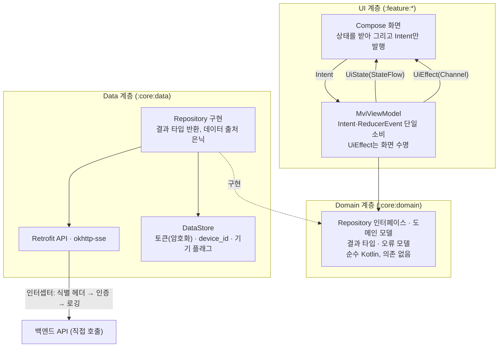

# 3-3-ANDROID-APP

이 문서는 **마냑 안드로이드 네이티브 앱의 플랫폼 구현 계약**을 정의합니다. 화면·사용자 흐름·API 계약 등 플랫폼 무관 스펙은 [`3-1-client.md`](./3-1-client.md)가 소유하며, 이 문서는 그 계약을 안드로이드 앱이 어떻게 충족하는지만 적습니다. 웹 구현의 병렬 문서는 [`3-2-web-app.md`](./3-2-web-app.md)입니다.

> **작성 상태** — 안드로이드 앱 확장은 **Phase 2** 범위입니다([`roadmap.md §R-4`](../planning/roadmap.md)). **아키텍처·내비게이션 게이트·인증 세션 프로토콜(§3-3-2~§3-3-4)은 구현을 착수할 만큼 확정됐습니다.** 다만 로그인 사용자 흐름을 완료하려면 로그인 전 열람 가능한 법적 문서(FE-SCREEN-010)의 콘텐츠 공급 방식을 먼저 확정해야 합니다. 화면별 전체 목표 범위, 디바이스 지원(§3-3-5), 관측의 화면별 이벤트·P0 수동 log 발화 목록(§3-3-6), 전체 화면 검수 범위(§3-3-7)는 아직 채워지지 않았습니다. 값이 없는 항목을 추측으로 채우지 않습니다.

```text
§3-3-1  문서 목적·범위와 관련 문서
§3-3-2  기술 환경·아키텍처와 요청 흐름  (빌드 환경·스택 확정 · 요청 흐름 작성 예정)
§3-3-3  내비게이션·화면 구조 대응       (그래프·메인 탭 셸 확정 · 화면별 전환 규칙 작성 예정)
§3-3-4  API 연동·인증 세션             (확정)
§3-3-5  디바이스 지원·접근성            (작성 예정)
§3-3-6  관측 연동                      (제품 선택·식별자 매핑 확정 · 배선 작성 예정)
§3-3-7  테스트·Definition of Done      (CI·도구 확정 · 검수 범위 작성 예정)
```

| 항목      | 값                                                             |
| --------- | -------------------------------------------------------------- |
| 버전      | v0.25                                                           |
| 작성일    | 2026-08-02                                                     |
| 수정일    | 2026-08-23                                                     |
| 대상      | 마냑 안드로이드 네이티브 앱 (`Phase 2`)                        |
| 작성 목적 | 안드로이드 앱의 플랫폼 구현·연동·검수 기준을 정의합니다.       |
| 기준 코드 | `../manyak-android` (Kotlin, Jetpack Compose)                  |

---

## 3-3-1. 문서 목적·범위와 관련 문서

### 목적

이 문서는 마냑 안드로이드 앱 개발자가 플랫폼 구현(내비게이션, API 연동, 인증 세션, 디바이스 대응, 관측, 테스트)을 결정하는 기준입니다. 화면·흐름·API 계약은 [`3-1-client.md`](./3-1-client.md)를 기준으로 구현하고, 이 문서는 안드로이드에서만 성립하는 계약을 더합니다.

### 앱은 로그인 필수입니다 — 공통 계약의 플랫폼 예외

**안드로이드 앱의 제품 기능은 로그인한 회원만 사용합니다**(2026-08-03 결정, 2026-08-22 재확인). 앱을 처음 실행하면 로그인 화면(앱 전용)이 뜨며, 로그인 전에는 그 화면과 로그인 동의에 필요한 **서비스이용약관·개인정보처리방침(FE-SCREEN-010)** 만 열람할 수 있습니다. 스토리·채팅·마이 등 제품 화면은 하나도 열 수 없습니다. 웹은 게스트 우선 모델을 그대로 유지하므로, 이 결정은 **웹과 앱의 제품 사용자 모델이 갈리는 유일한 지점**이자 이 문서 전체의 전제입니다.

그 결과 [`3-1-client.md`](./3-1-client.md)의 다음 계약은 **앱에 적용하지 않습니다**. 각 항목은 웹 전용으로 남고, 3-1에도 이 표를 가리키는 예외 표시를 둡니다.

| 3-1 계약 | 앱 비적용 사유 |
| --- | --- |
| FE-SCREEN-007 온보딩 | 로그인 화면(앱 전용)이 첫 실행 경험을 대체합니다(§3-3-3) |
| [§3-1-6](./3-1-client.md#3-1-6-게스트-데이터-모델) 게스트 데이터 모델 전체 | 게스트가 존재하지 않아 로컬 서재·사용량 카운터·배치 재조회·3-state 상태 판정이 모두 불필요합니다(§3-3-4) |
| 게스트 데이터 자동 이관(`POST /auth/migrate`) | 이관 대상인 로컬 게스트 데이터가 앱에 없습니다 |
| 402 응답의 게스트 분기(로그인 유도 다이얼로그) | 앱 사용자는 전원 회원이라 크레딧 부족 분기만 남습니다 |
| 게스트 체험 한도 선차단(로컬 카운터) | 위와 같음 |

**웹 게스트 데이터의 연속성은 앱에서 단절됩니다.** 웹에서 게스트로 만든 스토리는 그 브라우저에서 로그인해 이관해야 회원 서재에 들어오고, 앱은 회원 서재만 조회합니다. 앱이 별도 구제 경로를 제공하지 않는 것은 결정 사항입니다.

**결정 기록 — 앱은 게스트 모드를 두지 않습니다**

- **배경.** 웹과 같은 게스트 우선 모델을 앱에도 둘지가 갈림길입니다. 게스트 유입은 이미 웹이 담당하고 있습니다.

| 대안 | 채택 안 한 이유 |
| --- | --- |
| 앱도 게스트 우선 모델을 지원 | 로컬 서재·사용량 카운터·배치 재조회·깜빡임 없는 3-state 판정을 앱에 다시 구현해야 하고, 그 위에 자동 이관과 이관 1회 잠금까지 얹힙니다. 게스트 체험 한도가 `device_id`에 묶여 있어 구현 표면이 인증 전반으로 번집니다 |

- **영향.** 세션 상태에 게스트가 없어 판정이 **미확정 · 미로그인 · 회원**으로 단순해지고(§3-3-4), 내비게이션이 인증 그래프와 메인 그래프로 갈립니다(§3-3-3). 대신 앱 단독으로는 로그인 전 제품 체험이 불가능합니다. 법적 문서는 사용자 기능이 아니라 로그인 동의의 선행 열람 경로이므로 예외로 둡니다.

### 범위

- 기술 스택(Jetpack Compose 기반)과 요청 흐름
- 화면·내비게이션 구조와 공통 클라이언트 스펙([`3-1-client.md §3-1-3`](./3-1-client.md#3-1-3-화면별-스펙))의 대응 규칙, 플랫폼 구현 상태 매트릭스
- API 연동 방식과 인증 세션(토큰 보관·재발급)
- 디바이스 지원 범위, 접근성, 앱 라이프사이클 대응
- 관측(이벤트 발화 배선), 테스트 범위와 Definition of Done

### 제외 범위

- 화면별 스펙, 퍼널·채팅 흐름, 게스트 데이터 모델, API 사용 계약, 입력 검증 (담당: [`3-1-client.md`](./3-1-client.md))
- 백엔드 내부 구현과 API 상세 스키마 (담당: [`4-backend.md`](./4-backend.md))
- 이벤트 카탈로그, 식별자 정책, 지표 (원천: [`6-analytics.md`](./6-analytics.md))

### 관련 문서와 경계

| 문서                                   | 소유 영역                      | 이 문서와의 관계                   |
| -------------------------------------- | ------------------------------ | ---------------------------------- |
| [`3-1-client.md`](./3-1-client.md)     | 클라이언트 공통 화면·흐름·계약 | 이 문서가 구현하는 계약의 정본     |
| [`3-2-web-app.md`](./3-2-web-app.md)   | 웹 플랫폼 구현                 | 같은 공통 계약의 병렬 구현·선례    |
| [`4-backend.md`](./4-backend.md)       | API 명세, 데이터 모델          | API 상세를 위임                    |
| [`6-analytics.md`](./6-analytics.md)   | 이벤트·식별자·헤더·Sentry 기준 | 카탈로그는 위임, 발화 배선만 정의  |

### 웹 계약과의 대응 원칙

[`3-1-client.md`](./3-1-client.md)는 웹 구현을 기준 예시로 서술된 부분이 있습니다(플랫폼 표기 원칙). 안드로이드 앱은 같은 계약을 플랫폼 수단으로 충족하며, 확정 시 이 문서의 해당 절이 대응 규칙을 소유합니다. 예상되는 대응 지점 — 각 행의 상태는 해당 절이 소유합니다.

| 공통 계약(웹 기준 표기)                                        | 안드로이드 대응(이 문서가 확정할 것)                              |
| -------------------------------------------------------------- | ----------------------------------------------------------------- |
| URL 경로·히스토리(`push`/`replace`)                            | 인증·메인 그래프 분리와 라우트 규칙 확정. 화면별 전환 규칙·딥링크는 결정 필요 (§3-3-3) |
| 온보딩 진입 게이트(웹: 서버 프록시·쿠키)                       | **앱 비적용** — 로그인 화면이 첫 실행 경험을 대체합니다 (§3-3-1) |
| `localStorage` 게스트 서재·카운터·플래그, 상태 판정(SSR 3-state) | **앱 비적용** — 게스트가 없습니다. 세션 판정은 미확정·미로그인·회원 (§3-3-1 · §3-3-4) |
| BFF 프록시·httpOnly 쿠키 토큰 세션                             | 백엔드 직접 호출. 토큰은 Keystore로 암호화해 DataStore에 보관하고 데이터 계층 밖으로 내보내지 않음 (§3-3-2 · §3-3-4) |
| 소셜 로그인(웹: NextAuth OAuth 리다이렉트)                     | Credential Manager(구글) · Kakao SDK v2(카카오)로 ID 토큰을 얻어 직접 제출 (§3-3-4) |
| SSE 수신(웹: `fetch`+`ReadableStream`)                         | okhttp-sse — POST 본문을 실은 요청을 지원합니다 (§3-3-2) |
| 퍼널 이탈 가드(웹: `beforeunload`·히스토리 트래핑)             | 백 버튼·제스처 인터셉트, 라이프사이클 대응 (§3-3-5)               |
| 카카오톡 공유(웹: 카카오 JS SDK)                               | 카카오 공유 방식·SDK — 결정 필요 (§3-3-4)                         |
| 약관·개인정보처리방침 콘텐츠(웹: 웹 레포 TS 모듈)              | 루트의 공용 법적 문서 목적지로 로그인 전·후 열람. 콘텐츠 공급 방식은 미정이지만 **인증 사용자 흐름 완료의 필수 선행 조건**이며, 웹과 시행일·버전·본문 동일성 계약([`3-1-client.md`](./3-1-client.md) FE-SCREEN-010)은 준수 (§3-3-3) |
| 피드백 `platform: WEB`                                         | `platform: ANDROID` 고정 전송 (공통 계약 FE-SCREEN-006)           |
| 브라우저 지원·인앱 브라우저 감지 (앱은 개념 없음)              | OS 최소 버전·디바이스 지원 범위 (§3-3-5)                          |

---

## 3-3-2. 기술 환경·아키텍처와 요청 흐름

### 검증된 빌드 환경

기준 코드(`../manyak-android`)에서 확인된 값입니다(근거: `app/build.gradle.kts`, `gradle/libs.versions.toml`, `gradle/wrapper/gradle-wrapper.properties`, `gradle/gradle-daemon-jvm.properties`, `.github/workflows/android-ci.yml`).

| 분류                  | 값                                          |
| --------------------- | ------------------------------------------- |
| 언어                  | Kotlin 2.3.21                               |
| UI                    | Jetpack Compose(Compose BOM 2026.02.01), Material 3 |
| SDK                   | `compileSdk` 37 · `targetSdk` 37 · `minSdk` 24 |
| 빌드                  | Android Gradle Plugin 9.3.1, Gradle 9.5.0   |
| 빌드 JDK              | Java 25 — Gradle daemon toolchain(`gradle-daemon-jvm.properties` `toolchainVersion=25`), CI도 Temurin 25 사용 |
| Java 컴파일 호환성    | source/target 11 — 산출물의 바이트코드 타깃이며, 개발·빌드에 쓰는 JDK 버전(위 Java 25)과 다른 값입니다 |
| 정적 검사             | ktlint, detekt, Android lint                |
| 단위 테스트           | JUnit                                       |
| UI 테스트 기반        | Compose UI Test, Espresso                   |

### 확정 스택

도입 버전은 구현 시점의 안정판을 쓰고 `gradle/libs.versions.toml`이 정본이 됩니다. 이 표는 **무엇을 쓰는지와 그 이유**만 고정합니다.

| 분류 | 선택 | 선택 이유 |
| --- | --- | --- |
| UI 상태 관리 | **직접 구현 MVI**(`MviViewModel` 베이스 클래스) | 프레임워크 없이 `UiState`·`Intent`·`ReducerEvent`·`UiEffect` 네 요소와 단일 소비·overflow 계약을 베이스 클래스가 강제합니다(아래 UI 상태 모델) |
| 의존성 주입 | **Hilt** | 컴파일 타임에 의존 그래프 오류를 잡고, ViewModel 생성 배선과 테스트 대역 교체의 표준 경로를 제공합니다. 애너테이션 처리는 KSP로 돌립니다 |
| 내비게이션 | **Navigation 3**(`NavKey` 백스택) | 백스택이 앱이 소유한 리스트라, 탭별 백스택과 뒤로가기 계약을 프레임워크의 되감기 옵션 조합이 아니라 리스트 구성으로 표현합니다(§3-3-3 메인 탭 셸). 딥링크 선언 API가 없는 대신 App Link 매핑을 직접 소유합니다(아래 결정 기록) |
| HTTP·직렬화 | **Retrofit + OkHttp + kotlinx.serialization** | 인터셉터가 토큰 주입·식별 헤더·로깅의 단일 지점이 되고(§3-3-4), SSE도 같은 클라이언트 위에서 해결됩니다 |
| SSE | **okhttp-sse** | 채팅 턴은 POST 본문을 실은 요청의 응답을 SSE로 받는 계약이라([`3-1-client.md §3-1-5`](./3-1-client.md#3-1-5-채팅-플레이와-sse-스트리밍)) GET 전용 클라이언트를 쓸 수 없습니다. 이미 쓰는 OkHttp의 검증된 파서를 재사용합니다 |
| 로컬 저장(설정·토큰) | **DataStore** | 토큰·`device_id`·기기 플래그는 키-값이거나 단일 레코드라 질의가 필요 없습니다. 토큰은 저장 전에 암호화합니다(§3-3-4) |
| 이미지 로딩 | **Coil** | Compose 전용 API로 placeholder·실패 처리 계약을 그대로 구현합니다 |
| 소셜 로그인 | **Credential Manager**(구글) · **Kakao SDK v2**(카카오) | §3-3-4 |
| 분석 | **Amplitude Android SDK** | 이벤트 지표의 정본이 Amplitude입니다([`6-analytics.md §6-5`](./6-analytics.md)). 공통 이벤트 카탈로그를 재사용하며 플랫폼별로 이벤트를 새로 만들지 않습니다 |
| 크래시 | **Firebase Crashlytics** | Kotlin/JVM fatal·non-fatal과 Android 11+ ANR을 수집합니다. 제품 분석은 Amplitude만 쓰고 Crashlytics 로그는 수동 배선합니다. 범위와 공백은 아래 결정 기록에 고정합니다 |
| 컬렉션 불변성(선택) | **필요한 `UiState`에 `kotlinx.collections.immutable`** | 가변 alias를 컴파일 타임에 막아야 하는 상태에 선택 적용합니다. 모든 `List`를 일괄 변환하거나 skippability만을 이유로 필수화하지 않습니다(아래 UI 상태 모델) |

**백엔드는 직접 호출합니다.** 웹의 BFF 프록시에 대응하는 중간 계층을 두지 않습니다 — 웹이 프록시를 둔 이유는 브라우저 JS에 토큰을 노출하지 않기 위해서인데([`3-2-web-app.md §3-2-4`](./3-2-web-app.md#3-2-4-bff-프록시토큰-세션)), 앱은 토큰을 데이터 계층 안에 가둘 수 있어 같은 목적을 프록시 없이 달성합니다(§3-3-4).

**도입하지 않는 것** — MVI 프레임워크(직접 구현 — 아래 UI 상태 모델), BFF 대응 계층(위).

**결정 기록 — 내비게이션은 Navigation 3(2026-08-23)**

- **배경.** 하단 탭 셸을 붙이면서 갈림길이 드러났습니다. Navigation Compose에서 셸의 뒤로가기 계약은 `popUpTo`·`saveState`·`restoreState`·`launchSingleTop`의 조합으로만 존재하는데, 옵션 하나 차이가 "홈으로 복귀"와 "앱 종료"를 가르면서도 호출부를 읽어서는 어느 쪽인지 알 수 없습니다. 계약이 코드에 드러나지 않으면 검수 항목으로만 지켜집니다.

| 대안 | 채택 안 한 이유 |
| --- | --- |
| Navigation Compose를 유지한다 | 탭별 상태 보존이 되감기 옵션의 부수효과가 됩니다. 셸이 소유해야 할 계약이 프레임워크 내부 동작에 흩어집니다 |
| 목적지가 늘어난 뒤에 옮긴다 | 옮길 목적지와 그 사이 이동 규칙이 함께 늘어납니다. 목적지가 다섯인 지금이 전환 비용이 가장 낮습니다 |

- **영향.** 백스택은 `NavKey` 리스트로 앱이 소유하고 화면 전환은 리스트 조작이 됩니다. 인증·메인은 서로 다른 백스택 인스턴스가 되고, 탭별 백스택과 뒤로가기 규칙은 §3-3-3 메인 탭 셸이 소유합니다. 라우트 인자는 목적지 키 자체로 전달되므로 ViewModel이 저장 상태에서 라우트를 되읽지 않습니다.
- **잃는 것 — 딥링크 선언.** 목적지별 딥링크 선언 API가 없습니다. App Link를 도입할 때 URI를 `NavKey` 목록으로 바꾸는 매핑을 `:core:navigation`이 직접 소유해야 하고, 그 매핑 규칙은 딥링크 처리 방식을 확정할 때 함께 정합니다(§3-3-3).

### 계층과 책임

계층은 **UI · Domain · Data** 셋입니다. 다만 Domain은 **Repository 인터페이스와 도메인 모델, 결과·오류 타입만 담는 얇은 계층**이며, UseCase 전면 도입과 DDD는 하지 않습니다(아래 결정 기록).



| 계층 | 책임 | 금지 |
| --- | --- | --- |
| Compose 화면 | 상태 렌더, 사용자 입력을 Intent로 발행 | 화면이 직접 데이터를 조회하지 않습니다(`MUST NOT`) |
| `MviViewModel` | `onIntent`로 입력 수신, 부수효과 수행, `ReducerEvent` 발행으로 상태 갱신 | Retrofit·DataStore를 직접 호출하지 않습니다(`MUST NOT`). `reduce` 안에서 부수효과를 수행하지 않습니다(`MUST NOT`) |
| Repository 인터페이스(domain) | 화면이 필요로 하는 데이터 동작의 계약 | 구현 수단(Retrofit·DataStore)을 노출하지 않습니다(`MUST NOT`) |
| Repository 구현(data) | 네트워크·로컬 접근, 응답을 결과 타입으로 변환 | UI 개념(문구·표시 상태)을 알지 않습니다(`MUST NOT`) |

**Repository는 인터페이스와 구현을 나눕니다**(`MUST`). ViewModel은 `:core:domain`의 인터페이스만 알고 구현은 `:core:data`가 제공합니다. 의존 역전으로 화면 계층이 네트워크 구현을 모르게 되어 테스트에서 가짜 구현을 끼울 수 있고, 모듈이 나뉘어 있으므로 `:feature:*`가 `:core:data`를 의존하지 않는 한 **구현 클래스에 접근할 수조차 없습니다**(아래 모듈 구조).

**결정 기록 — Clean Architecture를 전면 도입하지 않습니다(2026-08-22)**

- **배경.** 계층을 나누기로 한 이상 UseCase 계층과 계층별 모델 이중화까지 갈지가 갈림길입니다. 이 제품은 **도메인 규칙(크레딧 차감·체험 한도·소유권·멱등·엔딩 판정)이 전부 백엔드에 있습니다**([`4-backend.md`](./4-backend.md)).

| 대안 | 채택 안 한 이유 |
| --- | --- |
| UseCase 계층을 기본으로 둔다 | 규칙이 서버에 있어 대부분의 UseCase가 Repository 호출을 한 줄 위임하는 껍데기가 됩니다. 파일과 타입만 늘고 읽는 사람이 한 단계를 더 거칩니다 |
| 응답 모델을 계층마다 이중화한다(DTO ↔ 도메인 모델 기계적 매핑) | 서버 응답과 화면이 쓰는 모양이 같은 경우가 대부분이라, 매핑 코드가 필드를 그대로 옮기는 반복이 됩니다 |

- **영향.** 다음 조건에서만 예외를 둡니다(`SHOULD`).
    - **UseCase 추출** — 같은 로직을 ViewModel 두 곳 이상에서 쓰거나, ViewModel 하나가 Repository 셋 이상을 조율할 때.
    - **별도 도메인 모델** — 여러 응답을 합치거나, 화면이 쓰기에 응답 구조가 불편하거나, 서버 계약 변경으로부터 화면을 격리해야 할 때.
- 이 예외 조건을 만족하지 않는데 만든 UseCase·매핑은 리뷰에서 되돌립니다.

### 모듈 구조

**첫 기능부터 멀티 모듈 경계를 적용하되, 최종 모듈을 한 번에 만들지는 않습니다.** 계층 경계를 컴파일러가 강제하게 하고 프로젝트가 비어 있는 지금이 전환 비용이 가장 낮은 시점이기 때문입니다(아래 결정 기록). **`feature`는 화면 단위로 나눕니다**(`MUST`) — 모듈 이름이 화면·탭 이름과 1:1로 맞아 어디를 고칠지 이름만 보고 찾습니다. **화면은 모듈 루트 패키지에 두고 하위 패키지를 만들지 않습니다**(`MUST NOT`) — 모듈이 곧 화면이라 한 겹이 더 있으면 경로만 길어집니다.

아래 목록은 **최종 목표 구조**이며 첫 변경의 `settings.gradle.kts` 완성본이 아닙니다.

```kotlin
// settings.gradle.kts
include(":app")               // Application · MainActivity(단일) · 루트 컴포저블 · DI 진입

include(":core:domain")       // 순수 Kotlin — 도메인 모델 · Repository 인터페이스 · 결과 타입·오류 모델
include(":core:common")       // 순수 Kotlin — 오류 판정 헬퍼 · 디스패처 · 확장 함수
include(":core:data")         // Repository 구현 · Retrofit API · SSE · DataStore · 인터셉터 · DI 모듈
include(":core:ui")           // 디자인 시스템 · 공용 컴포저블 · MviViewModel · 문자열 리소스 전량
include(":core:analytics")    // Amplitude 배선 · 이벤트 발화 헬퍼
include(":core:navigation")   // 타입 안전 라우트·화면 결과 계약의 단일 등록처

include(":feature:login")     // 로그인 화면(앱 전용)
include(":feature:legal")     // FE-SCREEN-010 약관·개인정보처리방침(인증·메인 공용)
include(":feature:home")      // FE-SCREEN-001 스토리 목록 — 홈 탭
include(":feature:chat")      // FE-SCREEN-004 채팅 목록 — 채팅 탭
include(":feature:my")        // FE-SCREEN-008 마이 — 마이 탭
include(":feature:create")    // FE-SCREEN-002 생성 퍼널
include(":feature:story")     // FE-SCREEN-003 스토리 상세
include(":feature:chatroom")  // FE-SCREEN-005 채팅 화면
include(":feature:feedback")  // FE-SCREEN-006
include(":feature:about")     // FE-SCREEN-011 서비스 안내
include(":feature:share")     // FE-SCREEN-012 채팅 공유 열람
```

**결정 기록 — feature 모듈을 화면 단위로(2026-08-23)**

- **배경.** 처음에는 도메인 단위(`:feature:story`가 홈·상세·퍼널을 함께 가짐)로 잡았습니다. 메인 탭 셸을 만들며 홈 탭 화면이 `:feature:story` 안에 들어가자, 모듈 이름과 화면 이름이 어긋나 어디를 열어야 할지 이름만으로는 알 수 없다는 점이 드러났습니다.

| 대안 | 채택 안 한 이유 |
| --- | --- |
| 도메인 단위 유지(`:feature:story` = 홈 · 상세 · 퍼널) | 모듈 이름이 화면 이름과 맞지 않습니다. 홈 탭을 고치러 `story`를 열고, 그 안에서 다시 `home` 하위 패키지를 찾아야 합니다 |
| 도메인 모듈 유지 + 이름만 탭 이름으로 | `:feature:home` 안에 스토리 상세가 들어가 이름이 더 어긋납니다 |

- **영향.** **모듈 수가 늘어납니다.** 그리고 `:feature:*`끼리 직접 참조할 수 없으므로(아래 의존 방향 규칙), 목록 → 상세 → 퍼널처럼 이어지는 화면 사이의 이동과 공유 로직은 **전부 `:core:navigation`·`:core:ui`를 거쳐야 합니다.** 도메인 단위였다면 같은 모듈 안에서 해결됐을 것들입니다. 이 비용을 감수하는 대신 모듈 경계가 화면 경계와 같아져, 화면 하나를 고칠 때 열어야 할 모듈이 하나로 정해집니다.
- **빈 모듈은 여전히 만들지 않습니다**(`MUST NOT`). 위 목록은 목표 구조이고, 각 모듈은 그 화면을 실제로 만들 때 생깁니다.

#### 모듈 도입 순서

빈 모듈·빈 DI 모듈·미래용 의존성만 미리 추가하지 않습니다(`MUST NOT`). 각 단계는 하나의 실행 가능한 세로 흐름을 끝내고 검증한 뒤 다음 단계로 갑니다.

| 단계 | 새로 만드는 모듈 | 끝내는 세로 흐름·종료 조건 |
| --- | --- | --- |
| 1. 인증 경계 | `:core:domain` · `:core:data` · `:core:ui` · `:core:navigation` · `:feature:login` · `:feature:legal` · `:feature:my`; 실제 공통 helper가 생길 때 `:core:common` | 앱 시작 → 로그인 전 약관/개인정보처리방침 → 가짜/개발 provider 로그인 → 회원 마이 → 로그아웃. 세션 그래프와 계층 의존 테스트가 통과해야 합니다. 공용 법적 문서는 어느 제품 그래프에도 의존하지 않아야 하고, 이 단계의 임시 마이 시작 목적지는 출시 구성이 아닙니다 |
| 2. 메인 탭 셸 | `:feature:home`(홈 골격) · `:feature:chat`(채팅 목록 골격) | 로그인 → 홈·채팅·마이를 하단 탭으로 오가기 → 탭을 옮겼다 돌아와도 화면 상태 유지 → 홈에서 뒤로가기로 앱 종료(§3-3-3 메인 탭 셸). 두 새 모듈은 콘텐츠 없는 탭 화면을 하나씩만 담습니다 |
| 3. 회원 홈 tracer bullet | `:core:analytics` | 실제 API 로그인 → 프로필 복원 → 회원 스토리 목록을 홈 시작 목적지로 표시 → 앱 재실행 복원. P0 Amplitude·Crashlytics 배선과 release 매핑 검수를 함께 끝냅니다 |
| 4. 제작·플레이 | `:feature:story`(상세) · `:feature:create`(생성 퍼널) · `:feature:chatroom`(채팅 화면) | 목록 → 상세 → 채팅 생성/스트리밍과 확정된 제작 퍼널 범위. `okhttp-sse`는 첫 스트리밍 소비자와 함께 추가합니다 |
| 5. 나머지 목표 범위 | 피드백이 목표에 들어올 때 `:feature:feedback`, 서비스 안내가 들어올 때 `:feature:about` 등 화면별로 하나씩 | §3-3-3에서 확정된 Android 목표 범위만 구현. 목표에서 빠진 feature 모듈은 만들지 않습니다 |

각 단계에서 `settings.gradle.kts`에는 그 단계에 실제 코드·리소스·테스트 소비자가 있는 모듈만 선언합니다. 공통으로 보이는 코드도 두 번째 소비자가 생기기 전에는 성급히 `:core:*`로 내리지 않습니다. 단계별 종료 시 의존 방향 검사와 해당 tracer의 단위/UI 테스트를 통과해야 합니다. **셸 단계의 탭 화면은 빈 모듈이 아닙니다** — 두 모듈 모두 도달 가능한 목적지를 하나씩 갖고 셸이 그 목적지를 소비합니다. 셸을 홈 tracer bullet보다 앞에 둔 이유는 홈·채팅·제작 퍼널이 모두 같은 chrome 위에 얹히기 때문입니다. 각 기능이 셸을 따로 만들면 세 벌이 갈라지고, 나중에 합치려면 세 화면을 모두 고쳐야 합니다.

**`:core:domain`과 `:core:common`은 `kotlin-jvm` 모듈입니다**(`MUST`). 안드로이드 플러그인을 적용하지 않아 `Context`·`Uri` 같은 프레임워크 참조가 **컴파일 에러**가 됩니다. 코루틴(`Flow`)은 안드로이드 의존이 아니므로 허용합니다.

`:core:data` 내부는 관심사별로 패키지를 나눕니다 — `api`(Retrofit 인터페이스·응답 모델), `sse`(스트리밍 수신), `datastore`(Preferences·암호화 토큰), `repository`(구현), `di`(Hilt 모듈), `interceptor`(식별 헤더·인증·로깅).

**`@HiltViewModel`·`@Module`이 있는 모듈마다 Hilt 플러그인과 KSP를 적용합니다**(`MUST`) — `:app`에만 두면 다른 모듈의 애너테이션이 처리되지 않습니다. `@HiltAndroidApp`은 `:app`에만 둡니다.

#### 의존 방향 규칙

- **`:core:domain`은 아무것도 의존하지 않습니다**(`MUST`). 의존 그래프의 바닥이며, Repository 인터페이스가 반환하는 결과 타입·오류 모델도 이 모듈이 소유하기 때문에 이 규칙이 성립합니다.
- `:core:common`은 **`:core:domain`만** 의존합니다(`MUST`).
- 그 외 `:core:*`(`data`·`ui`·`analytics`·`navigation`)는 **`:core:domain`·`:core:common`** 을 의존할 수 있습니다(`MUST`).
- **`:core:*`끼리의 그 밖의 참조는 금지합니다**(`MUST`). `:core:analytics` → `:core:data`, `:core:ui` → `:core:navigation` 같은 참조가 대상이며, `:core:analytics`가 필요로 하는 `device_id`는 DI 배선에서 주입받습니다(§3-3-4). 예외가 필요하면 결정 기록을 남깁니다.
- `:feature:*`는 `:core:*`를 의존하되 **구현이 있는 `:core:data`는 의존하지 않습니다**(`MUST`). ViewModel이 Repository 인터페이스만 알아야 하므로 `:core:domain`은 포함되고, 구현 주입은 `:app`의 Hilt 배선이 담당합니다.
- **`:feature:*`끼리 직접 참조하지 않습니다**(`MUST`). 화면 이동은 `:core:navigation`을 거치고, 공유 로직은 `:core:*`로 내립니다.
- **`:core:*`는 `:feature:*`를 알지 않습니다**(`MUST`). 의존은 항상 `feature → core` 단방향입니다.
- 모든 모듈을 의존하는 것은 **`:app` 하나**입니다.

**강제 수준은 규칙마다 다릅니다.** `:core:domain`·`:core:common`의 순수 Kotlin 규칙만 컴파일러가 절대적으로 막고, 나머지는 모듈 의존 선언이 1차 방어입니다 — 뚫으려면 `build.gradle.kts`에 한 줄을 추가해야 하고 그 줄이 PR diff에 드러납니다. 단일 모듈의 import 한 줄보다 강하지만 절대적이지는 않으므로 코드 리뷰가 2차 방어로 남습니다.

**결정 기록 — 처음부터 멀티 모듈로 구성(2026-08-22)**

- **배경.** 단일 모듈로 시작해 나중에 쪼갤지, 처음부터 나눌지가 갈림길입니다. 기준 코드는 현재 `:app` 하나뿐이고 화면 코드가 사실상 없습니다.

| 대안 | 채택 안 한 이유 |
| --- | --- |
| 단일 모듈로 시작하고 출시 후 전환 | 지금이 **옮길 코드가 거의 없는, 영구적으로 가장 싼 시점**입니다. 미루면 화면 10여 개와 테스트를 옮겨야 하고, 그 시점에는 다른 기능이 함께 얹혀 있어 실제로는 수행되지 않을 가능성이 큽니다 |
| feature마다 4계층(entity·data·domain·presentation)으로 다시 나눔 | 도메인 규칙이 전부 백엔드에 있어 feature별 domain·data 계층이 거의 빕니다(위 계층과 책임의 결정 기록과 같은 이유). 모듈 수만 늘고 관리 비용이 남습니다 |
| Gradle 규약 플러그인 동시 도입 | 이 규모에서는 모듈별 빌드 스크립트 복제 관리가 더 쌉니다. 모듈이 늘거나 버전 갱신 부담이 커지는 시점에 도입합니다 |

- **영향.** `:core:domain`이 `kotlin-jvm` 모듈이 되어 안드로이드 프레임워크 참조가 컴파일 에러가 됩니다 — 코드 리뷰가 지키던 규칙이 컴파일러 강제로 내려갑니다. 대신 Hilt·KSP가 모듈마다 실행되어 clean build가 느려집니다(증분 빌드는 빨라집니다). Version Catalog(`libs.versions.toml`)는 모든 모듈이 공유합니다.

### 의존성 주입 구성

Hilt 컴포넌트는 **앱 수명과 화면 수명 둘만** 씁니다(`SingletonComponent` · `ViewModelComponent`). **로그인 세션 수명의 커스텀 컴포넌트를 만들지 않습니다**(`MUST NOT`).

그 대신 **사용자에게 귀속된 상태를 가진 싱글턴은 각자 정리 동작을 제공하고, 중앙 세션 종료 흐름이 이를 조합합니다**(`MUST`, §3-3-4 로그아웃 절차). 토큰 저장소·프로필 보관소·이후 추가될 캐시가 모두 이 계약의 대상입니다.

여러 `:core:*`를 함께 알아야 하는 `SessionTerminationCoordinator` 구현은 **composition root인 `:app`이 소유**합니다(`MUST`). `:feature:*`는 `:core:domain`의 세션 Repository 계약만 호출하고, `:app`이 `:core:data`의 토큰·캐시·공급자 어댑터와, `:core:analytics`가 도입된 단계부터 그 모듈의 식별자 정리를 조합해 계약에 바인딩합니다. 따라서 `:core:data`가 `:core:analytics`나 내비게이션을 참조하지 않으며, 종료 완료 뒤에는 이동 명령 대신 세션 상태만 발행해 루트가 그래프를 바꿉니다.

**새로 추가되는 사용자 귀속 저장소가 이 계약에 참여하지 않으면 리뷰에서 드러나야 합니다**(`MUST`). 정리 대상이 한 곳에 나열되어 있으므로 목록에 없는 저장소는 diff에서 눈에 띕니다.

**결정 기록 — 세션 스코프 컴포넌트를 두지 않습니다(2026-08-22)**

- **배경.** 로그아웃 때 토큰만 지워서는 부족하고 사용자 귀속 메모리 캐시도 버려야 합니다. 그 수단이 갈림길입니다.

| 대안 | 채택 안 한 이유 |
| --- | --- |
| 커스텀 세션 스코프 컴포넌트를 만들어 로그아웃 시 컴포넌트째 버린다 | 구조적으로는 더 깔끔하지만 Hilt에서 컴포넌트를 수동으로 만들고 수명을 관리해야 하며, 주입 지점마다 어느 컴포넌트에 속하는지를 계속 판단해야 합니다. **무엇보다 정리 대상이 코드에 드러나지 않아** 빠뜨린 저장소가 조용히 남습니다 |

- **영향.** 정리 항목이 늘 때마다 중앙 종료 흐름에 **손으로 추가해야 합니다.** 누락 위험이 있는 대신 그 위험이 리뷰에서 보이는 형태로 남습니다. 정리 순서를 명시적으로 통제할 수 있는 것은 부수 이득입니다(§3-3-4 로그아웃 절차는 순서가 계약입니다).

### 오류 표현과 문자열 위치

**문자열 리소스는 `:core:ui`에 전량 모읍니다**(`MUST`). 순수 Kotlin 모듈(`:core:domain`·`:core:common`)은 안드로이드 리소스에 접근할 수 없으므로, 이 배치가 곧 **"Repository 구현은 UI 문구를 알지 않는다"를 컴파일러가 강제**하는 장치가 됩니다. 나중에 다국어를 추가할 때 파일이 흩어지지 않는 것도 이득입니다.

대가는 있습니다 — 화면을 추가할 때마다 `:core:ui`를 건드려 재컴파일 범위가 넓어지고, `:feature:*`가 자기 문자열을 소유하지 못합니다. 이 비용을 수용합니다.

그 귀결로 **오류가 모듈을 지나는 경로가 고정됩니다.**

| 단계 | 모듈 | 하는 일 |
| --- | --- | --- |
| 1 | `:core:domain` | 오류를 **타입으로 정의**합니다(결과 타입·오류 모델). 문구를 모릅니다 |
| 2 | `:core:data` | 와이어 응답(`ApiErrorResponse`)을 **오류 타입으로 변환**합니다. 와이어 DTO는 이 모듈 밖으로 나가지 않습니다(`MUST NOT`) |
| 3 | `:core:common` | 오류 타입 기반 **공통 판정 헬퍼**(402 크레딧 부족 판정 등). 와이어도 문구도 모릅니다 |
| 4 | `:core:ui` | 오류 타입을 **문자열 리소스로 변환**합니다 |

**Domain·Data는 안내와 화면 이동을 요청하지 않습니다**(`MUST NOT`). 두 계층은 타입으로 된 결과와 오류만 반환하고, 사용자에게 무엇을 보여 주거나 어디로 이동할지는 그 결과를 받은 `:feature:*` ViewModel이 결정합니다. 화면 수명 효과는 아래 `UiEffect`로 전달하며, 타입 안전 라우트와 화면 결과 타입만 `:core:navigation`이 소유합니다. 앱 전체의 인증 그래프 전환은 일회성 이동 효과가 아니라 중앙 세션 상태를 루트가 관찰해 결정합니다.

#### 오류 변환과 재시도

- **변환 지점은 `:core:data` 한 곳입니다**(`MUST`). 네트워크·HTTP·파싱 실패를 여기서 오류 타입으로 바꾸고, 상위 계층은 예외가 아니라 결과 타입으로 받습니다.
- **재시도는 한 계층에만 둡니다**(`MUST NOT` 중복 배치). 데이터 계층과 ViewModel 양쪽에 재시도를 두면 사용자가 기다리는 시간이 곱해집니다.
- **취소(`CancellationException`)를 일반 실패로 삼키지 않습니다**(`MUST NOT`). 화면 이탈로 취소된 작업이 실패 토스트를 띄우면 안 됩니다.
- **인증 API에는 자동 재시도를 두지 않습니다**(`MUST NOT`). 로그인·연동은 멱등성 계약이 없는 쓰기입니다. 토큰 재발급의 재시도 규칙은 §3-3-4가 따로 정합니다.
- 읽기 요청은 공통 계약대로 자동 재시도·복귀 자동 재조회 없이 오류를 상태로 반환하고, 화면이 인라인으로 처리합니다([`3-1-client.md §3-1-7`](./3-1-client.md#3-1-7-api-연동에러-처리-계약)).

### UI 상태 모델

모든 화면은 `:core:ui`의 **`MviViewModel<I, S, E, F>` 베이스 클래스를 상속합니다**(`MUST`). 네 요소는 다음과 같습니다.

| 요소 | 뜻 | 규칙 |
| --- | --- | --- |
| `UiState`(S) | 화면이 그리는 **불변 스냅숏** | 재구독자는 항상 최신값을 받습니다. 모든 필드는 `val`이고 컬렉션 인스턴스를 제자리에서 변경하지 않습니다(`MUST`) |
| `Intent`(I) | 사용자·시스템 입력 | 화면은 **Intent 발행만** 합니다. 상태를 직접 바꾸거나 Repository를 부르지 않습니다(`MUST NOT`) |
| `ReducerEvent`(E) | 상태를 바꾸는 사건 | `reduce(state, event)`는 **순수 함수**입니다. 그 안에서 부수효과를 수행하지 않습니다(`MUST NOT`) |
| `UiEffect`(F) | 화면 이동·스낵바처럼 한 번만 소비하는 **화면 수명 출력** | `UiState`에 넣거나 재구독자에게 replay하지 않습니다. 화면 호스트 하나만 소비합니다 |

흐름은 `onIntent` → (필요하면 부수효과 수행) → `dispatch(ReducerEvent)` → `reduce` → 새 `UiState` 방출입니다. 부수효과는 `onIntent` 쪽에 있고 `reduce`는 상태 전이만 합니다. 따라서 reducer 단위 테스트는 입력·출력 대조로 작성하고, ViewModel 계약 테스트는 Intent→ReducerEvent/UiEffect 배선과 아래 큐·취소 규칙을 별도로 검증합니다(§3-3-7).

`List<T>`는 허용합니다. 다만 생산자가 가변 리스트의 alias를 보관한 채 나중에 수정하지 않도록 새 불변 스냅숏으로 복사하고, 상태 변경은 새 `UiState` 인스턴스로만 표현합니다(`MUST`). `ImmutableList`·`PersistentList`는 여러 계층이 같은 컬렉션을 오래 공유하거나, 컴파일 타임에 구조적 불변성을 강제해야 할 때 선택합니다(`SHOULD`).

Kotlin 2.3은 strong skipping이 기본인 범위에 있고, strong skipping에서는 unstable 파라미터도 skippable이며 인스턴스 동일성(`===`)으로 비교합니다([Android 공식 문서](https://developer.android.com/develop/ui/compose/performance/stability/strongskipping)). 따라서 “`List`라서 무조건 skip 불가”를 라이브러리 의무화 근거로 쓰지 않습니다. 실제 재구성 문제가 보이면 Compose compiler report·Layout Inspector/프로파일링으로 원인을 확인한 뒤 immutable collection, UI wrapper, stability configuration 중 최소 수단을 고릅니다. 구조적 불변성 자체가 필요한 경우에는 성능 측정과 무관하게 immutable collection을 선택할 수 있습니다.

#### 큐와 소비 계약

- `Intent`와 `ReducerEvent`는 각각 베이스 클래스가 소유하는 **용량 64의 bounded `Channel`** 로 받고, overflow는 `SUSPEND`입니다(`MUST`). `DROP_OLDEST`·`DROP_LATEST`와 `trySend` 실패 무시는 금지합니다. `CHANNEL_CAPACITY = 64`는 베이스 클래스 한 곳에 두고 화면별로 바꾸지 않습니다.
- 각 채널은 **소비 코루틴 하나만** 둡니다(`MUST`). Intent는 수신 순서대로 `onIntent`에 전달하고, 동시 부수효과가 완료해 만든 ReducerEvent도 큐에 들어온 순서대로 하나씩 `reduce`합니다. 어떤 경로도 `MutableStateFlow.value`를 직접 변경하지 않습니다.
- `onIntent`가 긴 작업을 직접 기다려 다음 입력을 막지 않도록, 병렬성이 필요한 작업만 ViewModel 스코프 자식 작업으로 명시적으로 시작합니다. 중복 실행을 막아야 하는 버튼·요청은 `UiState`의 진행 상태와 작업 키로 단일 비행을 강제합니다.
- `UiEffect`도 **용량 64의 `Channel` + `receiveAsFlow()`** 로 전달하고 overflow는 `SUSPEND`, replay는 0입니다. 화면 호스트 하나가 `repeatOnLifecycle(STARTED)`에서 수집하며 같은 ViewModel의 효과 수집기를 둘 이상 만들지 않습니다(`MUST`). 화면이 일시 정지된 동안의 미소비 효과는 채널에 남고, 이미 소비한 효과는 재수집에 다시 나오지 않습니다. 화면이 영구 이탈해 ViewModel이 정리되면 남은 효과도 함께 취소됩니다.
- 화면이 사라진 뒤에도 반드시 완료·관찰되어야 하는 결과는 `UiEffect`가 아닙니다. 로그아웃·인증 그래프처럼 앱 전체에 영향을 주는 것은 앱 스코프의 **지속 상태**로 모델링하고 명시적으로 확인(acknowledge)될 때까지 유지합니다. 이 구분으로 오래된 화면의 이동·스낵바가 새 화면에서 뒤늦게 실행되는 것을 막습니다.

화면 이동 효과는 화면 호스트가 소비한 뒤 앱이 주입한 타입 안전 콜백으로 올립니다. 백스택이나 그 조작 수단을 ViewModel·Domain·Data에 주입하지 않습니다(`MUST NOT`).

#### 코루틴·Flow 사용 원칙

- **작업의 수명을 먼저 정합니다.** 화면이 사라지면 의미가 없는 작업은 ViewModel 스코프에, **화면 이탈로 중단되면 안 되는 작업은 앱 스코프**에 둡니다(`MUST`). 후자의 대표가 로그아웃 절차입니다(§3-3-4) — 화면 스코프에서 실행하면 부분 정리 상태가 남습니다.
- **무거운 작업의 dispatcher는 호출된 쪽이 정합니다**(`MUST`). 암복호화·IO를 수행하는 함수가 스스로 dispatcher를 지정해, 호출자가 추측하지 않아도 안전하게 실행되게 합니다. 테스트에서 교체할 수 있도록 주입받습니다.
- **지속 상태는 재구독자에게 최신값을 제공합니다**(`MUST`). `stateIn`·`shareIn`을 쓸 때는 스코프·시작 방식·구독자 부재 시 유지 시간을 명시합니다.
- **유실되면 안 되는 사건을 전달 보장 없는 Flow에 두지 않습니다**(`MUST NOT`).

**결정 기록 — UI 상태 관리를 프레임워크 없이 직접 구현(2026-08-22)**

- **배경.** 화면마다 상태·입력·부수효과 배선이 제각각이 되는 것을 막는 방법이 갈림길입니다. 5개 feature를 짧은 기간에 만들면서 편차가 생기면 나중에 통일하는 비용이 큽니다.

| 대안 | 채택 안 한 이유 |
| --- | --- |
| MVI 프레임워크(Orbit 등) 도입 | 실제로 제공하는 것은 사이드이펙트 전달·`reduce` 직렬화·라이프사이클 인지 수집이고, 위 단일 소비 채널 계약을 가진 작은 베이스 클래스로 구현되는 범위입니다. 반면 프레임워크가 타입으로 강제하는 것은 State와 SideEffect뿐이라 **Intent 개념이 없어** 네 요소의 균일성은 어차피 팀 규칙이 만듭니다. 메이저 버전 간 타입 개명 같은 마이그레이션 부담도 실재합니다 |
| ViewModel + `StateFlow`만 사용(베이스 클래스 없음) | ReducerEvent 직렬화·효과 채널·라이프사이클 인지 수집·인텐트 디스패처를 화면마다 다시 작성해 편차가 생깁니다. 베이스 클래스 하나로 막을 수 있는 편차입니다 |

- **영향.** 화면마다 `UiState`·`Intent`·`ReducerEvent`·`UiEffect`를 정의해야 해서 순수 `StateFlow`보다 타입과 파일이 늘어납니다. 효과가 없는 화면은 `UiEffect`를 `Nothing`으로 둡니다. 대신 직렬화·overflow·소비 수명 배선이 베이스 클래스 한 곳에 모여 화면 코드가 얇아집니다. 재검토 조건 — 화면 수가 늘어 베이스 클래스만으로 편차를 못 막거나 KMP 공유가 요구되면 프레임워크 도입을 다시 봅니다.

### 아직 결정하지 않은 것 — `결정 필요`

- **로컬 캐시용 DB(Room 등)** — 본인 리소스 캐시를 둘지, 둔다면 무엇을 얼마나 보관할지가 정해지지 않았습니다. 캐시 정책 없이 저장 기술만 고르면 근거가 없으므로 함께 확정합니다. 로그인 흐름에는 필요하지 않습니다. 다만 도입한다면 **사용자 귀속 저장소이므로 세션 종료 정리 계약에 참여해야 합니다**(§3-3-4 로그아웃 절차).
- **백그라운드 작업 수단**(WorkManager·Foreground Service) — 스토리 생성 백그라운드 복귀 계약([`3-1-client.md §3-1-4`](./3-1-client.md#3-1-4-스토리-생성-퍼널))의 앱 대응이 §3-3-5에서 정해진 뒤 판단합니다. 서버에 푸시 알림 계약이 없어 알림으로 대체할 수 없습니다.

**결정 기록 — 크래시 수집에 Sentry가 아닌 Firebase Crashlytics(2026-08-22)**

- **배경.** 이 결정 전에는 웹·서버가 Sentry를 쓰고 [`6-analytics.md §6-6`](./6-analytics.md)의 관측 도구 표도 Sentry 중심이었으며 Android 배선은 미정이었습니다. 도구를 통일할지 Android용 도구를 따를지가 갈림길이었습니다.

| 대안 | 채택 안 한 이유 |
| --- | --- |
| Sentry Android로 통일 | 도구가 하나로 모여 `request_id`로 서버 로그와 잇기 쉽다는 이점은 분명합니다. 앱은 초기 선택으로 Crashlytics를 쓰되, 아래처럼 서버 상관 키를 non-fatal 이벤트에 붙여 도구 분리 비용을 제한합니다 |

채택 범위는 다음과 같습니다.

- **Google Analytics for Firebase는 추가하지 않습니다.** 제품 분석 정본은 Amplitude이고, 분석 SDK를 하나 더 넣어 자동 이벤트와 식별자 표면을 늘리지 않습니다. Crashlytics의 자동 breadcrumb는 Google Analytics가 있어야 제공되므로([Firebase 공식 문서](https://firebase.google.com/docs/crashlytics/android/customize-crash-reports)), `:core:analytics` 래퍼가 화면 이름·P0 행동 이벤트 이름만 `FirebaseCrashlytics.log()`로 수동 기록합니다. 사용자 입력·토큰·링크 코드·공유 ID·URL 원문은 기록하지 않습니다.
- 로그인 성공 뒤 Crashlytics user ID에는 사용자 `public_id`만 설정하고, 로그아웃 정리 중 `setUserId("")`로 비웁니다. `device_id`는 Crashlytics user ID나 custom key에 넣지 않습니다. 빈 문자열은 이후 리포트의 식별을 끊을 뿐 과거 리포트를 삭제하지 않는다는 SDK 계약을 수용합니다.
- API 5xx·예상하지 못한 네트워크/파싱 오류를 `recordException`으로 남길 때 응답의 `X-Manyak-Request-Id`를 **그 non-fatal 이벤트의 추가 custom key**로 붙입니다. 전역 `request_id` key는 동시 요청에 덮이고 오래된 값이 fatal에 붙으므로 두지 않습니다. 응답 헤더가 없으면 생략하며, 예상 가능한 4xx와 `CancellationException`은 수집하지 않습니다.
- 표준 Crashlytics Android SDK의 ANR 수집은 **Android 11(API 30)+** 입니다([Firebase 공식 FAQ](https://firebase.google.com/docs/crashlytics/troubleshooting)). minSdk 24~29의 ANR 공백은 초기 출시에서 명시적으로 수용하고, 스토어 설치본은 별도 신호인 Android vitals도 함께 확인합니다. Android vitals가 모든 설치를 덮는다고 간주하지 않으며, API 24~29 ANR이 실제 품질 문제로 나타나면 Sentry Android 등 보완 도구를 다시 결정합니다.
- 기준 코드에는 앱 소유 C/C++·NDK 산출물이 없으므로 **Crashlytics NDK SDK와 네이티브 심볼 업로드를 도입하지 않습니다.** 이후 앱이 네이티브 코드를 소유하거나 native crash 진단 요구가 생기면 NDK SDK·unstripped symbol 업로드를 함께 도입합니다. R8/ProGuard 매핑 파일 업로드는 일반 Android crash 가독성을 위해 릴리스마다 수행합니다.

- **영향.** `google-services.json` 환경별 배치, release 빌드 수집, R8 매핑 업로드가 배포 구성에 추가됩니다. debug 빌드는 수집을 끄고 내부 release 빌드의 의도적 test crash·non-fatal로 배선을 검증합니다. 앱 오류는 Crashlytics에, 서버 오류는 Sentry에 남아 한 사건을 두 도구에서 볼 수 있지만, API non-fatal은 event-local `request_id`로 연결합니다. fatal·ANR은 특정 요청과의 상관을 보장하지 않습니다.

---

## 3-3-3. 내비게이션·화면 구조 대응

[`3-1-client.md §3-1-3`](./3-1-client.md#3-1-3-화면별-스펙)의 화면 인벤토리(FE-SCREEN-001~012)와 흐름 인덱스(FLOW-001~009)를 안드로이드 내비게이션 구조로 대응합니다. 그래프 구조·인증 게이트·메인 탭 셸은 아래에서 확정하고, 탭 밖 화면들의 전환 규칙(웹의 `push`/`replace` 표)과 딥링크 처리 방식은 `작성 예정`입니다.

### 로그인 화면 (앱 전용)

앱은 로그인 필수이므로(§3-3-1) **첫 실행 경험이 로그인 화면입니다.** 이 화면은 3-1의 화면 인벤토리에 없는 **앱 전용 화면**이며, 웹 `/login`의 계약([`3-1-client.md`](./3-1-client.md#3-1-3-화면별-스펙) FE-SCREEN-008) 중 다음만 가져옵니다.

| 3-1 `/login` 계약 | 앱 적용 |
| --- | --- |
| 카카오·Google 버튼을 세로로 두고 카카오가 위 | 적용 |
| 두 버튼이 같은 시작 함수를 provider 인자만 달리해 호출 | 적용(§3-3-4) |
| 로그인 진행 중 잠금 — 탭한 버튼을 중앙 스피너로 바꾸고 두 버튼 모두 비활성화 | 적용. **진행 여부의 정본은 세션 계층의 프로세스 수명 상태**입니다(`MUST`) — 화면 상태로만 들고 있으면 외부 제공자 화면에 다녀오는 사이 프로세스가 재생성됐을 때 되살아난 화면이 영구 로딩으로 남습니다(§3-3-4 소셜 로그인) |
| 별개 계정 정적 안내("이전에 로그인했던 계정으로 시작해주세요") | 적용. 문구 정본은 3-1 |
| 약관 동의 고지(로그인 버튼 클릭을 묵시적 동의로 간주) | 적용 |
| 고지의 서비스이용약관·개인정보처리방침 링크 | 적용. 로그인하지 않은 상태에서도 공용 법적 문서 목적지로 이동하고 뒤로가기로 로그인 화면에 복귀 |
| **이관 1회 안내** | **비적용** — 앱에는 이관할 게스트 데이터가 없습니다(§3-3-1) |

### 내비게이션 구조

**인증 그래프와 메인 그래프를 분리합니다**(`MUST`). 두 그래프는 **서로 다른 백스택 인스턴스**이며, 세션 상태에 따라 어느 쪽을 그릴지 결정하고 그래프 안에서 가드로 막지 않습니다 — 미로그인 상태에서 **메인 목적지가 백스택에 존재할 수 없게** 만들어 가드 누락이 사고가 되지 않게 하기 위해서입니다. 서비스이용약관·개인정보처리방침은 제품 그래프 밖의 **공용 법적 문서 목적지**로 양쪽 백스택 모두에 등록해 어느 쪽에서든 엽니다.

| 세션 상태(§3-3-4) | 화면 |
| --- | --- |
| 미확정 — 저장된 토큰을 아직 읽지 못했거나 종료 정리가 진행 중 | **어느 그래프도 그리지 않습니다**(`MUST`). 로그인 화면이 잠깐 스쳤다가 메인으로 바뀌는 깜빡임을 막습니다 |
| 회원 | 메인 그래프 |
| 미로그인 | 인증 그래프 |
| 정리 실패 — 종료 정리가 재시도를 소진 | **어느 제품 그래프도 열지 않고**(`MUST NOT`) 종료 사유 안내와 재시도만 있는 화면을 그립니다. 인증 그래프를 대신 열면 새 계정이 이전 사용자의 잔여 데이터 위에서 시작됩니다(§3-3-4 로그아웃 절차) |

- **로그인 성공 시 인증 백스택이 통째로 사라집니다**(`MUST`). 메인에서 뒤로가기로 로그인 화면에 돌아가면 안 됩니다. 백스택을 되감는 것이 아니라 세션 상태가 바뀌며 다른 백스택을 그리는 것이므로, 되감기를 빠뜨려 로그인 화면이 남는 경우가 성립하지 않습니다.
- **로그아웃 시 메인 백스택을 버리고 인증 백스택으로 전환합니다**(`MUST`). 전환 시점은 로그아웃 정리가 모두 끝난 뒤입니다(§3-3-4 로그아웃 절차).
- **공용 법적 문서는 로그인 여부와 무관하게 열 수 있습니다**(`MUST`). 인증 그래프에서 열면 뒤로가기가 로그인 화면으로, 메인 그래프에서 열면 진입한 회원 화면으로 돌아갑니다. 법적 문서에서 임의의 메인 목적지로 이동하는 경로는 두지 않습니다.
- 메인 그래프의 하단 탭은 **홈 · 채팅 · 마이** 셋입니다(FE-SCREEN-001 · 004 · 008). 셸 구성과 탭 전환 규칙은 아래 **메인 탭 셸**이 소유합니다.

#### 라우트 규칙

- **라우트 정의는 `:core:navigation` 한 곳에 등록합니다**(`MUST`). `:feature:*`끼리 직접 참조하지 않으므로(§3-3-2) 이동은 이 모듈을 거칩니다.
- **모든 라우트는 직렬화 가능한 `NavKey`입니다**(`MUST`). 백스택이 이 키들의 리스트 그 자체이고 프로세스 사망 시 클래스 이름과 함께 직렬화되므로, 난독화 설정에서 이름이 살아남아야 합니다. 이 배선은 컴파일로 걸러지지 않고 **복원 시점에만 조용히 깨지므로** 검수 항목으로 확인합니다(§3-3-7).
- **라우트에는 복원 가능한 식별자만 싣습니다**(`MUST`) — `storyId`·`chatId` 같은 값입니다. 화면이 그릴 데이터는 목적지에서 다시 얻습니다. 객체를 통째로 넘기면 프로세스 재시작 복원과 딥링크에서 깨집니다.
- **라우트 인자는 목적지에서 화면으로 값으로 넘깁니다**(`MUST`). 키 자체가 백스택 원소이므로 ViewModel이 저장 상태에서 라우트를 되읽지 않습니다. 초기 상태가 인자에 의존하면 생성 시점에 주입합니다.
- **화면 컴포저블에는 이동 객체를 넘기지 않습니다**(`MUST NOT`). 값과 콜백만 전달해 화면을 미리보기·테스트에서 단독으로 띄울 수 있게 합니다.

### 메인 탭 셸

메인 그래프의 탭 목적지 셋을 두르는 chrome입니다. 웹 `(main)` 레이아웃([`3-2-web-app.md §3-2-3`](./3-2-web-app.md#3-2-3-라우팅레이아웃공통-셸) 상단 헤더·하단 네비게이션)에 대응하며, 아래 표의 항목만 다릅니다.

| 항목 | 앱 | 웹과의 차이 |
| --- | --- | --- |
| 탭 순서·이름 | 홈 · 채팅 · 마이 | 같음 |
| 헤더 구성 | 마냑 로고 락업과 그 오른쪽의 현재 섹션 이름 | 같음. **홈 헤더의 로그인 버튼은 비적용** — 앱은 로그인 필수라 게스트가 없습니다(§3-3-1) |
| 탭 아이콘 | 선택은 filled, 비선택은 outline | 웹은 filled 하나로 고정 |
| 탭 라벨 | 아이콘 아래에 이름을 표시 | 웹은 아이콘만 두고 이름을 접근성 속성으로만 제공 |
| 뒤로가기 | 탭 목적지에서 시작 탭(홈)으로, 홈에서 앱 종료 | 웹은 탭 전환을 히스토리에 쌓지 않아 진입 이전 페이지로 나감 |

**셸을 두르는 목적지는 탭 셋뿐입니다**(`MUST`). 스토리 상세·제작 퍼널·채팅 화면·공용 법적 문서는 헤더도 하단 탭도 없는 전체 화면이며, 웹의 `(story)`·`(chat)`·`(legal)` 그룹에 대응합니다. 목적지가 늘어날 때의 판정 기준은 **하단 탭으로 직접 갈 수 있는 목적지인가**이고, 그 밖의 목적지는 전체 화면입니다.

**헤더와 하단 탭은 셸이 소유합니다**(`MUST`). 화면 컴포저블은 자기 헤더를 그리지 않고 셸에서 받은 콘텐츠 여백만 적용합니다. 화면마다 헤더를 그리면 세 탭 사이에서 로고 위치와 높이가 갈라지고, 탭을 옮길 때마다 같은 헤더가 사라졌다 다시 나타납니다. 헤더 로고는 로그인 화면과 같은 자산을 쓰고, 구분선과 그림자를 두지 않습니다.

**탭마다 백스택을 따로 소유합니다**(`MUST`). 탭 전환은 이동이 아니라 **어느 백스택을 그릴지 고르는 일**이므로 이력에 쌓이지 않습니다. 웹 `Link replace`와 같은 의미입니다.

- **떠난 탭의 백스택과 그에 묶인 상태를 그대로 둡니다**(`MUST`). 탭을 오갔다 돌아오면 스크롤 위치와 목록 상태가 유지되어야 합니다. 저장·복원하는 별도 장치가 아니라 **백스택이 살아 있다는 사실 자체**가 근거이며, 따라서 탭마다 자기 상태 보관소를 가져야 합니다 — 하나를 공유하면 한 탭에서 목적지를 닫을 때 다른 탭의 상태가 함께 지워집니다.
- **시스템 뒤로가기는 탭 이력을 되짚지 않습니다**(`MUST`). 홈이 아닌 탭에서 뒤로가기는 홈으로 한 번에 돌아오고 홈에서는 앱을 벗어납니다. 시작 탭이 뒤로가기의 고정점인 것이 안드로이드 관례이며, 마이 → 채팅 → 홈처럼 방문 순서를 거슬러 오르는 동작은 만들지 않습니다.
- **이를 위해 홈이 아닌 탭에서는 홈의 시작 목적지를 그 탭의 백스택 밑에 깔아 그립니다**(`MUST`). 뒤로가기는 그 탭 안에 되감을 것이 있으면 되감고, 없으면 밑에 깔린 홈으로 떨어집니다. 홈 탭에서는 밑에 아무것도 없어 앱을 벗어납니다. 뒤로가기 규칙을 조건 분기로 따로 두지 않고 그리는 목록의 구성으로 표현하는 것이라, 셸을 읽으면 뒤로가기 동작이 함께 읽힙니다.
- **이미 선택된 탭을 다시 누르면 그 탭의 시작 목적지로 되돌립니다**(`MUST`). 탭 안에 하위 목적지가 없는 동안에는 아무 일도 일어나지 않습니다.
- **선택된 탭은 프로세스 사망에서 복원합니다**(`MUST`). 탭 백스택만 복원하고 선택 상태를 잃으면 돌아왔을 때 홈으로 튕깁니다.

**각 탭은 아이콘 아래에 이름을 표시합니다**(`MUST`). 아이콘만으로는 목적지를 알기 어렵고, 안드로이드에서는 하단 탭에 이름을 두는 것이 관례입니다. 아이콘과 라벨은 같은 색을 씁니다.

**선택 상태는 아이콘 모양과 색 둘로 말합니다**(`MUST`). 선택은 filled 아이콘과 `{colors.text}`, 비선택은 outline 아이콘과 `{colors.text-subtle}`입니다. 라벨이 있어도 아이콘 모양을 함께 바꾸는 이유는, 색 하나로만 선택을 말하면 색각 이상이나 낮은 명암 환경에서 구분되지 않기 때문입니다. **선택에 브랜드 색을 쓰지 않습니다**(`MUST NOT`) — 이 디자인 시스템에서 초록은 "지금 누를 것"을 뜻하는데, 하단 바는 늘 떠 있는 chrome 이라 초록을 상시 띄우면 화면 안의 주 동작과 강조가 겹칩니다. **탭에는 눌림 피드백도 선택 표시자도 두지 않습니다**(`MUST NOT`) — 탭을 누르면 아이콘 모양과 색이 곧바로 바뀌므로 그 변화 자체가 반응이고, 알약 모양 표시자는 이 디자인 시스템에 없는 요소입니다.

**하단 탭은 제스처 내비게이션 안전 영역을 자기 여백으로 확보합니다**(`MUST`). 각 탭의 터치 타깃은 `{sizes.control}`(48dp) 이상이고, 탭에는 탭 역할과 선택 여부를 시맨틱으로 싣습니다. **이름은 라벨이 맡고 아이콘에는 접근성 이름을 붙이지 않습니다**(`MUST NOT`) — 둘 다 붙이면 탐색 서비스가 같은 이름을 두 번 읽습니다.

**탭 화면이 사는 모듈은 §3-3-2 모듈 구조를 따릅니다** — 홈은 `:feature:home`, 채팅 목록은 `:feature:chat`, 마이는 `:feature:my`이고 셸 자체는 `:app`이 소유합니다. `:core:ui`는 라우트를 알 수 없으므로(§3-3-2 의존 방향) 헤더와 탭 바를 값·콜백만 받는 표현 컴포넌트로 두고, 목적지와 탭의 대응은 `:app`이 맺습니다.

**결정 기록 — 셸이 chrome을 소유(2026-08-23)**

- **배경.** 헤더를 셸에 둘지 화면마다 둘지가 갈림길입니다. 화면이 소유하면 미리보기와 테스트에서 화면 하나만으로 최종 모습이 나오고, 탭마다 헤더를 다르게 만들 여지도 생깁니다.

| 대안 | 채택 안 한 이유 |
| --- | --- |
| 화면마다 자기 헤더를 그림 | 같은 헤더가 세 벌이 되어 로고 높이와 여백이 갈라집니다. 탭을 옮길 때마다 헤더가 다시 구성되어 깜빡입니다 |
| 헤더는 셸이, 하단 탭은 화면이 소유 | 두 chrome의 인셋 계산이 서로 다른 곳에 흩어져 안전 영역 처리가 어긋납니다 |
| `Scaffold` 없이 직접 배치 | 인셋·하단 탭 높이·콘텐츠 여백을 손으로 맞춰야 하고 그 계산이 화면마다 복제됩니다 |

- **영향.** 탭 화면은 콘텐츠 여백을 인자로 받습니다. 스크롤 목록은 그 여백을 `contentPadding`으로 넘겨야 헤더 아래로 콘텐츠가 흘러 들어가지 않습니다. 화면 미리보기에는 헤더가 보이지 않으므로 헤더와 탭 바의 미리보기는 컴포넌트 쪽에 둡니다.

### 플랫폼 구현 상태 매트릭스

**공통 계약 상태(`확정`·`방향 합의`·`미정`)·웹 구현 상태(`구현`·`부분 구현`·`미구현`)·로드맵 Phase의 용어·판정 기준과 값의 정본은 [`3-1-client.md §3-1-1` 상태 정본 표](./3-1-client.md#상태-정본-표)입니다.** 이 표는 **3-1의 화면(FE-SCREEN) 원자 행만** 그대로 옮겨 적습니다 — 공통 Phase·계약·웹 구현 상태를 흐름(FLOW) 단위 단일값으로 다시 합성하지 않습니다. Android 목표 범위·현재 상태 두 열만 이 문서가 소유하며, 흐름 단위 추적은 아래 **Android 흐름 구현 매트릭스**가 담당합니다. Android 1차 출시의 전체 목표 범위는 없으므로 기본값은 `결정 필요`입니다. 예외로 온보딩은 `비적용`, 로그인 동의에 선행하는 FE-SCREEN-010은 `인증 출시 필수`로 고정합니다. **Android 현재 상태 열은 이 문서가 소유하며** `미착수`·`부분 구현`·`구현` 3종을 웹 구현 상태 축과 같은 뜻으로 씁니다(`부분 구현` = 그 행의 하위 기능 중 일부만 동작). 목표 범위가 확정되면 이 표가 Android 추적의 정본이 됩니다.

| 공통 ID | 기능 | 로드맵 Phase | 공통 계약 상태 | 웹 구현 상태 | Android 목표 범위 | Android 현재 상태 | 플랫폼 차이·미결 사항 | 관련 절 |
| --- | --- | --- | --- | --- | --- | --- | --- | --- |
| FE-SCREEN-001 | 스토리 목록 기본 | MVP | 확정 | 구현 | 홈 탭 진입점 필수 · 목록 범위 결정 필요 | 부분 구현 | 메인 탭 셸의 홈 진입점만 구현. 회원 서재 API만 사용(게스트 로컬 서재 비적용 — §3-3-1) | §3-3-3 · §3-3-4 |
| FE-SCREEN-001 | 카드 썸네일(US-2-7) | Phase 1 | 확정 | 구현 | 결정 필요 | 미착수 | — | §3-3-3 |
| FE-SCREEN-002 | 생성 퍼널 기본 | MVP | 확정 | 구현 | 결정 필요 | 미착수 | 이탈 가드의 앱 대응 결정 필요 | §3-3-5 |
| FE-SCREEN-002 | 백그라운드 생성 복귀·제작 임시 저장 | Phase 1 | 확정 | 구현 | 결정 필요 | 미착수 | 앱 라이프사이클 대응 결정 필요 | §3-3-5 |
| FE-SCREEN-002 | 키워드 단계 개편(KNK-621) | Phase 2 | 방향 합의 | 미구현 | 결정 필요 | 미착수 | 공통 계약 확정 후 판단 | — |
| FE-SCREEN-003 | 스토리 상세 기본 | MVP | 확정 | 구현 | 결정 필요 | 미착수 | — | §3-3-3 |
| FE-SCREEN-003 | 썸네일 히어로·이미지 뷰어·시작 설정 선택 | Phase 1 | 확정 | 구현 | 결정 필요 | 미착수 | 뷰어 닫기(뒤로가기 흡수) 수단 결정 필요 | §3-3-5 |
| FE-SCREEN-003 | 본 엔딩 배지 | Phase 1 | 확정 | 미구현 | 결정 필요 | 미착수 | 서버 계약 확정·구현 완료 — 클라이언트 연동만 잔여 | §3-3-3 |
| FE-SCREEN-004 | 채팅 목록·이어가기 기본 | MVP | 확정 | 구현 | 채팅 탭 진입점 필수 · 목록 범위 결정 필요 | 부분 구현 | 메인 탭 셸의 채팅 진입점만 구현 | §3-3-3 |
| FE-SCREEN-004 | 카드 썸네일 | Phase 1 | 확정 | 구현 | 결정 필요 | 미착수 | — | §3-3-3 |
| FE-SCREEN-005 | 채팅 기본(SSE 스트리밍·선택지·삭제) | MVP | 확정 | 구현 | 결정 필요 | 미착수 | SSE 클라이언트 확정(okhttp-sse — §3-3-2) | §3-3-2 |
| FE-SCREEN-005 | 응답 재생성(US-6-10) | Phase 1 | 확정 | 구현 | 결정 필요 | 미착수 | — | §3-3-3 |
| FE-SCREEN-005 | 주요 사건 방향 선택지 | Phase 1 | 확정 | 구현 | 결정 필요 | 미착수 | — | §3-3-3 |
| FE-SCREEN-005 | 채팅 공유 발급 | Phase 1 | 확정 | 구현 | 결정 필요 | 미착수 | 공유 URL 생성·전달 방식 결정 필요 | §3-3-3 |
| FE-SCREEN-005 | 채팅 이미지 렌더(US-6-11) | Phase 1 | 확정 | 미구현 | 결정 필요 | 미착수 | 마커 계약 확정(`[[image:<imageKey>]]`), 서버·AI도 미구현 | §3-3-3 |
| FE-SCREEN-005 | 엔딩 도달 턴 배지(US-6-13) | Phase 1 | 확정 | 미구현 | 결정 필요 | 미착수 | 서버 계약 확정·구현 완료 — 클라이언트 연동만 잔여 | §3-3-3 |
| FE-SCREEN-005 | 엔딩 도달 후 계속 진행(US-6-14) | Phase 1 | 확정 | 구현 | 결정 필요 | 미착수 | 입력 잠금 조건을 스트리밍 여부로만 두면 충족 | §3-3-3 |
| FE-SCREEN-006 | 피드백 | MVP | 확정 | 구현 | 결정 필요 | 미착수 | `platform: ANDROID` 고정 전송 | §3-3-1 |
| FE-SCREEN-007 | 온보딩 | MVP | 확정 | 구현 | **비적용** | — | 로그인 화면이 첫 실행 경험을 대체(§3-3-1) | §3-3-1 |
| FE-SCREEN-008 | 인증·마이 기본 | Phase 1 | 확정 | 구현 | **인증 출시 필수** | 부분 구현 | 로그인·토큰 보관·재발급·로그아웃·마이 탭 진입점 구현. 계정 연동이 잔여(§3-3-4 계정 연동). 이관·게스트 분기는 비적용(§3-3-1) | §3-3-4 |
| FE-SCREEN-008 | 소모량 사전 고지 — 서비스 안내 정책 수치 | Phase 1 | 확정 | 구현 | 결정 필요 | 미착수 | — | §3-3-3 |
| FE-SCREEN-008 | 소모량 사전 고지 — 채팅 헤더·각 소모 지점 | Phase 1 | 확정 | 미구현 | 결정 필요 | 미착수 | 웹도 미구현 — 클라이언트 공통 잔여 | §3-3-3 |
| FE-SCREEN-009 | 일반 제작·스토리 수정 | Phase 1 | 확정 | 미구현 | 결정 필요 | 미착수 | 서버 API 계약 확정·구현 완료 — 클라이언트 연동만 잔여 | — |
| FE-SCREEN-010 | 약관·개인정보처리방침 | Phase 1 | 확정 | 구현 | **인증 출시 필수** | 구현 | 로그인 전 공용 법적 문서 목적지. **본문을 복제하지 않고 웹 페이지를 앱 안에서 그대로 엽니다** — 시행일·버전·본문 동일성이 복제 없이 유지됩니다 | §3-3-3 |
| FE-SCREEN-011 | 서비스 안내 | Phase 1 | 확정 | 구현 | 결정 필요 | 미착수 | 앱은 회원만 진입하며 **게스트 이용 안내 섹션을 렌더하지 않음** | §3-3-3 |
| FE-SCREEN-012 | 채팅 공유 열람 | Phase 1 | 확정 | 구현 | 결정 필요 | 미착수 | 공유 URL을 앱 딥링크로 열지, 웹으로 열지 결정 필요 | §3-3-3 |

- **웹 전용 항목(Android 비적용)** — 인앱 브라우저 감지·로그인 핸드오프, BFF 프록시, SSR·하이드레이션, 브라우저 지원·SEO 기준([`3-2-web-app.md`](./3-2-web-app.md) 소유). 공통 계약이 아니므로 위 표에 두지 않으며 Android 상태와 섞지 않습니다.
- **별도 결정 필요 항목** — 공유 URL 딥링크 처리(FE-SCREEN-012), 초대 카카오톡 공유 수단(§3-3-4). 관측의 플랫폼 계약은 확정됐고 화면별 이벤트·P0 수동 log 발화 목록만 작성 예정입니다(§3-3-6). 온보딩 첫 실행 판정은 앱 비적용이라 결정 대상이 아닙니다.

### Android 흐름 구현 매트릭스

흐름(FLOW) 단위 추적표입니다. **공통 계약·웹 구현 상태·로드맵 Phase 열을 두지 않습니다** — 그 세 축은 화면 원자 행이 정본이고, 흐름 단위로 다시 합성하면 정의되지 않은 파생값이 생기기 때문입니다. [`3-1-client.md §3-1-3`](./3-1-client.md#3-1-3-화면별-스펙) 흐름 인덱스 중 앱에 적용되는 FLOW-002~009(`Phase 1 · 계획` 확장인 FLOW-002A·002B 포함)만 담습니다. **FLOW-001 첫 방문 온보딩은 앱 비적용**이라 추적 행을 만들지 않습니다. 각 흐름이 어떤 화면 행의 상태에 걸려 있는지는 `구성 화면` 열에서 위 상태 매트릭스로 찾습니다.

| 흐름 ID | 이름 | 구성 화면 | Android 목표 범위 | Android 현재 상태 | 미결 사항 |
| --- | --- | --- | --- | --- | --- |
| FLOW-002 | 스토리 생성 | 002 · 005 | 결정 필요 | 미착수 | 이탈 가드·백그라운드 복귀 대응 |
| FLOW-002A | 일반 제작 | 002 · 003 · 009 | 결정 필요 | 미착수 | 웹도 미구현 — 클라이언트 공통 잔여 |
| FLOW-002B | 스토리 수정 | 003 · 009 | 결정 필요 | 미착수 | 웹도 미구현 — 클라이언트 공통 잔여 |
| FLOW-003 | 탐색 → 플레이 시작 | 001 · 003 · 005 | 결정 필요 | 미착수 | — |
| FLOW-004 | 채팅 플레이(스트리밍) | 005 | 결정 필요 | 미착수 | SSE 클라이언트(§3-3-2) |
| FLOW-005 | 채팅 이어가기 | 004 · 005 | 결정 필요 | 미착수 | — |
| FLOW-006 | 스토리·채팅 삭제 | 003 · 004 · 005 | 결정 필요 | 미착수 | — |
| FLOW-007 | 피드백 제출 | 006 | 결정 필요 | 미착수 | `platform: ANDROID` 고정 전송 |
| FLOW-008 | 잘못된 경로 접근 | 999 Not Found · 001 | 결정 필요 | 미착수 | URL 개념이 없어 딥링크 실패 처리로 대응 — 방식 결정 필요 |
| FLOW-009 | 서비스 정보 열람 | 008 · 010 · 011 | 결정 필요 | 부분 구현 | 마이에서 약관·개인정보처리방침까지 동작. 서비스 안내(011) 미착수 |


---

## 3-3-4. API 연동·인증 세션

API 사용 계약([`3-1-client.md §3-1-7`](./3-1-client.md#3-1-7-api-연동에러-처리-계약))을 따릅니다. 백엔드는 직접 호출하며 중간 계층을 두지 않습니다(§3-3-2). 논리적 식별자(`device_id`·`session_id`·`user_id`)의 의미·타입과 `X-Manyak-*` 헤더 계약의 정본은 [`6-analytics.md §6-2`](./6-analytics.md)이고, 이 절은 **앱의 매핑과 인증 세션 동작**을 확정합니다.

게스트 데이터 로컬 저장소는 앱에 필요하지 않습니다(§3-3-1).

### 세션 상태 모델

세션 상태는 앱 수명 싱글턴이 소유하고 재구독자는 항상 최신값을 받습니다(§3-3-2 코루틴 원칙). 앱에 게스트가 없으므로 상태는 넷입니다.

| 상태 | 뜻 | 화면 |
| --- | --- | --- |
| **미확정** | 저장된 토큰을 아직 읽지 못했거나 종료 정리가 진행 중 | 어느 그래프도 그리지 않습니다(§3-3-3) |
| **미로그인** | 복호화 가능한 토큰 쌍이 없거나 종료 정리가 완료됨 | 인증 그래프 |
| **회원** | 복호화 가능한 토큰 쌍이 있고 종료 중이 아님. access 만료 임박 여부는 요청 전에 별도 판정 | 메인 그래프 |
| **정리 실패** | 종료 정리가 재시도를 소진하고도 끝나지 않음. 이전 사용자의 로컬 데이터가 남아 있음 | 어느 제품 그래프도 열지 않고 **재시도 경로만** 제공합니다(아래 로그아웃 절차) |

- **회원 판정의 근거는 저장된 토큰 쌍의 존재·복호화 성공이지 `GET /auth/me` 성공이 아닙니다**(`MUST`). 프로필은 아래 프로필 조회 규칙으로 따로 채웁니다.
- **`GET /auth/me`가 네트워크 오류로 실패했다고 미로그인으로 내리지 않습니다**(`MUST NOT`). 비행기 모드에서 앱을 열면 로그아웃된 것처럼 보입니다.
- **미로그인으로 내려가는 경우는 폐쇄적으로 제한합니다** — 토큰이 없거나, 재발급이 401·403으로 실패했거나, 토큰 복호화가 실패했거나, 회전된 새 토큰을 영속화하지 못했거나, 서버 응답이 계정의 `SUSPENDED` 상태를 명시적으로 확인했거나, 사용자가 로그아웃했을 때입니다. 일반 네트워크 오류·프로필 조회 실패·소유권 403은 여기에 포함되지 않습니다.
- **정지 계정(`status == SUSPENDED`)** 은 세션을 종료하되 일반 로그아웃과 **구분되는 안내**를 표시합니다(`MUST`). 조용히 인증 화면으로 되돌리면 사용자가 원인을 알 수 없습니다. 정지 사유는 노출하지 않습니다(서버 계약). 삭제 계정은 서버의 401 계약을 따라 일반 세션 종료로 처리합니다.

표의 넷은 화면이 관찰하는 공개 상태입니다. 세션 종료를 시작한 순간부터 완료할 때까지는 중앙 세션 조정자가 내부 상태 **`종료 중`** 과 증가된 **세션 세대(session generation)** 를 소유하고, 그동안 공개 상태는 `미확정`입니다. `종료 중`에는 기존 회원 상태를 새 작업의 근거로 쓰지 않으며, 아직 인증 그래프도 공개하지 않습니다. 프로세스 종료에도 이 장벽이 사라지지 않도록 진행 단계는 기기 귀속 DataStore의 **종료 정리 저널**에 남깁니다. 앱 시작 시 미완료 저널이 있으면 공개 상태를 계속 `미확정`으로 두고 아래 남은 정리를 재개합니다.

`정리 실패`는 그 장벽을 유지한 채 사용자에게 드러내는 상태입니다. 재시도가 소진돼도 `미확정`에 머무르면 사용자는 원인도 재시도 수단도 없는 무한 로딩을 봅니다. 이 상태에서도 저널과 `종료 중` 장벽은 그대로 유지하므로 새 로그인은 시작할 수 없습니다.

#### 프로필 조회와 캐시

- **권위 있는 출처는 `GET /auth/me`** 입니다. 프로필은 `:core:data`가 소유하고 화면은 그 하나만 관찰합니다 — 화면마다 `/auth/me`를 부르지 않습니다(`MUST NOT`).
- **조회 시점은 셋입니다** — 로그인 직후, 앱 시작 시 토큰이 있을 때, 계정 연동 성공 후.
- 마지막 성공 응답을 로컬에 보관해 조회 실패·오프라인에서 표시합니다. **이 캐시는 사용자 귀속 데이터이므로 로그아웃 정리 대상입니다**(`MUST`, 아래 로그아웃 절차).
- **프로필 조회 실패는 세션 상태를 바꾸지 않습니다**(`MUST NOT`).
- **`status == SUSPENDED` 응답은 갱신 성공으로 처리하지 않습니다**(`MUST NOT`). 캐시에 남기지 않고 세션 종료 사유로 올립니다 — 곧 지울 데이터를 새로 쓸 이유가 없고, 캐시에 남으면 정리 실패 시 정지 계정의 프로필이 다음 사용자에게 보입니다. 위 세 조회 시점 중 **어디서 확인되든 같은 종료 절차**를 탑니다(`MUST`).
- 프로필 저장소는 `:app`의 세션 종료 조정자를 직접 알지 않습니다(`MUST NOT`, §3-3-2 의존 방향 규칙). 결과 타입이나 종료 신호 포트로 올리고 세션 계층이 절차를 시작합니다.

### 인증 토큰 보관

| 항목 | 결정 |
| --- | --- |
| 저장 위치 | DataStore. 저장 전에 **Android Keystore**의 키로 암호화합니다(`MUST`) |
| 키 조건 | 앱 시작 시 사용자 상호작용 없이 세션을 복원해야 하므로 **사용자 인증을 요구하지 않는 키**를 씁니다. 하드웨어 보호(StrongBox·TEE)는 가능하면 쓰되 **모든 기기에 있다고 가정하지 않습니다** — 없으면 소프트웨어 키로 진행하고 그 사실로 로그인을 막지 않습니다 |
| 백업 | 앱 백업을 비활성화하고(`allowBackup="false"`), 그와 별개로 토큰 저장 파일을 백업·기기 이전 규칙에서 제외합니다(`MUST`, 이중 방어) |
| 노출 | 토큰을 로그·분석 이벤트·크래시 리포트에 싣지 않습니다(`MUST NOT`) |
| 경계 | 토큰은 `:core:data` 밖으로 나가지 않습니다(`MUST`). ViewModel과 화면은 토큰을 보지 않고 세션 상태만 봅니다 |

**토큰 조회 결과는 네 갈래로 구분합니다**(`MUST`). "없음"과 "손상"을 같은 값으로 뭉개면 손상이 정상적인 미로그인 복원으로 처리되어 이전 사용자의 프로필 캐시·공급자 상태·`device_id`가 그대로 남습니다.

| 결과 | 뜻 | 처리 |
| --- | --- | --- |
| **없음** | 저장된 레코드가 없음 | 정상적인 미로그인. 공개 상태를 `미로그인`으로 발행합니다 |
| **사용 가능** | 복호화·역직렬화 성공 | 공개 상태를 `회원`으로 발행하고 만료 판정으로 넘어갑니다 |
| **손상** | 복호화 또는 역직렬화 실패(기기 이전·백업 복원·키 무효화) | **아래 로그아웃 절차 1~7을 그대로 실행합니다** |
| **읽기 불가** | DataStore 읽기 자체가 실패 | 손상과 달리 일시적일 수 있으므로 **유한하게 다시 읽고**, 그래도 실패하면 손상과 같이 처리합니다 |

**손상은 토큰만의 문제가 아닙니다**(`MUST`). 토큰만 지우고 "저장된 세션 없음"으로 돌려주면 프로필 캐시·공급자 인증 상태·`device_id`가 이전 사용자의 것으로 남은 채 인증 화면이 열립니다. 폐기 범위를 정하는 것은 저장소가 아니라 중앙 종료 흐름이므로, 저장소는 **판정만 올리고 스스로 지우지 않습니다**(`MUST NOT`). 무한 시작 실패 대신 정리를 끝낸 뒤 재로그인을 요구한다는 원칙은 그대로입니다.

**앱 시작 복원의 실패가 `미확정`에 갇히게 두지 않습니다**(`MUST NOT`). 조회 예외를 그대로 올려 시작 코루틴이 죽으면 공개 상태가 영영 확정되지 않아 영구 로딩이 됩니다. 복원 경로는 예외까지 결과로 바꿔 위 표 중 하나로 수렴시키고, 그마저 실패하면 `정리 실패`를 발행합니다.

**저장소는 `:app`의 종료 조정자를 직접 알지 않습니다**(`MUST NOT`, §3-3-2 의존 방향 규칙). 복원 결과를 반환값으로 올리고 `:app`이 절차를 시작합니다.

백업 설정은 기준 코드에서 확인했습니다 — 매니페스트가 `allowBackup="false"`이고, 토큰·종료 저널 파일은 `backup_rules.xml`·`data_extraction_rules.xml`의 백업·기기 이전 규칙에서도 제외되어 있습니다.

**결정 기록 — 토큰을 Keystore로 암호화해 저장(2026-08-22)**

- **배경.** 안드로이드 앱 저장소는 샌드박스라 다른 앱이 접근할 수 없습니다. 평문 저장으로 충분한지가 갈림길입니다.

| 대안 | 채택 안 한 이유 |
| --- | --- |
| DataStore 평문 저장 | 비루팅 기기에서는 충분하지만, **refresh 토큰은 수명 14일이라 유출되면 사실상 계정 탈취와 등가**입니다([`4-backend.md §4-5`](./4-backend.md)). 루팅 기기·포렌식·백업 유출에서 파일만으로 토큰이 노출됩니다 |
| `EncryptedSharedPreferences` | 지원이 중단되어 새로 도입할 이유가 없습니다 |

- **영향.** 소형 암호화 계층이 `:core:data`의 저장소 구현에 붙습니다. Keystore 키가 손상된 기기에서는 복호화가 실패하므로 위 재로그인 경로가 반드시 있어야 합니다.

### 토큰 만료 판정

**선제 재발급이 필요한 이유부터 고정합니다.** 백엔드의 선택적 인증 경로는 **만료·위조 토큰을 401로 거절하지 않고 익명으로 통과시킵니다**(서버 `OptionalJwtAuthenticationFilter` — 해당 경로에서 인증 예외를 삼키고 익명으로 둡니다). 그 경로에는 채팅 생성·턴 스트리밍·재생성·공유 발급, 스토리 생성·수정·삭제처럼 **콘텐츠를 만드는 엔드포인트가 대부분 포함됩니다.**

| 그래서 생기는 일 | 결과 |
| --- | --- |
| 만료 토큰으로 생성 요청이 통과 | 회원이 만든 스토리·채팅이 **주인 없는 콘텐츠**로 저장되어 서재에 나타나지 않습니다 |
| 401이 발생하지 않음 | **응답을 보고 재발급하는 방식(반응형)이 트리거되지 않습니다** |

따라서 **요청을 보내기 전에 만료를 판정해 먼저 재발급합니다**(`MUST`). 반응형 재발급은 이를 대체하지 않고 보완만 합니다(아래 토큰 재발급).

#### 부팅 세대를 포함한 시계 앵커

서버는 `expiresIn`(초)만 주므로 수신 시점을 로컬에 앵커해야 합니다. 토큰과 한 레코드에 다음을 저장합니다(`MUST`).

| 값 | 출처 | 역할 |
| --- | --- | --- |
| 단조 시계 앵커 | `SystemClock.elapsedRealtime()` | 같은 부팅 안에서 벽시계 조작과 무관한 경과 계산 |
| 벽시계 앵커 | `System.currentTimeMillis()` | 미래 방향의 큰 시간 점프를 보수적으로 감지 |
| 부팅 세대 | `Settings.Global.BOOT_COUNT`의 값 또는 명시적 `UNAVAILABLE` 표식 | 저장 당시와 현재가 같은 부팅인지 판별(minSdk 24에서 사용 가능). 필드 누락·손상과 읽기 불가를 구분 |

판정 순서는 다음으로 고정합니다.

1. 저장·현재 `BOOT_COUNT`가 모두 실제 값이고 **같으면**, 단조 경과와 벽시계 경과 중 큰 값을 사용합니다. 음수 경과는 0으로 보정하지 않고 해당 앵커를 신뢰 불가로 봅니다.
2. `BOOT_COUNT`가 달라졌거나, 저장값이 `UNAVAILABLE`인데 3번의 현재 프로세스 검증 완료 플래그가 없거나, 앵커·부팅 세대 필드가 하나라도 없거나 손상됐으면 **만료로 간주해 요청 전에 재발급**합니다. 현재 `BOOT_COUNT`를 읽지 못하는 경우도 그 플래그가 없다면 같은 방식으로 재발급합니다. 재부팅 뒤 벽시계도 과거로 돌아간 조합에서 벽시계를 신뢰하지 않습니다.
3. 기기에서 `BOOT_COUNT`를 계속 읽지 못하는 경우 재발급 무한 루프를 막기 위해, 성공한 발급을 원자 저장할 때 부팅 세대 필드에 `UNAVAILABLE`을 기록하고 **현재 프로세스에만 존재하는 검증 완료 플래그와 새 단조 앵커**를 함께 세웁니다. 그 플래그가 살아 있는 동안은 단조 경과(벽시계의 양수 경과가 더 크면 그 값)를 신뢰합니다. 프로세스가 다시 시작되면 플래그가 사라지므로 첫 인증 요청에서 다시 한 번 선제 재발급합니다.
4. 판정 여유는 **만료 60초 전**입니다. 요청이 서버에 닿는 사이에 만료되는 구간을 흡수합니다.

토큰 쌍·`expiresIn`·두 시계 앵커·부팅 세대 값 또는 `UNAVAILABLE` 표식은 **DataStore 원자 갱신 한 번으로 함께 기록**합니다(`MUST`). 읽기 불가를 나타내는 명시적 표식은 허용하지만 필드 누락이나 일부만 새 값인 상태는 허용하지 않습니다.

**결정 기록 — 부팅 세대를 포함한 fail-safe 만료 판정(2026-08-22)**

- **배경.** 단조·벽시계 두 값의 최댓값만 쓰면 재부팅과 벽시계 과거 조작이 동시에 일어났을 때 둘 다 실제 경과보다 작아집니다. 두 시계가 서로의 실패를 보완한다는 전제가 깨져 만료 토큰을 유효로 판정할 수 있습니다.

| 대안 | 채택 안 한 이유 |
| --- | --- |
| 단조 시계만 사용 | 재부팅하면 0부터 다시 세어 저장 앵커와 비교할 수 없습니다 |
| 벽시계만 사용 | 사용자가 시계를 과거로 돌리면 실제보다 덜 지났다고 계산합니다 |
| 두 시계 최댓값만 사용 | 재부팅 + 벽시계 롤백 조합에서 두 값이 동시에 안전하지 않습니다 |
| 재부팅 뒤 벽시계만 신뢰 | 벽시계가 함께 롤백됐는지 증명할 수 없습니다 |

- **영향.** 재부팅 뒤 첫 보호 요청과 `BOOT_COUNT`를 읽을 수 없는 프로세스의 첫 보호 요청은 토큰이 실제로 남아 있어도 재발급할 수 있습니다. 불필요한 네트워크 1회를 수용하고, 반대 방향인 만료 토큰의 회원 생성 요청은 허용하지 않습니다.

### 토큰 재발급

백엔드 토큰 정책([`4-backend.md §4-5`](./4-backend.md))의 성질이 구현을 강제합니다 — **refresh는 1회용이며, 이미 회전된 토큰이 다시 오면 서버가 그 세션 계열 전체를 폐기합니다.** 즉 재발급을 잘못 다루면 사용자가 예고 없이 로그아웃됩니다.

| 규칙 | 내용 | 지키지 않으면 |
| --- | --- | --- |
| **선제 재발급**(`MUST`) | 요청 직전에 만료가 임박했으면(여유 60초) `POST /auth/token/refresh`를 **먼저 완료하고** 본 요청을 보냅니다 | 만료 토큰이 익명으로 통과해 회원 생성물이 주인 없는 콘텐츠가 됩니다(위 만료 판정) |
| **단일 비행**(`MUST`) | 재발급은 **앱 전역에서 하나만** 실행하고, 나머지 요청은 그 완료를 기다렸다가 새 토큰을 씁니다 | 병렬 재발급의 두 번째 요청이 재사용 탐지에 걸려 세션 계열이 폐기되고 강제 로그아웃됩니다 |
| **회전 원자 저장**(`MUST`) | 응답의 새 토큰 쌍·만료 시간·시계 앵커·부팅 세대 값 또는 `UNAVAILABLE` 표식을 **한 번에 영속화한 뒤에야** 단일 비행의 대기 요청을 성공으로 깨웁니다 | 일부만 저장되거나 저장 전에 대기 요청이 풀리면 구 refresh 재사용·잘못된 만료 판정이 일어납니다 |
| **재귀 금지**(`MUST NOT`) | 재발급 요청 자체는 인증·재발급 경로를 다시 타지 않습니다 | 재발급 실패가 다시 재발급을 부르는 무한 재귀가 됩니다 |
| **반응형 재발급**(`MUST`) | 선제 재발급을 거쳤는데도 본 요청이 401이면(서버 측 계열 폐기 등) 재발급 **1회** 후 원 요청을 **1회만** 재시도합니다 | 폐기된 세션이 화면마다 제각각의 오류로 흩어져 사용자가 로그아웃 상태임을 인지하지 못합니다 |
| **재시도의 세대 결속**(`MUST`) | 원 요청을 보내기 **전에** 세션 세대를 읽어 두고, 401 처리와 재시도 직전에 그 세대가 아직 현재 세대인지 확인합니다. 다르면 재발급도 재시도도 하지 않습니다 | 401을 만난 사이에 로그아웃과 새 로그인이 끝나면 이전 사용자의 401 처리가 **새 사용자의 토큰으로** 재시도됩니다 |

**서버 회전은 성공했지만 새 레코드 영속화가 실패하면 세션을 즉시 종료합니다**(`MUST`). 서버에서 구 refresh는 이미 폐기됐으므로 구 토큰으로 재시도하지 않고, 응답으로 받은 새 refresh를 중앙 종료 흐름의 서버 로그아웃 스냅숏으로 넘긴 뒤 로컬 정리를 수행합니다. 단일 비행 대기 요청은 새 토큰이나 구 토큰으로 진행하지 않고, 정리가 끝난 뒤 모두 동일한 `SessionEnded(LocalTokenPersistenceFailed)` 결과를 받습니다. 이 실패에서 회원 상태를 유지하거나 메모리의 새 토큰만 쓰는 것은 금지합니다.

회전 직후·영속화 코드가 실행되기 전에 프로세스가 죽어 로컬에 폐기된 refresh만 남는 crash window는 **다음 시작의 강제 재로그인으로 수용합니다.** 실행 중 발생해 감지 가능한 저장 실패는 바로 위 fail-safe 경로로 결정적으로 종료합니다.

**자동 첨부는 로그인·재발급을 막지 않습니다.** 인터셉터가 모든 요청에 access 토큰을 붙여도, 서버가 로그인·재발급 경로에서는 Bearer 토큰을 resolve하지 않아 만료·위조 헤더로 401이 나지 않습니다(서버 `SecurityConfig`). 클라이언트가 이 경로에서 헤더를 따로 벗길 필요는 없습니다.

#### 재발급 실패 분기

| 실패 | 처리 |
| --- | --- |
| **401** — refresh 만료·계열 폐기 | 세션을 폐기하고 인증 그래프로 이동합니다 |
| **403** — 정지 계정 | 세션을 폐기하고 인증 그래프로 이동하되 **구분되는 안내**를 표시합니다. 정지 사유는 노출하지 않습니다 |
| **네트워크 오류** | **세션을 유지하고** 해당 요청만 실패로 처리합니다. 사용자가 재시도합니다 |
| **새 토큰·앵커 영속화 실패** | 메모리 토큰을 사용하지 않고 위 `LocalTokenPersistenceFailed` 종료 절차로 재로그인을 요구합니다 |

- **네트워크 오류를 세션 폐기로 처리하지 않습니다**(`MUST NOT`). 연결이 불안정한 곳에서 앱을 열 때마다 로그아웃됩니다.
- **세션 폐기는 로그아웃 절차를 그대로 탑니다**(`MUST`, 아래). 사용자가 누른 로그아웃과 서버가 밀어낸 로그아웃의 정리 범위가 다르면 안 됩니다.
- **계정 연동 경로의 403·409는 세션 만료로 처리하지 않습니다**(`MUST NOT`, [`3-1-client.md`](./3-1-client.md#3-1-3-화면별-스펙) FE-SCREEN-008). 연동 실패로 로그인 세션이 풀리면 안 됩니다. 재발급은 401에만 반응하므로 자연히 만족하지만, 인터셉터에서 403을 일괄 처리하지 않습니다.

### 식별자 배선

논리 식별자의 의미·타입과 `X-Manyak-*` 헤더 계약은 플랫폼 공통이며 정본은 [`6-analytics.md §6-2`](./6-analytics.md)입니다. 앱의 매핑은 다음과 같습니다.

| 식별자 | 앱 매핑 |
| --- | --- |
| `device_id` | **앱이 첫 실행 시 생성한 UUID가 정본입니다.** DataStore에 보관하고, API 헤더와 분석 SDK가 **같은 값**을 사용합니다(SDK에는 주입). 로그아웃 시작 시 새 후보를 저널에 고정하되 중앙 저장소와 SDK의 활성 값을 바꾸는 것은 로컬 정리의 **마지막** 단계입니다(아래) |
| `session_id` | 분석 SDK가 관리하는 세션 값을 그대로 사용합니다(§3-3-6). SDK 도입 전에는 값이 없으므로 헤더를 생략합니다(공통 계약상 best-effort) |
| `user_id` | 로그인 성공 시 사용자 공개 ID |

#### `X-Manyak-Device-Id`는 모든 요청에 싣습니다 (`MUST`)

**특히 첫 로그인 요청에서 빠지면 안 됩니다.** 백엔드는 계정이 처음 만들어질 때 이 헤더로 회원 체험 잔여를 1회 시드하는데, **헤더가 없거나 빈 문자열이면 무료 체험을 부여하지 않고 소진 상태로 시드합니다**(우회 차단 — [`4-backend.md §4-3-7`](./4-backend.md)).

그 시드는 **정상 앱 흐름에서 자동으로 되돌아가지 않습니다.** 잠금이 이중이기 때문입니다.

| 잠금 | 내용 |
| --- | --- |
| 저장소 | 시드는 **미설정일 때만** 기록되어(`SETNX` 계열) 이후 값이 덮이지 않습니다 |
| 계정 | 시드에 성공하면 계정에 완료 시각이 기록되고, 이후 로그인은 그 값을 보고 시드를 **아예 다시 시도하지 않습니다** |

즉 **계정 생성 후 첫 로그인 요청 한 번**이 정상 제품 경로의 회원 체험 시작값을 결정하고, 나중에 앱이 헤더를 제대로 붙여도 자동 재시드되지 않습니다. 다만 확인된 제품 결함은 운영자가 `member_trial:{users.id}:story_creation|chat_turn` 키를 삭제·조정해 복구할 수 있으므로 데이터 자체가 비가역인 것은 아닙니다. 마커는 보존하며, 동시 사용을 덮어쓰지 않는 CAS·감사 기록을 포함한 정본 절차는 [`4-backend.md §4-3-7` 회원 체험 시드 운영 보정](./4-backend.md)을 따릅니다. 이 예외는 로그인 헤더 필수 계약을 완화하지 않습니다.

그래서 앱은 다음을 지킵니다.

- **`device_id`는 로그인 요청의 선행 조건입니다**(`MUST`). "있으면 싣는다"가 아니라, **값이 없으면 로그인을 보내지 않고 먼저 생성합니다.**
- **빈 문자열을 헤더에 싣지 않습니다**(`MUST NOT`). 서버는 누락과 공백을 같게 취급하므로 DataStore 읽기 실패로 빈 값이 나가면 헤더 누락과 결과가 같습니다.
- 로그아웃의 `device_id` 재발급이 실패한 상태로 다음 로그인이 나가지 않도록 순서를 지킵니다(아래 로그아웃 절차).
- 이 항목은 검수 기준에 포함합니다(§3-3-7).

**결정 기록 — `device_id`를 앱이 직접 생성(2026-08-22)**

- **배경.** 웹은 분석 SDK가 생성한 값을 `device_id`로 씁니다. 공통 계약이 요구하는 것은 "익명 기기 단위의 문자열 식별자"이지 특정 SDK의 값이 아닙니다.

| 대안 | 채택 안 한 이유 |
| --- | --- |
| 분석 SDK 생성 값 사용(웹과 동일) | **SDK 초기화 전에 첫 로그인 요청이 나가면 헤더가 비어** 자동 복구 없는 소진 시드 사고가 발생합니다. 운영 보정이 가능해도 정상 로그인마다 그 절차를 기대할 수 없습니다. 로그인 구현이 분석 SDK 도입을 기다려야 하는 것도 문제입니다 |
| `ANDROID_ID` 등 시스템 식별자 | 사용자가 재설정할 수 없어 로그아웃 시 재발급 요구를 충족하지 못합니다 |

- **영향.** 분석 SDK를 도입할 때 이 값을 SDK에 주입해 분석과 API 헤더가 항상 같은 값을 보게 합니다(§3-3-6). 로그아웃 시 재발급은 공용 기기에서 다음 사용자의 행동이 이전 회원에게 귀속되는 것을 막기 위한 것으로, 웹의 SDK reset 계약과 목적이 같습니다.

### 로그아웃 절차

로그아웃은 **먼저 쓰기를 닫고 나서 정리**하며 다음 순서를 지킵니다(`MUST`). 삭제부터 시작하면 이미 출발한 프로필 조회·재발급·캐시 쓰기가 늦게 완료되어 지운 데이터를 다시 채울 수 있습니다.

| 순서 | 작업 | 이 순서여야 하는 이유 |
| --- | --- | --- |
| 1 | 중앙 세션 조정자가 **세션 세대·시작 단계·이번 종료가 사용할 새 `device_id` 후보를 종료 정리 저널에 먼저 원자 기록**하고 상태를 `종료 중`으로 바꿉니다. 현재 refresh 토큰은 로그아웃 호출용으로만 메모리에 스냅숏한 뒤 **새 인증 작업이 시작조차 하지 못하게 막고**, 진행 중인 앱 스코프 인증 작업을 취소하고 합류합니다 | 네트워크 응답과 저장 작업이 정리 뒤에 옛 상태를 되살리는 경쟁을 먼저 닫아야 합니다. 새 ID를 저널에 먼저 고정해야 재시작이 단계 6을 반복해도 계속 새 UUID를 만들지 않습니다. 저널 기록에 실패하면 삭제를 시작하지 않고 재시도하며, 로그아웃 호출만 스냅숏 토큰을 쓰는 예외입니다 |
| 2 | 스냅숏한 refresh 토큰으로 `POST /auth/logout`을 호출해 서버 세션을 폐기합니다 | 로컬 토큰을 지우기 전에 서버 세션 계열도 폐기할 기회를 가집니다 |
| 3 | 로컬 토큰과 모든 만료 판정 앵커를 삭제합니다 | 다음 세션이 옛 인증 값이나 만료 기준을 재사용하지 않게 합니다 |
| 4 | 사용자 귀속 로컬 데이터(프로필 캐시 등)를 삭제합니다 | 남으면 다음 사용자에게 이전 회원의 내용이 보입니다 |
| 5 | **두 공급자의 로컬 인증 상태를 모두 정리**합니다. Google은 `CredentialManager.clearCredentialState(request)`에 일반 사용자 상태 정리 타입(`TYPE_CLEAR_CREDENTIAL_STATE`)을 넘기고([Android API](https://developer.android.com/reference/kotlin/androidx/credentials/CredentialManager)), Kakao는 SDK `logout()`을 호출합니다 | 계정 연동 뒤에는 로그인 제공자와 연동 제공자의 상태가 함께 남을 수 있으므로 현재 로그인 제공자만 지우면 안 됩니다 |
| 6 | 분석·Crashlytics 사용자 식별자를 해제하고, 저널에 고정한 새 `device_id`를 중앙 식별자 저장소에 반영해 분석 SDK에도 같은 값을 다시 주입합니다 | 공용 기기의 다음 사용자를 이전 회원·기기 세션과 분리합니다. 재실행해도 같은 후보를 쓰므로 단계가 멱등합니다 |
| 7 | 종료 정리 저널을 삭제해 정리 장벽을 닫고 공개 세션 상태를 `미로그인`으로 발행한 뒤 인증 그래프로 전환합니다. **저널 삭제까지 성공해야 정리가 끝난 것입니다** | 인증 화면에서 새 로그인을 시작할 때 모든 로컬 정리가 이미 끝나 있어야 합니다. 저널이 남았는데 로그인을 허용하면 다음 실행의 재개가 **새 사용자의 데이터**를 지웁니다 |

- **절차는 앱 스코프의 단일 종료 작업으로 실행합니다**(`MUST`). 중복 로그아웃·401·403은 같은 작업에 합류하며 별도 종료 작업을 만들지 않습니다. 화면 스코프에서 실행하면 화면 이탈로 중단되어 부분 정리 상태가 남습니다(§3-3-2 코루틴 원칙).
- 각 단계가 끝날 때 저널의 다음 단계를 원자 기록합니다. 프로세스가 중간에 종료되면 다음 시작에서 저널 단계부터 멱등하게 재개하고, 단계와 실제 저장 상태가 어긋나면 더 안전한 쪽으로 반복합니다. 예를 들어 서버 로그아웃 완료 표식 전에 프로세스가 죽으면 토큰이 있을 때 호출을 반복하고, 토큰이 이미 없으면 서버 실패와 같은 것으로 보고 로컬 정리를 계속합니다. 저널에는 멱등 회전에 필요한 새 `device_id` 후보 외에 refresh 토큰·사용자 ID 같은 식별·비밀값을 복제하지 않습니다.
- 취소만으로는 충분하지 않습니다. 모든 인증 응답·프로필/캐시 저장·재발급 커밋은 시작할 때 받은 세션 세대가 현재 세대와 같은지 **커밋 직전에 다시 검사**하고, 다르면 결과를 버립니다(`MUST`). 취소되지 않는 네트워크 호출이 늦게 돌아와도 옛 세션을 복구할 수 없습니다.
- **검사와 커밋은 원자적이어야 합니다**(`MUST`). "검사한 뒤 저장한다"만으로는 그 사이에 로그아웃이 끼어드는 창이 남아, 방금 지운 토큰이 늦게 도착한 재발급 응답으로 되살아납니다. 세대 검사와 저장·상태 발행을 **같은 잠금 안에서** 수행하고, 단계 1의 장벽도 같은 잠금으로 세워 진행 중인 커밋이 끝난 뒤에 세대가 오르게 합니다. 세대 캡처 역시 같은 잠금 안에서 하므로, 시작 직후 장벽이 서면 그 작업의 커밋은 반드시 거절됩니다.
- **2가 실패해도 3~6은 그대로 진행합니다**(`MUST`). 사용자가 로그아웃을 눌렀는데 네트워크 때문에 로그인 상태로 남는 쪽이 더 나쁘고, 오프라인에서도 로컬 로그아웃은 되어야 합니다. 서버 실패는 비민감 진단만 남기고 사용자에게 알리지 않습니다.
- **각 정리는 여러 번 실행해도 안전하고, 한 항목의 실패가 나머지를 막지 않습니다**(`MUST`). 다만 토큰·사용자 데이터·공급자 상태·새 `device_id`처럼 다음 로그인의 격리에 필요한 로컬 정리가 실패하면 `종료 중`을 유지하고 앱 스코프에서 재시도합니다. 실패한 채로 7을 실행하거나 로그인 버튼을 활성화하지 않습니다.
- **정리 API는 실패를 삼키지 않습니다**(`MUST NOT`). 각 저장소와 공급자 어댑터의 정리 동작은 성공 여부를 호출자에게 돌려주고, 중앙 종료 흐름은 **그 단계가 실제로 성공한 뒤에만** 다음 저널 단계를 기록합니다. 실패를 무시하고 체크포인트를 진행하면 저널상으로는 끝난 정리가 실제로는 남아 있게 됩니다.
- **재시도는 유한한 backoff로 제한하고, 소진하면 `정리 실패`를 발행합니다**(`MUST`). 무한 재시도는 사용자를 원인도 재시도 수단도 없는 `미확정` 화면에 가둡니다. 소진해도 **저널과 `종료 중` 장벽은 유지하고**, 인증 그래프를 열거나 `미로그인`을 발행하지 않습니다(`MUST NOT`). 사용자가 다시 시도하면 저널에 남은 단계부터 이어서 정리합니다.
- Kakao SDK `logout()`은 요청 성공 여부와 무관하게 SDK 저장 토큰을 폐기합니다([카카오 공식 문서](https://developers.kakao.com/docs/ko/kakaologin/android#logout)). 따라서 콜백이 오류를 반환해도 로컬 Kakao 정리는 성공으로 체크포인트하고 비민감 원격 실패만 남깁니다. 프로세스 종료처럼 콜백 자체를 확인하지 못한 경우에는 저널 단계가 남아 다음 시작에서 다시 호출합니다. 반면 `CredentialManager.clearCredentialState(request)`가 실패하면 제공자 캐시 정리를 확인할 수 없으므로 정리 대기로 유지합니다.
- 공급자 정리 실패가 앱의 토큰을 되살리지는 않습니다. 실패 대상은 같은 종료 정리 저널의 **정리 대기 목록**에 남기고 앱 재시작 뒤에도 로그인 SDK를 열기 전에 재시도합니다. 두 제공자를 모두 정리하므로 현재 제공자만 기록하는 필드는 두지 않습니다.
- **기기 귀속 설정은 보존합니다**(`MUST NOT` 삭제) — 테마 선택처럼 사용자 계정이 아니라 기기에 속한 값입니다.
- **재발급 실패로 인한 세션 폐기도 같은 절차를 탑니다**(`MUST`, 위 재발급 실패 분기). 다만 그 경로는 세션이 이미 죽어 2가 실패할 수 있는데, 바로 위 규칙이 이를 흡수합니다.

**정리 대상은 한 곳에 나열합니다**(`MUST`). 각 저장소와 공급자 어댑터가 멱등 정리 동작을 제공하고 중앙 종료 흐름이 조합하므로(§3-3-2 의존성 주입 구성), **새 사용자 귀속 저장소나 SDK 식별 상태가 목록에 추가되지 않으면 리뷰 diff에서 드러나야 합니다.** 이후 로컬 캐시를 도입한다면 그 시점에 이 목록에 들어갑니다.

### 소셜 로그인과 계정 연동

백엔드는 `POST /auth/login/{provider}`에서 `{idToken}`을 받습니다. 앱은 각 제공자의 네이티브 SDK로 OIDC `idToken`을 얻어 그대로 제출합니다 — 웹의 NextAuth 같은 중간 계층이 없습니다.

| 제공자 | 수단 | 비고 |
| --- | --- | --- |
| 구글 | **Credential Manager + Sign in with Google** | 구 Google Sign-In SDK는 지원이 중단되어 쓰지 않습니다(`MUST NOT`) |
| 카카오 | **Kakao Android SDK v2**(OIDC) | 카카오톡 앱 간 로그인은 웹에 없는 경로라 앱의 로그인 경험이 웹보다 짧습니다. scope는 웹과 같이 `openid` 단독입니다 |

**SDK 인증과 서버 호출을 분리합니다**(`MUST`). "제공자에게서 `idToken`을 얻는다"와 "그 토큰으로 서버 로그인을 호출한다"는 별개 단계여야 합니다 — **계정 연동은 같은 SDK 인증을 쓰되 서버 로그인을 호출하지 않기** 때문입니다. 두 단계를 한 함수에 묶으면 연동 인증이 로그인 경로를 타고 **세션이 연동 대상 계정으로 교체되는** 사고가 구조적으로 열립니다.

두 제공자는 같은 시작 함수를 provider 인자만 달리해 호출하고, 성공 이후 처리(토큰 보관·완료 피드백)는 provider와 무관하게 동일합니다. 진행 중 잠금 규칙은 §3-3-3 로그인 화면을 따릅니다. 로그인 응답의 `isNewUser`가 참이면 **신규 가입 초대 코드 안내 다이얼로그**를 표시합니다(공통 계약 FE-SCREEN-008). FLOW-001·FE-SCREEN-007의 첫 방문 제품 온보딩과는 다른 기능이며, 후자는 앱 비적용입니다.

**카카오톡 로그인 실패 시 폴백 조건**(`MUST`) — 카카오톡이 **설치되지 않았거나 로그인되어 있지 않을 때만** 카카오계정 로그인으로 넘깁니다. **사용자가 명시적으로 취소하면 폴백하지 않습니다**(`MUST NOT`) — 취소를 폴백으로 처리하면 사용자가 로그인을 그만둘 방법이 없어집니다.

**Kakao SDK는 `Application.onCreate`에서 Activity보다 먼저 초기화합니다**(`MUST`). 카카오계정 웹 로그인은 리다이렉트를 앱의 리다이렉트 Activity로 받는데, 외부 로그인 중에 프로세스가 종료되면 **그 Activity가 새 프로세스의 첫 진입점**이 됩니다. 초기화를 로그인 제공자 호출 시점으로 미루면 그 진입점이 초기화되지 않은 SDK를 만납니다. 초기화는 멱등하게 두고 제공자 어댑터에 같은 코드를 중복해 두지 않습니다.

**앱 키가 주입되지 않은 빌드는 조용히 기다리지 않고 즉시 실패로 드러냅니다**(`MUST`). 빈 키로 SDK를 호출하면 원인을 알기 어려운 제공자 오류로 흩어지므로, 시작 전에 걸러 설정 오류를 화면에 표시합니다. 설정 오류가 무한 로딩으로 보이면 안 됩니다.

**외부 로그인 중 프로세스가 재생성되면 로그인 진행 상태를 초기화합니다**(`MUST`). 프로세스가 죽으면 결과를 기다리던 continuation도 함께 사라지므로, 리다이렉트 이후 되살아난 화면은 진행 중 표시를 버리고 사용자가 다시 시도할 수 있어야 합니다(§3-3-3 로그인 화면).

#### 서버 허용 목록과 `aud`·`azp`

서버는 ID 토큰의 `aud`가 허용 목록에 있어야 통과시키고, `azp`가 있으면 그 값도 목록에 있어야 합니다. **제공자마다 무엇이 `aud`가 되는지가 다릅니다.**

| 제공자 | `aud`에 들어가는 값 | 서버 허용 목록에 필요한 것 |
| --- | --- | --- |
| 구글 | 요청에 지정한 **서버 클라이언트 ID**(웹 클라이언트 ID) | 웹 클라이언트 ID **와** Android 클라이언트 ID. Credential Manager는 `azp`에 Android 클라이언트 ID를 싣고 서버가 이를 검사합니다 |
| 카카오 | **SDK 초기화에 사용한 앱 키**(네이티브 앱 키). REST API 키가 아닙니다 | 그 네이티브 앱 키 |

- **구글 서버 클라이언트 ID는 빌드 타입별로 주입합니다**(`MUST`) — 개발 빌드는 개발 웹 클라이언트 ID, 릴리스는 운영 것을 써서 API base URL과 짝을 맞춥니다. 짝이 어긋나면 개발 빌드 토큰이 운영 허용 목록에서 거부됩니다.
- **카카오는 각 환경에서 웹과 같은 카카오 디벨로퍼스 앱을 씁니다.** 앱을 새로 만들면 `sub`가 앱별로 달라 같은 사용자가 웹과 앱에서 다른 계정이 됩니다. Android 빌드 타입에는 연결할 API 환경과 짝인 네이티브 앱 키를 주입하고, 그 서버의 `MANYAK_KAKAO_CLIENT_IDS`에는 같은 앱의 REST API 키(웹 `aud`)와 네이티브 앱 키(Android `aud`)를 함께 넣습니다. 다른 카카오 앱의 키는 한 환경에 섞지 않으며, 배포 전에 콘솔의 앱 ID가 같은지 대조합니다([`4-backend.md §4-5`](./4-backend.md)).

**운영 선행 조건**(`MUST`) — 구글 Cloud Console과 카카오 개발자 콘솔에 Android 클라이언트·플랫폼을 등록하고, **디버그 키·업로드 키·스토어 앱 서명 키의 지문(키 해시)을 모두 등록**해야 합니다. 스토어 서명 키 지문을 빠뜨리면 **로컬 빌드에서는 로그인이 되고 스토어 설치본에서만 실패**하므로, 스토어 배포본으로 검증합니다(§3-3-7). 위 허용 목록 갱신도 환경별로 함께 수행합니다.

#### 계정 연동

2단계 프로토콜과 오류 계약의 정본은 [`4-backend.md §4-5`](./4-backend.md)와 공통 계약 FE-SCREEN-008입니다. 앱의 구현 사항만 적습니다.

- 현재 제공자로 재인증해 `POST /auth/links/reauth`로 링크 코드를 받고, 대상 제공자의 `idToken`을 본문에, 링크 코드를 `X-Manyak-Link-Code` 헤더에 실어 `POST /auth/links/{provider}`를 호출합니다.
- **링크 코드는 두 호출 사이에만 존재하는 단명 값입니다.** `:core:data` 안에 두고 UI 상태나 화면 간 인자로 흘리지 않습니다(`MUST NOT`).
- 웹이 필요로 했던 연동 전용 제공자 변형과 중계 화면은 앱에 필요하지 않습니다 — 콜백 URL 개념이 없어 로그인 경로와 연동 경로가 구조적으로 분리되기 때문입니다.
- **연동 실패로 로그인 세션이 풀리지 않아야 합니다**(`MUST`, 위 재발급 실패 분기).

### 아직 결정하지 않은 것 — `결정 필요`

- **계정 연동 재인증의 토큰 신선도 확보 수단.** 서버는 `iat`가 현재보다 10분(+시계 오차 60초) 넘게 오래된 ID 토큰을 거부합니다(공용 기기 보호). Credential Manager와 Kakao SDK가 캐시 토큰을 돌려줄 수 있으므로, 제공자별 강제 재인증·캐시 무효화 호출 조합은 실측으로 확정합니다. 즉시 재인증 성공만으로는 캐시 토큰도 기준 안이라 검증이 되지 않습니다. §3-3-7처럼 기준보다 오래된 토큰에서 시작해 새 `iat` 발급을 확인한 조합만 채택하고 이 항목을 닫습니다.
- **초대 카카오톡 공유 수단**(FE-SCREEN-008 친구 초대). 로그인과 별개 기능이라 이 절에서 다루지 않습니다.
- **프로세스가 죽지 않고 Activity만 재생성됐을 때의 제공자 콜백 유실.** 위 규칙은 프로세스 재생성을 다룹니다. 프로세스는 살아 있는데 Activity만 재생성되어 SDK가 콜백을 잃으면 로그인 화면이 계속 진행 중으로 남을 수 있습니다. 두 SDK가 이 경우 콜백을 보존하는지 실측한 뒤, 필요하면 Activity 수명과 대기 중인 요청을 묶는 수단을 확정합니다.

---

## 3-3-5. 디바이스 지원·접근성 — `작성 예정`

지원 OS 최소 버전(빌드 기준 `minSdk` 24 — 제품 지원 선언은 별도 결정), 화면 크기 대응, 접근성(TalkBack·포커스·터치 타깃), 앱 라이프사이클(백그라운드 전환 중 생성 복구 — [`3-1-client.md §3-1-4`](./3-1-client.md#3-1-4-스토리-생성-퍼널) 백그라운드 생성 복귀 계약의 대응), 퍼널 이탈 가드의 백 버튼·제스처 인터셉트 대응을 이 절에서 확정합니다.

---

## 3-3-6. 관측 연동 — `플랫폼 계약 확정 · 화면별 배선 작성 예정`

이벤트 카탈로그·식별자 정책은 [`6-analytics.md`](./6-analytics.md)가 소유합니다. 다음 **원칙**은 확정입니다 — Android는 **공통 이벤트 카탈로그를 재사용해야 하고**(이벤트 이름·프로퍼티를 플랫폼별로 새로 만들지 않으며 `platform`·`os_name` 등으로 웹과 구분), 웹과 **동일한 논리적 `device_id`·`session_id`·`user_id` 의미·타입과 API 헤더 계약(`X-Manyak-*`)을 충족해야 합니다**([`6-analytics.md §6-2`](./6-analytics.md)·[`§6-6-2`](./6-analytics.md)).

다만 **카탈로그 전체가 구현 가능한 확정 계약인 것은 아닙니다** — `analytics_creation_id`(분석 이벤트의 `creation_id`) 관련 프로퍼티·지표는 문서 계약과 현재 구현이 어긋난 미해결 구간이라([`6-analytics.md §6-8-7`](./6-analytics.md)), Android는 그 간극이 정리되기 전까지 해당 프로퍼티를 임의로 추가하지 않고 웹과 동일한 현재 계약을 따릅니다. 미정인 나머지는 계약이 아니라 **플랫폼 매핑**입니다.

**확정된 것** — 분석은 Amplitude Android SDK, 크래시는 Firebase Crashlytics입니다(§3-3-2 확정 스택). 논리 식별자 매핑도 확정입니다 — `device_id`는 앱이 첫 실행 시 생성한 UUID이고 API 헤더와 분석 SDK가 같은 값을 쓰며 로그아웃 시 재발급합니다(§3-3-4 식별자 배선). `session_id`는 Amplitude가 관리하는 값을 씁니다.

플랫폼 배선 계약은 다음과 같습니다.

1. 앱 시작 시 중앙 식별자 저장소에서 `device_id`를 읽거나 먼저 생성합니다. `:core:analytics`는 Amplitude에 그 값을 `setDeviceId`로 주입하기 전에는 이벤트를 발행하지 않습니다. API 헤더는 같은 저장소의 값을 읽으므로 SDK 생성값과 경합하지 않습니다.
2. 로그인 성공 시 Amplitude와 Crashlytics에 사용자 `public_id`를 설정합니다. 로그아웃 클릭 이벤트를 옛 사용자에게 enqueue한 뒤 중앙 종료 흐름이 Amplitude user ID 해제 → 앱 `device_id` 재발급 → Amplitude `setDeviceId(새 값)` → Crashlytics `setUserId("")` 순서로 실행합니다. 새 식별자 주입 완료 전에는 새 로그인과 이벤트 발행을 열지 않습니다(§3-3-4 로그아웃 장벽).
3. Crashlytics는 debug 수집을 끄고 release에서만 켭니다. 화면 이름·P0 행동 이름은 `FirebaseCrashlytics.log()`로 수동 기록하며 Google Analytics for Firebase는 설치하지 않습니다. 릴리스마다 R8 매핑 파일을 업로드합니다.
4. 예상하지 못한 API 5xx·네트워크·파싱 오류의 non-fatal에는 해당 응답의 `request_id`를 event-local custom key로 붙입니다. 전역 request key, 사용자 입력, 토큰, 비밀 링크/코드는 금지합니다. 예상 가능한 4xx와 취소는 수집하지 않습니다.
5. Crashlytics ANR은 API 30+만, NDK 수집은 미도입입니다. API 24~29 ANR은 Android vitals를 별도 확인하되 완전한 대체로 간주하지 않습니다(§3-3-2 결정 기록).

남은 `작성 예정`은 화면별 이벤트 발화 지점과 P0 수동 breadcrumb 목록입니다. 위 SDK 선택·식별자 순서·수집 범위는 더 이상 결정 항목이 아닙니다.

> **`device_id`는 로그인 구현의 선행 조건입니다.** 첫 로그인 요청에서 이 헤더가 비면 회원 체험 잔여가 소진 상태로 시드되고 정상 앱 흐름에는 자동 복구가 없습니다(운영 보정만 가능 — §3-3-4 식별자 배선). 분석 SDK 도입 여부와 무관하게 값이 먼저 존재해야 하므로, 이 매핑은 관측 배선을 기다리지 않습니다.

---

## 3-3-7. 테스트·Definition of Done

### 검증된 도구·CI

기준 코드에서 확인된 값입니다(근거: `app/build.gradle.kts`, `.github/workflows/android-ci.yml`).

- 단위 테스트: JUnit. UI 테스트 기반: Compose UI Test·Espresso.
- 정적 검사: ktlint·detekt·Android lint — 모두 `./gradlew check`에 물려 있습니다.
- CI(GitHub Actions): `dev`·`main` 대상 PR·push에서 Temurin **Java 25**(Gradle daemon toolchain과 일치 — 어긋나면 데몬용 JDK를 따로 내려받아 빌드가 느려짐)를 설정한 뒤 `./gradlew check` → `./gradlew assembleDebug`를 실행하고 리포트를 아티팩트로 남깁니다.

### 인증·로그인 검수 항목

아키텍처와 인증이 확정됐으므로 그 부분의 검수 기준은 지금 고정합니다. 화면 단위 기준은 아래 Definition of Done이 목표 범위 확정 뒤에 정의합니다.

| # | 확인 | 왜 필요한가 |
| --- | --- | --- |
| 1 | 미로그인 상태에서 약관·개인정보처리방침을 각각 열고 뒤로가기로 로그인 화면에 복귀한 뒤, 실기기에서 구글·카카오 각각 로그인해 메인에 진입하고 앱을 재실행하면 로그인 화면을 건너뜁니다 | 법적 문서 선행 열람과 세션 복원 기본 동작 |
| 2 | **첫 로그인 요청에 `X-Manyak-Device-Id`가 실려 있고 값이 비어 있지 않습니다** | 빠지면 회원 체험 잔여가 소진 시드되고 앱에는 자동 복구가 없어 운영 보정이 필요합니다(§3-3-4 식별자 배선) |
| 3 | 만료가 임박한 토큰으로 콘텐츠 생성 요청을 보내면 선제 재발급 후 **회원으로 귀속**됩니다 | 선택적 인증 경로가 만료 토큰을 익명 통과시켜 주인 없는 콘텐츠가 되는 것을 막습니다(§3-3-4 만료 판정) |
| 4 | 동시 요청 여러 개가 만료를 만나도 **재발급 호출은 1회**입니다 | 병렬 재발급이 재사용 탐지에 걸려 강제 로그아웃됩니다(§3-3-4 재발급) |
| 5 | 재부팅과 벽시계 과거 변경을 함께 만들거나 `BOOT_COUNT` 읽기 실패를 주입하면, 다음 보호 요청이 토큰을 유효로 간주하지 않고 선제 재발급합니다. 같은 프로세스에서 성공한 재발급 뒤에는 반복 재발급하지 않습니다 | 두 시계가 동시에 실제 경과보다 작아지는 조합과 fallback 무한 루프를 잡습니다(§3-3-4 부팅 세대 앵커) |
| 6 | 네트워크 오류로 재발급이 실패해도 **세션이 유지**됩니다 | 연결이 끊긴 곳에서 앱을 열 때마다 로그아웃되는 것을 막습니다 |
| 7 | 로그아웃과 동시에 늦게 끝나는 프로필 조회·재발급·캐시 쓰기를 경합시켜도 사용자 귀속 데이터·토큰이 되살아나지 않아야 합니다. 각 정리 단계에서 프로세스 종료를 주입한 뒤 재실행하면 인증 화면을 먼저 열지 않고 저널부터 재개해 Google·Kakao 로컬 인증 상태를 모두 정리하고 `device_id`를 한 번만 재발급해야 합니다. Google 정리 실패는 로그인 게이트를 유지하고, Kakao 콜백 오류는 SDK 토큰 폐기를 확인한 완료로 처리해야 합니다 | 종료 장벽·세션 세대·영속 저널과 공급자별 실패 의미가 공용 기기의 다음 사용자에게 이전 회원 상태가 섞이는 것을 막는지 확인합니다 |
| 8 | 계정 연동에 실패해도 **로그인 세션이 풀리지 않습니다** | 연동 경로의 403·409를 세션 만료로 처리하지 않는다는 계약(§3-3-4) |
| 9 | Google·Kakao 각각에서 기준 ID 토큰의 `iat`를 기록한 뒤 **서버 허용 나이 + 60초 시계 오차보다 오래되게** 만들고 재인증합니다. 빠른 검수 환경은 `manyak.auth.link.reauth-max-age`를 낮추되 총 대기시간은 설정값+60초를 넘어야 합니다. 재인증 결과 토큰의 `iat`가 기준 토큰보다 새롭고 현재 허용 범위 안이며 서버가 201을 반환해야 합니다 | 즉시 재인증은 캐시 토큰도 10분 기준 안이라 거짓 통과합니다. 두 제공자에서 실제 새 토큰을 얻는 호출 조합만 확정합니다 |
| 10 | **스토어 배포본**에서 로그인이 동작합니다 | 스토어 앱 서명 키 지문을 빠뜨리면 로컬 빌드에서만 성공하고 배포본에서 실패합니다(§3-3-4 운영 선행 조건) |
| 11 | 재발급 서버 응답 뒤 DataStore 쓰기 실패를 주입하면 대기 요청이 본 요청을 보내지 않고 모두 같은 세션 종료 결과를 받으며, 메모리·저장소의 새/구 토큰이 재사용되지 않습니다 | 서버에서 이미 회전된 refresh를 로컬 저장 실패 뒤 재사용해 세션 계열을 오염시키는 경로를 막습니다 |
| 12 | 저장된 토큰 레코드를 손상시키거나 Keystore 키를 무효화한 뒤 앱을 열면, 토큰만 지우고 로그인 화면을 여는 것이 아니라 **프로필 캐시·두 공급자 상태·`device_id`까지 정리한 뒤에** 인증 그래프가 열립니다. DataStore 읽기 실패를 주입해도 공개 상태가 `미확정`에 갇히지 않습니다 | 손상을 "저장된 세션 없음"으로 처리하면 이전 사용자의 귀속 데이터가 남은 채 다음 계정이 시작됩니다(§3-3-4 인증 토큰 보관) |
| 13 | `GET /auth/me`가 `status=SUSPENDED`를 돌려주면 앱 시작 복원·로그인 직후 **어느 경로에서든** 세션이 종료되고, 정지 계정 프로필이 캐시에 남지 않으며, 일반 로그아웃과 **구분되는 안내**가 표시됩니다 | 정지 계정을 정상 프로필 갱신으로 처리하면 회원 세션이 그대로 유지됩니다(§3-3-4 세션 상태 모델) |
| 14 | 토큰·사용자 데이터·공급자 정리와 저널 삭제에 각각 지속 실패를 주입하면, 재시도 소진 뒤 인증 그래프가 열리지 않고 `정리 실패` 화면이 나오며 저널이 남아 있습니다. 재시도하면 남은 단계부터 이어서 정리하고, 완료된 뒤에만 `미로그인`이 발행됩니다 | 실패를 완료로 처리하면 다음 실행의 저널 재개가 **새 사용자의 데이터**를 지웁니다(§3-3-4 로그아웃 절차) |

3·4·5·11·12·14와 7의 경쟁 조건·세션 세대·단계별 재시작 검사는 실기기 없이 가짜 서버와 재생성 가능한 저장소로 검증할 수 있으므로 **단위 테스트로 CI에 물립니다.** 13도 가짜 서버 응답으로 자동 검증하고, 구분되는 안내 문구만 화면에서 확인합니다. 7·12의 공급자 SDK 정리는 어댑터 가짜 구현으로 자동 검증하고 실기기에서도 두 제공자를 각각 확인합니다. 나머지는 수동 확인 대상입니다.

### 메인 탭 셸 검수 항목

셸이 확정됐으므로(§3-3-3 메인 탭 셸) 그 부분의 검수 기준을 고정합니다. 각 탭 **화면 콘텐츠**의 기준은 목표 범위가 확정된 뒤 아래 Definition of Done이 정의합니다.

| # | 확인 | 왜 필요한가 |
| --- | --- | --- |
| 1 | 홈 → 채팅 → 마이를 오간 뒤 각 탭으로 돌아오면 스크롤 위치와 화면 상태가 그대로입니다 | 상태 저장·복원을 빠뜨리면 탭을 옮길 때마다 화면이 처음부터 다시 그려지고 목록 재조회가 따라붙습니다 |
| 2 | 마이 탭에서 시스템 뒤로가기를 누르면 홈으로 한 번에 돌아오고, 홈에서 한 번 더 누르면 앱을 벗어납니다 | 시작 목적지까지 되감지 않으면 방문한 탭이 백스택에 쌓여 뒤로가기가 방문 순서를 거슬러 오릅니다 |
| 3 | 세 탭이 같은 위치·높이의 헤더를 표시하고, 탭을 옮길 때 헤더가 사라졌다 다시 나타나지 않습니다 | 헤더 소유가 셸 한 곳인지 확인합니다 |
| 4 | 제스처 내비게이션과 3버튼 내비게이션 양쪽에서 하단 탭이 시스템 바에 가리지 않습니다 | 안전 영역을 하단 탭이 직접 확보하는지 확인합니다 |
| 5 | 아이콘뿐 아니라 라벨과 그 주변 여백을 눌러도 탭이 전환됩니다 | 터치 영역이 아이콘 주변으로 좁아지면 라벨을 눌렀을 때 반응하지 않습니다 |
| 6 | 시스템 글자 크기를 최대로 올려도 헤더의 섹션 이름과 탭 라벨이 잘리지 않고 탭 터치 타깃이 48dp 이상으로 남습니다 | 고정 dp 높이에 텍스트를 가두지 않았는지 확인합니다 |
| 7 | 탐색 서비스로 각 탭이 `홈`·`채팅`·`마이`로 **한 번씩만** 읽히고 선택 여부가 함께 안내됩니다 | 아이콘과 라벨에 이름을 모두 붙이면 같은 이름이 두 번 읽힙니다 |
| 8 | 마이 탭에 둔 상태로 개발자 옵션의 "활동 유지 안 함"을 켜고 앱을 벗어났다 돌아오면 마이 탭이 그대로 선택돼 있고, 법적 문서를 연 상태에서도 같은 화면으로 복원됩니다 | 백스택은 라우트 키를 클래스 이름과 함께 직렬화해 복원합니다. 키가 직렬화 대상에서 빠지거나 난독화로 이름을 잃으면 **컴파일과 일반 실행은 멀쩡한 채 복원만 조용히 깨집니다**(§3-3-3 라우트 규칙) |

1·2·3은 Compose UI 테스트로 자동화할 수 있지만 **현재 CI 게이트에는 계측 테스트가 붙어 있지 않습니다** — `./gradlew check`와 `assembleDebug`만 돌고 기기가 없습니다. 계측 테스트를 CI에 연결하기 전까지는 여덟 항목 모두 수동 확인 대상이며, 연결 시점과 방식(계측 테스트 러너 vs JVM 상에서 도는 대체 러너)은 `결정 필요`입니다. 8은 난독화가 걸린 릴리스 빌드에서 한 번 더 확인해야 하며, 그 시점은 `release-ops`가 정합니다.

### Definition of Done — `작성 예정`

화면·흐름 단위 검수 기준은 §3-3-3 매트릭스의 **Android 목표 범위가 확정된 뒤** 그 범위에 연동해 정의합니다(목표 범위가 미정이므로 전체 화면 완료를 요구하지 않습니다). 현재 확정된 최소 기준은 다음뿐입니다.

- `./gradlew check`(ktlint·detekt·lint·단위 테스트)와 `./gradlew assembleDebug`가 통과해야 합니다(CI 게이트와 동일).
- `MviViewModel` 계약 테스트에서 동시 ReducerEvent가 한 소비자에서 순서대로 줄어들고, 채널 포화 시 사건을 버리지 않으며, 화면 재수집이 이미 소비한 `UiEffect`를 replay하지 않는지 확인합니다.
- 내부 release 빌드에서 test crash·non-fatal을 보내 앱 버전·빌드·화면 수동 로그가 Crashlytics에 보이고, API non-fatal의 event-local `request_id`로 서버 로그를 찾을 수 있는지 확인합니다. debug 빌드에는 리포트가 없어야 하고, payload에는 사용자 입력·토큰·`device_id`가 없어야 합니다.
- API 30+ 기기에서 의도적 ANR 검수를 수행합니다. API 24~29는 Crashlytics ANR 검수 대상이 아니며, 스토어 출시 뒤 Android vitals의 버전별 ANR을 별도로 확인합니다. 앱 소유 native 코드가 없는 동안 NDK 심볼 업로드 태스크는 요구하지 않습니다.
