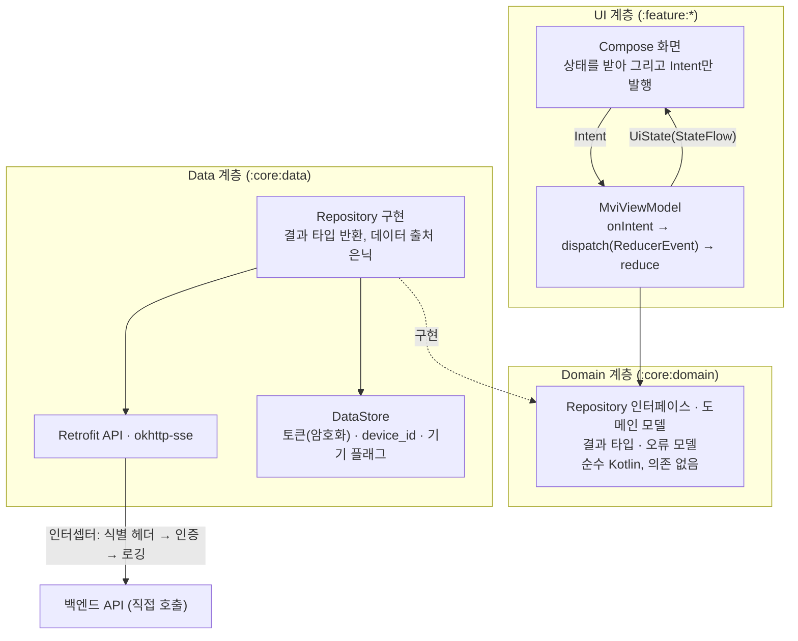

# 3-3-ANDROID-APP

이 문서는 **마냑 안드로이드 네이티브 앱의 플랫폼 구현 계약**을 정의합니다. 화면·사용자 흐름·API 계약 등 플랫폼 무관 스펙은 [`3-1-client.md`](./3-1-client.md)가 소유하며, 이 문서는 그 계약을 안드로이드 앱이 어떻게 충족하는지만 적습니다. 웹 구현의 병렬 문서는 [`3-2-web-app.md`](./3-2-web-app.md)입니다.

> **작성 상태** — 안드로이드 앱 확장은 **Phase 2** 범위입니다([`roadmap.md §R-4`](../planning/roadmap.md) — 로드맵은 "개발 시작"만 배정했고 1차 출시 범위는 정하지 않았습니다). 레포지토리(`../manyak-android`)는 프로젝트 초기 세팅 단계이며, 빌드 환경·정적 검사·CI처럼 코드로 검증된 값만 확정으로 적고(§3-3-2·§3-3-7), 나머지 절의 `작성 예정`·`결정 필요` 항목은 스펙이 확정되는 대로 채웁니다. 이 문서에 값이 없는 항목을 추측으로 채우지 않습니다.

```text
§3-3-1  문서 목적·범위와 관련 문서
§3-3-2  기술 환경·아키텍처와 요청 흐름  (빌드 환경·스택 확정 · 요청 흐름 작성 예정)
§3-3-3  내비게이션·화면 구조 대응       (플랫폼 구현 상태 매트릭스 · 대응 규칙 작성 예정)
§3-3-4  API 연동·인증 세션             (확정)
§3-3-5  디바이스 지원·접근성            (작성 예정)
§3-3-6  관측 연동                      (작성 예정)
§3-3-7  테스트·Definition of Done      (CI·도구 확정 · 검수 범위 작성 예정)
```

| 항목      | 값                                                             |
| --------- | -------------------------------------------------------------- |
| 버전      | v0.18                                                           |
| 작성일    | 2026-08-02                                                     |
| 수정일    | 2026-08-22                                                     |
| 대상      | 마냑 안드로이드 네이티브 앱 (`Phase 2`)                        |
| 작성 목적 | 안드로이드 앱의 플랫폼 구현·연동·검수 기준을 정의합니다.       |
| 기준 코드 | `../manyak-android` (Kotlin, Jetpack Compose)                  |

---

## 3-3-1. 문서 목적·범위와 관련 문서

### 목적

이 문서는 마냑 안드로이드 앱 개발자가 플랫폼 구현(내비게이션, API 연동, 인증 세션, 디바이스 대응, 관측, 테스트)을 결정하는 기준입니다. 화면·흐름·API 계약은 [`3-1-client.md`](./3-1-client.md)를 기준으로 구현하고, 이 문서는 안드로이드에서만 성립하는 계약을 더합니다.

### 앱은 로그인 필수입니다 — 공통 계약의 플랫폼 예외

**안드로이드 앱은 로그인한 회원만 사용합니다**(2026-08-03 결정, 2026-08-22 재확인). 앱을 처음 실행하면 로그인 화면(앱 전용)이 뜨고, 로그인하기 전에는 어떤 화면도 열람할 수 없습니다. 웹은 게스트 우선 모델을 그대로 유지하므로, 이 결정은 **웹과 앱의 사용자 모델이 갈리는 유일한 지점**이자 이 문서 전체의 전제입니다.

그 결과 [`3-1-client.md`](./3-1-client.md)의 다음 계약은 **앱에 적용하지 않습니다**. 각 항목은 웹 전용으로 남고, 3-1에도 이 표를 가리키는 예외 표시를 둡니다.

| 3-1 계약 | 앱 비적용 사유 |
| --- | --- |
| FE-SCREEN-007 온보딩 | 로그인 화면(앱 전용)이 첫 실행 경험을 대체합니다(§3-3-3) |
| [§3-1-6](./3-1-client.md#3-1-6-게스트-데이터-모델) 게스트 데이터 모델 전체 | 게스트가 존재하지 않아 로컬 서재·사용량 카운터·배치 재조회·3-state 상태 판정이 모두 불필요합니다(§3-3-4) |
| 게스트 데이터 자동 이관(`POST /auth/migrate`) | 이관 대상인 로컬 게스트 데이터가 앱에 없습니다 |
| 402 응답의 게스트 분기(로그인 유도 다이얼로그) | 앱 사용자는 전원 회원이라 크레딧 부족 분기만 남습니다 |
| 게스트 체험 한도 선차단(로컬 카운터) | 위와 같음 |

**웹 게스트 데이터의 연속성은 앱에서 단절됩니다.** 웹에서 게스트로 만든 스토리는 그 브라우저에서 로그인해 이관해야 회원 서재에 들어오고, 앱은 회원 서재만 조회합니다. 앱이 별도 구제 경로를 제공하지 않는 것은 결정 사항입니다.

**결정 기록 — 앱은 게스트 모드를 두지 않습니다**

- **배경.** 웹과 같은 게스트 우선 모델을 앱에도 둘지가 갈림길입니다. 게스트 유입은 이미 웹이 담당하고 있습니다.

| 대안 | 채택 안 한 이유 |
| --- | --- |
| 앱도 게스트 우선 모델을 지원 | 로컬 서재·사용량 카운터·배치 재조회·깜빡임 없는 3-state 판정을 앱에 다시 구현해야 하고, 그 위에 자동 이관과 이관 1회 잠금까지 얹힙니다. 게스트 체험 한도가 `device_id`에 묶여 있어 구현 표면이 인증 전반으로 번집니다 |

- **영향.** 세션 상태에 게스트가 없어 판정이 **미확정 · 회원** 둘로 단순해지고(§3-3-4), 내비게이션이 인증 그래프와 메인 그래프로 갈립니다(§3-3-3). 대신 앱 단독으로는 로그인 전 제품 체험이 불가능합니다.

### 범위

- 기술 스택(Jetpack Compose 기반)과 요청 흐름
- 화면·내비게이션 구조와 공통 클라이언트 스펙([`3-1-client.md §3-1-3`](./3-1-client.md#3-1-3-화면별-스펙))의 대응 규칙, 플랫폼 구현 상태 매트릭스
- API 연동 방식과 인증 세션(토큰 보관·재발급)
- 디바이스 지원 범위, 접근성, 앱 라이프사이클 대응
- 관측(이벤트 발화 배선), 테스트 범위와 Definition of Done

### 제외 범위

- 화면별 스펙, 퍼널·채팅 흐름, 게스트 데이터 모델, API 사용 계약, 입력 검증 (담당: [`3-1-client.md`](./3-1-client.md))
- 백엔드 내부 구현과 API 상세 스키마 (담당: [`4-backend.md`](./4-backend.md))
- 이벤트 카탈로그, 식별자 정책, 지표 (원천: [`6-analytics.md`](./6-analytics.md))

### 관련 문서와 경계

| 문서                                   | 소유 영역                      | 이 문서와의 관계                   |
| -------------------------------------- | ------------------------------ | ---------------------------------- |
| [`3-1-client.md`](./3-1-client.md)     | 클라이언트 공통 화면·흐름·계약 | 이 문서가 구현하는 계약의 정본     |
| [`3-2-web-app.md`](./3-2-web-app.md)   | 웹 플랫폼 구현                 | 같은 공통 계약의 병렬 구현·선례    |
| [`4-backend.md`](./4-backend.md)       | API 명세, 데이터 모델          | API 상세를 위임                    |
| [`6-analytics.md`](./6-analytics.md)   | 이벤트·식별자·헤더·Sentry 기준 | 카탈로그는 위임, 발화 배선만 정의  |

### 웹 계약과의 대응 원칙

[`3-1-client.md`](./3-1-client.md)는 웹 구현을 기준 예시로 서술된 부분이 있습니다(플랫폼 표기 원칙). 안드로이드 앱은 같은 계약을 플랫폼 수단으로 충족하며, 확정 시 이 문서의 해당 절이 대응 규칙을 소유합니다. 예상되는 대응 지점 — **오른쪽 열의 구현 수단(SDK·라이브러리)은 현재 코드에 근거가 없으면 전부 `결정 필요`입니다.**

| 공통 계약(웹 기준 표기)                                        | 안드로이드 대응(이 문서가 확정할 것)                              |
| -------------------------------------------------------------- | ----------------------------------------------------------------- |
| URL 경로·히스토리(`push`/`replace`)                            | 내비게이션 그래프·백스택 규칙, 공유 URL 딥링크 여부 — 결정 필요 (§3-3-3) |
| 온보딩 진입 게이트(웹: 서버 프록시·쿠키)                       | 첫 실행 판정·온보딩 노출 방식 — 결정 필요 (§3-3-3)                |
| `localStorage` 게스트 서재·카운터·플래그, 상태 판정(SSR 3-state) | 로컬 저장소 기술·키, 깜빡임 없는 상태 판정 — 결정 필요 (§3-3-4)  |
| BFF 프록시·httpOnly 쿠키 토큰 세션                             | 백엔드 호출 창구(직접 호출 여부)·토큰 안전 보관 기술 — 결정 필요 (§3-3-4) |
| 소셜 로그인(웹: NextAuth OAuth 리다이렉트)                     | 소셜 로그인 방식·SDK — 결정 필요 (§3-3-4)                         |
| SSE 수신(웹: `fetch`+`ReadableStream`)                         | POST 본문을 실을 수 있는 SSE 클라이언트 라이브러리·구현 — 결정 필요 (§3-3-2) |
| 퍼널 이탈 가드(웹: `beforeunload`·히스토리 트래핑)             | 백 버튼·제스처 인터셉트, 라이프사이클 대응 (§3-3-5)               |
| 카카오톡 공유(웹: 카카오 JS SDK)                               | 카카오 공유 방식·SDK — 결정 필요 (§3-3-4)                         |
| 약관·개인정보처리방침 콘텐츠(웹: 웹 레포 TS 모듈)              | 콘텐츠 공급 방식 — 미정. 웹과 시행일·버전·본문 동일성 계약([`3-1-client.md`](./3-1-client.md) FE-SCREEN-010)은 준수 (§3-3-3) |
| 피드백 `platform: WEB`                                         | `platform: ANDROID` 고정 전송 (공통 계약 FE-SCREEN-006)           |
| 브라우저 지원·인앱 브라우저 감지 (앱은 개념 없음)              | OS 최소 버전·디바이스 지원 범위 (§3-3-5)                          |

---

## 3-3-2. 기술 환경·아키텍처와 요청 흐름

### 검증된 빌드 환경

기준 코드(`../manyak-android`)에서 확인된 값입니다(근거: `app/build.gradle.kts`, `gradle/libs.versions.toml`, `gradle/wrapper/gradle-wrapper.properties`, `gradle/gradle-daemon-jvm.properties`, `.github/workflows/android-ci.yml`).

| 분류                  | 값                                          |
| --------------------- | ------------------------------------------- |
| 언어                  | Kotlin 2.3.21                               |
| UI                    | Jetpack Compose(Compose BOM 2026.02.01), Material 3 |
| SDK                   | `compileSdk` 37 · `targetSdk` 37 · `minSdk` 24 |
| 빌드                  | Android Gradle Plugin 9.3.1, Gradle 9.5.0   |
| 빌드 JDK              | Java 25 — Gradle daemon toolchain(`gradle-daemon-jvm.properties` `toolchainVersion=25`), CI도 Temurin 25 사용 |
| Java 컴파일 호환성    | source/target 11 — 산출물의 바이트코드 타깃이며, 개발·빌드에 쓰는 JDK 버전(위 Java 25)과 다른 값입니다 |
| 정적 검사             | ktlint, detekt, Android lint                |
| 단위 테스트           | JUnit                                       |
| UI 테스트 기반        | Compose UI Test, Espresso                   |

### 확정 스택

도입 버전은 구현 시점의 안정판을 쓰고 `gradle/libs.versions.toml`이 정본이 됩니다. 이 표는 **무엇을 쓰는지와 그 이유**만 고정합니다.

| 분류 | 선택 | 선택 이유 |
| --- | --- | --- |
| UI 상태 관리 | **직접 구현 MVI**(`MviViewModel` 베이스 클래스) | 프레임워크 없이 `UiState`·`Intent`·`ReducerEvent` 3요소를 베이스 클래스가 강제하고, `reduce`가 순수 함수라 ViewModel 테스트가 입력·출력 대조로 끝납니다(아래 UI 상태 모델) |
| 의존성 주입 | **Hilt** | 컴파일 타임에 의존 그래프 오류를 잡고, ViewModel 생성 배선과 테스트 대역 교체의 표준 경로를 제공합니다. 애너테이션 처리는 KSP로 돌립니다 |
| 내비게이션 | **Navigation Compose**(타입 안전 라우트) | 공식 지원 라이브러리이며 Hilt 통합을 제공합니다. 목적지별 딥링크 선언을 지원해 이후 App Link 도입이 프레임워크 교체를 강제하지 않습니다 |
| HTTP·직렬화 | **Retrofit + OkHttp + kotlinx.serialization** | 인터셉터가 토큰 주입·식별 헤더·로깅의 단일 지점이 되고(§3-3-4), SSE도 같은 클라이언트 위에서 해결됩니다 |
| SSE | **okhttp-sse** | 채팅 턴은 POST 본문을 실은 요청의 응답을 SSE로 받는 계약이라([`3-1-client.md §3-1-5`](./3-1-client.md#3-1-5-채팅-플레이와-sse-스트리밍)) GET 전용 클라이언트를 쓸 수 없습니다. 이미 쓰는 OkHttp의 검증된 파서를 재사용합니다 |
| 로컬 저장(설정·토큰) | **DataStore** | 토큰·`device_id`·기기 플래그는 키-값이거나 단일 레코드라 질의가 필요 없습니다. 토큰은 저장 전에 암호화합니다(§3-3-4) |
| 이미지 로딩 | **Coil** | Compose 전용 API로 placeholder·실패 처리 계약을 그대로 구현합니다 |
| 소셜 로그인 | **Credential Manager**(구글) · **Kakao SDK v2**(카카오) | §3-3-4 |
| 분석 | **Amplitude Android SDK** | 이벤트 지표의 정본이 Amplitude입니다([`6-analytics.md §6-5`](./6-analytics.md)). 공통 이벤트 카탈로그를 재사용하며 플랫폼별로 이벤트를 새로 만들지 않습니다 |
| 크래시 | **Firebase Crashlytics** | 안드로이드 크래시·ANR 수집 도구가 없는 상태를 메웁니다. 웹·서버가 쓰는 Sentry와 도구가 갈리는 지점이므로 아래 결정 기록을 남깁니다 |
| 불변 컬렉션 | **kotlinx.collections.immutable** | `UiState`의 컬렉션 필드가 `List`면 Compose가 unstable로 보아 리컴포지션을 건너뛰지 못합니다(위 MVI 채택의 귀결) |

**백엔드는 직접 호출합니다.** 웹의 BFF 프록시에 대응하는 중간 계층을 두지 않습니다 — 웹이 프록시를 둔 이유는 브라우저 JS에 토큰을 노출하지 않기 위해서인데([`3-2-web-app.md §3-2-4`](./3-2-web-app.md#3-2-4-bff-프록시토큰-세션)), 앱은 토큰을 데이터 계층 안에 가둘 수 있어 같은 목적을 프록시 없이 달성합니다(§3-3-4).

**도입하지 않는 것** — MVI 프레임워크(직접 구현 — 아래 UI 상태 모델), BFF 대응 계층(위).

### 계층과 책임

계층은 **UI · Domain · Data** 셋입니다. 다만 Domain은 **Repository 인터페이스와 도메인 모델, 결과·오류 타입만 담는 얇은 계층**이며, UseCase 전면 도입과 DDD는 하지 않습니다(아래 결정 기록).



| 계층 | 책임 | 금지 |
| --- | --- | --- |
| Compose 화면 | 상태 렌더, 사용자 입력을 Intent로 발행 | 화면이 직접 데이터를 조회하지 않습니다(`MUST NOT`) |
| `MviViewModel` | `onIntent`로 입력 수신, 부수효과 수행, `ReducerEvent` 발행으로 상태 갱신 | Retrofit·DataStore를 직접 호출하지 않습니다(`MUST NOT`). `reduce` 안에서 부수효과를 수행하지 않습니다(`MUST NOT`) |
| Repository 인터페이스(domain) | 화면이 필요로 하는 데이터 동작의 계약 | 구현 수단(Retrofit·DataStore)을 노출하지 않습니다(`MUST NOT`) |
| Repository 구현(data) | 네트워크·로컬 접근, 응답을 결과 타입으로 변환 | UI 개념(문구·표시 상태)을 알지 않습니다(`MUST NOT`) |

**Repository는 인터페이스와 구현을 나눕니다**(`MUST`). ViewModel은 `:core:domain`의 인터페이스만 알고 구현은 `:core:data`가 제공합니다. 의존 역전으로 화면 계층이 네트워크 구현을 모르게 되어 테스트에서 가짜 구현을 끼울 수 있고, 모듈이 나뉘어 있으므로 `:feature:*`가 `:core:data`를 의존하지 않는 한 **구현 클래스에 접근할 수조차 없습니다**(아래 모듈 구조).

**결정 기록 — Clean Architecture를 전면 도입하지 않습니다(2026-08-22)**

- **배경.** 계층을 나누기로 한 이상 UseCase 계층과 계층별 모델 이중화까지 갈지가 갈림길입니다. 이 제품은 **도메인 규칙(크레딧 차감·체험 한도·소유권·멱등·엔딩 판정)이 전부 백엔드에 있습니다**([`4-backend.md`](./4-backend.md)).

| 대안 | 채택 안 한 이유 |
| --- | --- |
| UseCase 계층을 기본으로 둔다 | 규칙이 서버에 있어 대부분의 UseCase가 Repository 호출을 한 줄 위임하는 껍데기가 됩니다. 파일과 타입만 늘고 읽는 사람이 한 단계를 더 거칩니다 |
| 응답 모델을 계층마다 이중화한다(DTO ↔ 도메인 모델 기계적 매핑) | 서버 응답과 화면이 쓰는 모양이 같은 경우가 대부분이라, 매핑 코드가 필드를 그대로 옮기는 반복이 됩니다 |

- **영향.** 다음 조건에서만 예외를 둡니다(`SHOULD`).
    - **UseCase 추출** — 같은 로직을 ViewModel 두 곳 이상에서 쓰거나, ViewModel 하나가 Repository 셋 이상을 조율할 때.
    - **별도 도메인 모델** — 여러 응답을 합치거나, 화면이 쓰기에 응답 구조가 불편하거나, 서버 계약 변경으로부터 화면을 격리해야 할 때.
- 이 예외 조건을 만족하지 않는데 만든 UseCase·매핑은 리뷰에서 되돌립니다.

### 모듈 구조

**처음부터 멀티 모듈로 구성합니다.** 계층 경계를 컴파일러가 강제하게 하고, 프로젝트가 비어 있는 지금이 전환 비용이 가장 낮은 시점이기 때문입니다(아래 결정 기록). `feature`는 화면이 아니라 **도메인 단위**로 묶습니다 — 화면은 도메인 모듈의 하위 패키지(`story/detail`·`chat/room` 등)에 두어 모듈 수를 억제합니다.

```kotlin
// settings.gradle.kts
include(":app")               // Application · MainActivity(단일) · 루트 컴포저블 · DI 진입

include(":core:domain")       // 순수 Kotlin — 도메인 모델 · Repository 인터페이스 · 결과 타입·오류 모델 · 앱 스코프 헬퍼 인터페이스 · 라우트 마커
include(":core:common")       // 순수 Kotlin — 오류 판정 헬퍼 · 디스패처 · 확장 함수
include(":core:data")         // Repository 구현 · Retrofit API · SSE · DataStore · 인터셉터 · DI 모듈
include(":core:ui")           // 디자인 시스템 · 공용 컴포저블 · MviViewModel · 문자열 리소스 전량
include(":core:analytics")    // Amplitude 배선 · 이벤트 발화 헬퍼
include(":core:navigation")   // 타입 안전 라우트 정의(단일 등록처) · 화면 이동 헬퍼 구현

include(":feature:login")     // 로그인 화면(앱 전용)
include(":feature:story")     // FE-SCREEN-001 홈 · 003 상세 · 002 생성 퍼널
include(":feature:chat")      // FE-SCREEN-004 목록 · 005 채팅
include(":feature:feedback")  // FE-SCREEN-006
include(":feature:my")        // FE-SCREEN-008 · 011 진입
```

**`:core:domain`과 `:core:common`은 `kotlin-jvm` 모듈입니다**(`MUST`). 안드로이드 플러그인을 적용하지 않아 `Context`·`Uri` 같은 프레임워크 참조가 **컴파일 에러**가 됩니다. 코루틴(`Flow`)은 안드로이드 의존이 아니므로 허용합니다.

`:core:data` 내부는 관심사별로 패키지를 나눕니다 — `api`(Retrofit 인터페이스·응답 모델), `sse`(스트리밍 수신), `datastore`(Preferences·암호화 토큰), `repository`(구현), `di`(Hilt 모듈), `interceptor`(식별 헤더·인증·로깅).

**`@HiltViewModel`·`@Module`이 있는 모듈마다 Hilt 플러그인과 KSP를 적용합니다**(`MUST`) — `:app`에만 두면 다른 모듈의 애너테이션이 처리되지 않습니다. `@HiltAndroidApp`은 `:app`에만 둡니다.

#### 의존 방향 규칙

- **`:core:domain`은 아무것도 의존하지 않습니다**(`MUST`). 의존 그래프의 바닥이며, Repository 인터페이스가 반환하는 결과 타입·오류 모델도 이 모듈이 소유하기 때문에 이 규칙이 성립합니다.
- `:core:common`은 **`:core:domain`만** 의존합니다(`MUST`).
- 그 외 `:core:*`(`data`·`ui`·`analytics`·`navigation`)는 **`:core:domain`·`:core:common`** 을 의존할 수 있습니다(`MUST`).
- **`:core:*`끼리의 그 밖의 참조는 금지합니다**(`MUST`). `:core:analytics` → `:core:data`, `:core:ui` → `:core:navigation` 같은 참조가 대상이며, `:core:analytics`가 필요로 하는 `device_id`는 DI 배선에서 주입받습니다(§3-3-4). 예외가 필요하면 결정 기록을 남깁니다.
- `:feature:*`는 `:core:*`를 의존하되 **구현이 있는 `:core:data`는 의존하지 않습니다**(`MUST`). ViewModel이 Repository 인터페이스만 알아야 하므로 `:core:domain`은 포함되고, 구현 주입은 `:app`의 Hilt 배선이 담당합니다.
- **`:feature:*`끼리 직접 참조하지 않습니다**(`MUST`). 화면 이동은 `:core:navigation`을 거치고, 공유 로직은 `:core:*`로 내립니다.
- **`:core:*`는 `:feature:*`를 알지 않습니다**(`MUST`). 의존은 항상 `feature → core` 단방향입니다.
- 모든 모듈을 의존하는 것은 **`:app` 하나**입니다.

**강제 수준은 규칙마다 다릅니다.** `:core:domain`·`:core:common`의 순수 Kotlin 규칙만 컴파일러가 절대적으로 막고, 나머지는 모듈 의존 선언이 1차 방어입니다 — 뚫으려면 `build.gradle.kts`에 한 줄을 추가해야 하고 그 줄이 PR diff에 드러납니다. 단일 모듈의 import 한 줄보다 강하지만 절대적이지는 않으므로 코드 리뷰가 2차 방어로 남습니다.

**결정 기록 — 처음부터 멀티 모듈로 구성(2026-08-22)**

- **배경.** 단일 모듈로 시작해 나중에 쪼갤지, 처음부터 나눌지가 갈림길입니다. 기준 코드는 현재 `:app` 하나뿐이고 화면 코드가 사실상 없습니다.

| 대안 | 채택 안 한 이유 |
| --- | --- |
| 단일 모듈로 시작하고 출시 후 전환 | 지금이 **옮길 코드가 거의 없는, 영구적으로 가장 싼 시점**입니다. 미루면 화면 10여 개와 테스트를 옮겨야 하고, 그 시점에는 다른 기능이 함께 얹혀 있어 실제로는 수행되지 않을 가능성이 큽니다 |
| feature마다 4계층(entity·data·domain·presentation)으로 다시 나눔 | 도메인 규칙이 전부 백엔드에 있어 feature별 domain·data 계층이 거의 빕니다(위 계층과 책임의 결정 기록과 같은 이유). 모듈 수만 늘고 관리 비용이 남습니다 |
| Gradle 규약 플러그인 동시 도입 | 이 규모에서는 모듈별 빌드 스크립트 복제 관리가 더 쌉니다. 모듈이 늘거나 버전 갱신 부담이 커지는 시점에 도입합니다 |

- **영향.** `:core:domain`이 `kotlin-jvm` 모듈이 되어 안드로이드 프레임워크 참조가 컴파일 에러가 됩니다 — 코드 리뷰가 지키던 규칙이 컴파일러 강제로 내려갑니다. 대신 Hilt·KSP가 모듈마다 실행되어 clean build가 느려집니다(증분 빌드는 빨라집니다). Version Catalog(`libs.versions.toml`)는 모든 모듈이 공유합니다.

### 의존성 주입 구성

Hilt 컴포넌트는 **앱 수명과 화면 수명 둘만** 씁니다(`SingletonComponent` · `ViewModelComponent`). **로그인 세션 수명의 커스텀 컴포넌트를 만들지 않습니다**(`MUST NOT`).

그 대신 **사용자에게 귀속된 상태를 가진 싱글턴은 각자 정리 동작을 제공하고, 중앙 세션 종료 흐름이 이를 조합합니다**(`MUST`, §3-3-4 로그아웃 절차). 토큰 저장소·프로필 보관소·이후 추가될 캐시가 모두 이 계약의 대상입니다.

**새로 추가되는 사용자 귀속 저장소가 이 계약에 참여하지 않으면 리뷰에서 드러나야 합니다**(`MUST`). 정리 대상이 한 곳에 나열되어 있으므로 목록에 없는 저장소는 diff에서 눈에 띕니다.

**결정 기록 — 세션 스코프 컴포넌트를 두지 않습니다(2026-08-22)**

- **배경.** 로그아웃 때 토큰만 지워서는 부족하고 사용자 귀속 메모리 캐시도 버려야 합니다. 그 수단이 갈림길입니다.

| 대안 | 채택 안 한 이유 |
| --- | --- |
| 커스텀 세션 스코프 컴포넌트를 만들어 로그아웃 시 컴포넌트째 버린다 | 구조적으로는 더 깔끔하지만 Hilt에서 컴포넌트를 수동으로 만들고 수명을 관리해야 하며, 주입 지점마다 어느 컴포넌트에 속하는지를 계속 판단해야 합니다. **무엇보다 정리 대상이 코드에 드러나지 않아** 빠뜨린 저장소가 조용히 남습니다 |

- **영향.** 정리 항목이 늘 때마다 중앙 종료 흐름에 **손으로 추가해야 합니다.** 누락 위험이 있는 대신 그 위험이 리뷰에서 보이는 형태로 남습니다. 정리 순서를 명시적으로 통제할 수 있는 것은 부수 이득입니다(§3-3-4 로그아웃 절차는 순서가 계약입니다).

### 오류 표현과 문자열 위치

**문자열 리소스는 `:core:ui`에 전량 모읍니다**(`MUST`). 순수 Kotlin 모듈(`:core:domain`·`:core:common`)은 안드로이드 리소스에 접근할 수 없으므로, 이 배치가 곧 **"Repository 구현은 UI 문구를 알지 않는다"를 컴파일러가 강제**하는 장치가 됩니다. 나중에 다국어를 추가할 때 파일이 흩어지지 않는 것도 이득입니다.

대가는 있습니다 — 화면을 추가할 때마다 `:core:ui`를 건드려 재컴파일 범위가 넓어지고, `:feature:*`가 자기 문자열을 소유하지 못합니다. 이 비용을 수용합니다.

그 귀결로 **오류가 모듈을 지나는 경로가 고정됩니다.**

| 단계 | 모듈 | 하는 일 |
| --- | --- | --- |
| 1 | `:core:domain` | 오류를 **타입으로 정의**합니다(결과 타입·오류 모델). 문구를 모릅니다 |
| 2 | `:core:data` | 와이어 응답(`ApiErrorResponse`)을 **오류 타입으로 변환**합니다. 와이어 DTO는 이 모듈 밖으로 나가지 않습니다(`MUST NOT`) |
| 3 | `:core:common` | 오류 타입 기반 **공통 판정 헬퍼**(402 크레딧 부족 판정 등). 와이어도 문구도 모릅니다 |
| 4 | `:core:ui` | 오류 타입을 **문자열 리소스로 변환**합니다 |

**안내·화면 이동을 요청하는 앱 스코프 헬퍼의 인터페이스는 `:core:domain`이 소유합니다**(`MUST`). 구현은 각각 `:core:ui`·`:core:navigation`에 두고 배선은 `:app`의 Hilt가 담당합니다. 이렇게 해야 `:core:*`끼리 직접 참조하지 않는 규칙을 지키면서도 어느 계층에서든 안내와 이동을 요청할 수 있습니다.

#### 오류 변환과 재시도

- **변환 지점은 `:core:data` 한 곳입니다**(`MUST`). 네트워크·HTTP·파싱 실패를 여기서 오류 타입으로 바꾸고, 상위 계층은 예외가 아니라 결과 타입으로 받습니다.
- **재시도는 한 계층에만 둡니다**(`MUST NOT` 중복 배치). 데이터 계층과 ViewModel 양쪽에 재시도를 두면 사용자가 기다리는 시간이 곱해집니다.
- **취소(`CancellationException`)를 일반 실패로 삼키지 않습니다**(`MUST NOT`). 화면 이탈로 취소된 작업이 실패 토스트를 띄우면 안 됩니다.
- **인증 API에는 자동 재시도를 두지 않습니다**(`MUST NOT`). 로그인·연동은 멱등성 계약이 없는 쓰기입니다. 토큰 재발급의 재시도 규칙은 §3-3-4가 따로 정합니다.
- 읽기 요청은 공통 계약대로 자동 재시도·복귀 자동 재조회 없이 오류를 상태로 반환하고, 화면이 인라인으로 처리합니다([`3-1-client.md §3-1-7`](./3-1-client.md#3-1-7-api-연동에러-처리-계약)).

### UI 상태 모델

모든 화면은 `:core:ui`의 **`MviViewModel<I, S, E>` 베이스 클래스를 상속합니다**(`MUST`). 3요소는 다음과 같습니다.

| 요소 | 뜻 | 규칙 |
| --- | --- | --- |
| `UiState`(S) | 화면이 그리는 **불변** 상태 | 재구독자는 항상 최신값을 받습니다. 컬렉션 필드는 `ImmutableList` 등을 씁니다(`MUST`) — `List`면 Compose가 unstable로 보아 리컴포지션을 건너뛰지 못합니다 |
| `Intent`(I) | 사용자·시스템 입력 | 화면은 **Intent 발행만** 합니다. 상태를 직접 바꾸거나 Repository를 부르지 않습니다(`MUST NOT`) |
| `ReducerEvent`(E) | 상태를 바꾸는 사건 | `reduce(state, event)`는 **순수 함수**입니다. 그 안에서 부수효과를 수행하지 않습니다(`MUST NOT`) |

흐름은 `onIntent` → (필요하면 부수효과 수행) → `dispatch(ReducerEvent)` → `reduce` → 새 `UiState` 방출입니다. 부수효과는 `onIntent` 쪽에 있고 `reduce`는 상태 전이만 합니다. 그래서 **ViewModel 테스트가 `reduce`의 입력·출력 대조로 끝납니다**(§3-3-7).

**일회성 효과는 `UiState`에 싣지 않습니다**(`MUST NOT`). 화면 이동·스낵바 같은 효과를 상태 필드로 두면 재구독 때 다시 실행됩니다. 이들은 `:core:domain`이 인터페이스를 소유하는 앱 스코프 헬퍼로 요청하고(위 오류 표현과 문자열 위치), 루트에서 단일 수집합니다.

#### 코루틴·Flow 사용 원칙

- **작업의 수명을 먼저 정합니다.** 화면이 사라지면 의미가 없는 작업은 ViewModel 스코프에, **화면 이탈로 중단되면 안 되는 작업은 앱 스코프**에 둡니다(`MUST`). 후자의 대표가 로그아웃 절차입니다(§3-3-4) — 화면 스코프에서 실행하면 부분 정리 상태가 남습니다.
- **무거운 작업의 dispatcher는 호출된 쪽이 정합니다**(`MUST`). 암복호화·IO를 수행하는 함수가 스스로 dispatcher를 지정해, 호출자가 추측하지 않아도 안전하게 실행되게 합니다. 테스트에서 교체할 수 있도록 주입받습니다.
- **지속 상태는 재구독자에게 최신값을 제공합니다**(`MUST`). `stateIn`·`shareIn`을 쓸 때는 스코프·시작 방식·구독자 부재 시 유지 시간을 명시합니다.
- **유실되면 안 되는 사건을 전달 보장 없는 Flow에 두지 않습니다**(`MUST NOT`).

**결정 기록 — UI 상태 관리를 프레임워크 없이 직접 구현(2026-08-22)**

- **배경.** 화면마다 상태·입력·부수효과 배선이 제각각이 되는 것을 막는 방법이 갈림길입니다. 5개 feature를 짧은 기간에 만들면서 편차가 생기면 나중에 통일하는 비용이 큽니다.

| 대안 | 채택 안 한 이유 |
| --- | --- |
| MVI 프레임워크(Orbit 등) 도입 | 실제로 제공하는 것은 사이드이펙트 전달·`reduce` 직렬화·라이프사이클 인지 수집이고, 작은 베이스 클래스와 버퍼 채널로 직접 구현되는 범위입니다. 반면 프레임워크가 타입으로 강제하는 것은 State와 SideEffect뿐이라 **Intent 개념이 없어** 3요소의 균일성은 어차피 팀 관례가 만듭니다. 메이저 버전 간 타입 개명 같은 마이그레이션 부담도 실재합니다 |
| ViewModel + `StateFlow`만 사용(베이스 클래스 없음) | 사이드이펙트 채널 배선·라이프사이클 인지 수집·인텐트 디스패처를 화면마다 다시 작성해 편차가 생깁니다. 베이스 클래스 하나로 막을 수 있는 편차입니다 |

- **영향.** 화면마다 `UiState`·`Intent`·`ReducerEvent` 3종을 정의해야 해서 순수 `StateFlow`보다 타입과 파일이 늘어납니다. 대신 배선이 베이스 클래스 한 곳에 모여 화면 코드가 얇아집니다. 재검토 조건 — 화면 수가 늘어 베이스 클래스만으로 편차를 못 막거나 KMP 공유가 요구되면 프레임워크 도입을 다시 봅니다.

### 아직 결정하지 않은 것 — `결정 필요`

- **로컬 캐시용 DB(Room 등)** — 본인 리소스 캐시를 둘지, 둔다면 무엇을 얼마나 보관할지가 정해지지 않았습니다. 캐시 정책 없이 저장 기술만 고르면 근거가 없으므로 함께 확정합니다. 로그인 흐름에는 필요하지 않습니다. 다만 도입한다면 **사용자 귀속 저장소이므로 세션 종료 정리 계약에 참여해야 합니다**(§3-3-4 로그아웃 절차).
- **백그라운드 작업 수단**(WorkManager·Foreground Service) — 스토리 생성 백그라운드 복귀 계약([`3-1-client.md §3-1-4`](./3-1-client.md#3-1-4-스토리-생성-퍼널))의 앱 대응이 §3-3-5에서 정해진 뒤 판단합니다. 서버에 푸시 알림 계약이 없어 알림으로 대체할 수 없습니다.

**결정 기록 — 크래시 수집에 Sentry가 아닌 Firebase Crashlytics(2026-08-22)**

- **배경.** 웹·서버는 Sentry를 쓰고 [`6-analytics.md §6-6`](./6-analytics.md)의 관측 도구 표도 Sentry 기준입니다. 안드로이드 배선은 그 표에서 미정으로 열려 있어, 도구를 통일할지 안드로이드 표준을 따를지가 갈림길입니다.

| 대안 | 채택 안 한 이유 |
| --- | --- |
| Sentry Android로 통일 | 도구가 하나로 모여 `request_id`로 서버 로그와 잇기 쉽다는 이점은 분명합니다. 다만 안드로이드에서는 크래시·ANR·네이티브 심볼 수집이 Crashlytics의 기본 경로이고 Play Console 지표와도 연동됩니다. 플랫폼 표준 도구를 우선했습니다 |

- **영향.** `google-services.json` 배치와 CI 시크릿 주입, 릴리스 매핑 파일 업로드가 배포 구성에 추가됩니다(§3-3-7). 앱 오류는 Crashlytics에, 서버 오류는 Sentry에 남아 **한 사건을 두 도구에서 봐야 합니다** — 이 비용을 수용합니다. 재검토 조건 — 앱 오류를 서버 트레이스와 함께 추적해야 하는 요구가 실제로 생기면 다시 판단합니다.

---

## 3-3-3. 내비게이션·화면 구조 대응

[`3-1-client.md §3-1-3`](./3-1-client.md#3-1-3-화면별-스펙)의 화면 인벤토리(FE-SCREEN-001~012)와 흐름 인덱스(FLOW-001~009)를 안드로이드 내비게이션 구조로 대응합니다. 그래프 구조와 인증 게이트는 아래에서 확정하고, 화면별 전환 규칙(웹의 `push`/`replace` 표)과 딥링크 처리 방식은 `작성 예정`입니다.

### 로그인 화면 (앱 전용)

앱은 로그인 필수이므로(§3-3-1) **첫 실행 경험이 로그인 화면입니다.** 이 화면은 3-1의 화면 인벤토리에 없는 **앱 전용 화면**이며, 웹 `/login`의 계약([`3-1-client.md`](./3-1-client.md#3-1-3-화면별-스펙) FE-SCREEN-008) 중 다음만 가져옵니다.

| 3-1 `/login` 계약 | 앱 적용 |
| --- | --- |
| 카카오·Google 버튼을 세로로 두고 카카오가 위 | 적용 |
| 두 버튼이 같은 시작 함수를 provider 인자만 달리해 호출 | 적용(§3-3-4) |
| 로그인 진행 중 잠금 — 탭한 버튼을 중앙 스피너로 바꾸고 두 버튼 모두 비활성화 | 적용 |
| 별개 계정 정적 안내("이전에 로그인했던 계정으로 시작해주세요") | 적용. 문구 정본은 3-1 |
| 약관 동의 고지(로그인 버튼 클릭을 묵시적 동의로 간주) | 적용 |
| **이관 1회 안내** | **비적용** — 앱에는 이관할 게스트 데이터가 없습니다(§3-3-1) |

### 내비게이션 구조

**인증 그래프와 메인 그래프를 분리합니다**(`MUST`). 세션 상태에 따라 어느 그래프를 띄울지 결정하고, 그래프 안에서 가드로 막지 않습니다 — 미인증 상태에서 **메인 목적지가 백스택에 존재할 수 없게** 만들어 가드 누락이 사고가 되지 않게 하기 위해서입니다.

| 세션 상태(§3-3-4) | 화면 |
| --- | --- |
| 미확정 — 저장된 토큰을 아직 읽지 못함 | **어느 그래프도 그리지 않습니다**(`MUST`). 로그인 화면이 잠깐 스쳤다가 메인으로 바뀌는 깜빡임을 막습니다 |
| 회원 | 메인 그래프 |
| 비회원 | 인증 그래프 |

- **로그인 성공 시 인증 그래프를 백스택에서 제거합니다**(`MUST`). 메인에서 뒤로가기로 로그인 화면에 돌아가면 안 됩니다.
- **로그아웃 시 메인 그래프를 제거하고 인증 그래프로 전환합니다**(`MUST`). 전환 시점은 로그아웃 정리가 모두 끝난 뒤입니다(§3-3-4 로그아웃 절차).
- 메인 그래프의 하단 탭은 **홈 · 채팅 · 마이** 셋입니다(FE-SCREEN-001 · 004 · 008).

#### 라우트 규칙

- **라우트 정의는 `:core:navigation` 한 곳에 등록합니다**(`MUST`). `:feature:*`끼리 직접 참조하지 않으므로(§3-3-2) 이동은 이 모듈을 거칩니다.
- **라우트에는 복원 가능한 식별자만 싣습니다**(`MUST`) — `storyId`·`chatId` 같은 값입니다. 화면이 그릴 데이터는 목적지에서 다시 얻습니다. 객체를 통째로 넘기면 프로세스 재시작 복원과 딥링크에서 깨집니다.
- **화면 컴포저블에는 `NavController` 같은 이동 객체를 넘기지 않습니다**(`MUST NOT`). 값과 콜백만 전달해 화면을 미리보기·테스트에서 단독으로 띄울 수 있게 합니다.

### 플랫폼 구현 상태 매트릭스

**공통 계약 상태(`확정`·`방향 합의`·`미정`)·웹 구현 상태(`구현`·`부분 구현`·`미구현`)·로드맵 Phase의 용어·판정 기준과 값의 정본은 [`3-1-client.md §3-1-1` 상태 정본 표](./3-1-client.md#상태-정본-표)입니다.** 이 표는 **3-1의 화면(FE-SCREEN) 원자 행만** 그대로 옮겨 적습니다 — 공통 Phase·계약·웹 구현 상태를 흐름(FLOW) 단위 단일값으로 다시 합성하지 않습니다. Android 목표 범위·현재 상태 두 열만 이 문서가 소유하며, 흐름 단위 추적은 아래 **Android 흐름 구현 매트릭스**가 담당합니다. **Android 목표 범위는 로드맵에 1차 출시 범위가 없어 전 항목 `결정 필요`이고, Android 현재 상태는 전 항목 `미착수`입니다.** 목표 범위가 확정되면 이 표가 Android 추적의 정본이 됩니다.

| 공통 ID | 기능 | 로드맵 Phase | 공통 계약 상태 | 웹 구현 상태 | Android 목표 범위 | Android 현재 상태 | 플랫폼 차이·미결 사항 | 관련 절 |
| --- | --- | --- | --- | --- | --- | --- | --- | --- |
| FE-SCREEN-001 | 스토리 목록 기본 | MVP | 확정 | 구현 | 결정 필요 | 미착수 | 로컬 서재 저장 기술 결정 필요 | §3-3-4 |
| FE-SCREEN-001 | 카드 썸네일(US-2-7) | Phase 1 | 확정 | 구현 | 결정 필요 | 미착수 | — | §3-3-3 |
| FE-SCREEN-002 | 생성 퍼널 기본 | MVP | 확정 | 구현 | 결정 필요 | 미착수 | 이탈 가드의 앱 대응 결정 필요 | §3-3-5 |
| FE-SCREEN-002 | 백그라운드 생성 복귀·제작 임시 저장 | Phase 1 | 확정 | 구현 | 결정 필요 | 미착수 | 앱 라이프사이클 대응 결정 필요 | §3-3-5 |
| FE-SCREEN-002 | 키워드 단계 개편(KNK-621) | Phase 2 | 방향 합의 | 미구현 | 결정 필요 | 미착수 | 공통 계약 확정 후 판단 | — |
| FE-SCREEN-003 | 스토리 상세 기본 | MVP | 확정 | 구현 | 결정 필요 | 미착수 | — | §3-3-3 |
| FE-SCREEN-003 | 썸네일 히어로·이미지 뷰어·시작 설정 선택 | Phase 1 | 확정 | 구현 | 결정 필요 | 미착수 | 뷰어 닫기(뒤로가기 흡수) 수단 결정 필요 | §3-3-5 |
| FE-SCREEN-003 | 본 엔딩 배지 | Phase 1 | 확정 | 미구현 | 결정 필요 | 미착수 | 서버 계약 확정·구현 완료 — 클라이언트 연동만 잔여 | §3-3-3 |
| FE-SCREEN-004 | 채팅 목록·이어가기 기본 | MVP | 확정 | 구현 | 결정 필요 | 미착수 | — | §3-3-3 |
| FE-SCREEN-004 | 카드 썸네일 | Phase 1 | 확정 | 구현 | 결정 필요 | 미착수 | — | §3-3-3 |
| FE-SCREEN-005 | 채팅 기본(SSE 스트리밍·선택지·삭제) | MVP | 확정 | 구현 | 결정 필요 | 미착수 | SSE 클라이언트 결정 필요(§3-3-2) | §3-3-2 |
| FE-SCREEN-005 | 응답 재생성(US-6-10) | Phase 1 | 확정 | 구현 | 결정 필요 | 미착수 | — | §3-3-3 |
| FE-SCREEN-005 | 주요 사건 방향 선택지 | Phase 1 | 확정 | 구현 | 결정 필요 | 미착수 | — | §3-3-3 |
| FE-SCREEN-005 | 채팅 공유 발급 | Phase 1 | 확정 | 구현 | 결정 필요 | 미착수 | 공유 URL 생성·전달 방식 결정 필요 | §3-3-3 |
| FE-SCREEN-005 | 채팅 이미지 렌더(US-6-11) | Phase 1 | 확정 | 미구현 | 결정 필요 | 미착수 | 마커 계약 확정(`[[image:<imageKey>]]`), 서버·AI도 미구현 | §3-3-3 |
| FE-SCREEN-005 | 엔딩 도달 턴 배지(US-6-13) | Phase 1 | 확정 | 미구현 | 결정 필요 | 미착수 | 서버 계약 확정·구현 완료 — 클라이언트 연동만 잔여 | §3-3-3 |
| FE-SCREEN-005 | 엔딩 도달 후 계속 진행(US-6-14) | Phase 1 | 확정 | 구현 | 결정 필요 | 미착수 | 입력 잠금 조건을 스트리밍 여부로만 두면 충족 | §3-3-3 |
| FE-SCREEN-006 | 피드백 | MVP | 확정 | 구현 | 결정 필요 | 미착수 | `platform: ANDROID` 고정 전송 | §3-3-1 |
| FE-SCREEN-007 | 온보딩 | MVP | 확정 | 구현 | 결정 필요 | 미착수 | 첫 실행 판정·게이트 방식 결정 필요 | §3-3-3 |
| FE-SCREEN-008 | 인증·마이 기본 | Phase 1 | 확정 | 구현 | 결정 필요 | 미착수 | 소셜 로그인 방식·SDK, 토큰 보관 기술 결정 필요 | §3-3-4 |
| FE-SCREEN-008 | 소모량 사전 고지 — 서비스 안내 정책 수치 | Phase 1 | 확정 | 구현 | 결정 필요 | 미착수 | — | §3-3-3 |
| FE-SCREEN-008 | 소모량 사전 고지 — 채팅 헤더·각 소모 지점 | Phase 1 | 확정 | 미구현 | 결정 필요 | 미착수 | 웹도 미구현 — 클라이언트 공통 잔여 | §3-3-3 |
| FE-SCREEN-009 | 일반 제작·스토리 수정 | Phase 1 | 확정 | 미구현 | 결정 필요 | 미착수 | 서버 API 계약 확정·구현 완료 — 클라이언트 연동만 잔여 | — |
| FE-SCREEN-010 | 약관·개인정보처리방침 | Phase 1 | 확정 | 구현 | 결정 필요 | 미착수 | 콘텐츠 공급 방식 결정 필요. 웹과 시행일·버전·본문 동일성 필수 | §3-3-3 |
| FE-SCREEN-011 | 서비스 안내 | Phase 1 | 확정 | 구현 | 결정 필요 | 미착수 | 게스트 저장 고지 문구를 기기·앱 데이터 기준으로 조정 | §3-3-3 |
| FE-SCREEN-012 | 채팅 공유 열람 | Phase 1 | 확정 | 구현 | 결정 필요 | 미착수 | 공유 URL을 앱 딥링크로 열지, 웹으로 열지 결정 필요 | §3-3-3 |

- **웹 전용 항목(Android 비적용)** — 인앱 브라우저 감지·로그인 핸드오프, BFF 프록시, SSR·하이드레이션, 브라우저 지원·SEO 기준([`3-2-web-app.md`](./3-2-web-app.md) 소유). 공통 계약이 아니므로 위 표에 두지 않으며 Android 상태와 섞지 않습니다.
- **별도 결정 필요 항목** — 공유 URL 딥링크 처리(FE-SCREEN-012), 법적 콘텐츠 공급(FE-SCREEN-010), 온보딩 첫 실행 판정(FE-SCREEN-007), §3-3-4의 전 항목, §3-3-6의 식별자 플랫폼 매핑.

### Android 흐름 구현 매트릭스

흐름(FLOW) 단위 추적표입니다. **공통 계약·웹 구현 상태·로드맵 Phase 열을 두지 않습니다** — 그 세 축은 화면 원자 행이 정본이고, 흐름 단위로 다시 합성하면 정의되지 않은 파생값이 생기기 때문입니다. 이 표는 [`3-1-client.md §3-1-3`](./3-1-client.md#3-1-3-화면별-스펙) 흐름 인덱스의 **FLOW-001~009 전체**(`Phase 1 · 계획` 확장인 FLOW-002A·002B 포함)를 담고, Android 관점 값만 관리합니다. 각 흐름이 어떤 화면 행의 상태에 걸려 있는지는 `구성 화면` 열에서 위 상태 매트릭스로 찾습니다.

| 흐름 ID | 이름 | 구성 화면 | Android 목표 범위 | Android 현재 상태 | 미결 사항 |
| --- | --- | --- | --- | --- | --- |
| FLOW-001 | 첫 방문 온보딩 | 001 · 002 · 007 | 결정 필요 | 미착수 | 첫 실행 판정·게이트 방식 |
| FLOW-002 | 스토리 생성 | 002 · 005 | 결정 필요 | 미착수 | 이탈 가드·백그라운드 복귀 대응 |
| FLOW-002A | 일반 제작 | 002 · 003 · 009 | 결정 필요 | 미착수 | 웹도 미구현 — 클라이언트 공통 잔여 |
| FLOW-002B | 스토리 수정 | 003 · 009 | 결정 필요 | 미착수 | 웹도 미구현 — 클라이언트 공통 잔여 |
| FLOW-003 | 탐색 → 플레이 시작 | 001 · 003 · 005 | 결정 필요 | 미착수 | — |
| FLOW-004 | 채팅 플레이(스트리밍) | 005 | 결정 필요 | 미착수 | SSE 클라이언트(§3-3-2) |
| FLOW-005 | 채팅 이어가기 | 004 · 005 | 결정 필요 | 미착수 | — |
| FLOW-006 | 스토리·채팅 삭제 | 003 · 004 · 005 | 결정 필요 | 미착수 | — |
| FLOW-007 | 피드백 제출 | 006 | 결정 필요 | 미착수 | `platform: ANDROID` 고정 전송 |
| FLOW-008 | 잘못된 경로 접근 | 999 Not Found · 001 | 결정 필요 | 미착수 | URL 개념이 없어 딥링크 실패 처리로 대응 — 방식 결정 필요 |
| FLOW-009 | 서비스 정보 열람 | 008 · 010 · 011 | 결정 필요 | 미착수 | 법적 콘텐츠 공급 방식 |


---

## 3-3-4. API 연동·인증 세션

API 사용 계약([`3-1-client.md §3-1-7`](./3-1-client.md#3-1-7-api-연동에러-처리-계약))을 따릅니다. 백엔드는 직접 호출하며 중간 계층을 두지 않습니다(§3-3-2). 논리적 식별자(`device_id`·`session_id`·`user_id`)의 의미·타입과 `X-Manyak-*` 헤더 계약의 정본은 [`6-analytics.md §6-2`](./6-analytics.md)이고, 이 절은 **앱의 매핑과 인증 세션 동작**을 확정합니다.

게스트 데이터 로컬 저장소는 앱에 필요하지 않습니다(§3-3-1).

### 세션 상태 모델

세션 상태는 앱 수명 싱글턴이 소유하고 재구독자는 항상 최신값을 받습니다(§3-3-2 코루틴 원칙). 앱에 게스트가 없으므로 상태는 셋입니다.

| 상태 | 뜻 | 화면 |
| --- | --- | --- |
| **미확정** | 저장된 토큰을 아직 읽지 못함(앱 시작 직후) | 어느 그래프도 그리지 않습니다(§3-3-3) |
| **미로그인** | 유효한 토큰이 없음 | 인증 그래프 |
| **회원** | 유효한 토큰이 있음 | 메인 그래프 |

- **회원 판정의 근거는 저장된 토큰의 존재이지 `GET /auth/me` 성공이 아닙니다**(`MUST`). 프로필은 아래 프로필 조회 규칙으로 따로 채웁니다.
- **`GET /auth/me`가 네트워크 오류로 실패했다고 미로그인으로 내리지 않습니다**(`MUST NOT`). 비행기 모드에서 앱을 열면 로그아웃된 것처럼 보입니다.
- **미로그인으로 내려가는 경우는 넷뿐입니다** — 토큰이 없거나, 재발급이 401·403으로 실패했거나, 토큰 복호화가 실패했거나, 사용자가 로그아웃했을 때.
- **정지 계정(`status != ACTIVE`)** 은 세션을 종료하되 일반 로그아웃과 **구분되는 안내**를 표시합니다(`MUST`). 조용히 인증 화면으로 되돌리면 사용자가 원인을 알 수 없습니다. 정지 사유는 노출하지 않습니다(서버 계약).

#### 프로필 조회와 캐시

- **권위 있는 출처는 `GET /auth/me`** 입니다. 프로필은 `:core:data`가 소유하고 화면은 그 하나만 관찰합니다 — 화면마다 `/auth/me`를 부르지 않습니다(`MUST NOT`).
- **조회 시점은 셋입니다** — 로그인 직후, 앱 시작 시 토큰이 있을 때, 계정 연동 성공 후.
- 마지막 성공 응답을 로컬에 보관해 조회 실패·오프라인에서 표시합니다. **이 캐시는 사용자 귀속 데이터이므로 로그아웃 정리 대상입니다**(`MUST`, 아래 로그아웃 절차).
- **프로필 조회 실패는 세션 상태를 바꾸지 않습니다**(`MUST NOT`).

### 인증 토큰 보관

| 항목 | 결정 |
| --- | --- |
| 저장 위치 | DataStore. 저장 전에 **Android Keystore**의 키로 암호화합니다(`MUST`) |
| 키 조건 | 앱 시작 시 사용자 상호작용 없이 세션을 복원해야 하므로 **사용자 인증을 요구하지 않는 키**를 씁니다. 하드웨어 보호(StrongBox·TEE)는 가능하면 쓰되 **모든 기기에 있다고 가정하지 않습니다** — 없으면 소프트웨어 키로 진행하고 그 사실로 로그인을 막지 않습니다 |
| 백업 | 앱 백업을 비활성화하고(`allowBackup="false"`), 그와 별개로 토큰 저장 파일을 백업·기기 이전 규칙에서 제외합니다(`MUST`, 이중 방어) |
| 노출 | 토큰을 로그·분석 이벤트·크래시 리포트에 싣지 않습니다(`MUST NOT`) |
| 경계 | 토큰은 `:core:data` 밖으로 나가지 않습니다(`MUST`). ViewModel과 화면은 토큰을 보지 않고 세션 상태만 봅니다 |

**복호화 실패는 정상 경로로 처리합니다**(`MUST`). 기기 이전·백업 복원·키 무효화로 복호화가 실패하면 무한 시작 실패 대신 **로컬 세션을 폐기하고 인증 그래프로 보냅니다.** 기준 코드의 매니페스트는 현재 `allowBackup="true"`이므로 구현 시 함께 바꿉니다.

**결정 기록 — 토큰을 Keystore로 암호화해 저장(2026-08-22)**

- **배경.** 안드로이드 앱 저장소는 샌드박스라 다른 앱이 접근할 수 없습니다. 평문 저장으로 충분한지가 갈림길입니다.

| 대안 | 채택 안 한 이유 |
| --- | --- |
| DataStore 평문 저장 | 비루팅 기기에서는 충분하지만, **refresh 토큰은 수명 14일이라 유출되면 사실상 계정 탈취와 등가**입니다([`4-backend.md §4-5`](./4-backend.md)). 루팅 기기·포렌식·백업 유출에서 파일만으로 토큰이 노출됩니다 |
| `EncryptedSharedPreferences` | 지원이 중단되어 새로 도입할 이유가 없습니다 |

- **영향.** 소형 암호화 계층이 `:core:data`의 저장소 구현에 붙습니다. Keystore 키가 손상된 기기에서는 복호화가 실패하므로 위 재로그인 경로가 반드시 있어야 합니다.

### 토큰 만료 판정

**선제 재발급이 필요한 이유부터 고정합니다.** 백엔드의 선택적 인증 경로는 **만료·위조 토큰을 401로 거절하지 않고 익명으로 통과시킵니다**(서버 `OptionalJwtAuthenticationFilter` — 해당 경로에서 인증 예외를 삼키고 익명으로 둡니다). 그 경로에는 채팅 생성·턴 스트리밍·재생성·공유 발급, 스토리 생성·수정·삭제처럼 **콘텐츠를 만드는 엔드포인트가 대부분 포함됩니다.**

| 그래서 생기는 일 | 결과 |
| --- | --- |
| 만료 토큰으로 생성 요청이 통과 | 회원이 만든 스토리·채팅이 **주인 없는 콘텐츠**로 저장되어 서재에 나타나지 않습니다 |
| 401이 발생하지 않음 | **응답을 보고 재발급하는 방식(반응형)이 트리거되지 않습니다** |

따라서 **요청을 보내기 전에 만료를 판정해 먼저 재발급합니다**(`MUST`). 반응형 재발급은 이를 대체하지 않고 보완만 합니다(아래 토큰 재발급).

#### 이중 시계 앵커

서버는 `expiresIn`(초)만 주므로 수신 시점을 로컬에 앵커해야 합니다. **단조 시계(부팅 후 경과)와 벽시계 양쪽에 앵커하고, 판정할 때 두 경과값 중 큰 값을 채택합니다**(`MUST`).

| 상황 | 단조 경과 | 벽시계 경과 | 큰 값을 채택하면 |
| --- | --- | --- | --- |
| 정상 | 정확 | 정확 | 정확 |
| **재부팅** | 실제보다 **작음** | 정확 | 벽시계 채택 → 정확 |
| 시계를 과거로 조작 | 정확 | 실제보다 **작음** | 단조 채택 → 정확 |
| 시계를 미래로 조작 | 정확 | 실제보다 큼 | 불필요한 재발급 1회 |

- **두 앵커를 토큰과 같은 저장소에 함께 기록합니다**(`MUST`). 프로세스가 재시작해도 저장된 앵커로 같은 판정을 합니다.
- **앵커가 없으면 만료로 간주해 선제 재발급합니다**(`MUST`).
- 판정 여유는 **만료 60초 전**입니다. 요청이 서버에 닿는 사이에 만료되는 구간을 흡수합니다.

**결정 기록 — 만료 판정에 시계 두 개를 함께 저장(2026-08-22)**

- **배경.** 앵커를 어느 시계에 걸지가 갈림길입니다. 어느 한쪽만 쓰면 특정 상황에서 **만료 토큰이 유효로 판정**되고, 그 결과가 곧 위의 주인 없는 콘텐츠 사고입니다.

| 대안 | 채택 안 한 이유 |
| --- | --- |
| 단조 시계만 사용 | 부팅 후 경과 시간이라 **재부팅하면 0부터 다시 셉니다.** 저장된 앵커보다 현재 값이 작아지는 순간부터 경과가 실제보다 작게 계산되어 만료 토큰이 유효로 판정됩니다 |
| 벽시계만 사용 | 사용자가 시간 자동 동기화를 끄고 시계를 과거로 돌리면 같은 방향으로 틀립니다 |

- **영향.** 손해가 나는 경우는 시계를 미래로 조작한 상황 하나뿐이고 그 비용은 **요청 한 번**입니다. 반대 방향(만료 토큰을 유효로 판정)은 계정 귀속이 깨지므로, **틀릴 때 안전한 쪽으로 틀리는 규칙**을 택했습니다.

### 토큰 재발급

백엔드 토큰 정책([`4-backend.md §4-5`](./4-backend.md))의 성질이 구현을 강제합니다 — **refresh는 1회용이며, 이미 회전된 토큰이 다시 오면 서버가 그 세션 계열 전체를 폐기합니다.** 즉 재발급을 잘못 다루면 사용자가 예고 없이 로그아웃됩니다.

| 규칙 | 내용 | 지키지 않으면 |
| --- | --- | --- |
| **선제 재발급**(`MUST`) | 요청 직전에 만료가 임박했으면(여유 60초) `POST /auth/token/refresh`를 **먼저 완료하고** 본 요청을 보냅니다 | 만료 토큰이 익명으로 통과해 회원 생성물이 주인 없는 콘텐츠가 됩니다(위 만료 판정) |
| **단일 비행**(`MUST`) | 재발급은 **앱 전역에서 하나만** 실행하고, 나머지 요청은 그 완료를 기다렸다가 새 토큰을 씁니다 | 병렬 재발급의 두 번째 요청이 재사용 탐지에 걸려 세션 계열이 폐기되고 강제 로그아웃됩니다 |
| **회전 저장 순서**(`MUST`) | 응답의 새 토큰 쌍을 **저장소에 기록한 뒤에야** 단일 비행을 해제합니다 | 저장 전에 대기 요청이 풀리면 구 토큰으로 재발급을 시도해 재사용 탐지에 걸립니다 |
| **재귀 금지**(`MUST NOT`) | 재발급 요청 자체는 인증·재발급 경로를 다시 타지 않습니다 | 재발급 실패가 다시 재발급을 부르는 무한 재귀가 됩니다 |
| **반응형 재발급**(`MUST`) | 선제 재발급을 거쳤는데도 본 요청이 401이면(서버 측 계열 폐기 등) 재발급 **1회** 후 원 요청을 **1회만** 재시도합니다 | 폐기된 세션이 화면마다 제각각의 오류로 흩어져 사용자가 로그아웃 상태임을 인지하지 못합니다 |

회전 직후·저장 전에 프로세스가 죽어 로컬에 폐기된 refresh만 남는 엣지는 **강제 재로그인으로 수용합니다.**

**자동 첨부는 로그인·재발급을 막지 않습니다.** 인터셉터가 모든 요청에 access 토큰을 붙여도, 서버가 로그인·재발급 경로에서는 Bearer 토큰을 resolve하지 않아 만료·위조 헤더로 401이 나지 않습니다(서버 `SecurityConfig`). 클라이언트가 이 경로에서 헤더를 따로 벗길 필요는 없습니다.

#### 재발급 실패 분기

| 실패 | 처리 |
| --- | --- |
| **401** — refresh 만료·계열 폐기 | 세션을 폐기하고 인증 그래프로 이동합니다 |
| **403** — 정지 계정 | 세션을 폐기하고 인증 그래프로 이동하되 **구분되는 안내**를 표시합니다. 정지 사유는 노출하지 않습니다 |
| **네트워크 오류** | **세션을 유지하고** 해당 요청만 실패로 처리합니다. 사용자가 재시도합니다 |

- **네트워크 오류를 세션 폐기로 처리하지 않습니다**(`MUST NOT`). 연결이 불안정한 곳에서 앱을 열 때마다 로그아웃됩니다.
- **세션 폐기는 로그아웃 절차를 그대로 탑니다**(`MUST`, 아래). 사용자가 누른 로그아웃과 서버가 밀어낸 로그아웃의 정리 범위가 다르면 안 됩니다.
- **계정 연동 경로의 403·409는 세션 만료로 처리하지 않습니다**(`MUST NOT`, [`3-1-client.md`](./3-1-client.md#3-1-3-화면별-스펙) FE-SCREEN-008). 연동 실패로 로그인 세션이 풀리면 안 됩니다. 재발급은 401에만 반응하므로 자연히 만족하지만, 인터셉터에서 403을 일괄 처리하지 않습니다.

### 식별자 배선

논리 식별자의 의미·타입과 `X-Manyak-*` 헤더 계약은 플랫폼 공통이며 정본은 [`6-analytics.md §6-2`](./6-analytics.md)입니다. 앱의 매핑은 다음과 같습니다.

| 식별자 | 앱 매핑 |
| --- | --- |
| `device_id` | **앱이 첫 실행 시 생성한 UUID가 정본입니다.** DataStore에 보관하고, API 헤더와 분석 SDK가 **같은 값**을 사용합니다(SDK에는 주입). 로그아웃 시 새로 발급하며, 재발급은 로그아웃 정리의 **마지막** 단계입니다(아래) |
| `session_id` | 분석 SDK가 관리하는 세션 값을 그대로 사용합니다(§3-3-6). SDK 도입 전에는 값이 없으므로 헤더를 생략합니다(공통 계약상 best-effort) |
| `user_id` | 로그인 성공 시 사용자 공개 ID |

#### `X-Manyak-Device-Id`는 모든 요청에 싣습니다 (`MUST`)

**특히 첫 로그인 요청에서 빠지면 안 됩니다.** 백엔드는 계정이 처음 만들어질 때 이 헤더로 회원 체험 잔여를 1회 시드하는데, **헤더가 없거나 빈 문자열이면 무료 체험을 부여하지 않고 소진 상태로 시드합니다**(우회 차단 — [`4-backend.md §4-3-7`](./4-backend.md)).

그 시드는 **되돌릴 수 없습니다.** 잠금이 이중이기 때문입니다.

| 잠금 | 내용 |
| --- | --- |
| 저장소 | 시드는 **미설정일 때만** 기록되어(`SETNX` 계열) 이후 값이 덮이지 않습니다 |
| 계정 | 시드에 성공하면 계정에 완료 시각이 기록되고, 이후 로그인은 그 값을 보고 시드를 **아예 다시 시도하지 않습니다** |

즉 **계정 생성 후 첫 로그인 요청 한 번**이 그 계정의 무료 체험을 영구히 결정합니다. 나중에 헤더를 제대로 붙여도 복구되지 않습니다. 대상은 회원이 공유하는 카운터(스토리 완성·채팅 턴)이며 정책 수치의 정본은 [`4-backend.md §4-3-7`](./4-backend.md)입니다.

그래서 앱은 다음을 지킵니다.

- **`device_id`는 로그인 요청의 선행 조건입니다**(`MUST`). "있으면 싣는다"가 아니라, **값이 없으면 로그인을 보내지 않고 먼저 생성합니다.**
- **빈 문자열을 헤더에 싣지 않습니다**(`MUST NOT`). 서버는 누락과 공백을 같게 취급하므로 DataStore 읽기 실패로 빈 값이 나가면 헤더 누락과 결과가 같습니다.
- 로그아웃의 `device_id` 재발급이 실패한 상태로 다음 로그인이 나가지 않도록 순서를 지킵니다(아래 로그아웃 절차).
- 이 항목은 검수 기준에 포함합니다(§3-3-7).

**결정 기록 — `device_id`를 앱이 직접 생성(2026-08-22)**

- **배경.** 웹은 분석 SDK가 생성한 값을 `device_id`로 씁니다. 공통 계약이 요구하는 것은 "익명 기기 단위의 문자열 식별자"이지 특정 SDK의 값이 아닙니다.

| 대안 | 채택 안 한 이유 |
| --- | --- |
| 분석 SDK 생성 값 사용(웹과 동일) | **SDK 초기화 전에 첫 로그인 요청이 나가면 헤더가 비어** 위 비가역 사고가 그대로 발생합니다. 웹은 값이 없을 때 폴백으로 넘겼지만 앱은 그 실패를 감당할 수 없습니다. 로그인 구현이 분석 SDK 도입을 기다려야 하는 것도 문제입니다 |
| `ANDROID_ID` 등 시스템 식별자 | 사용자가 재설정할 수 없어 로그아웃 시 재발급 요구를 충족하지 못합니다 |

- **영향.** 분석 SDK를 도입할 때 이 값을 SDK에 주입해 분석과 API 헤더가 항상 같은 값을 보게 합니다(§3-3-6). 로그아웃 시 재발급은 공용 기기에서 다음 사용자의 행동이 이전 회원에게 귀속되는 것을 막기 위한 것으로, 웹의 SDK reset 계약과 목적이 같습니다.

---

## 3-3-5. 디바이스 지원·접근성 — `작성 예정`

지원 OS 최소 버전(빌드 기준 `minSdk` 24 — 제품 지원 선언은 별도 결정), 화면 크기 대응, 접근성(TalkBack·포커스·터치 타깃), 앱 라이프사이클(백그라운드 전환 중 생성 복구 — [`3-1-client.md §3-1-4`](./3-1-client.md#3-1-4-스토리-생성-퍼널) 백그라운드 생성 복귀 계약의 대응), 퍼널 이탈 가드의 백 버튼·제스처 인터셉트 대응을 이 절에서 확정합니다.

---

## 3-3-6. 관측 연동 — `작성 예정`

이벤트 카탈로그·식별자 정책은 [`6-analytics.md`](./6-analytics.md)가 소유합니다. 다음 **원칙**은 확정입니다 — Android는 **공통 이벤트 카탈로그를 재사용해야 하고**(이벤트 이름·프로퍼티를 플랫폼별로 새로 만들지 않으며 `platform`·`os_name` 등으로 웹과 구분), 웹과 **동일한 논리적 `device_id`·`session_id`·`user_id` 의미·타입과 API 헤더 계약(`X-Manyak-*`)을 충족해야 합니다**([`6-analytics.md §6-2`](./6-analytics.md)·[`§6-6-2`](./6-analytics.md)).

다만 **카탈로그 전체가 구현 가능한 확정 계약인 것은 아닙니다** — `analytics_creation_id`(분석 이벤트의 `creation_id`) 관련 프로퍼티·지표는 문서 계약과 현재 구현이 어긋난 미해결 구간이라([`6-analytics.md §6-8-7`](./6-analytics.md)), Android는 그 간극이 정리되기 전까지 해당 프로퍼티를 임의로 추가하지 않고 웹과 동일한 현재 계약을 따릅니다. 미정인 나머지는 계약이 아니라 **플랫폼 매핑**입니다.

`결정 필요` 항목:

- 분석 SDK 제품 선택과 초기화 구성
- 논리 식별자(`device_id`·`session_id`)를 Android에서 생성·보관·복원(reset 포함)하는 방식
- Sentry Android 배선

> **리스크 — Android 식별자 플랫폼 매핑 미결.** 게스트 체험 한도와 자동 이관(핸드오프 시드 포함)이 `device_id`에 의존하는데([`4-backend.md §4-3-7`](./4-backend.md)·[`6-analytics.md §6-2`](./6-analytics.md)), Android에서 `device_id`를 생성·보관·복원하는 매핑이 결정되지 않았습니다. 이 매핑이 확정되기 전에는 게스트 한도·이관 흐름의 Android 구현을 시작할 수 없습니다.

---

## 3-3-7. 테스트·Definition of Done

### 검증된 도구·CI

기준 코드에서 확인된 값입니다(근거: `app/build.gradle.kts`, `.github/workflows/android-ci.yml`).

- 단위 테스트: JUnit. UI 테스트 기반: Compose UI Test·Espresso.
- 정적 검사: ktlint·detekt·Android lint — 모두 `./gradlew check`에 물려 있습니다.
- CI(GitHub Actions): `dev`·`main` 대상 PR·push에서 Temurin **Java 25**(Gradle daemon toolchain과 일치 — 어긋나면 데몬용 JDK를 따로 내려받아 빌드가 느려짐)를 설정한 뒤 `./gradlew check` → `./gradlew assembleDebug`를 실행하고 리포트를 아티팩트로 남깁니다.

### Definition of Done — `작성 예정`

화면·흐름 단위 검수 기준은 §3-3-3 매트릭스의 **Android 목표 범위가 확정된 뒤** 그 범위에 연동해 정의합니다(목표 범위가 미정이므로 전체 화면 완료를 요구하지 않습니다). 현재 확정된 최소 기준은 다음뿐입니다.

- `./gradlew check`(ktlint·detekt·lint·단위 테스트)와 `./gradlew assembleDebug`가 통과해야 합니다(CI 게이트와 동일).
