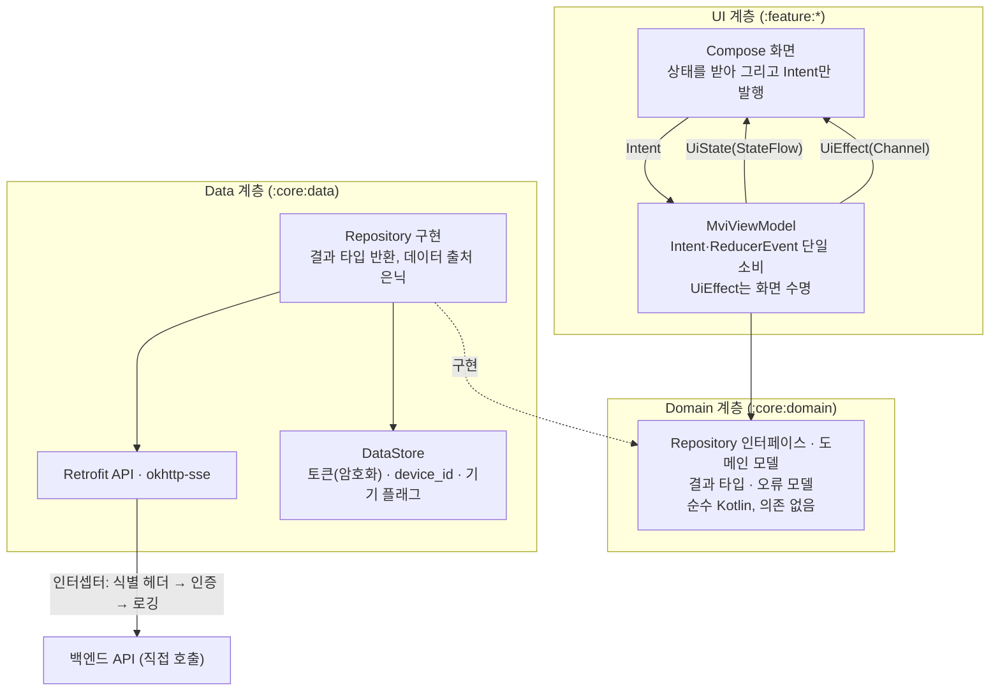

# 3-3-ANDROID-APP

이 문서는 **마냑 안드로이드 네이티브 앱의 플랫폼 구현 계약**을 정의합니다. 화면·사용자 흐름·API 계약 등 플랫폼 무관 스펙은 [`3-1-client.md`](./3-1-client.md)가 소유하며, 이 문서는 그 계약을 안드로이드 앱이 어떻게 충족하는지만 적습니다. 웹 구현의 병렬 문서는 [`3-2-web-app.md`](./3-2-web-app.md)입니다.

> **작성 상태** — 안드로이드 앱 확장은 **Phase 2** 범위입니다([`roadmap.md §R-4`](../planning/roadmap.md)). **아키텍처·내비게이션 게이트·인증 세션 프로토콜(§3-3-2~§3-3-4)은 구현을 착수할 만큼 확정됐습니다.** 다만 로그인 사용자 흐름을 완료하려면 로그인 전 열람 가능한 법적 문서(FE-SCREEN-010)의 콘텐츠 공급 방식을 먼저 확정해야 합니다. 화면별 전체 목표 범위, 디바이스 지원 중 화면 크기·접근성(§3-3-5 — 구성 변경 대응은 확정), 관측의 화면별 이벤트·P0 수동 log 발화 목록(§3-3-6), 전체 화면 검수 범위(§3-3-7)는 아직 채워지지 않았습니다. 값이 없는 항목을 추측으로 채우지 않습니다.

```text
§3-3-1  문서 목적·범위와 관련 문서
§3-3-2  기술 환경·아키텍처와 요청 흐름  (빌드 환경·스택 확정 · 요청 흐름 작성 예정)
§3-3-3  내비게이션·화면 구조 대응       (그래프·메인 탭 셸·제작 퍼널 구조 확정 · 화면별 전환 규칙 작성 예정)
§3-3-4  API 연동·인증 세션             (확정)
§3-3-5  디바이스 지원·접근성·라이프사이클 (퍼널 이탈 가드·백그라운드 복구·구성 변경 확정 · 화면 크기·접근성 작성 예정)
§3-3-6  관측 연동                      (제품 선택·식별자 매핑 확정 · 배선 작성 예정)
§3-3-7  테스트·Definition of Done      (CI·도구 확정 · 검수 범위 작성 예정)
```

| 항목      | 값                                                             |
| --------- | -------------------------------------------------------------- |
| 버전      | v0.28                                                           |
| 작성일    | 2026-08-02                                                     |
| 수정일    | 2026-08-29                                                     |
| 대상      | 마냑 안드로이드 네이티브 앱 (`Phase 2`)                        |
| 작성 목적 | 안드로이드 앱의 플랫폼 구현·연동·검수 기준을 정의합니다.       |
| 기준 코드 | `../manyak-android` (Kotlin, Jetpack Compose)                  |

---

## 3-3-1. 문서 목적·범위와 관련 문서

### 목적

이 문서는 마냑 안드로이드 앱 개발자가 플랫폼 구현(내비게이션, API 연동, 인증 세션, 디바이스 대응, 관측, 테스트)을 결정하는 기준입니다. 화면·흐름·API 계약은 [`3-1-client.md`](./3-1-client.md)를 기준으로 구현하고, 이 문서는 안드로이드에서만 성립하는 계약을 더합니다.

### 앱은 로그인 필수입니다 — 공통 계약의 플랫폼 예외

**안드로이드 앱의 제품 기능은 로그인한 회원만 사용합니다**(2026-08-03 결정, 2026-08-22 재확인). 앱을 처음 실행하면 로그인 화면(앱 전용)이 뜨며, 로그인 전에는 그 화면과 로그인 동의에 필요한 **서비스이용약관·개인정보처리방침(FE-SCREEN-010)** 만 열람할 수 있습니다. 스토리·채팅·마이 등 제품 화면은 하나도 열 수 없습니다. 웹은 게스트 우선 모델을 그대로 유지하므로, 이 결정은 **웹과 앱의 제품 사용자 모델이 갈리는 유일한 지점**이자 이 문서 전체의 전제입니다.

그 결과 [`3-1-client.md`](./3-1-client.md)의 다음 계약은 **앱에 적용하지 않습니다**. 각 항목은 웹 전용으로 남고, 3-1에도 이 표를 가리키는 예외 표시를 둡니다.

| 3-1 계약 | 앱 비적용 사유 |
| --- | --- |
| FE-SCREEN-007 온보딩 | 로그인 화면(앱 전용)이 첫 실행 경험을 대체합니다(§3-3-3) |
| [§3-1-6](./3-1-client.md#3-1-6-게스트-데이터-모델) 게스트 데이터 모델 전체 | 게스트가 존재하지 않아 로컬 서재·사용량 카운터·배치 재조회·3-state 상태 판정이 모두 불필요합니다(§3-3-4) |
| 게스트 데이터 자동 이관(`POST /auth/migrate`) | 이관 대상인 로컬 게스트 데이터가 앱에 없습니다 |
| 402 응답의 게스트 분기(로그인 유도 다이얼로그) | 앱 사용자는 전원 회원이라 크레딧 부족 분기만 남습니다 |
| 게스트 체험 한도 선차단(로컬 카운터) | 위와 같음 |

**웹 게스트 데이터의 연속성은 앱에서 단절됩니다.** 웹에서 게스트로 만든 스토리는 그 브라우저에서 로그인해 이관해야 회원 서재에 들어오고, 앱은 회원 서재만 조회합니다. 앱이 별도 구제 경로를 제공하지 않는 것은 결정 사항입니다.

**결정 기록 — 앱은 게스트 모드를 두지 않습니다**

- **배경.** 웹과 같은 게스트 우선 모델을 앱에도 둘지가 갈림길입니다. 게스트 유입은 이미 웹이 담당하고 있습니다.

| 대안 | 채택 안 한 이유 |
| --- | --- |
| 앱도 게스트 우선 모델을 지원 | 로컬 서재·사용량 카운터·배치 재조회·깜빡임 없는 3-state 판정을 앱에 다시 구현해야 하고, 그 위에 자동 이관과 이관 1회 잠금까지 얹힙니다. 게스트 체험 한도가 `device_id`에 묶여 있어 구현 표면이 인증 전반으로 번집니다 |

- **영향.** 세션 상태에 게스트가 없어 판정이 **미확정 · 미로그인 · 회원**으로 단순해지고(§3-3-4), 내비게이션이 인증 그래프와 메인 그래프로 갈립니다(§3-3-3). 대신 앱 단독으로는 로그인 전 제품 체험이 불가능합니다. 법적 문서는 사용자 기능이 아니라 로그인 동의의 선행 열람 경로이므로 예외로 둡니다.

### 범위

- 기술 스택(Jetpack Compose 기반)과 요청 흐름
- 화면·내비게이션 구조와 공통 클라이언트 스펙([`3-1-client.md §3-1-3`](./3-1-client.md#3-1-3-화면별-스펙))의 대응 규칙, 플랫폼 구현 상태 매트릭스
- API 연동 방식과 인증 세션(토큰 보관·재발급)
- 디바이스 지원 범위, 접근성, 앱 라이프사이클 대응
- 관측(이벤트 발화 배선), 테스트 범위와 Definition of Done

### 제외 범위

- 화면별 스펙, 퍼널·채팅 흐름, 게스트 데이터 모델, API 사용 계약, 입력 검증 (담당: [`3-1-client.md`](./3-1-client.md))
- 백엔드 내부 구현과 API 상세 스키마 (담당: [`4-backend.md`](./4-backend.md))
- 이벤트 카탈로그, 식별자 정책, 지표 (원천: [`6-analytics.md`](./6-analytics.md))

### 관련 문서와 경계

| 문서                                   | 소유 영역                      | 이 문서와의 관계                   |
| -------------------------------------- | ------------------------------ | ---------------------------------- |
| [`3-1-client.md`](./3-1-client.md)     | 클라이언트 공통 화면·흐름·계약 | 이 문서가 구현하는 계약의 정본     |
| [`3-2-web-app.md`](./3-2-web-app.md)   | 웹 플랫폼 구현                 | 같은 공통 계약의 병렬 구현·선례    |
| [`4-backend.md`](./4-backend.md)       | API 명세, 데이터 모델          | API 상세를 위임                    |
| [`6-analytics.md`](./6-analytics.md)   | 이벤트·식별자·헤더·Sentry 기준 | 카탈로그는 위임, 발화 배선만 정의  |

### 웹 계약과의 대응 원칙

[`3-1-client.md`](./3-1-client.md)는 웹 구현을 기준 예시로 서술된 부분이 있습니다(플랫폼 표기 원칙). 안드로이드 앱은 같은 계약을 플랫폼 수단으로 충족하며, 확정 시 이 문서의 해당 절이 대응 규칙을 소유합니다. 예상되는 대응 지점 — 각 행의 상태는 해당 절이 소유합니다.

| 공통 계약(웹 기준 표기)                                        | 안드로이드 대응(이 문서가 확정할 것)                              |
| -------------------------------------------------------------- | ----------------------------------------------------------------- |
| URL 경로·히스토리(`push`/`replace`)                            | 인증·메인 그래프 분리와 라우트 규칙 확정. 화면별 전환 규칙·딥링크는 결정 필요 (§3-3-3) |
| 온보딩 진입 게이트(웹: 서버 프록시·쿠키)                       | **앱 비적용** — 로그인 화면이 첫 실행 경험을 대체합니다 (§3-3-1) |
| `localStorage` 게스트 서재·카운터·플래그, 상태 판정(SSR 3-state) | **앱 비적용** — 게스트가 없습니다. 세션 판정은 미확정·미로그인·회원 (§3-3-1 · §3-3-4) |
| BFF 프록시·httpOnly 쿠키 토큰 세션                             | 백엔드 직접 호출. 토큰은 Keystore로 암호화해 DataStore에 보관하고 데이터 계층 밖으로 내보내지 않음 (§3-3-2 · §3-3-4) |
| 소셜 로그인(웹: NextAuth OAuth 리다이렉트)                     | Credential Manager(구글) · Kakao SDK v2(카카오)로 ID 토큰을 얻어 직접 제출 (§3-3-4) |
| SSE 수신(웹: `fetch`+`ReadableStream`)                         | okhttp-sse — POST 본문을 실은 요청을 지원합니다 (§3-3-2) |
| 퍼널 이탈 가드(웹: `beforeunload`·히스토리 트래핑)             | 백 버튼·제스처 인터셉트, 라이프사이클 대응 (§3-3-5)               |
| 카카오톡 공유(웹: 카카오 JS SDK)                               | 카카오 공유 방식·SDK — 결정 필요 (§3-3-4)                         |
| 약관·개인정보처리방침 콘텐츠(웹: 웹 레포 TS 모듈)              | 루트의 공용 법적 문서 목적지로 로그인 전·후 열람. 콘텐츠 공급 방식은 미정이지만 **인증 사용자 흐름 완료의 필수 선행 조건**이며, 웹과 시행일·버전·본문 동일성 계약([`3-1-client.md`](./3-1-client.md) FE-SCREEN-010)은 준수 (§3-3-3) |
| 피드백 `platform: WEB`                                         | `platform: ANDROID` 고정 전송 (공통 계약 FE-SCREEN-006)           |
| 브라우저 지원·인앱 브라우저 감지 (앱은 개념 없음)              | OS 최소 버전·디바이스 지원 범위 (§3-3-5)                          |

---

## 3-3-2. 기술 환경·아키텍처와 요청 흐름

### 검증된 빌드 환경

기준 코드(`../manyak-android`)에서 확인된 값입니다(근거: `app/build.gradle.kts`, `gradle/libs.versions.toml`, `gradle/wrapper/gradle-wrapper.properties`, `gradle/gradle-daemon-jvm.properties`, `.github/workflows/android-ci.yml`).

| 분류                  | 값                                          |
| --------------------- | ------------------------------------------- |
| 언어                  | Kotlin 2.3.21                               |
| UI                    | Jetpack Compose(Compose BOM 2026.02.01), Material 3 |
| SDK                   | `compileSdk` 37 · `targetSdk` 37 · `minSdk` 24 |
| 빌드                  | Android Gradle Plugin 9.3.1, Gradle 9.5.0   |
| 빌드 JDK              | Java 25 — Gradle daemon toolchain(`gradle-daemon-jvm.properties` `toolchainVersion=25`), CI도 Temurin 25 사용 |
| Java 컴파일 호환성    | source/target 11 — 산출물의 바이트코드 타깃이며, 개발·빌드에 쓰는 JDK 버전(위 Java 25)과 다른 값입니다 |
| 정적 검사             | ktlint, detekt, Android lint                |
| 단위 테스트           | JUnit                                       |
| UI 테스트 기반        | Compose UI Test, Espresso                   |

### 확정 스택

도입 버전은 구현 시점의 안정판을 쓰고 `gradle/libs.versions.toml`이 정본이 됩니다. 이 표는 **무엇을 쓰는지와 그 이유**만 고정합니다.

| 분류 | 선택 | 선택 이유 |
| --- | --- | --- |
| UI 상태 관리 | **직접 구현 MVI**(`MviViewModel` 베이스 클래스) | 프레임워크 없이 `UiState`·`Intent`·`ReducerEvent`·`UiEffect` 네 요소와 단일 소비·overflow 계약을 베이스 클래스가 강제합니다(아래 UI 상태 모델) |
| 의존성 주입 | **Hilt** | 컴파일 타임에 의존 그래프 오류를 잡고, ViewModel 생성 배선과 테스트 대역 교체의 표준 경로를 제공합니다. 애너테이션 처리는 KSP로 돌립니다 |
| 내비게이션 | **Navigation 3**(`NavKey` 백스택) | 백스택이 앱이 소유한 리스트라, 탭별 백스택과 뒤로가기 계약을 프레임워크의 되감기 옵션 조합이 아니라 리스트 구성으로 표현합니다(§3-3-3 메인 탭 셸). 딥링크 선언 API가 없는 대신 App Link 매핑을 직접 소유합니다(아래 결정 기록) |
| HTTP·직렬화 | **Retrofit + OkHttp + kotlinx.serialization** | 인터셉터가 토큰 주입·식별 헤더·로깅의 단일 지점이 되고(§3-3-4), SSE도 같은 클라이언트 위에서 해결됩니다 |
| SSE | **okhttp-sse** | 채팅 턴은 POST 본문을 실은 요청의 응답을 SSE로 받는 계약이라([`3-1-client.md §3-1-5`](./3-1-client.md#3-1-5-채팅-플레이와-sse-스트리밍)) GET 전용 클라이언트를 쓸 수 없습니다. 이미 쓰는 OkHttp의 검증된 파서를 재사용합니다 |
| 로컬 저장(설정·토큰) | **DataStore** | 토큰·`device_id`·기기 플래그는 키-값이거나 단일 레코드라 질의가 필요 없습니다. 토큰은 저장 전에 암호화합니다(§3-3-4) |
| 이미지 로딩 | **Coil** | Compose 전용 API로 placeholder·실패 처리 계약을 그대로 구현합니다 |
| 소셜 로그인 | **Credential Manager**(구글) · **Kakao SDK v2**(카카오) | §3-3-4 |
| 분석 | **Amplitude Android SDK** | 이벤트 지표의 정본이 Amplitude입니다([`6-analytics.md §6-5`](./6-analytics.md)). 공통 이벤트 카탈로그를 재사용하며 플랫폼별로 이벤트를 새로 만들지 않습니다 |
| 크래시 | **Firebase Crashlytics** | Kotlin/JVM fatal·non-fatal과 Android 11+ ANR을 수집합니다. 제품 분석은 Amplitude만 쓰고 Crashlytics 로그는 수동 배선합니다. 범위와 공백은 아래 결정 기록에 고정합니다 |
| 컬렉션 불변성(선택) | **필요한 `UiState`에 `kotlinx.collections.immutable`** | 가변 alias를 컴파일 타임에 막아야 하는 상태에 선택 적용합니다. 모든 `List`를 일괄 변환하거나 skippability만을 이유로 필수화하지 않습니다(아래 UI 상태 모델) |

**백엔드는 직접 호출합니다.** 웹의 BFF 프록시에 대응하는 중간 계층을 두지 않습니다 — 웹이 프록시를 둔 이유는 브라우저 JS에 토큰을 노출하지 않기 위해서인데([`3-2-web-app.md §3-2-4`](./3-2-web-app.md#3-2-4-bff-프록시토큰-세션)), 앱은 토큰을 데이터 계층 안에 가둘 수 있어 같은 목적을 프록시 없이 달성합니다(§3-3-4).

**도입하지 않는 것** — MVI 프레임워크(직접 구현 — 아래 UI 상태 모델), BFF 대응 계층(위).

**결정 기록 — 내비게이션은 Navigation 3(2026-08-23)**

- **배경.** 하단 탭 셸을 붙이면서 갈림길이 드러났습니다. Navigation Compose에서 셸의 뒤로가기 계약은 `popUpTo`·`saveState`·`restoreState`·`launchSingleTop`의 조합으로만 존재하는데, 옵션 하나 차이가 "홈으로 복귀"와 "앱 종료"를 가르면서도 호출부를 읽어서는 어느 쪽인지 알 수 없습니다. 계약이 코드에 드러나지 않으면 검수 항목으로만 지켜집니다.

| 대안 | 채택 안 한 이유 |
| --- | --- |
| Navigation Compose를 유지한다 | 탭별 상태 보존이 되감기 옵션의 부수효과가 됩니다. 셸이 소유해야 할 계약이 프레임워크 내부 동작에 흩어집니다 |
| 목적지가 늘어난 뒤에 옮긴다 | 옮길 목적지와 그 사이 이동 규칙이 함께 늘어납니다. 목적지가 다섯인 지금이 전환 비용이 가장 낮습니다 |

- **영향.** 백스택은 `NavKey` 리스트로 앱이 소유하고 화면 전환은 리스트 조작이 됩니다. 인증·메인은 서로 다른 백스택 인스턴스가 되고, 탭별 백스택과 뒤로가기 규칙은 §3-3-3 메인 탭 셸이 소유합니다. 라우트 인자는 목적지 키 자체로 전달되므로 ViewModel이 저장 상태에서 라우트를 되읽지 않습니다.
- **잃는 것 — 딥링크 선언.** 목적지별 딥링크 선언 API가 없습니다. App Link를 도입할 때 URI를 `NavKey` 목록으로 바꾸는 매핑을 `:core:navigation`이 직접 소유해야 하고, 그 매핑 규칙은 딥링크 처리 방식을 확정할 때 함께 정합니다(§3-3-3).

### 계층과 책임

계층은 **UI · Domain · Data** 셋입니다. 다만 Domain은 **Repository 인터페이스와 도메인 모델, 결과·오류 타입만 담는 얇은 계층**이며, UseCase 전면 도입과 DDD는 하지 않습니다(아래 결정 기록).



| 계층 | 책임 | 금지 |
| --- | --- | --- |
| Compose 화면 | 상태 렌더, 사용자 입력을 Intent로 발행 | 화면이 직접 데이터를 조회하지 않습니다(`MUST NOT`) |
| `MviViewModel` | `onIntent`로 입력 수신, 부수효과 수행, `ReducerEvent` 발행으로 상태 갱신 | Retrofit·DataStore를 직접 호출하지 않습니다(`MUST NOT`). `reduce` 안에서 부수효과를 수행하지 않습니다(`MUST NOT`) |
| Repository 인터페이스(domain) | 화면이 필요로 하는 데이터 동작의 계약 | 구현 수단(Retrofit·DataStore)을 노출하지 않습니다(`MUST NOT`) |
| Repository 구현(data) | 네트워크·로컬 접근, 응답을 결과 타입으로 변환 | UI 개념(문구·표시 상태)을 알지 않습니다(`MUST NOT`) |

**Repository는 인터페이스와 구현을 나눕니다**(`MUST`). ViewModel은 `:core:domain`의 인터페이스만 알고 구현은 `:core:data`가 제공합니다. 의존 역전으로 화면 계층이 네트워크 구현을 모르게 되어 테스트에서 가짜 구현을 끼울 수 있고, 모듈이 나뉘어 있으므로 `:feature:*`가 `:core:data`를 의존하지 않는 한 **구현 클래스에 접근할 수조차 없습니다**(아래 모듈 구조).

**결정 기록 — Clean Architecture를 전면 도입하지 않습니다(2026-08-22)**

- **배경.** 계층을 나누기로 한 이상 UseCase 계층과 계층별 모델 이중화까지 갈지가 갈림길입니다. 이 제품은 **도메인 규칙(크레딧 차감·체험 한도·소유권·멱등·엔딩 판정)이 전부 백엔드에 있습니다**([`4-backend.md`](./4-backend.md)).

| 대안 | 채택 안 한 이유 |
| --- | --- |
| UseCase 계층을 기본으로 둔다 | 규칙이 서버에 있어 대부분의 UseCase가 Repository 호출을 한 줄 위임하는 껍데기가 됩니다. 파일과 타입만 늘고 읽는 사람이 한 단계를 더 거칩니다 |
| 응답 모델을 계층마다 이중화한다(DTO ↔ 도메인 모델 기계적 매핑) | 서버 응답과 화면이 쓰는 모양이 같은 경우가 대부분이라, 매핑 코드가 필드를 그대로 옮기는 반복이 됩니다 |

- **영향.** 다음 조건에서만 예외를 둡니다(`SHOULD`).
    - **UseCase 추출** — 같은 로직을 ViewModel 두 곳 이상에서 쓰거나, ViewModel 하나가 Repository 셋 이상을 조율할 때.
    - **별도 도메인 모델** — 여러 응답을 합치거나, 화면이 쓰기에 응답 구조가 불편하거나, 서버 계약 변경으로부터 화면을 격리해야 할 때.
- 이 예외 조건을 만족하지 않는데 만든 UseCase·매핑은 리뷰에서 되돌립니다.

### 모듈 구조

**첫 기능부터 멀티 모듈 경계를 적용하되, 최종 모듈을 한 번에 만들지는 않습니다.** 계층 경계를 컴파일러가 강제하게 하고 프로젝트가 비어 있는 지금이 전환 비용이 가장 낮은 시점이기 때문입니다(아래 결정 기록). **`feature`는 화면 단위로 나눕니다**(`MUST`) — 모듈 이름이 화면·탭 이름과 1:1로 맞아 어디를 고칠지 이름만 보고 찾습니다. **화면은 모듈 루트 패키지에 두고 하위 패키지를 만들지 않습니다**(`MUST NOT`) — 모듈이 곧 화면이라 한 겹이 더 있으면 경로만 길어집니다.

아래 목록은 **최종 목표 구조**이며 첫 변경의 `settings.gradle.kts` 완성본이 아닙니다.

```kotlin
// settings.gradle.kts
include(":app")               // Application · MainActivity(단일) · 루트 컴포저블 · DI 진입

include(":core:domain")       // 순수 Kotlin — 도메인 모델 · Repository 인터페이스 · 결과 타입·오류 모델
include(":core:common")       // 순수 Kotlin — 오류 판정 헬퍼 · 디스패처 · 확장 함수
include(":core:data")         // Repository 구현 · Retrofit API · SSE · DataStore · 인터셉터 · DI 모듈
include(":core:ui")           // 디자인 시스템 · 공용 컴포저블 · MviViewModel · 문자열 리소스 전량
include(":core:analytics")    // Amplitude 배선 · 이벤트 발화 헬퍼
include(":core:navigation")   // 타입 안전 라우트·화면 결과 계약의 단일 등록처

include(":feature:login")     // 로그인 화면(앱 전용)
include(":feature:legal")     // FE-SCREEN-010 약관·개인정보처리방침(인증·메인 공용)
include(":feature:home")      // FE-SCREEN-001 오리지널 스토리 목록 — 홈 탭
include(":feature:chat")      // FE-SCREEN-004 채팅 목록 — 채팅 탭
include(":feature:studio")     // FE-SCREEN-013 내 스토리 목록 — 제작 탭
include(":feature:my")        // FE-SCREEN-008 마이 — 마이 탭
include(":feature:create")    // FE-SCREEN-002 생성 퍼널
include(":feature:story")     // FE-SCREEN-003 스토리 상세
include(":feature:chatroom")  // FE-SCREEN-005 채팅 화면
include(":feature:feedback")  // FE-SCREEN-006
include(":feature:about")     // FE-SCREEN-011 서비스 안내
include(":feature:share")     // FE-SCREEN-012 채팅 공유 열람
```

**결정 기록 — feature 모듈을 화면 단위로(2026-08-23)**

- **배경.** 처음에는 도메인 단위(`:feature:story`가 홈·상세·퍼널을 함께 가짐)로 잡았습니다. 메인 탭 셸을 만들며 홈 탭 화면이 `:feature:story` 안에 들어가자, 모듈 이름과 화면 이름이 어긋나 어디를 열어야 할지 이름만으로는 알 수 없다는 점이 드러났습니다.

| 대안 | 채택 안 한 이유 |
| --- | --- |
| 도메인 단위 유지(`:feature:story` = 홈 · 상세 · 퍼널) | 모듈 이름이 화면 이름과 맞지 않습니다. 홈 탭을 고치러 `story`를 열고, 그 안에서 다시 `home` 하위 패키지를 찾아야 합니다 |
| 도메인 모듈 유지 + 이름만 탭 이름으로 | `:feature:home` 안에 스토리 상세가 들어가 이름이 더 어긋납니다 |

- **영향.** **모듈 수가 늘어납니다.** 그리고 `:feature:*`끼리 직접 참조할 수 없으므로(아래 의존 방향 규칙), 목록 → 상세 → 퍼널처럼 이어지는 화면 사이의 이동과 공유 로직은 **전부 `:core:navigation`·`:core:ui`를 거쳐야 합니다.** 도메인 단위였다면 같은 모듈 안에서 해결됐을 것들입니다. 이 비용을 감수하는 대신 모듈 경계가 화면 경계와 같아져, 화면 하나를 고칠 때 열어야 할 모듈이 하나로 정해집니다.
- **빈 모듈은 여전히 만들지 않습니다**(`MUST NOT`). 위 목록은 목표 구조이고, 각 모듈은 그 화면을 실제로 만들 때 생깁니다.

#### 모듈 도입 순서

빈 모듈·빈 DI 모듈·미래용 의존성만 미리 추가하지 않습니다(`MUST NOT`). 각 단계는 하나의 실행 가능한 세로 흐름을 끝내고 검증한 뒤 다음 단계로 갑니다.

| 단계 | 새로 만드는 모듈 | 끝내는 세로 흐름·종료 조건 |
| --- | --- | --- |
| 1. 인증 경계 | `:core:domain` · `:core:data` · `:core:ui` · `:core:navigation` · `:feature:login` · `:feature:legal` · `:feature:my`; 실제 공통 helper가 생길 때 `:core:common` | 앱 시작 → 로그인 전 약관/개인정보처리방침 → 가짜/개발 provider 로그인 → 회원 마이 → 로그아웃. 세션 그래프와 계층 의존 테스트가 통과해야 합니다. 공용 법적 문서는 어느 제품 그래프에도 의존하지 않아야 하고, 이 단계의 임시 마이 시작 목적지는 출시 구성이 아닙니다 |
| 2. 메인 탭 셸 | `:feature:home`(홈 골격) · `:feature:chat`(채팅 목록 골격) · `:feature:studio`(제작 골격) | 로그인 → 홈·채팅·제작·마이를 하단 탭으로 오가기 → 탭을 옮겼다 돌아와도 화면 상태 유지 → 홈에서 뒤로가기로 앱 종료(§3-3-3 메인 탭 셸). 세 새 모듈은 도달 가능한 탭 화면을 하나씩만 담습니다 |
| 3. 홈 오리지널 스토리 tracer bullet | `:core:analytics` | 실제 API 로그인 → 프로필 복원 → 오리지널 스토리 목록을 홈 시작 목적지로 표시 → 앱 재실행 복원. P0 Amplitude·Crashlytics 배선과 release 매핑 검수를 함께 끝냅니다 |
| 4. 제작·플레이 | `:feature:story`(상세) · `:feature:create`(생성 퍼널) · `:feature:chatroom`(채팅 화면) | 목록 → 상세 → 채팅 생성/스트리밍과 확정된 제작 퍼널 범위. `okhttp-sse`는 첫 스트리밍 소비자와 함께 추가합니다 |
| 5. 나머지 목표 범위 | 피드백이 목표에 들어올 때 `:feature:feedback`, 서비스 안내가 들어올 때 `:feature:about` 등 화면별로 하나씩 | §3-3-3에서 확정된 Android 목표 범위만 구현. 목표에서 빠진 feature 모듈은 만들지 않습니다 |

각 단계에서 `settings.gradle.kts`에는 그 단계에 실제 코드·리소스·테스트 소비자가 있는 모듈만 선언합니다. 공통으로 보이는 코드도 두 번째 소비자가 생기기 전에는 성급히 `:core:*`로 내리지 않습니다. 단계별 종료 시 의존 방향 검사와 해당 tracer의 단위/UI 테스트를 통과해야 합니다. **셸 단계의 탭 화면은 빈 모듈이 아닙니다** — 세 모듈 모두 도달 가능한 목적지를 하나씩 갖고 셸이 그 목적지를 소비합니다. 셸을 홈 tracer bullet보다 앞에 둔 이유는 홈·채팅·제작·마이 탭 화면이 같은 chrome을 공유하기 때문입니다. 각 기능이 셸을 따로 만들면 네 벌이 갈라지고, 나중에 합치려면 네 화면을 모두 고쳐야 합니다.

**`:core:domain`과 `:core:common`은 `kotlin-jvm` 모듈입니다**(`MUST`). 안드로이드 플러그인을 적용하지 않아 `Context`·`Uri` 같은 프레임워크 참조가 **컴파일 에러**가 됩니다. 코루틴(`Flow`)은 안드로이드 의존이 아니므로 허용합니다.

`:core:data` 내부는 관심사별로 패키지를 나눕니다 — `api`(Retrofit 인터페이스·응답 모델), `sse`(스트리밍 수신), `datastore`(Preferences·암호화 토큰), `repository`(구현), `di`(Hilt 모듈), `interceptor`(식별 헤더·인증·로깅).

**`@HiltViewModel`·`@Module`이 있는 모듈마다 Hilt 플러그인과 KSP를 적용합니다**(`MUST`) — `:app`에만 두면 다른 모듈의 애너테이션이 처리되지 않습니다. `@HiltAndroidApp`은 `:app`에만 둡니다.

#### 의존 방향 규칙

- **`:core:domain`은 아무것도 의존하지 않습니다**(`MUST`). 의존 그래프의 바닥이며, Repository 인터페이스가 반환하는 결과 타입·오류 모델도 이 모듈이 소유하기 때문에 이 규칙이 성립합니다.
- `:core:common`은 **`:core:domain`만** 의존합니다(`MUST`).
- 그 외 `:core:*`(`data`·`ui`·`analytics`·`navigation`)는 **`:core:domain`·`:core:common`** 을 의존할 수 있습니다(`MUST`).
- **`:core:*`끼리의 그 밖의 참조는 금지합니다**(`MUST`). `:core:analytics` → `:core:data`, `:core:ui` → `:core:navigation` 같은 참조가 대상이며, `:core:analytics`가 필요로 하는 `device_id`는 DI 배선에서 주입받습니다(§3-3-4). 예외가 필요하면 결정 기록을 남깁니다.
- `:feature:*`는 `:core:*`를 의존하되 **구현이 있는 `:core:data`는 의존하지 않습니다**(`MUST`). ViewModel이 Repository 인터페이스만 알아야 하므로 `:core:domain`은 포함되고, 구현 주입은 `:app`의 Hilt 배선이 담당합니다.
- **`:feature:*`끼리 직접 참조하지 않습니다**(`MUST`). 화면 이동은 `:core:navigation`을 거치고, 공유 로직은 `:core:*`로 내립니다.
- **`:core:*`는 `:feature:*`를 알지 않습니다**(`MUST`). 의존은 항상 `feature → core` 단방향입니다.
- 모든 모듈을 의존하는 것은 **`:app` 하나**입니다.

**강제 수준은 규칙마다 다릅니다.** `:core:domain`·`:core:common`의 순수 Kotlin 규칙만 컴파일러가 절대적으로 막고, 나머지는 모듈 의존 선언이 1차 방어입니다 — 뚫으려면 `build.gradle.kts`에 한 줄을 추가해야 하고 그 줄이 PR diff에 드러납니다. 단일 모듈의 import 한 줄보다 강하지만 절대적이지는 않으므로 코드 리뷰가 2차 방어로 남습니다.

**결정 기록 — 처음부터 멀티 모듈로 구성(2026-08-22)**

- **배경.** 단일 모듈로 시작해 나중에 쪼갤지, 처음부터 나눌지가 갈림길입니다. 기준 코드는 현재 `:app` 하나뿐이고 화면 코드가 사실상 없습니다.

| 대안 | 채택 안 한 이유 |
| --- | --- |
| 단일 모듈로 시작하고 출시 후 전환 | 지금이 **옮길 코드가 거의 없는, 영구적으로 가장 싼 시점**입니다. 미루면 화면 10여 개와 테스트를 옮겨야 하고, 그 시점에는 다른 기능이 함께 얹혀 있어 실제로는 수행되지 않을 가능성이 큽니다 |
| feature마다 4계층(entity·data·domain·presentation)으로 다시 나눔 | 도메인 규칙이 전부 백엔드에 있어 feature별 domain·data 계층이 거의 빕니다(위 계층과 책임의 결정 기록과 같은 이유). 모듈 수만 늘고 관리 비용이 남습니다 |
| Gradle 규약 플러그인 동시 도입 | 이 규모에서는 모듈별 빌드 스크립트 복제 관리가 더 쌉니다. 모듈이 늘거나 버전 갱신 부담이 커지는 시점에 도입합니다 |

- **영향.** `:core:domain`이 `kotlin-jvm` 모듈이 되어 안드로이드 프레임워크 참조가 컴파일 에러가 됩니다 — 코드 리뷰가 지키던 규칙이 컴파일러 강제로 내려갑니다. 대신 Hilt·KSP가 모듈마다 실행되어 clean build가 느려집니다(증분 빌드는 빨라집니다). Version Catalog(`libs.versions.toml`)는 모든 모듈이 공유합니다.

### 의존성 주입 구성

Hilt 컴포넌트는 **앱 수명과 화면 수명 둘만** 씁니다(`SingletonComponent` · `ViewModelComponent`). **로그인 세션 수명의 커스텀 컴포넌트를 만들지 않습니다**(`MUST NOT`).

그 대신 **사용자에게 귀속된 상태를 가진 싱글턴은 각자 정리 동작을 제공하고, 중앙 세션 종료 흐름이 이를 조합합니다**(`MUST`, §3-3-4 로그아웃 절차). 토큰 저장소·프로필 보관소·이후 추가될 캐시가 모두 이 계약의 대상입니다.

여러 `:core:*`를 함께 알아야 하는 `SessionTerminationCoordinator` 구현은 **composition root인 `:app`이 소유**합니다(`MUST`). `:feature:*`는 `:core:domain`의 세션 Repository 계약만 호출하고, `:app`이 `:core:data`의 토큰·캐시·공급자 어댑터와, `:core:analytics`가 도입된 단계부터 그 모듈의 식별자 정리를 조합해 계약에 바인딩합니다. 따라서 `:core:data`가 `:core:analytics`나 내비게이션을 참조하지 않으며, 종료 완료 뒤에는 이동 명령 대신 세션 상태만 발행해 루트가 그래프를 바꿉니다.

**새로 추가되는 사용자 귀속 저장소가 이 계약에 참여하지 않으면 리뷰에서 드러나야 합니다**(`MUST`). 정리 대상이 한 곳에 나열되어 있으므로 목록에 없는 저장소는 diff에서 눈에 띕니다.

**결정 기록 — 세션 스코프 컴포넌트를 두지 않습니다(2026-08-22)**

- **배경.** 로그아웃 때 토큰만 지워서는 부족하고 사용자 귀속 메모리 캐시도 버려야 합니다. 그 수단이 갈림길입니다.

| 대안 | 채택 안 한 이유 |
| --- | --- |
| 커스텀 세션 스코프 컴포넌트를 만들어 로그아웃 시 컴포넌트째 버린다 | 구조적으로는 더 깔끔하지만 Hilt에서 컴포넌트를 수동으로 만들고 수명을 관리해야 하며, 주입 지점마다 어느 컴포넌트에 속하는지를 계속 판단해야 합니다. **무엇보다 정리 대상이 코드에 드러나지 않아** 빠뜨린 저장소가 조용히 남습니다 |

- **영향.** 정리 항목이 늘 때마다 중앙 종료 흐름에 **손으로 추가해야 합니다.** 누락 위험이 있는 대신 그 위험이 리뷰에서 보이는 형태로 남습니다. 정리 순서를 명시적으로 통제할 수 있는 것은 부수 이득입니다(§3-3-4 로그아웃 절차는 순서가 계약입니다).

### 오류 표현과 문자열 위치

**문자열 리소스는 `:core:ui`에 전량 모읍니다**(`MUST`). 순수 Kotlin 모듈(`:core:domain`·`:core:common`)은 안드로이드 리소스에 접근할 수 없으므로, 이 배치가 곧 **"Repository 구현은 UI 문구를 알지 않는다"를 컴파일러가 강제**하는 장치가 됩니다. 나중에 다국어를 추가할 때 파일이 흩어지지 않는 것도 이득입니다.

대가는 있습니다 — 화면을 추가할 때마다 `:core:ui`를 건드려 재컴파일 범위가 넓어지고, `:feature:*`가 자기 문자열을 소유하지 못합니다. 이 비용을 수용합니다.

그 귀결로 **오류가 모듈을 지나는 경로가 고정됩니다.**

| 단계 | 모듈 | 하는 일 |
| --- | --- | --- |
| 1 | `:core:domain` | 오류를 **타입으로 정의**합니다(결과 타입·오류 모델). 문구를 모릅니다 |
| 2 | `:core:data` | 와이어 응답(`ApiErrorResponse`)을 **오류 타입으로 변환**합니다. 와이어 DTO는 이 모듈 밖으로 나가지 않습니다(`MUST NOT`) |
| 3 | `:core:common` | 오류 타입 기반 **공통 판정 헬퍼**(402 크레딧 부족 판정 등). 와이어도 문구도 모릅니다 |
| 4 | `:core:ui` | 오류 타입을 **문자열 리소스로 변환**합니다 |

**Domain·Data는 안내와 화면 이동을 요청하지 않습니다**(`MUST NOT`). 두 계층은 타입으로 된 결과와 오류만 반환하고, 사용자에게 무엇을 보여 주거나 어디로 이동할지는 그 결과를 받은 `:feature:*` ViewModel이 결정합니다. 화면 수명 효과는 아래 `UiEffect`로 전달하며, 타입 안전 라우트와 화면 결과 타입만 `:core:navigation`이 소유합니다. 앱 전체의 인증 그래프 전환은 일회성 이동 효과가 아니라 중앙 세션 상태를 루트가 관찰해 결정합니다.

#### 오류 변환과 재시도

- **변환 지점은 `:core:data` 한 곳입니다**(`MUST`). 네트워크·HTTP·파싱 실패를 여기서 오류 타입으로 바꾸고, 상위 계층은 예외가 아니라 결과 타입으로 받습니다.
- **재시도는 한 계층에만 둡니다**(`MUST NOT` 중복 배치). 데이터 계층과 ViewModel 양쪽에 재시도를 두면 사용자가 기다리는 시간이 곱해집니다.
- **취소(`CancellationException`)를 일반 실패로 삼키지 않습니다**(`MUST NOT`). 화면 이탈로 취소된 작업이 실패 토스트를 띄우면 안 됩니다.
- **인증 API에는 자동 재시도를 두지 않습니다**(`MUST NOT`). 로그인·연동은 멱등성 계약이 없는 쓰기입니다. 토큰 재발급의 재시도 규칙은 §3-3-4가 따로 정합니다.
- 읽기 요청은 공통 계약대로 자동 재시도·복귀 자동 재조회 없이 오류를 상태로 반환하고, 화면이 인라인으로 처리합니다([`3-1-client.md §3-1-7`](./3-1-client.md#3-1-7-api-연동에러-처리-계약)).

### UI 상태 모델

모든 화면은 `:core:ui`의 **`MviViewModel<I, S, E, F>` 베이스 클래스를 상속합니다**(`MUST`). 네 요소는 다음과 같습니다.

| 요소 | 뜻 | 규칙 |
| --- | --- | --- |
| `UiState`(S) | 화면이 그리는 **불변 스냅숏** | 재구독자는 항상 최신값을 받습니다. 모든 필드는 `val`이고 컬렉션 인스턴스를 제자리에서 변경하지 않습니다(`MUST`) |
| `Intent`(I) | 사용자·시스템 입력 | 화면은 **Intent 발행만** 합니다. 상태를 직접 바꾸거나 Repository를 부르지 않습니다(`MUST NOT`) |
| `ReducerEvent`(E) | 상태를 바꾸는 사건 | `reduce(state, event)`는 **순수 함수**입니다. 그 안에서 부수효과를 수행하지 않습니다(`MUST NOT`) |
| `UiEffect`(F) | 화면 이동·스낵바처럼 한 번만 소비하는 **화면 수명 출력** | `UiState`에 넣거나 재구독자에게 replay하지 않습니다. 화면 호스트 하나만 소비합니다 |

흐름은 `onIntent` → (필요하면 부수효과 수행) → `dispatch(ReducerEvent)` → `reduce` → 새 `UiState` 방출입니다. 부수효과는 `onIntent` 쪽에 있고 `reduce`는 상태 전이만 합니다. 따라서 reducer 단위 테스트는 입력·출력 대조로 작성하고, ViewModel 계약 테스트는 Intent→ReducerEvent/UiEffect 배선과 아래 큐·취소 규칙을 별도로 검증합니다(§3-3-7).

`List<T>`는 허용합니다. 다만 생산자가 가변 리스트의 alias를 보관한 채 나중에 수정하지 않도록 새 불변 스냅숏으로 복사하고, 상태 변경은 새 `UiState` 인스턴스로만 표현합니다(`MUST`). `ImmutableList`·`PersistentList`는 여러 계층이 같은 컬렉션을 오래 공유하거나, 컴파일 타임에 구조적 불변성을 강제해야 할 때 선택합니다(`SHOULD`).

Kotlin 2.3은 strong skipping이 기본인 범위에 있고, strong skipping에서는 unstable 파라미터도 skippable이며 인스턴스 동일성(`===`)으로 비교합니다([Android 공식 문서](https://developer.android.com/develop/ui/compose/performance/stability/strongskipping)). 따라서 “`List`라서 무조건 skip 불가”를 라이브러리 의무화 근거로 쓰지 않습니다. 실제 재구성 문제가 보이면 Compose compiler report·Layout Inspector/프로파일링으로 원인을 확인한 뒤 immutable collection, UI wrapper, stability configuration 중 최소 수단을 고릅니다. 구조적 불변성 자체가 필요한 경우에는 성능 측정과 무관하게 immutable collection을 선택할 수 있습니다.

#### 큐와 소비 계약

- `Intent`와 `ReducerEvent`는 각각 베이스 클래스가 소유하는 **용량 64의 bounded `Channel`** 로 받고, overflow는 `SUSPEND`입니다(`MUST`). `DROP_OLDEST`·`DROP_LATEST`와 `trySend` 실패 무시는 금지합니다. `CHANNEL_CAPACITY = 64`는 베이스 클래스 한 곳에 두고 화면별로 바꾸지 않습니다.
- 각 채널은 **소비 코루틴 하나만** 둡니다(`MUST`). Intent는 수신 순서대로 `onIntent`에 전달하고, 동시 부수효과가 완료해 만든 ReducerEvent도 큐에 들어온 순서대로 하나씩 `reduce`합니다. 어떤 경로도 `MutableStateFlow.value`를 직접 변경하지 않습니다.
- `onIntent`가 긴 작업을 직접 기다려 다음 입력을 막지 않도록, 병렬성이 필요한 작업만 ViewModel 스코프 자식 작업으로 명시적으로 시작합니다. 중복 실행을 막아야 하는 버튼·요청은 `UiState`의 진행 상태와 작업 키로 단일 비행을 강제합니다.
- `UiEffect`도 **용량 64의 `Channel` + `receiveAsFlow()`** 로 전달하고 overflow는 `SUSPEND`, replay는 0입니다. 화면 호스트 하나가 `repeatOnLifecycle(STARTED)`에서 수집하며 같은 ViewModel의 효과 수집기를 둘 이상 만들지 않습니다(`MUST`). 화면이 일시 정지된 동안의 미소비 효과는 채널에 남고, 이미 소비한 효과는 재수집에 다시 나오지 않습니다. 화면이 영구 이탈해 ViewModel이 정리되면 남은 효과도 함께 취소됩니다.
- 화면이 사라진 뒤에도 반드시 완료·관찰되어야 하는 결과는 `UiEffect`가 아닙니다. 로그아웃·인증 그래프처럼 앱 전체에 영향을 주는 것은 앱 스코프의 **지속 상태**로 모델링하고 명시적으로 확인(acknowledge)될 때까지 유지합니다. 이 구분으로 오래된 화면의 이동·스낵바가 새 화면에서 뒤늦게 실행되는 것을 막습니다.

화면 이동 효과는 화면 호스트가 소비한 뒤 앱이 주입한 타입 안전 콜백으로 올립니다. 백스택이나 그 조작 수단을 ViewModel·Domain·Data에 주입하지 않습니다(`MUST NOT`).

#### 코루틴·Flow 사용 원칙

- **작업의 수명을 먼저 정합니다.** 화면이 사라지면 의미가 없는 작업은 ViewModel 스코프에, **화면 이탈로 중단되면 안 되는 작업은 앱 스코프**에 둡니다(`MUST`). 후자의 대표가 로그아웃 절차입니다(§3-3-4) — 화면 스코프에서 실행하면 부분 정리 상태가 남습니다.
- **무거운 작업의 dispatcher는 호출된 쪽이 정합니다**(`MUST`). 암복호화·IO를 수행하는 함수가 스스로 dispatcher를 지정해, 호출자가 추측하지 않아도 안전하게 실행되게 합니다. 테스트에서 교체할 수 있도록 주입받습니다.
- **지속 상태는 재구독자에게 최신값을 제공합니다**(`MUST`). `stateIn`·`shareIn`을 쓸 때는 스코프·시작 방식·구독자 부재 시 유지 시간을 명시합니다.
- **유실되면 안 되는 사건을 전달 보장 없는 Flow에 두지 않습니다**(`MUST NOT`).

**결정 기록 — UI 상태 관리를 프레임워크 없이 직접 구현(2026-08-22)**

- **배경.** 화면마다 상태·입력·부수효과 배선이 제각각이 되는 것을 막는 방법이 갈림길입니다. 5개 feature를 짧은 기간에 만들면서 편차가 생기면 나중에 통일하는 비용이 큽니다.

| 대안 | 채택 안 한 이유 |
| --- | --- |
| MVI 프레임워크(Orbit 등) 도입 | 실제로 제공하는 것은 사이드이펙트 전달·`reduce` 직렬화·라이프사이클 인지 수집이고, 위 단일 소비 채널 계약을 가진 작은 베이스 클래스로 구현되는 범위입니다. 반면 프레임워크가 타입으로 강제하는 것은 State와 SideEffect뿐이라 **Intent 개념이 없어** 네 요소의 균일성은 어차피 팀 규칙이 만듭니다. 메이저 버전 간 타입 개명 같은 마이그레이션 부담도 실재합니다 |
| ViewModel + `StateFlow`만 사용(베이스 클래스 없음) | ReducerEvent 직렬화·효과 채널·라이프사이클 인지 수집·인텐트 디스패처를 화면마다 다시 작성해 편차가 생깁니다. 베이스 클래스 하나로 막을 수 있는 편차입니다 |

- **영향.** 화면마다 `UiState`·`Intent`·`ReducerEvent`·`UiEffect`를 정의해야 해서 순수 `StateFlow`보다 타입과 파일이 늘어납니다. 효과가 없는 화면은 `UiEffect`를 `Nothing`으로 둡니다. 대신 직렬화·overflow·소비 수명 배선이 베이스 클래스 한 곳에 모여 화면 코드가 얇아집니다. 재검토 조건 — 화면 수가 늘어 베이스 클래스만으로 편차를 못 막거나 KMP 공유가 요구되면 프레임워크 도입을 다시 봅니다.

### 아직 결정하지 않은 것 — `결정 필요`

- **로컬 캐시용 DB(Room 등)** — 본인 리소스 캐시를 둘지, 둔다면 무엇을 얼마나 보관할지가 정해지지 않았습니다. 캐시 정책 없이 저장 기술만 고르면 근거가 없으므로 함께 확정합니다. 로그인 흐름에는 필요하지 않습니다. 다만 도입한다면 **사용자 귀속 저장소이므로 세션 종료 정리 계약에 참여해야 합니다**(§3-3-4 로그아웃 절차).
- ~~**백그라운드 작업 수단**(WorkManager·Foreground Service)~~ — **해소(2026-08-25)**: 채택하지 않습니다. 스토리 생성 백그라운드 복귀는 복구 조회 폴링으로 대응하며 앱이 백그라운드에서 요청을 완주시킬 이유가 없습니다(§3-3-5 간편 제작 라이프사이클).

**결정 기록 — 크래시 수집에 Sentry가 아닌 Firebase Crashlytics(2026-08-22)**

- **배경.** 이 결정 전에는 웹·서버가 Sentry를 쓰고 [`6-analytics.md §6-6`](./6-analytics.md)의 관측 도구 표도 Sentry 중심이었으며 Android 배선은 미정이었습니다. 도구를 통일할지 Android용 도구를 따를지가 갈림길이었습니다.

| 대안 | 채택 안 한 이유 |
| --- | --- |
| Sentry Android로 통일 | 도구가 하나로 모여 `request_id`로 서버 로그와 잇기 쉽다는 이점은 분명합니다. 앱은 초기 선택으로 Crashlytics를 쓰되, 아래처럼 서버 상관 키를 non-fatal 이벤트에 붙여 도구 분리 비용을 제한합니다 |

채택 범위는 다음과 같습니다.

- **Google Analytics for Firebase는 추가하지 않습니다.** 제품 분석 정본은 Amplitude이고, 분석 SDK를 하나 더 넣어 자동 이벤트와 식별자 표면을 늘리지 않습니다. Crashlytics의 자동 breadcrumb는 Google Analytics가 있어야 제공되므로([Firebase 공식 문서](https://firebase.google.com/docs/crashlytics/android/customize-crash-reports)), `:core:analytics` 래퍼가 화면 이름·P0 행동 이벤트 이름만 `FirebaseCrashlytics.log()`로 수동 기록합니다. 사용자 입력·토큰·링크 코드·공유 ID·URL 원문은 기록하지 않습니다.
- 로그인 성공 뒤 Crashlytics user ID에는 사용자 `public_id`만 설정하고, 로그아웃 정리 중 `setUserId("")`로 비웁니다. `device_id`는 Crashlytics user ID나 custom key에 넣지 않습니다. 빈 문자열은 이후 리포트의 식별을 끊을 뿐 과거 리포트를 삭제하지 않는다는 SDK 계약을 수용합니다.
- API 5xx·예상하지 못한 네트워크/파싱 오류를 `recordException`으로 남길 때 응답의 `X-Manyak-Request-Id`를 **그 non-fatal 이벤트의 추가 custom key**로 붙입니다. 전역 `request_id` key는 동시 요청에 덮이고 오래된 값이 fatal에 붙으므로 두지 않습니다. 응답 헤더가 없으면 생략하며, 예상 가능한 4xx와 `CancellationException`은 수집하지 않습니다.
- 표준 Crashlytics Android SDK의 ANR 수집은 **Android 11(API 30)+** 입니다([Firebase 공식 FAQ](https://firebase.google.com/docs/crashlytics/troubleshooting)). minSdk 24~29의 ANR 공백은 초기 출시에서 명시적으로 수용하고, 스토어 설치본은 별도 신호인 Android vitals도 함께 확인합니다. Android vitals가 모든 설치를 덮는다고 간주하지 않으며, API 24~29 ANR이 실제 품질 문제로 나타나면 Sentry Android 등 보완 도구를 다시 결정합니다.
- 기준 코드에는 앱 소유 C/C++·NDK 산출물이 없으므로 **Crashlytics NDK SDK와 네이티브 심볼 업로드를 도입하지 않습니다.** 이후 앱이 네이티브 코드를 소유하거나 native crash 진단 요구가 생기면 NDK SDK·unstripped symbol 업로드를 함께 도입합니다. R8/ProGuard 매핑 파일 업로드는 일반 Android crash 가독성을 위해 릴리스마다 수행합니다.

- **영향.** `google-services.json` 환경별 배치, release 빌드 수집, R8 매핑 업로드가 배포 구성에 추가됩니다. debug 빌드는 수집을 끄고 내부 release 빌드의 의도적 test crash·non-fatal로 배선을 검증합니다. 앱 오류는 Crashlytics에, 서버 오류는 Sentry에 남아 한 사건을 두 도구에서 볼 수 있지만, API non-fatal은 event-local `request_id`로 연결합니다. fatal·ANR은 특정 요청과의 상관을 보장하지 않습니다.

---

## 3-3-3. 내비게이션·화면 구조 대응

[`3-1-client.md §3-1-3`](./3-1-client.md#3-1-3-화면별-스펙)의 화면 인벤토리(FE-SCREEN-001~013)와 흐름 인덱스(FLOW-001~009)를 안드로이드 내비게이션 구조로 대응합니다. 그래프 구조·인증 게이트·메인 탭 셸은 아래에서 확정하고, 탭 밖 화면들의 전환 규칙(웹의 `push`/`replace` 표)과 딥링크 처리 방식은 `작성 예정`입니다.

### 로그인 화면 (앱 전용)

앱은 로그인 필수이므로(§3-3-1) **첫 실행 경험이 로그인 화면입니다.** 이 화면은 3-1의 화면 인벤토리에 없는 **앱 전용 화면**이며, 웹 `/login`의 계약([`3-1-client.md`](./3-1-client.md#3-1-3-화면별-스펙) FE-SCREEN-008) 중 다음만 가져옵니다.

| 3-1 `/login` 계약 | 앱 적용 |
| --- | --- |
| 카카오·Google 버튼을 세로로 두고 카카오가 위 | 적용 |
| 두 버튼이 같은 시작 함수를 provider 인자만 달리해 호출 | 적용(§3-3-4) |
| 로그인 진행 중 잠금 — 탭한 버튼을 중앙 스피너로 바꾸고 두 버튼 모두 비활성화 | 적용. **진행 여부의 정본은 세션 계층의 프로세스 수명 상태**입니다(`MUST`) — 화면 상태로만 들고 있으면 외부 제공자 화면에 다녀오는 사이 프로세스가 재생성됐을 때 되살아난 화면이 영구 로딩으로 남습니다(§3-3-4 소셜 로그인) |
| 별개 계정 정적 안내("이전에 로그인했던 계정으로 시작해주세요") | 적용. 문구 정본은 3-1 |
| 약관 동의 고지(로그인 버튼 클릭을 묵시적 동의로 간주) | 적용 |
| 고지의 서비스이용약관·개인정보처리방침 링크 | 적용. 로그인하지 않은 상태에서도 공용 법적 문서 목적지로 이동하고 뒤로가기로 로그인 화면에 복귀 |
| **이관 1회 안내** | **비적용** — 앱에는 이관할 게스트 데이터가 없습니다(§3-3-1) |

### 내비게이션 구조

**인증 그래프와 메인 그래프를 분리합니다**(`MUST`). 두 그래프는 **서로 다른 백스택 인스턴스**이며, 세션 상태에 따라 어느 쪽을 그릴지 결정하고 그래프 안에서 가드로 막지 않습니다 — 미로그인 상태에서 **메인 목적지가 백스택에 존재할 수 없게** 만들어 가드 누락이 사고가 되지 않게 하기 위해서입니다. 서비스이용약관·개인정보처리방침은 제품 그래프 밖의 **공용 법적 문서 목적지**로 양쪽 백스택 모두에 등록해 어느 쪽에서든 엽니다.

| 세션 상태(§3-3-4) | 화면 |
| --- | --- |
| 미확정 — 저장된 토큰을 아직 읽지 못했거나 종료 정리가 진행 중 | **어느 그래프도 그리지 않습니다**(`MUST`). 로그인 화면이 잠깐 스쳤다가 메인으로 바뀌는 깜빡임을 막습니다 |
| 회원 | 메인 그래프 |
| 미로그인 | 인증 그래프 |
| 정리 실패 — 종료 정리가 재시도를 소진 | **어느 제품 그래프도 열지 않고**(`MUST NOT`) 종료 사유 안내와 재시도만 있는 화면을 그립니다. 인증 그래프를 대신 열면 새 계정이 이전 사용자의 잔여 데이터 위에서 시작됩니다(§3-3-4 로그아웃 절차) |

- **로그인 성공 시 인증 백스택이 통째로 사라집니다**(`MUST`). 메인에서 뒤로가기로 로그인 화면에 돌아가면 안 됩니다. 백스택을 되감는 것이 아니라 세션 상태가 바뀌며 다른 백스택을 그리는 것이므로, 되감기를 빠뜨려 로그인 화면이 남는 경우가 성립하지 않습니다.
- **로그아웃 시 메인 백스택을 버리고 인증 백스택으로 전환합니다**(`MUST`). 전환 시점은 로그아웃 정리가 모두 끝난 뒤입니다(§3-3-4 로그아웃 절차).
- **공용 법적 문서는 로그인 여부와 무관하게 열 수 있습니다**(`MUST`). 인증 그래프에서 열면 뒤로가기가 로그인 화면으로, 메인 그래프에서 열면 진입한 회원 화면으로 돌아갑니다. 법적 문서에서 임의의 메인 목적지로 이동하는 경로는 두지 않습니다.
- 메인 그래프의 하단 탭은 **홈 · 채팅 · 제작 · 마이** 넷입니다(FE-SCREEN-001 · 004 · 013 · 008). 셸 구성과 탭 전환 규칙은 아래 **메인 탭 셸**이 소유합니다.

#### 라우트 규칙

- **라우트 정의는 `:core:navigation` 한 곳에 등록합니다**(`MUST`). `:feature:*`끼리 직접 참조하지 않으므로(§3-3-2) 이동은 이 모듈을 거칩니다.
- **모든 라우트는 직렬화 가능한 `NavKey`입니다**(`MUST`). 백스택이 이 키들의 리스트 그 자체이고 프로세스 사망 시 클래스 이름과 함께 직렬화되므로, 난독화 설정에서 이름이 살아남아야 합니다. 이 배선은 컴파일로 걸러지지 않고 **복원 시점에만 조용히 깨지므로** 검수 항목으로 확인합니다(§3-3-7).
- **라우트에는 복원 가능한 식별자만 싣습니다**(`MUST`) — `storyId`·`chatId` 같은 값입니다. 화면이 그릴 데이터는 목적지에서 다시 얻습니다. 객체를 통째로 넘기면 프로세스 재시작 복원과 딥링크에서 깨집니다.
- **라우트 인자는 목적지에서 화면으로 값으로 넘깁니다**(`MUST`). 키 자체가 백스택 원소이므로 ViewModel이 저장 상태에서 라우트를 되읽지 않습니다. 초기 상태가 인자에 의존하면 생성 시점에 주입합니다.
- **화면 컴포저블에는 이동 객체를 넘기지 않습니다**(`MUST NOT`). 값과 콜백만 전달해 화면을 미리보기·테스트에서 단독으로 띄울 수 있게 합니다.

### 메인 탭 셸

메인 그래프의 탭 목적지 넷을 두르는 chrome입니다. 웹 `(main)` 레이아웃([`3-2-web-app.md §3-2-3`](./3-2-web-app.md#3-2-3-라우팅레이아웃공통-셸) 상단 헤더·하단 네비게이션)에 대응하며, 아래 표의 항목만 다릅니다.

| 항목 | 앱 | 웹과의 차이 |
| --- | --- | --- |
| 탭 순서·이름 | 홈 · 채팅 · 제작 · 마이 | 같음 |
| 헤더 구성 | 홈은 마냑 로고 락업만, 나머지 탭은 현재 섹션 이름만 표시 — 브랜드가 홈의 이름을 대신하고, 로고는 지금 어디인지 알려 주지 않습니다 | 웹은 로고 락업과 섹션 이름을 함께 표시. **홈 헤더의 로그인 버튼은 비적용** — 앱은 로그인 필수라 게스트가 없습니다(§3-3-1) |
| 탭 아이콘 | 선택은 filled, 비선택은 outline | 웹은 filled 하나로 고정 |
| 탭 라벨 | 아이콘 아래에 이름을 표시 | 웹은 아이콘만 두고 이름을 접근성 속성으로만 제공 |
| 뒤로가기 | 탭 목적지에서 시작 탭(홈)으로, 홈에서 앱 종료 | 웹은 탭 전환을 히스토리에 쌓지 않아 진입 이전 페이지로 나감 |

**셸을 두르는 목적지는 탭 넷뿐입니다**(`MUST`). 스토리 상세·제작 퍼널·채팅 화면·공용 법적 문서는 헤더도 하단 탭도 없는 전체 화면이며, 웹의 `(story)`·`(chat)`·`(legal)` 그룹에 대응합니다. 목적지가 늘어날 때의 판정 기준은 **하단 탭으로 직접 갈 수 있는 목적지인가**이고, 그 밖의 목적지는 전체 화면입니다.

**헤더와 하단 탭은 셸이 소유합니다**(`MUST`). 화면 컴포저블은 자기 헤더를 그리지 않고 셸에서 받은 콘텐츠 여백만 적용합니다. 화면마다 헤더를 그리면 탭 사이에서 로고 위치와 높이가 갈라지고, 탭을 옮길 때마다 같은 헤더가 사라졌다 다시 나타납니다. 헤더 로고는 로그인 화면과 같은 자산을 쓰고, 구분선과 그림자를 두지 않습니다.

**하단 탭은 위쪽 경계선을 둡니다**(`MUST`). 바 배경이 화면 바탕과 같은 색이고 콘텐츠는 바 아래로 흘러 들어가므로, 경계선이 없으면 어디까지가 콘텐츠인지 드러나지 않습니다. 이 디자인 시스템은 그림자를 쓰지 않아 경계선이 유일한 수단입니다. 헤더에 구분선을 두지 않는 것과 어긋나 보이지만 상황이 반대입니다 — 헤더 위로는 흘러 들어올 콘텐츠가 없어 구분할 대상 자체가 없습니다.

**아래 경계를 무엇으로 알릴지는 그 경계가 상시인지로 갈립니다**(2026-08-27 결정). **늘 떠 있는 chrome 아래로 콘텐츠가 흘러 들어가는 자리는 경계선**입니다 — 하단 탭 바가 그 하나이고, 스크롤 여부와 무관하게 경계가 있어야 바가 어디부터인지 드러납니다. 반면 **스크롤 콘텐츠가 잘리는 경계는 페이드**입니다(높이 16dp, 투명 → `{colors.surface}`) — 제작 퍼널 세 단계의 본문과 푸터 사이, 스토리 상세의 본문과 하단 CTA 사이가 그렇습니다. 이 자리는 스크롤할 때만 무언가 잘리므로, 상시 선을 그으면 스크롤할 것이 없을 때도 화면이 잘려 보입니다. 페이드는 **스크롤 영역 위에 겹칩니다**(`MUST`) — 형제로 두면 자리만 차지하고 가릴 것이 없어 아무것도 보이지 않습니다. **페이드가 덮는 만큼은 콘텐츠 아래 여백에서 뺍니다**(`MUST`) — 페이드는 콘텐츠를 가리는 자리이지 비워 둘 자리가 아니어서, 떠 있는 푸터·CTA 높이를 그대로 아래 여백으로 잡으면 마지막 줄 아래가 페이드 높이만큼 더 비어 보입니다.

**탭마다 백스택을 따로 소유합니다**(`MUST`). 탭 전환은 이동이 아니라 **어느 백스택을 그릴지 고르는 일**이므로 이력에 쌓이지 않습니다. 웹 `Link replace`와 같은 의미입니다.

- **떠난 탭의 백스택과 그에 묶인 상태를 그대로 둡니다**(`MUST`). 탭을 오갔다 돌아오면 스크롤 위치와 목록 상태가 유지되어야 합니다. 저장·복원하는 별도 장치가 아니라 **백스택이 살아 있다는 사실 자체**가 근거이며, 따라서 탭마다 자기 상태 보관소를 가져야 합니다 — 하나를 공유하면 한 탭에서 목적지를 닫을 때 다른 탭의 상태가 함께 지워집니다.
- **시스템 뒤로가기는 탭 이력을 되짚지 않습니다**(`MUST`). 홈이 아닌 탭에서 뒤로가기는 홈으로 한 번에 돌아오고 홈에서는 앱을 벗어납니다. 시작 탭이 뒤로가기의 고정점인 것이 안드로이드 관례이며, 마이 → 채팅 → 홈처럼 방문 순서를 거슬러 오르는 동작은 만들지 않습니다.
- **이를 위해 홈이 아닌 탭에서는 홈의 시작 목적지를 그 탭의 백스택 밑에 깔아 그립니다**(`MUST`). 뒤로가기는 그 탭 안에 되감을 것이 있으면 되감고, 없으면 밑에 깔린 홈으로 떨어집니다. 홈 탭에서는 밑에 아무것도 없어 앱을 벗어납니다. 뒤로가기 규칙을 조건 분기로 따로 두지 않고 그리는 목록의 구성으로 표현하는 것이라, 셸을 읽으면 뒤로가기 동작이 함께 읽힙니다.
- **이미 선택된 탭을 다시 누르면 그 탭의 시작 목적지로 되돌립니다**(`MUST`). 탭 안에 하위 목적지가 없는 동안에는 아무 일도 일어나지 않습니다.
- **선택된 탭은 프로세스 사망에서 복원합니다**(`MUST`). 탭 백스택만 복원하고 선택 상태를 잃으면 돌아왔을 때 홈으로 튕깁니다.

**각 탭은 아이콘 아래에 이름을 표시합니다**(`MUST`). 아이콘만으로는 목적지를 알기 어렵고, 안드로이드에서는 하단 탭에 이름을 두는 것이 관례입니다. 아이콘과 라벨은 같은 색을 씁니다.

**선택 상태는 아이콘 모양과 색 둘로 말합니다**(`MUST`). 선택은 filled 아이콘과 `{colors.text}`, 비선택은 outline 아이콘과 `{colors.text-subtle}`입니다. 라벨이 있어도 아이콘 모양을 함께 바꾸는 이유는, 색 하나로만 선택을 말하면 색각 이상이나 낮은 명암 환경에서 구분되지 않기 때문입니다. **선택에 브랜드 색을 쓰지 않습니다**(`MUST NOT`) — 이 디자인 시스템에서 초록은 "지금 누를 것"을 뜻하는데, 하단 바는 늘 떠 있는 chrome 이라 초록을 상시 띄우면 화면 안의 주 동작과 강조가 겹칩니다. **탭에는 눌림 피드백도 선택 표시자도 두지 않습니다**(`MUST NOT`) — 탭을 누르면 아이콘 모양과 색이 곧바로 바뀌므로 그 변화 자체가 반응이고, 알약 모양 표시자는 이 디자인 시스템에 없는 요소입니다.

**하단 탭은 제스처 내비게이션 안전 영역을 자기 여백으로 확보합니다**(`MUST`). 각 탭의 터치 타깃은 `{sizes.control}`(48dp) 이상이고, 탭에는 탭 역할과 선택 여부를 시맨틱으로 싣습니다. **이름은 라벨이 맡고 아이콘에는 접근성 이름을 붙이지 않습니다**(`MUST NOT`) — 둘 다 붙이면 탐색 서비스가 같은 이름을 두 번 읽습니다.

**탭 화면이 사는 모듈은 §3-3-2 모듈 구조를 따릅니다** — 홈은 `:feature:home`, 채팅 목록은 `:feature:chat`, 제작은 `:feature:studio`, 마이는 `:feature:my`이고 셸 자체는 `:app`이 소유합니다. `:core:ui`는 라우트를 알 수 없으므로(§3-3-2 의존 방향) 헤더와 탭 바를 값·콜백만 받는 표현 컴포넌트로 두고, 목적지와 탭의 대응은 `:app`이 맺습니다.

**결정 기록 — 제작 탭을 더해 하단 탭이 넷이 됩니다(2026-08-26)**

- **배경.** 홈이 오리지널 스토리 탐색을, 제작이 내가 만든 스토리 관리와 제작 진입을 맡도록 공통 계약이 갈렸습니다(KNK-988 — `dev`에 병합된 [`3-1-client.md`](./3-1-client.md) FE-SCREEN-001·013). 앱도 같은 경계를 따라 제작 탭을 채팅과 마이 사이에 둡니다. Android 현재 상태는 KNK-866 기능 브랜치의 커밋 `a0a1ded`을 기준으로 확인했습니다.

| 대안 | 채택 안 한 이유 |
| --- | --- |
| 홈에 제작 진입을 그대로 두고 탭은 셋 유지 | 웹과 탭 구성이 갈라져 같은 제품의 두 클라이언트가 서로 다른 정보 구조를 갖습니다 |
| 제작을 탭이 아닌 전체 화면으로 두고 홈에서 진입 | 하단 탭으로 직접 갈 수 있는 목적지인가라는 위 판정 기준에 걸립니다 — 제작은 상시 진입점입니다 |

- **모듈 이름은 `:feature:studio`입니다.** `:feature:create`는 이미 FE-SCREEN-002 생성 퍼널이 쓰고 있고, feature 모듈은 화면 단위라는 §3-3-2 규칙상 한 이름을 두 화면이 나눠 가질 수 없습니다. 퍼널 쪽 이름을 바꾸는 대안은 이미 그 모듈에 쌓인 코드 전체의 패키지·네임스페이스를 건드리는 데 비해 얻는 것이 이름 하나뿐이라 택하지 않았습니다.
- **영향.** 이어서 만들기 배너와 제작 퍼널 진입 FAB의 소유자가 홈에서 제작 탭으로 옮겨 갑니다. 퍼널 이탈이 돌아가는 자리도 제작 탭입니다. 홈은 오리지널 스토리 탐색만, 제작은 내 스토리 목록과 제작 진입을 소유합니다(아래 스토리 목록 절).

**결정 기록 — 셸이 chrome을 소유(2026-08-23)**

- **배경.** 헤더를 셸에 둘지 화면마다 둘지가 갈림길입니다. 화면이 소유하면 미리보기와 테스트에서 화면 하나만으로 최종 모습이 나오고, 탭마다 헤더를 다르게 만들 여지도 생깁니다.

| 대안 | 채택 안 한 이유 |
| --- | --- |
| 화면마다 자기 헤더를 그림 | 같은 헤더가 네 벌이 되어 로고 높이와 여백이 갈라집니다. 탭을 옮길 때마다 헤더가 다시 구성되어 깜빡입니다 |
| 헤더는 셸이, 하단 탭은 화면이 소유 | 두 chrome의 인셋 계산이 서로 다른 곳에 흩어져 안전 영역 처리가 어긋납니다 |
| `Scaffold` 없이 직접 배치 | 인셋·하단 탭 높이·콘텐츠 여백을 손으로 맞춰야 하고 그 계산이 화면마다 복제됩니다 |

- **영향.** 탭 화면은 콘텐츠 여백을 인자로 받습니다. 스크롤 목록은 그 여백을 `contentPadding`으로 넘겨야 헤더 아래로 콘텐츠가 흘러 들어가지 않습니다. 화면 미리보기에는 헤더가 보이지 않으므로 헤더와 탭 바의 미리보기는 컴포넌트 쪽에 둡니다.

### 스토리 목록 — 홈·제작 탭

FE-SCREEN-001(홈 오리지널 스토리 목록)·FE-SCREEN-013(제작·내 스토리 목록)의 안드로이드 구조입니다. 카드 구성·문구·API 계약의 정본은 [`3-1-client.md §3-1-3`](./3-1-client.md#3-1-3-화면별-스펙)이고, 이 절은 앱이 그 계약을 어떻게 충족하는지와 웹과의 차이만 정합니다. 홈은 셸 아래 2열 카드 그리드이고 섹션 제목("오리지널 스토리")이 목록의 첫 행으로 들어가 콘텐츠와 함께 스크롤됩니다. **제작 탭은 1열 가로 행 카드이고 섹션 제목을 두지 않습니다**(아래 내 스토리 카드 문단). **두 목록 모두 카드 탭이 아래 스토리 상세 목적지로 진입합니다**(아래 스토리 상세 절).

**홈 목록은 탭 진입 시 한 번, 내 스토리 목록은 화면이 보일 때마다 조회합니다.** 홈은 인증 없는 `GET /stories/originals`(등록순), 제작은 인증 경로 `GET /users/me/stories`(생성 최신순)이며 서버가 주는 순서를 그대로 씁니다. 조회 중에는 카드와 같은 구조의 골격을 지연 판정 후 표시하고, 실패는 문구와 재시도 버튼으로 복구합니다. 빈 목록은 홈에서는 섹션 자체를 그리지 않고, 제작에서는 안내 문구("아직 만든 스토리가 없어요")와 FAB가 만들기 유도를 맡습니다. **두 목록 모두 당겨서 새로고침으로 다시 읽습니다**(아래 절). **페이징은 잔여입니다** — 내 스토리는 서버 기본 상한(100건)까지만 보입니다.

**내 스토리 목록의 갱신 지점은 화면 복귀입니다**(`결정`, 2026-08-27 — 위 문단이 `결정 필요`로 남겼던 자리). 홈은 등록순 고정 목록이라 다시 읽을 이유가 없지만, 내 스토리는 제작 완료로 늘어납니다. 퍼널과 채팅방은 셸 **위에** 쌓여(§3-3-3 제작 퍼널·아래 완성 절) 돌아와도 제작 탭 화면의 상태가 그대로 살아 있으므로, 조회 시점을 화면 수명(`ON_START`)에 묶어 떠난 사이의 변화를 반영합니다 — 스토리를 완성하고 채팅으로 넘어갔다 뒤로 돌아온 자리가 대표적입니다. **이미 그릴 목록이 있는 갱신은 조용합니다** — 골격을 다시 깔지 않고 결과만 바꿔 끼우며, 실패해도 보고 있던 목록을 지우거나 실패 화면으로 바꾸지 않습니다(빈 목록·실패 상태에서의 복귀는 첫 조회와 같아 골격과 재시도를 그대로 씁니다). 주기적 재조회는 두지 않습니다.

**두 목록 모두 당겨서 새로고침합니다**(`결정`, 2026-08-27 — 위 두 문단이 "두지 않습니다"로 남겼던 자리). 홈은 등록순 고정 목록이라 자동 재조회 지점이 아예 없고, 내 스토리의 화면 복귀 갱신은 탭을 떠났다 돌아와야만 일어납니다. **목록을 보고 있는 동안 서버와 맞출 수단이 사용자에게 없다**는 것이 갈림길이었고, 앱에서 그 수단의 관례는 당겨서 새로고침입니다. 규칙은 셋입니다.

- **목록이 그려진 상태에서만 당길 수 있습니다.** 골격·조회 실패·제작 탭 빈 목록에는 두지 않습니다 — 당길 목록이 없고, 그 세 상태에는 이미 각자의 복구 수단(재시도 버튼·화면 복귀 갱신)이 있습니다.
- **새로고침은 골격을 다시 깔지 않습니다.** 보고 있던 목록을 그대로 두고 셸 헤더 뒤에서 나오는 표시자만으로 진행을 알린 뒤, 결과가 오면 목록을 바꿔 끼웁니다.
- **실패해도 목록을 지우지 않고 토스트("새로고침하지 못했어요")로 알립니다.** 화면 복귀 갱신과 달리 사용자가 명시적으로 요청한 동작이라 조용히 끝내면 눌린 것인지 알 수 없습니다. 새로고침은 진행 중인 조용한 재조회를 취소하고 시작합니다 — 명시적 요청이 배경 갱신보다 앞섭니다.

**카드 표지에는 웹과 같은 옅은 테두리를 두릅니다.** 밝은 표지는 흰 배경과 경계가 서지 않아 카드가 어디서 끝나는지 흐려집니다. 표지가 화면 폭을 꽉 채우는 상세 히어로만 예외이고, 거기서는 아래 경계선 한 줄이 같은 일을 맡습니다(아래 스토리 상세 절).

**내 스토리 카드는 세로 카드가 아니라 가로 행입니다 — 앱 전용 차이.** 웹과 홈 탭이 3:4 표지를 위에 얹은 세로 카드를 쓰는 것과 달리, 제작 탭은 표지를 왼쪽에 두고 오른쪽에 글을 세우는 1열 행 카드입니다. 표지 폭은 **128dp 고정**이고 3:4라 높이가 따라오며, 카드 높이는 이 표지가 정합니다. **비율이 아니라 고정 값입니다**(`MUST`) — 비율은 열 수가 창 폭을 따라가는 그리드의 셈이고, 행 카드에 쓰면 가로 화면에서 표지 하나가 화면을 다 채웁니다. 채팅 카드도 같은 이유로 고정 폭입니다. 넓은 창을 쓰는 길은 행을 키우는 것이 아니라 열을 늘리는 것이고, 그 판단은 창 크기 등급을 도입할 때 함께 합니다(잔여). 오른쪽 글은 위에서부터 제목(두 줄까지)·한 줄 소개(두 줄까지)·장르 뱃지·메타 줄 순이고, **메타 줄만 남는 자리를 모두 가져가 표지 아랫변에 맞춰 내려갑니다** — 글이 표지보다 길어지면 뱃지 바로 아래에 붙습니다. 텍스트 영역에 고정 높이는 두지 않습니다(시스템 글자 크기를 키웠을 때 잘립니다).

**누적 턴 수는 표지 뱃지가 아니라 메타 줄이 말하고, 제작일이 그 옆에 붙습니다 — 앱 전용 차이.** 표지가 커지며 우하단 뱃지가 그림을 가리므로, 채팅 목록 카드처럼 오른쪽 끝 메타 줄에 누적 턴 수와 제작일을 둡니다. 제작일은 목록 응답 `createdAt`의 날짜 부분(`YYYY-MM-DD`)이고 형식이 다르거나 값이 없으면 그 칩만 빠집니다 — 스토리 상세의 생성일과 같은 변환을 씁니다. 웹 카드에는 없는 표시입니다.

**더보기 버튼은 표지 위가 아니라 제목 줄 오른쪽 끝입니다 — 앱 전용 차이.** 웹의 표지 우상단 반투명 옵션 버튼 대신 카드 바탕 위에 아이콘만 두고, 아이콘 가운데를 제목 첫 줄 **글자**의 가운데에 맞춥니다 — 글줄 상자에 맞추면 위아래 여백까지 세어 아이콘이 글자보다 낮게 보이므로, 베이스라인에서 한글 글자 높이의 절반만큼 위를 기준으로 잡습니다. 메뉴는 그대로 트리거 오른쪽 끝에 맞춰 아래로 엽니다.

**제목·한 줄 소개는 어절 경계에서 줄을 바꿉니다.** 한글 기본 줄바꿈은 글자 단위라 "선행만 한 / 다"처럼 어절 가운데가 갈라집니다. 구절 단위 줄바꿈에 한국어를 글자 배치 기준 언어로 함께 지정해(기기 언어가 한국어가 아니어도 걸리도록) 어절 경계에서만 끊고, 한 어절이 줄보다 길면 시스템이 그 안에서 끊어 넘치지 않습니다. 이 옵션은 Android 13(API 33) 이상에서만 동작하고 그 아래에서는 기본 동작으로 남습니다 — 줄이 갈라질 뿐 글이 잘리거나 넘치지 않아 minSdk 를 올리지 않습니다.

**제작 탭 목록에는 섹션 제목을 두지 않습니다 — 앱 전용 차이.** 셸 헤더가 이미 탭 이름("제작")을 말하고 카드가 화면 폭을 쓰는 행이라, "내가 만든 스토리" 줄이 같은 말을 한 번 더 합니다. 홈은 2열 그리드라 섹션 제목을 그대로 둡니다.

**결정 기록 — 내 스토리 목록을 2열 그리드에서 1열 행으로 바꿉니다(2026-08-28)**

- **배경.** 두 목록이 같은 세로 카드를 쓰는 동안 제작 탭은 카드마다 제목·한 줄 소개가 한 줄씩만 들어가, 무엇을 만들었는지 목록에서 읽히지 않았습니다. 2열이라 표지도 작습니다.

| 대안 | 채택 안 한 이유 |
| --- | --- |
| 2열 그리드를 유지하고 글자만 키움 | 카드 폭이 그대로라 제목·소개가 여전히 한 줄에서 잘립니다 |
| 채팅 목록과 같은 작은 표지의 행(52dp) | 내가 만든 표지가 목록에서 읽히지 않습니다 — 제작 탭에서 표지는 스토리를 가려내는 첫 단서입니다 |

- **영향.** 홈(오리지널)은 2열 그리드로 남아 두 목록의 카드 구성이 갈립니다. 골격도 목록별로 갈려 제작 탭 골격은 행 구조를 흉내 냅니다. 카드 탭 상세 진입·삭제·갱신 규칙 등 동작 계약은 그대로입니다.

**내 스토리 카드의 장르 뱃지는 웹과 같은 폭 실측 규칙으로 접습니다.** 몇 개까지라는 상수가 아니라 카드 폭에 들어가는 만큼만 보이고 나머지는 `+N` 뱃지로 접으며, 최소 1개는 보입니다. 낭독기에는 접힌 것까지 장르 전체를 한 문장으로 읽힙니다.

**내 스토리 삭제는 카드 더보기 메뉴에서 진입합니다** — 웹에 없는 앱 전용 진입입니다. 제목 줄 오른쪽 끝 더보기 버튼 → "삭제하기" 항목 → 확인 다이얼로그 → `DELETE /stories/{storyId}` 순서이고, 다이얼로그 제목·설명과 결과 토스트 문구는 웹 스토리 옵션 메뉴의 계약을 그대로 씁니다. **확인 버튼은 퍼널 경고 다이얼로그와 같은 위험 표기입니다**(`backgroundDangerSubtle` 배경·`textDanger` 글자, §3-3-5) — 앱의 모든 다이얼로그에서 무언가를 잃는 동작은 이 표기를 쓰고, 되돌아가는 왼쪽 버튼의 라벨은 "닫기"로 같습니다. 이미 삭제된 스토리(404)는 성공으로 간주하고, 성공 시 재조회 없이 목록에서 대상만 제거합니다. 삭제 진행 중에는 다이얼로그 버튼을 잠그고 확인 버튼 라벨을 스피너로 바꿉니다.

**결정 기록 — 삭제 진입을 상세가 아니라 카드 메뉴에 둡니다(2026-08-27)**

- **배경.** 웹은 스토리 삭제를 상세 헤더의 옵션 메뉴에만 둡니다. 앱은 스토리 상세(FE-SCREEN-003)가 미착수라 같은 자리를 만들 수 없는데, 목록과 제작만 동작하는 동안에도 잘못 만든 스토리를 정리할 수단은 필요합니다.

| 대안 | 채택 안 한 이유 |
| --- | --- |
| 상세 구현까지 삭제를 보류 | 목록·제작만 출시되는 동안 만든 스토리를 지울 수단이 없습니다 |
| 카드 길게 누르기로 메뉴 진입 | 화면에 드러나지 않아 발견되기 어렵고, 이 앱에 길게 누르기 문법이 아직 없습니다 |

- **영향.** 메뉴 항목은 현재 "삭제하기" 하나입니다. 오리지널 카드에는 메뉴를 두지 않습니다 — 내 소유가 아니라 관리할 동작이 없습니다. 상세가 생기면 웹처럼 상세 헤더에도 같은 메뉴를 두려 했으나, 소유 여부를 판정할 근거가 응답에 없어 보류합니다(아래 스토리 상세 절 결정 기록 수정).

### 스토리 상세 — 플레이 시작

FE-SCREEN-003(스토리 상세)의 안드로이드 구조입니다. 본문 항목·문구·API 계약의 정본은 [`3-1-client.md §3-1-3`](./3-1-client.md#3-1-3-화면별-스펙)이고, 이 절은 앱이 그 계약을 어떤 화면 구조로 충족하는지와 웹과의 차이만 정합니다. 상세는 셸을 두르지 않는 전체 화면이며(위 메인 탭 셸), 홈·제작 두 목록의 카드 탭이 유일한 진입점입니다.

**라우트는 `storyId` 하나만 싣고 화면이 `GET /stories/{storyId}`로 다시 얻습니다**(`MUST`). 목록 카드가 이미 그린 값을 함께 넘겨 첫 프레임을 채우는 대안은 두지 않습니다 — 카드는 축소 썸네일(`thumbnailUrlSm`)과 요약 필드만 들고 있어 히어로 원본(`thumbnailUrl`)·주요 내용·시작 설정은 어차피 조회해야 하고, 두 경로로 그린 화면이 잠깐 어긋나 보입니다. **상세는 `MainTabsRoute` 위에 push하고 뒤로가기는 진입한 탭으로 복귀합니다** — 선택된 탭은 셸이 들고 있으므로 상세가 출처를 따로 기억하지 않습니다.

| 요소 | 앱 | 웹과의 차이 |
| --- | --- | --- |
| 헤더 | 왼쪽 뒤로가기 아이콘 버튼 하나. 본문 위에 얹혀 있어 표지 위에서는 배경 없이 흰 아이콘으로 시작하고, 표지가 헤더 뒤로 지나간 만큼 배경이 차올라 표지가 끝나는 지점에서 제 배경과 아이콘 색을 되찾음. 본문 제목이 헤더 뒤로 다 지나가면 헤더가 제목을 이어받음 | **오른쪽 옵션 메뉴 비적용**(아래 삭제 진입점 결정 기록). 헤더를 표지 위에 얹는 것은 앱 전용 |
| 썸네일 히어로 | 3:4 비율. `thumbnailUrl`(원본)이 있으면 이미지, 없으면 placeholder 아이콘. 우하단에 누적 턴 수 뱃지(천 단위 콤마). 목록 카드와 같은 표지 컴포넌트를 쓰되 축소본이 아니라 원본을 받음. **좌우 여백과 모서리 없이 화면 폭을 꽉 채우고 상태바·헤더 뒤까지 올라가며**, 아래 경계는 옅은 선 한 줄. 본문의 나머지 항목만 좌우 여백을 가짐 | 표지를 화면 폭 전체로 까는 것은 앱 전용 |
| 이미지 뷰어 | 이미지가 있을 때만 히어로를 누를 수 있고, 전체 화면 오버레이로 열림(아래 이미지 뷰어) | 웹은 라이트박스. 뒤로가기 흡수 수단이 플랫폼별로 갈림 |
| 제목·한 줄 소개 | 항상 표시 | 같음 |
| 장르 뱃지 | 접지 않고 줄바꿈으로 모두 표시 | 목록 카드의 `+N` 접기는 카드 폭 제약 때문이라 상세에는 적용하지 않음 |
| 본 엔딩 뱃지 | `reachedEndings`가 비어 있지 않을 때 엔딩 이름 뱃지 | **게스트 로컬 서재 합산 비적용** — 앱은 로그인 필수라 서버 집계 하나뿐입니다(§3-3-1) |
| 주요 내용 | `description`이 있을 때 | 같음 |
| 채팅 시작 상황 | 상황 이름·상황 설명·엔딩 세 갈래. 이름은 드롭다운 셀렉트로 고르고 설명과 엔딩이 따라 바뀜(아래 시작 설정 선택·엔딩 목록). 프롤로그·추천 입력은 상세에 표시하지 않고 채팅 화면이 노출 | 웹은 Select 하나에 상황 설명이 딸리고 **엔딩 목록이 없음** — 3-1이 MVP 미사용으로 둔 `startSettings[].endings`를 앱이 먼저 씁니다 |
| 생성일 | `createdAt`을 `YYYY-MM-DD`로. 본문 마지막에 딸린 메타 정보라 화면 폭을 채우는 옅은 바탕 위에 두어 읽을 글과 구분 | 바탕을 까는 것은 앱 전용 |
| 하단 CTA | 본문 위에 떠 있는 "채팅 시작하기" 버튼과 버튼 위쪽 본문 페이드 | 같음 |

**조회 시점은 화면이 보일 때마다입니다.** 첫 조회는 지연 판정 뒤 본문 구조에 맞는 골격을 표시하고(표지·제목·한 줄 소개·장르 뱃지와 섹션 하나까지, 본문과 같은 간격), 헤더는 모든 상태에서 유지합니다. 표지 사진이 아직 없는 상태(골격·실패·없는 스토리)에서는 헤더가 투명해질 근거가 없으므로 처음부터 제 배경으로 그립니다. 실패는 인라인 문구와 재시도 버튼으로 복구하되 **없거나 읽을 수 없는 스토리(404)에는 재시도 버튼을 두지 않습니다**(`MUST NOT`) — 같은 요청의 결과가 달라지지 않아 남는 동작은 뒤로가기뿐입니다. 서버는 회원 소유 비공개 스토리를 타인에게 404로 돌려주므로(존재 여부 비노출 — [`4-backend.md §4-3-1`](./4-backend.md)) 앱도 "없는 스토리"와 "볼 수 없는 스토리"를 구분해 안내하지 않습니다. **화면이 다시 보일 때는 조용히 다시 읽습니다.** 상세는 채팅방에서 뒤로가기로 돌아오는 자리라(아래 채팅 시작) 플레이한 만큼 턴 수가 늘고 본 엔딩이 새로 붙습니다. 갱신 규칙은 내 스토리 목록과 같습니다(위 스토리 목록 절) — 이미 그릴 본문이 있으면 골격을 다시 깔지 않고 결과만 바꿔 끼우며, 실패해도 보고 있던 본문을 지우거나 실패 화면으로 바꾸지 않습니다. 첫 조회가 실패했거나 아직 본문이 없는 상태에서의 복귀는 첫 조회와 같아 골격과 재시도를 그대로 씁니다.

**이미지 뷰어는 목적지가 아니라 상세 화면의 오버레이입니다**(`MUST`). 히어로를 누르면 본문 위에 전체 화면으로 덮고, 닫기(X)·화면 탭·시스템 뒤로가기 셋 중 무엇으로도 닫힙니다. **뒤로가기는 뷰어만 닫고 화면을 옮기지 않습니다**(`MUST`) — 3-1이 플랫폼 소유로 남긴 흡수 수단을 앱에서는 뷰어가 떠 있는 동안만 사는 백 인터셉트로 정합니다. 뷰어 상태는 프로세스 재시작에서 복원하지 않습니다.

**결정 기록 — 이미지 뷰어를 목적지로 두지 않습니다(2026-08-27)**

- **배경.** 퍼널 단계는 백 인터셉트 대신 목적지로 나눴습니다(아래 생성 퍼널 결정 기록). 같은 원칙을 뷰어에도 적용할지가 갈림길입니다.

| 대안 | 채택 안 한 이유 |
| --- | --- |
| 뷰어를 별도 `NavKey` 목적지로 두고 뒤로가기를 pop으로 처리 | 라우트에 식별자만 싣는 규칙상 뷰어 키도 `storyId`만 받아 상세를 다시 조회해야 합니다. 사용자가 이미 보고 있는 이미지 위에 골격을 다시 까는 결과가 됩니다 |
| 이미지 URL을 라우트에 실어 재조회 회피 | 화면이 그릴 데이터를 라우트에 싣지 않는다는 규칙을 뷰어만 예외로 만듭니다 |

- **판정 기준.** 목적지로 나누는 대상은 **되돌아갈 수 있는 자리**이고, 뷰어는 같은 화면의 일시 상태입니다. 퍼널에서 물린 것은 백 인터셉트 자체가 아니라 그것으로 단계를 되감아 백스택이 화면 관계를 드러내지 못하게 만드는 쪽이었고, 뷰어에는 백스택에 남길 화면 관계가 없습니다.
- **영향.** 뷰어는 상세 화면의 상태로 남고, 상세가 백 인터셉트를 뷰어가 열린 동안만 켭니다. 뷰어가 열린 채 프로세스가 죽으면 상세만 복원됩니다.

**시작 설정 선택은 앵커 아래로 펼치는 드롭다운 셀렉트입니다.** 현재 선택된 상황 이름과 chevron을 담은 앵커를 누르면 바로 아래에 상황 이름 목록이 열리고, 고르면 닫히며 아래 상황 설명이 바뀝니다. 첫 번째 시작 설정이 기본 선택입니다. **시작 설정이 1개여도 셀렉트를 그립니다**(`MUST`) — 스토리마다 이 자리의 모양이 달라지면 무엇을 바꿀 수 있는 화면인지 매번 다시 읽어야 합니다. 시작 설정이 없으면(빈 배열) 이름 갈래를 그리지 않고 CTA는 `startSettingId` 없이 호출합니다.

- **드롭다운을 고른 이유.** 시작 설정은 개수 상한이 없고 이름도 100자까지 허용됩니다([`4-backend.md §4-3-8`](./4-backend.md)). 칩 행처럼 화면에 모두 펼치면 스토리마다 본문 높이가 달라지고 긴 이름은 가로 스크롤 뒤로 숨습니다. **제작 퍼널의 인물 성별 셀렉트가 이미 같은 컨트롤이라 그 모양을 그대로 씁니다** — 같은 일을 하는 컨트롤이 화면마다 다르게 생기지 않게 하는 쪽이, 이 화면만의 표현을 새로 만드는 것보다 낫습니다. 두 번째 사용처가 생겼으므로 앵커·메뉴는 `:core:ui` 공용 셀렉트로 올렸습니다(§3-3-2 모듈 구조의 승격 규칙).
- **펼침 상태는 화면이 들지 않습니다.** 셀렉트 컨트롤이 직접 듭니다 — 화면 밖에서 알 필요가 없는 표현 상태이고, 호출부마다 상태를 두면 열고 닫는 규칙이 화면마다 갈립니다.

**엔딩 목록은 고른 시작 설정에 딸립니다.** 엔딩은 스토리가 아니라 시작 설정 스코프이므로([`4-backend.md §4-3-1`](./4-backend.md)), 상황 설명 아래 세 번째 갈래로 두어 셀렉트를 바꾸면 목록도 함께 바뀝니다. 스토리 단위로 올리면 시작 설정이 여럿인 스토리에서 어느 갈래의 엔딩인지 드러나지 않습니다 — 엔딩 이름의 유니크 보장이 시작 설정 안에서만이라 이름이 겹칠 수도 있습니다. **엔딩이 없는 시작 설정(빈 배열)은 갈래 자체를 그리지 않습니다.**

- **이름만 그립니다**(`MUST NOT` 달성 조건·에필로그 노출). 달성 조건은 어떻게 하면 그 결말에 닿는지를, 에필로그는 결말의 서술 자체를 담고 있어 미리 읽히면 플레이할 것이 남지 않습니다. 앱은 두 필드를 역직렬화하지도 않습니다.
- **도달 여부는 이 목록에서 구분하지 않습니다.** 도달한 엔딩은 제목 아래 본 엔딩 뱃지가 이미 알리고, 같은 사실을 한 화면에서 두 가지 표현으로 말하면 어느 쪽이 정본인지 흐려집니다.
- **엔딩이 고른 상황에 딸린다는 사실은 라벨 옆 안내 버튼이 알립니다.** 목록만 봐서는 셀렉트를 바꾸면 이 목록도 바뀐다는 것이 드러나지 않는데, 늘 떠 있는 문장으로 두면 한 번 읽고 난 뒤에는 자리만 차지합니다. 라벨 오른쪽의 원형 안내 아이콘을 누르면 "엔딩은 시작 상황마다 달라져요" 말풍선이 아래로 열리고, 바깥을 누르거나 뒤로가기로 닫힙니다. 띄우고 내리는 일은 M3 `TooltipBox` 가 맡고(가장자리 회피·닫기·접근성 계약이 들어 있음) 판의 모양만 셀렉트 메뉴에서 가져옵니다. **길게 누르기 제스처는 끄고 탭으로만 열며, 스스로 사라지지 않습니다**(`isPersistent`) — 손가락을 떼면 닫히는 안내는 문장을 다 읽기 전에 사라집니다.
- **표현은 시작 설정 셀렉트 앵커에서 가져옵니다** — 같은 모서리·좌우 여백에 최소 높이 `{sizes.input}`(40dp)이고, 배경만 `{colors.background.neutral}`로 눕혀 누를 수 없는 자리임을 드러냅니다. 이름은 100자까지 허용되므로 자르지 않고 줄바꿈해 높이가 늘어납니다 — 셀렉트 앵커와 달리 펼쳐서 전문을 볼 수단이 없기 때문입니다.

**채팅 시작은 상세 위에 채팅방을 쌓습니다**(`MUST`). CTA를 누르면 `POST /chats {storyId, startSettingId}`로 채팅을 만들고 채팅방 목적지를 push해 백스택이 `[메인 탭, 상세, 채팅방]`이 됩니다. **채팅방에서 뒤로가기는 상세로 돌아오고, 한 번 더 누르면 진입한 탭으로 나옵니다**(`MUST`) — 웹 `replace`와 갈리는 앱 전용 차이입니다(아래 결정 기록). **진행 중에는 버튼 크기와 접근성 이름을 유지한 채 라벨 자리를 스피너로 바꾸고 잠급니다**(`MUST`) — 퍼널 헤더 임시 저장 버튼과 같은 표현입니다. 실패는 CTA 위 인라인 문구로 알리고 버튼을 되돌려 다시 누를 수 있게 합니다.

**결정 기록 — 채팅 진입이 상세를 걷어내지 않습니다(2026-08-27)**

- **배경.** 웹은 상세에서 채팅 화면으로 `replace`해 뒤로가기가 상세를 건너뜁니다. 앱이 같은 의미를 백스택으로 옮길지가 갈림길입니다.

| 대안 | 채택 안 한 이유 |
| --- | --- |
| 상세를 걷어내고 `[메인 탭, 채팅방]`으로 만들어 웹 `replace`를 그대로 옮김 | 채팅방에서 뒤로가기 한 번에 탭까지 튀어 방금 보던 스토리로 돌아갈 수 없습니다. 앱에는 웹의 주소창·히스토리가 없어 상세를 다시 열려면 목록에서 카드를 찾아 다시 눌러야 합니다 |

- **완성 직후 진입과 갈리는 이유.** 퍼널 완성 직후 채팅 진입은 퍼널 단계를 걷어내고 `[메인 탭, 채팅방]`을 만듭니다(아래 생성 퍼널 절). 그 단계들은 한 번 쓰고 끝나는 자리라 돌아갈 대상이 아니지만, 상세는 언제든 다시 열 수 있는 상시 목적지입니다. 두 경로의 모양이 다른 것은 걷어내는 대상의 성격이 다르기 때문입니다.
- **영향.** 같은 스토리에서 채팅을 잇달아 시작할 수 있습니다. 한 스토리에 채팅 여러 개를 두는 것은 이미 채팅 목록이 전제하는 모델이라(FE-SCREEN-004) 막지 않습니다. 돌아온 상세는 플레이한 만큼 뒤처지므로 화면이 다시 보일 때 조용히 다시 읽습니다(위 조회 문단).

**삭제 진입점은 상세에 두지 않고 제작 탭 카드 메뉴 하나로 남깁니다.** 위 스토리 목록 절의 2026-08-27 결정이 "상세가 생기면 웹처럼 상세 헤더에도 같은 메뉴를 둔다"로 남겼던 자리이며, 아래 결정 기록으로 대체합니다.

**결정 기록 수정 — 상세 헤더에 옵션 메뉴를 두지 않습니다(2026-08-27)**

- **배경.** 웹은 삭제를 상세 헤더 옵션 메뉴에 두고, 소유자에게만 보이는 항목으로 정의합니다([`3-1-client.md §3-1-3`](./3-1-client.md#3-1-3-화면별-스펙) FE-SCREEN-009 수정 항목의 표시 조건과 같은 규칙). 앱이 같은 자리를 만들려면 지금 보고 있는 스토리가 내 것인지 알아야 합니다.
- **막는 것.** 상세 응답의 소유자 필드 `author`는 **현행 서버 구현이 회원 스토리에도 항상 `null`을 반환하는 placeholder**입니다([`4-backend.md §4-3-1`](./4-backend.md)). 클라이언트가 소유 여부를 판정할 근거가 응답에 없습니다.

| 대안 | 채택 안 한 이유 |
| --- | --- |
| 소유 여부와 무관하게 메뉴를 노출 | 남의 오리지널 스토리에서 삭제를 누르면 403입니다. 누를 수 있는 자리를 만들어 놓고 거절하는 셈입니다 |
| 내 스토리 목록(`GET /users/me/stories`)과 `storyId`를 대조 | 홈에서 진입한 상세는 그 목록을 들고 있지 않고, 상세가 다른 탭의 화면 상태에 의존하면 라우트에 식별자만 싣는 규칙과 어긋납니다. 목록은 서버 기본 상한 100건까지만이라 그 밖의 내 스토리는 오판합니다 |
| 이 화면에서 소유 여부 판정용 조회를 따로 호출 | 삭제 메뉴 하나를 그리려고 화면 진입마다 요청을 늘립니다 |

- **결정.** 서버가 상세 응답에 소유 여부를 실을 때까지 상세에는 옵션 메뉴 자체를 두지 않습니다. 삭제는 제작 탭 카드 더보기 메뉴가 계속 유일한 경로이고, 그 자리는 목록이 이미 내 스토리임을 아는 곳이라 판정이 필요 없습니다.
- **영향.** 상세 헤더 오른쪽은 비어 있고 뒤로가기 하나만 둡니다. FLOW-006의 상세 삭제는 서버 계약 대기로 남습니다. 소유 여부가 응답에 실리면 웹과 같은 자리에 메뉴를 더하고, 그때 "수정" 항목도 함께 검토합니다(FE-SCREEN-009 — 웹도 미구현).

### 스토리 생성 퍼널 구조 — 간편 제작

FE-SCREEN-002(간편 제작)의 안드로이드 구조입니다. 단계 구성·키워드 선택 규칙·검증·문구·API 계약의 정본은 [`3-1-client.md §3-1-4`](./3-1-client.md#3-1-4-스토리-생성-퍼널)이고, 이 절은 앱이 그 계약을 어떤 화면 구조로 충족하는지만 정합니다. 퍼널 화면은 셸을 두르지 않는 전체 화면입니다(위 메인 탭 셸).

**단계마다 별도 목적지를 둡니다**(`MUST`). 웹은 `/create/story` 단일 라우트 안에서 로컬 상태로 4단계를 전환하지만, 앱은 키워드 선택·스토리라인 선택·추가 정보를 각각의 `NavKey` 목적지로 둡니다. **스토리라인 단계는 키워드 목적지를 대체(replace)하고**, 추가 정보는 스토리라인 위에 push 됩니다 — 그래서 스토리라인 단계 뒤로가기는 키워드 복귀가 아니라 제작 탭 복귀(퍼널 이탈)입니다(아래 결정 기록 수정). 완료(생성 로딩)는 별도 목적지가 아니라 추가 정보 화면의 종료 상태입니다 — 진행 표시기가 앞 3단계만 노출하는 3-1 계약과 맞습니다. 키워드 단계 안의 카테고리 탭 전환은 단계 이동이 아니므로 화면 로컬 상태로 남습니다.

**결정 기록 — 단계를 목적지로 나눕니다(2026-08-23)**

- **배경.** 웹은 새로고침·URL 공유 때문에 단계를 URL에 싣지 않는 단일 라우트를 골랐습니다([`3-1-client.md §3-1-4`](./3-1-client.md#3-1-4-스토리-생성-퍼널)). 앱에는 URL 제약이 없어 같은 구조를 강제할 이유가 없고, 단계 이동 수단이 갈림길입니다.

| 대안 | 채택 안 한 이유 |
| --- | --- |
| 웹처럼 단일 목적지 안에서 로컬 상태로 단계 전환 | 뒤로가기를 단계 되돌리기로 쓰려면 백 인터셉트로 로컬 상태를 되감아야 합니다. 백스택이 앱 소유 리스트인 Navigation 3에서 이는 이미 있는 수단을 두고 같은 것을 다시 만드는 일이고, 화면 하나가 4단계 상태를 모두 들어 비대해집니다 |

- **영향.** 단계 간 공유 상태(생성 ID·선택 스토리라인)는 목적지 키에 식별자만 싣는 라우트 규칙을 따라야 하므로, 구체 보관 위치는 구현 시 `:feature:create` 안에서 정합니다. 최초에는 시스템·헤더 뒤로가기를 곧 백스택 pop 으로 보고 추가 정보 → 스토리라인 복귀에 사용했지만, 이 동작은 아래 2026-08-26 닫기 결정으로 대체됐습니다.

**결정 기록 수정 — 스토리라인 단계는 키워드를 대체합니다(2026-08-25)**

- **배경.** 최초 결정은 스토리라인 단계도 키워드 위에 push 해 뒤로가기를 키워드 복귀로 삼았습니다. 사용 흐름 검토에서 스토리라인 단계 뒤로가기는 퍼널 진입 탭인 제작으로 복귀해야 한다고 정했습니다 — 생성이 이미 시작·완료된 뒤의 뒤로가기는 "입력을 고치는 되돌리기"가 아니라 "만들기를 중단하는 이탈"이며, 웹도 이 단계의 뒤로가기가 곧 퍼널 이탈입니다(3-1 이탈 가드).

| 대안 | 채택 안 한 이유 |
| --- | --- |
| push 유지 + 스토리라인 화면에서 백 인터셉트로 두 단계 pop | 백스택이 뒤로가기 동작을 드러내지 못하고 죽은 키워드 엔트리가 남습니다. 백스택 구조가 화면 관계를 그대로 드러낸다는 §3-3-3 원칙과 어긋납니다 |

- **영향.** 백스택은 `[메인 탭, 스토리라인(, 추가 정보)]`가 되고 키워드 재편집 경로는 사라집니다(웹과 동일 — 키워드를 바꾸려면 새로 만들기). 생성 후 이탈 지점이 스토리라인 단계가 되어 이탈 가드·소실 경고가 이 화면에 붙습니다(§3-3-5). 생성 실행은 키워드 ViewModel 수명을 넘어야 하므로 퍼널 수명(Activity 보존) 스코프가 소유합니다. 재개 진입 백스택도 키워드 없이 쌓습니다(§3-3-5).

**진입점은 제작 탭 우측 하단의 FAB입니다**(`MUST`). 웹 제작 화면의 FAB에 대응하며, 누르면 키워드 선택 목적지를 메인 백스택에 push합니다. 앱은 로그인 필수라 웹 FAB의 게스트 한도 분기(로그인 다이얼로그)는 비적용입니다(§3-3-1). FAB는 셸이 아니라 제작 화면이 소유합니다 — 다른 탭에서는 표시하지 않는 그 탭의 주 동작이기 때문입니다. 배경은 주 동작 색, 아이콘은 `+`이고 접근성 이름은 "스토리 만들기"입니다. 이어서 만들기 배너는 FAB와 함께 구현되어 있고, 내 스토리 빈 상태에서는 안내 문구와 이 FAB가 만들기 유도를 맡습니다(위 스토리 목록 절).

**퍼널 화면의 chrome은 각 단계 화면이 공용 컴포넌트로 그립니다.** 셸이 없으므로 헤더·인디케이터를 화면이 소유하되, 단계마다 다시 만들지 않고 공용 컴포넌트를 씁니다. 퍼널 단계가 모두 `:feature:create` 안에 있으므로 사용처가 그 모듈에 머무는 동안에는 컴포넌트도 그 모듈이 소유하고, 다른 화면이 쓰게 되면 `:core:ui`로 올립니다(§3-3-2 모듈 구조의 승격 규칙 그대로).

**결정 기록 수정 — 퍼널 이탈은 오른쪽 끝 닫기이고 전환은 앱 기본 교차 페이드입니다(2026-08-26)**

- **배경.** 2026-08-25에는 퍼널을 메인 화면 위에 얹힌 한 덩어리로 표현하려고 오른쪽 끝 arrow-down과 경계 수직 전환을 선택했습니다. 실제 사용에서는 arrow-down이 "아래 단계로 이동"과 "퍼널 전체 닫기" 중 어느 뜻인지 바로 드러내지 못했고, 퍼널만 다른 축으로 움직여 앱의 나머지 화면 전환과도 어긋났습니다. 퍼널 전체를 끝낸다는 의미가 명확한 닫기(X)로 교체합니다.
- **적용 범위.** 키워드·스토리라인·추가 정보 세 목적지의 헤더와 시스템 뒤로가기는 모두 퍼널 이탈입니다. 퍼널 진입·단계 이동·이탈·완성 후 채팅방 진입은 별도 방향 전환을 두지 않고 앱의 기존 화면 교차 페이드를 사용합니다.
- **구현 수단.** 퍼널 경계를 판별하던 `NavEntry.metadata`·전용 수직 `transitionSpec`은 두지 않습니다. 메인 백스택의 공통 `rememberScreenTransition`을 그대로 사용합니다.
- **영향.** 헤더 닫기와 시스템 뒤로가기는 같은 저장·이탈 계약(§3-3-5)을 통과합니다. 추가 정보에서 스토리라인으로 돌아가는 유일한 인퍼널 동작은 하단 "다시 선택하기"입니다.

| 요소 | 앱 | 웹과의 차이 |
| --- | --- | --- |
| 헤더 | 오른쪽 끝 닫기(X) 아이콘 버튼(접근성 이름 "만들기 닫기") + "스토리 만들기" 제목 | 웹은 왼쪽 뒤로가기 아이콘 버튼 |
| 임시 저장 | 닫기 왼쪽에 높이 40dp 회색 버튼(`button-neutral` + 1dp `border` 테두리 — 퍼널 하단 "이전" 버튼과 같은 형태). 기본 라벨 "임시 저장", 쓰기 중에는 라벨 자리에 스피너를 겹침, 성공 뒤 2초 동안 `background-brand-subtle` 배경과 `text-brand` 아이콘·라벨(테두리 없음)로 16dp 체크 아이콘과 "임시 저장됨"을 보인 뒤 기본으로 복귀. 쓰기 중과 완료 표시 중에는 잠금. 마지막 저장 이후 바뀐 것이 없거나 진행 중 요청 레코드가 슬롯을 쥐고 있어도 잠금 | 웹에는 아직 같은 버튼이 없음 |
| 단계 인디케이터 | 헤더 아래 가로로 긴 얇은 막대 3분절. 완료·현재 단계는 진한 무채색으로 채우고 미도달은 옅은 무채색 — 진행 표시는 정보이지 동작이 아니라서 브랜드 색을 쓰지 않습니다 | 웹은 원형 노드 3개(완료 체크·현재 테두리·미도달 숫자)와 연결선 |
| 단계 이름 | 시각 라벨 없이 접근성 텍스트로만 제공 | 같음(웹도 `sr-only`) |

**추가 정보 단계의 선택 스토리라인 박스는 첫 프레임부터 더보기·접기 토글을 그립니다.** 본문은 기본 한 줄로 접혀 있지만, overflow 측정 뒤 토글을 늦게 삽입하지 않아 화면 진입 직후 박스 높이가 늘어나지 않습니다. 하단 "다시 선택하기"는 입력한 자유 텍스트나 선택한 추천 정보가 없으면 바로 스토리라인 단계로 돌아갑니다. 하나라도 있으면 "스토리라인을 바꿀까요? / 입력한 추가 정보는 모두 사라져요" 다이얼로그를 표시하고, "닫기"는 현재 화면을 유지하며 "다시 선택하기"는 추가 정보·추천 선택·선택 스토리라인 순번을 지운 뒤 돌아갑니다. 파괴 동작 버튼은 `backgroundDangerSubtle` 배경과 `textDanger` 글자를 사용합니다.

**키워드 단계의 카테고리 탭은 M3 탭으로 구현합니다.** 웹은 Shadcn 탭 컴포넌트를 쓰지만 앱은 Material 3 기본 탭을 씁니다. 탭 목록(장르 · 주인공 특징 · 주변 인물 특징)·필수 표시 `*`·앞선 필수 카테고리 완료 전 잠금·탭 전환 시 입력 유지·탭 아래 카테고리 설명 줄은 3-1 계약 그대로입니다. 잠긴 탭은 비활성으로 표시합니다.

**하단 CTA는 3-1 계약 그대로입니다.** 첫 카테고리에서는 "다음" 하나, 이후에는 "이전"·"다음" 쌍, 마지막 카테고리에서는 "스토리라인 만들기"입니다. 필수 미충족 상태에서도 버튼은 활성이며, 누르면 이동하지 않고 버튼 위 푸터에 오류 문구를 표시합니다. 문구·검증 규칙의 정본은 3-1이고 앱이 새 문구를 만들지 않습니다.

**단계 간 공유 상태는 `:feature:create`의 생성 스토어가 담습니다.** 위 결정 기록이 구현 시점으로 미룬 보관 위치의 결과입니다. 키워드 화면이 시작한 스토리라인 생성을 뒤 단계 화면들이 관찰하도록, Activity 보존 범위의 스토어가 생성 상태(진행·결과·실패)와 재생성 체인(직전 `requestId`)을 담고 각 단계 ViewModel이 읽습니다. 라우트에는 규칙대로 선택 스토리라인 순번만 실립니다. 스토리라인·완성 요청의 `requestId` 멱등 계약(실패 재시도·같은 페이로드 재시도의 재사용)은 3-1 그대로 따르고, **요청 영속·복구 조회·임시 저장도 구현되어 있습니다** — 프로세스 재시작·재개 진입으로 스토어가 비면 진행 레코드에서 복원해 복구 폴링에 합류합니다(§3-3-5 간편 제작 라이프사이클).

**완성 직후 채팅 진입은 3-1 계약대로 채팅 생성 → 채팅방 진입입니다.** 완성 성공 시 완성 토스트("스토리가 완성되었어요")를 띄우고 `POST /chats {storyId}`로 채팅을 만들어 채팅방 목적지로 진입합니다(시작 설정 미지정 — 서버가 첫 시작 설정으로 폴백). 웹의 채팅 화면 `replace`는 **퍼널 단계를 모두 걷어내고 채팅방을 쌓는 것**으로 대응해 백스택이 `[메인 탭, 채팅방]`이 되고, 채팅방에서 뒤로가기는 퍼널 진입 전 선택돼 있던 제작 탭으로 복귀하고, 그때 내 스토리 목록이 다시 조회돼 방금 만든 스토리가 반영됩니다(위 스토리 목록 절) — [`3-1-client.md §3-1-5`](./3-1-client.md#3-1-5-채팅-플레이와-sse-스트리밍)의 "헤더 back은 `/chats`"는 진입 이력이 없을 수 있는 웹 대비이므로 앱은 백스택 pop이 그 역할을 대신합니다. 스토리 완성은 성공했는데 채팅 생성이 실패하면 추가 정보 화면의 인라인 오류로 복귀하고, 재시도는 스토리 완성을 건너뛰고 채팅 생성만 재호출해 스토리를 중복 생성하지 않습니다(3-1 완성 재시도 분기). 채팅방 라우트에는 규칙대로 `chatId`만 실리고 화면이 `GET /chats/{chatId}`로 다시 얻습니다 — 웹의 상세 prefetch 대응입니다. 채팅방 화면 자체는 상세 조회 렌더(제목·프롤로그·턴 이력)까지 구현했고 입력 컴포저·SSE 턴 진행은 잔여입니다(아래 채팅방 절·매트릭스 005).

**완성 402는 크레딧 부족 인라인 문구까지만 대응합니다.** 앱은 로그인 필수라 402는 회원 크레딧 부족뿐입니다(§3-3-1 — 게스트 한도 분기 비적용). 웹의 크레딧 획득 유도 다이얼로그는 앱에 크레딧 화면·획득 수단이 없어 붙일 대상이 없으므로, 추가 정보 화면의 인라인 오류를 "크레딧이 부족해요"로 구분해 안내하는 데서 멈추고 유도 UI는 크레딧 기능 도입과 함께 정합니다.

### 채팅 목록 — 이어가기

FE-SCREEN-004(채팅 목록)의 안드로이드 구조입니다. 카드 항목·문구·상태 계약의 정본은 [`3-1-client.md §3-1-3`](./3-1-client.md#3-1-3-화면별-스펙)이고, 이 절은 앱이 그 계약을 어떤 화면 구조로 충족하는지와 웹과의 차이만 정합니다. 채팅 목록은 셸을 두르는 탭 목적지 넷 중 하나이며(위 메인 탭 셸), 카드 탭이 이어가기의 유일한 진입점입니다.

**데이터 소스는 회원 서재 하나입니다**(`MUST`). `GET /users/me/chats`를 최근 활동순(`updatedAt` 내림차순, 동일 시각은 내부 PK 내림차순 — [`4-backend.md §4-3-5`](./4-backend.md))으로 받아 **서버가 준 순서를 그대로 그립니다**(`MUST NOT` 클라이언트 재정렬). 웹의 게스트 분기 — 로컬 저장소의 채팅 ID를 모아 `POST /chats/batch`로 조회하는 경로 — 는 비적용이고 **앱은 채팅 ID를 로컬에 저장하지 않습니다**(`MUST NOT`). 앱은 로그인 필수라 서재의 정본이 언제나 서버입니다(§3-3-1). 조회는 내 스토리 목록과 같은 인증 클라이언트를 쓰고, `:core:data`에서 `GET /users/me/stories`를 이미 들고 있는 `UserApi`에 함께 둡니다.

**웹의 항목 필터는 옮기지 않습니다.** 웹은 `id`·`storyId`·`storyTitle`·`lastStoryPreview`·`updatedAt` 중 하나라도 없는 항목을 목록 변환 단계에서 버립니다. 그 필터는 서버 계약이 아니라 **생성기가 응답의 모든 필드를 옵셔널로 뽑은 데 대한 방어**이고, 실제 계약에서 null을 허용하는 필드는 `thumbnailUrlSm`뿐입니다([`4-backend.md §4-3-3`](./4-backend.md)). 같은 필터를 앱에 두면 계약이 깨졌을 때 그 사실이 오류가 아니라 **조용히 짧아진 목록**으로 나타나, 사용자는 이어갈 채팅이 사라진 이유를 알 수 없습니다. 앱은 채팅 상세와 같은 방식으로 빠진 값에 기본값을 채우고 항목을 버리지 않습니다. **`lastStoryPreview`의 빈 문자열은 정상 값입니다** — 완료 턴이 없는 채팅(생성 직후)이 그렇고, 아래 fallback 문구가 그 자리를 맡습니다.

**카드는 세로 1열 리스트의 가로 행입니다.** 홈의 2열 그리드와 갈리는 이유는 채팅을 가려내는 단서가 표지가 아니라 "어디까지 읽었는지"이기 때문입니다 — 같은 스토리로 채팅을 여럿 만들 수 있어(위 스토리 상세 절) 표지만으로는 구분되지 않습니다. 내 스토리 카드도 같은 가로 행이지만 표지 크기가 갈립니다(위 스토리 목록 절) — 그쪽은 표지가 스토리를 가려내는 첫 단서라 128dp 를 쓰고, 여기서는 52dp 로 작게 둡니다.

| 요소 | 앱 | 웹과의 차이 |
| --- | --- | --- |
| 표지 | 왼쪽에 3:4 축소 썸네일(`thumbnailUrlSm`, 폭 52dp). 없으면 placeholder 아이콘. 목록 카드와 같은 표지 컴포넌트를 폭만 줄여 쓰고 옅은 테두리도 그대로(위 스토리 목록 절). **표지 위 턴 수 뱃지는 얹지 않습니다** — 이 카드에서는 아래 메타 행이 그 값을 맡고, 이만한 표지 위에서는 뱃지가 표지를 거의 다 덮습니다 | 웹은 48px. 앱만 네 단계 큼 |
| 스토리 제목 | 1줄, 넘치면 말줄임 | 같음 |
| 마지막 장면 미리보기 | 1줄, 넘치면 말줄임. `lastStoryPreview`가 빈 문자열이면 "채팅을 시작하고 이야기를 이어가 보세요"를 옅은 글자색으로 | 같음. 서버는 마지막 AI 출력을 자르지 않고 보내므로 절단은 클라이언트 몫 |
| 메타 | 오른쪽 정렬 한 행에 턴 수(말풍선 아이콘)와 마지막 활동 시각(달력 아이콘) | 같음. **말풍선 자산은 내 스토리 카드와 다릅니다** — 채팅 하나의 진행 수는 말풍선 하나에 점 셋, 여러 채팅을 합한 누적 턴 수는 말풍선 둘로 가릅니다 |
| 옵션 메뉴 | **두지 않습니다**(`MUST NOT`) | 같음 — 아래 삭제 문단 |
| 진입 | 카드 전체가 채팅방 진입 | 같음 |

**카드 높이는 터치 타깃 `{sizes.control}`(48dp)을 넘습니다.** 표지가 3:4라 폭 52dp면 높이가 약 69dp이고 세로 여백까지 더해 자연히 확보되므로, 최소 높이를 따로 지정하지 않습니다. 텍스트 영역에 고정 높이를 두지 않는 것은 내 스토리 카드와 같은 규칙입니다 — 시스템 글자 크기를 키웠을 때 잘립니다.

**상대 시간 문구는 웹과 같은 계단을 씁니다** — 1분 미만 "방금 전", 1시간 미만 "n분 전", 12시간 미만 "n시간 전", 그 뒤로는 달력 기준 "오늘"·"어제", 7일 미만 "n일 전", 그 이상은 `YYYY-MM-DD`입니다. 앱이 플랫폼 관례를 따라 다른 계단을 쓰면 같은 채팅이 두 클라이언트에서 다른 시각으로 읽힙니다. 경계값의 정본은 웹 구현이고 앱이 새 계단을 만들지 않습니다.

**카드 하나가 링크 하나입니다.** 카드 전체가 하나의 탭 대상으로 합쳐져 제목·미리보기·메타가 이어서 읽히고, 동작 이름은 "채팅 보기"입니다. **표지와 두 메타 아이콘에는 이름을 붙이지 않습니다**(`MUST NOT`) — 표지는 제목이 이미 말하는 것을 되풀이하고, 아이콘 이름은 옆 값과 겹쳐 같은 말을 두 번 읽게 합니다. 다만 숫자만 읽히면 무엇의 21인지 드러나지 않으므로 **메타 값에는 단위를 붙인 읽기 텍스트를 싣습니다**("턴 21회" · "마지막 진행 3일 전"). 카드 이름에 제목을 다시 넣지 않는 것이 이 규칙과 같은 이유입니다 — 합쳐진 카드가 제목을 이미 읽습니다.

**조회·갱신 규칙은 내 스토리 목록과 같습니다**(위 스토리 목록 절). 화면이 보일 때마다(`ON_START`) 조회하고, 첫 조회는 지연 판정 뒤 카드와 같은 구조의 골격을 표시하며, 실패는 문구("채팅을 불러오지 못했어요")와 재시도 버튼으로 복구합니다. 이미 그릴 목록이 있는 갱신은 조용합니다 — 골격을 다시 깔지 않고 결과만 바꿔 끼우며, 실패해도 보고 있던 목록을 지우거나 실패 화면으로 바꾸지 않습니다. **채팅 목록은 세 목록 중 복귀 갱신이 가장 자주 의미를 갖는 자리입니다** — 채팅방에서 턴을 진행하고 돌아오면 미리보기·턴 수·마지막 활동 시각이 모두 바뀌고 그 채팅이 목록 맨 위로 올라옵니다. **당겨서 새로고침도 같은 세 규칙을 그대로 씁니다** — 목록이 그려진 상태에서만 당길 수 있고, 골격을 다시 깔지 않으며, 실패는 목록을 지우지 않고 토스트("새로고침하지 못했어요")로 알립니다. 주기적 재조회는 두지 않습니다.

**페이징은 서버 계약이 열릴 때까지 두지 않습니다.** `GET /users/me/chats`는 `limit`(`[1, 100]`으로 clamp)만 받고 커서도 오프셋도 없습니다 — Phase 1은 페이지네이션 없이 상한 100을 유지하고 초과분은 Phase 2 스토리 피드 설계와 함께 확장합니다([`4-backend.md §4-3-5`](./4-backend.md)). 앱은 `limit`을 싣지 않고 서버 기본값을 쓰며, 채팅이 100건을 넘으면 최근 100건만 보입니다. 내 스토리 목록과 같은 잔여이고, 서버가 확장할 때 두 목록을 함께 붙입니다. **더 받을 것이 있는 것처럼 보이는 하단 로딩 자리표시자를 미리 두지 않습니다**(`MUST NOT`) — 끝난 목록에 끝나지 않은 표시를 그리는 셈입니다.

**빈 상태는 갈래 없이 제작 탭으로 안내합니다.** "아직 진행중인 채팅이 없어요"와 설명 아래에 버튼 하나를 두고, 누르면 제작 탭으로 **탭을 바꿉니다**(`MUST NOT` 목적지 push) — 탭 전환은 이력에 쌓이지 않는다는 셸 규칙 그대로입니다. 빈 상태에는 당겨서 새로고침을 두지 않습니다(위 스토리 목록 절 규칙 그대로) — 당길 목록이 없고 화면 복귀 갱신이 그 자리를 맡습니다.

**결정 기록 — 빈 상태를 스토리 보유 여부로 가르지 않습니다(2026-08-28)**

- **배경.** 웹은 저장한 스토리가 있으면 "스토리 목록으로 가기"(`/studio`), 없으면 "스토리 만들기"(퍼널 직행)로 CTA를 가릅니다. 앱이 같은 분기를 만들려면 채팅 탭이 스토리 목록도 알아야 합니다.

| 대안 | 채택 안 한 이유 |
| --- | --- |
| 웹처럼 가르기 위해 `GET /users/me/stories`를 함께 조회 | 채팅이 없을 때만 쓰는 분기 하나를 위해 채팅 탭 진입마다 요청을 늘립니다. 두 응답의 도착 순서에 따라 빈 상태의 버튼 문구가 한 번 바뀌어 보입니다 |
| 스토리가 없을 때의 갈래처럼 퍼널로 직행 | 제작 진입에는 임시 저장 재개 다이얼로그가 걸려 있어(§3-3-5) 퍼널로 바로 보내면 그 경로를 건너뜁니다 |

- **판정 기준.** 두 갈래의 종착지가 앱에서는 사실상 하나입니다. 제작은 하단 탭이라 어디서든 한 번에 갈 수 있고, 스토리가 없으면 그 탭이 이미 빈 안내와 FAB로 만들기를 유도합니다(위 스토리 목록 절). 웹이 가른 이유는 `/studio`가 빈 화면일 수 있어서인데, 앱에는 그 상태의 안내가 이미 있습니다.
- **영향.** 채팅 탭은 스토리 목록을 조회하지 않습니다. 웹이 빈 상태 문구를 두 벌 들고 있는 것과 달리 앱은 한 벌입니다.

**채팅 삭제 진입점은 목록에 두지 않습니다**(`MUST NOT`). 웹과 같이 채팅방 옵션 메뉴 하나이고([`3-1-client.md §3-1-5`](./3-1-client.md#3-1-5-채팅-플레이와-sse-스트리밍)), 그 메뉴는 아직 잔여입니다(아래 매트릭스 FE-SCREEN-005). 내 스토리 카드에는 앱 전용 더보기 메뉴를 뒀지만(위 스토리 목록 절) 그 결정의 근거는 **삭제할 자리가 어디에도 없다**는 것이었고, 채팅은 채팅방이 이미 상시 목적지로 있어 같은 상황이 아닙니다. 삭제하고 돌아온 목록은 화면 복귀 갱신이 맞추므로, 목록이 삭제 사실을 따로 전달받는 경로를 만들지 않습니다.

**이어가기는 채팅방 목적지를 목록 위에 쌓습니다**(`MUST`). 카드를 누르면 백스택이 `[메인 탭, 채팅방]`이 되고 뒤로가기는 채팅 탭으로 복귀합니다. **라우트에는 `chatId`만 싣고 화면이 `GET /chats/{chatId}`로 다시 얻습니다** — 스토리 상세에서 시작한 채팅·퍼널 완성 직후 진입과 **같은 목적지·같은 조회 경로**라 이어가기 전용 화면을 따로 만들지 않습니다. 카드가 이미 그린 제목·미리보기를 넘겨 첫 프레임을 채우는 대안은 상세와 같은 이유로 두지 않습니다(위 스토리 상세 절) — 카드는 축소 썸네일과 요약만 들고 있어 프롤로그·턴 이력은 어차피 조회해야 합니다.

**화면은 `:feature:chat`이 소유합니다.** 채팅 탭과 채팅방이 같은 모듈이고 모듈 이름은 탭 이름과 맞춥니다(§3-3-2 모듈 구조). 채팅 요약 모델과 목록 조회는 `:core:domain`의 기존 `ChatRepository`에 더해 채팅 생성·상세와 한 계약에 둡니다.

**과거 이야기 보관함으로 새 화면을 만들지 않습니다.** 공통 계약의 화면 인벤토리에 채팅 목록과 별개의 보관함 화면이 없고, 앱에서 "내가 만든 것을 모아 보는 자리"는 제작 탭의 내 스토리 목록(FE-SCREEN-013)이 이미 소유합니다(위 스토리 목록 절). 채팅 목록 범위에서 새로 만들 화면은 없습니다.

**구성 변경에서 목록과 스크롤 위치를 잃지 않습니다.** 조회 결과와 스크롤 위치는 ViewModel과 목록 상태가 들어 재생성을 견디고, 진행 중인 조회를 화면 복귀 효과가 되돌리지 않습니다(§3-3-5 구성 변경).

### 채팅방 — 턴 진행

FE-SCREEN-005(채팅 화면)의 안드로이드 구조입니다. 턴 모델·SSE 이벤트·입력 규칙의 정본은 [`3-1-client.md §3-1-5`](./3-1-client.md#3-1-5-채팅-플레이와-sse-스트리밍)이고, 이 절은 **웹 현행 구현을 읽어 확인한 값과 규칙을 앱이 어떤 구조로 충족하는지**와 웹과의 차이만 정합니다. 채팅방 진입과 상세 조회 렌더는 이미 구현했고(위 스토리 상세·생성 퍼널 절), 이 절은 그 위에 얹는 입력·스트리밍·선택지 범위를 다룹니다.

**서체는 이 절의 범위가 아닙니다.** 웹은 본문·선택지에 마루부리를 쓰지만 앱의 서체 결정은 `DESIGN.md`가 소유하며, 아래 값은 모두 색·간격·구조입니다.

#### 색 대응

웹 클래스와 앱 토큰의 대응입니다. 화면 코드는 언제나 오른쪽 열만 씁니다(§3-3-2 코드 규칙).

| 웹 | 라이트/다크 원값 | 앱 토큰 | 쓰이는 곳 |
| --- | --- | --- | --- |
| `bg-muted` | `oklch(0.96 0 0)` / `oklch(0.285 0 0)` | `colors.backgroundNeutral` | 사용자 입력 밴드, 선택지 버튼 |
| `text-foreground` | — | `colors.text` | 본문, 대사 블럭 |
| `text-foreground-secondary` | `oklch(0.556)` / `oklch(0.738)` | `colors.textSubtle` | 강조(`*...*`), 상황 블럭, 보조 아이콘 버튼, 힌트 |
| `text-foreground-tertiary` | `oklch(0.768)` / `oklch(0.512)` | `colors.textSubtlest` | "작성 중" 자리표시자 |
| `text-primary` · `bg-primary/10` | 브랜드 그린 | `colors.textBrand` · `colors.backgroundBrandSubtle` | 엔딩 배지, 추천 입력 토글 on |
| `border-border` | `oklch(0.922)` / `oklch(0.315)` | `colors.border` | 인물 이미지 테두리, 입력 그룹 테두리 |

모서리는 웹 `--radius: 10px` 스케일이 앱 토큰과 그대로 맞습니다 — `rounded-md`(14px)=`shapes.control`, `rounded-lg`(16px)=`shapes.card`, `rounded-xl`(20px)=`shapes.overlay`, 아이콘 버튼의 `min(--radius-sm, 10px)`=`shapes.menuItem`, 배지의 `rounded-4xl`=`shapes.pill`.

**20dp 간격 토큰 `{spacing.passage}`를 새로 추가했습니다.** 웹 본문은 `py-5`·`gap-5`(20px)를 쓰는데 앱 간격 토큰은 16(`gutter`)과 24(`section`) 사이가 비어 있었습니다. 16이면 사용자 밴드가 좁아 보이고 24면 턴 간격이 48까지 벌어져 둘 다 웹과 갈립니다. 프리미티브 `space.250`(20px)과 시맨틱 `space.passage`를 토큰에 넣고 Kotlin `ManyakTheme.spacing.passage`로 옮겼으며, **본문 세로 여백은 이 토큰만 씁니다**(`MUST`).

#### 메시지 렌더 — 말풍선이 아니라 밴드입니다

**사용자 입력과 AI 출력 모두 화면 폭을 다 씁니다**(`MUST`). 웹의 `UserMessageBubble`·`AiMessageBubble`은 이름과 달리 정렬도 최대 폭도 모서리도 없는 전체 폭 블록이고, 둘을 가르는 것은 **배경 하나**입니다.

| 요소 | 배경 | 패딩 | 모서리 |
| --- | --- | --- | --- |
| 사용자 입력 | `colors.backgroundNeutral` | 좌우 `gutter`(16) · 상하 `passage`(20) | 없음(`MUST NOT` 둥근 모서리) |
| AI 출력·프롤로그 | 없음 | 좌우 `gutter`(16) · 상하 `passage`(20) | — |
| 엔딩 배지 | `colors.backgroundBrandSubtle` | 좌우 10 · 상하 4, 배지와 본문 사이 10 | `shapes.pill` |

**턴 사이에 별도 간격을 두지 않습니다**(`MUST NOT`). 웹은 메시지 목록의 항목 간격을 `gap-0`으로 눌러 두고 각 블록의 상하 20이 경계를 만듭니다 — AI 출력과 다음 사용자 밴드 사이는 40이 되고, 밴드의 배경이 시작·끝을 말합니다. 여기에 목록 간격을 더하면 배경 밴드가 본문에서 떠 버립니다.

AI 출력 안의 조각(텍스트·인물 이미지) 사이는 `passage`(20)이고, 엔딩 배지가 있으면 배지와 첫 조각 사이만 10입니다.

**결정 기록 — 오른쪽 정렬 말풍선을 밴드로 교체합니다(2026-08-29)**

- **배경.** 진입 배선 단계에서 채팅방을 먼저 그릴 때 사용자 입력을 화면 폭 80%의 오른쪽 정렬 말풍선(`shapes.card` + `backgroundNeutral`)으로, 턴 사이를 `spacing.block`(32)으로 뒀습니다. 웹 구현을 읽고 확인한 결과 웹에는 정렬도 최대 폭도 모서리도 없습니다.
- **판단.** 밴드로 맞춥니다. 채팅방 본문은 대화 UI가 아니라 **읽는 이야기**이고, 폭을 좁힌 말풍선은 같은 문단을 두 클라이언트에서 다른 줄 수로 읽게 만듭니다. 오른쪽 정렬은 이야기의 흐름을 끊고, 서사 강조(`*...*`)가 말풍선 안에서는 되레 답답합니다.
- **영향.** `ChatRoomScreen`의 `UserBubble`·`ChatTranscript` 간격을 이 절 기준으로 고칩니다. 채팅 공유 열람(FE-SCREEN-012)도 같은 렌더를 써야 하므로 밴드 표현을 `:feature:chat` 안에 두되 두 번째 사용처가 생길 때 `:core:ui`로 올립니다(§3-3-2 코드 규칙).

#### 강조 마크업 파싱

**웹과 같은 정규식 하나로 파싱하고 앱이 새 문법을 만들지 않습니다**(`MUST`).

```text
\*\*([^*\n]+?)\*\*|(?<!\*)\*(?!\*)([^*\n]+?)\*(?!\*)
```

- `**...**`를 먼저 잡고, 그다음 이중이 아닌 단일 `*...*`를 잡습니다.
- `**볼드**`는 **굵기만** 바꾸고 색은 그대로, `*강조*`는 **색만** `colors.textSubtle`로 바꿉니다 — 기울임을 쓰지 않습니다(`MUST NOT`). 웹도 `font-bold`와 `text-foreground-secondary` 두 클래스뿐입니다.
- `[^*\n]`이라 **한 줄을 넘는 마커는 매칭되지 않고** 짝이 맞지 않는 `*`는 평문으로 남습니다.
- 매칭된 마커 문자는 화면에서 제거하고, 줄바꿈은 원문 그대로 보존합니다(`whitespace-pre-wrap` 대응).

이 규칙은 `:core:ui`의 `parseTextSegments`·`storyAnnotatedString`에 이미 같은 정규식과 같은 스타일 규칙으로 구현돼 있습니다. **채팅방은 그것을 그대로 쓰고 별도 파서를 만들지 않습니다**(`MUST NOT`). 선택지 문구도 같은 파서를 통과시킵니다.

#### 인물 이미지

AI 출력에 섞이는 인물 이미지는 **스트리밍 중에는 이벤트로, 저장된 본문에서는 마커로** 들어옵니다. 둘 다 같은 조각 목록(텍스트 조각 · 이미지 조각)으로 환원해 한 렌더러가 그립니다.

**스트리밍 중** — `character_image` 이벤트(`name`·`imageUrl`)를 받은 즉시 현재 위치에 이미지 조각을 덧붙입니다. **직전 텍스트 조각이 줄바꿈으로 끝나면 그 줄바꿈 하나를 지웁니다**(`MUST`) — 이미지 블록의 경계이지 본문의 빈 줄이 아니라서, 남겨 두면 이미지 위에 간격이 두 번 들어갑니다. 지운 뒤 텍스트가 비면 그 조각 자체를 버립니다. 같은 이벤트가 다시 오면 이미지도 다시 붙입니다.

**저장 본문** — 마커를 이미지로 바꾸려면 **세 조건을 모두** 만족해야 합니다(`MUST`).

1. 그 줄 전체가 `[[https://...]]` 형태일 것(줄 안에 다른 글자가 있으면 마커가 아님)
2. 마커 줄 바로 뒤가 빈 줄(`\n\n`)일 것
3. 빈 줄 다음 줄이 `이름:` 라벨로 시작할 것 — 이름은 `^(.+?)[ \t]*:(?=[ \t]|$)`로 뽑고, 앞의 공백·탭은 무시하며 이름이 비면 마커가 아님

치환할 때 마커 줄과 뒤의 빈 줄은 이미지 블록의 간격이 대신하므로 본문에서 걷어내고, 이름 줄부터는 그대로 남깁니다. 조건이 하나라도 어긋나면 **그 줄을 평문으로 그대로 표시합니다** — 조용히 지우지 않습니다.

**URL 허용 검사는 렌더 직전에 한 번 더 합니다**(`MUST`). `https` · 사용자·비밀번호·포트 없음 · 호스트가 `cdn.manyak.app`·`dev-cdn.manyak.app` 중 하나 · 경로가 `/characters/generated/`로 시작하고 그보다 길 것. 하나라도 어긋나면 이미지 조각을 만들지 않습니다.

표시 규칙:

| 항목 | 값 |
| --- | --- |
| 비율 | 4:3 고정 |
| 모서리 | `shapes.overlay`(20dp) |
| 테두리·배경 | `colors.border` 1dp · `colors.backgroundNeutral` |
| 맞춤 | `ContentScale.Fit` (웹 `object-contain` — 잘라내지 않음) |
| 접근성 이름 | `{인물명} 인물 이미지` |
| 로드 실패 | **자리째로 사라집니다**(`MUST`) — placeholder·재시도를 두지 않습니다 |
| 조각 간격 | 앞뒤 `passage`(20). **첫 조각이 아니면 위쪽에 `passage`를 한 번 더** 얹어 40 |

마지막 줄이 웹의 `mt-5`입니다 — 이야기 사이에 끼는 이미지가 텍스트에 붙지 않게 위쪽만 넓힙니다.

이 절의 인물 이미지는 매트릭스의 **채팅 이미지 렌더(US-6-11)와 다른 항목입니다.** 그쪽은 `[[image:<imageKey>]]` 배경 이미지 마커이고 서버·AI·웹 모두 미구현이라 여전히 잔여입니다.

#### 컴포저 — 블럭 모드와 일반 모드

**기본은 블럭 모드입니다**(`MUST`). 웹 기본값도 블럭이고, 선택은 계정이 아니라 **기기 단위**로 남깁니다 — 웹은 `localStorage`, 앱은 `:core:data`의 DataStore Preferences입니다. 저장에 실패해도 현재 세션의 선택은 유지하고 기본값으로 되돌리지 않습니다.

**블럭 모드**

- 시작 상태는 **상황 1개 + 대사 1개**입니다.
- 블럭 하나 = 라벨 + 입력창 + 오른쪽 삭제(X) 버튼. 라벨은 "상황"·"대사"이고, **상황 블럭은 라벨과 입력 글자를 모두 `colors.textSubtle`로, 대사 블럭은 `colors.text`로** 그립니다(`MUST`) — 강조 렌더와 같은 색 규칙이라 입력 중에도 결과가 보입니다.
- 자리표시자는 상황 "어떤 상황을 묘사할까요?", 대사 "어떤 대사를 건넬까요?"입니다.
- 입력창은 **한 블럭당 최대 4줄**이고 넘치면 그 블럭 안에서 스크롤합니다. 블럭 목록 전체는 **화면 높이의 30%**를 넘지 않고 그 안에서 스크롤합니다. 시스템 글자 크기를 키우면 줄 수보다 비율 상한이 먼저 걸립니다.
- 입력창 안쪽 여백은 좌우 `controlHorizontal`(14) · 상하 `controlVertical`(10)입니다. 웹은 9px이지만 1px 때문에 토큰을 늘리지 않습니다.
- **삭제(X)는 포커스 순서에서 빼고**(`MUST`) 블럭 사이를 키보드로 바로 오갈 수 있게 합니다.
- 내용이 있는 블럭을 삭제하면 확인 다이얼로그 — 제목 "작성한 내용을 삭제할까요?", 설명 "삭제하면 작성한 내용이 사라져요", 버튼 "그대로 두기"·"삭제하기". 빈 블럭은 묻지 않고 바로 지웁니다.
- 하단 행은 왼쪽부터 [상황 추가] [대사 추가] [추천 입력 설정] [입력 모드 변경] … [전송]이고 전송만 오른쪽 끝입니다. 추가 버튼을 누르면 목록 끝에 블럭을 붙이고 **그 블럭에 포커스를 옮깁니다**.

**일반 모드**

- 입력창 하나, 자리표시자 "이야기를 어떻게 이어갈까요?", 최대 높이는 **화면 높이의 20%**입니다.
- 하단 행은 [상황 추가] [추천 입력 설정] [입력 모드 변경] … [전송]입니다.
- **"상황 추가"는 선택 구간을 `*...*`로 감쌉니다.** 선택이 없으면 커서 자리에 `**`를 넣고 커서를 두 마커 사이에 둡니다. 감싼 뒤 선택 범위는 마커 안쪽 글자에 그대로 유지합니다.

**전송 문자열 만들기 — 두 모드의 결과가 다릅니다**(`MUST`)

블럭을 직렬화할 때 각 블럭을 `trim`하고, 빈 블럭은 버리고, **상황 블럭만 `*...*`로 감싼 뒤** 구분자로 잇습니다. 구분자는 쓰임에 따라 갈립니다.

| 쓰임 | 구분자 |
| --- | --- |
| 서버로 전송 | 빈 줄(`\n\n`) |
| 블럭 → 일반 모드 전환 | 공백 한 칸 |

**모드를 바꿔도 쓰던 내용을 잃지 않습니다**(`MUST`).

- 일반 → 블럭: 텍스트를 줄 단위로 파싱해 `*강조*` 구간은 상황 블럭으로, 나머지는 대사 블럭으로 쪼갭니다. 볼드 마커는 **지우지 않고 그대로** 대사 블럭 안에 남깁니다. 결과가 비면 기본 블럭 두 개로 되돌립니다.
- 블럭 → 일반: 위 표의 공백 구분자로 이어 붙여 입력창에 넣습니다.

**전송 조건과 잠금**

- 보낼 수 있는 조건은 `스트리밍 중이 아님 && (입력이 공백 제거 후 1자 이상 || (추천 토글 on && 추천 입력이 있음))`입니다.
- 스트리밍 중에는 입력창·추가 버튼·삭제 버튼·전송 버튼을 모두 잠급니다.
- 전송 버튼 아이콘은 세 갈래입니다.

| 상태 | 아이콘 | 접근성 이름 |
| --- | --- | --- |
| 스트리밍 중 | 스피너 | "응답을 받는 중" |
| 입력 없음 + 추천 토글 on | 채워진 재생 | "추천 입력 랜덤 전송" |
| 그 외 | 위 화살표 | "전송" |

- **Enter 전송은 앱에 두지 않습니다**(`MUST NOT`). 웹도 포인터가 coarse(터치)면 Enter를 줄바꿈으로 두고 전송 단축키로 치지 않습니다. 앱은 언제나 그쪽이므로 IME 액션을 전송으로 바꾸지 않습니다.
- 컴포저 하단은 `imePadding()`과 제스처 내비게이션 인셋을 함께 받습니다(웹 `env(safe-area-inset-bottom)` 대응).

#### 추천 입력과 선택지

**소스는 턴 수가 가릅니다**(`MUST`) — 턴이 0개면 상세 응답의 `suggestedInputs`, 턴이 있으면 마지막 턴의 `choices`이고 추천 토글이 꺼져 있으면 빈 목록입니다.

**목록은 컴포저 위가 아니라 메시지 목록 안, 마지막 턴 아래에 있습니다**(`MUST`) — 프롤로그가 길면 함께 위로 밀려 올라갑니다. 좌우 `gutter`(16), 위 `component`(12), 아래 `section`(24), 항목 사이 `compact`(8)입니다.

항목 하나는 오른쪽 정렬 행이고 왼쪽부터 [채우기 아이콘 버튼] [선택지 버튼]입니다.

| 요소 | 값 |
| --- | --- |
| 선택지 버튼 | 폭 80% · 최소 높이 40dp · 높이 가변(여러 줄 허용) · 왼쪽 정렬 · `colors.backgroundNeutral` 배경 · `colors.text` 글자 · `shapes.control` |
| 채우기 버튼 | 32dp 정사각 · 배경 없음 · `colors.textSubtle` · 접근성 이름 "입력창에 넣어 수정" |
| 두 버튼 간격 | `inline`(4) |

**누르는 곳에 따라 동작이 갈립니다**(`MUST`).

- **선택지 본문을 누르면 곧바로 전송합니다.** 입력창을 거치지 않습니다.
- **채우기 버튼은 입력창에 넣기만 합니다.** 블럭 모드면 그 문장을 블럭으로 쪼개 현재 블럭을 통째로 교체하고 첫 블럭에 포커스를, 일반 모드면 값을 교체하고 커서를 끝으로 옮깁니다.
- **작성 중인 내용이 있으면 채우기 전에 확인을 받습니다**(`MUST`) — 제목 "작성 중인 내용을 바꿀까요?", 설명 "지금 작성 중인 내용은 사라져요", 버튼 "그대로 두기"·"바꾸기". 즉시 전송에는 이 확인이 없습니다.
- 입력이 비었을 때의 전송 버튼은 **공백이 아닌 후보 중 하나를 균등 무작위로 골라** 즉시 전송합니다.

**즉시 전송도 블럭 전송과 같은 모양으로 정규화합니다**(`MUST`). 선택지 문장을 블럭으로 파싱했다가 빈 줄 구분자로 다시 직렬화해 보냅니다 — 그래야 `*상황*`이 섞인 추천을 눌렀을 때와 같은 문장을 직접 입력했을 때의 저장 본문이 갈리지 않습니다.

**서버에 출처를 실어 보냅니다**(`MUST`). 서버는 문자열만으로는 "추천과 같은 문장을 사용자가 직접 썼다"를 가릴 수 없어 입력 방식을 아는 클라이언트가 정합니다.

| 상황 | `userSource` |
| --- | --- |
| 선택지를 눌러 바로 보냄 | `choice` |
| 채운 적이 없음 | `typed` |
| 채운 원문과 전송문이 같음 — 또는 그 원문을 블럭으로 쪼갰다 다시 이은 결과와 같음 | `choice` |
| 채운 뒤 손대서 달라짐 | `edited_choice` |

함께 `sourceTurnId`(선택지가 달린 턴)와 `choiceOrder`(화면 위치 + 1, **1부터 시작**)를 보냅니다. 턴 0개의 시작 추천은 원본 턴이 없으므로 **둘 다 생략합니다.** 채워 둔 원문 기억은 전송에 성공하면 비웁니다 — 다음 턴의 입력이 앞 턴에서 채운 문장과 대조되면 안 됩니다.

**선택지 생성은 응답 스트림과 분리된 별도 요청입니다**(`MUST`). `POST /chats/{chatId}/turns/{turnId}/choices`는 동기 JSON이고 크레딧을 쓰지 않습니다.

- 호출 조건은 `토글 on && 스트리밍 아님 && 마지막 턴에 id가 있음 && 그 턴의 choices가 비어 있음` 넷을 모두 만족할 때입니다.
- 호출 시점은 **스트림 완료 후 상세를 다시 읽은 결과**와 **토글을 껐다 다시 켠 순간**입니다.
- **응답 본문으로 그리지 않습니다**(`MUST NOT`). 200은 저장이 끝났다는 신호일 뿐이고, 화면은 상세를 다시 읽어 `turns[].choices`로 그립니다.
- 진행 중에는 선택지 자리에 같은 모양의 골격 세 개(폭 80%·높이 40dp·오른쪽 정렬)를, 실패하면 "선택지를 만들지 못했어요"와 "다시 시도" 버튼을 둡니다.
- 진행 상태는 **대상 턴 id에 묶습니다** — 새 턴이 시작되면 낡은 상태가 화면에서 자연히 빠지고, 재시도가 겹쳐도 늦게 끝난 요청이 최신 상태를 덮지 않습니다.

**추천 입력 토글은 기본 on이고 기기 단위로 저장합니다.** 입력 모드와 같은 저장소를 쓰고, 켜져 있으면 툴바 아이콘을 `colors.textBrand`로 물들여 상태를 드러냅니다. 끄면 선택지를 그리지도, 생성하지도 않습니다.

**첫 추천 목록 위에 1회성 힌트 두 줄**을 오른쪽 정렬·`colors.textSubtle`로 둡니다 — "AI가 추천하는 입력이에요" / "탭하면 바로 전송되고, [채우기 아이콘] 버튼으로 고쳐서 보낼 수 있어요". 열람 기록이 없고 턴이 0개일 때 보이며, 보이는 순간 열람으로 기록합니다.

#### 스트리밍

**요청 헤더의 `Accept`에 `text/event-stream`과 `application/json`을 함께 싣습니다**(`MUST`). 성공은 SSE지만 402 같은 오류는 동기 JSON으로 오고, JSON을 함께 요청해야 서버가 `code`가 담긴 오류 본문을 실어 보냅니다.

**이벤트 파싱은 클라이언트 책임입니다.**

- 빈 줄(`\n\n`)이 이벤트 경계이고, `event:`·`data:` 접두를 읽어 나머지를 값으로 씁니다. `data:`가 여러 줄이면 줄바꿈으로 잇습니다.
- CRLF는 LF로 정규화하고, 스트림이 끝난 뒤 **버퍼에 남은 마지막 블록도 한 번 더 파싱합니다.**
- `token`의 `data`는 **JSON이면 `text` 필드를, JSON 파싱에 실패하면 원문 전체를** 씁니다(`MUST`). 나머지 이벤트는 JSON 파싱에 실패하면 버립니다.
- `character_image`는 `name`과 `imageUrl`이 **둘 다** 있어야 처리합니다.
- `completed`에는 `aiOutput`이 실려 오지만 **그 값으로 그리지 않습니다** — 상세를 다시 읽어 서버 확정본으로 교체합니다.
- `error`는 `message`가 있으면 그 문구를, 없으면 "응답 생성에 실패했어요"를 씁니다.
- 알 수 없는 이벤트 이름은 무시합니다.

**전송 즉시 낙관적으로 그립니다** — 사용자 밴드를 붙이고 스트리밍 블록을 엽니다. 첫 표시 가능 이벤트(`token`·`character_image`) 전까지는 "작성 중" 자리표시자를 `colors.textSubtlest`로 두고, 토큰이 오기 시작하면 누적해 부분 렌더합니다.

**확정 교체는 한 프레임에 끝냅니다**(`MUST`). 스트리밍 블록에 **전송 시점의 확정 턴 개수**를 함께 들고 있다가, 다시 읽은 상세의 턴 수가 그보다 커진 렌더에서 스트리밍 블록을 함께 숨깁니다. 스트리밍 해제와 턴 추가가 다른 렌더로 갈리면 한 프레임 동안 내용이 수축해 스크롤이 위로 튑니다.

종료 처리는 KNK-903 범위와 같습니다 — 방을 떠나면 조용히 중단, `error`·네트워크 실패는 안내 후 낙관적 밴드 제거, `completed`·`error` 없이 끝난 EOF는 실패로 확정하고 상세를 다시 읽습니다. 자동 재시도·자동 재연결은 없습니다.

#### 재생성

**버튼을 보이는 조건은 넷입니다**(`MUST`) — 마지막 턴이고, `id`가 있고, `aiOutput`이 있고, `reachedEnding`이 없을 것. 엔딩 도달 턴의 재생성은 서버가 409로 거절합니다.

- 자리는 AI 출력 아래 **왼쪽**이고 좌우 `gutter`(16) · 아래 `passage`(20), 32dp 아이콘 버튼에 `colors.textSubtle`, 접근성 이름 "다시 생성"입니다.
- 누르면 그 턴을 스트리밍 블록으로 **대체합니다** — 사용자 입력은 그 턴의 것을 그대로 두고 AI 출력·선택지 자리만 바뀝니다. 스트리밍 중에는 전송과 같은 조건으로 잠급니다.
- 실패 분기는 넷입니다.

| 실패 | 처리 |
| --- | --- |
| `error` 이벤트 | 서버가 교체하지 않았음이 보장되므로 **기존 본문·선택지를 복원**하고 안내 |
| EOF·네트워크 절단 | 교체 여부 불명 — 임의 복원 없이 상세를 다시 읽어 확정본 표시 |
| 409(낡은 `turnId`) | 이미 새 턴이 붙은 낡은 화면 — 복원 없이 상세를 다시 읽음 |
| 402 | 크레딧 부족 안내, 기존 본문 유지 |

#### 스크롤

- 진입 스크롤은 턴이 있으면 마지막 메시지, 턴이 0개면 프롤로그가 보이는 상단입니다.
- **전송한 턴을 뷰포트 상단에 앵커합니다** — 조각이 늘어도 읽던 자리가 끌려 내려가지 않습니다. 웹은 목록 아래에 여백을 깔아 앵커를 유지하고, 스트리밍이 끝나면 **사용자가 위로 스크롤해 생긴 여유만큼만** 그 여백을 줄여 화면을 움직이지 않고 회수합니다.
- 스트리밍 중 사용자가 스크롤을 옮기면 자동 따라가기를 멈춥니다.
- 하단에 있지 않으면 "맨 아래로 이동" 버튼을 띄우고 스트리밍 중에도 같게 동작합니다.
- 재생성 중에는 자동 따라가기를 끄고 대상 턴을 상단에 맞춥니다.
- 메시지 영역 아래쪽 페이드는 앱이 다른 스크롤 영역에서 쓰는 것과 같은 규칙을 씁니다.

**헤더 show/hide는 두지 않습니다**(`MUST NOT`). [`3-1-client.md §3-1-5`](./3-1-client.md#3-1-5-채팅-플레이와-sse-스트리밍) "렌더와 스크롤"에는 스크롤 방향에 따라 헤더를 감춘다고 적혀 있지만 **웹 현행 구현의 헤더는 고정입니다.** 문서가 앞서 있는 자리이므로 앱은 구현을 기준 삼아 고정 헤더로 두고, 웹이 다시 도입하면 그때 함께 판단합니다.

#### 헤더와 삭제

헤더는 높이 56dp에 좌우 `compact`(8), 왼쪽 뒤로가기 · 가운데 스토리 제목 한 줄 말줄임 · 오른쪽 공유와 옵션 메뉴(⋮)입니다. 공유 발급은 KNK-872 범위라 이 절이 정하지 않습니다.

**삭제 진입점은 옵션 메뉴 하나입니다**(`MUST`, 위 채팅 목록 절). 항목은 파괴적 표현의 "삭제하기" 하나이고, 확인 다이얼로그 "채팅을 삭제할까요?"를 거칩니다. 요청 중에는 확정 버튼을 잠급니다. `DELETE /chats/{chatId}`가 204면 "채팅이 삭제되었어요", **404도 성공으로 취급하고**(이미 지워진 채팅), 실패는 "채팅 삭제에 실패했어요"입니다.

**성공하면 채팅방을 백스택에서 걷어내고 채팅 탭으로 돌아갑니다**(`MUST`). 웹의 `/chats` replace 대응이며, 지운 채팅의 방이 뒤로가기로 되살아나면 안 됩니다. 돌아간 목록은 화면 복귀 갱신이 맞추므로 삭제 사실을 따로 전달하는 경로를 만들지 않습니다.

#### 앱이 옮기지 않는 것

- **게스트 분기 전부** — 로컬 채팅 ID 보관, 게스트 체험 한도 다이얼로그, 게스트가 만든 채팅의 403 안내는 모두 비적용입니다(§3-3-1 로그인 필수).
- **Enter 전송** — 위 컴포저 절.
- **헤더 show/hide** — 위 스크롤 절.
- **첫 진입 투어** — 웹은 입력 영역 위에 3단계 오버레이 투어를 띄우지만, 앱은 추천 입력 위 1회성 힌트만 먼저 옮기고 오버레이 투어는 잔여로 둡니다. 웹 투어의 대상 셋(상황·대사 추가 버튼, 추천 입력 토글과 입력 모드 메뉴, 전송 버튼)이 모두 컴포저 안에 있어 컴포저가 확정된 뒤 판단하는 편이 낫습니다.

### 플랫폼 구현 상태 매트릭스

**공통 계약 상태(`확정`·`방향 합의`·`미정`)·웹 구현 상태(`구현`·`부분 구현`·`미구현`)·로드맵 Phase의 용어·판정 기준과 값의 정본은 [`3-1-client.md §3-1-1` 상태 정본 표](./3-1-client.md#상태-정본-표)입니다.** 이 표는 **3-1의 화면(FE-SCREEN) 원자 행만** 그대로 옮겨 적습니다 — 공통 Phase·계약·웹 구현 상태를 흐름(FLOW) 단위 단일값으로 다시 합성하지 않습니다. Android 목표 범위·현재 상태 두 열만 이 문서가 소유하며, 흐름 단위 추적은 아래 **Android 흐름 구현 매트릭스**가 담당합니다. Android 1차 출시의 전체 목표 범위는 없으므로 기본값은 `결정 필요`입니다. 예외로 온보딩은 `비적용`, 로그인 동의에 선행하는 FE-SCREEN-010은 `인증 출시 필수`로 고정합니다. **Android 현재 상태 열은 이 문서가 소유하며** `미착수`·`부분 구현`·`구현` 3종을 웹 구현 상태 축과 같은 뜻으로 씁니다(`부분 구현` = 그 행의 하위 기능 중 일부만 동작). 목표 범위가 확정되면 이 표가 Android 추적의 정본이 됩니다.

| 공통 ID | 기능 | 로드맵 Phase | 공통 계약 상태 | 웹 구현 상태 | Android 목표 범위 | Android 현재 상태 | 플랫폼 차이·미결 사항 | 관련 절 |
| --- | --- | --- | --- | --- | --- | --- | --- | --- |
| FE-SCREEN-001 | 홈 오리지널 스토리 목록 | Phase 1 | 확정 | 구현 | 홈 탭 진입점 필수 · 목록 범위 결정 필요 | 부분 구현 | 오리지널 목록 조회와 카드(ORIGINAL 태그·턴 수 뱃지)·지연 골격·재시도·빈 목록 미노출·당겨서 새로고침 구현(§3-3-3 스토리 목록). 카드 탭 상세 진입 구현(§3-3-3 스토리 상세). 게스트 노출 분기는 비적용(§3-3-1) | §3-3-3 · §3-3-4 |
| FE-SCREEN-013 | 제작·내 스토리 목록 | Phase 1 | 확정 | 구현 | 제작 탭 진입점 필수 · 목록 범위 결정 필요 | 부분 구현 | 제작 진입점·FAB·이어서 만들기 배너에 더해 내 스토리 목록(표지 좌측 가로 행 카드 — 128dp 고정 표지·제목 2줄·한 줄 소개 2줄·장르 `+N` 뱃지·누적 턴 수와 제작일 메타 줄, 골격·재시도·빈 상태)과 제목 줄 더보기 삭제 구현(§3-3-3 스토리 목록). 행 카드 구성·섹션 제목 없음·제작일 표시는 앱 전용 차이. 카드 삭제 진입은 앱 전용 — 웹은 상세 헤더. 화면 복귀 시 조용한 목록 갱신·당겨서 새로고침 구현. 카드 탭 상세 진입 구현. 페이징 잔여 | §3-3-3 · §3-3-5 |
| FE-SCREEN-002 | 생성 퍼널 기본 | MVP | 확정 | 구현 | 간편 제작 필수 | 구현 | 퍼널 3단계와 서버 연동 구현 — 태그 조회·스토리라인 생성·재생성·평가·스토리 완성 API, 생성·완성 로딩(타자기 문구·지연 힌트)과 실패 복귀, 닫기(X) 헤더·기본 교차 페이드·추가 정보 재선택 경고, 완성 직후 채팅 생성·채팅방 진입(§3-3-3), 이탈 가드(§3-3-5) 포함. 구성 변경에서 세 단계 입력·선택, 키워드 추가 시트, 스토리라인 읽던 위치, 생성 지연 안내 경과가 유지됨(§3-3-5 구성 변경) | §3-3-3 · §3-3-5 |
| FE-SCREEN-002 | 백그라운드 생성 복귀·제작 임시 저장 | Phase 1 | 확정 | 구현 | 간편 제작 필수 | 구현 | requestId 영속(Room 단일 행)·복구 3초 폴링·`STORY_DRAFT`·`KEYWORD_DRAFT` 구현. 저장 시점은 헤더 임시 저장 버튼과 Activity `onStop`(구성 변경 제외 — §3-3-5) 두 경로이고, 미저장 이탈에는 경고 다이얼로그가 붙습니다. 제작 탭 배너·재개 다이얼로그 구현(재개 다이얼로그는 "닫기·새로 만들기" 두 갈래이고 이어가기는 배너가 소유 — §3-3-5). 앱 전용 차이 — 임시 저장 토스트와 배너 닫기(X)는 두지 않음(§3-3-5) | §3-3-5 |
| FE-SCREEN-002 | 인물 단위 입력(KNK-834·858) | Phase 2 | 확정 | 구현 | 간편 제작 필수 | 구현 | 주인공·주변 인물별 이름·성별·특징 입력과 주변 인물 추가·삭제, 이름 중복 검증을 구현 | §3-3-3 |
| FE-SCREEN-002 | 세계관 탭 개편(KNK-621) | Phase 2 | 방향 합의 | 미구현 | 결정 필요 | 미착수 | 배경 태그 서버 계약 확정 후 판단 | — |
| FE-SCREEN-003 | 스토리 상세 기본 | MVP | 확정 | 구현 | **스토리 상세 필수** | 구현 | 목적지·본문 구성·지연 골격·인라인 오류·채팅 시작(`POST /chats`) 구현(§3-3-3 스토리 상세). 채팅 진입은 웹 `replace`와 달리 상세를 남겨 뒤로가기가 상세로 복귀하고, 상세는 화면이 보일 때마다 조용히 다시 읽음. 404는 재시도 없는 안내로 구분. 구성 변경에서는 진행 중인 채팅 시작 잠금과 읽지 않은 실패 안내를 걷지 않음(§3-3-5 구성 변경). **헤더 옵션 메뉴는 비적용** — 상세 응답의 `author`가 항상 null이라 소유 여부를 판정할 수 없어 삭제는 제작 탭 카드 메뉴가 유일한 경로 | §3-3-3 |
| FE-SCREEN-003 | 썸네일 히어로·이미지 뷰어·시작 설정 선택 | Phase 1 | 확정 | 구현 | **스토리 상세 필수** | 구현 | 히어로는 원본(`thumbnailUrl`)을 목록 카드와 같은 표지 컴포넌트로 그림. 뷰어는 목적지가 아닌 상세 화면 오버레이이고 닫기는 X·화면 탭·뒤로가기 흡수(§3-3-3 스토리 상세 — 3-1이 플랫폼 소유로 남긴 자리 해소). 시작 설정 선택은 제작 퍼널 성별 셀렉트와 같은 드롭다운이고 설정이 1개여도 그림 | §3-3-3 · §3-3-5 |
| FE-SCREEN-003 | 본 엔딩 배지 | Phase 1 | 확정 | 미구현 | **스토리 상세 필수** | 구현 | `reachedEndings`가 비어 있지 않을 때 뱃지 표시 — 상세를 인증 클라이언트로 조회해 회원 집계를 받음. **게스트 로컬 서재 합산은 비적용**(§3-3-1). 앱이 웹보다 먼저 구현 | §3-3-3 |
| FE-SCREEN-003 | 시작 설정 엔딩 목록 | Phase 1 | 앱 전용 | 미구현 | 잔여 | 구현 | 고른 시작 설정의 `startSettings[].endings` 이름을 상황 설명 아래에 늘어놓음. 달성 조건·에필로그는 받지 않고 도달 여부도 구분하지 않음(§3-3-3 스토리 상세 — 엔딩 목록). 3-1·4-backend가 MVP 미사용으로 표시한 필드라 웹 채택 여부는 미정 | §3-3-3 |
| FE-SCREEN-004 | 채팅 목록·이어가기 기본 | MVP | 확정 | 구현 | **채팅 목록·이어가기 필수** | 구현 | 목록 조회·카드·지연 골격·재시도·빈 상태·화면 복귀 갱신·당겨서 새로고침과 카드 탭 채팅방 진입 구현(§3-3-3 채팅 목록). 데이터 소스는 회원 서재(`GET /users/me/chats`) 하나이고 웹의 게스트 로컬 ID 배치 조회는 비적용(§3-3-1). **빈 상태를 스토리 보유 여부로 가르지 않고 제작 탭으로 탭을 바꾸는 것이 앱 전용 차이**. 삭제는 웹과 같이 채팅방 옵션 메뉴 하나라 목록에 두지 않음(FE-SCREEN-005 잔여). 페이징은 서버 계약에 커서·오프셋이 없어 웹과 공통으로 없으며, 열리면 내 스토리 목록과 함께 붙임 | §3-3-3 |
| FE-SCREEN-004 | 카드 썸네일 | Phase 1 | 확정 | 구현 | **채팅 목록 필수** | 구현 | 축소 변형(`thumbnailUrlSm`)을 스토리 목록 카드와 같은 표지 컴포넌트로 그리고 없으면 placeholder. 표지 본체를 `StoryCover`로 떼어내 턴 수 뱃지 없이 씁니다 — 이만한 표지에서는 뱃지가 표지를 거의 다 덮고, 턴 수는 메타 행이 맡습니다. 폭은 52dp 로 웹(48px)보다 조금 큽니다 | §3-3-3 |
| FE-SCREEN-005 | 채팅 기본(SSE 스트리밍·선택지·삭제) | MVP | 확정 | 구현 | **채팅 플레이 필수** | 부분 구현 | 채팅 생성·상세 조회와 채팅방 진입·조회 렌더(제목·프롤로그·턴 이력)까지 구현. 입력 컴포저(블럭·일반 두 모드)·SSE 턴 진행·추천 입력·삭제가 잔여이고 구조·색·간격·파싱 규칙은 §3-3-3 채팅방 절이 확정. **사용자 입력을 오른쪽 정렬 말풍선이 아니라 전체 폭 밴드로 그리는 것이 앱의 확정 사항**(웹과 같음 — 먼저 만든 말풍선은 교체 대상). Enter 전송·헤더 show/hide·게스트 분기는 비적용 | §3-3-2 · §3-3-3 |
| FE-SCREEN-005 | 응답 재생성(US-6-10) | Phase 1 | 확정 | 구현 | **채팅 플레이 필수** | 미착수 | 표시 조건 넷(마지막 턴·`id`·`aiOutput`·엔딩 아님)과 `error`·EOF·409·402 네 실패 분기의 복구까지 확정(§3-3-3 채팅방) | §3-3-3 |
| FE-SCREEN-005 | 주요 사건 방향 선택지 | Phase 1 | 확정 | 구현 | **채팅 플레이 필수** | 미착수 | 생성이 응답 스트림과 분리된 별도 요청이고 렌더는 상세 재조회의 `turns[].choices`. 즉시 전송·채우기 두 동작, 채우기 시 초안 덮어쓰기 확인, `userSource`·`sourceTurnId`·`choiceOrder` 전달까지 확정(§3-3-3 채팅방) | §3-3-3 |
| FE-SCREEN-005 | 채팅 공유 발급 | Phase 1 | 확정 | 구현 | 결정 필요 | 미착수 | 공유 URL 생성·전달 방식 결정 필요 | §3-3-3 |
| FE-SCREEN-005 | 채팅 배경 이미지 렌더(US-6-11) | Phase 1 | 확정 | 미구현 | 결정 필요 | 미착수 | 마커 계약 확정(`[[image:<imageKey>]]`), 서버·AI도 미구현 — 계약이 열릴 때까지 앱에서 할 일 없음 | §3-3-3 |
| FE-SCREEN-005 | 채팅 인물 이미지(US-6-11) | Phase 2 | 확정 | 구현 | **채팅 플레이 필수** | 미착수 | 스트리밍 `character_image` 이벤트와 저장 본문의 URL 마커 두 경로를 한 조각 목록으로 환원. 마커 인정 조건 셋·허용 CDN 검사·4:3·로드 실패 시 자리 제거·이미지 앞 간격 가산까지 확정(§3-3-3 채팅방) | §3-3-3 |
| FE-SCREEN-005 | 엔딩 도달 턴 배지(US-6-13) | Phase 1 | 확정 | 구현 | **채팅 플레이 필수** | 미착수 | 웹 구현 상태를 `미구현`에서 `구현`으로 정정(웹 채팅 화면이 `reachedEnding` 배지를 그림 — [`3-1-client.md §3-1-5`](./3-1-client.md#3-1-5-채팅-플레이와-sse-스트리밍)와 일치). 앱은 값 유무로만 렌더하고 자리·색은 §3-3-3 채팅방 | §3-3-3 |
| FE-SCREEN-005 | 엔딩 도달 후 계속 진행(US-6-14) | Phase 1 | 확정 | 구현 | **채팅 플레이 필수** | 미착수 | 입력 잠금 조건을 스트리밍 여부 하나로만 두면 충족(§3-3-3 채팅방 전송 조건과 잠금) | §3-3-3 |
| FE-SCREEN-006 | 피드백 | MVP | 확정 | 구현 | 결정 필요 | 미착수 | `platform: ANDROID` 고정 전송 | §3-3-1 |
| FE-SCREEN-007 | 온보딩 | MVP | 확정 | 구현 | **비적용** | — | 로그인 화면이 첫 실행 경험을 대체(§3-3-1) | §3-3-1 |
| FE-SCREEN-008 | 인증·마이 기본 | Phase 1 | 확정 | 구현 | **인증 출시 필수** | 부분 구현 | 로그인·토큰 보관·재발급·로그아웃·마이 탭 진입점 구현. 계정 연동이 잔여(§3-3-4 계정 연동). 이관·게스트 분기는 비적용(§3-3-1) | §3-3-4 |
| FE-SCREEN-008 | 소모량 사전 고지 — 서비스 안내 정책 수치 | Phase 1 | 확정 | 구현 | 결정 필요 | 미착수 | — | §3-3-3 |
| FE-SCREEN-008 | 소모량 사전 고지 — 채팅 헤더·각 소모 지점 | Phase 1 | 확정 | 미구현 | 결정 필요 | 미착수 | 웹도 미구현 — 클라이언트 공통 잔여 | §3-3-3 |
| FE-SCREEN-009 | 일반 제작·스토리 수정 | Phase 1 | 확정 | 미구현 | 결정 필요 | 미착수 | 서버 API 계약 확정·구현 완료 — 클라이언트 연동만 잔여 | — |
| FE-SCREEN-010 | 약관·개인정보처리방침 | Phase 1 | 확정 | 구현 | **인증 출시 필수** | 구현 | 로그인 전 공용 법적 문서 목적지. **본문을 복제하지 않고 웹 페이지를 앱 안에서 그대로 엽니다** — 시행일·버전·본문 동일성이 복제 없이 유지됩니다. 구성 변경에서는 `WebView` 히스토리를 넘겨 다시 읽지 않고 보던 위치를 유지(§3-3-5 구성 변경) | §3-3-3 · §3-3-5 |
| FE-SCREEN-011 | 서비스 안내 | Phase 1 | 확정 | 구현 | 결정 필요 | 미착수 | 앱은 회원만 진입하며 **게스트 이용 안내 섹션을 렌더하지 않음** | §3-3-3 |
| FE-SCREEN-012 | 채팅 공유 열람 | Phase 1 | 확정 | 구현 | 결정 필요 | 미착수 | 공유 URL을 앱 딥링크로 열지, 웹으로 열지 결정 필요 | §3-3-3 |

- **웹 전용 항목(Android 비적용)** — 인앱 브라우저 감지·로그인 핸드오프, BFF 프록시, SSR·하이드레이션, 브라우저 지원·SEO 기준([`3-2-web-app.md`](./3-2-web-app.md) 소유). 공통 계약이 아니므로 위 표에 두지 않으며 Android 상태와 섞지 않습니다.
- **별도 결정 필요 항목** — 공유 URL 딥링크 처리(FE-SCREEN-012), 초대 카카오톡 공유 수단(§3-3-4). 관측의 플랫폼 계약은 확정됐고 화면별 이벤트·P0 수동 log 발화 목록만 작성 예정입니다(§3-3-6). 온보딩 첫 실행 판정은 앱 비적용이라 결정 대상이 아닙니다.

### Android 흐름 구현 매트릭스

흐름(FLOW) 단위 추적표입니다. **공통 계약·웹 구현 상태·로드맵 Phase 열을 두지 않습니다** — 그 세 축은 화면 원자 행이 정본이고, 흐름 단위로 다시 합성하면 정의되지 않은 파생값이 생기기 때문입니다. [`3-1-client.md §3-1-3`](./3-1-client.md#3-1-3-화면별-스펙) 흐름 인덱스 중 앱에 적용되는 FLOW-002~009(`Phase 1 · 계획` 확장인 FLOW-002A·002B 포함)만 담습니다. **FLOW-001 첫 방문 온보딩은 앱 비적용**이라 추적 행을 만들지 않습니다. 각 흐름이 어떤 화면 행의 상태에 걸려 있는지는 `구성 화면` 열에서 위 상태 매트릭스로 찾습니다.

| 흐름 ID | 이름 | 구성 화면 | Android 목표 범위 | Android 현재 상태 | 미결 사항 |
| --- | --- | --- | --- | --- | --- |
| FLOW-002 | 스토리 생성 | 013 · 002 · 005 | **퍼널 완성 → 채팅 플레이 필수** | 부분 구현 | 채팅 플레이(005 입력 컴포저·SSE 턴 진행) 잔여 — 구조는 §3-3-3 채팅방에서 확정 |
| FLOW-002A | 일반 제작 | 002 · 003 · 009 | 결정 필요 | 미착수 | 웹도 미구현 — 클라이언트 공통 잔여 |
| FLOW-002B | 스토리 수정 | 003 · 009 | 결정 필요 | 미착수 | 웹도 미구현 — 클라이언트 공통 잔여 |
| FLOW-003 | 탐색 → 플레이 시작 | 001 · 003 · 005 | **목록 → 상세 → 채팅 시작 필수** | 부분 구현 | 목록 → 상세 → 채팅 시작·채팅방 진입까지 동작. 채팅 플레이(005 입력 컴포저·SSE 턴 진행) 잔여 |
| FLOW-004 | 채팅 플레이(스트리밍) | 005 | **채팅 플레이 필수** | 미착수 | SSE 클라이언트는 okhttp-sse(§3-3-2), 이벤트 파싱·낙관적 렌더·원자적 확정 교체·중단 처리는 §3-3-3 채팅방 |
| FLOW-005 | 채팅 이어가기 | 004 · 005 | **채팅 목록 → 채팅방 이어가기 필수** | 구현 | 목록 카드 탭 → 채팅방 진입 → 뒤로가기 채팅 탭 복귀와 복귀 시 조용한 목록 갱신까지 동작. 채팅방 목적지와 `GET /chats/{chatId}` 조회를 상세·퍼널 진입과 공유해 이어가기 전용 화면은 두지 않음. 채팅 플레이(005 입력 컴포저·SSE 턴 진행)는 FLOW-004가 담당 |
| FLOW-006 | 스토리·채팅 삭제 | 003 · 004 · 005 | 결정 필요 | 부분 구현 | 내 스토리 삭제는 제작 탭 카드 더보기 메뉴로 구현(§3-3-3 스토리 목록 — 앱 전용 진입, 웹은 003 상세 헤더). **상세 헤더 삭제는 서버가 소유 여부를 응답에 실을 때까지 보류**(§3-3-3 스토리 상세 결정 기록). **채팅 삭제 진입점은 채팅방 옵션 메뉴 하나로 확정** — 목록 카드에는 두지 않습니다(§3-3-3 채팅 목록). 확인 다이얼로그·204·404 처리·삭제 후 채팅 탭 복귀까지 §3-3-3 채팅방에서 확정했고 구현이 잔여 |
| FLOW-007 | 피드백 제출 | 006 | 결정 필요 | 미착수 | `platform: ANDROID` 고정 전송 |
| FLOW-008 | 잘못된 경로 접근 | 999 Not Found · 001 | 결정 필요 | 미착수 | URL 개념이 없어 딥링크 실패 처리로 대응 — 방식 결정 필요 |
| FLOW-009 | 서비스 정보 열람 | 008 · 010 · 011 | 결정 필요 | 부분 구현 | 마이에서 약관·개인정보처리방침까지 동작. 서비스 안내(011) 미착수 |


---

## 3-3-4. API 연동·인증 세션

API 사용 계약([`3-1-client.md §3-1-7`](./3-1-client.md#3-1-7-api-연동에러-처리-계약))을 따릅니다. 백엔드는 직접 호출하며 중간 계층을 두지 않습니다(§3-3-2). 논리적 식별자(`device_id`·`session_id`·`user_id`)의 의미·타입과 `X-Manyak-*` 헤더 계약의 정본은 [`6-analytics.md §6-2`](./6-analytics.md)이고, 이 절은 **앱의 매핑과 인증 세션 동작**을 확정합니다.

게스트 데이터 로컬 저장소는 앱에 필요하지 않습니다(§3-3-1).

### 세션 상태 모델

세션 상태는 앱 수명 싱글턴이 소유하고 재구독자는 항상 최신값을 받습니다(§3-3-2 코루틴 원칙). 앱에 게스트가 없으므로 상태는 넷입니다.

| 상태 | 뜻 | 화면 |
| --- | --- | --- |
| **미확정** | 저장된 토큰을 아직 읽지 못했거나 종료 정리가 진행 중 | 어느 그래프도 그리지 않습니다(§3-3-3) |
| **미로그인** | 복호화 가능한 토큰 쌍이 없거나 종료 정리가 완료됨 | 인증 그래프 |
| **회원** | 복호화 가능한 토큰 쌍이 있고 종료 중이 아님. access 만료 임박 여부는 요청 전에 별도 판정 | 메인 그래프 |
| **정리 실패** | 종료 정리가 재시도를 소진하고도 끝나지 않음. 이전 사용자의 로컬 데이터가 남아 있음 | 어느 제품 그래프도 열지 않고 **재시도 경로만** 제공합니다(아래 로그아웃 절차) |

- **회원 판정의 근거는 저장된 토큰 쌍의 존재·복호화 성공이지 `GET /auth/me` 성공이 아닙니다**(`MUST`). 프로필은 아래 프로필 조회 규칙으로 따로 채웁니다.
- **`GET /auth/me`가 네트워크 오류로 실패했다고 미로그인으로 내리지 않습니다**(`MUST NOT`). 비행기 모드에서 앱을 열면 로그아웃된 것처럼 보입니다.
- **미로그인으로 내려가는 경우는 폐쇄적으로 제한합니다** — 토큰이 없거나, 재발급이 401·403으로 실패했거나, 토큰 복호화가 실패했거나, 회전된 새 토큰을 영속화하지 못했거나, 서버 응답이 계정의 `SUSPENDED` 상태를 명시적으로 확인했거나, 사용자가 로그아웃했을 때입니다. 일반 네트워크 오류·프로필 조회 실패·소유권 403은 여기에 포함되지 않습니다.
- **정지 계정(`status == SUSPENDED`)** 은 세션을 종료하되 일반 로그아웃과 **구분되는 안내**를 표시합니다(`MUST`). 조용히 인증 화면으로 되돌리면 사용자가 원인을 알 수 없습니다. 정지 사유는 노출하지 않습니다(서버 계약). 삭제 계정은 서버의 401 계약을 따라 일반 세션 종료로 처리합니다.

표의 넷은 화면이 관찰하는 공개 상태입니다. 세션 종료를 시작한 순간부터 완료할 때까지는 중앙 세션 조정자가 내부 상태 **`종료 중`** 과 증가된 **세션 세대(session generation)** 를 소유하고, 그동안 공개 상태는 `미확정`입니다. `종료 중`에는 기존 회원 상태를 새 작업의 근거로 쓰지 않으며, 아직 인증 그래프도 공개하지 않습니다. 프로세스 종료에도 이 장벽이 사라지지 않도록 진행 단계는 기기 귀속 DataStore의 **종료 정리 저널**에 남깁니다. 앱 시작 시 미완료 저널이 있으면 공개 상태를 계속 `미확정`으로 두고 아래 남은 정리를 재개합니다.

`정리 실패`는 그 장벽을 유지한 채 사용자에게 드러내는 상태입니다. 재시도가 소진돼도 `미확정`에 머무르면 사용자는 원인도 재시도 수단도 없는 무한 로딩을 봅니다. 이 상태에서도 저널과 `종료 중` 장벽은 그대로 유지하므로 새 로그인은 시작할 수 없습니다.

#### 프로필 조회와 캐시

- **권위 있는 출처는 `GET /auth/me`** 입니다. 프로필은 `:core:data`가 소유하고 화면은 그 하나만 관찰합니다 — 화면마다 `/auth/me`를 부르지 않습니다(`MUST NOT`).
- **조회 시점은 셋입니다** — 로그인 직후, 앱 시작 시 토큰이 있을 때, 계정 연동 성공 후.
- 마지막 성공 응답을 로컬에 보관해 조회 실패·오프라인에서 표시합니다. **이 캐시는 사용자 귀속 데이터이므로 로그아웃 정리 대상입니다**(`MUST`, 아래 로그아웃 절차).
- **프로필 조회 실패는 세션 상태를 바꾸지 않습니다**(`MUST NOT`).
- **`status == SUSPENDED` 응답은 갱신 성공으로 처리하지 않습니다**(`MUST NOT`). 캐시에 남기지 않고 세션 종료 사유로 올립니다 — 곧 지울 데이터를 새로 쓸 이유가 없고, 캐시에 남으면 정리 실패 시 정지 계정의 프로필이 다음 사용자에게 보입니다. 위 세 조회 시점 중 **어디서 확인되든 같은 종료 절차**를 탑니다(`MUST`).
- 프로필 저장소는 `:app`의 세션 종료 조정자를 직접 알지 않습니다(`MUST NOT`, §3-3-2 의존 방향 규칙). 결과 타입이나 종료 신호 포트로 올리고 세션 계층이 절차를 시작합니다.

### 인증 토큰 보관

| 항목 | 결정 |
| --- | --- |
| 저장 위치 | DataStore. 저장 전에 **Android Keystore**의 키로 암호화합니다(`MUST`) |
| 키 조건 | 앱 시작 시 사용자 상호작용 없이 세션을 복원해야 하므로 **사용자 인증을 요구하지 않는 키**를 씁니다. 하드웨어 보호(StrongBox·TEE)는 가능하면 쓰되 **모든 기기에 있다고 가정하지 않습니다** — 없으면 소프트웨어 키로 진행하고 그 사실로 로그인을 막지 않습니다 |
| 백업 | 앱 백업을 비활성화하고(`allowBackup="false"`), 그와 별개로 토큰 저장 파일을 백업·기기 이전 규칙에서 제외합니다(`MUST`, 이중 방어) |
| 노출 | 토큰을 로그·분석 이벤트·크래시 리포트에 싣지 않습니다(`MUST NOT`) |
| 경계 | 토큰은 `:core:data` 밖으로 나가지 않습니다(`MUST`). ViewModel과 화면은 토큰을 보지 않고 세션 상태만 봅니다 |

**토큰 조회 결과는 네 갈래로 구분합니다**(`MUST`). "없음"과 "손상"을 같은 값으로 뭉개면 손상이 정상적인 미로그인 복원으로 처리되어 이전 사용자의 프로필 캐시·공급자 상태·`device_id`가 그대로 남습니다.

| 결과 | 뜻 | 처리 |
| --- | --- | --- |
| **없음** | 저장된 레코드가 없음 | 정상적인 미로그인. 공개 상태를 `미로그인`으로 발행합니다 |
| **사용 가능** | 복호화·역직렬화 성공 | 공개 상태를 `회원`으로 발행하고 만료 판정으로 넘어갑니다 |
| **손상** | 복호화 또는 역직렬화 실패(기기 이전·백업 복원·키 무효화) | **아래 로그아웃 절차 1~7을 그대로 실행합니다** |
| **읽기 불가** | DataStore 읽기 자체가 실패 | 손상과 달리 일시적일 수 있으므로 **유한하게 다시 읽고**, 그래도 실패하면 손상과 같이 처리합니다 |

**손상은 토큰만의 문제가 아닙니다**(`MUST`). 토큰만 지우고 "저장된 세션 없음"으로 돌려주면 프로필 캐시·공급자 인증 상태·`device_id`가 이전 사용자의 것으로 남은 채 인증 화면이 열립니다. 폐기 범위를 정하는 것은 저장소가 아니라 중앙 종료 흐름이므로, 저장소는 **판정만 올리고 스스로 지우지 않습니다**(`MUST NOT`). 무한 시작 실패 대신 정리를 끝낸 뒤 재로그인을 요구한다는 원칙은 그대로입니다.

**앱 시작 복원의 실패가 `미확정`에 갇히게 두지 않습니다**(`MUST NOT`). 조회 예외를 그대로 올려 시작 코루틴이 죽으면 공개 상태가 영영 확정되지 않아 영구 로딩이 됩니다. 복원 경로는 예외까지 결과로 바꿔 위 표 중 하나로 수렴시키고, 그마저 실패하면 `정리 실패`를 발행합니다.

**저장소는 `:app`의 종료 조정자를 직접 알지 않습니다**(`MUST NOT`, §3-3-2 의존 방향 규칙). 복원 결과를 반환값으로 올리고 `:app`이 절차를 시작합니다.

백업 설정은 기준 코드에서 확인했습니다 — 매니페스트가 `allowBackup="false"`이고, 토큰·종료 저널 파일은 `backup_rules.xml`·`data_extraction_rules.xml`의 백업·기기 이전 규칙에서도 제외되어 있습니다.

**결정 기록 — 토큰을 Keystore로 암호화해 저장(2026-08-22)**

- **배경.** 안드로이드 앱 저장소는 샌드박스라 다른 앱이 접근할 수 없습니다. 평문 저장으로 충분한지가 갈림길입니다.

| 대안 | 채택 안 한 이유 |
| --- | --- |
| DataStore 평문 저장 | 비루팅 기기에서는 충분하지만, **refresh 토큰은 수명 14일이라 유출되면 사실상 계정 탈취와 등가**입니다([`4-backend.md §4-5`](./4-backend.md)). 루팅 기기·포렌식·백업 유출에서 파일만으로 토큰이 노출됩니다 |
| `EncryptedSharedPreferences` | 지원이 중단되어 새로 도입할 이유가 없습니다 |

- **영향.** 소형 암호화 계층이 `:core:data`의 저장소 구현에 붙습니다. Keystore 키가 손상된 기기에서는 복호화가 실패하므로 위 재로그인 경로가 반드시 있어야 합니다.

### 토큰 만료 판정

**선제 재발급이 필요한 이유부터 고정합니다.** 백엔드의 선택적 인증 경로는 **만료·위조 토큰을 401로 거절하지 않고 익명으로 통과시킵니다**(서버 `OptionalJwtAuthenticationFilter` — 해당 경로에서 인증 예외를 삼키고 익명으로 둡니다). 그 경로에는 채팅 생성·턴 스트리밍·재생성·공유 발급, 스토리 생성·수정·삭제처럼 **콘텐츠를 만드는 엔드포인트가 대부분 포함됩니다.**

| 그래서 생기는 일 | 결과 |
| --- | --- |
| 만료 토큰으로 생성 요청이 통과 | 회원이 만든 스토리·채팅이 **주인 없는 콘텐츠**로 저장되어 서재에 나타나지 않습니다 |
| 401이 발생하지 않음 | **응답을 보고 재발급하는 방식(반응형)이 트리거되지 않습니다** |

따라서 **요청을 보내기 전에 만료를 판정해 먼저 재발급합니다**(`MUST`). 반응형 재발급은 이를 대체하지 않고 보완만 합니다(아래 토큰 재발급).

#### 부팅 세대를 포함한 시계 앵커

서버는 `expiresIn`(초)만 주므로 수신 시점을 로컬에 앵커해야 합니다. 토큰과 한 레코드에 다음을 저장합니다(`MUST`).

| 값 | 출처 | 역할 |
| --- | --- | --- |
| 단조 시계 앵커 | `SystemClock.elapsedRealtime()` | 같은 부팅 안에서 벽시계 조작과 무관한 경과 계산 |
| 벽시계 앵커 | `System.currentTimeMillis()` | 미래 방향의 큰 시간 점프를 보수적으로 감지 |
| 부팅 세대 | `Settings.Global.BOOT_COUNT`의 값 또는 명시적 `UNAVAILABLE` 표식 | 저장 당시와 현재가 같은 부팅인지 판별(minSdk 24에서 사용 가능). 필드 누락·손상과 읽기 불가를 구분 |

판정 순서는 다음으로 고정합니다.

1. 저장·현재 `BOOT_COUNT`가 모두 실제 값이고 **같으면**, 단조 경과와 벽시계 경과 중 큰 값을 사용합니다. 음수 경과는 0으로 보정하지 않고 해당 앵커를 신뢰 불가로 봅니다.
2. `BOOT_COUNT`가 달라졌거나, 저장값이 `UNAVAILABLE`인데 3번의 현재 프로세스 검증 완료 플래그가 없거나, 앵커·부팅 세대 필드가 하나라도 없거나 손상됐으면 **만료로 간주해 요청 전에 재발급**합니다. 현재 `BOOT_COUNT`를 읽지 못하는 경우도 그 플래그가 없다면 같은 방식으로 재발급합니다. 재부팅 뒤 벽시계도 과거로 돌아간 조합에서 벽시계를 신뢰하지 않습니다.
3. 기기에서 `BOOT_COUNT`를 계속 읽지 못하는 경우 재발급 무한 루프를 막기 위해, 성공한 발급을 원자 저장할 때 부팅 세대 필드에 `UNAVAILABLE`을 기록하고 **현재 프로세스에만 존재하는 검증 완료 플래그와 새 단조 앵커**를 함께 세웁니다. 그 플래그가 살아 있는 동안은 단조 경과(벽시계의 양수 경과가 더 크면 그 값)를 신뢰합니다. 프로세스가 다시 시작되면 플래그가 사라지므로 첫 인증 요청에서 다시 한 번 선제 재발급합니다.
4. 판정 여유는 **만료 60초 전**입니다. 요청이 서버에 닿는 사이에 만료되는 구간을 흡수합니다.

토큰 쌍·`expiresIn`·두 시계 앵커·부팅 세대 값 또는 `UNAVAILABLE` 표식은 **DataStore 원자 갱신 한 번으로 함께 기록**합니다(`MUST`). 읽기 불가를 나타내는 명시적 표식은 허용하지만 필드 누락이나 일부만 새 값인 상태는 허용하지 않습니다.

**결정 기록 — 부팅 세대를 포함한 fail-safe 만료 판정(2026-08-22)**

- **배경.** 단조·벽시계 두 값의 최댓값만 쓰면 재부팅과 벽시계 과거 조작이 동시에 일어났을 때 둘 다 실제 경과보다 작아집니다. 두 시계가 서로의 실패를 보완한다는 전제가 깨져 만료 토큰을 유효로 판정할 수 있습니다.

| 대안 | 채택 안 한 이유 |
| --- | --- |
| 단조 시계만 사용 | 재부팅하면 0부터 다시 세어 저장 앵커와 비교할 수 없습니다 |
| 벽시계만 사용 | 사용자가 시계를 과거로 돌리면 실제보다 덜 지났다고 계산합니다 |
| 두 시계 최댓값만 사용 | 재부팅 + 벽시계 롤백 조합에서 두 값이 동시에 안전하지 않습니다 |
| 재부팅 뒤 벽시계만 신뢰 | 벽시계가 함께 롤백됐는지 증명할 수 없습니다 |

- **영향.** 재부팅 뒤 첫 보호 요청과 `BOOT_COUNT`를 읽을 수 없는 프로세스의 첫 보호 요청은 토큰이 실제로 남아 있어도 재발급할 수 있습니다. 불필요한 네트워크 1회를 수용하고, 반대 방향인 만료 토큰의 회원 생성 요청은 허용하지 않습니다.

### 토큰 재발급

백엔드 토큰 정책([`4-backend.md §4-5`](./4-backend.md))의 성질이 구현을 강제합니다 — **refresh는 1회용이며, 이미 회전된 토큰이 다시 오면 서버가 그 세션 계열 전체를 폐기합니다.** 즉 재발급을 잘못 다루면 사용자가 예고 없이 로그아웃됩니다.

| 규칙 | 내용 | 지키지 않으면 |
| --- | --- | --- |
| **선제 재발급**(`MUST`) | 요청 직전에 만료가 임박했으면(여유 60초) `POST /auth/token/refresh`를 **먼저 완료하고** 본 요청을 보냅니다 | 만료 토큰이 익명으로 통과해 회원 생성물이 주인 없는 콘텐츠가 됩니다(위 만료 판정) |
| **단일 비행**(`MUST`) | 재발급은 **앱 전역에서 하나만** 실행하고, 나머지 요청은 그 완료를 기다렸다가 새 토큰을 씁니다 | 병렬 재발급의 두 번째 요청이 재사용 탐지에 걸려 세션 계열이 폐기되고 강제 로그아웃됩니다 |
| **회전 원자 저장**(`MUST`) | 응답의 새 토큰 쌍·만료 시간·시계 앵커·부팅 세대 값 또는 `UNAVAILABLE` 표식을 **한 번에 영속화한 뒤에야** 단일 비행의 대기 요청을 성공으로 깨웁니다 | 일부만 저장되거나 저장 전에 대기 요청이 풀리면 구 refresh 재사용·잘못된 만료 판정이 일어납니다 |
| **재귀 금지**(`MUST NOT`) | 재발급 요청 자체는 인증·재발급 경로를 다시 타지 않습니다 | 재발급 실패가 다시 재발급을 부르는 무한 재귀가 됩니다 |
| **반응형 재발급**(`MUST`) | 선제 재발급을 거쳤는데도 본 요청이 401이면(서버 측 계열 폐기 등) 재발급 **1회** 후 원 요청을 **1회만** 재시도합니다 | 폐기된 세션이 화면마다 제각각의 오류로 흩어져 사용자가 로그아웃 상태임을 인지하지 못합니다 |
| **재시도의 세대 결속**(`MUST`) | 원 요청을 보내기 **전에** 세션 세대를 읽어 두고, 401 처리와 재시도 직전에 그 세대가 아직 현재 세대인지 확인합니다. 다르면 재발급도 재시도도 하지 않습니다 | 401을 만난 사이에 로그아웃과 새 로그인이 끝나면 이전 사용자의 401 처리가 **새 사용자의 토큰으로** 재시도됩니다 |

**서버 회전은 성공했지만 새 레코드 영속화가 실패하면 세션을 즉시 종료합니다**(`MUST`). 서버에서 구 refresh는 이미 폐기됐으므로 구 토큰으로 재시도하지 않고, 응답으로 받은 새 refresh를 중앙 종료 흐름의 서버 로그아웃 스냅숏으로 넘긴 뒤 로컬 정리를 수행합니다. 단일 비행 대기 요청은 새 토큰이나 구 토큰으로 진행하지 않고, 정리가 끝난 뒤 모두 동일한 `SessionEnded(LocalTokenPersistenceFailed)` 결과를 받습니다. 이 실패에서 회원 상태를 유지하거나 메모리의 새 토큰만 쓰는 것은 금지합니다.

회전 직후·영속화 코드가 실행되기 전에 프로세스가 죽어 로컬에 폐기된 refresh만 남는 crash window는 **다음 시작의 강제 재로그인으로 수용합니다.** 실행 중 발생해 감지 가능한 저장 실패는 바로 위 fail-safe 경로로 결정적으로 종료합니다.

**자동 첨부는 로그인·재발급을 막지 않습니다.** 인터셉터가 모든 요청에 access 토큰을 붙여도, 서버가 로그인·재발급 경로에서는 Bearer 토큰을 resolve하지 않아 만료·위조 헤더로 401이 나지 않습니다(서버 `SecurityConfig`). 클라이언트가 이 경로에서 헤더를 따로 벗길 필요는 없습니다.

#### 재발급 실패 분기

| 실패 | 처리 |
| --- | --- |
| **401** — refresh 만료·계열 폐기 | 세션을 폐기하고 인증 그래프로 이동합니다 |
| **403** — 정지 계정 | 세션을 폐기하고 인증 그래프로 이동하되 **구분되는 안내**를 표시합니다. 정지 사유는 노출하지 않습니다 |
| **네트워크 오류** | **세션을 유지하고** 해당 요청만 실패로 처리합니다. 사용자가 재시도합니다 |
| **새 토큰·앵커 영속화 실패** | 메모리 토큰을 사용하지 않고 위 `LocalTokenPersistenceFailed` 종료 절차로 재로그인을 요구합니다 |

- **네트워크 오류를 세션 폐기로 처리하지 않습니다**(`MUST NOT`). 연결이 불안정한 곳에서 앱을 열 때마다 로그아웃됩니다.
- **세션 폐기는 로그아웃 절차를 그대로 탑니다**(`MUST`, 아래). 사용자가 누른 로그아웃과 서버가 밀어낸 로그아웃의 정리 범위가 다르면 안 됩니다.
- **계정 연동 경로의 403·409는 세션 만료로 처리하지 않습니다**(`MUST NOT`, [`3-1-client.md`](./3-1-client.md#3-1-3-화면별-스펙) FE-SCREEN-008). 연동 실패로 로그인 세션이 풀리면 안 됩니다. 재발급은 401에만 반응하므로 자연히 만족하지만, 인터셉터에서 403을 일괄 처리하지 않습니다.

### 식별자 배선

논리 식별자의 의미·타입과 `X-Manyak-*` 헤더 계약은 플랫폼 공통이며 정본은 [`6-analytics.md §6-2`](./6-analytics.md)입니다. 앱의 매핑은 다음과 같습니다.

| 식별자 | 앱 매핑 |
| --- | --- |
| `device_id` | **앱이 첫 실행 시 생성한 UUID가 정본입니다.** DataStore에 보관하고, API 헤더와 분석 SDK가 **같은 값**을 사용합니다(SDK에는 주입). 로그아웃 시작 시 새 후보를 저널에 고정하되 중앙 저장소와 SDK의 활성 값을 바꾸는 것은 로컬 정리의 **마지막** 단계입니다(아래) |
| `session_id` | 분석 SDK가 관리하는 세션 값을 그대로 사용합니다(§3-3-6). SDK 도입 전에는 값이 없으므로 헤더를 생략합니다(공통 계약상 best-effort) |
| `user_id` | 로그인 성공 시 사용자 공개 ID |

#### `X-Manyak-Device-Id`는 모든 요청에 싣습니다 (`MUST`)

**특히 첫 로그인 요청에서 빠지면 안 됩니다.** 백엔드는 계정이 처음 만들어질 때 이 헤더로 회원 체험 잔여를 1회 시드하는데, **헤더가 없거나 빈 문자열이면 무료 체험을 부여하지 않고 소진 상태로 시드합니다**(우회 차단 — [`4-backend.md §4-3-7`](./4-backend.md)).

그 시드는 **정상 앱 흐름에서 자동으로 되돌아가지 않습니다.** 잠금이 이중이기 때문입니다.

| 잠금 | 내용 |
| --- | --- |
| 저장소 | 시드는 **미설정일 때만** 기록되어(`SETNX` 계열) 이후 값이 덮이지 않습니다 |
| 계정 | 시드에 성공하면 계정에 완료 시각이 기록되고, 이후 로그인은 그 값을 보고 시드를 **아예 다시 시도하지 않습니다** |

즉 **계정 생성 후 첫 로그인 요청 한 번**이 정상 제품 경로의 회원 체험 시작값을 결정하고, 나중에 앱이 헤더를 제대로 붙여도 자동 재시드되지 않습니다. 다만 확인된 제품 결함은 운영자가 `member_trial:{users.id}:story_creation|chat_turn` 키를 삭제·조정해 복구할 수 있으므로 데이터 자체가 비가역인 것은 아닙니다. 마커는 보존하며, 동시 사용을 덮어쓰지 않는 CAS·감사 기록을 포함한 정본 절차는 [`4-backend.md §4-3-7` 회원 체험 시드 운영 보정](./4-backend.md)을 따릅니다. 이 예외는 로그인 헤더 필수 계약을 완화하지 않습니다.

그래서 앱은 다음을 지킵니다.

- **`device_id`는 로그인 요청의 선행 조건입니다**(`MUST`). "있으면 싣는다"가 아니라, **값이 없으면 로그인을 보내지 않고 먼저 생성합니다.**
- **빈 문자열을 헤더에 싣지 않습니다**(`MUST NOT`). 서버는 누락과 공백을 같게 취급하므로 DataStore 읽기 실패로 빈 값이 나가면 헤더 누락과 결과가 같습니다.
- 로그아웃의 `device_id` 재발급이 실패한 상태로 다음 로그인이 나가지 않도록 순서를 지킵니다(아래 로그아웃 절차).
- 이 항목은 검수 기준에 포함합니다(§3-3-7).

**결정 기록 — `device_id`를 앱이 직접 생성(2026-08-22)**

- **배경.** 웹은 분석 SDK가 생성한 값을 `device_id`로 씁니다. 공통 계약이 요구하는 것은 "익명 기기 단위의 문자열 식별자"이지 특정 SDK의 값이 아닙니다.

| 대안 | 채택 안 한 이유 |
| --- | --- |
| 분석 SDK 생성 값 사용(웹과 동일) | **SDK 초기화 전에 첫 로그인 요청이 나가면 헤더가 비어** 자동 복구 없는 소진 시드 사고가 발생합니다. 운영 보정이 가능해도 정상 로그인마다 그 절차를 기대할 수 없습니다. 로그인 구현이 분석 SDK 도입을 기다려야 하는 것도 문제입니다 |
| `ANDROID_ID` 등 시스템 식별자 | 사용자가 재설정할 수 없어 로그아웃 시 재발급 요구를 충족하지 못합니다 |

- **영향.** 분석 SDK를 도입할 때 이 값을 SDK에 주입해 분석과 API 헤더가 항상 같은 값을 보게 합니다(§3-3-6). 로그아웃 시 재발급은 공용 기기에서 다음 사용자의 행동이 이전 회원에게 귀속되는 것을 막기 위한 것으로, 웹의 SDK reset 계약과 목적이 같습니다.

### 로그아웃 절차

로그아웃은 **먼저 쓰기를 닫고 나서 정리**하며 다음 순서를 지킵니다(`MUST`). 삭제부터 시작하면 이미 출발한 프로필 조회·재발급·캐시 쓰기가 늦게 완료되어 지운 데이터를 다시 채울 수 있습니다.

| 순서 | 작업 | 이 순서여야 하는 이유 |
| --- | --- | --- |
| 1 | 중앙 세션 조정자가 **세션 세대·시작 단계·이번 종료가 사용할 새 `device_id` 후보를 종료 정리 저널에 먼저 원자 기록**하고 상태를 `종료 중`으로 바꿉니다. 현재 refresh 토큰은 로그아웃 호출용으로만 메모리에 스냅숏한 뒤 **새 인증 작업이 시작조차 하지 못하게 막고**, 진행 중인 앱 스코프 인증 작업을 취소하고 합류합니다 | 네트워크 응답과 저장 작업이 정리 뒤에 옛 상태를 되살리는 경쟁을 먼저 닫아야 합니다. 새 ID를 저널에 먼저 고정해야 재시작이 단계 6을 반복해도 계속 새 UUID를 만들지 않습니다. 저널 기록에 실패하면 삭제를 시작하지 않고 재시도하며, 로그아웃 호출만 스냅숏 토큰을 쓰는 예외입니다 |
| 2 | 스냅숏한 refresh 토큰으로 `POST /auth/logout`을 호출해 서버 세션을 폐기합니다 | 로컬 토큰을 지우기 전에 서버 세션 계열도 폐기할 기회를 가집니다 |
| 3 | 로컬 토큰과 모든 만료 판정 앵커를 삭제합니다 | 다음 세션이 옛 인증 값이나 만료 기준을 재사용하지 않게 합니다 |
| 4 | 사용자 귀속 로컬 데이터(프로필 캐시 등)를 삭제합니다 | 남으면 다음 사용자에게 이전 회원의 내용이 보입니다 |
| 5 | **두 공급자의 로컬 인증 상태를 모두 정리**합니다. Google은 `CredentialManager.clearCredentialState(request)`에 일반 사용자 상태 정리 타입(`TYPE_CLEAR_CREDENTIAL_STATE`)을 넘기고([Android API](https://developer.android.com/reference/kotlin/androidx/credentials/CredentialManager)), Kakao는 SDK `logout()`을 호출합니다 | 계정 연동 뒤에는 로그인 제공자와 연동 제공자의 상태가 함께 남을 수 있으므로 현재 로그인 제공자만 지우면 안 됩니다 |
| 6 | 분석·Crashlytics 사용자 식별자를 해제하고, 저널에 고정한 새 `device_id`를 중앙 식별자 저장소에 반영해 분석 SDK에도 같은 값을 다시 주입합니다 | 공용 기기의 다음 사용자를 이전 회원·기기 세션과 분리합니다. 재실행해도 같은 후보를 쓰므로 단계가 멱등합니다 |
| 7 | 종료 정리 저널을 삭제해 정리 장벽을 닫고 공개 세션 상태를 `미로그인`으로 발행한 뒤 인증 그래프로 전환합니다. **저널 삭제까지 성공해야 정리가 끝난 것입니다** | 인증 화면에서 새 로그인을 시작할 때 모든 로컬 정리가 이미 끝나 있어야 합니다. 저널이 남았는데 로그인을 허용하면 다음 실행의 재개가 **새 사용자의 데이터**를 지웁니다 |

- **절차는 앱 스코프의 단일 종료 작업으로 실행합니다**(`MUST`). 중복 로그아웃·401·403은 같은 작업에 합류하며 별도 종료 작업을 만들지 않습니다. 화면 스코프에서 실행하면 화면 이탈로 중단되어 부분 정리 상태가 남습니다(§3-3-2 코루틴 원칙).
- 각 단계가 끝날 때 저널의 다음 단계를 원자 기록합니다. 프로세스가 중간에 종료되면 다음 시작에서 저널 단계부터 멱등하게 재개하고, 단계와 실제 저장 상태가 어긋나면 더 안전한 쪽으로 반복합니다. 예를 들어 서버 로그아웃 완료 표식 전에 프로세스가 죽으면 토큰이 있을 때 호출을 반복하고, 토큰이 이미 없으면 서버 실패와 같은 것으로 보고 로컬 정리를 계속합니다. 저널에는 멱등 회전에 필요한 새 `device_id` 후보 외에 refresh 토큰·사용자 ID 같은 식별·비밀값을 복제하지 않습니다.
- 취소만으로는 충분하지 않습니다. 모든 인증 응답·프로필/캐시 저장·재발급 커밋은 시작할 때 받은 세션 세대가 현재 세대와 같은지 **커밋 직전에 다시 검사**하고, 다르면 결과를 버립니다(`MUST`). 취소되지 않는 네트워크 호출이 늦게 돌아와도 옛 세션을 복구할 수 없습니다.
- **검사와 커밋은 원자적이어야 합니다**(`MUST`). "검사한 뒤 저장한다"만으로는 그 사이에 로그아웃이 끼어드는 창이 남아, 방금 지운 토큰이 늦게 도착한 재발급 응답으로 되살아납니다. 세대 검사와 저장·상태 발행을 **같은 잠금 안에서** 수행하고, 단계 1의 장벽도 같은 잠금으로 세워 진행 중인 커밋이 끝난 뒤에 세대가 오르게 합니다. 세대 캡처 역시 같은 잠금 안에서 하므로, 시작 직후 장벽이 서면 그 작업의 커밋은 반드시 거절됩니다.
- **2가 실패해도 3~6은 그대로 진행합니다**(`MUST`). 사용자가 로그아웃을 눌렀는데 네트워크 때문에 로그인 상태로 남는 쪽이 더 나쁘고, 오프라인에서도 로컬 로그아웃은 되어야 합니다. 서버 실패는 비민감 진단만 남기고 사용자에게 알리지 않습니다.
- **각 정리는 여러 번 실행해도 안전하고, 한 항목의 실패가 나머지를 막지 않습니다**(`MUST`). 다만 토큰·사용자 데이터·공급자 상태·새 `device_id`처럼 다음 로그인의 격리에 필요한 로컬 정리가 실패하면 `종료 중`을 유지하고 앱 스코프에서 재시도합니다. 실패한 채로 7을 실행하거나 로그인 버튼을 활성화하지 않습니다.
- **정리 API는 실패를 삼키지 않습니다**(`MUST NOT`). 각 저장소와 공급자 어댑터의 정리 동작은 성공 여부를 호출자에게 돌려주고, 중앙 종료 흐름은 **그 단계가 실제로 성공한 뒤에만** 다음 저널 단계를 기록합니다. 실패를 무시하고 체크포인트를 진행하면 저널상으로는 끝난 정리가 실제로는 남아 있게 됩니다.
- **재시도는 유한한 backoff로 제한하고, 소진하면 `정리 실패`를 발행합니다**(`MUST`). 무한 재시도는 사용자를 원인도 재시도 수단도 없는 `미확정` 화면에 가둡니다. 소진해도 **저널과 `종료 중` 장벽은 유지하고**, 인증 그래프를 열거나 `미로그인`을 발행하지 않습니다(`MUST NOT`). 사용자가 다시 시도하면 저널에 남은 단계부터 이어서 정리합니다.
- Kakao SDK `logout()`은 요청 성공 여부와 무관하게 SDK 저장 토큰을 폐기합니다([카카오 공식 문서](https://developers.kakao.com/docs/ko/kakaologin/android#logout)). 따라서 콜백이 오류를 반환해도 로컬 Kakao 정리는 성공으로 체크포인트하고 비민감 원격 실패만 남깁니다. 프로세스 종료처럼 콜백 자체를 확인하지 못한 경우에는 저널 단계가 남아 다음 시작에서 다시 호출합니다. 반면 `CredentialManager.clearCredentialState(request)`가 실패하면 제공자 캐시 정리를 확인할 수 없으므로 정리 대기로 유지합니다.
- 공급자 정리 실패가 앱의 토큰을 되살리지는 않습니다. 실패 대상은 같은 종료 정리 저널의 **정리 대기 목록**에 남기고 앱 재시작 뒤에도 로그인 SDK를 열기 전에 재시도합니다. 두 제공자를 모두 정리하므로 현재 제공자만 기록하는 필드는 두지 않습니다.
- **기기 귀속 설정은 보존합니다**(`MUST NOT` 삭제) — 테마 선택처럼 사용자 계정이 아니라 기기에 속한 값입니다.
- **재발급 실패로 인한 세션 폐기도 같은 절차를 탑니다**(`MUST`, 위 재발급 실패 분기). 다만 그 경로는 세션이 이미 죽어 2가 실패할 수 있는데, 바로 위 규칙이 이를 흡수합니다.

**정리 대상은 한 곳에 나열합니다**(`MUST`). 각 저장소와 공급자 어댑터가 멱등 정리 동작을 제공하고 중앙 종료 흐름이 조합하므로(§3-3-2 의존성 주입 구성), **새 사용자 귀속 저장소나 SDK 식별 상태가 목록에 추가되지 않으면 리뷰 diff에서 드러나야 합니다.** 이후 로컬 캐시를 도입한다면 그 시점에 이 목록에 들어갑니다.

### 소셜 로그인과 계정 연동

백엔드는 `POST /auth/login/{provider}`에서 `{idToken}`을 받습니다. 앱은 각 제공자의 네이티브 SDK로 OIDC `idToken`을 얻어 그대로 제출합니다 — 웹의 NextAuth 같은 중간 계층이 없습니다.

| 제공자 | 수단 | 비고 |
| --- | --- | --- |
| 구글 | **Credential Manager + Sign in with Google** | 구 Google Sign-In SDK는 지원이 중단되어 쓰지 않습니다(`MUST NOT`) |
| 카카오 | **Kakao Android SDK v2**(OIDC) | 카카오톡 앱 간 로그인은 웹에 없는 경로라 앱의 로그인 경험이 웹보다 짧습니다. scope는 웹과 같이 `openid` 단독입니다 |

**SDK 인증과 서버 호출을 분리합니다**(`MUST`). "제공자에게서 `idToken`을 얻는다"와 "그 토큰으로 서버 로그인을 호출한다"는 별개 단계여야 합니다 — **계정 연동은 같은 SDK 인증을 쓰되 서버 로그인을 호출하지 않기** 때문입니다. 두 단계를 한 함수에 묶으면 연동 인증이 로그인 경로를 타고 **세션이 연동 대상 계정으로 교체되는** 사고가 구조적으로 열립니다.

두 제공자는 같은 시작 함수를 provider 인자만 달리해 호출하고, 성공 이후 처리(토큰 보관·완료 피드백)는 provider와 무관하게 동일합니다. 진행 중 잠금 규칙은 §3-3-3 로그인 화면을 따릅니다. 로그인 응답의 `isNewUser`가 참이면 **신규 가입 초대 코드 안내 다이얼로그**를 표시합니다(공통 계약 FE-SCREEN-008). FLOW-001·FE-SCREEN-007의 첫 방문 제품 온보딩과는 다른 기능이며, 후자는 앱 비적용입니다.

**카카오톡 로그인 실패 시 폴백 조건**(`MUST`) — 카카오톡이 **설치되지 않았거나 로그인되어 있지 않을 때만** 카카오계정 로그인으로 넘깁니다. **사용자가 명시적으로 취소하면 폴백하지 않습니다**(`MUST NOT`) — 취소를 폴백으로 처리하면 사용자가 로그인을 그만둘 방법이 없어집니다.

**Kakao SDK는 `Application.onCreate`에서 Activity보다 먼저 초기화합니다**(`MUST`). 카카오계정 웹 로그인은 리다이렉트를 앱의 리다이렉트 Activity로 받는데, 외부 로그인 중에 프로세스가 종료되면 **그 Activity가 새 프로세스의 첫 진입점**이 됩니다. 초기화를 로그인 제공자 호출 시점으로 미루면 그 진입점이 초기화되지 않은 SDK를 만납니다. 초기화는 멱등하게 두고 제공자 어댑터에 같은 코드를 중복해 두지 않습니다.

**앱 키가 주입되지 않은 빌드는 조용히 기다리지 않고 즉시 실패로 드러냅니다**(`MUST`). 빈 키로 SDK를 호출하면 원인을 알기 어려운 제공자 오류로 흩어지므로, 시작 전에 걸러 설정 오류를 화면에 표시합니다. 설정 오류가 무한 로딩으로 보이면 안 됩니다.

**외부 로그인 중 프로세스가 재생성되면 로그인 진행 상태를 초기화합니다**(`MUST`). 프로세스가 죽으면 결과를 기다리던 continuation도 함께 사라지므로, 리다이렉트 이후 되살아난 화면은 진행 중 표시를 버리고 사용자가 다시 시도할 수 있어야 합니다(§3-3-3 로그인 화면).

#### 서버 허용 목록과 `aud`·`azp`

서버는 ID 토큰의 `aud`가 허용 목록에 있어야 통과시키고, `azp`가 있으면 그 값도 목록에 있어야 합니다. **제공자마다 무엇이 `aud`가 되는지가 다릅니다.**

| 제공자 | `aud`에 들어가는 값 | 서버 허용 목록에 필요한 것 |
| --- | --- | --- |
| 구글 | 요청에 지정한 **서버 클라이언트 ID**(웹 클라이언트 ID) | 웹 클라이언트 ID **와** Android 클라이언트 ID. Credential Manager는 `azp`에 Android 클라이언트 ID를 싣고 서버가 이를 검사합니다 |
| 카카오 | **SDK 초기화에 사용한 앱 키**(네이티브 앱 키). REST API 키가 아닙니다 | 그 네이티브 앱 키 |

- **구글 서버 클라이언트 ID는 빌드 타입별로 주입합니다**(`MUST`) — 개발 빌드는 개발 웹 클라이언트 ID, 릴리스는 운영 것을 써서 API base URL과 짝을 맞춥니다. 짝이 어긋나면 개발 빌드 토큰이 운영 허용 목록에서 거부됩니다.
- **카카오는 각 환경에서 웹과 같은 카카오 디벨로퍼스 앱을 씁니다.** 앱을 새로 만들면 `sub`가 앱별로 달라 같은 사용자가 웹과 앱에서 다른 계정이 됩니다. Android 빌드 타입에는 연결할 API 환경과 짝인 네이티브 앱 키를 주입하고, 그 서버의 `MANYAK_KAKAO_CLIENT_IDS`에는 같은 앱의 REST API 키(웹 `aud`)와 네이티브 앱 키(Android `aud`)를 함께 넣습니다. 다른 카카오 앱의 키는 한 환경에 섞지 않으며, 배포 전에 콘솔의 앱 ID가 같은지 대조합니다([`4-backend.md §4-5`](./4-backend.md)).

**운영 선행 조건**(`MUST`) — 구글 Cloud Console과 카카오 개발자 콘솔에 Android 클라이언트·플랫폼을 등록하고, **디버그 키·업로드 키·스토어 앱 서명 키의 지문(키 해시)을 모두 등록**해야 합니다. 스토어 서명 키 지문을 빠뜨리면 **로컬 빌드에서는 로그인이 되고 스토어 설치본에서만 실패**하므로, 스토어 배포본으로 검증합니다(§3-3-7). 위 허용 목록 갱신도 환경별로 함께 수행합니다.

#### 계정 연동

2단계 프로토콜과 오류 계약의 정본은 [`4-backend.md §4-5`](./4-backend.md)와 공통 계약 FE-SCREEN-008입니다. 앱의 구현 사항만 적습니다.

- 현재 제공자로 재인증해 `POST /auth/links/reauth`로 링크 코드를 받고, 대상 제공자의 `idToken`을 본문에, 링크 코드를 `X-Manyak-Link-Code` 헤더에 실어 `POST /auth/links/{provider}`를 호출합니다.
- **링크 코드는 두 호출 사이에만 존재하는 단명 값입니다.** `:core:data` 안에 두고 UI 상태나 화면 간 인자로 흘리지 않습니다(`MUST NOT`).
- 웹이 필요로 했던 연동 전용 제공자 변형과 중계 화면은 앱에 필요하지 않습니다 — 콜백 URL 개념이 없어 로그인 경로와 연동 경로가 구조적으로 분리되기 때문입니다.
- **연동 실패로 로그인 세션이 풀리지 않아야 합니다**(`MUST`, 위 재발급 실패 분기).

### 아직 결정하지 않은 것 — `결정 필요`

- **계정 연동 재인증의 토큰 신선도 확보 수단.** 서버는 `iat`가 현재보다 10분(+시계 오차 60초) 넘게 오래된 ID 토큰을 거부합니다(공용 기기 보호). Credential Manager와 Kakao SDK가 캐시 토큰을 돌려줄 수 있으므로, 제공자별 강제 재인증·캐시 무효화 호출 조합은 실측으로 확정합니다. 즉시 재인증 성공만으로는 캐시 토큰도 기준 안이라 검증이 되지 않습니다. §3-3-7처럼 기준보다 오래된 토큰에서 시작해 새 `iat` 발급을 확인한 조합만 채택하고 이 항목을 닫습니다.
- **초대 카카오톡 공유 수단**(FE-SCREEN-008 친구 초대). 로그인과 별개 기능이라 이 절에서 다루지 않습니다.
- **프로세스가 죽지 않고 Activity만 재생성됐을 때의 제공자 콜백 유실.** 위 규칙은 프로세스 재생성을 다룹니다. 프로세스는 살아 있는데 Activity만 재생성되어 SDK가 콜백을 잃으면 로그인 화면이 계속 진행 중으로 남을 수 있습니다. 두 SDK가 이 경우 콜백을 보존하는지 실측한 뒤, 필요하면 Activity 수명과 대기 중인 요청을 묶는 수단을 확정합니다.

---

## 3-3-5. 디바이스 지원·접근성·라이프사이클 — `라이프사이클·구성 변경 확정 · 화면 크기·접근성 작성 예정`

지원 OS 최소 버전의 제품 지원 선언(빌드 기준은 `minSdk` 24)과 접근성(TalkBack·포커스·터치 타깃)은 작성 예정입니다. **구성 변경 대응 — 재생성 수용 여부와 상태 수명 계약은 아래에서 확정합니다.** 화면 크기 대응은 그 절이 정한 두 가지 보장(스크롤·본문 폭 상한)까지만 확정이고 최대 글자 크기·가로 방향의 레이아웃 잔여는 접근성과 함께 정합니다. 앱 라이프사이클 — 간편 제작 퍼널의 이탈 가드·백그라운드 복구 대응도 아래에서 확정합니다.

**뒤로가기 흡수 — 스토리 상세의 썸네일 이미지 뷰어.** 3-1이 이 문서로 위임한 뷰어 닫기 수단은 **§3-3-3 스토리 상세**가 소유합니다 — 뷰어를 목적지로 둘지 화면 오버레이로 둘지가 곧 닫기 수단을 정하므로, 화면 구조와 떼어 놓으면 같은 결정이 두 곳에 걸칩니다. 결론만 옮기면, 뷰어는 상세 화면의 오버레이이고 뷰어가 떠 있는 동안만 사는 백 인터셉트가 뒤로가기를 흡수해 화면 이동 없이 뷰어만 닫습니다.

### 구성 변경 — 재생성 수용과 상태 수명

방향·다크 모드·글자 크기·표시 크기·로케일·창 크기가 바뀌면 Activity 가 재생성되고 컴포지션이 통째로 다시 만들어집니다. **앱은 재생성을 그대로 수용하고 상태 복원만 책임집니다.** 아래 결정은 2026-08-28 확정했고, 에뮬레이터(API 36)의 다크 모드 토글·회전으로 확인했습니다.

**`configChanges` 를 선언하지 않습니다.** 리소스 재적용(다크 팔레트·글자 크기·로케일)과 `enableEdgeToEdge` 의 시스템 바 아이콘 색 결정을 프레임워크에 맡깁니다. 직접 처리하면 그 재적용을 손으로 재현해야 하고, 빠뜨린 축은 조용히 옛 리소스를 씁니다.

**`screenOrientation` 을 선언하지 않습니다.** `targetSdk` 37 은 Android 16 의 대화면 방향·크기 제한 대상이라 **최소 폭 600dp 이상 화면에서 방향 잠금이 무시됩니다.** 잠금을 선언하면 폰에서만 듣는 반쪽 계약이 되고, 대화면에는 검증한 적 없는 가로 레이아웃이 그대로 나옵니다. 잠그는 대신 어떤 창 크기에서도 화면이 깨지지 않게 만듭니다.

**창 크기 대응은 한 열 구성을 유지하고 두 가지만 보장합니다** — 세로로 넘치는 화면은 스크롤되고, 넓은 창에서는 본문 폭에 상한이 있습니다. 창 크기별 레이아웃 분기(2-pane·리스트/디테일)는 정보 구조가 실제로 달라질 때만 넣으며, 지금은 어느 화면도 그렇지 않습니다. 접힘·펼침 기기의 posture 대응도 같은 이유로 두지 않습니다.

**상태 수명은 수단이 정합니다.** 새 화면은 담을 값을 아래 네 줄 중 하나에 배정하고, 어디에도 넣지 않은 값은 재생성에서 사라진다는 뜻으로 읽습니다.

| 수단 | 견디는 범위 | 담는 것 |
| --- | --- | --- |
| ViewModel · `@ActivityRetainedScoped` 스토어 | 구성 변경 | 화면 UiState 전부, 퍼널 생성 스토어(§3-3-3) |
| `rememberSaveable` · `rememberNavBackStack` | 구성 변경 + 프로세스 종료 | 백스택과 그 라우트 키에 실린 식별자, 선택 탭, 잃으면 사용자가 다시 입력해야 하는 화면 로컬 값 |
| `remember` | 아무것도 견디지 않음 | 다시 열면 그만인 메뉴·말풍선·애니메이션 진행 |
| Room 진행 레코드 | 앱 재실행 | 제작 퍼널 스냅숏(아래 간편 제작 라이프사이클) |

**`SavedStateHandle` 은 도입하지 않습니다.** ViewModel 상태는 구성 변경까지만 보장하고, 프로세스 종료 복원은 이미 있는 두 경로가 맡습니다 — 라우트 키에 실린 식별자로 화면이 다시 조회하고(§3-3-3 라우트 규칙), 제작 퍼널 입력은 진행 레코드가 복구합니다. 화면 로컬 상태의 기본은 `remember` 이고, **잃으면 사용자가 다시 입력해야 하는 값만** `rememberSaveable` 로 올립니다.

**Activity 수명 신호에서 구성 변경을 걸러냅니다.** `ON_STOP` 은 백그라운드 진입과 재생성을 구분하지 못합니다. Activity 수명을 백그라운드 신호로 쓰는 곳은 `isChangingConfigurations` 로 재생성을 제외합니다 — 걸러 내지 않으면 퍼널의 백그라운드 임시 저장이 화면을 한 번 돌린 것만으로 실행돼, 저장하지 않고 나가려던 편집이 디스크에 남습니다.

**화면이 다시 보였다는 신호는 진행 중인 작업을 되돌리지 않습니다.** `ON_START` 로 복귀를 감지해 상태를 걷는 효과는 재생성마다 다시 실행됩니다. 진행 중인 요청이 있으면 잠금과 진행 표시를 유지하고, 사용자가 아직 읽지 않은 실패 안내도 지우지 않습니다. 스토리 상세의 채팅 시작이 이 규칙을 따릅니다 — 재생성이 잠금을 풀면 화면은 진행 중인 생성이 없다고 거짓말하고, 다시 눌러도 중복 요청 가드에 막혀 반응이 없습니다.

**컴포지션에 들어올 때마다 도는 효과는 직전 값과 비교해 실행합니다.** 탭이 바뀌면 스크롤을 처음으로 되돌리는 식의 효과는 재생성 직후에도 한 번 더 돌아, 복원된 위치를 덮어씁니다. 직전 값을 현재 값으로 초기화해 두면 재생성 직후에는 "바뀌지 않았다"로 판정돼 되돌리기가 일어나지 않습니다.

**`AndroidView` 로 감싼 뷰 시스템 객체는 재생성에서 새로 만들어집니다.** 안에 든 상태를 넘겨주지 않으면 화면이 초기화됩니다. 법적 문서 `WebView` 는 히스토리를 `rememberSaveable` 로 넘겨 재생성 뒤 같은 문서를 읽던 위치에서 잇습니다(FE-SCREEN-010). 저장이 컴포지션이 걷히기 전에 일어나야 하므로 `onRelease` 가 아니라 `Saver` 에 맡깁니다.

**수용하는 것.** 다음은 고치지 않습니다 — 열려 있던 드롭다운·더보기 메뉴·말풍선은 닫히고, 로딩 애니메이션과 타자기 문구는 처음부터 다시 시작하며, 텍스트 필드는 입력값을 지키되 포커스와 키보드를 잃습니다. 모두 사용자가 다시 열거나 다시 누르면 되는 손실입니다. 특히 포커스 복원은 `LazyColumn` 안에서 스크롤로 되살아난 필드가 포커스를 뺏는 더 나쁜 동작을 만들어, `BasicTextField(state:)` 이전까지 현재 동작을 받아들입니다.

**구성 변경과 프로세스 종료는 별개 축입니다.** 개발자 옵션의 "활동 유지 안 함"은 위 표의 첫 줄을 통째로 지우므로 구성 변경 검증으로 대신할 수 없습니다. 두 축은 §3-3-7 에서 각각 확인합니다.

**잔여 — 창 크기·글자 크기.** 상태 손실 축은 위 결정으로 닫혔고 레이아웃 축은 아직 열려 있습니다. 고정 높이에 가둔 텍스트, 스크롤이 없는 전체 화면(정리 실패·로드 실패·생성 로딩), 폭이 아니라 개수로 고정한 2열 그리드가 확인된 대상입니다. 셋 다 최대 글자 크기와 가로 방향에서 조작 수단을 가릴 수 있으며, 접근성(TalkBack·포커스·터치 타깃) 작성과 함께 정합니다.

### 간편 제작 라이프사이클 — 이탈 가드·임시 저장·백그라운드 복구

공통 계약([`3-1-client.md §3-1-4`](./3-1-client.md#3-1-4-스토리-생성-퍼널) 예외와 이탈 가드·백그라운드 생성 복귀·제작 임시 저장, 서버 복구 계약은 [`4-backend.md §4-3-2`](./4-backend.md) KNK-623)의 앱 대응입니다. 진행 중 요청 우선·멱등 재시도·로그아웃 정리 원칙은 3-1을 따릅니다. 앱이 확장한 키워드 단계 저장, 300ms 자동 저장, 저장 상태 뱃지, 저장 토스트·배너 닫기 제거는 이 절이 플랫폼 차이로 소유합니다. 아래 구현 상태와 최종 상호작용은 2026-08-26 병합된 Android PR #5(스쿼시 커밋 `5b093f7`)를 기준으로 합니다.

**요청 영속 — Room 단일 행.** 생성·완성 요청 전에 `requestId`·단계·퍼널 컨텍스트를 Room 테이블 `pending_story_creation`의 단일 행(`id` 고정 0)에 저장합니다(웹 `manyak:pending-creation-request` 키의 앱 대응). 임시 저장(`STORY_DRAFT`)과 키워드 임시 저장(`KEYWORD_DRAFT`)도 같은 행을 씁니다. `id`·`stage`만 정규화하고 `generationCommand`·`completionCommand`·`generation`·`progress`·`keywordSnapshot`은 nullable JSON 문자열 컬럼에 담습니다 — 슬롯이 하나라 조인할 대상이 없어 중첩 리스트까지 테이블로 쪼갤 이유가 없습니다. 스키마는 export하되 마이그레이션은 파괴적 폴백을 씁니다(진행 레코드는 재생성 가능한 스냅숏이라 해석 불가 시 폐기가 안전하며, 이는 기존 레코드 정리 규칙과 같습니다). 레코드 스토어는 사용자 귀속 저장소 정리 계약(`UserScopedStore` 멀티바인딩 — §3-3-4 로그아웃 절차)에 참여합니다.

| 대안 | 채택 안 한 이유 |
| --- | --- |
| `SavedStateHandle`·saved instance state | 명시적 앱 재실행 이후에도 남아야 하고, 제작 탭 배너·로그아웃 정리가 퍼널 화면 밖에서 읽고 지워야 하므로 화면 수명 저장소로는 충족 불가 |
| Preferences DataStore(2026-08-25 이전 결정) | 슬롯이 하나라 키-값으로 충분했고 실제로 그렇게 구현했으나, 앞으로 Room이 필요한 사용자 귀속 저장소가 늘 것을 보고 저장소 기반을 하나로 모읍니다. 진행 레코드는 재생성 가능해 이관 없이 옮길 수 있는 첫 후보였습니다 |

**이탈 가드 — 이탈 지점은 퍼널 3개 목적지 전부입니다.** 헤더 닫기와 시스템 뒤로가기는 같은 이탈 처리로 합류합니다. 이탈은 **저장하지 않은 편집을 저장하지 않습니다** — 마지막으로 저장된 스냅숏이 그대로 재개 지점이 됩니다. 저장하지 않은 편집이 남아 있으면 먼저 **미저장 경고 다이얼로그**("임시 저장하지 않은 내용이 있어요 / 지금 나가면 임시 저장한 뒤에 만든 내용은 사라져요")를 띄우고, 왼쪽 "닫기"는 머무르며 오른쪽 "나가기"는 편집을 버리고 이탈합니다. 진행 중 레코드(`STORYLINE_GENERATION`·`STORY_COMPLETION`)가 있으면 이를 유지하고 클라이언트 대기만 취소합니다 — 서버는 끝까지 진행합니다. 저장할 편집도 저장된 결과도 없으면(생성이 확정적으로 실패해 레코드까지 지워진 경우) **소실 경고 다이얼로그**("스토리를 그만 만들까요? 지금 나가면 만들고 있는 내용이 사라져요")를 표시하고 확정 시 이탈합니다. 두 경고는 사라지는 대상이 달라 문구를 합치지 않습니다.

**퍼널 경고 다이얼로그의 버튼 배치와 라벨은 셋이 같습니다.** 미저장 이탈·소실·"다시 선택하기" 경고 모두 만들던 내용을 버리는 동작을 오른쪽에 `backgroundDangerSubtle` 배경·`textDanger` 글자로, 되돌아가는 동작을 왼쪽 텍스트 버튼 "닫기"로 둡니다 — 경고마다 자리·색·말이 다르면 어느 쪽이 무엇을 버리는지 매번 다시 읽어야 합니다(소실 경고의 "계속 만들기"를 "닫기"로 맞춘 이유입니다). 스토리 삭제 확인(§3-3-3)과 제작 재개 다이얼로그도 같은 표기를 씁니다. 이미 저장된 스냅숏만 남은 이탈은 경고 없이 나가며, 이탈 시 별도 임시 저장 토스트도 표시하지 않습니다.

**추가 정보 단계도 이탈 지점입니다.** 닫기와 디바이스 뒤로가기는 스토리라인 복귀가 아니라 퍼널 이탈이며, 스토리라인 단계와 같은 보존 규칙을 따릅니다. 스토리라인 단계로 되돌아가는 수단은 하단 "다시 선택하기" 하나만 남깁니다 — 이탈과 인퍼널 복귀가 같은 제스처를 쓰면 어느 쪽인지 알 수 없습니다. 추가 정보가 있으면 §3-3-3의 초기화 경고를 거치고, 확정 시 자유 입력·추천 선택·선택 스토리라인 순번을 함께 지웁니다(그래야 이후 이탈이 스토리라인 단계로 재개됩니다).

**저장 시점 — 편집은 메모리에 모으고 임시 저장 버튼과 백그라운드 전환에서만 씁니다(2026-08-27 결정 수정).** 키워드 입력, 활성·선택 스토리라인, 추가 정보 자유 입력·추천 선택이 바뀌면 화면·생성 스토어의 메모리 스냅숏만 갱신하고 디스크에는 쓰지 않습니다. 실제 쓰기는 두 경로뿐입니다 — 헤더의 임시 저장 버튼, 그리고 **앱이 백그라운드로 갈 때(Activity `onStop`)** 자동으로 한 번. **구성 변경으로 인한 `onStop` 은 제외합니다**(위 구성 변경) — 회전이나 다크 모드 전환은 백그라운드 진입이 아니므로, 걸러 내지 않으면 저장하지 않고 나가려던 편집이 화면을 한 번 돌린 것만으로 남습니다. 라이프사이클 관찰 대상은 목적지가 아니라 Activity입니다 — 목적지 수명은 퍼널을 떠나는 이동에서도 멈추므로, 목적지에 걸면 "저장하지 않고 나가기"까지 저장하게 됩니다.

이전 결정(마지막 변경 300ms 뒤 자동 저장)은 대체합니다. 입력마다 쓰면 무엇이 언제 저장됐는지 사용자가 알 수 없고, 입력 삭제 같은 되돌리기 어려운 편집까지 말없이 확정됩니다. 저장 시점을 사용자가 쥐는 대신 이탈에는 미저장 경고를 붙입니다.

**요청 단계와 생성 결과는 그대로 즉시 저장합니다.** 스토리라인 생성·완성 요청 레코드는 API 호출 **전에 즉시** 저장하고, 생성 성공 결과도 곧바로 `STORY_DRAFT`로 바꿉니다 — 사용자 편집이 아니라 복구 계약(`requestId`)과 다시 얻기 비싼 AI 결과이기 때문입니다. 사용자 저장과 요청 단계 쓰기는 mutex로 직렬화하고, 요청 시작 시 초안 저장을 잠급니다. 키워드 단계는 생성 시작 전에 진행 중 저장에 합류합니다. 따라서 오래된 초안이 최신 진행 중 요청을 덮지 못합니다.

**반복 탭 — 쓰기는 한 번만.** 쓰기가 도는 동안 들어온 저장 요청은 버립니다. 마지막으로 써 넣은 스냅숏과 지금 내용이 같으면 쓰기를 건너뛰고 확인 표시만 다시 보여 줍니다 — 연타로 눌러도 디스크는 한 번만 건드리면서 버튼이 죽은 것처럼 보이지 않습니다. 이 판정은 UiState 가 아니라 ViewModel·생성 스토어가 직접 든 장부로 합니다(UiState 반영은 이벤트 채널을 거쳐 한 박자 늦습니다).

**저장 상태 — 헤더 버튼이 쓰기 결과를 반영합니다.** 저장을 누르면 쓰기가 끝날 때까지 스피너로 잠그고, 성공하면 체크와 "임시 저장됨"을 2초 보인 뒤 기본 라벨로 돌아갑니다. 완료 표시 중에도 잠근 채로 둡니다 — 방금 저장한 것을 곧바로 다시 저장할 이유가 없습니다. 쓰기에 실패하면 저장 완료로 표시하지 않고 기본 라벨로 되돌리며, 저장하지 않은 변경 표시는 그대로 남습니다. 저장한 뒤 다시 편집하면 "임시 저장됨" 표시를 즉시 거둡니다 — 지금 상태를 가리키지 않기 때문입니다. 복원 직후에는 디스크에 있는 스냅숏과 화면이 같으므로 저장하지 않은 변경이 없는 기본 상태로 시작하며, 복원 자체는 레코드를 소비하지 않습니다.

**저장하지 않은 "내용"의 판정.** 활성 스토리라인 탭(`activeStorylineIndex`)은 읽던 자리일 뿐이라 **미저장 이탈 경고**의 판정에서 뺍니다 — 탭을 훑어보기만 해도 경고가 뜨면 경고가 신호를 잃습니다. 키워드 단계의 활성 카테고리를 저장하지 않는 기존 결정과 같은 성격입니다. 반면 **버튼 잠금**은 활성 탭까지 따집니다 — 탭을 옮기면 디스크와 갈리므로 저장할 것이 생깁니다. 두 판정이 같은 값을 다르게 보는 것은 의도된 차이입니다.

**키워드 단계 임시 저장 — 앱 전용 확장.** 3-1은 키워드 단계를 저장 범위 밖에 두지만, 앱은 키워드 입력(선택 장르·커스텀 장르·주인공과 주변 인물의 이름·성별·특징)을 `KEYWORD_DRAFT` 스테이지로 저장해 재개할 수 있게 합니다. 저장은 입력이 하나라도 있을 때만 하며 진입 시 놓인 빈 주변 인물 섹션은 입력으로 세지 않습니다. 입력을 모두 지운 뒤 저장하면 기존 `KEYWORD_DRAFT`도 삭제합니다 — 그래서 임시 저장 버튼은 입력이 없어도 저장하지 않은 변경이 있으면 눌립니다. 활성 카테고리 탭은 저장하지 않아 재개 시 항상 첫 탭에서 시작합니다. 진행 중 레코드(`STORYLINE_GENERATION`·`STORY_COMPLETION`)와 생성 결과 초안은 키워드 스냅숏보다 우선하므로 덮지 않습니다.

**재개 다이얼로그는 이어가기를 묻지 않고 새로 만들기만 확인합니다 — 앱 전용 차이.** 3-1은 이 다이얼로그를 "이어서 만들기(오른쪽 primary)·새로 만들기(왼쪽)"로 정하지만, 앱은 저장본을 버리는 "새로 만들기"를 오른쪽 위험 버튼에, "닫기"를 왼쪽 텍스트 버튼에 둡니다. 이어가는 길은 목록 위 배너 하나로 모읍니다 — 배너가 이미 떠 있는 화면에서 다이얼로그가 같은 동작을 한 번 더 제안하면, 확인받아야 할 것(저장본 폐기)이 두 선택지 중 하나로 묻혀 보입니다. 닫으면 아무것도 하지 않고 제작 탭에 머뭅니다.

**이어서 만들기 배너에 닫기(X)를 두지 않습니다 — 앱 전용 차이.** 3-1은 배너의 닫기가 레코드를 폐기한다고 정하지만, 앱은 그 버튼을 두지 않습니다. 확인 없이 만들던 스토리를 버리는 파괴적 동작인데, 같은 일을 하는 FAB 진입 다이얼로그의 "새로 만들기"는 한 번 묻기 때문입니다. 되돌릴 수 없는 폐기는 확인이 있는 경로 하나로 모읍니다. 재개는 레코드를 지우지 않고, "새로 만들기" 확정·입력을 모두 지운 키워드 초안·성공한 채팅 진입·복구할 생성 결과가 없는 확정 서버 실패·로그아웃에서 정리합니다. 새 생성·완성 요청은 같은 단일 행을 최신 단계로 덮어씁니다.

- **완성 로딩 중 뒤로가기** — 다른 추가 정보 상태와 같이 퍼널 이탈이며 클라이언트 대기만 취소합니다. 서버는 끝까지 진행하므로 레코드는 보존하고, 재개하면 완성 로딩과 복구 폴링으로 합류합니다. 이후 같은 페이로드 재시도가 409(`PENDING` 재POST)로 거절돼도 실패가 아니라 복구 폴링으로 결과를 되찾습니다(3-1 완성 재시도 멱등 조항 — 생성·완성 공통).

**복구 폴링 — 화면 수명 게이트, 백그라운드 작업 수단 불채택.** 복구 조회(`GET /stories/simple/creation-requests/{requestId}`, 3초 주기)는 복원된 단계 화면이 STARTED 인 동안만 수집되는 Flow 로 돌립니다 — 3-1의 "백그라운드 중지·복귀 재개"를 라이프사이클 수집으로 충족합니다. WorkManager·Foreground Service 는 채택하지 않습니다(§3-3-2 미결 해소) — 서버가 연결과 무관하게 생성을 완주하므로 앱이 백그라운드에서 요청을 완주시킬 이유가 없고, 결과 반영은 어차피 화면 복귀 시점입니다.

**백스택 복원 — 재개·복구 진입은 단계 체인 전체를 쌓습니다.** 제작 탭 배너·재개 다이얼로그에서 퍼널로 들어갈 때 레코드의 단계까지 `[스토리라인(, 추가 정보)]` 라우트를 한 번에 쌓아, 복원 후에도 백스택 구조(§3-3-3 — 스토리라인이 키워드를 대체)가 유지되게 합니다. 재개 지점은 레코드가 정합니다 — `KEYWORD_DRAFT`는 `[키워드]`, `STORYLINE_GENERATION`과 선택 순번이 없는 `STORY_DRAFT`는 `[스토리라인]`, `STORY_COMPLETION`과 선택 순번이 있는 `STORY_DRAFT`는 `[스토리라인, 추가 정보]`입니다. 프로세스 재시작은 Navigation 3 의 백스택 직렬화가 라우트를 복원하고, 비어 있는 생성 스토어(Idle)를 단계 ViewModel 이 감지해 레코드 복원·폴링에 합류합니다 — §3-3-3 이 보류로 남겼던 "프로세스 재시작 시 실패 화면 합류"를 대체합니다.

- **재개 의도는 따로 저장하지 않습니다** — "새로 만들기"는 레코드를 폐기한 뒤 진입하고, 레코드가 남아 있는 진입은 곧 재개입니다. 웹이 세션스토리지에 의도를 두는 사유(라우터 캐시 마운트 타이밍)가 앱에는 없습니다.
- **임시 저장 재료** — 선택 스토리라인·활성 스토리라인 탭·추가 정보 입력·추천 선택은 Activity 보존 범위의 생성 스토어(§3-3-3)가 미러로 보관하고, 임시 저장 버튼이나 백그라운드 전환에서 `STORY_DRAFT`에 반영합니다. 마지막 저장 이후의 편집은 저장하지 않은 채 프로세스가 끝나면 유실되며, 그전에 성공한 스냅숏은 앱 재실행 뒤 복원됩니다. 백그라운드로 갈 때 자동으로 한 번 저장하므로, 사용자가 버튼을 누르지 않은 채 앱을 벗어나도 그 시점 상태는 남습니다.

---

## 3-3-6. 관측 연동 — `플랫폼 계약 확정 · 화면별 배선 작성 예정`

이벤트 카탈로그·식별자 정책은 [`6-analytics.md`](./6-analytics.md)가 소유합니다. 다음 **원칙**은 확정입니다 — Android는 **공통 이벤트 카탈로그를 재사용해야 하고**(이벤트 이름·프로퍼티를 플랫폼별로 새로 만들지 않으며 `platform`·`os_name` 등으로 웹과 구분), 웹과 **동일한 논리적 `device_id`·`session_id`·`user_id` 의미·타입과 API 헤더 계약(`X-Manyak-*`)을 충족해야 합니다**([`6-analytics.md §6-2`](./6-analytics.md)·[`§6-6-2`](./6-analytics.md)).

다만 **카탈로그 전체가 구현 가능한 확정 계약인 것은 아닙니다** — `analytics_creation_id`(분석 이벤트의 `creation_id`) 관련 프로퍼티·지표는 문서 계약과 현재 구현이 어긋난 미해결 구간이라([`6-analytics.md §6-8-7`](./6-analytics.md)), Android는 그 간극이 정리되기 전까지 해당 프로퍼티를 임의로 추가하지 않고 웹과 동일한 현재 계약을 따릅니다. 미정인 나머지는 계약이 아니라 **플랫폼 매핑**입니다.

**확정된 것** — 분석은 Amplitude Android SDK, 크래시는 Firebase Crashlytics입니다(§3-3-2 확정 스택). 논리 식별자 매핑도 확정입니다 — `device_id`는 앱이 첫 실행 시 생성한 UUID이고 API 헤더와 분석 SDK가 같은 값을 쓰며 로그아웃 시 재발급합니다(§3-3-4 식별자 배선). `session_id`는 Amplitude가 관리하는 값을 씁니다.

플랫폼 배선 계약은 다음과 같습니다.

1. 앱 시작 시 중앙 식별자 저장소에서 `device_id`를 읽거나 먼저 생성합니다. `:core:analytics`는 Amplitude에 그 값을 `setDeviceId`로 주입하기 전에는 이벤트를 발행하지 않습니다. API 헤더는 같은 저장소의 값을 읽으므로 SDK 생성값과 경합하지 않습니다.
2. 로그인 성공 시 Amplitude와 Crashlytics에 사용자 `public_id`를 설정합니다. 로그아웃 클릭 이벤트를 옛 사용자에게 enqueue한 뒤 중앙 종료 흐름이 Amplitude user ID 해제 → 앱 `device_id` 재발급 → Amplitude `setDeviceId(새 값)` → Crashlytics `setUserId("")` 순서로 실행합니다. 새 식별자 주입 완료 전에는 새 로그인과 이벤트 발행을 열지 않습니다(§3-3-4 로그아웃 장벽).
3. Crashlytics는 debug 수집을 끄고 release에서만 켭니다. 화면 이름·P0 행동 이름은 `FirebaseCrashlytics.log()`로 수동 기록하며 Google Analytics for Firebase는 설치하지 않습니다. 릴리스마다 R8 매핑 파일을 업로드합니다.
4. 예상하지 못한 API 5xx·네트워크·파싱 오류의 non-fatal에는 해당 응답의 `request_id`를 event-local custom key로 붙입니다. 전역 request key, 사용자 입력, 토큰, 비밀 링크/코드는 금지합니다. 예상 가능한 4xx와 취소는 수집하지 않습니다.
5. Crashlytics ANR은 API 30+만, NDK 수집은 미도입입니다. API 24~29 ANR은 Android vitals를 별도 확인하되 완전한 대체로 간주하지 않습니다(§3-3-2 결정 기록).

남은 `작성 예정`은 화면별 이벤트 발화 지점과 P0 수동 breadcrumb 목록입니다. 위 SDK 선택·식별자 순서·수집 범위는 더 이상 결정 항목이 아닙니다.

> **`device_id`는 로그인 구현의 선행 조건입니다.** 첫 로그인 요청에서 이 헤더가 비면 회원 체험 잔여가 소진 상태로 시드되고 정상 앱 흐름에는 자동 복구가 없습니다(운영 보정만 가능 — §3-3-4 식별자 배선). 분석 SDK 도입 여부와 무관하게 값이 먼저 존재해야 하므로, 이 매핑은 관측 배선을 기다리지 않습니다.

---

## 3-3-7. 테스트·Definition of Done

### 검증된 도구·CI

기준 코드에서 확인된 값입니다(근거: `app/build.gradle.kts`, `.github/workflows/android-ci.yml`).

- 단위 테스트: JUnit. UI 테스트 기반: Compose UI Test·Espresso.
- 정적 검사: ktlint·detekt·Android lint — 모두 `./gradlew check`에 물려 있습니다.
- CI(GitHub Actions): `dev`·`main` 대상 PR·push에서 Temurin **Java 25**(Gradle daemon toolchain과 일치 — 어긋나면 데몬용 JDK를 따로 내려받아 빌드가 느려짐)를 설정한 뒤 `./gradlew check` → `./gradlew assembleDebug`를 실행하고 리포트를 아티팩트로 남깁니다.

### 인증·로그인 검수 항목

아키텍처와 인증이 확정됐으므로 그 부분의 검수 기준은 지금 고정합니다. 화면 단위 기준은 아래 Definition of Done이 목표 범위 확정 뒤에 정의합니다.

| # | 확인 | 왜 필요한가 |
| --- | --- | --- |
| 1 | 미로그인 상태에서 약관·개인정보처리방침을 각각 열고 뒤로가기로 로그인 화면에 복귀한 뒤, 실기기에서 구글·카카오 각각 로그인해 메인에 진입하고 앱을 재실행하면 로그인 화면을 건너뜁니다 | 법적 문서 선행 열람과 세션 복원 기본 동작 |
| 2 | **첫 로그인 요청에 `X-Manyak-Device-Id`가 실려 있고 값이 비어 있지 않습니다** | 빠지면 회원 체험 잔여가 소진 시드되고 앱에는 자동 복구가 없어 운영 보정이 필요합니다(§3-3-4 식별자 배선) |
| 3 | 만료가 임박한 토큰으로 콘텐츠 생성 요청을 보내면 선제 재발급 후 **회원으로 귀속**됩니다 | 선택적 인증 경로가 만료 토큰을 익명 통과시켜 주인 없는 콘텐츠가 되는 것을 막습니다(§3-3-4 만료 판정) |
| 4 | 동시 요청 여러 개가 만료를 만나도 **재발급 호출은 1회**입니다 | 병렬 재발급이 재사용 탐지에 걸려 강제 로그아웃됩니다(§3-3-4 재발급) |
| 5 | 재부팅과 벽시계 과거 변경을 함께 만들거나 `BOOT_COUNT` 읽기 실패를 주입하면, 다음 보호 요청이 토큰을 유효로 간주하지 않고 선제 재발급합니다. 같은 프로세스에서 성공한 재발급 뒤에는 반복 재발급하지 않습니다 | 두 시계가 동시에 실제 경과보다 작아지는 조합과 fallback 무한 루프를 잡습니다(§3-3-4 부팅 세대 앵커) |
| 6 | 네트워크 오류로 재발급이 실패해도 **세션이 유지**됩니다 | 연결이 끊긴 곳에서 앱을 열 때마다 로그아웃되는 것을 막습니다 |
| 7 | 로그아웃과 동시에 늦게 끝나는 프로필 조회·재발급·캐시 쓰기를 경합시켜도 사용자 귀속 데이터·토큰이 되살아나지 않아야 합니다. 각 정리 단계에서 프로세스 종료를 주입한 뒤 재실행하면 인증 화면을 먼저 열지 않고 저널부터 재개해 Google·Kakao 로컬 인증 상태를 모두 정리하고 `device_id`를 한 번만 재발급해야 합니다. Google 정리 실패는 로그인 게이트를 유지하고, Kakao 콜백 오류는 SDK 토큰 폐기를 확인한 완료로 처리해야 합니다 | 종료 장벽·세션 세대·영속 저널과 공급자별 실패 의미가 공용 기기의 다음 사용자에게 이전 회원 상태가 섞이는 것을 막는지 확인합니다 |
| 8 | 계정 연동에 실패해도 **로그인 세션이 풀리지 않습니다** | 연동 경로의 403·409를 세션 만료로 처리하지 않는다는 계약(§3-3-4) |
| 9 | Google·Kakao 각각에서 기준 ID 토큰의 `iat`를 기록한 뒤 **서버 허용 나이 + 60초 시계 오차보다 오래되게** 만들고 재인증합니다. 빠른 검수 환경은 `manyak.auth.link.reauth-max-age`를 낮추되 총 대기시간은 설정값+60초를 넘어야 합니다. 재인증 결과 토큰의 `iat`가 기준 토큰보다 새롭고 현재 허용 범위 안이며 서버가 201을 반환해야 합니다 | 즉시 재인증은 캐시 토큰도 10분 기준 안이라 거짓 통과합니다. 두 제공자에서 실제 새 토큰을 얻는 호출 조합만 확정합니다 |
| 10 | **스토어 배포본**에서 로그인이 동작합니다 | 스토어 앱 서명 키 지문을 빠뜨리면 로컬 빌드에서만 성공하고 배포본에서 실패합니다(§3-3-4 운영 선행 조건) |
| 11 | 재발급 서버 응답 뒤 DataStore 쓰기 실패를 주입하면 대기 요청이 본 요청을 보내지 않고 모두 같은 세션 종료 결과를 받으며, 메모리·저장소의 새/구 토큰이 재사용되지 않습니다 | 서버에서 이미 회전된 refresh를 로컬 저장 실패 뒤 재사용해 세션 계열을 오염시키는 경로를 막습니다 |
| 12 | 저장된 토큰 레코드를 손상시키거나 Keystore 키를 무효화한 뒤 앱을 열면, 토큰만 지우고 로그인 화면을 여는 것이 아니라 **프로필 캐시·두 공급자 상태·`device_id`까지 정리한 뒤에** 인증 그래프가 열립니다. DataStore 읽기 실패를 주입해도 공개 상태가 `미확정`에 갇히지 않습니다 | 손상을 "저장된 세션 없음"으로 처리하면 이전 사용자의 귀속 데이터가 남은 채 다음 계정이 시작됩니다(§3-3-4 인증 토큰 보관) |
| 13 | `GET /auth/me`가 `status=SUSPENDED`를 돌려주면 앱 시작 복원·로그인 직후 **어느 경로에서든** 세션이 종료되고, 정지 계정 프로필이 캐시에 남지 않으며, 일반 로그아웃과 **구분되는 안내**가 표시됩니다 | 정지 계정을 정상 프로필 갱신으로 처리하면 회원 세션이 그대로 유지됩니다(§3-3-4 세션 상태 모델) |
| 14 | 토큰·사용자 데이터·공급자 정리와 저널 삭제에 각각 지속 실패를 주입하면, 재시도 소진 뒤 인증 그래프가 열리지 않고 `정리 실패` 화면이 나오며 저널이 남아 있습니다. 재시도하면 남은 단계부터 이어서 정리하고, 완료된 뒤에만 `미로그인`이 발행됩니다 | 실패를 완료로 처리하면 다음 실행의 저널 재개가 **새 사용자의 데이터**를 지웁니다(§3-3-4 로그아웃 절차) |

3·4·5·11·12·14와 7의 경쟁 조건·세션 세대·단계별 재시작 검사는 실기기 없이 가짜 서버와 재생성 가능한 저장소로 검증할 수 있으므로 **단위 테스트로 CI에 물립니다.** 13도 가짜 서버 응답으로 자동 검증하고, 구분되는 안내 문구만 화면에서 확인합니다. 7·12의 공급자 SDK 정리는 어댑터 가짜 구현으로 자동 검증하고 실기기에서도 두 제공자를 각각 확인합니다. 나머지는 수동 확인 대상입니다.

### 메인 탭 셸 검수 항목

셸이 확정됐으므로(§3-3-3 메인 탭 셸) 그 부분의 검수 기준을 고정합니다. 각 탭 **화면 콘텐츠**의 기준은 목표 범위가 확정된 뒤 아래 Definition of Done이 정의합니다.

| # | 확인 | 왜 필요한가 |
| --- | --- | --- |
| 1 | 홈 → 채팅 → 제작 → 마이를 오간 뒤 각 탭으로 돌아오면 스크롤 위치와 화면 상태가 그대로입니다 | 상태 저장·복원을 빠뜨리면 탭을 옮길 때마다 화면이 처음부터 다시 그려지고 목록 재조회가 따라붙습니다 |
| 2 | 마이 탭에서 시스템 뒤로가기를 누르면 홈으로 한 번에 돌아오고, 홈에서 한 번 더 누르면 앱을 벗어납니다 | 시작 목적지까지 되감지 않으면 방문한 탭이 백스택에 쌓여 뒤로가기가 방문 순서를 거슬러 오릅니다 |
| 3 | 네 탭이 같은 위치·높이의 헤더를 표시하고, 탭을 옮길 때 헤더가 사라졌다 다시 나타나지 않습니다 | 헤더 소유가 셸 한 곳인지 확인합니다 |
| 4 | 제스처 내비게이션과 3버튼 내비게이션 양쪽에서 하단 탭이 시스템 바에 가리지 않습니다 | 안전 영역을 하단 탭이 직접 확보하는지 확인합니다 |
| 5 | 아이콘뿐 아니라 라벨과 그 주변 여백을 눌러도 탭이 전환됩니다 | 터치 영역이 아이콘 주변으로 좁아지면 라벨을 눌렀을 때 반응하지 않습니다 |
| 6 | 시스템 글자 크기를 최대로 올려도 헤더의 섹션 이름과 탭 라벨이 잘리지 않고 탭 터치 타깃이 48dp 이상으로 남습니다 | 고정 dp 높이에 텍스트를 가두지 않았는지 확인합니다 |
| 7 | 탐색 서비스로 각 탭이 `홈`·`채팅`·`제작`·`마이`로 **한 번씩만** 읽히고 선택 여부가 함께 안내됩니다 | 아이콘과 라벨에 이름을 모두 붙이면 같은 이름이 두 번 읽힙니다 |
| 8 | 마이 탭에 둔 상태로 개발자 옵션의 "활동 유지 안 함"을 켜고 앱을 벗어났다 돌아오면 마이 탭이 그대로 선택돼 있고, 법적 문서를 연 상태에서도 같은 화면으로 복원됩니다 | 백스택은 라우트 키를 클래스 이름과 함께 직렬화해 복원합니다. 키가 직렬화 대상에서 빠지거나 난독화로 이름을 잃으면 **컴파일과 일반 실행은 멀쩡한 채 복원만 조용히 깨집니다**(§3-3-3 라우트 규칙) |

1·2·3은 Compose UI 테스트로 자동화할 수 있지만 **현재 CI 게이트에는 계측 테스트가 붙어 있지 않습니다** — `./gradlew check`와 `assembleDebug`만 돌고 기기가 없습니다. 계측 테스트를 CI에 연결하기 전까지는 여덟 항목 모두 수동 확인 대상이며, 연결 시점과 방식(계측 테스트 러너 vs JVM 상에서 도는 대체 러너)은 `결정 필요`입니다. 8은 난독화가 걸린 릴리스 빌드에서 한 번 더 확인해야 하며, 그 시점은 `release-ops`가 정합니다.

### 스토리 상세·플레이 시작 검수 항목

상세와 채팅 시작이 확정됐으므로(§3-3-3 스토리 상세) 그 부분의 검수 기준을 고정합니다.

| # | 확인 | 왜 필요한가 |
| --- | --- | --- |
| 1 | 홈과 제작 두 목록에서 카드를 눌러 상세로 들어가고, 뒤로가기로 **들어온 탭**에 그대로 돌아옵니다 | 상세는 셸 위에 쌓이고 탭 선택은 셸이 들고 있습니다. 상세가 출처를 따로 기억하면 두 진입 경로가 갈립니다 |
| 2 | 썸네일이 있는 스토리에서 히어로를 눌러 뷰어를 열고 **시스템 뒤로가기로 화면 이동 없이 뷰어만 닫힙니다.** 뷰어를 닫은 뒤 한 번 더 누르면 그때 상세를 벗어납니다 | 흡수를 빠뜨리면 뷰어를 닫으려는 뒤로가기가 상세까지 함께 닫습니다. 흡수를 걷지 않으면 상세에서 나갈 수 없습니다 |
| 3 | 썸네일이 없는 스토리(`thumbnailUrl` null)에서는 placeholder가 눌리지 않습니다 | 열 이미지가 없는 뷰어가 빈 화면으로 뜨는 것을 막습니다 |
| 4 | 시작 설정이 2개 이상인 스토리에서 셀렉트로 상황을 바꾸면 상황 설명이 함께 바뀌고, 그 상태로 채팅을 시작하면 **선택한 `startSettingId`로 채팅이 만들어집니다.** 시작 설정이 1개인 스토리(간편 제작 결과)에도 셀렉트가 같은 자리에 그려집니다 | 선택값이 요청에 실리지 않으면 서버가 첫 시작 설정으로 폴백해 조용히 다른 상황으로 시작합니다 |
| 5 | "채팅 시작하기"를 눌러 채팅방에 들어간 뒤 뒤로가기를 누르면 **상세로 돌아오고**, 한 번 더 누르면 진입한 탭으로 나옵니다. 돌아온 상세의 턴 수가 방금 진행한 만큼 늘어 있고, 갱신되는 동안 본문이 골격으로 바뀌지 않습니다 | 상세를 걷어내면 방금 보던 스토리로 돌아갈 수 없습니다. 복귀 갱신을 빠뜨리면 방금 플레이한 턴이 반영되지 않고, 갱신을 첫 조회처럼 처리하면 보던 본문이 골격으로 깜빡입니다 |
| 6 | CTA를 연타해도 채팅은 하나만 생성됩니다 | 요청 중 잠금이 없으면 중복 채팅이 만들어지고 마지막 응답만 화면에 남습니다 |
| 7 | 없는 `storyId`나 타인의 비공개 스토리로 상세를 열면 404 안내가 나오고 **재시도 버튼이 없습니다.** 네트워크 오류로 실패했을 때는 재시도 버튼이 나오고 복구됩니다 | 결과가 달라지지 않는 실패에 재시도를 붙이면 같은 실패를 반복하게 됩니다 |
| 8 | 도달한 엔딩이 있는 스토리에서 본 엔딩 뱃지가 표시되고, 없는 스토리에서는 그 자리가 비지 않고 접힙니다 | `reachedEndings` 빈 배열에 빈 영역을 남기면 본문에 이유 없는 공백이 생깁니다 |
| 9 | 상세를 연 상태로 개발자 옵션의 "활동 유지 안 함"을 켜고 앱을 벗어났다 돌아오면 **같은 스토리 상세로 복원**됩니다. 뷰어가 열린 상태였다면 뷰어는 닫힌 채 상세만 복원됩니다 | 라우트 키 직렬화는 복원 시점에만 조용히 깨집니다(§3-3-3 라우트 규칙). 뷰어는 목적지가 아니므로 복원 대상이 아닌 것이 의도된 동작입니다 |
| 10 | 시스템 글자 크기를 최대로 올려도 하단 CTA가 본문을 덮어 마지막 항목을 가리지 않고, 상황 선택 트리거의 긴 이름이 잘려도 시트에서는 전체가 읽힙니다 | CTA가 떠 있는 레이아웃에서 본문 하단 여백을 빠뜨리면 생성일 줄이 버튼 뒤로 들어갑니다 |

4·6·7은 가짜 서버로 자동 검증할 수 있어 **단위 테스트로 CI에 물립니다.** 나머지는 화면 동작이라 메인 탭 셸 검수 항목과 같은 제약을 받습니다 — 계측 테스트가 CI 게이트에 붙기 전까지 수동 확인 대상입니다. 9는 난독화가 걸린 릴리스 빌드에서 한 번 더 확인합니다.

### 채팅 목록·이어가기 검수 항목

채팅 목록 구조가 확정됐으므로(§3-3-3 채팅 목록) 그 부분의 검수 기준을 고정합니다.

| # | 확인 | 왜 필요한가 |
| --- | --- | --- |
| 1 | 채팅 탭에 들어가면 **서버가 준 최근 활동순 그대로** 목록이 그려집니다 | 클라이언트가 다시 정렬하면 방금 진행한 채팅이 맨 위로 오지 않습니다. 웹이 로컬 ID 순서로 재정렬하지 않는 것과 같은 규칙입니다 |
| 2 | 카드를 눌러 채팅방에 들어간 뒤 뒤로가기를 누르면 **채팅 탭으로 돌아오고**, 돌아온 목록의 미리보기·턴 수·마지막 활동 시각이 방금 진행한 만큼 갱신되며 그 채팅이 맨 위로 올라옵니다. 갱신되는 동안 골격이 다시 깔리지 않습니다 | 복귀 갱신을 빠뜨리면 방금 이어간 채팅이 뒤처진 채 남고, 갱신을 첫 조회처럼 처리하면 보던 목록이 골격으로 깜빡입니다 |
| 3 | 완료 턴이 없는 채팅(상세에서 방금 시작한 채팅)이 목록에 **남아 있고** 미리보기 자리에 "채팅을 시작하고 이야기를 이어가 보세요"가 나옵니다 | `lastStoryPreview` 빈 문자열을 없는 값으로 다루면 방금 만든 채팅이 목록에서 조용히 사라집니다(§3-3-3 채팅 목록 — 웹의 항목 필터를 옮기지 않는 이유) |
| 4 | 진행 중인 채팅이 없으면 "아직 진행중인 채팅이 없어요"와 버튼 하나가 나오고, 그 버튼은 **스토리 보유 여부와 무관하게** 제작 탭으로 탭을 바꿉니다(뒤로가기가 채팅 탭으로 되돌아오지 않습니다) | 앱 전용 차이입니다. 목적지로 push 하면 탭 전환이 이력에 쌓이지 않는다는 셸 규칙이 이 한 자리에서만 깨집니다 |
| 5 | 목록을 당겨서 새로고침하면 골격 없이 표시자만 돌고, 실패하면 목록이 남은 채 "새로고침하지 못했어요" 토스트가 뜹니다. 골격·조회 실패·빈 상태에서는 당길 수 없습니다 | 당김이 골격을 다시 깔면 보고 있던 목록이 사라지고, 실패를 조용히 끝내면 당긴 것이 먹혔는지 알 수 없습니다 |
| 6 | 첫 조회 실패는 재시도 버튼으로 복구되고, 목록을 그린 뒤의 복귀 갱신 실패는 **목록을 지우지 않습니다** | 두 실패를 같게 처리하면 잠깐 끊긴 네트워크가 보고 있던 목록을 실패 화면으로 바꿉니다 |
| 7 | `thumbnailUrlSm`이 없는 스토리의 채팅 카드에 placeholder가 그려지고 카드 높이가 다른 카드와 같습니다. 카드에는 옵션 메뉴가 없습니다 | 표지 유무로 높이가 달라지면 목록이 들쭉날쭉해집니다. 목록에 삭제를 두면 채팅방 옵션 메뉴와 진입점이 둘로 갈립니다 |
| 8 | 상대 시간이 웹과 같은 여섯 경계에서 바뀝니다 — 1분 미만 "방금 전", 1시간 미만 "n분 전", 12시간 미만 "n시간 전", 그 뒤 같은 날은 "오늘"·전날은 "어제", 달력 기준 7일 미만은 "n일 전", 그 이상은 `YYYY-MM-DD` | 계단이 갈리면 같은 채팅의 마지막 활동이 두 클라이언트에서 다른 시각으로 읽힙니다. **"오늘"·"어제"는 12시간이 지난 뒤에만 나오는 갈래**라 시간 경계와 달력 경계를 함께 봐야 드러납니다 |

1·3·6·8은 가짜 서버·순수 함수로 검증할 수 있어 **단위 테스트로 CI에 물립니다.** 2·4·5·7은 화면 동작이라 메인 탭 셸 검수 항목과 같은 제약을 받습니다 — 계측 테스트가 CI 게이트에 붙기 전까지 수동 확인 대상입니다. 목록 스크롤이 구성 변경을 견디는지는 아래 구성 변경 검수 7이 함께 봅니다.

### 채팅방 검수 항목

채팅방 구조가 확정됐으므로(§3-3-3 채팅방) 그 부분의 검수 기준을 고정합니다.

| # | 확인 | 왜 필요한가 |
| --- | --- | --- |
| 1 | 사용자 입력이 **화면 폭을 다 쓰는 밴드**로 그려지고, 오른쪽 정렬도 최대 폭도 둥근 모서리도 없습니다. AI 출력에는 배경이 없고, 두 블록의 상하 여백이 20이라 사이가 40입니다 | 폭을 좁힌 말풍선은 같은 문단을 웹과 다른 줄 수로 읽게 만듭니다 |
| 2 | `*강조*`는 색만 바뀌고 `**볼드**`는 굵기만 바뀝니다. 기울임이 없고, 마커 문자는 화면에 남지 않으며, 짝이 맞지 않는 `*`와 줄을 넘긴 마커는 평문 그대로 보입니다 | 앱이 별도 파서를 만들면 같은 본문이 두 클라이언트에서 다르게 읽힙니다 |
| 3 | 스트리밍 중 인물 이미지가 도착하면 4:3으로 표시되고 잘리지 않으며, 이미지 위 간격이 텍스트 사이 간격보다 넓습니다. 허용 CDN이 아니거나 로드에 실패한 이미지는 **자리째로 사라집니다** | 마커·URL 검사를 건너뛰면 임의 URL이 본문에 그려지고, placeholder를 남기면 빈 상자가 이야기를 끊습니다 |
| 4 | 채팅방에 처음 들어가면 **블럭 모드**가 뜨고 상황·대사 블럭이 하나씩 있습니다. 모드를 바꿨다 앱을 다시 켜도 바꾼 모드가 유지됩니다 | 기본값과 저장 위치가 갈리면 웹과 앱의 첫 화면이 달라집니다 |
| 5 | 상황 블럭의 라벨과 입력 글자가 대사 블럭보다 옅고, 그대로 전송하면 저장 본문에서 상황만 `*...*`로 감싸여 **빈 줄로** 대사와 나뉩니다 | 입력 중에 보이던 구분이 결과에서 그대로 이어져야 합니다 |
| 6 | 모드를 일반 → 블럭 → 일반으로 왕복해도 쓰던 내용이 사라지지 않고, 일반에서 `*상황*`을 쓴 문장이 블럭으로 바뀔 때 상황·대사 블럭으로 갈립니다 | 모드 전환에서 내용을 잃으면 쓰던 문장을 다시 쳐야 합니다 |
| 7 | 내용이 있는 블럭의 X를 누르면 확인 다이얼로그가 뜨고 빈 블럭은 바로 지워집니다. X는 키보드 포커스 순서에 들어오지 않습니다 | 확인 없는 삭제는 되돌릴 수 없고, X가 포커스를 먹으면 블럭 사이 이동이 끊깁니다 |
| 8 | 선택지 본문을 누르면 **바로 전송되고**, 채우기 버튼은 입력창에 넣기만 합니다. 작성 중인 내용이 있을 때 채우기를 누르면 확인을 받습니다 | 두 동작이 섞이면 고쳐 쓰려던 문장이 그대로 나가거나 쓰던 초안이 조용히 사라집니다 |
| 9 | 입력이 비어 있고 추천이 있으면 전송 버튼이 재생 아이콘이 되고, 누르면 후보 중 하나가 무작위로 전송됩니다. 스트리밍 중에는 스피너로 바뀌고 컴포저 전체가 잠깁니다 | 세 상태가 한 버튼을 공유하므로 아이콘이 지금 무엇을 하는지 말해야 합니다 |
| 10 | 턴이 0개인 방은 상세의 추천 입력이, 턴이 있는 방은 마지막 턴의 선택지가 보입니다. 추천 입력을 끄면 목록이 사라지고 생성 요청도 나가지 않습니다 | 소스를 잘못 고르면 이미 지난 턴의 선택지를 계속 권합니다 |
| 11 | 스트림이 끝나면 진행 중 블록과 확정 턴이 **한 번에** 바뀌고 화면이 위로 튀지 않습니다. `completed`·`error` 없이 끊겨도 입력 잠금이 풀립니다 | 두 렌더로 갈리면 읽던 자리가 흔들리고, 잠금이 남으면 화면이 멈춘 것처럼 보입니다 |
| 12 | 마지막 턴에만 "다시 생성"이 보이고 엔딩에 도달한 턴에는 보이지 않습니다. 재생성이 `error`로 실패하면 기존 본문이 돌아오고, 끊겨서 실패하면 상세를 다시 읽은 결과가 보입니다 | 서버 교체 여부가 보장되는 실패와 불명인 실패의 복구가 달라야 본문이 어긋나지 않습니다 |
| 13 | 채팅방 옵션 메뉴에서 삭제하면 확인을 거쳐 지워지고, **채팅 탭으로 돌아가며 뒤로가기로 그 방이 되살아나지 않습니다** | 지운 채팅의 방이 백스택에 남으면 없는 채팅을 다시 열게 됩니다 |

2·5·6·8의 문자열 변환과 3의 마커·URL 판정, 10의 소스 분기는 순수 함수라 **단위 테스트로 CI에 물립니다.** 나머지는 화면 동작이라 메인 탭 셸 검수 항목과 같은 제약을 받습니다.

### 구성 변경 검수 항목

구성 변경 대응이 확정됐으므로(§3-3-5 구성 변경) 그 부분의 검수 기준을 고정합니다. 각 항목은 **다크 모드 토글과 회전 양쪽**에서 확인합니다 — 둘 다 같은 재생성이지만 회전은 레이아웃까지 함께 바꿉니다.

| # | 확인 | 왜 필요한가 |
| --- | --- | --- |
| 1 | 퍼널에서 임시 저장하지 않은 편집을 한 채 화면을 돌리면 **디스크에 쓰이지 않고**, 그대로 나가면 미저장 경고가 뜹니다 | `ON_STOP` 을 백그라운드로만 읽으면 저장하지 않고 나가려던 편집이 회전 한 번으로 확정됩니다(§3-3-5) |
| 2 | 스토리라인 본문을 읽던 위치에서 화면을 돌리면 그 자리에 남고, **다른 스토리라인 탭으로 옮길 때는 여전히 맨 위로** 돌아갑니다 | 탭 전환 스크롤 되돌리기가 재생성에서도 돌면 복원된 위치를 덮어씁니다. 되돌리기를 아예 없애면 반대로 탭을 옮겨도 이전 위치에서 시작합니다 |
| 3 | 스토리 상세에서 "채팅 시작하기"를 누른 직후 화면을 돌리면 **버튼 잠금과 진행 표시가 유지**되고, 채팅 생성 실패 안내도 남습니다 | 잠금이 풀리면 진행 중인 생성이 없어 보이고, 다시 눌러도 중복 요청 가드에 막혀 반응이 없습니다(§3-3-5) |
| 4 | 약관·개인정보처리방침을 아래까지 읽은 상태에서 화면을 돌리면 **문서를 다시 읽지 않고** 보던 위치가 유지됩니다 | `AndroidView` 의 `WebView` 는 재생성마다 새로 만들어져, 히스토리를 넘기지 않으면 네트워크 요청과 스크롤이 함께 초기화됩니다 |
| 5 | 키워드 추가 시트를 열고 값을 입력하던 중 화면을 돌리면 시트가 열린 채 입력값과 함께 남습니다 | 시트 대상이 `remember` 면 시트가 닫히고 그 안의 `rememberSaveable` 입력값도 같이 버려집니다 |
| 6 | 스토리 생성 로딩이 지연 안내를 띄운 뒤 화면을 돌려도 안내가 사라지지 않고 경과가 처음부터 다시 세지 않습니다 | 경과를 화면 안에서 세면 생성이 길어져 사용자가 가장 불안한 구간에서 안내만 없어집니다 |
| 7 | 퍼널 세 단계의 입력·선택, 열려 있던 다이얼로그, 홈·제작·채팅 목록 스크롤이 화면을 돌린 뒤에도 그대로입니다 | ViewModel·생성 스토어가 구성 변경을 견디는지 확인합니다. 새 화면이 상태를 화면 로컬로 들면 여기서 드러납니다 |

1~7 은 모두 화면 동작이라 메인 탭 셸 검수 항목과 같은 제약을 받습니다 — 계측 테스트가 CI 게이트에 붙기 전까지 수동 확인 대상입니다. 3의 잠금 유지 판정만 진행 중 요청이 있는 상태에서 화면 표시 인텐트를 다시 보내는 ViewModel 단위 테스트로 떼어 볼 수 있습니다. **프로세스 종료 복원은 이 표가 다루지 않습니다** — "활동 유지 안 함"으로 확인하는 백스택·라우트 복원은 메인 탭 셸 8과 스토리 상세 9가 담당합니다.

최대 글자 크기와 가로 방향의 레이아웃 검수는 §3-3-5 잔여가 닫힌 뒤 접근성 검수와 함께 정의합니다. 지금 확인하면 스크롤이 없는 전체 화면에서 조작 수단이 잘리는 것이 그대로 드러나며, 이는 알려진 미구현입니다.

### Definition of Done — `작성 예정`

화면·흐름 단위 검수 기준은 §3-3-3 매트릭스의 **Android 목표 범위가 확정된 뒤** 그 범위에 연동해 정의합니다(목표 범위가 미정이므로 전체 화면 완료를 요구하지 않습니다). 현재 확정된 최소 기준은 다음뿐입니다.

- `./gradlew check`(ktlint·detekt·lint·단위 테스트)와 `./gradlew assembleDebug`가 통과해야 합니다(CI 게이트와 동일).
- `MviViewModel` 계약 테스트에서 동시 ReducerEvent가 한 소비자에서 순서대로 줄어들고, 채널 포화 시 사건을 버리지 않으며, 화면 재수집이 이미 소비한 `UiEffect`를 replay하지 않는지 확인합니다.
- 내부 release 빌드에서 test crash·non-fatal을 보내 앱 버전·빌드·화면 수동 로그가 Crashlytics에 보이고, API non-fatal의 event-local `request_id`로 서버 로그를 찾을 수 있는지 확인합니다. debug 빌드에는 리포트가 없어야 하고, payload에는 사용자 입력·토큰·`device_id`가 없어야 합니다.
- API 30+ 기기에서 의도적 ANR 검수를 수행합니다. API 24~29는 Crashlytics ANR 검수 대상이 아니며, 스토어 출시 뒤 Android vitals의 버전별 ANR을 별도로 확인합니다. 앱 소유 native 코드가 없는 동안 NDK 심볼 업로드 태스크는 요구하지 않습니다.
