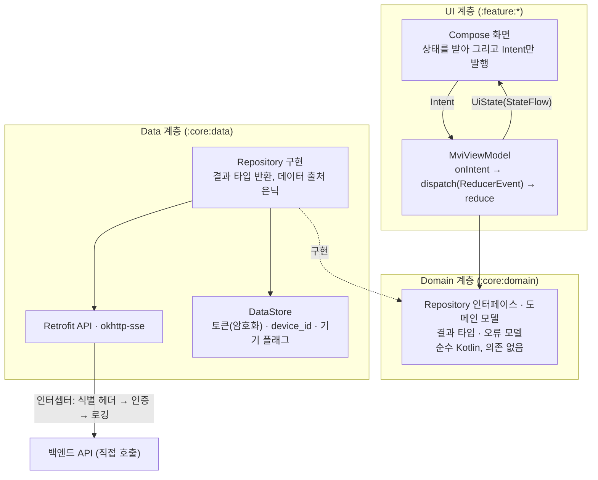

# 3-3-ANDROID-APP

이 문서는 **마냑 안드로이드 네이티브 앱의 플랫폼 구현 계약**을 정의합니다. 화면·사용자 흐름·API 계약 등 플랫폼 무관 스펙은 [`3-1-client.md`](./3-1-client.md)가 소유하며, 이 문서는 그 계약을 안드로이드 앱이 어떻게 충족하는지만 적습니다. 웹 구현의 병렬 문서는 [`3-2-web-app.md`](./3-2-web-app.md)입니다.

> **작성 상태** — 안드로이드 앱 확장은 **Phase 2** 범위입니다([`roadmap.md §R-4`](../planning/roadmap.md) — 로드맵은 "개발 시작"만 배정했고 1차 출시 범위는 정하지 않았습니다). 레포지토리(`../manyak-android`)는 프로젝트 초기 세팅 단계이며, 빌드 환경·정적 검사·CI처럼 코드로 검증된 값만 확정으로 적고(§3-3-2·§3-3-7), 나머지 절의 `작성 예정`·`결정 필요` 항목은 스펙이 확정되는 대로 채웁니다. 이 문서에 값이 없는 항목을 추측으로 채우지 않습니다.

```text
§3-3-1  문서 목적·범위와 관련 문서
§3-3-2  기술 환경·아키텍처와 요청 흐름  (빌드 환경·스택 확정 · 요청 흐름 작성 예정)
§3-3-3  내비게이션·화면 구조 대응       (플랫폼 구현 상태 매트릭스 · 대응 규칙 작성 예정)
§3-3-4  API 연동·인증 세션             (작성 예정)
§3-3-5  디바이스 지원·접근성            (작성 예정)
§3-3-6  관측 연동                      (작성 예정)
§3-3-7  테스트·Definition of Done      (CI·도구 확정 · 검수 범위 작성 예정)
```

| 항목      | 값                                                             |
| --------- | -------------------------------------------------------------- |
| 버전      | v0.9                                                           |
| 작성일    | 2026-08-02                                                     |
| 수정일    | 2026-08-22                                                     |
| 대상      | 마냑 안드로이드 네이티브 앱 (`Phase 2`)                        |
| 작성 목적 | 안드로이드 앱의 플랫폼 구현·연동·검수 기준을 정의합니다.       |
| 기준 코드 | `../manyak-android` (Kotlin, Jetpack Compose)                  |

---

## 3-3-1. 문서 목적·범위와 관련 문서

### 목적

이 문서는 마냑 안드로이드 앱 개발자가 플랫폼 구현(내비게이션, API 연동, 인증 세션, 디바이스 대응, 관측, 테스트)을 결정하는 기준입니다. 화면·흐름·API 계약은 [`3-1-client.md`](./3-1-client.md)를 기준으로 구현하고, 이 문서는 안드로이드에서만 성립하는 계약을 더합니다.

### 앱은 로그인 필수입니다 — 공통 계약의 플랫폼 예외

**안드로이드 앱은 로그인한 회원만 사용합니다**(2026-08-03 결정, 2026-08-22 재확인). 앱을 처음 실행하면 로그인 화면(앱 전용)이 뜨고, 로그인하기 전에는 어떤 화면도 열람할 수 없습니다. 웹은 게스트 우선 모델을 그대로 유지하므로, 이 결정은 **웹과 앱의 사용자 모델이 갈리는 유일한 지점**이자 이 문서 전체의 전제입니다.

그 결과 [`3-1-client.md`](./3-1-client.md)의 다음 계약은 **앱에 적용하지 않습니다**. 각 항목은 웹 전용으로 남고, 3-1에도 이 표를 가리키는 예외 표시를 둡니다.

| 3-1 계약 | 앱 비적용 사유 |
| --- | --- |
| FE-SCREEN-007 온보딩 | 로그인 화면(앱 전용)이 첫 실행 경험을 대체합니다(§3-3-3) |
| [§3-1-6](./3-1-client.md#3-1-6-게스트-데이터-모델) 게스트 데이터 모델 전체 | 게스트가 존재하지 않아 로컬 서재·사용량 카운터·배치 재조회·3-state 상태 판정이 모두 불필요합니다(§3-3-4) |
| 게스트 데이터 자동 이관(`POST /auth/migrate`) | 이관 대상인 로컬 게스트 데이터가 앱에 없습니다 |
| 402 응답의 게스트 분기(로그인 유도 다이얼로그) | 앱 사용자는 전원 회원이라 크레딧 부족 분기만 남습니다 |
| 게스트 체험 한도 선차단(로컬 카운터) | 위와 같음 |

**웹 게스트 데이터의 연속성은 앱에서 단절됩니다.** 웹에서 게스트로 만든 스토리는 그 브라우저에서 로그인해 이관해야 회원 서재에 들어오고, 앱은 회원 서재만 조회합니다. 앱이 별도 구제 경로를 제공하지 않는 것은 결정 사항입니다.

**결정 기록 — 앱은 게스트 모드를 두지 않습니다**

- **배경.** 웹과 같은 게스트 우선 모델을 앱에도 둘지가 갈림길입니다. 게스트 유입은 이미 웹이 담당하고 있습니다.

| 대안 | 채택 안 한 이유 |
| --- | --- |
| 앱도 게스트 우선 모델을 지원 | 로컬 서재·사용량 카운터·배치 재조회·깜빡임 없는 3-state 판정을 앱에 다시 구현해야 하고, 그 위에 자동 이관과 이관 1회 잠금까지 얹힙니다. 게스트 체험 한도가 `device_id`에 묶여 있어 구현 표면이 인증 전반으로 번집니다 |

- **영향.** 세션 상태에 게스트가 없어 판정이 **미확정 · 회원** 둘로 단순해지고(§3-3-4), 내비게이션이 인증 그래프와 메인 그래프로 갈립니다(§3-3-3). 대신 앱 단독으로는 로그인 전 제품 체험이 불가능합니다.

### 범위

- 기술 스택(Jetpack Compose 기반)과 요청 흐름
- 화면·내비게이션 구조와 공통 클라이언트 스펙([`3-1-client.md §3-1-3`](./3-1-client.md#3-1-3-화면별-스펙))의 대응 규칙, 플랫폼 구현 상태 매트릭스
- API 연동 방식과 인증 세션(토큰 보관·재발급)
- 디바이스 지원 범위, 접근성, 앱 라이프사이클 대응
- 관측(이벤트 발화 배선), 테스트 범위와 Definition of Done

### 제외 범위

- 화면별 스펙, 퍼널·채팅 흐름, 게스트 데이터 모델, API 사용 계약, 입력 검증 (담당: [`3-1-client.md`](./3-1-client.md))
- 백엔드 내부 구현과 API 상세 스키마 (담당: [`4-backend.md`](./4-backend.md))
- 이벤트 카탈로그, 식별자 정책, 지표 (원천: [`6-analytics.md`](./6-analytics.md))

### 관련 문서와 경계

| 문서                                   | 소유 영역                      | 이 문서와의 관계                   |
| -------------------------------------- | ------------------------------ | ---------------------------------- |
| [`3-1-client.md`](./3-1-client.md)     | 클라이언트 공통 화면·흐름·계약 | 이 문서가 구현하는 계약의 정본     |
| [`3-2-web-app.md`](./3-2-web-app.md)   | 웹 플랫폼 구현                 | 같은 공통 계약의 병렬 구현·선례    |
| [`4-backend.md`](./4-backend.md)       | API 명세, 데이터 모델          | API 상세를 위임                    |
| [`6-analytics.md`](./6-analytics.md)   | 이벤트·식별자·헤더·Sentry 기준 | 카탈로그는 위임, 발화 배선만 정의  |

### 웹 계약과의 대응 원칙

[`3-1-client.md`](./3-1-client.md)는 웹 구현을 기준 예시로 서술된 부분이 있습니다(플랫폼 표기 원칙). 안드로이드 앱은 같은 계약을 플랫폼 수단으로 충족하며, 확정 시 이 문서의 해당 절이 대응 규칙을 소유합니다. 예상되는 대응 지점 — **오른쪽 열의 구현 수단(SDK·라이브러리)은 현재 코드에 근거가 없으면 전부 `결정 필요`입니다.**

| 공통 계약(웹 기준 표기)                                        | 안드로이드 대응(이 문서가 확정할 것)                              |
| -------------------------------------------------------------- | ----------------------------------------------------------------- |
| URL 경로·히스토리(`push`/`replace`)                            | 내비게이션 그래프·백스택 규칙, 공유 URL 딥링크 여부 — 결정 필요 (§3-3-3) |
| 온보딩 진입 게이트(웹: 서버 프록시·쿠키)                       | 첫 실행 판정·온보딩 노출 방식 — 결정 필요 (§3-3-3)                |
| `localStorage` 게스트 서재·카운터·플래그, 상태 판정(SSR 3-state) | 로컬 저장소 기술·키, 깜빡임 없는 상태 판정 — 결정 필요 (§3-3-4)  |
| BFF 프록시·httpOnly 쿠키 토큰 세션                             | 백엔드 호출 창구(직접 호출 여부)·토큰 안전 보관 기술 — 결정 필요 (§3-3-4) |
| 소셜 로그인(웹: NextAuth OAuth 리다이렉트)                     | 소셜 로그인 방식·SDK — 결정 필요 (§3-3-4)                         |
| SSE 수신(웹: `fetch`+`ReadableStream`)                         | POST 본문을 실을 수 있는 SSE 클라이언트 라이브러리·구현 — 결정 필요 (§3-3-2) |
| 퍼널 이탈 가드(웹: `beforeunload`·히스토리 트래핑)             | 백 버튼·제스처 인터셉트, 라이프사이클 대응 (§3-3-5)               |
| 카카오톡 공유(웹: 카카오 JS SDK)                               | 카카오 공유 방식·SDK — 결정 필요 (§3-3-4)                         |
| 약관·개인정보처리방침 콘텐츠(웹: 웹 레포 TS 모듈)              | 콘텐츠 공급 방식 — 미정. 웹과 시행일·버전·본문 동일성 계약([`3-1-client.md`](./3-1-client.md) FE-SCREEN-010)은 준수 (§3-3-3) |
| 피드백 `platform: WEB`                                         | `platform: ANDROID` 고정 전송 (공통 계약 FE-SCREEN-006)           |
| 브라우저 지원·인앱 브라우저 감지 (앱은 개념 없음)              | OS 최소 버전·디바이스 지원 범위 (§3-3-5)                          |

---

## 3-3-2. 기술 환경·아키텍처와 요청 흐름

### 검증된 빌드 환경

기준 코드(`../manyak-android`)에서 확인된 값입니다(근거: `app/build.gradle.kts`, `gradle/libs.versions.toml`, `gradle/wrapper/gradle-wrapper.properties`, `gradle/gradle-daemon-jvm.properties`, `.github/workflows/android-ci.yml`).

| 분류                  | 값                                          |
| --------------------- | ------------------------------------------- |
| 언어                  | Kotlin 2.3.21                               |
| UI                    | Jetpack Compose(Compose BOM 2026.02.01), Material 3 |
| SDK                   | `compileSdk` 37 · `targetSdk` 37 · `minSdk` 24 |
| 빌드                  | Android Gradle Plugin 9.3.1, Gradle 9.5.0   |
| 빌드 JDK              | Java 25 — Gradle daemon toolchain(`gradle-daemon-jvm.properties` `toolchainVersion=25`), CI도 Temurin 25 사용 |
| Java 컴파일 호환성    | source/target 11 — 산출물의 바이트코드 타깃이며, 개발·빌드에 쓰는 JDK 버전(위 Java 25)과 다른 값입니다 |
| 정적 검사             | ktlint, detekt, Android lint                |
| 단위 테스트           | JUnit                                       |
| UI 테스트 기반        | Compose UI Test, Espresso                   |

### 확정 스택

도입 버전은 구현 시점의 안정판을 쓰고 `gradle/libs.versions.toml`이 정본이 됩니다. 이 표는 **무엇을 쓰는지와 그 이유**만 고정합니다.

| 분류 | 선택 | 선택 이유 |
| --- | --- | --- |
| UI 상태 관리 | **직접 구현 MVI**(`MviViewModel` 베이스 클래스) | 프레임워크 없이 `UiState`·`Intent`·`ReducerEvent` 3요소를 베이스 클래스가 강제하고, `reduce`가 순수 함수라 ViewModel 테스트가 입력·출력 대조로 끝납니다(아래 UI 상태 모델) |
| 의존성 주입 | **Hilt** | 컴파일 타임에 의존 그래프 오류를 잡고, ViewModel 생성 배선과 테스트 대역 교체의 표준 경로를 제공합니다. 애너테이션 처리는 KSP로 돌립니다 |
| 내비게이션 | **Navigation Compose**(타입 안전 라우트) | 공식 지원 라이브러리이며 Hilt 통합을 제공합니다. 목적지별 딥링크 선언을 지원해 이후 App Link 도입이 프레임워크 교체를 강제하지 않습니다 |
| HTTP·직렬화 | **Retrofit + OkHttp + kotlinx.serialization** | 인터셉터가 토큰 주입·식별 헤더·로깅의 단일 지점이 되고(§3-3-4), SSE도 같은 클라이언트 위에서 해결됩니다 |
| SSE | **okhttp-sse** | 채팅 턴은 POST 본문을 실은 요청의 응답을 SSE로 받는 계약이라([`3-1-client.md §3-1-5`](./3-1-client.md#3-1-5-채팅-플레이와-sse-스트리밍)) GET 전용 클라이언트를 쓸 수 없습니다. 이미 쓰는 OkHttp의 검증된 파서를 재사용합니다 |
| 로컬 저장(설정·토큰) | **DataStore** | 토큰·`device_id`·기기 플래그는 키-값이거나 단일 레코드라 질의가 필요 없습니다. 토큰은 저장 전에 암호화합니다(§3-3-4) |
| 이미지 로딩 | **Coil** | Compose 전용 API로 placeholder·실패 처리 계약을 그대로 구현합니다 |
| 소셜 로그인 | **Credential Manager**(구글) · **Kakao SDK v2**(카카오) | §3-3-4 |
| 분석 | **Amplitude Android SDK** | 이벤트 지표의 정본이 Amplitude입니다([`6-analytics.md §6-5`](./6-analytics.md)). 공통 이벤트 카탈로그를 재사용하며 플랫폼별로 이벤트를 새로 만들지 않습니다 |
| 크래시 | **Firebase Crashlytics** | 안드로이드 크래시·ANR 수집 도구가 없는 상태를 메웁니다. 웹·서버가 쓰는 Sentry와 도구가 갈리는 지점이므로 아래 결정 기록을 남깁니다 |
| 불변 컬렉션 | **kotlinx.collections.immutable** | `UiState`의 컬렉션 필드가 `List`면 Compose가 unstable로 보아 리컴포지션을 건너뛰지 못합니다(위 MVI 채택의 귀결) |

**백엔드는 직접 호출합니다.** 웹의 BFF 프록시에 대응하는 중간 계층을 두지 않습니다 — 웹이 프록시를 둔 이유는 브라우저 JS에 토큰을 노출하지 않기 위해서인데([`3-2-web-app.md §3-2-4`](./3-2-web-app.md#3-2-4-bff-프록시토큰-세션)), 앱은 토큰을 데이터 계층 안에 가둘 수 있어 같은 목적을 프록시 없이 달성합니다(§3-3-4).

**도입하지 않는 것** — MVI 프레임워크(직접 구현 — 아래 UI 상태 모델), BFF 대응 계층(위).

### 계층과 책임

계층은 **UI · Domain · Data** 셋입니다. 다만 Domain은 **Repository 인터페이스와 도메인 모델, 결과·오류 타입만 담는 얇은 계층**이며, UseCase 전면 도입과 DDD는 하지 않습니다(아래 결정 기록).



| 계층 | 책임 | 금지 |
| --- | --- | --- |
| Compose 화면 | 상태 렌더, 사용자 입력을 Intent로 발행 | 화면이 직접 데이터를 조회하지 않습니다(`MUST NOT`) |
| `MviViewModel` | `onIntent`로 입력 수신, 부수효과 수행, `ReducerEvent` 발행으로 상태 갱신 | Retrofit·DataStore를 직접 호출하지 않습니다(`MUST NOT`). `reduce` 안에서 부수효과를 수행하지 않습니다(`MUST NOT`) |
| Repository 인터페이스(domain) | 화면이 필요로 하는 데이터 동작의 계약 | 구현 수단(Retrofit·DataStore)을 노출하지 않습니다(`MUST NOT`) |
| Repository 구현(data) | 네트워크·로컬 접근, 응답을 결과 타입으로 변환 | UI 개념(문구·표시 상태)을 알지 않습니다(`MUST NOT`) |

**Repository는 인터페이스와 구현을 나눕니다**(`MUST`). ViewModel은 `:core:domain`의 인터페이스만 알고 구현은 `:core:data`가 제공합니다. 의존 역전으로 화면 계층이 네트워크 구현을 모르게 되어 테스트에서 가짜 구현을 끼울 수 있고, 모듈이 나뉘어 있으므로 `:feature:*`가 `:core:data`를 의존하지 않는 한 **구현 클래스에 접근할 수조차 없습니다**(아래 모듈 구조).

**결정 기록 — Clean Architecture를 전면 도입하지 않습니다(2026-08-22)**

- **배경.** 계층을 나누기로 한 이상 UseCase 계층과 계층별 모델 이중화까지 갈지가 갈림길입니다. 이 제품은 **도메인 규칙(크레딧 차감·체험 한도·소유권·멱등·엔딩 판정)이 전부 백엔드에 있습니다**([`4-backend.md`](./4-backend.md)).

| 대안 | 채택 안 한 이유 |
| --- | --- |
| UseCase 계층을 기본으로 둔다 | 규칙이 서버에 있어 대부분의 UseCase가 Repository 호출을 한 줄 위임하는 껍데기가 됩니다. 파일과 타입만 늘고 읽는 사람이 한 단계를 더 거칩니다 |
| 응답 모델을 계층마다 이중화한다(DTO ↔ 도메인 모델 기계적 매핑) | 서버 응답과 화면이 쓰는 모양이 같은 경우가 대부분이라, 매핑 코드가 필드를 그대로 옮기는 반복이 됩니다 |

- **영향.** 다음 조건에서만 예외를 둡니다(`SHOULD`).
    - **UseCase 추출** — 같은 로직을 ViewModel 두 곳 이상에서 쓰거나, ViewModel 하나가 Repository 셋 이상을 조율할 때.
    - **별도 도메인 모델** — 여러 응답을 합치거나, 화면이 쓰기에 응답 구조가 불편하거나, 서버 계약 변경으로부터 화면을 격리해야 할 때.
- 이 예외 조건을 만족하지 않는데 만든 UseCase·매핑은 리뷰에서 되돌립니다.

### 아직 결정하지 않은 것 — `결정 필요`

- **로컬 캐시용 DB(Room 등)** — 본인 리소스 캐시를 둘지, 둔다면 무엇을 얼마나 보관할지가 정해지지 않았습니다. 캐시 정책 없이 저장 기술만 고르면 근거가 없으므로 함께 확정합니다. 로그인 흐름에는 필요하지 않습니다. 다만 도입한다면 **사용자 귀속 저장소이므로 세션 종료 정리 계약에 참여해야 합니다**(§3-3-4 로그아웃 절차).
- **백그라운드 작업 수단**(WorkManager·Foreground Service) — 스토리 생성 백그라운드 복귀 계약([`3-1-client.md §3-1-4`](./3-1-client.md#3-1-4-스토리-생성-퍼널))의 앱 대응이 §3-3-5에서 정해진 뒤 판단합니다. 서버에 푸시 알림 계약이 없어 알림으로 대체할 수 없습니다.

**결정 기록 — 크래시 수집에 Sentry가 아닌 Firebase Crashlytics(2026-08-22)**

- **배경.** 웹·서버는 Sentry를 쓰고 [`6-analytics.md §6-6`](./6-analytics.md)의 관측 도구 표도 Sentry 기준입니다. 안드로이드 배선은 그 표에서 미정으로 열려 있어, 도구를 통일할지 안드로이드 표준을 따를지가 갈림길입니다.

| 대안 | 채택 안 한 이유 |
| --- | --- |
| Sentry Android로 통일 | 도구가 하나로 모여 `request_id`로 서버 로그와 잇기 쉽다는 이점은 분명합니다. 다만 안드로이드에서는 크래시·ANR·네이티브 심볼 수집이 Crashlytics의 기본 경로이고 Play Console 지표와도 연동됩니다. 플랫폼 표준 도구를 우선했습니다 |

- **영향.** `google-services.json` 배치와 CI 시크릿 주입, 릴리스 매핑 파일 업로드가 배포 구성에 추가됩니다(§3-3-7). 앱 오류는 Crashlytics에, 서버 오류는 Sentry에 남아 **한 사건을 두 도구에서 봐야 합니다** — 이 비용을 수용합니다. 재검토 조건 — 앱 오류를 서버 트레이스와 함께 추적해야 하는 요구가 실제로 생기면 다시 판단합니다.

---

## 3-3-3. 내비게이션·화면 구조 대응

[`3-1-client.md §3-1-3`](./3-1-client.md#3-1-3-화면별-스펙)의 화면 인벤토리(FE-SCREEN-001~012)와 흐름 인덱스(FLOW-001~009)를 안드로이드 내비게이션 구조로 대응합니다. 화면 전환 규칙(웹의 `push`/`replace` 표)과 동등한 백스택 계약, 딥링크 처리 방식은 `작성 예정`입니다.

### 플랫폼 구현 상태 매트릭스

**공통 계약 상태(`확정`·`방향 합의`·`미정`)·웹 구현 상태(`구현`·`부분 구현`·`미구현`)·로드맵 Phase의 용어·판정 기준과 값의 정본은 [`3-1-client.md §3-1-1` 상태 정본 표](./3-1-client.md#상태-정본-표)입니다.** 이 표는 **3-1의 화면(FE-SCREEN) 원자 행만** 그대로 옮겨 적습니다 — 공통 Phase·계약·웹 구현 상태를 흐름(FLOW) 단위 단일값으로 다시 합성하지 않습니다. Android 목표 범위·현재 상태 두 열만 이 문서가 소유하며, 흐름 단위 추적은 아래 **Android 흐름 구현 매트릭스**가 담당합니다. **Android 목표 범위는 로드맵에 1차 출시 범위가 없어 전 항목 `결정 필요`이고, Android 현재 상태는 전 항목 `미착수`입니다.** 목표 범위가 확정되면 이 표가 Android 추적의 정본이 됩니다.

| 공통 ID | 기능 | 로드맵 Phase | 공통 계약 상태 | 웹 구현 상태 | Android 목표 범위 | Android 현재 상태 | 플랫폼 차이·미결 사항 | 관련 절 |
| --- | --- | --- | --- | --- | --- | --- | --- | --- |
| FE-SCREEN-001 | 스토리 목록 기본 | MVP | 확정 | 구현 | 결정 필요 | 미착수 | 로컬 서재 저장 기술 결정 필요 | §3-3-4 |
| FE-SCREEN-001 | 카드 썸네일(US-2-7) | Phase 1 | 확정 | 구현 | 결정 필요 | 미착수 | — | §3-3-3 |
| FE-SCREEN-002 | 생성 퍼널 기본 | MVP | 확정 | 구현 | 결정 필요 | 미착수 | 이탈 가드의 앱 대응 결정 필요 | §3-3-5 |
| FE-SCREEN-002 | 백그라운드 생성 복귀·제작 임시 저장 | Phase 1 | 확정 | 구현 | 결정 필요 | 미착수 | 앱 라이프사이클 대응 결정 필요 | §3-3-5 |
| FE-SCREEN-002 | 키워드 단계 개편(KNK-621) | Phase 2 | 방향 합의 | 미구현 | 결정 필요 | 미착수 | 공통 계약 확정 후 판단 | — |
| FE-SCREEN-003 | 스토리 상세 기본 | MVP | 확정 | 구현 | 결정 필요 | 미착수 | — | §3-3-3 |
| FE-SCREEN-003 | 썸네일 히어로·이미지 뷰어·시작 설정 선택 | Phase 1 | 확정 | 구현 | 결정 필요 | 미착수 | 뷰어 닫기(뒤로가기 흡수) 수단 결정 필요 | §3-3-5 |
| FE-SCREEN-003 | 본 엔딩 배지 | Phase 1 | 확정 | 미구현 | 결정 필요 | 미착수 | 서버 계약 확정·구현 완료 — 클라이언트 연동만 잔여 | §3-3-3 |
| FE-SCREEN-004 | 채팅 목록·이어가기 기본 | MVP | 확정 | 구현 | 결정 필요 | 미착수 | — | §3-3-3 |
| FE-SCREEN-004 | 카드 썸네일 | Phase 1 | 확정 | 구현 | 결정 필요 | 미착수 | — | §3-3-3 |
| FE-SCREEN-005 | 채팅 기본(SSE 스트리밍·선택지·삭제) | MVP | 확정 | 구현 | 결정 필요 | 미착수 | SSE 클라이언트 결정 필요(§3-3-2) | §3-3-2 |
| FE-SCREEN-005 | 응답 재생성(US-6-10) | Phase 1 | 확정 | 구현 | 결정 필요 | 미착수 | — | §3-3-3 |
| FE-SCREEN-005 | 주요 사건 방향 선택지 | Phase 1 | 확정 | 구현 | 결정 필요 | 미착수 | — | §3-3-3 |
| FE-SCREEN-005 | 채팅 공유 발급 | Phase 1 | 확정 | 구현 | 결정 필요 | 미착수 | 공유 URL 생성·전달 방식 결정 필요 | §3-3-3 |
| FE-SCREEN-005 | 채팅 이미지 렌더(US-6-11) | Phase 1 | 확정 | 미구현 | 결정 필요 | 미착수 | 마커 계약 확정(`[[image:<imageKey>]]`), 서버·AI도 미구현 | §3-3-3 |
| FE-SCREEN-005 | 엔딩 도달 턴 배지(US-6-13) | Phase 1 | 확정 | 미구현 | 결정 필요 | 미착수 | 서버 계약 확정·구현 완료 — 클라이언트 연동만 잔여 | §3-3-3 |
| FE-SCREEN-005 | 엔딩 도달 후 계속 진행(US-6-14) | Phase 1 | 확정 | 구현 | 결정 필요 | 미착수 | 입력 잠금 조건을 스트리밍 여부로만 두면 충족 | §3-3-3 |
| FE-SCREEN-006 | 피드백 | MVP | 확정 | 구현 | 결정 필요 | 미착수 | `platform: ANDROID` 고정 전송 | §3-3-1 |
| FE-SCREEN-007 | 온보딩 | MVP | 확정 | 구현 | 결정 필요 | 미착수 | 첫 실행 판정·게이트 방식 결정 필요 | §3-3-3 |
| FE-SCREEN-008 | 인증·마이 기본 | Phase 1 | 확정 | 구현 | 결정 필요 | 미착수 | 소셜 로그인 방식·SDK, 토큰 보관 기술 결정 필요 | §3-3-4 |
| FE-SCREEN-008 | 소모량 사전 고지 — 서비스 안내 정책 수치 | Phase 1 | 확정 | 구현 | 결정 필요 | 미착수 | — | §3-3-3 |
| FE-SCREEN-008 | 소모량 사전 고지 — 채팅 헤더·각 소모 지점 | Phase 1 | 확정 | 미구현 | 결정 필요 | 미착수 | 웹도 미구현 — 클라이언트 공통 잔여 | §3-3-3 |
| FE-SCREEN-009 | 일반 제작·스토리 수정 | Phase 1 | 확정 | 미구현 | 결정 필요 | 미착수 | 서버 API 계약 확정·구현 완료 — 클라이언트 연동만 잔여 | — |
| FE-SCREEN-010 | 약관·개인정보처리방침 | Phase 1 | 확정 | 구현 | 결정 필요 | 미착수 | 콘텐츠 공급 방식 결정 필요. 웹과 시행일·버전·본문 동일성 필수 | §3-3-3 |
| FE-SCREEN-011 | 서비스 안내 | Phase 1 | 확정 | 구현 | 결정 필요 | 미착수 | 게스트 저장 고지 문구를 기기·앱 데이터 기준으로 조정 | §3-3-3 |
| FE-SCREEN-012 | 채팅 공유 열람 | Phase 1 | 확정 | 구현 | 결정 필요 | 미착수 | 공유 URL을 앱 딥링크로 열지, 웹으로 열지 결정 필요 | §3-3-3 |

- **웹 전용 항목(Android 비적용)** — 인앱 브라우저 감지·로그인 핸드오프, BFF 프록시, SSR·하이드레이션, 브라우저 지원·SEO 기준([`3-2-web-app.md`](./3-2-web-app.md) 소유). 공통 계약이 아니므로 위 표에 두지 않으며 Android 상태와 섞지 않습니다.
- **별도 결정 필요 항목** — 공유 URL 딥링크 처리(FE-SCREEN-012), 법적 콘텐츠 공급(FE-SCREEN-010), 온보딩 첫 실행 판정(FE-SCREEN-007), §3-3-4의 전 항목, §3-3-6의 식별자 플랫폼 매핑.

### Android 흐름 구현 매트릭스

흐름(FLOW) 단위 추적표입니다. **공통 계약·웹 구현 상태·로드맵 Phase 열을 두지 않습니다** — 그 세 축은 화면 원자 행이 정본이고, 흐름 단위로 다시 합성하면 정의되지 않은 파생값이 생기기 때문입니다. 이 표는 [`3-1-client.md §3-1-3`](./3-1-client.md#3-1-3-화면별-스펙) 흐름 인덱스의 **FLOW-001~009 전체**(`Phase 1 · 계획` 확장인 FLOW-002A·002B 포함)를 담고, Android 관점 값만 관리합니다. 각 흐름이 어떤 화면 행의 상태에 걸려 있는지는 `구성 화면` 열에서 위 상태 매트릭스로 찾습니다.

| 흐름 ID | 이름 | 구성 화면 | Android 목표 범위 | Android 현재 상태 | 미결 사항 |
| --- | --- | --- | --- | --- | --- |
| FLOW-001 | 첫 방문 온보딩 | 001 · 002 · 007 | 결정 필요 | 미착수 | 첫 실행 판정·게이트 방식 |
| FLOW-002 | 스토리 생성 | 002 · 005 | 결정 필요 | 미착수 | 이탈 가드·백그라운드 복귀 대응 |
| FLOW-002A | 일반 제작 | 002 · 003 · 009 | 결정 필요 | 미착수 | 웹도 미구현 — 클라이언트 공통 잔여 |
| FLOW-002B | 스토리 수정 | 003 · 009 | 결정 필요 | 미착수 | 웹도 미구현 — 클라이언트 공통 잔여 |
| FLOW-003 | 탐색 → 플레이 시작 | 001 · 003 · 005 | 결정 필요 | 미착수 | — |
| FLOW-004 | 채팅 플레이(스트리밍) | 005 | 결정 필요 | 미착수 | SSE 클라이언트(§3-3-2) |
| FLOW-005 | 채팅 이어가기 | 004 · 005 | 결정 필요 | 미착수 | — |
| FLOW-006 | 스토리·채팅 삭제 | 003 · 004 · 005 | 결정 필요 | 미착수 | — |
| FLOW-007 | 피드백 제출 | 006 | 결정 필요 | 미착수 | `platform: ANDROID` 고정 전송 |
| FLOW-008 | 잘못된 경로 접근 | 999 Not Found · 001 | 결정 필요 | 미착수 | URL 개념이 없어 딥링크 실패 처리로 대응 — 방식 결정 필요 |
| FLOW-009 | 서비스 정보 열람 | 008 · 010 · 011 | 결정 필요 | 미착수 | 법적 콘텐츠 공급 방식 |


---

## 3-3-4. API 연동·인증 세션 — `작성 예정`

API 사용 계약([`3-1-client.md §3-1-7`](./3-1-client.md#3-1-7-api-연동에러-처리-계약))을 따릅니다. **논리적 식별자(`device_id`·`session_id`·`user_id`)의 의미·타입과 `X-Manyak-*` 헤더 계약은 확정이며**(정본: [`6-analytics.md §6-2`](./6-analytics.md)·[`§6-6-2`](./6-analytics.md), §3-3-6과 같은 서술), 다음 항목만 이 절에서 확정합니다. **아래는 전부 `결정 필요`이며 현재 코드에 근거가 없습니다.**

- 백엔드 호출 창구 — API 직접 호출 여부(§3-3-2)
- 식별 헤더(`X-Manyak-Device-Id`·`X-Manyak-Session-Id`) 주입 배선 — 헤더 계약 자체는 확정이고, Android에서 논리 식별자를 생성·보관·복원(reset 포함)하는 매핑이 §3-3-6 결정 필요 항목
- 인증 토큰 안전 보관 기술과 재발급 구조
- 소셜 로그인 방식·SDK, 계정 연동 인증 방식
- 카카오 공유 방식·SDK
- 게스트 데이터 로컬 저장소 기술·키([`3-1-client.md §3-1-6`](./3-1-client.md#3-1-6-게스트-데이터-모델)의 안드로이드 대응)와 깜빡임 없는 상태 판정 구조

---

## 3-3-5. 디바이스 지원·접근성 — `작성 예정`

지원 OS 최소 버전(빌드 기준 `minSdk` 24 — 제품 지원 선언은 별도 결정), 화면 크기 대응, 접근성(TalkBack·포커스·터치 타깃), 앱 라이프사이클(백그라운드 전환 중 생성 복구 — [`3-1-client.md §3-1-4`](./3-1-client.md#3-1-4-스토리-생성-퍼널) 백그라운드 생성 복귀 계약의 대응), 퍼널 이탈 가드의 백 버튼·제스처 인터셉트 대응을 이 절에서 확정합니다.

---

## 3-3-6. 관측 연동 — `작성 예정`

이벤트 카탈로그·식별자 정책은 [`6-analytics.md`](./6-analytics.md)가 소유합니다. 다음 **원칙**은 확정입니다 — Android는 **공통 이벤트 카탈로그를 재사용해야 하고**(이벤트 이름·프로퍼티를 플랫폼별로 새로 만들지 않으며 `platform`·`os_name` 등으로 웹과 구분), 웹과 **동일한 논리적 `device_id`·`session_id`·`user_id` 의미·타입과 API 헤더 계약(`X-Manyak-*`)을 충족해야 합니다**([`6-analytics.md §6-2`](./6-analytics.md)·[`§6-6-2`](./6-analytics.md)).

다만 **카탈로그 전체가 구현 가능한 확정 계약인 것은 아닙니다** — `analytics_creation_id`(분석 이벤트의 `creation_id`) 관련 프로퍼티·지표는 문서 계약과 현재 구현이 어긋난 미해결 구간이라([`6-analytics.md §6-8-7`](./6-analytics.md)), Android는 그 간극이 정리되기 전까지 해당 프로퍼티를 임의로 추가하지 않고 웹과 동일한 현재 계약을 따릅니다. 미정인 나머지는 계약이 아니라 **플랫폼 매핑**입니다.

`결정 필요` 항목:

- 분석 SDK 제품 선택과 초기화 구성
- 논리 식별자(`device_id`·`session_id`)를 Android에서 생성·보관·복원(reset 포함)하는 방식
- Sentry Android 배선

> **리스크 — Android 식별자 플랫폼 매핑 미결.** 게스트 체험 한도와 자동 이관(핸드오프 시드 포함)이 `device_id`에 의존하는데([`4-backend.md §4-3-7`](./4-backend.md)·[`6-analytics.md §6-2`](./6-analytics.md)), Android에서 `device_id`를 생성·보관·복원하는 매핑이 결정되지 않았습니다. 이 매핑이 확정되기 전에는 게스트 한도·이관 흐름의 Android 구현을 시작할 수 없습니다.

---

## 3-3-7. 테스트·Definition of Done

### 검증된 도구·CI

기준 코드에서 확인된 값입니다(근거: `app/build.gradle.kts`, `.github/workflows/android-ci.yml`).

- 단위 테스트: JUnit. UI 테스트 기반: Compose UI Test·Espresso.
- 정적 검사: ktlint·detekt·Android lint — 모두 `./gradlew check`에 물려 있습니다.
- CI(GitHub Actions): `dev`·`main` 대상 PR·push에서 Temurin **Java 25**(Gradle daemon toolchain과 일치 — 어긋나면 데몬용 JDK를 따로 내려받아 빌드가 느려짐)를 설정한 뒤 `./gradlew check` → `./gradlew assembleDebug`를 실행하고 리포트를 아티팩트로 남깁니다.

### Definition of Done — `작성 예정`

화면·흐름 단위 검수 기준은 §3-3-3 매트릭스의 **Android 목표 범위가 확정된 뒤** 그 범위에 연동해 정의합니다(목표 범위가 미정이므로 전체 화면 완료를 요구하지 않습니다). 현재 확정된 최소 기준은 다음뿐입니다.

- `./gradlew check`(ktlint·detekt·lint·단위 테스트)와 `./gradlew assembleDebug`가 통과해야 합니다(CI 게이트와 동일).
