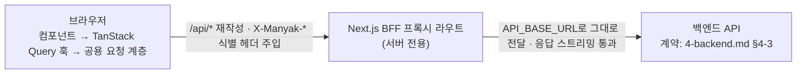

# 3-FRONTEND

이 문서는 **마냑 서비스의 웹 프론트엔드가 구현하고 QA가 검수해야 할 계약**을 정의합니다. 화면, 사용자 흐름, 화면 상태, API 연동, 오류 처리, 검수 기준을 다룹니다.

각 항목은 조건, 입력, 출력, 화면 상태, 예외 처리, 완료 기준을 구체값으로 적습니다. 코드 구조·컴포넌트 목록·환경 변수 등 구현 세부는 별도 개발 문서가 소유합니다.

```text
§3-1   문서 목적·범위와 관련 문서
§3-2   검증된 기술 환경과 핵심 아키텍처
§3-3   라우팅·레이아웃·공통 셸
§3-4   화면별 스펙
§3-5   스토리 생성 퍼널
§3-6   채팅 플레이와 SSE 스트리밍
§3-7   게스트 데이터 모델
§3-8   API 연동·에러 처리 계약
§3-9   입력·폼 검증 규칙
§3-10  반응형·접근성·브라우저 지원
§3-11  관측 연동
§3-12  테스트·Definition of Done
§3-13  MVP 제외 범위와 스펙-구현 간극
```

### 읽는 순서

- **처음 보는 사람** — §3-1(경계)과 §3-2(아키텍처 큰 그림)를 먼저 보고, §3-3의 라우팅 테이블과 §3-4 도입의 흐름 인덱스로 전체 표면을 잡습니다.
- **구현자** — 담당 화면의 §3-4 스펙 → 관련 상세 절(§3-5~§3-9) → §3-8 API 연동·에러 처리 순서로 봅니다. 각 결정 지점의 "결정 기록"(배경·대안·영향)이 왜 이 계약인지의 근거입니다.
- **리뷰·QA** — 각 화면·절의 검수 기준과 §3-12 e2e 매핑, §3-13 간극 표(G1~G6)에서 시작해 본문을 역참조합니다.

| 항목      | 값                                                                |
| --------- | ----------------------------------------------------------------- |
| 버전      | v0.17                                                             |
| 작성일    | 2026-07-01                                                        |
| 수정일    | 2026-07-28                                                        |
| 대상      | 마냑 웹 프론트엔드                                                |
| 작성 목적 | 프론트엔드 화면, 상태, 사용자 흐름, 연동, 검수 기준을 정의합니다. |
| 기준 코드 | `../manyak-web` (Next.js 16 App Router, React 19)                 |

---

## 3-1. 문서 목적·범위와 관련 문서

### 목적

이 문서는 마냑 웹 프론트엔드 개발자가 화면, 사용자 흐름, API 연동, 검수 기준을 구현하는 기준입니다. 프론트엔드는 이 문서를 기준으로 구현하고, QA는 이 문서를 기준으로 검수합니다.

### 범위

- 화면 구조, 라우팅, 공통 셸과 네비게이션
- 스토리 생성 퍼널과 채팅 SSE 스트리밍
- 게스트(익명) 데이터 모델
- API 연동 방식(프록시, 헤더, 상태 코드 분기, 에러 처리)
- 화면 상태(로딩, 빈 상태, 에러), 입력 검증
- 반응형·접근성, 관측 연동
- 테스트·검수 기준

MVP 본문은 로그인 없는 전원 게스트 기준입니다. Phase 1 로그인·마이 페이지·BFF 토큰 세션·회원 서재·크레딧 잔액과 출석·소모량 고지·체험 한도 처리는 `Phase 1 · 구현`입니다. 일반 제작·스토리 수정 흐름은 `Phase 1 · 계획` 라벨로 본문에 포함됩니다(FE-SCREEN-008·009, 토큰 세션은 [§3-8](#3-8-api-연동에러-처리-계약)).

### 제외 범위

- 백엔드 내부 구현과 API 상세 스키마 (담당: [`4-backend.md`](./4-backend.md))
- AI 요청·응답 계약과 프롬프트 (담당: [`5-ai-server.md`](./5-ai-server.md))
- 이벤트 카탈로그, 식별자 정책, 지표 (원천: [`6-analytics.md`](./6-analytics.md))
- 스토리 탐색, 좋아요·댓글·공유, 전문가 모드, 관리자 (MVP 제외, [§3-13](#3-13-mvp-제외-범위와-스펙-구현-간극))
- 코드 구조, 컴포넌트 래퍼 목록, 환경 변수, 배포 런북 (프론트엔드 개발 문서·README가 소유)

### 관련 문서와 경계

| 문서                                       | 소유 영역                      | 이 문서와의 관계                           |
| ------------------------------------------ | ------------------------------ | ------------------------------------------ |
| [`1-background.md`](./1-background.md)     | 서비스 배경, MVP 범위          | 제품 방향의 상위 근거                      |
| [`2-user-stories.md`](./2-user-stories.md) | 화면별 사용자 요구(US ID)      | 각 화면·흐름을 US ID로 추적                |
| [`4-backend.md`](./4-backend.md)           | API 명세, 데이터 모델          | API 상세를 위임                            |
| [`5-ai-server.md`](./5-ai-server.md)       | AI 계약, 스트리밍 규격         | 스트림 이벤트 계약 위임                    |
| [`6-analytics.md`](./6-analytics.md)       | 이벤트·식별자·헤더·Sentry 기준 | 카탈로그는 위임, 프론트는 발화 배선만 정의 |

### 작성 원칙

- 구현된 동작을 기준으로 씁니다. 배경·유저스토리 문서와 코드가 다르면 코드를 기준으로 하고 차이는 [§3-13](#3-13-mvp-제외-범위와-스펙-구현-간극)에 기록합니다.
- `적절히`, `필요 시` 같은 모호한 표현 대신 상수와 조건을 적습니다.
- 이벤트·API 스키마·식별자는 원천 문서를 교차 참조하고 중복 서술하지 않습니다.
- 화면과 흐름에 US ID와 e2e 스펙을 연결합니다.
- 갈림길이 있었던 결정은 해당 결정 지점에 "결정 기록"(배경·대안·영향)으로 근거를 남깁니다([`4-backend.md`](./4-backend.md)와 동일한 형식).
- API 경로는 `/api/v1` prefix를 생략해 표기합니다. 실제 요청은 BFF 프록시(`/api/*`)를 거쳐 백엔드로 전달됩니다([§3-8](#3-8-api-연동에러-처리-계약)).

### 구현 상태 라벨

이 문서는 MVP 이후 항목을 `{로드맵 Phase} · {구현 상태}` 두 축의 라벨로 구분합니다. 로드맵 Phase는 [`roadmap.md`](../planning/roadmap.md)가 기능을 배정한 단계이고, 구현 상태는 `구현`(코드 반영 완료)과 `계획`(미구현, 방향만 합의) 2종입니다. `MVP`(= `Phase 0 · 구현`)와 `계획`(Phase 미배정)은 관례 단축형이며, 라벨이 없는 항목은 모두 `MVP`입니다.

이 문서의 라벨은 **프론트엔드 코드 기준**입니다. 서버 측 구현 상태는 [`4-backend.md §4-1`](./4-backend.md)의 라벨이 정본이며, 프론트엔드 `계획` 항목 중 다수(크레딧·회원 서재·일반 제작·스토리 수정·AI 응답 재생성)는 서버가 이미 `Phase 1 · 구현`입니다 — 남은 것은 프론트엔드 연동입니다.

| 라벨             | 의미                                    | 해당 항목                                                                                                                                                                                                                                                                                                                                                                                                                                                                                                                                        |
| ---------------- | --------------------------------------- | ------------------------------------------------------------------------------------------------------------------------------------------------------------------------------------------------------------------------------------------------------------------------------------------------------------------------------------------------------------------------------------------------------------------------------------------------------------------------------------------------------------------------------------------------ |
| `MVP`            | Phase 0 범위. 구현 완료, 서비스 사용 중 | 현재 본문 전체                                                                                                                                                                                                                                                                                                                                                                                                                                                                                                                                   |
| `Phase 1 · 구현` | Phase 1 범위. 코드 반영 완료            | Google 로그인·로그아웃·BFF 토큰 세션·자동 마이그레이션·회원 서재·마이 페이지·이관 1회 안내·약관 동의 고지·초대 코드 공유·입력·신규 가입 온보딩·크레딧 잔액·출석·소모량 고지·체험 한도 선차단·402 다이얼로그(FE-SCREEN-008, [§3-8](#3-8-api-연동에러-처리-계약))·서비스이용약관·개인정보처리방침 페이지(FE-SCREEN-010)·서비스 안내 페이지(FE-SCREEN-011)·상세 썸네일 히어로·이미지 뷰어·시작 설정 선택(FE-SCREEN-003)·AI 응답 재생성([§3-6](#3-6-채팅-플레이와-sse-스트리밍))·인앱 브라우저 감지·탈출([§3-10](#3-10-반응형접근성브라우저-지원))·채팅 공유 발급·열람(FE-SCREEN-012, [§3-6](#3-6-채팅-플레이와-sse-스트리밍))   |
| `Phase 1 · 계획` | Phase 1 범위. 미구현, 방향만 합의됨     | 일반 제작·스토리 수정(FE-SCREEN-009, [§3-9](#3-9-입력폼-검증-규칙)). 채팅 이미지·엔딩 도달 표시([§3-6](#3-6-채팅-플레이와-sse-스트리밍))·목록 카드 썸네일(FE-SCREEN-001·004)·본 엔딩 표시(FE-SCREEN-003). Safari 렌더링·애니메이션·입력 UX 개선·인앱 게스트 허용·로그인 핸드오프([§3-10](#3-10-반응형접근성브라우저-지원)). 카카오 로그인 버튼·카카오톡 인앱 직접 로그인(FE-SCREEN-008, [§3-10](#3-10-반응형접근성브라우저-지원))                                                                                                                                                                                                                                                        |

---

## 3-2. 검증된 기술 환경과 핵심 아키텍처

### 기술 환경

| 분류        | 기술                                                                                     |
| ----------- | ---------------------------------------------------------------------------------------- |
| 프레임워크  | Next.js 16.2.6 (App Router), React 19.2.4, React Compiler                                |
| 데이터 패칭 | TanStack Query 5, Orval 8 (OpenAPI 코드 생성)                                            |
| UI          | Base UI, shadcn/ui, CVA, Tailwind CSS 4, motion, vaul, sonner, next-themes               |
| 검증·타입   | TypeScript 5, Zod 4                                                                      |
| 관측        | Amplitude(`@amplitude/unified`), Sentry(`@sentry/nextjs`)                                |
| 테스트      | Vitest(유닛), Playwright(e2e·비주얼 회귀: Pixel 5 전체, Desktop Chrome·iPhone 13 스모크) |
| 런타임      | Node.js 20+, pnpm 10.28.2                                                                |

### 핵심 아키텍처

이 앱을 규정하는 축입니다. 일반적인 인증형 대시보드 SPA와 다른 지점이며, 각 항목은 지정한 섹션에서 상세합니다.

| #   | 특징               | 요지                                                                                      | 상세                                          |
| --- | ------------------ | ----------------------------------------------------------------------------------------- | --------------------------------------------- |
| 1   | 전원 게스트(익명)  | 로그인·회원가입·권한이 없습니다. 사용자 식별은 Amplitude `device_id`뿐입니다.             | [§3-13](#3-13-mvp-제외-범위와-스펙-구현-간극) |
| 2   | BFF 프록시         | 브라우저는 백엔드를 직접 호출하지 않고 `/api/*`가 `API_BASE_URL`로 전달합니다.            | [§3-8](#3-8-api-연동에러-처리-계약)           |
| 3   | 게스트 데이터 모델 | "내 스토리·채팅"은 `localStorage`의 공개 ID 배열을 `POST /…/batch`로 재조회해 구성합니다. | [§3-7](#3-7-게스트-데이터-모델)               |
| 4   | 생성 퍼널          | `/stories/new` 단일 라우트에서 로컬 상태로 4단계를 전환합니다.                            | [§3-5](#3-5-스토리-생성-퍼널)                 |
| 5   | 채팅 SSE 스트리밍  | AI 출력을 토큰 단위로 스트리밍합니다.                                                     | [§3-6](#3-6-채팅-플레이와-sse-스트리밍)       |

### 요청 흐름



`API_BASE_URL`은 클라이언트 번들에 노출되지 않는 서버 전용 값입니다. 브라우저는 항상 동일 출처 `/api`만 호출합니다([§3-8](#3-8-api-연동에러-처리-계약)).

> React Compiler를 사용하므로 `useMemo`, `useCallback`을 직접 작성하지 않습니다.

---

## 3-3. 라우팅·레이아웃·공통 셸

### 라우팅 테이블

경로는 MVP 6개 화면 라우트와 1개 프록시 라우트에 `/login`·`/my`·`/my/invite`·`/terms`·`/privacy`(구현 완료), `Phase 1 · 계획` 2개(`/stories/new/general`, `/stories/[id]/edit`), `계획` 1개(`/my/about`)를 더해 구성됩니다. 여기에 화면이 아닌 검색 크롤러용 메타데이터 라우트 2개(`/robots.txt`·`/sitemap.xml`)가 있습니다. 회원가입 별도 경로·대시보드·설정·관리자 경로는 없습니다. 동적 세그먼트 `[id]`는 문자열입니다.

| 경로                                    | 화면 ID       | 라우트 그룹 | 화면                      | 레이아웃 chrome        |
| --------------------------------------- | ------------- | ----------- | ------------------------- | ---------------------- |
| `/`                                     | FE-SCREEN-001 | `(main)`    | 스토리 목록(홈)           | 헤더 + 하단탭          |
| `/stories/new`                          | FE-SCREEN-002 | `(story)`   | 스토리 생성 퍼널          | 없음(자체 헤더)        |
| `/stories/[id]`                         | FE-SCREEN-003 | `(story)`   | 스토리 상세               | 없음(자체 헤더)        |
| `/chats`                                | FE-SCREEN-004 | `(main)`    | 채팅 목록                 | 헤더 + 하단탭          |
| `/chats/[id]`                           | FE-SCREEN-005 | `(chat)`    | 채팅 화면                 | 없음(자체 헤더)        |
| `/my/feedback`                          | FE-SCREEN-006 | `(my)`      | 피드백                    | 뒤로가기 헤더(탭 없음) |
| `/onboarding`                           | FE-SCREEN-007 | `(onboarding)` | 온보딩                 | 로고 헤더(탭 없음)     |
| `*`                                     | FE-SCREEN-999 | —           | Not Found                 | 최소 셸                |
| `/api/[...path]`                        | —             | —           | BFF 프록시(라우트 핸들러) | —                      |
| `/robots.txt` `/sitemap.xml`            | —             | —           | 검색 크롤러 메타데이터 라우트 | —                  |
| `/login`                                | FE-SCREEN-008 | `(auth)`    | 로그인                    | 뒤로가기 헤더(탭 없음) |
| `/my`                                   | FE-SCREEN-008 | `(main)`    | 마이 페이지               | 헤더 + 하단탭          |
| `/my/invite`                            | FE-SCREEN-008 | `(my)`      | 친구 초대                 | 뒤로가기 헤더(탭 없음) |
| `/stories/new/general` `Phase 1 · 계획` | FE-SCREEN-009 | `(story)`   | 일반 제작 폼              | 없음(자체 헤더)        |
| `/stories/[id]/edit` `Phase 1 · 계획`   | FE-SCREEN-009 | `(story)`   | 스토리 수정(동일 폼)      | 없음(자체 헤더)        |
| `/terms` `Phase 1 · 구현`               | FE-SCREEN-010 | `(legal)`   | 서비스이용약관            | 뒤로가기 헤더(탭 없음) |
| `/privacy` `Phase 1 · 구현`             | FE-SCREEN-010 | `(legal)`   | 개인정보처리방침          | 뒤로가기 헤더(탭 없음) |
| `/my/about` `Phase 1 · 구현`            | FE-SCREEN-011 | `(my)`      | 서비스 안내               | 뒤로가기 헤더(탭 없음) |
| `/share/[shareId]` `Phase 1 · 구현`          | FE-SCREEN-012 | `(share)`   | 채팅 공유 열람            | 없음(자체 헤더)        |

오버레이 화면(별도 라우트 없음): 옵션 메뉴+삭제 확인 다이얼로그(스토리 상세), 썸네일 이미지 뷰어(FE-SCREEN-003), 채팅 옵션 메뉴+채팅 삭제 확인 다이얼로그(FE-SCREEN-005, [§3-6](#3-6-채팅-플레이와-sse-스트리밍)), 키워드 추가 다이얼로그, 선택 키워드 드로어, 생성 이탈 확인 다이얼로그.

### 라우팅 규칙

- **기본 화면은 접근 제어가 없습니다.** `/login`·`/my`는 게스트·회원 모두 접근 가능하며(회원이 `/login`에 진입해도 차단하지 않음, `/my`는 회원이면 프로필·로그아웃을, 게스트면 로그인 버튼을 표시), 경로 가드는 두지 않습니다. `/my/invite`는 회원 전용 화면이라 게스트를 `/login`으로 보냅니다. 로그인 성공 후 홈으로 이동하는 것은 화면 내 이동이지 공통 라우트 가드가 아닙니다.
- **라우트 그룹은 권한이 아니라 chrome을 가릅니다.** `(main)`은 상단 헤더와 하단 탭을 두르는 탭 화면, `(story)`·`(chat)`·`(auth)`·`(my)`·`(legal)`·`(share)`는 헤더·하단탭이 없는(또는 뒤로가기 헤더만 있는) 전체 화면입니다.
- 존재하지 않는 경로는 Not Found 화면을 표시하고 홈(`/`)으로 돌아가는 링크를 제공합니다.
- **문서 제목(브라우저 탭)은 `제목 - 마냑`으로 통일합니다.** 루트 레이아웃이 제목 템플릿을 선언하므로 각 화면은 자기 제목만 선언하면 되고, 제목을 선언하지 않은 화면은 기본 문서 제목을 표시합니다 — 현재 값은 `마냑 - 나만의 스토리를 만들고 채팅으로 이어나가는 AI 스토리챗 서비스`이고, 정본은 `src/constants/site.ts`의 `DEFAULT_TITLE`입니다(카피는 변동값이라 이 문서의 값은 예시입니다). 브랜드명 단독으로는 검색엔진과 사용자가 서비스 성격을 알 수 없어 기본값에 카테고리 문구를 붙입니다(KNK-713). 고유 제목을 쓰는 화면은 스토리 제목을 쓰는 스토리 상세·채팅방·공유 열람과, 본문 정본의 문서 제목을 정적으로 선언하는 약관·개인정보처리방침입니다(KNK-713 — 둘 다 색인 대상이라 SERP에 구별되는 제목이 필요합니다). 스토리 제목을 쓰는 셋은 로그인 세션·게스트 식별자나 공유 UUID로 상세를 읽어야 해 서버 메타데이터만으로는 제목이 확정되지 않으므로, 클라이언트에서 데이터를 받은 뒤 제목을 덮어씁니다 — 제목이 비어 있는 동안에는 손대지 않아 서버가 렌더한 기본 제목이 남습니다. 공유 열람은 서버가 공유본을 직접 읽어 링크 미리보기용 메타데이터도 만들지만, 그 조회가 실패해도 탭 제목은 클라이언트 덮어쓰기로 같은 형식을 유지합니다.
- **검색 크롤러는 온보딩 게이트를 적용받지 않습니다.** 크롤러는 쿠키를 보내지 않아 항상 신규 방문자로 판정되고, 그 결과 대표 URL(`/`)이 307 리다이렉트로만 응답해 색인되지 않습니다(KNK-699). 프록시는 User-Agent로 검색 크롤러(Googlebot·Yeti·Daumoa 등)와 링크 미리보기 스크래퍼(카카오톡·페이스북 등)를 판별해 게이트 없이 통과시킵니다. 봇에게 별도 콘텐츠를 만들어 주는 것이 아니라 게이트만 우회하므로 봇이 받는 응답은 열람 쿠키를 가진 사용자가 받는 것과 동일합니다. 판별 키워드는 실사용자 인앱브라우저 UA와 겹치지 않아야 합니다 — 다음 앱이 `DaumApps`이므로 검색봇은 `daumoa`로, 카카오톡 인앱이 `KAKAOTALK`이므로 스크랩봇은 `kakaotalk-scrap`으로 정확히 지정합니다. AI/LLM 크롤러는 수집 허용 정책이 별도 결정 사안이라 이 목록에 포함하지 않습니다.
- **색인 범위는 `/robots.txt`와 페이지 메타데이터가 정합니다.** 개인화·인증·생성 화면(`/chats`·`/my`·`/login`·`/stories/`)과 BFF 프록시(`/api/`)를 수집에서 제외하고, `/sitemap.xml`에는 정적 공개 페이지(`/`·`/terms`·`/privacy`)만 싣습니다. 온보딩은 퍼널 페이지이고 대표 URL이 홈이므로 페이지 자체에 `noindex`를 선언합니다 — robots.txt로 크롤을 막으면 크롤러가 그 지시를 읽지 못해 기존 색인이 남으므로 크롤은 허용합니다. 유효한 채팅 공유 열람(`/share/[shareId]`)은 공유자가 외부 공개를 선택한 콘텐츠로 보고 색인을 허용합니다. 공유 URL은 목록 API가 없는 동적 URL이라 사이트맵에는 싣지 않고 외부 공유 링크를 통해 검색 엔진이 발견하게 합니다. 삭제·오류 등 서버 메타데이터 조회에 실패한 공유 URL은 검색 결과에 남지 않도록 `noindex, nofollow`를 반환합니다(KNK-713).
- **브랜드 엔티티는 구조화 데이터로 선언합니다.** 루트 레이아웃이 `WebSite`·`Organization` JSON-LD(schema.org)를 모든 화면 `<head>`에 싣습니다. '마냑'은 검색량이 큰 '마약'과 한 글자 차이라 구글이 오타로 간주해 대체 검색어를 먼저 보여주므로, `alternateName`에 로마자 표기(`manyak`·`Manyak`)를 함께 선언해 브랜드명임을 학습시키고, `sameAs`로 공식 SNS 프로필(인스타그램)을 연결해 엔티티 신호를 보강합니다(KNK-713). 신생 브랜드의 자동 보정은 브랜드 검색량이 쌓이면 완화되는 문제이며, 구조화 데이터는 그 속도를 앞당기는 온사이트 수단입니다. JSON-LD를 인라인할 때 `<`를 유니코드로 이스케이프해 `</script>` 조기 종료를 막습니다.

### 화면 전환 규칙

`replace`와 `push`의 선택이 히스토리 동작을 결정하므로 규칙을 고정합니다.

| 출발 → 도착             | 트리거                | 방식                | 근거                                    |
| ----------------------- | --------------------- | ------------------- | --------------------------------------- |
| 스토리 카드 → 상세      | 카드 탭               | `Link`              | —                                       |
| 목록 FAB·빈 상태 → 퍼널 | 탭                    | `Link`              | —                                       |
| 상세 CTA → 채팅 화면    | "채팅 시작하기"       | `replace`           | 뒤로가기 재진입으로 채팅 중복 생성 방지 |
| 퍼널 완료 → 채팅 화면   | 스토리·채팅 생성 완료 | `replace`           | 동상                                    |
| 채팅 화면 뒤로          | 헤더 back             | `push('/chats')`    | 진입 경로와 무관하게 채팅 목록으로 복귀 |
| 상세 뒤로               | 헤더 back             | `back()`            | 히스토리 기반 복귀                      |
| 스토리 삭제(상세)       | 삭제 성공             | `replace('/')`      | 삭제된 상세로 되돌아오지 않도록         |
| 채팅 삭제(채팅 화면)    | 삭제 성공             | `replace('/chats')` | 삭제된 채팅으로 되돌아오지 않도록       |
| 하단 탭 이동            | 탭 클릭               | `Link replace`      | 탭 전환을 히스토리에 쌓지 않음          |
| 메인 진입 → 온보딩      | 신규 방문자 판정      | 서버 리다이렉트     | proxy가 첫 응답 전에 처리(깜빡임 없음)  |
| 온보딩 CTA → 퍼널       | "첫 장면 만들기"      | `replace`           | 동상. 퍼널 이탈은 홈으로 대체 이동      |
| 온보딩 건너뛰기 → 홈    | "나중에 하기"         | `replace`           | 동상                                    |

### 레이아웃 구조

- **루트 레이아웃** — 유일하게 프로바이더(관측·쿼리·모션·테마)와 전역 토스트를 두는 레이아웃입니다. 콘텐츠를 `max-w-md`(중앙 정렬) × `h-svh`(전체 뷰포트 높이) 단일 컬럼 모바일 셸로 감쌉니다. `lang="ko"`, 뷰포트 `viewportFit: cover`를 설정합니다.
- **`(main)` 레이아웃** — 상단 헤더, 스크롤 콘텐츠 영역, 하단 네비게이션을 렌더합니다.
- **`(story)`·`(chat)` 그룹** — 레이아웃이 없습니다. 루트만 상속하며, 각 화면이 자체 헤더를 렌더합니다.
- **단일 프레임 flex 컬럼** — 각 화면은 루트 앱 프레임 안에서 헤더 / 스크롤 영역 / 푸터(하단 네비·CTA)로 나뉜 flex 컬럼입니다. 헤더·하단 네비·CTA는 스크롤 영역의 형제 요소라 스크롤과 무관하게 항상 제자리에 있고, 스크롤은 콘텐츠 영역 내부에서만 일어납니다. 스크롤 끝에서 앱 프레임 전체가 밀리는 러버밴드(macOS/iOS)가 생기지 않아야 합니다. FAB처럼 스크롤을 따라가지 않는 오버레이는 콘텐츠 영역 위에 떠 있습니다. 구현 규칙(클래스·속성)은 웹 레포 개발 문서(`AGENTS.md` 레이아웃·스크롤 절)가 소유합니다.

### 공통 셸

- 모바일 전용 단일 컬럼(`max-w-md`)입니다. 하단 요소는 `env(safe-area-inset-bottom)`로 안전 영역을 확보합니다.
- 테마는 기본으로 시스템 설정(OS 다크 모드)을 따르고, 마이 페이지의 테마 변경 메뉴에서 시스템 설정·라이트·다크를 선택할 수 있습니다(FE-SCREEN-008, [§3-10](#3-10-반응형접근성브라우저-지원)).

### 상단 헤더·하단 네비게이션

- **상단 헤더** — `(main)` 화면에서만 로고와 현재 섹션 라벨(`홈`·`채팅`·`마이`)을 표시합니다. 스크롤 여부와 무관하게 보더 없이 렌더합니다. 홈(`/`) 헤더는 게스트에게만 오른쪽 끝에 secondary 로그인 버튼(→ `/login`)을 노출합니다 — 세션 판별 중에는 표시하지 않아 회원에게 깜빡이지 않고, 채팅·마이 탭 헤더에는 두지 않습니다. 마이 탭 내부에도 로그인 진입점이 있습니다: 게스트는 로그인 버튼(→ `/login`), 회원은 프로필·로그아웃을 표시합니다. 게스트/회원 판정 소스는 [§3-8](#3-8-api-연동에러-처리-계약)입니다.
- **하단 네비게이션** — `(main)` 그룹에서만 노출하는 고정 3탭입니다. 화면에는 24px filled 아이콘만 표시합니다(홈=집, 채팅=말풍선, 마이=사용자). 각 링크의 접근 가능한 이름은 `홈`·`채팅`·`마이`로 제공하며, 링크 상하 패딩은 각각 16px이고 하단 안전 영역을 별도로 더합니다. 피드백은 하단 탭에서 빠지고 마이 페이지 내 항목(`/my/feedback`)으로 이동했습니다.

| 순서 | 라벨   | 경로     |
| ---- | ------ | -------- |
| 1    | 홈     | `/`      |
| 2    | 채팅   | `/chats` |
| 3    | 마이   | `/my`    |

- 활성 탭은 경로 정확 일치로 판단하고 `aria-current="page"`를 적용합니다. 탭은 `replace`로 이동해 히스토리에 쌓지 않습니다.

### 검수 기준

- 하단 탭의 아이콘과 접근 가능한 이름으로 홈·채팅·마이를 오갈 수 있어야 합니다. (US-8-1, e2e `smoke/navigation`)
- `(story)`·`(chat)`·`(auth)`·`(my)` 화면에는 하단 탭과 상단 헤더가 나타나지 않아야 합니다.
- 모바일 안전 영역에서 하단 탭과 고정 CTA가 잘리지 않아야 합니다.
- 콘텐츠를 끝까지 스크롤해도 헤더·하단 네비를 포함한 앱 프레임 전체가 밀리지 않아야 합니다(macOS/iOS 러버밴드).

---

## 3-4. 화면별 스펙

각 화면은 목적·진입 조건·구성·사용자 액션·API·상태·검수 기준으로 정의합니다. 스토리 생성 퍼널(FE-SCREEN-002)과 채팅 화면(FE-SCREEN-005)은 복잡도가 높아 여기서는 최소 항목만 두고 각각 [§3-5](#3-5-스토리-생성-퍼널), [§3-6](#3-6-채팅-플레이와-sse-스트리밍)에서 정의합니다. 화면은 모두 P0입니다.

### 화면 간 핵심 흐름 인덱스

| 흐름 ID                    | 이름                  | 시작 화면              | 종료 화면         | 관련 화면       | 관련 US                |
| -------------------------- | --------------------- | ---------------------- | ----------------- | --------------- | ---------------------- |
| FLOW-001                   | 첫 방문 온보딩        | 001 홈                 | 002 퍼널          | 007 온보딩      | US-2-5, US-8-3         |
| FLOW-002                   | 스토리 생성           | 002 퍼널               | 005 채팅 화면     | 001 홈          | US-3                   |
| FLOW-002A `Phase 1 · 계획` | 일반 제작             | 002 퍼널               | 003 상세          | 009 일반 제작   | US-3-15·16             |
| FLOW-002B `Phase 1 · 계획` | 스토리 수정           | 003 상세               | 003 상세          | 009 스토리 수정 | US-4-5                 |
| FLOW-003                   | 탐색 → 플레이 시작    | 001 홈                 | 005 채팅 화면     | 003 상세        | US-2-1·2, US-4-1·2     |
| FLOW-004                   | 채팅 플레이(스트리밍) | 005 채팅 화면          | 005 채팅 화면     | —               | US-6                   |
| FLOW-005                   | 채팅 이어가기         | 004 채팅목록           | 005 채팅 화면     | —               | US-5-1·2               |
| FLOW-006                   | 스토리·채팅 삭제      | 003 상세·005 채팅 화면 | 목록              | —               | US-2-4, US-4-3, US-5-3 |
| FLOW-007                   | 피드백 제출           | 006 피드백             | 006 피드백        | —               | US-7                   |
| FLOW-008                   | 잘못된 경로 접근      | 999 Not Found          | 001 홈            | —               | —                      |
| FLOW-009 `계획`            | 서비스 정보 열람      | 008 마이               | 010 약관·개인정보 | 011 서비스 안내 | —                      |

### FE-SCREEN-001. 스토리 목록 (홈)

| 항목     | 값                                                      |
| -------- | ------------------------------------------------------- |
| 경로     | `/`                                                     |
| 관련 API | `POST /stories/batch`                                   |
| 관련 US  | US-2-1, US-2-3, US-2-4, US-2-6, US-2-7 `Phase 1 · 계획` |

**목적** — 이 브라우저에서 만든 스토리를 카드 목록으로 보고, 상세로 진입하거나 새로 만들거나 삭제합니다.

**진입 조건** — 앱의 기본 진입 화면입니다. 최초 방문자는 온보딩 페이지(FE-SCREEN-007)로 이동합니다.

**화면 구성** — 2열 카드 그리드와 우하단 생성 FAB로 구성합니다. FAB는 콘텐츠 스크롤 영역에 절대 위치로 붙입니다. 스크롤 전에는 아이콘과 라벨을 함께 표시하고, 스크롤하면 같은 위치에서 아이콘만 남도록 접습니다. 카드는 3:4 썸네일 자리(placeholder 아이콘)와 그 우하단의 누적 턴 수 뱃지(`turnCount`, 천 단위 콤마), 제목(최대 2줄), 한 줄 소개(1줄), 장르 배지(초과 시 `+N`)로 구성합니다. 카드에 옵션 메뉴는 없으며 삭제 진입점은 스토리 상세(FE-SCREEN-003)입니다. `Phase 1 · 계획` — 카드 썸네일 자리에 배치 응답의 `thumbnailUrl`을 렌더하고(배치 응답에 필드 추가 대기), `null`이거나 로드에 실패하면 현행 placeholder를 유지합니다(US-2-7).

**데이터 소스** — `localStorage`의 스토리 ID 목록을 배치 조회해 구성합니다([§3-7](#3-7-게스트-데이터-모델)). 목록 순서는 로컬 저장 순서(최신순)로 재정렬합니다. 페이지네이션·무한 스크롤은 없으며 최대 100개를 한 번에 조회합니다.

**사용자 액션**

| 액션      | 트리거               | 결과                   |
| --------- | -------------------- | ---------------------- |
| 상세 이동 | 카드 탭              | `/stories/[id]`로 이동 |
| 생성 시작 | FAB 또는 빈 상태 CTA | `/stories/new`로 이동  |

목록에서 직접 삭제할 수 없습니다. 삭제는 스토리 상세의 옵션 메뉴에서 수행하며, 낙관적 삭제 규칙은 [§3-7](#3-7-게스트-데이터-모델)을 따릅니다.

**상태**

| 상태    | 조건                                | UI                                                |
| ------- | ----------------------------------- | ------------------------------------------------- |
| 로딩    | ID 미하이드레이션 또는 배치 조회 중 | 지연 스켈레톤. 지연 전에는 아무것도 표시하지 않음 |
| 빈 상태 | 저장된 스토리 없음                  | "아직 만든 스토리가 없어요" + "스토리 만들기" CTA |
| 에러    | 배치 조회 실패                      | "스토리를 불러오지 못했어요" + 다시 시도          |
| 기본    | 스토리 존재                         | 2열 카드 그리드 + FAB                             |

**검수 기준**

- 저장한 ID로 스토리 카드 목록을 표시해야 합니다. (US-2-1, e2e `stories/story-list`)
- 카드를 누르면 상세로 이동해야 합니다. (US-2-2)
- 로드 실패 시 다시 시도로 복구할 수 있어야 합니다. (US-2-6)
- 목록 카드에는 삭제 메뉴가 없어야 하고, 상세에서 삭제하면 목록에서 사라지고 완료 안내가 떠야 합니다. (US-2-4)
- 생성 FAB는 스크롤 전 아이콘과 라벨을 표시하고, 스크롤 후에는 절대 위치를 유지한 채 아이콘만 표시해야 합니다.
- `Phase 1` `thumbnailUrl`이 있는 카드는 썸네일 이미지를, 없는 카드는 placeholder를 표시해야 합니다. (US-2-7)

### FE-SCREEN-002. 스토리 생성 퍼널

| 항목     | 값                                          |
| -------- | ------------------------------------------- |
| 경로     | `/stories/new`                              |
| 관련 API | `GET/POST /stories/simple/*`, `POST /chats` |
| 관련 US  | US-3-1 ~ US-3-13, US-3-16 `Phase 1 · 계획`  |
| 상세     | [§3-5](#3-5-스토리-생성-퍼널)               |

**목적** — 키워드 선택과 AI 스토리라인 생성을 거쳐 스토리를 만들고, 완성 직후 바로 채팅 화면으로 진입합니다. 단계·검증·이탈 가드·재시도는 [§3-5](#3-5-스토리-생성-퍼널)에서 정의합니다.

### FE-SCREEN-003. 스토리 상세

| 항목     | 값                                                                                                 |
| -------- | -------------------------------------------------------------------------------------------------- |
| 경로     | `/stories/[id]` (`id`: 문자열)                                                                     |
| 관련 API | `GET /stories/{storyId}`, `POST /chats`, `POST /chats/batch`(게스트 본 엔딩 합산) `Phase 1 · 계획` |
| 관련 US  | US-4-1 ~ US-4-4, US-4-6 `Phase 1 · 계획`                                                           |

**목적** — 스토리 설정을 확인하고, 바로 채팅을 시작하거나 스토리를 삭제합니다.

**진입 조건** — 스토리 목록 카드 탭으로 진입합니다. 공개 식별자만 있으면 접근 가능합니다.

**화면 구성** — 화면 전체 세로 컬럼입니다. 상단 헤더(back·옵션 메뉴·제목이 화면 밖으로 나가면 나타나는 헤더 제목), 스크롤 본문(하단 페이드), 하단 CTA로 구성합니다.

| 본문 영역                     | 내용                                                                                                                                                                            | 표시 조건                   |
| ----------------------------- | ------------------------------------------------------------------------------------------------------------------------------------------------------------------------------- | --------------------------- |
| 썸네일 히어로                 | 3:4 비율. `thumbnailUrl`이 있으면 이미지, 없으면 placeholder 아이콘. 우하단에 누적 턴 수 뱃지(`turnCount`, 천 단위 콤마) 오버레이. 이미지가 있을 때 탭하면 풀스크린 이미지 뷰어 | 항상                        |
| 제목                          | `title`                                                                                                                                                                         | 항상                        |
| 한 줄 소개                    | `oneLineIntro`                                                                                                                                                                  | 항상                        |
| 장르 배지                     | 장르 태그                                                                                                                                                                       | 항상                        |
| 본 엔딩 배지 `Phase 1 · 계획` | 도달한 엔딩 이름 배지 — 회원은 `reachedEndings`(서버 집계), 게스트는 로컬 서재 채팅의 `reachedEndings` 합산([§3-6](#3-6-채팅-플레이와-sse-스트리밍))                            | 도달한 엔딩이 1개 이상일 때 |
| 주요 내용                     | `description`                                                                                                                                                                   | 값이 있을 때                |
| 채팅 시작 상황                | `startSettings[]` — 상황 이름 Select(첫 번째가 기본 선택)와 선택한 설정의 상황 설명(`startSituation`). 프롤로그는 상세에 표시하지 않고 채팅 화면에서 노출합니다                 | 시작 설정이 1개 이상일 때   |
| 생성일                        | `createdAt`(YYYY-MM-DD)                                                                                                                                                         | 값이 있을 때                |

**썸네일 이미지 뷰어** — 썸네일 탭으로 여는 풀스크린 라이트박스입니다. X 버튼·화면 탭·ESC·브라우저(모바일) 뒤로가기로 닫히며, 뒤로가기는 페이지 이동 없이 뷰어만 닫습니다(더미 히스토리 트래핑 — 생성 퍼널 이탈 가드와 같은 방식, [§3-5](#3-5-스토리-생성-퍼널)).

**사용자 액션**

| 액션             | 트리거                    | 결과                                                                                                                                                                                                                                                                                                                                                                                |
| ---------------- | ------------------------- | ----------------------------------------------------------------------------------------------------------------------------------------------------------------------------------------------------------------------------------------------------------------------------------------------------------------------------------------------------------------------------------- |
| 채팅 시작        | 하단 CTA "채팅 시작하기"  | `POST /chats {storyId, startSettingId}` → 채팅 ID 저장 → 상세 prefetch → `/chats/[id]`로 `replace`. 진행 중에는 버튼 크기와 접근 가능한 이름을 유지한 채 중앙 스피너를 표시하고 버튼을 비활성화합니다. `startSettingId`는 Select에서 선택한 시작 설정의 ID이며, ID가 없는 설정이 선택됐거나 생략되면 서버가 첫 번째 시작 설정을 사용합니다([`4-backend.md §4-3-3`](./4-backend.md)) |
| 시작 상황 선택   | 채팅 시작 상황 Select     | 상황 설명이 선택한 설정으로 바뀌고, 채팅 시작 시 해당 설정으로 시작                                                                                                                                                                                                                                                                                                                 |
| 썸네일 크게 보기 | 썸네일 탭(이미지 있을 때) | 풀스크린 이미지 뷰어 열기                                                                                                                                                                                                                                                                                                                                                           |
| 뒤로             | 헤더 back                 | 히스토리 뒤로                                                                                                                                                                                                                                                                                                                                                                       |
| 삭제             | 옵션 메뉴 → 확인          | 확정 버튼은 요청 중 문구 공간을 유지한 중앙 스피너("삭제 중")로 잠기고, 204 성공 시 완료 토스트 후 `/`로 `replace`, 404는 무음 성공                                                                                                                                                                                                                                                                                                                         |

**상태** — 지연 스켈레톤 / 로드 실패 시 인라인 에러 + "다시 시도" / 기본(본문 + CTA). 헤더는 모든 상태에서 유지됩니다.

> 모델의 `status`(DRAFT·PUBLISHED)와 `visibility`(PUBLIC·PRIVATE, 기본 PRIVATE)는 현재 화면에서 사용하지 않습니다([§3-13](#3-13-mvp-제외-범위와-스펙-구현-간극)).

**검수 기준**

- 제목·소개·설명·시작 설정과 턴 수·생성일을 표시해야 합니다. (US-4-1, e2e `stories/story-detail`)
- `thumbnailUrl`이 있으면 썸네일 이미지가, 없으면 placeholder가 표시돼야 합니다. 썸네일을 누르면 이미지 뷰어가 열리고 X·뒤로가기로 페이지 이동 없이 닫혀야 합니다. (US-4-1)
- 시작 설정이 여러 개면 Select로 상황을 바꿀 수 있고, 선택한 상황 설명이 표시돼야 합니다. (US-4-1)
- "채팅 시작하기"를 누르면 선택한 시작 설정(`startSettingId`)으로 채팅 화면에 이동해야 합니다. (US-4-2)
- 스토리를 삭제하면 완료 안내 후 목록으로 돌아가야 합니다. (US-4-3)
- 로드 실패 시 다시 시도로 복구할 수 있어야 합니다. (US-4-4)
- `Phase 1` 엔딩에 도달한 스토리는 도달한 엔딩의 본 엔딩 배지가 표시돼야 합니다. (US-4-6)

### FE-SCREEN-004. 채팅 목록

| 항목     | 값                  |
| -------- | ------------------- |
| 경로     | `/chats`            |
| 관련 API | `POST /chats/batch` |
| 관련 US  | US-5-1 ~ US-5-4     |

**목적** — 진행 중인 채팅을 확인하고 이어갑니다.

**화면 구성 (채팅 카드)** — 좌측 3:4 썸네일 자리(placeholder 아이콘 — `Phase 1 · 계획`: 배치 응답에 썸네일 필드 추가 대기, 스토리 카드와 동일 크롭), 스토리 제목, 마지막 장면 미리보기, 턴 수, 마지막 활동 시각(상대 시간). 카드 전체가 채팅 화면 링크이며 옵션 메뉴는 없습니다 — 삭제 진입점은 채팅 화면의 옵션 메뉴입니다([§3-6](#3-6-채팅-플레이와-sse-스트리밍)). `lastStoryPreview`가 빈 문자열이면 "채팅을 시작하고 이야기를 이어가 보세요" fallback을 표시합니다. `lastStoryPreview`가 `null`인 채팅은 목록 변환 단계에서 제외되어 카드로 나타나지 않습니다.

**데이터 소스** — `localStorage`의 채팅 ID 목록을 배치 조회해 구성합니다. 스토리 목록과 달리 **서버 응답 순서(최근 활동순)를 유지**합니다([§3-7](#3-7-게스트-데이터-모델)).

**상태**

| 상태    | 조건                                | UI                                                                                                       |
| ------- | ----------------------------------- | -------------------------------------------------------------------------------------------------------- |
| 로딩    | ID 미하이드레이션 또는 배치 조회 중 | 지연 스켈레톤                                                                                            |
| 빈 상태 | 진행 중 채팅 없음                   | "아직 진행중인 채팅이 없어요" + CTA. 저장한 스토리가 있으면 스토리 목록으로, 없으면 스토리 생성으로 안내 |
| 에러    | 배치 조회 실패                      | "채팅을 불러오지 못했어요" + 다시 시도                                                                   |
| 기본    | 채팅 존재                           | 카드 목록                                                                                                |

**검수 기준**

- 저장한 ID로 진행 중 채팅 목록을 표시해야 합니다. (US-5-1, e2e `chats/chat-list`)
- 채팅을 누르면 채팅 화면으로 이어가야 합니다. (US-5-2)
- 목록 카드에는 삭제 메뉴가 없어야 하고, 채팅 화면의 옵션 메뉴에서 삭제하면 완료 안내 후 이 목록으로 돌아가야 합니다. (US-5-3, e2e `chats/chat-room`)
- 채팅도 스토리도 없으면 스토리 만들기를, 스토리만 있으면 스토리 목록을 안내해야 합니다. (US-5-4)

### FE-SCREEN-005. 채팅 화면

| 항목     | 값                                                                                                                        |
| -------- | ------------------------------------------------------------------------------------------------------------------------- |
| 경로     | `/chats/[id]` (`id`: 문자열)                                                                                              |
| 관련 API | `GET /chats/{id}`, `POST /chats/{id}/turns/stream`(SSE), `POST /chats/{id}/turns/regenerate/stream`(SSE) `Phase 1 · 계획` |
| 관련 US  | US-6-1 ~ US-6-8, US-6-10 ~ US-6-14 `Phase 1 · 계획`                                                                       |
| 상세     | [§3-6](#3-6-채팅-플레이와-sse-스트리밍)                                                                                   |

**목적** — 프롤로그와 대화 이력을 읽고, 입력·선택지·강조로 이야기를 턴 단위로 이어갑니다. 스트리밍·스크롤·강조 마크업은 [§3-6](#3-6-채팅-플레이와-sse-스트리밍)에서 정의합니다.

### FE-SCREEN-006. 피드백

| 항목     | 값                                              |
| -------- | ----------------------------------------------- |
| 경로     | `/my/feedback` (`(my)` 그룹, 뒤로가기 헤더)     |
| 관련 API | `POST /feedbacks`                               |
| 관련 US  | US-7-1 ~ US-7-3                                 |

**목적** — 불편한 점이나 바라는 기능을 보내고, 선택적으로 회신 이메일을 남깁니다.

**입력** — 검증 상세는 [§3-9](#3-9-입력폼-검증-규칙)를 따릅니다.

| 필드             | 필수   | 제약                            |
| ---------------- | ------ | ------------------------------- |
| 피드백 내용      | 예     | 최대 500자, 글자 수 카운터 표시 |
| 답변 받을 이메일 | 아니오 | 최대 320자, `type=email`        |

**제출 흐름** — `POST /feedbacks {body, email: email || null, platform: "WEB"}`. `platform`은 UI에서 수집하지 않고 `WEB`으로 고정합니다.

**상태**

| 상태         | UI                                                                                   |
| ------------ | ------------------------------------------------------------------------------------ |
| 기본         | 본문이 비어 있어도 제출 버튼 활성화                                                  |
| 빈 본문 제출 | 버튼 위에 "피드백 내용을 입력해주세요" 인라인 오류. 유효한 본문을 입력하면 오류 제거 |
| 제출 중      | 입력·버튼 비활성화 + 버튼 크기를 유지한 중앙 스피너(`피드백 전송 중`)                |
| 성공         | "소중한 피드백을 보내주셔서 감사해요" 토스트 + 폼 초기화                             |
| 실패         | "피드백 전송에 실패했어요" 토스트 + 입력값 유지                                      |

**검수 기준**

- 본문과 이메일을 입력해 제출하면 성공 안내가 뜨고 폼이 비워져야 합니다. (US-7-1·7-3, e2e `feedback/feedback`)
- 이메일 없이 본문만으로도 제출되며 `email`은 `null`로 전송되어야 합니다. (US-7-2)
- 본문이 비어 있어도 제출 버튼은 활성화되어야 하며, 누르면 버튼 위에 인라인 오류가 표시돼야 합니다. 본문을 입력하면 오류가 사라져야 합니다.
- 제출 중에는 버튼 문구 대신 중앙 스피너가 표시되고 버튼이 비활성화되어야 합니다.
- 제출 실패 시 오류 안내가 떠야 합니다.

### FE-SCREEN-007. 온보딩 페이지

| 항목    | 값                                                      |
| ------- | ------------------------------------------------------- |
| 경로    | `/onboarding`. 진입 게이트는 서버 프록시(`proxy.ts`)      |
| 관련 US | US-2-5, US-8-3                                          |

**목적** — 처음 온 사용자에게 시작 방법을 안내하고 첫 스토리 생성으로 유도합니다.

**진입 조건** — 서버 프록시(`proxy.ts`)가 메인 3탭(`/`·`/chats`·`/my`) 요청에서 열람 쿠키(`manyak_onboarding_seen`)와 NextAuth 세션 쿠키가 모두 없으면 원래 목적지를 `from` 쿼리에 담아 `/onboarding`으로 리다이렉트합니다. 클라이언트 리다이렉트는 홈이 먼저 그려져 화면이 깜빡이므로 첫 응답 전에 처리합니다. 리다이렉트 URL에는 원본 요청의 쿼리스트링을 전부 이어붙입니다(`from`과 병합) — 서버 리다이렉트는 브라우저가 원본 URL을 한 번도 렌더하지 않으므로, 쿼리를 버리면 UTM 같은 유입 파라미터를 분석 SDK가 수집할 기회 자체가 사라집니다. 특정 키 화이트리스트가 아닌 전체 전달이라 향후 추가될 파라미터(초대코드·레퍼럴 등)도 함께 보존됩니다. 노출 판정의 정본(비로그인 + 저장된 스토리·채팅 0개 + 미열람)은 로컬 스토리지라 서버가 읽을 수 없으므로 프록시는 쿠키 부재만으로 낙관적으로 보내고, 세부 판정은 페이지 가드가 맡습니다 — 미충족(회원·생성 이력·열람)이면 열람 쿠키를 심고 `from` 경로(메인 탭만 허용, 기본 홈)로 되돌려 재리다이렉트 루프를 막습니다. 열람 처리는 로컬스토리지와 쿠키에 함께 저장합니다. `/onboarding` 직접 접근도 같은 가드가 처리합니다. 검색 크롤러·링크 스크래퍼는 이 게이트를 적용받지 않고 요청한 경로를 그대로 받으며(KNK-699, [§3-3](#3-3-라우팅레이아웃공통-셸)), 온보딩 페이지 자체는 검색 색인에서 제외(`noindex`)합니다.

**화면 구성·동작** — 전체 화면 페이지입니다. 상단에 마냑 로고만 있는 헤더(뒤로가기·탭 없음), 두 줄 제목("눈을 떠보니" / "스토리 속 주인공이 되었다")과 한 줄 설명("AI와 함께 나만의 다음 장면을 만들어보세요"), 그 아래 스토리 만들기 3단계(키워드 선택 → 스토리라인 선택 → 추가 정보 입력)를 이어 붙인 약 8초 미리보기 영상(3:4, 무음·자동재생·루프), 하단에 버튼 두 개를 둡니다. 요소는 읽는 순서대로 등장합니다(제목 첫 줄 → 둘째 줄 → 설명 → 미리보기 → 버튼, 약 1.2초). 모션 감소 설정에서는 영상 대신 정지 이미지를 보여주고 등장도 페이드만 남깁니다. 게스트 한도·저장 범위 고지는 이 화면에서 다루지 않고 서비스 안내 화면(FE-SCREEN-011)과 생성·채팅 화면의 크레딧 안내 팝오버가 담당합니다.

**사용자 액션** — 두 버튼 모두 온보딩 열람을 저장하고 주소를 교체해 이동하므로, 뒤로가기로 온보딩에 돌아올 수 없습니다.

- "첫 장면 만들기"(오른쪽) → `/stories/new`로 이동
- "나중에 하기"(왼쪽) → 홈(`/`)으로 이동

**히스토리 동선** — 온보딩이 주소를 교체하며 이동하므로 스토리 생성 퍼널에는 돌아갈 앱 내 히스토리가 없습니다. CTA는 세션스토리지(`manyak:onboarding-entry`)에 진입 기록을 남기고, 퍼널이 마운트 시 이를 소비해 온보딩 경유 여부를 판정합니다. 온보딩을 거쳐 퍼널에 진입한 경우 키워드 스텝의 뒤로가기는 사이트를 벗어나지 않고 홈으로 이동합니다.

**검수 기준**

- 새 방문자는 첫 진입 시 온보딩 페이지로 이동해야 합니다. (US-2-5, e2e `smoke/onboarding`)
- 쿼리가 붙은 첫 진입(예: UTM 파라미터)은 온보딩으로 리다이렉트되어도 원본 쿼리가 `from`과 함께 유지되어야 합니다. (KNK-695, e2e `smoke/onboarding`)
- 검색 크롤러 User-Agent 요청은 온보딩으로 리다이렉트되지 않고 요청한 경로가 200으로 응답되어야 하며, 인앱브라우저(카카오톡·다음 앱·네이버 앱)는 크롤러로 판정되지 않아야 합니다. (KNK-699, e2e `seo/crawler-indexing`)
- 온보딩을 본 사용자는 온보딩 페이지로 이동하지 않아야 합니다. (US-8-3)
- "첫 장면 만들기"를 누르면 스토리 생성으로 이동해야 합니다.
- 온보딩을 거쳐 진입한 스토리 생성에서 뒤로가기를 하면 홈으로 이동해야 합니다.

### FE-SCREEN-008. 로그인·마이 페이지 — `Phase 1 · 구현`

| 항목    | 값                                                                                                                            |
| ------- | ----------------------------------------------------------------------------------------------------------------------------- |
| 라우트  | `/login`(`(auth)`, 뒤로가기 헤더) · `/my`(마이 페이지, `(main)`, 헤더 + 하단탭) · `/my/invite`(`(my)`, 뒤로가기 헤더)         |
| 관련 US | US-9-1 ~ 9-5, US-10-1 ~ 10-5                                                                                                  |

**목적** — 게스트를 회원으로 전환하고, 기기에 쌓은 서재를 계정으로 이관합니다. 마이 페이지는 로그인 진입점과 회원 상태(프로필·크레딧·로그아웃), 친구 초대, 테마 변경, 피드백, 서비스 안내(FE-SCREEN-011)를 모아두는 하단 탭 화면입니다.

**진입점** — 하단 탭 "마이"(`/my`). 게스트는 로그인 버튼(→ `/login`)을, 회원은 프로필·로그아웃을 표시합니다. 게스트/회원 판정은 [§3-8](#3-8-api-연동에러-처리-계약) 토큰 세션의 모드 판정 소스를 따릅니다.

**마이 페이지 회원 상태 구성** — 게스트는 로그인 버튼을 표시합니다. 회원은 닉네임·프로필 이미지·크레딧 잔액·출석 체크·친구 초대·로그아웃을 표시합니다. 화면 섹션의 테마 변경과 기타 섹션의 피드백·서비스 안내(FE-SCREEN-011)는 게스트와 회원 모두 사용할 수 있습니다.

**테마 변경** — 화면 섹션의 테마 변경 메뉴는 탭할 때마다 시스템 설정 → 라이트 모드 → 다크 모드 순으로 순환합니다. 왼쪽 아이콘(모니터·해·달)과 오른쪽 현재 값 문구가 함께 바뀌고 테마는 즉시 적용됩니다. 선택값은 기기 단위로 저장됩니다.

**친구 초대** (`Phase 1 · 구현`, KNK-567) — 마이의 친구 초대 메뉴는 `/my/invite`로 이동하며, 게스트 진입 시 `/login`으로 보냅니다.

- **초대 코드 카드** — `GET /users/me/invite`로 내 코드와 월 보상 횟수를 조회합니다. 코드는 불필요한 최소 높이 없이 압축된 별도 카드에 표시하고, 기본 크기의 코드 복사와 카카오톡 공유 버튼을 나란히 둡니다. 카카오 JS SDK 키가 없거나 초기화 전이면 공유 버튼을 비활성화합니다.
- **코드 복사·공유** — 코드 복사는 초대 코드 문자열만 클립보드에 저장합니다. 카카오 메시지 본문에는 초대 코드를 싣고 버튼은 서비스 홈으로 이동합니다.
- **코드 입력** — 입력값을 trim·자동 대문자 변환한 뒤 `POST /users/me/invite/redeem`으로 제출합니다. 빈 값은 "코드를 입력해주세요", 404는 "코드를 다시 확인해주세요", 409 `INVITE_SELF_CODE`는 "내 코드는 입력할 수 없어요", 409 `INVITE_ALREADY_REDEEMED`는 "이미 초대 코드를 입력했어요"로 안내합니다. 성공 시 "친구 초대 보상으로 500 크레딧을 받았어요" 토스트를 표시합니다.
- **등록 중 상태** — 입력창과 등록 버튼을 비활성화하고 버튼 문구 공간을 유지한 중앙 스피너를 표시합니다. 신규 가입 온보딩에서는 등록·"나중에 하기" 버튼을 모두 잠급니다.
- **이용 안내** — 초대 보상은 월 최대 10회이며 매월 1일(한국 시간) 초기화되고, 초대 코드는 계정당 한 번 입력할 수 있으며, 보상 크레딧은 적립일부터 30일간 유효함을 안내합니다.

**소모량 사전 고지** `Phase 1 · 구현` (US-10-3) — 채팅 헤더는 회원에게 전송·재생성 1회당 10크레딧 차감을, 게스트에게 모든 채팅방 합산 5회 한도를 안내합니다. 서비스 안내(FE-SCREEN-011)는 스토리라인 생성·재생성 5회, 스토리 제작 1회, 채팅 5회의 전체 체험 한도를 함께 표시합니다. 정책 수치의 정본은 [`4-backend.md §4-3-7`](./4-backend.md)입니다.

**크레딧 부족·체험 한도 처리** `Phase 1 · 구현` — 클라이언트는 게스트 누적 사용량을 먼저 확인해 한도 도달 요청을 보내지 않습니다. 로컬 카운터가 없거나 우회돼도 서버 402를 최종 판정으로 처리합니다.

- **회원(잔액 부족)** — "크레딧이 부족해요" 다이얼로그: 출석체크·친구 초대로 받는 방법을 안내하고 마이 페이지로 유도합니다. (US-10-4)
- **게스트(체험 한도 소진)** — "로그인이 필요해요" 다이얼로그를 표시하고 "로그인하기" CTA를 제공합니다. (US-10-5)
- **상태 복구** — 스토리라인 402는 키워드 단계, 스토리 완성 402는 추가 정보 단계의 입력·선택을 유지합니다. 채팅 턴 402는 실패한 낙관적 사용자 버블을 제거하고 기존 대화는 유지합니다.

**화면 구성·동작** (`Phase 1 · 구현`) — `/login`은 Google 로그인 버튼을 단일 CTA로 두고(카카오 버튼 추가는 아래 `계획` 문단), 버튼 주변에 두 가지 고지를 함께 표시합니다:

- **이관 1회 안내** — "로그인하면 이 기기에서 만든 스토리·채팅이 계정으로 자동 이관됩니다. 이관은 계정당 한 번만 가능하며, 다음 로그인부터는 이 기기의 스토리·채팅이 이관되지 않습니다." 게스트에게만 실질적 의미가 있으나 `/login`은 로그인 전 화면이므로 상시 노출합니다. 근거는 이관 1회 잠금 계약([`4-backend.md §4-3-5`](./4-backend.md) B15 — 최초 성공 이관 시 `users.migrated_at`을 기록해 이후 호출은 `migrationClosed: true`로 닫힘)입니다.
- **약관 동의 고지** — 로그인 버튼 하단에 "로그인 시 <u>서비스이용약관</u> 및 <u>개인정보처리방침</u>에 동의하는 것으로 간주합니다."를 표시하고, 밑줄 링크로 각각 `/terms`·`/privacy`(FE-SCREEN-010)로 이동합니다. 별도 동의 체크박스는 없으며 로그인 버튼 클릭을 동의로 간주합니다(묵시적 동의).

**카카오 로그인 버튼** (`Phase 1 · 계획`, KNK-721) — Google 버튼과 나란히 카카오 로그인 버튼을 둡니다. 두 버튼은 같은 공통 시작 함수([§3-10](#3-10-반응형접근성브라우저-지원))를 provider 인자만 달리해 호출하며, 로그인 성공 이후 처리(토큰 보관·자동 마이그레이션·완료 피드백·신규 가입 온보딩)는 provider와 무관하게 동일합니다. 버튼 시각 사양은 카카오 디자인 가이드를 따릅니다.

- **별개 계정 정적 안내** — Google과 Kakao는 별개 계정이므로([`4-backend.md §4-5`](./4-backend.md) 결정 기록) 버튼 아래에 "이전에 가입한 적이 있다면 그때 사용한 방법으로 로그인해 주세요."를 상시 표시합니다. **가입 여부를 조회해 안내를 분기하지 않습니다** — 특정 계정의 가입 여부를 알려주는 열거 오라클이 되기 때문입니다.

로그인 성공 시 순서대로:

1. **토큰 보관** — access·refresh 토큰을 BFF가 httpOnly 쿠키로 보관하고 백엔드 요청에 주입합니다([§3-8](#3-8-api-연동에러-처리-계약) 토큰 세션). 브라우저 JS에 토큰을 노출하지 않습니다. 초대 URL 라우트(`/invite/[code]`)·초대 코드 httpOnly 쿠키·로그인 요청의 `inviteCode` 전송은 폐기했고, 초대 보상 적립은 `/my/invite`의 코드 입력이 소유합니다([`4-backend.md §4-3-7`](./4-backend.md) 결정 기록).
2. **자동 마이그레이션** — `localStorage`의 스토리·채팅 ID 배열([§3-7](#3-7-게스트-데이터-모델))을 `POST /auth/migrate`로 제출합니다. 사용자 확인 없이 실행합니다.
3. **이관 결과 처리** — 결과 `status`와 무관하게(`MIGRATED` · `ALREADY_OWNED` · `CONFLICT` · `NOT_FOUND`) 제출한 ID를 `localStorage`에서 제거합니다. 회원 서재는 서버 정본으로 전환되므로 로컬 목록은 게스트 전용이 됩니다.
4. **완료 피드백** — 홈으로 이동하고 이관 성공(`MIGRATED`) 수를 토스트로 알립니다("스토리 N개, 채팅 M개를 계정으로 옮겼어요"). 성공 0건이면 토스트를 생략합니다. `CONFLICT`·`NOT_FOUND`는 별도 안내하지 않습니다(사용자 행동으로 해소 불가).

**신규 가입 온보딩(초대 코드 입력)** (`Phase 1 · 구현`) — 신규 가입의 첫 로그인 완료 직후 "초대 코드가 있나요?" 다이얼로그를 표시합니다. 코드 입력란과 하단 버튼 두 개로 구성하고(왼쪽 "나중에 하기" 보조 스타일 · 오른쪽 "등록하기" 주 스타일, 같은 폭 — 다른 다이얼로그의 취소·확인 배치와 동일, KNK-715), 제출·피드백 규칙은 `/my/invite` 입력란과 동일합니다. 열릴 때 초점은 입력란이 아니라 팝업 자체에 둡니다 — 앱 진입과 동시에 자동으로 뜨는 다이얼로그라 입력란에 초점을 주면 모바일 키보드가 함께 올라와 안내와 버튼을 가립니다(KNK-715). "나중에 하기"는 배경 탭·ESC와 같은 처리(세션 플래그 소비 후 닫기)이며, 건너뛰어도 자격(계정당 평생 1회)은 유지되어 이후 `/my/invite`에서 입력할 수 있습니다. 명시적 이탈 버튼이 없으면 다이얼로그를 닫는 방법이 배경 탭·ESC뿐이라 모바일에서 발견하기 어려우므로, 다른 다이얼로그와 같은 2버튼 배치를 정본으로 둡니다. 입력 성공 후 세션 플래그 저장이 끝날 때까지 등록 스피너와 입력 잠금을 유지하며, 저장 실패 시 보상은 다시 요청하지 않고 플래그 저장만 재시도합니다.

**예외 처리** (`Phase 1 · 구현`)

- **마이그레이션 요청 실패(400·네트워크)** — 로그인 완료를 막지 않습니다. `400`은 손상 ID가 섞인 경우이므로 무한 재시도를 피하기 위해 제출 배열을 그대로 재시도하지 않습니다. 클라이언트가 UUID 형식이 유효한 ID만 골라 1회 재제출하고, 형식이 깨진 ID는 폐기합니다(원본은 접근 불가 상태이므로 손실 없음).
- **로그인 실패** — 실패 토스트 후 화면 유지입니다. OAuth 콜백 단계 실패(토큰 교환 오류·콘솔 설정 오류 등)는 NextAuth가 `error` 쿼리와 함께 `/login`으로 복귀시키므로(`pages.error`) 같은 실패 토스트로 처리하고, 관측 이벤트 `client_login_oauthError_shown`을 발행합니다([`6-analytics.md §6-4-3`](./6-analytics.md) — 서버 이벤트가 못 잡는 콜백 단계 사각지대 커버, `Phase 1 · 계획` KNK-721).

**결정 기록 — 이관 후 로컬 ID 일괄 제거(결과 무관)**

- **배경.** 이관 제출 후 로컬 배열을 어떻게 정리할지의 갈림길입니다. 회원 서재는 서버가 정본이므로 로컬 목록은 게스트 전용이어야 합니다.

| 대안                                                     | 채택 안 한 이유                                                                                         |
| -------------------------------------------------------- | ------------------------------------------------------------------------------------------------------- |
| 실패 항목(`CONFLICT` · `NOT_FOUND`)만 로컬에 남겨 재시도 | 두 상태 모두 사용자 행동으로 해소할 수 없어, 남겨 두면 로그인할 때마다 같은 실패를 반복 제출하게 됩니다 |

- **영향.** `MIGRATED` 성공 수만 토스트로 안내하고 실패는 별도 안내하지 않습니다. 로그아웃 후에는 빈 서재에서 새로 시작합니다.

**회원 모드 데이터 소스** `Phase 1 · 구현` — 회원의 스토리·채팅 목록은 `GET /users/me/stories` · `GET /users/me/chats`를 서버 정본으로 사용합니다. 생성·삭제 후 서버 목록 쿼리를 무효화해 재조회합니다. 게스트 배치 조회([§3-7](#3-7-게스트-데이터-모델))와 로컬 ID 배열은 게스트 전용입니다.

**로그아웃** (`Phase 1 · 구현`) — 마이 페이지의 로그아웃은 `POST /auth/logout` 후 세션 쿠키를 폐기하고 게스트 모드로 복귀합니다. 진행 중에는 메뉴 오른쪽에 스피너를 표시하고 항목을 잠가 중복 탭을 막습니다. 로컬 배열은 로그인 시 비워졌으므로 빈 서재에서 새로 시작합니다. 분석 식별자는 [`6-analytics.md §6-2`](./6-analytics.md)에 따라 재설정합니다(공용 기기 보호).

**검수 기준**

- 게스트가 스토리 2개를 만들고 로그인하면 회원 서재에 같은 2개가 보여야 합니다. (US-9-3)
- 같은 계정으로 다른 브라우저에서 로그인하면 같은 서재가 보여야 합니다. (US-9-4)
- 로그아웃 후 재로그인해도 서재가 유지돼야 합니다. (US-9-5)
- 마이그레이션 API 실패가 로그인 완료를 막지 않아야 합니다.
- 손상된 로컬 ID가 있어도 유효 ID는 이관되고, 손상 ID로 인한 매 진입 반복 실패가 없어야 합니다.
- 회원 상태에서 만든 스토리·채팅은 로컬 목록이 아니라 서버 목록에 나타나야 합니다.
- 회원 서재 조회가 401이면 재발급 후 성공하거나, 재발급 실패 시 재로그인을 안내해야 합니다.
- 잔액 부족 회원의 소모 요청은 크레딧 부족 다이얼로그를, 한도 소진 게스트는 로그인 다이얼로그를 봐야 합니다. 스토리 제작 입력은 유지하고 실패한 채팅의 낙관적 버블은 제거해야 합니다. (US-10-4, US-10-5)
- 출석체크를 같은 날 두 번 누르면 두 번째는 적립 없이 비활성 상태가 보여야 합니다. (US-10-2)
- `/login`에 이관 1회 안내와 약관·개인정보처리방침 동의 고지가 표시되고, 밑줄 링크가 각각 `/terms`·`/privacy`(FE-SCREEN-010)로 이동해야 합니다.
- 마이 페이지 헤더와 하단 네비게이션은 `마이`라는 접근 가능한 이름을 사용해야 합니다.
- 초대 코드 등록 중에는 버튼 문구 대신 중앙 스피너가 표시되고 입력이 잠겨야 합니다. 신규 가입 온보딩에서는 등록·"나중에 하기" 버튼이 함께 잠겨야 합니다.

### FE-SCREEN-009. 일반 제작·스토리 수정 — `Phase 1 · 계획`

| 항목    | 값                                                          |
| ------- | ----------------------------------------------------------- |
| 라우트  | `/stories/new/general` (제작) · `/stories/[id]/edit` (수정) |
| 관련 US | US-3-15, US-3-16, US-4-5                                    |

**목적** — 제작 폼에 스토리 구성 항목을 직접 입력해 등록하고(일반 제작), 같은 폼으로 기존 스토리를 수정합니다.

**진입점** — 제작: `/stories/new` 진입 시 방식 선택(간편 제작 / 일반 제작 카드 2개)을 먼저 표시하고, 일반 제작 선택 시 이 화면으로 이동합니다(US-3-16). 수정: 스토리 상세의 옵션 메뉴에 "수정" 항목을 추가합니다. 회원 소유 스토리는 소유자에게만, 게스트 스토리는 로컬 서재에 해당 `storyId`가 있을 때만 표시합니다.

**폼 구성** — 섹션 아코디언 구조. 필수: 기본 정보(제목·한 줄 소개·장르), 스토리 설정(세계관·등장인물·주인공·규칙 — 섹션별 텍스트 입력을 통글 마크다운으로 조립해 전송), 시작 설정(이름·프롤로그·시작 상황), 추천 입력 3개. 선택: 주요 사건(최대 10 — 이름·설명·키 문장), 엔딩(시작 설정당 최대 10 — 각 이름·조건(`minTurns`+달성 조건)·에필로그). 주요 사건·엔딩은 저장 후 채팅 런타임(목표 진행·엔딩 판정·선택지 구성)에 반영됩니다([`4-backend.md §4-3-10`](./4-backend.md)) — 런타임 동작 자체는 채팅 화면([§3-6](#3-6-채팅-플레이와-sse-스트리밍))의 검수 대상입니다.

- **이미지 입력은 없습니다**(B10 — [`4-backend.md §4-3-9`](./4-backend.md)). 스토리 이미지는 전부 팀이 사전 제작해 서버가 자동 연결하며, 사용자가 업로드하거나 선택하는 폼 섹션·업로드 API를 두지 않습니다.
- `Phase 1 · 계획`(B14) — 시작 설정은 여러 개(`startSettings[]`, 1개 이상) 등록할 수 있고, 엔딩은 시작 설정별로 입력합니다([`4-backend.md §4-3-8`](./4-backend.md)).

**작성 중 보관** — 임시 저장(서버 초안) API는 없습니다. 등록은 전부를 한 번에 보내는 단발 `POST`이며([`4-backend.md §4-3-8`](./4-backend.md) 결정 기록), 작성 중 유실 방지는 프론트엔드가 담당합니다 — 폼 상태를 `localStorage`에 자동 보관해 이탈·복귀 시 복원하고, 등록 성공 시 보관분을 지웁니다.

**동작** — 등록: `POST /stories/general` → 성공 시 스토리 상세로 이동("스토리가 등록됐어요" 토스트). 수정: 진입 시 `GET /stories/{storyId}/edit`로 편집 가능 필드 전체를 조회해 폼을 채우고, 변경 필드만 `PATCH /stories/{storyId}`로 전송 → 성공 시 상세로 복귀. 검증 실패(400)는 `details`의 필드별 사유를 해당 섹션에 인라인 표시합니다.

**검수 기준**

- 일반 제작으로 등록한 스토리가 기본 메타·스토리 설정·시작 설정 기준으로 상세·채팅 시작에서 간편 제작 산출물과 동일하게 동작해야 합니다. (US-3-15)
- `/stories/new`에서 간편·일반 두 방식을 선택할 수 있어야 합니다. (US-3-16)
- 수정 전용 조회가 폼 필드를 채울 수 있어야 하고, 수정 후 스토리 상세와 같은 스토리 설정을 참조하는 진행 중 채팅의 다음 턴에 새 설정이 반영돼야 합니다. (US-4-5)
- 폼 작성 중 이탈 후 복귀하면 작성 내용이 복원돼야 합니다.
- 타인 소유 스토리와 로컬 서재에 없는 게스트 스토리에는 수정 진입점이 보이지 않아야 합니다.

### FE-SCREEN-010. 서비스이용약관·개인정보처리방침 — `Phase 1 · 구현`

| 항목    | 값                                                                                              |
| ------- | ----------------------------------------------------------------------------------------------- |
| 라우트  | `/terms`(서비스이용약관) · `/privacy`(개인정보처리방침), `(legal)` 그룹(뒤로가기 헤더, 탭 없음) |
| 관련 US | US-9(로그인·회원 전환)                                                                          |

**목적** — 로그인(회원 전환) 시 묵시적으로 동의하는 서비스이용약관과 개인정보처리방침의 전문을 열람하는 정적 콘텐츠 화면입니다.

**진입점** — `/login` 로그인 버튼 하단 동의 고지의 밑줄 링크(서비스이용약관 → `/terms`, 개인정보처리방침 → `/privacy` — [FE-SCREEN-008](#3-4-화면별-스펙))와 서비스 안내 페이지(FE-SCREEN-011)의 약관 및 정책 링크에서 진입합니다. 로그인 전 게스트도 접근할 수 있으며 라우트 가드는 없습니다([§3-3](#3-3-라우팅레이아웃공통-셸)). 뒤로가기 헤더로 진입 이전 화면으로 복귀합니다.

**화면 구성** — 뒤로가기 헤더 + 문서 제목 + 정적 본문(길어서 세로 스크롤). 본문 최상단에 문서 제목(h1)과 **시행일**·**버전**을 표기해 개정 이력을 드러냅니다. 헤더 제목은 본문 제목이 보이는 동안 숨겼다가 스크롤로 본문 제목이 벗어나면 나타납니다(스토리 상세와 동일한 스크롤 리빌 — KNK-616). 별도 API·상태 없이 클라이언트 정적 렌더입니다.

**콘텐츠 소스** — 정본은 웹 레포 `src/features/legal/content/terms-content.ts`·`privacy-content.ts`이며 페이지가 이를 렌더합니다(초기의 `docs/legal/*.md` 마크다운 초안은 TS 모듈로 정본을 일원화하며 삭제 — KNK-616). 본문은 일반적인 모바일 서비스 표준 항목으로 구성합니다 — 서비스이용약관: 목적·정의·약관 게시와 개정·이용계약·서비스 제공과 변경·이용자 의무·게시물의 관리·서비스 이용 제한·면책·분쟁 해결 등. 개인정보처리방침: 수집 항목·수집 방법·이용 목적·보유 및 이용 기간·제3자 제공·처리 위탁·국외 이전·이용자와 법정대리인의 권리·파기 절차·안전성 확보 조치·쿠키·행태정보의 수집 및 맞춤형 광고(Meta 픽셀 — v1.1, KNK-616)·AI 품질 관리 및 학습 데이터 활용(Langfuse 원문 저장·학습 활용, 보유 1년 — v1.2, [`6-analytics.md §6-7`](./6-analytics.md))·개인정보 보호책임자와 문의처 등. 개정 시 시행일·버전과 부칙의 개정 이력을 함께 갱신합니다. **사업자 정보·문의처·수집 항목 확정값 등은 법무 검토가 필요합니다.**

**동의 모델** — 별도 동의 화면·체크박스 없이 `/login` 로그인 버튼 클릭을 동의로 간주합니다(묵시적 동의 — [FE-SCREEN-008](#3-4-화면별-스펙)). 약관 개정 시 재동의 흐름은 이 스펙의 범위 밖입니다.

**검수 기준**

- `/login`의 동의 고지 밑줄 링크로 `/terms`·`/privacy`에 각각 진입할 수 있어야 합니다.
- 두 페이지 모두 본문 상단에 시행일·버전이 보여야 합니다.
- 로그인하지 않은 게스트도 두 페이지를 열람할 수 있어야 합니다.
- 뒤로가기로 진입 이전 화면으로 돌아가야 합니다.

### FE-SCREEN-011. 서비스 안내 — `Phase 1 · 구현`

| 항목    | 값                                                   |
| ------- | ---------------------------------------------------- |
| 라우트  | `/my/about`, `(my)` 그룹(뒤로가기 헤더, 탭 없음)     |
| 관련 US | —                                                    |

**목적** — 서비스 이용에 필요한 정책 정보(크레딧, 게스트 데이터, AI 콘텐츠 특성, 탈퇴·문의)를 약관보다 쉬운 말로 모아 보여주고, 서비스이용약관·개인정보처리방침(FE-SCREEN-010)으로의 상시 진입점을 제공합니다. 현재 두 문서의 진입점이 로그인 화면뿐이라 로그인 후에는 다시 볼 경로가 없습니다 — 개인정보처리방침은 이용자가 쉽게 확인할 수 있는 곳에 상시 공개해야 하므로(개인정보 보호법 제30조) 마이에 상시 진입점을 마련합니다.

**진입점** — 마이 페이지(FE-SCREEN-008) 기타 섹션의 "서비스 안내" 메뉴(피드백 위). 게스트·회원 모두 접근할 수 있으며 라우트 가드는 없습니다.

**화면 구성** — 뒤로가기 헤더 + 정적 본문(세로 스크롤). 별도 API·상태 없이 클라이언트 정적 렌더입니다. 본문은 다음 섹션으로 구성합니다.

1. **크레딧 안내** — 차감 기준(스토리 완성 20, 채팅 전송·재생성 1턴당 10, 스토리라인 생성 무료), 획득 방법(출석 체크, 친구 초대 — 초대한 사람·입력한 사람 모두 500), 보상 크레딧은 적립일부터 30일 유효.
2. **게스트 이용 안내** — 로그인 없이 체험 한도 내에서 이용 가능하며, 게스트 콘텐츠는 브라우저 저장소 기반이라 저장소 삭제·기기 변경 시 접근이 어려울 수 있고, 최초 로그인 시 1회에 한해 계정으로 이관됨(서비스이용약관 제5조와 동일 정책의 요약).
3. **AI 콘텐츠 안내** — 스토리·채팅 응답은 AI가 생성한 허구이며, 부정확하거나 부적절한 내용이 포함될 수 있음을 고지.
4. **회원 탈퇴·문의** — 탈퇴는 문의처(이메일) 요청으로 처리됨을 안내하고, 서비스 개선 의견은 피드백(`/my/feedback`)으로 유도.
5. **약관 및 정책** — 서비스이용약관(`/terms`)·개인정보처리방침(`/privacy`) 링크(FE-SCREEN-010).

**콘텐츠 규칙** — 크레딧 차감·보상량과 게스트 체험 한도의 정본은 백엔드 정책([`4-backend.md §4-3-7`](./4-backend.md))이며, 이 화면과 소모량 사전 고지(FE-SCREEN-008)는 같은 값을 표기해야 합니다(정책 변경 시 함께 갱신). 약관·개인정보처리방침 본문과 상충하는 서술을 두지 않습니다 — 요약은 허용하되 다르게 말하지 않습니다.

**분석** — 진입 시 `client_serviceInfo_viewed`(P2)를 기록합니다([`6-analytics.md §6-4`](./6-analytics.md)).

**검수 기준**

- 마이 기타 섹션의 서비스 안내 메뉴로 진입할 수 있어야 합니다(게스트·회원 동일).
- 크레딧·체험 한도 수치가 소모량 사전 고지(FE-SCREEN-008)·백엔드 정책과 일치해야 합니다.
- 약관 및 정책 링크로 `/terms`·`/privacy`에 진입하고, 뒤로가기로 서비스 안내에 복귀해야 합니다.
- 로그인하지 않은 게스트도 열람할 수 있어야 합니다.

### FE-SCREEN-012. 채팅 공유 열람 — `Phase 1 · 구현`

| 항목     | 값                                      |
| -------- | --------------------------------------- |
| 경로     | `/share/[shareId]` (`shareId`: 공유 식별자 UUID) |
| 관련 API | `GET /shares/{id}`                      |
| 관련 US  | US-6-18                                 |
| 상세     | [§3-6](#3-6-채팅-플레이와-sse-스트리밍) |

**목적** — 공유 링크를 받은 사람이 로그인·설치 없이, 공유 시점까지의 채팅을 읽기 전용으로 봅니다. 발급 흐름과 렌더 규칙은 [§3-6](#3-6-채팅-플레이와-sse-스트리밍)의 채팅 공유하기 절에서 정의합니다.

---

## 3-5. 스토리 생성 퍼널

FE-SCREEN-002의 상세입니다. `/stories/new` 단일 라우트에서 로컬 상태로 4단계를 전환합니다. URL 쿼리로 단계를 표현하지 않습니다.

### 단계 구성

단계 순서는 `키워드 선택 → 스토리라인 선택 → 추가 정보 → 완료`입니다. 진행 표시기는 앞의 3단계만 노출하고 완료는 종료 로딩 상태입니다.

| #   | 단계            | 목적                                            | 진행(다음) 조건                          |
| --- | --------------- | ----------------------------------------------- | ---------------------------------------- |
| 1   | 키워드 선택     | 장르·주인공·주변 인물 키워드 수집               | 장르 1개 이상 **그리고** 주인공 1개 이상 |
| 2   | 스토리라인 선택 | AI 생성 스토리라인 3개 중 택1(선택·재생성·평가) | 활성 스토리라인 선택 완료                |
| 3   | 추가 정보       | 추천 태그·자유 텍스트로 디테일 보강             | 생성 ID와 선택 스토리라인 ID 존재        |
| 4   | 완료            | 스토리·채팅 생성                                | (종료) 성공 시 채팅 화면으로 `replace`   |

### 키워드 선택 규칙

| 카테고리       | 라벨           | 필수   | 최대 선택 |
| -------------- | -------------- | ------ | --------- |
| 장르           | 장르           | 예     | 3         |
| 주인공 특징    | 주인공 특징    | 예     | 3         |
| 주변 인물 특징 | 주변 인물 특징 | 아니오 | 5         |

- 태그 목록은 API로 조회하며, 로딩 시 스켈레톤 칩을 표시합니다.
- 최대 선택 수에 도달하면 미선택 칩과 "키워드 추가" 트리거를 비활성화합니다(선택·커스텀 합산).
- 필수 카테고리의 "다음" 버튼은 선택 전에도 활성화합니다. 선택 없이 누르면 이동하지 않고 버튼 위 푸터에 "키워드를 하나 이상 선택해주세요"를 표시합니다. 오류가 생길 때만 푸터가 메시지 높이만큼 늘어나며, 해당 카테고리에서 키워드를 선택하면 오류를 제거합니다.
- 커스텀 키워드는 "키워드 추가" 다이얼로그로 입력합니다. "추가하기" 버튼은 빈 입력에서도 활성화하고, 빈 값으로 누르면 입력창 아래에 "키워드를 입력해주세요"를 표시합니다. 유효한 값을 입력하거나 다이얼로그를 닫으면 오류를 제거합니다. 클라이언트 최대 15자(서버 스키마 30자), IME 조합 중 Enter는 제출하지 않습니다.
- 카테고리 탭은 앞선 필수 카테고리가 완료되어야 잠금 해제됩니다.

#### 키워드 단계 개편 — `Phase 1 · 계획`(KNK-621)

2026-07-20 팀 결정으로 키워드 단계의 카테고리 구조를 개편합니다. 구현 전까지는 위 현행 규칙이 유효합니다.

- **탭 구조** — 첫 탭 "장르"를 "세계관"으로 바꾸고, 세계관 탭 안을 "장르"와 "배경" 두 키워드 그룹으로 나눕니다. 두 번째 탭 라벨은 "주인공(나)"로 바꿉니다(제공 태그 목록도 새 체계에 맞춰 갱신). 탭 순서는 세계관 → 주인공(나) → 주변 인물입니다.
- **장르·배경 선택 규칙** — 각 그룹에서 1~2개를 선택하며 각 최소 1개 필수입니다(기존 장르 최대 3 대체). 세계관 탭 완료 조건은 장르 1개 이상 **그리고** 배경 1개 이상이고, 스토리라인 생성 가능 조건도 장르·배경 각 1개 이상 그리고 주인공 1개 이상으로 바뀝니다([§3-9](#3-9-입력폼-검증-규칙)). 두 그룹 모두 커스텀 키워드를 추가할 수 없으며(서비스 제공 키워드만 선택) "키워드 추가" 트리거를 노출하지 않습니다. 제공 키워드 목록은 [`4-backend.md §4-3-2`](./4-backend.md)가 소유합니다.
- **주변 인물 세트 입력** — 주변 인물 특징 키워드 선택을 인물 세트 입력으로 바꿉니다. 세트는 이름(직접 입력)·성별(남성·여성 중 선택)·특징(제공 태그 선택 + 직접 입력, 세트당 최대 3개)으로 구성하며 세 항목 전부 선택 항목입니다 — 비워 두면 AI가 자동 생성합니다(성별 미선택 포함). 세트 1개가 주변 인물 1명이고, 항목을 채우지 않은 세트도 인원으로 집계됩니다(빈 세트 3개 = 주변 인물 3명). 최대 5세트입니다.
- 서버·AI 계약 영향분은 [`4-backend.md §4-3-2`](./4-backend.md)·[`5-ai-server.md §5-3-2`](./5-ai-server.md)가 소유합니다.

### 스토리라인 생성·평가

- **생성** — `POST /stories/simple/storylines {selectedTagIds, customTags}`. 클릭 직후 "스토리라인 만들기" 버튼을 비활성화하고 문구 공간을 유지한 중앙 스피너를 표시하며, 동시에 스토리라인 선택 단계로 전환해 로딩 화면을 렌더합니다. 응답은 스토리라인 3개와 생성 ID(`simpleCreationId`)를 포함합니다. 로딩 중에는 타자기형 문구와 15·30초 시점 힌트를 표시합니다. `Phase 1 · 구현` — 회원은 무료이고, 게스트는 디바이스 ID별 스토리라인 생성·재생성 합산 5회 한도를 사용합니다. 201 성공 시에만 로컬 누적 카운터를 1 증가시킵니다.
- **재생성** — "다시 만들기"는 저장된 생성 요청을 재호출합니다. 생성 요청 이벤트는 최초 1회만 발화합니다. `Phase 1 · 구현` — 로컬 카운터가 5회에 도달한 게스트 요청은 API 호출 전에 차단합니다.
- **평가** — 스토리라인별 좋아요·별로예요를 토글합니다. 300ms 디바운스 후 설정(`PUT`)·해제(`DELETE`)로 동기화합니다. 동일 평가를 다시 누르면 해제되고, 실패 시 상태를 되돌리고 실패 토스트를 표시합니다. **평가는 보조 신호이며 완성 페이로드에 포함되지 않고 진행을 막지 않습니다.**

### 완성(finalize)

추가 정보(`additionalInfos`)는 `[선택한 추천 추가 정보 텍스트, ...공백 제거한 자유 텍스트]`로 구성합니다. 전송 상한은 총 13개(추천 추가 정보 최대 3개 + 자유 텍스트 최대 10개), 각 100자입니다. 완성은 두 경로로 나뉩니다.

1. **최초 완성** — `POST /stories/simple {simpleCreationId, storylineId, additionalInfos}` → 성공 시 스토리 ID를 로컬에 저장 → `POST /chats {storyId}` → 성공 시 채팅 ID 저장·완료 이벤트·상세 prefetch·완료 토스트 후 채팅 화면으로 `replace`.
2. **재시도** — 스토리가 이미 생성된 경우 스토리 생성을 건너뛰고 저장된 `storyId`로 채팅 생성만 재호출합니다.

이 분기로 완성 재시도 시 스토리가 중복 생성되지 않습니다.

### 예외와 이탈 가드

| 상황                             | 처리                                                                                                                                                                      |
| -------------------------------- | ------------------------------------------------------------------------------------------------------------------------------------------------------------------------- |
| 태그 로드 실패                   | "키워드를 불러오지 못했어요" 인라인 오류                                                                                                                                  |
| 생성·재생성 실패                 | 스토리라인 선택 단계에 인라인 오류, "다시 만들기"로 재시도                                                                                                                |
| 생성·재생성 402 `Phase 1 · 구현` | 게스트는 로그인 다이얼로그와 인라인 한도 문구를 표시합니다. 회원은 스토리라인 생성이 무료라 이 경로에서 크레딧 부족 402가 발생하지 않습니다. 입력·선택 상태를 유지합니다. |
| 생성 결과 0개                    | "생성된 스토리라인이 없어요" 안내                                                                                                                                         |
| 완성 실패                        | 추가 정보 단계로 복귀 + "스토리를 완성하지 못했어요" 오류, 스토리라인·생성 ID 유지                                                                                        |
| 완성 402 `Phase 1 · 구현`        | 게스트는 로그인 다이얼로그, 회원은 크레딧 부족 다이얼로그를 표시합니다. 추가 정보 입력과 추천 선택을 유지합니다.                                                          |
| 완성 로딩                        | "스토리를 만들고 있어요" 전체 화면 + 15·30·60초 힌트                                                                                                                      |
| 이탈 시도(내용 보존 — 임시 저장 또는 진행 중 복구) `Phase 1 · 구현` | 다이얼로그 없이 즉시 이탈. 진행 상태를 임시 저장(아래 제작 임시 저장)하거나 진행 중 슬롯을 유지하고 토스트("스토리가 임시 저장되었어요")로 알립니다                  |
| 이탈 시도(키워드 이후·저장할 결과 없음) | 소실 경고 다이얼로그("스토리를 그만 만들까요? 지금 나가면 만들고 있는 내용이 사라져요")                                                                                   |

- 이탈 가드는 키워드 단계를 제외한 모든 단계에서 활성입니다. 단, 온보딩에서 진입한 경우([FE-SCREEN-007](#3-4-화면별-스펙) 히스토리 동선)에는 키워드 단계에서도 뒤로가기만 흡수해 경고 없이 홈으로 보냅니다(새로고침 경고는 그대로 비활성).
- 이탈 처리는 내용이 남는지로 갈립니다. 임시 저장되거나 진행 중 요청이 복구 대상으로 남으면 묻지 않고 즉시 이탈하며 토스트로 알리고(임시 저장이 이중 확인을 대체 — 2026-07-22 결정), 복원할 결과가 없으면(스토리라인 생성 실패 등) 소실 경고 다이얼로그를 표시합니다. `beforeunload` 경로는 브라우저 기본 확인창이라 문구를 제어하지 않으며 그대로 유지합니다.
- 새로고침·탭 닫기·URL 이동은 `beforeunload`로, 브라우저·모바일 뒤로가기는 더미 히스토리 트래핑으로 잡아 커스텀 다이얼로그를 띄웁니다. 확정 시 퍼널 진입 전 화면으로 복귀합니다.

### 백그라운드 생성 복귀 — `Phase 1 · 구현`(KNK-623·KNK-637)

모바일에서 스토리라인 생성·완성(스토리 생성) 대기 중 다른 앱으로 전환했다가 돌아와도 진행 상태를 이어서 확인할 수 있어야 합니다(2026-07-20 팀 결정). 서버는 연결이 끊겨도 생성·저장을 끝까지 진행하므로([`4-backend.md §4-3-2`](./4-backend.md) 복구 계약), 프론트엔드는 복구 조회로 결과를 되찾습니다. 생성 요청 전에 UUID `requestId`를 만들어 요청 본문에 싣고 단계·퍼널 컨텍스트와 함께 `localStorage`에 저장합니다(`manyak:pending-creation-request`). 원 요청이 진행 중이지 않은데 미정리 레코드가 남아 있으면(퍼널 재진입, 응답 유실 복귀) `GET /stories/simple/creation-requests/{requestId}`를 **3초 주기**로 폴링해 `PENDING`이면 해당 단계 로딩 화면을 복원하고, `COMPLETED`면 결과 화면을 복원하며(원 성공 경로의 부수효과 — 게스트 카운터·로컬 ID 저장·쿼리 무효화 — 를 함께 수행), `FAILED`·404는 기존 실패 처리로 합류합니다. 완료·실패를 화면에 반영한 뒤 저장한 레코드를 제거합니다. 폴링은 탭이 백그라운드인 동안 멈췄다가 복귀 시 재개됩니다.

- **정리 규칙** — 서버가 상태 코드로 응답한 실패(HTTP 오류)는 레코드를 즉시 제거하고, 응답 자체를 받지 못한 네트워크 오류(백그라운드 전환·타임아웃)만 보존해 복구 대상으로 남깁니다. 원 응답과 복구 조회가 경합하면 레코드 제거를 선점한 쪽만 결과를 반영해 부수효과(카운터 증가·채팅 생성)가 이중 실행되지 않습니다. 단, 퍼널 이탈 후(언마운트 상태) 도착한 원 응답은 성공·실패 모두 레코드를 소비하지 않고 남깁니다 — 화면에 반영할 곳이 없는 상태에서 레코드만 지우면 홈의 이어서 만들기 배너가 사라지고 결과 접근 경로를 잃기 때문이며, 성공 부수효과와 결과 반영은 재진입 시 복구 조회가 수행합니다.
- **완성 재시도 멱등** — 같은 페이로드의 완성 재시도는 저장된 `requestId`를 재사용해 서버 멱등 계약([`4-backend.md §4-3-2`](./4-backend.md))으로 중복 생성·중복 과금을 막습니다. 재사용 요청이 409(`PENDING` 재POST)로 거절되면 실패로 처리하지 않고 복구 폴링으로 결과를 되찾습니다.
- **이탈 가드 상호작용** — 복구로 복원된 단계에서도 이탈 가드([§3-5](#3-5-스토리-생성-퍼널))는 동일하게 활성입니다(키워드 단계 제외 규칙 그대로).
- **재진입 복원 범위** — 완성 단계 레코드는 스토리라인 결과·선택 스토리라인·추가 정보를 함께 보관해, 재진입 후 실패 합류 시에도 추가 정보 화면을 입력 포함 복원합니다(추천 선택은 자유 텍스트로 합쳐 복원).
- **이어서 만들기 배너** — 미정리 레코드(진행 중 요청 또는 임시 저장본)가 있으면 홈(스토리 목록) 상단에 배너를 표시합니다. 문구는 완성 진행 중이면 "완성 중인 스토리가 있어요", 그 외(스토리라인 생성 중·임시 저장본)는 "만들고 있는 스토리가 있어요"입니다. 레코드 존재만 확인하며(서버 조회 없음) "이어서 만들기" 탭 시 퍼널로 이동해 복구 또는 임시 저장 재개 흐름에 합류하고, 닫기(X)는 레코드를 폐기해 다음 진입은 새 생성부터 시작합니다.

### 제작 임시 저장 — `Phase 1 · 구현`(KNK-648)

사용자가 직접 이탈해도 만들던 스토리를 잃지 않게 합니다(2026-07-22 결정). 기존에는 백그라운드 전환처럼 **응답을 못 받은 경우**에만 이어서 만들 수 있었고, 뒤로가기로 나가면 선택한 스토리라인과 입력이 모두 사라졌습니다. 이탈하면 확인 없이 퍼널 진행 상태를 백그라운드 복구와 **같은 슬롯**(`manyak:pending-creation-request`)에 `STORY_DRAFT` 스테이지로 저장합니다. 슬롯이 하나이므로 임시 저장본은 항상 한 개이고, 새 생성을 시작하면 자연히 덮어씁니다.

- **저장 범위** — 스토리라인 선택·추가 정보 단계만 저장합니다. 키워드만 고르고 나가는 경우는 복원할 AI 생성 결과가 없어 저장하지 않습니다. 완성 단계 이탈은 재개 지점인 추가 정보 단계로 기록합니다.
- **저장 내용** — 생성 요청·생성 결과·선택 스토리라인·활성 스토리라인 탭·추가 정보 입력값·추천 선택을 보관합니다. 추천 선택은 자유 텍스트와 **분리해** 저장해 토글 상태 그대로 복원합니다(합쳐 보관하는 백그라운드 복구 레코드와 다른 점 — 임시 저장은 편집 재개가 목적입니다).
- **진행 중 요청 우선** — 이탈 시점에 진행 중 레코드(`STORYLINE_GENERATION`·`STORY_COMPLETION`)가 슬롯에 있으면 임시 저장으로 덮어쓰지 않습니다. 서버에서 실제로 생성이 돌고 있는 복구 대상이 우선입니다.
- **완성 멱등 승계** — 스토리는 생성됐지만 채팅 생성 전에 이탈한 경우 `storyId`와 마지막 완성 요청(`requestId` 포함)을 함께 저장합니다. 재개 후 완성 재시도가 위 **완성 재시도 멱등**과 같은 계약에 합류해 스토리를 중복 생성하지 않습니다.
- **재개** — 홈 배너의 "이어서 만들기"는 재개 의도를 세션스토리지(`manyak:story-draft-resume-intent`)에 남기고 퍼널로 이동해, 묻지 않고 저장된 단계를 복원합니다. 배너가 아닌 경로(FAB·빈 상태 CTA)로 퍼널에 진입하면 "만들고 있는 스토리가 있어요 / 새로 만들면 임시 저장된 내용은 사라져요" 다이얼로그로 이어서 만들기·새로 만들기를 고릅니다. 복원은 레코드를 소비하므로 재개 후 다시 이탈하면 그 시점 상태로 새로 저장됩니다.
- **재개 의도를 URL이 아닌 스토리지에 두는 이유** — 쿼리 파라미터(`?resume=1`)로 먼저 구현했으나, 라우터 캐시가 있는 재진입에서는 컴포넌트 마운트가 히스토리 URL 반영보다 먼저 일어나 파라미터를 놓칩니다. 스토리지 쓰기는 이동 전에 동기적으로 끝나 전환 타이밍과 무관합니다.
- **로그아웃 정리** — 로그아웃(명시적 로그아웃·세션 만료 자동 로그아웃)하면 슬롯을 전량 삭제합니다. 로그아웃 시 분석 디바이스 ID가 재발급되어 진행 중 레코드는 복구 조회 소유 판정([`4-backend.md §4-3-2`](./4-backend.md))을 통과할 수 없고, 공용 기기에서 다음 사용자에게 제작 내용이 노출되는 것도 막습니다. 반대로 **로그인 시에는 유지**합니다 — 같은 기기의 게스트 진행·임시 저장본은 로그인 후에도 서버가 디바이스 해시·귀속(claim) 계약으로 이어가기를 지원하므로, 체험 한도 로그인 유도 직후 흐름이 끊기지 않습니다.
- **범위 밖** — 키워드 단계 저장, 새로고침·탭 닫기(`beforeunload`) 저장, 서버 저장·기기 간 동기화, 만료(TTL)는 이번 범위가 아닙니다. 임시 저장본은 재개로 소비하거나 배너 닫기로 폐기하거나 새 생성으로 덮어쓰거나 로그아웃으로 삭제되는 네 경로로만 정리됩니다.

### 검수 기준

- 키워드 → 스토리라인 → 추가정보 → 완성 시 채팅 화면으로 이동해야 합니다. (US-3, e2e `stories/story-create`)
- 필수 카테고리 미충족 상태에서도 다음 버튼은 활성화되어야 하며, 누르면 푸터 오류를 표시하고 현재 카테고리를 유지해야 합니다. 키워드를 선택하면 오류가 사라져야 합니다.
- 빈 커스텀 키워드로 "추가하기"를 누르면 입력창 아래에 오류가 표시되고, 유효한 값을 입력하면 오류가 사라져야 합니다.
- 스토리라인 생성 요청 중에는 버튼 크기를 유지한 스피너와 다음 단계의 로딩 화면이 연속으로 표시돼야 합니다.
- 완성 실패 시 입력을 유지한 채 재시도할 수 있어야 하며, 재시도가 스토리를 중복 생성하지 않아야 합니다.
- 로컬 게스트 카운터가 한도에 도달하면 스토리라인·스토리 요청을 보내지 않아야 합니다. 서버 402를 받으면 사유에 맞는 다이얼로그를 표시하고 현재 단계의 입력·선택을 유지해야 합니다. (US-10-4·5, e2e `stories/story-create-limit`)
- 키워드 이후 단계에서 뒤로가기 시 이탈 확인 다이얼로그가 떠야 합니다.
- 생성·완성 대기 중 응답을 못 받고 퍼널을 재진입하면 복구 조회로 진행 상태·결과를 되찾아야 하며, 완성 결과 복구는 채팅 생성으로 이어져야 합니다. (e2e `stories/story-create-recovery`)
- 스토리라인 생성 결과가 있는 상태에서 뒤로가기로 나가면 다이얼로그 없이 즉시 이탈하며 "스토리가 임시 저장되었어요" 토스트가 뜨고, 홈 배너의 "이어서 만들기"로 저장된 단계가 복원돼야 합니다. (e2e `stories/story-create-draft`)
- 임시 저장본이 있는 상태에서 배너가 아닌 경로로 퍼널에 진입하면 이어서/새로 만들기를 묻고, "새로 만들기"는 저장본을 폐기하고 키워드 단계부터 시작해야 합니다. (e2e `stories/story-create-draft`)
- 임시 저장본 재개 후 완성 재시도가 스토리를 중복 생성하지 않아야 합니다.

---

## 3-6. 채팅 플레이와 SSE 스트리밍

FE-SCREEN-005의 상세입니다. 실시간 AI 출력이 이 앱에서 가장 복잡한 경로이므로 스트리밍 계약과 렌더 규칙을 명확히 정의합니다.

### 턴 모델

- 채팅은 스토리 상세 또는 퍼널 완료에서 `POST /chats {storyId, startSettingId}`로 생성됩니다(`startSettingId`는 상세에서 선택한 시작 설정, 생략 시 첫 번째). 채팅 목록에서는 생성하지 않습니다.
- **턴** = 사용자 입력 + AI 출력 + 다음 선택지입니다. 사용자 입력과 AI 출력은 응답이 완료될 때 한 턴으로 저장됩니다.
- 채팅 화면은 `GET /chats/{id}`로 스토리 제목·프롤로그·턴 목록·추천 입력을 조회합니다.
- 렌더 순서: 프롤로그 버블 → 각 턴(사용자 버블 → AI 버블) → 진행 중 스트리밍 블록.
- 선택지는 **마지막 턴에만** 표시합니다. 턴이 0개면 시작 화면의 추천 입력을 선택지로 표시합니다.

### SSE 스트리밍 계약

SSE 수신은 `fetch`+`ReadableStream`으로 구현합니다.

**결정 기록 — SSE 클라이언트 구현 방식**

- **배경.** 채팅 턴은 사용자 입력을 본문에 실은 `POST` 요청의 응답을 SSE로 받는 계약입니다([`4-backend.md §4-3-3`](./4-backend.md)). 브라우저 표준 SSE 클라이언트를 그대로 쓸지가 갈림길이었습니다.

| 대안               | 채택 안 한 이유                                          |
| ------------------ | -------------------------------------------------------- |
| 표준 `EventSource` | GET만 지원해 `POST` 본문(`userInput`)을 보낼 수 없습니다 |

- **영향.** 이벤트 파싱과 스트림 종료 감지를 직접 구현합니다. `completed`·`error` 없이 EOF로 끝나는 종료의 처리도 클라이언트 책임이며, 전송·재생성 두 경로 모두 실패로 확정하고 상세 refetch로 서버 확정본을 반영합니다(`Phase 1 · 구현` KNK-741).

- **요청** — `POST /chats/{id}/turns/stream`, 헤더 `Accept: text/event-stream` + `X-Manyak-*` 식별자, 본문 `{userInput}`(서버 검증 상한 3000자, 프론트는 별도 차단 없음).
- **이벤트 계약** (원천: [`4-backend.md §4-3-3`](./4-backend.md))

| 이벤트      | 데이터 필드 | 프론트 처리                                       |
| ----------- | ----------- | ------------------------------------------------- |
| `started`   | —           | 수신만(무동작)                                    |
| `token`     | `text`      | 화면에 누적(부분 렌더)                            |
| `completed` | `aiOutput`  | 상세 refetch로 확정 턴 반영 후 스트리밍 블록 제거 |
| `error`     | `message`   | 실패 토스트                                       |

- `token`은 `data: {"text":"..."}`(JSON) 또는 원문 텍스트를 모두 허용합니다.
- `completed` 수신 시 누적한 텍스트는 버리고 상세 재조회 결과(서버 확정본)를 표시합니다. 완료 후 채팅 목록을 무효화해 미리보기·시각을 갱신합니다.
- 프록시는 응답 본문을 그대로 스트리밍 전달하므로 SSE 청크가 버퍼링되지 않습니다.
- **타임아웃** — 백엔드 쪽 상한은 두 층이고 종료 모양이 다릅니다(값·근거의 정본은 [`4-backend.md §4-3-3`](./4-backend.md)): 클라이언트향 SSE **전체 상한**을 넘기면 `error` 이벤트 **없이** 스트림이 닫히고(프론트는 EOF로 관측 — 위 예외 처리), 백엔드→AI의 **이벤트 간 idle** 상한을 넘기면 `AI_STREAM_FAILED` `error` 이벤트가 옵니다. 프론트엔드에는 클라이언트 타임아웃이 없습니다 — 채팅 스트림은 공용 요청 계층(`fetchWithTimeout`)을 우회해 맨 `fetch`를 쓰기 때문이며, FIN 없이 끊긴 연결은 백엔드 상한에 기대 종료됩니다([§3-13](#3-13-mvp-제외-범위와-스펙-구현-간극) G5).

### 입력창과 선택지

- **입력 모드** — 일반 텍스트 모드와 블럭 모드(상황·대사)를 제공합니다. 두 모드는 같은 전송·추천 입력 규칙을 사용합니다. 블럭의 X(입력 삭제) 버튼은 탭 순서에서 제외해 키보드 포커스가 블럭 인풋 사이를 바로 오가게 합니다(터치·클릭으로는 계속 삭제 가능).
- **입력이 있을 때** — 전송 버튼에 위쪽 화살표 아이콘을 표시합니다. 공백 제거 후 1자 이상이고 스트리밍 중이 아닐 때 `Enter`(Shift 없이, IME 조합 아님)·폼 제출·버튼으로 전송합니다. 일반 모드 텍스트에어리어는 최대 `20dvh`까지 자동 확장합니다.
- **입력이 없을 때** — 현재 추천 입력이 1개 이상이면 전송 버튼을 filled 재생 아이콘으로 표시하고 활성화합니다. 누르면 현재 추천 입력 중 하나를 무작위로 골라 즉시 전송합니다. 추천 입력도 없으면 같은 아이콘을 유지한 채 버튼을 비활성화합니다.
- **응답 대기 스피너 — `Phase 1 · 구현`(KNK-694)** — 스트리밍 중에는 전송 버튼의 아이콘(화살표·재생 공통)을 스피너로 바꿔 응답을 받는 중임을 알립니다(스크린 리더 라벨 "응답을 받는 중"). 두 입력 모드와 응답 재생성에 동일하게 적용하며, 완료·실패로 스트리밍이 끝나면 원래 아이콘으로 돌아옵니다. 버튼은 스피너 표시 중에도 전송 잠금 규칙대로 비활성 상태입니다. 2026-07-28 이전에는 "별도 스피너를 표시하지 않는다"였으나, 응답 대기 중 아무 피드백이 없어 이 규칙으로 대체했습니다.
- **추천 입력 소스** — 턴이 0개면 상세 응답의 `suggestedInputs`, 턴이 있으면 마지막 턴의 `choices`를 사용합니다.
- **선택지** — 각 선택지에 "채우기"(입력창에 채워 편집)와 "전송"(바로 제출) 버튼을 둡니다. 바로 전송 시 상황(`*...*`)과 대사를 빈 줄로 구분해 정규화한 뒤 전송합니다(블럭 입력 전송과 동일한 포맷).
- **강조 삽입** — "상황 추가" 버튼이 선택 영역을 `*...*`로 감쌉니다.
- **전송 잠금** — 스트리밍 중에는 컴포저·입력창·버튼이 모두 비활성화됩니다(전송 버튼은 비활성 상태로 스피너를 표시).
- **추천 입력 토글 — `Phase 1 · 구현`(KNK-622·643)** — 선택지(추천 입력) 생성을 응답 스트림에서 분리합니다(2026-07-20 팀 합의 — [`4-backend.md §4-3-3`](./4-backend.md)). 인풋 애드온 줄(입력 모드 메뉴 왼쪽)에 추천 입력 on/off 드롭다운 메뉴(AI 말풍선 아이콘 트리거)를 둡니다 — 켬/끔 라디오 항목(라벨+설명)에서 선택하고, on이면 트리거 아이콘을 primary 색으로 표시합니다. 토글 on이면 `completed` 수신·상세 refetch(본문 확정) 후 선택지 생성 API(`POST /chats/{id}/turns/{turnId}/choices`)를 호출합니다(본문 확정과 선택지 도착 사이의 지연은 수용 — 본문이 먼저 확정되는 체감 개선이 목적). 응답 200은 저장 완료 신호이며 렌더 소스가 아닙니다 — 상세를 한 번 더 재조회해 마지막 턴 `turns[].choices`로 표시합니다(기존 경로 재사용 — 2026-07-20 프론트 합의, `completed`의 `choices`는 항상 빈 배열이라 렌더 소스로 쓰지 않음). 토글 off면 호출하지 않으며, 표시 중이던 마지막 턴 선택지도 숨깁니다(빈 입력의 무작위 추천 전송 대상에서도 제외 — 서버 데이터는 유지되므로 다시 켜면 재호출 없이 재표시). off 상태로 턴이 끝난 뒤 토글을 켜면 같은 API로 마지막 턴의 선택지만 생성합니다. flag 없이 "API를 부르는가"로 on/off를 처리합니다. 토글 기본값은 on이고 변경값은 `localStorage`에 기기 단위로 기억합니다. 트리거 전환과 토글 UI는 KNK-643에서 함께 구현했습니다(2026-07-21). 백엔드 내부 호출 제거(stopgap, [`4-backend.md §4-8`](./4-backend.md) B23)는 후속입니다. 선택지 생성은 무료이며 마지막 턴만·턴당 1회 멱등 계약입니다([`4-backend.md §4-3-3`](./4-backend.md)). 선택지 로딩은 선택지 자리의 스켈레톤 칩 3개로 표시하고, 도착하면 교체합니다. 실패하면 선택지 자리에 에러 문구와 재시도 버튼을 표시하고, 재시도는 같은 API를 다시 호출합니다(선택지가 없어도 직접 입력으로 채팅은 계속 진행 가능).

### 첫 진입 안내 — `Phase 1 · 구현`(KNK-694)

처음 채팅을 시작한 사용자에게 입력 영역 사용법을 안내합니다. 안내 대상은 진입 경로와 무관하게 생애 첫 채팅방 진입 사용자 전원이며, 온보딩 경유 여부는 따지지 않습니다.

- **노출 조건** — `localStorage`(`manyak:chat-tour-seen`)에 열람 기록이 없고, 턴 0개(프롤로그와 첫 추천만 있는 상태)이며 스트리밍 중이 아닐 때 짧은 지연 뒤 1회 자동 노출합니다. 노출 시점에 열람 기록을 남깁니다. 조건을 만족하지 않는 방(이미 대화가 진행된 방)에서는 노출하지 않고 기록도 남기지 않습니다. 기기 단위 1회이며 **재열람 진입점은 두지 않습니다**. `localStorage` 접근이 막힌 환경에서는 기록이 남지 않아 진입마다 다시 노출될 수 있으며, 이는 허용합니다.
- **형태** — body로 포털되는 오버레이(딤 + 대상 컷아웃 하이라이트 + 말풍선 카드)입니다. 앱 프레임 내부가 아니라 다이얼로그와 같은 층에 그리므로 앱 프레임 안의 `fixed` 사용 제약([§3-3](#3-3-라우팅레이아웃공통-셸))에 걸리지 않습니다. 투어 중 뒤 화면 상호작용은 오버레이가 막고, "다음"으로 진행하며 언제든 "건너뛰기"로 닫을 수 있습니다.
- **카드 배치** — 카드는 뷰포트가 아니라 앱 프레임(`max-w-md`) 안에 둡니다. 기본은 하이라이트 중앙 정렬이고, 대상이 좌우 끝이라 중앙에 둘 수 없으면 그쪽 하이라이트 변에 카드 변을 맞춥니다(프레임 여백에만 맞추면 카드가 하이라이트보다 안쪽으로 들어가 어긋나 보이기 때문). 세로는 하이라이트 기준 남은 공간을 `max-height`로 걸어 문구가 길어져도 화면을 벗어나지 않습니다.
- **스텝(3개)** — ① 상황·대사 추가 버튼 ② 추천 입력 토글 + 입력 모드 메뉴 ③ 전송(랜덤) 버튼. 첫 스텝은 입력 모드에 따라 갈립니다 — 블럭 모드는 두 추가 버튼을 함께 잡아 "입력창이 하나 늘어난다"로, 일반 모드는 대사 추가 버튼이 없으므로 상황 추가 버튼만 잡고 강조 마커(`*...*`) 삽입 동작으로 안내합니다. 화면에 대상이 없는 스텝은 건너뛰고, 모든 스텝의 대상이 없으면 투어를 열지 않습니다.
- **추천 입력은 투어 대상이 아닙니다** — 추천 입력은 메시지 스크롤 영역 안에 있어 프롤로그가 길면 화면 밖으로 밀려나고, 그때 설명만 뜨고 대상이 보이지 않는 문제가 있었습니다. 대신 첫 추천 목록 바로 위에 **1회성 인라인 힌트**를 콘텐츠로 함께 렌더합니다(두 줄: "AI가 추천하는 입력이에요" / "탭하면 바로 전송되고, 연필 버튼으로 고쳐서 보낼 수 있어요"). 추천과 같이 스크롤되므로 위치가 어긋나지 않습니다. 노출 기록은 투어와 별도 플래그(`manyak:chat-choices-hint-seen`)로 관리하며, 턴 0개 화면에서 노출된 순간 기록합니다(같은 방에 머무는 동안은 유지, 재진입부터 미노출).
- **계측** — 투어는 노출·스텝 도달·완주·건너뛰기 4종을 수집합니다([`6-analytics.md §6-4-2-6`](./6-analytics.md)). 인라인 힌트는 별도 이벤트를 두지 않습니다.

### 렌더와 스크롤

- **부분 렌더** — 토큰이 누적되는 동안 AI 버블에 실시간 텍스트를 표시하고, 첫 토큰 전에는 "작성 중" shimmer 로딩(스크린 리더 라벨 "답변을 작성하고 있어요")을 표시합니다.
- **강조 마크업** — `**볼드**`는 굵게, `*...*`는 서술·독백 강조로 렌더합니다.
- **진입 스크롤 위치** — 턴이 있는 방은 마지막 메시지 위치에서, 턴이 0개인 방은 프롤로그가 보이도록 상단에서 시작합니다.
- **새 턴 앵커** — 전송하면 새 턴(사용자 버블 + 스트리밍 블록)을 뷰포트 상단에 이전 메시지와의 여백 없이 밀착해 앵커하고, 토큰이 누적돼도 화면이 끌려 내려가지 않습니다. 스트리밍 중 사용자가 옮긴 스크롤 위치는 완료(상세 refetch) 후에도 유지됩니다.
- **하단 이동 버튼** — 스크롤이 하단에 있지 않으면 "맨 아래로 이동" 버튼을 표시합니다. 스트리밍 중에도 동일하게 동작합니다(진행 스피너 대체는 KNK-643에서 제거 — 2026-07-21).
- **헤더 show/hide** — 상단 근처·위로 스크롤 시 표시, 아래로 스크롤 시 숨깁니다. 스크롤된 위치로 진입하면(마지막 메시지 앵커) 등장 없이 처음부터 숨긴 채 시작합니다. 숨김 시 `aria-hidden`·`inert`를 적용합니다. 헤더 back은 `/chats`로 이동합니다.

### 입력 설정 메뉴와 삭제

입력 모드·추천 입력 설정은 입력 툴바의 드롭다운 메뉴에 두고, 채팅 삭제는 헤더 우측 옵션 메뉴(⋮)에 둡니다. 헤더 우측은 공유 버튼 + 옵션 메뉴 두 개이며, 공유 발급은 위 [채팅 공유하기](#채팅-공유하기--phase-1--구현)가 정의합니다.

- **입력 설정** — 입력 툴바(추가 버튼들 오른쪽)에 추천 입력 on/off 메뉴와 입력 모드 메뉴를 나란히 둡니다. 둘 다 라디오 항목(라벨 + 설명)으로 고르는 드롭다운이며, 상세 계약은 위 [입력창과 선택지](#입력창과-선택지)의 "추천 입력 토글"을 따릅니다.
- **옵션 메뉴** — 헤더 우측 ⋮ 버튼이 드롭다운을 열고, 항목은 destructive "삭제하기" 하나입니다(KNK-715에서 "채팅 삭제하기"를 축약 — 공유 항목이 빠져 메뉴가 채팅 단일 대상이 되었으므로 목적어를 생략).
- **삭제 흐름** — "삭제하기" → 확인 다이얼로그("채팅을 삭제할까요?") 표시 → 확정 시 낙관적 삭제([§3-7](#3-7-게스트-데이터-모델)과 동일 규칙: 204 완료 토스트, 404 무음 성공) 후 `/chats`로 `replace`합니다. 확정 버튼은 요청 중 문구 공간을 유지한 중앙 스피너("삭제 중")로 잠깁니다.
- 채팅 목록(FE-SCREEN-004)에는 삭제 진입점이 없으며 이 옵션 메뉴가 유일한 삭제 경로입니다.
- 2026-07-16(KNK-611)에 우측 설정 드로어(입력 모드 선택 + 삭제 버튼)를 걷어내고 위 구조로 바꿨습니다. 이 절의 드로어 서술은 그때 갱신되지 않아 2026-07-28에 현재 구현으로 맞췄습니다.

### 응답 재생성과 채팅 이미지

응답 재생성은 `Phase 1 · 구현`, 채팅 이미지는 `Phase 1 · 계획`입니다.

**재생성 버튼** — 마지막 턴의 AI 버블 하단에 "다시 생성" 버튼을 둡니다(US-6-10). 마지막 턴에만 표시하고, 스트리밍 중에는 전송 잠금과 같은 조건으로 비활성화합니다. 엔딩 도달 턴(`reachedEnding` 존재)에는 버튼을 표시하지 않습니다 — 서버도 동기 409로 거부합니다([`4-backend.md §4-3-9`](./4-backend.md)).

**재생성 흐름** — 클릭 → `POST /chats/{id}/turns/regenerate/stream {turnId}`(SSE 이벤트 계약은 턴 진행과 동일) → 기존 마지막 AI 버블·선택지를 스트리밍 블록으로 대체 → `completed` 수신 시 상세 refetch로 서버 확정본을 표시합니다. 사용자 입력 버블은 그대로 유지합니다. 서버는 이전 출력을 버전 이력으로 보존하지만([`4-backend.md §4-8`](./4-backend.md) B11) 상세 조회·SSE에는 활성본만 실리므로, 프론트엔드 화면 계약은 변하지 않습니다.

**재생성 실패 처리** — 실패 종류에 따라 다르게 처리합니다.

- **`error` 이벤트 수신** — 서버가 교체하지 않았음이 보장되므로([`4-backend.md §4-3-9`](./4-backend.md)) 기존 본문·선택지를 복원하고 실패 토스트를 표시합니다.
- **네트워크 실패·EOF(`completed`·`error` 없이 종료)** — 서버 교체 성공 후 전달만 끊겼을 수 있어 결과 불명입니다. 기존 본문을 임의로 복원하지 않고 상세 refetch로 서버 확정 상태를 표시합니다(교체됐으면 새 본문, 아니면 기존 본문).
- **402** — 턴 진행과 동일하게 크레딧 부족(회원)·로그인(게스트) 다이얼로그를 띄우고 기존 본문을 유지합니다.
- **409**(이미 새 턴이 추가된 낡은 화면) — 상세 refetch로 최신 상태를 반영합니다.

**채팅 이미지 렌더** — 채팅 이미지는 별도 턴 필드가 아니라 **`aiOutput` 본문 안의 이미지 마커**로 옵니다(US-6-11). 어떤 장면에 어떤 이미지를 삽입할지는 AI가 응답 생성 중 결정하고 서버가 마커를 검증하며([`4-backend.md §4-3-9`](./4-backend.md) B10 — 이미지는 전부 팀 제작 자산), 프론트엔드는 본문 렌더 시 마커 위치에 이미지를 표시하기만 합니다. 마커 포맷은 AI 서버 계약과 정렬해 확정합니다(미정 — [`5-ai-server.md`](./5-ai-server.md)). 이미지 로드 실패 시 이미지 영역을 제거하고 본문만 표시합니다.

### 엔딩 도달 표시 — `Phase 1 · 계획`

엔딩 도달 여부는 서버가 판정하고([`4-backend.md §4-3-10`](./4-backend.md)), 프론트엔드는 값 유무로만 렌더합니다 — 채팅 이미지와 같은 원칙입니다.

- **도달 턴 배지** — SSE `completed` 또는 상세 턴 항목의 `reachedEnding`이 있으면 해당 AI 버블에 엔딩 배지(엔딩 이름 라벨)를 표시합니다(US-6-13). 상세 refetch 후에도 같은 턴에 유지 렌더합니다.
- **도달 후 계속 진행** — 엔딩 도달이 입력을 잠그지 않습니다. 입력창·선택지는 일반 턴과 동일하게 동작하고, 이후 턴은 배지 없는 일반 턴으로 이어집니다(US-6-14).
- **본 엔딩 집계(게스트)** — 스토리 상세의 본 엔딩 배지(FE-SCREEN-003)는 게스트의 경우 로컬 서재 채팅의 배치 조회 응답 `reachedEndings`를 스토리별로 합산해 구성합니다. 로컬 서재가 비면 표시되지 않는 기기 종속 한계는 게스트 서재([§3-7](#3-7-게스트-데이터-모델))와 동일하게 수용합니다.

### 채팅 공유하기 — `Phase 1 · 구현`

공유 시점까지의 채팅을 읽기 전용 링크로 다른 사람에게 보여주는 기능입니다(US-6-17·6-18). 서버 계약은 [`4-backend.md §4-3-11`](./4-backend.md)이 정의합니다.

**발급** — 헤더 우측 옵션 메뉴(⋮) 왼쪽에 share 아이콘 버튼(접근 이름 "채팅 공유하기 버튼")을 둡니다. 클릭하면 바로 발급하지 않고 확인 다이얼로그를 먼저 엽니다 — 링크를 받은 사람은 누구나 대화를 볼 수 있으므로, 공개 범위를 알린 뒤 사용자가 확정하게 합니다(KNK-715).

- **다이얼로그 구성** — 제목 "이 채팅을 공유할까요?", 설명 "이 링크가 있으면 누구든지 내가 지금까지 이어온 채팅을 볼 수 있어요", 하단 버튼 두 개(왼쪽 "나중에 하기" 보조 스타일 · 오른쪽 "링크 복사하기" 주 스타일, 같은 폭). 타이틀은 의도(공유)를 묻고 확정 버튼은 실제 동작(링크 복사)을 예고합니다 — 버튼까지 "공유"라 하면 공유 시트 등 다른 결과를 기대하게 되기 때문입니다. 닫기(X) 버튼은 없고 "나중에 하기"·배경 탭·ESC로 발급 없이 닫습니다.
- **확정** — "링크 복사하기"를 누르면 `POST /chats/{id}/shares`로 공유를 발급하고, 응답의 공유 식별자로 `{서비스 origin}/share/{shareId}` URL을 만들어 클립보드에 복사한 뒤 "채팅 공개 링크가 복사되었어요" 토스트를 표시하고 다이얼로그를 닫습니다(문구 정본은 `src/constants/toast-message.ts`).
- **실패** — "공유 링크 생성에 실패했어요" 토스트를 표시하고 다이얼로그를 유지해 재시도할 수 있게 합니다.
- **진행 중** — 확정 버튼은 문구 공간을 유지한 중앙 스피너("복사 중")로 전환되고, 두 버튼과 배경 탭·ESC 닫기가 모두 잠깁니다.
- 턴이 0개인 채팅에서도 발급을 막지 않습니다(프롤로그만 보이는 공유).

**결정 기록 — 공유 진입점을 옵션 메뉴에서 헤더 버튼으로 (KNK-715)**

- **배경.** 최초 구현은 옵션 메뉴(⋮) 안의 "채팅 공유하기" 항목이었습니다. 공유는 이 화면에서 사용자가 자발적으로 하는 유일한 확산 행동인데 메뉴를 열어야 보여 발견되지 않았습니다. 헤더 우측에는 홈 버튼이 있었지만 하단 네비의 홈 탭과 목적지가 같아 중복이었습니다.
- **결정.** 홈 버튼을 걷어내고 그 자리에 share 아이콘 버튼을 둡니다. 옵션 메뉴에는 삭제 항목만 남습니다. 메뉴 항목처럼 문구로 의도를 말할 수 없으므로 의미는 아이콘과 접근 이름이 담습니다.
- **영향.** 옵션 메뉴 항목이 하나로 줄어 구분선이 없어집니다. 분석 이벤트(`client_chat_shareButton_clicked`)는 이름·프로퍼티 그대로 유지해 진입점 변경 전후의 발급 추이를 이어서 보고, 다이얼로그 도입에 맞춰 노출·이탈 이벤트(`client_chatShareDialog_shown`·`_dismissed`)를 추가해 노출 대비 확정 전환을 관찰합니다([`6-analytics.md §6-4-2-6`](./6-analytics.md)).

**열람 화면(FE-SCREEN-012)** — `GET /shares/{id}` 응답을 채팅 화면과 같은 렌더 규칙으로 표시하되, 상호작용 요소를 모두 제거합니다.

- **유지** — 프롤로그 버블 → 각 턴(사용자 버블 → AI 버블) 렌더 순서, 강조 마크업(`**볼드**`·`*...*`), 엔딩 배지(`reachedEnding`), 하단 이동 버튼, 헤더 show/hide. 채팅 이미지 마커 렌더도 채팅 화면과 동일합니다(도입 시).
- **제거** — 입력창(컴포저), 선택지·추천 입력, 재생성 버튼, 옵션 메뉴, 온보딩, 스트리밍 관련 UI 전부. 열람은 완결된 스냅샷이므로 SSE·refetch가 없습니다.
- **헤더** — 뒤로가기 대신 서비스 로고(홈 링크)와 스토리 제목을 표시합니다. 열람자는 앱 내 이력 없이 외부에서 진입하기 때문입니다. 인앱 브라우저 탈출 안내([§3-10](#3-10-반응형접근성브라우저-지원))도 같은 로고 홈 링크 헤더를 씁니다.
- **안내 문구** — 대화 위에 "친구가 공유한 채팅을 보고 있어요"를 표시합니다. 외부 링크로 바로 진입한 사람은 자기가 무엇을 보고 있는지 알 단서가 없으므로, 읽기 전용 스냅샷이라는 맥락을 첫 화면에서 알려 줍니다.
- **하단 CTA** — "나만의 스토리 만들고 채팅하기" 버튼을 항상 고정해 스토리 생성 퍼널(`/stories/new`)로 **직결**합니다. 홈을 거치지 않는 이유는 공유 열람이 이미 서비스를 보여준 상태라 한 단계 더 두면 이탈만 늘기 때문입니다. 같은 이유로 클릭 시 온보딩을 본 것으로 기록해, 만들기 후 홈에 돌아왔을 때 온보딩 게이트([§3-3](#3-3-라우팅레이아웃공통-셸))를 다시 마주치지 않게 합니다.
- **진입 스크롤** — 처음부터 읽는 것이 목적이므로 항상 프롤로그가 보이는 상단에서 시작합니다.
- **진입 애니메이션** — 로딩 스피너가 열람 화면으로 교체될 때 헤더·대화·CTA를 포함한 화면 전체를 채팅 화면과 같은 150ms로 페이드인합니다. 메시지를 순차 등장시키는 연출은 두지 않습니다.
- **로드 실패** — 404(삭제된 채팅·잘못된 링크)를 포함한 로드 실패 시 "공유된 채팅을 찾을 수 없어요" 안내와 홈(`/`) 이동 링크를 표시합니다.

**링크 미리보기** — 서버가 공유본을 읽어 제목에 스토리 제목, 설명에 프롤로그 발췌, 이미지에 스토리 썸네일을 담은 오픈그래프 메타데이터를 만듭니다. 공유 열람 응답에는 썸네일이 없어 스토리 상세(`GET /stories/{storyId}`, 공개 식별자 접근)를 한 번 더 조회하며(KNK-713 — 카드가 스토리별로 구별돼야 공유 유입 전환에 유리합니다), 썸네일이 없거나 조회에 실패하면 루트의 브랜드 오픈그래프 이미지가 쓰입니다. 공유본 조회에 실패하면 제목·설명 없이 색인 차단만 담은 기본값을 돌려주고 페이지는 그대로 띄웁니다 — 미리보기가 비는 것이 페이지가 뜨지 않는 것보다 낫기 때문입니다. 이때 탭 제목은 기본 문서 제목으로 남으므로, 화면이 클라이언트에서 공유본을 받은 뒤 `제목 - 마냑`으로 덮어써 채팅방과 형식을 맞춥니다([§3-3](#3-3-라우팅레이아웃공통-셸) 문서 제목).

공유 URL은 로그인·게스트 구분 없이 누구나 열람할 수 있고, 열람은 열람자의 로컬 서재([§3-7](#3-7-게스트-데이터-모델))에 아무것도 저장하지 않습니다. 공유자가 외부 공개를 선택한 콘텐츠이므로 유효한 공유본은 검색 색인을 허용하되, 삭제·오류 등 조회할 수 없는 공유 URL은 `noindex, nofollow`로 검색 결과 잔존을 막습니다([§3-3](#3-3-라우팅레이아웃공통-셸) 색인 범위, KNK-713). 분석 이벤트·Sentry에는 공유 식별자를 싣지 않습니다([`6-analytics.md §6-4-2-14`](./6-analytics.md)).

### 예외 처리

| 상황                                        | 처리                                                                                                                                                                                         |
| ------------------------------------------- | -------------------------------------------------------------------------------------------------------------------------------------------------------------------------------------------- |
| 방 이탈·언마운트                            | 진행 중 스트림 abort. 조용히 종료(토스트 없음)                                                                                                                                               |
| 크레딧 402(스트림 열기 전) `Phase 1 · 구현` | 스트림이 열리지 않고 동기 402가 옵니다. 낙관적 입력 버블을 제거하고 크레딧 부족(회원)·로그인(게스트) 다이얼로그를 표시합니다([FE-SCREEN-008](#3-4-화면별-스펙)). 토스트는 표시하지 않습니다. |
| 네트워크 실패(스트림 중)                    | 실패 토스트 + 낙관적 입력 버블 제거. 자동 재시도 없음                                                                                                                                        |
| 서버 `error` 이벤트                         | `message` 또는 기본 문구로 실패 토스트                                                                                                                                                       |
| 스트림이 `completed`·`error` 없이 종료(EOF) `Phase 1 · 구현` | 실패로 확정해 스트리밍 상태를 해제하고 실패 토스트를 띄웁니다. 서버 저장 여부가 불명이므로 임의 복원 대신 상세를 refetch해 확정본을 반영합니다(저장됐으면 그 턴이 화면에 나타남). 전송·재생성 두 경로 공통이며, 사용자 취소(방 이탈·언마운트)로 abort된 스트림은 제외합니다(KNK-741)                                                                   |
| 상세 로드 실패                              | "채팅을 불러오지 못했어요" + 다시 시도                                                                                                                                                       |
| 재진입                                      | 서버 재개 스트림은 없음. 상세를 다시 조회해 완료된 턴만 표시                                                                                                                                 |

### 검수 기준

- 프롤로그와 추천 입력을 표시해야 합니다. (US-6-1)
- 메시지를 전송하면 응답이 스트리밍되어 누적되어야 합니다. (US-6-2·6-3)
- 전송한 턴은 뷰포트 상단에 앵커되어 토큰 누적이 화면을 끌어내리지 않아야 하고, 스트리밍 중 옮긴 스크롤 위치가 완료 후에도 유지돼야 합니다.
- 헤더 옵션 메뉴에서 채팅을 삭제하면 완료 안내 후 채팅 목록으로 돌아가야 합니다. (US-5-3, e2e `chats/chat-room`)
- 추천 입력의 수정 버튼은 입력창을 채우고, 본문 탭은 바로 전송해야 합니다. (US-6-4)
- 스트리밍이 실패하면 오류 안내가 떠야 합니다. (US-6-8, e2e `chats/chat-room`)
- 응답을 받는 동안 전송 버튼에 스피너가 표시되고, 완료되면 원래 아이콘으로 돌아와야 합니다. (KNK-694, e2e `chats/chat-room`)
- 투어 미열람 + 턴 0개 채팅에 진입하면 안내 투어가 1회 자동 노출되고, 완주·건너뛰기 후 재진입 시 다시 뜨지 않아야 합니다. 일반 입력 모드에서는 첫 스텝이 상황 추가 버튼만 안내해야 합니다. (KNK-694, e2e `chats/chat-tour`)
- 안내 카드는 앱 프레임 좌우 여백과 화면 위아래를 벗어나지 않아야 합니다. (KNK-694, e2e `chats/chat-tour`)
- 첫 추천 입력 위에 인라인 힌트가 1회 표시되고, 재진입 시에는 보이지 않아야 합니다. (KNK-694, e2e `chats/chat-tour`)
- 로컬 게스트 채팅 카운터가 5회에 도달하면 스트림 요청을 보내지 않아야 합니다. 서버 402를 받으면 실패한 낙관적 버블을 제거하고 사유에 맞는 다이얼로그를 표시해야 합니다. (US-10-4·5, e2e `chats/chat-guest-limit`)
- `Phase 1` 다시 생성 시 마지막 AI 응답이 새 본문으로 교체되고 사용자 입력 버블은 유지돼야 합니다. `error` 이벤트 시 기존 본문이 복원되고, `completed`·`error` 없는 종료 시에는 refetch 결과(서버 확정 상태)가 표시돼야 합니다. (US-6-10)
- `Phase 1` `aiOutput` 본문에 이미지 마커가 포함된 턴은 마커 위치에 이미지가 표시돼야 하고, 마커가 없는 턴에는 이미지가 없어야 합니다. (US-6-11)
- `Phase 1` `reachedEnding`이 있는 턴은 엔딩 배지가 표시되고, 도달 후에도 입력·선택지가 정상 동작해야 합니다. 엔딩 도달 턴에는 재생성 버튼이 표시되지 않아야 합니다. (US-6-13·6-14)
- `Phase 1` 선택지에 주요 사건 방향 제안이 포함돼야 합니다 — 구성 자체는 AI 계약이 담보하므로([`5-ai-server.md §5-3-5`](./5-ai-server.md)) 프론트엔드는 3개 렌더만 검수합니다. (US-6-12)
- 헤더 공유 버튼으로 공유 URL이 클립보드에 복사돼야 합니다. 헤더 우측에 홈 버튼은 없어야 합니다. (US-6-17, KNK-715, e2e `chats/chat-share`)
- 공유 열람 화면은 발급 시점까지의 턴만 표시하고, 입력창·선택지·재생성 등 상호작용 요소가 없어야 합니다. 로그인하지 않은 사용자도 열람할 수 있어야 합니다. (US-6-18, e2e `share/shared-chat`)
- 공유 열람의 하단 CTA는 스토리 생성 퍼널로 바로 이동하고, 이후 홈 진입에서 온보딩이 다시 뜨지 않아야 합니다. (e2e `share/shared-chat`)

---

## 3-7. 게스트 데이터 모델

게스트 모드의 "내 스토리·채팅"은 서버의 사용자 소유 목록이 아니라 **브라우저가 보관한 공개 ID 배열**로 구성합니다. 회원 모드는 [FE-SCREEN-008](#3-4-화면별-스펙)의 서버 정본 목록을 사용합니다. 사용자가 보는 목록의 동작을 좌우하므로 게스트 저장 구조를 계약으로 정의합니다. 식별자 정책은 [`6-analytics.md §6-2`](./6-analytics.md)를 따릅니다.

### 저장 구조

| 키                         | 내용                                            | 형식                                             |
| -------------------------- | ----------------------------------------------- | ------------------------------------------------ |
| `manyak:created-story-ids` | 생성한 스토리의 공개 ID                         | JSON 문자열 배열, 최신순                         |
| `manyak:created-chat-ids`  | 생성한 채팅의 공개 ID                           | JSON 문자열 배열, 최신순                         |
| `manyak:guest-usage`       | 스토리라인 생성·스토리 제작·채팅 성공 누적 횟수 | `{storylineCreate, storyCreate, chat}` JSON 객체 |
| `manyak:onboarding-seen`   | 온보딩 열람 여부                                | `'1'`                                            |

- **상한 100개**. 저장 시 맨 앞에 추가하고 중복을 제거한 뒤 100개로 자릅니다. 101번째를 만들면 가장 오래된 ID가 로컬 목록에서 밀려납니다(서버 레코드는 유지).
- 저장 값은 공개 식별자만 담습니다. 민감 정보·토큰을 저장하지 않습니다.
- 손상된 값은 방어적으로 무시합니다(JSON·배열이 아니면 빈 목록).
- 게스트 사용량은 0 이상의 정수만 인정하고 누락·손상 값은 0으로 보정합니다. 카운터 도입 전에 만든 스토리가 있으면 저장된 스토리 ID 개수로 `storyCreate`를 보정합니다. 로그인·자동 이관이 끝나면 게스트 사용량을 삭제합니다.

### 상태 판정 (SSR 3-state)

`localStorage`는 서버에서 접근할 수 없어 상태를 3가지로 구분합니다.

| 상태       | 의미                           | 화면 처리         |
| ---------- | ------------------------------ | ----------------- |
| `null`     | SSR·미하이드레이션(알 수 없음) | 로딩으로 취급     |
| `[]`       | 하이드레이션됨, 비어 있음      | 빈 상태           |
| `string[]` | 데이터 있음                    | 배치 조회 후 목록 |

**결정 기록 — 서재 상태 3-state 판정**

- **배경.** `localStorage`는 서버 렌더 시점에 접근할 수 없습니다. "비어 있음"과 "아직 알 수 없음"을 구분하지 않으면 하이드레이션 직후 빈 상태가 깜빡입니다.

| 대안                         | 채택 안 한 이유                                                                                          |
| ---------------------------- | -------------------------------------------------------------------------------------------------------- |
| 빈 배열 단일 초기값(2-state) | SSR·미하이드레이션 구간이 빈 상태로 렌더돼 데이터가 있는 사용자에게도 "빈 서재 → 목록" 깜빡임이 보입니다 |

- **영향.** 목록 화면은 `null`을 로딩으로 처리해야 하고, 온보딩 노출 조건도 `ids != null`을 전제합니다(FE-SCREEN-007).

### 배치 재조회

- 스토리: `POST /stories/batch {storyIds}`, 채팅: `POST /chats/batch {chatIds}`. ID가 비어 있으면 요청하지 않습니다.
- 배열이 커질 수 있어 `GET`이 아닌 `POST` 본문으로 전달합니다. 서버 상한도 100입니다.
- **정렬 기준이 목록마다 다릅니다.** 스토리 목록은 로컬 저장 순서(최신 생성순)로 재정렬하고, 채팅 목록은 서버 응답 순서(최근 활동순)를 유지합니다.
- 서버가 반환하지 않은 ID(삭제됨 등)는 목록에서 조용히 제외됩니다.

### 쓰기·삭제

- **쓰기** — 게스트는 스토리 생성 성공 시 스토리 ID, 채팅 생성 성공 시 채팅 ID를 저장합니다. `Phase 1 · 구현` — 회원 모드는 로컬에 저장하지 않습니다. 회원 생성분은 서버가 `user_id`로 귀속하고 서버 정본 목록([FE-SCREEN-008](#3-4-화면별-스펙))에 나타납니다.
- **삭제(낙관적)** — 현재 ID를 스냅샷한 뒤 로컬에서 먼저 제거하고 삭제 API를 호출합니다. 204 성공 시에만 완료 토스트를 띄우고, 404는 이미 삭제된 것으로 보아 토스트 없이 로컬 제거를 유지합니다. 그 외 오류는 로컬 목록을 롤백하고 실패 토스트를 표시합니다.
- **동기화** — 같은 탭·다른 탭 모두 저장 변경 시 목록이 즉시 갱신됩니다.

### 한계와 리스크

| 한계                  | 영향                                                                                      |
| --------------------- | ----------------------------------------------------------------------------------------- |
| 기기·브라우저 종속    | 다른 기기·브라우저에서 내 서재가 보이지 않음                                              |
| 스토리지 삭제 시 소실 | 사이트 데이터 삭제·시크릿 모드·ITP 제거 시 서재가 비어 보임(서버 레코드는 남아 접근 불가) |
| 상한 100              | 101번째 생성 시 오래된 항목이 서재에서 밀려남                                             |
| 복구·공유 불가        | 잃어버린 ID를 되찾거나 서재 자체를 다른 사용자와 공유할 수 없음. 채팅의 읽기 전용 열람 공유는 별도 공유 링크([§3-6](#3-6-채팅-플레이와-sse-스트리밍))로만 가능 |

온보딩의 알파 고지("이 브라우저에만 저장")가 이 한계를 사용자에게 알립니다. 로그인 직후 자동 마이그레이션이 게스트 서재를 회원 서재로 이관합니다(`Phase 1 · 구현` — [FE-SCREEN-008](#3-4-화면별-스펙)).

---

## 3-8. API 연동·에러 처리 계약

API 상세 명세는 [`4-backend.md`](./4-backend.md)가 소유합니다. 여기서는 프론트엔드가 어떻게 호출하고 무엇에 의존하며 실패를 어떻게 처리하는지 정의합니다. API 경로는 `/api/v1` prefix를 생략해 표기합니다.

### BFF 프록시

- 브라우저는 항상 동일 출처 `/api/*`만 호출합니다. 서버 전용 프록시 라우트가 `API_BASE_URL`로 전달합니다.
- 프록시는 `host` 헤더를 제거하고 나머지 헤더(식별자 포함)를 그대로 전달하며, `cache: no-store`로 요청하고 응답 본문을 스트리밍 통과시킵니다. `API_BASE_URL`이 없으면 500을 반환합니다.
- `API_BASE_URL`은 이 프록시 동작에 필요한 유일한 필수 값이며 클라이언트에 노출되지 않습니다. 그 외 환경 변수(관측 키 등)는 README·배포 문서가 소유합니다.
- **프록시는 세 번째 타임아웃 층입니다.** 라우트가 Vercel 함수로 실행되므로 자체 실행 시간 상한을 가지며, 이 값이 클라이언트 타임아웃(아래 요청 헤더 절의 200초)보다 짧으면 백엔드 응답이 오기 전에 프록시가 먼저 끊어 클라이언트 여유가 무의미해집니다. 코드에 `maxDuration`을 선언하지 않아 프로젝트 기본값을 따르며, 2026-07-29 기준 Vercel 프로젝트 `manyak`의 기본 상한은 300초입니다(Fluid Compute 활성). 레포에 근거가 남지 않는 값이므로 클라이언트 타임아웃을 300초에 가깝게 올리거나 Fluid Compute 설정을 바꿀 때는 Vercel 대시보드(Settings → Functions)를 먼저 확인해야 합니다 — 상한을 넘긴 요청은 Vercel 로그에 `FUNCTION_INVOCATION_TIMEOUT`(504)으로 남습니다.

**결정 기록 — 백엔드 호출 창구(BFF 프록시 단일화)**

- **배경.** 브라우저가 백엔드 API를 직접 호출할지, 동일 출처 프록시를 단일 창구로 둘지의 갈림길입니다. 백엔드 주소를 클라이언트 번들에 노출하지 않고, 회원 토큰을 브라우저 JS에 주지 않는 것이 전제입니다.

| 대안                                | 채택 안 한 이유                                                                                                                                    |
| ----------------------------------- | -------------------------------------------------------------------------------------------------------------------------------------------------- |
| 브라우저가 백엔드를 직접 호출(CORS) | `API_BASE_URL`이 클라이언트 번들에 노출되고, httpOnly 쿠키의 access 토큰을 `Authorization` 헤더로 주입하는 계층(아래 토큰 세션)을 둘 곳이 없습니다 |

- **영향.** 프록시가 응답 본문을 그대로 스트리밍 통과해야 채팅 SSE가 버퍼링 없이 동작합니다([§3-6](#3-6-채팅-플레이와-sse-스트리밍)). 회원 세션의 토큰 보관·선제 재발급도 이 계층이 수행합니다.

### 요청 헤더

프론트엔드는 익명 식별 헤더를 best-effort로 주입하고, 요청 상관관계(request id)는 백엔드가 완성합니다. 값·정책은 [`6-analytics.md §6-6`](./6-analytics.md)를 따릅니다.

**프론트엔드가 주입하는 헤더** — Amplitude 값이 있을 때만 싣습니다.

| 헤더                  | 값                     |
| --------------------- | ---------------------- |
| `X-Manyak-Device-Id`  | Amplitude `device_id`  |
| `X-Manyak-Session-Id` | Amplitude `session_id` |

- SDK 초기화 전(콜드 로드) 첫 요청은 쿠키에서 폴백으로 읽고, 값이 없으면 해당 헤더를 생략합니다.
- 프론트엔드(브라우저 JS)는 `X-Manyak-Request-Id`를 생성·주입하지 않으며, 인증 토큰(`Authorization`)도 붙이지 않습니다. `Phase 1 · 구현` — 회원 세션에서는 BFF 프록시가 httpOnly 쿠키의 access 토큰을 `Authorization` 헤더로 주입합니다(브라우저 JS는 토큰을 다루지 않음, 토큰 세션은 아래 참조).

**백엔드가 처리하는 상관관계** — `X-Manyak-Request-Id`가 없으면 백엔드가 생성해 응답 헤더로 echo합니다. device/session 헤더가 없어도 요청을 막지 않고 `unknown`으로 채운 뒤 경고 로그만 남깁니다.

**프론트가 채팅·스토리라인 요청에 추가로 싣는 값 — `Phase 1 · 구현`(KNK-707·KNK-751).** 백엔드가 AI 호출을 Langfuse 트레이스로 연결하는 데 쓰는 값으로, 값 자체는 백엔드가 헤더로 변환해 forward합니다([`4-backend.md §4-7`](./4-backend.md)).

- 채팅 턴 요청(`POST /chats/{chatId}/turns/stream`)에 `userSource`(선택, `"choice" | "edited_choice" | "typed"`)를 추가합니다 — 추천 선택지를 그대로 보낸 경우 `choice`, 고쳐서 보낸 경우 `edited_choice`, 직접 입력한 경우 `typed`입니다. 문자열만으로는 서버가 구분할 수 없어 프론트가 명시해야 하며, 허용값 밖의 값은 400입니다([`4-backend.md §4-3`](./4-backend.md)).
- 스토리라인 생성 재요청이 재생성(다시 만들기)일 때 **바로 직전** `creation_id`를 함께 보내면(체인 방식으로 확정 — 매번 최초 시도가 아니라 바로 이전 시도의 값, KNK-755) 백엔드가 검증 후 `X-Manyak-Parent-Creation-Id`로 AI에 forward합니다. 보내지 않으면 헤더가 생략되고 서버는 신규 진행으로 취급합니다 — 스토리라인 재생성은 전용 API가 없어 서버가 원본과의 연결을 스스로 알 수 없기 때문입니다. 백엔드가 검증에 실패해도(부모 미존재·소유 불연속 등) 400이 아니라 헤더만 조용히 생략되므로, 프론트엔드는 실패를 방어할 필요 없이 값을 그대로 보내기만 하면 됩니다([`4-backend.md §4-7`](./4-backend.md)).

- 브라우저 데이터 요청과 BFF→백엔드 인증 요청의 타임아웃은 요청마다 200초입니다. 백엔드의 최장 동기 요청 예산(스토리 컴파일 180초 — [`4-backend.md`](./4-backend.md)의 AI 호출 타임아웃 표) 위에 20초의 여유를 둔 값입니다. 두 값이 같으면 네트워크 왕복과 BFF 토큰 리프레시만큼 클라이언트가 항상 먼저 끊겨, 백엔드가 자기 타임아웃으로 만든 에러 응답이 클라이언트의 `TimeoutError`에 가려집니다. 단, 채팅 스트리밍은 이 경로를 우회하므로 클라이언트 타임아웃이 없습니다([§3-6](#3-6-채팅-플레이와-sse-스트리밍)).

### 화면별 API 사용

| 화면                         | API                                                                                                                              | 호출 시점                                                                             | 성공 처리                                 | 실패 처리                                                                                                                                           |
| ---------------------------- | -------------------------------------------------------------------------------------------------------------------------------- | ------------------------------------------------------------------------------------- | ----------------------------------------- | --------------------------------------------------------------------------------------------------------------------------------------------------- |
| 스토리 목록                  | `POST /stories/batch`                                                                                                            | 저장 ID 하이드레이션 후                                                               | 로컬 순서로 재정렬 표시                   | 재시도 상태                                                                                                                                         |
| 스토리 상세                  | `GET /stories/{id}`                                                                                                              | 진입                                                                                  | 본문 표시                                 | 인라인 오류 + 재시도                                                                                                                                |
| 스토리 상세                  | `POST /chats {storyId, startSettingId}`                                                                                          | "채팅 시작하기"                                                                       | 채팅 ID 저장·prefetch·채팅 화면 `replace` | "채팅 시작에 실패했어요" 토스트                                                                                                                     |
| 채팅 목록                    | `POST /chats/batch`                                                                                                              | 진입                                                                                  | 서버 순서 유지 표시                       | 재시도 상태                                                                                                                                         |
| 채팅 화면                    | `GET /chats/{id}`                                                                                                                | 진입·완료 후 refetch                                                                  | 프롤로그·턴 표시                          | 재시도 상태                                                                                                                                         |
| 채팅 화면                    | `POST /chats/{id}/turns/stream`                                                                                                  | 전송·선택지                                                                           | 토큰 누적 → 완료 시 refetch               | 실패 토스트, `Phase 1 · 구현` 402=크레딧/로그인 다이얼로그(스트림 열기 전)                                                                          |
| 퍼널                         | `GET·POST /stories/simple/*`                                                                                                     | [§3-5](#3-5-스토리-생성-퍼널) 참조                                                    | 단계 전환                                 | 인라인 오류                                                                                                                                         |
| 피드백                       | `POST /feedbacks`                                                                                                                | 제출                                                                                  | 성공 토스트 + 초기화                      | 실패 토스트 + 값 유지                                                                                                                               |
| 삭제(공통)                   | `DELETE /stories/{id}` · `DELETE /chats/{id}`                                                                                    | 스토리=상세 옵션 메뉴, 채팅=옵션 메뉴([§3-6](#3-6-채팅-플레이와-sse-스트리밍)) 확인 | 204 완료 토스트 후 목록으로 `replace`     | 404=무음 성공(로컬 제거 유지), 그 외 롤백 + 토스트                                                                                                  |
| 로그인 `Phase 1 · 구현`      | `POST /auth/login/{provider}` → `POST /auth/migrate`                                                                             | 소셜 로그인 성공 직후(`google` 구현 · `kakao` 계획)                                   | 이관 결과 반영 후 홈 이동 + 토스트        | 로그인 실패 토스트, 이관 실패는 유효 ID 1회 재제출                                                                                                  |
| 계정 `Phase 1 · 구현`        | `GET /auth/me`                                                                                                                   | 모드 판정·마이 페이지 회원 상태 표시                                                  | 회원 프로필 표시                          | 401=게스트 모드                                                                                                                                     |
| 로그아웃 `Phase 1 · 구현`    | `POST /auth/logout`                                                                                                              | 마이 페이지 로그아웃                                                                  | 세션 폐기·게스트 복귀                     | 실패해도 로컬 세션은 폐기                                                                                                                           |
| 회원 서재 `Phase 1 · 구현`   | `GET /users/me/stories` · `GET /users/me/chats`                                                                                  | 회원 모드 목록 진입                                                                   | 서버 정본 표시                            | 401=재발급 후 재시도, 그 외 재시도 상태                                                                                                             |
| 크레딧·초대 `Phase 1 · 구현` | `GET /users/me/credits` · `POST /users/me/credits/attendance` · `GET /users/me/invite` · `POST /users/me/invite/redeem`(KNK-567) | 마이 페이지 진입·버튼 클릭·초대 코드 제출                                             | 잔액·적립 반영                            | 실패 토스트(초대 코드 입력은 사유별 안내 — FE-SCREEN-008)                                                                                           |
| 402 공통 `Phase 1 · 구현`    | 스토리라인 생성·컴파일·채팅 생성·채팅 턴의 402 응답                                                                              | 크레딧 또는 체험 한도 요청 거절 시                                                    | —                                         | 회원=크레딧 부족 다이얼로그(컴파일·채팅), 게스트=로그인 다이얼로그(FE-SCREEN-008)                                                                   |
| 일반 제작 `Phase 1 · 계획`   | `POST /stories/general`                                                                                                          | 폼 등록                                                                               | 상세로 이동 + 토스트                      | 400=필드별 인라인 표시                                                                                                                              |
| 스토리 수정 `Phase 1 · 계획` | `GET /stories/{id}/edit` → `PATCH /stories/{id}`                                                                                 | 수정 진입·저장                                                                        | 상세 복귀 + 토스트                        | 400=인라인, 403="수정 권한이 없어요" 토스트 후 상세 복귀                                                                                            |
| 재생성 `Phase 1 · 구현`      | `POST /chats/{id}/turns/regenerate/stream`                                                                                       | 마지막 AI 버블 "다시 생성"                                                            | 토큰 누적 → 완료 시 refetch               | `error`=본문 복원 + 토스트, 네트워크 실패·EOF=결과 불명 refetch, 402=크레딧/로그인 다이얼로그, 409=refetch([§3-6](#3-6-채팅-플레이와-sse-스트리밍)) |
| 공유 발급 `Phase 1 · 구현`   | `POST /chats/{id}/shares`                                                                                                        | 헤더 공유 버튼                                                                        | 공유 URL 클립보드 복사 + 완료 토스트      | "공유 링크 생성에 실패했어요" 토스트                                                                                                                |
| 공유 열람 `Phase 1 · 구현`   | `GET /shares/{id}`                                                                                                               | 진입                                                                                  | 읽기 전용 표시([§3-6](#3-6-채팅-플레이와-sse-스트리밍)) | 404 포함 실패 시 "공유된 채팅을 찾을 수 없어요" + 홈 링크                                                                             |

### 응답·에러 처리 정책

- 읽기 응답은 HTTP 상태로 분기합니다. 정상 상태(200)가 아니면 목록은 빈 배열로, 상세는 에러 상태로 처리합니다.
- 백엔드 에러는 `ApiErrorResponse {timestamp, status, code, message, path, details[]}` 형태이며 `details`는 `{field, message}[]`입니다.
- 쿼리 기본값: `retry: false`, `staleTime: 60초`, `refetchOnWindowFocus: false`, `throwOnError: false`. 오류를 던지지 않고 상태로 반환하므로 컴포넌트가 인라인 처리합니다.
- 서버 원본 메시지·스택은 사용자에게 그대로 노출하지 않습니다. MVP는 인증 만료 개념이 없어 401 전용 리다이렉트를 두지 않습니다. `Phase 1 · 구현` — 회원 세션의 401은 아래 토큰 세션 규칙(BFF 선제 재발급)이 처리하므로 화면 레벨 리다이렉트는 여전히 두지 않습니다. 재발급까지 실패하면 게스트 모드로 되돌리고 재로그인을 안내합니다.

### 토큰 세션 (BFF) — `Phase 1 · 구현`

- 웹 구현은 NextAuth(소셜 OAuth 리다이렉트 플로우) + BFF 프록시 자체 httpOnly 쿠키를 함께 쓰는 하이브리드입니다. 선제 재발급은 BFF 프록시가 수행합니다.
- **provider 추가는 NextAuth 프로바이더 선언으로 처리합니다** (`Phase 1 · 계획`, KNK-721). 카카오는 기본 제공 프로바이더(`type: "oauth"`, issuer 없음)를 쓰지 않고 **issuer `https://kauth.kakao.com`를 지정한 OIDC 프로바이더로 직접 선언**합니다 — 기본 프로바이더는 `jwks_uri`를 모르는 채 토큰 응답에 실려 온 `id_token`의 서명 검증을 시도해 콜백이 실패하고, OIDC 선언은 discovery로 검증 키를 얻어 통과합니다. **토큰 엔드포인트 인증 방식도 `client_secret_post`로 명시**해야 합니다 — 카카오 discovery의 `token_endpoint_auth_methods_supported`는 `client_secret_post` 하나뿐인데, Auth.js(`@auth/core` 0.41)는 `token_endpoint_auth_method` 미지정 시 `client_secret_basic`(Authorization 헤더)으로 보내 인가 성공 후 토큰 교환이 `invalid_client`로 실패합니다. 콜백 완주(인가 → 토큰 교환 → 백엔드 로그인 200)는 로컬 검증 항목에 포함합니다. 인가 요청 scope는 `openid` 단독으로 고정합니다(콘솔에 동의항목을 두지 않으므로 다른 scope를 요청하면 인가가 거절됩니다 — [`4-backend.md §4-5`](./4-backend.md)). 콜백 경로는 `/api/auth/callback/{provider}`이며 카카오 콘솔의 **REST API 키** 리다이렉트 URI에 등록된 값과 정확히 일치해야 합니다(와일드카드 미지원 — apex·`www`·로컬을 각각 등록).
- 로그인 콜백에서 백엔드 로그인 호출은 provider별 경로(`POST /auth/login/{provider}`)로 갈리고, 나머지(핸드오프 코드 전달·토큰 쿠키 보관·신규 가입 판정)는 동일합니다.
- 로그인 응답의 access·refresh 토큰은 BFF 프록시가 httpOnly·SameSite 쿠키로 보관합니다. 브라우저 JS에 토큰을 노출하지 않아 XSS 탈취를 막습니다.
- BFF는 백엔드 요청 전에 access 만료 임박을 확인해 `POST /auth/token/refresh`로 선제 재발급합니다(백엔드 계약은 [`4-backend.md §4-5`](./4-backend.md)). 만료 토큰을 백엔드로 보내지 않으므로 회원 요청이 익명으로 통과하는 일이 없습니다.
- 재발급 실패(refresh 만료·회전 재사용)면 세션 쿠키를 폐기하고 게스트 모드로 전환합니다.
- **회원 요청의 익명 전달 차단** — 회원이던 세션이 인증을 잃은 요청은 백엔드로 전달하지 않고 프록시가 즉시 응답합니다. 익명으로 전달하면 회원의 요청(특히 쓰기)이 게스트 콘텐츠로 잘못 귀속되기 때문입니다.
  - **확정 만료**(재발급 4xx 확정 거절) — 세션 쿠키를 폐기하고 `401` + 세션 만료 헤더로 응답해 클라이언트의 능동 로그아웃을 신호합니다.
  - **일시 강등**(네트워크·5xx로 이번 요청의 토큰 미확보, 기존 access 토큰도 없음) — 세션을 보존한 채 `503`과 "일시적인 인증 오류입니다. 잠시 후 다시 시도해주세요"로 응답해 재시도에 맡깁니다.
- NextAuth 세션 쿠키는 JWT가 약 4KB를 넘으면 `.0`, `.1` 청크로 분할 저장되므로, 세션 감지·폐기는 정확 일치가 아니라 접두사 기준으로 청크 쿠키까지 함께 처리합니다.
- **모드 판정 소스** — 브라우저 JS는 토큰을 볼 수 없으므로, BFF가 세션 쿠키 유무를 담은 값을 SSR에 전달하거나 `GET /auth/me`(회원이면 200, 게스트면 401)로 판정합니다. 이 값이 마이 페이지 회원 상태·데이터 소스 전환·분석 `is_logged_in`의 단일 기준입니다.

**결정 기록 — 토큰 보관 위치(BFF httpOnly 쿠키)**

- **배경.** 로그인 응답의 access·refresh 토큰을 어디에 보관할지의 갈림길입니다.

| 대안                                                                                | 채택 안 한 이유                                      |
| ----------------------------------------------------------------------------------- | ---------------------------------------------------- |
| 브라우저 저장소(`localStorage` 등)에 보관하고 JS가 `Authorization` 헤더를 직접 주입 | 토큰이 브라우저 JS에 노출돼 XSS로 탈취될 수 있습니다 |

- **영향.** 브라우저가 토큰을 볼 수 없으므로 게스트/회원 모드 판정 소스를 별도로 정의해야 하고(위), 만료 임박 선제 재발급도 BFF가 수행합니다. 웹 구현은 NextAuth 리다이렉트 플로우와 BFF 자체 쿠키를 함께 쓰는 하이브리드가 됩니다.

### 화면 상태 처리 (로딩·빈·에러)

화면별 상태는 각 화면 스펙([§3-4](#3-4-화면별-스펙))에 정의하며, 공통 규칙은 다음과 같습니다.

| 상황                 | 처리                                                                                |
| -------------------- | ----------------------------------------------------------------------------------- |
| 목록·상세 최초 로딩  | 지연 로딩(빠른 응답 시 스켈레톤 깜빡임 방지). 지연 전에는 아무것도 표시하지 않음    |
| 버튼 클릭 후 요청 중 | 버튼 비활성화 + 기존 문구 공간을 유지한 중앙 스피너. 버튼의 접근 가능한 이름은 유지 |
| 목록 조회 실패       | 재시도 가능한 에러 안내                                                             |
| 뮤테이션 실패        | 실패 토스트                                                                         |
| 라우트·렌더 오류     | "문제가 발생했어요" + 재시도(루트 오류는 Sentry 보고)                               |
| 존재하지 않는 경로   | "페이지를 찾을 수 없어요" + 홈 링크                                                 |

---

## 3-9. 입력·폼 검증 규칙

이 앱의 입력은 피드백·키워드·추가 정보·채팅 입력입니다. 로그인은 소셜 OAuth 버튼뿐이라 검증 대상 입력 폼이 없습니다(`Phase 1 · 구현`, FE-SCREEN-008).

### 일반 제작·수정 폼 — `Phase 1 · 계획`

서버 계약([`4-backend.md §4-3-8`](./4-backend.md))과 동일한 규칙을 클라이언트에서 선검증합니다: 제목 ≤ 100자, 한 줄 소개 ≤ 255자, 시작 설정 이름 ≤ 100자, 장르 1~8개(각 30자 이내), 스토리 설정 4필드·시작 설정 3필드·추천 입력 3개 필수. 주요 사건 ≤ 10개(각 이름·키 문장 필수), 엔딩은 시작 설정당 ≤ 10개(각 이름 필수). 이미지 입력은 없습니다(FE-SCREEN-009, B10). 필수 미충족 섹션은 아코디언 헤더에 상태 배지로 표시하고 등록 버튼을 비활성화합니다.

### 피드백 폼

| 필드  | 타입     | 필수   | 제약                                       | 비고                                                                                                                       |
| ----- | -------- | ------ | ------------------------------------------ | -------------------------------------------------------------------------------------------------------------------------- |
| body  | textarea | 예     | 최대 500자(초과 입력 차단), 글자 수 카운터 | 서버 상한은 2,000자 — 의도된 여유이며 표시 상한은 프론트엔드가 유동 조정([§3-13](#3-13-mvp-제외-범위와-스펙-구현-간극) G6) |
| email | email    | 아니오 | 최대 320자                                 | 미입력 시 `null` 전송                                                                                                      |

- 제출 버튼은 `body`가 비어 있어도 활성화합니다. 빈 값으로 제출하면 버튼 위에 "피드백 내용을 입력해주세요"를 표시하고 요청하지 않습니다. 유효한 본문을 입력하면 오류를 제거합니다. 이메일은 필수가 아닙니다.
- `platform`은 UI에서 수집하지 않고 `WEB`으로 고정 전송합니다.
- 제출 중에는 입력·버튼을 비활성화하고 버튼 중앙에 `피드백 전송 중` 스피너를 표시합니다.

### 키워드·커스텀 키워드 (퍼널)

- 카테고리별 최대 선택: 장르 3, 주인공 3, 주변 인물 5. 상한 도달 시 미선택 칩·추가 트리거 비활성화.
- 커스텀 키워드: 클라이언트 최대 15자. 빈 값에서도 추가 버튼은 활성화하고, 제출 시 입력창 아래에 오류를 표시합니다. IME 조합 중 Enter는 제출하지 않습니다.
- 생성 가능 조건: 장르 1개 이상 그리고 주인공 1개 이상([§3-5](#3-5-스토리-생성-퍼널)). 미충족 상태에서 다음 버튼을 누르면 푸터 오류를 표시합니다.
- `Phase 1 · 계획`(KNK-621) — 키워드 단계 개편이 구현되면 장르·배경은 각 1~2개·각 최소 1개 필수(커스텀 추가 불가), 생성 가능 조건은 장르·배경 각 1개 이상 그리고 주인공 1개 이상, 주변 인물은 세트 입력(최대 5)으로 바뀝니다([§3-5](#3-5-스토리-생성-퍼널) 키워드 단계 개편).

### 추가 정보 (퍼널)

- 추천 추가 정보 토글 + 자유 텍스트 행(추천 추가 정보 최대 3개, 자유 텍스트 UI 최대 10개, 각 100자). 공백 제거 후 비어 있지 않은 값만 전송합니다.
- 전송 페이로드 `additionalInfos`(추천 추가 정보 + 자유 텍스트)의 서버 검증 상한은 총 13개입니다.

### 채팅 입력

- 서버 검증 상한 3000자. 프론트는 `maxLength`·길이 검사가 없어 초과 입력을 차단하지 않습니다.
- 입력이 있으면 위쪽 화살표 아이콘으로 전송하고, 입력이 없고 추천 입력이 있으면 filled 재생 아이콘으로 무작위 추천 입력을 즉시 전송합니다. 입력과 추천이 모두 없거나 스트리밍 중이면 버튼을 비활성화합니다.
- `Enter`(Shift 없이, IME 조합 아님) 또는 폼 제출로 전송합니다. "상황 추가"로 선택 영역을 `*...*` 강조로 감쌉니다.

### 검증 표시 원칙

- 필드 단위 오류는 해당 필드 근처에, 폼·요청 단위 오류는 토스트로 표시합니다.
- 오류는 `aria-invalid`와 오류 메시지(`role=alert`)로 노출합니다([§3-10](#3-10-반응형접근성브라우저-지원)).
- 비밀번호·토큰 등 민감 입력은 없으며, 자유 입력 원문은 로그·이벤트에 수집하지 않습니다([`6-analytics.md §6-7`](./6-analytics.md)).

---

## 3-10. 반응형·접근성·브라우저 지원

### 반응형: 모바일 전용

- 레이아웃은 `max-w-md` 단일 컬럼으로 고정한 모바일 전용입니다. 데스크톱 다단 레이아웃을 제공하지 않습니다.
- e2e는 Mobile Chrome(Pixel 5) 단일 프로젝트로 실행합니다.
- 안전 영역(`env(safe-area-inset-bottom)`)과 `viewportFit: cover`를 사용합니다.

### 모바일 검수 기준

- 주요 CTA가 첫 화면에서 확인 가능해야 합니다.
- 가로 스크롤이 발생하지 않아야 합니다.
- 입력 폼 사용 중 화면이 깨지지 않아야 합니다(`interactiveWidget: resizes-content`).

### 접근성 기준

- 클릭 가능한 요소는 키보드로 접근 가능하고 focus가 시각적으로 확인되어야 합니다.
- 폼 입력에 label을 연결하고 오류는 `aria-invalid`·오류 메시지(`role=alert`)로 노출합니다.
- 다이얼로그는 열릴 때 포커스를 내부로 이동합니다.
- 로딩·상태 영역은 `role=status`와 `aria-label`로 안내합니다.
- 색상만으로 상태를 구분하지 않습니다.

### 테마·서체

- 테마는 시스템 설정(OS 다크 모드)이 기본이며, 마이 페이지의 테마 변경 메뉴로 시스템 설정·라이트·다크를 선택할 수 있습니다(FE-SCREEN-008). 선택값은 기기 단위로 저장됩니다.
- 기본 서체는 Pretendard, 서사 텍스트(프롤로그·대화)는 MaruBuri를 적용합니다.

### 브라우저 지원

| 브라우저                    | 지원                        |
| --------------------------- | --------------------------- |
| 모바일 Chrome 최신          | 필수(e2e 기준)              |
| 모바일 Safari 최신          | 필수                        |
| 데스크톱 Chrome·Safari 최신 | 권장(모바일 셸 그대로 표시) |

### 인앱 브라우저 감지·탈출 — `Phase 1 · 구현`(KNK-567·KNK-592)

> 이 절의 전면 차단과 진입 즉시 탈출은 아래 '인앱 게스트 허용·로그인 핸드오프' 개편(KNK-681)으로 제거될 예정입니다. 개편 배포 전까지는 이 절이 현행 동작의 정본이며, 감지 로직과 탈출 스킴 표는 개편 후에도 로그인 시점 전환 수단으로 재사용합니다.

카카오톡 인앱 브라우저는 Google OAuth를 차단해 로그인·가입이 불가능하고, 인앱 브라우저의 저장소는 실제 브라우저와 격리되어 거기서 쌓은 게스트 데이터가 고립됩니다([`4-backend.md §4-3-7`](./4-backend.md) 결정 기록). 루트 레이아웃의 클라이언트 컴포넌트가 `navigator.userAgent`로 인앱 브라우저를 감지해 대응합니다(서버 렌더에서는 항상 미감지로 렌더해 hydration 불일치가 없어야 합니다).

감지 시 전체 화면 안내 오버레이(공통 빈 상태 레이아웃과 동일한 제목·설명·버튼 구성)를 다이얼로그를 포함한 모든 앱 UI 위에 표시해 인앱에서의 앱 사용을 차단하고, 수동 탈출 버튼을 항상 제공합니다.

| 인앱       | UA 패턴                  | 대응                                                                                                                                                                                                                                                                                                                                               |
| ---------- | ------------------------ | -------------------------------------------------------------------------------------------------------------------------------------------------------------------------------------------------------------------------------------------------------------------------------------------------------------------------------------------------- |
| 카카오톡   | `KAKAOTALK`              | 자동 탈출 — 오버레이 표시 0.3초 후 현재 URL(쿼리 포함)을 인코딩해 `kakaotalk://web/openExternal?url=...`을 호출해 기본 브라우저에서 열고, 1.3초에 `kakaotalk://inappbrowser/close`로 인앱 창을 닫습니다. 0.3초 지연은 앱 전환 전에 오버레이가 화면에 그려지도록 보장하기 위한 값입니다(즉시 호출하면 웹뷰가 오버레이 없는 화면으로 정지된 채 남음) |
| 인스타그램 | `Instagram`              | 수동 탈출 — 자동 이동 없이 오버레이만 표시합니다. 탈출 버튼이 Android는 `intent://{host}{path}#Intent;scheme={프로토콜};end`, iOS는 `x-safari-{현재 URL}` 스킴을 시도합니다(사용자 클릭 제스처 필요). 버튼 아래에 ⋯ 메뉴의 '외부 브라우저에서 열기' 수동 경로 안내를 병행합니다                                                                    |
| 쓰레드     | `Barcelona`(앱 코드네임) | 인스타그램과 동일                                                                                                                                                                                                                                                                                                                                  |

- **전역 적용** — 감지 시 모든 페이지에서 즉시 실행합니다. 게스트 데이터가 격리 저장소에 쌓이기 전에 실제 브라우저로 옮기는 것이 목적이므로 진입 페이지를 가리지 않습니다.
- **iOS 카카오톡 미닫힘** — `inappbrowser/close`는 Android에서만 동작합니다. iOS는 외부 브라우저로 앱이 전환된 뒤 웹뷰의 스킴 내비게이션을 무시해(타이머·복귀 시점 모두) 인앱 창이 남으며, 카카오톡 복귀 시 안내 오버레이와 수동 버튼이 유지되는 것이 의도된 동작입니다.
- **비공식 스킴 리스크** — 카카오톡 탈출·닫기 스킴과 인스타그램·쓰레드의 `intent://`·`x-safari-` 경로 모두 공식 보장이 없는 진입점이라 앱 업데이트로 깨질 수 있습니다. 오버레이의 수동 버튼과 ⋯ 메뉴 안내가 항상 받쳐야 하며, 아래 검수 기준의 실기기 확인을 매 릴리스 수행합니다.
- **루프 없음** — 외부 브라우저에는 인앱 UA가 없으므로 탈출 후 재감지가 발생하지 않습니다.

**검수 기준** — 카카오톡 실기기에서 공유 메시지의 링크를 열면 안내 오버레이가 잠깐 표시된 뒤 기본 브라우저로 전환돼야 하고, Android는 인앱 창이 스스로 닫혀야 하며 iOS는 복귀 시 오버레이가 유지돼야 합니다(2026-07-13 iOS·Android 실기기 확인). 인스타그램·쓰레드 인앱에서는 자동 전환 없이 오버레이가 표시되고 탈출 버튼이 기본 브라우저를 열어야 합니다(실기기 확인 필요 — 특히 iOS는 앱 버전에 따라 스킴이 무시될 수 있어 ⋯ 메뉴 안내가 폴백). 일반 브라우저에서는 감지 로직이 어떤 UI도 표시하지 않아야 합니다.

### 인앱 게스트 허용·로그인 핸드오프 — `Phase 1 · 계획`(KNK-681·KNK-682)

위 감지·탈출 스펙의 전면 차단을 대체하는 개편입니다. 광고 유입 사용자가 서비스를 체험하기 전에 외부 브라우저 요구를 만나 이탈한다는 가설에 따라, 인앱 브라우저에서 게스트 기능 전체(온보딩·스토리 생성·채팅·목록)를 허용하고 로그인 시점에만 외부 브라우저로 전환합니다(US-9-8). Google OAuth는 임베디드 브라우저를 차단하므로(`disallowed_useragent`) **Google 로그인**은 외부 브라우저가 필수입니다.

**카카오 로그인은 카카오톡 인앱에서 외부 전환이 필요 없습니다** (`Phase 1 · 계획`, KNK-721). 카카오는 자사 인앱 브라우저에서 카카오 로그인을 지원하므로 `disallowed_useragent`에 해당하는 차단이 없습니다. 카카오톡 인앱에서 카카오 버튼을 누르면 **핸드오프를 만들지 않고 그 자리에서 로그인**하며, 게스트 데이터와 디바이스 ID가 같은 저장소에 그대로 있으므로 기존 로그인 흐름(FE-SCREEN-008)의 자동 마이그레이션이 그대로 동작합니다. 핸드오프는 저장소 격리를 잇기 위한 장치인데 이 경로에는 격리 자체가 없습니다.

| 인앱 | Google 버튼 | 카카오 버튼 |
| --- | --- | --- |
| 카카오톡 | 핸드오프 생성 → 외부 전환 | **인앱에서 직접 로그인**(핸드오프 없음) |
| 인스타그램·쓰레드 | 핸드오프 생성 → 외부 전환 | 핸드오프 생성 → 외부 전환(아래 검증 전까지) |
| 없음(일반 브라우저) | 기존 로그인 흐름 | 기존 로그인 흐름 |

- **인스타그램·쓰레드는 보수적으로 둡니다.** 카카오가 지원을 보장하는 것은 자사 인앱이며, 제3자 웹뷰에서 카카오 로그인이 완주하는지는 검증되지 않았습니다. 실기기로 확인되기 전까지는 기존 핸드오프 경로를 그대로 태웁니다 — 잘못 열었다가 웹뷰 안에서 실패하면 사용자가 로그인을 아예 못 하는 반면, 핸드오프는 한 단계 느릴 뿐 검증된 경로입니다.
- **분기 기준은 provider와 감지된 앱의 조합**입니다. 공통 시작 함수가 `(provider, inAppBrowser)`로 판정하며, 감지 로직(위 UA 표)은 그대로 재사용합니다.
- **검수 기준** — 카카오톡 실기기에서 카카오 버튼을 누르면 외부 브라우저 전환 없이 로그인이 완료되고, 인앱에서 만든 스토리·채팅이 그대로 이관돼야 합니다. 같은 화면의 Google 버튼은 종전대로 외부 전환이어야 합니다.

인앱 브라우저와 외부 브라우저는 저장소가 격리되어 두 가지가 끊깁니다: 게스트 데이터 ID 배열([§3-7](#3-7-게스트-데이터-모델))과 게스트 체험 사용량의 디바이스 ID([`4-backend.md §4-3-7`](./4-backend.md)). 외부 전환 전에 두 가지를 서버에 임시 보관하는 **로그인 핸드오프**로 잇습니다(US-9-9). 핸드오프 API 계약(생성·확인·소비·상태 조회)의 정본은 [`4-backend.md §4-3-5 로그인 핸드오프`](./4-backend.md)입니다.

**핸드오프 흐름**

1. **감지 용도 전환** — 인앱 감지(위 UA 표)는 유지하되 차단 오버레이를 제거하고, 로그인 전환 방식 결정과 분석 태깅([`6-analytics.md §6-4-2-12`](./6-analytics.md))에만 사용합니다.
2. **공통 로그인 진입점** — 모든 소셜 로그인 CTA(로그인 화면·게스트 한도 다이얼로그)는 공통 시작 함수를 거칩니다. 인앱이 아니면 provider와 무관하게 기존 로그인 흐름(FE-SCREEN-008) 그대로입니다. 인앱에서는 홈 헤더·마이의 로그인 버튼도 `/login`을 거치지 않고 공통 시작 함수로 직행합니다 — 인앱의 `/login`은 전환 안내로 이어지는 중간 단계일 뿐이기 때문입니다(복귀 경로는 버튼을 누른 현재 화면). **단, 카카오톡 인앱은 직행 단축에서 제외합니다**(`Phase 1 · 계획`, KNK-721) — 카카오 로그인이 인앱에서 그대로 완료되므로(위 분기 표) 카카오톡의 `/login`은 중간 단계가 아니라 방식 선택 화면입니다. 홈 헤더·마이의 로그인 버튼은 `/login`으로 정상 이동해 사용자가 provider를 고르게 하고, 직행 단축은 모든 provider가 외부 전환을 요구하는 인앱(인스타그램·쓰레드)에만 유지합니다.
3. **핸드오프 생성** — 인앱에서 로그인을 선택하면 서버에 스토리·채팅 ID 배열, 원본 디바이스 ID, 복귀 경로, 출처 앱을 저장하고 일회용 핸드오프 코드를 발급받습니다. 디바이스 ID는 **원문으로** 저장합니다 — 서버가 pepper를 붙여 내부에서 해시하므로 클라이언트 해시는 이중 해시가 되어 게스트 사용량 키와 일치하지 않습니다.
4. **주소 교체 후 전환** — 외부 전환을 시도하기 전에 현재 주소를 `/login/continue?handoff={코드}`로 바꿉니다. 자동 전환이 실패해도 ⋯ 메뉴의 '외부 브라우저에서 열기'가 현재 주소를 그대로 외부 브라우저에 전달하기 때문입니다. 카카오톡은 `openExternal` 스킴에 핸드오프 URL을 직접 넘기고, 인스타그램·쓰레드는 위 표의 스킴 시도와 수동 안내를 유지합니다. URL에는 일회용 코드만 싣고 스토리 ID·디바이스 ID·토큰은 넣지 않습니다.
5. **외부 랜딩** — `/login/continue`는 코드를 확인 API로 검증해 짧은 수명의 httpOnly 쿠키로 옮기고 주소에서 즉시 제거합니다(`Cache-Control: no-store`, `Referrer-Policy: no-referrer`). 확인 응답의 옮길 스토리·채팅 건수를 보여주고 사용자가 직접 로그인 버튼을 누릅니다 — 전달받은 링크만으로 타인 계정의 이관 기회가 소모되는 것을 완화합니다. 로그인 `redirectTo`는 확인 응답의 `callbackPath`로 정합니다(복귀 경로는 인앱이 저장한 뒤 서버 핸드오프에만 남아, 외부 브라우저는 이 응답으로만 알 수 있음 — [`4-backend.md §4-3-5`](./4-backend.md)). 핸드오프 수령에 성공하면 이 브라우저를 온보딩 노출 대상에서 제외합니다(온보딩 완료 마킹 — 쿠키·로컬스토리지) — 핸드오프 유입 사용자는 인앱에서 이미 서비스를 체험했으므로, 로그인 취소 후 게스트 진입이나 로그아웃 후 재방문에서 온보딩이 다시 뜨지 않아야 합니다.
6. **시드 시점** — BFF는 핸드오프 쿠키를 백엔드 로그인(`POST /auth/login/{provider}`) 호출 **전에** 읽어, 코드를 로그인 요청의 `handoffCode`로 함께 보냅니다. 서버가 핸드오프에 보관된 원본 디바이스 ID를 헤더보다 우선해 회원 체험 시드에 사용합니다([`4-backend.md §4-3-5 로그인 핸드오프`](./4-backend.md)). 디바이스 ID 없이 첫 로그인 호출이 나가면 소진 시드가 1회성으로 확정되어 되돌릴 수 없습니다. 핸드오프가 없으면 요청 쿠키의 Amplitude 디바이스 ID를 헤더로 싣습니다(KNK-683).
7. **이관·복귀** — 별도 소비 호출은 없습니다. `handoffCode`를 실은 로그인 호출 자체가 시드와 이관을 함께 처리하므로([`4-backend.md §4-3-5`](./4-backend.md)), 로그인 완료가 곧 이관 완료입니다. 이후 복귀 경로로 이동합니다(로그인 전에 상세로 이동하면 소유권 403과 경쟁하므로 완료 후 이동). 이관 1회 잠금·시도 5회 상한은 그대로 적용되며, `migrationClosed` 응답은 기존 처리(로컬 ID 보존·안내, [§3-8](#3-8-api-연동에러-처리-계약))를 따릅니다. 복귀 경로는 기존 callbackUrl 검증(앱 내 상대 경로만 허용)을 재사용합니다.
8. **인앱 복귀 정리** — 사용자가 인앱 브라우저로 돌아오면 핸드오프 상태를 조회해 **이관에 성공한 ID만** `localStorage`에서 제거합니다. 배열 전체를 비우면 핸드오프 생성 후 새로 만든 게스트 데이터까지 지워집니다. 이관이 닫혀 실패한 ID는 여전히 게스트 소유이므로 제거하지 않습니다.

**배포 순서** — 서버 핸드오프 → 로그인 콜백 연결 → CTA 통합 → 랜딩·전환 → 복귀 정리 → 분석 → 실기기 검증을 마친 뒤 **마지막에** 전면 차단을 제거합니다. 차단을 먼저 제거하면 핸드오프 없는 기간에 쌓인 인앱 게스트 데이터가 외부 로그인에서 이관되지 못합니다.

**결정 기록 — 인앱 복귀 정리는 핸드오프 상태 조회 API를 사용**

- **배경.** 인앱 복귀 시 이관된 로컬 ID를 정리하는 판별 수단의 갈림길입니다.

| 대안                        | 채택 안 한 이유                                                                                                                                             |
| --------------------------- | ------------------------------------------------------------------------------------------------------------------------------------------------------------ |
| 리소스 조회 403으로 판별    | ID마다 개별 조회가 필요해 요청이 ID 수만큼 늘고, 403은 "내 소유가 아니게 됨"만 알려줘 이관 성공·타인 클레임·삭제를 구분하지 못합니다                        |

- **영향.** 상태 조회 한 번으로 이관 성공 ID 목록, 만료·`migrationClosed` 안내, 인앱 측 퍼널 종결 계측을 함께 해결합니다.

**결정 기록 — 게스트 데이터 식별은 ID 스냅샷 방식 유지**

- **배경.** 핸드오프가 옮길 게스트 데이터를 무엇으로 식별할지의 갈림길입니다.

| 대안                                        | 채택 안 한 이유                                                                                                                                                          |
| ------------------------------------------- | ------------------------------------------------------------------------------------------------------------------------------------------------------------------------ |
| 콘텐츠 행에 `guest_device_hash` 컬럼 추가   | 콘텐츠 행에 디바이스 식별자를 저장하지 않는 기존 PII 경계([`4-backend.md §4-3-7`](./4-backend.md))를 깨고, 스키마·이관 계약 변경 반경이 큽니다                           |

- **영향.** 기존 `/auth/migrate` 계약과 원자 클레임을 그대로 재사용합니다. 파생 비용으로 "핸드오프 이후 생성분 보존" 규칙(흐름 8)이 필요합니다.

**미결 — 게스트 체험 이중 사용 수용 여부**

게스트 체험 카운터는 브라우저별 디바이스 ID가 키이므로, 차단 제거 후에는 인앱에서 한도를 소진한 게스트가 로그인 없이 링크만 외부 브라우저로 옮겨 새 한도를 받을 수 있습니다. 핸드오프의 디바이스 ID 연결은 로그인을 거칠 때만 동작하므로 이 경로는 막지 못합니다. 차단 제거로 새로 열리는 구멍이며, 헤더 변조 우회 수용([`4-backend.md §4-3-7`](./4-backend.md))과 같은 결로 수용할지 결정이 필요합니다. 결정 전까지 발생 규모를 계측으로 관찰합니다([`6-analytics.md §6-4-2-12`](./6-analytics.md)).

**검수 기준**

- 인앱 브라우저(카카오톡·인스타그램·쓰레드)에서 게스트로 스토리를 만들고 채팅할 수 있어야 합니다. (US-9-8)
- 인앱에서 로그인을 선택하면 외부 브라우저 랜딩을 거쳐 로그인이 완료되고, 인앱에서 만든 스토리·채팅이 계정에 보이며 원래 화면으로 복귀해야 합니다. (US-9-9)
- 인앱에서 게스트 체험을 일부 사용한 뒤 핸드오프로 로그인하면 회원 잔여 체험이 인앱 사용량을 이어받아야 합니다.
- 외부 로그인 후 인앱으로 돌아오면 이관된 ID만 정리되고, 핸드오프 생성 후 만든 게스트 데이터는 남아야 합니다.
- 이미 이관한 계정(`migrationClosed`)으로 로그인하면 인앱 게스트 데이터가 보존되고 안내가 표시돼야 합니다.
- 카카오톡·인스타그램·쓰레드 × iOS·Android 실기기에서 전환 흐름을 확인해야 합니다(자동 전환 실패 시 수동 경로 동작 포함).

### Safari·애니메이션·입력 UX 검수 기준 — `Phase 1 · 계획`

퀄리티 개선 범위의 사용감 개선입니다. Playwright의 Mobile Safari(iPhone 13) 프로젝트는 `e2e/smoke/`의 핵심 진입·이동만 자동 검증합니다. 주소창·가상 키보드·안전 영역처럼 에뮬레이션으로 재현하기 어려운 항목은 실기기(iOS Safari 최신) 수동 검수가 기준입니다. 구현 상세(속성·라이브러리)는 프론트엔드 코드가 소유하고, 이 절은 검수 기준만 고정합니다.

**Safari 렌더링**

- 채팅 스트리밍 중 토큰 누적·하단 고정 스크롤([§3-6](#3-6-채팅-플레이와-sse-스트리밍))이 iOS Safari에서 Chrome과 동일하게 동작해야 합니다(렌더 밀림·잔상·깜빡임 없음).
- 주소창·툴바 확장/축소에 따른 뷰포트 변화에서 하단 고정 CTA·입력창이 가려지거나 이중 스크롤이 생기지 않아야 합니다(`svh`·`dvh` 기준 유지).
- 안전 영역(노치·홈 인디케이터)에서 하단 네비게이션·컴포저가 겹치지 않아야 합니다.

**애니메이션**

- 화면 전환([§3-3](#3-3-라우팅레이아웃공통-셸))과 채팅 버블 등장이 스크롤·스트리밍 성능을 떨어뜨리지 않아야 합니다(전환 중 입력 차단 없음).
- OS의 동작 줄이기(`prefers-reduced-motion`) 설정 시 장식성 애니메이션이 비활성화돼야 합니다.

**채팅 입력 UX**

- 모바일 키보드가 열릴 때 입력창과 마지막 메시지가 함께 보여야 하고(`interactiveWidget: resizes-content` 유지), 키보드가 닫힐 때 스크롤 위치가 튀지 않아야 합니다.
- 전송 직후 입력창이 비워지고 포커스가 유지돼야 하며, 스트리밍 중 전송 잠금([§3-6](#3-6-채팅-플레이와-sse-스트리밍))이 시각적으로 구분돼야 합니다.
- IME 조합 중 `Enter`가 전송으로 오인되지 않아야 합니다(iOS·Android 공통).

---

## 3-11. 관측 연동

이벤트 카탈로그·프로퍼티·식별자 정책·Sentry 수집 기준은 [`6-analytics.md`](./6-analytics.md)가 소유합니다. 이 섹션은 프론트엔드가 이벤트를 **어떻게 발화하는지**만 정의합니다.

### 발화 경로

모든 수동 이벤트는 단일 진입점을 통합니다. 진입점은 이벤트 이름에서 `screen_name`을 도출하고, 항상 Sentry breadcrumb를 남긴 뒤 활성 시 Amplitude로 전송합니다.

| 경로             | 발화 시점                 | 기준                        |
| ---------------- | ------------------------- | --------------------------- |
| 화면 진입        | 마운트 시 `*_viewed` 발화 | 직렬화 props 변경 시 재발화 |
| 노출(impression) | 50% 이상 1000ms 노출 시   | 동일 키 30초 중복 억제      |
| 액션             | 클릭·제출 등 핸들러       | —                           |

### 활성 조건·상관관계

- 애널리틱스·Sentry는 프로덕션에서만 기본 전송합니다. 그 외에는 콘솔 디버그만 남깁니다.
- 초기화 후 Amplitude `device_id`를 Sentry user로 설정합니다.
- API 요청에 `X-Manyak-Device-Id`·`X-Manyak-Session-Id`를 주입해 서버 로그와 익명 식별을 잇습니다([§3-8](#3-8-api-연동에러-처리-계약), [`6-analytics.md §6-6`](./6-analytics.md)).
- 프론트엔드 Sentry 수집 기준(복구 가능한 4xx 제외 등)은 [`6-analytics.md §6-6-4`](./6-analytics.md)를 따릅니다.

---

## 3-12. 테스트·Definition of Done

스펙이 테스트로 연결되도록 정의합니다. 이 앱은 이미 e2e 테스트명에 `(US-*)` 형태로 US ID를 표기합니다.

### 테스트 범위

| 유형                 | 도구                                                 | 대상                                                                                  | 필수                                  |
| -------------------- | ---------------------------------------------------- | ------------------------------------------------------------------------------------- | ------------------------------------- |
| 유닛                 | Vitest                                               | 순수 로직(SSE 파서, 강조 삽입, 헤더 가시성, 온보딩 저장, 단계 매핑, 태그 카테고리 등) | 필수                                  |
| e2e                  | Playwright Mobile Chrome(Pixel 5)                    | 전체 기능·요청 계약                                                                   | 필수                                  |
| 교차 브라우저 스모크 | Playwright Desktop Chrome·Mobile Safari(iPhone 13)   | `e2e/smoke/`의 핵심 진입·이동                                                         | 필수                                  |
| 비주얼 회귀          | Playwright Mobile Chrome(Pixel 5), Linux 기준 이미지 | `e2e/visual/`의 안정된 정적 화면                                                      | UI 변경 시 기준 이미지 검토·갱신 필수 |

### e2e ↔ US 매핑

| e2e 스펙                                  | 검증 화면·흐름                                                                                         | 관련 US                   |
| ----------------------------------------- | ------------------------------------------------------------------------------------------------------ | ------------------------- |
| `smoke/navigation`                        | 아이콘 전용 하단 탭 이동·접근 가능한 이름·홈/채팅/마이 헤더                                            | US-8-1                    |
| `smoke/onboarding`                        | 첫 방문 온보딩·1회 노출                                                                                | US-2-5, US-8-3            |
| `stories/story-list`                      | 목록 표시·이동·상세 경유 삭제·재시도                                                                   | US-2-1·2·4·6              |
| `stories/story-detail`                    | 상세 표시(썸네일·턴 수·생성일)·썸네일 뷰어·시작 상황 선택·채팅 시작 스피너·삭제·재시도                 | US-4-1·2·3·4              |
| `stories/story-create`                    | 키워드·커스텀 키워드 클릭 검증·스토리라인 생성 스피너·생성 퍼널 완주 → 채팅 화면                       | US-3                      |
| `stories/story-create-limit`              | 제작 딥링크 백스톱·스토리라인/스토리 한도 선차단·402 분기·성공 카운터                                  | US-10-3·4·5               |
| `stories/story-guest-limit`               | 홈 FAB·상세 채팅 시작의 게스트 선차단과 402 분기                                                       | US-10-4·5                 |
| `stories/general-create` `Phase 1 · 계획` | 방식 선택·일반 제작 등록·수정 폼 왕복                                                                  | US-3-15·16, US-4-5        |
| `chats/chat-list`                         | 채팅 목록·재개·빈 상태                                                                                 | US-5-1·2·4                |
| `chats/chat-room`                         | 프롤로그·빈 입력의 무작위 추천 전송·스트리밍·선택지·실패·옵션 메뉴 삭제·응답 재생성 교체와 실패 복원 | US-5-3, US-6-1·2·3·4·8·10 |
| `chats/chat-guest-limit`                  | 채팅 턴의 게스트 선차단·체험 한도/크레딧 부족 402 분기                                                 | US-10-4·5                 |
| `chats/chat-ending` `Phase 1 · 계획`      | 엔딩 배지 표시·도달 후 계속 진행·스토리 상세 본 엔딩 배지                                              | US-4-6, US-6-13·14        |
| `feedback/feedback`                       | 제출·이메일 선택·빈 본문 클릭 검증·제출 스피너·실패                                                    | US-7-1·2·3                |
| `my/login-page`                           | 소셜 로그인(Google 구현 · Kakao `Phase 1 · 계획`)·이관 안내·약관 링크·로그인 로딩                      | US-9-1·2·10               |
| `my/my-page`                              | 마이 게스트·회원 상태·헤더                                                                             | US-9-1·5, US-10-1·2       |
| `my/invite`                               | 초대 코드 조회·복사·공유·입력 오류·등록 스피너·신규 가입 온보딩                                        | US-10-2                   |
| `visual/*-visual`                         | 계정·채팅·약관·마이·온보딩·스토리의 안정된 정적 상태                                                   | 각 화면의 연결 US         |

### Definition of Done

- 모든 화면과 흐름이 정상 동작해야 합니다.
- 화면별 로딩·빈 상태·에러 처리가 스펙대로 구현되어야 합니다.
- 게스트 서재 저장·재조회·삭제(낙관적·롤백)가 동작해야 합니다.
- 스토리 생성 퍼널이 완주 시 채팅 화면으로 진입하고, 완성 재시도가 스토리를 중복 생성하지 않아야 합니다.
- 채팅 스트리밍이 토큰 누적·완료 반영·실패 안내를 스펙대로 처리해야 합니다.
- 주요 폼 검증 규칙이 스펙과 일치해야 합니다.
- `pnpm typecheck && pnpm lint && pnpm test`와 `pnpm test:e2e`가 통과해야 합니다.
- 전체 E2E는 Pixel 5에서, 교차 브라우저 스모크는 Desktop Chrome·iPhone 13에서 통과해야 합니다.
- UI를 의도적으로 변경하면 `pnpm test:e2e:visual:update`로 Linux 기준 이미지를 갱신하고 diff를 검토해야 합니다. 로컬 macOS 실행은 렌더링 차이 때문에 스냅샷 비교를 건너뜁니다.
- API 실패 시 사용자 친화 메시지가 표시되어야 합니다.

---

## 3-13. MVP 제외 범위와 스펙-구현 간극

### MVP 제외 범위

배경 문서([`1-background.md`](./1-background.md))에 등장하지만 이번 프론트엔드 MVP에서 구현하지 않는 항목입니다.

| 항목                             | 제외 이유                                                                       |
| -------------------------------- | ------------------------------------------------------------------------------- |
| 로그인·로그아웃                  | 전원 게스트 모델로 진행                                                         |
| 스토리 탐색(추천·인기·신작·장르) | 내 스토리 목록 중심 MVP                                                         |
| 좋아요·댓글·공유                 | 탐색·소셜 기능 이후 검토                                                        |
| 전문가 모드, 서버 임시 저장      | 간편 제작·일반 제작 등록 우선. 작성 중 보관은 모두 로컬 처리 — 간편 제작은 이탈 시 임시 저장([§3-5](#3-5-스토리-생성-퍼널) 제작 임시 저장), 일반 제작은 폼 자동 보관 |
| 크레딧 관리                      | MVP 범위 밖                                                                     |
| 관리자 페이지                    | 운영 필요성 확인 후                                                             |
| 다국어·고급 애니메이션           | 핵심 기능 우선                                                                  |

### 스펙-구현 간극 (반드시 확인)

문서와 코드가 다른 지점입니다. 스펙은 구현을 기준으로 작성했으며, 아래는 팀이 조정할 항목입니다.

| #   | 간극                   | 현황                                                                                                                                         | 방향                                                                                                                                                            |
| --- | ---------------------- | -------------------------------------------------------------------------------------------------------------------------------------------- | --------------------------------------------------------------------------------------------------------------------------------------------------------------- |
| G2  | 체험 플레이·공개 흐름  | 배경 문서의 "3턴 후 공개 여부 질문 → 공개/비공개 등록"은 미구현. 퍼널은 생성 직후 채팅 화면 진입                                             | 후속 과제로 검토                                                                                                                                                |
| G3  | 스토리 상태·공개 범위  | `status`·`visibility` enum이 모델에 있으나 UI 미사용(기본 PRIVATE)                                                                           | 노출 필요 시 상세 화면 스펙 갱신                                                                                                                                |
| G4  | 단계별·채팅 온보딩     | US-3-14·US-6-9는 미구현. 온보딩은 최초 1회 환영 다이얼로그만                                                                                 | 필요성 재확인 후 검토                                                                                                                                           |
| G5  | 스트리밍 클라이언트 타임아웃 | EOF 미처리는 해소됨(`Phase 1 · 구현` KNK-741 — [§3-6](#3-6-채팅-플레이와-sse-스트리밍) 예외 처리). 남은 간극은 클라이언트 타임아웃 부재로, 채팅 스트림이 `fetchWithTimeout`을 우회해 맨 `fetch`를 쓰므로 FIN 없이 끊긴 연결은 백엔드 상한([`4-backend.md §4-3-3`](./4-backend.md))에 전적으로 기대야 함 | 백엔드 전체 상한보다 넉넉한 클라이언트 상한 도입 검토                                                                                                               |
| G6  | 피드백 본문 길이       | 클라이언트 500자 vs 서버 2,000자                                                                                                             | **의도된 차이로 확정(2026-07-07)** — 서버는 여유 상한을 유지하고 표시 상한은 프론트엔드가 유동 조정([`4-backend.md §4-8`](./4-backend.md) B4). 추가 정렬 불필요 |

### 후속 과제

- 스토리 탐색·소셜 기능(좋아요·댓글·공유)
- 체험 플레이·공개 등록 흐름(G2)
- 스트리밍 클라이언트 타임아웃 도입(G5 — EOF 실패 처리는 KNK-741로 완료)
- 접근성·성능 모니터링 고도화
