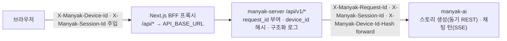
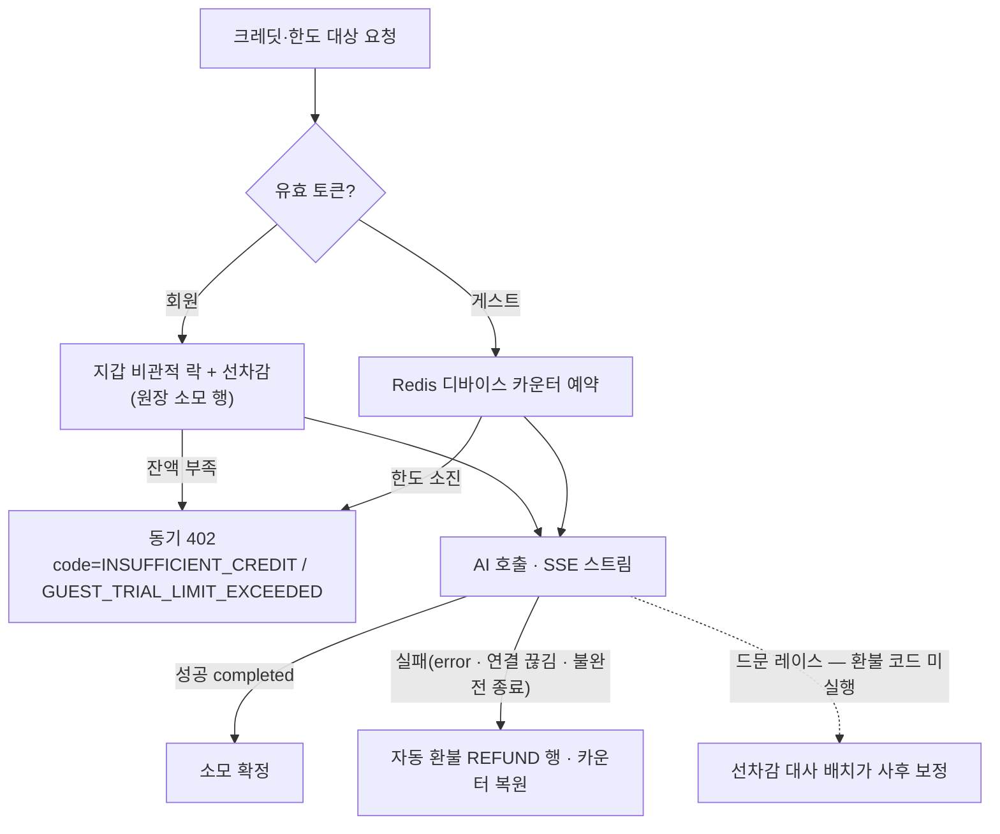

# 4-BACKEND

이 문서는 마냑 백엔드 서버(`manyak-server`)가 구현하고 QA가 검수해야 할 계약을 정의합니다. API, 데이터 모델, 인증, 오류 처리, 운영·관측 기준을 다룹니다.

각 항목은 실제 구현된 동작을 기준으로 구체값을 적고, 아직 구현하지 않은 항목은 `계획`으로 구분해 표기합니다.

```text
§4-1   문서 목적·범위와 관련 문서
§4-2   기술 환경과 아키텍처
§4-3   API 계약
§4-4   데이터 모델
§4-5   인증과 권한
§4-6   오류와 예외 처리
§4-7   운영과 관측
§4-8   검수 체크리스트
```

### 읽는 순서

- **처음 보는 사람** — §4-1(경계)과 §4-2(아키텍처 큰 그림)를 먼저 보고, §4-3 도입의 엔드포인트 카탈로그로 전체 표면을 잡습니다.
- **구현자** — 담당 기능의 §4-3-N 상세 절 → §4-4 데이터 모델 → §4-6 오류 계약 순서로 봅니다. 각 결정 지점의 "결정 기록"(배경·대안·영향)이 왜 이 계약인지의 근거입니다.
- **리뷰·QA** — §4-8 검수 체크리스트와 간극 표에서 시작해 본문을 역참조합니다.

| 항목 | 값 |
| --- | --- |
| 버전 | v0.23 |
| 작성일 | 2026-07-03 |
| 수정일 | 2026-07-10 |
| 대상 | 마냑 백엔드 서버 |
| 작성 목적 | 백엔드 API, 데이터 모델, 오류 처리, 운영 기준을 정의합니다. |
| 기준 코드 | `../manyak-server` `dev` 브랜치 HEAD `1a2dad6` (Kotlin 2.2, Spring Boot 4, Flyway V42) |

---

## 4-1. 문서 목적·범위와 관련 문서

### 목적

이 문서는 마냑 백엔드 개발자가 API 계약, 데이터 모델, 오류 처리, 운영 기준을 구현하는 기준입니다. 백엔드는 이 문서를 기준으로 구현하고, 프론트엔드·AI 서버는 이 문서로 백엔드와의 계약을 확인하며, QA는 이 문서를 기준으로 검수합니다.

### 범위

- REST API 계약(엔드포인트, 요청·응답 스키마, 상태 코드, 헤더)
- 채팅 SSE 스트리밍 계약
- 데이터 모델과 식별자·삭제 정책
- 인증(Google 로그인, JWT)과 선택적 인증 정책
- 오류 응답 계약과 예외 처리 기준
- 운영·관측(상관관계 식별자, 구조화 로그, Sentry, `ai_call_logs`, 환경 변수, 헬스체크)

### 제외 범위

- 화면, 사용자 흐름, 프론트엔드 상태 처리 (담당: [`3-frontend.md`](./3-frontend.md))
- AI 서버 내부 구현, 프롬프트, 레이어 구성 (담당: [`5-ai-server.md`](./5-ai-server.md))
- 분석 이벤트 카탈로그, 지표, CloudWatch·Sentry 수집 기준의 원천 정의 (원천: [`6-analytics.md`](./6-analytics.md))
- 코드 구조, 클래스 설계, 테스트 작성 규칙, 로컬 실행 상세 (서버 레포 `README.md`·`CLAUDE.md`가 소유)
- 인프라 구성(Terraform, VPC, RDS 등)과 배포 런북 (`manyak-terraform` 레포가 소유)

### 관련 문서와 경계

| 문서 | 소유 영역 | 이 문서와의 관계 |
| --- | --- | --- |
| [`0-glossary.md`](./0-glossary.md) | 용어, 계층별 표기 컨벤션 | 필드·테이블·로그 이름의 표기 근거 |
| [`1-background.md`](./1-background.md) | 서비스 배경, MVP 범위 | 제품 방향의 상위 근거 |
| [`2-user-stories.md`](./2-user-stories.md) | 화면별 사용자 요구(US ID) | 검수 기준을 US ID로 추적 |
| [`3-frontend.md`](./3-frontend.md) | 화면, API 호출 시점, 실패 처리 | API의 소비자 계약. 호출 흐름은 위임 |
| [`5-ai-server.md`](./5-ai-server.md) | AI 요청·응답 계약, 프롬프트 | AI 와이어 상세 위임 |
| [`6-analytics.md`](./6-analytics.md) | 이벤트, 식별자, 관측 수집 기준 | 관측 계약의 원천. 백엔드 구현 현황은 이 문서가 기술 |

### 작성 원칙

- 구현된 동작을 기준으로 씁니다. 문서 간 기준이 다르면 코드를 기준으로 하고 차이는 [§4-8](#4-8-검수-체크리스트)의 간극 표에 기록합니다.
- API 경로는 `/api/v1` prefix를 생략해 표기합니다. 예외적으로 전체 경로가 필요한 곳(헬스체크 등)만 전체를 적습니다.
- 클라이언트 와이어 필드는 camelCase, DB·로그 필드는 snake_case로 적습니다([`0-glossary.md §0-4`](./0-glossary.md)).
- 이벤트·지표·AI 프롬프트는 원천 문서를 교차 참조하고 중복 서술하지 않습니다.

### 구현 상태 라벨

이 문서는 항목마다 `{로드맵 Phase} · {구현 상태}` 두 축을 라벨로 구분합니다. 로드맵 Phase는 [`roadmap.md`](../planning/roadmap.md)가 기능을 배정한 단계이고, 구현 상태는 `구현`(코드 반영 완료)과 `계획`(미구현, 방향만 합의) 2종입니다. `MVP`(= `Phase 0 · 구현`)와 `계획`(Phase 미배정)은 관례 단축형이며, 라벨이 없는 항목은 모두 `MVP`입니다.

| 라벨 | 의미 | 해당 항목 |
| --- | --- | --- |
| `MVP` | Phase 0 범위. 서버 구현 완료, MVP 프론트엔드가 사용 중 | 스토리·간편 제작·채팅·피드백 API |
| `Phase 1 · 구현` | Phase 1 범위. 서버 구현 완료, MVP 프론트엔드는 아직 미사용 | 인증 API·랜덤 닉네임([§4-5](#4-5-인증과-권한)), 마이그레이션·내 콘텐츠 목록([§4-3-5](#4-3-api-계약)), 로어북 카탈로그([§4-3-6](#4-3-api-계약))·엔딩 저장([§4-3-10](#4-3-api-계약)), 크레딧([§4-3-7](#4-3-api-계약)), 일반 제작·스토리 수정([§4-3-8](#4-3-api-계약)), AI 응답 재생성([§4-3-9](#4-3-api-계약)) |
| `Phase 1 · 계획` | Phase 1 범위. 미구현, 방향만 합의됨 | 썸네일·채팅 이미지 삽입([§4-3-9](#4-3-api-계약)). 채팅 상세 턴 항목의 `reachedEnding` 노출([§4-3-3](#4-3-api-계약) — 저장은 되나 아직 와이어 미노출). 초대 방식 개편 — 코드 입력 적립·코드 재발급(KNK-567, [§4-3-7](#4-3-api-계약)) |
| `Phase 1 · 구현`(2026-07 반영) | Phase 1 범위. 서버 dev 구현 완료 | 이관 1회 잠금(V36)·이관 시도 상한(B19 완화, V38)·재생성 버전 이력(V37)·체험 한도 5·1·5(B8)·삭제 소유권 검증·게스트-회원 교차 접근 차단·채팅 배치 열람 필터·보상 크레딧 만료 FIFO(V39)·세션 부트스트랩 응답 확장·프로필 썸네일 동봉·정지 계정 집행·스토리 읽기 가시성(KNK-401·464)·게스트 한도 회원 공유(V40)·프로필 프리셋 배정(KNK-388)·시작 설정 복수화·와이어 개편(V42·KNK-515)·엔딩·주요 사건·로어북 런타임 반영(V41·KNK-520~523)·초대 보상 진행 표시(KNK-513)·서버 분석 이벤트 발행(KNK-514)·402 사유 코드 구분(KNK-524) — [§4-8](#4-8-검수-체크리스트) |
| `계획` | Phase 미배정. 미구현, 방향만 합의됨 | AI 와이어 필드 정렬([§4-8](#4-8-검수-체크리스트) B2) |

---

## 4-2. 기술 환경과 아키텍처

### 기술 환경

| 분류 | 기술 |
| --- | --- |
| 언어·런타임 | Kotlin 2.2, Java 21 (Temurin) |
| 프레임워크 | Spring Boot 4, Spring MVC + `SseEmitter`(SSE), WebClient(AI 스트림 수신) |
| 영속성 | Spring Data JPA, PostgreSQL(운영)·H2(테스트), Flyway 마이그레이션 |
| 캐시·토큰 저장소 | Redis (refresh 토큰) |
| 인증 | Spring Security, OAuth2 Resource Server(JWT), Google ID 토큰 검증 |
| 관측 | Logstash Logback Encoder(JSON 구조화 로그), Sentry, Spring Actuator |
| API 문서 | SpringDoc OpenAPI (Swagger UI) |
| 빌드·배포 | Gradle(Kotlin DSL), Docker multi-stage, GitHub Actions |

### 핵심 아키텍처

일반적인 인증형 API 서버와 다른 지점입니다.

| # | 특징 | 요지 | 상세 |
| --- | --- | --- | --- |
| 1 | 전원 게스트 + 선택적 인증 | MVP는 인증 없이 동작합니다. 대부분의 엔드포인트는 익명을 허용하되, 유효한 토큰이 오면 `user_id`를 귀속합니다. | [§4-5](#4-5-인증과-권한) |
| 2 | 공개 식별자(UUID)만 노출 | 외부에는 `public_id`(UUID)만 노출하고 내부 Long PK는 감춰 IDOR을 차단합니다. | [§4-4](#4-4-데이터-모델) |
| 3 | AI 프록시 | 스토리 생성은 동기 REST로, 채팅 턴은 SSE로 AI 서버를 호출하고 결과를 저장·중계합니다. | [§4-3-3](#4-3-api-계약) |
| 4 | 상관관계 관측 | 모든 요청에 `request_id`를 부여하고 `device_id_hash`로 익명 식별을 이어 로그·Sentry·`ai_call_logs`를 연결합니다. | [§4-7](#4-7-운영과-관측) |
| 5 | 소프트 삭제 | 스토리·채팅 삭제는 `deleted_at` 기록으로 처리하고 조회에서 제외합니다. | [§4-4](#4-4-데이터-모델) |
| 6 | 남용 방지 다층 방어 | 게스트+선택 인증 구조는 남용 표면이 넓으므로 체험 한도·이관 1회·교차 차단·관측을 계층으로 쌓습니다. | 아래 [남용 방지 설계](#남용-방지-설계) |

### 요청 흐름



### 도메인 모듈

서버 코드는 도메인 4개와 공통 계층으로 나뉩니다.

| 모듈 | 담당 |
| --- | --- |
| `auth` | Google 로그인, JWT 발급·검증, refresh 토큰 저장소 |
| `story` | 스토리 조회·삭제, 간편 제작 퍼널, 로어북, 스토리 AI 클라이언트 |
| `chat` | 채팅 생성·조회·삭제, 턴 SSE 스트리밍, 채팅 AI 클라이언트 |
| `feedback` | 피드백 저장, Slack 알림 |
| `global` | 보안 설정, 공통 오류 응답, 상관관계 필터, 구조화 로그, `ai_call_logs` |

### 남용 방지 설계

전원 게스트 + 선택적 인증(특징 1)은 진입 마찰을 없애는 대신 남용 표면을 넓힙니다. 개별 방어 계약은 여러 절에 흩어져 있어, 여기서는 그것들이 이루는 방어 계층만 지도로 묶습니다(계약 본문·수치는 각 절이 정본이며 여기서 재정의하지 않습니다).

| 계층 | 막는 것 | 장치 | 상태 |
| --- | --- | --- | --- |
| 진입 상한 | 가입 전 무한 무료 사용 | 디바이스별 체험 한도(스토리라인 5·스토리 1·채팅 턴 5) — [§4-3-7](#4-3-api-계약) | `구현`(B8) |
| 전환 차단 | 게스트 콘텐츠 반복 이관 파밍 | 이관 계정당 1회 잠금 + 게스트↔회원 교차 접근 차단 — [§4-3-5](#4-3-api-계약)·[§4-5](#4-5-인증과-권한) | `구현` |
| 회원 재화 보호 | 선차감 후 실패의 과금·이중 환불 | charge-once/refund-once + 선차감 대사 배치 + 보상 멱등 키 — [§4-3-7](#4-3-api-계약) | `구현` |
| 관측 backstop | 우회·잔여 리스크의 사후 탐지 | 상관관계 관측 + 호출량 급증·카운터 키 증가 추이 — [§4-7](#4-7-운영과-관측) | 상시 |

**설계 원칙 — 완전 차단이 아니라 파밍 기대이익 < 비용.** 서버는 콘텐츠에 디바이스 식별자를 저장하지 않아 게스트를 식별할 수 없으므로, 막을 수 있는 교차 방향(게스트↔회원)만 양쪽을 막고([§4-5](#4-5-인증과-권한)), 막을 수 없는 것(게스트↔게스트, 헤더 변조)은 파밍 1건의 가치 자체를 낮춰(한도 축소 B8·이관 1회) 수용합니다.

**수용된 잔여 리스크와 강화 경로.** Phase 1은 다음을 "탐지하되 차단하지 않음"으로 수용하고 관측으로 추적하며, 차단 강화(rate limit·키 TTL 등)는 후속 결정으로 둡니다: 디바이스 헤더 변조·기기 교체(B8), 게스트↔게스트 접근, 무인증 쓰기 rate limit 부재(B18), 이관 소유 미증명(B19 — 열거 오라클은 시도 상한 5회로 완화 구현), Sybil 보상 파밍(B21). 근거·완화 방향은 각 B 항목이 소유합니다([§4-8](#4-8-검수-체크리스트)).

---

## 4-3. API 계약

### 공통 규칙

- 모든 비즈니스 API는 `/api/v1` prefix를 사용합니다.
- 요청·응답 JSON 필드는 camelCase입니다([`0-glossary.md §0-4`](./0-glossary.md)).
- 시각 필드(`createdAt`, `updatedAt`)는 ISO 8601 UTC 문자열입니다.
- 문자 수 제약("N자")은 UTF-16 code unit(Java `String.length()`, Bean Validation `@Size` 기준)으로 판정합니다. 이모지·서로게이트 페어는 2로 셉니다.
- 배치 조회는 배열이 커질 수 있어 `POST` 본문으로 ID 목록을 받습니다. 상한은 100개(중복 포함 배열 길이 기준)이며, 중복 ID는 각 ID당 1건만 반환합니다.
- 요청 검증 실패는 400과 `ApiErrorResponse.details`로 응답합니다([§4-6](#4-6-오류와-예외-처리)).

### 요청·응답 헤더

프론트엔드가 주입하는 식별 헤더와 백엔드의 처리 규칙입니다. 값의 정책 원천은 [`6-analytics.md §6-6-2`](./6-analytics.md)입니다.

| 헤더 | 방향 | 처리 |
| --- | --- | --- |
| `X-Manyak-Request-Id` | 수신·응답 | 없으면 `req_` + UUID(하이픈 제거)로 생성. 응답 헤더로 항상 echo |
| `X-Manyak-Session-Id` | 수신 | MDC `session_id`에 적재. 없으면 `unknown` |
| `X-Manyak-Device-Id` | 수신 | 원본을 저장하지 않고 해시(`device_id_hash`)로 변환해 MDC에 적재. 없으면 `unknown` |

- 식별 헤더가 없어도 요청을 거부하지 않습니다. 예외: 게스트 체험 한도 대상 요청은 `X-Manyak-Device-Id`가 필수이며 누락 시 400입니다([§4-3-7](#4-3-api-계약)).
- 해시 방식과 AI 서버로의 forward 규칙은 [§4-7](#4-7-운영과-관측)에 정의합니다.

### 엔드포인트 카탈로그

| 도메인 | 메서드·경로 | 설명 | 성공 | 주요 실패 | 인증 | 상태 |
| --- | --- | --- | --- | --- | --- | --- |
| 스토리 | `POST /stories/batch` | 공개 ID 목록으로 스토리 카드 조회 | 200 | 400 | 선택 | MVP |
| 스토리 | `GET /stories/{storyId}` | 스토리 상세 조회 | 200 | 404 | 선택 | MVP |
| 스토리 | `DELETE /stories/{storyId}` | 스토리 소프트 삭제 | 204 | 403·404 | 선택 | MVP |
| 스토리 | `GET /stories/lorebooks` | 로어북 카탈로그 조회(`?genre` 필터) | 200 | — | 불필요 | Phase 1 · 구현 |
| 스토리 | `GET /stories/{storyId}/edit` | 스토리 수정 폼 데이터 조회 | 200 | 403·404 | 선택 | Phase 1 · 구현 |
| 스토리 | `PATCH /stories/{storyId}` | 스토리 수정 | 200 | 400·403·404 | 선택 | Phase 1 · 구현 |
| 스토리 | `POST /stories/general` | 일반 제작 등록 | 201 | 400 | 선택 | Phase 1 · 구현 |
| 간편 제작 | `GET /stories/simple/tags` | 제공 태그 목록 조회 | 200 | — | 불필요 | MVP |
| 간편 제작 | `POST /stories/simple/storylines` | 스토리라인 3개 생성(AI 호출) | 201 | 400·402·502 | 선택 | MVP |
| 간편 제작 | `POST /stories/simple` | 최종 스토리 생성(AI 호출) | 201 | 400·402·403·404·409·502 | 선택 | MVP |
| 간편 제작 | `PUT /stories/simple/storylines/{storylineId}/rating` | 스토리라인 평가 설정 | 200 | 400·403·404 | 선택 | MVP |
| 간편 제작 | `DELETE /stories/simple/storylines/{storylineId}/rating` | 스토리라인 평가 취소(멱등) | 204 | 403·404 | 선택 | MVP |
| 채팅 | `POST /chats` | 채팅 생성(플레이 시작) | 201 | 400·403·404 | 선택 | MVP |
| 채팅 | `POST /chats/batch` | 공개 ID 목록으로 채팅 카드 조회 | 200 | 400 | 선택 | MVP |
| 채팅 | `GET /chats/{chatId}` | 채팅 상세(턴 이력) 조회 | 200 | 403·404 | 선택 | MVP |
| 채팅 | `DELETE /chats/{chatId}` | 채팅 소프트 삭제 | 204 | 403·404 | 선택 | MVP |
| 채팅 | `POST /chats/{chatId}/turns/stream` | 턴 진행 SSE 스트리밍 | 200(SSE) | 400·402·403·404 | 선택 | MVP |
| 채팅 | `POST /chats/{chatId}/turns/regenerate/stream` | 마지막 턴 AI 응답 재생성 SSE 스트리밍 | 200(SSE) | 400·402·403·404·409 | 선택 | Phase 1 · 구현 |
| 피드백 | `POST /feedbacks` | 피드백 등록 | 201 | 400 | 선택 | MVP |
| 인증 | `POST /auth/login/google` | Google ID 토큰 로그인 | 200 | 400·401 | 불필요 | Phase 1 · 구현 |
| 인증 | `GET /auth/me` | 현재 사용자 조회 | 200 | 401 | 필수 | Phase 1 · 구현 |
| 인증 | `POST /auth/token/refresh` | 토큰 재발급(회전) | 200 | 400·401 | 불필요 | Phase 1 · 구현 |
| 인증 | `POST /auth/logout` | refresh 토큰 폐기(멱등) | 204 | 400 | 불필요 | Phase 1 · 구현 |
| 인증 | `POST /auth/migrate` | 게스트 데이터 소유권 이관(항목별 부분 성공) | 200 | 400·401 | 필수 | Phase 1 · 구현 |
| 사용자 | `GET /users/me/stories` | 내 스토리 목록(서버 정본) | 200 | 401 | 필수 | Phase 1 · 구현 |
| 사용자 | `GET /users/me/chats` | 내 채팅 목록(서버 정본) | 200 | 401 | 필수 | Phase 1 · 구현 |
| 크레딧 | `GET /users/me/credits` | 크레딧 잔액 조회 | 200 | 401 | 필수 | Phase 1 · 구현 |
| 크레딧 | `POST /users/me/credits/attendance` | 출석체크 적립(1일 1회 멱등) | 200 | 401 | 필수 | Phase 1 · 구현 |
| 크레딧 | `GET /users/me/invite` | 내 초대 코드·보상 진행 조회 | 200 | 401 | 필수 | Phase 1 · 구현 |
| 크레딧 | `POST /users/me/invite/redeem` | 초대 코드 입력·양측 보상 적립 | 200 | 400·401·404·409 | 필수 | Phase 1 · 계획 |

인증 열의 `선택`은 익명을 허용하되 유효한 access 토큰이 오면 `user_id`를 귀속하는 엔드포인트입니다([§4-5](#4-5-인증과-권한)).

### 4-3-1. 스토리 조회·삭제

**`POST /stories/batch`** — 요청 `{storyIds: string[]}`(1~100개 — `@NotEmpty`·`@Size` Bean Validation으로 서비스 진입 전 400). 존재하고 삭제되지 않았으며 아래 읽기 가시성을 통과한 스토리만 반환하고, 없는 ID·읽기 불가 항목은 오류 없이 제외합니다. UUID 형식이 아닌 ID는 조용히 제외하며 유효 ID가 0개면 DB 조회 없이 빈 배열을 반환합니다. 중복 ID는 1건으로 병합하고, 반환 순서는 중복 제거된 요청 순서를 보존합니다.

**읽기 가시성 — `Phase 1 · 구현`(KNK-401·464).** 스토리 읽기(배치·상세 조회, `POST /chats`의 시작 전 게이트 포함)는 다음 중 하나일 때만 허용합니다: ① 공개 스토리(`status = PUBLISHED`이면서 `visibility = PUBLIC`), ② 게스트 제작 스토리(`user_id` NULL — UUID 보유가 사실상 본인 서재·공유 링크 보유), ③ 요청자가 소유자 본인. 따라서 **회원 소유 스토리가 PRIVATE(또는 DRAFT)면 타인·익명은 UUID를 알아도 읽을 수 없습니다** — 배치는 결과에서 제외, 상세는 404(존재 여부 비노출)입니다.

**응답 항목(`StorySummaryResponse`)**

| 필드 | 타입 | 설명 |
| --- | --- | --- |
| `id` | string | 스토리 공개 식별자(UUID) |
| `title` | string | 제목 |
| `oneLineIntro` | string | 한 줄 소개. 저장값이 NULL이면 빈 문자열 |
| `genres` | string[] | 장르 태그명 목록 — `stories.genre`를 쉼표 분리 후 각 항목 trim·빈 항목 제거 |
| `author` | object·null | 작성자 `{id, nickname, profileImageUrl}`. 익명 생성 시 `author` 자체가 null. `profileImageUrl`은 이미지 미배정 회원이면 null(클라이언트는 기본 아바타로 처리). 현행 구현은 회원 스토리도 `author`를 항상 null로 반환합니다(placeholder — 채움은 후속 과제) |
| `turnCount` | number | `Phase 1 · 구현`(KNK-515) 누적 사용자 입력 턴 수 — 스토리의 모든 미삭제 채팅 `current_turn` 합(목록은 배치 집계로 N+1 방지). 이전 와이어 필드 `chatCount`(채팅 수)를 대체 |
| `likeCount` | number | 좋아요 수(placeholder, 현재 0) |
| `status` | enum | `DRAFT` · `PUBLISHED` |
| `createdAt` | string | 생성 시각 |
| `thumbnailUrlSm` | string·null | `Phase 1 · 계획`(KNK-548) 목록용 **축소 변형** 썸네일 URL(~700px `_sm`). 자동 연결·변형 구현과 함께 추가하는 필드입니다([§4-3-9](#4-3-api-계약) 반응형 변형) |

**`GET /stories/{storyId}`** — 상세 응답(`StoryDetailResponse`)은 목록 필드에 다음을 더합니다.

| 필드 | 타입 | 설명 |
| --- | --- | --- |
| `description` | string·null | 주요 내용 |
| `thumbnailUrl` | string·null | `Phase 1 · 구현`(KNK-515) 상세용 **원본 변형** 썸네일 URL 필드(이전 `coverImageUrl` 개명). 반응형 변형(`thumbnailUrlSm`은 목록·채팅용)은 `Phase 1 · 계획`(KNK-548). 자동 연결 소스(썸네일 자동 연결 — [§4-3-9](#4-3-api-계약))가 `Phase 1 · 계획`이라 값은 현재 null |
| `hashtags` | string[] | 해시태그(placeholder) |
| `startSettings` | object[] | `Phase 1 · 구현`(KNK-515) 시작 설정 목록(복수화 — 등록 순서). 각 항목 `{id, name, prologue, startSituation, suggestedInputs[], endings[]}`: `id`는 시작 설정 공개 식별자(UUID — `POST /chats`의 `startSettingId`로 사용), `suggestedInputs`는 이 시작 설정의 추천 입력, `endings`는 `{name, requirement{minTurns, achievementCondition}, epilogue}`(이름 기반·유형 없음, 활성 엔딩만, 레거시 `enabled=false` 제외, [§4-3-8](#4-3-api-계약)·[§4-3-10](#4-3-api-계약)). 시작 설정이 없으면 빈 배열 |
| `visibility` | enum | `PUBLIC` · `PRIVATE`(기본 PRIVATE) |
| `lorebooks` | object[] | `Phase 1 · 구현` 로어북 `{id, name, genre, content}`(스토리 스코프) |
| `mainEvents` | object[] | `Phase 1 · 구현` 주요 사건 `{name, description, keySentence, sortOrder}`(스토리 스코프) — `sort_order` 오름차순. 런타임 의미는 [§4-3-10](#4-3-api-계약) |
| `reachedEndings` | string[] | `Phase 1 · 구현`(KNK-523) 요청자가 이 스토리에서 도달한 엔딩 **이름** 목록(엔딩은 이름으로 식별). 회원은 사용자+스토리 집계, 게스트는 빈 배열([§4-3-10](#4-3-api-계약)) |

- `status`·`visibility`·`lorebooks`·`startSettings[].endings`는 MVP 프론트엔드가 사용하지 않습니다([`3-frontend.md §3-13`](./3-frontend.md) G3).

**`DELETE /stories/{storyId}`** — 소프트 삭제 후 204. 존재하지 않거나 이미 삭제된 ID는 404를 반환하며, 프론트엔드는 404를 무음 성공으로 처리합니다([`3-frontend.md §3-7`](./3-frontend.md)). 소유권 규칙([§4-5](#4-5-인증과-권한))을 적용합니다: 소유 스토리는 소유자만, `user_id`가 NULL인 스토리는 익명(게스트) 요청만 삭제할 수 있고 위반은 403입니다(`Phase 1 · 구현`). 404 판정(형식 오류·순차 정수·부재·이미 삭제 — 모두 동일 404로 존재 여부 비노출)을 403보다 먼저 적용하고, 삭제는 스토리 행 비관적 쓰기 락으로 처리해 소유권 검사와 `deleted_at` 기록 사이에 이관 클레임이 끼어드는 경쟁을 차단합니다(KNK-69 — 채팅 삭제 동일).

### 4-3-2. 간편 제작

간편 제작 퍼널(키워드 선택 → 스토리라인 선택 → 추가 정보 → 완료)의 서버 계약입니다. 화면 흐름은 [`3-frontend.md §3-5`](./3-frontend.md)가 정의합니다.

**`GET /stories/simple/tags`** — 활성화된 제공 태그 목록 `{id, name, category}[]`을 반환합니다. `category`는 `GENRE` · `PROTAGONIST` · `SUPPORTING_CHARACTER`입니다. 사전 정의(`PREDEFINED`)·활성 태그만, `category → sort_order → id` 오름차순으로 반환합니다(직접 추가 `CUSTOM` 태그는 목록에 노출하지 않음).

**`POST /stories/simple/storylines`** — 태그 선택으로 스토리라인 3개를 생성합니다. AI 서버 `POST /story/storylines`를 동기 호출하며 실패 시 502를 반환합니다. `Phase 1 · 구현` — 회원은 무료이고, 게스트는 디바이스 ID별 스토리라인 생성·재생성 합산 5회 한도를 넘으면 AI 호출 전 402를 반환합니다([§4-3-7](#4-3-api-계약)).

| 요청 필드 | 제약 | 설명 |
| --- | --- | --- |
| `selectedTagIds` | 최대 20개, 각 ≥ 1 | 선택한 제공 태그 ID |
| `customTags` | 최대 20개 | 직접 추가 태그 `{name(≤30자), category}` |

- `selectedTagIds`와 `customTags` 중 하나 이상은 있어야 합니다. 둘 다 비면 400입니다.
- `selectedTagIds`는 중복 제거 후 존재·활성·사전 정의 여부를 검증하며, 무효 ID가 있으면 누락 ID 목록을 `details`에 담아 400을 반환합니다.
- `customTags`는 이름을 trim하고 `(category, name)` 기준 중복을 제거하며, 동일한 기존 `CUSTOM` 태그가 있으면 재사용합니다(find-or-create).
- AI 요청에는 태그를 카테고리별 3필드(`genre_tags` · `protagonist_tags` · `supporting_tags`)로 나눠 사전 정의 태그(요청 ID 순) 뒤에 직접 추가 태그를 이어 전달합니다.
- AI 호출은 저장 트랜잭션 밖에서 먼저 수행하고, 성공 후 한 트랜잭션에서 진행(세션) → 세션 태그 → 스토리라인(`storyline_order` 1부터) → 추천 추가 정보(`info_order` 1부터) 순으로 저장합니다. 게스트 카운터는 AI 호출 전에 예약하고 생성·저장이 실패하면(모든 예외) 복원합니다.

**응답(201)**

| 필드 | 타입 | 설명 |
| --- | --- | --- |
| `simpleCreationId` | number | 간편 제작 진행 ID. 분석 표준 표기는 `creation_id`([`0-glossary.md §0-3-2`](./0-glossary.md)) |
| `selectedTags` | object[] | 선택·직접 추가된 태그 목록 |
| `storylines` | object[] | 정확히 3개. 각 항목은 `{id, storyline, recommendedInfos: {id, text}[3]}` |

**`POST /stories/simple`** — 선택한 스토리라인과 추가 정보로 최종 스토리를 생성합니다. AI 서버 `POST /story/compile`을 동기 호출합니다. `Phase 1 · 구현` — 회원은 20 크레딧, 게스트는 디바이스 ID별 스토리 생성 1회 한도를 사용합니다([§4-3-7](#4-3-api-계약)).

| 요청 필드 | 제약 | 설명 |
| --- | --- | --- |
| `simpleCreationId` | ≥ 1 | 간편 제작 진행 ID |
| `storylineId` | ≥ 1 | 선택한 스토리라인 ID |
| `additionalInfos` | 최대 13개, 각 ≤ 100자 | 추가 정보(추천 채택분 포함 합산) |

**응답(201, `SimpleStoryCreateResponse`)**

| 필드 | 타입 | 설명 |
| --- | --- | --- |
| `id` | string | 스토리 공개 식별자(UUID) |
| `title` · `oneLineIntro` · `description` | string | 기본 정보 |
| `genres` | string[] | 장르 태그 |
| `startSettings` | object[] | 시작 설정 목록(공용 `SimpleStoryCreateResponse` — 복수화). 간편 제작은 항상 1개. 각 항목 `{id, name, prologue, startSituation, suggestedInputs[], endings[]}` |

- 게스트는 `id`를 로컬 서재에 저장합니다. 회원의 서재는 서버가 정본이므로(내 콘텐츠 목록 — [§4-3-5](#4-3-api-계약)) 로컬 저장이 필요 없습니다.
- 같은 진행(`simpleCreationId`)으로 이미 스토리를 생성했다면 409를 반환합니다. 프론트엔드의 완성 재시도는 스토리 생성을 건너뛰므로 정상 흐름에서는 발생하지 않습니다([`3-frontend.md §3-5`](./3-frontend.md)).
- 존재하지 않는 `simpleCreationId`, 또는 그 진행에 속하지 않거나 존재하지 않는 `storylineId`는 404입니다(카탈로그의 404 발생 조건).
- 소유자가 있는 진행은 같은 회원만 완료할 수 있습니다(타인·익명 403). 익명 진행을 회원이 완료하면 스토리와 진행이 그 회원에게 귀속됩니다(claim).
- 409는 AI 호출 전 사전 검사와, 저장 트랜잭션 안의 세션 행 비관적 락(`findByIdForUpdate`) 후 상태 재판정의 이중 구조로 판정합니다(동시 완료 경합 차단).
- 저장 트랜잭션은 선택 스토리라인 `is_selected` 표시 → 스토리 → 스토리 설정 → 시작 설정 → 추천 입력(`input_order` 1부터) → 선별 로어북 연결(`story_lorebooks`, `sort_order` 1부터 — [§4-3-6](#4-3-api-계약)) → 컴파일 산출 주요 사건(`story_main_events`, `sort_order` 0부터) → 컴파일 산출 엔딩(`story_endings`, 시작 설정 스코프·`sort_order` 1부터) → 세션 `STORY_CREATED`·`story_id` 기록 순입니다(`Phase 1 · 구현` — KNK-520). AI가 준 제목은 100자·한 줄 소개는 255자로 방어 절단해 저장하고, `genre`는 GENRE 태그명을 쉼표+공백(`", "`)으로 결합하며, `visibility`는 PRIVATE 고정·`status`는 PUBLISHED로 저장합니다.
- AI 요청의 `additional_info`는 `additionalInfos`를 개행(`\n`)으로 결합한 단일 문자열입니다.
- AI 호출 실패(응답 본문이 빈 경우 포함)는 502입니다. 컴파일 산출물 검증(`Phase 1 · 구현` — KNK-520): 주요 사건·엔딩의 **이름이 중복되면** 사용자 입력이 아니라 불완전 AI 응답으로 보아 502로 저장을 롤백합니다. **엔딩은 빈 배열이어도 정상**이며(AI의 엔딩 폴백 — 엔딩 0개로 저장), 주요 사건 개수(3~5)·엔딩 개수(0 또는 3)·폴백 계약의 정본은 [`5-ai-server.md §5-3-3`](./5-ai-server.md)입니다.

**`PUT · DELETE /stories/simple/storylines/{storylineId}/rating`** — 평가 설정은 `{rating: "GOOD" | "BAD"}`를 받아 200과 `{id, rating}`을 반환합니다. 평가는 스토리라인당 1행 upsert이며 새 평가가 기존 평가를 덮어씁니다(평가 주체는 저장하지 않음). 취소는 행 물리 삭제 후 204이며 평가가 없어도 성공하는 멱등 동작입니다. 존재하지 않는 스토리라인은 404, 소유자가 있는 진행의 스토리라인은 소유자만 평가·취소할 수 있고 타인·익명은 403입니다.

### 4-3-3. 채팅과 SSE 스트리밍

**`POST /chats`** — 요청 `{storyId: string, startSettingId?: string}`. 스토리가 없거나 요청자가 읽을 수 없으면(읽기 가시성 — [§4-3-1](#4-3-api-계약)) 404. `Phase 1 · 구현` — `user_id`가 NULL인 스토리로는 익명(게스트) 요청만 채팅을 생성할 수 있고, 인증된 회원은 403입니다([§4-5](#4-5-인증과-권한)). `Phase 1 · 구현`(KNK-515) — `startSettingId`(선택, 공개 식별자 UUID)로 시작할 시작 설정을 지정하며([§4-3-8](#4-3-api-계약) 시작 설정 복수화), 미지정이면 스토리의 첫(등록 순서 첫) 시작 설정으로 폴백합니다. `startSettingId`가 형식 오류·미존재이거나 해당 스토리의 시작 설정이 아니면 404이며, 미지정만 첫 번째로 폴백합니다(무효값 조용한 폴백 금지). 시작 설정이 하나도 없는 스토리는 `prologue`·`suggestedInputs`를 빈 값으로 반환합니다. 응답(201):

| 필드 | 타입 | 설명 |
| --- | --- | --- |
| `id` | string | 채팅 공개 식별자(UUID) |
| `storyId` | string | 스토리 공개 식별자 |
| `prologue` | string | 시작 설정의 프롤로그 |
| `suggestedInputs` | string[] | 추천 입력(첫 입력 후보) |
| `createdAt` | string | 생성 시각 |

**`POST /chats/batch`** — 요청 `{chatIds: string[]}`(1~100개, `@NotEmpty`·`@Size` 검증). UUID 형식이 아닌 항목은 조용히 제외하고 유효 항목이 0개면 DB 조회 없이 빈 배열을 반환합니다. 최근 활동순(`updatedAt` 내림차순, 동률은 내부 `id` 내림차순)으로 정렬해 반환하며, 프론트엔드는 이 순서를 유지합니다([`3-frontend.md §3-7`](./3-frontend.md)). `Phase 1 · 구현`(KNK-497) — 채팅 카드는 플레이 기록(`lastStoryPreview` 포함)이므로 열람 규칙([§4-5](#4-5-인증과-권한))으로 필터합니다: 요청자가 열람할 수 없는 채팅(회원 요청의 NULL 채팅, 소유자가 아닌 소유 채팅)은 오류 없이 제외합니다. 배치 조회는 항목 존재를 드러내지 않는 계약이므로 403이 아니라 없는 ID와 동일한 제외 방식입니다.

**응답 항목(`ChatSummaryResponse`)**

| 필드 | 타입 | 설명 |
| --- | --- | --- |
| `id` | string | 채팅 공개 식별자(UUID) |
| `storyId` · `storyTitle` | string | 참조 스토리 |
| `lastStoryPreview` | string | 마지막 ASSISTANT 출력 **전문** — 서버는 자르지 않으며 표시 절단은 프론트엔드 소유. 완료 턴이 없는 채팅(생성 직후)은 빈 문자열. 채팅당 최신 1건만 뽑는 단일 배치 쿼리로 조회(N+1 방지) |
| `turnCount` | number | 완료된 턴 수 — 매번 세지 않고 턴 저장과 원자적으로 증가하는 비정규화 카운터(`story_chats.current_turn`)를 반환 |
| `updatedAt` | string | 최근 활동 시각 |
| `thumbnailUrlSm` | string·null | `Phase 1 · 계획`(KNK-548) 참조 스토리 썸네일의 **축소 변형** URL(채팅 카드 46×62). 목록·채팅이 공유하는 `_sm`([§4-3-9](#4-3-api-계약) 반응형 변형) |
| `reachedEndings` | string[] | `Phase 1 · 구현`(KNK-523) 이 채팅에서 도달한 엔딩 **이름** 목록(채팅당 최대 1개, 도달 전 빈 배열 — [§4-3-10](#4-3-api-계약)) |

**`GET /chats/{chatId}`** — 응답(`ChatDetailResponse`): `{id, storyId, storyTitle, prologue, turns[], suggestedInputs}`. `Phase 1 · 구현` — 채팅 상세는 플레이 기록이므로 소유권 규칙을 적용합니다: 소유 채팅은 소유자만, `user_id`가 NULL인 채팅은 익명(게스트) 요청만 조회할 수 있고 위반은 403입니다([§4-5](#4-5-인증과-권한)). `turns[]`는 USER 직후 ASSISTANT 메시지를 짝지어 구성하며 짝 없는 USER·SYSTEM 메시지는 턴에서 제외합니다. `suggestedInputs`는 턴이 0개일 때만 채우고 진행 턴이 있으면 빈 배열입니다(다음 행동은 마지막 턴 `choices`가 안내).

**턴 항목**

| 필드 | 타입 | 설명 |
| --- | --- | --- |
| `id` | number | 턴 ID |
| `userInput` | string | 사용자 입력 |
| `aiOutput` | string | AI 출력 전문. `Phase 1 · 계획` — 채팅 이미지는 본문 내 `[[image:<imageKey>]]` 마커로 포함하고 턴 항목에 `images[]`를 동봉(저장본이 아니라 조회 시 본문에서 재구성 — [§4-3-9](#4-3-api-계약)) |
| `choices` | string[] | 선택지 |
| `createdAt` | string | 생성 시각 |

- 엔딩 도달 턴의 엔딩 노출(`reachedEnding`)은 도달 시각의 SSE `completed`로만 제공하며, 채팅 상세 턴 항목에는 아직 싣지 않습니다(`story_messages.reached_ending_id`는 저장 — `Phase 1 · 계획`, [§4-3-10](#4-3-api-계약)).

**`DELETE /chats/{chatId}`** — 소프트 삭제 후 204, 없으면 404. 소유권 검증(403)을 포함해 처리 규칙은 스토리 삭제와 같습니다(`Phase 1 · 구현`).

**`POST /chats/{chatId}/turns/stream`** — 사용자 입력으로 턴을 진행하고 AI 응답을 SSE로 중계합니다. `Phase 1 · 구현` — 회원은 10 크레딧, 게스트는 모든 채팅방 합산 채팅 턴 5회 한도를 사용합니다([§4-3-7](#4-3-api-계약)).

- 요청: `{userInput: string}` — `@NotBlank`+`@Size(max=3000)` 검증으로 공백만인 입력도 400입니다. 채팅이 없으면 스트림 시작 전에 동기 404로 응답합니다.
- 응답 Content-Type: `text/event-stream;charset=UTF-8`.
- 이벤트 순서: `started` → `token`(반복) → `completed` 또는 `error`.

| 이벤트 | 데이터(JSON) | 설명 |
| --- | --- | --- |
| `started` | `{chatId}` | 스트리밍 시작 |
| `token` | `{text}` | AI 토큰 청크. AI 서버 스트림을 1:1 중계 |
| `completed` | `{chatId, turnId, aiOutput, choices[], reachedEnding}` | 턴 저장 완료. `aiOutput`은 서버 확정본 전문. `reachedEnding`(string·null)은 `Phase 1 · 구현`(KNK-522·523) — 이번 턴이 엔딩 도달이면 도달 엔딩 **이름**, 아니면 null([§4-3-10](#4-3-api-계약)). `Phase 1 · 계획` — 채팅 이미지는 `aiOutput` 본문 내 `[[image:<imageKey>]]` 마커로 포함하고 검증된 목록 `images[]`(`{imageKey, type, url}`)를 동봉하며, `token`에는 마커가 실리지 않습니다([§4-3-9](#4-3-api-계약)) |
| `error` | `{code, message}` | 실패. `completed`를 대체. 백엔드 자체 실패의 `message`는 "AI 응답 생성 중 오류가 발생했습니다." 고정 문구 |

- 이벤트는 위 4종뿐이며 heartbeat(주기 ping)는 없습니다. 페이로드는 이벤트별 DTO의 JSON 직렬화입니다.

- 서버는 `completed` 전에 사용자 입력과 AI 출력을 한 턴으로 저장합니다. 저장은 채팅 행 비관적 락 → 마지막 `message_order` 조회 → USER(n+1) → ASSISTANT(n+2) insert → 선택지 insert → `current_turn` +1 순서의 단일 트랜잭션이며, 메시지 순서는 `(chat_id, message_order)` 유니크 제약으로 보강합니다. 턴 ID는 ASSISTANT 메시지 행의 ID입니다. 저장이 확정한 턴 번호를 `ai_call_logs`에도 반영합니다([§4-7](#4-7-운영과-관측)).
- 선택지는 AI가 준 개수만큼 `story_choices` 행(`choice_order` 1부터, `(message_id, choice_order)` 유니크)으로 저장하고 빈 배열이면 저장하지 않습니다 — "3개"는 AI 계약이며 서버가 개수를 보정하지 않습니다. 카드의 최근 활동 시각(`updatedAt`)은 채팅 행 UPDATE 시(턴 저장 포함) 자동 갱신됩니다.
- `error.code`는 AI 서버가 보낸 오류 코드를 그대로 중계하고, AI 이벤트 외 실패는 `AI_STREAM_FAILED`로 분류합니다.
- **타임아웃**: 두 층의 타임아웃이 있습니다(둘 다 60초이나 홉·동작이 다름). ① 클라이언트향 SSE **전체 상한 60초**(`SseEmitter` 타임아웃) — 초과하면 진행 중인 AI 호출을 취소하고 `error` 이벤트 **없이** 스트림을 종료합니다(`onTimeout` → `complete`). ② 백엔드→AI 호출의 **이벤트 간 60초**(연결 5초 — [§4-7](#4-7-운영과-관측)) — AI 스트림이 이 사이 무진행이면 실패로 보고 `AI_STREAM_FAILED` `error` 이벤트로 전달합니다([§4-6](#4-6-오류와-예외-처리)). 즉 "전체 상한 도달"은 무이벤트 종료, "AI idle 실패"는 error 이벤트로 갈립니다. 프론트엔드의 EOF 처리 간극은 [`3-frontend.md §3-13`](./3-frontend.md) G5에 기록되어 있습니다.
- 서버 재개(resume) 스트림은 없습니다. 클라이언트는 재진입 시 상세를 다시 조회합니다.

### 4-3-4. 피드백

**`POST /feedbacks`** — 응답 본문 없이 201을 반환합니다.

| 요청 필드 | 필수 | 제약 |
| --- | --- | --- |
| `body` | 예 | 1~2,000자 |
| `email` | 아니오 | 이메일 형식, ≤ 320자 |
| `platform` | 아니오 | `IOS` · `ANDROID` · `WEB` |
| `appVersion` | 아니오 | ≤ 50자 |

- 로그인 상태면 `user_id`를 함께 저장합니다(선택 인증).
- 저장 후 Slack Incoming Webhook으로 알림을 보냅니다. 발송은 저장 트랜잭션 **커밋 후**(`AFTER_COMMIT`) 비동기(`@Async`)로 수행해 요청 지연에 영향을 주지 않고, 저장이 롤백되면 발송하지 않습니다. webhook URL 미설정 시 알림만 생략하고, 알림 실패가 저장 성공(201)을 뒤집지 않습니다.
- Slack HTTP 타임아웃은 연결 2초·읽기 3초입니다. 페이로드는 `{"text": ...}` 단일 필드(피드백 번호·본문 인용·platform/appVersion/email 메타·등록 시각)이며 본문·메타는 Slack mrkdwn 이스케이프를 거칩니다. 발송 실패는 webhook URL(secret) 노출을 막기 위해 예외 타입명만 WARN으로 남기고 Sentry `captureMessage`(WARNING)로도 보냅니다.
- 선택 필드 `email`·`appVersion`의 공백 입력은 null로 정규화해 저장합니다. 등록 성공 시 `feedback_submitted` 구조화 로그를 남기며 필드는 `content_length`·`has_email`뿐입니다(원문 미기록 — [§4-7](#4-7-운영과-관측)).
- 본문 상한은 서버 2,000자로 프론트엔드(500자)보다 크게 둡니다. 의도된 여유이며, 표시 상한은 프론트엔드가 유동적으로 조정합니다([§4-8](#4-8-검수-체크리스트) B4).
- `Phase 1 · 계획` — `platform`은 클라이언트 제보값이라 세분화에 한계가 있으므로, 서버가 `User-Agent` 헤더를 함께 저장해 클라이언트 수정 없이 OS·브라우저 수준으로 세분 수집합니다.
- 요청량 제한(rate limit)은 두지 않습니다. 인증·크레딧·한도 장치가 없는 쓰기 엔드포인트라 대량 등록으로 저장소·Slack 알림을 남용할 수 있는 표면이며, Phase 1은 이를 수용하고 등록량 급증을 관측으로 추적합니다([§4-8](#4-8-검수-체크리스트) B18).

### 4-3-5. 인증 API — `Phase 1 · 구현`

구현은 완료됐고 MVP 프론트엔드는 호출하지 않습니다. 흐름과 토큰 정책은 [§4-5](#4-5-인증과-권한)에 정의합니다.

| 엔드포인트 | 요청 | 응답 |
| --- | --- | --- |
| `POST /auth/login/google` | `{idToken, inviteCode?}` — `inviteCode`는 `Phase 1 · 계획`(KNK-567)에서 폐기([§4-3-7](#4-3-api-계약)) | `TokenResponse` |
| `GET /auth/me` | `Authorization: Bearer {access}` | `{id, nickname, profileImageUrl, profileThumbnailBase64, status, creditBalance, attendedToday}` — `Phase 1 · 구현`(`creditBalance`·`attendedToday` KNK-498, `profileThumbnailBase64` KNK-388) |
| `POST /auth/token/refresh` | `{refreshToken}` | `TokenResponse` |
| `POST /auth/logout` | `{refreshToken}` | 204 (멱등) |

`TokenResponse`: `{accessToken, refreshToken, expiresIn, tokenType: "Bearer"}`. `expiresIn`은 access 토큰 만료까지 남은 초입니다. `status`는 `ACTIVE` · `SUSPENDED` · `DELETED`입니다. 웹에서는 이 응답을 BFF가 가로채 httpOnly 쿠키로 보관하고 `refreshToken`을 JS에 노출하지 않습니다(토큰 세션은 [§4-5](#4-5-인증과-권한) 참조).

**세션 부트스트랩 확장 — `Phase 1 · 구현`(KNK-498).** `GET /auth/me` 응답에 `creditBalance`(number — 크레딧 잔액, 지갑이 없으면 0)와 `attendedToday`(boolean — KST 자정 기준 당일 출석체크 적립 완료 여부)를 포함합니다. `attendedToday`는 출석과 같은 멱등 키의 원장 행 존재 여부를 부수효과 없이 조회해 판정합니다. 프론트엔드는 세션 복원 1회 왕복으로 헤더의 잔액 표시와 출석체크 UI 상태까지 그립니다. access 토큰이 유효해도 `sub`가 UUID 형식이 아니면 401입니다.

`profileThumbnailBase64`(string·null) — `Phase 1 · 구현`(KNK-388). 세션 복원 시 헤더 아바타를 **이미지 호스트 왕복 없이 즉시 렌더**하도록 48×48 저해상도 인라인 썸네일(`users.profile_thumbnail_base64`)을 함께 싣습니다. 원본 전체 해상도는 `profileImageUrl`(외부 스토리지 URL)로 로드하고, 썸네일은 그 사이의 첫 페인트 placeholder를 채웁니다(레티나 선명본은 원본 로드로 교체). 값은 프리셋 배정 시 생성되며([§4-5](#4-5-인증과-권한)), 명사에 매핑된 이미지가 없으면 null(클라이언트 기본 아바타).

**결정 기록 — 세션 부트스트랩 응답 확장(2026-07-08)**

- **배경.** 앱 진입 시 프론트엔드는 `GET /auth/me`로 세션을 복원하면서 크레딧 잔액과 출석체크 상태도 함께 그려야 합니다. 잔액은 `GET /users/me/credits`로 조회할 수 있지만 당일 출석 여부는 조회 수단이 없었습니다 — `POST /users/me/credits/attendance`는 조회가 아니라 적립을 수행합니다.

| 대안 | 채택 안 한 이유 |
| --- | --- |
| 출석 여부 전용 조회 API 신설 | 부트스트랩 왕복이 3회(me·credits·출석 조회)로 늘어납니다. 두 값 모두 세션 복원 시점에 항상 필요한 상태라 `me` 동봉이 단순합니다 |
| 진입 시 `POST /users/me/credits/attendance`를 자동 호출해 `rewarded`로 판별 | 조회 목적의 호출이 적립 부수효과를 일으켜, 사용자가 출석 버튼을 누르기 전에 보상이 지급되는 UX를 강제합니다 |

- **영향.** `GET /users/me/credits`는 소모·적립 직후의 잔액 갱신 조회로 유지합니다(역할 분리 — `me`는 부트스트랩 스냅샷). 서버는 `me` 처리에 지갑 잔액·당일 출석 원장 조회가 추가됩니다.

#### 게스트 데이터 마이그레이션 — `Phase 1 · 구현`

게스트가 기기에 쌓은 스토리·채팅의 소유권을 로그인 계정으로 이관합니다. 서버에는 게스트 식별 수단이 없으므로(콘텐츠 행에 device_id를 저장하지 않음) 클라이언트가 `localStorage`에 보관한 공개 ID 목록을 제출하는 방식입니다. 프론트엔드는 로그인 성공 직후 사용자 확인 없이 자동 호출합니다([`3-frontend.md`](./3-frontend.md) FE-SCREEN-008).

**`POST /auth/migrate`** — 인증 필수.

| 요청 필드 | 타입 | 규칙 |
| --- | --- | --- |
| `storyIds` | string[] | 스토리 공개 ID(UUID). 최대 100개(`@Size` — 로컬 상한과 동일), 빈 배열 허용, 필드 생략은 빈 배열로 처리 |
| `chatIds` | string[] | 채팅 공개 ID(UUID). 최대 100개, 빈 배열 허용 |

동작 규칙:

- `user_id`가 NULL인 행에 요청자의 `user_id`를 설정합니다(클레임). 채팅은 참조하는 스토리의 소유자와 무관하게 독립적으로 이관합니다. 처리 순서는 스토리 → 채팅이며, 스토리를 클레임하면 연결된 간편 제작 진행(`story_creation_sessions`)의 소유권도 함께 클레임합니다(익명 진행의 평가 개방 방지).
- **항목별 원자 클레임.** 서로 다른 계정의 동시 클레임은 조건부 UPDATE(`WHERE user_id IS NULL`)로 원자 판정해 한 트랜잭션만 `MIGRATED`가 되고, 선점당한 쪽은 실제 소유자를 재확인해 요청자 본인이면 `ALREADY_OWNED`, 아니면 `CONFLICT`로 응답합니다. 같은 요청 안에 같은 ID가 중복 제출되면 첫 항목만 `MIGRATED`이고 이후 항목은 `ALREADY_OWNED`입니다(항목별 결과 행 유지 — 배치 조회의 중복 병합과 다름).
- **항목별 독립 처리·부분 성공.** 일부 항목이 충돌해도 전체를 롤백하지 않습니다 — all-or-nothing 대안은 스토리 하나의 충돌이 나머지 채팅·스토리의 이관까지 막아 사용자가 살릴 수 있는 데이터도 잃게 하기 때문입니다(KNK-389).
- **계정당 이관 1회 — `Phase 1 · 구현`.** 요청에서 1건 이상 `MIGRATED`가 발생하면 그 시점에 계정을 잠급니다(`users.migrated_at` 기록 — [§4-4](#4-4-데이터-모델)). 성공 0건인 호출(빈 배열, 전부 `CONFLICT`·`NOT_FOUND` 등)은 잠그지 않으므로 이관 기회가 소진되지 않습니다.
- **동시 호출 직렬화 — `Phase 1 · 구현`.** 같은 계정의 이관 호출은 `users` 행 비관적 락(`findByIdForUpdate`)으로 직렬화합니다. 두 요청이 경합해도(중복 탭·재시도) 잠금·이관 결과는 순차 실행과 같으며, 잠금 이후 진입한 호출은 닫힌 응답을 받습니다 — 직렬화가 없으면 동시 호출 2건이 모두 "잠기지 않은 계정"으로 판정되어 1회 제한이 뚫립니다.
- **닫힌 계정의 재호출 — `Phase 1 · 구현`.** 잠긴 계정의 호출은 오류가 아니라 정상 흐름입니다(프론트엔드가 매 로그인마다 자동 호출). 서버는 제출 항목을 평가하지 않고 `migrationClosed: true`와 빈 결과로 200을 반환하며, 프론트엔드는 조용히 무시합니다.
- **이관 시도 상한 — `Phase 1 · 구현`(B19 완화, KNK-500).** 계정당 이관 호출 자체를 **5회**로 제한합니다(`users.migration_attempts` — V38, 성공 0건 호출도 카운트). 초과 호출은 닫힌 계정과 동일하게 `migrationClosed: true`·빈 결과의 200입니다.
- **소유 증명 불가·열거 오라클 한계(B19).** 서버는 요청자가 그 UUID의 원래 게스트였는지 증명할 수 없어, NULL 리소스는 UUID를 아는 회원 누구나 이관 창이 열려 있는 동안 클레임할 수 있습니다. `status`의 소유 상태 4종 구분은 열거 오라클이 될 수 있으나, 시도 상한 5회가 열거 규모를 최대 1,000개(5회 × 100+100)로 제한합니다. 잔여 한계는 B19가 소유합니다.

응답 200: `{migrationClosed: boolean, stories: MigrationResult[], chats: MigrationResult[]}` — `migrationClosed`가 true면 이미 잠긴 계정의 호출이라 이번 요청이 평가되지 않았고 `stories`·`chats`는 빈 배열입니다. `MigrationResult`는 `{id, status}`이며 `status`는 다음 4종입니다.

| `status` | 의미 |
| --- | --- |
| `MIGRATED` | 이번 요청으로 소유권이 설정됨 |
| `ALREADY_OWNED` | 이미 요청자 소유(회원 상태에서 생성한 항목의 ID가 로컬에 남은 경우 등) |
| `CONFLICT` | 다른 회원 소유 — 이관하지 않음 |
| `NOT_FOUND` | 존재하지 않거나 삭제됨 |

오류: 400(UUID 형식 오류·배열 100개 초과), 401(미인증). 부분 실패는 오류가 아니라 `status`로 표현합니다.

**결정 기록 — 이관 1회 제한(2026-07-07)**

- **배경.** 회수 제한 없는 이관은 한 계정이 기기를 갈아타거나 디바이스 ID를 재발급하며 게스트 체험 한도로 만든 콘텐츠를 반복 이관하는 파밍 경로가 됩니다(2026-07-07 팀 회의에서 발견). 이관의 제품 목적은 "가입 전 데이터의 1회 인수"이므로 계정 생애 1회로 제한합니다.

| 대안 | 채택 안 한 이유 |
| --- | --- |
| 효과 멱등·재호출 허용(2회차 `ALREADY_OWNED`) — 현행 구현 | 회수 제한이 없어 게스트 한도 우회(파밍) 경로가 됩니다 |
| 최초 로그인(가입) 시점에 잠금 | 첫 로그인에서 이관이 실패했거나 이관할 데이터가 없던 계정이 기회를 영영 잃습니다. 성공 시 잠금은 같은 차단 효과를 내면서 이 손실이 없습니다 |
| 닫힌 계정 재호출에 409 오류 | 재호출은 매 로그인마다 발생하는 정상 자동 흐름이라, 오류로 주면 프론트엔드 에러 분기와 모니터링 노이즈만 늘립니다. 200 + `migrationClosed`로 조용히 무시하게 합니다 |

- **영향.** `users.migrated_at` 컬럼(V36)과 응답 `migrationClosed` 필드로 구현됐습니다(KNK-434). 프론트엔드 자동 호출 흐름은 변경 없이 유지됩니다. 교차 접근 차단·체험 한도 축소(B8)와 함께 파밍 경로를 닫습니다.

#### 내 콘텐츠 목록 — `Phase 1 · 구현`

다른 기기에서 로그인해도 같은 서재를 보려면(US-9-4) 회원의 서재는 서버가 정본이어야 합니다. 회원 모드에서 `localStorage` 배치 조회(MVP 방식)를 대체합니다.

| 엔드포인트 | 응답 | 정렬 |
| --- | --- | --- |
| `GET /users/me/stories` | 스토리 카드 배열 — `POST /stories/batch` 응답과 동일 스키마 | 생성 최신순 |
| `GET /users/me/chats` | 채팅 카드 배열 — `POST /chats/batch` 응답과 동일 스키마 | 최근 활동순 |

쿼리 `limit`(기본 100). 정수 값은 `[1, 100]`으로 clamp합니다 — 1 미만은 1로, 100 초과는 100으로 보정합니다(`limit.coerceIn(1, 100)`). 비정수·비수치 값은 타입 변환 실패로 400입니다. Phase 1은 페이지네이션 없이 상한 100을 유지하고, 초과분 처리는 Phase 2 스토리 피드 설계와 함께 확장합니다. 소프트 삭제된 항목은 제외합니다. 정렬의 동일 시각 tie는 내부 PK 내림차순을 2차 키로 확정합니다(스토리는 `OrderByCreatedAtDescIdDesc`, 채팅은 `OrderByUpdatedAtDescIdDesc`).

### 4-3-6. 로어북 — `Phase 1 · 구현`

**`GET /stories/lorebooks`** — 장르 공용 용어 사전 카탈로그 `{id, name, genre}[]`를 반환합니다. 쿼리 `genre`로 필터할 수 있습니다. 스토리 상세 응답의 `lorebooks`·`endings`와 함께 Phase 1 퀄리티 개선 범위이며 MVP 프론트엔드는 사용하지 않습니다.

`Phase 1 · 구현`(KNK-520) — 로어북의 런타임 반영은 컴파일 입력입니다. 간편 제작 컴파일 시 백엔드가 스토리의 장르 태그와 `genre`가 일치하는 활성 로어북을 선별(`genre → sort_order → id` 오름차순, 장르가 없으면 빈 목록)해 AI 컴파일 요청의 `lorebooks[]`(`{name, content}`)로 전달하고, 저장 성공 시 전달분과 동일한 로어북을 `story_lorebooks`에 연결 저장합니다(`sort_order` 1-based — [`5-ai-server.md §5-3-3`](./5-ai-server.md)). 컴파일·저장이 실패해 환불되면 스토리와 함께 연결도 저장되지 않습니다. 로어북 콘텐츠 자체는 운영 시드로 관리하며(관리자 API 없음 — [§4-5](#4-5-인증과-권한)), 사용자가 로어북을 직접 선택·편집하는 UI는 Phase 1 범위 밖입니다. 일반 제작은 컴파일이 없어 로어북 연결이 없습니다.

### 4-3-7. 크레딧 — `Phase 1 · 구현`

크레딧은 회원 전용 재화입니다([`0-glossary.md §0-3-5`](./0-glossary.md)). 게스트는 크레딧 없이 디바이스 ID별 체험 한도로 사용하고, 한도 소진 시 로그인으로 유도합니다. 지급량·소모량·체험 한도 수치와 판정 구조가 이 절의 계약입니다.

#### 조회·적립 API

| 엔드포인트 | 요청 | 응답 | 규칙 |
| --- | --- | --- | --- |
| `GET /users/me/credits` | — | `{balance}` | 인증 필수. 지갑이 없으면 0 반환 |
| `POST /users/me/credits/attendance` | — | `{rewarded, amount, balance}` | 인증 필수. KST 자정 기준 1일 1회(`ZoneId "Asia/Seoul"` 고정). 보상 250 크레딧. 이미 받았으면 `rewarded: false`·`amount: 0`으로 200(멱등) |
| `GET /users/me/invite` | — | `{inviteCode, monthlyRewardCount, monthlyRewardLimit}` | 인증 필수. 내 초대 코드·이번 달 초대 보상 진행 조회. 진행 필드 2종은 `Phase 1 · 구현`(KNK-513). `inviteUrl` 필드 제거는 `Phase 1 · 계획`(KNK-567) |
| `POST /users/me/invite/redeem` | `{code}` | `{amount, balance}` | `Phase 1 · 계획`(KNK-567) 인증 필수. 초대 코드 입력으로 양측 500 크레딧 적립. 계정당 평생 1회. 오류 계약은 아래 초대 코드 입력 규칙 |

- **세션 부트스트랩 동봉 — `Phase 1 · 구현`** — 세션 복원 시점의 잔액·당일 출석 여부는 `GET /auth/me` 응답의 `creditBalance`·`attendedToday`로 제공합니다([§4-3-5](#4-3-api-계약)). `GET /users/me/credits`는 소모·적립 직후의 잔액 갱신 조회로 유지합니다.
- **가입 보상** — 회원 가입 시 500 크레딧을 자동 적립합니다. 별도 API가 없으며, 적립은 생성 시 1회 실행이 아니라 **매 로그인마다 멱등 키 `signup:{userId}`로 재시도**해 일시 실패를 자가 복구합니다(실제 적립은 계정당 1회).
- **보상 크레딧 유효기간·차감 순서 — `Phase 1 · 구현`(V39·KNK-503)** — 보상 적립(`SIGNUP_REWARD` · `INVITE_REWARD` · `ATTENDANCE_REWARD`)과 **환불(`REFUND`) 재적립**은 적립 시점부터 30일 유효하며, 만료분은 잔액에서 제외합니다(무기한은 `PURCHASE`뿐 — Phase 3). 적립·환불마다 `credit_lots` 행(원금·잔여·`expires_at`)을 만들고, 차감은 만료 임박(`expires_at` 오름차순, 무기한 NULL은 마지막, 동률은 `id` 오름차순) 로트부터 잔여를 소진합니다(FIFO). 만료 회수는 원장에 `EXPIRE` 음수 행(`ref_type=CREDIT_LOT` · `ref_id=로트 ID`)을 남겨 `balance = SUM(amount)` 불변식을 유지합니다. 조회 잔액(`balance`)은 **미만료·잔여 > 0 로트의 합**이며, 부족 판정은 만료 정리(쓰기) 전에 활성 잔여 기준으로 수행해 실패한 차감이 만료 정리를 롤백시키지 않게 합니다.
- **초대 보상 — `Phase 1 · 계획`(KNK-567 개편)** — 초대자가 초대 코드를 공유하고, 다른 회원이 그 코드를 `POST /users/me/invite/redeem`에 제출하면 **초대자와 제출자(피초대자) 양쪽에 각각 500 크레딧**을 적립합니다. 제출 자격은 회원 계정당 **평생 1회**입니다 — 가입 시점과 무관하게 기존 회원도 제출할 수 있고, 한 번 성공하면 다시 제출할 수 없습니다. 자기 자신의 코드는 제출할 수 없습니다. 월 10회 상한은 **초대자 몫에만** 적용합니다(KNK-581) — 제출자 몫은 평생 1회 자격이 유일한 제한이라 월 상한 판정·집계 대상이 아닙니다. 제출자 몫까지 수령 계정의 월 상한으로 묶으면, 그 달 초대자로 상한을 채운 계정이 코드를 입력할 때 평생 1회 자격만 소진하고 보상을 영영 받지 못하는 손실이 생깁니다. 초대자가 상한에 도달했으면 초대자 적립만 건너뛰고 제출자는 적립하며, 응답은 성공입니다(상한 사실은 응답에 싣지 않음 — 초대자 쪽 진행 표시로 충분). 월 귀속은 **적립 시점의 KST 월**입니다(가입 월 고정·월 넘김 영구 스킵 특례 폐기). 초대 관계(`users.inviter_user_id`) 저장과 양측 적립은 redeem 트랜잭션에서 원자적으로 처리합니다 — 동기 API라 로그인 self-heal 재적립(KNK-393)이 필요 없어 함께 폐기합니다. 구 링크 방식(`inviteUrl` 공유 → 가입 시 로그인 요청의 `inviteCode` 제출)과 24시간 어트리뷰션 윈도우도 폐기합니다(아래 결정 기록).
- **초대 코드 입력 규칙 — `Phase 1 · 계획`(KNK-567)** — 제출된 `code`는 trim·대문자 정규화 후 비교합니다. 링크 방식의 "오류 없이 무시" 규칙은 폐기합니다 — 사용자가 직접 타이핑하는 값이므로 실패 사유를 구분해 응답해야 프론트엔드가 안내할 수 있습니다. 빈 값·형식 위반은 400, 매칭되는 코드 없음은 404, 자기 코드 제출은 409 `INVITE_SELF_CODE`, 이미 입력을 마친 계정의 재제출은 409 `INVITE_ALREADY_REDEEMED`입니다(같은 상태를 바디 `code`로 구분 — 402 전례(KNK-524)와 같은 방식, [§4-6](#4-6-오류와-예외-처리)). 정지 계정은 공통 게이트가 403으로 차단합니다([§4-5](#4-5-인증과-권한)).
- **초대 코드 발급** — 초대 코드는 최초 `GET /users/me/invite` 호출 시 지연 발급합니다(그 전까지 미보유). `SecureRandom` 8자를 생성하고, 충돌 시 최대 10회 재시도하며(DB 유니크 제약이 최종 방어) 발급은 `users` 행 비관적 락으로 직렬화합니다. `Phase 1 · 계획`(KNK-567) — 문자 집합을 현행 영대소문자+숫자 62종에서 **혼동 문자(`O`·`0`·`I`·`1`·`L` 등)를 제외한 대문자+숫자 집합**으로 바꿉니다. 사람이 카카오톡 메시지를 보고 타이핑하는 값이 되므로 시각 혼동이 곧 입력 실패율입니다. 기존 발급분은 새 집합으로 전량 재발급합니다 — 링크 방식을 실사용한 사용자가 없어 유포된 코드가 없고, 재발급 피해도 없습니다. `inviteUrl` 조립과 `MANYAK_INVITE_BASE_URL`은 폐기합니다.
- **초대 상한 진행 표시 — `Phase 1 · 구현`(KNK-513)** — `GET /users/me/invite` 응답에 `monthlyRewardCount`(이번 KST 월에 요청자가 **초대자 역할로** 수령한 초대 보상 횟수, `Long` — 제출자 역할 수령분은 세지 않음, KNK-581)·`monthlyRewardLimit`(월 상한, 현재 10 — `manyak.credit.invite-monthly-cap` 재사용)을 동봉합니다. `monthlyRewardCount`는 상한 판정과 **같은 쿼리·같은 창**(초대자 역할 `INVITE_REWARD` 원장의 KST 월 집계, `[월 시작, 익월 시작)`)을 재사용하므로 진행 표시가 상한 스킵 경계와 정확히 일치합니다. 월 귀속은 초대 보상 판정과 동일한 기준을 따릅니다 — 현행 구현은 피초대자 가입 KST 월, `Phase 1 · 계획`(KNK-567)에서 적립 시점 KST 월로 함께 변경합니다. 잔여(`limit - count`)·리셋(KST 월 경계)은 클라이언트가 계산하며, 별도 `remaining` 필드는 없습니다. 보상 크레딧 30일 만료와 무관합니다 — 만료로 잔액이 줄어도 그 달 수령 건수는 감소하지 않습니다. 상한 도달 후 초대자 적립은 건너뛰므로(위 초대 보상 규칙), 프론트엔드가 "이번 달 N/10회"를 고지해 보상 없는 코드 공유로 인한 혼란을 줄입니다. 상한값을 응답에 함께 싣는 이유: 상한은 정책 수치라 변할 수 있어 클라이언트 하드코딩을 피합니다.
- 거래 내역 조회 API는 Phase 1 범위 밖입니다(원장은 운영·정산용).

**결정 기록 — 초대 방식 개편: 링크 어트리뷰션 → 코드 입력(2026-07-11, KNK-567)**

- **배경.** 초대 링크는 주로 카카오톡으로 공유되는데, 카카오톡 인앱 브라우저는 Google OAuth를 차단합니다(구글의 웹뷰 로그인 차단 정책). 사용자가 외부 브라우저로 옮겨 가입하면 초대 코드를 담은 httpOnly 쿠키가 따라가지 않아 어트리뷰션이 유실되고, 양측 모두 보상을 받지 못합니다. 어트리뷰션을 브라우저 연속성에서 분리하기 위해, 회원이 초대 코드를 직접 입력하는 방식으로 바꿉니다.

| 대안 | 채택 안 한 이유 |
| --- | --- |
| 링크 유지 + 인앱 브라우저 탈출만 추가 | 탈출 스킴(`kakaotalk://web/openExternal`)은 카카오가 문서로 보장하지 않는 비공식 진입점이라 앱 업데이트로 깨질 수 있습니다. 보상 어트리뷰션의 단일 경로로 삼기엔 취약합니다(탈출은 가입 성공률 보조 수단으로만 도입 — [`3-frontend.md §3-10`](./3-frontend.md)) |
| 링크·코드 하이브리드 | 어트리뷰션 경로 2개의 유지 비용과 중복 판정 규칙(링크로 연결된 사용자의 코드 재입력)이 추가로 필요합니다. 링크 방식 실사용자가 없어 남길 실익이 없습니다 |

- **영향.** 폐기: `/invite/[code]` 라우트·httpOnly 쿠키·24시간 윈도우([`3-frontend.md`](./3-frontend.md)), 로그인 요청의 `inviteCode` 필드, self-heal 재적립(KNK-393), `inviteUrl` 응답 필드·`MANYAK_INVITE_BASE_URL`. 자격이 "초대 URL 경유 신규 가입"에서 "회원 평생 1회"로 넓어져 기존 계정 쌍의 상호 코드 입력(쌍당 최대 2,000 크레딧)이 가능해집니다 — B21에 수용 리스크로 기록. 서버는 링크 방식 구현 상태이므로 정렬 전까지 간극 B22로 추적합니다.

**결정 기록 — 보상 크레딧 만료·차감 순서(2026-07-07)**

- **배경.** 보상 재화가 무기한 누적되면 잔액이 쌓인 휴면 사용자에게 재방문 유인이 없고 미사용 잔액이 부채처럼 쌓입니다. 30일 만료가 소진·재방문 주기를 만듭니다. 만료 임박(선입) 우선 차감은 사용자가 손해 보지 않는 유일한 소진 순서입니다 — 무기한분부터 쓰면 보상분이 만료로 증발합니다.

| 대안 | 채택 안 한 이유 |
| --- | --- |
| 무기한·단일 잔액 — 현행 구현(V24 지갑 캐시) | 구현은 단순하지만 재방문 유인이 없고 부채 통제가 안 됩니다 |
| 유료 크레딧(`PURCHASE`)까지 만료 | 결제 재화의 신뢰를 해칩니다 |

- **영향.** 적립 로트별 잔여 추적(`credit_lots` — V39, KNK-503)으로 구현됐습니다. 환불 재적립도 30일 로트를 만들며, 만료 회수는 `EXPIRE` 원장 행으로 실현합니다.

#### 소모 규칙

소모는 별도 API가 아니라 기존 엔드포인트에 내장합니다. 회원 요청은 처리 시작 전에 **선차감**(pre-charge)하고, 생성이 실패로 끝나면 **자동 환불**(원장에 `REFUND` 행 추가)합니다. 스토리라인 생성·재생성은 회원 크레딧을 소모하지 않지만, 게스트 체험 한도에는 포함합니다.

**소모자 판정** — 크레딧·체험 한도 대상 엔드포인트는 선택적 인증([§4-5](#4-5-인증과-권한))으로 회원/게스트를 가릅니다. 유효 토큰이면 회원(지갑 차감. 게스트 한도 공유 시 무료), 아니면 게스트(디바이스 ID별 카운터). BFF 선제 재발급(`Phase 1 · 계획` — [§4-5](#4-5-인증과-권한))이 도입되면 만료 토큰이 익명 통과하지 않아 회원이 게스트로 오분류되지 않습니다.

**402 반환 형태** — 잔액 부족(회원)·한도 소진(게스트)이면 **AI 호출 또는 SSE 스트림을 시작하기 전 동기 HTTP 응답으로 `402`**를 반환합니다([§4-6](#4-6-오류와-예외-처리)). `Phase 1 · 구현`(KNK-524) — HTTP 상태는 402로 두되 응답 바디 `code`로 사유를 구분합니다: 회원 잔액 부족은 `INSUFFICIENT_CREDIT`("크레딧이 부족합니다."), 게스트 한도 소진은 `GUEST_TRIAL_LIMIT_EXCEEDED`("게스트 체험 한도를 모두 사용했습니다.")입니다(프론트엔드 분기용 와이어 계약 — 문자열 고정). 선차감·한도 검증이 AI 호출·스트림 시작보다 앞서므로, 채팅 턴도 기존 동기 404와 같은 계층에서 402를 반환합니다(스트림이 열린 뒤 `error` 이벤트로 주지 않음).



| 트리거 | 회원 크레딧 | 게스트 체험 한도 | 처리 시점 | 환불·복원 조건 |
| --- | --- | --- | --- | --- |
| 스토리라인 생성·재생성 | 무료 | `storyline_generation` 1회(최대 5회) | `POST /stories/simple/storylines` 시작 시 | 스토리라인 3개 생성이 성공하지 않으면 게스트 카운터를 복원 |
| 스토리 간편 제작(컴파일) | 20 크레딧 | `story_creation` 1회(최대 1회) | `POST /stories/simple` 시작 시 | 컴파일이 성공(`stories` 반환)으로 끝나지 않으면 전액 환불·카운터 복원(502, 부분 재호출 소진 실패 포함) |
| 채팅 턴 | 10 크레딧 | `chat_turn` 1회(최대 5회, 모든 채팅방 합산) | `POST /chats/{chatId}/turns/stream` 시작 시 | `completed` 이벤트 없이 종료되면 전액 환불·카운터 복원(`error` 이벤트·연결 끊김·불완전 종료 모두 포함) |
| AI 응답 재생성 | 10 크레딧 | `chat_turn` 1회(채팅 턴 한도 공유) | `POST /chats/{chatId}/turns/regenerate/stream`([§4-3-9](#4-3-api-계약)) 시작 시 | 채팅 턴과 동일 |

- 소모는 사용자 관점 "만들기·이어가기 1회" 단위입니다. **컴파일당 20 크레딧, 완성된 턴당 10 크레딧**이며, 컴파일 내부 부분 재호출(refill, [`5-ai-server.md`](./5-ai-server.md))은 추가 소모하지 않습니다(1회 컴파일에 포함).
- 스토리라인 생성·재생성(`POST /stories/simple/storylines`)은 회원 크레딧을 소모하지 않고 원장에도 쓰지 않습니다. 단, 게스트는 리롤을 포함해 디바이스 ID별 최대 5회까지만 생성할 수 있습니다.
- 환불은 요청당 정확히 1회를 보장합니다(charge-once/refund-once) — 스트림 타임아웃·연결 끊김이 겹쳐 환불 경로가 중복 실행돼도 요청 단위 가드와 턴별 멱등 키의 이중 방어로 이중 환불을 차단합니다(KNK-399).
- **회원도 게스트 체험 횟수를 공유합니다 — `Phase 1 · 구현`(KNK-504)** — 회원 요청의 소모 판정은 2단입니다: 계정 귀속 체험 잔여가 있으면 크레딧 대신 먼저 무료 소진(`reserveMember`), 없으면 크레딧 선차감. 무료 처리된 요청의 실패·미완료는 크레딧이 아니라 회원 체험 카운터를 복원합니다(`restoreMember`). 가입 시(로그인) 게스트 디바이스 사용량을 회원 카운터로 **1회 시드**하고, 성공하면 `users.member_trial_seeded_at`에 기록해 이후 로그인이 다시 시드하지 않게 합니다. device 헤더가 없으면 소진 시드(무료 체험 없음)로 처리하고, 시드가 Redis 장애로 실패하면 `member_trial_seeded_at`이 NULL로 남아 다음 로그인이 재시도합니다(로그인 자체는 진행). 롤아웃 이전 가입 회원은 `member_trial_seeded_at`을 백필해 시드 대상에서 제외합니다(V40).

**결정 기록 — 게스트 체험 한도 회원 공유(2026-07-07)**

- **배경.** 체험 횟수가 남은 게스트가 가입하는 순간 남은 무료 체험이 사라지면 **가입이 손해가 되는 역인센티브**가 생깁니다. 전환 직후에도 남은 체험분을 무료로 이어 쓰게 해 가입 마찰을 없앱니다.

| 대안 | 채택 안 한 이유 |
| --- | --- |
| 게스트 체험과 회원 크레딧을 별개 카운터로 분리 — 현행 구현(KNK-477). "크레딧은 회원 전용 재화" 정의와 정합하고 판정이 단순 | 가입 시 잔여 무료 체험이 소멸해 가입이 손해가 되는 역인센티브를 만듭니다 |

- **영향.** 회원 요청의 소모 판정이 2단(체험 잔여 → 크레딧)이 됐고, 로그인 시 1회 시드 + `member_trial_seeded_at` 마커(V40, KNK-504)로 구현됐습니다.

#### 게스트 체험 한도

- 기준: `X-Manyak-Device-Id`별 누적 카운터 3종입니다. `storyline_generation`은 스토리라인 생성·재생성 합산 5회, `story_creation`은 스토리 간편 제작(컴파일) 1회, `chat_turn`은 모든 채팅방의 채팅 턴·AI 응답 재생성 합산 5회입니다. 일반 제작 등록은 제외합니다. 수치는 `Phase 1 · 구현`입니다(`application.yml` 기본값 5·1·5, 환경 변수로 조정 — [§4-8](#4-8-검수-체크리스트) B8). 축소는 카운터 리셋 없이 적용됐으므로, 이전 한도(10·3·15)에서 이미 새 한도 이상을 쓴 기기는 즉시 한도 소진 상태입니다.
- 판정: 게스트 요청은 Redis 카운터로 한도를 확인하고, 한도 소진 시 `402`(`code=GUEST_TRIAL_LIMIT_EXCEEDED`, "게스트 체험 한도를 모두 사용했습니다." — KNK-524)를 반환합니다. 게스트의 체험 한도 대상 요청은 device 헤더가 필수이며, 헤더가 없으면 400("게스트의 체험 한도 대상 요청은 X-Manyak-Device-Id 헤더가 필요합니다.")을 반환합니다(`GuestTrialLimitService.requireDeviceId` — `Phase 1 · 구현`, [§4-8](#4-8-검수-체크리스트) B8).
- 카운터 키는 `guest_trial:{device_id_hash}:{storyline_generation|story_creation|chat_turn}`이며 원본 디바이스 ID가 아니라 SHA-256 해시를 씁니다([§4-7](#4-7-운영과-관측)). 예약은 Lua 스크립트로 "GET → 한도 미만이면 INCR"을 원자 실행하고(이상이면 증가 없이 거절), 복원은 0 아래로 내려가지 않는 조건부 DECR입니다.
- 카운터는 AI 호출·스트림 시작 전에 예약하고, 위 표의 실패 조건을 만나면 복원합니다. 카운터에는 일일 리셋이나 만료를 두지 않습니다(Phase 1). 이 무만료 특성은 디바이스 ID 회전 시 Redis 키를 단조 증가시키므로, 키 TTL·총량 상한 도입은 후속 강화로 둡니다([§4-8](#4-8-검수-체크리스트) B8).
- 한도는 기기 기준이므로 헤더 변조·기기 변경으로 우회할 수 있습니다. Phase 1은 이 수준을 수용하고 남용 징후는 관측으로 추적합니다(B8).

**결정 기록 — 체험 한도 축소(2026-07-07, B8)**

- **배경.** 이관 1회 제한·게스트-회원 교차 접근 차단을 도입해도, "게스트로 쌓아 새 계정으로 이관"하는 파밍 1건의 가치는 체험 한도 크기에 비례합니다. 한도를 가입 전 가치 확인에 필요한 최소로 줄여 파밍 유인 자체를 낮췄습니다(2026-07-07 팀 회의).

| 대안 | 채택 안 한 이유 |
| --- | --- |
| 기존 수치 유지(스토리라인 10 · 스토리 3 · 채팅 턴 15 — 2026-07-06 확정치, KNK-477) | 파밍 1건으로 확보되는 무료 사용량이 커서 이관·차단 강화 후에도 어뷰징 유인이 남습니다 |
| 축소와 함께 기존 카운터 리셋 | 리셋은 모든 기존 게스트에게 한도를 재지급해 축소 목적과 상충하고, 별도 마이그레이션 작업만 늘립니다 |

- **영향.** 서버 한도 기본값이 5·1·5로 변경됐습니다(KNK-436). 카운터를 리셋하지 않으므로 기존 게스트 중 새 한도 이상 사용자는 즉시 402를 받습니다(수용 — 팀 인지 완료).

#### 원장과 동시성

- 모든 증감은 `credit_transactions` 원장에 불변(append-only) 행으로 기록합니다. **상태 컬럼 대신 보상 행 방식**입니다 — 환불은 소모 행(`STORY_CREATION`·`CHAT_TURN`)의 수정이 아니라 같은 참조(`ref_type`·`ref_id`)를 가리키는 `REFUND` 행 추가입니다(소모 원장 행을 직접 가리키지 않음 — 개수 대조 대사의 전제).
- 차감·적립은 지갑 행 비관적 락(`PESSIMISTIC_WRITE` — 서버 기존 관례)으로 직렬화하고, 같은 트랜잭션에서 원장·로트 행을 함께 씁니다. 지갑은 가입 시점이 아니라 **최초 적립 시 지연 생성**하며, 생성은 `REQUIRES_NEW` 독립 트랜잭션으로 분리해 동시 첫 적립의 유니크 위반을 내부에서 흡수합니다.
- 보상 적립은 결정적 멱등 키로 중복을 차단합니다: `signup:{userId}` · `attendance:{userId}:{KST날짜}` · `invite:{초대자userId}:{피초대자userId}:{rewardedUserId}`. 멱등은 3중 방어입니다 — 락 없는 사전 키 확인(빠른 경로) → 지갑 락 후 재확인 → 원장 `idempotency_key` 유니크 제약(최종). 초대 보상 월 한도는 **초대자 몫에만** 적용합니다(KNK-581) — 수령 계정이 초대자 역할로 받은 `INVITE_REWARD` 원장 행만 월(KST) 단위로 집계해 10회 미만일 때만 적립하고, 제출자 몫 적립은 월 한도 판정 없이 수행합니다. 역할 구분은 멱등 키 `invite:{초대자}:{피초대자}:{수령자}`의 수령자==초대자 여부로 식별합니다(월 귀속: 적립 월 — [§4-3-7](#4-3-api-계약)). 집계·판정·insert가 모두 지갑 락 구간 안이라 동시 적립이 상한을 넘지 못합니다.
- in-flight 환불의 멱등 키는 채팅이 `refund:chatturn:{요청당 UUID}`(요청 단위 게이트 병행), 간편 제작이 `refund:story:{차감 시도별 UUID}`입니다(재시도 시 환불 유실 방지).
- `reason` enum: `SIGNUP_REWARD` · `INVITE_REWARD` · `ATTENDANCE_REWARD`(적립), `STORY_CREATION` · `CHAT_TURN`(소모 — 재생성 포함), `REFUND`(환불), `EXPIRE`(로트 만료 회수 — 음수), `PURCHASE`(Phase 3 예약).
- 소모 행의 참조는 `ref_type="CHAT"`(채팅 내부 PK) · `ref_type="STORY"`(간편 제작 진행 ID)입니다. 간편 제작 소모의 `ref_id`가 스토리가 아니라 진행(세션) ID인 이유: 스토리 행은 성공 후에야 생기므로, 선차감 시점에 참조할 수 있는 안정 식별자가 진행 ID뿐입니다(KNK-398).
- **선차감 대사 배치** — "먼저 차감하고 실패하면 환불"하는 구조에서, 환불 코드가 도는 도중 서버가 중단되면 돈만 차감되고 환불 행이 영영 안 남는 엣지가 생깁니다. 이를 막기 위해 주기적으로 원장과 실제 처리 결과를 대조(대사, reconciliation)해 "차감됐는데 완료되지 않은 거래"를 찾아 누락된 환불 행을 추가하는 배치입니다. `fixedDelay`로 실행이 겹치지 않게 직렬화합니다(주기 기본 15분 `interval-ms`, 기동 직후 부하 회피용 초기 지연 60초 `initial-delay-ms`, `enabled`로 온오프 — 테스트 프로파일은 끔). 배치는 예외를 밖으로 던지지 않고(fixedDelay 태스크가 예외 1회로 영구 중단되는 것 방어) 그룹별 실패를 격리해 다음 회차에 재시도하며, 보정이 실제 발생한 회차만 `credit_reconciliation_refunded` 로그를 남깁니다. 채팅 소모 거래의 완료 수는 `current_turn + regenerated_count`로 판정해 재생성 소모를 미완료로 오인해 이중 환불하지 않습니다([§4-3-9](#4-3-api-계약)).
  - 역할 분담(KNK-448): in-flight 환불 경로가 흔한 실패(AI `error`·스트림 실패)와 워커 미시작 취소를 처리합니다 — SSE 워커는 전용 스레드풀(core 4·max 16·큐 100, MDC 전파)에서 돌며, 익스큐터 포화로 스케줄이 거부되면 즉시 환불 후 스트림을 오류로 닫고(`chat_turn_schedule_rejected` 로그), 큐 대기 중 취소로 워커 본문이 실행되지 못한 경우도 완료 콜백 안전망이 환불·복원합니다. 배치는 in-flight가 원리적으로 못 잡는 드문 레이스(선차감 직후 프로세스 중단 등)만 backstop합니다.
  - 대조 방식(KNK-448): 행별 1:1 매칭이 아니라 `(userId, ref_type, ref_id)` 그룹의 **개수 대조**(차감 수 − 완료 수 = 환불 대상)입니다 — 참조가 채팅·진행 단위(1:N)라 행 매칭이 불가능하기 때문입니다. 후보는 그룹의 마지막 차감 기준 `MAX(created_at) < cutoff`(기본 15분 전, `charge-age-threshold`)로 골라 진행 중 스트림과의 경합을 피하고, 완료 수가 차감 수보다 많으면(게스트·회원 혼합 이력) 보수적으로 환불하지 않으며(fail-safe), 완료 수 판정이 불가한 그룹(리소스 삭제·미지원 참조)도 환불하지 않습니다. 환불 단가는 그룹 소모 행의 `MIN(ABS(amount))`로 취해 혼합 단가에서도 초과 환불하지 않게 보수 편향하고, 사후 환불은 멱등 키 없이 지갑 락 안에서 현재 `REFUND` 수를 재확인해 부족분만 발행합니다(다중 인스턴스 동시 실행 포함 멱등).

### 4-3-8. 일반 제작과 스토리 수정 — `Phase 1 · 구현`

일반 제작은 제작 폼에 스토리 구성 항목을 직접 입력하는 제작 방식입니다([`0-glossary.md §0-3-2`](./0-glossary.md)). **일반 제작 등록 자체는 AI를 호출하지 않습니다** — 컴파일은 희소 입력을 설정으로 확장하는 기능인데 일반 제작 입력은 이미 확장된 형태이므로 검증 후 그대로 저장합니다. 따라서 일반 제작 등록은 크레딧 소모·게스트 체험 한도 카운트가 없습니다. 이 예외는 "스토리라인 생성, 스토리 간편 제작, 채팅 턴만 Phase 1 크레딧·체험 정책의 대상"이라는 정책입니다.

등록은 **단발(single POST)**입니다. 엔딩·주요 사건을 포함한 전부를 `POST /stories/general` 요청 본문 한 번으로 등록하며, 부분 저장용 별도 저작 API는 없습니다(로어북 연결은 간편 제작 컴파일 전용 — [§4-3-6](#4-3-api-계약)).

**결정 기록 — 일반 제작 등록 방식(2026-07-05 결정, 2026-07-06 코드 정합 — KNK-462·464)**

- **배경.** 일반 제작 입력은 이미 확장된 형태라 AI 컴파일이 필요 없고, 작성 중 유실 방지는 프론트엔드 로컬 자동 보관이 담당합니다. 등록 계약을 단발로 잡을지, 서버 초안(draft) 기반 다단계로 잡을지가 갈림길이었습니다.
- **대안.**

| 대안 | 채택 안 한 이유 |
| --- | --- |
| 서버 draft 다단계 — 초안 생성 → 탭별 `PUT` 부분 자동 저장 → 발행 시 공개 범위 동시 선택(KNK-401·402·460으로 실제 구현됐던 방식) | 로컬 자동 보관이 있어 서버 초안이 주는 가치가 없고, 미완성 데이터 상태(DRAFT 정리·만료 정책)를 계약에 추가로 요구하며, 부분 저장 사이의 정합성 문제가 생깁니다. 단발 등록은 원자적이라 이 문제가 없습니다 |

- **영향.** 초안 저작 API 8종이 제거됐습니다(KNK-464 — **하네스 스펙을 단일 정본으로 삼고 코드를 스펙에 맞춘다**). draft 전용으로 추가됐던 스펙 외 컬럼(`story_start_settings.opening_scene`·`first_ai_message`, V32)도 함께 제거했습니다(V34). `visibility`(PUBLIC/PRIVATE) 모델은 Phase 2 스토리 피드·채팅 게이팅이 의존하므로 draft 저작 단계만 걷어내고 유지했습니다.

이미지는 요청 대상이 아닙니다. 스토리 이미지는 전부 팀이 사전 제작해 운영 시드로 관리하며 사용자가 업로드하거나 선택하지 않습니다. 요청 본문에 이미지 필드가 없고 업로드 API도 없습니다([§4-3-9](#4-3-api-계약)).

일반 제작이 저장한 주요 사건·엔딩이 채팅 턴, 선택지, 엔딩 판정으로 실제 반영되는 계약은 [§4-3-10](#4-3-api-계약)이 정의합니다. 이미지의 런타임 반영(썸네일·채팅 이미지 표시)은 [§4-3-9](#4-3-api-계약)가 정의합니다. 이 절은 **편집 폼의 저장·왕복 계약**을 정의합니다.

#### `POST /stories/general` — 일반 제작 등록

인증 선택(간편 제작과 동일 — 유효 토큰이면 `user_id` 귀속). 임시 저장 없이 등록만 지원하며, 작성 중 유실 방지는 프론트엔드 로컬 자동 보관이 담당합니다([`3-frontend.md`](./3-frontend.md)).

| 요청 필드 | 제약 | 설명 |
| --- | --- | --- |
| `title` · `oneLineIntro` · `description` | 100자 · 255자 · 제한 없음(TEXT) | 기본 정보. `description`만 선택 |
| `genres` | 1~8개, 각 30자 이내 | 장르 태그 문자열 배열(`stories.genre`에 쉼표 결합 저장 — 현행 방식). 입력 순서를 보존해 저장·반환하며, 썸네일 자동 연결의 "첫 번째 장르"([§4-3-9](#4-3-api-계약))는 이 순서의 0번 원소로 확정합니다. 상한은 `stories.genre` VARCHAR(255) 오버플로우 방지 |
| `storySettings` | 4필드 모두 필수 | 통글 마크다운: `worldSetting` · `characterSetting` · `userRoleSetting` · `ruleSetting`. 섹션 단위 폼 입력을 통글로 조립하는 것은 프론트엔드 소유 |
| `startSettings` | 최소 1개(상한 없음) | `Phase 1 · 구현`(KNK-515) 시작 설정 배열(복수화). 각 항목 `{name, prologue, startSituation, suggestedInputs, endings}`: `name`(100자)·`prologue`·`startSituation` 필수, `suggestedInputs`는 정확히 3개(각 NotBlank), `endings`는 이 시작 설정의 엔딩 0~10개. 채팅 시작 시 선택은 `POST /chats`의 `startSettingId`([§4-3-3](#4-3-api-계약)). 빈 배열은 400 |
| ↳ `startSettings[].endings` | 시작 설정당 0~10개 | 엔딩 `{name, requirement{minTurns, achievementCondition}, epilogue}` — 타입 없이 이름으로 식별(이름은 시작 설정 내 유니크, 중복 400). `name` 100자, `minTurns` ≥ 0, `achievementCondition`·`epilogue` NotBlank. 도달 판정 계약은 [§4-3-10](#4-3-api-계약) |
| `mainEvents` | 최대 10개, 선택 | 주요 사건 `{name, description, keySentence}`(스토리 스코프) — `name` 100자, `description`·`keySentence` NotBlank, 이름은 스토리 내 유니크. 채팅 런타임 의미(목표 선정·진행·완결 판정 입력)는 [§4-3-10](#4-3-api-계약) |
| `visibility` | 선택, 기본 `PRIVATE` | 공개 범위(`PUBLIC` · `PRIVATE`). 기본값이 PRIVATE인 이유: 제작자가 명시적으로 공개하기 전까지 타인에게 노출되지 않는 것이 안전하기 때문입니다. 회원 소유 스토리의 읽기 게이팅에 즉시 적용됩니다(읽기 가시성 — [§4-3-1](#4-3-api-계약)·[§4-5](#4-5-인증과-권한)) |

- 응답 201: 간편 제작과 동일한 `{id, title, oneLineIntro, description, genres, startSettings[]}`(각 시작 설정에 `suggestedInputs`·`endings` 포함 — 복수화). 생성 직후 상세 조회와 채팅 시작의 **기본 메타·스토리 설정·시작 설정**은 제작 방식과 무관하게 동작해야 합니다. 주요 사건·엔딩의 런타임 반영은 [§4-3-10](#4-3-api-계약)을 따릅니다.
- 검증 실패는 400(`details`에 필드별 사유). 주요 사건·엔딩 필드는 저장·편집 왕복만 보장합니다(런타임 반영은 [§4-3-10](#4-3-api-계약)).

#### 스토리 수정

**`GET /stories/{storyId}/edit`** — 수정 폼을 채우기 위한 전용 조회입니다. 스토리 상세(`GET /stories/{storyId}`)는 사용자 표시용이라 통글 4필드와 편집 초안 필드를 모두 반환하지 않습니다.

응답 200: 일반 제작 요청과 같은 편집 가능 필드 전체(`title`, `oneLineIntro`, `description`, `genres`, `storySettings`, `startSettings[]` — 각 시작 설정에 `id`·`suggestedInputs`·`endings` 포함, `mainEvents`). 현행 `story_endings` 레거시 구조는 이 응답에서 새 구조로 노출하지 않습니다 — 레거시 행은 자동 변환 없이 비활성 보존합니다([§4-3-10](#4-3-api-계약)). 따라서 새 엔딩을 등록하기 전까지 기존 스토리는 시작 설정의 `endings`가 빈 배열일 수 있습니다.

**`PATCH /stories/{storyId}`** — 부분 갱신입니다. 보낸 필드만 교체하고 나머지는 유지합니다. 수정 가능 필드는 일반 제작 요청과 동일 전체이며, **간편 제작으로 만든 스토리도 같은 계약으로 수정**할 수 있습니다(제작 방식 무관 — US-4-5의 "아쉬운 설정 고치기"가 주 사용처).

- 소유권: [§4-5](#4-5-인증과-권한) 규칙을 따릅니다. 회원 소유 스토리는 소유자만 수정할 수 있습니다. `user_id`가 NULL인 게스트 스토리는 `GET /stories/{storyId}/edit`와 `PATCH` 모두 익명(게스트) 요청만 허용하고 인증된 회원은 403입니다(`Phase 1 · 구현`). 서버는 게스트끼리는 구분할 수 없으므로, 프론트엔드가 로컬 서재에 해당 `storyId`가 있을 때만 수정 진입점을 표시합니다.
- 진행 중 채팅 반영: 백엔드는 채팅 턴을 만들 때 최신 스토리 설정을 다시 읽어 AI 서버에 전달합니다. 따라서 **같은 스토리 설정을 참조하는 채팅**은 다음 턴부터 새 설정을 사용합니다. 이미 저장된 지난 턴은 다시 쓰지 않습니다. 공개 스토리를 타인이 플레이하는 경우의 스냅샷/공유 정책은 Phase 2 스토리 피드에서 별도 정의합니다.
- 응답 200: `GET /stories/{storyId}/edit`과 동일한 편집 폼 스키마. 검증 규칙은 일반 제작과 동일(400), 없는 스토리는 404, 권한 위반은 403입니다.
- 부분 갱신 검증: 보낸 필드에만 검증을 적용합니다. "보낸 필드" 판정은 요청 DTO의 nullable 필드로 구현하므로 **`null`을 명시 전송해도 미전송과 동일**합니다(해당 필드 유지). `title`·`oneLineIntro`를 빈 문자열(공백만 포함)로 보내면 서비스 계층 수동 검사로 400입니다(미전송은 유지). 보낸 `genres`는 1~8개·각 30자 검증 후 `", "` 결합으로 교체합니다. `mainEvents`(스토리 스코프)는 보내면 전체 교체(기존 행 삭제 후 재삽입), 빈 배열이면 전부 삭제입니다.
- **`startSettings` 동기화 — `Phase 1 · 구현`(KNK-515).** 보내면 최소 1개(빈 배열 400)이며 컬렉션 전체를 동기화합니다: 각 항목의 `id`(시작 설정 공개 식별자)가 기존과 일치하면 **행 identity를 보존한 채 in-place 갱신**(진행 중 채팅의 `start_setting_id` 참조 유지), `id`가 없으면 신규 추가, 요청에서 빠진 기존 시작 설정은 자식(추천 입력·엔딩)과 함께 삭제(그 설정을 참조하던 채팅은 FK `ON DELETE SET NULL`로 해제)합니다. 존재하지 않거나 이 스토리 소속이 아닌 `id`, 요청 내 중복 `id`는 모두 400입니다(조용한 무시·silent wipe 금지). 각 시작 설정의 `suggestedInputs`(정확히 3개)·`endings`는 보낸 값으로 전체 교체하며, `endings` 교체 시 레거시 행(`enabled=false`)도 함께 삭제됩니다 — 새 엔딩이 `(start_setting_id, sort_order)` 유니크 제약에서 레거시 행과 충돌하지 않게 하기 위해서입니다(KNK-404).
- 보낸 `storySettings`는 기존 행이 없으면 생성하고 있으면 교체합니다(upsert). PATCH는 스토리 행 비관적 쓰기 락으로 동시 수정을 스토리 단위 직렬화합니다(자식 리스트 교체·시작 설정 동기화의 유니크 충돌 방지).
- 저장 순번: 추천 입력 `input_order` 1부터, 주요 사건 `sort_order` 0부터, 엔딩 `sort_order` 1부터(`> 0` 체크 제약) — 모두 요청 배열 순서를 그대로 씁니다. 등록되는 스토리의 `status`는 항상 PUBLISHED입니다(초안 저장 경로 없음).

### 4-3-9. 채팅 확장 — AI 응답 재생성 `Phase 1 · 구현` · 이미지 표시 `Phase 1 · 계획`

채팅 기능 확장 2종의 계약입니다: 마지막 AI 응답 재생성(US-6-10)과 이미지 표시 — 스토리 썸네일(US-2-7)·채팅 이미지(US-6-11). 이미지는 전부 팀이 사전 제작한 프리셋 자산이며(사용자 업로드·선택 없음), 파일명 태그를 파싱한 카탈로그에서 매칭합니다. 채팅에서는 **AI가 응답 생성 중 적절한 위치에 이미지 마커를 삽입**합니다. 이미지 계약은 2026-07-10 팀 합의로 확정됐고(아래 결정 기록) 서버·AI 서버·프론트엔드 모두 구현이 남아 있습니다(`Phase 1 · 계획` — [§4-8](#4-8-검수-체크리스트) B10).

**결정 기록 — 채팅 이미지 연결 방식(2026-07-07, B10)**

- **배경.** Phase 1 이미지가 전부 팀 제작으로 확정되면서, "이미지를 장면에 연결하는 판정을 누가 맡을지"를 다시 정해야 했습니다.
- **대안.**

| 대안 | 채택 안 한 이유 |
| --- | --- |
| 사용자 업로드 + 프리셋 선택 자산을 백엔드가 `trigger_text` 부분 문자열 매칭으로 턴에 연결(원안 — KNK-443, 2026-07-04. 당시 채택 이유는 AI 계약 무변경·결정적 판정) | ① 팀 제작 확정으로 업로드 API·프리셋 카탈로그 API가 사용자 가치 없이 표면만 넓히고(스토리지 남용·검수 부담), ② 문자열 매칭은 키워드가 본문에 그대로 등장할 때만 동작하며 삽입 위치를 제어할 수 없고(턴 끝 메타 1장), ③ 장면 적합성은 본문을 생성하는 AI가 이미 아는 정보라 별도 매칭 계층이 이중 판정이 됩니다 |

- **영향.** AI 계약 변경이 필요합니다(이미지 목록 전달·마커 포맷 — [`5-ai-server.md`](./5-ai-server.md) 정렬 예정). 업로드·프리셋 API와 턴 메타 필드(`imageUrl`·`imageKey`)가 계약에서 빠지고, [`6-analytics.md`](./6-analytics.md)의 `image_key` 프로퍼티 재정렬이 따라옵니다.

**결정 기록 — 이미지 삽입 계약 확정(2026-07-10, 팀 합의)**

- **배경.** 2026-07-07 결정(팀 제작 자산 + AI 본문 삽입)을 구현 계약으로 구체화하면서 세 갈림길이 있었습니다: 마커 문법과 타입 구분, 인물(캐릭터) 이미지의 일관성 보장 방식, 스트리밍에서 마커를 어디서 확정할지.
- **대안.**

| 대안 | 채택 안 한 이유 |
| --- | --- |
| 타입별 마커 문법 분리(`[img:bg:…]` · `[img:char:…]`) | 파서를 2개 만들 이유가 없습니다. 타입은 마커가 아니라 데이터라 응답 `images[].type`이 담습니다 |
| 인물 이미지를 매 턴 AI가 후보에서 선택 | AI 서버는 무상태고 History·온도로 입력이 매 턴 달라져, 같은 인물의 이미지가 턴·재생성마다 바뀔 수 있습니다(재생성 직후 얼굴이 바뀌면 즉시 보이는 버그). "같은 인물 = 같은 이미지"는 확률이 아니라 보장이어야 하므로 컴파일 1회 확정·DB 고정으로 갑니다 — "확장은 컴파일 1회, 매 턴은 결정적 치환"([`5-ai-server.md`](./5-ai-server.md) D3)과도 일치 |
| 주인공(PROTAGONIST) 태그로 인물 이미지 배정 | 주인공은 사용자가 1인칭으로 연기하는 쪽이라 본문에 "등장"하지 않습니다. 등장 인물은 NPC이므로 매칭 대상이 어긋납니다 |
| `completed`에 `{오프셋, imageKey}`를 싣고 백엔드가 본문에 삽입 | 오프셋 단위가 언어마다 다르고(AI Python 코드포인트 vs 백엔드 UTF-16 code unit — §4-3 공통 규칙), AI의 완료 직전 후처리(화자 볼드 정규화)로 본문 길이가 변해 조용히 틀립니다. 마커가 위치를 자체 표현하면 오프셋이 필요 없습니다 |

- **영향.** 인물↔이미지 매핑이 컴파일 산출물이 되어 컴파일 요청·응답 스키마가 확장됩니다(주요 사건·엔딩과 같은 패턴 — [`5-ai-server.md §5-3-3`](./5-ai-server.md) 정렬로 필드 확정). 컴파일이 없는 일반 제작은 인물 이미지가 배정되지 않습니다(배경·썸네일만 — 후속: 등록 시 경량 매칭 호출). AI 스펙의 "채팅 이미지 AI 미사용" 판정은 이 합의로 번복되어 AI 스펙에 결정 기록으로 남깁니다.

#### `POST /chats/{chatId}/turns/regenerate/stream` — AI 응답 재생성

마지막 턴의 AI 출력(본문)을 같은 사용자 입력으로 다시 생성합니다. 재생성은 마지막 턴만 대상입니다 — 중간 턴을 다시 쓰면 이후 대화의 전제가 무너지기 때문입니다. SSE 이벤트 계약(`started` → `token` → `completed` 또는 `error`)과 Content-Type은 턴 진행([§4-3-3](#4-3-api-계약))과 동일합니다.

- 요청: `{turnId: number}` — 클라이언트가 마지막으로 보고 있는 턴 ID(채팅 상세 턴 항목의 `id`와 동일한 숫자 ID). `@Positive` 검증으로 0·음수는 스트림 전 400입니다. 서버의 마지막 턴과 다르면 스트림 시작 전 동기 409를 반환합니다(다른 탭에서 턴이 추가된 낡은 화면의 재생성 방지). 채팅이 없거나 턴이 0개, 마지막 턴의 짝 USER 메시지를 찾을 수 없으면 404입니다. `Phase 1 · 구현` — 엔딩에 도달한 채팅은 동기 409("엔딩에 도달한 채팅은 재생성할 수 없습니다.")를 반환합니다. 판정 기준은 도달 기록이 굳힌 채팅 상태(`story_chats.status = ENDED`)입니다([§4-3-10](#4-3-api-계약)). 동기 검증 순서는 정지 계정 403 → 채팅 404 → 소유권 403 → ENDED 409 → 턴 0개 404 → `turnId` 불일치 409 → (모두 통과 후) 선차감 402입니다.
- 크레딧·체험 한도: 채팅 턴과 동일합니다([§4-3-7](#4-3-api-계약)) — 회원은 10 크레딧 선차감, 게스트는 `chat_turn` 카운터 1턴 집계, 잔액 부족·한도 소진은 동기 402. 재생성 횟수 제한은 따로 두지 않습니다(소모와 게스트 전체 채팅 턴 한도 5회가 반복을 제어). 404·403·409 검증은 선차감보다 앞서 수행합니다 — 실패가 확정된 요청에 차감·환불 왕복을 만들지 않기 위해서입니다(KNK-406).
- 구현 구조: 이어쓰기와 재생성은 스트리밍·크레딧·환불 워커를 공유합니다(단일 내부 워커) — 과금·환불·SSE 규칙이 두 경로에서 갈라지지 않게 하는 선택입니다(KNK-406).
- AI 호출: AI 서버 `POST /chat/turns`를 일반 턴과 같은 계약으로 재호출합니다. History는 **마지막 턴의 USER·ASSISTANT 메시지 쌍을 모두 제외**하고(1..N-1턴) 구성하고, `user_input`은 마지막 턴의 사용자 입력을 그대로 다시 보냅니다 — 일반 턴에서 이번 턴 입력이 History가 아니라 `user_input`으로만 가는 것과 동일한 형태입니다. AI 서버는 재생성 여부를 구분하지 않습니다(무상태 — [`5-ai-server.md §5-3-4`](./5-ai-server.md)).
- 저장: `completed` 전에 새 AI 출력·선택지를 마지막 턴의 **활성본**으로 저장합니다(`Phase 1 · 구현` — 버전 보관 스키마 `story_message_versions`). 이전 출력·선택지는 덮어쓰기 직전 별도 버전 이력 테이블에 보존되고(`version_number`는 기존 이력 개수 + 1, `choices`는 `choice_order` 오름차순 JSON 배열 문자열 스냅샷), 상세 조회·SSE `completed`는 활성본만 싣습니다. 활성 선택지 교체는 `(message_id, choice_order)` 유니크 충돌을 피하려 기존 행 전체 삭제 후 재삽입합니다. 저장 트랜잭션에서 "채팅의 마지막 메시지가 ASSISTANT이며 그 ID가 요청 대상과 일치"하는지 재확인하고, 아니면(스트림 중 새 턴 추가·동시 재생성 경합) 결과를 409로 폐기하고 `error` 이벤트로 종료합니다 — 환불은 실패 규칙을 따릅니다. `turn_number`·사용자 입력은 변하지 않습니다.
- 동시성: 이어쓰기·재생성의 저장 트랜잭션은 같은 채팅 행에 비관적 쓰기 락(`findByIdForUpdate`)을 걸어 채팅 단위로 직렬화합니다 — READ COMMITTED에서 이어쓰기가 insert한 미커밋 새 턴을 재생성이 보지 못하고 낡은 마지막 턴을 교체하는 경합, 그리고 동시 재생성의 중복 과금을 방지합니다.
- 재생성 횟수 기록: 재생성 성공(활성본 확정) 시 `story_chats.regenerated_count`를 1 증가시킵니다. `Phase 1 · 계획` — 이미지 도입 시 같은 트랜잭션에서 메시지의 본문 확정 시각도 갱신합니다(`images[]` 재구성 컷오프 앵커 — [§4-4](#4-4-데이터-모델)). 크레딧 선차감 대사([§4-3-7](#4-3-api-계약))는 채팅의 완료 소모 수를 `current_turn + regenerated_count`로 판정해 재생성 소모를 미완료 거래로 오인해 환불하지 않습니다.
- 실패: 서버가 `completed` 이벤트를 **발행하지 못하고** 종료되면(`error`·AI 실패·저장 전 연결 끊김) 기존 활성본·선택지를 유지하고 크레딧을 전액 환불합니다. 활성본 확정은 성공 시점에만 일어납니다.
- 전달 실패: `completed` 발행 후 전달 구간의 연결 끊김은 서버가 감지할 수 없습니다. 이 경우 서버 관점은 성공이므로 확정·크레딧 소모를 유지하고, 클라이언트는 `completed`·`error` 없는 종료(EOF)를 결과 불명으로 보고 상세 refetch로 서버 확정 상태에 수렴합니다([`3-frontend.md §3-6`](./3-frontend.md)).
- 소유권: 턴 진행과 동일한 규칙입니다([§4-5](#4-5-인증과-권한)).

**결정 기록 — 재생성 저장 방식(2026-07-07)**

- **배경.** 재생성은 곧 "기존 출력이 마음에 안 들었다"는 품질 신호입니다. 이전 출력 ↔ 새 출력 쌍이 재생성 원인 분석과 AI 품질 평가 데이터의 원천이므로, 저장 계약은 이력 보존 + 활성본 표시입니다.

| 대안 | 채택 안 한 이유 |
| --- | --- |
| 마지막 턴 제자리 교체(이전 본문 미보관) — 현행 구현. KNK-406에서 "Phase 1은 버전 이력을 두지 않는다"로 명시했던 방식 | 스키마는 단순하지만 품질 신호 데이터를 저장 시점에 파괴합니다 |

- **영향.** 별도 버전 이력 테이블 `story_message_versions`(V37, KNK-437)로 구현됐습니다. 사용자에게는 활성본만 노출되므로 프론트엔드 계약은 변하지 않습니다.

#### 썸네일 자동 연결 규칙

스토리의 대표 이미지(표지)는 팀 이미지(카탈로그의 `THUMBNAIL` 타입 — 아래 자산 카탈로그) 중에서 서버가 자동 연결합니다. 사용자가 썸네일을 업로드하거나 선택하는 계약은 없습니다.

- **자동 연결** — 스토리 등록 시(간편 제작·일반 제작 공통) 서버가 연결합니다: 스토리의 첫 번째 장르 태그가 이미지의 장르 태그 목록(`genres[]` — 복수 가능, 값은 장르 마스터와 정확 일치라 매칭이 문자열 동등 비교)에 포함되는 팀 이미지 중 랜덤 1개 → 없으면 장르 무관 팀 이미지 중 랜덤 1개 → 하나도 없으면 NULL. 확정값은 `stories.thumbnail_image_key`에 저장하고, 응답의 두 썸네일 URL(`thumbnailUrl`·`thumbnailUrlSm`)은 백엔드가 조합합니다(반응형 변형 — 아래, [§4-4](#4-4-데이터-모델)).
- 자동 연결은 등록 시 1회 확정 저장합니다. 이후 수정으로 장르를 바꿔도 자동 재연결하지 않습니다.
- 기존 스토리(규칙 도입 전 생성분)는 백필하지 않고 NULL을 유지합니다. 프론트엔드는 NULL이면 현행 placeholder를 표시합니다.
- **와이어 필드** — 상세 응답의 `coverImageUrl`은 `thumbnailUrl`로 개명 완료입니다(`Phase 1 · 구현` — KNK-515). 자동 연결 소스가 아직 `Phase 1 · 계획`이라 값은 현재 null입니다. 목록(`StorySummaryResponse`)·채팅 카드(`ChatSummaryResponse`)에는 축소 변형 `thumbnailUrlSm`을 자동 연결·변형 구현과 함께 추가합니다([§4-3-1](#4-3-api-계약)·[§4-3-3](#4-3-api-계약)).

**썸네일 반응형 변형 — `Phase 1 · 계획`(KNK-548).** 썸네일 단일 URL이 채팅 목록 46×62 ~ 스토리 목록 200×266 ~ 스토리 상세 원본까지 쓰여, 한 파일로는 "가벼운 목록"과 "선명한 상세"를 동시에 못 잡습니다(상세에 맞추면 목록 20장이 무겁고, 목록에 맞추면 상세가 흐림). **썸네일만** 두 변형을 둡니다 — 배경·캐릭터는 채팅 중 한 장씩 로드라 목록 동시 로드 문제가 없어 단일 원본을 유지합니다.

| 용도 | S3 키 | 응답 필드 | 사이즈 |
| --- | --- | --- | --- |
| 스토리 상세 | `thumbnails/{imageKey}.png`(카탈로그 canonical 키 = 원본) | `thumbnailUrl` | 원본 해상도 + 양자화 |
| 스토리 목록·채팅 목록 | `thumbnails/{imageKey}_sm.png` | `thumbnailUrlSm` | 가장 긴 변 ~700px 다운스케일(채팅 46px도 이 축소본을 다운스케일) |

- `imageKey`는 불변이고 `_sm`은 파생 접미사입니다(원본 키 불변). **BE가 두 URL을 모두 조합해 응답에 싣고(반환 방식 확정), 프론트엔드는 상세에서 `thumbnailUrl`, 목록·채팅에서 `thumbnailUrlSm`을 사용합니다(문자열 조작 금지 — URL은 백엔드 소유).**
- **정적 사전 생성**(동적 CloudFront+Lambda 리사이즈 아님) — 자산이 고정 규모라 변형을 미리 만들어 올리는 편이 싸고 단순합니다. 접미사 `_sm` 컨벤션을 잠근 뒤 업로드하며(BE·FE와 불일치 시 404), 불변 캐시라 canonical(원본) 재업로드는 CloudFront invalidation을 동반합니다([`7-deployment.md §7-4`](./7-deployment.md)).

#### 이미지 자산 카탈로그와 저장소

팀 제작 자산은 3종이며, 파일명이 메타데이터 입력입니다.

| 타입 | 용도 | 비율 | 의미 태그 축(원본 파일명 유래 — 등재는 매니페스트) |
| --- | --- | --- | --- |
| `THUMBNAIL` | 스토리 카드 표지(자동 연결 — 위 규칙) | 세로 3:4 | 장르(복수 가능)·분위기·장소·소품 |
| `BACKGROUND` | 채팅 장면 배경(매 턴 AI 선택) | 가로 4:3 | 장르·분위기·장소·소품 |
| `CHARACTER` | 채팅 등장 인물(NPC) 초상(컴파일 시 인물별 확정) | 1:1 | 장르·성격·성별·소품 |

- **`imageKey` 규칙** — ASCII 소문자·숫자·언더스코어(`[a-z0-9_]`, 1~64자)로 강제하고, 형식은 `{타입 접두}_{연번 4자리}`(`bg_0007` · `char_0031` · `thumb_0012`)입니다. 시드 매니페스트가 부여하며 불변입니다. 문자 집합을 좁게 고정하는 이유: 마커 추출 정규식(`\[\[image:[a-z0-9_]{1,64}\]\]`)이 안전해지고, 한글·공백이 S3 객체 키·CDN 캐시 키·AI 마커에 실리는 위험을 없애며, 짧은 키가 프롬프트 토큰도 아낍니다.
- **등록(시드) — 매니페스트 방식** — 서버 등록 입력은 파일명이 아니라 **시드 매니페스트(JSON)**입니다: 항목마다 `imageKey` · `type` · 의미 태그(`genres[]`·분위기/성격·장소/성별·소품) · 원본 파일 참조를 담습니다. 원본 한글 파일명(`{타입}__{장르}_{분위기}_{장소}_{소품}__{번호}` 계열)은 매니페스트 **생성 도구의 입력**(오프라인 파싱 + 큐레이션)으로만 쓰입니다 — 실물 자산의 파일명 장르(`재벌`·`헌터`·`판타지` 등)가 장르 마스터(`재벌물`·`헌터물`·`현대 판타지`/`로맨스 판타지`/`게임 판타지`)와 표기가 달라 기계 파싱만으로는 매칭이 조용히 0건이 되기 때문입니다(사람 매핑 필수). **런타임 매칭의 정본은 DB 메타이며 파일명이 아닙니다.**
- **매니페스트 검증(시드 시 실패)** — `imageKey` 형식·중복(**`_sm`으로 끝나는 키 금지** — 썸네일 축소 변형의 파생 객체 키 `{imageKey}_sm.png`와 충돌 방지, KNK-548), `type` 3종, 그리고 **`genres[]`의 각 값이 장르 마스터(GENRE 사전 정의 태그명, V13)와 정확히 일치(공백 포함)**해야 하며, 위반 항목이 있으면 시드 전체를 실패시킵니다 — 규칙 위반 자산이 매칭에서 조용히 빠지는 것이 가장 위험한 실패이기 때문입니다. 썸네일의 복수 장르는 매니페스트 `genres[]` 배열로 표현합니다(파일명 구분자 문제 소멸).
- **시드 실행 경로** — 카탈로그 등재는 **Flyway 시드 마이그레이션**으로 합니다(태그 마스터 V13과 같은 하우스 패턴, 관리자 API 없음 정책 유지 — [§4-5](#4-5-인증과-권한)). S3 자산 업로드는 배포와 무관하게 선행하고, 등재(노출 대상 편입)는 서버 릴리스에 동반됩니다 — Phase 1 자산 배치는 드물어 수용하고, 등재 빈도가 높아지면 별도 시드 도구를 후속 결정합니다. **테스트 주의**: 테스트 프로파일은 Flyway 비활성(`ddl-auto: create-drop`)이라 시드가 실행되지 않아 통합 테스트의 카탈로그는 항상 비어 있습니다 — 매칭·자동 연결 테스트는 카탈로그를 픽스처(`@Sql`·리포지토리 저장)로 심어야 하고(안 심으면 "후보 없음 → NULL 폴백" 경로만 검증됨), 시드 마이그레이션 자체의 검증은 실 PostgreSQL 경로(`scripts/gen-db-docs.sh`)로 합니다(기존 스키마 문서화와 같은 패턴).
- **확장자·서빙 URL** — Phase 1 자산은 전수 PNG이므로 확장자는 `.png` 고정이며 카탈로그에 저장하지 않습니다(포맷이 다양해지면 컬럼 추가). S3 객체 키는 `{prefix}/{imageKey}.png`(prefix는 `type`에서 유도 — `thumbnails/`·`backgrounds/`·`characters/`), 서빙 URL은 `{MANYAK_IMAGE_BASE_URL}/{prefix}/{imageKey}.png`로 백엔드가 조합합니다(base URL은 환경 변수 — [§4-7](#4-7-운영과-관측)). **예외: 썸네일은 원본 키 외에 축소 변형 `thumbnails/{imageKey}_sm.png`가 함께 존재해 두 URL을 조합합니다(위 반응형 변형); 배경·캐릭터는 단일 원본뿐입니다.**
- **비활성(`deactivated_at` 기록)의 적용 범위** — 부적절 자산의 긴급 내리기(takedown)가 동작해야 하므로, 비활성은 **이후의 모든 새 노출을 차단**하고 지난 기록만 보존합니다. 세 지점별로: ① **신규 스토리 후보 선정**(등록 배경 배정·컴파일 캐릭터 후보·썸네일 자동 연결)에서 제외. ② **기존 스토리의 새 턴**에서도 제외 — 매 턴 요청 재료(배경 후보 목록·인물 매핑)에 싣지 않고, `completed`의 `images[]` 구성에서도 거릅니다(이중 방어 — 본문 마커 무변경, 프론트엔드 숨김 규칙으로 무해화). 내린 다음 턴부터 즉시 노출이 멈추며, 인물 이미지가 비활성이면 그 인물은 이미지 없이 진행합니다. 연결·매핑 행(`story_images`·`story_characters`)은 지우지 않으므로 재활성화하면 복귀합니다. ③ **지난 턴 재구성은 확정 시각 기준으로 판정** — 비활성 **이전에** 확정된 턴에는 계속 보이고(지난 기록 보존), 비활성 **이후에** 확정된 턴에서는 재구성에서도 제외됩니다(`completed` 구성과 대칭 — 아래 재구성 불변의 비활성 시각 컷오프). 비활성은 불리언이 아니라 시각(`deactivated_at`)으로 기록해 이 비교를 가능하게 합니다. 지난 턴에서도 소급 제거해야 하는 사안(법적 삭제 등)은 비활성이 아니라 별도 운영 조치이며 Phase 1 범위 밖입니다.
- **저장소** — 썸네일·배경·캐릭터는 **S3 + CloudFront**(비공개 버킷 + OAC, prefix `thumbnails/` · `backgrounds/` · `characters/`)로 서빙합니다(아래 결정 기록). `imageKey`는 **불변**이고 이미지 교체는 새 키 발급입니다 — 저장된 지난 턴이 언제 봐도 같아야 하기 때문입니다. DB 정본은 `imageKey`이며 `imageKey` → 서빙 URL 변환은 백엔드 소유입니다([`7-deployment.md §7-4`](./7-deployment.md)). 프로필 프리셋(서버 static·전체 URL 저장 — [§4-5](#4-5-인증과-권한))과는 저장소·정본이 다릅니다.

#### 채팅 이미지 — 마커·응답 계약

채팅 진행 중 표시할 이미지는 **AI가 응답 생성 중 본문 안에 마커로 삽입**합니다. 마커 문법은 1종이고 타입 구분은 마커가 아니라 응답 메타가 담습니다.

- **마커** — `[[image:<imageKey>]]`. `imageKey`는 `[a-z0-9_]{1,64}`(위 규칙)라 추출 정규식이 안전합니다. 본문(`aiOutput`) 안에 인라인으로 위치합니다(위치는 마커가 자체 표현 — 오프셋 전달 없음).
- **`completed` 동봉 메타** — 검증된 이미지 목록 `images[]`를 함께 싣습니다. 항목은 `{imageKey, type, url}`이며 `type`은 `BACKGROUND` · `CHARACTER`입니다. `width`·`height`는 타입별 고정 비율(위 표)이라 싣지 않습니다(필요해지면 추가).
- **프론트엔드 규칙** — `aiOutput`의 마커 중 `images[].imageKey`에 없는 키는 렌더링하지 않습니다(무효 마커 무해화). 렌더 레이아웃은 `type`으로 구분합니다.

```json
{
  "aiOutput": "문이 열리자 붉은 노을이 번졌다.\n[[image:bg_0007]]\n그녀가 천천히 뒤를 돌아보았다.",
  "images": [
    { "imageKey": "bg_0007", "type": "BACKGROUND", "url": "https://cdn.manyak.app/backgrounds/bg_0007.png" }
  ]
}
```

**배경 — 매 턴 AI 선택.** 등록 시(간편·일반 제작 공통) 스토리 장르 매칭으로 배경 후보 5~8장을 확정해 연결하고(`story_images` — [§4-4](#4-4-데이터-모델)), 매 턴 같은 목록(imageKey + 의미 태그)을 AI 요청에 실어 보냅니다(예외: 비활성 이미지는 전달에서 제외 — 위 비활성 적용 범위). 후보를 등록 시 확정하는 이유: 백엔드는 이 턴의 장소·분위기를 모르므로(의미 판단은 AI 몫) 턴마다 다시 골라도 결과가 같고, 매 턴 동일 목록은 프롬프트 prefix를 안정시켜 캐싱에 유리하며 AI 무상태도 유지됩니다. AI는 장면 전환 등 어울리는 장면에서만 후보 중 1장을 골라 삽입하고, 어울리는 이미지가 없으면 삽입하지 않습니다(이미지 없는 턴 — 실패 모드가 순함). **턴당 배경 최대 1장.**

**캐릭터 — 컴파일 시 인물↔이미지 확정.** 인물 이미지는 매 턴 고르지 않습니다. 간편 제작 컴파일 요청에 캐릭터 후보(장르·주변인물 태그 매칭 10~20장, imageKey + 의미 태그)를 실어 보내면, 컴파일 AI가 등장인물을 만들면서 인물마다 후보 중 1장을 고르고, 응답의 인물↔이미지 매핑(이산 필드 — 주요 사건·엔딩과 같은 저장 패턴)을 백엔드가 검증해 `story_characters`([§4-4](#4-4-데이터-모델))에 저장합니다. 후보 밖 키는 무효화하며, 무효·배정 실패 인물은 이미지 없음으로 둡니다(graceful — 엔딩 빈 배열과 같은 원칙). 매 턴 요청에는 이 매핑(인물 이름 = imageKey)만 실어 보내고, AI는 인물이 등장한 위치에 그 키로 마커를 붙일 뿐 선택하지 않습니다(이름표). 따라서 **같은 인물은 100턴 뒤에도, 재생성해도 같은 이미지**입니다(DB 고정 — 확률이 아니라 보장). **턴당 캐릭터 최대 1장**(시작값 — 실측 후 조정).

- 컴파일이 없는 **일반 제작은 인물 매핑이 생성되지 않습니다** — 당분간 배경·썸네일만 붙습니다(후속: 등록 시 경량 매칭 호출).
- 스토리 수정으로 인물 구성이 바뀌면 매핑 재배정이 필요합니다(규칙은 구현 시 확정 — 후속).
- 컴파일 요청·응답의 필드 이름·형태는 [`5-ai-server.md §5-3-3`](./5-ai-server.md) 정렬로 확정합니다.

#### 검증·저장·스트리밍

- **형식 담보 1차는 AI 서버 코드**입니다(후보 밖 키 무효화 · 턴당 개수 상한 · 문법 깨진 마커 제거 — [`5-ai-server.md`](./5-ai-server.md) D7 원칙 소유).
- **`token` 이벤트에는 마커가 실리지 않습니다** — AI가 스트림에는 마커 없는 순수 본문만 흘리고, `completed`에서 검증된 마커가 박힌 확정본 `aiOutput`을 싣습니다. 클라이언트는 기존 계약대로 `completed`의 `aiOutput`(서버 확정본)으로 교체 렌더합니다([§4-3-3](#4-3-api-계약)).
- **백엔드**는 `completed`의 `aiOutput`에서 `[[image:키]]`를 정규식으로 추출해 카탈로그에 있는 키만 `url`·`type`을 붙여 `images[]`를 구성하고, **본문은 손대지 않고 마커 포함 그대로 저장·중계**합니다. **타입별 턴당 상한(배경 1·캐릭터 1)도 백엔드가 이중 강제합니다** — 초과 마커는 본문에서 지우지 않고(본문 무변경) `images[]`에서 제외합니다(등장 순서상 첫 장만 유지). 즉 백엔드 검증은 "카탈로그 키 필터 + 비활성 제외(위 비활성 적용 범위) + 타입별 상한"이고, 걸러진 마커는 아래 프론트엔드 규칙으로 무해화됩니다.
- **무효 마커의 렌더링** — `images[].imageKey`에 없는 마커는 프론트엔드가 **마커 텍스트째 숨깁니다**(이미지를 안 띄우는 것이 아니라 `[[image:…]]` 문자열 자체를 출력하지 않음). 사용자에게 마커 원문이 보이는 것은 어떤 경우에도 계약 위반입니다.
- **턴 항목 `images[]`는 저장본이 아니라 조회 시 재구성**합니다 — 저장은 마커가 박힌 본문뿐이고, 상세 조회 시 본문들에서 키를 모아 카탈로그 배치 조회(IN) 한 번으로 `images[]`를 만듭니다(N+1 없음). 스냅샷 테이블을 두지 않는 대신, 재구성이 **그 턴의 확정 시각 기준 카탈로그 상태**를 보게 하여 `completed`와의 동일성을 보장합니다. 재구성 포함 조건: **등록 시각 ≤ 확정 시각 AND (`deactivated_at`이 NULL이거나 > 확정 시각)**. 풀어서 — ① **사라지지 않음**: 카탈로그 행은 삭제하지 않고(운영 제외는 비활성 시각 기록으로만), 비활성 이전에 확정된 턴은 계속 보입니다. ② **나타나지 않음**: 확정 시각 이후 등록된 키(등록 시각 컷오프)와 확정 시점에 비활성이던 키(비활성 시각 컷오프 — `completed`가 그 시점 활성 여부로 거른 것과 대칭)는 재구성에서도 무효로 남습니다. 컷오프가 없으면 저장 시점에 무효였던 마커(오타·후보 밖 키·비활성 키)가 이후 등록·재활성으로 소급 유효화되어 `completed`에 없던 이미지가 상세 조회에 나타납니다 — 키가 연번이라 오타 키와 실존 키의 충돌 확률이 낮지 않으므로 수용하지 않고 컷오프로 막습니다. **수용된 잔여 리스크 1건**: 재활성화는 `deactivated_at`을 NULL로 되돌리므로, 비활성 창 동안 확정된 턴의 환각 마커가 재활성화 후 재구성에서 되살아날 수 있습니다 — 재활성화가 드물고 그 창 안에서 환각·실존 키 충돌까지 겹쳐야 하는 이중 우연이라 구간 이력 없이 수용합니다. 컷오프 앵커가 생성 시각이 아니라 확정 시각인 이유: 재생성은 그 시점 카탈로그로 재검증하므로, 원 생성 시각으로 자르면 재생성 `completed`와 재구성이 어긋납니다. **확정 시각은 현행 스키마에 없어 컬럼 추가가 필요합니다** — `story_messages`는 `created_at`뿐이고 재생성 저장은 본문만 제자리 교체하므로(타임스탬프 무접촉), 이미지 마이그레이션에 확정 시각 컬럼을 함께 추가하고 재생성 저장 트랜잭션에서 갱신합니다([§4-4](#4-4-데이터-모델)). 구현 노트: 턴마다 컷오프가 다르므로 상세 조회의 배치 IN 조회는 카탈로그 행의 등록 시각을 함께 select해 애플리케이션에서 턴별 비교합니다(쿼리 1회 유지 — N+1 없음과 무충돌).
- 후보가 비었거나(매칭 0건) AI가 삽입하지 않은 턴은 이미지 없는 턴입니다. 무관한 이미지를 임의로 삽입하지 않습니다 — 장면과 무관한 이미지는 몰입을 해칩니다.
- 이미 저장된 턴의 본문(마커 포함)은 이후 자산 구성이 바뀌어도 유지합니다(지난 턴 불변 — [§4-3-8](#4-3-api-계약)의 수정 규칙과 동일). `imageKey` 불변·교체 시 새 키 발급이 이 불변을 보강합니다.

**결정 기록 — 이미지 자산 저장소(2026-07-08)**

- **배경.** Phase 1 이미지는 전부 팀 사전 제작이고 조회 트래픽이 작습니다. 자산 종류별로 수량·용량·변경 빈도가 달라(프로필 프리셋 40종 소량·고정 vs 스토리별 이미지 세트 다량) 호스팅을 일괄로 정하지 않고 특성별로 봅니다.
- **프로필 프리셋 — 서버 레포 static 채택.** `manyak-server` 레포 `src/main/resources/static/profile-presets/`에 커밋해 `api.manyak.app`에서 직접 서빙합니다. 외부 의존 0, 배포 즉시 동작, 아바타 경로에 제3자 호스트가 없어 실명·외부 사진 회피 취지에 부합합니다.

| 대안 | 채택 안 한 이유 |
| --- | --- |
| 별도 레포 + jsDelivr 등 GitHub CDN | 실 CDN이나 아바타 경로에 제3자(jsDelivr) 의존을 재도입해 실명·외부 사진 회피 취지를 반쯤 무릅니다. 소량 아바타엔 CDN 이점도 체감되지 않습니다 |
| S3 + CloudFront | 프로덕션급이나 버킷·배포 파이프라인 구성이 필요해 Phase 1엔 과합니다. 트래픽 증가 시 base URL 치환으로 전환하는 후속 경로로 유지 |

- **영향.** 프리셋 이미지가 앱 배포 산출물(static 리소스)에 포함되어 교체 시 재배포가 필요하나, 프리셋은 거의 바뀌지 않아 실질 부담이 없습니다. DB에 전체 URL을 저장하므로 저장소 전환은 호스트 프리픽스 치환입니다.
- **스토리 썸네일·채팅 이미지 — S3 + CloudFront 채택.** 스토리를 만들 때마다 이미지 세트가 계속 등록되는 운영 시드라, 자산 등록이 서버 배포와 분리되어야 합니다. 후속 사용자 업로드류 기능이 도입되면 같은 버킷·CDN 기반을 재사용합니다.

| 대안 | 채택 안 한 이유 |
| --- | --- |
| 서버 레포 static(프로필 프리셋과 동일) | 자산 등록마다 서버 재배포가 필요해 운영 시드 등록이 배포에 결합됩니다 — 고정 자산(프로필)에만 적합 |
| 별도 자산 레포 + jsDelivr 등 GitHub CDN | 인프라 작업 0으로 가장 가볍지만, 무료 제3자 서비스 의존(SLA 없음)이고 사용자 업로드로 확장할 수 없어 결국 S3로 이중 전환하게 됩니다 |

- **영향.** `manyak-terraform`에 버킷·CloudFront 구성 1회 작업이 필요합니다(경로·배포 상세는 [`7-deployment.md §7-4`](./7-deployment.md) 소유 — 운영 시드 전용·presigned 없음으로 정리 완료). 현 규모에선 비용이 사실상 0(CloudFront 무료 구간)이며, **자산 파일**은 업로드만으로 서빙 가능해 배포와 분리됩니다(카탈로그 등재는 Flyway 시드로 서버 릴리스에 동반 — 위 시드 실행 경로). 2026-07-10 합의에서 프리셋 풀 전환 후에도 이 결정(S3)을 재확인했습니다 — 노출 빈도가 높고 자산이 계속 늘어 배포 분리 이점이 유지됩니다.

### 4-3-10. 주요 사건·엔딩 런타임 반영 — `Phase 1 · 구현`(KNK-521·522·523, V41)

일반 제작·수정([§4-3-8](#4-3-api-계약))이 저장하고 컴파일이 생성하는([`5-ai-server.md §5-3-3`](./5-ai-server.md)) 주요 사건·엔딩을 채팅 턴·선택지·엔딩 판정에 실제 반영하는 계약입니다. 근거는 팀 결정(2026-07-04)이며(엔딩 유형 폐기·이름 기반 전환은 2026-07-05, 조건 2파라미터화·엔딩↔주요 사건 연결 폐지는 2026-07-06 개정), 용어 정의는 [`0-glossary.md §0-3-1`](./0-glossary.md), AI 판정 규칙·프롬프트는 [`5-ai-server.md §5-3-4`](./5-ai-server.md)가 소유합니다.

**결정 기록 — 엔딩 식별 모델(2026-07-05, KNK-462)**

- **배경.** 엔딩은 **이름으로 식별·표시**합니다. 두 제작 방식(간편·일반)이 같은 채팅 런타임을 공유하므로 식별 키는 제작 방식과 무관해야 합니다. 컴파일은 유형 없이 항상 3개를 생성하고(내부 다양성 지침으로만 해피·노말·배드 사용, 출력·저장 없음), 저작 상한은 시작 설정당 최대 10개입니다.

| 대안 | 채택 안 한 이유 |
| --- | --- |
| 스토리당 `HAPPY`/`NORMAL`/`BAD` 각 1개(유형별 유니크) — 2026-07-04 팀 결정(KNK-444)이었던 방식 | 유형은 본래 "AI 컴파일 생성을 3개로 제한"하려던 장치였을 뿐 도메인 스키마가 아니고, 손으로 쓰는 일반 제작 엔딩에는 감정 유형 기준이 성립하지 않습니다 |

- **영향.** `ending_type` enum·`(story_id, ending_type)` 유니크·"정확히 3" 제약이 계약에서 빠지고, 도달 기록·집계·와이어 응답이 모두 `ending_id`·이름 기반이 됩니다.

**결정 기록 — 엔딩 조건 구조(2026-07-06, KNK-463)**

- **배경.** 조건은 `min_turns`(정수, 백엔드 결정적) + `achievement_condition`(자연어, AI 정성 판정) **2파라미터 AND**입니다. 크랙(Crack) 엔딩 설정을 참고해 정렬했으며, 크랙의 골격(시작 설정별 엔딩 · 먼저 조건에 도달한 1개 제공 · 에필로그)은 이름 기반 모델과 일치합니다.

| 대안 | 채택 안 한 이유 |
| --- | --- |
| 크랙식 스탯 규칙 엔진 | 자연어 조건으로 충분하며, 저작·판정 모두 규칙 엔진보다 단순합니다 |
| 3종 분리(`min_turns` + `goal` + `main_event_names` 주요 사건 목록) + 엔딩↔주요 사건 연결 테이블 | 특정 사건 경유를 강제하는 구조보다 목적·경유 사건을 한 문장에 서술하는 쪽이 저작·판정 모두 단순합니다. 연결 테이블은 달성 조건 자연어에 흡수 |
| 희귀도 등급(N/R/SR/SSR) 도입 | 컴파일 3개 엔딩의 등급 부여 방식이 미결이라 보류 — 엔딩카드 수집 UX와 함께 재논의 |

- **영향.** `story_endings.goal` → `achievement_condition` 개명, `story_ending_main_events` 테이블 미생성. 주요 사건 테이블(`story_main_events`)·`occurred_main_event_names`는 채팅 전개용으로 유지합니다.

#### 판정과 상태의 분담

**의미 판정은 AI, 결정적 판정과 상태 보관은 백엔드**입니다([`5-ai-server.md §5-2`](./5-ai-server.md) D11). AI는 무상태라 채팅의 진행 상태를 보관할 수 없고, 백엔드는 LLM 없이 의미 관련성을 판정할 수 없기 때문입니다.

| 판정·상태 | 담당 | 방식 |
| --- | --- | --- |
| `key_sentence` 관련성(목표 사건 선정·교체) | AI | LLM 정성 판정 — 결정적 문자열 매칭이 아님 |
| 주요 사건 완결·진행 카운터 | AI | LLM 정성 판정. 결과를 `completed` 메타로 반환 |
| 엔딩 최소 턴 수(`min_turns`) | 백엔드 | 결정적 — 충족한 엔딩만 AI 요청에 실음 |
| 엔딩 달성 조건(`achievement_condition`) | AI | 자연어 조건의 정성 판정(하드) — 목적·거쳐온 사건을 한 필드에 서술, 특정 사건 경유는 강제 아님 |
| 목표 사건·거쳐온 사건·도달 기록 저장 | 백엔드 | 채팅 단위로 저장하고 매 턴 요청에 되돌려 실음 |

#### 채팅 턴 전달 계약

`POST /chats/{chatId}/turns/stream`(재생성 포함)에서 백엔드가 AI 채팅 턴 요청에 다음 재료를 추가로 싣습니다. 와이어 필드 상세는 [`5-ai-server.md §5-3-4`](./5-ai-server.md)가 정본입니다.

- `main_events[]` — 스토리의 주요 사건 전체(이름 · 설명 · `key_sentence`).
- `target_main_event` — 현재 목표 사건 상태 `{name, progress_turns}` 또는 null. 직전 턴 `completed` 메타를 저장해 두었다가 되돌려 보냅니다.
- `occurred_main_event_names[]` — 이 채팅에서 이미 완결된(거쳐온) 주요 사건 이름.
- `endings[]` — 도달 후보 엔딩. **`min_turns`를 충족한 엔딩만** 싣고, 이 채팅이 이미 엔딩에 도달했다면(`story_chats.reached_ending_id` 존재) 빈 배열을 실어 재판정을 차단합니다(도달 인정은 채팅당 최초 1회).

AI가 `completed`에 실어 보낸 판정 메타(`endingName` · `targetMainEvent` · `occurredMainEventName` — 필드명 정본은 [`5-ai-server.md §5-3-4`](./5-ai-server.md))는 턴 저장 트랜잭션에서 채팅 상태에 반영합니다. 백엔드는 AI가 반환한 엔딩 이름을 해당 시작 설정 스코프의 엔딩으로 해소해 `reached_ending_id`로 저장하며, write-side 재검증으로 이미 도달했거나 `min_turns`를 아직 못 채운 경우는 무시합니다(AI 환각·stale 조기 종료 방어). **재생성([§4-3-9](#4-3-api-계약))은 판정 메타를 반영하지 않습니다** — 요청 재료는 대상 턴의 메타를 제외한(직전 턴까지의) 상태로 구성하되, 응답의 사건 완결(`story_chat_main_events`)·목표 상태·엔딩은 다시 쓰지 않습니다(폐기·재기록의 정합 문제를 피하기 위한 현재 구현 범위 — 후속). 또한 **엔딩 도달 턴은 재생성 자체가 동기 409로 차단**됩니다(`story_chats.status = ENDED`) — 도달 기록이 턴 기록과 사용자+스토리 집계로 이미 확정·전파되어 롤백이 불완전하기 때문입니다.

#### 엔딩 도달 기록 — 이원화

도달 이벤트는 채팅 턴에 기록하고, 스토리 상세 표시는 사용자+스토리 단위로 집계합니다(팀 결정).

- **턴 기록** — 도달 턴의 ASSISTANT 메시지에 `reached_ending_id`를 저장하고, SSE `completed`에 `reachedEnding`(엔딩 **이름**·null)으로 싣습니다([§4-3-3](#4-3-api-계약)). 채팅 상세 턴 항목(`GET /chats/{chatId}`)에는 아직 노출하지 않습니다(`Phase 1 · 계획` — 컬럼 저장만 완료).
- **채팅 가드** — `story_chats.reached_ending_id`에 최초 도달 엔딩을 기록합니다. 값이 있으면 이후 턴 요청에 `endings`를 싣지 않아 채팅당 최초 1회가 구조적으로 보장됩니다. 도달 후에도 턴 진행은 계속 허용합니다(US-6-14).
- **사용자+스토리 집계** — 회원 도달 시(게스트=`user_id` NULL은 집계하지 않음) `user_story_ending_reaches`에 `(user_id, story_id, ending_id)` 유니크로 기록합니다(중복 도달은 무시). 집계는 별도 독립 트랜잭션(`REQUIRES_NEW`)에서 수행하고 유니크 위반은 멱등 흡수해 턴 저장을 롤백하지 않습니다. `GET /stories/{storyId}` 응답의 `reachedEndings`(엔딩 **이름** 배열, `string[]`)는 이 집계가 소스이며(`sort_order` 순), 게스트 요청은 빈 배열입니다 — 서버에 게스트 식별 수단이 없기 때문입니다(마이그레이션과 동일 근거, [§4-3-5](#4-3-api-계약)).
- **게스트 표시 경로** — 채팅 카드(`ChatSummaryResponse`)에 `reachedEndings`(엔딩 **이름** 배열, `string[]`)를 싣습니다([§4-3-3](#4-3-api-계약)). 게스트의 스토리 상세 "본 엔딩" 표시는 프론트엔드가 로컬 서재 채팅의 이 값을 스토리별로 합산해 구성합니다([`3-frontend.md §3-6`](./3-frontend.md)). 기기 종속 한계는 게스트 서재와 동일하게 수용합니다.
- **이관 백필** — `POST /auth/migrate`로 채팅이 이관되면 그 채팅의 도달 기록을 `user_story_ending_reaches`에 함께 upsert합니다(게스트 시절 도달의 집계 유실 방지).

#### 스키마 확정과 마이그레이션

저장 스키마·저작 API(단발 등록·수정 왕복 — [§4-3-8](#4-3-api-계약))와 이 절의 **런타임 반영(턴 전달·AI 판정 연동·도달 기록 이원화)이 모두 구현 완료**됐습니다(KNK-521·522·523, V41). 재생성의 판정 메타 재기록만 제외입니다([§4-3-9](#4-3-api-계약) — 후속).

- **`story_main_events` 확정 — `Phase 1 · 구현(스키마·저장)`** — 구조(`name` · `description` · `key_sentence` · `sort_order`, 스토리당 최대 10)를 런타임 계약으로 확정합니다(V29). 간편 제작도 컴파일 산출물의 주요 사건·엔딩을 같은 테이블에 저장해, 제작 방식과 무관하게 동일한 런타임이 동작합니다.
- **`story_endings` 재정의 — `Phase 1 · 구현`** — 새 컬럼 `name`(text) · `min_turns`(int) · `achievement_condition`(text) · `epilogue`(text)(V33). 엔딩은 시작 설정(`start_setting_id`)에 스코프되며(V30) **시작 설정당 최대 10개**입니다(유형 없음 — 이름으로 식별). 달성 조건은 목적·거쳐온 주요 사건을 한 필드에 자유 서술하므로 엔딩↔주요 사건 연결 테이블은 두지 않습니다.
- **레거시 보존 — `Phase 1 · 구현`** — 기존 `story_endings` 행(제목 · 내용 · `condition_text`)은 새 구조로 자동 변환하지 않고 `enabled = false`로 비활성 보존합니다. 자유 텍스트 조건을 구조화 조건으로 기계 변환할 수 없고, 대상 스토리가 소수라 수정 화면에서의 수동 재등록이 안전하기 때문입니다. 수정으로 `endings`를 교체하면 레거시 행도 함께 삭제됩니다([§4-3-8](#4-3-api-계약)). 새 엔딩을 등록하기 전까지 기존 스토리는 엔딩 판정이 동작하지 않습니다.
- **런타임 상태 컬럼·집계 테이블 — `Phase 1 · 구현`(V41, KNK-521)** — `story_chats`에 목표 사건·도달 가드 컬럼(`target_main_event_id` FK · `target_progress_turns` · `reached_ending_id` FK)을 추가하고, 신규 테이블 `story_chat_main_events`(채팅↔완결 사건, `(chat_id, main_event_id)` 유니크)·`user_story_ending_reaches`(`(user_id, story_id, ending_id)` 유니크)와 `story_messages.reached_ending_id`(FK) 컬럼을 생성했습니다. 컬럼·제약 상세는 [§4-4](#4-4-데이터-모델).

---

## 4-4. 데이터 모델

### 식별자 정책

- **외부 노출 식별자는 공개 UUID(`public_id`)만 사용합니다.** 내부 Long PK는 FK·조인 전용이며 API 응답, 로그, 분석 프로퍼티에 싣지 않습니다([`0-glossary.md §0-4`](./0-glossary.md)). 순번 PK 노출로 인한 IDOR을 차단하는 장치입니다.
- 공개 식별자를 쓰는 리소스: 스토리(`story_id`), 채팅(`chat_id`), 사용자(`public_id`).
- 간편 제작 진행 ID(`simpleCreationId`)와 태그·스토리라인 ID는 Long을 그대로 노출합니다. 생성 퍼널의 임시 리소스로 소유 개념이 없기 때문입니다.
- 공개 UUID는 무작위(v4)로 생성합니다. `user_id`가 NULL인 리소스는 식별자 비공개성이 사실상 유일한 보호이므로([§4-5](#4-5-인증과-권한)), 추측·열거가 가능한 순차·시간 기반 식별자를 쓰지 않습니다.

### 삭제 정책

- 스토리와 채팅은 `deleted_at` 기록으로 소프트 삭제합니다. 삭제된 리소스는 상세 조회에서 404, 배치 조회에서 제외됩니다.
- 삭제 API는 이미 삭제된 리소스에 404를 반환합니다. 클라이언트는 404를 "이미 삭제됨"으로 해석합니다([`3-frontend.md §3-7`](./3-frontend.md)).

### 테이블·저장소 구성

RDB 스키마의 정본은 Flyway 마이그레이션(`src/main/resources/db/migration/`, 현재 V42)이며, 컬럼 상세와 ER 다이어그램은 서버 레포 `dbdoc/`(tbls 자동 생성)이 소유합니다. Redis 키는 이 문서의 계약 절이 정본입니다. 여기서는 도메인 그룹과 역할만 고정합니다.

| 그룹 | 테이블 | 역할 |
| --- | --- | --- |
| 사용자 | `users` | 계정. `public_id`(UUID) · `nickname` · `profile_image_url`(nullable) · `profile_thumbnail_base64`(nullable, 목록·미리보기·첫 페인트용 48×48 저해상도 인라인) · `status`. `Phase 1 · 구현` 컬럼 — `migrated_at`(timestamptz nullable, V36 — 이관 성공 시 잠금 기록) · `migration_attempts`(int not null default 0, V38 — 이관 시도 상한 5회 카운트) · `member_trial_seeded_at`(timestamptz nullable, V40 — 회원 체험 시드 1회성 마커, NULL이면 미시드 [§4-3-7](#4-3-api-계약))([§4-3-5](#4-3-api-계약) B19) |
| 사용자 | `social_accounts` | 소셜 연동. `(provider, provider_user_id)` 유니크 |
| 스토리 | `stories` | 스토리 메타. `public_id`, 제목·소개·장르, `user_id`(소유자, nullable — NULL이면 게스트 생성분), `deleted_at`. `Phase 1 · 계획` 컬럼 — `thumbnail_image_key`(nullable — 등록 시 자동 연결로 1회 확정. 응답의 두 URL `thumbnailUrl`(원본)·`thumbnailUrlSm`(축소 `_sm`)을 이 키에서 백엔드가 조합 — 반응형 변형 [§4-3-9](#4-3-api-계약) KNK-548) |
| 스토리 | `story_settings` | 스토리 설정 통글 4필드(1:1) |
| 스토리 | `story_start_settings` | 시작 설정(스토리 1:N — `Phase 1 · 구현` 복수화, KNK-515·V42): `public_id`(UUID, 유니크 — `POST /chats`의 `startSettingId`) · `name` · `prologue` · `start_situation`. 스토리당 1개 제약(V42에서 제거) 대신 `story_id` 비유니크 인덱스, 순서는 PK 오름차순(등록 순). 추천 입력·엔딩이 이 설정에 스코프 |
| 스토리 | `story_suggested_inputs` | 추천 입력(시작 설정별 목록, `input_order`) |
| 간편 제작 | `story_creation_tags` | 태그. `PREDEFINED` · `CUSTOM`, 카테고리 3종 |
| 간편 제작 | `story_creation_sessions` | 간편 제작 진행(퍼널 1회) |
| 간편 제작 | `story_creation_session_tags` | 진행이 선택한 태그(유니크) |
| 간편 제작 | `story_creation_storylines` | AI 생성 스토리라인 후보 |
| 간편 제작 | `story_creation_storyline_recommended_infos` | 스토리라인별 추천 추가 정보 |
| 간편 제작 | `story_creation_storyline_ratings` | 스토리라인 평가(GOOD·BAD, 사용자당 1건) |
| 채팅 | `story_chats` | 채팅. `public_id`(UUID), 진행 턴 수(`current_turn`), `status`(`ACTIVE`·`ENDED` CHECK — V5부터. ENDED는 재생성 차단 가드, [§4-3-9](#4-3-api-계약)), `regenerated_count`(`Phase 1 · 구현` — 재생성 성공 횟수, 크레딧 대사 판정용, V35), `start_setting_id`(FK nullable → `story_start_settings`, `ON DELETE SET NULL`), `user_id`(소유자, nullable), `deleted_at`. `Phase 1 · 구현` 런타임 컬럼(V41) — `target_main_event_id`(FK nullable, `ON DELETE SET NULL`) · `target_progress_turns`(int not null default 0) · `reached_ending_id`(FK nullable, `ON DELETE SET NULL`) — 진행 상태·도달 가드([§4-3-10](#4-3-api-계약)) |
| 채팅 | `story_messages` | 메시지 행. `role`: `USER` · `ASSISTANT` · `SYSTEM`. `Phase 1 · 계획` 컬럼 — 본문 확정 시각(최초 생성 시 `created_at`과 동값, 재생성 성공 시 갱신 — 이미지 `images[]` 재구성 컷오프 앵커, [§4-3-9](#4-3-api-계약)). 현행은 `created_at`뿐이고 재생성이 타임스탬프를 갱신하지 않아 이미지 마이그레이션과 함께 추가 |
| 채팅 | `story_choices` | 메시지별 선택지(`choice_order` 1부터, `(message_id, choice_order)` 유니크). `is_selected`·`selected_at` 컬럼은 현행 채팅 경로에서 기록하지 않음(항상 false·NULL) |
| 로어북 | `lorebooks` | `Phase 1 · 구현` 장르 공용 용어 사전 |
| 로어북 | `story_lorebooks` | `Phase 1 · 구현` 스토리-로어북 연결 |
| 스토리 | `story_endings` | `Phase 1 · 구현` 엔딩 — `name` · `min_turns` · `achievement_condition` · `epilogue`(V33), `start_setting_id` 스코프·시작 설정당 최대 10(유형 없음). 레거시 행(제목·내용·`condition_text`)은 `enabled=false` 보존([§4-3-10](#4-3-api-계약)) |
| 피드백 | `feedbacks` | 피드백 본문·이메일·플랫폼·앱 버전 |
| 크레딧 | `credit_wallets` | `Phase 1 · 구현` 사용자별 지갑(V24). `user_id`(unique FK) · `balance`. 최초 적립 시 지연 생성. 조회 잔액의 정본은 로트 합([§4-3-7](#4-3-api-계약))이며 지갑 행은 차감·적립 직렬화 락의 앵커 |
| 크레딧 | `credit_lots` | `Phase 1 · 구현` 적립 로트(V39). `user_id` · `transaction_id`(적립·환불 원장 행, 레거시 승계는 NULL) · `original_amount`(> 0) · `remaining`(0~원금) · `expires_at`(NULL=무기한) — 30일 만료·FIFO 차감의 잔여 추적 |
| 크레딧 | `credit_transactions` | `Phase 1 · 구현` 불변 원장(V24·V28). `wallet_id` · `amount`(적립 양수/소모 음수) · `reason`(enum) · `idempotency_key`(unique, nullable) · `ref_type`/`ref_id` |
| 크레딧 | `users.invite_code` · `users.inviter_user_id` | `Phase 1 · 구현` 사용자당 고유 초대 코드(unique, V25)와 초대자 FK(V26·V27 — 초대 보상 판정용). `Phase 1 · 계획`(KNK-567) — 초대자 FK 저장 시점을 가입 트랜잭션에서 코드 입력(redeem) 트랜잭션으로 이동, 초대 코드는 혼동 문자 제외 집합으로 전량 재발급([§4-3-7](#4-3-api-계약)) |
| 크레딧 | Redis `guest_trial:{deviceIdHash}:*` | `Phase 1 · 구현` 게스트 체험 한도 카운터. `storyline_generation` · `story_creation` · `chat_turn` 3종을 디바이스 ID 해시별로 저장 |
| 스토리 | `story_main_events` | `Phase 1 · 구현` 주요 사건(스토리당 최대 10, V29). `name` · `description` · `key_sentence` · `sort_order` — 런타임 의미와 판정 계약은 [§4-3-10](#4-3-api-계약)(`Phase 1 · 구현`, V41) |
| 채팅 | `story_chat_main_events` | `Phase 1 · 구현`(V41) 채팅 ↔ 완결(거쳐온) 주요 사건 기록. `chat_id` · `main_event_id` · `created_at`, `(chat_id, main_event_id)` 유니크. 거쳐온 사건 순서는 조회 시 `story_main_events.sort_order`로 정렬 |
| 스토리 | `user_story_ending_reaches` | `Phase 1 · 구현`(V41) 사용자+스토리 엔딩 도달 집계. `user_id` · `story_id` · `ending_id` · `created_at`, 3필드 유니크 — 회원 도달 기록·이관 백필([§4-3-10](#4-3-api-계약)) |
| 채팅 | `story_messages.reached_ending_id` | `Phase 1 · 구현`(V41) 엔딩 도달 턴의 ASSISTANT 메시지에 기록(FK nullable 컬럼, `ON DELETE SET NULL`) |
| 이미지 | `image_presets` | `Phase 1 · 계획` 팀 이미지 카탈로그(시드 매니페스트를 Flyway 마이그레이션으로 등재 — 런타임 매칭 정본, 원본 파일명은 매니페스트 생성 도구의 입력일 뿐, [§4-3-9](#4-3-api-계약)). `image_key`(unique·불변·`[a-z0-9_]{1,64}` — 서빙 URL 구성은 백엔드) · `type`(`THUMBNAIL`·`BACKGROUND`·`CHARACTER`) · 의미 태그(장르[복수 가능 — **값은 GENRE 마스터 태그명과 정확 일치**]·분위기/성격·장소/성별·소품 — 타입별 축 상이) · `deactivated_at`(nullable timestamptz — 비활성 시각, NULL이면 활성. 재활성화는 NULL 복귀. 활성 여부는 이 컬럼의 파생) · 등록 시각(재구성 컷오프용). **행 삭제 금지**(운영 제외는 비활성 시각 기록으로만 — 신규 매칭·새 턴 전달·`images[]` 구성에서 제외, 지난 턴 재구성은 확정 시각과의 비교로 판정, [§4-3-9](#4-3-api-계약) 비활성 적용 범위). 삭제 금지(사라짐 방지)와 등록·비활성 시각 컷오프(나타남 방지·`completed` 대칭)가 지난 턴 `images[]` 재구성의 불변 전제 |
| 이미지 | `story_images` | `Phase 1 · 계획` 스토리↔배경 후보 연결. 등록 시 장르 매칭으로 5~8장 확정하고 매 턴 AI 요청에 동일 목록 전달([§4-3-9](#4-3-api-계약)). 썸네일 확정값은 별도로 `stories` 썸네일 컬럼에 저장 |
| 이미지 | `story_characters` | `Phase 1 · 계획` 인물↔이미지 매핑(컴파일 산출물 — 주요 사건·엔딩과 같은 저장 패턴). `story_id` · `name`(인물 이름) · `image_key`(nullable — 배정 실패·무효화 시 NULL). 매 턴 AI 요청에 실어 같은 인물=같은 이미지를 보장([§4-3-9](#4-3-api-계약)) |
| 채팅 | `story_message_versions` | `Phase 1 · 구현` 재생성 시 이전 AI 출력·선택지를 보존하는 버전 이력(V37). `message_id` · `version_number`(`(message_id, version_number)` 유니크) · `content` · `choices` · `created_at`, 활성본은 `story_messages`/`story_choices` 제자리 유지([§4-3-9](#4-3-api-계약)) |
| 관측 | `ai_call_logs`(+`_prompt_versions`) | AI 호출 이력([§4-7](#4-7-운영과-관측)) |

### 잔존 표기

용어집 정렬(V20~V22)로 `story_creation_examples` → `story_creation_storylines`, `story_play_sessions` → `story_chats`, `turn_index` → `turn_number` 개명은 끝났습니다. 다음 표기는 아직 남아 있으며, 신규 명명에는 쓰지 않습니다([`0-glossary.md §0-1`](./0-glossary.md)의 점진 적용 원칙).

| 잔존 표기 | 위치 | 공식 표기 |
| --- | --- | --- |
| `creation_session_id` | 간편 제작 FK 컬럼 | `creation_id` 계열 |

`creation_session_id`는 V20~V22 개명 전례대로 서버 Flyway 마이그레이션으로 해소 가능하며, 해소 예정입니다(서버 작업 필요 — 2026-07-07 결정).

---

## 4-5. 인증과 권한

**상태: `Phase 1 · 구현`.** 인증 스택(Google 로그인, JWT, refresh 저장소)은 서버에 구현 완료됐지만, MVP는 전원 게스트로 동작하므로 프론트엔드가 호출하지 않습니다([`3-frontend.md §3-13`](./3-frontend.md) G1). 로그인 도입 시 이 섹션이 계약 기준이 됩니다.

### Google 로그인 흐름

1. 클라이언트가 Google ID 토큰을 `POST /auth/login/google`로 보냅니다. 선택 필드 `inviteCode`(초대 URL 경유 가입의 코드 전달)는 초대 방식 개편으로 폐기 예정입니다(`Phase 1 · 계획` KNK-567 — 초대 보상은 로그인이 아니라 `POST /users/me/invite/redeem`에서 적립, [§4-3-7](#4-3-api-계약)).
2. 서버가 서명(JWKS URI `https://www.googleapis.com/oauth2/v3/certs` 고정), 만료, issuer(`https://accounts.google.com`·`accounts.google.com` 두 형식 허용), audience(허용 client ID 목록 중 하나 포함)를 검증합니다. client ID 목록이 비어 있으면 모든 토큰을 거부하고(fail-closed), 실패 사유와 무관하게 일괄 401입니다.
3. `(provider, provider_user_id)`로 사용자를 찾거나 새로 만듭니다(find-or-create). create는 `REQUIRES_NEW` 독립 트랜잭션이며, 동시 첫 로그인의 유니크 위반은 재조회로 상대 요청이 만든 계정을 재사용합니다(500 대신 정상 로그인). 기존 연동 로그인은 `social_accounts.last_login_at`만 갱신합니다. 소셜 provider enum은 GOOGLE 외 KAKAO·APPLE·NAVER를 예약해 둡니다(미사용).
4. access·refresh 토큰을 발급합니다.

### 가입 프로필 발급 — 닉네임·프로필 이미지 `Phase 1 · 구현`

실명·외부 사진 노출을 피하기 위해 Google 클레임 대신 랜덤 발급을 사용합니다. 닉네임 랜덤 발급과 **닉네임 명사에 1:1 매핑된 프리셋 이미지 배정** 모두 구현 완료됐습니다(가입 시 `NicknameGenerator`로 닉네임 발급 후 `ProfileImagePresetService`가 명사로 원본 URL·썸네일을 배정 — Google `name`·`picture`를 쓰지 않음, KNK-388).

| 항목 | 상태 | 규칙 |
| --- | --- | --- |
| 닉네임 | `구현` | 한국어 형용사+명사 조합 랜덤 생성(예: "몽환적인 이야기꾼") — 풀은 형용사 40 × 명사 40(1,600 조합), 각 토큰 무공백. 50자 초과는 절단으로 방어(재시도 없음), 중복 허용(식별은 `public_id`) |
| 프로필 이미지 | `구현` | 닉네임의 **명사에 1:1 매핑된 팀 제작 프리셋 이미지**(명사별 1개, 총 40종)를 가입 시 `ProfileImagePresetService`가 자동 배정(KNK-388). `profile_image_url`에 원본 자산 URL(`imageUrlFor(noun)`), `profile_thumbnail_base64`에 48×48 저해상도 인라인 썸네일(`thumbnailBase64For(noun)`)을 저장(후자는 `GET /auth/me` 첫 페인트용으로도 반환 — [§4-3-5](#4-3-api-계약)). 명사에 매핑된 이미지가 없으면 null(클라이언트 기본 아바타 — [§4-3-1](#4-3-api-계약)) |
| Google 클레임 | `구현` | `name`·`picture`를 프로필에 사용하지 않습니다. `email`은 `social_accounts`에만 저장 |

프리셋 배정 도입 전 가입해 Google `name`·`picture`가 저장된 기존 회원의 백필(재발급) 여부는 별도 결정합니다(신규 가입분은 프리셋 배정 적용).

닉네임·프로필 이미지 변경 기능은 Phase 1 범위 밖입니다(백로그).

**결정 기록 — 프로필 이미지 배정 방식(2026-07-08)**

- **배경.** 닉네임이 "형용사+명사" 조합(형용사 40 × 명사 40 = 1,600)이므로 명사마다 이미지 1개를 매핑하면, 제작량이 명사 풀 크기(40개)로 고정되면서 닉네임과 이미지가 의미적으로 일치하는 정체성("몽환적인 이야기꾼" ↔ 이야기꾼 이미지)이 생깁니다.

| 대안 | 채택 안 한 이유 |
| --- | --- |
| 프리셋 풀에서 무작위 랜덤 배정(원안) | 닉네임과 무관한 이미지가 배정되어 조합의 정체성이 없고, 제작량은 명사 매핑과 동일해 절감 이점도 없습니다 |
| 사용자 업로드 | Phase 1 이미지 정책(팀 제작 자산만 — [§4-3-9](#4-3-api-계약)) 범위 밖이며 검수·스토리지 부담이 생깁니다 |

- **영향.** 명사 풀과 이미지 세트가 1:1로 결합됩니다 — 명사를 추가하면 이미지를 함께 제작·등록해야 하며, 매핑 누락은 null(기본 아바타)로 폴백합니다. 닉네임 변경 기능이 도입되면(백로그) 이미지 재매핑 정책이 함께 필요합니다. 자산은 `manyak-server` 레포 static 리소스(`src/main/resources/static/profile-presets/`)로 `api.manyak.app`에서 직접 서빙합니다 — 아바타 경로에 제3자 호스트를 두지 않아 실명·외부 사진 회피 취지에 부합하며, `profile_image_url`에 전체 URL을 저장해 후속 S3 전환은 base URL 치환입니다([§4-3-9](#4-3-api-계약) 결정 기록).

### 토큰 정책

| 항목 | 값 |
| --- | --- |
| access 토큰 | JWT(HS256 대칭키 고정 — alg 다운그레이드 차단), TTL 30분, 클레임 `sub`(사용자 `public_id`) · `iss`(`manyak`) · `iat` · `exp`. 검증 시 issuer 일치 요구 |
| refresh 토큰 | 불투명 랜덤 문자열(`SecureRandom` 256bit, base64url 무패딩), TTL 14일. 저장소에는 원문이 아니라 SHA-256 해시만 키로 저장 |
| 저장소 구조 | Redis 3키 — `rt:fam:{familyId}`(현재 토큰 해시) · `rt:tok:{tokenHash}`(과거 토큰 포함 family 매핑) · `rt:user:{userId}`(family 집합). 모두 refresh TTL 적용, 회전 시 TTL 재설정, 회전·폐기는 Lua 스크립트로 원자 실행. `familyId`는 UUID |
| 재발급 | refresh는 1회용. 재발급 시 새 쌍을 발급하고 이전 값을 즉시 폐기(회전) |
| 재사용 탐지 | 이미 회전된 refresh가 다시 오면 같은 토큰 계열(family) 전체를 폐기 |
| 로그아웃 | 제시 토큰이 속한 **family 전체**를 폐기(과거 토큰 제시도 동일 — 동시 회전으로 발급된 새 토큰까지 무효화). 이미 폐기된 토큰도 204(멱등). 공개 경로라 자동 첨부된 만료 access 헤더로 막히지 않음 |

### 선택적 인증

- 스토리·간편 제작·채팅·피드백 엔드포인트는 모두 익명을 허용합니다.
- `Authorization: Bearer` 토큰이 유효하면 해당 요청의 생성 리소스에 `user_id`를 귀속합니다. 토큰이 없거나 무효(만료·위조)면 401을 반환하지 않고 익명으로 통과시킵니다. `Bearer` 접두는 대소문자를 무시하고, 접두 뒤가 공백뿐이면 익명 처리하며, 토큰이 유효해도 사용자가 삭제됐으면 익명 처리(`user_id` 미귀속)합니다.
- 공개 인증 3종(`login/google`·`token/refresh`·`logout`)과 선택적 인증 경로는 리소스 서버의 Bearer resolve 자체를 건너뜁니다 — 클라이언트가 자동 첨부한 만료·위조 access 헤더가 401을 유발하지 않고, 선택 경로의 귀속은 별도 optional 필터가 수행합니다.
- 재발급(`POST /auth/token/refresh`)은 무효·만료·이미 회전된 토큰·매핑 사용자 부재를 모두 401로 응답하며, 회전 직후 사용자가 사라진 경우 방금 발급한 토큰을 포함해 family를 폐기하고 401을 반환합니다.
- 인증을 강제하는 엔드포인트: `GET /auth/me`(`Phase 1 · 구현`). Phase 1 추가분 `POST /auth/migrate` · `GET /users/me/stories` · `GET /users/me/chats` · 크레딧 3종([§4-3-7](#4-3-api-계약))(`Phase 1 · 구현`). 토큰 없음·만료·위조·사용자 삭제 모두 401입니다.
- **정지 계정(`status = SUSPENDED`) 처리 — `Phase 1 · 구현`(KNK-499).** 정지 계정의 소모·쓰기 대상 요청(간편·일반 제작, 채팅 턴·재생성, 이관, 초대 등)은 진입부의 공통 게이트(`SuspensionGuard.requireActive`)가 `403`으로 차단합니다. 재발급 경로는 회전 시점에 계정 상태를 확인해 `SUSPENDED`면 방금 회전된 토큰을 포함해 family를 폐기하고 403으로 응답합니다(반응형 집행 — 만료 전 access 토큰 최대 30분의 잔여 창은 게이트가 막음). 정지 사유는 노출하지 않습니다.

### 소유권과 권한 — `Phase 1 · 구현(일부)`

원칙: **게스트와 회원 간의 교차 행위는 차단하고, 게스트 간 접근은 막을 수 없음을 수용합니다.** 서버는 콘텐츠에 디바이스 식별자를 저장하지 않으므로 `user_id`가 NULL인 리소스의 "원래 주인"인 게스트를 식별할 수 없습니다. 대신 요청자가 회원인지는 알 수 있으므로, 소유 리소스는 소유자 전용으로(게스트·타인 회원 차단), NULL 리소스는 게스트 전용으로(회원 차단) 제한해 막을 수 있는 교차 방향을 양쪽 모두 막습니다.

| 대상 | 상태 | 규칙 |
| --- | --- | --- |
| 소유 리소스(`user_id` NOT NULL) — 턴 진행·재생성·수정(`GET /stories/{storyId}/edit` · `PATCH`) | `구현` | 요청자 `user_id`와 일치할 때만 허용. 불일치·미인증이면 `403` |
| NULL 리소스(`user_id` NULL) — 턴 진행·재생성·수정·NULL 스토리로 채팅 생성(`POST /chats`)·채팅 상세 조회(`GET /chats/{chatId}`) | `Phase 1 · 구현` | 익명(게스트) 요청만 허용. 인증된 회원은 `403`(공통 판정 `isOwnerAccessAllowed`) |
| `DELETE /stories/{storyId}` · `DELETE /chats/{chatId}` | `Phase 1 · 구현` | 위 두 규칙을 동일 적용 — 소유자만 삭제, NULL 리소스는 게스트만. 위반은 403(KNK-69) |
| 채팅 배치 조회(`POST /chats/batch`) 열람 필터 | `Phase 1 · 구현`(KNK-497) | 열람 불가 항목(회원 요청의 NULL 채팅·타인 소유)을 오류 없이 제외([§4-3-3](#4-3-api-계약)) |
| 스토리 읽기(`GET /stories/{storyId}` · `POST /stories/batch` · `POST /chats` 시작 전 게이트) | `구현`(KNK-401·464) | 읽기 가시성 규칙([§4-3-1](#4-3-api-계약)) — 공개(PUBLISHED∧PUBLIC)는 누구나, `user_id` NULL은 UUID 보유자, 회원 소유 비공개·초안은 소유자만(위반은 상세 404·배치 제외) |

게스트 간 접근(UUID를 아는 다른 게스트의 NULL 리소스 접근)은 서버가 게스트를 식별할 수 없어 차단하지 못합니다. 프론트엔드가 로컬 서재 ID 보유 여부로 수정·삭제 진입점을 제한하는 현행 완화를 유지하고, 이관 완료 후에는 소유자가 생겨 소유자 전용 규칙이 적용됩니다.

`visibility`(PUBLIC·PRIVATE)와 `status`(PUBLISHED·DRAFT)는 회원 소유 스토리의 읽기 게이팅에 이미 사용됩니다(위 표 — 회원 소유 비공개는 소유자만). 게스트(NULL) 스토리는 소유자 식별이 불가능해 식별자 비공개성([§4-4](#4-4-데이터-모델))이 유일한 보호로 남습니다. 공개 피드 노출은 Phase 2 스토리 피드에서 도입합니다([§4-3-8](#4-3-api-계약)).

**결정 기록 — 게스트-회원 교차 접근 차단(2026-07-07)**

- **배경.** 이관 1회 제한만으로는 회원이 게스트 콘텐츠의 UUID로 NULL 채팅·스토리를 직접 플레이·수정하는 우회가 남습니다. 회원의 NULL 리소스 사용은 이관 없이 게스트 데이터를 소비하는 경로이자 소유자 없는 리소스에 회원 크레딧이 소모되는 비정상 상태입니다. 팀 회의(2026-07-07)는 "게스트 ↔ 로그인 유저 간의 상호 행위는 막되, 게스트 ↔ 게스트는 막을 수 없다"로 정리했습니다.

| 대안 | 채택 안 한 이유 |
| --- | --- |
| NULL 리소스에 익명·회원 모두 허용 — 현행 구현 | 회원이 이관 없이 게스트 콘텐츠를 플레이·소비할 수 있어 이관 1회 제한이 무력화됩니다 |
| 게스트 간 접근까지 차단(콘텐츠에 디바이스 식별자 저장) | 원본 디바이스 ID를 콘텐츠에 저장해야 해 PII를 저장하지 않는 관측 경계([§4-7](#4-7-운영과-관측))를 깹니다. 게스트 간 접근은 UUID 유출 시에만 가능한 좁은 경로라 수용합니다 |
| 채팅 상세 조회는 공개 유지(변경·플레이만 차단) | 채팅은 스토리와 달리 개인 플레이 기록이라 공개할 제품 이유가 없고, 열람이 허용되면 교차 차단의 취지(상호 행위 차단)가 반쪽이 됩니다 |

- **영향.** NULL 리소스의 플레이·변경·채팅 생성·채팅 상세 조회가 회원에게 403이 되고, 소유 채팅 상세 조회가 소유자 전용으로 강화됩니다. 회원은 게스트 시절 데이터를 이관을 통해서만 계속 쓸 수 있게 되어 체험 한도 축소(B8)와 함께 파밍 경로를 닫습니다. 로그인 상태에서 게스트 시절 URL로 진입하면 403을 받으므로 프론트엔드 안내가 필요합니다([`3-frontend.md`](./3-frontend.md) 후속 정렬).

### 토큰 세션과 재발급 — `Phase 1 · 계획`

- 웹은 access·refresh 토큰을 브라우저 JS에 노출하지 않고 BFF 프록시가 httpOnly 쿠키로 보관합니다([`3-frontend.md §3-8`](./3-frontend.md)). 기존 `POST /auth/token/refresh` · `POST /auth/logout`의 `{refreshToken}` 본문 계약은 유지하되, 그 값을 채우는 주체가 클라이언트 JS에서 BFF로 바뀝니다(계약 무변경, 호출 주체만 변경).
- **선제 재발급.** BFF는 access TTL(30분) 만료가 임박하면 백엔드 요청 전에 `POST /auth/token/refresh`로 갱신해 만료 토큰을 백엔드로 보내지 않습니다. 이로써 회원 요청이 선택적 인증에서 익명으로 통과해 `user_id=NULL`로 저장되는 고아 콘텐츠를 방지합니다.
- 재발급 실패(refresh 만료·회전 재사용 탐지로 family 폐기)면 BFF가 세션 쿠키를 폐기하고 게스트 모드로 되돌립니다.

### 보안 설정

- 세션 없는 stateless 구성입니다. CSRF는 비활성화하고 CORS 허용 origin은 환경 변수로 주입합니다([§4-7](#4-7-운영과-관측)).
- 권한(role) 구분은 없습니다. 관리자 API는 MVP·Phase 1 범위 밖입니다.
- 매핑되지 않은 경로는 500이 아니라 404로 응답합니다.

---

## 4-6. 오류와 예외 처리

### 오류 응답 계약

모든 오류는 다음 `ApiErrorResponse` 형태로 응답합니다. 프론트엔드 처리 계약은 [`3-frontend.md §3-8`](./3-frontend.md)과 정합합니다.

```json
{
  "timestamp": "2026-07-03T12:00:00Z",
  "status": 400,
  "code": "BAD_REQUEST",
  "message": "요청 값이 올바르지 않습니다.",
  "path": "/api/v1/chats/{chatId}/turns/stream",
  "details": [
    { "field": "userInput", "message": "크기가 1에서 3000 사이여야 합니다" }
  ]
}
```

- `details`는 필드 검증 실패에만 포함하며 항목 구조는 `{field, message}` 2필드입니다. 필드 검증은 `field=필드명`, 클래스 수준(global) 검증은 `field=객체명`, 쿼리 파라미터 위반은 `field=propertyPath`를 넣습니다. 본문 JSON 파싱 실패는 `details` 빈 배열의 400입니다.
- 고정 사용자 메시지: 400 검증 실패는 "요청 값이 올바르지 않습니다.", 500은 "서버 오류가 발생했습니다."
- `message`에 스택트레이스나 내부 구현 정보를 싣지 않습니다.

### 상태 코드 카탈로그

`code`는 HTTP 상태의 표준 이름을 사용합니다. **예외: 402와 초대 코드 입력의 409는 사유 구분을 위해 앱 수준 코드를 씁니다**(`CodedResponseStatusException`이 `code`를 오버라이드 — 402는 `Phase 1 · 구현`(KNK-524), 초대 409는 `Phase 1 · 계획`(KNK-567)).

| 상태 | code | 발생 상황 |
| --- | --- | --- |
| 400 | `BAD_REQUEST` | 본문 형식 오류, 필드 검증 실패 |
| 401 | `UNAUTHORIZED` | (인증 필수 경로) 토큰 없음·만료·위조, 사용자 없음 |
| 402 | `INSUFFICIENT_CREDIT` · `GUEST_TRIAL_LIMIT_EXCEEDED` | `Phase 1 · 구현`(KNK-524) 크레딧 잔액 부족(회원)은 `INSUFFICIENT_CREDIT`("크레딧이 부족합니다."), 체험 한도 소진(게스트)은 `GUEST_TRIAL_LIMIT_EXCEEDED`("게스트 체험 한도를 모두 사용했습니다.") — 같은 402를 바디 `code`로 구분([§4-3-7](#4-3-api-계약)) |
| 403 | `FORBIDDEN` | `Phase 1 · 구현` 소유자가 있는 리소스에 대한 타인·익명의 변경·삭제 시도(변경=턴 진행·수정, 삭제), 인증된 회원의 NULL 소유 리소스 접근(플레이·변경·삭제·채팅 생성·채팅 상세 조회), 정지 계정의 소모·쓰기 요청 — [§4-5](#4-5-인증과-권한) |
| 404 | `NOT_FOUND` | 리소스 없음·이미 삭제됨·읽기 가시성 위반([§4-3-1](#4-3-api-계약)), 매핑되지 않은 경로(전용 핸들러로 처리해 catch-all 500·Sentry 노이즈로 떨어지지 않음) |
| 405 | `METHOD_NOT_ALLOWED` | 지원하지 않는 HTTP 메서드. 응답에 `Allow` 헤더 동봉 |
| 406 | `NOT_ACCEPTABLE` | Accept 협상 실패 |
| 409 | `CONFLICT` · `INVITE_SELF_CODE` · `INVITE_ALREADY_REDEEMED` | 이미 스토리를 생성한 간편 제작 진행으로 재생성 시도. `Phase 1 · 구현` — AI 응답 재생성의 `turnId`가 마지막 턴이 아님([§4-3-9](#4-3-api-계약)). `Phase 1 · 계획`(KNK-567) — 초대 코드 입력의 자기 코드 제출(`INVITE_SELF_CODE`)·재제출(`INVITE_ALREADY_REDEEMED`)은 바디 `code`로 구분([§4-3-7](#4-3-api-계약)) |
| 415 | `UNSUPPORTED_MEDIA_TYPE` | 지원하지 않는 Content-Type |
| 500 | `INTERNAL_SERVER_ERROR` | 예상하지 못한 서버 오류 |
| 502 | `BAD_GATEWAY` | AI 서버 호출 실패(스토리라인 생성·컴파일) |

**OpenAPI 스키마 노출 — `Phase 1 · 구현`(KNK-525).** 위 오류 응답(`ApiErrorResponse`, `code` 포함)을 Swagger/`GET /v3/api-docs`에 스키마로 노출합니다(이전에는 `hidden` 처리로 누락). 엔드포인트별 문서화된 오류 코드: 채팅 이어쓰기 스트림 400·402·403·404, 재생성 스트림 400·402·403·404·409, 스토리라인 생성 400·402·502, 간편 제작 400·402·404·409·502. SSE 엔드포인트도 오류 바디는 `application/json`으로 문서화하며, 회귀 테스트가 402 경로의 스키마 노출을 고정합니다.

### SSE 오류 중계

채팅 스트림은 HTTP 오류 대신 SSE `error` 이벤트로 실패를 전달합니다([§4-3-3](#4-3-api-계약)).

- AI 서버가 `error` 이벤트를 보내면 그 `code`·`message`를 그대로 중계합니다.
- AI 이벤트 외 실패(네트워크, idle 타임아웃, 저장 실패)는 `AI_STREAM_FAILED`로 분류합니다.
- 스트림 시작 전 실패(채팅 없음, 검증 실패)는 일반 `ApiErrorResponse`로 응답합니다.

### 로그·Sentry 기준

- 5xx는 스택트레이스와 함께 ERROR로 남기고 Sentry로 보냅니다. Sentry scope에 `endpoint`·`http_method`·`status_code`·`error_code` 태그와 소요 시간 context를 싣고, 발급된 `sentry_event_id`를 MDC에 넣어 같은 요청의 `api_request_failed` 로그와 상호 연결합니다.
- 예상 가능한 4xx(`BAD_REQUEST` · `NOT_FOUND` · `CONFLICT` 등)는 스택트레이스 없이 요약만 WARN 이하로 남기고 Sentry로 보내지 않습니다 — cause가 있으면 "클래스: 메시지" 한 줄 WARN, 없으면 DEBUG(만료 토큰 로그 폭주 방지, KNK-289). 수집 기준의 원천은 [`6-analytics.md §6-6-6`](./6-analytics.md)입니다.

---

## 4-7. 운영과 관측

### 상관관계 식별자

모든 요청은 상관관계 필터를 거쳐 MDC에 식별자를 적재하고, 구조화 로그·Sentry·`ai_call_logs`가 같은 값을 공유합니다. 필터는 최상위 우선순위로 Spring Security 체인보다 먼저 실행되어 401·403으로 거부된 요청도 `request_id`로 추적되고, 요청 종료 시 `MDC.clear()`로 스레드풀 누수를 막습니다. 공백 헤더는 누락으로 취급하며 device·session 누락은 WARN을 남깁니다. CORS는 `X-Manyak-Request-Id`를 `exposedHeaders`로 노출해 브라우저 JS가 echo된 값을 읽을 수 있습니다. 식별자 정책의 원천은 [`6-analytics.md §6-2·§6-6-3`](./6-analytics.md)입니다.

| MDC 필드 | 값 | 규칙 |
| --- | --- | --- |
| `request_id` | `req_` + UUID(하이픈 제거) | 요청 헤더 값 우선, 없으면 생성. 응답 헤더로 echo |
| `session_id` | `X-Manyak-Session-Id` | 없으면 `unknown` |
| `device_id_hash` | `device_hash_` + SHA-256(pepper + 원본) 앞 16자 hex | 원본 `device_id`는 저장하지 않음. pepper는 환경 변수 |

AI 서버 호출 시 다음 헤더를 forward합니다. 값이 `unknown`이면 싣지 않습니다.

| forward 헤더 | 값 |
| --- | --- |
| `X-Manyak-Request-Id` | MDC `request_id` |
| `X-Manyak-Session-Id` | MDC `session_id` |
| `X-Manyak-Device-Id-Hash` | MDC `device_id_hash` |

원본 `X-Manyak-Device-Id`는 forward하지 않습니다. PII가 서버 경계를 넘지 않게 하는 구조적 장치입니다.

### 구조화 로그

- 모든 로그는 JSON으로 남깁니다(Logstash Logback Encoder). MDC의 상관관계 식별자는 인코더가 자동 부착합니다.
- API 요청 로그 필터가 endpoint, HTTP 메서드, 상태 코드, 소요 시간을 기록합니다.
- 비즈니스 이벤트 로그는 `event_name` 필드를 선두로 한 snake_case INFO 로그입니다. 예: 턴 저장 시 `user_message_saved` · `ai_response_saved`(`chat_id`, `story_id`, `turn_number`, `ai_call_log_id`), 채팅 생성 `chat_started`, 재생성 성공 `ai_response_regenerated`, 피드백 `feedback_submitted`, SSE 스케줄 거부 `chat_turn_schedule_rejected`, 대사 보정 `credit_reconciliation_refunded`·`credit_reconciliation_group_failed`.
- API 요청 로그는 `api_request_completed`·`api_request_failed`(5xx — `error_code` 추가, 필터 밖 예외 전파 시 200→500 보정)이며 `/actuator`·`/swagger-ui`·`/v3/api-docs`·`/error` 경로는 제외합니다.
- JSON 로그(LogstashEncoder, 고정 필드 `service: "manyak-server"`)는 **prod 프로파일에서만** 적용하고 local·test는 기본 콘솔 패턴입니다.
- 사용자 입력 원문은 로그에 싣지 않고 길이 구간(`message_length_bucket` — `0 / 1-20 / 21-100 / 101-300 / 301-1000 / 1001+`)만 남깁니다([`6-analytics.md §6-7`](./6-analytics.md)).
- CloudWatch 로그 이벤트 카탈로그의 원천은 [`6-analytics.md §6-6-5`](./6-analytics.md)입니다.

### AI 호출 계약과 `ai_call_logs`

백엔드는 AI 서버 호출 1회당 `ai_call_logs`에 1행을 기록합니다. 기록 기준의 원천은 [`6-analytics.md §6-6-9`](./6-analytics.md)이며, 프롬프트·모델 상세는 [`5-ai-server.md`](./5-ai-server.md)가 소유합니다.

**호출 경로와 타임아웃**

| feature | AI 엔드포인트 | 방식 | 타임아웃 |
| --- | --- | --- | --- |
| `STORYLINE_GENERATION` | `POST /api/v1/story/storylines` | 동기 REST | 30초 |
| `STORY_COMPLETION` | `POST /api/v1/story/compile` | 동기 REST | 120초 |
| `CHAT_RESPONSE` | `POST /api/v1/chat/turns` | SSE | 연결 5초, 이벤트 간 60초 |
| `CHOICE_GENERATION` | — | 예약(미사용) | — |

**와이어 표기** — AI 계약은 이원 표기가 공식입니다([`0-glossary.md §0-4`](./0-glossary.md)). story 계열 요청·응답은 snake_case(`genre_tags`, `selected_storyline`, `recommended_infos`)이고, chat SSE `completed` 페이로드는 camelCase(`aiOutput`, `choices`)입니다. 현재 AI 와이어의 `story`(스토리라인 본문)·`extra_info` 필드는 용어집 기준으로 정렬 예정입니다([§4-8](#4-8-검수-체크리스트) B2).

**기록 필드** — 행마다 feature(소문자 snake_case로 저장 — CloudWatch 이벤트 이름과 정합), 상태(`STARTED` → `SUCCEEDED` · `FAILED`), 상관관계 식별자(`request_id`, `device_id_hash`, `session_id`), 연결 리소스(스토리·채팅·턴), AI 응답 meta(provider, model, 입·출력 토큰 수, `retry_count`), 프롬프트 버전 맵(JSONB — AI가 보낸 키를 변환 없이 적재, 레거시 스칼라 `prompt_template_version`과 병존), `latency_ms`, 실패 시 `error_code`와 `sentry_event_id`를 기록합니다. 호출 직전 `STARTED` 행을 insert하고 **같은 행을 UPDATE**로 전이하므로(`completed_at` 기록) `STARTED` 잔존 행은 호출 중 프로세스 중단의 지표입니다. meta는 `SUCCEEDED` 전이와 같은 저장에 반영하고, 관측이 비즈니스를 깨지 않도록 컬럼 길이 절단·음수 보정·`unknown`→null 정규화를 적용합니다. 채팅 턴 번호는 저장 트랜잭션이 확정한 값을 사후 반영합니다.

### 서버 분석 이벤트 — `Phase 1 · 구현`(KNK-514)

[`6-analytics.md §6-4`](./6-analytics.md)가 정의한 `server_*` 분석 이벤트를 Amplitude로 발행합니다(10종: 스토리라인 생성·채팅 응답·피드백 제출·로그인·마이그레이션의 성공·실패). `ServerAnalytics` 파사드가 도메인별 타입 안전 메서드를 제공하고, `AmplitudeAnalyticsEventPublisher`가 Amplitude HTTP V2 API(`POST /2/httpapi`)로 전송합니다. 이벤트 카탈로그·프로퍼티의 원천은 [`6-analytics.md §6-4`](./6-analytics.md)이며, 여기서는 발행 구현만 기술합니다.

- **발행 방식** — 비동기 fire-and-forget(응답 대기 없음)이라 요청 지연이 없고, 발행 실패는 삼켜(WARN 로그만) 비즈니스 요청을 깨뜨리지 않습니다. 도메인 이벤트는 트랜잭션 커밋 후 발행합니다(피드백·마이그레이션 등).
- **식별자** — 기존 상관관계 MDC 키를 그대로 재사용합니다: 회원은 `user_id`=사용자 `public_id`, 게스트는 `device_id`=`device_id_hash`(원본 미보유), `session_id`·`request_id`·`is_logged_in`을 공통 프로퍼티로 싣습니다. `insert_id`(`{request_id}:{eventType}`)로 재시도 중복을 제거합니다.
- **error_type 분류** — 실패 이벤트는 `AnalyticsErrorType`(`network`·`validation`·`server`)으로 거칠게 분류합니다(AI 실패 코드·예외 원인 체인에서 매핑 — [`6-analytics.md §6-6-7`](./6-analytics.md)). 내부 상세 코드(`ai_call_logs.error_code`)와는 별도 taxonomy입니다.
- **토글** — 기본 off입니다. `MANYAK_ANALYTICS_AMPLITUDE_ENABLED=true`이고 API 키가 있을 때만 발행하며(둘 중 하나라도 없으면 파사드는 정상 동작하되 싱크가 no-op), 로컬·테스트·키 미주입 운영에서 조용히 꺼집니다.

클라이언트 이벤트([`6-analytics.md`](./6-analytics.md) 관할)와의 경계는 `server_` 접두어이며, 서버는 원본 device_id를 보유하지 않아 클라이언트 device 프로필과의 병합에는 Phase 1 한계가 있습니다.

### 환경 변수

값은 배포 파이프라인이 주입하며 문서·레포에 싣지 않습니다.

| 환경 변수 | 필수 | 용도 |
| --- | --- | --- |
| `MANYAK_DB_URL` · `MANYAK_DB_USERNAME` · `MANYAK_DB_PASSWORD` | 예 | PostgreSQL 연결 |
| `SPRING_DATA_REDIS_HOST` · `SPRING_DATA_REDIS_PORT` | 예(운영) | Redis 연결. 로컬 기본 `localhost:6379` |
| `MANYAK_AI_BASE_URL` | 예 | AI 서버 base URL(scheme 포함). 기동 시 scheme·host를 검증해 잘못된 값이면 부팅 실패(스텁 모드에서는 불필요). 연결 5초·이벤트 간 60초 등 타임아웃은 `manyak.ai.*` 프로퍼티([§4-3-3](#4-3-api-계약)) |
| `MANYAK_AI_CHAT_STUB` · `MANYAK_AI_STORY_STUB` | 아니오 | AI 스텁 토글(`manyak.ai.chat.stub` · `manyak.ai.story.stub`). `true`면 실제 AI 호출 없이 스텁 응답 — 채팅 스텁은 고정 서사 문구에 `userInput` 앞 24자를 에코해 3자 청크로 스트리밍하고 고정 선택지 3개를 반환, 스토리 스텁은 결정적 더미 스토리라인 3개(`"[스텁] 스토리라인 N — {장르}"`)·더미 compile을 즉답합니다. 스텁 호출은 meta `model`·`provider`가 `"stub"`으로 `ai_call_logs`에서 구분됩니다. 미설정·`false`가 기본(실제 호출)이고 환경 변수가 프로필 yaml보다 우선하므로 임의 환경에서 켤 수 있습니다. 프로필 기본값은 local=`true`·prod=`false` |
| `MANYAK_INVITE_BASE_URL` | 아니오 | 초대 링크 base URL. 기본 `https://manyak.app/invite`. `Phase 1 · 계획`(KNK-567) — 초대 방식 개편으로 `inviteUrl`과 함께 폐기 예정([§4-3-7](#4-3-api-계약)) |
| `MANYAK_IMAGE_BASE_URL` | 아니오(`Phase 1 · 계획`) | 이미지 CDN base URL — `imageKey` → 서빙 URL 조합용(`{base}/{prefix}/{imageKey}.png`, [§4-3-9](#4-3-api-계약)). 이미지 기능 배포와 함께 도입 |
| `MANYAK_CREDIT_*` | 아니오 | 크레딧 정책값 오버라이드 — `SIGNUP_REWARD`(500) · `INVITE_REWARD`(500) · `INVITE_MONTHLY_CAP`(10) · `ATTENDANCE_REWARD`(250) · `STORY_CREATION_COST`(20) · `CHAT_TURN_COST`(10) · `RECONCILIATION_{ENABLED(true), INTERVAL_MS(900000), INITIAL_DELAY_MS(60000), CHARGE_AGE_THRESHOLD(PT15M)}` |
| `MANYAK_GUEST_TRIAL_*` | 아니오 | 게스트 체험 한도 오버라이드 — `STORYLINE_LIMIT`(5) · `STORY_CREATION_LIMIT`(1) · `CHAT_TURN_LIMIT`(5) |
| `MANYAK_CORS_ALLOWED_ORIGINS` | 예 | CORS 허용 origin(콤마 구분) |
| `MANYAK_AUTH_JWT_SECRET` | 예 | access JWT HS256 키(32바이트 이상). 미주입 시 기본값이 빈 문자열이라 기동 실패(잘못된 운영 기동 조기 차단). JWT issuer·TTL은 `manyak.auth.jwt.*` yml 전용(환경 변수 바인딩 없음) |
| `MANYAK_GOOGLE_CLIENT_IDS` | 예 | Google OAuth client ID 목록(콤마 구분). 미주입 시 빈 목록으로 모든 로그인 거부(fail-closed) |
| `MANYAK_ANALYTICS_DEVICE_ID_PEPPER` | 아니오 | `device_id` 해시 pepper. 미설정 시 구 이름 `MANYAK_ANALYTICS_ANONYMOUS_ID_PEPPER`로 폴백(전환기), 둘 다 없으면 무염 해시 |
| `MANYAK_ANALYTICS_AMPLITUDE_ENABLED` · `MANYAK_AMPLITUDE_API_KEY` | 아니오 | 서버 분석 이벤트(`server_*`) Amplitude 발행(KNK-514). `ENABLED` 기본 `false`, 켜려면 `true` + API 키 필요(둘 중 하나 없으면 no-op) |
| `MANYAK_AMPLITUDE_BASE_URL` | 아니오 | Amplitude HTTP V2 base URL. 기본 `https://api2.amplitude.com`(EU는 `https://api.eu.amplitude.com`). `application.yml` 전용(`.env.example` 미포함) |
| `MANYAK_SLACK_FEEDBACK_WEBHOOK_URL` | 아니오 | 피드백 Slack 알림. 미설정 시 알림 생략 |
| `SENTRY_DSN` · `SENTRY_ENVIRONMENT` · `SENTRY_TRACES_SAMPLE_RATE` | 아니오 | Sentry 연동. DSN 미설정 시 비활성 |

### 헬스체크·API 문서·배포

- 헬스체크: `GET /actuator/health`(종합), `/actuator/health/liveness`(컨테이너 활성), `/actuator/health/readiness`(DB·Redis 준비).
- OpenAPI: `GET /v3/api-docs`, Swagger UI `GET /swagger-ui.html`. 운영 환경에서는 비공개입니다 — 경로 차단이 아니라 springdoc 기능 비활성(`api-docs`·`swagger-ui` enabled=false)으로 구현해 해당 경로는 404로 응답합니다.
- readiness의 Redis 검사는 운영 프로파일에서 일시 비활성 상태입니다(`management.health.redis.enabled=false` — 후속 재활성 예정). 스케줄러는 기본 단일 스레드이며 현재 태스크는 크레딧 대사 배치 하나입니다.
- 배포: Docker 이미지 빌드 후 `dev`는 GHCR, `main`은 AWS ECR(OIDC)로 푸시합니다. DB 마이그레이션은 앱 기동 시 Flyway가 자동 실행합니다.
- 스키마 문서: 마이그레이션 변경 시 CI가 `dbdoc/`(tbls) 드리프트를 검사합니다.

---

## 4-8. 검수 체크리스트

### 검수 수단

- 통합·단위 테스트: 서버 레포에서 `./gradlew test`.
- 수동 검증: 서버 레포 `http/` 디렉터리의 `.http` 스크립트(도메인별 요청 모음).
- 스키마 확인: Swagger UI(`/swagger-ui.html`, 비운영 환경)와 `dbdoc/`.

### US ↔ API 매핑

| US | 흐름 | 검증 엔드포인트 |
| --- | --- | --- |
| US-2-1 · 2-4 · 2-6 | 스토리 목록·삭제 | `POST /stories/batch`, `DELETE /stories/{storyId}` |
| US-2-7 | 스토리 카드 썸네일 `Phase 1 · 계획` | `POST /stories/batch` · `GET /users/me/stories`(`thumbnailUrlSm` — 목록은 축소 변형, 상세는 `thumbnailUrl` — KNK-548) |
| US-3-1 ~ 3-4 | 키워드 선택 | `GET /stories/simple/tags`, `POST /stories/simple/storylines` |
| US-3-5 ~ 3-8 | 스토리라인 선택·평가 | `POST /stories/simple/storylines`, `PUT·DELETE …/rating` |
| US-3-9 ~ 3-13 | 추가 정보·완성 | `POST /stories/simple`, `POST /chats` |
| US-3-15 · 3-16 | 일반 제작 `Phase 1 · 구현` | `POST /stories/general` |
| US-4-5 | 스토리 수정 `Phase 1 · 구현` | `GET /stories/{storyId}/edit`, `PATCH /stories/{storyId}` |
| US-4-6 | 본 엔딩 표시 `Phase 1 · 구현` | `GET /stories/{storyId}`(`reachedEndings` 이름 배열), `POST /chats/batch`(`reachedEndings` 이름 배열) |
| US-4-1 ~ 4-4 | 스토리 상세·채팅 시작·삭제 | `GET·DELETE /stories/{storyId}`, `POST /chats` |
| US-5-1 ~ 5-3 | 채팅 목록·재개·삭제 | `POST /chats/batch`, `GET·DELETE /chats/{chatId}` |
| US-6-1 ~ 6-8 | 채팅 플레이 | `GET /chats/{chatId}`, `POST /chats/{chatId}/turns/stream` |
| US-6-10 | AI 응답 재생성 `Phase 1 · 구현` | `POST /chats/{chatId}/turns/regenerate/stream` |
| US-6-12 | 주요 사건 기반 선택지 `Phase 1 · 구현` | `POST /chats/{chatId}/turns/stream`(AI 전달 계약 — [§4-3-10](#4-3-api-계약)) |
| US-6-13 · 6-14 | 엔딩 도달 표시·도달 후 계속 `Phase 1 · 구현` | SSE `completed`의 `reachedEnding`(이름·null). 채팅 상세 턴 항목 노출은 후속([§4-3-3](#4-3-api-계약)) |
| US-6-11 | 채팅 이미지 표시 `Phase 1 · 계획` | `GET /chats/{chatId}`·SSE `completed`의 `aiOutput` 본문 내 이미지 마커([§4-3-9](#4-3-api-계약)) |
| US-7-1 ~ 7-3 | 피드백 | `POST /feedbacks` |
| US-9-1 · 9-5 | 로그인·로그아웃 `Phase 1 · 구현` | `POST /auth/login/google`, `POST /auth/logout` |
| US-9-2 | 랜덤 프로필 발급 — 닉네임·이미지 `Phase 1 · 구현` | `POST /auth/login/google`(가입 시 닉네임·프리셋 이미지 배정 — KNK-388), `GET /auth/me` |
| US-9-3 | 게스트 데이터 이관 `Phase 1 · 구현` | `POST /auth/migrate` |
| US-9-4 | 기기 간 서재 `Phase 1 · 구현` | `GET /users/me/stories`, `GET /users/me/chats` |
| US-10-1 | 잔액 확인 `Phase 1 · 구현` | `GET /users/me/credits` |
| US-10-2 | 크레딧 보상 `Phase 1 · 구현`(초대는 KNK-567 개편으로 `Phase 1 · 계획`) | 가입 자동 적립, `POST /users/me/credits/attendance`, `GET /users/me/invite` + `POST /users/me/invite/redeem`([§4-3-7](#4-3-api-계약)) |
| US-10-3 | 소모량 사전 고지 `Phase 1 · 계획` | 소모 표시 UI([`3-frontend.md`](./3-frontend.md) FE-SCREEN-008) — 스토리라인 무료, 스토리 생성 20 크레딧, 채팅 턴 10 크레딧 |
| US-10-4 | 부족 안내 `Phase 1 · 구현` | `POST /stories/simple`·`POST /chats/{chatId}/turns/stream`·`POST /chats/{chatId}/turns/regenerate/stream` 402 |
| US-10-5 | 게스트 체험 한도 `Phase 1 · 구현` | `POST /stories/simple/storylines`·`POST /stories/simple`·채팅 턴 계열의 디바이스 ID별 카운터, 402 |

### 엔드포인트 검수 기준

- 배치 조회는 존재하지 않는 ID를 오류 없이 제외하고, 100개 초과·빈 배열 요청에 400을 반환해야 합니다.
- 삭제는 최초 204, 재시도 404를 반환하고, 삭제된 리소스가 상세·배치 조회에서 사라져야 합니다.
- 간편 제작은 태그 없이 스토리라인 생성 요청 시 400, 게스트 스토리라인 한도 소진 시 AI 호출 전 402, 같은 진행으로 두 번째 스토리 생성 시 409, AI 실패 시 502를 반환해야 합니다.
- 스토리라인 평가는 설정 → 같은 값 재설정 → 취소 → 재취소가 모두 성공해야 합니다(취소 멱등).
- 채팅 스트림은 `started` → `token` → `completed` 순서로 도착하고, `completed`의 `aiOutput`이 이후 `GET /chats/{chatId}`의 마지막 턴과 일치해야 합니다.
- 채팅 스트림 실패 시 `error` 이벤트에 `code`·`message`가 실려야 하며, 실패한 턴은 저장되지 않아야 합니다.
- 오류 응답이 모든 실패 경로에서 `ApiErrorResponse` 형태를 유지해야 합니다.
- 모든 응답에 `X-Manyak-Request-Id` 헤더가 있어야 합니다. MVP·비한도 요청은 식별 헤더가 없어도 거부되지 않아야 하지만, `Phase 1` 체험 한도 대상 게스트 요청은 [§4-3-7](#4-3-api-계약)에 따라 `X-Manyak-Device-Id`가 필수이며, 누락 시 400을 반환해야 합니다.
- 사용자 입력 원문이 로그·Sentry에 남지 않아야 합니다([`6-analytics.md §6-8-5`](./6-analytics.md)).
- `Phase 1` 마이그레이션: 1건 이상 `MIGRATED`로 성공한 계정의 재호출은 `migrationClosed: true`·빈 결과의 200을 반환해야 하고 소유권이 변하지 않아야 합니다. 성공 0건 호출(빈 배열·전부 `CONFLICT`/`NOT_FOUND`)은 계정을 잠그지 않아야 합니다. 다른 회원 소유 ID는 `CONFLICT`, 삭제된 ID는 `NOT_FOUND`, 101개 배열은 400을 반환해야 합니다.
- `Phase 1` 마이그레이션 동시성: 같은 계정의 동시 이관 호출 2건이 경합해도 잠금·이관 결과가 순차 실행과 같아야 합니다(직렬화).
- `Phase 1` 내 콘텐츠 목록·마이그레이션은 토큰 없음·만료·위조에 401을 반환해야 합니다.
- `Phase 1` 세션 부트스트랩: `GET /auth/me`의 `creditBalance`는 원장 합계와, `attendedToday`는 당일(KST) 출석 적립 여부와 일치해야 합니다. 출석 적립 직후 재조회하면 `attendedToday: true`와 증가한 잔액이 반영돼야 합니다.
- `Phase 1` 소유권 검증: `user_id`가 설정된 스토리·채팅은 소유자만 삭제·턴 진행·채팅 상세 조회가 가능하고, 타인·익명 요청에 403을 반환해야 합니다. `user_id`가 NULL인 리소스는 익명(게스트) 요청만 허용되고, 인증된 회원의 턴 진행·재생성·채팅 상세 조회·채팅 생성·수정·삭제는 403이어야 합니다. `POST /chats/batch`는 요청자가 열람할 수 없는 채팅을 오류 없이 제외해야 합니다. 스토리 읽기는 가시성 규칙을 따라야 합니다 — 공개(PUBLISHED∧PUBLIC)·게스트(NULL) 스토리는 누구나 조회되지만, 회원 소유 PRIVATE·DRAFT 스토리는 타인·익명 요청에 상세 404·배치 제외여야 합니다([§4-3-1](#4-3-api-계약)).
- `Phase 1` 이관 시도 상한: 성공 여부와 무관하게 6회째 이관 호출은 `migrationClosed: true`·빈 결과의 200이어야 합니다(B19, `migration_attempts`).
- `Phase 1` 크레딧 만료: 적립 30일이 지난 보상·환불 로트는 잔액에서 빠지고 원장에 `EXPIRE` 음수 행이 남아야 하며, 차감은 만료 임박 로트부터(FIFO — 무기한은 마지막) 소진돼야 합니다.
- `Phase 1` 크레딧: 가입 보상은 500 크레딧이어야 합니다. 출석 적립은 같은 KST 날짜에 2회 요청 시 첫 번째만 250 크레딧을 적립하고 두 번째는 `rewarded: false`(잔액 불변)여야 합니다. 초대 적립(KNK-567 기준)은 `POST /users/me/invite/redeem` 성공 시 (초대자, 피초대자, 보상 수령자) 조합으로 1회만 발생해야 합니다. 다른 회원이 내 코드를 입력해 내가 받는 초대자 보상이 KST 월 10회를 넘으면 초대자 적립만 건너뛰고, 입력자는 500 크레딧을 적립하며 200을 반환해야 합니다. 입력자(제출자) 몫 적립은 월 상한과 무관해야 합니다(KNK-581) — 그 달 초대자 보상 10회를 채운 계정이 코드를 입력해도 500 크레딧을 적립해야 하고, 그 수령분은 입력자의 `monthlyRewardCount`에 반영되지 않아야 합니다. 같은 계정의 코드 재제출은 409 `INVITE_ALREADY_REDEEMED`, 자기 코드는 409 `INVITE_SELF_CODE`, 매칭되지 않는 코드는 404여야 합니다. `GET /users/me/invite`의 `monthlyRewardCount`는 이번 KST 월(적립 월 귀속) 초대자 역할 `INVITE_REWARD` 원장 집계와 일치해야 하고, 상한 도달 시 `monthlyRewardCount == monthlyRewardLimit`이어야 합니다.
- `Phase 1` 크레딧: 회원 스토리라인 생성·재생성은 무료여야 합니다. 스토리 생성은 20 크레딧, 채팅 턴·AI 응답 재생성은 10 크레딧을 선차감하고, AI 실패 시 원장에 `REFUND` 행이 추가되어 잔액이 복원돼야 합니다.
- `Phase 1` 게스트 한도: 디바이스 ID별 스토리라인 생성·재생성 5회, 스토리 생성 1회, 모든 채팅방 합산 채팅 턴(재생성 포함) 5회 초과 요청은 402를 반환하고 AI 호출이 시작되지 않아야 합니다. 실패한 요청은 예약한 게스트 카운터를 복원해야 합니다. 축소 적용 시 기존 카운터는 리셋하지 않아야 합니다(B8).
- `Phase 1` 크레딧: 동시 턴 요청 2건이 잔액 10 크레딧만 남은 지갑에서 경합하면 1건만 성공하고 1건은 402여야 합니다(비관적 락).
- `Phase 1` 일반 제작: 등록 후 기본 메타·스토리 설정·시작 설정 기준의 상세 조회·채팅 시작이 간편 제작 산출물과 동일하게 동작해야 하고, 크레딧이 소모되지 않아야 합니다. 주요 사건·엔딩의 런타임 반영은 [§4-3-10](#4-3-api-계약) 기준으로 검수합니다(이미지는 [§4-3-9](#4-3-api-계약) 기준). 필수 필드 누락은 400에 `details`로 필드별 사유가 와야 합니다.
- `Phase 1` 스토리 수정: `GET /stories/{storyId}/edit`이 수정 폼 필드를 왕복할 수 있어야 합니다. 회원 소유 스토리 수정 후 같은 스토리 설정을 참조하는 진행 중 채팅의 다음 턴에 새 설정이 반영돼야 하고, 지난 턴은 변하지 않아야 합니다. 타인 소유 수정 시도는 403이어야 합니다.
- `Phase 1` 재생성: 마지막 턴 재생성이 성공하면 상세 조회·SSE의 활성본 `aiOutput`·선택지가 새 값이 되고, `turnCount`·사용자 입력·`turn_number`는 변하지 않아야 합니다. 이전 출력은 버전 이력으로 보존되고 사용자 응답에는 활성본만 실려야 합니다. 제출한 `turnId`가 마지막 턴이 아니면 동기 409, 턴이 없는 채팅은 404여야 합니다. 서버가 `completed`를 발행하지 못하고 종료되면 기존 활성본이 유지되고 크레딧이 환불돼야 하며, 발행 후 전달 실패는 확정·소모가 유지돼야 합니다.
- `Phase 1` 이미지 시드: 매니페스트의 `imageKey`가 `[a-z0-9_]{1,64}` 형식·유니크여야 하고, `genres[]` 값이 GENRE 마스터 태그명과 하나라도 불일치하면 시드가 실패해야 합니다(조용한 매칭 0건 금지). 등재된 키의 서빙 URL(`{base}/{prefix}/{imageKey}.png`)이 실제 S3 객체와 일치해야 합니다.
- `Phase 1` 썸네일: 등록한 스토리에 첫 번째 장르와 일치하는 팀 이미지가 자동 연결되어 `stories.thumbnail_image_key`에 저장되고, 상세 응답에 원본 `thumbnailUrl`·목록/채팅 응답에 축소 `thumbnailUrlSm`이 실려야 합니다(반응형 변형 KNK-548). 규칙 도입 전 스토리는 두 필드가 null이어야 합니다.
- `Phase 1` 썸네일 변형: 썸네일만 `_sm` 변형을 두고 배경·캐릭터는 단일 원본이어야 하며, `thumbnails/{imageKey}.png`(원본)·`thumbnails/{imageKey}_sm.png`(축소)가 각각 S3+CDN 200을 반환해야 합니다. 상세는 원본, 목록·채팅은 `_sm`을 써야 합니다.
- `Phase 1` 채팅 이미지: `token` 스트림에 마커가 노출되지 않아야 하고, `completed`·상세 조회의 `images[]`에는 카탈로그에 있는 키가 타입별 최대 1장씩만 실려야 합니다(백엔드 이중 강제 — 본문 마커는 무변경). `images[]`에 없는 마커는 프론트엔드가 마커 텍스트째 숨겨야 하며 사용자에게 `[[image:…]]` 원문이 보이면 안 됩니다. 같은 인물은 턴 진행·재생성에 걸쳐 같은 이미지여야 하고(`story_characters` 고정), 상세 조회의 `images[]` 재구성 결과가 `completed` 시점과 동일해야 합니다 — 특히 턴 확정 이후 등록된 프리셋 키의 마커는 재구성에서도 무효로 남아야 합니다(삭제 금지 + 등록 시각 컷오프). 비활성(`deactivated_at` 기록)으로 내린 이미지는 다음 턴부터 후보 전달·`images[]`에서 빠져야 하고, 비활성 **이전에** 확정된 지난 턴 재구성에는 계속 남아야 하며, 비활성 **중에** 확정된 턴의 마커는 재구성에서도 무효여야 합니다(`completed` 대칭 — 비활성 적용 범위). 후보가 없는 스토리의 턴에는 이미지가 없어야 합니다.
- `Phase 1` 주요 사건·엔딩: `min_turns` 미충족 엔딩이 AI 요청의 `endings`에 실리지 않아야 하고, `reached_ending_id`가 있는 채팅은 `endings`가 빈 배열이어야 합니다. 도달 턴은 메시지 `reached_ending_id` 저장과 SSE `completed`의 `reachedEnding`(엔딩 이름·null)이 일치해야 하고(채팅 상세 턴 항목 노출은 후속), 도달 후에도 턴 진행이 계속 가능해야 합니다.
- `Phase 1` 엔딩 집계: 회원 도달 시 `user_story_ending_reaches`에 1행이 생기고 같은 (사용자, 스토리, 엔딩) 재도달은 행을 늘리지 않아야 합니다. 게스트 채팅 이관 시 도달 기록이 집계로 백필되어야 하고, `GET /stories/{storyId}`의 `reachedEndings`가 집계와 일치해야 합니다(게스트 요청은 빈 배열).
- `Phase 1` 레거시 엔딩: 재정의 마이그레이션 후 기존 `story_endings` 행이 `enabled=false`로 보존되고, 수정 폼 응답·런타임 판정에 나타나지 않아야 합니다.

### 스펙-구현 간극과 계획

문서 기준과 구현이 다르거나 구현이 남은 지점입니다. 구현으로 해소된 간극은 계약 본문에 반영됐으므로 이 표에서 제외하고, 아직 열려 있거나 의도적으로 수용한 간극만 남깁니다. 번호는 이력 안정성을 위해 재사용하지 않습니다(해소·삭제된 번호는 결번).

| # | 항목 | 현황 | 방향 |
| --- | --- | --- | --- |
| B2 | AI 와이어 필드 정렬 | AI 계약의 `story`(스토리라인 본문)·`extra_info`가 용어집 기준(`storyline` · `additional_info`)과 불일치. 클라이언트 와이어는 정렬 완료 | AI 서버와 동시 배포로 정렬(KNK-375) |
| B4 | 피드백 본문 상한 | 서버 2,000자 vs 프론트엔드 500자([`3-frontend.md §3-13`](./3-frontend.md) G6) | **의도된 차이로 확정(2026-07-07)** — 서버는 여유 상한을 유지하고 표시 상한은 프론트엔드가 유동 조정. 추가 정렬 불필요 |
| B8 | 게스트 한도 우회·수치 축소 | 체험 한도가 디바이스 ID 헤더 기준이라 헤더 변조·기기 변경으로 우회 가능. 디바이스 ID 회전은 Redis 카운터 키를 만료 없이 무한히 늘림 | 한도 구조·수치 5·1·5(`application.yml`) 모두 `Phase 1 · 구현`(KNK-436 축소, 카운터 리셋 없음). 우회는 수용하고 관측(호출량 급증 알림·카운터 키 증가 추이)으로 추적, 강화(rate limit·키 TTL 등)는 후속 결정 |
| B10 | 이미지 표시 구현 | 계약은 확정(2026-07-10 팀 합의 — [§4-3-9](#4-3-api-계약)): 마커 `[[image:<imageKey>]]` 1종 + `images[].type`, 배경=등록 시 후보 확정·매 턴 AI 선택, 인물=컴파일 시 매핑 확정(`story_characters`), `completed`에 마커 본문(오프셋 없음)·`token` 마커 미노출. 서버·AI 서버·프론트엔드 모두 미구현(현행 채팅 출력은 평문+강조 파서뿐이라 이미지 렌더 경로 신설 필요) | `Phase 1 · 계획` — 두 트랙으로 분리 착수: ① **썸네일 트랙**(AI 의존 없음 — S3·CloudFront 1회 준비 후 카탈로그 시드·`stories` 썸네일 컬럼·등록 시 자동 연결·반응형 변형(`thumbnailUrl`/`thumbnailUrlSm`, KNK-548)) 즉시 가능, ② **채팅 이미지 트랙**(배경 후보 배정·컴파일 인물 매핑·`completed.images[]`)은 [`5-ai-server.md`](./5-ai-server.md) 정렬(컴파일 스키마 확장·"이미지 AI 미사용" 번복 기록·마커 검증)이 선행 조건. 공통 후속: [`6-analytics.md`](./6-analytics.md) `image_key` 재정렬, 프론트엔드 이미지 렌더·CDN 허용 호스트([`7-deployment.md §7-4`](./7-deployment.md)는 운영 시드 전용으로 정리 완료) |
| B18 | 비인증 쓰기 남용·rate limit 부재 | 크레딧·한도(402)의 통제를 받지 않는 쓰기 경로가 요청량 제한 없이 열려 있음: `POST /feedbacks`(Slack 알림 도배 — [§4-3-4](#4-3-api-계약)), `POST /stories/general`(다중 테이블 파생 행 무한 적재 — [§4-3-8](#4-3-api-계약)), `POST /chats`(임의 스토리에 채팅 행 생성), 스토리라인 평가(`PUT/DELETE …/rating` — 열거 가능 Long ID·무소유). 멱등 키가 없어 중복 제출도 그대로 적재되고, `description`·`storySettings` 등 본문 길이·요청 크기 상한도 미정의. SSE 턴 스트림도 동시 연결 상한이 없어 커넥션·스레드 고갈 표면 | Phase 1 수용 — 등록·호출량 급증을 관측으로 추적. rate limit(IP·디바이스 기준)·멱등 키·페이로드 상한·동시 스트림 상한은 후속 강화로 일괄 결정 |
| B19 | 이관 소유권 미증명·열거 오라클 | 서버가 요청자의 원래 게스트 소유를 증명할 수 없어 NULL 리소스는 UUID를 아는 회원 누구나 클레임 가능([§4-3-5](#4-3-api-계약)). 성공 0건 호출은 잠기지 않아, `MIGRATED`/`CONFLICT`/`NOT_FOUND` 구분이 임의 UUID의 소유 상태 열거 오라클이 됨 | 완화 `Phase 1 · 구현` — 이관 시도 상한 5회(성공 0건 포함, `users.migration_attempts` V38, KNK-500)로 열거 규모를 제한. `status` 세분화는 부분 성공 UX에 필요해 유지. 공개 게스트 UUID 클레임 가능성은 이관의 구조적 한계로 수용(관측 추적) |
| B21 | Sybil 보상 파밍 | 가입 500·초대 양측 500 크레딧이 계정 생성 제한 없이 지급([§4-3-7](#4-3-api-계약)). 다수 Google 계정으로 유료 AI 재화를 대량 확보 가능(게스트 이관 파밍(B8)과 다른 벡터). 초대 방식 개편(KNK-567)으로 자격이 회원 평생 1회로 넓어져 기존 계정 쌍의 상호 코드 입력(쌍당 최대 2,000 크레딧)도 같은 벡터에 포함 — 의도된 정책으로 수용(2026-07-11) | Phase 1 수용 — 보상 지급량을 관측으로 추적. 계정 신뢰 신호 기반 dedup·보상 지연은 후속 결정 |
| B22 | 초대 방식 개편 미구현 | 문서 기준은 코드 입력 적립(KNK-567 — [§4-3-7](#4-3-api-계약)): `POST /users/me/invite/redeem`·혼동 문자 제외 코드 재발급·적립 월 귀속·로그인 `inviteCode` 폐기·`inviteUrl` 제거. 서버 dev는 링크 방식(가입 시 `inviteCode`·self-heal(KNK-393)·가입 월 귀속) 구현 상태 | 서버 작업으로 정렬. 프론트엔드 개편([`3-frontend.md`](./3-frontend.md))과 동시 배포 — 링크 방식 실사용자가 없어 전환기 호환 불필요 |
