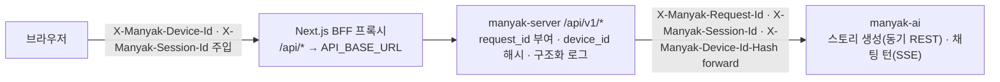
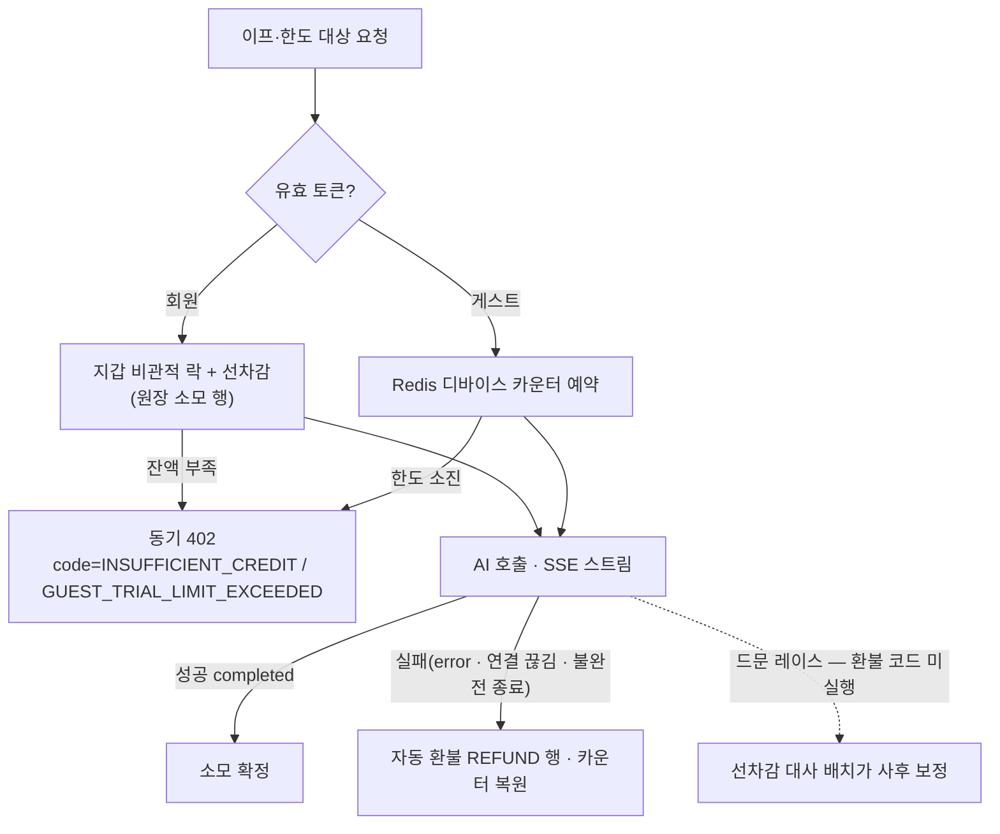

# 4-BACKEND

이 문서는 마냑 백엔드 서버(`manyak-server`)가 구현하고 QA가 검수해야 할 계약을 정의합니다. API, 데이터 모델, 인증, 오류 처리, 운영·관측 기준을 다룹니다.

각 항목은 실제 구현된 동작을 기준으로 구체값을 적고, 아직 구현하지 않은 항목은 `계획`으로 구분해 표기합니다.

```text
§4-1   문서 목적·범위와 관련 문서
§4-2   기술 환경과 아키텍처
§4-3   API 계약
§4-4   데이터 모델
§4-5   인증과 권한
§4-6   오류와 예외 처리
§4-7   운영과 관측
§4-8   검수 체크리스트
```

### 읽는 순서

- **처음 보는 사람** — §4-1(경계)과 §4-2(아키텍처 큰 그림)를 먼저 보고, §4-3 도입의 엔드포인트 카탈로그로 전체 표면을 잡습니다.
- **구현자** — 담당 기능의 §4-3-N 상세 절 → §4-4 데이터 모델 → §4-6 오류 계약 순서로 봅니다. 각 결정 지점의 "결정 기록"(배경·대안·영향)이 왜 이 계약인지의 근거입니다.
- **리뷰·QA** — §4-8 검수 체크리스트와 간극 표에서 시작해 본문을 역참조합니다.

| 항목 | 값 |
| --- | --- |
| 버전 | v0.38 |
| 작성일 | 2026-07-03 |
| 수정일 | 2026-08-30 |
| 대상 | 마냑 백엔드 서버 |
| 작성 목적 | 백엔드 API, 데이터 모델, 오류 처리, 운영 기준을 정의합니다. |
| 기준 코드 | `../manyak-server` `dev` 브랜치 `e2d659bb920a` (2026-08-20, Kotlin 2.2, Spring Boot 4, Flyway V58) |

---

## 4-1. 문서 목적·범위와 관련 문서

### 목적

이 문서는 마냑 백엔드 개발자가 API 계약, 데이터 모델, 오류 처리, 운영 기준을 구현하는 기준입니다. 백엔드는 이 문서를 기준으로 구현하고, 프론트엔드·AI 서버는 이 문서로 백엔드와의 계약을 확인하며, QA는 이 문서를 기준으로 검수합니다.

### 범위

- REST API 계약(엔드포인트, 요청·응답 스키마, 상태 코드, 헤더)
- 채팅 SSE 스트리밍 계약
- 데이터 모델과 식별자·삭제 정책
- 인증(소셜 로그인 — Google·Kakao, JWT)과 선택적 인증 정책
- 오류 응답 계약과 예외 처리 기준
- 운영·관측(상관관계 식별자, 구조화 로그, Sentry, `ai_call_logs`, 환경 변수, 헬스체크)

### 제외 범위

- 화면, 사용자 흐름, 프론트엔드 상태 처리 (담당: [`3-1-client.md`](./3-1-client.md))
- AI 서버 내부 구현, 프롬프트, 레이어 구성 (담당: [`5-ai-server.md`](./5-ai-server.md))
- 분석 이벤트 카탈로그, 지표, CloudWatch·Sentry 수집 기준의 원천 정의 (원천: [`6-analytics.md`](./6-analytics.md))
- 코드 구조, 클래스 설계, 테스트 작성 규칙, 로컬 실행 상세 (서버 레포 `README.md`·`CLAUDE.md`가 소유)
- 인프라 구성(Terraform, VPC, RDS 등)과 배포 런북 (`manyak-terraform` 레포가 소유)

### 관련 문서와 경계

| 문서 | 소유 영역 | 이 문서와의 관계 |
| --- | --- | --- |
| [`0-glossary.md`](./0-glossary.md) | 용어, 계층별 표기 컨벤션 | 필드·테이블·로그 이름의 표기 근거 |
| [`1-background.md`](./1-background.md) | 서비스 배경, MVP 범위 | 제품 방향의 상위 근거 |
| [`2-user-stories.md`](./2-user-stories.md) | 화면별 사용자 요구(US ID) | 검수 기준을 US ID로 추적 |
| [`3-1-client.md`](./3-1-client.md) | 화면, API 호출 시점, 실패 처리 | API의 소비자 계약. 호출 흐름은 위임 |
| [`5-ai-server.md`](./5-ai-server.md) | AI 요청·응답 계약, 프롬프트 | AI 와이어 상세 위임 |
| [`6-analytics.md`](./6-analytics.md) | 이벤트, 식별자, 관측 수집 기준 | 관측 계약의 원천. 백엔드 구현 현황은 이 문서가 기술 |

### 작성 원칙

- 구현된 동작을 기준으로 씁니다. 문서 간 기준이 다르면 코드를 기준으로 하고 차이는 [§4-8](#4-8-검수-체크리스트)의 간극 표에 기록합니다.
- API 경로는 `/api/v1` prefix를 생략해 표기합니다. 예외적으로 전체 경로가 필요한 곳(헬스체크 등)만 전체를 적습니다.
- 클라이언트 와이어 필드는 camelCase, DB·로그 필드는 snake_case로 적습니다([`0-glossary.md §0-4`](./0-glossary.md)).
- 이벤트·지표·AI 프롬프트는 원천 문서를 교차 참조하고 중복 서술하지 않습니다.

### 구현 상태 라벨

이 문서는 항목마다 `{로드맵 Phase} · {구현 상태}` 두 축을 라벨로 구분합니다. 로드맵 Phase는 [`roadmap.md`](../planning/roadmap.md)가 기능을 배정한 단계이고, 구현 상태는 `구현`(코드 반영 완료)과 `계획`(미구현, 방향만 합의) 2종입니다. `MVP`(= `Phase 0 · 구현`)와 `계획`(Phase 미배정)은 관례 단축형이며, 라벨이 없는 항목은 모두 `MVP`입니다.

| 라벨 | 의미 | 해당 항목 |
| --- | --- | --- |
| `MVP` | Phase 0 범위. 서버 구현 완료, MVP 프론트엔드가 사용 중 | 스토리·간편 제작·채팅·피드백 API |
| `Phase 1 · 구현` | Phase 1 범위. 서버 구현 완료, MVP 프론트엔드는 아직 미사용 | 인증 API·랜덤 닉네임([§4-5](#4-5-인증과-권한)), 마이그레이션·내 콘텐츠 목록([§4-3-5](#4-3-api-계약)), 로어북 카탈로그([§4-3-6](#4-3-api-계약))·엔딩 저장([§4-3-10](#4-3-api-계약)), 이프([§4-3-7](#4-3-api-계약)), 일반 제작·스토리 수정([§4-3-8](#4-3-api-계약)), AI 응답 재생성([§4-3-9](#4-3-api-계약)) |
| `Phase 1 · 계획` | Phase 1 범위. 미구현, 방향만 합의됨 | 채팅 이미지 삽입([§4-3-9](#4-3-api-계약)) |
| `Phase 1 · 구현`(2026-07 반영) | Phase 1 범위. 서버 dev 구현 완료 | 이관 1회 잠금(V36)·이관 시도 상한(B19 완화, V38)·재생성 버전 이력(V37)·체험 한도 5·1·5(B8)·삭제 소유권 검증·게스트-회원 교차 접근 차단·채팅 배치 열람 필터·보상 이프 만료 FIFO(V39)·세션 부트스트랩 응답 확장·프로필 썸네일 동봉·정지 계정 집행·스토리 읽기 가시성(KNK-401·464)·게스트 한도 회원 공유(V40)·프로필 프리셋 배정(KNK-388)·시작 설정 복수화·와이어 개편(V42·KNK-515)·엔딩·주요 사건·로어북 런타임 반영(V41·KNK-520~523)·초대 보상 진행 표시(KNK-513)·서버 분석 이벤트 발행(KNK-514)·402 사유 코드 구분(KNK-524)·썸네일 자동 연결·반응형 변형(V45~46·KNK-548, [§4-3-9](#4-3-api-계약))·초대 코드 입력 개편(V47·KNK-567, [§4-3-7](#4-3-api-계약))·피드백 User-Agent 저장(V43·KNK-528)·채팅 상세 턴 `reachedEnding` 노출(KNK-527) — [§4-8](#4-8-검수-체크리스트) |
| `Phase 2 · 구현` | Phase 2 범위. 구현 완료 | 공개 스토리 목록·게스트 공개 제한(KNK-149, [§4-3-1](#4-3-api-계약)·[§4-3-8](#4-3-api-계약)), 스토리 좋아요·신고·공개 전환(KNK-1017·1020·1021), 회원 탈퇴(KNK-1019·1053, [§4-3-5](#4-3-api-계약)), 메트릭([§4-7](#4-7-운영과-관측)) — OTLP export 배선(KNK-779)·완성 타이머 거부 outcome 분리(KNK-784). 운영 배선(KNK-781·793)과 **v0.2.7 배포로 2026-08-06 활성화 완료**([`7-deployment.md §7-6`](./7-deployment.md)) |
| `계획` | Phase 미배정. 미구현, 방향만 합의됨 | AI 와이어 필드 정렬([§4-8](#4-8-검수-체크리스트) B2) |
| `Phase 3 · 구현` | Phase 3 범위. 서버 dev 구현 완료 | 디바이스 푸시 토큰·FCM 발송 모듈(KNK-1131·1130)·푸시 수신 동의 API(KNK-1132, V73)·스토리 완성 푸시(KNK-1115)·출석 리마인드 푸시(KNK-1116, V74)([§4-3-5](#4-3-api-계약)). 프로모션(KNK-1117)·검수 완료(KNK-1118) 발송은 `Phase 3 · 계획` |

---

## 4-2. 기술 환경과 아키텍처

### 기술 환경

| 분류 | 기술 |
| --- | --- |
| 언어·런타임 | Kotlin 2.2, Java 21 (Temurin) |
| 프레임워크 | Spring Boot 4, Spring MVC + `SseEmitter`(SSE), WebClient(AI 스트림 수신) |
| 영속성 | Spring Data JPA, PostgreSQL(운영)·H2(테스트), Flyway 마이그레이션 |
| 캐시·토큰 저장소 | Redis (refresh 토큰) |
| 인증 | Spring Security, OAuth2 Resource Server(JWT), 소셜 OIDC ID 토큰 검증(Nimbus — Google·Kakao 공용) |
| 관측 | Logstash Logback Encoder(JSON 구조화 로그), Sentry, Spring Actuator |
| API 문서 | SpringDoc OpenAPI (Swagger UI) |
| 빌드·배포 | Gradle(Kotlin DSL), Docker multi-stage, GitHub Actions |

### 핵심 아키텍처

일반적인 인증형 API 서버와 다른 지점입니다.

| # | 특징 | 요지 | 상세 |
| --- | --- | --- | --- |
| 1 | 전원 게스트 + 선택적 인증 | MVP는 인증 없이 동작합니다. 대부분의 엔드포인트는 익명을 허용하되, 유효한 토큰이 오면 `user_id`를 귀속합니다. | [§4-5](#4-5-인증과-권한) |
| 2 | 공개 식별자(UUID)만 노출 | 외부에는 `public_id`(UUID)만 노출하고 내부 Long PK는 감춰 IDOR을 차단합니다. | [§4-4](#4-4-데이터-모델) |
| 3 | AI 프록시 | 스토리 생성은 동기 REST로, 채팅 턴은 SSE로 AI 서버를 호출하고 결과를 저장·중계합니다. | [§4-3-3](#4-3-api-계약) |
| 4 | 상관관계 관측 | 모든 요청에 `request_id`를 부여하고 `device_id_hash`로 익명 식별을 이어 로그·Sentry·`ai_call_logs`를 연결합니다. | [§4-7](#4-7-운영과-관측) |
| 5 | 소프트 삭제 | 스토리·채팅 삭제는 `deleted_at` 기록으로 처리하고 조회에서 제외합니다. | [§4-4](#4-4-데이터-모델) |
| 6 | 남용 방지 다층 방어 | 게스트+선택 인증 구조는 남용 표면이 넓으므로 체험 한도·이관 1회·교차 차단·관측을 계층으로 쌓습니다. | 아래 [남용 방지 설계](#남용-방지-설계) |

### 요청 흐름



### 도메인 모듈

서버 코드는 도메인 4개와 공통 계층으로 나뉩니다.

| 모듈 | 담당 |
| --- | --- |
| `auth` | 소셜 로그인(Google·Kakao), JWT 발급·검증, refresh 토큰 저장소 |
| `story` | 스토리 조회·삭제, 간편 제작 퍼널, 로어북, 스토리 AI 클라이언트 |
| `chat` | 채팅 생성·조회·삭제, 턴 SSE 스트리밍, 채팅 AI 클라이언트 |
| `feedback` | 피드백 저장, Slack 알림 |
| `global` | 보안 설정, 공통 오류 응답, 상관관계 필터, 구조화 로그, `ai_call_logs` |

### 남용 방지 설계

전원 게스트 + 선택적 인증(특징 1)은 진입 마찰을 없애는 대신 남용 표면을 넓힙니다. 개별 방어 계약은 여러 절에 흩어져 있어, 여기서는 그것들이 이루는 방어 계층만 지도로 묶습니다(계약 본문·수치는 각 절이 정본이며 여기서 재정의하지 않습니다).

| 계층 | 막는 것 | 장치 | 상태 |
| --- | --- | --- | --- |
| 진입 상한 | 가입 전 무한 무료 사용 | 디바이스별 체험 한도(스토리라인 5·스토리 1·채팅 턴 5) — [§4-3-7](#4-3-api-계약) | `구현`(B8) |
| 전환 차단 | 게스트 콘텐츠 반복 이관 파밍 | 이관 계정당 1회 잠금 + 게스트↔회원 교차 접근 차단 — [§4-3-5](#4-3-api-계약)·[§4-5](#4-5-인증과-권한) | `구현` |
| 재가입 차단 | 탈퇴·재가입 반복으로 계정 단위 1회성 혜택 재수령 | 소셜 연동 tombstone + 보상 신원·소진 표식·정지 상태 승계 — [§4-3-5](#4-3-api-계약)·[§4-3-7](#4-3-api-계약) | `구현`(KNK-1053) |
| 회원 재화 보호 | 선차감 후 실패의 과금·이중 환불 | charge-once/refund-once + 선차감 대사 배치 + 보상 멱등 키 — [§4-3-7](#4-3-api-계약) | `구현` |
| 관측 backstop | 우회·잔여 리스크의 사후 탐지 | 상관관계 관측 + 호출량 급증·카운터 키 증가 추이 — [§4-7](#4-7-운영과-관측) | 상시 |

**설계 원칙 — 완전 차단이 아니라 파밍 기대이익 < 비용.** 서버는 콘텐츠에 디바이스 식별자를 저장하지 않아 게스트를 식별할 수 없으므로, 막을 수 있는 교차 방향(게스트↔회원)만 양쪽을 막고([§4-5](#4-5-인증과-권한)), 막을 수 없는 것(게스트↔게스트, 헤더 변조)은 파밍 1건의 가치 자체를 낮춰(한도 축소 B8·이관 1회) 수용합니다.

**수용된 잔여 리스크와 강화 경로.** Phase 1은 다음을 "탐지하되 차단하지 않음"으로 수용하고 관측으로 추적하며, 차단 강화(rate limit·키 TTL 등)는 후속 결정으로 둡니다: 디바이스 헤더 변조·기기 교체(B8), 게스트↔게스트 접근, 무인증 쓰기 rate limit 부재(B18), 이관 소유 미증명(B19 — 열거 오라클은 시도 상한 5회로 완화 구현), Sybil 보상 파밍(B21 — 소셜 계정 하나를 탈퇴·재가입으로 재활용하는 축은 KNK-1053으로 닫혔고, 새 소셜 계정을 계속 만드는 축만 남습니다). 근거·완화 방향은 각 B 항목이 소유합니다([§4-8](#4-8-검수-체크리스트)).

---

## 4-3. API 계약

### 공통 규칙

- 모든 비즈니스 API는 `/api/v1` prefix를 사용합니다.
- 요청·응답 JSON 필드는 camelCase입니다([`0-glossary.md §0-4`](./0-glossary.md)).
- 시각 필드(`createdAt`, `updatedAt`)는 ISO 8601 UTC 문자열입니다.
- 문자 수 제약("N자")은 UTF-16 code unit(Java `String.length()`, Bean Validation `@Size` 기준)으로 판정합니다. 이모지·서로게이트 페어는 2로 셉니다.
- 배치 조회는 배열이 커질 수 있어 `POST` 본문으로 ID 목록을 받습니다. 상한은 100개(중복 포함 배열 길이 기준)이며, 중복 ID는 각 ID당 1건만 반환합니다.
- 요청 검증 실패는 400과 `ApiErrorResponse.details`로 응답합니다([§4-6](#4-6-오류와-예외-처리)).

### 요청·응답 헤더

프론트엔드가 주입하는 식별 헤더와 백엔드의 처리 규칙입니다. 값의 정책 원천은 [`6-analytics.md §6-6-2`](./6-analytics.md)입니다.

| 헤더 | 방향 | 처리 |
| --- | --- | --- |
| `X-Manyak-Request-Id` | 수신·응답 | 없으면 `req_` + UUID(하이픈 제거)로 생성. 응답 헤더로 항상 echo |
| `X-Manyak-Session-Id` | 수신 | MDC `session_id`에 적재. 없으면 `unknown` |
| `X-Manyak-Device-Id` | 수신 | 원본을 저장하지 않고 해시(`device_id_hash`)로 변환해 MDC에 적재. 없으면 `unknown` |

- 식별 헤더가 없어도 요청을 거부하지 않습니다. 예외: 게스트 체험 한도 대상 요청은 `X-Manyak-Device-Id`가 필수이며 누락 시 400입니다([§4-3-7](#4-3-api-계약)).
- 해시 방식과 AI 서버로의 forward 규칙은 [§4-7](#4-7-운영과-관측)에 정의합니다.

### 엔드포인트 카탈로그

| 도메인 | 메서드·경로 | 설명 | 성공 | 주요 실패 | 인증 | 상태 |
| --- | --- | --- | --- | --- | --- | --- |
| 스토리 | `GET /stories` | 공개 스토리 목록(커서 페이지네이션, `?sort`·`?limit`·`?cursor`) | 200 | 400 | 불필요 | Phase 2 · 구현 |
| 스토리 | `POST /stories/batch` | 공개 ID 목록으로 스토리 카드 조회 | 200 | 400 | 선택 | MVP |
| 스토리 | `GET /stories/{storyId}` | 스토리 상세 조회 | 200 | 404 | 선택 | MVP |
| 스토리 | `DELETE /stories/{storyId}` | 스토리 소프트 삭제 | 204 | 403·404 | 선택 | MVP |
| 스토리 | `GET /stories/lorebooks` | 로어북 카탈로그 조회(`?genre` 필터) | 200 | — | 불필요 | Phase 1 · 구현 |
| 스토리 | `GET /stories/{storyId}/edit` | 스토리 수정 폼 데이터 조회 | 200 | 403·404 | 선택 | Phase 1 · 구현 |
| 스토리 | `PATCH /stories/{storyId}` | 스토리 수정 | 200 | 400·403·404 | 선택 | Phase 1 · 구현 |
| 스토리 | `POST /stories/general` | 일반 제작 등록 | 201 | 400 | 선택 | Phase 1 · 구현 |
| 스토리 | `POST /stories/{storyId}/like` | 스토리 좋아요 등록(멱등) | 204 | 401·403·404 | 필수 | Phase 2 · 구현 |
| 스토리 | `DELETE /stories/{storyId}/like` | 스토리 좋아요 취소(멱등) | 204 | 401·403·404 | 필수 | Phase 2 · 구현 |
| 스토리 | `POST /stories/{storyId}/reports` | 스토리 신고 등록 | 201 | 400·401·403·404 | 필수 | Phase 2 · 구현 |
| 간편 제작 | `GET /stories/simple/tags` | 제공 태그 목록 조회 | 200 | — | 불필요 | MVP |
| 간편 제작 | `POST /stories/simple/storylines` | 스토리라인 3개 생성(AI 호출) | 201 | 400·402·409·502 | 선택 | MVP |
| 간편 제작 | `POST /stories/simple` | 최종 스토리 생성(AI 호출) | 201 | 400·402·403·404·409·502 | 선택 | MVP |
| 간편 제작 | `GET /stories/simple/creation-requests/{requestId}` | 생성 요청 복구 조회(연결 유실 후 결과 되찾기) | 200 | 404 | 선택 | Phase 1 · 구현 |
| 간편 제작 | `PUT /stories/simple/storylines/{storylineId}/rating` | 스토리라인 평가 설정 | 200 | 400·403·404 | 선택 | MVP |
| 간편 제작 | `DELETE /stories/simple/storylines/{storylineId}/rating` | 스토리라인 평가 취소(멱등) | 204 | 403·404 | 선택 | MVP |
| 채팅 | `POST /chats` | 채팅 생성(플레이 시작) | 201 | 400·403·404 | 선택 | MVP |
| 채팅 | `POST /chats/batch` | 공개 ID 목록으로 채팅 카드 조회 | 200 | 400 | 선택 | MVP |
| 채팅 | `GET /chats/{chatId}` | 채팅 상세(턴 이력) 조회 | 200 | 403·404 | 선택 | MVP |
| 채팅 | `DELETE /chats/{chatId}` | 채팅 소프트 삭제 | 204 | 403·404 | 선택 | MVP |
| 채팅 | `POST /chats/{chatId}/turns/stream` | 턴 진행 SSE 스트리밍 | 200(SSE) | 400·402·403·404 | 선택 | MVP |
| 채팅 | `POST /chats/{chatId}/turns/regenerate/stream` | 마지막 턴 AI 응답 재생성 SSE 스트리밍 | 200(SSE) | 400·402·403·404·409 | 선택 | Phase 1 · 구현 |
| 채팅 | `POST /chats/{chatId}/turns/{turnId}/choices` | 선택지 생성 트리거(마지막 턴, 멱등) | 200 | 403·404·409·502 | 선택 | Phase 1 · 구현 |
| 채팅 | `POST /chats/{chatId}/shares` | 채팅 공유 링크 발급(발급 시점 스냅샷) | 201 | 403·404 | 선택 | Phase 1 · 구현 |
| 채팅 | `GET /shares/{shareId}` | 공유된 채팅 열람(읽기 전용) | 200 | 404 | 불필요 | Phase 1 · 구현 |
| 피드백 | `POST /feedbacks` | 피드백 등록 | 201 | 400 | 선택 | MVP |
| 인증 | `POST /auth/login/google` | Google ID 토큰 로그인 | 200 | 400·401 | 불필요 | Phase 1 · 구현 |
| 인증 | `POST /auth/login/kakao` | Kakao ID 토큰 로그인 | 200 | 400·401 | 불필요 | Phase 1 · 구현 |
| 인증 | `GET /auth/me` | 현재 사용자 조회 | 200 | 401 | 필수 | Phase 1 · 구현 |
| 인증 | `POST /auth/token/refresh` | 토큰 재발급(회전) | 200 | 400·401 | 불필요 | Phase 1 · 구현 |
| 인증 | `POST /auth/logout` | refresh 토큰 폐기(멱등) | 204 | 400 | 불필요 | Phase 1 · 구현 |
| 인증 | `POST /auth/migrate` | 게스트 데이터 소유권 이관(항목별 부분 성공) | 200 | 400·401 | 필수 | Phase 1 · 구현 |
| 인증 | `POST /auth/handoffs` | 로그인 핸드오프 생성(인앱 게스트 데이터 임시 보관) | 201 | 400 | 불필요 | Phase 1 · 구현 |
| 인증 | `GET /auth/handoffs` | 핸드오프 확인(외부 랜딩 안내용 건수) | 200 | 404 | 불필요 | Phase 1 · 구현 |
| 인증 | `GET /auth/handoffs/status` | 핸드오프 상태 조회(인앱 복귀 정리용) | 200 | 404 | 불필요 | Phase 1 · 구현 |
| 인증 | `POST /auth/links/reauth` | 계정 연동 재인증(일회용 링크 코드 발급) | 201 | 400·401·403 | 필수 | Phase 1 · 구현 |
| 인증 | `POST /auth/links/{provider}` | 계정 연동 추가(링크 코드 필요, 본문 없는 201) | 201 | 400·401·403·409 | 필수 | Phase 1 · 구현 |
| 사용자 | `DELETE /users/me` | 회원 탈퇴(soft delete) | 204 | 401 | 필수 | Phase 2 · 구현 |
| 사용자 | `GET /users/me/stories` | 내 스토리 목록(서버 정본) | 200 | 401 | 필수 | Phase 1 · 구현 |
| 사용자 | `GET /users/me/chats` | 내 채팅 목록(서버 정본) | 200 | 401 | 필수 | Phase 1 · 구현 |
| 사용자 | `PUT /users/me/push-tokens` | 디바이스 푸시 토큰 등록·갱신(같은 토큰 재등록은 갱신, 멱등) | 204 | 400·401·403 | 필수 | Phase 3 · 구현 |
| 사용자 | `DELETE /users/me/push-tokens` | 디바이스 푸시 토큰 삭제(본문 `token`, 없거나 남의 토큰이어도 204) | 204 | 400·401·403 | 필수 | Phase 3 · 구현 |
| 사용자 | `GET /users/me/push-settings` | 알림 수신 동의 조회(세 boolean) | 200 | 401·403 | 필수 | Phase 3 · 구현 |
| 사용자 | `PUT /users/me/push-settings` | 알림 수신 동의 전체 교체(세 필드 필수, 야간 단독 400) | 200 | 400·401·403 | 필수 | Phase 3 · 구현 |
| 이프 | `GET /users/me/credits` | 이프 잔액 조회 | 200 | 401 | 필수 | Phase 1 · 구현 |
| 이프 | `POST /users/me/credits/attendance` | 출석체크 적립(1일 1회 멱등) | 200 | 401 | 필수 | Phase 1 · 구현 |
| 이프 | `GET /users/me/credits/transactions` | 이용내역(원장) 커서 조회 | 200 | 400·401 | 필수 | Phase 1 · 구현 |
| 이프 | `GET /users/me/invite` | 내 초대 코드·보상 진행 조회 | 200 | 401 | 필수 | Phase 1 · 구현 |
| 이프 | `POST /users/me/invite/redeem` | 초대 코드 입력·양측 보상 적립 | 200 | 400·401·404·409 | 필수 | Phase 1 · 구현 |

인증 열의 `선택`은 익명을 허용하되 유효한 access 토큰이 오면 `user_id`를 귀속하는 엔드포인트입니다([§4-5](#4-5-인증과-권한)).

### 4-3-1. 스토리 조회·삭제

**`POST /stories/batch`** — 요청 `{storyIds: string[]}`(1~100개 — `@NotEmpty`·`@Size` Bean Validation으로 서비스 진입 전 400). 존재하고 삭제되지 않았으며 아래 읽기 가시성을 통과한 스토리만 반환하고, 없는 ID·읽기 불가 항목은 오류 없이 제외합니다. UUID 형식이 아닌 ID는 조용히 제외하며 유효 ID가 0개면 DB 조회 없이 빈 배열을 반환합니다. 중복 ID는 1건으로 병합하고, 반환 순서는 중복 제거된 요청 순서를 보존합니다.

**`GET /stories`** — `Phase 2 · 구현`(KNK-149). 공개 스토리 목록입니다. 인증이 필요 없고 **요청자 신원을 쓰지 않습니다** — 로그인 여부와 무관하게 같은 결과를 봅니다.

| 쿼리 | 기본값 | 규칙 |
| --- | --- | --- |
| `sort` | `latest` | `latest`(등록 최신순) · `popular`(좋아요 많은 순). 그 외 값은 400 |
| `limit` | 20 | `[1, 50]`으로 clamp(`coerceIn`) — 범위 밖은 400이 아니라 보정. 비수치는 타입 변환 실패로 400 |
| `cursor` | — | 이전 응답의 `nextCursor`. 형식이 깨졌거나 **정렬 종류가 다르면** 400 |

응답은 `{items: StorySummaryResponse[], nextCursor: string | null}`입니다. `items`의 카드는 `POST /stories/batch`·`GET /stories/originals`·`GET /users/me/stories`와 **같은 `StorySummaryResponse`**(아래 표)를 재사용합니다 — 목록 카드 컴포넌트를 경로마다 다시 만들지 않기 위해서입니다. 마지막 페이지의 `nextCursor`는 null입니다.

**노출 조건.** 다음 넷을 모두 만족하는 스토리만 싣습니다.

```
status = PUBLISHED  AND  visibility = PUBLIC  AND  deleted_at IS NULL  AND  user_id IS NOT NULL
```

앞의 셋은 아래 읽기 가시성의 ①(공개 스토리)과 소프트 삭제 제외에 해당합니다. **네 번째(회원 소유)가 목록 전용 조건**입니다 — 읽기 가시성은 게스트 스토리를 UUID 보유자에게 열어 주지만, 목록은 UUID를 모르는 사람에게 스토리를 **발견시키는** 경로라 판정이 다릅니다.

**결정 기록 — 게스트 스토리는 피드에 싣지 않는다(2026-09-03, KNK-149)**

- **결정.** `user_id`가 NULL인 스토리는 공개 목록에서 제외합니다. 작성자 신원이 없어 카드에 작성자를 표기할 수 없고, 좋아요·신고 같은 소셜 기능의 책임 주체가 없기 때문입니다.
- **실제 대상.** 간편 제작은 회원·게스트 구분 없이 `PRIVATE`으로 저장하므로([§4-3-2](#4-3-api-계약)) 이 조건으로 걸러지는 것은 일반 제작에서 `PUBLIC`을 지정한 게스트 스토리와 향후 경로입니다. `stories.visibility` 기본값이 `PUBLIC`이라 새 경로가 생기면 다시 발생할 수 있어 조건 자체는 유지합니다.
- **영구 배제가 아닙니다.** 게스트가 로그인해 이관([§4-3-5](#4-3-api-계약))하면 회원 소유가 되어 자연히 노출됩니다. 게스트 서재(로컬 ID → `POST /stories/batch`)와 상세 조회도 그대로라 **목록 노출만 빠집니다**.
- **함께 확정 — 게스트는 `PUBLIC`을 지정할 수 없습니다(400).** 목록에서 거르는 것만으로는 부족합니다 — 소유자 없는 PUBLIC 스토리는 상세·채팅 경로에서 여전히 열려 있고, 데이터에 남으면 다음 소비자가 같은 판정을 또 해야 합니다. 등록·수정 계약은 [§4-3-8](#4-3-api-계약)이 정의합니다.
- 마냑 오리지널(`GET /stories/originals`)은 공식 계정(회원) 소유라 이 조건에 걸리지 않고 그대로 포함됩니다.

**정렬과 커서.**

| `sort` | 1차 키 | 2차 키 |
| --- | --- | --- |
| `latest` | `created_at` DESC | `public_id` DESC |
| `popular` | 좋아요 수 DESC | `public_id` DESC |

- 인기순의 좋아요 수는 컬럼이 아니라 `story_likes` **실시간 집계**입니다(카드·상세의 `likeCount`와 같은 출처). 정렬과 커서 조건 양쪽에서 같은 상관 서브쿼리를 씁니다. **비정규화 컬럼(`stories.like_count`)은 두지 않습니다** — 좋아요 등록·취소 양쪽의 동기화 비용이 목록 하나의 이득보다 크고, 어긋나면 카드 수치와 상세 수치가 갈립니다. 목록이 커져 정렬이 느려지면 그때 비정규화나 인덱스를 검토합니다.
- 2차 키는 내부 PK가 아니라 `public_id`입니다 — 커서에 순차 PK를 실으면 외부 노출 식별자 정책([§4-4](#4-4-데이터-모델))을 어깁니다. 랜덤 UUID지만 값이 안정적이라 동률 구간(같은 시각, 같은 좋아요 수)의 순서를 결정적으로 만듭니다.
- **커서 형식** — `"<정렬 접두>:<정렬값>:<public_id>"`를 Base64URL(패딩 없음)로 감쌉니다. 정렬 접두는 `latest`가 `l`, `popular`가 `p`이며 **디코드 시 검증**합니다: 정렬이 다른 커서를 넘기면 400입니다(인기순 커서의 정렬값은 좋아요 수라 최신순에 넣으면 엉뚱한 시각으로 해석됩니다). 정렬값은 `latest`가 `created_at`의 **epoch nanos**, `popular`가 좋아요 수입니다. millis가 아닌 이유는 PostgreSQL `timestamptz`가 마이크로초까지 담기 때문입니다 — 밀리초로 자르면 같은 밀리초 안의 뒤쪽 행이 `created_at < 커서`에도 `= 커서`에도 걸리지 않아 페이지 경계에서 사라집니다.
- offset이 아니라 keyset이라 페이지 사이에 새 스토리가 끼어들어도 중복·누락이 없습니다. `limit + 1`건을 읽어 다음 페이지 유무를 판정합니다.
- 인덱스는 아직 추가하지 않았습니다. 공개 스토리가 늘면 `latest`는 `(status, visibility, deleted_at, created_at DESC, public_id DESC)` 부분 인덱스가, `popular`는 집계 정렬이라 비정규화 컬럼이나 상위 N개 캐시가 필요해질 수 있습니다(관측 후 결정).

**인증 배선.** `SecurityConfig`에서 **정확 경로** permitAll이며 `OPTIONAL_AUTH_MATCHERS`에도 등록합니다([§4-5](#4-5-인증과-권한) 선택적 인증). 요청자 신원을 쓰지 않지만, 클라이언트가 자동 첨부한 만료·위조 access 헤더가 리소스 서버 필터에 걸려 401이 나면 로그아웃 상태 화면이 통째로 깨지기 때문입니다(`GET /shares/{shareId}`와 같은 이유).

**읽기 가시성 — `Phase 1 · 구현`(KNK-401·464).** 스토리 읽기(배치·상세 조회, `POST /chats`의 시작 전 게이트 포함)는 다음 중 하나일 때만 허용합니다: ① 공개 스토리(`status = PUBLISHED`이면서 `visibility = PUBLIC`), ② 게스트 제작 스토리(`user_id` NULL — UUID 보유가 사실상 본인 서재·공유 링크 보유), ③ 요청자가 소유자 본인. 따라서 **회원 소유 스토리가 PRIVATE(또는 DRAFT)면 타인·익명은 UUID를 알아도 읽을 수 없습니다** — 배치는 결과에서 제외, 상세는 404(존재 여부 비노출)입니다.

**응답 항목(`StorySummaryResponse`)**

| 필드 | 타입 | 설명 |
| --- | --- | --- |
| `id` | string | 스토리 공개 식별자(UUID) |
| `title` | string | 제목 |
| `oneLineIntro` | string | 한 줄 소개. 저장값이 NULL이면 빈 문자열 |
| `genres` | string[] | 장르 태그명 목록 — `stories.genre`를 쉼표 분리 후 각 항목 trim·빈 항목 제거 |
| `author` | object·null | 작성자 `{id, nickname, profileImageUrl}`. 익명 생성 시 `author` 자체가 null. `profileImageUrl`은 이미지 미배정 회원이면 null(클라이언트는 기본 아바타로 처리). `Phase 1 · 구현`(KNK-1016, 2026-08-29) — 회원 소유 스토리는 목록·상세 모두 실제 작성자의 `nickname`·`profileImageUrl`을 채웁니다(2026-08-28 팀 결정 — 스토리 상세의 공개 소비 전환). 목록은 배치 조회로 채워 N+1을 막습니다. `author.id`는 내부 PK 비노출 원칙([§4-4](#4-4-데이터-모델)·B24)에 따라 항상 null입니다 |
| `turnCount` | number | `Phase 1 · 구현`(KNK-515) 누적 사용자 입력 턴 수 — 스토리의 모든 미삭제 채팅 `current_turn` 합(목록은 배치 집계로 N+1 방지). 이전 와이어 필드 `chatCount`(채팅 수)를 대체 |
| `likeCount` | number | 좋아요 수. `Phase 2 · 구현`(KNK-1017) — `story_likes` 실 집계입니다([아래 스토리 좋아요](#4-3-api-계약)). 목록은 배치 집계로 채워 N+1을 막습니다 |
| `status` | enum | `DRAFT` · `PUBLISHED` |
| `thumbnailUrlSm` | string·null | `Phase 1 · 구현`(KNK-548) 썸네일 축소 변형(`_sm`) 서빙 URL — 목록·카드 렌더용. 연결된 썸네일이 없으면 null([§4-3-9](#4-3-api-계약) 반응형 변형) |
| `createdAt` | string | 생성 시각 |

**`GET /stories/{storyId}`** — 상세 응답(`StoryDetailResponse`)은 목록 필드에 다음을 더합니다.

| 필드 | 타입 | 설명 |
| --- | --- | --- |
| `description` | string·null | 주요 내용 |
| `thumbnailUrl` | string·null | `Phase 1 · 구현`(KNK-515·V45) 썸네일 **원본** 서빙 URL(상세 히어로용 — 목록·카드는 `thumbnailUrlSm`). 이전 `coverImageUrl`을 개명. 자동 연결([§4-3-9](#4-3-api-계약))이 등록 시 확정한 `stories.thumbnail_image_key`로 백엔드가 조합하며, 연결 소스가 없거나 규칙 도입 전 스토리는 null. `Phase 2 · 구현`(KNK-1069) 컴파일이 생성한 표지가 있으면 `stories.thumbnail_image_url`(WebP 절대 URL)이 이 값을 대신합니다 — 필드 이름·타입은 그대로이고 값의 출처만 늘었습니다 |
| `hashtags` | string[] | 해시태그(placeholder) |
| `startSettings` | object[] | `Phase 1 · 구현`(KNK-515) 시작 설정 목록(복수화 — 등록 순서). 각 항목 `{id, name, prologue, startSituation, suggestedInputs[], endings[]}`: `id`는 시작 설정 공개 식별자(UUID — `POST /chats`의 `startSettingId`로 사용), `suggestedInputs`는 이 시작 설정의 추천 입력, `endings`는 `{name, requirement{minTurns, achievementCondition}, epilogue}`(이름 기반·유형 없음, 활성 엔딩만, 레거시 `enabled=false` 제외, [§4-3-8](#4-3-api-계약)·[§4-3-10](#4-3-api-계약)). 시작 설정이 없으면 빈 배열 |
| `visibility` | enum | `PUBLIC` · `PRIVATE`(기본 PRIVATE) |
| `lorebooks` | object[] | `Phase 1 · 구현` 로어북 `{id, name, genre, content}`(스토리 스코프) |
| `mainEvents` | object[] | `Phase 1 · 구현` 주요 사건 `{name, description, keySentence, sortOrder}`(스토리 스코프) — `sort_order` 오름차순. 런타임 의미는 [§4-3-10](#4-3-api-계약) |
| `reachedEndings` | string[] | `Phase 1 · 구현`(KNK-523) 요청자가 이 스토리에서 도달한 엔딩 **이름** 목록(엔딩은 이름으로 식별). 회원은 사용자+스토리 집계, 게스트는 빈 배열([§4-3-10](#4-3-api-계약)) |
| `isOwner` | boolean | `Phase 1 · 구현`(KNK-1016·1018, 2026-08-29) 요청 회원이 이 스토리의 소유자인지. 와이어 필드명은 `@JsonProperty("isOwner")`로 고정(springdoc이 `owner`로 문서화하는 문제 차단). 서버가 요청자 `user_id`와 `stories.user_id`를 비교해 판단하며(클라이언트 id 비교 없음 — `author.id`가 null이라 클라이언트는 판단 불가), 게스트·미인증은 false. 용도는 상세 헤더 메뉴(수정·삭제 등) 노출 판단 |
| `isLiked` | boolean | `Phase 2 · 구현`(KNK-1017) 요청 회원이 이 스토리에 좋아요를 눌렀는지([아래 스토리 좋아요](#4-3-api-계약)). 게스트·미인증은 false |
| `characters` | object[] | `Phase 2 · 계획`(KNK-1058) 등장인물 `{name, imageUrl}` — `story_characters`([§4-4](#4-4-데이터-모델))를 저장순(컴파일 응답 순서)으로 싣습니다. 이미지 생성에 실패한 인물도 포함하고 그 `imageUrl`은 null입니다(이미지 실패가 스토리를 막지 않는 계약과 같은 취지 — [§4-3-9](#4-3-api-계약)). 인물 행이 없는 스토리(컴파일 경로 이전·일반 제작)는 빈 배열입니다 |

- `status`·`visibility`·`lorebooks`·`startSettings[].endings`는 MVP 프론트엔드가 사용하지 않습니다([`3-1-client.md §3-1-9`](./3-1-client.md) G3).
- **인물 목록의 범위 — `Phase 2 · 계획`(KNK-1058, 2026-08-31 결정).** 상세의 `characters[]`는 **이름과 이미지만** 싣습니다. `story_characters`에는 외형 7필드(성별·나이·체형·얼굴·머리·복장·visual identity)도 있지만 썸네일·인물 이미지 재생성 재료라 상세에 노출하지 않고, **인물별 설명 필드는 아예 없습니다** — 인물 소개에 해당하는 텍스트는 `story_settings.character_setting` 통글 한 덩어리여서 인물별로 쪼갤 근거가 없습니다. 인물 카드마다 소개를 붙이려면 컴파일 응답에 인물별 설명을 더해 저장하는 별도 작업이 필요하고, 그때도 기존 스토리는 재컴파일 없이는 채울 수 없습니다. 인물 공개 식별자(`public_id`)도 노출하지 않습니다 — 이름·이미지만 쓰는 화면에는 필요 없고, 인물 단위 API가 생기는 시점에 더합니다.

**`DELETE /stories/{storyId}`** — 소프트 삭제 후 204. 존재하지 않거나 이미 삭제된 ID는 404를 반환하며, 프론트엔드는 404를 무음 성공으로 처리합니다([`3-1-client.md §3-1-6`](./3-1-client.md)). 소유권 규칙([§4-5](#4-5-인증과-권한))을 적용합니다: 소유 스토리는 소유자만, `user_id`가 NULL인 스토리는 익명(게스트) 요청만 삭제할 수 있고 위반은 403입니다(`Phase 1 · 구현`). 404 판정(형식 오류·순차 정수·부재·이미 삭제 — 모두 동일 404로 존재 여부 비노출)을 403보다 먼저 적용하고, 삭제는 스토리 행 비관적 쓰기 락으로 처리해 소유권 검사와 `deleted_at` 기록 사이에 이관 클레임이 끼어드는 경쟁을 차단합니다(KNK-69 — 채팅 삭제 동일).

#### 스토리 좋아요 — `Phase 2 · 구현`(KNK-1017, V6x)

스토리 상세의 공개 소비 전환(2026-08-28 팀 결정)에 따른 좋아요 계약입니다. **like만 있고 dislike는 없습니다.**

- **`POST /stories/{storyId}/like`** — 좋아요 등록, 204. **`DELETE /stories/{storyId}/like`** — 좋아요 취소, 204. 둘 다 멱등입니다 — 이미 좋아요한 스토리의 재등록, 좋아요 없는 스토리의 취소도 204입니다(스토리라인 평가 취소와 같은 결).
- 인증 필수입니다(게스트 불가 — 미인증 401). 대상 스토리에는 읽기 가시성([위](#4-3-api-계약) — `Story.isReadableBy`)을 적용하며, 읽을 수 없는 스토리는 404입니다(존재 여부 비노출).
- 저장은 `story_likes`에 `(user_id, story_id)` UNIQUE 1행입니다([§4-4](#4-4-데이터-모델)). `likeCount`(목록·상세)는 이 테이블의 실 집계, 상세 `isLiked`는 요청 회원의 행 존재 여부입니다.

#### 스토리 신고 — `Phase 2 · 구현`(KNK-1020)

- **`POST /stories/{storyId}/reports`** — 신고 등록, 201. 인증 필수(미인증 401)이며, 대상 스토리에는 좋아요와 동일하게 읽기 가시성을 적용합니다(읽을 수 없는 스토리는 404).
- 사유 분류(enum) 체계, 같은 회원의 같은 스토리 중복 신고 정책, 신고 접수 후 처리(운영 알림·노출 제재)는 **구현 시 확정**합니다 — 이 절은 엔드포인트 골격만 고정합니다.

### 4-3-2. 간편 제작

간편 제작 퍼널(키워드 선택 → 스토리라인 선택 → 추가 정보 → 완료)의 서버 계약입니다. 화면 흐름은 [`3-1-client.md §3-1-4`](./3-1-client.md)가 정의합니다.

**`GET /stories/simple/tags`** — 활성화된 제공 태그 목록 `{id, name, category}[]`을 반환합니다. `category`는 `GENRE` · `PROTAGONIST` · `SUPPORTING_CHARACTER`입니다. 사전 정의(`PREDEFINED`)·활성 태그만, `category → sort_order → id` 오름차순으로 반환합니다(직접 추가 `CUSTOM` 태그는 목록에 노출하지 않음).

**`POST /stories/simple/storylines`** — 태그 선택으로 스토리라인 3개를 생성합니다. AI 서버 `POST /story/storylines`를 동기 호출하며 실패 시 502를 반환합니다. `Phase 1 · 구현` — 회원은 무료이고, 게스트는 디바이스 ID별 스토리라인 생성·재생성 합산 5회 한도를 넘으면 AI 호출 전 402를 반환합니다([§4-3-7](#4-3-api-계약)).

| 요청 필드 | 제약 | 설명 |
| --- | --- | --- |
| `requestId` | UUID, 필수 | 클라이언트 생성 요청 ID — 복구 조회·멱등 키(아래 KNK-623 블록). 누락 시 400 |
| `genreTagIds` | 최대 20개, 각 ≥ 1 | 선택한 제공 장르 태그 ID |
| `customGenreTags` | 최대 20개, 각 trim 후 1~30자 | 직접 입력한 장르 이름 |
| `protagonist` | 필수 | 주인공 입력(아래 인물 객체) |
| `supportingCharacters` | 최대 5개 | 주변 인물 입력 목록(아래 인물 객체) |
| `parentCreationId` | UUID, null 허용 | 재생성이면 직전 생성의 `creation_id`(아래 KNK-751 블록) |
| `isRegenerated` | boolean, null 허용 | 재생성 여부. 서버가 판단하지 않고 AI 호출에 그대로 전달 |

인물 객체(`protagonist`·`supportingCharacters[]`)는 `{name(≤30자, null 허용), gender("MALE"·"FEMALE"·null), featureTagIds[], customTags[](각 ≤30자)}`입니다. 네 항목 모두 선택이며 비우면 AI가 채웁니다.

- 장르는 `genreTagIds` + `customGenreTags` 합산 20개, 인물은 `featureTagIds` + `customTags` 합산 3개가 상한입니다. 필드별 상한만 두면 합산이 두 배로 열려 옛 계약의 실질 상한을 넘기 때문에, 중복 제거 전 요청 항목 수로 세어 400을 반환합니다(KNK-859).
- `genreTagIds`·`featureTagIds`는 중복 제거 후 존재·활성·사전 정의 여부를 검증하며, 무효 ID가 있으면 400을 반환합니다. **누락 ID 목록은 `message`에 담깁니다** — `details`는 Bean Validation 위반(개수 상한·원소 길이·이름 중복)에만 채워집니다([§4-6](#4-6-오류와-예외-처리)).
- **원소 단위 검증** — `customGenreTags`와 인물 `customTags`의 각 원소는 빈 문자열이거나 30자를 넘으면 400입니다. 코틀린이 컬렉션 원소 애노테이션을 클래스 파일에 내보내지 않아 이 제약이 발동하지 않던 것을 `Phase 1 · 구현`(KNK-862)에서 컴파일 옵션으로 살렸습니다 — 그전에는 빈 문자열이 201로 통과했고, 31자는 요청 검증을 지나 `story_creation_tags.name`(30자) 저장에서 터져 500이었습니다. 직접 입력 장르는 여기에 더해 **trim 후** 길이도 1~30자여야 합니다(KNK-859 — 서버가 trim한 값을 저장하므로 저장 값 기준 상한).
- **최소 입력 요건은 없습니다** — 장르와 인물 특징이 모두 비어도 201입니다(빈 자리는 AI가 채웁니다). 옛 계약의 "선택 태그와 직접 추가 태그 중 하나 이상" 규칙은 인물 단위 교체(KNK-845)와 함께 사라졌습니다. 클라이언트는 장르 1개 이상 **그리고** 주인공 특징 1개 이상을 생성 조건으로 두지만([`3-1-client.md §3-1-4`](./3-1-client.md)), 서버는 강제하지 않습니다.
- `customGenreTags`·인물 `customTags`는 정규화 키 기준으로 요청 내 중복을 제거하며, 동일한 기존 태그가 있으면 재사용합니다(find-or-create — 아래 정규화 블록). 원문 키 시절에는 대소문자·공백 변형(BL / Bl / bl / b l)이 별개 태그로 저장돼 파편화됐습니다(KNK-717로 교체).
- 저장은 장르와 인물 특징 모두 `story_creation_tags`(직접 입력분은 `CUSTOM`) → `story_creation_session_tags`로 이어집니다. 인물 특징 행은 `character` FK로 어느 인물의 것인지 구분하고, 장르 행은 이 FK가 비어 있습니다. 세션 태그 저장 순서(`st.id`)가 곧 회수 재구성 응답 순서입니다(KNK-848).
- AI 요청에는 `genre_tags`(제공 장르 뒤에 직접 입력 장르를 잇고 정규화 키로 중복 제거) · `protagonist` · `supporting_characters[]`로 전달합니다. 인물 객체의 `features`는 제공 특징 뒤에 직접 입력 특징을 이은 이름 배열입니다([`5-ai-server.md §5-3-2`](./5-ai-server.md)).
- **스토리라인 AI 요청의 표기는 저장·응답과 갈릴 수 있습니다** — 이 요청은 태그 해석(저장 트랜잭션)보다 **먼저** 조립합니다. 그래서 직접 입력이 같은 정규화 키의 `PREDEFINED` 태그로 연결되는 경우, AI에는 **사용자 입력 원문**이 가고 저장·응답에는 **제공 표시명**이 나갑니다(`현대판타지` 입력 → AI `현대판타지`, 응답 `현대 판타지`). 장르와 인물 특징 모두 같습니다. 컴파일 요청(`POST /stories/simple`)은 저장된 태그를 읽어 조립하므로 제공 표시명입니다.
- AI 호출은 저장 트랜잭션 밖에서 먼저 수행하고, 성공 후 한 트랜잭션에서 진행(세션) → 세션 태그 → 스토리라인(`storyline_order` 1부터) → 추천 추가 정보(`info_order` 1부터) 순으로 저장합니다. 게스트 카운터는 AI 호출 전에 예약하고 생성·저장이 실패하면(모든 예외) 복원합니다.

`Phase 1 · 구현`(KNK-717, server `v0.2.5` 배포) — 커스텀 태그 정규화입니다.

- **정규화 키** — trim → 내부 공백 제거 → lowercase 한 정규화 키(`normalized_name`)로 커스텀 태그 동일성을 판정합니다. find-or-create 조회와 요청 내 중복 제거 모두 `(category, 정규화 키)` 기준이며, 표시명(`name`)은 최초 입력의 trim본을 유지합니다(선행·후행 공백만 제거하고 내부 공백·대소문자는 입력 그대로).
- **PREDEFINED 연결** — 커스텀 입력이 같은 카테고리의 사전 정의 태그와 정규화 키가 일치하면 새 `CUSTOM` 태그를 만들지 않고 해당 `PREDEFINED` 태그로 연결합니다.
- **기존 중복 병합(이행, V51)** — 정규화 키가 겹치는 기존 행은 `(tag_source, tag_type, normalized_name)` 그룹별 정본 1행으로 참조를 재지정한 뒤 중복 행을 삭제하고, 유니크 제약을 원문 키에서 `(tag_source, tag_type, normalized_name)`으로 교체합니다(DB 컬럼 `tag_source`=`PREDEFINED`·`CUSTOM` 구분, `tag_type`=API `category`). `CUSTOM`뿐 아니라 `PREDEFINED` 그룹도 병합 대상입니다 — V2 시드의 `현대판타지`·`로맨스판타지`와 V13이 추가한 `현대 판타지`·`로맨스 판타지`가 정규화 키에서 충돌해, "CUSTOM 행만 삭제"로는 유니크 제약을 붙일 수 없습니다. 정본은 **활성 행 우선 → 최소 id**로 고릅니다(최소 id만 쓰면 V13이 비활성화한 옛 행이 정본이 되어 활성 장르가 태그 목록에서 사라짐). 기존 `CUSTOM` 행이 같은 카테고리 `PREDEFINED` 태그와 정규화 키가 일치하는 경우는 위 연결 규칙과 동일하게 predefined 정본으로 재지정 후 삭제합니다. 재지정 시 `story_creation_session_tags`의 `(creation_session_id, tag_id)` 유니크와 충돌하는 행(같은 세션이 변형 표기를 중복 선택)은 중복 제거하며, 나머지 FK 참조처인 `image_preset_genres`도 PREDEFINED 병합에 걸리면 같은 방식(PK 충돌분 제거 후 정본으로 재지정)으로 처리합니다.

`Phase 2 · 구현`(KNK-845·846·859) — 인물 단위 입력입니다. 위 현행 계약이 이 결과입니다.

- **인물 단위 교체** — 카테고리별 태그 묶음(`selectedTagIds`·`customTags{category}`)을 장르(`genreTagIds`·`customGenreTags`)와 인물(`protagonist`·`supportingCharacters[]`)로 갈랐습니다. 인물은 이름·성별을 함께 받아 그대로 AI에 전달합니다(KNK-845·846). 제공 특징 태그(`PROTAGONIST`·`SUPPORTING_CHARACTER` 마스터)는 선택 칩의 소스이자 저장 연결 대상입니다.
- **장르 직접 입력 복원** — 인물 단위로 교체할 때 장르 직접 입력이 함께 빠졌다가 `customGenreTags`로 되살아났습니다(KNK-859). 아래 `Phase 2 · 계획`의 커스텀 태그 제한은 세계관 탭 개편(KNK-621)과 함께 적용할 항목이지 현행 규칙이 아닙니다 — 그때까지 장르 직접 입력은 유효합니다.
- **인물 이름 중복 금지** — 한 요청 안에서 주인공과 주변 인물의 이름이 겹치면 400입니다(KNK-841). 판정 키는 NFC 정규화 → trim → 내부 공백 정리 → 공백 제거 → lowercase이며, 비운 이름(null·공백만)은 검사 대상이 아닙니다. 클라이언트도 입력 단계에서 막지만([`3-1-client.md §3-1-4`](./3-1-client.md)) 서버가 함께 막는 이유는, AI가 이름 글자로 인물의 등장 여부를 확인하기 때문입니다. 같은 이름이 두 명이면 한 명만 등장해도 확인을 통과해, 사용자가 만든 인물이 조용히 사라집니다([`5-ai-server.md §5-3-2`](./5-ai-server.md)).

`Phase 2 · 계획`(KNK-621) — 키워드 단계 개편(2026-07-20 팀 결정, [`3-1-client.md §3-1-4`](./3-1-client.md))의 서버 반영분입니다. 구현 전까지 위 현행 계약이 유효합니다.

- **배경 카테고리 추가** — 태그 카테고리에 `BACKGROUND`(배경)를 추가하고 `GET /stories/simple/tags`가 함께 반환합니다(카테고리 4종 — [`0-glossary.md §0-3-1`](./0-glossary.md)).
- **커스텀 태그 제한** — 장르·배경은 제공 태그만 선택할 수 있게 바꿉니다. `customGenreTags`와 배경 직접 입력을 400으로 막습니다(인물 특징의 직접 추가는 유지). 현재는 장르 직접 입력이 허용되므로, 이 항목은 개편과 함께 적용합니다.
- **선택 규칙 변경** — 장르·배경은 각 1~2개이고 각 최소 1개 필수입니다(기존 장르 3 상한·장르만 필수 대체). 서버는 개수 범위를 검증하며 위반 시 400입니다.
- **제공 키워드 시드(팀 큐레이션)** — **계획 당시 시드 목록은 KNK-847(V57, 2026-08-18 팀 확정)이 대체했습니다.** 계획 목록은 장르 8종(로맨스 · 복수극 · 생존물 · 미스터리 · 재벌물 · 육아물 · 요리물 · 오컬트)과 배경 11종(무협 · 현대 · 중세 · 디스토피아 · 포스트 아포칼립스 · 아포칼립스 · 게임•시스템 · 아카데미 · 던전 · SF · 탑)이었으나, 현행 마스터는 3분류 40종입니다 — `GENRE` 15종(로맨스 판타지 · 현대 판타지 · 로맨스 · 무협 · 헌터 · 학원 · 중세 판타지 · 재벌 · 게임 · 아포칼립스 · 생존 · BL · SF · 요리 · 탈출) · `PROTAGONIST` 15종 · `SUPPORTING_CHARACTER` 10종이고, 노출 순서는 카테고리별 10 단위 `sort_order`입니다. 개편이 배경 카테고리를 도입한다면 시드 목록은 이 40종을 기준으로 다시 정해야 합니다 — 계획이 배경으로 분리하려던 `무협` · `게임` · `아포칼립스`는 현재 `GENRE`에 있습니다. **주의** — 썸네일·배경 이미지 매칭(`image_presets.genres[]`)과 로어북 선별(`lorebooks.genre`)이 GENRE 마스터 태그명과 문자열 정확 일치로 동작하므로([§4-3-9](#4-3-api-계약)·[§4-3-6](#4-3-api-계약)), 장르 마스터 개편 시 두 자산의 표기를 함께 마이그레이션해야 합니다.

**응답(201)**

| 필드 | 타입 | 설명 |
| --- | --- | --- |
| `simpleCreationId` | number | 간편 제작 진행(세션) ID. 제품 분석 개념은 **`analytics_creation_id`**이고 분석 이벤트의 와이어 키는 `creation_id`입니다([`0-glossary.md §0-3-2`](./0-glossary.md)·[`6-analytics.md §6-2`](./6-analytics.md)). AI 트레이스의 `trace_creation_id`(§4-7)와 다른 값입니다 |
| `selectedTags` | object | 저장된 입력을 장르와 인물별로 정리한 객체 `{genreTags: {id, name, category}[], protagonist, supportingCharacters[]}`. 인물은 `{name, gender, features: {id, name, category}[]}`이며 직접 입력분도 저장된 태그 행으로 돌아옵니다 |
| `storylines` | object[] | 정확히 3개. 각 항목은 `{id, storyline, recommendedInfos: {id, text}[3]}` |

**`POST /stories/simple`** — 선택한 스토리라인과 추가 정보로 최종 스토리를 생성합니다. AI 서버 `POST /story/compile`을 동기 호출합니다. `Phase 1 · 구현` — 회원은 200 이프, 게스트는 디바이스 ID별 스토리 생성 1회 한도를 사용합니다([§4-3-7](#4-3-api-계약)).

| 요청 필드 | 제약 | 설명 |
| --- | --- | --- |
| `requestId` | UUID, 필수 | 클라이언트 생성 요청 ID — 복구 조회·멱등 키(아래 KNK-623 블록). 누락 시 400 |
| `simpleCreationId` | ≥ 1 | 간편 제작 진행 ID |
| `storylineId` | ≥ 1 | 선택한 스토리라인 ID |
| `additionalInfos` | 최대 13개, 각 ≤ 100자 | 추가 정보(추천 채택분 포함 합산) |

**응답(201, `SimpleStoryCreateResponse`)**

| 필드 | 타입 | 설명 |
| --- | --- | --- |
| `id` | string | 스토리 공개 식별자(UUID) |
| `title` · `oneLineIntro` · `description` | string | 기본 정보 |
| `genres` | string[] | 장르 태그 |
| `startSettings` | object[] | 시작 설정 목록(공용 `SimpleStoryCreateResponse` — 복수화). 간편 제작은 항상 1개. 각 항목 `{id, name, prologue, startSituation, suggestedInputs[], endings[]}` |

- 게스트는 `id`를 로컬 서재에 저장합니다. 회원의 서재는 서버가 정본이므로(내 콘텐츠 목록 — [§4-3-5](#4-3-api-계약)) 로컬 저장이 필요 없습니다.
- 같은 진행(`simpleCreationId`)으로 이미 스토리를 생성했다면 409를 반환합니다. 프론트엔드의 완성 재시도는 스토리 생성을 건너뛰므로 정상 흐름에서는 발생하지 않습니다([`3-1-client.md §3-1-4`](./3-1-client.md)).
- 존재하지 않는 `simpleCreationId`, 또는 그 진행에 속하지 않거나 존재하지 않는 `storylineId`는 404입니다(카탈로그의 404 발생 조건).
- 소유자가 있는 진행은 같은 회원만 완료할 수 있습니다(타인·익명 403). 익명 진행을 회원이 완료하면 스토리와 진행이 그 회원에게 귀속됩니다(claim).
- 409는 AI 호출 전 사전 검사와, 저장 트랜잭션 안의 세션 행 비관적 락(`findByIdForUpdate`) 후 상태 재판정의 이중 구조로 판정합니다(동시 완료 경합 차단).
- 저장 트랜잭션은 선택 스토리라인 `is_selected` 표시 → 스토리 → 스토리 설정 → 시작 설정 → 추천 입력(`input_order` 1부터) → 선별 로어북 연결(`story_lorebooks`, `sort_order` 1부터 — [§4-3-6](#4-3-api-계약)) → 컴파일 산출 주요 사건(`story_main_events`, `sort_order` 0부터) → 컴파일 산출 엔딩(`story_endings`, 시작 설정 스코프·`sort_order` 1부터) → 세션 `STORY_CREATED`·`story_id` 기록 순입니다(`Phase 1 · 구현` — KNK-520). AI가 준 제목은 100자·한 줄 소개는 255자로 방어 절단해 저장하고, `genre`는 GENRE 태그명을 쉼표+공백(`", "`)으로 결합하며, `visibility`는 PRIVATE 고정·`status`는 PUBLISHED로 저장합니다.
- AI 요청의 `additional_info`는 `additionalInfos`를 개행(`\n`)으로 결합한 단일 문자열입니다.
- AI 호출 실패(응답 본문이 빈 경우 포함)는 502입니다. 컴파일 산출물 검증(`Phase 1 · 구현` — KNK-520): 주요 사건·엔딩의 **이름이 중복되면** 사용자 입력이 아니라 불완전 AI 응답으로 보아 502로 저장을 롤백합니다. **엔딩은 빈 배열이어도 정상**이며(AI의 엔딩 폴백 — 엔딩 0개로 저장), 주요 사건 개수(3~5)·엔딩 개수(0 또는 3)·폴백 계약의 정본은 [`5-ai-server.md §5-3-3`](./5-ai-server.md)입니다.

**`PUT · DELETE /stories/simple/storylines/{storylineId}/rating`** — 평가 설정은 `{rating: "GOOD" | "BAD"}`를 받아 200과 `{id, rating}`을 반환합니다. 평가는 스토리라인당 1행 upsert이며 새 평가가 기존 평가를 덮어씁니다(평가 주체는 저장하지 않음). 취소는 행 물리 삭제 후 204이며 평가가 없어도 성공하는 멱등 동작입니다. 존재하지 않는 스토리라인은 404, 소유자가 있는 진행의 스토리라인은 소유자만 평가·취소할 수 있고 타인·익명은 403입니다.

`Phase 1 · 구현`(KNK-623, V48·V49) — 생성 요청 복구입니다. 모바일에서 스토리라인 생성·스토리 완성 대기 중 앱 전환으로 연결이 끊겨도 서버가 생성을 계속 진행하고, 프론트엔드가 복귀 시 진행 상태·결과를 조회할 수 있습니다(2026-07-20 팀 결정, [`3-1-client.md §3-1-4`](./3-1-client.md)). 두 생성 호출 모두 servlet 워커 스레드의 동기 블로킹 구조(RestClient)라, 클라이언트 연결이 끊겨도 서버는 AI 호출·저장 트랜잭션을 끝까지 진행하고 응답 쓰기에서만 실패합니다 — 결과는 DB에 남지만 클라이언트가 식별자를 받지 못해 되찾을 수 없던 것이 문제였습니다(응답 쓰기 실패는 서비스 밖에서 발생하므로 이프·게스트 카운터도 성공 경로로 정산 — 저장 결과와 정합). 따라서 동기 흐름은 유지하고 복구 경로만 추가했습니다(전면 비동기화·폴링 전환은 하지 않음).

- **요청 ID** — `POST /stories/simple/storylines` · `POST /stories/simple` 요청 본문의 클라이언트 생성 `requestId`(UUID, 필수 — 위 요청 필드 표). 서버는 요청 수신 시 저장 트랜잭션과 별도 트랜잭션으로 생성 요청 행 `{request_id(유니크), stage, status=PENDING}`을 기록하고, 성공 시 `COMPLETED`로 갱신하며 결과를 연결, 실패 시 `FAILED`로 갱신합니다.
- **복구 조회** — `GET /stories/simple/creation-requests/{requestId}` → `{stage: "STORYLINE_GENERATION" | "STORY_COMPLETION", status: "PENDING" | "COMPLETED" | "FAILED", result}`. `result`는 `COMPLETED`일 때 원 POST 응답 본문과 동일 스키마, 그 외 null입니다. 소유 주체(회원 또는 게스트 디바이스 ID)만 조회할 수 있고 미존재·타인은 404입니다.
- **멱등 겸용** — 같은 `requestId`로 재POST 시 상태별로 갈립니다(판정은 행 락 안에서 이뤄져 동시 재요청과 직렬화). `COMPLETED`면 AI 호출 없이 저장된 결과를 반환합니다(재시도 중복 생성·중복 과금 방지). `PENDING`이면 409이되, 임계(기본 300초, `manyak.story.pending-reclaim-after-seconds`)보다 오래된 PENDING은 실행 중 프로세스가 죽은 잔여로 보고 회수 재실행을 허용합니다(`updatedAt` 갱신으로 곧이은 재요청은 다시 409). `FAILED`면 PENDING으로 되돌려 정상 재실행합니다 — 회수로 표시하지 않습니다: 회수로 처리하면 신규 requestId로 완성 세션을 찔러 409→FAILED를 만든 공격자가 같은 requestId 재시도로 reconcile을 유발해 남의 스토리를 열람할 수 있습니다. 다른 소유 주체의 requestId 재사용과 다른 생성 단계에서 쓴 requestId 재사용은 409입니다(단계 불일치 replay는 저장 응답을 다른 타입으로 역직렬화해 500이 나므로 사전 차단).
- 요청 행 보존 기간·정리 정책은 미정입니다.

### 4-3-3. 채팅과 SSE 스트리밍

**`POST /chats`** — 요청 `{storyId: string, startSettingId?: string}`. 스토리가 없거나 요청자가 읽을 수 없으면(읽기 가시성 — [§4-3-1](#4-3-api-계약)) 404. `Phase 1 · 구현` — `user_id`가 NULL인 스토리로는 익명(게스트) 요청만 채팅을 생성할 수 있고, 인증된 회원은 403입니다([§4-5](#4-5-인증과-권한)). `Phase 1 · 구현`(KNK-515) — `startSettingId`(선택, 공개 식별자 UUID)로 시작할 시작 설정을 지정하며([§4-3-8](#4-3-api-계약) 시작 설정 복수화), 미지정이면 스토리의 첫(등록 순서 첫) 시작 설정으로 폴백합니다. `startSettingId`가 형식 오류·미존재이거나 해당 스토리의 시작 설정이 아니면 404이며, 미지정만 첫 번째로 폴백합니다(무효값 조용한 폴백 금지). 시작 설정이 하나도 없는 스토리는 `prologue`·`suggestedInputs`를 빈 값으로 반환합니다. 응답(201):

| 필드 | 타입 | 설명 |
| --- | --- | --- |
| `id` | string | 채팅 공개 식별자(UUID) |
| `storyId` | string | 스토리 공개 식별자 |
| `prologue` | string | 시작 설정의 프롤로그 |
| `suggestedInputs` | string[] | 추천 입력(첫 입력 후보) |
| `createdAt` | string | 생성 시각 |

**`POST /chats/batch`** — 요청 `{chatIds: string[]}`(1~100개, `@NotEmpty`·`@Size` 검증). UUID 형식이 아닌 항목은 조용히 제외하고 유효 항목이 0개면 DB 조회 없이 빈 배열을 반환합니다. 최근 활동순(`updatedAt` 내림차순, 동률은 내부 `id` 내림차순)으로 정렬해 반환하며, 프론트엔드는 이 순서를 유지합니다([`3-1-client.md §3-1-6`](./3-1-client.md)). `Phase 1 · 구현`(KNK-497) — 채팅 카드는 플레이 기록(`lastStoryPreview` 포함)이므로 열람 규칙([§4-5](#4-5-인증과-권한))으로 필터합니다: 요청자가 열람할 수 없는 채팅(회원 요청의 NULL 채팅, 소유자가 아닌 소유 채팅)은 오류 없이 제외합니다. 배치 조회는 항목 존재를 드러내지 않는 계약이므로 403이 아니라 없는 ID와 동일한 제외 방식입니다.

**응답 항목(`ChatSummaryResponse`)**

| 필드 | 타입 | 설명 |
| --- | --- | --- |
| `id` | string | 채팅 공개 식별자(UUID) |
| `storyId` · `storyTitle` | string | 참조 스토리 |
| `lastStoryPreview` | string | 마지막 ASSISTANT 출력 **전문** — 서버는 자르지 않으며 표시 절단은 프론트엔드 소유. 완료 턴이 없는 채팅(생성 직후)은 빈 문자열. 채팅당 최신 1건만 뽑는 단일 배치 쿼리로 조회(N+1 방지) |
| `turnCount` | number | 완료된 턴 수 — 매번 세지 않고 턴 저장과 원자적으로 증가하는 비정규화 카운터(`story_chats.current_turn`)를 반환 |
| `updatedAt` | string | 최근 활동 시각 |
| `reachedEndings` | string[] | `Phase 1 · 구현`(KNK-523) 이 채팅에서 도달한 엔딩 **이름** 목록(채팅당 최대 1개, 도달 전 빈 배열 — [§4-3-10](#4-3-api-계약)) |
| `thumbnailUrlSm` | string·null | `Phase 1 · 구현`(KNK-548) 참조 스토리 썸네일의 축소 변형(`_sm`) 서빙 URL — 카드 렌더용. 연결된 썸네일이 없으면 null([§4-3-9](#4-3-api-계약) 반응형 변형) |

**`GET /chats/{chatId}`** — 응답(`ChatDetailResponse`): `{id, storyId, storyTitle, prologue, turns[], suggestedInputs}`. `Phase 1 · 구현` — 채팅 상세는 플레이 기록이므로 소유권 규칙을 적용합니다: 소유 채팅은 소유자만, `user_id`가 NULL인 채팅은 익명(게스트) 요청만 조회할 수 있고 위반은 403입니다([§4-5](#4-5-인증과-권한)). `turns[]`는 USER 직후 ASSISTANT 메시지를 짝지어 구성하며 짝 없는 USER·SYSTEM 메시지는 턴에서 제외합니다. `suggestedInputs`는 턴이 0개일 때만 채우고 진행 턴이 있으면 빈 배열입니다(다음 행동은 마지막 턴 `choices`가 안내).

**턴 항목**

| 필드 | 타입 | 설명 |
| --- | --- | --- |
| `id` | number | 턴 ID |
| `userInput` | string | 사용자 입력 |
| `aiOutput` | string | AI 출력 전문. `Phase 2 · 계획`(KNK-982) — 이미지가 표시된 대사 줄 **위 별도 줄**(뒤에 빈 줄)에 `[[URL]]` 저장 마커가 포함됩니다(KNK-1002·KNK-1025). 프론트엔드는 마커 줄을 글자로 표시하지 않고 그 줄을 통째로 이미지로 렌더링합니다([§4-3-9](#4-3-api-계약)) |
| `characterImages` | `{name, imageName, imageUrl}[]` | `Phase 2 · 계획`(KNK-982). `aiOutput`의 유효한 인물 저장 마커를 등장 순서대로 복원한 목록. 같은 인물이 여러 번 말하면 같은 항목도 여러 번 포함됩니다. `imageName`은 이미지 이름(KNK-1026, 아래 [§4-3-9](#4-3-api-계약) "채팅 인물 이미지 전달") |
| `choices` | string[] | 선택지 |
| `reachedEnding` | string·null | `Phase 1 · 구현`(KNK-527) 이 턴이 엔딩 도달 턴이면 도달 엔딩 **이름**, 아니면 null(`story_messages.reached_ending_id` 기반 — [§4-3-10](#4-3-api-계약)) |
| `createdAt` | string | 생성 시각 |

- 엔딩 도달 턴의 엔딩 노출(`reachedEnding`)은 도달 시각의 SSE `completed`와 채팅 상세 턴 항목 양쪽에 실립니다(`Phase 1 · 구현` KNK-527 — 재진입·기록 열람에서도 도달 지점이 보이도록, [§4-3-10](#4-3-api-계약)).

**`DELETE /chats/{chatId}`** — 소프트 삭제 후 204, 없으면 404. 소유권 검증(403)을 포함해 처리 규칙은 스토리 삭제와 같습니다(`Phase 1 · 구현`).

**`POST /chats/{chatId}/turns/stream`** — 사용자 입력으로 턴을 진행하고 AI 응답을 SSE로 중계합니다. `Phase 1 · 구현` — 회원은 20 이프, 게스트는 모든 채팅방 합산 채팅 턴 5회 한도를 사용합니다([§4-3-7](#4-3-api-계약)).

- 요청: `{userInput: string, userSource?: "choice" | "edited_choice" | "typed", sourceTurnId?: number, choiceOrder?: number}` — `userInput`은 `@NotBlank`+`@Size(max=3000)` 검증으로 공백만인 입력도 400입니다. `userSource`는 `Phase 1 · 구현`(KNK-707·KNK-751) 선택 필드로, 서버는 값을 추론하지 않고 통과만 시킵니다 — 추천 선택지를 그대로 보낸 경우 `choice`, 고쳐서 보낸 경우 `edited_choice`, 직접 입력한 경우 `typed`이며, 문자열만으로는 "추천 선택지와 같은 문장을 직접 입력했는지"를 서버가 구분할 수 없어 프론트가 명시해야 합니다. 허용값 밖의 값은 400입니다. 채팅이 없으면 스트림 시작 전에 동기 404로 응답합니다. 서버는 AI 채팅 턴 요청 본문에 같은 값을 `user_source` 필드로 그대로 forward합니다(값이 없으면 필드 생략) — AI는 이를 Langfuse metadata의 `user_source` 키로 기록합니다([`5-ai-server.md §5-6`](./5-ai-server.md)). 값이 없을 때 다운스트림 파이프라인이 어떻게 처리하는지는 파이프라인 소관이라 이 문서가 정하지 않습니다.
- `sourceTurnId`·`choiceOrder`는 `Phase 1 · 구현`(KNK-819) 선택 필드로, 사용자가 고른 선택지를 가리킵니다 — `sourceTurnId`는 그 선택지가 달린 직전 턴의 `turnId`(채팅 상세 `turns[].id`), `choiceOrder`는 DB와 같은 **1부터 시작하는** 순번(`turns[].choices` 배열 인덱스 + 1)입니다. 둘 다 선택이라 보내지 않는 클라이언트의 요청은 그대로 동작합니다. **두 값은 어떤 경우에도 요청을 거절하지 않습니다** — 값이 없거나, `sourceTurnId`가 지금 마지막 턴이 아니거나(다른 채팅의 턴 ID 포함), `choiceOrder`가 그 턴의 선택지 범위 밖이면 선택 기록만 건너뛰고 턴은 정상 저장합니다. 관측이 채팅 전송을 막지 않기 위함이며, 그래서 형식 검증(`@Positive` 등)도 붙이지 않습니다 — 0·음수도 400이 아니라 기록 생략입니다. 기록 규칙은 아래 [선택 기록] 항목이 소유합니다.
- 응답 Content-Type: `text/event-stream;charset=UTF-8`.
- 이벤트 순서: `started` → `token`(반복, `character_image` 끼어들 수 있음) → `completed` 또는 `error`.

| 이벤트 | 데이터(JSON) | 설명 |
| --- | --- | --- |
| `started` | `{chatId}` | 스트리밍 시작 |
| `token` | `{text}` | AI 토큰 청크. AI 서버 스트림을 1:1 중계 |
| `character_image` | `{name, imageName, imageUrl}` | `Phase 2 · 계획`(KNK-982). AI 서버가 이미지 보유 인물의 줄 머리 `인물명:` 라벨을 감지해 만든 이벤트(KNK-1002, `imageName`은 KNK-1026). 같은 인물이 다시 말해도 매번 오며, 백엔드는 프론트에 그대로 중계 |
| `completed` | `{chatId, turnId, aiOutput, characterImages[], choices[], reachedEnding}` | 턴 저장 완료. `Phase 2 · 계획`(KNK-982)으로 `aiOutput`에는 대사 줄 위 별도 줄의 `[[URL]]` 저장 마커가 포함되고(KNK-1002·KNK-1025) `characterImages[]`에는 표시 순서와 횟수가 `{name, imageName, imageUrl}`(KNK-1026)로 담깁니다. `reachedEnding`(string·null)은 `Phase 1 · 구현`(KNK-522·523) — 이번 턴이 엔딩 도달이면 도달 엔딩 **이름**, 아니면 null([§4-3-10](#4-3-api-계약)) |
| `error` | `{code, message}` | 실패. `completed`를 대체. 백엔드 자체 실패의 `message`는 "AI 응답 생성 중 오류가 발생했습니다." 고정 문구 |

- 이벤트는 위 5종이며(`character_image`와 `completed.characterImages[]`는 백엔드 `Phase 2 · 계획`으로 미구현), heartbeat(주기 ping)는 없습니다. 페이로드는 이벤트별 DTO의 JSON 직렬화입니다.

- 서버는 `completed` 전에 사용자 입력과 AI 출력을 한 턴으로 저장합니다. 저장은 채팅 행 비관적 락 → 마지막 `message_order` 조회 → USER(n+1) → ASSISTANT(n+2) insert → 선택지 insert → `current_turn` +1 순서의 단일 트랜잭션이며, 메시지 순서는 `(chat_id, message_order)` 유니크 제약으로 보강합니다. 턴 ID는 ASSISTANT 메시지 행의 ID입니다. 저장이 확정한 턴 번호를 `ai_call_logs`에도 반영합니다([§4-7](#4-7-운영과-관측)).
- 선택지는 AI가 준 개수만큼 `story_choices` 행(`choice_order` 1부터, `(message_id, choice_order)` 유니크)으로 저장하고 빈 배열이면 저장하지 않습니다 — "3개"는 AI 계약이며 서버가 개수를 보정하지 않습니다. 카드의 최근 활동 시각(`updatedAt`)은 채팅 행 UPDATE 시(턴 저장 포함) 자동 갱신됩니다.
- **선택 기록**(`Phase 1 · 구현` — KNK-819) — 요청에 `sourceTurnId`·`choiceOrder`가 있으면, 같은 턴 저장 트랜잭션·같은 채팅 락 안에서 직전 턴의 해당 `story_choices` 행에 `is_selected = true`·`selected_at`을 기록하고, 그 행의 `choice_text`와 최종 `userInput`을 정규화 비교한 결과를 `is_edited`에 씁니다. 정규화는 유니코드 NFC → 앞뒤 공백 제거 → 내부 공백 런을 스페이스 하나로 축약이며, **구두점은 무시하지 않습니다** — 마침표를 지우거나 바꾸는 것도 사용자가 실제로 손댄 편집이고, 구두점을 뭉개면 서로 다른 선택지가 같아질 수 있기 때문입니다. 판정은 새 메시지를 insert하기 **전에** 하며, "마지막 턴"은 그 채팅에서 `message_order`가 가장 큰 ASSISTANT 메시지의 `id`로 정의합니다(재생성·선택지 생성의 마지막 턴 판정과 같은 술어). **세대 가드** — 재생성은 ASSISTANT 메시지 `id`를 유지한 채 본문만 바꾸고 선택지를 갈아끼우므로 `sourceTurnId`·`choiceOrder`가 모두 맞아도 사용자가 본 선택지가 아닐 수 있습니다(AI 호출 중인 이어쓰기 옆에서 재생성이 커밋되고 선택지가 다시 채워지는 순서). 사용자는 요청을 보내기 전에 선택지를 봤을 수밖에 없으므로, **요청 진입 시점(AI 호출 전에 서버가 잡는 시각)보다 나중에 만들어진 `story_choices` 행은 사용자가 본 적 없는 세대로 보고 기록하지 않습니다** — 새 요청 필드가 아니라 서버 내부 시각과 행의 `created_at` 비교입니다. 재생성 뒤 새 선택지에서 골라 보내는 것은 새 요청이라 그 요청의 진입 시각이 새 행들의 `created_at`보다 뒤여서 정상 기록되므로, 이 가드로 잃는 데이터는 없습니다. **다만 완전한 방어는 아닙니다** — 이 가드가 막는 것은 요청 시작 이후에 생긴 세대뿐이고, 다른 탭·세션에서 재생성과 선택지 재생성이 **요청 시작 전에 이미 끝난** 뒤 낡은 클라이언트 상태로 전송하면 새 행의 `created_at`이 요청 시작보다 앞서 가드를 통과해 같은 순번의 새 세대 행이 기록될 수 있습니다. 정확한 판정은 클라이언트가 본 선택지 세대 식별자(`choiceId`)를 요청에 실어야 가능하며 `Phase 1 · 계획`(KNK-762) 범위입니다([§4-8](#4-8-검수-체크리스트) 간극 표 B25). 조건을 채우지 못하면 전부 조용히 건너뛰고 예외·롤백·409가 없습니다 — 다만 `sourceTurnId`를 보냈는데 기록하지 못한 경우만 사유를 WARN 한 줄로 남겨(마지막 턴 불일치·순번 없음·세대 불일치를 구분), 0-based 순번 같은 클라이언트 실수가 묻히지 않게 합니다(값을 아예 보내지 않은 요청은 로그도 남기지 않습니다). 프론트가 보내는 `userSource`(클라이언트 주장)와 서버가 계산하는 `is_edited`(서버 검증)는 서로를 덮어쓰지 않는 교차 검증 축이며, 둘의 불일치 자체가 분석 대상입니다 — 프론트는 블럭 모드 직렬화 왕복까지 "그대로"로 인정하지만([`3-1-client.md §3-1-7`](./3-1-client.md)) 서버는 그 왕복을 재현할 수 없어 정상적으로 갈릴 수 있습니다. 재생성([§4-3-9](#4-3-api-계약))은 선택지를 소비하지 않으므로 이 기록을 하지 않습니다.

선택지 생성 분리(KNK-625·636, 2026-07-20 팀 합의 — [`5-ai-server.md §5-3-5`](./5-ai-server.md)) — AI가 `/chat/turns`에서 선택지를 제거하고 전용 `POST /chat/choices`를 신설함에 따라, 백엔드도 선택지를 턴 스트림과 분리된 경로로 생성합니다. 계약은 아래와 같고, 프론트엔드 트리거 전환 전까지의 과도기 배선(stopgap)과 잔여 전환은 [§4-8](#4-8-검수-체크리스트) 간극 표 B23이 추적합니다.

- **선택지 생성 트리거** — `POST /chats/{chatId}/turns/{turnId}/choices`. 프론트엔드는 turnId만 보내고, 백엔드가 턴 요청과 같은 조립 로직으로 AI 요청 재료를 다시 조립한 뒤 DB에 저장된 해당 턴의 본문을 `ai_output`으로 붙여 AI `POST /chat/choices`를 호출합니다. 본문은 `completed` 시점에 이미 저장되어 있으므로 프론트엔드가 되싣지 않습니다(실제 생성 본문과 100% 동일 보장). 단 재조립하는 `history`는 메인 턴 요청과 동일한 스냅샷이어야 하므로 이번 턴을 제외하고 마지막 USER 메시지 직전까지 자릅니다 — 선택지 호출 시점에는 이번 턴이 이미 저장돼 있어, 그대로 조립하면 방금 장면이 `history`와 `ai_output` 양쪽에 중복으로 실립니다.
- **저장 플로우** — `completed` 시점 persist는 aiOutput + 판정만 저장하고 choices는 빈 상태로 시작합니다. 선택지 호출 성공 시 그 턴의 `story_choices`를 채웁니다. 트리거 응답 200은 저장 완료 신호이며, 프론트엔드는 응답 본문이 아니라 채팅 상세 재조회의 `turns[].choices`를 렌더 소스로 씁니다(기존 경로 재사용 — 2026-07-20 프론트 합의). SSE `completed`의 `choices` 필드는 계약 파괴를 피해 항상 빈 배열로 유지합니다(필드 제거는 추후 SSE 구조 개편 시 함께). 과도기 현행 동작은 간극 표 B23을 참조.
- **`ai_call_logs` 분리** — 메인 턴은 `chat_response`, 선택지는 `choice_generation`(기정의 예약 enum `CHOICE_GENERATION`) 두 행으로 적재합니다. 각 행이 자기 meta(토큰·`retry_count`)를 담고 `chat_id` + `turn_number`로 조인합니다. 스키마 변경 없이 적재 지점만 추가합니다([§4-7](#4-7-운영과-관측)).
- **판정 위치** — 판정은 토글 대상이 아니고 백엔드가 채팅 상태(목표·거쳐온 사건·도달 엔딩)로 저장하는 값이라 `/chat/turns`에 그대로 둡니다([§4-3-10](#4-3-api-계약) 무변경).
- **호출 규칙** — 마지막 턴만 허용합니다(아니면 재생성과 동일 패턴의 409). 이미 choices가 있는 턴은 AI 호출 없이 기존 값을 반환합니다(멱등 — 중복 탭·재진입 안전).
- **재생성과의 상호작용** — 재생성 저장([§4-3-9](#4-3-api-계약))도 같은 원칙을 따릅니다: 기존 활성 choices를 버전 이력에 스냅샷 보존한 뒤 삭제하고 빈 상태로 시작하며(현행의 "새 선택지로 교체" 대체), 새 활성 본문 기준의 선택지 재호출은 멱등 규칙상 자연스럽게 허용됩니다. 재생성 이프(10)의 환불 트리거는 `completed` 발행 여부 그대로이고 선택지는 무료 별도 호출이므로, 본문 성공 후 선택지 호출만 실패해도 환불하지 않습니다(2026-07-20 확정).
- **이프·한도** — 선택지 생성은 무료이며(턴 10이프에 포함된 경험 유지) 게스트 채팅 한도도 소모하지 않습니다.
- **타임아웃** — 동기 REST **90초**(`manyak.ai.chat.choices-timeout`). AI가 재호출·폴백을 마치고 200을 주기도 전에 백엔드가 먼저 끊는 타임아웃 역전을 피하기 위한 값입니다(재호출 1회 여유 기준 — AI 누적 재호출 최악 케이스는 초과할 수 있음).
- `error.code`는 AI 서버가 보낸 오류 코드를 그대로 중계하고, AI 이벤트 외 실패는 `AI_STREAM_FAILED`로 분류합니다.
- **타임아웃**: 두 층의 타임아웃이 있습니다(홉·동작이 다름). ① 클라이언트향 SSE **전체 상한 120초**(`SseEmitter` 타임아웃) — 선택지 분리(B23 해소) 후 stopgap용 160초에서 낮춘 값이며, AI 스트림 idle 60초의 2배 여유를 둡니다(idle은 토큰 간격 상한이라 토큰이 계속 오면 총 스트리밍이 60초를 넘을 수 있어, 전체 상한을 idle과 같게 두면 정상적인 긴 턴이 `completed` 전에 잘려 클라이언트가 turnId를 잃고 과금됨). 정상 턴은 완료 즉시 조기 종료하므로 지연·행 상황의 비상 상한입니다. 초과하면 진행 중인 AI 호출을 취소하고 `error` 이벤트 **없이** 스트림을 종료합니다(`onTimeout` → `complete`). ② 백엔드→AI 호출의 **이벤트 간 60초**(연결 5초 — [§4-7](#4-7-운영과-관측)) — AI 스트림이 이 사이 무진행이면 실패로 보고 `AI_STREAM_FAILED` `error` 이벤트로 전달합니다([§4-6](#4-6-오류와-예외-처리)). 즉 "전체 상한 도달"은 무이벤트 종료, "AI idle 실패"는 error 이벤트로 갈립니다. 프론트엔드의 EOF 처리 간극은 [`3-1-client.md §3-1-9`](./3-1-client.md) G5에 기록되어 있습니다.
- 서버 재개(resume) 스트림은 없습니다. 클라이언트는 재진입 시 상세를 다시 조회합니다.

### 4-3-4. 피드백

**`POST /feedbacks`** — 응답 본문 없이 201을 반환합니다.

| 요청 필드 | 필수 | 제약 |
| --- | --- | --- |
| `body` | 예 | 1~2,000자 |
| `email` | 아니오 | 이메일 형식, ≤ 320자 |
| `platform` | 아니오 | `IOS` · `ANDROID` · `WEB` |
| `appVersion` | 아니오 | ≤ 50자 |

- 로그인 상태면 `user_id`를 함께 저장합니다(선택 인증).
- 저장 후 Slack Incoming Webhook으로 알림을 보냅니다. 발송은 저장 트랜잭션 **커밋 후**(`AFTER_COMMIT`) 비동기(`@Async`)로 수행해 요청 지연에 영향을 주지 않고, 저장이 롤백되면 발송하지 않습니다. webhook URL 미설정 시 알림만 생략하고, 알림 실패가 저장 성공(201)을 뒤집지 않습니다.
- Slack HTTP 타임아웃은 연결 2초·읽기 3초입니다. 페이로드는 `{"text": ...}` 단일 필드(피드백 번호·본문 인용·platform/appVersion/email 메타·등록 시각)이며 본문·메타는 Slack mrkdwn 이스케이프를 거칩니다. 발송 실패는 webhook URL(secret) 노출을 막기 위해 예외 타입명만 WARN으로 남기고 Sentry `captureMessage`(WARNING)로도 보냅니다.
- 선택 필드 `email`·`appVersion`의 공백 입력은 null로 정규화해 저장합니다. 등록 성공 시 `feedback_submitted` 구조화 로그를 남기며 필드는 `content_length`·`has_email`뿐입니다(원문 미기록 — [§4-7](#4-7-운영과-관측)).
- 본문 상한은 서버 2,000자로 프론트엔드(500자)보다 크게 둡니다. 의도된 여유이며, 표시 상한은 프론트엔드가 유동적으로 조정합니다([§4-8](#4-8-검수-체크리스트) B4).
- `Phase 1 · 구현`(KNK-528·V43) — `platform`은 클라이언트 제보값이라 세분화에 한계가 있으므로, 서버가 요청 `User-Agent` 헤더 원문을 `feedbacks.user_agent`에 함께 저장해 클라이언트 수정 없이 OS·브라우저 수준으로 세분 수집합니다(512자 절단, 공백은 null — 비인증 공개 쓰기 경로의 임의 길이 값으로 인한 저장 실패 방지).
- `Phase 1 · 구현`(KNK-618) — Slack과 같은 커밋 후 비동기 패턴으로 구글 폼(formResponse)에도 적재합니다(연결된 스프레드시트에서 집계·보관). form ID 미설정이면 건너뛰고, 발송 실패는 저장 성공(201)을 뒤집지 않습니다.
- 요청량 제한(rate limit)은 두지 않습니다. 인증·이프·한도 장치가 없는 쓰기 엔드포인트라 대량 등록으로 저장소·Slack 알림을 남용할 수 있는 표면이며, Phase 1은 이를 수용하고 등록량 급증을 관측으로 추적합니다([§4-8](#4-8-검수-체크리스트) B18).

### 4-3-5. 인증 API — `Phase 1 · 구현`

구현은 완료됐고 MVP 프론트엔드는 호출하지 않습니다. 흐름과 토큰 정책은 [§4-5](#4-5-인증과-권한)에 정의합니다.

| 엔드포인트 | 요청 | 응답 |
| --- | --- | --- |
| `POST /auth/login/{provider}` (`google` · `kakao`) | `{idToken, handoffCode?}` — provider별 경로만 다르고 요청·응답 본문은 동일합니다([§4-5](#4-5-인증과-권한)). 구 `inviteCode?` 필드는 폐기 완료(`Phase 1 · 구현` KNK-567, [§4-3-7](#4-3-api-계약)). `handoffCode?`는 `Phase 1 · 구현`(KNK-681·684) — 유효하면 이 호출이 회원 체험 시드(핸드오프의 원본 디바이스 ID를 `X-Manyak-Device-Id` 헤더보다 우선)와 게스트 데이터 이관을 함께 수행([로그인 핸드오프](#로그인-핸드오프--phase-1--구현knk-681684)) | `TokenResponse` |
| `GET /auth/me` | `Authorization: Bearer {access}` | `{id, nickname, profileImageUrl, profileThumbnailBase64, status, creditBalance, attendedToday, linkedProviders}` — `Phase 1 · 구현`(`creditBalance`·`attendedToday` KNK-498, `profileThumbnailBase64` KNK-388, `linkedProviders` KNK-739) |
| `POST /auth/token/refresh` | `{refreshToken}` | `TokenResponse` |
| `POST /auth/logout` | `{refreshToken}` | 204 (멱등) |
| `POST /auth/links/reauth` | `Authorization: Bearer {access}` + `{provider, idToken}` | 201 `{linkCode, expiresAt}` — 계정 연동 재인증([§4-5](#4-5-인증과-권한)) |
| `POST /auth/links/{provider}` (`google` · `kakao`) | `Authorization: Bearer {access}` + `X-Manyak-Link-Code` 헤더 + `{idToken}` | 201, 본문 없음. 연동 후 상태는 `GET /auth/me`의 `linkedProviders`로 확인합니다 |

`TokenResponse`: `{accessToken, refreshToken, expiresIn, tokenType: "Bearer", isNewUser}`. `expiresIn`은 access 토큰 만료까지 남은 초입니다. `isNewUser`(boolean)는 이번 로그인으로 계정이 새로 생성됐는지(신규 가입 여부)이며 프론트엔드 신규 가입 온보딩(초대 코드 입력 스텝, KNK-567)의 판정 신호입니다 — 기존 계정 로그인과 refresh 회전은 항상 false. `status`는 `ACTIVE` · `SUSPENDED` · `DELETED`입니다. 웹에서는 이 응답을 BFF가 가로채 httpOnly 쿠키로 보관하고 `refreshToken`을 JS에 노출하지 않습니다(토큰 세션은 [§4-5](#4-5-인증과-권한) 참조).

**연동 상태 조회 — `Phase 1 · 구현`(KNK-739).** `GET /auth/me` 응답의 `linkedProviders`(string[])가 연동 상태의 정본입니다. 전용 조회 엔드포인트를 두지 않아 마이 페이지가 왕복을 늘리지 않습니다. 값은 **소문자** `google` · `kakao`로 고정하고(프론트엔드 경로·NextAuth provider ID가 소문자라 enum 직렬화를 그대로 쓰면 계약이 갈립니다) 중복 없이 `google` → `kakao` 순으로 정렬합니다. 로그인 경로가 없는 예약 provider(`APPLE` · `NAVER`)는 노출하지 않습니다. 필드 추가는 additive라 기존 웹과 호환되며, 연동 성공 응답에 본문이 없으므로 프론트엔드는 이 호출로 갱신합니다.

**세션 부트스트랩 확장 — `Phase 1 · 구현`(KNK-498).** `GET /auth/me` 응답에 `creditBalance`(number — 이프 잔액, 지갑이 없으면 0)와 `attendedToday`(boolean — KST 자정 기준 당일 출석체크 적립 완료 여부)를 포함합니다. `attendedToday`는 출석과 같은 멱등 키의 원장 행 존재 여부를 부수효과 없이 조회해 판정합니다. 프론트엔드는 세션 복원 1회 왕복으로 헤더의 잔액 표시와 출석체크 UI 상태까지 그립니다. access 토큰이 유효해도 `sub`가 UUID 형식이 아니면 401입니다.

`profileThumbnailBase64`(string·null) — `Phase 1 · 구현`(KNK-388). 세션 복원 시 헤더 아바타를 **이미지 호스트 왕복 없이 즉시 렌더**하도록 48×48 저해상도 인라인 썸네일(`users.profile_thumbnail_base64`)을 함께 싣습니다. 원본 전체 해상도는 `profileImageUrl`(외부 스토리지 URL)로 로드하고, 썸네일은 그 사이의 첫 페인트 placeholder를 채웁니다(레티나 선명본은 원본 로드로 교체). 값은 프리셋 배정 시 생성되며([§4-5](#4-5-인증과-권한)), 명사에 매핑된 이미지가 없으면 null(클라이언트 기본 아바타).

**결정 기록 — 세션 부트스트랩 응답 확장(2026-07-08)**

- **배경.** 앱 진입 시 프론트엔드는 `GET /auth/me`로 세션을 복원하면서 이프 잔액과 출석체크 상태도 함께 그려야 합니다. 잔액은 `GET /users/me/credits`로 조회할 수 있지만 당일 출석 여부는 조회 수단이 없었습니다 — `POST /users/me/credits/attendance`는 조회가 아니라 적립을 수행합니다.

| 대안 | 채택 안 한 이유 |
| --- | --- |
| 출석 여부 전용 조회 API 신설 | 부트스트랩 왕복이 3회(me·credits·출석 조회)로 늘어납니다. 두 값 모두 세션 복원 시점에 항상 필요한 상태라 `me` 동봉이 단순합니다 |
| 진입 시 `POST /users/me/credits/attendance`를 자동 호출해 `rewarded`로 판별 | 조회 목적의 호출이 적립 부수효과를 일으켜, 사용자가 출석 버튼을 누르기 전에 보상이 지급되는 UX를 강제합니다 |

- **영향.** `GET /users/me/credits`는 소모·적립 직후의 잔액 갱신 조회로 유지합니다(역할 분리 — `me`는 부트스트랩 스냅샷). 서버는 `me` 처리에 지갑 잔액·당일 출석 원장 조회가 추가됩니다.

#### 게스트 데이터 마이그레이션 — `Phase 1 · 구현`

게스트가 기기에 쌓은 스토리·채팅의 소유권을 로그인 계정으로 이관합니다. 서버에는 게스트 식별 수단이 없으므로(콘텐츠 행에 device_id를 저장하지 않음) 클라이언트가 `localStorage`에 보관한 공개 ID 목록을 제출하는 방식입니다. 프론트엔드는 로그인 성공 직후 사용자 확인 없이 자동 호출합니다([`3-1-client.md`](./3-1-client.md) FE-SCREEN-008).

**`POST /auth/migrate`** — 인증 필수.

| 요청 필드 | 타입 | 규칙 |
| --- | --- | --- |
| `storyIds` | string[] | 스토리 공개 ID(UUID). 최대 100개(`@Size` — 로컬 상한과 동일), 빈 배열 허용, 필드 생략은 빈 배열로 처리 |
| `chatIds` | string[] | 채팅 공개 ID(UUID). 최대 100개, 빈 배열 허용 |

동작 규칙:

- `user_id`가 NULL인 행에 요청자의 `user_id`를 설정합니다(클레임). 채팅은 참조하는 스토리의 소유자와 무관하게 독립적으로 이관합니다. 처리 순서는 스토리 → 채팅이며, 스토리를 클레임하면 연결된 간편 제작 진행(`story_creation_sessions`)의 소유권도 함께 클레임합니다(익명 진행의 평가 개방 방지).
- **항목별 원자 클레임.** 서로 다른 계정의 동시 클레임은 조건부 UPDATE(`WHERE user_id IS NULL`)로 원자 판정해 한 트랜잭션만 `MIGRATED`가 되고, 선점당한 쪽은 실제 소유자를 재확인해 요청자 본인이면 `ALREADY_OWNED`, 아니면 `CONFLICT`로 응답합니다. 같은 요청 안에 같은 ID가 중복 제출되면 첫 항목만 `MIGRATED`이고 이후 항목은 `ALREADY_OWNED`입니다(항목별 결과 행 유지 — 배치 조회의 중복 병합과 다름).
- **항목별 독립 처리·부분 성공.** 일부 항목이 충돌해도 전체를 롤백하지 않습니다 — all-or-nothing 대안은 스토리 하나의 충돌이 나머지 채팅·스토리의 이관까지 막아 사용자가 살릴 수 있는 데이터도 잃게 하기 때문입니다(KNK-389).
- **계정당 이관 1회 — `Phase 1 · 구현`.** 요청에서 1건 이상 `MIGRATED`가 발생하면 그 시점에 계정을 잠급니다(`users.migrated_at` 기록 — [§4-4](#4-4-데이터-모델)). 성공 0건인 호출(빈 배열, 전부 `CONFLICT`·`NOT_FOUND` 등)은 잠그지 않으므로 이관 기회가 소진되지 않습니다.
- **동시 호출 직렬화 — `Phase 1 · 구현`.** 같은 계정의 이관 호출은 `users` 행 비관적 락(`findByIdForUpdate`)으로 직렬화합니다. 두 요청이 경합해도(중복 탭·재시도) 잠금·이관 결과는 순차 실행과 같으며, 잠금 이후 진입한 호출은 닫힌 응답을 받습니다 — 직렬화가 없으면 동시 호출 2건이 모두 "잠기지 않은 계정"으로 판정되어 1회 제한이 뚫립니다.
- **닫힌 계정의 재호출 — `Phase 1 · 구현`.** 잠긴 계정의 호출은 오류가 아니라 정상 흐름입니다(프론트엔드가 매 로그인마다 자동 호출). 서버는 제출 항목을 평가하지 않고 `migrationClosed: true`와 빈 결과로 200을 반환하며, 프론트엔드는 조용히 무시합니다.
- **이관 시도 상한 — `Phase 1 · 구현`(B19 완화, KNK-500).** 계정당 이관 호출 자체를 **5회**로 제한합니다(`users.migration_attempts` — V38, 성공 0건 호출도 카운트). 초과 호출은 닫힌 계정과 동일하게 `migrationClosed: true`·빈 결과의 200입니다.
- **소유 증명 불가·열거 오라클 한계(B19).** 서버는 요청자가 그 UUID의 원래 게스트였는지 증명할 수 없어, NULL 리소스는 UUID를 아는 회원 누구나 이관 창이 열려 있는 동안 클레임할 수 있습니다. `status`의 소유 상태 4종 구분은 열거 오라클이 될 수 있으나, 시도 상한 5회가 열거 규모를 최대 1,000개(5회 × 100+100)로 제한합니다. 잔여 한계는 B19가 소유합니다.

응답 200: `{migrationClosed: boolean, stories: MigrationResult[], chats: MigrationResult[]}` — `migrationClosed`가 true면 이미 잠긴 계정의 호출이라 이번 요청이 평가되지 않았고 `stories`·`chats`는 빈 배열입니다. `MigrationResult`는 `{id, status}`이며 `status`는 다음 4종입니다.

| `status` | 의미 |
| --- | --- |
| `MIGRATED` | 이번 요청으로 소유권이 설정됨 |
| `ALREADY_OWNED` | 이미 요청자 소유(회원 상태에서 생성한 항목의 ID가 로컬에 남은 경우 등) |
| `CONFLICT` | 다른 회원 소유 — 이관하지 않음 |
| `NOT_FOUND` | 존재하지 않거나 삭제됨 |

오류: 400(UUID 형식 오류·배열 100개 초과), 401(미인증). 부분 실패는 오류가 아니라 `status`로 표현합니다.

**결정 기록 — 이관 1회 제한(2026-07-07)**

- **배경.** 회수 제한 없는 이관은 한 계정이 기기를 갈아타거나 디바이스 ID를 재발급하며 게스트 체험 한도로 만든 콘텐츠를 반복 이관하는 파밍 경로가 됩니다(2026-07-07 팀 회의에서 발견). 이관의 제품 목적은 "가입 전 데이터의 1회 인수"이므로 계정 생애 1회로 제한합니다.

| 대안 | 채택 안 한 이유 |
| --- | --- |
| 효과 멱등·재호출 허용(2회차 `ALREADY_OWNED`) — 현행 구현 | 회수 제한이 없어 게스트 한도 우회(파밍) 경로가 됩니다 |
| 최초 로그인(가입) 시점에 잠금 | 첫 로그인에서 이관이 실패했거나 이관할 데이터가 없던 계정이 기회를 영영 잃습니다. 성공 시 잠금은 같은 차단 효과를 내면서 이 손실이 없습니다 |
| 닫힌 계정 재호출에 409 오류 | 재호출은 매 로그인마다 발생하는 정상 자동 흐름이라, 오류로 주면 프론트엔드 에러 분기와 모니터링 노이즈만 늘립니다. 200 + `migrationClosed`로 조용히 무시하게 합니다 |

- **영향.** `users.migrated_at` 컬럼(V36)과 응답 `migrationClosed` 필드로 구현됐습니다(KNK-434). 프론트엔드 자동 호출 흐름은 변경 없이 유지됩니다. 교차 접근 차단·체험 한도 축소(B8)와 함께 파밍 경로를 닫습니다.

#### 로그인 핸드오프 — `Phase 1 · 구현`(KNK-681·684)

인앱 브라우저에서 게스트 이용을 허용하면([`3-2-web-app.md §3-2-5`](./3-2-web-app.md) 인앱 게스트 허용·로그인 핸드오프) 로그인은 외부 브라우저에서 일어나는데, 게스트 데이터 ID 배열과 디바이스 ID는 인앱 저장소에 고립됩니다. 핸드오프는 외부 전환 전에 두 가지를 서버에 임시 보관했다가 로그인 계정에 잇는 장치입니다. 프론트엔드 흐름·화면은 [`3-2-web-app.md §3-2-5`](./3-2-web-app.md)가 정본이고, 이 절은 API 계약과 저장·보안 규칙을 고정합니다.

코드는 URL path·쿼리에 싣지 않습니다. 서버가 매 요청 URI를 구조화 로그·Sentry breadcrumb에 남기므로([§4-7](#4-7-운영과-관측)), path에 두면 "코드 원문을 로그에 남기지 않는다" 규칙을 첫 호출부터 어깁니다. 확인·상태 조회는 코드를 `X-Manyak-Handoff-Code` 헤더로 받습니다 — 외부 랜딩이 코드를 HttpOnly 쿠키로 옮겨 담고(`3-2-web-app.md §3-2-5` 흐름 5), 이후 BFF 프록시가 그 쿠키를 헤더로 주입합니다(세션 토큰 주입과 같은 패턴).

| 엔드포인트 | 요청 | 응답 |
| --- | --- | --- |
| `POST /auth/handoffs` | `{storyIds: string[], chatIds: string[], callbackPath: string, sourceApp: string}` + `X-Manyak-Device-Id` 헤더 — 배열은 각 최대 100개(이관과 동일), `callbackPath`는 앱 내 상대 경로만 허용, `sourceApp`은 `kakaotalk` · `instagram` · `threads` | 201 `{handoffCode, handoffId, expiresAt}` |
| `GET /auth/handoffs` | `X-Manyak-Handoff-Code` 헤더 (외부 랜딩 안내용) | 200 `{storyCount, chatCount, callbackPath, expiresAt}` — 제목·본문 등 콘텐츠는 노출하지 않음. `callbackPath`는 생성 시 저장한 앱 내 상대 경로로, 외부 랜딩이 로그인 `redirectTo`를 로그인 전에 정하는 데 쓴다(민감정보 아님) |
| `GET /auth/handoffs/status` | `X-Manyak-Handoff-Code` 헤더 (인앱 복귀 정리용) | 200 `{status, migratedStoryIds: string[], migratedChatIds: string[]}` |

동작 규칙:

- **디바이스 ID 원문 보관.** 생성 요청은 디바이스 ID를 `X-Manyak-Device-Id` 헤더로 받습니다(`custom-fetch`가 모든 호출에 자동으로 붙여 프론트 변경이 없고, 게스트 엔드포인트 계약과도 통일 — [§4-3-7](#4-3-api-계약)). 회원 체험 시드가 서버 내부에서 pepper 해시로 카운터 키를 만들므로 원문이 필요하며(클라이언트 해시는 못 씀), 원문은 핸드오프 수명(TTL) 동안만 서버에 남습니다.
- **소비는 로그인 호출이 겸합니다.** 별도 `consume` 엔드포인트를 두지 않고, `POST /auth/login/{provider}`의 `handoffCode?`가 유효하면 이 호출이 **시드와 이관을 함께 수행**합니다. 로그인 성공 후 이관을 별도 호출로 미루면 "로그인 → 이관 → 복귀" 순서 경쟁과 헤더 없는 첫 로그인의 소진 시드 확정(1회성·클라이언트 자동 복구 없음 — `member_trial_seeded_at`)이 생기므로, 한 호출로 원자화합니다. 시드는 핸드오프의 원본 디바이스 ID를 `X-Manyak-Device-Id` 헤더보다 우선해 사용하고(무효·만료면 헤더 폴백 — §4-3-7 규칙 그대로), 이관은 핸드오프의 ID 배열을 기존 이관 로직([게스트 데이터 마이그레이션](#게스트-데이터-마이그레이션--phase-1--구현))에 그대로 제출합니다. 이관 1회 잠금·시도 5회 상한(`migration_attempts` 카운트 포함)·항목별 부분 성공이 동일하게 적용됩니다.
- **멱등 소비.** 이미 소비된 코드로 다시 로그인하면 오류가 아니라 멱등 no-op입니다(기존 `/auth/migrate` 멱등과 같은 결 — 응답 유실 후 재시도가 단순해짐). 로그인 응답은 `TokenResponse`뿐이며, 저장된 이관 결과 ID 목록은 `GET /auth/handoffs/status`로 확인합니다. 소비 전 이관 처리가 예외로 실패하면 코드는 미소비로 남아 만료 전까지 재시도할 수 있습니다.
- **시드 성공이 소비의 전제.** 회원 체험 시드가 실패하면(Redis 장애 — 미시드로 남아 다음 로그인이 재시도) 핸드오프를 소비하지 않고 기존 상태를 유지합니다. 소비는 보관 규칙상 원본 디바이스 ID를 지우므로, 시드 실패에도 소비해 버리면 재시도가 인앱 디바이스를 잃고 외부 브라우저 디바이스로 시드해 게스트 사용량이 리셋되거나 소진으로 잘못 확정됩니다.
- **상태 전이.** 각 상태는 아래 호출이 진입시킵니다. 인앱 브라우저는 `status`로 로컬 ID 정리·안내를 분기하고, 이관에 성공한 ID만 제거합니다(403 조회 판별 대안을 기각한 결정 기록은 `3-2-web-app.md §3-2-5` 소유).

| `status` | 진입 트리거 | 의미 |
| --- | --- | --- |
| `PENDING` | `POST /auth/handoffs` | 생성됨 — 외부 브라우저가 아직 받지 않음 |
| `LANDED` | `GET /auth/handoffs` | 외부 랜딩이 코드를 수령함(확인 호출) |
| `MIGRATED` | `POST /auth/login/{provider}`(유효 `handoffCode` + 시드 성공) | 소비 완료 — 이관 결과 ID 목록 포함(성공 0건 포함) |
| `MIGRATION_CLOSED` | `POST /auth/login/{provider}`(유효 `handoffCode` + 시드 성공) | 소비했으나 계정 잠금·시도 상한으로 이관되지 않음 |

- **소비 결과 보관.** `MIGRATED` · `MIGRATION_CLOSED`는 인앱 복귀가 늦을 수 있어 소비 시점부터 TTL 24시간으로 연장 보관합니다.
- **저장·보안.** Redis `login_handoff:{codeHash}`에 TTL 30분으로 저장하며, 키는 코드 원문이 아니라 SHA-256 해시입니다. 코드는 128비트 이상 무작위 값이고 생성 응답에 1회만 노출합니다. 존재하지 않는 코드와 만료된 코드는 동일하게 404로 응답해 열거 오라클을 만들지 않습니다(만료 상태는 별도 enum 없이 404). 분석에는 코드와 별개의 `handoffId`만 사용하고([`6-analytics.md §6-4-2-12`](./6-analytics.md)), 코드 원문은 로그·분석 이벤트·Sentry에 남기지 않습니다.

**결정 기록 — 핸드오프 저장소는 Redis(2026-07-24)**

- **배경.** 핸드오프는 로그인 도중에만 필요한 단명 데이터입니다. 저장소 선택의 갈림길입니다.

| 대안 | 채택 안 한 이유 |
| --- | --- |
| RDB 테이블 | 만료 행 청소 배치가 별도로 필요합니다. 해시 키 조회·TTL 만료·원자적 일회 소비는 게스트 체험 한도가 이미 쓰는 Redis 패턴([§4-3-7](#4-3-api-계약))이 그대로 맞습니다 |

- **영향.** 게스트 한도와 같은 Redis 인프라를 재사용합니다. TTL 만료가 곧 소멸이므로 별도 만료 처리가 없고, 소비 결과만 24시간 연장 보관합니다.

#### 내 콘텐츠 목록 — `Phase 1 · 구현`

다른 기기에서 로그인해도 같은 서재를 보려면(US-9-4) 회원의 서재는 서버가 정본이어야 합니다. 회원 모드에서 `localStorage` 배치 조회(MVP 방식)를 대체합니다.

| 엔드포인트 | 응답 | 정렬 |
| --- | --- | --- |
| `GET /users/me/stories` | 스토리 카드 배열 — `POST /stories/batch` 응답과 동일 스키마 | 생성 최신순 |
| `GET /users/me/chats` | 채팅 카드 배열 — `POST /chats/batch` 응답과 동일 스키마 | 최근 활동순 |

쿼리 `limit`(기본 100). 정수 값은 `[1, 100]`으로 clamp합니다 — 1 미만은 1로, 100 초과는 100으로 보정합니다(`limit.coerceIn(1, 100)`). 비정수·비수치 값은 타입 변환 실패로 400입니다. Phase 1은 페이지네이션 없이 상한 100을 유지하고, 초과분 처리는 Phase 2 스토리 피드 설계와 함께 확장합니다. 소프트 삭제된 항목은 제외합니다. 정렬의 동일 시각 tie는 내부 PK 내림차순을 2차 키로 확정합니다(스토리는 `OrderByCreatedAtDescIdDesc`, 채팅은 `OrderByUpdatedAtDescIdDesc`).

#### 회원 탈퇴 — `Phase 2 · 구현`(KNK-1019·KNK-1053)

앱 심사 요건(계정 삭제 제공)에 따른 탈퇴 계약입니다.

**`DELETE /users/me`** — 인증 필수, 204.

- **soft delete** — `users.status`를 `DELETED`로 전환하고 `deleted_at`을 기록합니다(행 물리 삭제 없음 — FK·집계·스토리 작성자 참조를 보존). 탈퇴 계정의 refresh 토큰은 즉시 전부 폐기합니다(Redis `rt:user:{userId}`의 family 전체 — [§4-5](#4-5-인증과-권한) 토큰 정책). 이후 만료 전 access 토큰이 남아도 선택적 인증이 삭제 사용자를 익명 처리하고 인증 필수 경로는 401이므로([§4-5](#4-5-인증과-권한)) 계정으로는 더 행위할 수 없습니다.
- **개인정보 파기(2026-08-30 팀 결정)** — 닉네임을 `탈퇴한 사용자`로 익명화하고, 프로필 이미지 URL·썸네일을 제거하며, 소셜 연동의 `email`을 NULL로 지웁니다.
- **소셜 연동은 tombstone으로 보존 — `Phase 2 · 구현`(KNK-1053)** — `social_accounts` 행을 물리 삭제하지 않고 `deleted_at`만 기록합니다. `provider_user_id`는 남깁니다 — 제공자 없이는 누구인지 알 수 없는 pseudonymous 식별자이고, 재가입 판정의 유일한 키입니다. 로그인 조회는 `deleted_at IS NULL`만 매칭하므로 tombstone으로는 로그인되지 않습니다.
- **탈퇴자 소유 스토리는 공개 상태를 유지합니다**(팀 결정). 작성자 표기에는 익명화된 닉네임이 그대로 반영됩니다.
- **탈퇴는 사용자 행을 비관적 락으로 잡고 진행합니다.** `users`에는 낙관적 버전이 없어, 잠그지 않으면 탈퇴가 읽은 스냅샷이 뒤늦게 전 컬럼 UPDATE로 나가면서 그 사이 커밋된 갱신을 되돌립니다. 초대 코드 제출과 탈퇴가 겹치면 방금 기록된 `inviter_user_id`가 NULL로 덮여 **재가입 계정이 초대 자격을 되찾는** 경로가 됩니다(`rejoined_at`·`reward_identity_user_id`·이관 카운터 등 그 행의 모든 동시 갱신이 같은 위험을 공유합니다). 초대 코드 발급·제출이 이미 같은 방식으로 잠그므로 서로 직렬화됩니다.
- **정지 회원의 탈퇴도 막지 않습니다.** 계정 삭제 제공은 심사 요건이라 상태로 거부할 수 없습니다. 대신 재가입 계정이 정지를 물려받습니다(아래).

**재가입 계약 — `Phase 2 · 구현`(KNK-1053)**

탈퇴한 계정의 소셜 신원으로 다시 로그인하면 **새 계정**을 만듭니다. 계정 부활이 아닙니다 — 탈퇴한 스토리·이프가 되살아나면 심사에서 삭제 미이행으로 읽힙니다. 대신 소셜 행은 tombstone을 **재사용**하고, `users.id`에 매달린 계정 단위 1회성 표식만 새 계정으로 승계합니다.

| 승계 대상 | 승계하는 이유 |
| --- | --- |
| `users.reward_identity_user_id` | 계정 단위 1회성 보상의 멱등 키 신원. 최초 계정의 id를 가리켜 가입 보상·출석 보상이 재가입으로 리셋되지 않게 합니다([§4-3-7](#4-3-api-계약) 보상 신원) |
| `users.inviter_user_id` | 초대 코드 제출의 평생 1회 소진 표식([§4-3-7](#4-3-api-계약)) |
| `users.withdrawn_from_status` | 탈퇴 **직전**의 상태. 정지(`SUSPENDED`)였으면 재가입 계정도 정지로 만듭니다 — 승계하지 않으면 정지가 탈퇴·재가입 한 번으로 무력화됩니다. `status` 자체는 탈퇴가 `DELETED`로 덮어써 원래 값이 남지 않으므로, 탈퇴 시점에 별도 컬럼으로 보존해야 합니다 |
| 회원 공유 체험 카운터 | 재가입 계정은 한도값으로 시드해 **소진 상태로 시작**합니다(무료 체험 미부여 — [§4-3-7](#4-3-api-계약)) |
| `users.migration_attempts` | 게스트 이관 시도 상한(5회)은 사람 단위 열거 예산이라 승계합니다(B19). `migrated_at`(계정 단위 이관 잠금)은 승계하지 않아 재가입 계정도 이관을 1회 할 수 있습니다 |

- 재가입 시각은 `users.rejoined_at`에 남깁니다. 이 값은 보상 차단이 아니라 **회원 무료 체험 미부여 게이트**와 진단에 씁니다(보상 차단은 보상 신원 키가 담당합니다).
- **행 재사용은 DB가 강제합니다.** `(provider, provider_user_id)` 유니크가 살아 있어 새 소셜 행 insert가 불가능하므로, 재가입은 tombstone claim 외의 경로를 가질 수 없습니다. 이 유니크를 약화시키면 우회가 다시 열립니다.
- **claim 경합.** claim은 insert가 아니라 기존 행 UPDATE라 유니크가 방어선이 되지 못합니다(동시 요청 둘이 같은 행을 갱신해도 위반이 나지 않습니다). tombstone을 비관적 락으로 잡고 락 획득 후 재검사에서 이미 claim됐으면 계정 생성을 중단해, 소셜 행 없는 고아 계정이 남지 않게 합니다 — 기존 동시 첫 로그인 복구 경로에 그대로 태웁니다([§4-5](#4-5-인증과-권한) 소셜 로그인 흐름).
- **연동 묶음은 통째로 옮깁니다.** 탈퇴는 그 계정의 모든 provider 연동을 tombstone으로 만드는데, 재가입이 로그인한 provider 한 행만 claim하면 나머지가 옛 소유자를 계속 가리킵니다. 그러면 재가입 이후에 새 계정에 쌓인 표식(초대 소진·이관 시도·정지)이 형제 행에는 보이지 않아, 다른 provider로 로그인할 때 표식 없는 계정이 하나 더 생깁니다. 그래서 **이전 소유자의 tombstone 전부**를 새 계정으로 옮깁니다. 이후 다른 provider 로그인은 tombstone이 아니라 살아 있는 연동을 만나 같은 계정으로 이어집니다. 로그인한 provider의 행만 `email`·`last_login_at`을 갱신하고, 함께 옮겨지는 형제 행은 소유자와 tombstone 해제만 반영합니다(그 provider로 로그인한 것이 아니므로 파기한 이메일도 되살리지 않습니다).
- **묶음 이동의 락은 이전 소유자 `users` 행 하나입니다.** 소셜 행마다 잠그면 첫 락이 요청된 provider의 행이라 provider별로 획득 순서가 갈려 교차 대기 데드락이 성립합니다. 소유자 행은 어느 provider로 들어오든 같은 한 행이라 순서 문제가 없습니다.
- **로그인 시각 갱신은 tombstone을 되돌리지 않습니다.** 살아 있는 연동으로 읽은 행에 `last_login_at`을 엔티티 갱신으로 쓰면, 그 사이 탈퇴가 먼저 커밋됐을 때 전 컬럼이 옛 스냅샷으로 덮여 **tombstone이 풀리고 파기한 이메일이 되살아납니다**. 그래서 `deleted_at IS NULL` 조건이 붙은 단일 컬럼 갱신으로만 씁니다.
- **수용한 잔여 리스크.** ① 초대자 상태 게이트는 초대자 행을 잠그지 않아 **트랜잭션 경계의 보장이 아니라 정책 안내**입니다 — 탈퇴·정지 커밋과 겹치면 in-flight 1건이 통과할 수 있습니다(초대자 락은 지갑 락 획득 순서 재설계가 필요해 KNK-587 데드락 방지와 상충). ② 좋아요·신고·엔딩 도달 집계는 새 `user_id`마다 새 행이라 사람 단위 중복이 가능합니다(이프·무료 사용량과 무관, 별도 정책 결정). ③ 초대자 월 상한의 **집계 범위는 보상 신원 전체지만 직렬화는 지갑 단위**입니다 — 같은 초대자의 초대 보상이 in-flight인 사이 탈퇴·재가입해 새 계정에서 또 초대 보상이 시작되면 양쪽이 같은 잔여를 보고 상한을 1건 초과할 수 있습니다. 공통 락을 두지 않은 이유는 초대자 루트 행까지 잠그면 서로의 코드를 동시에 제출하는 두 계정이 사용자 행에서 교차 대기해 새 데드락 경로가 생기기 때문입니다(지갑 락의 KNK-587과 같은 문제).
- **탈퇴와 겹친 로그인도 재가입으로 처리합니다.** 로그인 조회의 계약은 "**살아 있는 연동의 살아 있는 계정**"이며, 확인 지점이 둘입니다. ① 로그인 시각 갱신이 0행을 반환하면(조건부 갱신이 tombstone을 걸러냄) 그 사이 탈퇴가 커밋된 것이고, ② 계정을 읽었는데 이미 `DELETED`면 역시 마찬가지입니다. 둘 중 하나라도 걸리면 살아 있는 연동이 없는 것으로 보고 재가입 경로로 넘깁니다. 탈퇴한 계정을 그대로 돌려주면 로그인은 200인데 이후 모든 요청이 401인 좀비 세션이 되기 때문입니다.
  - **남는 창**: 계정을 읽은 뒤 토큰 발급 전에 탈퇴가 커밋되면 여전히 좀비 세션입니다. 로그인이 사용자 행을 선점하면 닫히지만, 그러면 이 경로가 `social_accounts` → `users` 순서가 되어 탈퇴(`users` → `social_accounts`)와 반대가 되고 전 경로의 `users → (wallets · social_accounts)` 단방향 불변이 깨집니다. 결과가 데이터 손상이 아니라 거부되는 토큰이므로, 가장 뜨거운 인증 경로에 상시 비관적 락을 다는 대신 이 창을 수용합니다.
- **소급 불가.** KNK-1053 배포 이전 탈퇴분은 소셜 행이 이미 물리 삭제돼 옛 계정과 새 계정을 잇는 키가 남아 있지 않습니다. 과거 재가입분의 중복 보상은 회수·판정할 수 없으며, 이 계약은 배포 이후 탈퇴분부터 적용됩니다.

**결정 기록 — 재가입은 새 계정, 계정 부활 아님(2026-08-31, KNK-1053)**

| 대안 | 채택 안 한 이유 |
| --- | --- |
| 재가입 시 기존 `users` 행 재활성화(부활) | 코드는 가장 적지만 탈퇴했던 스토리·이프·초대 관계가 통째로 되살아납니다. "탈퇴가 사실은 비활성화였다"가 되어 앱 심사의 계정 삭제 요건과 정면 충돌합니다 |
| 소셜 행을 계속 하드 삭제하고 보상마다 개별 가드 | 신원을 잇는 키가 없어 가드를 걸 대상 자체가 없습니다. 실제로 이 구조 때문에 가입 보상·초대 제출·출석 보상이 동시에 뚫려 있었습니다 |
| `provider_user_id`까지 파기하고 별도 해시 tombstone 테이블 | 파기 수준은 올라가지만 테이블·조회 경로가 하나 늘고, `provider_user_id` 자체가 제공자 없이는 식별 불가한 pseudonymous 값이라 실익이 비용을 넘지 않습니다. 연락 가능한 개인정보인 `email`만 지웁니다 |

#### 디바이스 푸시 토큰 — `Phase 3 · 구현`(KNK-1131, V72)

안드로이드 앱이 FCM에서 발급받은 등록 토큰을 서버에 맡기는 계약입니다. 서버는 이 표로 "회원 → 기기"를 찾아 푸시를 보냅니다([아래 발송 모듈](#4-3-api-계약)). 인증 필수이며 **게스트 기기는 받지 않습니다** — 광고성 알림의 동의 주체를 특정할 수 없고([§4-5](#4-5-인증과-권한)), 정보성 알림의 게스트 확장은 시나리오 티켓에서 별도로 정합니다.

| 엔드포인트 | 요청 | 응답 |
| --- | --- | --- |
| `PUT /users/me/push-tokens` | `{ "token": string(1~512, 공백 불가), "platform": "ANDROID" }` | 204(본문 없음) |
| `DELETE /users/me/push-tokens` | `{ "token": string(1~512) }` | 204(본문 없음) |

- **등록은 upsert입니다.** 같은 토큰이면 소유자·플랫폼·`updated_at`만 덮습니다(멱등 — 앱은 `onNewToken`과 앱 시작 때 매번 보내도 됩니다). **다른 회원이 같은 토큰을 보내면 소유자가 옮겨갑니다**(한 기기에서 계정 전환) — 옛 회원의 알림이 그 기기로 가면 안 되기 때문입니다.
- **회원당 기기 상한 10.** 새 토큰 삽입 또는 소유권 이전으로 상한을 넘기면 `updated_at`이 가장 오래된 토큰부터 지웁니다(가장 안 쓰던 기기가 빠짐). 같은 소유자의 재등록은 개수가 그대로라 대상이 아닙니다. 발송 조회도 같은 수(최근 갱신 10개)로 제한해 방어합니다.
- **토큰은 URL 경로에 싣지 않습니다.** 삭제도 본문으로 받습니다 — 경로에 실으면 요청 로그·Sentry breadcrumb에 기기의 푸시 주소가 장기 기록됩니다. Retrofit은 `@HTTP(method = "DELETE", hasBody = true)`가 필요합니다.
- **삭제는 소유자 조건부 단일 `DELETE`**입니다(없거나 남의 토큰이면 0건, 204). 서버 로그아웃(`POST /auth/logout`)은 토큰을 지우지 않습니다 — 기기가 여러 대일 수 있어 한 기기의 로그아웃이 다른 기기 토큰까지 지우면 안 되고, 앱이 그 기기 토큰으로 `DELETE`를 부릅니다. **탈퇴는 회원의 토큰을 전부 하드 삭제**합니다(재가입 매칭에 쓰이지 않아 tombstone 불필요).
- **정지·탈퇴 계정의 쓰기 차단** — 두 경로 모두 사용자 행을 비관적 락으로 잠근 뒤 상태를 재검사합니다(`SUSPENDED` 403, `DELETED` 401). 잠금 없이 읽으면 탈퇴가 토큰을 지우고 커밋한 뒤 대기하던 등록이 탈퇴 회원에게 새 토큰을 남깁니다. 등록은 **토큰 행도 잠급니다**(커밋 전 삭제 중인 행을 읽어 UPDATE 0건 → 500이 되는 경합 방지). 잠금 순서는 `users` → `device_push_tokens` 한 방향입니다.
- `platform`은 `ANDROID`만 허용합니다(CHECK 제약). iOS는 앱이 생기면 enum·CHECK·APNs 설정을 함께 추가합니다.
- 400 사유: `token` 공백·512자 초과, `platform` 누락·미지원 값. 401: 인증 실패·사용자 없음. 403: 정지 계정.

**결정 기록 — 반영하지 않은 리뷰 지적 두 건(2026-09-03, KNK-1131)**

- 상한에 찬 두 회원이 **같은 순간** 서로의 토큰을 교차 등록하면 축출 잠금 순서가 교차해 PostgreSQL이 한쪽을 데드락 피해자로 끊습니다(그 요청만 500, 재시도로 성공, 데이터 손상 없음). 축출 후보까지 정렬 잠금하는 비용이 빈도를 정당화하지 못해 두지 않습니다.
- FCM 토큰 회전(`onNewToken`)으로 남는 이전 토큰은 다음 발송에서 `UNREGISTERED`로 자동 정리되고, 상한 축출도 갱신이 멈춘 행부터 빠집니다. 설치본 식별자를 함께 받는 것은 앱 계약 변경이라 좀비 행이 실제로 관측될 때 다시 엽니다.

#### 푸시 발송 모듈 — `Phase 3 · 구현`(KNK-1130)

서버가 FCM HTTP v1로 푸시를 보내는 공통 모듈입니다. 시나리오별 발송은 전부 이 모듈의 `sendToUser(userId, data)` 하나를 부릅니다 — 스토리 완성(KNK-1115)·출석 리마인드(KNK-1116)는 `Phase 3 · 구현`, 프로모션(KNK-1117)·검수 완료(KNK-1118)는 `Phase 3 · 계획`입니다([아래 시나리오 절](#4-3-api-계약)).

- **data 전용 메시지, 안드로이드 우선순위 HIGH.** `notification` 필드를 싣지 않습니다 — 백그라운드에서 OS가 알아서 띄우면 앱이 딥링크·문구를 제어할 수 없습니다. HIGH가 아니면 data 전용 메시지가 Doze에서 미뤄집니다. 페이로드 키는 camelCase이고 시나리오별 키(`type`·대상 식별자 등)는 각 시나리오 계약이 정합니다.
- **대상.** 회원의 등록 기기(최근 갱신 10개). 발송 전에 계정 상태를 확인해 `ACTIVE`가 아니면(정지·탈퇴) 토큰 조회조차 하지 않습니다 — 등록 뒤에 정지된 회원의 기존 토큰으로 계속 보내는 것을 막습니다.
- **무효 토큰 정리.** FCM이 `UNREGISTERED`를 돌려주면 그 토큰 행만 지우고 다음 기기로 계속합니다. `INVALID_ARGUMENT`는 지우지 않습니다 — 토큰 형식 오류뿐 아니라 **서버가 만든 페이로드 오류**에도 오는 코드라, 삭제 신호로 쓰면 서버 버그 하나가 회원 전체의 토큰을 지웁니다. 정리 자체가 실패해도(DB 오류) 다음 기기 발송은 이어집니다.
- **실패는 전부 삼킵니다.** 로그(토큰은 앞 12자만)와 메트릭만 남깁니다. 푸시는 부가 기능이고 진실의 원천은 복귀 조회([§4-3-8](#4-3-api-계약) 백그라운드 복구, KNK-631)입니다. 명시적 재시도는 두지 않습니다 — 일시 오류(429·5xx)는 SDK가 내부에서 재시도하고, 놓친 한 건은 복귀 조회가 덮습니다. 발송은 토큰마다 `send()` 한 번씩이며, 대량 발송이 수천 건을 넘기면 `sendEachForMulticast`(500개 묶음)로 바꿉니다.
- **호출 규약.** 커밋 뒤에 불러야 합니다(외부 IO — 도메인 트랜잭션 안에서 부르면 롤백돼도 푸시는 이미 나갑니다). 시나리오 구현은 `@TransactionalEventListener(AFTER_COMMIT)` 관례([§4-3-4](#4-3-api-계약) 피드백 Slack 알림과 동일)를 따릅니다.
- **메트릭.** `manyak.push.send.result{outcome=success|unregistered|failure}`를 기동 시 0으로 사전 등록합니다([§4-7](#4-7-운영과-관측) — 임계값 0 알림이 첫 한 건을 놓치는 함정 방지).
- **설정.** 서비스 계정 JSON은 `MANYAK_FCM_SERVICE_ACCOUNT_JSON`으로 받습니다([§4-7](#4-7-운영과-관측)). **비어 있으면 FCM 클라이언트 빈을 만들지 않아 발송이 no-op으로 기동합니다** — 빈 값이 주입된 채 발송이 전부 실패하는 OTLP류 사고(KNK-993)를 기동 시점에 걸러 냅니다(Slack 웹훅 미설정 시 건너뛰는 것과 같은 관례). 서비스 계정은 앱의 `google-services.json`과 **같은 Firebase 프로젝트**(`manyak`)에서 발급해야 합니다. 클라이언트 라이브러리는 `firebase-admin`이며 Firestore·Storage 의존성은 제외합니다(jar +7.5MB 수준으로 억제).
- **수신 동의·야간 제한**은 시나리오 계약(KNK-1129 정책 결정, KNK-1132 동의 API)에서 정합니다. 정보성 알림(스토리 완성·검수 완료)은 동의 없이, 광고성(프로모션·출석 리마인드)은 사전 동의·야간 별도 동의·`(광고)` 표기가 필요합니다(정보통신망법 제50조). 광고성 발송에 FCM 토픽은 쓰지 않습니다 — 서버가 수신자 명단을 알아야 동의 증빙이 가능합니다.


#### 푸시 수신 동의 — `Phase 3 · 구현`(정책 KNK-1129 확정, 구현 KNK-1132, V73)

푸시는 종류에 따라 동의 요건이 다릅니다(정보통신망법 제50조). 2026-09-04 결정 기록입니다.

| 종류 | 대상 | 기본값 | 요건 |
| --- | --- | --- | --- |
| 서비스 알림 | 스토리 완성(KNK-1115), 검수 완료(KNK-1118) | **켜짐** — 사용자가 끌 수 있음(옵트아웃) | 사용자가 유발한 작업의 결과 통지라 법적 사전 동의가 필요 없습니다. 끄는 토글은 "종류별 수신 여부 설정"(KNK-1113 완료 조건)을 위해 둡니다 |
| 광고 알림 | 프로모션(KNK-1117), **출석 리마인드(KNK-1116)** | **꺼짐** — 옵트인 | 사전 동의 필수. 제목 앞에 `(광고)` 표기. 출석 리마인드는 보상 수령 유도라 재이용 유도(광고성)로 분류합니다 |
| 야간 광고 허용 | 광고 알림 중 **21:00~08:00 KST** 발송 | **꺼짐** — 별도 옵트인 | 야간 별도 동의 필수. 예외 없음. 서비스 알림에는 야간 제한을 두지 않습니다(사용자 본인이 유발한 작업) |

- **저장.** `users`에 세 컬럼: `service_push_enabled`(boolean, not null, 기본 true) · `marketing_push_agreed_at`(timestamptz, nullable) · `marketing_push_night_agreed_at`(timestamptz, nullable). 광고성 두 값은 boolean이 아니라 **동의 시각**입니다 — 값 자체가 증빙이고, 철회는 NULL로 지웁니다. 서비스 알림은 종류별로 더 쪼개지 않습니다(필요해지면 컬럼 추가).
- **철회.** 앱 설정 토글(KNK-1135) → 동의 API(KNK-1132) → **다음 발송부터 즉시** 반영. 별도 확인 절차 없음. 동의·철회 **이력 테이블은 두지 않습니다** — 현재 상태와 동의 시각으로 충분하며, 법의 "2년마다 수신 동의 여부 재확인"은 첫 동의 2년 뒤 별도 과제입니다.
- **발송 판정.** 발송기([위 푸시 발송 모듈](#4-3-api-계약))가 시나리오별로 해당 동의를 확인합니다. 서비스 알림은 `service_push_enabled`, 광고 알림은 `marketing_push_agreed_at IS NOT NULL`, 야간(21~08시 KST)이면 추가로 `marketing_push_night_agreed_at IS NOT NULL`. 게스트(`user_id` NULL)는 토큰을 등록하지 않으므로 어떤 푸시도 받지 않습니다. 정지·탈퇴 회원은 발송기가 제외합니다.
- **토픽 금지.** 광고성 발송에 FCM 토픽을 쓰지 않습니다 — 구독은 클라이언트가 하므로 서버가 수신자 명단을 몰라 동의 증빙이 불가능합니다. 토큰 목록으로 직접 보냅니다.

**동의 API — `Phase 3 · 구현`(KNK-1132).** 앱 설정 화면(KNK-1135)이 부릅니다. 세션 부트스트랩 응답에는 싣지 않습니다.

| 엔드포인트 | 요청 | 응답 |
| --- | --- | --- |
| `GET /users/me/push-settings` | 없음 | 200 `{ "servicePush": boolean, "marketingPush": boolean, "marketingNightPush": boolean }` |
| `PUT /users/me/push-settings` | 위 세 필드 **전부 필수** | 200 갱신 후 상태(같은 스키마) |

- **응답은 boolean만.** 광고성 두 값의 정본은 동의 시각이지만 시각은 내부 증빙이라 노출하지 않습니다.
- **PUT은 전체 교체.** 필드 누락이나 명시한 `null`은 400(silent wipe 방지 — 컬렉션 전체 교체 PUT과 같은 관례). Jackson 3은 primitive에 `null`을 기본 거부하므로 별도 검증 없이 역직렬화 단계에서 400이며, 이 동작은 회귀 테스트로 고정돼 있습니다(기본값이 바뀌면 조용히 깨지는 부류).
- **저장 규칙.** `marketingPush=true`이고 미동의면 지금을 기록하고, **이미 동의 상태면 최초 시각을 유지**합니다(증빙은 최초 동의 시점 — 재동의마다 밀리면 안 됩니다). `marketingPush=false`면 광고·야간 둘 다 NULL(철회). `marketingNightPush=true`인데 `marketingPush=false`면 400이고 바디 `code`는 `NIGHT_PUSH_REQUIRES_MARKETING`([§4-6](#4-6-오류와-예외-처리)) — 조용히 무시하면 사용자가 켰다고 믿는 토글이 실제로는 꺼져 있게 됩니다. 이 판정은 사용자 행을 잠그기 전에 합니다(요청 자체가 모순이라 DB를 건드릴 이유가 없음).
- **계정 상태.** 조회·변경 모두 사용자 행을 잠근 뒤 상태를 재검사합니다(푸시 토큰 API와 같은 관례). `SUSPENDED`는 **조회도 403**(정지 계정은 설정 화면 자체를 쓸 수 없음), `DELETED`·사용자 없음은 401. 조회 트랜잭션에 `readOnly`를 쓰지 않습니다 — PostgreSQL은 read-only 트랜잭션의 `SELECT … FOR UPDATE`를 거부하는데 H2 테스트는 통과하므로, 실 DB에서만 터지는 부류입니다.
- **판정 헬퍼.** `User.canReceiveMarketingPush(at)` — 광고 동의가 있고, `at`이 야간(21:00~08:00 KST)이면 야간 동의까지 있을 때 true. 광고성 시나리오(KNK-1116·1117)는 발송 시각을 이 헬퍼에 넣어 야간 규칙을 자동으로 따릅니다. 서비스 알림은 `service_push_enabled` 필드를 그대로 봅니다.

#### 스토리 완성 푸시 — `Phase 3 · 구현`(KNK-1115)

회원이 간편 제작으로 스토리를 완성하면 제작자 기기에 서비스 알림을 보냅니다. 앱을 백그라운드로 보낸 채 기다리는 사용자를 위한 알림이며, 진실의 원천은 여전히 복귀 조회([§4-3-8](#4-3-api-계약) 백그라운드 복구)입니다.

- **발행 지점.** 스토리 생성 요청 기록기(`StoryCreationRequestRecorder`)가 요청 행을 `COMPLETED`로 마킹하는 **그 트랜잭션 안**에서 이벤트를 발행하고, 리스너가 `AFTER_COMMIT`에서 받습니다. 스토리 저장 트랜잭션이 아니라 마킹 트랜잭션인 이유: 둘은 별개(`REQUIRES_NEW`)라 "저장은 됐지만 마킹이 실패해 `PENDING`으로 남은" 창에서 완료 알림이 먼저 나가면 안 됩니다. 발행 값(스토리 `publicId`·제목)은 방금 만든 응답 객체에서 꺼내며 저장된 `result_json`을 다시 읽지 않습니다.
- **대상.** `STORY_COMPLETION` 단계만(스토리라인 생성은 보내지 않음). 요청 소유 회원이 있어야 하고(게스트는 발행 자체를 하지 않음), `service_push_enabled`가 true여야 합니다. 서비스 알림이라 광고 판정은 쓰지 않습니다. 토큰 없음·정지·탈퇴는 발송 모듈이 걸러 냅니다.
- **페이로드**(data 전용, 값은 전부 문자열): `type` = `STORY_COMPLETED`, `storyId` = 스토리 `publicId`, `title` = 스토리 제목. 알림 문구·딥링크는 앱이 조립합니다(KNK-1134).
- **중복 없음.** 같은 `requestId` 재요청(멱등 replay)은 기록기 앞단에서 저장 결과를 돌려주고 끝나므로 마킹 줄에 도달하지 않습니다. 저장 JSON이 현재 DTO와 호환되지 않아 다시 만드는 폴백 경로는 `COMPLETED`를 다시 마킹하지만 **콜백을 건너뜁니다**(최초 완성 때 이미 보냈음). 발송 이력 테이블은 두지 않습니다.
- **비동기·격리.** 리스너는 `@Async`입니다([§4-3-4](#4-3-api-계약) 피드백 알림과 동일). `AFTER_COMMIT` 콜백은 원 트랜잭션의 커넥션이 반납되기 **전에** 돌아, 거기서 DB를 읽으면 요청 하나가 커넥션 두 개를 동시에 쥡니다 — 풀이 포화되면 두 번째 획득이 타임아웃으로 실패하고 그 실패는 `try` 바깥이라 **이미 커밋된 생성의 응답이 500이 됩니다**. 스레드를 분리해 원 커넥션이 먼저 반납되게 합니다. 발송 실패는 로그만 남기고 생성 응답에 영향을 주지 않습니다.
- **검증 한계.** 통합 테스트(7건)는 발송 모듈 호출까지를 고정합니다. 실기기 도달은 Firebase에 Android 앱이 등록되고(KNK-1133) 기기가 토큰을 등록한 뒤 dev에서 확인합니다.

#### 출석 리마인드 푸시 — `Phase 3 · 구현`(KNK-1116, V74)

당일 출석 보상([§4-3-7](#4-3-api-계약) `POST /users/me/credits/attendance`)을 아직 받지 않은 회원에게 하루 한 번 리마인드를 보냅니다. **광고성 알림**입니다(보상 수령 유도 = 재이용 유도, KNK-1129).

- **대상.** `ACTIVE` 회원 ∩ `marketing_push_agreed_at IS NOT NULL` ∩ 등록 토큰 보유 ∩ 당일(KST) 출석 미수령. 미수령 판정은 새 상태 없이 이프 원장의 멱등 키 부재로 합니다 — `credit_transactions`에 `attendance:{보상 신원}:{KST 날짜}`가 없으면 미출석. **보상 신원은 `reward_identity_user_id ?: id`**입니다(재가입 계정은 최초 계정 id로 키가 묶임 — [§4-4](#4-4-데이터-모델) `users`). 게스트는 토큰이 없어 자연히 제외됩니다.
- **시각 — 매일 09:00 KST**(2026-09-04 결정). `@Scheduled(cron)`이며 설정으로 켜고 끕니다(`manyak.push.attendance-reminder.enabled`, 테스트 프로파일은 끔 — 이프 대사 스케줄러와 같은 관례). 아침으로 정한 이유: 하루의 첫 확인 타이밍이고, 08:00 정각은 야간 구간(21:00~08:00) 경계라 cron 지연 하나로 야간 판정에 걸릴 수 있어 한 시간 뒤로 뒀습니다. 판정은 `canReceiveMarketingPush(발송 시각)`으로 하므로 21~08시로 옮겨도 코드 변경 없이 야간 동의자로 좁혀집니다.
- **같은 날 1회.** 운영 태스크가 1대(`ecs_desired_count = 1`)라 정상 경로에서는 cron이 하루 한 번만 돕니다. 배포 교체로 태스크 두 개가 cron 시각에 걸치는 창은 Redis `SET NX`(`push:attendance-reminder:{KST 날짜}`, TTL 24h)를 잡은 인스턴스만 발송해 막습니다. Redis 장애면 그날 발송을 **건너뜁니다** — 광고성이라 중복보다 누락이 낫습니다. 회원별 발송 기록 테이블은 두지 않습니다 — 한 회차가 중간에 죽으면 그날 나머지는 놓칩니다(`ponytail:` 한도로 남기고, 놓친 리마인드는 다음 날 회차가 덮습니다).
- **문구는 DB 템플릿.** 이벤트 때마다 바뀌는 문구를 앱 배포 없이 갈아끼우기 위해 이프 수치(`credit_policies`, [§4-3-7](#4-3-api-계약))와 같은 패턴의 테이블 `push_message_templates`(V74)를 둡니다 — `template_key`(`attendance_reminder`) · `title` · `body` · `effective_from` · `effective_until`(NULL이면 영구). 읽기 규칙도 같습니다: 유효한 오버라이드 행이 있으면 그 값, 없으면 yml 기본 문구. 부팅 1회 적재 + 주기 갱신이고 만료는 읽을 때 판정해 이벤트 종료가 즉시 반영됩니다. 관리자 API 없이 SQL로 운영합니다. `credit_policies`를 재사용하지 않는 이유: 그 표는 0~10000 정수 전용입니다.
- **`(광고)` 접두는 서버가 발송 시점에 항상 붙입니다**(정보통신망법 제50조). DB 값에 맡기면 이벤트 문구를 넣다가 법정 표기를 빠뜨리는 사고가 구조적으로 가능해집니다. 이미 `(광고)`로 시작하는 값에 중복으로 붙이지는 않습니다.
- **페이로드**(data 전용): `type` = `ATTENDANCE_REMINDER`, `date` = KST 날짜(`YYYY-MM-DD`), `title` = `(광고) ` + 템플릿 제목, `body` = 템플릿 본문. 앱은 그대로 표시합니다.
- **처리.** 대상 id를 한 쿼리로 뽑고, 회원마다 **발송 직전에 다시 읽어** `ACTIVE`와 동의를 재확인한 뒤 `sendToUser`를 순차 호출합니다 — 조회 스냅샷을 믿으면 회차 도중의 철회가 반영되지 않습니다(회차 길이만 한 창을 밀리초로 좁힘). 건너뛴 수는 로그 `skipped`로 남깁니다. 실패는 모듈이 삼키고 메트릭·로그로 남기며, 회차 요약은 구조화 로그 이벤트(`attendance_reminder_sent{targets, sent}`)로 남깁니다. 회원 수가 수천을 넘기면 발송 모듈의 멀티캐스트로 전환합니다.
- **딥링크 키는 두지 않습니다**(2026-09-04 보류 결정). data 전용 메시지라 탭 시 어느 화면을 열지는 앱이 `type`만 보고 정합니다(`ATTENDANCE_REMINDER` → 출석 화면, `STORY_COMPLETED` → `storyId` 상세). 앱이 특정 키를 원하면 페이로드에 더하는 것은 하위 호환이라 그때 붙입니다.

### 4-3-6. 로어북 — `Phase 1 · 구현`

**`GET /stories/lorebooks`** — 장르 공용 용어 사전 카탈로그 `{id, name, genre}[]`를 반환합니다. 쿼리 `genre`로 필터할 수 있습니다. 스토리 상세 응답의 `lorebooks`·`endings`와 함께 Phase 1 퀄리티 개선 범위이며 MVP 프론트엔드는 사용하지 않습니다.

`Phase 1 · 구현`(KNK-520) — 로어북의 런타임 반영은 컴파일 입력입니다. 간편 제작 컴파일 시 백엔드가 스토리의 장르 태그와 `genre`가 일치하는 활성 로어북을 선별(`genre → sort_order → id` 오름차순, 장르가 없으면 빈 목록)해 AI 컴파일 요청의 `lorebooks[]`(`{name, content}`)로 전달하고, 저장 성공 시 전달분과 동일한 로어북을 `story_lorebooks`에 연결 저장합니다(`sort_order` 1-based — [`5-ai-server.md §5-3-3`](./5-ai-server.md)). 컴파일·저장이 실패해 환불되면 스토리와 함께 연결도 저장되지 않습니다. 로어북 콘텐츠 자체는 운영 시드로 관리하며(관리자 API 없음 — [§4-5](#4-5-인증과-권한)), 사용자가 로어북을 직접 선택·편집하는 UI는 Phase 1 범위 밖입니다. 일반 제작은 컴파일이 없어 로어북 연결이 없습니다.

### 4-3-7. 이프 — `Phase 1 · 구현`

이프는 회원 전용 재화입니다([`0-glossary.md §0-3-5`](./0-glossary.md)). 게스트는 이프 없이 디바이스 ID별 체험 한도로 사용하고, 한도 소진 시 로그인으로 유도합니다. 지급량·소모량·체험 한도 수치와 판정 구조가 이 절의 계약입니다.

#### 조회·적립 API

| 엔드포인트 | 요청 | 응답 | 규칙 |
| --- | --- | --- | --- |
| `GET /users/me/credits` | — | `{balance}` | 인증 필수. 지갑이 없으면 0 반환 |
| `POST /users/me/credits/attendance` | — | `{rewarded, amount, balance}` | 인증 필수. KST 자정 기준 1일 1회(`ZoneId "Asia/Seoul"` 고정). 보상 350 이프(수치는 운영 중 조정 가능 — 아래 **정책 오버라이드**). 이미 받았으면 `rewarded: false`·`amount: 0`으로 200(멱등). 멱등 키는 아래 **보상 신원** 기준 |
| `GET /users/me/credits/transactions` | `type`·`limit`·`cursor`(쿼리) | `{items, nextCursor}` | `Phase 1 · 구현`(KNK-1044) 인증 필수. 원장을 최신순 커서 페이지로 반환합니다. 계약은 아래 이용내역 조회 |
| `GET /users/me/invite` | — | `{inviteCode, monthlyRewardCount, monthlyRewardLimit}` | 인증 필수. 내 초대 코드·이번 달 초대 보상 진행 조회. 진행 필드 2종은 `Phase 1 · 구현`(KNK-513). `inviteUrl` 필드는 제거 완료(`Phase 1 · 구현` KNK-567) |
| `POST /users/me/invite/redeem` | `{code}` | `{amount, balance}` | `Phase 1 · 구현`(KNK-567) 인증 필수. 초대 코드 입력으로 양측 2000 이프 적립. 계정당 평생 1회. 오류 계약은 아래 초대 코드 입력 규칙 |
| `GET /credits/policies` | — | `{signupReward, inviteReward, inviteMonthlyCap, attendanceReward, storyCreationCost, chatTurnCost}` | `Phase 2 · 구현`(KNK-1090) 인증 불필요. 현재 유효한 적립·소모 수치 조회(정책 오버라이드 반영). 계약은 아래 수치 조회 |

- **세션 부트스트랩 동봉 — `Phase 1 · 구현`** — 세션 복원 시점의 잔액·당일 출석 여부는 `GET /auth/me` 응답의 `creditBalance`·`attendedToday`로 제공합니다([§4-3-5](#4-3-api-계약)). `GET /users/me/credits`는 소모·적립 직후의 잔액 갱신 조회로 유지합니다.
- **가입 보상** — 회원 가입 시 1000 이프를 자동 적립합니다. 별도 API가 없으며, 적립은 생성 시 1회 실행이 아니라 **매 로그인마다 멱등 키 `signup:{보상 신원 id}`로 재시도**해 일시 실패를 자가 복구합니다(실제 적립은 신원당 1회).
- **보상 신원 — `Phase 2 · 구현`(KNK-1053)** — 계정 단위 1회성 보상(가입 보상·출석 보상)의 멱등 키는 `users.id`가 아니라 **보상 신원 id**(`coalesce(users.reward_identity_user_id, users.id)`)를 씁니다. `reward_identity_user_id`가 NULL이면 자기 자신을 뜻하므로 기존 회원·순수 신규 가입의 키 문자열은 종전과 **완전히 동일**하고(기존 원장과 호환되어 재지급이 없습니다), 재가입 계정만 최초 계정의 id를 가리킵니다([§4-3-5](#4-3-api-계약) 재가입 계약). 탈퇴가 소셜 연동을 하드 삭제하던 시절에는 재가입마다 `users.id`가 갈려 `signup:{userId}`·`attendance:{userId}:{KST날짜}`가 새 키가 됐고, 탈퇴·재가입을 반복하면 같은 소셜 계정으로 가입 보상과 출석 보상을 무한히 재수령할 수 있었습니다. 초대자 월 상한 집계와 초대 보상 멱등 키도 같은 신원에 묶습니다(KNK-1053) — 묶지 않으면 상한을 채운 초대자가 이프를 소진한 뒤 탈퇴·재가입해 새 코드로 상한을 다시 얻습니다(지갑이 비워지는 것은 파머에게 페널티가 아닙니다). 앞으로 추가되는 계정 단위 1회성 보상도 이 신원에 묶습니다 — 보상마다 개별 가드를 다는 방식은 새 보상이 생길 때마다 같은 구멍을 다시 엽니다.
- **보상 이프 유효기간·차감 순서 — `Phase 1 · 구현`(V39·KNK-503)** — 보상 적립(`SIGNUP_REWARD` · `INVITE_REWARD` · `ATTENDANCE_REWARD`)과 **환불(`REFUND`) 재적립**은 적립 시점부터 30일 유효하며, 만료분은 잔액에서 제외합니다(무기한은 `PURCHASE`뿐 — Phase 3). 적립·환불마다 `credit_lots` 행(원금·잔여·`expires_at`)을 만들고, 차감은 만료 임박(`expires_at` 오름차순, 무기한 NULL은 마지막, 동률은 `id` 오름차순) 로트부터 잔여를 소진합니다(FIFO). 만료 회수는 원장에 `EXPIRE` 음수 행(`ref_type=CREDIT_LOT` · `ref_id=로트 ID`)을 남겨 `balance = SUM(amount)` 불변식을 유지합니다. 조회 잔액(`balance`)은 **미만료·잔여 > 0 로트의 합**이며, 부족 판정은 만료 정리(쓰기) 전에 활성 잔여 기준으로 수행해 실패한 차감이 만료 정리를 롤백시키지 않게 합니다.
- **초대 보상 — `Phase 1 · 구현`(KNK-567 개편)** — 초대자가 초대 코드를 공유하고, 다른 회원이 그 코드를 `POST /users/me/invite/redeem`에 제출하면 **초대자와 제출자(피초대자) 양쪽에 각각 2000 이프**을 적립합니다. 제출 자격은 회원 계정당 **평생 1회**입니다 — 가입 시점과 무관하게 기존 회원도 제출할 수 있고, 한 번 성공하면 다시 제출할 수 없습니다. 자기 자신의 코드는 제출할 수 없습니다. 월 10회 상한은 **초대자 몫에만** 적용합니다(KNK-581) — 제출자 몫은 평생 1회 자격이 유일한 제한이라 월 상한 판정·집계 대상이 아닙니다. 제출자 몫까지 수령 계정의 월 상한으로 묶으면, 그 달 초대자로 상한을 채운 계정이 코드를 입력할 때 평생 1회 자격만 소진하고 보상을 영영 받지 못하는 손실이 생깁니다. 초대자가 상한에 도달했으면 초대자 적립만 건너뛰고 제출자는 적립하며, 응답은 성공입니다(상한 사실은 응답에 싣지 않음 — 초대자 쪽 진행 표시로 충분). 월 귀속은 **적립 시점의 KST 월**입니다(가입 월 고정·월 넘김 영구 스킵 특례 폐기). 초대 관계(`users.inviter_user_id`) 저장과 양측 적립은 redeem 트랜잭션에서 원자적으로 처리합니다 — 동기 API라 로그인 self-heal 재적립(KNK-393)이 필요 없어 함께 폐기했습니다. 구 링크 방식(`inviteUrl` 공유 → 가입 시 로그인 요청의 `inviteCode` 제출)과 24시간 어트리뷰션 윈도우도 폐기했습니다(아래 결정 기록). 두 계정이 서로의 코드를 동시에 제출할 때의 지갑 락 경합은 락 획득 순서 고정으로 데드락을 방지합니다(KNK-587).
- **초대 코드 입력 규칙 — `Phase 1 · 구현`(KNK-567)** — 제출된 `code`는 trim·대문자 정규화 후 비교합니다. 링크 방식의 "오류 없이 무시" 규칙은 폐기합니다 — 사용자가 직접 타이핑하는 값이므로 실패 사유를 구분해 응답해야 프론트엔드가 안내할 수 있습니다. 빈 값·형식 위반은 400, 매칭되는 코드 없음은 404, 자기 코드 제출은 409 `INVITE_SELF_CODE`, 이미 입력을 마친 계정의 재제출은 409 `INVITE_ALREADY_REDEEMED`입니다(같은 상태를 바디 `code`로 구분 — 402 전례(KNK-524)와 같은 방식, [§4-6](#4-6-오류와-예외-처리)). 제출자 본인이 정지 상태면 공통 게이트가 403으로 차단합니다([§4-5](#4-5-인증과-권한)). **초대자 상태 게이트 — `Phase 2 · 구현`(KNK-1053)**: 초대자가 탈퇴한 회원이면 409 `INVITE_INVITER_WITHDRAWN`, 정지 상태면 409 `INVITE_INVITER_UNAVAILABLE`입니다. 탈퇴해도 `users.invite_code`는 지우지 않으므로(재발급 충돌 방지) 코드 자체는 매칭되며, 404가 아니라 사유를 구분한 409로 답해 프론트엔드가 안내할 수 있게 합니다. 평생 1회 소진 표식은 재가입 계정으로 승계되므로 탈퇴·재가입으로 제출 자격을 되살릴 수 없습니다([§4-3-5](#4-3-api-계약)).
- **초대 코드 발급** — 초대 코드는 최초 `GET /users/me/invite` 호출 시 지연 발급합니다(그 전까지 미보유). `SecureRandom` 8자를 생성하고, 충돌 시 최대 10회 재시도하며(DB 유니크 제약이 최종 방어) 발급은 `users` 행 비관적 락으로 직렬화합니다. `Phase 1 · 구현`(KNK-567·V47) — 문자 집합은 **혼동 문자(`O`·`0`·`I`·`1`·`L`)를 제외한 대문자+숫자 집합**입니다. 사람이 카카오톡 메시지를 보고 타이핑하는 값이므로 시각 혼동이 곧 입력 실패율입니다. 기존 발급분(영대소문자+숫자 62종)은 V47 마이그레이션으로 전량 리셋해 새 집합으로 재발급합니다 — 링크 방식을 실사용한 사용자가 없어 유포된 코드가 없고, 재발급 피해도 없습니다. `inviteUrl` 조립과 `MANYAK_INVITE_BASE_URL`은 폐기했습니다.
- **초대 상한 진행 표시 — `Phase 1 · 구현`(KNK-513)** — `GET /users/me/invite` 응답에 `monthlyRewardCount`(이번 KST 월에 요청자가 **초대자 역할로** 수령한 초대 보상 횟수, `Long` — 제출자 역할 수령분은 세지 않음, KNK-581)·`monthlyRewardLimit`(월 상한, 현재 10 — `manyak.credit.invite-monthly-cap` 재사용)을 동봉합니다. `monthlyRewardCount`는 상한 판정과 **같은 쿼리·같은 창**(초대자 역할 `INVITE_REWARD` 원장의 KST 월 집계, `[월 시작, 익월 시작)`)을 재사용하므로 진행 표시가 상한 스킵 경계와 정확히 일치합니다. 월 귀속은 초대 보상 판정과 동일한 기준인 **적립 시점 KST 월**입니다(KNK-567 개편에서 피초대자 가입 월 귀속을 대체). 잔여(`limit - count`)·리셋(KST 월 경계)은 클라이언트가 계산하며, 별도 `remaining` 필드는 없습니다. 보상 이프 30일 만료와 무관합니다 — 만료로 잔액이 줄어도 그 달 수령 건수는 감소하지 않습니다. 상한 도달 후 초대자 적립은 건너뛰므로(위 초대 보상 규칙), 프론트엔드가 "이번 달 N/10회"를 고지해 보상 없는 코드 공유로 인한 혼란을 줄입니다. 상한값을 응답에 함께 싣는 이유: 상한은 정책 수치라 변할 수 있어 클라이언트 하드코딩을 피합니다.
- **정책 오버라이드 — `Phase 2 · 구현`(KNK-1056)** — 위 적립·소모 수치는 `credit_policies` 테이블(`policy_key` · `amount` · `effective_until`)로 **릴리스 없이 조정**할 수 있습니다. 유효한 오버라이드(`effective_until IS NULL OR effective_until > now()`)가 있으면 그 값을, 없으면 `application.yml` 기본값을 씁니다. 한시 적용은 `effective_until`로 자동 만료하므로 출시 이벤트 종료에 사람의 기억이나 재배포가 필요하지 않습니다. 값은 60초 캐시로 읽고, 만료 판정은 캐시가 아니라 조회 시점에 합니다. DB 조회가 실패해도 요청을 막지 않고 직전 스냅샷(없으면 기본값)을 씁니다.
  - **회계 안전의 근거**: 원장이 append-only이고 각 행이 자기 `amount`를 기록하므로, 수치를 바꿔도 과거 거래는 재계산되지 않고 멱등 키도 금액과 무관합니다. 이미 받은 사람에게 소급되지도 않습니다(가입·초대는 1회성, 출석은 날짜별).
  - **차감·환불 짝**: 소모 경로는 요청 진입 시 정책값을 한 번만 읽어 차감과 환불에 같은 값을 씁니다. 환불이 그 시점 정책을 다시 읽으면 차감액과 어긋납니다.
  - **범위 제약**: 보상·소모 키는 1 이상, 월 상한 키는 0 이상만 유효합니다(0이 지갑 API의 `amount > 0` 계약과 충돌해 요청이 실패하기 때문). 위반 값은 무시하고 기본값을 쓰며, DB `CHECK (amount BETWEEN 0 AND 10000)`은 자릿수 오타를 막는 거친 방어선입니다. 원장이 append-only라 잘못 지급한 이프는 회수할 수 없으므로, 변경은 여전히 사람이 검토합니다.
  - 변경 수단은 운영 SQL입니다(관리자 API는 Phase 1 범위 밖 — 정지 처리·로어북 시드와 같은 관례). 관리자 화면이 생기면 이 테이블을 CRUD하게 됩니다.
- **수치 조회 — `Phase 2 · 구현`(KNK-1090)** — `GET /credits/policies`가 현재 유효한 적립·소모 수치 6종을 반환합니다. 수치가 위 정책 오버라이드로 릴리스 없이 바뀌므로, 클라이언트는 보상·소모 안내를 하드코딩하지 않고 이 값을 표시합니다(초대 상한을 응답에 동봉하는 것과 같은 원칙). **인증 불필요** — 로그인 전 안내 화면도 같은 값을 쓰고, 지급·차감 응답에 이미 실리는 전역 수치라 비밀이 아닙니다. 단 탈퇴 계정의 잔여 유효 토큰은 전면 401 계약을 그대로 따르고(만료·위조 토큰은 익명으로 통과 — [§4-3-5](#4-3-api-계약)), 응답은 단일 정책 스냅샷에서 계산해 한 응답 안에 갱신 전후 값이 섞이지 않으며, 반영 지연은 서버의 스냅샷 갱신 주기(기본 약 1분)를 따릅니다. 필드 의미 주의: `inviteMonthlyCap`은 이프가 아니라 **초대자 역할 보상의 월 횟수 상한**이고(제출자 몫은 해당 없음), `storyCreationCost`(간편 제작 한정 — 일반 제작은 무료)·`chatTurnCost`(재생성 동일)는 **회원의 무료 체험 소진 후** 적용되는 단가입니다(게스트는 이프 대신 디바이스 한도).
- **이용내역 조회 — `Phase 1 · 구현`(KNK-1044)** — `GET /users/me/credits/transactions`로 원장을 사용자에게 공개합니다. 잔액만으로는 그 값이 나온 이유(적립·소모·환불·만료)를 설명할 수 없어, 원장(`credit_transactions`)을 화면용으로 가공해 내려줍니다. 원장을 운영·정산 전용으로 두던 이전 방침을 대체합니다.
  - **분류(`type`)** — 응답의 각 항목과 쿼리 필터가 같은 값을 씁니다: `SPEND`(`STORY_CREATION`·`CHAT_TURN`) · `EARN`(`SIGNUP_REWARD`·`ATTENDANCE_REWARD`·`INVITE_REWARD`·`REFUND`) · `EXPIRE`(`EXPIRE`). 기본값 `ALL`은 이 셋의 합집합입니다. **환불은 획득으로 분류합니다** — 생성·턴 실패 시 자동 환불이라 사용자 관점에선 재화가 되돌아온 사건입니다. **`PURCHASE`는 이용내역에서 제외합니다**(`ALL`에서도) — 결제 도입 시 구매내역이 따로 가져갈 몫이라 미리 섞지 않습니다. 분류는 서버가 계산해 내려주며, 클라이언트가 부호나 사유로 재분류하지 않습니다.
  - **응답 항목** — `{type, reason, amount, title, expiresAt, createdAt}`. `reason`은 원장 enum 원문이고 **한국어 라벨은 클라이언트가 붙입니다** — 문구 변경에 서버 배포와 3레포 동반 배포가 걸리지 않게 하기 위해서이며, 402의 `code` 계약과 같은 원칙입니다. `ref_type`·`ref_id`는 순차 PK라 노출하지 않습니다.
  - **`title`(대상 스토리 제목)** — 소모 행은 어느 스토리에 썼는지가 정보의 전부라 원장의 참조를 역으로 풀어 채웁니다. 채팅 소모·환불은 `story_chats`를 거쳐, 제작 소모·환불은 **`story_creation_sessions`를 한 단계 거쳐** 스토리에 닿습니다(원장의 `ref_type`이 `"STORY"`여도 `ref_id`는 스토리 PK가 아니라 제작 세션 PK입니다 — 곧장 조인하면 다른 스토리가 붙습니다). 보상·소멸 행과 삭제된 스토리는 `null`이며 클라이언트가 폴백 문구를 씁니다. 조회는 페이지 단위 배치라 항목 수와 무관하게 쿼리 횟수가 고정입니다.
  - **`expiresAt`** — 획득 행은 그 적립이 만든 로트의 만료 예정일, 소멸 행은 **회수된 로트의 실제 만료일**, 소모 행은 `null`입니다. 소멸 행의 `createdAt`을 만료일로 읽으면 안 됩니다 — 만료 회수가 배치가 아니라 다음 지갑 락에서 처리되는 지연 정리라 실제 만료보다 며칠 늦게 기록됩니다. 화면의 날짜 표시는 `expiresAt`을 씁니다.
  - **페이징** — 정렬은 `created_at DESC, id DESC`이고 커서는 `(createdAt, id)` 복합입니다. 시각만으로는 같은 시각의 행이 갈리지 않고, 순차 PK 단독으로는 커밋 순서가 시각 순서와 어긋날 수 있어 둘 다 필요합니다. 시각은 **초와 나노초로 보존**합니다 — 밀리초로 절삭하면 마이크로초 정밀도인 `created_at`과 어긋나 페이지 경계의 행이 누락됩니다. 커서는 **AES-GCM으로 봉인한 불투명 문자열**입니다(순차 PK가 그대로 드러나면 전역 시퀀스 특성상 커서 두 개의 차이로 서비스 전체 거래량이 추정됩니다). 키는 JWT 대칭키에서 용도 분리 파생이라 주입할 시크릿이 늘지 않습니다. 클라이언트는 받은 값을 그대로 되돌려줄 뿐 파싱하거나 조립하지 않습니다(같은 위치라도 매번 다른 문자열입니다). `limit`은 기본 50·최대 100이며, `nextCursor`는 `limit + 1`건을 조회해 판정하므로 총 건수가 `limit`의 배수여도 빈 페이지를 한 번 더 요청하지 않습니다. 잘못된 커서·지원하지 않는 `type`은 400입니다.
  - **인덱스** — 이용내역이 새로 만드는 두 접근 경로를 덮습니다: `credit_transactions (user_id, created_at DESC, id DESC)`(V65) · `credit_lots (transaction_id)`(V64, 만료일 배치 해석).
  - **알려진 간극** — 다른 회원의 공개 스토리로 채팅한 뒤 소유자가 비공개로 돌리고 제목을 바꾸면, 이용내역에 바뀐 최신 제목이 보입니다. 회원 서재(`GET /users/me/chats`)에도 같은 노출이 있어(제목·썸네일) 두 화면을 함께 다루는 별도 과제로 분리했습니다(KNK-1059 — 채팅 생성 시점 스냅샷을 폴백으로 두고, 읽을 수 있을 때만 현재 값을 보여주는 방향).

**결정 기록 — 초대 방식 개편: 링크 어트리뷰션 → 코드 입력(2026-07-11, KNK-567)**

- **배경.** 초대 링크는 주로 카카오톡으로 공유되는데, 카카오톡 인앱 브라우저는 Google OAuth를 차단합니다(구글의 웹뷰 로그인 차단 정책). 사용자가 외부 브라우저로 옮겨 가입하면 초대 코드를 담은 httpOnly 쿠키가 따라가지 않아 어트리뷰션이 유실되고, 양측 모두 보상을 받지 못합니다. 어트리뷰션을 브라우저 연속성에서 분리하기 위해, 회원이 초대 코드를 직접 입력하는 방식으로 바꿉니다.

| 대안 | 채택 안 한 이유 |
| --- | --- |
| 링크 유지 + 인앱 브라우저 탈출만 추가 | 탈출 스킴(`kakaotalk://web/openExternal`)은 카카오가 문서로 보장하지 않는 비공식 진입점이라 앱 업데이트로 깨질 수 있습니다. 보상 어트리뷰션의 단일 경로로 삼기엔 취약합니다(탈출은 가입 성공률 보조 수단으로만 도입 — [`3-2-web-app.md §3-2-5`](./3-2-web-app.md)) |
| 링크·코드 하이브리드 | 어트리뷰션 경로 2개의 유지 비용과 중복 판정 규칙(링크로 연결된 사용자의 코드 재입력)이 추가로 필요합니다. 링크 방식 실사용자가 없어 남길 실익이 없습니다 |

- **영향.** 폐기: `/invite/[code]` 라우트·httpOnly 쿠키·24시간 윈도우([`3-1-client.md`](./3-1-client.md)), 로그인 요청의 `inviteCode` 필드, self-heal 재적립(KNK-393), `inviteUrl` 응답 필드·`MANYAK_INVITE_BASE_URL`. 자격이 "초대 URL 경유 신규 가입"에서 "회원 평생 1회"로 넓어져 기존 계정 쌍의 상호 코드 입력(쌍당 최대 2,000 이프)이 가능해집니다 — B21에 수용 리스크로 기록. 서버·프론트엔드 모두 코드 입력 방식으로 정렬 완료 — prod 동반 릴리스만 간극 B22로 추적합니다([§4-8](#4-8-검수-체크리스트)).

**결정 기록 — 보상 이프 만료·차감 순서(2026-07-07)**

- **배경.** 보상 재화가 무기한 누적되면 잔액이 쌓인 휴면 사용자에게 재방문 유인이 없고 미사용 잔액이 부채처럼 쌓입니다. 30일 만료가 소진·재방문 주기를 만듭니다. 만료 임박(선입) 우선 차감은 사용자가 손해 보지 않는 유일한 소진 순서입니다 — 무기한분부터 쓰면 보상분이 만료로 증발합니다.

| 대안 | 채택 안 한 이유 |
| --- | --- |
| 무기한·단일 잔액 — 현행 구현(V24 지갑 캐시) | 구현은 단순하지만 재방문 유인이 없고 부채 통제가 안 됩니다 |
| 유료 이프(`PURCHASE`)까지 만료 | 결제 재화의 신뢰를 해칩니다 |

- **영향.** 적립 로트별 잔여 추적(`credit_lots` — V39, KNK-503)으로 구현됐습니다. 환불 재적립도 30일 로트를 만들며, 만료 회수는 `EXPIRE` 원장 행으로 실현합니다.

#### 소모 규칙

소모는 별도 API가 아니라 기존 엔드포인트에 내장합니다. 회원 요청은 처리 시작 전에 **선차감**(pre-charge)하고, 생성이 실패로 끝나면 **자동 환불**(원장에 `REFUND` 행 추가)합니다. 스토리라인 생성·재생성은 회원 이프를 소모하지 않지만, 게스트 체험 한도에는 포함합니다.

**소모자 판정** — 이프·체험 한도 대상 엔드포인트는 선택적 인증([§4-5](#4-5-인증과-권한))으로 회원/게스트를 가릅니다. 유효 토큰이면 회원(지갑 차감. 게스트 한도 공유 시 무료), 아니면 게스트(디바이스 ID별 카운터). BFF 선제 재발급(`Phase 1 · 계획` — [§4-5](#4-5-인증과-권한))이 도입되면 만료 토큰이 익명 통과하지 않아 회원이 게스트로 오분류되지 않습니다.

**402 반환 형태** — 잔액 부족(회원)·한도 소진(게스트)이면 **AI 호출 또는 SSE 스트림을 시작하기 전 동기 HTTP 응답으로 `402`**를 반환합니다([§4-6](#4-6-오류와-예외-처리)). `Phase 1 · 구현`(KNK-524) — HTTP 상태는 402로 두되 응답 바디 `code`로 사유를 구분합니다: 회원 잔액 부족은 `INSUFFICIENT_CREDIT`("이프가 부족합니다."), 게스트 한도 소진은 `GUEST_TRIAL_LIMIT_EXCEEDED`("게스트 체험 한도를 모두 사용했습니다.")입니다(프론트엔드 분기용 와이어 계약 — 문자열 고정). 선차감·한도 검증이 AI 호출·스트림 시작보다 앞서므로, 채팅 턴도 기존 동기 404와 같은 계층에서 402를 반환합니다(스트림이 열린 뒤 `error` 이벤트로 주지 않음).



| 트리거 | 회원 이프 | 게스트 체험 한도 | 처리 시점 | 환불·복원 조건 |
| --- | --- | --- | --- | --- |
| 스토리라인 생성·재생성 | 무료 | `storyline_generation` 1회(최대 5회) | `POST /stories/simple/storylines` 시작 시 | 스토리라인 3개 생성이 성공하지 않으면 게스트 카운터를 복원 |
| 스토리 간편 제작(컴파일) | 200 이프 | `story_creation` 1회(최대 1회) | `POST /stories/simple` 시작 시 | 컴파일이 성공(`stories` 반환)으로 끝나지 않으면 전액 환불·카운터 복원(502, 부분 재호출 소진 실패 포함) |
| 채팅 턴 | 20 이프 | `chat_turn` 1회(최대 5회, 모든 채팅방 합산) | `POST /chats/{chatId}/turns/stream` 시작 시 | `completed` 이벤트 없이 종료되면 전액 환불·카운터 복원(`error` 이벤트·연결 끊김·불완전 종료 모두 포함) |
| AI 응답 재생성 | 20 이프 | `chat_turn` 1회(채팅 턴 한도 공유) | `POST /chats/{chatId}/turns/regenerate/stream`([§4-3-9](#4-3-api-계약)) 시작 시 | 채팅 턴과 동일 |

- 소모는 사용자 관점 "만들기·이어가기 1회" 단위입니다. **컴파일당 200 이프, 완성된 턴당 20 이프**이며, 컴파일 내부 부분 재호출(refill, [`5-ai-server.md`](./5-ai-server.md))은 추가 소모하지 않습니다(1회 컴파일에 포함).
- 스토리라인 생성·재생성(`POST /stories/simple/storylines`)은 회원 이프를 소모하지 않고 원장에도 쓰지 않습니다. 단, 게스트는 리롤을 포함해 디바이스 ID별 최대 5회까지만 생성할 수 있습니다.
- 환불은 요청당 정확히 1회를 보장합니다(charge-once/refund-once) — 스트림 타임아웃·연결 끊김이 겹쳐 환불 경로가 중복 실행돼도 요청 단위 가드와 턴별 멱등 키의 이중 방어로 이중 환불을 차단합니다(KNK-399).
- **회원도 게스트 체험 횟수를 공유합니다 — `Phase 1 · 구현`(KNK-504)** — 회원 요청의 소모 판정은 2단입니다: 계정 귀속 체험 잔여가 있으면 이프 대신 먼저 무료 소진(`reserveMember`), 없으면 이프 선차감. 무료 처리된 요청의 실패·미완료는 이프가 아니라 회원 체험 카운터를 복원합니다(`restoreMember`). 가입 시(로그인) 게스트 디바이스 사용량을 회원 카운터로 **1회 시드**하고, 성공하면 `users.member_trial_seeded_at`에 기록해 이후 로그인이 다시 시드하지 않게 합니다. 시드가 정책이고(게스트로 다 쓰고 가입해 체험을 리셋하는 파밍 차단), device 헤더 없는 소진 시드(무료 체험 없음)는 헤더가 정상 전달된다는 전제의 **우회 차단 폴백**입니다 — 정상 경로가 아니므로 모든 클라이언트는 로그인 호출에 디바이스 ID를 반드시 실어야 합니다(`Phase 1 · 구현` KNK-683 — 웹 BFF는 요청 쿠키의 Amplitude 디바이스 ID를 헤더 원문으로 전달, Android는 앱 UUID를 전달). 한 번 소진 시드된 계정은 이후 정상 헤더만으로 자동 교정되지 않지만, 검증된 장애는 아래 운영 보정 절차로 복구할 수 있습니다. 인앱 브라우저 경유 로그인은 핸드오프의 원본 디바이스 ID가 헤더보다 우선합니다(`Phase 1 · 구현` — [§4-3-5 로그인 핸드오프](#4-3-api-계약)). 시드가 Redis 장애로 실패하면 `member_trial_seeded_at`이 NULL로 남아 다음 로그인이 재시도합니다(로그인 자체는 진행). 롤아웃 이전 가입 회원은 `member_trial_seeded_at`을 백필해 시드 대상에서 제외합니다(V40).

#### 회원 체험 시드 운영 보정

재가입 계정(`users.rejoined_at` non-null)은 **의도적으로 한도값으로 시드**해 무료 체험 없이 시작하며, 이 절의 보정 대상이 아닙니다(KNK-1053 — 보정을 허용하면 탈퇴·재가입 반복으로 무료 스토리·턴을 얻는 우회로가 그대로 열립니다).

정상 제품 경로에는 시드 재실행·사용자 self-service 복구를 두지 않습니다. 다만 로그인 헤더 누락 같은 **확인된 제품 결함으로 잘못 소진 시드**된 계정은 운영자가 다음 절차로 보정할 수 있습니다. 따라서 시드는 제품 동작상 1회성이지만 데이터까지 물리적으로 비가역인 것은 아닙니다.

1. 지원 티켓과 로그인 요청 관측으로 결함을 확인하고, 공개 `user_id`를 내부 `users.id`로 해석합니다. 단순 사용자의 체험 추가 요청에는 이 절차를 쓰지 않습니다.
2. `users.member_trial_seeded_at`과 Redis의 `member_trial:{users.id}:story_creation`, `member_trial:{users.id}:chat_turn` 현재값을 기록합니다. 원본 `device_id`는 조회·로그에 남기지 않습니다.
3. `member_trial_seeded_at IS NULL`이면 수동 보정하지 않고 올바른 헤더를 가진 다음 로그인에서 정상 시드를 재시도합니다. 값이 있으면 마커는 **그대로 보존**합니다 — 마커를 지우면 다음 로그인과 운영 보정이 경합해 다시 잘못 시드될 수 있습니다.
4. 정책상 복구할 사용 횟수를 두 키에 반영합니다. 키 없음은 사용량 0(체험 전량 잔여)이므로 전량 복구는 키를 삭제하고, 부분 복구는 `0..limit` 범위의 **사용량**으로 설정합니다. `storyline_generation`은 회원에게 무료라 회원 공유 키가 없고 보정 대상도 아닙니다.
5. 보정 도중 새 사용량을 덮어쓰지 않도록, 운영 스크립트는 읽은 기존값과 현재값이 같을 때만 두 키를 한 Lua 실행에서 변경하는 compare-and-set으로 수행합니다. 값이 달라졌으면 중단하고 다시 산정합니다.
6. 티켓에 사유·대상 공개 ID·변경 전후 사용량·실행자·시각을 남기고, 다음 회원 요청이 체험 잔여를 먼저 소진하는지 확인합니다. 키 원문·토큰·`device_id`는 기록하지 않습니다.

이 runbook은 사고 복구 수단일 뿐 `X-Manyak-Device-Id` 필수 계약을 완화하지 않습니다. 클라이언트는 운영 보정을 기대해 빈 헤더로 로그인 요청을 보내면 안 됩니다.

**결정 기록 — 게스트 체험 한도 회원 공유(2026-07-07)**

- **배경.** 체험 횟수가 남은 게스트가 가입하는 순간 남은 무료 체험이 사라지면 **가입이 손해가 되는 역인센티브**가 생깁니다. 전환 직후에도 남은 체험분을 무료로 이어 쓰게 해 가입 마찰을 없앱니다.

| 대안 | 채택 안 한 이유 |
| --- | --- |
| 게스트 체험과 회원 이프를 별개 카운터로 분리 — 현행 구현(KNK-477). "이프는 회원 전용 재화" 정의와 정합하고 판정이 단순 | 가입 시 잔여 무료 체험이 소멸해 가입이 손해가 되는 역인센티브를 만듭니다 |

- **영향.** 회원 요청의 소모 판정이 2단(체험 잔여 → 이프)이 됐고, 로그인 시 1회 시드 + `member_trial_seeded_at` 마커(V40, KNK-504)로 구현됐습니다.

#### 게스트 체험 한도

- 기준: `X-Manyak-Device-Id`별 누적 카운터 3종입니다. `storyline_generation`은 스토리라인 생성·재생성 합산 5회, `story_creation`은 스토리 간편 제작(컴파일) 1회, `chat_turn`은 모든 채팅방의 채팅 턴·AI 응답 재생성 합산 5회입니다. 일반 제작 등록은 제외합니다. 수치는 `Phase 1 · 구현`입니다(`application.yml` 기본값 5·1·5, 환경 변수로 조정 — [§4-8](#4-8-검수-체크리스트) B8). 축소는 카운터 리셋 없이 적용됐으므로, 이전 한도(10·3·15)에서 이미 새 한도 이상을 쓴 기기는 즉시 한도 소진 상태입니다.
- 판정: 게스트 요청은 Redis 카운터로 한도를 확인하고, 한도 소진 시 `402`(`code=GUEST_TRIAL_LIMIT_EXCEEDED`, "게스트 체험 한도를 모두 사용했습니다." — KNK-524)를 반환합니다. 게스트의 체험 한도 대상 요청은 device 헤더가 필수이며, 헤더가 없으면 400("게스트의 체험 한도 대상 요청은 X-Manyak-Device-Id 헤더가 필요합니다.")을 반환합니다(`GuestTrialLimitService.requireDeviceId` — `Phase 1 · 구현`, [§4-8](#4-8-검수-체크리스트) B8).
- 카운터 키는 `guest_trial:{device_id_hash}:{storyline_generation|story_creation|chat_turn}`이며 원본 디바이스 ID가 아니라 SHA-256 해시를 씁니다([§4-7](#4-7-운영과-관측)). 예약은 Lua 스크립트로 "GET → 한도 미만이면 INCR"을 원자 실행하고(이상이면 증가 없이 거절), 복원은 0 아래로 내려가지 않는 조건부 DECR입니다.
- 카운터는 AI 호출·스트림 시작 전에 예약하고, 위 표의 실패 조건을 만나면 복원합니다. 카운터에는 일일 리셋이나 만료를 두지 않습니다(Phase 1). 이 무만료 특성은 디바이스 ID 회전 시 Redis 키를 단조 증가시키므로, 키 TTL·총량 상한 도입은 후속 강화로 둡니다([§4-8](#4-8-검수-체크리스트) B8).
- 한도는 기기 기준이므로 헤더 변조·기기 변경으로 우회할 수 있습니다. Phase 1은 이 수준을 수용하고 남용 징후는 관측으로 추적합니다(B8). 인앱 게스트 허용 개편(KNK-681) 후에는 로그인 없이 브라우저만 옮겨 한도를 한 벌 더 받는 경로가 새로 열립니다 — 수용 여부는 미결이며 [`3-2-web-app.md §3-2-5`](./3-2-web-app.md)이 결정 항목을 소유합니다.

**결정 기록 — 체험 한도 축소(2026-07-07, B8)**

- **배경.** 이관 1회 제한·게스트-회원 교차 접근 차단을 도입해도, "게스트로 쌓아 새 계정으로 이관"하는 파밍 1건의 가치는 체험 한도 크기에 비례합니다. 한도를 가입 전 가치 확인에 필요한 최소로 줄여 파밍 유인 자체를 낮췄습니다(2026-07-07 팀 회의).

| 대안 | 채택 안 한 이유 |
| --- | --- |
| 기존 수치 유지(스토리라인 10 · 스토리 3 · 채팅 턴 15 — 2026-07-06 확정치, KNK-477) | 파밍 1건으로 확보되는 무료 사용량이 커서 이관·차단 강화 후에도 어뷰징 유인이 남습니다 |
| 축소와 함께 기존 카운터 리셋 | 리셋은 모든 기존 게스트에게 한도를 재지급해 축소 목적과 상충하고, 별도 마이그레이션 작업만 늘립니다 |

- **영향.** 서버 한도 기본값이 5·1·5로 변경됐습니다(KNK-436). 카운터를 리셋하지 않으므로 기존 게스트 중 새 한도 이상 사용자는 즉시 402를 받습니다(수용 — 팀 인지 완료).

#### 원장과 동시성

- 모든 증감은 `credit_transactions` 원장에 불변(append-only) 행으로 기록합니다. **상태 컬럼 대신 보상 행 방식**입니다 — 환불은 소모 행(`STORY_CREATION`·`CHAT_TURN`)의 수정이 아니라 같은 참조(`ref_type`·`ref_id`)를 가리키는 `REFUND` 행 추가입니다(소모 원장 행을 직접 가리키지 않음 — 개수 대조 대사의 전제).
- 차감·적립은 지갑 행 비관적 락(`PESSIMISTIC_WRITE` — 서버 기존 관례)으로 직렬화하고, 같은 트랜잭션에서 원장·로트 행을 함께 씁니다. 지갑은 가입 시점이 아니라 **최초 적립 시 지연 생성**하며, 생성은 `REQUIRES_NEW` 독립 트랜잭션으로 분리해 동시 첫 적립의 유니크 위반을 내부에서 흡수합니다.
- 보상 적립은 결정적 멱등 키로 중복을 차단합니다: `signup:{userId}` · `attendance:{userId}:{KST날짜}` · `invite:{초대자userId}:{피초대자userId}:{rewardedUserId}`. 멱등은 3중 방어입니다 — 락 없는 사전 키 확인(빠른 경로) → 지갑 락 후 재확인 → 원장 `idempotency_key` 유니크 제약(최종). 초대 보상 월 한도는 **초대자 몫에만** 적용합니다(KNK-581) — 수령 계정이 초대자 역할로 받은 `INVITE_REWARD` 원장 행만 월(KST) 단위로 집계해 10회 미만일 때만 적립하고, 제출자 몫 적립은 월 한도 판정 없이 수행합니다. 역할 구분은 멱등 키 `invite:{초대자}:{피초대자}:{수령자}`의 수령자==초대자 여부로 식별합니다(월 귀속: 적립 월 — [§4-3-7](#4-3-api-계약)). 집계·판정·insert가 모두 지갑 락 구간 안이라 동시 적립이 상한을 넘지 못합니다.
- in-flight 환불의 멱등 키는 채팅이 `refund:chatturn:{요청당 UUID}`(요청 단위 게이트 병행), 간편 제작이 `refund:story:{차감 시도별 UUID}`입니다(재시도 시 환불 유실 방지).
- `reason` enum: `SIGNUP_REWARD` · `INVITE_REWARD` · `ATTENDANCE_REWARD`(적립), `STORY_CREATION` · `CHAT_TURN`(소모 — 재생성 포함), `REFUND`(환불), `EXPIRE`(로트 만료 회수 — 음수), `PURCHASE`(Phase 3 예약).
- 소모 행의 참조는 `ref_type="CHAT"`(채팅 내부 PK) · `ref_type="STORY"`(간편 제작 진행 ID)입니다. 간편 제작 소모의 `ref_id`가 스토리가 아니라 진행(세션) ID인 이유: 스토리 행은 성공 후에야 생기므로, 선차감 시점에 참조할 수 있는 안정 식별자가 진행 ID뿐입니다(KNK-398).
- **선차감 대사 배치** — "먼저 차감하고 실패하면 환불"하는 구조에서, 환불 코드가 도는 도중 서버가 중단되면 돈만 차감되고 환불 행이 영영 안 남는 엣지가 생깁니다. 이를 막기 위해 주기적으로 원장과 실제 처리 결과를 대조(대사, reconciliation)해 "차감됐는데 완료되지 않은 거래"를 찾아 누락된 환불 행을 추가하는 배치입니다. `fixedDelay`로 실행이 겹치지 않게 직렬화합니다(주기 기본 15분 `interval-ms`, 기동 직후 부하 회피용 초기 지연 60초 `initial-delay-ms`, `enabled`로 온오프 — 테스트 프로파일은 끔). 배치는 예외를 밖으로 던지지 않고(fixedDelay 태스크가 예외 1회로 영구 중단되는 것 방어) 그룹별 실패를 격리해 다음 회차에 재시도하며, 보정이 실제 발생한 회차만 `credit_reconciliation_refunded` 로그를 남깁니다. 채팅 소모 거래의 완료 수는 `current_turn + regenerated_count`로 판정해 재생성 소모를 미완료로 오인해 이중 환불하지 않습니다([§4-3-9](#4-3-api-계약)).
  - 역할 분담(KNK-448): in-flight 환불 경로가 흔한 실패(AI `error`·스트림 실패)와 워커 미시작 취소를 처리합니다 — SSE 워커는 전용 스레드풀(core 4·max 16·큐 100, MDC 전파)에서 돌며, 익스큐터 포화로 스케줄이 거부되면 즉시 환불 후 스트림을 오류로 닫고(`chat_turn_schedule_rejected` 로그), 큐 대기 중 취소로 워커 본문이 실행되지 못한 경우도 완료 콜백 안전망이 환불·복원합니다. 배치는 in-flight가 원리적으로 못 잡는 드문 레이스(선차감 직후 프로세스 중단 등)만 backstop합니다.
  - **혼합 단가 주의 — `Phase 2 · 구현`(KNK-1056·KNK-1057)**: 아래 개수 대조는 "그룹의 모든 차감이 같은 단가"를 전제로 환불 단위액을 `MIN(ABS(amount))`로 잡습니다. 수치를 런타임에 조정할 수 있게 되면서(정책 오버라이드) 그 전제가 깨졌습니다 — 정책 변경 전후의 차감이 한 그룹에 섞이면 차액만큼 **회원이 미보상**됩니다. 편향은 서버가 초과 환불하지 않는 쪽이며, `MIN != MAX`인 그룹은 대사 시 경고 로그로 남겨 탐지할 수 있게 했습니다. 행 단위 정확 대사(차감 행 태깅)는 [KNK-1057](https://kimandkang.atlassian.net/browse/KNK-1057)로 분리했습니다.
  - 대조 방식(KNK-448): 행별 1:1 매칭이 아니라 `(userId, ref_type, ref_id)` 그룹의 **개수 대조**(차감 수 − 완료 수 = 환불 대상)입니다 — 참조가 채팅·진행 단위(1:N)라 행 매칭이 불가능하기 때문입니다. 후보는 그룹의 마지막 차감 기준 `MAX(created_at) < cutoff`(기본 15분 전, `charge-age-threshold`)로 골라 진행 중 스트림과의 경합을 피하고, 완료 수가 차감 수보다 많으면(게스트·회원 혼합 이력) 보수적으로 환불하지 않으며(fail-safe), 완료 수 판정이 불가한 그룹(리소스 삭제·미지원 참조)도 환불하지 않습니다. 환불 단가는 그룹 소모 행의 `MIN(ABS(amount))`로 취해 혼합 단가에서도 초과 환불하지 않게 보수 편향하고, 사후 환불은 멱등 키 없이 지갑 락 안에서 현재 `REFUND` 수를 재확인해 부족분만 발행합니다(다중 인스턴스 동시 실행 포함 멱등).

### 4-3-8. 일반 제작과 스토리 수정 — `Phase 1 · 구현`

일반 제작은 제작 폼에 스토리 구성 항목을 직접 입력하는 제작 방식입니다([`0-glossary.md §0-3-2`](./0-glossary.md)). **일반 제작 등록 자체는 AI를 호출하지 않습니다** — 컴파일은 희소 입력을 설정으로 확장하는 기능인데 일반 제작 입력은 이미 확장된 형태이므로 검증 후 그대로 저장합니다. 따라서 일반 제작 등록은 이프 소모·게스트 체험 한도 카운트가 없습니다. 이 예외는 "스토리라인 생성, 스토리 간편 제작, 채팅 턴만 Phase 1 이프·체험 정책의 대상"이라는 정책입니다.

등록은 **단발(single POST)**입니다. 엔딩·주요 사건을 포함한 전부를 `POST /stories/general` 요청 본문 한 번으로 등록하며, 부분 저장용 별도 저작 API는 없습니다(로어북 연결은 간편 제작 컴파일 전용 — [§4-3-6](#4-3-api-계약)).

**결정 기록 — 일반 제작 등록 방식(2026-07-05 결정, 2026-07-06 코드 정합 — KNK-462·464)**

- **배경.** 일반 제작 입력은 이미 확장된 형태라 AI 컴파일이 필요 없고, 작성 중 유실 방지는 프론트엔드 로컬 자동 보관이 담당합니다. 등록 계약을 단발로 잡을지, 서버 초안(draft) 기반 다단계로 잡을지가 갈림길이었습니다.
- **대안.**

| 대안 | 채택 안 한 이유 |
| --- | --- |
| 서버 draft 다단계 — 초안 생성 → 탭별 `PUT` 부분 자동 저장 → 발행 시 공개 범위 동시 선택(KNK-401·402·460으로 실제 구현됐던 방식) | 로컬 자동 보관이 있어 서버 초안이 주는 가치가 없고, 미완성 데이터 상태(DRAFT 정리·만료 정책)를 계약에 추가로 요구하며, 부분 저장 사이의 정합성 문제가 생깁니다. 단발 등록은 원자적이라 이 문제가 없습니다 |

- **영향.** 초안 저작 API 8종이 제거됐습니다(KNK-464 — **하네스 스펙을 단일 정본으로 삼고 코드를 스펙에 맞춘다**). draft 전용으로 추가됐던 스펙 외 컬럼(`story_start_settings.opening_scene`·`first_ai_message`, V32)도 함께 제거했습니다(V34). `visibility`(PUBLIC/PRIVATE) 모델은 Phase 2 스토리 피드·채팅 게이팅이 의존하므로 draft 저작 단계만 걷어내고 유지했습니다.

이미지는 요청 대상이 아닙니다. 스토리 이미지는 전부 팀이 사전 제작해 운영 시드로 관리하며 사용자가 업로드하거나 선택하지 않습니다. 요청 본문에 이미지 필드가 없고 업로드 API도 없습니다([§4-3-9](#4-3-api-계약)).

일반 제작이 저장한 주요 사건·엔딩이 채팅 턴, 선택지, 엔딩 판정으로 실제 반영되는 계약은 [§4-3-10](#4-3-api-계약)이 정의합니다. 이미지의 런타임 반영(썸네일·채팅 이미지 표시)은 [§4-3-9](#4-3-api-계약)가 정의합니다. 이 절은 **편집 폼의 저장·왕복 계약**을 정의합니다.

#### `POST /stories/general` — 일반 제작 등록

인증 선택(간편 제작과 동일 — 유효 토큰이면 `user_id` 귀속). 임시 저장 없이 등록만 지원하며, 작성 중 유실 방지는 프론트엔드 로컬 자동 보관이 담당합니다([`3-1-client.md`](./3-1-client.md)).

| 요청 필드 | 제약 | 설명 |
| --- | --- | --- |
| `title` · `oneLineIntro` · `description` | 100자 · 255자 · 제한 없음(TEXT) | 기본 정보. `description`만 선택 |
| `genres` | 1~8개, 각 30자 이내 | 장르 태그 문자열 배열(`stories.genre`에 쉼표 결합 저장 — 현행 방식). 입력 순서를 보존해 저장·반환하며, 썸네일 자동 연결의 "첫 번째 장르"([§4-3-9](#4-3-api-계약))는 이 순서의 0번 원소로 확정합니다. 상한은 `stories.genre` VARCHAR(255) 오버플로우 방지 |
| `storySettings` | 4필드 모두 필수 | 통글 마크다운: `worldSetting` · `characterSetting` · `userRoleSetting` · `ruleSetting`. 섹션 단위 폼 입력을 통글로 조립하는 것은 프론트엔드 소유 |
| `startSettings` | 최소 1개(상한 없음) | `Phase 1 · 구현`(KNK-515) 시작 설정 배열(복수화). 각 항목 `{name, prologue, startSituation, suggestedInputs, endings}`: `name`(100자)·`prologue`·`startSituation` 필수, `suggestedInputs`는 정확히 3개(각 NotBlank), `endings`는 이 시작 설정의 엔딩 0~10개. 채팅 시작 시 선택은 `POST /chats`의 `startSettingId`([§4-3-3](#4-3-api-계약)). 빈 배열은 400 |
| ↳ `startSettings[].endings` | 시작 설정당 0~10개 | 엔딩 `{name, requirement{minTurns, achievementCondition}, epilogue}` — 타입 없이 이름으로 식별(이름은 시작 설정 내 유니크, 중복 400). `name` 100자, `minTurns` ≥ 0, `achievementCondition`·`epilogue` NotBlank. 도달 판정 계약은 [§4-3-10](#4-3-api-계약) |
| `mainEvents` | 최대 10개, 선택 | 주요 사건 `{name, description, keySentence}`(스토리 스코프) — `name` 100자, `description`·`keySentence` NotBlank, 이름은 스토리 내 유니크. 채팅 런타임 의미(목표 선정·진행·완결 판정 입력)는 [§4-3-10](#4-3-api-계약) |
| `visibility` | 선택, 기본 `PRIVATE`. **게스트는 `PRIVATE`만** | 공개 범위(`PUBLIC` · `PRIVATE`). 기본값이 PRIVATE인 이유: 제작자가 명시적으로 공개하기 전까지 타인에게 노출되지 않는 것이 안전하기 때문입니다. 회원 소유 스토리의 읽기 게이팅에 즉시 적용됩니다(읽기 가시성 — [§4-3-1](#4-3-api-계약)·[§4-5](#4-5-인증과-권한)). `Phase 2 · 구현`(KNK-149) — **미인증(게스트) 요청이 `PUBLIC`을 지정하면 400**이고 바디 `code`는 `GUEST_CANNOT_PUBLISH`입니다([아래 게스트 공개 제한](#게스트는-public을-지정할-수-없습니다--phase-2--구현knk-149)) |

- 응답 201: 간편 제작과 동일한 `{id, title, oneLineIntro, description, genres, startSettings[]}`(각 시작 설정에 `suggestedInputs`·`endings` 포함 — 복수화). 생성 직후 상세 조회와 채팅 시작의 **기본 메타·스토리 설정·시작 설정**은 제작 방식과 무관하게 동작해야 합니다. 주요 사건·엔딩의 런타임 반영은 [§4-3-10](#4-3-api-계약)을 따릅니다.
- 검증 실패는 400(`details`에 필드별 사유). 주요 사건·엔딩 필드는 저장·편집 왕복만 보장합니다(런타임 반영은 [§4-3-10](#4-3-api-계약)).

#### 게스트는 `PUBLIC`을 지정할 수 없습니다 — `Phase 2 · 구현`(KNK-149)

소유자 없는(`user_id` NULL) 스토리를 공개 상태로 만드는 요청은 **400**이고 바디 `code`는 `GUEST_CANNOT_PUBLISH`, 메시지는 "게스트는 스토리를 공개할 수 없습니다. 로그인 후 공개해 주세요."입니다. 적용 경로는 둘입니다.

| 경로 | 판정 |
| --- | --- |
| `POST /stories/general` | 요청자가 미인증인데 `visibility`가 `PUBLIC`이면 400 |
| `PATCH /stories/{storyId}` | 대상 스토리의 `user_id`가 NULL인데 `PUBLIC`으로 **전환**하려 하면 400 |
| `POST /stories/simple` | 해당 없음 — 회원·게스트 모두 `PRIVATE` 고정([§4-3-2](#4-3-api-계약)) |

- **조용히 `PRIVATE`으로 낮추지 않고 거부합니다.** 사용자가 고른 값을 서버가 몰래 뒤집으면 나중에 "공개했는데 왜 안 보이냐"가 됩니다. 거부하고 이유를 알립니다.
- `PATCH`에서 **값이 그대로 실려 오는 폼 왕복은 통과**시킵니다(전환이 아니므로). 수정 폼 응답이 `visibility`를 싣기 때문에 프론트가 전체 폼을 되돌려보내면 값이 그대로 오는데, 이것까지 막으면 규칙 도입 이전에 만들어진 PUBLIC 게스트 스토리는 폼 저장 자체가 불가능해집니다(`PUBLISHED`가 아닌 스토리의 공개 범위 변경 거부와 같은 이유).
- 공개하려면 로그인해 **이관(소유권 획득)** 한 뒤 수정 API로 전환합니다. 게스트에게 공개를 영구히 막는 규칙이 아닙니다.
- 근거는 공개 목록의 게스트 제외 결정과 같습니다([§4-3-1](#4-3-api-계약) 결정 기록) — 작성자 신원과 소셜 기능의 책임 주체가 없습니다.

#### 스토리 수정

**`GET /stories/{storyId}/edit`** — 수정 폼을 채우기 위한 전용 조회입니다. 스토리 상세(`GET /stories/{storyId}`)는 사용자 표시용이라 통글 4필드와 편집 초안 필드를 모두 반환하지 않습니다.

응답 200: 일반 제작 요청과 같은 편집 가능 필드 전체(`title`, `oneLineIntro`, `description`, `genres`, `storySettings`, `startSettings[]` — 각 시작 설정에 `id`·`suggestedInputs`·`endings` 포함, `mainEvents`). 현행 `story_endings` 레거시 구조는 이 응답에서 새 구조로 노출하지 않습니다 — 레거시 행은 자동 변환 없이 비활성 보존합니다([§4-3-10](#4-3-api-계약)). 따라서 새 엔딩을 등록하기 전까지 기존 스토리는 시작 설정의 `endings`가 빈 배열일 수 있습니다.

**`PATCH /stories/{storyId}`** — 부분 갱신입니다. 보낸 필드만 교체하고 나머지는 유지합니다. 수정 가능 필드는 일반 제작 요청과 동일 전체이며, **간편 제작으로 만든 스토리도 같은 계약으로 수정**할 수 있습니다(제작 방식 무관 — US-4-5의 "아쉬운 설정 고치기"가 주 사용처).

- 소유권: [§4-5](#4-5-인증과-권한) 규칙을 따릅니다. 회원 소유 스토리는 소유자만 수정할 수 있습니다. `user_id`가 NULL인 게스트 스토리는 `GET /stories/{storyId}/edit`와 `PATCH` 모두 익명(게스트) 요청만 허용하고 인증된 회원은 403입니다(`Phase 1 · 구현`). 서버는 게스트끼리는 구분할 수 없으므로, 프론트엔드가 로컬 서재에 해당 `storyId`가 있을 때만 수정 진입점을 표시합니다.
- **공개 전환(`visibility`) — `Phase 2 · 구현`(KNK-1021).** 스토리 공개 전환(PRIVATE → PUBLIC, 되돌림 포함)은 별도 엔드포인트 없이 이 수정 API의 `visibility` 부분 갱신으로 수행합니다 — 수정 가능 필드가 "일반 제작 요청과 동일 전체"이므로 `visibility`(PUBLIC · PRIVATE)가 계약상 이미 포함되며, 소유권 규칙에 따라 소유자만 전환할 수 있습니다. 전환 즉시 읽기 가시성([§4-3-1](#4-3-api-계약))에 반영됩니다. 게스트(소유자 없는) 스토리의 `PUBLIC` 전환만 400으로 막습니다([위](#게스트는-public을-지정할-수-없습니다--phase-2--구현knk-149)). `GET /stories/{storyId}/edit` 응답에도 `visibility`를 함께 실어 폼 왕복을 보장합니다.
- 진행 중 채팅 반영: 백엔드는 채팅 턴을 만들 때 최신 스토리 설정을 다시 읽어 AI 서버에 전달합니다. 따라서 **같은 스토리 설정을 참조하는 채팅**은 다음 턴부터 새 설정을 사용합니다. 이미 저장된 지난 턴은 다시 쓰지 않습니다. 공개 스토리를 타인이 플레이하는 경우의 스냅샷/공유 정책은 Phase 2 스토리 피드에서 별도 정의합니다.
- 응답 200: `GET /stories/{storyId}/edit`과 동일한 편집 폼 스키마. 검증 규칙은 일반 제작과 동일(400), 없는 스토리는 404, 권한 위반은 403입니다.
- 부분 갱신 검증: 보낸 필드에만 검증을 적용합니다. "보낸 필드" 판정은 요청 DTO의 nullable 필드로 구현하므로 **`null`을 명시 전송해도 미전송과 동일**합니다(해당 필드 유지). `title`·`oneLineIntro`를 빈 문자열(공백만 포함)로 보내면 서비스 계층 수동 검사로 400입니다(미전송은 유지). 보낸 `genres`는 1~8개·각 30자 검증 후 `", "` 결합으로 교체합니다. `mainEvents`(스토리 스코프)는 보내면 전체 교체(기존 행 삭제 후 재삽입), 빈 배열이면 전부 삭제입니다.
- **`startSettings` 동기화 — `Phase 1 · 구현`(KNK-515).** 보내면 최소 1개(빈 배열 400)이며 컬렉션 전체를 동기화합니다: 각 항목의 `id`(시작 설정 공개 식별자)가 기존과 일치하면 **행 identity를 보존한 채 in-place 갱신**(진행 중 채팅의 `start_setting_id` 참조 유지), `id`가 없으면 신규 추가, 요청에서 빠진 기존 시작 설정은 자식(추천 입력·엔딩)과 함께 삭제(그 설정을 참조하던 채팅은 FK `ON DELETE SET NULL`로 해제)합니다. 존재하지 않거나 이 스토리 소속이 아닌 `id`, 요청 내 중복 `id`는 모두 400입니다(조용한 무시·silent wipe 금지). 각 시작 설정의 `suggestedInputs`(정확히 3개)·`endings`는 보낸 값으로 전체 교체하며, `endings` 교체 시 레거시 행(`enabled=false`)도 함께 삭제됩니다 — 새 엔딩이 `(start_setting_id, sort_order)` 유니크 제약에서 레거시 행과 충돌하지 않게 하기 위해서입니다(KNK-404).
- 보낸 `storySettings`는 기존 행이 없으면 생성하고 있으면 교체합니다(upsert). PATCH는 스토리 행 비관적 쓰기 락으로 동시 수정을 스토리 단위 직렬화합니다(자식 리스트 교체·시작 설정 동기화의 유니크 충돌 방지).
- 저장 순번: 추천 입력 `input_order` 1부터, 주요 사건 `sort_order` 0부터, 엔딩 `sort_order` 1부터(`> 0` 체크 제약) — 모두 요청 배열 순서를 그대로 씁니다. 등록되는 스토리의 `status`는 항상 PUBLISHED입니다(초안 저장 경로 없음).

### 4-3-9. 채팅 확장 — AI 응답 재생성 `Phase 1 · 구현` · 인물 이미지 `Phase 2 · 계획` · 배경 이미지 `Phase 1 · 계획`

채팅 기능 확장 2종의 계약입니다: 마지막 AI 응답 재생성(US-6-10)과 이미지 표시 — 스토리 썸네일(US-2-7)·채팅 이미지(US-6-11). 이미지는 배경은 팀이 사전 제작한 프리셋 자산이고, 인물 이미지는 컴파일 시 AI가 직접 생성합니다(KNK-414). 썸네일은 지금 프리셋 자동 연결이지만, 컴파일 시 AI가 만든 썸네일로 바꾸는 것이 `Phase 2 · 계획`입니다(AI 서버 KNK-1047 — 프리셋은 AI 생성이 실패했을 때의 대체로 남김, 아래 "AI 썸네일 전환"). 채팅에서 배경은 **AI가 본문 안에 마커(`[[image:<imageKey>]]`)를 삽입**하는 방식이고, 인물 이미지는 **AI 서버가 각 대사 위치의 내부 태그를 `character_image` SSE 이벤트와 URL 저장 마커로 바꾸는 방식**입니다(KNK-982 — [`5-ai-server.md §5-3-4`](./5-ai-server.md)). **썸네일 트랙은 서버 구현 완료**(V45·46·KNK-548 — 자동 연결·반응형 변형·응답 배선), **인물 이미지 AI 생성은 AI 서버 구현 완료**(KNK-414 — 백엔드 base64 수신·S3 업로드는 KNK-966으로 잔여), **채팅 인물 이미지 변환은 AI 서버 브랜치에서 구현 완료**(KNK-982 — 백엔드·프론트엔드 연결은 `Phase 2 · 계획`), **배경 마커 트랙은 미구현**입니다([§4-8](#4-8-검수-체크리스트) B10).

**결정 기록 — 채팅 이미지 연결 방식(2026-07-07, B10)**

- **배경.** Phase 1 이미지가 전부 팀 제작으로 확정되면서, "이미지를 장면에 연결하는 판정을 누가 맡을지"를 다시 정해야 했습니다.
- **대안.**

| 대안 | 채택 안 한 이유 |
| --- | --- |
| 사용자 업로드 + 프리셋 선택 자산을 백엔드가 `trigger_text` 부분 문자열 매칭으로 턴에 연결(원안 — KNK-443, 2026-07-04. 당시 채택 이유는 AI 계약 무변경·결정적 판정) | ① 팀 제작 확정으로 업로드 API·프리셋 카탈로그 API가 사용자 가치 없이 표면만 넓히고(스토리지 남용·검수 부담), ② 문자열 매칭은 키워드가 본문에 그대로 등장할 때만 동작하며 삽입 위치를 제어할 수 없고(턴 끝 메타 1장), ③ 장면 적합성은 본문을 생성하는 AI가 이미 아는 정보라 별도 매칭 계층이 이중 판정이 됩니다 |

- **영향.** AI 계약 변경이 필요합니다(이미지 목록 전달·마커 포맷 — [`5-ai-server.md`](./5-ai-server.md) 정렬 예정). 업로드·프리셋 API와 턴 메타 필드(`imageUrl`·`imageKey`)가 계약에서 빠지고, [`6-analytics.md`](./6-analytics.md)의 `image_key` 프로퍼티 재정렬이 따라옵니다.

**결정 기록 — 이미지 삽입 계약 확정(2026-07-10, 팀 합의)**

- **배경.** 2026-07-07 결정(팀 제작 자산 + AI 본문 삽입)을 구현 계약으로 구체화하면서 세 갈림길이 있었습니다: 마커 문법과 타입 구분, 인물(캐릭터) 이미지의 일관성 보장 방식, 스트리밍에서 마커를 어디서 확정할지.
- **대안.**

| 대안 | 채택 안 한 이유 |
| --- | --- |
| 타입별 마커 문법 분리(`[img:bg:…]` · `[img:char:…]`) | 파서를 2개 만들 이유가 없습니다. 타입은 마커가 아니라 데이터라 응답 `images[].type`이 담습니다 |
| 인물 이미지를 매 턴 AI가 후보에서 선택 | AI 서버는 무상태고 History·온도로 입력이 매 턴 달라져, 같은 인물의 이미지가 턴·재생성마다 바뀔 수 있습니다(재생성 직후 얼굴이 바뀌면 즉시 보이는 버그). "같은 인물 = 같은 이미지"는 확률이 아니라 보장이어야 하므로 컴파일 1회 확정·DB 고정으로 갑니다 — "확장은 컴파일 1회, 매 턴은 결정적 치환"([`5-ai-server.md`](./5-ai-server.md) D3)과도 일치 |
| 주인공(PROTAGONIST) 태그로 인물 이미지 배정 | 주인공은 사용자가 1인칭으로 연기하는 쪽이라 본문에 "등장"하지 않습니다. 등장 인물은 NPC이므로 매칭 대상이 어긋납니다 |
| `completed`에 `{오프셋, imageKey}`를 싣고 백엔드가 본문에 삽입 | 오프셋 단위가 언어마다 다르고(AI Python 코드포인트 vs 백엔드 UTF-16 code unit — §4-3 공통 규칙), AI의 완료 직전 후처리(화자 볼드 정규화)로 본문 길이가 변해 조용히 틀립니다. 마커가 위치를 자체 표현하면 오프셋이 필요 없습니다 |

- **영향.** 컴파일 응답에 `character_images[]` 필드가 추가됩니다([`5-ai-server.md §5-3-3`](./5-ai-server.md)). 백엔드는 base64를 디코딩해 S3에 올리고 URL을 DB에 저장합니다. 컴파일이 없는 일반 제작은 인물 이미지가 생성되지 않습니다(배경·썸네일만). 이전 계획의 "카탈로그 후보에서 AI 선택" 방식은 "AI 직접 생성"으로 대체됐습니다(KNK-414).

#### `POST /chats/{chatId}/turns/regenerate/stream` — AI 응답 재생성

마지막 턴의 AI 출력(본문)을 같은 사용자 입력으로 다시 생성합니다. 재생성은 마지막 턴만 대상입니다 — 중간 턴을 다시 쓰면 이후 대화의 전제가 무너지기 때문입니다. SSE 이벤트 계약(`started` → `token` → `completed` 또는 `error`)과 Content-Type은 턴 진행([§4-3-3](#4-3-api-계약))과 동일합니다.

- 요청: `{turnId: number}` — 클라이언트가 마지막으로 보고 있는 턴 ID(채팅 상세 턴 항목의 `id`와 동일한 숫자 ID). `@Positive` 검증으로 0·음수는 스트림 전 400입니다. 서버의 마지막 턴과 다르면 스트림 시작 전 동기 409를 반환합니다(다른 탭에서 턴이 추가된 낡은 화면의 재생성 방지). 채팅이 없거나 턴이 0개, 마지막 턴의 짝 USER 메시지를 찾을 수 없으면 404입니다. `Phase 1 · 구현` — 엔딩에 도달한 채팅은 동기 409("엔딩에 도달한 채팅은 재생성할 수 없습니다.")를 반환합니다. 판정 기준은 도달 기록이 굳힌 채팅 상태(`story_chats.status = ENDED`)입니다([§4-3-10](#4-3-api-계약)). 동기 검증 순서는 정지 계정 403 → 채팅 404 → 소유권 403 → ENDED 409 → 턴 0개 404 → `turnId` 불일치 409 → (모두 통과 후) 선차감 402입니다.
- 이프·체험 한도: 채팅 턴과 동일합니다([§4-3-7](#4-3-api-계약)) — 회원은 20 이프 선차감, 게스트는 `chat_turn` 카운터 1턴 집계, 잔액 부족·한도 소진은 동기 402. 재생성 횟수 제한은 따로 두지 않습니다(소모와 게스트 전체 채팅 턴 한도 5회가 반복을 제어). 404·403·409 검증은 선차감보다 앞서 수행합니다 — 실패가 확정된 요청에 차감·환불 왕복을 만들지 않기 위해서입니다(KNK-406).
- 구현 구조: 이어쓰기와 재생성은 스트리밍·이프·환불 워커를 공유합니다(단일 내부 워커) — 과금·환불·SSE 규칙이 두 경로에서 갈라지지 않게 하는 선택입니다(KNK-406).
- AI 호출: AI 서버 `POST /chat/turns`를 일반 턴과 같은 계약으로 재호출합니다. History는 **마지막 턴의 USER·ASSISTANT 메시지 쌍을 모두 제외**하고(1..N-1턴) 구성하고, `user_input`은 마지막 턴의 사용자 입력을 그대로 다시 보냅니다 — 일반 턴에서 이번 턴 입력이 History가 아니라 `user_input`으로만 가는 것과 동일한 형태입니다. AI 서버는 재생성 여부를 구분하지 않습니다(무상태 — [`5-ai-server.md §5-3-4`](./5-ai-server.md)).
- 저장: `completed` 전에 새 AI 출력·선택지를 마지막 턴의 **활성본**으로 저장합니다(`Phase 1 · 구현` — 버전 보관 스키마 `story_message_versions`). 이전 출력·선택지는 덮어쓰기 직전 별도 버전 이력 테이블에 보존되고(`version_number`는 기존 이력 개수 + 1, `choices`는 `choice_order` 오름차순 JSON 배열 문자열 스냅샷), 상세 조회·SSE `completed`는 활성본만 싣습니다. 활성 선택지 교체는 `(message_id, choice_order)` 유니크 충돌을 피하려 기존 행 전체 삭제 후 재삽입합니다. 저장 트랜잭션에서 "채팅의 마지막 메시지가 ASSISTANT이며 그 ID가 요청 대상과 일치"하는지 재확인하고, 아니면(스트림 중 새 턴 추가·동시 재생성 경합) 결과를 409로 폐기하고 `error` 이벤트로 종료합니다 — 환불은 실패 규칙을 따릅니다. `turn_number`·사용자 입력은 변하지 않습니다.
- 동시성: 이어쓰기·재생성의 저장 트랜잭션은 같은 채팅 행에 비관적 쓰기 락(`findByIdForUpdate`)을 걸어 채팅 단위로 직렬화합니다 — READ COMMITTED에서 이어쓰기가 insert한 미커밋 새 턴을 재생성이 보지 못하고 낡은 마지막 턴을 교체하는 경합, 그리고 동시 재생성의 중복 과금을 방지합니다.
- 재생성 횟수 기록: 재생성 성공(활성본 확정) 시 `story_chats.regenerated_count`를 1 증가시킵니다. `Phase 1 · 계획` — 이미지 도입 시 같은 트랜잭션에서 메시지의 본문 확정 시각도 갱신합니다(`images[]` 재구성 컷오프 앵커 — [§4-4](#4-4-데이터-모델)). 이프 선차감 대사([§4-3-7](#4-3-api-계약))는 채팅의 완료 소모 수를 `current_turn + regenerated_count`로 판정해 재생성 소모를 미완료 거래로 오인해 환불하지 않습니다.
- 실패: 서버가 `completed` 이벤트를 **발행하지 못하고** 종료되면(`error`·AI 실패·저장 전 연결 끊김) 기존 활성본·선택지를 유지하고 이프를 전액 환불합니다. 활성본 확정은 성공 시점에만 일어납니다.
- 전달 실패: `completed` 발행 후 전달 구간의 연결 끊김은 서버가 감지할 수 없습니다. 이 경우 서버 관점은 성공이므로 확정·이프 소모를 유지하고, 클라이언트는 `completed`·`error` 없는 종료(EOF)를 결과 불명으로 보고 상세 refetch로 서버 확정 상태에 수렴합니다([`3-1-client.md §3-1-5`](./3-1-client.md)).
- 소유권: 턴 진행과 동일한 규칙입니다([§4-5](#4-5-인증과-권한)).

**결정 기록 — 재생성 저장 방식(2026-07-07)**

- **배경.** 재생성은 곧 "기존 출력이 마음에 안 들었다"는 품질 신호입니다. 이전 출력 ↔ 새 출력 쌍이 재생성 원인 분석과 AI 품질 평가 데이터의 원천이므로, 저장 계약은 이력 보존 + 활성본 표시입니다.

| 대안 | 채택 안 한 이유 |
| --- | --- |
| 마지막 턴 제자리 교체(이전 본문 미보관) — 현행 구현. KNK-406에서 "Phase 1은 버전 이력을 두지 않는다"로 명시했던 방식 | 스키마는 단순하지만 품질 신호 데이터를 저장 시점에 파괴합니다 |

- **영향.** 별도 버전 이력 테이블 `story_message_versions`(V37, KNK-437)로 구현됐습니다. 사용자에게는 활성본만 노출되므로 프론트엔드 계약은 변하지 않습니다.

#### 썸네일 자동 연결 규칙

스토리의 대표 이미지(표지)는 팀 이미지(카탈로그의 `THUMBNAIL` 타입 — 아래 자산 카탈로그) 중에서 서버가 자동 연결합니다. 사용자가 썸네일을 업로드하거나 선택하는 계약은 없습니다.

- **자동 연결** — 스토리 등록 시(간편 제작·일반 제작 공통) 서버가 연결합니다: 스토리의 첫 번째 장르 태그가 이미지의 장르 태그 목록(`genres[]` — 복수 가능, 값은 장르 마스터와 정확 일치라 매칭이 문자열 동등 비교)에 포함되는 팀 이미지 중 랜덤 1개 → 없으면 장르 무관 팀 이미지 중 랜덤 1개 → 하나도 없으면 NULL. 확정값은 `stories.thumbnail_image_key`에 저장하고 응답 `thumbnailUrl`은 백엔드가 조합합니다([§4-4](#4-4-데이터-모델)).
- **AI 썸네일 전환 — `Phase 2 · 계획`(AI 서버 구현 완료 KNK-1047, 백엔드 미착수).** AI 서버가 컴파일 응답에 `thumbnail_image`(base64 WebP, 세로 3:4 768x1024, 항상 객체 — [`5-ai-server.md §5-3-3`](./5-ai-server.md))를 실어 보내면 백엔드가 받아서 표시까지 잇습니다. 백엔드가 할 일은 다음과 같습니다.
  - 성공 항목(`image_base64`가 문자열)을 디코딩해 S3에 올립니다. 저장 경로는 `thumbnails/` 아래여야 합니다 — 웹이 원격 이미지를 `cdn.manyak.app/thumbnails/**`만 허용하므로([`3-2-web-app.md`](./3-2-web-app.md) 원격 이미지 최적화), 인물 이미지 경로(`characters/`)에 올리면 화면에 뜨지 않습니다.
  - 실패 항목(`image_base64: null`)이면 기존 프리셋 자동 연결 결과를 그대로 둡니다. AI 썸네일 실패가 스토리 사용을 막지 않습니다.
  - 목록·채팅 카드용 축소 변형(`_sm`)은 AI 서버가 만들지 않습니다. AI 썸네일은 768px 폭의 저화질 WebP라 원본을 목록에도 쓰거나, 백엔드가 저장 시 한 번 줄이는 것 중 하나를 정합니다.
  - 인물 이미지 업로드 단계 예산(30초, 호출당 10초)에 썸네일 1장이 더해지므로 예산을 다시 봅니다.
  - `stories.thumbnail_image_key`는 프리셋 카탈로그(`image_presets.image_key`) 외래 키라 AI 썸네일을 그대로 넣을 수 없습니다. 별도 컬럼을 둘지 저장 방식을 바꿀지 결정이 필요합니다(프론트엔드 와이어 `thumbnailUrl`·`thumbnailUrlSm`은 유지).
  - `thumbnail_image`에는 인물 `name`이 없으므로 인물 이미지의 이름 매칭에 섞지 않습니다.
  - 컴파일이 없는 일반 제작에는 AI 썸네일이 생기지 않아 프리셋 자동 연결이 그대로 남습니다.
- 자동 연결은 등록 시 1회 확정 저장합니다. 이후 수정으로 장르를 바꿔도 자동 재연결하지 않습니다.
- 기존 스토리(규칙 도입 전 생성분)는 백필하지 않고 NULL을 유지합니다. 프론트엔드는 NULL이면 현행 placeholder를 표시합니다.
- **와이어 필드** — 상세 응답의 `coverImageUrl`은 `thumbnailUrl`(string·null, 원본 서빙 URL)로 개명 완료(`Phase 1 · 구현` — KNK-515), 자동 연결 소스(이 절)도 구현 완료(V45·46)라 등록 스토리는 값이 채워집니다(후보 없음·규칙 도입 전 스토리만 null). 목록(`StorySummaryResponse`)과 채팅 카드(`ChatSummaryResponse`)에는 축소 변형 `thumbnailUrlSm`을 싣습니다([§4-3-1](#4-3-api-계약)·[§4-3-3](#4-3-api-계약)).
- **반응형 변형(`_sm`) — `Phase 1 · 구현`(KNK-548)** — 썸네일 단일 원본이 채팅 목록(46px)부터 상세 히어로까지 쓰이면 "가벼운 목록"과 "선명한 상세"를 동시에 잡을 수 없어, 상세=원본(`thumbnails/{imageKey}.png`)·목록·채팅 카드=축소 변형(`thumbnails/{imageKey}_sm.png`)으로 나눕니다. 변형은 썸네일에만 있고(배경·캐릭터는 채팅 중 한 장씩 로드라 단일 원본 유지), `_sm`은 DB에 저장하지 않고 URL 조합 시 접미사로 파생합니다(`imageKey` 불변). `_sm` 객체의 생성·업로드는 인프라 소유(`manyak-terraform`)이며, 응답에 두 URL을 모두 실어 프론트엔드의 URL 문자열 조작을 금지합니다(URL은 백엔드 소유 — [`7-deployment.md §7-4`](./7-deployment.md)).
- **AI 생성 표지로의 전환 — `Phase 2 · 구현`(KNK-1069).** 간편 제작(컴파일 경로)은 AI가 만든 표지를 우선합니다. 컴파일 응답의 `thumbnail_image`(768×1024 WebP base64 — [`5-ai-server.md §5-3-3`](./5-ai-server.md))를 백엔드가 디코딩해 `thumbnails/generated/{storyPublicId}/{이름}_{uuid8}.webp`로 S3에 올리고, 그 절대 URL을 `stories.thumbnail_image_url`(V68 신설)에 저장합니다. 위 프리셋 자동 연결은 **생성 성공이어도 계속 돌아가** `thumbnail_image_key`를 함께 채웁니다.
- **2단 폴백** — 노출은 `thumbnail_image_url`이 있으면 그 값, 없으면 프리셋 키로 조합한 URL입니다. 판정은 백엔드의 URL 조합 지점 한 곳이 소유하며 상세·목록·채팅 카드가 모두 이를 통과합니다. 생성 표지가 없는 경우(구버전 AI 응답, 생성 실패 4종, 일반 제작, 규칙 도입 전 스토리)는 전부 프리셋 경로에 그대로 남습니다. 표지 생성·업로드 실패는 스토리 생성을 막지 않습니다(인물 이미지와 같은 graceful 원칙).
- **왜 컬럼을 새로 두는가** — `stories.thumbnail_image_key`에는 `image_presets.image_key` FK가 걸려 있어 카탈로그 행이 없는 생성 자산을 가리킬 수 없습니다. 인물 이미지(`story_characters.image_url`)와 같은 방식으로 절대 URL을 굳힙니다. 생성 표지의 서빙 URL은 업로드 시점에 확정해 저장하고, 프리셋처럼 조회 때 조합하지 않습니다.
- **생성 표지에는 `_sm` 변형이 없습니다.** 목록·채팅 카드도 원본 URL을 받습니다(카드 무게는 후속 과제 — 업로드 시 축소본을 함께 만들거나 CDN 리사이즈를 붙이는 방향). 프리셋 표지의 `_sm` 규칙은 그대로입니다.
- **저장소는 프리셋과 같은 assets 버킷**이며(같은 CloudFront로 서빙, path 제한 없음) 서버 태스크 역할의 쓰기 허용 범위에 `thumbnails/generated/*`를 추가했습니다(KNK-1072, `manyak-terraform`). 프리셋 자산 키(`thumbnails/{imageKey}.png`)는 서버가 덮어쓰지 못하도록 허용 범위에서 제외합니다. 권한 적용이 서버 배포보다 늦으면 업로드가 403으로 실패하고 프리셋으로 폴백합니다.
- **채팅 카드의 스냅샷 한계** — `story_chats`에는 프리셋 키 스냅샷만 있고(KNK-1059) 생성 URL 스냅샷은 두지 않았습니다. 그래서 공개였던 스토리가 비공개·삭제로 바뀌면 그 채팅 카드는 생성 표지가 아니라 프리셋 표지로 내려앉습니다. 정보가 새는 것이 아니라 화면이 열화되는 것이라 수용합니다.

#### 이미지 자산 카탈로그와 저장소

팀 제작 자산은 3종이며, 파일명이 메타데이터 입력입니다.

| 타입 | 용도 | 비율 | 의미 태그 축(원본 파일명 유래 — 등재는 매니페스트) |
| --- | --- | --- | --- |
| `THUMBNAIL` | 스토리 카드 표지(자동 연결 — 위 규칙) | 세로 3:4 | 장르(복수 가능)·분위기·장소·소품 |
| `BACKGROUND` | 채팅 장면 배경(매 턴 AI 선택) | 가로 4:3 | 장르·분위기·장소·소품 |
| `CHARACTER` | 채팅 등장 인물(NPC) 초상(컴파일 시 AI가 생성 — KNK-414) | 가로 4:3 | AI가 외형 필드로 직접 생성(카탈로그 아님) |

- **`imageKey` 규칙** — ASCII 소문자·숫자·언더스코어(`[a-z0-9_]`, 1~64자)로 강제하고, 형식은 `{타입 접두}_{연번 4자리}`(`bg_0007` · `char_0031` · `thumb_0012`)입니다. 시드 매니페스트가 부여하며 불변입니다. 문자 집합을 좁게 고정하는 이유: 마커 추출 정규식(`\[\[image:[a-z0-9_]{1,64}\]\]`)이 안전해지고, 한글·공백이 S3 객체 키·CDN 캐시 키·AI 마커에 실리는 위험을 없애며, 짧은 키가 프롬프트 토큰도 아낍니다.
- **등록(시드) — 매니페스트 방식** — 서버 등록 입력은 파일명이 아니라 **시드 매니페스트(JSON)**입니다: 항목마다 `imageKey` · `type` · 의미 태그(`genres[]`·분위기/성격·장소/성별·소품) · 원본 파일 참조를 담습니다. 원본 한글 파일명(`{타입}__{장르}_{분위기}_{장소}_{소품}__{번호}` 계열)은 매니페스트 **생성 도구의 입력**(오프라인 파싱 + 큐레이션)으로만 쓰입니다 — 실물 자산의 파일명 장르(`재벌`·`헌터`·`판타지` 등)가 장르 마스터(`재벌물`·`헌터물`·`현대 판타지`/`로맨스 판타지`/`게임 판타지`)와 표기가 달라 기계 파싱만으로는 매칭이 조용히 0건이 되기 때문입니다(사람 매핑 필수). **런타임 매칭의 정본은 DB 메타이며 파일명이 아닙니다.**
- **매니페스트 검증(시드 시 실패)** — `imageKey` 형식·중복, `type` 3종, 그리고 **`genres[]`의 각 값이 장르 마스터(GENRE 사전 정의 태그명, V13)와 정확히 일치(공백 포함)**해야 하며, 위반 항목이 있으면 시드 전체를 실패시킵니다 — 규칙 위반 자산이 매칭에서 조용히 빠지는 것이 가장 위험한 실패이기 때문입니다. 썸네일의 복수 장르는 매니페스트 `genres[]` 배열로 표현합니다(파일명 구분자 문제 소멸).
- **시드 실행 경로** — 카탈로그 등재는 **Flyway 시드 마이그레이션**으로 합니다(태그 마스터 V13과 같은 하우스 패턴, 관리자 API 없음 정책 유지 — [§4-5](#4-5-인증과-권한)). S3 자산 업로드는 배포와 무관하게 선행하고, 등재(노출 대상 편입)는 서버 릴리스에 동반됩니다 — Phase 1 자산 배치는 드물어 수용하고, 등재 빈도가 높아지면 별도 시드 도구를 후속 결정합니다. **테스트 주의**: 테스트 프로파일은 Flyway 비활성(`ddl-auto: create-drop`)이라 시드가 실행되지 않아 통합 테스트의 카탈로그는 항상 비어 있습니다 — 매칭·자동 연결 테스트는 카탈로그를 픽스처(`@Sql`·리포지토리 저장)로 심어야 하고(안 심으면 "후보 없음 → NULL 폴백" 경로만 검증됨), 시드 마이그레이션 자체의 검증은 실 PostgreSQL 경로(`scripts/gen-db-docs.sh`)로 합니다(기존 스키마 문서화와 같은 패턴).
- **확장자·서빙 URL** — Phase 1 자산은 전수 PNG이므로 확장자는 `.png` 고정이며 카탈로그에 저장하지 않습니다(포맷이 다양해지면 컬럼 추가). S3 객체 키는 `{prefix}/{imageKey}.png`(prefix는 `type`에서 유도 — `thumbnails/`·`backgrounds/`·`characters/`), 서빙 URL은 `{MANYAK_IMAGE_BASE_URL}/{prefix}/{imageKey}.png`로 백엔드가 조합합니다(base URL은 환경 변수 — [§4-7](#4-7-운영과-관측)).
- **비활성(`deactivated_at` 기록)의 적용 범위** — 이 규칙은 프리셋 썸네일·배경에 적용합니다. 비활성 자산은 신규 스토리 후보와 기존 스토리의 새 턴 배경 후보에서 제외하고, `completed.images[]`에서도 거릅니다. 지난 배경 턴은 확정 시각 기준으로 판정해 비활성 전에 확정한 턴에는 계속 보이고, 비활성 중에 확정한 턴에는 보이지 않습니다. 인물 이미지는 프리셋 카탈로그가 아니라 `story_characters.image_url`을 사용합니다. URL이 없는 인물은 새 턴의 `character_images[]`에서 제외하지만, 이미 저장한 `[[URL]]` 마커는 현재 인물 상태를 다시 조회하지 않고 그대로 복원합니다. 지난 기록을 보존하기 위한 계약입니다.
- **저장소** — 썸네일·배경·캐릭터는 **S3 + CloudFront**(비공개 버킷 + OAC, prefix `thumbnails/` · `backgrounds/` · `characters/`)로 서빙합니다(아래 결정 기록). `imageKey`는 **불변**이고 이미지 교체는 새 키 발급입니다 — 저장된 지난 턴이 언제 봐도 같아야 하기 때문입니다. DB 정본은 `imageKey`이며 `imageKey` → 서빙 URL 변환은 백엔드 소유입니다([`7-deployment.md §7-4`](./7-deployment.md)). 프로필 프리셋(서버 static·전체 URL 저장 — [§4-5](#4-5-인증과-권한))과는 저장소·정본이 다릅니다.

#### 채팅 이미지 — 전달 방식

채팅 진행 중 표시할 이미지는 인물 이미지 1종입니다. 배경 이미지 마커 방식(`[[image:<imageKey>]]` + `completed` 동봉 `images[]`)은 인물 이미지 태그 치환 방식 확정(KNK-982)에 따라 **인물에는 적용하지 않습니다**. 배경 마커 트랙은 미구현 상태로 보류합니다.

**인물 이미지 — 대사 위치별 이벤트와 저장 마커(`Phase 2 · 계획`, KNK-982).** AI 서버가 스트리밍 중 `[character:이름]` 태그를 감지해 `character_image` 이벤트(`{name, imageUrl}`)로 변환합니다. 완료 본문에는 같은 위치를 `[[URL]]`로 바꾸고, `characterImages[]`에는 같은 등장 순서와 횟수를 담습니다. 상세는 아래 "채팅 인물 이미지 전달" 절과 [`5-ai-server.md §5-3-4`](./5-ai-server.md)를 참조합니다. **변경 계획(KNK-1002 구현 · KNK-1003 스펙, 2026-08-27 합의)** — 태그 대신 `인물명:` 라벨 감지로 바꾸고, 마커는 `[[URL]]`을 대사 줄 위 별도 줄에 두며, 이미지에 이름(`image_name`/`imageName`)을 붙입니다. 세부는 아래 절의 각 항목에 "변경 계획"으로 적었습니다.

**배경 저장 예시(별도 미구현 트랙).** 아래 `images[]`와 `[[image:imageKey]]`는 인물 이미지 계약에 사용하지 않습니다.

```json
{
  "aiOutput": "문이 열리자 붉은 노을이 번졌다.\n[[image:bg_0007]]\n그녀가 천천히 뒤를 돌아보았다.",
  "images": [
    { "imageKey": "bg_0007", "type": "BACKGROUND", "url": "https://cdn.manyak.app/backgrounds/bg_0007.png" }
  ]
}
```

**배경 — 매 턴 AI 선택.** 등록 시(간편·일반 제작 공통) 스토리 장르 매칭으로 배경 후보 5~8장을 확정해 연결하고(`story_images` — [§4-4](#4-4-데이터-모델)), 매 턴 같은 목록(imageKey + 의미 태그)을 AI 요청에 실어 보냅니다(예외: 비활성 이미지는 전달에서 제외 — 위 비활성 적용 범위). 후보를 등록 시 확정하는 이유: 백엔드는 이 턴의 장소·분위기를 모르므로(의미 판단은 AI 몫) 턴마다 다시 골라도 결과가 같고, 매 턴 동일 목록은 프롬프트 prefix를 안정시켜 캐싱에 유리하며 AI 무상태도 유지됩니다. AI는 장면 전환 등 어울리는 장면에서만 후보 중 1장을 골라 삽입하고, 어울리는 이미지가 없으면 삽입하지 않습니다(이미지 없는 턴 — 실패 모드가 순함). **턴당 배경 최대 1장.**

**캐릭터 — 컴파일 시 AI가 이미지를 직접 생성(KNK-414).** 인물 이미지는 미리 그려둔 후보에서 고르지 않습니다. 컴파일 AI가 인물 카드의 외형 필드(age·body·face·hair·outfit·visual_identity)로 이미지를 직접 생성하고, WebP 바이너리를 base64로 인코딩해 컴파일 응답의 `character_images[]`에 실어 보냅니다([`5-ai-server.md §5-3-3`](./5-ai-server.md)). 이전 계획(카탈로그 후보에서 AI가 선택)은 폐기했습니다. AI가 직접 만드는 이유는 외형을 반영한 맞춤 이미지가 기성 후보 선택보다 인물 몰입에 유리하기 때문입니다.

백엔드가 할 일:

1. 컴파일 응답의 `character_images[]`를 순회합니다. 각 항목은 `{name, image_name, image_base64, content_type, error}`입니다(KNK-1027). `name`은 인물 이름 그대로이고, `image_name`은 AI가 지은 **이미지 이름**(지금은 `인물이름_기본`)으로 성공·실패 항목 모두에 있습니다. 백엔드는 `image_name`에 uuid를 붙여 파일명으로 쓰고 `story_characters.image_name`에 저장하며, 이미지를 인물에 연결하는 것은 지금처럼 `name`으로 합니다(2026-08-28 확정).
2. `image_base64`가 있는 인물: base64를 디코딩해 S3에 업로드하고(`content_type`을 Content-Type으로 설정), URL을 `story_characters`([§4-4](#4-4-데이터-모델))에 저장합니다.
3. `image_base64`가 null인 인물(에러 코드: `timeout`, `rate_limited`, `rejected`, `appearance_missing`, `generation_failed`): 이미지 없이 저장합니다. 이미지 실패가 스토리 생성을 막지 않습니다(graceful — 엔딩 빈 배열과 같은 원칙).
4. `character_images`가 빈 배열이면 인물 이미지가 하나도 없는 것이며, 기존 스토리처럼 이미지 없이 진행합니다.

따라서 **같은 인물은 100턴 뒤에도, 재생성해도 같은 이미지**입니다(DB 고정 — 확률이 아니라 보장). 이 보장은 이전 계획과 같고, 방식만 "카탈로그 선택 → AI 직접 생성"으로 바뀌었습니다.

- 컴파일이 없는 **일반 제작은 인물 이미지가 생성되지 않습니다** — 당분간 배경·썸네일만 붙습니다.
- 스토리 수정으로 인물 구성이 바뀌면 이미지 재생성이 필요합니다(규칙은 구현 시 확정 — 후속).

**채팅 인물 이미지 전달 — 대사 위치별 태그 치환(`Phase 2 · 계획`, KNK-982).** 아래 서술은 태그 방식 기준이며, 항목마다 "변경 계획(KNK-1002)"으로 라벨 감지 방식의 차이를 적었습니다. AI 서버 쪽 정본은 [`5-ai-server.md §5-3-4` 변경 계획](./5-ai-server.md)입니다.

**무엇.** AI 답변에는 매 턴 주변 인물이나 단역·배경 인물 최소 한 명이 말합니다. 이미지가 있는 인물이 `인물명:` 형식으로 말할 때마다 그 대사 바로 앞에 이미지를 표시합니다. 한 턴에 여러 인물이 말할 수 있고, 같은 인물이 다시 말하면 같은 이미지도 다시 표시합니다. 지문에 이름만 나온 것은 발화로 세지 않습니다. 이미지가 없는 단역·배경 인물도 말할 수 있지만 이미지 이벤트는 만들지 않습니다.

**왜.** 인물 이미지는 답변이 끝난 뒤 한꺼번에 붙이는 정보가 아니라, 누가 어느 대사를 말하는지 보여 주는 본문 요소입니다. 스트리밍 중에는 대사 위치에서 즉시 표시하고, 저장 뒤에는 같은 위치와 순서로 복원해야 합니다.

**어떻게.** 백엔드는 다음 순서로 처리합니다:

1. **채팅 요청에 인물-URL 매핑 실어 보내기.** DB의 `story_characters`에서 인물 이름과 이미지 URL을 조회해, 채팅 요청의 `character_images[]` 필드에 채워 AI 서버에 보냅니다([`5-ai-server.md §5-3-4`](./5-ai-server.md)). 이미지 URL이 없는 인물은 목록에서 제외합니다. 항목은 `{name, image_name, image_url}`입니다(KNK-1026). `name`은 대사 줄의 `인물명:`과 맞추는 키라 **반드시 인물 이름**이어야 하고, `image_name`은 이미지 이름(`story_characters.image_name`)입니다. AI 서버는 `image_name`이 비어 있거나 null이어도 받아 그대로 돌려주므로, 컬럼을 채우기 전에 먼저 배포해도 채팅이 막히지 않습니다.
2. **`character_image` SSE 이벤트를 프론트에 그대로 중계.** AI 서버가 스트리밍 중에 보내는 `character_image` 이벤트(`{name, imageName, imageUrl}`, KNK-1026)를 프론트에 그대로 전달합니다. 백엔드가 추가로 변환하거나 검증할 것은 없습니다 — 매핑 자체를 백엔드가 보냈으므로 AI 서버가 돌려주는 URL은 이미 확인된 값입니다. 이미지 이벤트를 보낸 뒤 턴이 실패해도 제거 이벤트를 보내지 않습니다. 이미 표시한 이미지를 현재 화면에만 유지하는 규칙은 [`3-1-client.md §3-1-5`](./3-1-client.md)이 소유합니다.
3. **완료 결과를 저장하고 중계.** AI 서버의 `completed.aiOutput`을 `[[URL]]` 마커(대사 줄 위 별도 줄, 뒤에 빈 줄)가 든 상태로 저장합니다. `completed.characterImages[]`도 프론트에 그대로 전달합니다. 목록에는 대사가 나온 순서대로 항목을 넣으며, 같은 인물이 두 번 말하면 두 항목을 유지합니다. 항목은 `{name, imageName, imageUrl}`입니다(KNK-1026).
4. **과거 턴을 복원.** 채팅 상세 조회에서는 저장한 `aiOutput`의 마커를 앞에서부터 읽어 `{name, imageUrl}` 목록을 만듭니다. URL이 마커에 들어 있으므로 `story_characters`를 다시 조회하지 않습니다. `aiOutput`의 마커는 제거하지 않고 함께 반환하며, 프론트가 마커를 숨기고 그 위치에 이미지를 렌더링합니다. 변경 계획(2026-08-28 확정): 상세 조회는 저장된 `aiOutput`을 마커가 든 상태 그대로 반환하고 목록을 따로 만들지 않습니다. 마커에 URL이 들어 있어 본문만으로 복원이 되므로, 마커를 이미지로 바꾸는 것은 실시간 스트림과 같은 파서로 프론트가 합니다([`3-1-client.md §3-1-5`](./3-1-client.md)). `completed.characterImages[]`는 스트림 시점 산물이라 백엔드가 저장하지 않으며, 상세·공유 응답에 실리지 않습니다. 백엔드 코드 변경은 없습니다.
5. **재생성 결과를 교체.** 재생성이 성공하면 새 마커 본문과 새 `characterImages[]`가 활성 결과가 됩니다. 재생성이 실패하면 기존 본문을 유지하므로 기존 이미지도 그대로 복원됩니다.
6. **공유 응답은 이미지 목록을 제외.** `ChatShareTurnResponse`에는 `characterImages`를 추가하지 않습니다. 공유 `aiOutput`의 저장 마커와 매핑 실패로 남은 `[character:이름]` 태그도 백엔드가 제거하지 않습니다. 공유 화면은 저장 마커만 숨기고 본문을 표시합니다. 변경 계획(KNK-1002): 태그 자체가 없어지므로 "남은 태그" 규칙은 사라지고, 공유 화면은 `[[URL]]` 마커 줄만 숨깁니다.

**표기.** 이벤트 페이로드 키는 `imageUrl`(camelCase)입니다 — 서버 SSE 이벤트 표기 관례가 camelCase이고 AI 구현도 camelCase로 내보내기 때문입니다(KNK-943 정정). 반면 요청 필드 `character_images[].image_url`은 AI 서버 수신 입력이므로 snake_case를 유지합니다. 이미지 이름도 같은 규칙입니다(KNK-1026) — 요청은 `image_name`, 이벤트·응답은 `imageName`.

**왜 그 방법.** LLM에는 긴 URL 대신 짧은 `[character:이름]`만 출력시킵니다. URL을 직접 쓰게 하면 한 글자만 틀려도 이미지가 깨지고 입력 토큰도 늘기 때문입니다. AI 서버가 백엔드가 준 매핑으로 이벤트와 `[[URL]]`을 만들면, 실시간 화면과 저장 결과가 같은 대사 위치를 공유합니다. 저장 마커에 URL을 두면 과거 턴을 열 때 현재 인물 테이블이나 바뀐 이미지에 의존하지 않고 당시 이미지를 그대로 복원할 수 있습니다. 인물 이름은 URL 파일명과 `characterImages[]`에 있어 마커에 넣지 않습니다(KNK-1025). `characterImages[]`는 프론트가 완료 시점의 표시 순서와 횟수를 바로 확정하게 합니다.

매핑에 없는 `[character:이름]` 태그는 이미지 이벤트나 저장 마커로 바꾸지 않습니다. AI 서버가 태그 원문을 `token`과 `completed.aiOutput`에 그대로 남기며, 백엔드도 그대로 중계·저장합니다. 이 경우 과거 이미지 복원은 하지 않습니다.

**변경 계획 — 화자 라벨 감지와 이미지 이름(`Phase 2 · 계획`, KNK-1002 구현 · KNK-1003 스펙, 2026-08-27 합의. AI 서버 쪽은 KNK-1002·1014로 구현 완료, 백엔드 몫은 아래 (1)·(2)).** 위 태그 방식 서술에서 백엔드가 달라지는 부분입니다. AI 서버 쪽 전체 계획은 [`5-ai-server.md §5-3-4`](./5-ai-server.md)가 정본입니다.

**무엇.** 세 가지가 바뀝니다. ① 이미지 위치의 근거가 LLM 태그에서 AI 서버가 직접 찾는 `인물명:` 라벨로 바뀌어, 매핑에 없는 인물의 대사는 태그 없이 본문 글자 그대로 흘러갑니다. ② 저장 마커가 `[[인물이름:URL]]`(대사 옆)에서 `[[URL]]`(대사 줄 위 별도 줄, 뒤에 빈 줄)로 바뀝니다(KNK-1002·KNK-1025 구현). ③ 이미지에 이름이 생깁니다 — 컴파일 응답 `character_images[]`에 `image_name`(지금은 `인물이름_기본`)이 더해지고(`name`은 인물 이름 그대로), 채팅 요청 `character_images[]`에 `image_name`, `character_image`·`completed.characterImages[]`에 `imageName`이 더해집니다(2026-08-28 확정).

**왜.** ①은 개발 서버 실측에서 LLM이 몇 턴 뒤부터 태그를 빼먹어 이미지가 안 떴기 때문입니다. ②는 프론트 요청입니다 — 마커 줄이 따로 있으면 그 줄을 통째로 이미지로 바꾸면 되고, 인물 이름은 URL 파일명과 `characterImages[]`에 이미 있어 마커에 또 넣을 이유가 없습니다. ③은 백엔드 요청입니다 — 한 인물에 이미지가 여러 장 생길 때(표정 등) 파일명·DB에서 구분할 이름이 필요합니다. `name`을 이미지 이름으로 바꾸지 않고 더하는 이유는, AI 서버의 라벨 감지가 인물 이름을 글자 그대로 대조하므로 인물 이름이 계약에 따로 있어야 하고, `세린_기본` 같은 합성 문자열에서 인물 이름을 쪼개는 것은 이름에 `_`가 들어갈 때 애매하기 때문입니다(2026-08-28 백엔드 리뷰).

**어떻게.** 백엔드가 할 일은 넷입니다. (1) 컴파일 저장: `character_images[].image_name`(이미지 이름)에 uuid를 붙여 파일명으로 쓰고, `story_characters`에 `image_name` 컬럼을 더해 함께 저장합니다. 이미지를 인물에 연결하는 것은 지금처럼 `name`(인물 이름)으로 합니다. (2) 채팅 요청: `{name(인물 이름), image_name, image_url}`로 보냅니다. `name`은 대사 줄과 맞추는 키라 반드시 인물 이름이어야 합니다. (3) 중계·저장: 이벤트와 `completed`는 그대로 중계하고, `aiOutput`은 `[[URL]]` 마커가 든 상태로 저장합니다. `characterImages[]`는 저장하지 않습니다. (4) 복원: 상세·공유 조회는 저장된 `aiOutput`을 가공 없이 그대로 반환하고, 마커를 이미지로 바꾸는 것은 프론트가 합니다. 마커 속 URL은 공개 CDN 주소라 공유 응답에 실려도 문제없습니다. (1)·(2)는 백엔드 티켓으로 진행하고, (3)·(4)는 현행 동작 그대로라 코드 변경이 없습니다.

**왜 그 방법.** 이미지 이름을 `name`·`expression` 같은 칸으로 나눠 백엔드가 조립하는 안은, 구분 기준이 늘 때마다 AI·백엔드 두 쪽이 같이 바뀌어야 해 버렸습니다. 마커에 인물 이름·이미지 이름·URL을 다 넣는 안은 URL과 정보가 겹쳐 버렸습니다. 컴파일 응답 `name`을 이미지 이름으로 바꾸는 안은 백엔드가 외형 매칭·`story_characters` 저장·채팅 매핑 조립을 전부 합성 문자열 파싱으로 해야 해 버렸습니다. 상세 조회에서 백엔드가 마커를 읽어 목록을 다시 만드는 안은, 마커에 URL이 있어 본문이 자기완결적이므로 두지 않았습니다. 여러 장 중 어느 이미지를 띄울지 고르는 것은 이번 범위 밖입니다 — 간편 제작과 오리지널 스토리 모두 인물당 한 장으로 갑니다(2026-08-28 결정, 이유는 [`5-ai-server.md §5-3-4`](./5-ai-server.md) "지금 하지 않는 것"). 여러 장이 필요해지면 `story_characters`를 인물:이미지 1:N으로 나누는 재설계를 백엔드 몫으로 그때 합니다.

#### 검증·저장·스트리밍

아래 검증·저장·스트리밍 규칙은 **배경 마커 방식**(`[[image:<imageKey>]]` + `completed` 동봉 `images[]`)의 상세이며, 배경 마커 트랙은 미구현 보류입니다. **인물 이미지는 이 규칙의 적용 대상이 아닙니다** — 인물은 위 "채팅 인물 이미지 전달" 절의 `character_image` 이벤트, `[[URL]]` 저장 마커, `characterImages[]` 계약을 따릅니다.

- **형식 담보 1차는 AI 서버 코드**입니다(후보 밖 키 무효화 · 턴당 개수 상한 · 문법 깨진 마커 제거 — [`5-ai-server.md`](./5-ai-server.md) D7 원칙 소유).
- **`token` 이벤트에는 마커가 실리지 않습니다** — AI가 스트림에는 마커 없는 순수 본문만 흘리고, `completed`에서 검증된 마커가 박힌 확정본 `aiOutput`을 싣습니다. 클라이언트는 기존 계약대로 `completed`의 `aiOutput`(서버 확정본)으로 교체 렌더합니다([§4-3-3](#4-3-api-계약)).
- **백엔드**는 `completed`의 `aiOutput`에서 `[[image:키]]`를 정규식으로 추출해 카탈로그에 있는 키만 `url`·`type`을 붙여 `images[]`를 구성하고, **본문은 손대지 않고 마커 포함 그대로 저장·중계**합니다. **타입별 턴당 상한(배경 1·캐릭터 1)도 백엔드가 이중 강제합니다** — 초과 마커는 본문에서 지우지 않고(본문 무변경) `images[]`에서 제외합니다(등장 순서상 첫 장만 유지). 즉 백엔드 검증은 "카탈로그 키 필터 + 비활성 제외(위 비활성 적용 범위) + 타입별 상한"이고, 걸러진 마커는 아래 프론트엔드 규칙으로 무해화됩니다.
- **무효 마커의 렌더링** — `images[].imageKey`에 없는 마커는 프론트엔드가 **마커 텍스트째 숨깁니다**(이미지를 안 띄우는 것이 아니라 `[[image:…]]` 문자열 자체를 출력하지 않음). 사용자에게 마커 원문이 보이는 것은 어떤 경우에도 계약 위반입니다.
- **턴 항목 `images[]`는 저장본이 아니라 조회 시 재구성**합니다 — 저장은 마커가 박힌 본문뿐이고, 상세 조회 시 본문들에서 키를 모아 카탈로그 배치 조회(IN) 한 번으로 `images[]`를 만듭니다(N+1 없음). 스냅샷 테이블을 두지 않는 대신, 재구성이 **그 턴의 확정 시각 기준 카탈로그 상태**를 보게 하여 `completed`와의 동일성을 보장합니다. 재구성 포함 조건: **등록 시각 ≤ 확정 시각 AND (`deactivated_at`이 NULL이거나 > 확정 시각)**. 풀어서 — ① **사라지지 않음**: 카탈로그 행은 삭제하지 않고(운영 제외는 비활성 시각 기록으로만), 비활성 이전에 확정된 턴은 계속 보입니다. ② **나타나지 않음**: 확정 시각 이후 등록된 키(등록 시각 컷오프)와 확정 시점에 비활성이던 키(비활성 시각 컷오프 — `completed`가 그 시점 활성 여부로 거른 것과 대칭)는 재구성에서도 무효로 남습니다. 컷오프가 없으면 저장 시점에 무효였던 마커(오타·후보 밖 키·비활성 키)가 이후 등록·재활성으로 소급 유효화되어 `completed`에 없던 이미지가 상세 조회에 나타납니다 — 키가 연번이라 오타 키와 실존 키의 충돌 확률이 낮지 않으므로 수용하지 않고 컷오프로 막습니다. **수용된 잔여 리스크 1건**: 재활성화는 `deactivated_at`을 NULL로 되돌리므로, 비활성 창 동안 확정된 턴의 환각 마커가 재활성화 후 재구성에서 되살아날 수 있습니다 — 재활성화가 드물고 그 창 안에서 환각·실존 키 충돌까지 겹쳐야 하는 이중 우연이라 구간 이력 없이 수용합니다. 컷오프 앵커가 생성 시각이 아니라 확정 시각인 이유: 재생성은 그 시점 카탈로그로 재검증하므로, 원 생성 시각으로 자르면 재생성 `completed`와 재구성이 어긋납니다. **확정 시각은 현행 스키마에 없어 컬럼 추가가 필요합니다** — `story_messages`는 `created_at`뿐이고 재생성 저장은 본문만 제자리 교체하므로(타임스탬프 무접촉), 이미지 마이그레이션에 확정 시각 컬럼을 함께 추가하고 재생성 저장 트랜잭션에서 갱신합니다([§4-4](#4-4-데이터-모델)). 구현 노트: 턴마다 컷오프가 다르므로 상세 조회의 배치 IN 조회는 카탈로그 행의 등록 시각을 함께 select해 애플리케이션에서 턴별 비교합니다(쿼리 1회 유지 — N+1 없음과 무충돌).
- 후보가 비었거나(매칭 0건) AI가 삽입하지 않은 턴은 이미지 없는 턴입니다. 무관한 이미지를 임의로 삽입하지 않습니다 — 장면과 무관한 이미지는 몰입을 해칩니다.
- 이미 저장된 턴의 본문(마커 포함)은 이후 자산 구성이 바뀌어도 유지합니다(지난 턴 불변 — [§4-3-8](#4-3-api-계약)의 수정 규칙과 동일). `imageKey` 불변·교체 시 새 키 발급이 이 불변을 보강합니다.

**결정 기록 — 이미지 자산 저장소(2026-07-08)**

- **배경.** Phase 1 이미지는 전부 팀 사전 제작이고 조회 트래픽이 작습니다. 자산 종류별로 수량·용량·변경 빈도가 달라(프로필 프리셋 40종 소량·고정 vs 스토리별 이미지 세트 다량) 호스팅을 일괄로 정하지 않고 특성별로 봅니다.
- **프로필 프리셋 — 서버 레포 static 채택.** `manyak-server` 레포 `src/main/resources/static/profile-presets/`에 커밋해 `api.manyak.app`에서 직접 서빙합니다. 외부 의존 0, 배포 즉시 동작, 아바타 경로에 제3자 호스트가 없어 실명·외부 사진 회피 취지에 부합합니다.

| 대안 | 채택 안 한 이유 |
| --- | --- |
| 별도 레포 + jsDelivr 등 GitHub CDN | 실 CDN이나 아바타 경로에 제3자(jsDelivr) 의존을 재도입해 실명·외부 사진 회피 취지를 반쯤 무릅니다. 소량 아바타엔 CDN 이점도 체감되지 않습니다 |
| S3 + CloudFront | 프로덕션급이나 버킷·배포 파이프라인 구성이 필요해 Phase 1엔 과합니다. 트래픽 증가 시 base URL 치환으로 전환하는 후속 경로로 유지 |

- **영향.** 프리셋 이미지가 앱 배포 산출물(static 리소스)에 포함되어 교체 시 재배포가 필요하나, 프리셋은 거의 바뀌지 않아 실질 부담이 없습니다. DB에 전체 URL을 저장하므로 저장소 전환은 호스트 프리픽스 치환입니다.
- **스토리 썸네일·채팅 이미지 — S3 + CloudFront 채택.** 스토리를 만들 때마다 이미지 세트가 계속 등록되는 운영 시드라, 자산 등록이 서버 배포와 분리되어야 합니다. 후속 사용자 업로드류 기능이 도입되면 같은 버킷·CDN 기반을 재사용합니다.

| 대안 | 채택 안 한 이유 |
| --- | --- |
| 서버 레포 static(프로필 프리셋과 동일) | 자산 등록마다 서버 재배포가 필요해 운영 시드 등록이 배포에 결합됩니다 — 고정 자산(프로필)에만 적합 |
| 별도 자산 레포 + jsDelivr 등 GitHub CDN | 인프라 작업 0으로 가장 가볍지만, 무료 제3자 서비스 의존(SLA 없음)이고 사용자 업로드로 확장할 수 없어 결국 S3로 이중 전환하게 됩니다 |

- **영향.** `manyak-terraform`에 버킷·CloudFront 구성 1회 작업이 필요합니다(경로·배포 상세는 [`7-deployment.md §7-4`](./7-deployment.md) 소유 — 운영 시드 전용·presigned 없음으로 정리 완료). 현 규모에선 비용이 사실상 0(CloudFront 무료 구간)이며, **자산 파일**은 업로드만으로 서빙 가능해 배포와 분리됩니다(카탈로그 등재는 Flyway 시드로 서버 릴리스에 동반 — 위 시드 실행 경로). 2026-07-10 합의에서 프리셋 풀 전환 후에도 이 결정(S3)을 재확인했습니다 — 노출 빈도가 높고 자산이 계속 늘어 배포 분리 이점이 유지됩니다.

### 4-3-10. 주요 사건·엔딩 런타임 반영 — `Phase 1 · 구현`(KNK-521·522·523, V41)

일반 제작·수정([§4-3-8](#4-3-api-계약))이 저장하고 컴파일이 생성하는([`5-ai-server.md §5-3-3`](./5-ai-server.md)) 주요 사건·엔딩을 채팅 턴·선택지·엔딩 판정에 실제 반영하는 계약입니다. 근거는 팀 결정(2026-07-04)이며(엔딩 유형 폐기·이름 기반 전환은 2026-07-05, 조건 2파라미터화·엔딩↔주요 사건 연결 폐지는 2026-07-06 개정), 용어 정의는 [`0-glossary.md §0-3-1`](./0-glossary.md), AI 판정 규칙·프롬프트는 [`5-ai-server.md §5-3-4`](./5-ai-server.md)가 소유합니다.

**결정 기록 — 엔딩 식별 모델(2026-07-05, KNK-462)**

- **배경.** 엔딩은 **이름으로 식별·표시**합니다. 두 제작 방식(간편·일반)이 같은 채팅 런타임을 공유하므로 식별 키는 제작 방식과 무관해야 합니다. 컴파일은 유형 없이 항상 3개를 생성하고(내부 다양성 지침으로만 해피·노말·배드 사용, 출력·저장 없음), 저작 상한은 시작 설정당 최대 10개입니다.

| 대안 | 채택 안 한 이유 |
| --- | --- |
| 스토리당 `HAPPY`/`NORMAL`/`BAD` 각 1개(유형별 유니크) — 2026-07-04 팀 결정(KNK-444)이었던 방식 | 유형은 본래 "AI 컴파일 생성을 3개로 제한"하려던 장치였을 뿐 도메인 스키마가 아니고, 손으로 쓰는 일반 제작 엔딩에는 감정 유형 기준이 성립하지 않습니다 |

- **영향.** `ending_type` enum·`(story_id, ending_type)` 유니크·"정확히 3" 제약이 계약에서 빠지고, 도달 기록·집계·와이어 응답이 모두 `ending_id`·이름 기반이 됩니다.

**결정 기록 — 엔딩 조건 구조(2026-07-06, KNK-463)**

- **배경.** 조건은 `min_turns`(정수, 백엔드 결정적) + `achievement_condition`(자연어, AI 정성 판정) **2파라미터 AND**입니다. 크랙(Crack) 엔딩 설정을 참고해 정렬했으며, 크랙의 골격(시작 설정별 엔딩 · 먼저 조건에 도달한 1개 제공 · 에필로그)은 이름 기반 모델과 일치합니다.

| 대안 | 채택 안 한 이유 |
| --- | --- |
| 크랙식 스탯 규칙 엔진 | 자연어 조건으로 충분하며, 저작·판정 모두 규칙 엔진보다 단순합니다 |
| 3종 분리(`min_turns` + `goal` + `main_event_names` 주요 사건 목록) + 엔딩↔주요 사건 연결 테이블 | 특정 사건 경유를 강제하는 구조보다 목적·경유 사건을 한 문장에 서술하는 쪽이 저작·판정 모두 단순합니다. 연결 테이블은 달성 조건 자연어에 흡수 |
| 희귀도 등급(N/R/SR/SSR) 도입 | 컴파일 3개 엔딩의 등급 부여 방식이 미결이라 보류 — 엔딩카드 수집 UX와 함께 재논의 |

- **영향.** `story_endings.goal` → `achievement_condition` 개명, `story_ending_main_events` 테이블 미생성. 주요 사건 테이블(`story_main_events`)·`occurred_main_event_names`는 채팅 전개용으로 유지합니다.

#### 판정과 상태의 분담

**의미 판정은 AI, 결정적 판정과 상태 보관은 백엔드**입니다([`5-ai-server.md §5-2`](./5-ai-server.md) D11). AI는 무상태라 채팅의 진행 상태를 보관할 수 없고, 백엔드는 LLM 없이 의미 관련성을 판정할 수 없기 때문입니다.

| 판정·상태 | 담당 | 방식 |
| --- | --- | --- |
| `key_sentence` 관련성(목표 사건 선정·교체) | AI | LLM 정성 판정 — 결정적 문자열 매칭이 아님 |
| 주요 사건 완결·진행 카운터 | AI | LLM 정성 판정. 결과를 `completed` 메타로 반환 |
| 엔딩 최소 턴 수(`min_turns`) | 백엔드 | 결정적 — 충족한 엔딩만 AI 요청에 실음 |
| 엔딩 달성 조건(`achievement_condition`) | AI | 자연어 조건의 정성 판정(하드) — 목적·거쳐온 사건을 한 필드에 서술, 특정 사건 경유는 강제 아님 |
| 목표 사건·거쳐온 사건·도달 기록 저장 | 백엔드 | 채팅 단위로 저장하고 매 턴 요청에 되돌려 실음 |

#### 채팅 턴 전달 계약

`POST /chats/{chatId}/turns/stream`(재생성 포함)에서 백엔드가 AI 채팅 턴 요청에 다음 재료를 추가로 싣습니다. 와이어 필드 상세는 [`5-ai-server.md §5-3-4`](./5-ai-server.md)가 정본입니다.

- `main_events[]` — 스토리의 주요 사건 전체(이름 · 설명 · `key_sentence`).
- `target_main_event` — 현재 목표 사건 상태 `{name, progress_turns}` 또는 null. 직전 턴 `completed` 메타를 저장해 두었다가 되돌려 보냅니다.
- `occurred_main_event_names[]` — 이 채팅에서 이미 완결된(거쳐온) 주요 사건 이름.
- `endings[]` — 도달 후보 엔딩. **`min_turns`를 충족한 엔딩만** 싣고, 이 채팅이 이미 엔딩에 도달했다면(`story_chats.reached_ending_id` 존재) 빈 배열을 실어 재판정을 차단합니다(도달 인정은 채팅당 최초 1회).

AI가 `completed`에 실어 보낸 판정 메타(`endingName` · `targetMainEvent` · `occurredMainEventName` — 필드명 정본은 [`5-ai-server.md §5-3-4`](./5-ai-server.md))는 턴 저장 트랜잭션에서 채팅 상태에 반영합니다. 백엔드는 AI가 반환한 엔딩 이름을 해당 시작 설정 스코프의 엔딩으로 해소해 `reached_ending_id`로 저장하며, write-side 재검증으로 이미 도달했거나 `min_turns`를 아직 못 채운 경우는 무시합니다(AI 환각·stale 조기 종료 방어). **재생성([§4-3-9](#4-3-api-계약))은 판정 메타를 반영하지 않습니다** — 요청 재료는 대상 턴의 메타를 제외한(직전 턴까지의) 상태로 구성하되, 응답의 사건 완결(`story_chat_main_events`)·목표 상태·엔딩은 다시 쓰지 않습니다(폐기·재기록의 정합 문제를 피하기 위한 현재 구현 범위 — 후속). 또한 **엔딩 도달 턴은 재생성 자체가 동기 409로 차단**됩니다(`story_chats.status = ENDED`) — 도달 기록이 턴 기록과 사용자+스토리 집계로 이미 확정·전파되어 롤백이 불완전하기 때문입니다.

#### 엔딩 도달 기록 — 이원화

도달 이벤트는 채팅 턴에 기록하고, 스토리 상세 표시는 사용자+스토리 단위로 집계합니다(팀 결정).

- **턴 기록** — 도달 턴의 ASSISTANT 메시지에 `reached_ending_id`를 저장하고, SSE `completed`에 `reachedEnding`(엔딩 **이름**·null)으로 싣습니다([§4-3-3](#4-3-api-계약)). 채팅 상세 턴 항목(`GET /chats/{chatId}`)에도 같은 이름 필드로 노출합니다(`Phase 1 · 구현` KNK-527).
- **채팅 가드** — `story_chats.reached_ending_id`에 최초 도달 엔딩을 기록합니다. 값이 있으면 이후 턴 요청에 `endings`를 싣지 않아 채팅당 최초 1회가 구조적으로 보장됩니다. 도달 후에도 턴 진행은 계속 허용합니다(US-6-14).
- **사용자+스토리 집계** — 회원 도달 시(게스트=`user_id` NULL은 집계하지 않음) `user_story_ending_reaches`에 `(user_id, story_id, ending_id)` 유니크로 기록합니다(중복 도달은 무시). 집계는 별도 독립 트랜잭션(`REQUIRES_NEW`)에서 수행하고 유니크 위반은 멱등 흡수해 턴 저장을 롤백하지 않습니다. `GET /stories/{storyId}` 응답의 `reachedEndings`(엔딩 **이름** 배열, `string[]`)는 이 집계가 소스이며(`sort_order` 순), 게스트 요청은 빈 배열입니다 — 서버에 게스트 식별 수단이 없기 때문입니다(마이그레이션과 동일 근거, [§4-3-5](#4-3-api-계약)).
- **게스트 표시 경로** — 채팅 카드(`ChatSummaryResponse`)에 `reachedEndings`(엔딩 **이름** 배열, `string[]`)를 싣습니다([§4-3-3](#4-3-api-계약)). 게스트의 스토리 상세 "본 엔딩" 표시는 프론트엔드가 로컬 서재 채팅의 이 값을 스토리별로 합산해 구성합니다([`3-1-client.md §3-1-5`](./3-1-client.md)). 기기 종속 한계는 게스트 서재와 동일하게 수용합니다.
- **이관 백필** — `POST /auth/migrate`로 채팅이 이관되면 그 채팅의 도달 기록을 `user_story_ending_reaches`에 함께 upsert합니다(게스트 시절 도달의 집계 유실 방지).

#### 스키마 확정과 마이그레이션

저장 스키마·저작 API(단발 등록·수정 왕복 — [§4-3-8](#4-3-api-계약))와 이 절의 **런타임 반영(턴 전달·AI 판정 연동·도달 기록 이원화)이 모두 구현 완료**됐습니다(KNK-521·522·523, V41). 재생성의 판정 메타 재기록만 제외입니다([§4-3-9](#4-3-api-계약) — 후속).

- **`story_main_events` 확정 — `Phase 1 · 구현(스키마·저장)`** — 구조(`name` · `description` · `key_sentence` · `sort_order`, 스토리당 최대 10)를 런타임 계약으로 확정합니다(V29). 간편 제작도 컴파일 산출물의 주요 사건·엔딩을 같은 테이블에 저장해, 제작 방식과 무관하게 동일한 런타임이 동작합니다.
- **`story_endings` 재정의 — `Phase 1 · 구현`** — 새 컬럼 `name`(text) · `min_turns`(int) · `achievement_condition`(text) · `epilogue`(text)(V33). 엔딩은 시작 설정(`start_setting_id`)에 스코프되며(V30) **시작 설정당 최대 10개**입니다(유형 없음 — 이름으로 식별). 달성 조건은 목적·거쳐온 주요 사건을 한 필드에 자유 서술하므로 엔딩↔주요 사건 연결 테이블은 두지 않습니다.
- **레거시 보존 — `Phase 1 · 구현`** — 기존 `story_endings` 행(제목 · 내용 · `condition_text`)은 새 구조로 자동 변환하지 않고 `enabled = false`로 비활성 보존합니다. 자유 텍스트 조건을 구조화 조건으로 기계 변환할 수 없고, 대상 스토리가 소수라 수정 화면에서의 수동 재등록이 안전하기 때문입니다. 수정으로 `endings`를 교체하면 레거시 행도 함께 삭제됩니다([§4-3-8](#4-3-api-계약)). 새 엔딩을 등록하기 전까지 기존 스토리는 엔딩 판정이 동작하지 않습니다.
- **런타임 상태 컬럼·집계 테이블 — `Phase 1 · 구현`(V41, KNK-521)** — `story_chats`에 목표 사건·도달 가드 컬럼(`target_main_event_id` FK · `target_progress_turns` · `reached_ending_id` FK)을 추가하고, 신규 테이블 `story_chat_main_events`(채팅↔완결 사건, `(chat_id, main_event_id)` 유니크)·`user_story_ending_reaches`(`(user_id, story_id, ending_id)` 유니크)와 `story_messages.reached_ending_id`(FK) 컬럼을 생성했습니다. 컬럼·제약 상세는 [§4-4](#4-4-데이터-모델).

### 4-3-11. 채팅 공유 — `Phase 1 · 구현`(KNK-706, V50)

채팅 소유자가 발급 시점까지의 채팅을 읽기 전용 링크로 공유합니다(US-6-17·6-18). 화면 계약은 [`3-1-client.md §3-1-5`](./3-1-client.md)이 정의합니다.

**`POST /chats/{chatId}/shares`** — 공유 링크를 발급합니다. 요청 본문은 없습니다. 접근 규칙은 채팅 상세 조회와 동일합니다([§4-5](#4-5-인증과-권한)): 소유 채팅은 소유자만, `user_id`가 NULL인 채팅은 익명(게스트) 요청만 발급할 수 있고 위반은 403, 없는 채팅은 404입니다.

- **시점 고정(스냅샷)** — 발급 시점의 `story_chats.current_turn`을 턴 커트라인(`turn_cutoff`)으로 기록합니다. 메시지를 복사하지 않으며, 열람 시 커트라인 이하의 턴만 조회해 구성합니다. 이후 원본 채팅이 진행돼도 공유 열람 내용은 변하지 않고, 재생성으로 커트라인 이내 턴의 활성본이 바뀌면 열람에도 반영됩니다. 스토리 제목·프롤로그도 채팅 상세와 동일하게 조회 시점의 라이브 값을 읽습니다 — 스토리 수정이 소유자의 채팅 상세 화면을 바꾸는 것과 같은 동작이며, 공유만 별도로 동결하지 않습니다(버전 스냅샷은 두지 않음 — 같은 채팅의 "그 시점까지"라는 계약이며, 본문 완전 동결이 필요해지면 그때 복사 방식으로 확장).
- **멱등** — 같은 `(chat_id, turn_cutoff)` 조합의 공유가 이미 있으면 새로 만들지 않고 기존 공유를 반환합니다(중복 클릭·재발급 안전). 턴이 진행된 뒤 발급하면 새 커트라인의 공유가 새로 생기며, 기존 공유도 계속 유효합니다.
- **응답(201)** — `{shareId, turnCount, createdAt}`. `shareId`는 공유 공개 식별자(UUID v4)로, 채팅 `chatId`와 무관한 별도 값입니다. `turnCount`는 커트라인(공유에 포함된 턴 수)입니다.

**`GET /shares/{shareId}`** — 공유된 채팅을 조회합니다. **인증 불필요** — 링크(추측 불가 UUID) 보유가 접근 수단이며, 식별자 비공개성 원칙([§4-4](#4-4-데이터-모델))을 따릅니다. 원본 채팅이 소프트 삭제됐으면 404입니다(형식 오류·부재와 동일 404 — 존재 여부 비노출). 공유 해지 기능은 두지 않습니다 — 공유를 끊는 수단은 채팅 삭제뿐입니다.

- **응답(200)** — `{id, storyId, storyTitle, prologue, turns[]}`. `turns[]`는 채팅 상세(`ChatDetailResponse`)의 턴 구성 규칙과 동일하되 커트라인 이하 턴만 포함하며, 턴 항목은 `{userInput, aiOutput, reachedEnding, createdAt}`입니다 — `choices`·`suggestedInputs`는 열람에 불필요해 싣지 않습니다. `Phase 2 · 계획`(KNK-982)에서도 공유 턴에는 `characterImages`를 추가하지 않고, 저장된 `[[URL]]` 마커가 든 `aiOutput`을 그대로 반환합니다. 공유 화면은 저장 마커를 숨기지만 매핑 실패로 남은 `[character:이름]` 태그는 본문 그대로 표시합니다. 원본 `chatId`는 응답에 싣지 않습니다(채팅 식별자 비노출 유지).

**결정 기록 — 공유와 채팅 상세 비공개의 관계**

- **배경.** 채팅 상세는 개인 플레이 기록이라 비공개이며, 열람 허용 대안은 이미 기각됐습니다([§4-5](#4-5-인증과-권한) 결정 기록 2026-07-07). 공유 기능이 이 결정과 충돌하지 않으려면 열람 경로의 분리가 필요했습니다.

| 대안 | 채택 안 한 이유 |
| --- | --- |
| `GET /chats/{chatId}`에 공개 플래그를 추가해 열람 개방 | 채팅 식별자가 곧 열람 수단이 되어 교차 차단 결정(2026-07-07)을 되돌리고, 시점 고정도 표현할 수 없습니다 |
| 발급 시점 메시지를 별도 테이블에 복사(완전 동결) | 저장 중복 대비 얻는 것이 커트라인 방식과 거의 같습니다. 커트라인 이내 턴의 재생성 반영은 수용 가능한 차이입니다 |

- **영향.** 공유는 소유자(게스트 포함)가 명시적으로 발급한 별도 토큰으로만 열리는 경로라, 채팅 상세 비공개·교차 차단 결정은 그대로 유지됩니다. 게스트가 발급한 공유는 localStorage를 잃으면 소유 수단도 함께 잃어 해지가 불가능하지만, 해지 기능 자체가 범위 밖이므로 실질 차이가 없습니다.

---

## 4-4. 데이터 모델

### 식별자 정책

- **외부 노출 식별자는 공개 UUID(`public_id`)만 사용합니다.** 내부 Long PK는 FK·조인 전용이며 API 응답, 로그, 분석 프로퍼티에 싣지 않습니다([`0-glossary.md §0-4`](./0-glossary.md)). 순번 PK 노출로 인한 IDOR을 차단하는 장치입니다.
- 공개 식별자를 쓰는 리소스: 스토리(`story_id`), 채팅(`chat_id`), 사용자(`public_id`).
- 간편 제작 진행 ID(`simpleCreationId` — 제품 분석 개념 `analytics_creation_id`)와 태그·스토리라인 ID는 Long을 그대로 노출합니다. 생성 퍼널의 임시 리소스로 소유 개념이 없기 때문입니다.
- 공개 UUID는 무작위(v4)로 생성합니다. `user_id`가 NULL인 리소스는 식별자 비공개성이 사실상 유일한 보호이므로([§4-5](#4-5-인증과-권한)), 추측·열거가 가능한 순차·시간 기반 식별자를 쓰지 않습니다.

### 삭제 정책

- 스토리와 채팅은 `deleted_at` 기록으로 소프트 삭제합니다. 삭제된 리소스는 상세 조회에서 404, 배치 조회에서 제외됩니다.
- 삭제 API는 이미 삭제된 리소스에 404를 반환합니다. 클라이언트는 404를 "이미 삭제됨"으로 해석합니다([`3-1-client.md §3-1-6`](./3-1-client.md)).
- 회원 탈퇴는 `users.status`를 `DELETED`로 두는 소프트 삭제이며, 소셜 연동(`social_accounts`)도 `deleted_at` tombstone으로 남깁니다(행 삭제 금지 — 삭제하면 같은 소셜 계정의 재가입이 1회성 혜택을 리셋합니다, [§4-3-5](#4-3-api-계약)).

### 테이블·저장소 구성

RDB 스키마의 정본은 Flyway 마이그레이션(`src/main/resources/db/migration/`, 현재 V51)이며, 컬럼 상세와 ER 다이어그램은 서버 레포 `dbdoc/`(tbls 자동 생성)이 소유합니다. Redis 키는 이 문서의 계약 절이 정본입니다. 여기서는 도메인 그룹과 역할만 고정합니다.

| 그룹 | 테이블 | 역할 |
| --- | --- | --- |
| 사용자 | `users` | 계정. `public_id`(UUID) · `nickname` · `profile_image_url`(nullable) · `profile_thumbnail_base64`(nullable, 목록·미리보기·첫 페인트용 48×48 저해상도 인라인) · `status`. `Phase 1 · 구현` 컬럼 — `migrated_at`(timestamptz nullable, V36 — 이관 성공 시 잠금 기록) · `migration_attempts`(int not null default 0, V38 — 이관 시도 상한 5회 카운트) · `member_trial_seeded_at`(timestamptz nullable, V40 — 회원 체험 시드 1회성 마커, NULL이면 미시드 [§4-3-7](#4-3-api-계약))([§4-3-5](#4-3-api-계약) B19). `Phase 2 · 구현` 컬럼(V62, KNK-1053) — `rejoined_at`(timestamptz nullable — 탈퇴 계정의 소셜 신원으로 재가입해 만들어진 계정 표시) · `reward_identity_user_id`(bigint nullable — 계정 단위 1회성 보상의 멱등 키 신원. **NULL이면 자기 자신**이라 기존 회원의 키 문자열이 불변. 자기참조 FK를 걸지 않습니다 — `inviter_user_id`(V27)의 `ON DELETE SET NULL`과 정반대로 **삭제 안정성**이 존재 이유이기 때문입니다, [§4-3-7](#4-3-api-계약)) · `withdrawn_from_status`(varchar(20) nullable — 탈퇴 직전 `status` 보존. 정지 승계 판정용). `Phase 3 · 구현` 컬럼(V73, KNK-1132, 정책 KNK-1129) — `service_push_enabled`(boolean not null default true — 서비스 알림 옵트아웃) · `marketing_push_agreed_at` · `marketing_push_night_agreed_at`(timestamptz nullable — 광고·야간 광고 동의 시각, 철회는 NULL, 재동의는 최초 시각 유지. [§4-3-5](#4-3-api-계약) 푸시 수신 동의) |
| 사용자 | `social_accounts` | 소셜 연동. 유니크 2개 — `(provider, provider_user_id)`(V16, 한 소셜 계정이 두 회원에게 붙는 것을 차단)와 `(user_id, provider)`(`Phase 1 · 구현` V52, KNK-739 — 한 회원에 같은 provider 연동은 하나. 동시 연동 요청 경합의 최종 방어선). `user_id`는 다대일이라 한 사용자가 여러 provider를 연동할 수 있습니다([§4-5](#4-5-인증과-권한) 계정 연동). provider 체크 제약(V16)이 GOOGLE·KAKAO·APPLE·NAVER를 허용. `Phase 2 · 구현` 컬럼(V62, KNK-1053) — `deleted_at`(timestamptz nullable — 탈퇴로 끊긴 연동의 tombstone. 로그인 조회는 `deleted_at IS NULL`만 매칭하고, 재가입·계정 연동은 이 행을 claim해 재사용합니다. 유니크 2개를 그대로 두는 것이 재사용 강제의 전제, [§4-3-5](#4-3-api-계약)) |
| 사용자 | `device_push_tokens` | `Phase 3 · 구현`(V72, KNK-1131) 회원 기기의 FCM 등록 토큰. `user_id`(FK users, `ON DELETE CASCADE` — 탈퇴는 soft delete라 실제 정리는 서비스) · `token`(varchar 512, **UNIQUE** — 토큰은 설치본 주소라 전역 유일, 재등록=갱신·소유자 이전의 최종 방어선) · `platform`(CHECK `ANDROID`) · `created_at` · `updated_at`(마지막 등록 시각, 상한 축출 기준). `user_id` 인덱스. 게스트 기기는 저장하지 않습니다([§4-3-5](#4-3-api-계약)) |
| 사용자 | `push_message_templates` | `Phase 3 · 구현`(V74, KNK-1116) 푸시 문구 오버라이드. `template_key`(varchar 64, 인덱스 — PK가 아님: 같은 키의 기간별 행을 미리 넣어 교체를 예약) · `title`(varchar 100) · `body`(varchar 300) · `effective_from`(timestamptz not null default now()) · `effective_until`(timestamptz nullable — NULL이면 영구) · `created_at`. 읽기 규칙은 `credit_policies`와 동일(유효 행 없으면 yml 기본 문구, 여럿이면 `effective_from` 최신). 시드 없음, 관리자 API 없음([§4-3-5](#4-3-api-계약) 출석 리마인드) |
| 스토리 | `stories` | 스토리 메타. `public_id`, 제목·소개·장르, `user_id`(소유자, nullable — NULL이면 게스트 생성분), `deleted_at`. `Phase 1 · 구현` 컬럼 — `thumbnail_image_key`(V45, nullable — 등록 시 자동 연결로 1회 확정, 응답 `thumbnailUrl`·`thumbnailUrlSm`은 백엔드가 URL 조합, [§4-3-9](#4-3-api-계약)). `Phase 2 · 구현` 컬럼 — `thumbnail_image_url`(V68, nullable — 컴파일이 생성한 표지의 절대 URL. 프리셋 키와 공존하며 이 값이 있으면 노출이 이 값을 우선, [§4-3-9](#4-3-api-계약)) |
| 스토리 | `story_settings` | 스토리 설정 통글 4필드(1:1) |
| 스토리 | `story_start_settings` | 시작 설정(스토리 1:N — `Phase 1 · 구현` 복수화, KNK-515·V42): `public_id`(UUID, 유니크 — `POST /chats`의 `startSettingId`) · `name` · `prologue` · `start_situation`. 스토리당 1개 제약(V42에서 제거) 대신 `story_id` 비유니크 인덱스, 순서는 PK 오름차순(등록 순). 추천 입력·엔딩이 이 설정에 스코프 |
| 스토리 | `story_suggested_inputs` | 추천 입력(시작 설정별 목록, `input_order`) |
| 간편 제작 | `story_creation_tags` | 태그. `PREDEFINED` · `CUSTOM`, 카테고리 3종. `normalized_name` 컬럼(KNK-717, V51) — trim → 내부 공백 제거 → lowercase, 유니크 제약을 `(tag_source, tag_type, normalized_name)`으로 교체 — 태그 파편화 병합([§4-3-2](#4-3-api-계약)) |
| 간편 제작 | `story_creation_sessions` | 간편 제작 진행(퍼널 1회). `Phase 1 · 구현` 컬럼 — `creation_request_id`(UUID nullable, V49 — FK 제약 없는 요청 ID 바인딩. 익명 세션의 회수 재실행이 "이 세션을 만든 그 요청"인지 검증, [§4-3-2](#4-3-api-계약)) |
| 간편 제작 | `story_creation_requests` | `Phase 1 · 구현`(KNK-623, V48) 생성 요청 복구·멱등. `request_id`(UUID 유니크) · `stage` · `status`(`PENDING`·`COMPLETED`·`FAILED`) · 소유 주체(회원 또는 게스트 디바이스 ID 해시) · `result_json`(COMPLETED 응답 replay용) · `updated_at`(aged PENDING 회수 판정 앵커, [§4-3-2](#4-3-api-계약)) |
| 간편 제작 | `story_creation_characters` | `Phase 1 · 구현`(KNK-845, V56) 진행의 인물 행. `role`(`PROTAGONIST` · `SUPPORTING_CHARACTER`) · `name`(≤30자, nullable) · `gender`(`MALE` · `FEMALE`, nullable) · `sort_order`. 주인공은 세션당 1행(부분 유니크 인덱스)이고 `sort_order`는 1 고정, 주변 인물은 `(세션, role, sort_order)` 유니크입니다. 인물 특징 태그는 `story_creation_session_tags`가 이 행을 참조합니다([§4-3-2](#4-3-api-계약)) |
| 간편 제작 | `story_creation_session_tags` | 진행이 선택한 태그. 유니크 키는 `(creation_session_id, character_id, tag_id)`이며 `NULLS NOT DISTINCT`(PostgreSQL 16)라 `character_id`가 NULL인 장르 행도 세션 안에서 중복되지 않습니다(V56). **장르는 `character_id`가 NULL**이고 인물 특징은 `character_id`로 인물에 귀속합니다. 행 id 오름차순이 곧 저장·회수 재구성 응답 순서입니다(KNK-848) |
| 간편 제작 | `story_creation_storylines` | AI 생성 스토리라인 후보 |
| 간편 제작 | `story_creation_storyline_recommended_infos` | 스토리라인별 추천 추가 정보 |
| 간편 제작 | `story_creation_storyline_ratings` | 스토리라인 평가(GOOD·BAD, 사용자당 1건) |
| 채팅 | `story_chats` | 채팅. `public_id`(UUID), 진행 턴 수(`current_turn`), `status`(`ACTIVE`·`ENDED` CHECK — V5부터. ENDED는 재생성 차단 가드, [§4-3-9](#4-3-api-계약)), `regenerated_count`(`Phase 1 · 구현` — 재생성 성공 횟수, 이프 대사 판정용, V35), `start_setting_id`(FK nullable → `story_start_settings`, `ON DELETE SET NULL`), `user_id`(소유자, nullable), `deleted_at`. `Phase 1 · 구현` 런타임 컬럼(V41) — `target_main_event_id`(FK nullable, `ON DELETE SET NULL`) · `target_progress_turns`(int not null default 0) · `reached_ending_id`(FK nullable, `ON DELETE SET NULL`) — 진행 상태·도달 가드([§4-3-10](#4-3-api-계약)) |
| 채팅 | `story_messages` | 메시지 행. `role`: `USER` · `ASSISTANT` · `SYSTEM`. `Phase 1 · 계획` 컬럼 — 본문 확정 시각(최초 생성 시 `created_at`과 동값, 재생성 성공 시 갱신 — 이미지 `images[]` 재구성 컷오프 앵커, [§4-3-9](#4-3-api-계약)). 현행은 `created_at`뿐이고 재생성이 타임스탬프를 갱신하지 않아 이미지 마이그레이션과 함께 추가 |
| 채팅 | `story_choices` | 메시지별 선택지(`choice_order` 1부터, `(message_id, choice_order)` 유니크). `Phase 1 · 구현`(KNK-819, V55) 선택 기록 — 다음 턴 저장 트랜잭션에서 직전 턴의 선택된 행에 `is_selected`·`selected_at`을 기록하고, 저장된 선택지 원문과 최종 `userInput`의 정규화 비교 결과를 `is_edited`(BOOLEAN nullable, V55)에 남김([§4-3-3](#4-3-api-계약)). 기록 조건을 채우지 못하면(선택 정보 없음·마지막 턴 아님·순번 범위 밖) 세 컬럼을 모두 손대지 않으므로 `is_edited IS NULL`은 "선택 기록 없음"을 뜻함 — NOT NULL DEFAULT FALSE로 두면 직접 입력 턴이 "그대로 선택함"으로 오판됨. V55 이전 행은 전부 false·NULL(백필 없음 — 어느 선택지가 선택됐는지 되살릴 원본이 없음) |
| 채팅 | `story_chat_shares` | `Phase 1 · 구현`(KNK-706, V50) 채팅 공유 링크([§4-3-11](#4-3-api-계약)). `public_id`(UUID v4 — 공유 열람 토큰) · `chat_id`(FK) · `turn_cutoff`(발급 시점 `current_turn`) · `created_at`, `(chat_id, turn_cutoff)` 유니크(멱등 재발급). 삭제 컬럼 없음 — 유효성은 원본 채팅 `deleted_at`에 종속 |
| 로어북 | `lorebooks` | `Phase 1 · 구현` 장르 공용 용어 사전 |
| 로어북 | `story_lorebooks` | `Phase 1 · 구현` 스토리-로어북 연결 |
| 스토리 | `story_endings` | `Phase 1 · 구현` 엔딩 — `name` · `min_turns` · `achievement_condition` · `epilogue`(V33), `start_setting_id` 스코프·시작 설정당 최대 10(유형 없음). 레거시 행(제목·내용·`condition_text`)은 `enabled=false` 보존([§4-3-10](#4-3-api-계약)) |
| 피드백 | `feedbacks` | 피드백 본문·이메일·플랫폼·앱 버전. `Phase 1 · 구현`(V43) — `user_agent`(nullable, 512자 — 요청 헤더 원문, [§4-3-4](#4-3-api-계약)) |
| 스토리 | `story_likes` | `Phase 2 · 계획`(KNK-1024) 스토리 좋아요. `user_id` · `story_id` · `created_at`, `(user_id, story_id)` UNIQUE — 등록·취소 멱등과 `likeCount` 실 집계·`isLiked` 판정의 앵커([§4-3-1](#4-3-api-계약)) |
| 스토리 | `story_reports` | `Phase 2 · 계획`(KNK-1024) 스토리 신고. `user_id` · `story_id` · `created_at` 골격 — 사유 분류·중복 정책 컬럼은 구현 시 확정([§4-3-1](#4-3-api-계약)) |
| 이프 | `credit_wallets` | `Phase 1 · 구현` 사용자별 지갑(V24). `user_id`(unique FK) · `balance`. 최초 적립 시 지연 생성. 조회 잔액의 정본은 로트 합([§4-3-7](#4-3-api-계약))이며 지갑 행은 차감·적립 직렬화 락의 앵커 |
| 이프 | `credit_lots` | `Phase 1 · 구현` 적립 로트(V39). `user_id` · `transaction_id`(적립·환불 원장 행, 레거시 승계는 NULL) · `original_amount`(> 0) · `remaining`(0~원금) · `expires_at`(NULL=무기한) — 30일 만료·FIFO 차감의 잔여 추적. 이용내역 만료일 배치 해석용 `transaction_id` 인덱스는 V64(KNK-1044) |
| 이프 | `credit_policies` | `Phase 2 · 구현`(V66, KNK-1056) 적립·소모 수치 오버라이드. `policy_key`(PK) · `amount` · `effective_until`(nullable — NULL이면 상시) · `updated_at`, `CHECK (amount BETWEEN 0 AND 10000)`. 행이 없으면 `application.yml` 기본값 |
| 이프 | `credit_transactions` | `Phase 1 · 구현` 불변 원장(V24·V28). `wallet_id` · `amount`(적립 양수/소모 음수) · `reason`(enum) · `idempotency_key`(unique, nullable) · `ref_type`/`ref_id`. 이용내역 커서 조회용 `(user_id, created_at DESC, id DESC)` 인덱스는 V65(KNK-1044) |
| 이프 | `users.invite_code` · `users.inviter_user_id` | `Phase 1 · 구현` 사용자당 고유 초대 코드(unique, V25)와 초대자 FK(V26·V27 — 초대 보상 판정용). `Phase 1 · 구현`(KNK-567·V47) — 초대자 FK 저장 시점이 가입 트랜잭션에서 코드 입력(redeem) 트랜잭션으로 이동했고, 초대 코드는 혼동 문자 제외 집합으로 전량 재발급(V47 리셋, [§4-3-7](#4-3-api-계약)) |
| 이프 | Redis `guest_trial:{deviceIdHash}:*` | `Phase 1 · 구현` 게스트 체험 한도 카운터. `storyline_generation` · `story_creation` · `chat_turn` 3종을 디바이스 ID 해시별로 저장 |
| 이프 | Redis `member_trial:{users.id}:story_creation` · `member_trial:{users.id}:chat_turn` | `Phase 1 · 구현` 회원 공유 체험 **사용량** 카운터. 키 없음은 사용량 0이며 일일 리셋·TTL이 없습니다. 정상 시드와 운영 보정 계약은 [§4-3-7](#4-3-api-계약)을 따릅니다 |
| 인증 | Redis `login_handoff:{codeHash}` · `login_handoff_claim:{codeHash}` | `Phase 1 · 구현`(KNK-681·684) 로그인 핸드오프 임시 보관(TTL 30분, 소비 결과는 24시간). 게스트 ID 배열·원본 디바이스 ID·복귀 경로·상태, `_claim` 키는 소비 멱등 판정용([§4-3-5](#4-3-api-계약)) |
| 스토리 | `story_main_events` | `Phase 1 · 구현` 주요 사건(스토리당 최대 10, V29). `name` · `description` · `key_sentence` · `sort_order` — 런타임 의미와 판정 계약은 [§4-3-10](#4-3-api-계약)(`Phase 1 · 구현`, V41) |
| 채팅 | `story_chat_main_events` | `Phase 1 · 구현`(V41) 채팅 ↔ 완결(거쳐온) 주요 사건 기록. `chat_id` · `main_event_id` · `created_at`, `(chat_id, main_event_id)` 유니크. 거쳐온 사건 순서는 조회 시 `story_main_events.sort_order`로 정렬 |
| 스토리 | `user_story_ending_reaches` | `Phase 1 · 구현`(V41) 사용자+스토리 엔딩 도달 집계. `user_id` · `story_id` · `ending_id` · `created_at`, 3필드 유니크 — 회원 도달 기록·이관 백필([§4-3-10](#4-3-api-계약)) |
| 채팅 | `story_messages.reached_ending_id` | `Phase 1 · 구현`(V41) 엔딩 도달 턴의 ASSISTANT 메시지에 기록(FK nullable 컬럼, `ON DELETE SET NULL`) |
| 이미지 | `image_presets` | `Phase 1 · 구현`(V45 스키마·V46 시드) 팀 이미지 카탈로그(시드 매니페스트를 Flyway 마이그레이션으로 등재 — 런타임 매칭 정본, 원본 파일명은 매니페스트 생성 도구의 입력일 뿐, [§4-3-9](#4-3-api-계약)). `image_key`(unique·불변·`[a-z0-9_]{1,64}` — 서빙 URL 구성은 백엔드) · `type`(`THUMBNAIL`·`BACKGROUND`·`CHARACTER`) · 의미 태그(장르[복수 가능 — **값은 GENRE 마스터 태그명과 정확 일치**]·분위기/성격·장소/성별·소품 — 타입별 축 상이) · `deactivated_at`(nullable timestamptz — 비활성 시각, NULL이면 활성. 재활성화는 NULL 복귀. 활성 여부는 이 컬럼의 파생) · 등록 시각(재구성 컷오프용). **행 삭제 금지**(운영 제외는 비활성 시각 기록으로만 — 신규 매칭·새 턴 전달·`images[]` 구성에서 제외, 지난 턴 재구성은 확정 시각과의 비교로 판정, [§4-3-9](#4-3-api-계약) 비활성 적용 범위). 삭제 금지(사라짐 방지)와 등록·비활성 시각 컷오프(나타남 방지·`completed` 대칭)가 지난 턴 `images[]` 재구성의 불변 전제 |
| 이미지 | `story_images` | `Phase 1 · 계획` 스토리↔배경 후보 연결. 등록 시 장르 매칭으로 5~8장 확정하고 매 턴 AI 요청에 동일 목록 전달([§4-3-9](#4-3-api-계약)). 썸네일 확정값은 별도로 `stories` 썸네일 컬럼에 저장 |
| 이미지 | `story_characters` | `Phase 2 · 구현`(KNK-414·KNK-966) 인물↔이미지 저장(컴파일 산출물). `story_id` · `name`(인물 이름) · `image_url`(nullable — 생성 실패 시 NULL). 컴파일 응답의 `character_images[]`에서 base64를 디코딩해 S3에 올린 뒤 URL을 저장. 이미지 이름 `image_name` 컬럼 추가 예정(AI 컴파일 응답은 KNK-1027로 이미 `image_name`을 보냄, [§4-3-9](#4-3-api-계약) 변경 계획). 같은 인물=같은 이미지를 DB 고정으로 보장([§4-3-9](#4-3-api-계약)). 스토리 상세 `characters[]`(이름·이미지)의 소스이기도 합니다(KNK-1058, [§4-3-1](#4-3-api-계약)) |
| 채팅 | `story_message_versions` | `Phase 1 · 구현` 재생성 시 이전 AI 출력·선택지를 보존하는 버전 이력(V37). `message_id` · `version_number`(`(message_id, version_number)` 유니크) · `content` · `choices` · `created_at`, 활성본은 `story_messages`/`story_choices` 제자리 유지([§4-3-9](#4-3-api-계약)) |
| 관측 | `ai_call_logs`(+`_prompt_versions`) | AI 호출 이력([§4-7](#4-7-운영과-관측)) |

### 잔존 표기

용어집 정렬(V20~V22)로 `story_creation_examples` → `story_creation_storylines`, `story_play_sessions` → `story_chats`, `turn_index` → `turn_number` 개명은 끝났습니다. 다음 표기는 아직 남아 있으며, 신규 명명에는 쓰지 않습니다([`0-glossary.md §0-1`](./0-glossary.md)의 점진 적용 원칙).

| 잔존 표기 | 위치 | 공식 표기 |
| --- | --- | --- |
| `creation_session_id` | 간편 제작 FK 컬럼 | `creation_id` 계열 |

`creation_session_id`는 V20~V22 개명 전례대로 서버 Flyway 마이그레이션으로 해소 가능하며, 해소 예정입니다(서버 작업 필요 — 2026-07-07 결정).

---

## 4-5. 인증과 권한

**상태: `Phase 1 · 구현`.** 인증 스택(소셜 로그인, JWT, refresh 저장소)은 서버에 구현 완료됐지만, MVP는 전원 게스트로 동작하므로 프론트엔드가 호출하지 않습니다([`3-1-client.md §3-1-9`](./3-1-client.md) G1). 로그인 도입 시 이 섹션이 계약 기준이 됩니다. Kakao 로그인(KNK-727)과 계정 연동(KNK-739)도 서버 구현이 완료됐습니다.

### 소셜 로그인 흐름

Google과 Kakao 모두 **OIDC ID 토큰 검증** 한 가지 방식으로 처리합니다. 흐름은 provider와 무관하게 동일하고, 아래 검증 파라미터 표만 갈립니다.

1. 클라이언트가 provider가 발급한 ID 토큰을 `POST /auth/login/{provider}`로 보냅니다. 선택 필드 `inviteCode`(초대 URL 경유 가입의 코드 전달)는 초대 방식 개편으로 폐기했습니다(`Phase 1 · 구현` KNK-567 — 초대 보상은 로그인이 아니라 `POST /users/me/invite/redeem`에서 적립, [§4-3-7](#4-3-api-계약)).
2. 서버가 서명(provider별 JWKS URI 고정), 만료, issuer, audience(해당 provider의 허용 client ID 목록 중 하나 포함)를 검증합니다. 그 provider의 client ID 목록이 비어 있으면 해당 provider의 모든 토큰을 거부하고(fail-closed — provider별로 독립), 실패 사유와 무관하게 일괄 401입니다.
3. `(provider, provider_user_id)`로 사용자를 찾거나 새로 만듭니다(find-or-create). 조회는 **살아 있는 연동만**(`deleted_at IS NULL`) 매칭합니다. create는 `REQUIRES_NEW` 독립 트랜잭션이며, 동시 첫 로그인의 유니크 위반은 재조회로 상대 요청이 만든 계정을 재사용합니다(500 대신 정상 로그인). 기존 연동 로그인은 `social_accounts.last_login_at`만 갱신합니다. 매칭되는 행이 tombstone이면 **재가입**으로 분기해 새 계정을 만들고 그 행을 claim합니다(승계 대상·경합 처리는 [§4-3-5](#4-3-api-계약) 재가입 계약). 소셜 provider enum은 GOOGLE·KAKAO 외 APPLE·NAVER를 예약해 둡니다(미사용).
4. access·refresh 토큰을 발급합니다.

| provider | 상태 | JWKS URI | issuer | audience | `sub` 범위 |
| --- | --- | --- | --- | --- | --- |
| `GOOGLE` | `구현` | `https://www.googleapis.com/oauth2/v3/certs` | `https://accounts.google.com` · `accounts.google.com` (두 형식 허용) | `MANYAK_GOOGLE_CLIENT_IDS` | 전역 동일 |
| `KAKAO` | `계획` | `https://kauth.kakao.com/.well-known/jwks.json` | `https://kauth.kakao.com` | `MANYAK_KAKAO_CLIENT_IDS` (같은 카카오 디벨로퍼스 앱의 REST API 키·네이티브 앱 키) | **앱별(pairwise)** |

- **기존 Nimbus 검증기를 파라미터화해 재사용합니다.** 카카오 OIDC discovery(`https://kauth.kakao.com/.well-known/openid-configuration`)가 서명을 `RS256`으로 고정하고 있어 Google 검증 코드가 검증 파라미터만 바꿔 그대로 동작합니다. discovery는 값 확인용이며 서버는 런타임에 조회하지 않고 위 표의 값을 고정 주입합니다(외부 의존 추가 없음).
- **Kakao `sub`는 앱별(pairwise)입니다.** 카카오 디벨로퍼스 앱을 교체하면 같은 사용자라도 `sub`가 바뀌어 `social_accounts.provider_user_id`가 어긋나고 기존 회원이 계정에 접근할 수 없게 됩니다. 앱은 서비스 공용 계정 소유의 단일 앱으로 고정하며, 앱 교체는 사실상 비가역 변경으로 취급합니다.
- **각 서버 환경의 `MANYAK_KAKAO_CLIENT_IDS`에는 단일 카카오 디벨로퍼스 앱에서 발급된 플랫폼별 키만 넣습니다.** 웹 OIDC 토큰의 `aud`는 그 앱의 **REST API 키**, Android Kakao SDK OIDC 토큰의 `aud`는 같은 앱의 **네이티브 앱 키**이므로 두 클라이언트를 함께 운영하면 두 값을 콤마로 구분해 허용해야 합니다([카카오 ID 토큰 페이로드 공식 문서](https://developers.kakao.com/docs/ko/kakaologin/rest-api)). 복수 값은 이 두 플랫폼 키를 뜻할 뿐, **서로 다른 카카오 앱의 키는 한 환경에 절대 함께 넣지 않습니다**(`MUST NOT`). 개발·운영 환경이 서로 다른 카카오 앱을 쓰는 것은 허용하지만 각 앱의 키는 대응 서버에만 둡니다. 계정 식별 키가 `(provider, provider_user_id)`뿐이므로 다른 앱의 키까지 허용하면 앱별로만 유일한 `sub`가 충돌해 서로 다른 사람이 같은 계정으로 오귀속될 수 있습니다(Google은 `sub`가 전역 유일이라 목록이 안전 — 카카오만의 제약).
- 키 문자열만 보고 같은 카카오 앱 소속인지 서버가 판별할 수 없으므로 **운영자가 카카오 개발자 콘솔의 앱 ID를 대조**합니다. 허용 목록 변경 PR·배포 기록에는 REST API 키와 네이티브 앱 키가 같은 앱에서 발급됐다는 검증 결과와 앱 ID(키 원문 제외)를 남깁니다. 자동 테스트는 REST·네이티브 두 `aud`를 모두 허용하고 같은 `sub`가 두 `aud`에서 같은 회원으로 귀속되며 목록 밖 `aud`는 거부되는지 검증합니다. 서로 다른 앱 혼입 방지는 이 운영 게이트가 최종 방어선입니다.
- **DB 마이그레이션은 없습니다.** `social_accounts`의 유니크는 `(provider, provider_user_id)`이고 provider 체크 제약(V16)이 이미 KAKAO를 허용하므로 스키마 변경 없이 수용됩니다.

**Kakao 동의항목 — 요청하지 않습니다.** 인가 요청 scope는 `openid` 단독입니다. 서버가 소셜 프로필에서 쓰는 값은 `sub`뿐이고(아래 가입 프로필 발급), `sub`는 동의와 무관하게 항상 ID 토큰에 실리는 기본 제공 정보입니다. 따라서 닉네임·프로필 사진·이메일 등 동의항목을 하나도 설정하지 않으며, 그 결과 비즈앱 전환과 추가 기능 심사(이메일·이름·전화번호·CI 등 "권한 없음" 항목의 선행 조건)를 모두 건너뜁니다. 동의항목이 없으면 카카오 동의 화면은 앱 연결 안내만 표시합니다.

**결정 기록 — Kakao는 OIDC ID 토큰 방식(2026-07-31, KNK-721)**

| 대안 | 채택 안 한 이유 |
| --- | --- |
| access token + `https://kapi.kakao.com/v2/user/me` 조회 | 로그인마다 카카오 API 왕복이 추가돼 장애·타임아웃 처리 표면이 늘고, 서버에 HTTP 클라이언트와 신규 실패 경로가 생깁니다. OIDC를 쓰면 기존 검증기 재사용으로 신규 코드가 설정 수준입니다 |
| 동의항목으로 이메일·닉네임 수집 | 쓰지 않는 데이터입니다(닉네임·이미지는 랜덤·프리셋 발급, 이메일은 저장만 하고 미사용). 비즈앱 심사와 가입 이탈만 늘고 최소수집 원칙에도 어긋납니다 |

**결정 기록 — 계정 통합은 도입하지 않음(2026-07-31, KNK-721)**

같은 사람이 Google과 Kakao로 각각 로그인하면 `(provider, provider_user_id)`가 달라 **별개 계정**이 됩니다. 이프·스토리가 계정별로 분리되며, 이를 합치는 기능은 Phase 1 범위 밖입니다.

| 대안 | 채택 안 한 이유 |
| --- | --- |
| 이메일 일치 시 자동 병합 | 카카오 ID 토큰의 `email`에는 검증 여부 클레임이 없고(`is_email_verified`는 `/v2/user/me` 소관), 이메일 동의항목 자체가 심사 대상이라 우리 구성(scope `openid` 단독)에서는 아예 오지 않습니다 — 병합 키가 성립하지 않습니다. 미검증 이메일 병합은 피해자 이메일로 카카오 계정을 만들어 기존 계정을 탈취하는 벡터이기도 합니다 |
| 같은 이메일 발견 시 안내 노출 | 해당 이메일의 가입 여부를 알려주는 열거 오라클이 됩니다. 현재 인증은 계정 존재 여부를 일괄 401로 감추고 있어(위 흐름 2) 기조가 어긋납니다. 안내가 필요하면 조회 없는 정적 문구로 둡니다([`3-1-client.md`](./3-1-client.md) FE-SCREEN-008) |
| 계정 병합(merge) API | 이프는 로트별 만료일을 물고 FIFO로 소진되므로(V39) 잔액 합산이 아니라 로트 단위 이관이 필요하고, `users.inviter_user_id` 초대 그래프의 자기참조 루프, `user_story_ending_reaches` 유니크 충돌, 이관 1회 잠금(`migrated_at`)·정지 상태의 어느 쪽을 남길지까지 전부 새 정책이 필요합니다. 수요가 확인되면 문의 기반 수동 처리를 우선합니다 |
| PASS 등 본인확인 CI(연계정보) 기반 통합 | 실명·휴대폰번호 수집이 전제라 실명 노출 회피 프로필 정책(아래 B7)·최소수집 원칙과 정면 충돌하고 가입 퍼널이 길어집니다. 카카오 `account_ci`는 이미 본인확인을 도입한 서비스용이라 선행 조건이 순환합니다. CI를 얻어도 위의 병합 비용(로트·초대 그래프·유니크 충돌)은 그대로 남습니다. 연령 등급 의무나 파밍 피해가 실측되면 그 목적으로 별도 판단합니다 |

계정 연동(로그인된 세션에서 다른 provider를 같은 `user_id`에 추가)은 갈라진 계정을 사후에 합치는 것보다 훨씬 싸므로, 계정 통합 대신 이 방식을 제공합니다(바로 아래 [계정 연동](#계정-연동--phase-1--구현knk-739) 절). 표기는 "계정 연동"으로 통일합니다([`0-glossary.md §0-3-4`](./0-glossary.md) — "계정 연결"은 지양, KNK-737).

### 계정 연동 — `Phase 1 · 구현`(KNK-739)

로그인된 세션에서 다른 provider를 같은 `user_id`에 추가합니다. 연동해 두면 그 provider로 로그인해도 같은 계정(같은 이프·서재)으로 들어옵니다. 이미 갈라진 계정을 합치는 계정 통합은 도입하지 않으므로(위 "계정 통합은 도입하지 않음" 결정 기록), 연동은 **계정이 갈라지기 전에만 쓸 수 있는 예방책**입니다. 갈라진 뒤에는 어느 쪽 세션에서 시도해도 상대 provider가 이미 다른 회원에게 연동돼 있어 409로 막힙니다. **연동 해제도 제공하지 않습니다**(아래 "연동 해제는 제공하지 않습니다" 결정 기록).

프로토콜은 2단계입니다.

| 단계 | 요청 | 응답 |
| --- | --- | --- |
| 재인증 | `POST /auth/links/reauth` · 인증 필수 · `{provider, idToken}` | 201 `{linkCode, expiresAt}` |
| 연동 | `POST /auth/links/{provider}` · 인증 필수 · `X-Manyak-Link-Code` 헤더 · `{idToken}` | 201, 본문 없음 |

**재인증이 선행됩니다.** 연동은 계정에 로그인 수단을 영구히 추가하는 작업이라 현재 세션만으로는 부족합니다. 공용 기기에 로그인된 채 남은 세션을 다음 사용자가 그대로 쓰는 상황(US-9-5 계정 보호)을 생각하면, 그 사용자가 자기 소셜 계정을 연동하는 순간 **일시적인 세션 접근이 영구 접근권으로 바뀝니다**. 원래 회원이 로그아웃하거나 세션이 만료돼도 연동된 provider로 언제든 정식 로그인할 수 있고, 해제 기능이 없어 회원이 스스로 떼어낼 수도 없습니다.

그래서 **이미 연동된 provider**의 ID 토큰으로 계정 소유를 다시 증명해야 합니다. 토큰의 `sub`가 요청자의 해당 provider `social_accounts.provider_user_id`와 일치해야 하고, 토큰은 **발급된 지 10분 이내**여야 하며(`manyak.auth.link.reauth-max-age`, 시계 오차 60초 허용) `iat`가 없으면 거부합니다(fail-closed). 신선도를 요구하는 이유는, 유효하기만 하면 통과시킬 경우 로그인할 때 받아 보관해 둔 옛 ID 토큰을 다시 제출해도 통과해 재인증이 형식만 남기 때문입니다. 실패는 사유를 구분하지 않고 일괄 403 `REAUTH_FAILED`입니다 — 어떤 소셜 계정이 그 회원에게 연동돼 있는지 노출하지 않기 위해서입니다.

**링크 코드는 일회용 불투명 코드입니다.** Redis `link_auth:{codeHash}`에 **TTL 5분**(`manyak.auth.link.code-ttl`)으로 보관하며, 키는 코드 원문이 아니라 SHA-256 해시이고 값은 소유자 `user_id`입니다(로그인 핸드오프의 보관 패턴 재사용). 코드는 **URL이 아니라 `X-Manyak-Link-Code` 헤더로만** 주고받습니다 — 서버가 모든 요청 URI를 구조화 로그·Sentry breadcrumb에 남기기 때문입니다. **성공했을 때만 1회 소비**하고, 403·409로 실패하면 소비하지 않은 채 남겨 만료 전까지 재인증 없이 재시도할 수 있습니다(로그인 핸드오프의 "실패 시 미소비 유지"와 같은 원칙). 코드가 없거나, 만료됐거나, 이미 소비됐거나, **코드를 발급받은 회원과 요청자가 다르면** 모두 403 `REAUTH_FAILED`입니다.

**연동 응답 계약**

| 상황 | 상태 | `code` |
| --- | --- | --- |
| 연동 성공 | 201(본문 없음) | — |
| 지원하지 않는 provider(`APPLE` · `NAVER`), `idToken` 누락 | 400 | 기본 |
| 세션 없음·만료·위조, 사용자 부재, `DELETED` 계정 | 401 | 기본 |
| 링크 코드 무효·만료·소비됨·타인 소유, 재인증 실패 | 403 | `REAUTH_FAILED` |
| 연동 대상 ID 토큰 검증 실패 | 403 | `SOCIAL_TOKEN_INVALID` |
| 그 소셜 계정이 다른 회원에게 연동됨 | 409 | `SOCIAL_ACCOUNT_LINKED_TO_OTHER_USER` |
| 그 소셜 계정이 이미 내 것이거나, 내게 그 provider가 이미 연동됨 | 409 | `PROVIDER_ALREADY_LINKED` |
| 그 소셜 계정이 탈퇴한 계정의 tombstone임 — `Phase 2 · 구현`(KNK-1053) | 409 | `SOCIAL_ACCOUNT_WITHDRAWN` |
| 정지(`SUSPENDED`) 계정 | 403 | 기본 |

- **재인증·링크 코드·소셜 토큰 검증 실패에는 401을 쓰지 않습니다.** 이 경로는 세션 자체가 유효하므로, 401을 내면 클라이언트 인터셉터가 세션 만료로 오해해 토큰 재발급이나 로그아웃을 실행합니다. 연동을 한 번 잘못 시도했을 뿐인데 로그인이 풀리는 셈입니다. 401은 계정 자체가 없는 경우(사용자 부재·`DELETED`)에만 씁니다.
- **`DELETED`는 401, `SUSPENDED`는 403입니다.** 정지 판정 유틸(`isActiveAccessAllowed`)이 `SUSPENDED`만 막고 `DELETED`를 통과시키므로, 연동은 이 유틸에 의존하지 않고 사용자 행에서 상태를 직접 확인합니다. 삭제된 계정에 로그인 수단이 새로 붙으면 그 계정으로 다시 로그인할 수 있게 되기 때문입니다.
- **탈퇴 계정의 tombstone은 claim하지 않고 409로 거부합니다 — `Phase 2 · 구현`(KNK-1053).** 이전 소유자가 탈퇴해 비어 있는 소셜 연동이라도 현재 계정에 옮겨 붙이지 않습니다. tombstone을 살아 있는 행으로 바꾸면 재가입 경로에만 있는 승계(보상 신원·초대 소진 표식·정지 상태·이관 예산)와 정지 판정을 전부 건너뛰게 되어, 소진된 소셜 신원의 표식을 세탁하는 경로가 생깁니다([§4-3-5](#4-3-api-계약) 재가입 계약). 잃는 것은 "그 신원을 다른 계정에 붙이기"뿐이고 **그 신원으로 로그인하는 길(재가입)은 그대로 열려 있으므로**, 게이트 우회와 맞바꾸지 않습니다. 프론트엔드는 이 409를 "로그인으로 이용하세요" 안내로 연결합니다.
- **같은 소셜 계정을 다시 요청해도 409입니다**(성공으로 처리하지 않습니다). 재요청해도 이미 연동돼 있다는 상태는 달라지지 않으며, 클라이언트는 409를 받아도 `GET /auth/me`로 현재 상태를 정확히 표시할 수 있습니다.
- **신규 `User`·신규 세션을 만들지 않습니다.** 로그인의 find-or-create를 재사용하지 않는 별도 경로이며(재사용하면 계정이 하나 더 생깁니다), 가입 보상·게스트 체험 시드·토큰 발급이 일어나지 않습니다. 기존 access·refresh는 그대로 유효하고 `migrated_at`·`member_trial_seeded_at`·`signup:{userId}` 멱등 키도 건드리지 않습니다. 연동 행의 `last_login_at`은 비워 두고 그 provider로 실제 로그인할 때 로그인 경로가 채웁니다.
- 동시 연동 경합은 `social_accounts`의 유니크 2개가 최종 방어선입니다(`(provider, provider_user_id)` V16 · `(user_id, provider)` V52). 유니크 위반은 재조회로 사유를 확정해 위 409로 변환합니다.

**검증기 하드닝 — `azp`(KNK-739).** 로그인과 같은 검증기를 쓰되 `azp`(authorized party) 검사를 더합니다. `aud`가 여러 개면 `azp`가 필수이고, `azp`가 있으면 그 값이 허용 client ID여야 합니다(단일 `aud` + `azp` 없음은 종전대로 통과 — 카카오는 `azp`를 싣지 않습니다). 남의 앱이 우리 client ID를 audience로 지정해 받아낸 토큰을 막기 위해서입니다. **운영 주의** — 네이티브 앱이 서버 client ID를 audience로 요청하는 구성을 도입하면 `azp`에 그 앱의 client ID가 실리므로, 해당 값도 `MANYAK_*_CLIENT_IDS`에 함께 넣어야 로그인이 막히지 않습니다.

**결정 기록 — 연동 해제는 제공하지 않습니다(2026-07-31, KNK-738).** 해제 후 그 provider로 로그인하면 로그인 경로의 find-or-create가 새 `User`를 만들어 **계정이 다시 갈라지고**(가입 보상 재지급·이프/서재 분리), 원래 계정으로 되돌리려 해도 새 계정이 그 identity를 점유해 409로 막힙니다. 되돌릴 방법이 merge뿐인데 merge는 미도입입니다. 해제를 빼면서 동시 해제로 로그인 수단이 0개가 되는 경합, 해제 후에도 최대 14일 살아남는 기존 refresh family 문제도 함께 사라집니다. 필요해지면 tombstone(해제한 identity의 신규 `User` 생성 차단)과 세션 폐기 정책을 함께 설계해 별도로 다룹니다.

**결정 기록 — 구현이 초안과 다른 3가지(2026-08-01, KNK-739)**

| 항목 | 초안 | 구현 | 근거 |
| --- | --- | --- | --- |
| 409 사유 | 단일 응답으로 통합(열거 오라클 방지) | `SOCIAL_ACCOUNT_LINKED_TO_OTHER_USER` · `PROVIDER_ALREADY_LINKED` 2종 유지 | 이 정보를 얻으려면 그 소셜 계정의 **유효한 ID 토큰**이 필요하고 그건 이미 소유자라는 뜻이라 오라클이 성립하지 않습니다. 반대로 프론트엔드는 "이미 연동돼 있습니다"와 "다른 마냑 계정에 연결된 계정입니다"를 다르게 안내해야 합니다 |
| `users` 행 잠금 | `PESSIMISTIC_WRITE`로 잠그고 상태 확인 | 잠금 없이 일반 조회 | 잠금은 트랜잭션을 요구하는데, 트랜잭션 안에서 유니크 위반을 잡으면 그 트랜잭션이 rollback-only로 오염돼 응답 직전 커밋이 실패합니다. 정합성은 유니크 2개가 이미 보장합니다 |
| 재인증 토큰 신선도 | 규정 없음 | `iat` 10분 이내 요구, `iat` 부재는 거부 | 링크 코드를 도입해도 "예전에 받아둔 ID 토큰을 재인증에 제출"하는 경로는 열려 있어, 없으면 재인증이 형식만 남습니다 |

### 가입 프로필 발급 — 닉네임·프로필 이미지 `Phase 1 · 구현`

실명·외부 사진 노출을 피하기 위해 소셜 클레임 대신 랜덤 발급을 사용합니다. provider와 무관하게 동일하며, Kakao 추가로 바뀌지 않습니다. 닉네임 랜덤 발급과 **닉네임 명사에 1:1 매핑된 프리셋 이미지 배정** 모두 구현 완료됐습니다(가입 시 `NicknameGenerator`로 닉네임 발급 후 `ProfileImagePresetService`가 명사로 원본 URL·썸네일을 배정 — Google `name`·`picture`를 쓰지 않음, KNK-388).

| 항목 | 상태 | 규칙 |
| --- | --- | --- |
| 닉네임 | `구현` | 한국어 형용사+명사 조합 랜덤 생성(예: "몽환적인 이야기꾼") — 풀은 형용사 40 × 명사 40(1,600 조합), 각 토큰 무공백. 50자 초과는 절단으로 방어(재시도 없음), 중복 허용(식별은 `public_id`) |
| 프로필 이미지 | `구현` | 닉네임의 **명사에 1:1 매핑된 팀 제작 프리셋 이미지**(명사별 1개, 총 40종)를 가입 시 `ProfileImagePresetService`가 자동 배정(KNK-388). `profile_image_url`에 원본 자산 URL(`imageUrlFor(noun)`), `profile_thumbnail_base64`에 48×48 저해상도 인라인 썸네일(`thumbnailBase64For(noun)`)을 저장(후자는 `GET /auth/me` 첫 페인트용으로도 반환 — [§4-3-5](#4-3-api-계약)). 명사에 매핑된 이미지가 없으면 null(클라이언트 기본 아바타 — [§4-3-1](#4-3-api-계약)) |
| 소셜 클레임 | `구현` | `name`·`picture`를 프로필에 사용하지 않습니다. `email`은 `social_accounts`에만 저장하고 어디서도 읽지 않습니다. Kakao는 동의항목을 요청하지 않아 세 클레임이 애초에 오지 않으며(scope `openid` 단독), 세 값 모두 nullable이라 계약 변경이 없습니다 |

프리셋 배정 도입 전 가입해 Google `name`·`picture`가 저장된 기존 회원의 백필(재발급) 여부는 별도 결정합니다(신규 가입분은 프리셋 배정 적용).

닉네임·프로필 이미지 변경 기능은 Phase 1 범위 밖입니다(백로그).

**결정 기록 — 프로필 이미지 배정 방식(2026-07-08)**

- **배경.** 닉네임이 "형용사+명사" 조합(형용사 40 × 명사 40 = 1,600)이므로 명사마다 이미지 1개를 매핑하면, 제작량이 명사 풀 크기(40개)로 고정되면서 닉네임과 이미지가 의미적으로 일치하는 정체성("몽환적인 이야기꾼" ↔ 이야기꾼 이미지)이 생깁니다.

| 대안 | 채택 안 한 이유 |
| --- | --- |
| 프리셋 풀에서 무작위 랜덤 배정(원안) | 닉네임과 무관한 이미지가 배정되어 조합의 정체성이 없고, 제작량은 명사 매핑과 동일해 절감 이점도 없습니다 |
| 사용자 업로드 | Phase 1 이미지 정책(팀 제작 자산만 — [§4-3-9](#4-3-api-계약)) 범위 밖이며 검수·스토리지 부담이 생깁니다 |

- **영향.** 명사 풀과 이미지 세트가 1:1로 결합됩니다 — 명사를 추가하면 이미지를 함께 제작·등록해야 하며, 매핑 누락은 null(기본 아바타)로 폴백합니다. 닉네임 변경 기능이 도입되면(백로그) 이미지 재매핑 정책이 함께 필요합니다. 자산은 `manyak-server` 레포 static 리소스(`src/main/resources/static/profile-presets/`)로 `api.manyak.app`에서 직접 서빙합니다 — 아바타 경로에 제3자 호스트를 두지 않아 실명·외부 사진 회피 취지에 부합하며, `profile_image_url`에 전체 URL을 저장해 후속 S3 전환은 base URL 치환입니다([§4-3-9](#4-3-api-계약) 결정 기록).

### 토큰 정책

| 항목 | 값 |
| --- | --- |
| access 토큰 | JWT(HS256 대칭키 고정 — alg 다운그레이드 차단), TTL 30분, 클레임 `sub`(사용자 `public_id`) · `iss`(`manyak`) · `iat` · `exp`. 검증 시 issuer 일치 요구 |
| refresh 토큰 | 불투명 랜덤 문자열(`SecureRandom` 256bit, base64url 무패딩), TTL 14일. 저장소에는 원문이 아니라 SHA-256 해시만 키로 저장 |
| 저장소 구조 | Redis 3키 — `rt:fam:{familyId}`(현재 토큰 해시) · `rt:tok:{tokenHash}`(과거 토큰 포함 family 매핑) · `rt:user:{userId}`(family 집합). 모두 refresh TTL 적용, 회전 시 TTL 재설정, 회전·폐기는 Lua 스크립트로 원자 실행. `familyId`는 UUID |
| 재발급 | refresh는 1회용. 재발급 시 새 쌍을 발급하고 이전 값을 즉시 폐기(회전) |
| 재사용 탐지 | 이미 회전된 refresh가 다시 오면 같은 토큰 계열(family) 전체를 폐기 |
| 로그아웃 | 제시 토큰이 속한 **family 전체**를 폐기(과거 토큰 제시도 동일 — 동시 회전으로 발급된 새 토큰까지 무효화). 이미 폐기된 토큰도 204(멱등). 공개 경로라 자동 첨부된 만료 access 헤더로 막히지 않음 |

### 선택적 인증

- 스토리·간편 제작·채팅·피드백 엔드포인트는 모두 익명을 허용합니다.
- `Authorization: Bearer` 토큰이 유효하면 해당 요청의 생성 리소스에 `user_id`를 귀속합니다. 토큰이 없거나 무효(만료·위조)면 401을 반환하지 않고 익명으로 통과시킵니다. `Bearer` 접두는 대소문자를 무시하고, 접두 뒤가 공백뿐이면 익명 처리하며, 토큰이 유효해도 사용자가 삭제됐으면 익명 처리(`user_id` 미귀속)합니다.
- 공개 인증 3종(`login/{provider}`·`token/refresh`·`logout`)과 선택적 인증 경로는 리소스 서버의 Bearer resolve 자체를 건너뜁니다 — 클라이언트가 자동 첨부한 만료·위조 access 헤더가 401을 유발하지 않고, 선택 경로의 귀속은 별도 optional 필터가 수행합니다.
- 재발급(`POST /auth/token/refresh`)은 무효·만료·이미 회전된 토큰·매핑 사용자 부재를 모두 401로 응답하며, 회전 직후 사용자가 사라진 경우 방금 발급한 토큰을 포함해 family를 폐기하고 401을 반환합니다.
- 인증을 강제하는 엔드포인트: `GET /auth/me`(`Phase 1 · 구현`). Phase 1 추가분 `POST /auth/migrate` · `GET /users/me/stories` · `GET /users/me/chats` · 이프 3종([§4-3-7](#4-3-api-계약))(`Phase 1 · 구현`). 토큰 없음·만료·위조·사용자 삭제 모두 401입니다.
- **정지 계정(`status = SUSPENDED`) 처리 — `Phase 1 · 구현`(KNK-499).** 정지 계정의 소모·쓰기 대상 요청(간편·일반 제작, 채팅 턴·재생성, 이관, 초대 등)은 진입부의 공통 게이트(`SuspensionGuard.requireActive`)가 `403`으로 차단합니다. 재발급 경로는 회전 시점에 계정 상태를 확인해 `SUSPENDED`면 방금 회전된 토큰을 포함해 family를 폐기하고 403으로 응답합니다(반응형 집행 — 만료 전 access 토큰 최대 30분의 잔여 창은 게이트가 막음). 정지 사유는 노출하지 않습니다.

### 소유권과 권한 — `Phase 1 · 구현(일부)`

원칙: **게스트와 회원 간의 교차 행위는 차단하고, 게스트 간 접근은 막을 수 없음을 수용합니다.** 서버는 콘텐츠에 디바이스 식별자를 저장하지 않으므로 `user_id`가 NULL인 리소스의 "원래 주인"인 게스트를 식별할 수 없습니다. 대신 요청자가 회원인지는 알 수 있으므로, 소유 리소스는 소유자 전용으로(게스트·타인 회원 차단), NULL 리소스는 게스트 전용으로(회원 차단) 제한해 막을 수 있는 교차 방향을 양쪽 모두 막습니다.

| 대상 | 상태 | 규칙 |
| --- | --- | --- |
| 소유 리소스(`user_id` NOT NULL) — 턴 진행·재생성·수정(`GET /stories/{storyId}/edit` · `PATCH`) | `구현` | 요청자 `user_id`와 일치할 때만 허용. 불일치·미인증이면 `403` |
| NULL 리소스(`user_id` NULL) — 턴 진행·재생성·수정·NULL 스토리로 채팅 생성(`POST /chats`)·채팅 상세 조회(`GET /chats/{chatId}`) | `Phase 1 · 구현` | 익명(게스트) 요청만 허용. 인증된 회원은 `403`(공통 판정 `isOwnerAccessAllowed`) |
| `DELETE /stories/{storyId}` · `DELETE /chats/{chatId}` | `Phase 1 · 구현` | 위 두 규칙을 동일 적용 — 소유자만 삭제, NULL 리소스는 게스트만. 위반은 403(KNK-69) |
| 디바이스 푸시 토큰(`PUT·DELETE /users/me/push-tokens`) | `Phase 3 · 구현`(KNK-1131) | 인증 필수(게스트 불가). 사용자 행 잠금 후 상태 재검사 — `SUSPENDED` 403, `DELETED` 401. 요청자 소유 토큰만 삭제(남의 토큰은 0건 204)([§4-3-5](#4-3-api-계약)) |
| 푸시 수신 동의(`GET·PUT /users/me/push-settings`) | `Phase 3 · 구현`(KNK-1132) | 인증 필수(게스트 불가). 사용자 행 잠금 후 상태 재검사 — `SUSPENDED`는 **조회도** 403, `DELETED` 401([§4-3-5](#4-3-api-계약)) |
| 채팅 배치 조회(`POST /chats/batch`) 열람 필터 | `Phase 1 · 구현`(KNK-497) | 열람 불가 항목(회원 요청의 NULL 채팅·타인 소유)을 오류 없이 제외([§4-3-3](#4-3-api-계약)) |
| 스토리 읽기(`GET /stories/{storyId}` · `POST /stories/batch` · `POST /chats` 시작 전 게이트) | `구현`(KNK-401·464) | 읽기 가시성 규칙([§4-3-1](#4-3-api-계약)) — 공개(PUBLISHED∧PUBLIC)는 누구나, `user_id` NULL은 UUID 보유자, 회원 소유 비공개·초안은 소유자만(위반은 상세 404·배치 제외) |
| 채팅 공유 발급(`POST /chats/{chatId}/shares`) | `Phase 1 · 구현`(KNK-706) | 채팅 상세 조회와 동일 규칙 — 소유 채팅은 소유자만, NULL 채팅은 게스트만. 위반 403([§4-3-11](#4-3-api-계약)) |
| 채팅 공유 열람(`GET /shares/{shareId}`) | `Phase 1 · 구현`(KNK-706) | 인증 불필요 — 공유 토큰(UUID) 보유가 접근 수단. 소유자가 명시 발급한 별도 경로라 채팅 상세 비공개 결정(아래 결정 기록)과 충돌하지 않음([§4-3-11](#4-3-api-계약) 결정 기록) |
| 스토리 좋아요·신고(`POST·DELETE /stories/{storyId}/like` · `POST /stories/{storyId}/reports`) | `Phase 2 · 구현`(KNK-1017·1020) | 인증 필수(게스트 불가) + 대상 스토리에 읽기 가시성 게이트 적용 — 읽을 수 없는 스토리는 404([§4-3-1](#4-3-api-계약)) |
| 스토리 공개 지정(`POST /stories/general` · `PATCH /stories/{storyId}`의 `visibility`) | `Phase 2 · 구현`(KNK-149) | 소유자 없는 스토리를 `PUBLIC`으로 만드는 요청은 400(`GUEST_CANNOT_PUBLISH`) — 공개는 이관 후에만([§4-3-8](#4-3-api-계약)) |
| 공개 스토리 목록(`GET /stories`) | `Phase 2 · 구현`(KNK-149) | 인증 불필요·요청자 신원 미사용. 발행·공개·미삭제·**회원 소유** 넷을 만족하는 스토리만 노출([§4-3-1](#4-3-api-계약)) |

게스트 간 접근(UUID를 아는 다른 게스트의 NULL 리소스 접근)은 서버가 게스트를 식별할 수 없어 차단하지 못합니다. 프론트엔드가 로컬 서재 ID 보유 여부로 수정·삭제 진입점을 제한하는 현행 완화를 유지하고, 이관 완료 후에는 소유자가 생겨 소유자 전용 규칙이 적용됩니다.

`visibility`(PUBLIC·PRIVATE)와 `status`(PUBLISHED·DRAFT)는 회원 소유 스토리의 읽기 게이팅에 이미 사용됩니다(위 표 — 회원 소유 비공개는 소유자만). 게스트(NULL) 스토리는 소유자 식별이 불가능해 식별자 비공개성([§4-4](#4-4-데이터-모델))이 유일한 보호로 남습니다. **공개 피드 노출은 `Phase 2 · 구현`(KNK-149)으로 결정됐습니다: 게스트 스토리는 공개 목록(`GET /stories`)에 싣지 않고, 게스트가 스토리를 `PUBLIC`으로 지정하는 것 자체를 400으로 막습니다**(작성자 신원과 소셜 기능 책임 주체 부재 — [§4-3-1](#4-3-api-계약) 결정 기록·[§4-3-8](#4-3-api-계약) 게스트 공개 제한). 이관해 소유자가 생기면 자연히 노출됩니다.

**결정 기록 — 게스트-회원 교차 접근 차단(2026-07-07)**

- **배경.** 이관 1회 제한만으로는 회원이 게스트 콘텐츠의 UUID로 NULL 채팅·스토리를 직접 플레이·수정하는 우회가 남습니다. 회원의 NULL 리소스 사용은 이관 없이 게스트 데이터를 소비하는 경로이자 소유자 없는 리소스에 회원 이프가 소모되는 비정상 상태입니다. 팀 회의(2026-07-07)는 "게스트 ↔ 로그인 유저 간의 상호 행위는 막되, 게스트 ↔ 게스트는 막을 수 없다"로 정리했습니다.

| 대안 | 채택 안 한 이유 |
| --- | --- |
| NULL 리소스에 익명·회원 모두 허용 — 현행 구현 | 회원이 이관 없이 게스트 콘텐츠를 플레이·소비할 수 있어 이관 1회 제한이 무력화됩니다 |
| 게스트 간 접근까지 차단(콘텐츠에 디바이스 식별자 저장) | 원본 디바이스 ID를 콘텐츠에 저장해야 해 PII를 저장하지 않는 관측 경계([§4-7](#4-7-운영과-관측))를 깹니다. 게스트 간 접근은 UUID 유출 시에만 가능한 좁은 경로라 수용합니다 |
| 채팅 상세 조회는 공개 유지(변경·플레이만 차단) | 채팅은 스토리와 달리 개인 플레이 기록이라 공개할 제품 이유가 없고, 열람이 허용되면 교차 차단의 취지(상호 행위 차단)가 반쪽이 됩니다 |

- **영향.** NULL 리소스의 플레이·변경·채팅 생성·채팅 상세 조회가 회원에게 403이 되고, 소유 채팅 상세 조회가 소유자 전용으로 강화됩니다. 회원은 게스트 시절 데이터를 이관을 통해서만 계속 쓸 수 있게 되어 체험 한도 축소(B8)와 함께 파밍 경로를 닫습니다. 로그인 상태에서 게스트 시절 URL로 진입하면 403을 받으므로 프론트엔드 안내가 필요합니다([`3-1-client.md`](./3-1-client.md) 후속 정렬).

### 토큰 세션과 재발급 — `Phase 1 · 계획`

- 웹은 access·refresh 토큰을 브라우저 JS에 노출하지 않고 BFF 프록시가 httpOnly 쿠키로 보관합니다([`3-2-web-app.md §3-2-4`](./3-2-web-app.md#3-2-4-bff-프록시토큰-세션)). 기존 `POST /auth/token/refresh` · `POST /auth/logout`의 `{refreshToken}` 본문 계약은 유지하되, 그 값을 채우는 주체가 클라이언트 JS에서 BFF로 바뀝니다(계약 무변경, 호출 주체만 변경).
- **선제 재발급.** BFF는 access TTL(30분) 만료가 임박하면 백엔드 요청 전에 `POST /auth/token/refresh`로 갱신해 만료 토큰을 백엔드로 보내지 않습니다. 이로써 회원 요청이 선택적 인증에서 익명으로 통과해 `user_id=NULL`로 저장되는 고아 콘텐츠를 방지합니다.
- 재발급 실패(refresh 만료·회전 재사용 탐지로 family 폐기)면 BFF가 세션 쿠키를 폐기하고 게스트 모드로 되돌립니다.

### 보안 설정

- 세션 없는 stateless 구성입니다. CSRF는 비활성화하고 CORS 허용 origin은 환경 변수로 주입합니다([§4-7](#4-7-운영과-관측)).
- 권한(role) 구분은 없습니다. 관리자 API는 MVP·Phase 1 범위 밖입니다.
- 매핑되지 않은 경로는 500이 아니라 404로 응답합니다.

---

## 4-6. 오류와 예외 처리

### 오류 응답 계약

모든 오류는 다음 `ApiErrorResponse` 형태로 응답합니다. 프론트엔드 처리 계약은 [`3-1-client.md §3-1-7`](./3-1-client.md)과 정합합니다.

```json
{
  "timestamp": "2026-07-03T12:00:00Z",
  "status": 400,
  "code": "BAD_REQUEST",
  "message": "요청 값이 올바르지 않습니다.",
  "path": "/api/v1/chats/{chatId}/turns/stream",
  "details": [
    { "field": "userInput", "message": "크기가 1에서 3000 사이여야 합니다" }
  ]
}
```

- `details`는 필드 검증 실패에만 포함하며 항목 구조는 `{field, message}` 2필드입니다. 필드 검증은 `field=필드명`, 클래스 수준(global) 검증은 `field=객체명`, 쿼리 파라미터 위반은 `field=propertyPath`를 넣습니다. 본문 JSON 파싱 실패는 `details` 빈 배열의 400입니다.
- 고정 사용자 메시지: 400 검증 실패는 "요청 값이 올바르지 않습니다.", 500은 "서버 오류가 발생했습니다."
- `message`에 스택트레이스나 내부 구현 정보를 싣지 않습니다.

### 상태 코드 카탈로그

`code`는 HTTP 상태의 표준 이름을 사용합니다. **예외: 402와 초대 코드 입력의 409는 사유 구분을 위해 앱 수준 코드를 씁니다**(`CodedResponseStatusException`이 `code`를 오버라이드 — 402는 `Phase 1 · 구현`(KNK-524), 초대 409는 `Phase 1 · 구현`(KNK-567)).

| 상태 | code | 발생 상황 |
| --- | --- | --- |
| 400 | `BAD_REQUEST` · `GUEST_CANNOT_PUBLISH` · `NIGHT_PUSH_REQUIRES_MARKETING` | 본문 형식 오류, 필드 검증 실패. `Phase 2 · 구현`(KNK-149) — 게스트의 스토리 공개 지정은 `GUEST_CANNOT_PUBLISH`([§4-3-8](#4-3-api-계약)). `Phase 3 · 구현`(KNK-1132) — 광고 동의 없이 야간 광고만 켜는 요청은 `NIGHT_PUSH_REQUIRES_MARKETING`([§4-3-5](#4-3-api-계약)) |
| 401 | `UNAUTHORIZED` | (인증 필수 경로) 토큰 없음·만료·위조, 사용자 없음 |
| 402 | `INSUFFICIENT_CREDIT` · `GUEST_TRIAL_LIMIT_EXCEEDED` | `Phase 1 · 구현`(KNK-524) 이프 잔액 부족(회원)은 `INSUFFICIENT_CREDIT`("이프가 부족합니다."), 체험 한도 소진(게스트)은 `GUEST_TRIAL_LIMIT_EXCEEDED`("게스트 체험 한도를 모두 사용했습니다.") — 같은 402를 바디 `code`로 구분([§4-3-7](#4-3-api-계약)) |
| 403 | `FORBIDDEN` | `Phase 1 · 구현` 소유자가 있는 리소스에 대한 타인·익명의 변경·삭제 시도(변경=턴 진행·수정, 삭제), 인증된 회원의 NULL 소유 리소스 접근(플레이·변경·삭제·채팅 생성·채팅 상세 조회), 정지 계정의 소모·쓰기 요청 — [§4-5](#4-5-인증과-권한) |
| 404 | `NOT_FOUND` | 리소스 없음·이미 삭제됨·읽기 가시성 위반([§4-3-1](#4-3-api-계약)), 매핑되지 않은 경로(전용 핸들러로 처리해 catch-all 500·Sentry 노이즈로 떨어지지 않음) |
| 405 | `METHOD_NOT_ALLOWED` | 지원하지 않는 HTTP 메서드. 응답에 `Allow` 헤더 동봉 |
| 406 | `NOT_ACCEPTABLE` | Accept 협상 실패 |
| 409 | `CONFLICT` · `INVITE_SELF_CODE` · `INVITE_ALREADY_REDEEMED` · `INVITE_INVITER_WITHDRAWN` · `INVITE_INVITER_UNAVAILABLE` · `SOCIAL_ACCOUNT_WITHDRAWN` | 이미 스토리를 생성한 간편 제작 진행으로 재생성 시도. `Phase 1 · 구현` — AI 응답 재생성의 `turnId`가 마지막 턴이 아님([§4-3-9](#4-3-api-계약)). `Phase 1 · 구현`(KNK-567) — 초대 코드 입력의 자기 코드 제출(`INVITE_SELF_CODE`)·재제출(`INVITE_ALREADY_REDEEMED`)은 바디 `code`로 구분([§4-3-7](#4-3-api-계약)). `Phase 2 · 구현`(KNK-1053) — 초대자 탈퇴(`INVITE_INVITER_WITHDRAWN`)·초대자 정지(`INVITE_INVITER_UNAVAILABLE`), 탈퇴 계정 tombstone 소셜 계정의 연동 시도(`SOCIAL_ACCOUNT_WITHDRAWN`, [§4-5](#4-5-인증과-권한)) |
| 415 | `UNSUPPORTED_MEDIA_TYPE` | 지원하지 않는 Content-Type |
| 500 | `INTERNAL_SERVER_ERROR` | 예상하지 못한 서버 오류 |
| 502 | `BAD_GATEWAY` | AI 서버 호출 실패(스토리라인 생성·컴파일·선택지 생성 트리거 — [§4-3-3](#4-3-api-계약)) |

**OpenAPI 스키마 노출 — `Phase 1 · 구현`(KNK-525).** 위 오류 응답(`ApiErrorResponse`, `code` 포함)을 Swagger/`GET /v3/api-docs`에 스키마로 노출합니다(이전에는 `hidden` 처리로 누락). 엔드포인트별 문서화된 오류 코드: 채팅 이어쓰기 스트림 400·402·403·404, 재생성 스트림 400·402·403·404·409, 스토리라인 생성 400·402·502, 간편 제작 400·402·404·409·502(스토리라인 생성의 런타임 409(requestId 멱등 — [§4-3-2](#4-3-api-계약))는 Swagger 목록 미기재). SSE 엔드포인트도 오류 바디는 `application/json`으로 문서화하며, 회귀 테스트가 402 경로의 스키마 노출을 고정합니다.

### SSE 오류 중계

채팅 스트림은 HTTP 오류 대신 SSE `error` 이벤트로 실패를 전달합니다([§4-3-3](#4-3-api-계약)).

- AI 서버가 `error` 이벤트를 보내면 그 `code`·`message`를 그대로 중계합니다.
- AI 이벤트 외 실패(네트워크, idle 타임아웃, 저장 실패)는 `AI_STREAM_FAILED`로 분류합니다.
- 스트림 시작 전 실패(채팅 없음, 검증 실패)는 일반 `ApiErrorResponse`로 응답합니다.

### 로그·Sentry 기준

- 5xx는 스택트레이스와 함께 ERROR로 남기고 Sentry로 보냅니다. Sentry scope에 `endpoint`·`http_method`·`status_code`·`error_code` 태그와 소요 시간 context를 싣고, 발급된 `sentry_event_id`를 MDC에 넣어 같은 요청의 `api_request_failed` 로그와 상호 연결합니다.
- 예상 가능한 4xx(`BAD_REQUEST` · `NOT_FOUND` · `CONFLICT` 등)는 스택트레이스 없이 요약만 WARN 이하로 남기고 Sentry로 보내지 않습니다 — cause가 있으면 "클래스: 메시지" 한 줄 WARN, 없으면 DEBUG(만료 토큰 로그 폭주 방지, KNK-289). 수집 기준의 원천은 [`6-analytics.md §6-6-6`](./6-analytics.md)입니다.

---

## 4-7. 운영과 관측

### 상관관계 식별자

모든 요청은 상관관계 필터를 거쳐 MDC에 식별자를 적재하고, 구조화 로그·Sentry·`ai_call_logs`가 같은 값을 공유합니다. 필터는 최상위 우선순위로 Spring Security 체인보다 먼저 실행되어 401·403으로 거부된 요청도 `request_id`로 추적되고, 요청 종료 시 `MDC.clear()`로 스레드풀 누수를 막습니다. 공백 헤더는 누락으로 취급하며 device·session 누락은 WARN을 남깁니다. CORS는 `X-Manyak-Request-Id`를 `exposedHeaders`로 노출해 브라우저 JS가 echo된 값을 읽을 수 있습니다. 식별자 정책의 원천은 [`6-analytics.md §6-2·§6-6-3`](./6-analytics.md)입니다.

| MDC 필드 | 값 | 규칙 |
| --- | --- | --- |
| `request_id` | `req_` + UUID(하이픈 제거) | 요청 헤더 값 우선, 없으면 생성. 응답 헤더로 echo |
| `session_id` | `X-Manyak-Session-Id` | 없으면 `unknown` |
| `device_id_hash` | `device_hash_` + SHA-256(pepper + 원본) 앞 16자 hex | 원본 `device_id`는 저장하지 않음. pepper는 환경 변수 |

AI 서버 호출 시 다음 헤더를 forward합니다. 값이 `unknown`이면 싣지 않습니다.

| forward 헤더 | 값 |
| --- | --- |
| `X-Manyak-Request-Id` | MDC `request_id` |
| `X-Manyak-Session-Id` | MDC `session_id` |
| `X-Manyak-Device-Id-Hash` | MDC `device_id_hash` |

원본 `X-Manyak-Device-Id`는 forward하지 않습니다. PII가 서버 경계를 넘지 않게 하는 구조적 장치입니다.

**Langfuse 여정 연결용 헤더 — `Phase 1 · 구현`(KNK-707·KNK-751).** 위 3종은 요청 단위 MDC 공통값에서 채우지만, 아래는 도메인 데이터(제작 세션·채팅·턴)에서 채우는 값이라 성격이 다릅니다. 값이 없거나 `unknown`이면 위와 동일하게 헤더를 생략합니다. 근거·확정 경위는 아래 [Langfuse 선호 분석용 백엔드 협력] 절을 참조하세요.

| forward 헤더 | 값 | 적용 호출 |
| --- | --- | --- |
| `X-Manyak-Creation-Id` | AI 트레이스 연결 ID(**`trace_creation_id`**) — 스토리라인 단계 `story_creation_requests.request_id`(UUID). 제품 분석의 `analytics_creation_id`(`simpleCreationId`)와 다른 값이라 직접 조인하지 않습니다([`6-analytics.md §6-2`](./6-analytics.md)). 컴파일은 세션의 `storyline_request_id`로 조회, 채팅 턴·선택지는 `story_chats.creation_id`로 저장해 둔 같은 값을 그대로 forward | 스토리라인 생성, 컴파일, 채팅 턴, 선택지 생성 |
| `X-Manyak-Parent-Creation-Id` | 프론트가 재생성 요청에 실어 보내는 **직전** `trace_creation_id`(요청 필드 `parentCreationId`, 체인 — 확정, 아래 참고). `story_creation_requests.parent_request_id`로 검증에 성공했을 때만 forward | 스토리라인 생성(재생성일 때만, 값 없거나 검증 실패 시 생략) |
| `X-Manyak-Storyline-Id` | 컴파일 요청 본문의 Long `storylineId` 그대로(§4-4 정책대로 UUID 아님) | 컴파일 |
| `X-Manyak-Storyline-Order` | `story_creation_storylines.storyline_order`(1~3, AI 후보 id와 일치) | 컴파일 |
| `X-Manyak-Story-Id` | `stories.public_id` | 채팅 턴, 선택지 생성 |
| `X-Manyak-Chat-Id` | `story_chats.public_id` | 채팅 턴, 선택지 생성 |
| `X-Manyak-Start-Setting-Id` | `story_start_settings.public_id` | 채팅 턴, 선택지 생성 |
| `X-Manyak-Turn-Number` | 호출 종류마다 다름(아래 참고) | 채팅 턴(이어쓰기·재생성), 선택지 생성 |
| `X-Manyak-Is-Regenerated` | `true`·`false`(서버가 판단해 채움, 아래 참고) | 채팅 턴(이어쓰기·재생성), 선택지 생성 |

`X-Manyak-Turn-Number`는 호출 종류에 따라 성격이 다릅니다 — 같은 헤더 이름이지만 예측치인 경우와 이미 확정된 값인 경우가 섞여 있어 혼동하기 쉽습니다.

- **일반 이어쓰기**(`POST /chats/{chatId}/turns/stream`) — 아직 저장되지 않은 **예측치** `current_turn + 1`입니다. 권위값이 아니며, 최종 대조는 저장 트랜잭션 확정 후 사후 반영되는 `ai_call_logs.turn_number`로 합니다.
- **재생성**(`POST /chats/{chatId}/turns/regenerate/stream`) — 이미 저장돼 있는 **재생성 대상 턴의 번호**(`current_turn`, 새 턴이 아니라 기존 마지막 턴을 교체하므로 +1 하지 않음)입니다. 정확한 값입니다.
- **선택지 생성**(`POST /chats/{chatId}/turns/{turnId}/choices`) — `current_turn`과 같습니다. 별도 조회가 필요 없습니다 — `resolveRegenerateTarget`이 그 `turnId`가 마지막 턴이 아니면 409로 막으므로, 선택지 호출이 성립하는 시점에 그 턴은 항상 마지막 턴이고 번호는 항상 `current_turn`과 같습니다.

`X-Manyak-Is-Regenerated`는 다른 헤더의 "값 없으면 생략" 원칙의 예외로, **항상 `true`/`false`를 명시적으로 채워 보냅니다** — 이지선다 값이라 생략하면 "모름"과 "아니오"가 구분되지 않기 때문입니다.

**이 헤더의 의미는 "이 호출이 재생성 호출인가"이지 "이 턴이 재생성된 턴인가"가 아닙니다** — 구현 완료(KNK-751, `fa81b2c`):

- 일반 이어쓰기·자동 재시도 — `false`(백엔드에 AI 호출 자동 재시도 경로가 없어 — story는 RestClient, chat은 WebClient, 양쪽 다 retry 미설정 — 이 경우는 사실상 발생하지 않습니다)
- 채팅 본문 재생성(`/turns/regenerate/stream`) — `true`
- 선택지 생성 — **항상 `false`**입니다. 선택지에는 재생성 개념이 없습니다 — `ChatService.generateChoices`는 이미 선택지가 있으면 AI 호출 없이 기존 값을 반환하는 멱등 흐름이고, "선택지를 다시 생성한다"는 사용자 흐름도 엔드포인트도 없습니다.
- 스토리라인 재생성은 별도 불리언 헤더가 아니라 위 `X-Manyak-Parent-Creation-Id`의 유무로 판단합니다(있으면 재생성, 없으면 신규)

**"이 턴이 재생성된 턴인가"는 헤더가 아니라 조인으로 구합니다.** 선택지 호출의 `X-Manyak-Is-Regenerated: false`를 "이 턴은 재생성되지 않았다"로 읽으면 안 됩니다 — 그 턴이 재생성으로 만들어졌는지는 같은 `chat_id` + `turn_number`를 가진 `chat_response`(채팅 본문) 트레이스의 `is_regenerated` 값에서 유도합니다. 같은 조인 키가 이미 그 정보를 주므로 턴 단위 플래그를 별도로 저장하지 않습니다([`5-ai-server.md §5-6`](./5-ai-server.md)).

**Langfuse 선호 분석용 백엔드 협력 — 트레이스 연결용 식별자는 `Phase 1 · 구현`(KNK-707·KNK-751), 반응 신호 저장·전송은 `Phase 1 · 계획`(KNK-762), 직접 입력 장르 임시 관측은 `Phase 1 · 구현`(KNK-669).**

**배경과 문제.** AI가 남기는 LLM 트레이스(Langfuse — [`5-ai-server.md §5-6`](./5-ai-server.md))로 "무엇이 인기 있는가"를 분석하려면 트레이스에 ① 어느 대화·스토리인지 ② 사용자가 좋아했는지 ③ 어떤 장르인지가 붙어야 합니다. 그런데 AI는 무상태라 이 셋을 스스로 알 수 없습니다. 게다가 턴·스토리 ID는 **AI 호출이 끝난 뒤 저장 시점에야 생기고**(`ChatTurnPersister`·`SimpleStoryCreationService`), 장르는 사용자 커스텀 입력이 섞여 옵니다.

**결정.** 백엔드가 아래 세 가지를 제공합니다. 연결 식별자 전달과 직접 입력 장르 관측은 구현됐고, 사용자 반응 저장·전송은 KNK-762 계획입니다. AI는 받은 연결 식별자를 자체 DB에 저장하지 않지만 Langfuse metadata에는 기록합니다([`5-ai-server.md §5-6`](./5-ai-server.md)).

**① 트레이스 연결용 식별자를 호출 전에 만들어 forward — 구현 완료(KNK-707·KNK-751).** 턴·스토리 ID는 호출이 끝난 뒤 저장 시점에야 생기므로(그때는 forward 불가), 백엔드가 호출 **전에** 연결용 식별자를 만들어 forward합니다. 헤더 이름·값·전달 방식은 아래로 확정합니다(표는 위 [상관관계 식별자] 절).

- **스토리 계열(스토리라인 생성·컴파일)** — 연결 키는 `X-Manyak-Creation-Id`(**`trace_creation_id`**)이며 값은 **스토리라인 단계 `story_creation_requests.request_id`(클라이언트 생성 UUID)** 입니다. 제작 세션 PK `simpleCreationId`(`story_creation_sessions.id`)는 쓰지 않습니다 — 그 값은 스토리라인 AI 호출이 **성공한 뒤에야** 생겨 최초 스토리라인 트레이스에 실을 수 없고, 순차 PK라 외부 노출 식별자는 `public_id`로 한다는 정책과도 어긋납니다. 대신 `request_id`는 AI 호출 **전** 별도 트랜잭션에서 `PENDING` 행으로 먼저 커밋되고([§4-3-2](#4-3-api-계약)의 '요청 ID' 절, KNK-623), 실패해도 행이 남아 `FAILED`로 전이되며, 같은 `requestId`로 재요청하면 같은 값이 재사용됩니다(KNK-631 복구 경로) — 호출 전 발급·실패해도 보존·재요청 시 동일값이라는 세 요구를 이미 만족합니다. 컴파일 호출은 자기 자신의 멱등용 `requestId`를 본문에 그대로 쓰고(단계 간 재사용 409 회피), 스토리라인 단계의 값은 `story_creation_sessions.storyline_request_id`(세션 생성 시점 — 즉 스토리라인 AI 호출 성공 시점에 그 스토리라인 요청의 `requestId`를 저장해 두는 컬럼)로 조회해 `X-Manyak-Creation-Id` 헤더로 별도 운반합니다. 같은 테이블의 기존 `creation_request_id`(V49)는 **컴파일 완료 시점에 컴파일 자신의 `requestId`로 채워지는 별개 컬럼**(회수 재실행 검증용 — 위 데이터 모델 절)이라 이 용도에는 쓸 수 없습니다 — 혼동하면 스토리라인 호출은 자기 `requestId`를, 컴파일 호출은 그와 다른 컴파일 `requestId`를 실어 보내 두 단계가 연결되지 않습니다. 헤더 forward는 멱등 키 재사용이 아니라 연결용 값을 얹는 것이라 `StoryCreationRequestRecorder`의 단계 간 재사용 차단(409)에 걸리지 않습니다. 스토리라인 재생성은 전용 엔드포인트가 없어(그냥 신규 `requestId`의 신규 호출) 서버가 원본과의 관계를 스스로 알 수 없습니다 — 프론트엔드가 직전 `creation_id`를 함께 보내면 백엔드가 검증합니다.

  **체인 vs 루트 — 체인으로 확정(KNK-755).** 정본 컬럼은 `story_creation_requests.parent_request_id`(자기참조 UUID, 신규)입니다. `story_creation_sessions`가 아닙니다 — 세션은 스토리라인 AI 호출이 성공한 뒤에만 생겨서, 실패한 재생성 시도가 그 방식으로는 체인에서 빠집니다. 자기참조 단일 컬럼은 구조적으로 "직전 값"만 표현할 수 있어(최초 값을 담을 별도 자리가 없음), 이 스키마를 채택하는 순간 체인 방식(A→B→C, `B.parent=A`·`C.parent=B`, `C.parent`가 A를 직접 가리키지 않음)으로 자동 확정됩니다 — 프론트엔드는 매 재생성마다 **바로 직전** `creation_id`를 보냅니다.

  **검증 — 존재 + 소유 연속성 + 스토리라인 단계 + 자기참조 아님.** 소유 연속성 판정은 **양쪽 다 회원이면 `user_id` 엄격 일치가 우선**입니다 — 이때는 `device_id_hash`로 보조 판정하지 않습니다. 같은 기기에서 계정 A로 로그아웃 후 계정 B로 로그인해 재생성하면 `device_id_hash`는 같아도 서로 다른 사람의 제작이라, 기기 일치만으로 연결하면 계정이 다른 두 여정이 섞이기 때문입니다. `device_id_hash`는 **둘 중 한쪽 이상이 비로그인(게스트)일 때만** 보조 기준으로 씁니다 — 회원 요청에도 `device_id_hash`가 함께 저장돼 있어(회원이어도 디바이스 해시를 버리지 않음) 게스트로 시작해 제작 도중 로그인해도(같은 기기) 연속으로 인정됩니다. 부모는 스토리라인 재생성의 직전 요청이므로 `stage=STORYLINE_GENERATION`인 행만 허용합니다. 다른 단계의 요청 ID는 실패 사유 `INVALID_STAGE`로 남기고 연결하지 않습니다. 존재·소유·자기참조 검증은 KNK-755로 구현됐고, 단계 검증은 manyak-server의 KNK-762 하위 티켓이 구현합니다. 순환은 부모가 항상 이미 커밋된 과거 행만 가리킬 수 있어(쓰기 시점에 이미 존재하는 행만 참조 허용) 구조적으로 불가능하며, 자기참조만 별도로 `parent != self`를 확인합니다.

  **검증 실패는 400이 아닙니다 — 시도값·사유를 남기고 헤더만 생략.** 부모가 존재하지 않거나, 소유가 불연속이거나, 스토리라인 단계가 아니거나, 자기참조면 검증된 `parent_request_id`는 NULL로 저장하고 `X-Manyak-Parent-Creation-Id` 헤더를 생략합니다. 다만 **프론트가 실제로 보낸 값(`attempted_parent_creation_id`)과 실패 사유는 별도로 보존**합니다 — `parent_request_id`만 NULL로 남기면 "애초에 최초 생성이라 부모가 없는 행"과 "재생성인데 연결에 실패한 행"을 구분할 수 없기 때문입니다(둘 다 NULL이면 후자를 최초 생성으로 오판). 관측용 필드 때문에 정상적인 재생성 요청 자체를 막지 않는다는, 이 문서가 `ai_call_logs`에 이미 적용해 온 원칙("관측이 비즈니스를 막지 않는다" — 컬럼 길이 절단·음수 보정과 같은 결)을 그대로 따른 것이고, AI팀이 요구한 "확신 없으면 추정하지 말고 `chain_complete: false` + 구체적 `chain_error`로 반환" 원칙과도 일관됩니다 — 서버 쪽 첫 관문도 거부가 아니라 조용히 끊고 표시하는 쪽을 택했습니다. 이 규칙 덕분에 **검증된 `parent_request_id`는 항상 유효한 조상을 가리킨다**는 불변식이 성립하고, 중간 연결 누락 걱정 없이 체인을 그대로 순회할 수 있습니다.

  일반 제작(저작) 스토리는 제작 세션이 없으므로 `X-Manyak-Creation-Id`를 생략합니다(임의 값 생성 금지).
- **채팅 계열(턴·선택지)** — AI팀 요구(§6)가 `creation_id`(**`trace_creation_id`**) + `story_id` + `chat_id`로 스토리라인 생성 → 컴파일 → 채팅까지 이어지는 전체 여정을 구성하므로, 채팅 턴·선택지 호출도 `X-Manyak-Creation-Id`를 forward합니다 — 값은 채팅 생성 시점에 원본 창작 진행의 `creation_id`를 복사해 저장해 둔 `story_chats.creation_id`입니다. 일반 제작(저작) 스토리의 채팅은 이 값이 없어 헤더를 생략합니다. 턴 단위 연결은 `X-Manyak-Chat-Id`(`story_chats.public_id`) + `X-Manyak-Turn-Number` 조합입니다. `X-Manyak-Turn-Number`·`X-Manyak-Is-Regenerated`는 호출(이어쓰기·재생성·선택지) 종류마다 값이 다릅니다 — 규칙은 위 [상관관계 식별자] 절 표 아래를 참조하세요. 턴 번호를 미리 선점하는 방식은 채택하지 않습니다 — 실패한 호출이 번호를 소모하면, AI팀이 "빈 구간 = 누락 신호"로 쓰려는 규칙이 영구히 오염되기 때문입니다. 판정(목표 사건 진행·엔딩 도달)은 백엔드 입장에서 별도 HTTP 호출이 아니라 턴 SSE `completed` 페이로드에 실려 오므로(`AiCallFeature`는 `STORYLINE_GENERATION`·`STORY_COMPLETION`·`CHAT_RESPONSE`·`CHOICE_GENERATION` 4종뿐이며 판정 전용 feature·호출은 없음) 판정용 별도 헤더 배선은 없고 턴 SSE 호출 헤더가 그대로 커버합니다. 선택지 생성(`/chat/choices`)은 턴 SSE와 완전히 분리된 동기 REST 호출이지만 헤더 부착 방식은 동일합니다. `X-Manyak-Story-Id`(`stories.public_id`)·`X-Manyak-Start-Setting-Id`(`story_start_settings.public_id`)도 같은 두 호출에 forward합니다. `userSource`(아래 §4-3)는 헤더가 아니라 AI 채팅 턴 요청 본문의 `user_source` 필드로 그대로 전달합니다 — 값이 없으면 필드를 생략하고, AI는 이를 Langfuse metadata의 같은 키(`user_source`)로 기록합니다([`5-ai-server.md §5-6`](./5-ai-server.md)).
- 헤더에 싣는 식별자는 원칙적으로 `public_id`(UUID)를 씁니다. 단 `X-Manyak-Storyline-Id`는 예외입니다 — 스토리라인 ID는 [§4-4](#4-4-데이터-모델)가 이미 "제작 퍼널의 임시 리소스로 소유 개념이 없어 Long을 그대로 노출한다"고 정해 뒀고, 그 Long은 컴파일 요청 본문에 이미 실려 있으므로 같은 값을 AI 호출 헤더에 얹는 것은 새로운 노출이 아닙니다 — 이 값만을 위해 `story_creation_storylines`에 `public_id` 컬럼을 신설할 필요는 없습니다. `ai_call_logs.story_id`가 내부 PK BIGINT인 채로 남아도 파이프라인 조인은 `request_id` 기준이라 깨지지 않습니다.
- AI는 이 식별자를 **자체 DB에는 저장하지 않지만 Langfuse metadata에는 기록**합니다. 저장 후 실제 turnId·스토리ID와의 매핑은 백엔드가 보관해 이후 반응 신호를 이어 붙입니다.
- **트레이스 자동 병합은 하지 않습니다.** AI는 지금도 요청마다 별도 트레이스를 남기는 구조를 유지하며(식별자를 metadata에 넣는 것만으로 자동 병합되지 않음), 그 구조를 바꿀지는 AI팀 소관이라 이 문서가 확정하지 않습니다. 대신 스토리 계열은 `trace_creation_id`로, 채팅 계열은 `trace_creation_id` + `chat_id` + `turn_number`로 **검색·조인**해 같은 여정임을 식별하는 방식으로 확정합니다([`5-ai-server.md §5-6`](./5-ai-server.md)).

**② 사용자 반응 신호를 Langfuse score로 전송.** `Phase 1 · 계획`(KNK-762)입니다. 백엔드가 직접 전송하며, 저장·검증·비동기 발행 계약은 아래 `Langfuse 선호 행동 저장과 score 발행` 절이 소유합니다. score 이름·값·분석 의미는 [`6-analytics.md §6-6-12`](./6-analytics.md)가 정본입니다.

**③ 직접 입력 장르도 임시 관측.** 현재 백엔드는 사전 정의 장르와 직접 입력 장르(`customGenreTags`)를 합쳐 AI의 `genre_tags`로 보냅니다([§4-3-2](#4-3-api-계약)). AI는 출처를 구분할 수 없으므로 두 종류를 모두 스토리 제작 트레이스의 `genre:*` 필터용 라벨로 저장합니다. 기본 장르 목록에서 빠진 사용자 수요를 확인하기 위한 임시 정책이며(KNK-669), 높은 카디널리티와 사용자 입력이 색인된다는 점을 수용합니다. 적용 범위는 장르뿐이고, 주인공·주변 인물의 직접 입력값은 필터용 라벨로 올리지 않습니다. 키워드 단계 개편(KNK-621, [§4-3-2](#4-3-api-계약))이 `GENRE` 직접 입력을 400으로 막으면 이 예외는 종료되고 `genre_tags`에는 사전 정의 장르만 남습니다. Langfuse 활성화는 KNK-621 배포를 기다리지 않습니다([`7-deployment.md §7-9`](./7-deployment.md)). 장르 라벨은 **스토리 제작 트레이스에만** 달고, 채팅 트레이스에는 달지 않습니다(KNK-652, AI `v0.2.1` 배포 완료 — [`5-ai-server.md §5-6`](./5-ai-server.md)).

- 클라이언트의 선택지 노출·선택·입력 출처 전달은 `Phase 1 · 계획`(KNK-762)이며 [`3-1-client.md §3-1-7`](./3-1-client.md)이 소유합니다.
- 신호 카탈로그·원문 결합·원문 수집 정책과의 관계는 [`6-analytics.md §6-6-12·§6-7`](./6-analytics.md)가 소유합니다.

### 구조화 로그

- 모든 로그는 JSON으로 남깁니다(Logstash Logback Encoder). MDC의 상관관계 식별자는 인코더가 자동 부착합니다.
- API 요청 로그 필터가 endpoint, HTTP 메서드, 상태 코드, 소요 시간을 기록합니다.
- 비즈니스 이벤트 로그는 `event_name` 필드를 선두로 한 snake_case INFO 로그입니다. 예: 턴 저장 시 `user_message_saved` · `ai_response_saved`(`chat_id`, `story_id`, `turn_number`, `ai_call_log_id`), 채팅 생성 `chat_started`, 재생성 성공 `ai_response_regenerated`, 피드백 `feedback_submitted`, SSE 스케줄 거부 `chat_turn_schedule_rejected`, 대사 보정 `credit_reconciliation_refunded`·`credit_reconciliation_group_failed`.
- API 요청 로그는 `api_request_completed`·`api_request_failed`(5xx — `error_code` 추가, 필터 밖 예외 전파 시 200→500 보정)이며 `/actuator`·`/swagger-ui`·`/v3/api-docs`·`/error` 경로는 제외합니다.
- JSON 로그(LogstashEncoder, 고정 필드 `service: "manyak-server"`)는 **prod 프로파일에서만** 적용하고 local·test는 기본 콘솔 패턴입니다.
- 사용자 입력 원문은 로그에 싣지 않고 길이 구간(`message_length_bucket` — `0 / 1-20 / 21-100 / 101-300 / 301-1000 / 1001+`)만 남깁니다([`6-analytics.md §6-7`](./6-analytics.md)).
- CloudWatch 로그 이벤트 카탈로그의 원천은 [`6-analytics.md §6-6-5`](./6-analytics.md)입니다.

### AI 호출 계약과 `ai_call_logs`

백엔드는 AI 서버 호출 1회당 `ai_call_logs`에 1행을 기록합니다. 기록 기준의 원천은 [`6-analytics.md §6-6-9`](./6-analytics.md)이며, 프롬프트·모델 상세는 [`5-ai-server.md`](./5-ai-server.md)가 소유합니다.

**호출 경로와 타임아웃**

| feature | AI 엔드포인트 | 방식 | 타임아웃 |
| --- | --- | --- | --- |
| `STORYLINE_GENERATION` | `POST /api/v1/story/storylines` | 동기 REST | 90초 |
| `STORY_COMPLETION` | `POST /api/v1/story/compile` | 동기 REST | 180초 |
| `CHAT_RESPONSE` | `POST /api/v1/chat/turns` | SSE | 연결 5초, 이벤트 간 60초 |
| `CHOICE_GENERATION` | `POST /api/v1/chat/choices`(KNK-636, [§4-3-3](#4-3-api-계약)) | 동기 REST | 90초 |

**와이어 표기** — AI 계약은 이원 표기가 공식입니다([`0-glossary.md §0-4`](./0-glossary.md)). story 계열 요청·응답은 snake_case(`genre_tags`, `selected_storyline`, `recommended_infos`)이고, chat SSE `completed` 페이로드는 camelCase(`aiOutput`, `choices`)입니다. AI 와이어의 스토리라인 본문·부가 정보 필드는 용어집 기준 `storyline`·`additional_info`·`recommended_infos`로 정렬 완료입니다(구 `story`·`extra_info` 소멸 — [§4-8](#4-8-검수-체크리스트) B2).

**기록 필드** — 행마다 feature(코드 enum `AiCallFeature`는 대문자지만 **DB에는 소문자 snake_case로 저장** — CloudWatch 이벤트 이름과 정합. `STORYLINE_GENERATION`→`storyline_generation`·`STORY_COMPLETION`→`story_completion`·`CHAT_RESPONSE`→`chat_response`·`CHOICE_GENERATION`→`choice_generation`. **대문자 enum 이름으로 `ai_call_logs.feature`를 필터하면 조용히 0행이 나옵니다** — 쿼리·내보내기 스크립트는 반드시 소문자 값을 씁니다), 상태(`STARTED` → `SUCCEEDED` · `FAILED`), 상관관계 식별자(`request_id`, `device_id_hash`, `session_id`), 연결 리소스(스토리·채팅·턴), AI 응답 meta(provider, model, 입·출력 토큰 수, `retry_count`), 프롬프트 버전 맵(JSONB — AI가 보낸 키를 변환 없이 적재, 레거시 스칼라 `prompt_template_version`과 병존), `latency_ms`, 실패 시 `error_code`와 `sentry_event_id`를 기록합니다. 호출 직전 `STARTED` 행을 insert하고 **같은 행을 UPDATE**로 전이하므로(`completed_at` 기록) `STARTED` 잔존 행은 호출 중 프로세스 중단의 지표입니다. meta는 `SUCCEEDED` 전이와 같은 저장에 반영하고, 관측이 비즈니스를 깨지 않도록 컬럼 길이 절단·음수 보정·`unknown`→null 정규화를 적용합니다. 채팅 턴 번호는 저장 트랜잭션이 확정한 값을 사후 반영합니다.

**`ai_call_logs` 내보내기(다운스트림 파이프라인용) 최소 필드 — `Phase 1 · 구현`(KNK-707·KNK-751).** Langfuse 트레이스를 `ai_call_logs`와 대조하는 파이프라인은 최소 `request_id`·공개 `chat_id`·최종 `turn_number`·**저장 성공 여부**·가능하면 공개 `story_id`가 필요합니다. `status = SUCCEEDED`는 **AI 호출 성공**만 뜻하고 **채팅 DB 저장 성공을 보장하지 않습니다**(호출은 성공했는데 이후 저장이 실패하는 경로가 있을 수 있음). 그래서 별도 저장 성공 컬럼을 새로 만들지 않고 기존 규칙을 그대로 판별 기준으로 씁니다 — **`turn_number IS NOT NULL`인 행만 저장 완료로 간주**합니다. `AiCallRecorder.attachTurnNumber`는 턴이 DB에 확정 저장된 뒤에만 실행되므로(`ChatService`가 persist 완료 후 호출 — 위 [기록 필드] 절), 저장이 실패하거나 프로세스가 죽으면 이 호출 자체가 일어나지 않아 `turn_number`가 계속 `null`로 남습니다 — `turn_number`가 채워졌다는 사실 자체가 저장 성공을 뜻합니다. **내보내기 형식은 확정됐습니다** — 쿼리는 manyak-server 레포 `docs/ai-call-logs-export.sql`(KNK-751, PR #168, `0f2a364`)에 있습니다. 남은 것은 실제 운영 데이터 샘플뿐이며, 이는 KNK-751 구현 완료 후 별도 공유합니다.

### Langfuse 선호 행동 저장과 score 발행 — `Phase 1 · 계획`(KNK-762)

- **무엇.** 백엔드는 스토리라인 평가·재생성·엔딩 도달과 선택지 노출·선택·건너뜀·반영·전송 실패를 도메인 데이터로 검증해 저장하고, 정확한 Langfuse trace에 score로 비동기 발행합니다. 선택지 원본과 생성 trace의 버전별 연결도 함께 보존합니다.
- **왜.** 사용자 반응은 AI 호출이 끝난 뒤 발생하므로 무상태 AI 서버가 알 수 없습니다. 프론트가 보낸 클릭만 신뢰하면 다른 채팅의 ID나 폐기된 선택지를 선호로 기록할 수 있고, Langfuse 전송을 사용자 트랜잭션 안에서 동기 실행하면 관측 장애가 제작·채팅 기능을 실패시킵니다. 재생성 뒤 활성 답변만 남기면 어느 이전 생성물이 버려졌는지도 잃습니다.
- **어떻게.** 다음 계약을 함께 구현합니다.

  1. 시작 추천 입력과 턴 선택지 응답에 `{choiceId, choiceOrder, text}` 객체 배열을 추가합니다. `GET /chats/{chatId}`는 `suggestedInputItems`와 `turns[].choiceItems`, `POST /chats/{chatId}/turns/{turnId}/choices`는 `choiceItems`를 반환합니다. 기존 문자열 배열은 프론트 전환이 끝날 때까지 유지합니다. 컴파일이 만든 시작 추천 입력에는 컴파일 trace 연결을 보존하고, 일반 제작이나 편집으로 교체한 수동 추천 입력에는 AI 연결을 물려주지 않습니다.
  2. 시작 추천 입력과 턴 선택지를 공통으로 받는 선택지 상호작용 기록 API를 제공합니다. API 경로는 구현 티켓에서 확정하되 요청 계약은 고정합니다. 공통 필드는 `interactionType=PRESENTED|SELECTED`, `choiceSource=START_SUGGESTION|TURN_CHOICE`, `choiceId`입니다. `SELECTED`에는 `selectionAction=FILL|SEND|RANDOM`과 `selectionAttemptId`가 필수이고 `PRESENTED`에는 두 필드를 받지 않습니다.
  3. `choiceId`가 요청 채팅에 속한 현재 활성 선택지인지 확인하고 `choiceOrder`는 DB에서 읽습니다. 턴 선택지는 `sourceTurnId`, 시작 추천 입력은 `startSettingId`와 생성 trace 연결을 서버 데이터로 확인합니다. 폐기됐거나 다른 채팅에 속한 ID는 409로 거절합니다. 노출과 선택은 결정적 ID로 멱등 저장합니다.
  4. 다음 턴 요청의 기존 `userSource=choice|edited_choice|typed`는 유지합니다. 특정 선택지를 가리키는 `choiceId`·`choiceSource`·`sourceTurnId`·`selectionAttemptId`는 선택지 계약에 추가하며 동일 의미의 `inputSource`를 만들지 않습니다. 저장된 선택지 원문과 최종 `userInput`을 같은 정규화 규칙으로 비교해 `choice_edited`를 확정합니다. 선택지 출처가 있는 턴 요청이 들어오면 별도 상호작용 API 호출이 유실됐더라도 같은 `selectionAttemptId`의 `choice_selected`를 멱등하게 보충합니다. 이 중 **턴 요청의 `sourceTurnId`·`choiceOrder`로 선택 행을 특정해 `story_choices`의 `is_selected`·`selected_at`·`is_edited`를 기록하는 부분은 KNK-819로 선행 구현**했습니다(`choiceId` 없이 "직전 턴 + 1부터 시작하는 순번"으로 특정, V55 — [§4-3-3](#4-3-api-계약)). 정규화 규칙도 KNK-819가 확정한 NFC → 앞뒤 공백 제거 → 내부 공백 런 축약을 그대로 씁니다. KNK-762는 여기에 `choiceId`·`choiceSource`·`selectionAttemptId`와 노출(`PRESENTED`) 기록, score 발행을 얹습니다.
  5. `choice_selected`는 다음 턴 성공 여부와 무관하게 선택 시점에 저장합니다. 다음 턴 저장 트랜잭션이 성공할 때만 `choice_applied`를 만들고, 서버가 저장 실패를 확인한 경우에만 `choice_submission_failed`를 만듭니다. 현재 선택지의 노출 기록 뒤 `typed` 입력이 오면 `choice_set_skipped`를 만듭니다. 클라이언트 연결만 끊겨 결과를 확인할 수 없으면 성공·실패 score를 추정하지 않습니다.
  6. 스토리라인 GOOD/BAD는 후보별 고정 `score_id`로 등록·변경·취소를 직렬화합니다. 값 변경은 같은 score를 덮어쓰고 취소는 삭제합니다. 스토리라인 재생성과 채팅 답변 재생성은 새 결과가 저장된 뒤 **버려진 이전 생성 결과**에 붙입니다. 엔딩 도달은 엔딩 본문을 만든 마지막 채팅 응답에만 붙입니다.
  7. `request_id`와 저장된 생성 연결로 score 대상 Langfuse trace ID를 확정합니다. KNK-752 합의대로 AI는 같은 `request_id`를 Langfuse trace metadata에 기록하고 백엔드는 `ai_call_logs`와 생성 버전에 보존합니다. 백엔드는 이 값을 Langfuse에서 조회해 정확한 trace ID를 얻습니다. 조회 API·캐시·저장 방식은 manyak-server 구현 티켓이 결정하며, 비슷한 시각이나 원문 비교로 대상을 추정하지 않습니다. 사용자 행동과 score outbox 행은 같은 DB 트랜잭션에 저장하고, 커밋 뒤 별도 작업자가 전송합니다. 결정적 `score_id`로 재시도 중복을 막고, 제한 재시도 소진·대기 건수·실패 사유는 원문 없는 운영 로그로 관측합니다. Langfuse 클라이언트는 prod·JP 가드를 적용하며 AI 서버와 같은 프로젝트의 별도 키를 우선합니다.
  8. 자동 테스트는 다른 채팅·폐기 선택지 거절, 중복 노출·선택, 평가 변경·취소 순서, 재생성 이전 결과와 엔딩 마지막 턴 연결, 선택·반영·확정 실패의 시점 분리, outbox 롤백·재시도·중복 방지, Langfuse 장애 격리를 검증합니다.

  아직 정하지 않은 백엔드 구현 세부사항은 manyak-server 레포의 KNK-762 하위 티켓들이 결정합니다. 대상은 상호작용 API 경로와 세부 와이어 형식, 공개 ID 자료형, 생성 버전 연결용 테이블·컬럼·인덱스, `request_id`로 Langfuse trace ID를 조회·보관하는 방식, outbox 상태와 재시도 횟수·간격·영구 실패 처리, Langfuse 클라이언트 환경 변수와 활성화 가드입니다. manyak-server는 프론트가 생성하는 `selectionAttemptId`의 형식과 재사용 범위를 manyak-web과 맞춥니다. `inputAttemptId`는 생성 주체·형식·수명을 두 레포의 계약 티켓에서 확정합니다. 확정한 내용은 백엔드 API 계약에 기록합니다. 이 내부 결정은 위에서 정한 도메인 검증·멱등성·장애 격리 원칙을 바꾸지 않습니다.

- **왜 이 방법.** 프론트는 화면 노출과 클릭처럼 자신만 아는 사실을 보내고, 백엔드는 소유 관계·현재 버전·저장 결과처럼 DB만 아는 사실을 확정하는 책임 분리가 가장 정확합니다. 생성 결과와 사용자 반응을 같은 버전으로 보존해야 재생성된 이전 결과에 score를 붙일 수 있습니다. 트랜잭션 outbox는 사용자 기능과 외부 관측 전송을 분리하면서도 DB 커밋된 행동을 조용히 잃지 않으며, 결정적 ID는 재시도와 순서 역전이 최종 score를 오염시키는 것을 막습니다. score payload에는 사용자 입력·선택지 문장·프롬프트·AI 출력 원문을 추가로 싣지 않습니다.

### 서버 분석 이벤트 — `Phase 1 · 구현`(KNK-514)

[`6-analytics.md §6-4`](./6-analytics.md)가 정의한 `server_*` 분석 이벤트를 Amplitude로 발행합니다(10종: 스토리라인 생성·채팅 응답·피드백 제출·로그인·마이그레이션의 성공·실패). `ServerAnalytics` 파사드가 도메인별 타입 안전 메서드를 제공하고, `AmplitudeAnalyticsEventPublisher`가 Amplitude HTTP V2 API(`POST /2/httpapi`)로 전송합니다. 이벤트 카탈로그·프로퍼티의 원천은 [`6-analytics.md §6-4`](./6-analytics.md)이며, 여기서는 발행 구현만 기술합니다.

- **발행 방식** — 비동기 fire-and-forget(응답 대기 없음)이라 요청 지연이 없고, 발행 실패는 삼켜(WARN 로그만) 비즈니스 요청을 깨뜨리지 않습니다. 도메인 이벤트는 트랜잭션 커밋 후 발행합니다(피드백·마이그레이션 등).
- **식별자** — 기존 상관관계 MDC 키를 그대로 재사용합니다: 회원은 `user_id`=사용자 `public_id`, 게스트는 `device_id`=`device_id_hash`(원본 미보유), `session_id`·`request_id`·`is_logged_in`을 공통 프로퍼티로 싣습니다. `insert_id`(`{request_id}:{eventType}`)로 재시도 중복을 제거합니다.
- **error_type 분류** — 실패 이벤트는 `AnalyticsErrorType`(`network`·`validation`·`server`)으로 거칠게 분류합니다(AI 실패 코드·예외 원인 체인에서 매핑 — [`6-analytics.md §6-6-7`](./6-analytics.md)). 내부 상세 코드(`ai_call_logs.error_code`)와는 별도 taxonomy입니다.
- **토글** — 기본 off입니다. `MANYAK_ANALYTICS_AMPLITUDE_ENABLED=true`이고 API 키가 있을 때만 발행하며(둘 중 하나라도 없으면 파사드는 정상 동작하되 싱크가 no-op), 로컬·테스트·키 미주입 운영에서 조용히 꺼집니다.

클라이언트 이벤트([`6-analytics.md`](./6-analytics.md) 관할)와의 경계는 `server_` 접두어이며, 서버는 원본 device_id를 보유하지 않아 클라이언트 device 프로필과의 병합에는 Phase 1 한계가 있습니다.

### 메트릭 — `Phase 2 · 구현`

구조화 로그·Sentry·`ai_call_logs`가 개별 사건을 남긴다면, 메트릭은 시계열 집계로 RED(Rate·Error·Duration)와 **AI 호출 지연**을 봅니다. Micrometer로 계측하고 **OTLP push**로 Grafana Cloud에 보냅니다. Prometheus·Grafana를 별도 EC2에 자체 호스팅하지 않습니다 — 단일 인스턴스 운영에서 스크레이프 대상과 관리 대상을 늘리는 비용이 이득보다 큽니다.

**수집 경로** — `OtlpMeterRegistry`(micrometer-registry-otlp)가 step 주기마다 Grafana Cloud OTLP 게이트웨이로 push합니다. 운영은 스크레이프 엔드포인트(`/actuator/prometheus`)를 **노출하지 않습니다**. push 방식이라 인바운드 경로가 필요 없고, 노출하면 인증 없이 내부 지표가 공개됩니다. actuator 노출 목록은 운영에서 `health,info`를 유지하고 로컬에만 `prometheus`를 더합니다 — export 내용을 눈으로 확인하는 용도이자, 로컬 Compose의 Prometheus가 긁는 대상입니다. **pull 경로는 로컬 전용이며 운영 구성으로 승격하지 않습니다**([`7-deployment.md §7-8`](./7-deployment.md)).

**지표 카탈로그**

| 메트릭 | 태그 | 출처 | 용도 |
| --- | --- | --- | --- |
| `http.server.requests` | `uri`(경로 템플릿)·`method`·`status`·`outcome` | Spring Boot 자동 | RED — 요청률·5xx 오류율·p95 응답시간 |
| `manyak.ai.call.duration` | `feature`(enum 4종)·`outcome`(`success`/`failure`) | `AiCallRecorder` | AI API 호출 지연·실패율. `ai_call_logs.latency_ms`와 같은 구간을 재는 집계 뷰 |
| `manyak.story.creation.duration` | `outcome`(`success`/`failure`/`rejected`) | `SimpleStoryCreationService` | 간편 스토리 완성 처리시간(AI 호출 + 저장 포함) |
| JVM·프로세스·DB 커넥션 풀 | 바인더별 기본 태그 | Micrometer 기본 바인더(자동 등록) | CPU·힙·GC·스레드·커넥션 풀 — 이름은 아래 표 |

기본 바인더 지표는 대시보드 패널 단위로 묶어 씁니다.

| 패널 | 메트릭 |
| --- | --- |
| CPU | `process.cpu.usage`·`system.cpu.usage`·`system.load.average.1m` |
| 힙 | `jvm.memory.used`·`jvm.memory.max`·`jvm.memory.committed`·`jvm.memory.usage.after.gc` |
| GC | `jvm.gc.pause`·`jvm.gc.overhead`·`jvm.gc.memory.allocated` |
| 스레드 | `jvm.threads.live`·`jvm.threads.states` |
| DB 커넥션 풀 | `hikaricp.connections.{active,idle,pending,max}` **또는** `jdbc.connections.{active,idle,max}` |

DB 커넥션 풀은 **둘 중 하나만 고릅니다.** `hikaricp.*`(Hikari 자체 tracker)와 `jdbc.*`(Boot pool metadata)가 함께 등록되어 같은 값을 두 이름으로 내보내므로, 두 계열로 패널을 만들면 중복입니다. `jvm.gc.pause`는 GC가 실제로 발생한 뒤에야 나타나므로 기동 직후 패널이 비어 보이는 것이 정상입니다.

위 이름은 바인더 실측 기준이며, 전체 앱 컨텍스트에서 최종 등록까지 확인한 것은 아닙니다. 로컬 기동 후 `/actuator/prometheus`로 확인합니다(서버 레포 `http/common/metrics-prometheus.http`).

**카디널리티 규칙** — 메트릭 태그에는 **고유값을 넣지 않습니다**. `user_id`·`story_id`·`chat_id`·`request_id`·`device_id_hash`는 금지이며, 개별 추적은 구조화 로그와 `ai_call_logs`의 몫입니다. 태그는 유한 enum으로만 둡니다(`feature` 4종 × `outcome` 2종 = 8 시계열). `uri`는 Spring이 경로 변수를 템플릿(`/api/v1/stories/{storyId}`)으로 치환해 적재하므로 안전합니다.

**히스토그램 비용** — p95를 서버측에서 계산하려면 percentile histogram이 필요한데, 시계열 하나가 `le` 버킷 수만큼 불어납니다. Micrometer Timer의 기본 구간은 1ms\~30s이고 이때 버킷은 **69개**입니다(micrometer 1.16.5 실측). 엔드포인트 39개 × 상태 코드 3\~5종 × 69이면 8k\~13k로 Grafana Cloud 무료 티어 한도(10k active series)에 걸리므로, 메트릭별 기대 구간을 좁혀 버킷을 자릅니다.

| 메트릭 | 구간 | 버킷 수(실측) | 근거 |
| --- | --- | ---: | --- |
| (기본값 참고) | 1ms\~30s | 69 | Micrometer `AbstractTimerBuilder` 기본 |
| `http.server.requests` | 10ms\~10s | 47 | 일반 HTTP 응답 구간 |
| `manyak.ai.call.duration` | 100ms\~240s | 54 | AI 타임아웃 최대 180초(compile)보다 **위**여야 타임아웃 직전 분포가 보인다 |
| `manyak.story.creation.duration` | 100ms\~240s | 54 | 위와 같음(스토리 완성 = compile 호출 포함) |

버킷 수는 **scrape 프레임 기준**입니다 — `registry.scrape()`가 실제로 뱉는 `_bucket` 라인 수(min/max clamp 경계와 `+Inf` 포함)이고, Grafana Cloud가 과금·집계에서 보는 것도 이 프레임입니다. `PercentileHistogramBuckets.buckets()`의 순수 버킷 집합을 직접 세면 프레임 차이로 일관되게 3 적게 나옵니다(66·44·51). 100ms\~240s의 54는 100ms\~120s(49)에 상한 확대분 +5를 더한 값이고, 증가분 +5는 두 프레임에서 동일합니다.

상한은 **타임아웃 값 자체가 아니라 그보다 위**로 잡습니다. 상한을 타임아웃과 같거나 낮게 두면 정상 동작하는 느린 호출이 `+Inf`로 뭉뚱그려져, 정작 보고 싶은 타임아웃 직전 구간의 p95·p99가 상한에 붙어 버립니다.

`http.server.requests`의 10초 상한은 **의도적으로 AI 대기 엔드포인트를 덮지 않습니다.** 그 경로의 지연은 전용 `manyak.*` 타이머가 담당하고, HTTP 히스토그램 상한을 올리면 버킷이 엔드포인트 수만큼 곱해져 비용이 큽니다. 대신 AI 엔드포인트의 HTTP p95는 10초에서 뭉개진다는 점을 알고 받아들입니다.

**환경 구분** — `service.name` 하나로 가릅니다. 운영은 `spring.application.name`(=`manyak-server`)이 그대로 리소스 속성이 되고, 로컬만 `OTEL_SERVICE_NAME=manyak-server-local`로 덮어씁니다. Grafana Cloud는 `service.name`을 모든 메트릭의 **`service_name` 라벨**로 승격하므로 조인 없이 환경을 나눌 수 있습니다(PromQL 필터도 `service_name="manyak-server"` — 로컬 실습으로 확인). `deployment.environment` 리소스 속성은 `target_info`에만 실려 조회 때마다 조인이 필요하므로 쓰지 않습니다.

**조회 시 이름·단위 주의** — 같은 Timer라도 노출 경로에 따라 메트릭 이름이 다릅니다. 로컬 `/actuator/prometheus`에는 `manyak_story_creation_duration_seconds_*`로 나오지만 **Grafana Cloud에는 `manyak_story_creation_duration_milliseconds_*`로 도착합니다**(OTLP 전송의 기본 시간 단위가 달라 이름까지 바뀜). 대시보드·알림 쿼리는 기억에 의존하지 말고 Grafana Metrics browser에서 실제 수신된 이름을 먼저 확인합니다.

**전송 주기** — 운영 60초, 로컬 10초. 주기가 짧을수록 DPM(datapoints per minute) 과금이 비례해 늘고, 단일 인스턴스 서비스에서 60초보다 촘촘한 해상도가 주는 이득은 없습니다.

**기본 off와 fail-safe** — `micrometer-registry-otlp`가 classpath에 있으면 OTLP 레지스트리는 **모든 프로파일에서 자동 구성**되고, endpoint를 주지 않으면 micrometer 기본값 `http://localhost:4318/v1/metrics`로 push를 시도합니다. 그래서 export는 기본 `false`로 두고 **로컬·운영 모두 같은 토글(`MANYAK_OTLP_METRICS_ENABLED=true`)로 명시적으로 켭니다** — 켜지 않은 환경(test 포함)에서 매 step마다 연결 거부가 쌓이는 것을 막습니다. 로컬 프로파일도 예외를 두지 않습니다: 프로파일 yml에 `true`를 박아 두면 endpoint 환경 변수 없이 앱을 띄운 팀원에게 같은 헛푸시가 발생합니다. 순서는 어느 환경이든 **endpoint·헤더 주입이 먼저, 토글이 나중**입니다. 메트릭 기록 실패는 격리해 비즈니스 요청을 깨뜨리지 않습니다(관측 < 비즈니스 — 위 `ai_call_logs` 절과 같은 원칙).

**미주입과 빈 값은 다릅니다.** Spring Boot의 `PropertiesConfigAdapter.obtain()`은 **null 검사만** 하므로(Boot 4.0.6 실측), URL 속성이 빈 문자열이면 그 빈 값이 그대로 micrometer에 전달됩니다 — 기본값으로 폴백하지 않습니다.

| URL 속성 상태 | 결과 |
| --- | --- |
| 미주입(null) | `OtlpConfig.url()` 폴백 — `OTEL_EXPORTER_OTLP_METRICS_ENDPOINT` → `OTEL_EXPORTER_OTLP_ENDPOINT` → `http://localhost:4318/v1/metrics` 순으로 찾아 push 시도 |
| 빈 문자열(`""`) | 빈 URL로 push 시도. localhost 헛푸시가 아니라 매 step 전송 오류 |

운영 Secrets Manager는 키를 지우는 대신 빈 값으로 두는 관례가 있으므로([`7-deployment.md §7-6`](./7-deployment.md)) **OTLP 키는 빈 값으로 남기지 않습니다.** 끄려면 키를 넣지 않거나, 토글을 `false`로 둡니다.

폴백 경로가 `System.getenv()`를 직접 읽는다는 점도 같은 실측에서 확인했습니다 — Spring `Environment`를 거치지 않으므로, 컨테이너에 표준 `OTEL_*` 변수가 있으면 프로파일·yml과 무관하게 집힙니다. 운영에서 Spring 전용 이름을 쓰는 이유가 이것입니다([§4-7 환경 변수](#4-7-운영과-관측)).

**측정 범위 주의** — `manyak.story.creation.duration`은 실제 생성 콜백만 감쌉니다. AI 호출 없이 저장된 결과를 돌려주는 **조회 경로 두 가지는 의도적으로 제외**합니다 — ① 멱등 재요청(`recordOrRun`의 COMPLETED replay — [§4-3-8](#4-3-api-계약))은 콜백 자체가 실행되지 않아 자연히 빠지고, ② 회수 재실행 재구성은 콜백은 타지만 AI·저장이 없어 `aiCallLogId`가 `null`인 것으로 판별해 제외합니다. 포함하면 아주 짧은 시간이 섞여 p95가 실제 생성 비용보다 낙관적으로 왜곡됩니다.

**실패는 다시 둘로 나눕니다**(KNK-784). `outcome`이 3값인 이유입니다.

| 값 | 의미 | 걸리는 시간 |
| --- | --- | --- |
| `success` | 생성·저장까지 끝난 호출 | 수 초\~180초 |
| `failure` | 생성을 시도하다 깨진 호출 — AI compile 실패(502·타임아웃)·응답 검증 실패·저장 경합 | 수 초\~180초 |
| `rejected` | 생성 시도 **이전에** 거부된 4xx — 세션 없음(404)·소유권(403)·이미 생성됨(409)·태그 오류(400)·이프 부족과 게스트 한도(402) | 밀리초(DB 조회 몇 번) |

**판별 기준은 HTTP 상태가 아니라 compile 시작 여부입니다.** compile을 마친 뒤에도 4xx가 날 수 있기 때문입니다 — 같은 세션에 `requestId`가 다른 완성 요청 둘이 겹치면 둘 다 잠금 없는 초기 검사를 통과해 compile을 호출하고, 진 쪽이 잠금을 잡은 뒤 409(세션 소실 시 404)를 던집니다. 이건 AI 호출을 이미 마친 **실제 생성 실패**이므로 `failure`입니다. 따라서 compile 진입 여부를 먼저 보고, 진입했으면 상태 코드와 무관하게 `failure`, 진입 전 4xx만 `rejected`, 그 외(5xx·비 HTTP 예외)는 `failure`입니다.

4xx를 `failure`에서 떼는 이유는 두 갈래를 한 히스토그램에 섞으면 **거부 비중에 따라 실패 p95가 요동치기** 때문입니다. 거부가 늘수록 밀리초 표본이 늘어 p95가 오히려 **낮아지므로**, AI가 실제로 느려지는데 지표는 개선된 것처럼 보이는 역전이 생깁니다. 실패 건수 알림도 404 급증만으로 오발화합니다. **알림과 p95는 `outcome="failure"`만 봐야 합니다.** 태그 값이 2에서 3으로 늘어도 유한 enum이라 카디널리티는 안전합니다(위 카디널리티 규칙).

**알림** — 임계값은 운영 기준선이 쌓인 뒤 정합니다. 서버가 내려가면 규칙이 No Data로 발화하므로, 운영 알림은 임계값과 **No Data 동작**(무시 / 별도 심각도)을 함께 설계합니다. AI 호출 지연·실패율 알림은 실 운영 데이터로 기준선을 잡은 뒤 추가합니다([§7-9](./7-deployment.md)).

### 환경 변수

값은 배포 파이프라인이 주입하며 문서·레포에 싣지 않습니다.

| 환경 변수 | 필수 | 용도 |
| --- | --- | --- |
| `MANYAK_DB_URL` · `MANYAK_DB_USERNAME` · `MANYAK_DB_PASSWORD` | 예 | PostgreSQL 연결 |
| `SPRING_DATA_REDIS_HOST` · `SPRING_DATA_REDIS_PORT` | 예(운영) | Redis 연결. 로컬 기본 `localhost:6379` |
| `MANYAK_AI_BASE_URL` | 예 | AI 서버 base URL(scheme 포함). 기동 시 scheme·host를 검증해 잘못된 값이면 부팅 실패(스텁 모드에서는 불필요). 연결 5초·이벤트 간 60초 등 타임아웃은 `manyak.ai.*` 프로퍼티([§4-3-3](#4-3-api-계약)) |
| `MANYAK_AI_CHAT_STUB` · `MANYAK_AI_STORY_STUB` | 아니오 | AI 스텁 토글(`manyak.ai.chat.stub` · `manyak.ai.story.stub`). `true`면 실제 AI 호출 없이 스텁 응답 — 채팅 스텁은 고정 서사 문구에 `userInput` 앞 24자를 에코해 3자 청크로 스트리밍하고 고정 선택지 3개를 반환, 스토리 스텁은 결정적 더미 스토리라인 3개(`"[스텁] 스토리라인 N — {장르}"`)·더미 compile을 즉답합니다. 스텁 호출은 meta `model`·`provider`가 `"stub"`으로 `ai_call_logs`에서 구분됩니다. 미설정·`false`가 기본(실제 호출)이고 환경 변수가 프로필 yaml보다 우선하므로 임의 환경에서 켤 수 있습니다. 프로필 기본값은 local=`true`·prod=`false` |
| `MANYAK_IMAGE_BASE_URL` | 아니오(`Phase 1 · 구현`) | 이미지 CDN base URL(기본 `https://cdn.manyak.app`) — `imageKey` → 서빙 URL 조합용(`{base}/{prefix}/{imageKey}.png`, `_sm` 변형 포함 — [§4-3-9](#4-3-api-계약)) |
| `MANYAK_CREDIT_*` | 아니오 | 이프 정책값 오버라이드 — `SIGNUP_REWARD`(1000) · `INVITE_REWARD`(2000) · `INVITE_MONTHLY_CAP`(10) · `ATTENDANCE_REWARD`(350) · `STORY_CREATION_COST`(200) · `CHAT_TURN_COST`(20) · `POLICY_REFRESH_{ENABLED(true), INTERVAL_MS(60000)}` · `RECONCILIATION_{ENABLED(true), INTERVAL_MS(900000), INITIAL_DELAY_MS(60000), CHARGE_AGE_THRESHOLD(PT15M)}` |
| `MANYAK_GUEST_TRIAL_*` | 아니오 | 게스트 체험 한도 오버라이드 — `STORYLINE_LIMIT`(5) · `STORY_CREATION_LIMIT`(1) · `CHAT_TURN_LIMIT`(5) |
| `MANYAK_CORS_ALLOWED_ORIGINS` | 예 | CORS 허용 origin(콤마 구분) |
| `MANYAK_AUTH_JWT_SECRET` | 예 | access JWT HS256 키(32바이트 이상). 미주입 시 기본값이 빈 문자열이라 기동 실패(잘못된 운영 기동 조기 차단). JWT issuer·TTL은 `manyak.auth.jwt.*` yml 전용(환경 변수 바인딩 없음) |
| `MANYAK_GOOGLE_CLIENT_IDS` | 예 | Google OAuth client ID 목록(콤마 구분). 미주입 시 빈 목록으로 모든 Google 로그인 거부(fail-closed) |
| `MANYAK_KAKAO_CLIENT_IDS` | 카카오 로그인 사용 시 예 | **같은 카카오 디벨로퍼스 앱의** REST API 키(웹 `aud`)와 네이티브 앱 키(Android `aud`) 목록(콤마 구분). 사용하는 플랫폼의 키가 빠지면 그 플랫폼 로그인만 401이고, 변수 전체가 비면 모든 Kakao 로그인을 거부합니다(fail-closed). Google에는 영향이 없습니다. 다른 카카오 앱의 키 혼입 금지와 앱 ID 대조 릴리스 게이트는 [§4-5](#4-5-인증과-권한)를 따릅니다(`Phase 1 · 계획`) |
| `MANYAK_FCM_SERVICE_ACCOUNT_JSON` | 아니오(`Phase 3 · 구현`) | Firebase 서비스 계정 JSON **원문**(KNK-1130). 비어 있으면 FCM 빈을 만들지 않아 푸시 발송이 no-op으로 기동합니다([§4-3-5](#4-3-api-계약) 발송 모듈). 앱과 같은 Firebase 프로젝트에서 발급. Secrets Manager `manyak/<env>/app` JSON에 키로 넣고, **태스크 정의 `secrets`에 그 키를 노출하는 terraform apply가 함께 필요**합니다 — 값만 넣으면 컨테이너에 들어가지 않습니다(dev는 KNK-1181로 배선 완료, prod 미배선) |
| `MANYAK_ANALYTICS_DEVICE_ID_PEPPER` | 아니오 | `device_id` 해시 pepper. 미설정 시 구 이름 `MANYAK_ANALYTICS_ANONYMOUS_ID_PEPPER`로 폴백(전환기), 둘 다 없으면 무염 해시 |
| `MANYAK_ANALYTICS_AMPLITUDE_ENABLED` · `MANYAK_AMPLITUDE_API_KEY` | 아니오 | 서버 분석 이벤트(`server_*`) Amplitude 발행(KNK-514). `ENABLED` 기본 `false`, 켜려면 `true` + API 키 필요(둘 중 하나 없으면 no-op) |
| `MANYAK_AMPLITUDE_BASE_URL` | 아니오 | Amplitude HTTP V2 base URL. 기본 `https://api2.amplitude.com`(EU는 `https://api.eu.amplitude.com`). `application.yml` 전용(`.env.example` 미포함) |
| `MANYAK_SLACK_FEEDBACK_WEBHOOK_URL` | 아니오 | 피드백 Slack 알림. 미설정 시 알림 생략 |
| `MANYAK_ASSET_BASE_URL` | 아니오 | 프로필 프리셋 이미지 서빙 base URL(기본 `https://api.manyak.app`) — `profile_image_url = {base}/profile-presets/{명사}.png`([§4-5](#4-5-인증과-권한) B7). 후속 S3/CDN 전환은 이 값 치환만으로 됨 |
| `MANYAK_GOOGLE_FORM_FEEDBACK_ID` · `MANYAK_GOOGLE_FORM_FEEDBACK_{BODY,EMAIL,PLATFORM,APP_VERSION}_ENTRY` · `MANYAK_GOOGLE_FORM_BASE_URL` | 아니오 | 피드백 구글 폼 적재(KNK-618, [§4-3-4](#4-3-api-계약)). form ID 미설정이면 건너뜀 — live form ID는 운영에만 둬 로컬 실행이 실 스프레드시트를 오염시키지 않음. entry ID는 공개 식별자라 yml 기본값 보유, base URL은 테스트 mock 전용 오버라이드 |
| `SENTRY_DSN` · `SENTRY_ENVIRONMENT` · `SENTRY_TRACES_SAMPLE_RATE` | 아니오 | Sentry 연동. DSN 미설정 시 비활성 |
| `MANYAK_OTLP_METRICS_ENABLED` | 아니오(`Phase 2 · 구현`) | 메트릭 OTLP push 토글(`management.otlp.metrics.export.enabled`). 기본 `false` — 켠 채 endpoint를 주지 않으면 레지스트리가 `localhost:4318`로 헛푸시합니다([위 메트릭 절](#4-7-운영과-관측)) |
| `MANAGEMENT_OTLP_METRICS_EXPORT_URL` · `MANAGEMENT_OTLP_METRICS_EXPORT_HEADERS_AUTHORIZATION` | 메트릭 사용 시 예(`Phase 2 · 구현` — 운영 주입까지 완료, [`7-deployment.md §7-6`](./7-deployment.md)) | Grafana Cloud OTLP 게이트웨이 URL과 인증 헤더. **운영은 이 Spring 전용 이름으로 주입합니다** — 표준 `OTEL_EXPORTER_OTLP_ENDPOINT`·`OTEL_EXPORTER_OTLP_HEADERS`도 micrometer `OtlpConfig`가 폴백으로 읽지만, 공용 `.env`를 AI 컨테이너와 공유하는 운영에서는 AI의 OTel SDK까지 같은 값을 집어 듭니다([`7-deployment.md §7-6`](./7-deployment.md)). 로컬은 단일 프로세스라 표준 이름을 씁니다. 헤더 값은 시크릿이라 레포·문서에 싣지 않습니다. **⚠️ 두 이름은 URL 형식이 다릅니다** — `OtlpConfig.url()`은 Spring 프로퍼티 값을 **그대로 쓰고**, 표준 env는 `/v1/metrics`로 끝나지 않으면 **자동으로 붙입니다**(micrometer 1.16.5 소스 확인). 그래서 로컬은 `.../otlp`로 충분하지만 **운영 주입 값은 `.../otlp/v1/metrics`여야 합니다.** 인증도 형식이 달라 표준 env는 `Authorization=Basic%20…`(`k=v` 목록이라 공백을 인코딩)이고 운영은 헤더 값 자체인 `Basic …`(실제 공백)입니다 |
| `OTEL_SERVICE_NAME` | 아니오(`Phase 2 · 구현`) | 리소스 `service.name` 오버라이드. 미설정 시 `spring.application.name`(=`manyak-server`)이 쓰이므로 **운영은 주입하지 않습니다**. 로컬만 `manyak-server-local`로 구분합니다 |

### 헬스체크·API 문서·배포

- 헬스체크: `GET /actuator/health`(종합), `/actuator/health/liveness`(컨테이너 활성), `/actuator/health/readiness`(DB·Redis 준비).
- Actuator 노출 목록은 운영에서 `health,info`만입니다. 메트릭은 스크레이프가 아니라 OTLP push로 나가므로 `/actuator/prometheus`를 운영에 노출하지 않습니다([위 메트릭 절](#4-7-운영과-관측)). 노출 목록이 1차 게이트이고, Security 설정의 무인증 허용도 로컬 프로파일로 한정합니다.
- OpenAPI: `GET /v3/api-docs`, Swagger UI `GET /swagger-ui.html`. 운영 환경에서는 비공개입니다 — 경로 차단이 아니라 springdoc 기능 비활성(`api-docs`·`swagger-ui` enabled=false)으로 구현해 해당 경로는 404로 응답합니다.
- readiness의 Redis 검사는 운영 프로파일에서 일시 비활성 상태입니다(`management.health.redis.enabled=false` — 후속 재활성 예정). 스케줄러는 기본 단일 스레드이며 현재 태스크는 이프 대사 배치 하나입니다.
- 배포: Docker 이미지 빌드 후 `dev`는 GHCR, `main`은 AWS ECR(OIDC)로 푸시합니다. DB 마이그레이션은 앱 기동 시 Flyway가 자동 실행합니다.
- 스키마 문서: 마이그레이션 변경 시 CI가 `dbdoc/`(tbls) 드리프트를 검사합니다.

---

## 4-8. 검수 체크리스트

### 검수 수단

- 통합·단위 테스트: 서버 레포에서 `./gradlew test`.
- 수동 검증: 서버 레포 `http/` 디렉터리의 `.http` 스크립트(도메인별 요청 모음).
- 스키마 확인: Swagger UI(`/swagger-ui.html`, 비운영 환경)와 `dbdoc/`.

### US ↔ API 매핑

| US | 흐름 | 검증 엔드포인트 |
| --- | --- | --- |
| US-2-1 · 2-4 · 2-6 | 스토리 목록·삭제 | `POST /stories/batch`, `DELETE /stories/{storyId}` |
| US-2-7 | 스토리 카드 썸네일 `Phase 1 · 구현` | `POST /stories/batch` · `GET /users/me/stories`(`thumbnailUrlSm`) · 상세 `thumbnailUrl`([§4-3-9](#4-3-api-계약)) |
| US-3-1 ~ 3-4 | 키워드 선택 | `GET /stories/simple/tags`, `POST /stories/simple/storylines` |
| US-3-5 ~ 3-8 | 스토리라인 선택·평가 | `POST /stories/simple/storylines`, `PUT·DELETE …/rating` |
| US-3-9 ~ 3-13 | 추가 정보·완성 | `POST /stories/simple`, `POST /chats` |
| US-3-15 · 3-16 | 일반 제작 `Phase 1 · 구현` | `POST /stories/general` |
| US-4-5 | 스토리 수정 `Phase 1 · 구현` | `GET /stories/{storyId}/edit`, `PATCH /stories/{storyId}` |
| US-4-6 | 본 엔딩 표시 `Phase 1 · 구현` | `GET /stories/{storyId}`(`reachedEndings` 이름 배열), `POST /chats/batch`(`reachedEndings` 이름 배열) |
| US-4-1 ~ 4-4 | 스토리 상세·채팅 시작·삭제 | `GET·DELETE /stories/{storyId}`, `POST /chats` |
| US-5-1 ~ 5-3 | 채팅 목록·재개·삭제 | `POST /chats/batch`, `GET·DELETE /chats/{chatId}` |
| US-6-1 ~ 6-8 | 채팅 플레이 | `GET /chats/{chatId}`, `POST /chats/{chatId}/turns/stream` |
| US-6-10 | AI 응답 재생성 `Phase 1 · 구현` | `POST /chats/{chatId}/turns/regenerate/stream` |
| US-6-12 | 주요 사건 기반 선택지 `Phase 1 · 구현` | `POST /chats/{chatId}/turns/stream`(AI 전달 계약 — [§4-3-10](#4-3-api-계약)) |
| US-6-13 · 6-14 | 엔딩 도달 표시·도달 후 계속 `Phase 1 · 구현` | SSE `completed`의 `reachedEnding`(이름·null). 채팅 상세 턴 항목에도 같은 이름 필드로 노출합니다(KNK-527 — [§4-3-10](#4-3-api-계약) 턴 기록). 클라이언트 배지 렌더(US-6-13)는 웹 미구현이고, 도달 후 턴 진행(US-6-14)은 서버·웹 모두 동작합니다([`3-1-client.md §3-1-1`](./3-1-client.md) 상태 정본 표) |
| US-6-11 | 채팅 이미지 표시 `Phase 1 · 계획` | `GET /chats/{chatId}`·SSE `completed`의 `aiOutput` 본문 내 이미지 마커([§4-3-9](#4-3-api-계약)) |
| US-6-17 · 6-18 | 채팅 공유 발급·열람 `Phase 1 · 구현` | `POST /chats/{chatId}/shares`, `GET /shares/{shareId}`([§4-3-11](#4-3-api-계약)) |
| US-7-1 ~ 7-3 | 피드백 | `POST /feedbacks` |
| US-9-1 · 9-5 | 로그인·로그아웃 `Phase 1 · 구현` | `POST /auth/login/google`, `POST /auth/logout` |
| US-9-10 | 카카오 로그인 `Phase 1 · 계획` | `POST /auth/login/kakao`(KNK-721, [§4-5](#4-5-인증과-권한)) |
| US-9-2 | 랜덤 프로필 발급 — 닉네임·이미지 `Phase 1 · 구현` | `POST /auth/login/{provider}`(가입 시 닉네임·프리셋 이미지 배정 — KNK-388), `GET /auth/me` |
| US-9-3 | 게스트 데이터 이관 `Phase 1 · 구현` | `POST /auth/migrate` |
| US-9-4 | 기기 간 서재 `Phase 1 · 구현` | `GET /users/me/stories`, `GET /users/me/chats` |
| US-10-1 | 잔액 확인 `Phase 1 · 구현` | `GET /users/me/credits` |
| US-10-2 | 이프 보상 `Phase 1 · 구현`(초대 코드 입력 개편 KNK-567 포함) | 가입 자동 적립, `POST /users/me/credits/attendance`, `GET /users/me/invite` + `POST /users/me/invite/redeem`([§4-3-7](#4-3-api-계약)) |
| US-10-3 | 소모량 사전 고지 `Phase 1 · 계획`(수치 조회 API는 KNK-1090으로 선행 구현) | 소모 표시 UI([`3-1-client.md`](./3-1-client.md) FE-SCREEN-008) — 스토리라인 무료. 수치는 하드코딩하지 않고 `GET /credits/policies`로 조회([§4-3-7](#4-3-api-계약)) |
| US-10-4 | 부족 안내 `Phase 1 · 구현` | `POST /stories/simple`·`POST /chats/{chatId}/turns/stream`·`POST /chats/{chatId}/turns/regenerate/stream` 402 |
| US-10-5 | 게스트 체험 한도 `Phase 1 · 구현` | `POST /stories/simple/storylines`·`POST /stories/simple`·채팅 턴 계열의 디바이스 ID별 카운터, 402 |
| US-10-6 | 이프 내역 조회 `Phase 2 · 구현`(서버 API는 KNK-1044로 선행 구현) | `GET /users/me/credits/transactions`(KNK-1044 — [§4-3-7](#4-3-api-계약) 이용내역 조회). 클라이언트 화면은 [`3-1-client.md`](./3-1-client.md) FE-SCREEN-008 이프 내역 |

### 엔드포인트 검수 기준

- 배치 조회는 존재하지 않는 ID를 오류 없이 제외하고, 100개 초과·빈 배열 요청에 400을 반환해야 합니다.
- 삭제는 최초 204, 재시도 404를 반환하고, 삭제된 리소스가 상세·배치 조회에서 사라져야 합니다.
- 간편 제작은 계약 위반(장르 합산 20 초과·인물당 특징 3 초과·직접 입력 원소가 빈 문자열이거나 30자 초과·인물 이름 중복·무효 태그 ID) 시 400, 게스트 스토리라인 한도 소진 시 AI 호출 전 402, 같은 진행으로 두 번째 스토리 생성 시 409, AI 실패 시 502를 반환해야 합니다. **장르와 인물 특징이 모두 빈 요청은 400이 아니라 201입니다**([§4-3-2](#4-3-api-계약) — 최소 입력 요건 없음).
- 스토리라인 평가는 설정 → 같은 값 재설정 → 취소 → 재취소가 모두 성공해야 합니다(취소 멱등).
- 채팅 스트림은 `started` → `token` → `completed` 순서로 도착하고, `completed`의 `aiOutput`이 이후 `GET /chats/{chatId}`의 마지막 턴과 일치해야 합니다.
- 채팅 스트림 실패 시 `error` 이벤트에 `code`·`message`가 실려야 하며, 실패한 턴은 저장되지 않아야 합니다.
- 오류 응답이 모든 실패 경로에서 `ApiErrorResponse` 형태를 유지해야 합니다.
- 모든 응답에 `X-Manyak-Request-Id` 헤더가 있어야 합니다. MVP·비한도 요청은 식별 헤더가 없어도 거부되지 않아야 하지만, `Phase 1` 체험 한도 대상 게스트 요청은 [§4-3-7](#4-3-api-계약)에 따라 `X-Manyak-Device-Id`가 필수이며, 누락 시 400을 반환해야 합니다.
- 사용자 입력 원문이 로그·Sentry에 남지 않아야 합니다([`6-analytics.md §6-8-5`](./6-analytics.md)).
- `Phase 1` 마이그레이션: 1건 이상 `MIGRATED`로 성공한 계정의 재호출은 `migrationClosed: true`·빈 결과의 200을 반환해야 하고 소유권이 변하지 않아야 합니다. 성공 0건 호출(빈 배열·전부 `CONFLICT`/`NOT_FOUND`)은 계정을 잠그지 않아야 합니다. 다른 회원 소유 ID는 `CONFLICT`, 삭제된 ID는 `NOT_FOUND`, 101개 배열은 400을 반환해야 합니다.
- `Phase 1` 마이그레이션 동시성: 같은 계정의 동시 이관 호출 2건이 경합해도 잠금·이관 결과가 순차 실행과 같아야 합니다(직렬화).
- `Phase 1` 내 콘텐츠 목록·마이그레이션은 토큰 없음·만료·위조에 401을 반환해야 합니다.
- `Phase 1` 세션 부트스트랩: `GET /auth/me`의 `creditBalance`는 원장 합계와, `attendedToday`는 당일(KST) 출석 적립 여부와 일치해야 합니다. 출석 적립 직후 재조회하면 `attendedToday: true`와 증가한 잔액이 반영돼야 합니다.
- `Phase 1` 소유권 검증: `user_id`가 설정된 스토리·채팅은 소유자만 삭제·턴 진행·채팅 상세 조회가 가능하고, 타인·익명 요청에 403을 반환해야 합니다. `user_id`가 NULL인 리소스는 익명(게스트) 요청만 허용되고, 인증된 회원의 턴 진행·재생성·채팅 상세 조회·채팅 생성·수정·삭제는 403이어야 합니다. `POST /chats/batch`는 요청자가 열람할 수 없는 채팅을 오류 없이 제외해야 합니다. 스토리 읽기는 가시성 규칙을 따라야 합니다 — 공개(PUBLISHED∧PUBLIC)·게스트(NULL) 스토리는 누구나 조회되지만, 회원 소유 PRIVATE·DRAFT 스토리는 타인·익명 요청에 상세 404·배치 제외여야 합니다([§4-3-1](#4-3-api-계약)).
- `Phase 1` 이관 시도 상한: 성공 여부와 무관하게 6회째 이관 호출은 `migrationClosed: true`·빈 결과의 200이어야 합니다(B19, `migration_attempts`).
- `Phase 1` 이프 만료: 적립 30일이 지난 보상·환불 로트는 잔액에서 빠지고 원장에 `EXPIRE` 음수 행이 남아야 하며, 차감은 만료 임박 로트부터(FIFO — 무기한은 마지막) 소진돼야 합니다.
- `Phase 1` 이프(수치는 기본값 기준 — 정책 오버라이드가 있으면 그 값): 가입 보상은 1000 이프가어야 합니다. 출석 적립은 같은 KST 날짜에 2회 요청 시 첫 번째만 350 이프를 적립하고 두 번째는 `rewarded: false`(잔액 불변)여야 합니다. 초대 적립(KNK-567 기준)은 `POST /users/me/invite/redeem` 성공 시 (초대자, 피초대자, 보상 수령자) 조합으로 1회만 발생해야 합니다. 다른 회원이 내 코드를 입력해 내가 받는 초대자 보상이 KST 월 10회를 넘으면 초대자 적립만 건너뛰고, 입력자는 2000 이프를 적립하며 200을 반환해야 합니다. 입력자(제출자) 몫 적립은 월 상한과 무관해야 합니다(KNK-581) — 그 달 초대자 보상 10회를 채운 계정이 코드를 입력해도 2000 이프를 적립해야 하고, 그 수령분은 입력자의 `monthlyRewardCount`에 반영되지 않아야 합니다. 같은 계정의 코드 재제출은 409 `INVITE_ALREADY_REDEEMED`, 자기 코드는 409 `INVITE_SELF_CODE`, 매칭되지 않는 코드는 404여야 합니다. `GET /users/me/invite`의 `monthlyRewardCount`는 이번 KST 월(적립 월 귀속) 초대자 역할 `INVITE_REWARD` 원장 집계와 일치해야 하고, 상한 도달 시 `monthlyRewardCount == monthlyRewardLimit`이어야 합니다.
- `Phase 1` 이프: 회원 스토리라인 생성·재생성은 무료여야 합니다. 스토리 생성은 200 이프, 채팅 턴·AI 응답 재생성은 20 이프를 선차감하고, AI 실패 시 원장에 `REFUND` 행이 추가되어 잔액이 복원돼야 합니다.
- `Phase 1` 게스트 한도: 디바이스 ID별 스토리라인 생성·재생성 5회, 스토리 생성 1회, 모든 채팅방 합산 채팅 턴(재생성 포함) 5회 초과 요청은 402를 반환하고 AI 호출이 시작되지 않아야 합니다. 실패한 요청은 예약한 게스트 카운터를 복원해야 합니다. 축소 적용 시 기존 카운터는 리셋하지 않아야 합니다(B8).
- `Phase 1` 회원 체험 시드 운영 보정: 잘못 소진 시드된 테스트 계정에서 `member_trial_seeded_at`을 유지한 채 두 회원 카운터를 CAS로 삭제·조정하면 의도한 잔여만 복구돼야 합니다. 보정 중 카운터가 바뀌면 스크립트는 아무 값도 덮어쓰지 않고 실패해야 합니다.
- `Phase 1` 이프: 동시 턴 요청 2건이 잔액 20 이프만 남은 지갑에서 경합하면 1건만 성공하고 1건은 402여야 합니다(비관적 락).
- `Phase 1` 일반 제작: 등록 후 기본 메타·스토리 설정·시작 설정 기준의 상세 조회·채팅 시작이 간편 제작 산출물과 동일하게 동작해야 하고, 이프가 소모되지 않아야 합니다. 주요 사건·엔딩의 런타임 반영은 [§4-3-10](#4-3-api-계약) 기준으로 검수합니다(이미지는 [§4-3-9](#4-3-api-계약) 기준). 필수 필드 누락은 400에 `details`로 필드별 사유가 와야 합니다.
- `Phase 1` 스토리 수정: `GET /stories/{storyId}/edit`이 수정 폼 필드를 왕복할 수 있어야 합니다. 회원 소유 스토리 수정 후 같은 스토리 설정을 참조하는 진행 중 채팅의 다음 턴에 새 설정이 반영돼야 하고, 지난 턴은 변하지 않아야 합니다. 타인 소유 수정 시도는 403이어야 합니다.
- `Phase 1` 재생성: 마지막 턴 재생성이 성공하면 상세 조회·SSE의 활성본 `aiOutput`·선택지가 새 값이 되고, `turnCount`·사용자 입력·`turn_number`는 변하지 않아야 합니다. 이전 출력은 버전 이력으로 보존되고 사용자 응답에는 활성본만 실려야 합니다. 제출한 `turnId`가 마지막 턴이 아니면 동기 409, 턴이 없는 채팅은 404여야 합니다. 서버가 `completed`를 발행하지 못하고 종료되면 기존 활성본이 유지되고 이프가 환불돼야 하며, 발행 후 전달 실패는 확정·소모가 유지돼야 합니다.
- `Phase 1` 이미지 시드: 매니페스트의 `imageKey`가 `[a-z0-9_]{1,64}` 형식·유니크여야 하고, `genres[]` 값이 GENRE 마스터 태그명과 하나라도 불일치하면 시드가 실패해야 합니다(조용한 매칭 0건 금지). 등재된 키의 서빙 URL(`{base}/{prefix}/{imageKey}.png`)이 실제 S3 객체와 일치해야 합니다.
- `Phase 1` 썸네일: 등록한 스토리에 첫 번째 장르와 일치하는 팀 이미지가 자동 연결되어 `stories.thumbnail_image_key`에 저장되고, 상세 응답에 원본 `thumbnailUrl`, 목록·채팅 카드 응답에 축소 변형 `thumbnailUrlSm`(`_sm` 접미사 파생)이 실려야 합니다. 규칙 도입 전 스토리는 두 필드 모두 null이어야 합니다.
- `Phase 2` 생성 표지: 간편 제작으로 만든 스토리는 컴파일이 준 표지가 `stories.thumbnail_image_url`에 저장되고 상세·목록·채팅 카드가 그 URL을 써야 합니다. 표지 생성이 실패하거나 구버전 AI라 필드가 없으면 스토리는 그대로 생성되고 프리셋 표지로 떨어져야 하며, 두 경우 모두 `thumbnail_image_key`는 계속 채워져 있어야 합니다.
- `Phase 2` 채팅 인물 이미지: 이미지 보유 인물의 모든 `인물명:` 대사 바로 앞에서 `character_image`가 나와야 합니다. 여러 인물과 같은 인물의 재발화를 모두 반복해야 하며, 유효 태그는 `token`에 보이지 않아야 합니다. `completed.aiOutput`에는 같은 위치의 `[[URL]]` 마커가, `completed.characterImages[]`에는 같은 순서와 횟수가 있어야 합니다. 상세 조회는 마커에서 같은 목록을 복원하고 `story_characters`를 다시 조회하지 않아야 합니다. 마커는 대사 줄 위 별도 줄(뒤에 빈 줄)에 있어야 합니다. 변경 계획(KNK-1014): `characterImages[]`에 `imageName`이 있어야 하며, 상세 조회는 저장된 `aiOutput`을 마커째 그대로 반환해야 합니다(목록 복원 없음). 재생성 실패는 기존 본문과 이미지를 유지해야 하며, 공유 응답에는 `characterImages`가 없어야 합니다.
- `Phase 1` 채팅 배경 이미지: `completed`·상세 조회의 `images[]`에는 카탈로그에 있는 키가 타입별 최대 1장씩만 실려야 합니다(백엔드 이중 강제 — 본문 마커는 무변경). `images[]`에 없는 마커는 프론트엔드가 마커 텍스트째 숨겨야 하며 사용자에게 `[[image:…]]` 원문이 보이면 안 됩니다. 상세 조회의 `images[]` 재구성 결과가 `completed` 시점과 동일해야 합니다 — 특히 턴 확정 이후 등록된 프리셋 키의 마커는 재구성에서도 무효로 남아야 합니다(삭제 금지 + 등록 시각 컷오프). 비활성(`deactivated_at` 기록)으로 내린 이미지는 다음 턴부터 후보 전달·`images[]`에서 빠져야 하고, 비활성 **이전에** 확정된 지난 턴 재구성에는 계속 남아야 하며, 비활성 **중에** 확정된 턴의 마커는 재구성에서도 무효여야 합니다(`completed` 대칭 — 비활성 적용 범위). 후보가 없는 스토리의 턴에는 이미지가 없어야 합니다.
- `Phase 1` 주요 사건·엔딩: `min_turns` 미충족 엔딩이 AI 요청의 `endings`에 실리지 않아야 하고, `reached_ending_id`가 있는 채팅은 `endings`가 빈 배열이어야 합니다. 도달 턴은 메시지 `reached_ending_id` 저장과 SSE `completed`의 `reachedEnding`(엔딩 이름·null)이 일치해야 하고(채팅 상세 턴 항목 노출은 후속), 도달 후에도 턴 진행이 계속 가능해야 합니다.
- `Phase 1` 채팅 공유: 발급 응답의 `turnCount`가 발급 시점 `current_turn`과 일치해야 하고, 같은 커트라인의 재발급은 같은 `shareId`를 반환해야 합니다(멱등). 발급 후 턴이 진행돼도 공유 조회 `turns[]`는 커트라인 이하만 반환해야 합니다. 공유 조회는 인증 없이 200이어야 하고, 원본 채팅 삭제 후에는 404여야 합니다. 발급의 소유권 위반(회원의 NULL 채팅, 타인 소유 채팅)은 403이어야 합니다.
- `Phase 1` 엔딩 집계: 회원 도달 시 `user_story_ending_reaches`에 1행이 생기고 같은 (사용자, 스토리, 엔딩) 재도달은 행을 늘리지 않아야 합니다. 게스트 채팅 이관 시 도달 기록이 집계로 백필되어야 하고, `GET /stories/{storyId}`의 `reachedEndings`가 집계와 일치해야 합니다(게스트 요청은 빈 배열).
- `Phase 1` 레거시 엔딩: 재정의 마이그레이션 후 기존 `story_endings` 행이 `enabled=false`로 보존되고, 수정 폼 응답·런타임 판정에 나타나지 않아야 합니다.

### 스펙-구현 간극과 계획

문서 기준과 구현이 다르거나 구현이 남은 지점입니다. 구현으로 해소된 간극은 계약 본문에 반영됐으므로 이 표에서 제외하고, 아직 열려 있거나 의도적으로 수용한 간극만 남깁니다. 번호는 이력 안정성을 위해 재사용하지 않습니다(해소·삭제된 번호는 결번).

| # | 항목 | 현황 | 방향 |
| --- | --- | --- | --- |
| B2 | AI 와이어 필드 정렬 | **정렬 완료** — 서버(`StoryAiClient.kt`)·AI 서버(`schemas/story.py`)·클라이언트 와이어 모두 용어집 기준 `storyline`·`additional_info`·`recommended_infos`로 반영(구 `story`·`extra_info` 소멸, 2026-07-21 코드 대조 확인). 남은 것은 세 레포 prod 동반 릴리스뿐 | prod 동반 릴리스로 종결 — [`5-ai-server.md §5-7`](./5-ai-server.md) A2의 짝 |
| B4 | 피드백 본문 상한 | 서버 2,000자 vs 프론트엔드 500자([`3-1-client.md §3-1-9`](./3-1-client.md) G6) | **의도된 차이로 확정(2026-07-07)** — 서버는 여유 상한을 유지하고 표시 상한은 프론트엔드가 유동 조정. 추가 정렬 불필요 |
| B8 | 게스트 한도 우회·수치 축소 | 체험 한도가 디바이스 ID 헤더 기준이라 헤더 변조·기기 변경으로 우회 가능. 디바이스 ID 회전은 Redis 카운터 키를 만료 없이 무한히 늘림 | 한도 구조·수치 5·1·5(`application.yml`) 모두 `Phase 1 · 구현`(KNK-436 축소, 카운터 리셋 없음). 우회는 수용하고 관측(호출량 급증 알림·카운터 키 증가 추이)으로 추적, 강화(rate limit·키 TTL 등)는 후속 결정 |
| B10 | 이미지 표시 구현 | **썸네일 트랙은 서버 구현 완료**(V45·46, 2026-07-21 코드 대조 확인)이고 **AI 생성 표지 전환도 서버 구현 완료**(KNK-1069 — 컴파일 `thumbnail_image` 수신·S3 업로드·`thumbnail_image_url` 저장·2단 폴백 노출, 프리셋 매칭과 공존). **컴파일 인물 이미지 생성은 AI 서버 구현 완료**(KNK-414)이고, 백엔드의 base64 수신·S3 업로드·`story_characters` URL 저장은 KNK-966으로 남아 있습니다. **채팅 인물 이미지 변환은 AI 서버 브랜치에서 구현 완료**(KNK-982) — 대사 위치별 `character_image`, URL 저장 마커, `characterImages[]`, 다음 LLM 입력의 마커 제거를 포함합니다. 백엔드는 인물-URL 매핑 전달, 이벤트 중계, 마커 본문 저장, 상세 조회 목록 복원, 재생성 교체, 공유 응답 제외가 남아 있고 프론트엔드는 스트리밍·완료·상세 화면 렌더가 남아 있습니다. 배경 후보·`completed.images[]` 트랙은 별도 미구현입니다. **썸네일을 AI 생성으로 바꾸는 전환은 `Phase 2 · 계획`** — AI 서버 KNK-1047에서 컴파일 응답 `thumbnail_image` 구현 완료(manyak-ai dev 병합), 백엔드 수신·저장·표시는 미착수([§4-3-9](#4-3-api-계약) "AI 썸네일 전환") | `Phase 2 · 구현`(AI 컴파일·채팅 변환) + `Phase 2 · 계획`(인물 이미지 백엔드·프론트 연결, AI 썸네일 전환) + `Phase 1 · 계획`(배경 트랙). 인물 이미지 백엔드 잔여: KNK-966과 KNK-982 서버 작업. 공통 후속: [`6-analytics.md`](./6-analytics.md) `image_key` 재정렬, 프론트엔드 이미지 렌더·CDN 허용 호스트 |
| B18 | 비인증 쓰기 남용·rate limit 부재 | 이프·한도(402)의 통제를 받지 않는 쓰기 경로가 요청량 제한 없이 열려 있음: `POST /feedbacks`(Slack 알림 도배 — [§4-3-4](#4-3-api-계약)), `POST /stories/general`(다중 테이블 파생 행 무한 적재 — [§4-3-8](#4-3-api-계약)), `POST /chats`(임의 스토리에 채팅 행 생성), 스토리라인 평가(`PUT/DELETE …/rating` — 열거 가능 Long ID·무소유). 멱등 키가 없어 중복 제출도 그대로 적재되고, `description`·`storySettings` 등 본문 길이·요청 크기 상한도 미정의. SSE 턴 스트림도 동시 연결 상한이 없어 커넥션·스레드 고갈 표면 | Phase 1 수용 — 등록·호출량 급증을 관측으로 추적. rate limit(IP·디바이스 기준)·멱등 키·페이로드 상한·동시 스트림 상한은 후속 강화로 일괄 결정 |
| B19 | 이관 소유권 미증명·열거 오라클 | 서버가 요청자의 원래 게스트 소유를 증명할 수 없어 NULL 리소스는 UUID를 아는 회원 누구나 클레임 가능([§4-3-5](#4-3-api-계약)). 성공 0건 호출은 잠기지 않아, `MIGRATED`/`CONFLICT`/`NOT_FOUND` 구분이 임의 UUID의 소유 상태 열거 오라클이 됨 | 완화 `Phase 1 · 구현` — 이관 시도 상한 5회(성공 0건 포함, `users.migration_attempts` V38, KNK-500)로 열거 규모를 제한. `status` 세분화는 부분 성공 UX에 필요해 유지. 공개 게스트 UUID 클레임 가능성은 이관의 구조적 한계로 수용(관측 추적) |
| B21 | Sybil 보상 파밍 | 가입 1000·초대 양측 2000 이프가 계정 생성 제한 없이 지급([§4-3-7](#4-3-api-계약), 수치 개편 KNK-1056 — 계정당 기대이익이 1,000에서 3,000으로 3배가 되어 "파밍 기대이익 < 비용"이라는 수용 근거가 그만큼 약해졌습니다). 다수 소셜 계정으로 유료 AI 재화를 대량 확보 가능(게스트 이관 파밍(B8)과 다른 벡터). 카카오 로그인 추가(KNK-721)는 계정 생성 경로를 하나 늘려 이 벡터를 넓히며, provider가 달라도 `(provider, provider_user_id)`가 다르면 별개 계정이므로 같은 사람이 Google·Kakao로 각 1회씩 가입 보상을 받을 수 있습니다. 초대 방식 개편(KNK-567)으로 자격이 회원 평생 1회로 넓어져 기존 계정 쌍의 상호 코드 입력(쌍당 최대 8,000 이프)도 같은 벡터에 포함 — 의도된 정책으로 수용(2026-07-11) | Phase 1 수용 — 보상 지급량을 관측으로 추적. 계정 신뢰 신호 기반 dedup·보상 지연은 후속 결정. 지급량이 3배가 된 만큼 관측 임계값을 재산정해야 합니다(KNK-1056). **소셜 계정 하나를 탈퇴·재가입으로 재활용하는 축은 KNK-1053으로 종결**(보상 신원·소진 표식 승계 — [§4-3-5](#4-3-api-계약)); 새 소셜 계정을 계속 만드는 축만 수용 상태로 남습니다 |
| B22 | 초대 방식 개편 — prod 릴리스 대기 | **서버·프론트엔드 구현 완료**(KNK-567, 2026-07-21 코드 대조 확인) — 코드 입력 적립 `POST /users/me/invite/redeem`(`InviteController.kt:100`, 양측 적립·평생 1회), 혼동 문자 제외 코드 재발급(V47), 적립 월 귀속(`monthlyRewardCount`), 로그인 `inviteCode` 폐기·`inviteUrl` 제거([§4-3-7](#4-3-api-계약)). 프론트엔드도 redeem 훅·온보딩 폼·로그인 분리 반영([`3-1-client.md`](./3-1-client.md)) | 링크 방식 실사용자가 없어 전환기 호환 불필요 — 서버·프론트엔드 prod 동반 릴리스로 종결 |
| B23 | 선택지 분리의 과도기 배선(stopgap) | **해소** — stopgap은 KNK-645로 제거됐고(server `v0.2.2`), 프론트 트리거 전환(KNK-643, web `v0.2.5`)과 AI 분리(KNK-625, `v0.2.1`)까지 2026-07-22 3자 동시 배포로 반영됐습니다. 이제 문서 기준([§4-3-3](#4-3-api-계약))대로 SSE `completed`의 `choices`는 항상 빈 배열이고 프론트가 트리거 엔드포인트로 채웁니다. **이전 판의 "프론트 동시 배포 불요"는 폐기합니다** — stopgap이 사라졌으므로 AI·백엔드만 배포하면 선택지가 비고, 롤백도 3자 동시여야 합니다. KNK-645는 SSE 전체 상한도 조정했습니다(AI 스트림 idle 예산 위로 여유를 둔 값 — §4-3-3 표기 현행화 완료) | `계획` — 타임아웃 역전 재조정(choices 90초 vs AI 최악 180초 — [`5-ai-server.md` A11](./5-ai-server.md)) |
| B24 | `StoryAuthorResponse.id`의 Long 노출형 | DTO(`story/dto/StoryDtos.kt`)의 `author.id`가 내부 Long 타입 — 외부 노출 식별자는 공개 UUID만 쓰는 정책([§4-4](#4-4-데이터-모델))과 충돌. 현재는 `StoryService`가 `author = null` 고정이라 실제 노출은 없음(placeholder — [§4-3-1](#4-3-api-계약)) | **`author.id`는 null 유지로 확정(2026-08-28, KNK-1024)** — author 실 전달(B26)에서 `nickname`·`profileImageUrl`만 채우고 `id`는 채우지 않음. 채우는 시점이 오면 Long이 아니라 `public_id`(UUID)여야 한다는 선행 조건은 유지 |
| B25 | Langfuse 선호 행동 저장·발행 | AI 호출 연결 헤더·`userSource` 전달과 `ai_call_logs` 내보내기에 더해, **선택 결과 저장(`is_selected`·`selected_at`·`is_edited`)이 KNK-819로 구현**됐습니다(V55, 턴 요청의 `sourceTurnId`+`choiceOrder` 기반 — [§4-3-3](#4-3-api-계약)). 잔여는 객체형 선택지 응답(`choiceId`)·노출(`PRESENTED`) 기록 API·선택지 버전 연결·score outbox 발행입니다([§4-7](#4-7-운영과-관측)). **선택지 세대 판정도 잔여입니다** — 현행 `created_at` 가드는 요청 시작 이후에 생긴 세대만 막고, 재생성·선택지 재생성이 요청 시작 전에 끝난 뒤 낡은 클라이언트가 보내는 경우는 통과합니다([§4-3-3](#4-3-api-계약) 선택 기록) | `Phase 1 · 계획`(KNK-762) — 객체형 선택지 응답, 상호작용 검증 API, 도메인 결과 기반 score 생성, 결정적 ID와 outbox 재시도를 함께 구현. 선택 기록은 KNK-819 결과를 그대로 흡수하고 다시 만들지 않되, `choiceId`가 생기면 시각 기반 세대 가드를 세대 식별자 대조로 대체 |
| B26 | 스토리 소셜·공개 소비 전환·회원 탈퇴 — 구현 대기 | 스토리 상세의 공개 소비 전환(2026-08-28~29 팀 확정)으로 스펙이 구현을 앞서감: ① author 실 전달(`nickname`·`profileImageUrl`)과 상세 `isOwner`([§4-3-1](#4-3-api-계약)) — **구현 완료(KNK-1016·1018, 2026-08-29)**, ② 좋아요 API·`likeCount` 실 집계·`isLiked` — **구현 완료(KNK-1017)**, ③ 신고 API 골격 — **구현 완료(KNK-1020)**, ④ 수정 API의 `visibility` 부분 갱신 — **구현 완료(KNK-1021)**, ⑤ 회원 탈퇴 `DELETE /users/me`([§4-3-5](#4-3-api-계약)) — **구현 완료(KNK-1019)이며 탈퇴자 소유 스토리 처리·개인정보 파기 범위 열린 결정도 2026-08-30 팀 결정으로 종결**, 탈퇴 후 재가입 어뷰징 차단은 KNK-1053으로 계약 본문에 반영. 신고 사유·중복 정책은 여전히 열린 결정. 공개 목록(`GET /stories`)과 게스트 공개 제한은 KNK-149로 **구현 완료**([§4-3-1](#4-3-api-계약)·[§4-3-8](#4-3-api-계약)) | `Phase 2 · 계획` — 상위 KNK-1024(서브태스크 KNK-1016~1018·1020~1022)·탈퇴 KNK-1019로 서버 구현. 구현·배포 후 이 행을 계약 본문으로 흡수하고 결번 처리 |
