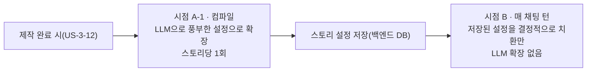
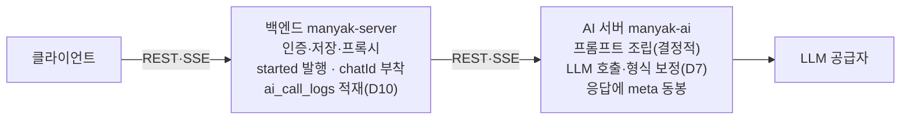
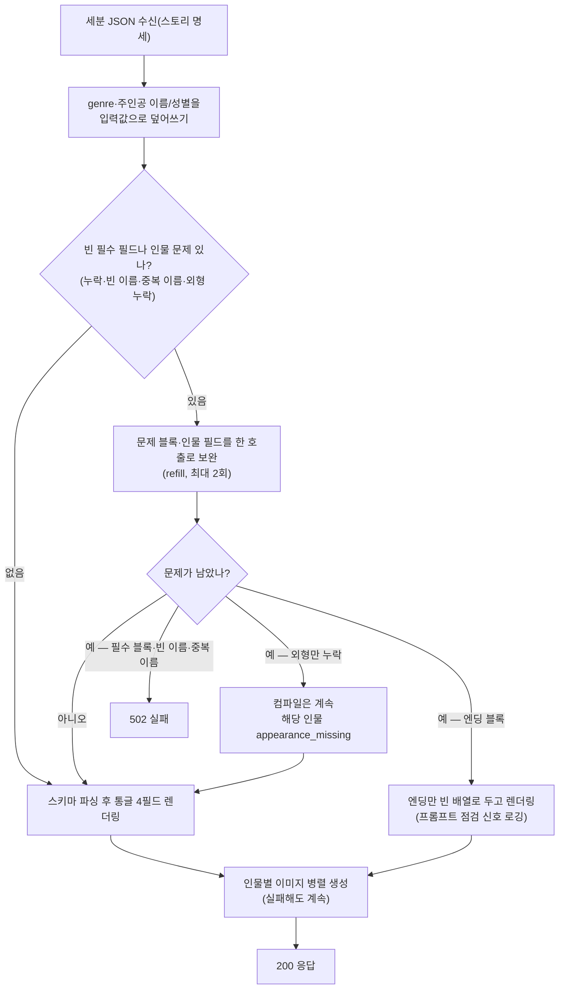
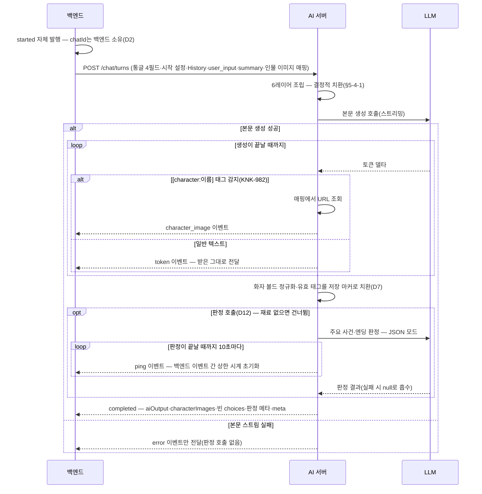
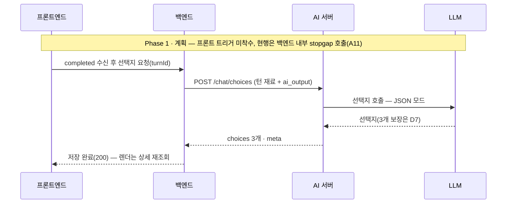
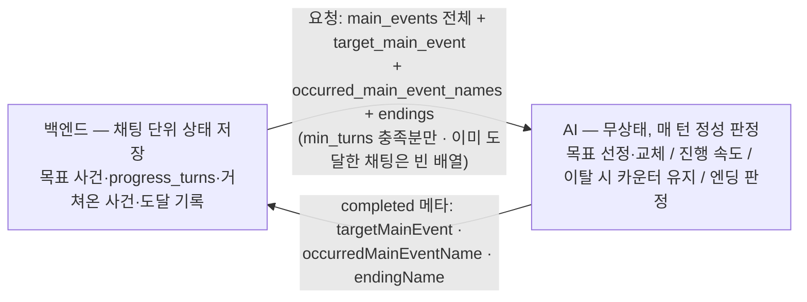
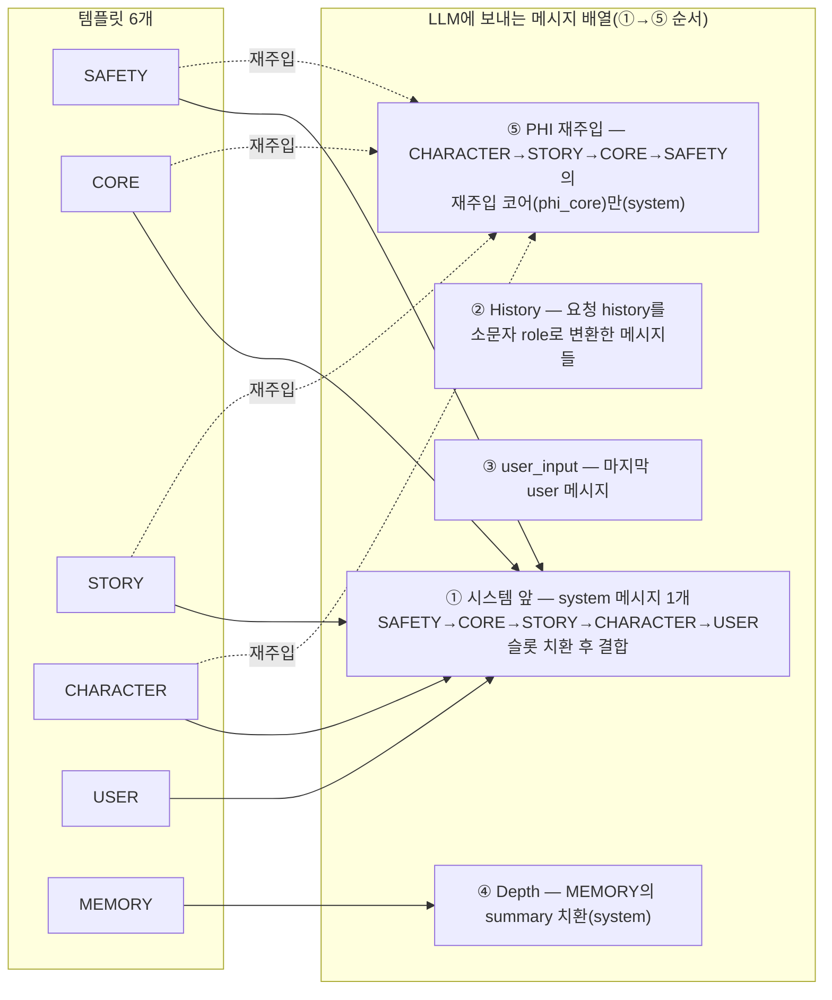
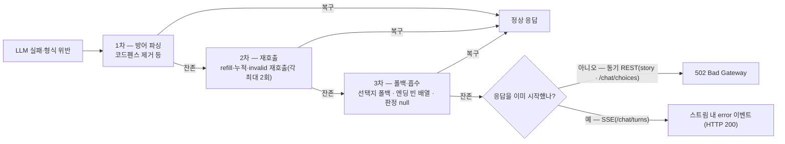

# 5-AI-SERVER

이 문서는 마냑 AI 서버(`manyak-ai`)의 설계 의사결정과 계약을 정의합니다. AI 기능, 요청·응답 계약, 프롬프트 구조, 실패 처리, 운영 기준을 다룹니다.

이 문서는 코드 설명서가 아니라 **레포지토리를 이해하기 위한 문서**입니다. 구현만 나열하면 "왜 이렇게 만들었는지"가 사라져, 사람이든 AI든 기능의 맥락을 이해할 수 없고 다음 변경이 안전한지 판단할 수 없습니다. 그래서 모든 주요 단위는 "무엇이 문제인가(무엇) → 그것이 왜 문제인가(왜) → 어떻게 바꿨는가(어떻게) → 다른 방법도 있었는데 왜 이 방법인가(왜 그 방법)"의 4층 순서로 서술하고, 구현 상세는 항상 의사결정의 결과로만 등장합니다.

```text
§5-1  목적과 범위
§5-2  핵심 설계 결정과 AI 기능 범위
§5-3  요청과 응답 계약
§5-4  프롬프트와 모델 설정
§5-5  오류와 실패 코드
§5-6  운영과 관측
§5-7  검수 체크리스트
```

| 항목 | 값 |
| --- | --- |
| 버전 | v2.16 |
| 작성일 | 2026-07-22 |
| 수정일 | 2026-08-27 |
| 대상 | 마냑 AI 서버 |
| 작성 목적 | AI 기능, 요청·응답 계약, 프롬프트, 실패 처리, 운영 기준을 정의합니다. |
| 기준 코드 | 채팅 인물 이미지 브랜치 `9df43d7ab8d2`(KNK-982, 이전 `dev` `d847fefd24d8`에서 분기)와 `../manyak-ai` 최신 `dev` `3b8965809a80`(2026-08-26, Python 3.11 · FastAPI)을 대조했습니다. 최신 `dev`에는 컴파일 인물 이미지(KNK-414)가 병합됐지만 KNK-982는 아직 별도 계보입니다. KNK-982를 최신 `dev`에 합친 뒤 단일 SHA로 다시 갱신해야 합니다. |

## 5-1. 목적과 범위

### 목적

이 문서만 읽어도 AI 서버가 **왜 이렇게 생겼는지**(맥락과 설계 의사결정), 그리고 **지금 어떻게 동작하는지**(계약과 구현)를 이해할 수 있게 하는 것이 목적입니다. AI 서버 개발자는 이 문서를 기준으로 구현하고, 백엔드·프론트엔드는 이 문서로 AI와의 계약을 확인하며, QA는 이 문서를 기준으로 검수합니다.

### 범위

- AI 서버의 핵심 설계 결정(D1~D13)과 그 근거
- AI 기능 4종의 요청·응답 계약(REST, SSE)
- 프롬프트 구조(6레이어)·템플릿 카탈로그·모델 파라미터와 버전 관리
- 오류 분류와 실패 처리 정책
- 운영·관측(응답 로깅 메타, 상관관계 식별자, Sentry, 환경 변수, 헬스체크, 테스트 체계)

### 제외 범위

- 화면, 사용자 흐름, 프론트엔드 상태 처리 (담당: [`3-1-client.md`](./3-1-client.md))
- 백엔드 API, `ai_call_logs` 적재, AI 프록시 계층 (담당: [`4-backend.md`](./4-backend.md))
- 분석 이벤트 카탈로그, 지표, 수집 기준의 원천 정의 (원천: [`6-analytics.md`](./6-analytics.md))
- 인프라 구성과 배포 파이프라인 (담당: [`7-deployment.md`](./7-deployment.md))
- 프롬프트 설계의 심층 이론(레이어별 상세 정의, 무엇을 어디에 넣고 언제 빼는지의 배치 정책, 조립 철학). manyak-ai 레포 `spec/` 문서가 정본이며, 이 문서는 결정과 계약 수준으로 요약합니다([`0-glossary.md §0-6`](./0-glossary.md)과 같은 위임 구조)

### 관련 문서와 경계

| 문서 | 소유 영역 | 이 문서와의 관계 |
| --- | --- | --- |
| [`0-glossary.md`](./0-glossary.md) | 용어, 계층별 표기 컨벤션 | 필드·이벤트·레이어 이름의 표기 근거 |
| [`1-background.md`](./1-background.md) | 서비스 배경, MVP 범위 | 제품 방향의 상위 근거 |
| [`2-user-stories.md`](./2-user-stories.md) | 화면별 사용자 요구(US ID) | 검수 기준을 US ID로 추적 |
| [`3-1-client.md`](./3-1-client.md) | 화면, API 호출 시점, 실패 처리 | AI 산출물의 최종 소비자. AI 스트림 이벤트 계약([§5-3-4](#5-3-4-채팅-턴))을 참조 |
| [`4-backend.md`](./4-backend.md) | 백엔드 API, 데이터 모델, AI 프록시 | AI의 유일한 호출자. `ai_call_logs` 적재는 백엔드 소유 |
| [`6-analytics.md`](./6-analytics.md) | 이벤트, 식별자, 관측 수집 기준 | feature·실패 코드 등 관측 계약의 원천 |
| [`7-deployment.md`](./7-deployment.md) | 인프라, 배포 파이프라인 | AI 이미지 빌드·배포 상세 위임 |
| manyak-ai `spec/` (레포 내) | 프롬프트 설계 이론, 기능별 상세 명세 | 프롬프트 심층 정의의 정본. 이 문서는 결정·계약 수준 요약 |

### 작성 원칙

- **4층 서술.** 모든 주요 단위(설계 결정, AI 기능, 프롬프트 구조, 오류 정책)는 **무엇(What) → 왜(Why) → 어떻게(How) → 왜 그 방법(Why this way)** 순서로 서술합니다.
  - **무엇** — 무엇이 문제인가. 기능을 더하는 경우라면 무엇을 더하는가.
  - **왜** — 그것이 왜 문제인가. 왜 더해야 하는가. 놔두면 무엇이 곤란해지는지 적습니다.
  - **어떻게** — 어떻게 바꿨는가. API 표·스키마는 반드시 이 층에만 둡니다.
  - **왜 그 방법** — 다른 방법도 있었는데 왜 이 방법을 골랐는가. **고려했다 버린 안과 버린 이유**, 그리고 이 방법이 안고 가는 대가를 적습니다.

  마지막 층이 핵심입니다. 고른 이유가 남아 있지 않으면 다음 사람은 그 결정을 뒤집어도 되는지 판단할 수 없고, 이미 버린 안을 다시 꺼내 같은 논의를 처음부터 반복합니다. 반대로 **대안이 실제로 없었다면 없었다고 적습니다** — 있지도 않았던 비교를 지어내는 것은 이 규칙이 막으려는 바로 그 일입니다.
- **설계 결정은 한 곳에서만 서술합니다.** 서비스 전체를 규정하는 핵심 결정은 [§5-2](#5-2-핵심-설계-결정과-ai-기능-범위)의 카탈로그(D1~D13)에서 한 번만 상세히 서술하고, 다른 섹션은 "D2를 따릅니다"처럼 ID 참조로만 연결합니다. 같은 결정을 두 곳에서 설명하지 않습니다.
- 구현된 동작을 기준으로 씁니다. 문서 기준과 구현이 다르면 코드를 기준으로 하고 차이는 [§5-7](#5-7-검수-체크리스트)의 어긋난 곳 표에 기록합니다.
- API 경로는 공통 앞부분 `/api/v1`을 생략해 표기합니다.
- 와이어 필드(API로 실제 주고받는 JSON 필드)는 **기본이 snake_case**입니다. story 계열과 선택지(`/chat/choices`)가 여기 해당합니다. **chat SSE `completed` 페이로드만 camelCase**이며, 이 단일 예외는 공식화된 것입니다([`0-glossary.md §0-4`](./0-glossary.md)). 예외를 chat 계열 전체로 넓히지 않습니다 — 가르는 기준은 기능이 아니라 그 계약 하나입니다.

### 구현 상태 라벨

이 문서는 항목마다 `{로드맵 Phase} · {구현 상태}` 두 가지를 라벨로 구분합니다. 로드맵 Phase는 [`roadmap.md`](../planning/roadmap.md)가 기능을 배정한 단계(Phase 0~3)이고, 구현 상태는 `구현`(코드 반영 완료)과 `계획`(미구현, 방향만 합의) 2종입니다. `MVP`(= `Phase 0 · 구현`)와 `계획`(Phase 미배정)은 관례 단축형이며, 라벨이 없는 항목은 모두 `MVP`입니다.

> 이전 판(v0.2)의 자체 표기 `Phase 4` · `Phase 5`는 로드맵 Phase 번호와 충돌해 폐기했습니다. `Phase 4`(요약 생성)는 로드맵의 채팅 메모리(Phase 2) 범위이므로 `Phase 2 · 계획`으로, `Phase 5`(role 분기)는 로드맵에 배정되지 않아 `계획`으로 재표기했습니다.

| 라벨 | 의미 | 해당 항목 |
| --- | --- | --- |
| `MVP` | Phase 0 범위. AI 서버 구현 완료, 백엔드·프론트엔드가 사용 중 | 기능 4종, 관측 계약 |
| `Phase 1 · 구현` | Phase 1 범위. AI 서버 구현 완료. 백엔드가 판정 재료를 실어 보내는 런타임 연결도 완료([`4-backend.md §4-3-10`](./4-backend.md) 소관) | 주요 사건·엔딩 진행(D11·D12, [§5-3-3](#5-3-3-스토리-컴파일)·[§5-3-4](#5-3-4-채팅-턴)·[§5-3-5](#5-3-5-선택지-생성-별도-api)). 채팅 분량 고정(450~650자, [§5-3-4](#5-3-4-채팅-턴)). 로어북 반영([§5-3-3](#5-3-3-스토리-컴파일)). LLM 트레이싱(Langfuse) — 프로덕션 활성, 구조화 입력·생성 결과 연결 구현([§5-6](#5-6-운영과-관측)) |
| `Phase 1 · 계획` | Phase 1 범위. 미구현, 방향만 합의됨(계약 확정 여부는 각 항목·어긋난 곳 표가 기록) | 태그 귀속 강화([§5-3-2](#5-3-2-스토리라인-생성)). 주인공 이름 반영([§5-3-3](#5-3-3-스토리-컴파일)). 품질 평가와 자가개선 루프([§5-6](#5-6-운영과-관측)). AI 응답 재생성은 채팅 턴 계약의 재호출로 처리해 AI 스키마 무변경([§5-3-4](#5-3-4-채팅-턴)). 일반 제작·스토리 수정·썸네일은 AI 미사용으로 판정되어 이 문서 변경 없음([`4-backend.md §4-3-8·§4-3-9`](./4-backend.md)) |
| `Phase 2 · 구현` | Phase 2 범위. AI 서버 구현 완료 | 주인공 이름·성별 주입(KNK-838, [§5-3-3](#5-3-3-스토리-컴파일)). 성별 칸 추가(KNK-838). 인물별 이미지 생성(KNK-414, [§5-3-3](#5-3-3-스토리-컴파일)) — 컴파일 시 외형 필드로 이미지를 만들어 base64로 반환. 채팅 인물 이미지 출력(KNK-982, [§5-3-4](#5-3-4-채팅-턴)) — 인물의 대사마다 실시간 이미지 이벤트와 저장 마커를 만듦 |
| `Phase 2 · 계획` | Phase 2 범위. 미구현, 방향만 합의됨 | 요약(`summary`) 생성(백엔드 소유) — AI의 수신 계약은 구현되어 빈 문자열로 동작 중. 인물 단위 입력(KNK-834, [§5-3-2](#5-3-2-스토리라인-생성)). 스토리 썸네일 AI 생성 — 별도 엔드포인트로 컴파일 후 비동기 호출. 채팅 인물 이미지를 인물명 라벨 감지로 전환(KNK-1002, [§5-3-4](#5-3-4-채팅-턴)) — LLM 태그 대신 AI 서버가 `인물명:` 줄을 찾아 이미지 이벤트·저장 마커를 만듦 |
| `계획` | Phase 미배정. 미구현, 방향만 합의됨 | 채팅을 Anthropic 공급자로 여는 것 — 지시문 배치·`max_tokens`·안전 실측이 남음(A13), 와이어 정렬 3자 릴리스(A2), History 윈도우(A3), 오프닝 시드(A4) — [§5-7](#5-7-검수-체크리스트) |

## 5-2. 핵심 설계 결정과 AI 기능 범위

### 서비스 배경

마냑은 "간편 제작으로 나만의 스토리를 만들고, 채팅으로 플레이하는" 서비스입니다([`1-background.md`](./1-background.md)). 이 중 **AI가 산출물을 만드는 행위(생성, generation)** 전부를 AI 서버가 전담합니다. 태그 몇 개로부터 이야기 후보를 만들고, 선택된 이야기를 플레이 가능한 설정으로 확장하고, 매 턴 이야기를 이어갑니다.

이 역할에는 세 가지 어려움이 겹쳐 있고, 아래 결정들은 모두 여기서 출발합니다. **입력은 희소합니다**(사용자는 태그만 고른다). **출력은 형식이 고정된 계약입니다**(클라이언트는 검증 없이 렌더링한다). 그리고 **생산자인 LLM은 확률적이라 형식 위반과 실패가 일상**입니다.

### 설계 결정 카탈로그 (D1~D13)

AI 서버 전체를 규정하는 핵심 설계 결정입니다. **각 결정의 상세 서술은 이 카탈로그가 유일한 지점**이며, 이후 섹션은 ID 참조로만 연결합니다.

**카탈로그 관리 규칙**

- **등록 기준.** 다음을 모두 만족하는 장기적·구조적 설계 의사결정만 D로 등록합니다. ① 실재하는 대안들 사이에서 트레이드오프를 감수하고 선택했습니다. ② 서비스 전체 또는 여러 기능·레포(계약·백엔드·프론트엔드)에 파급이 있습니다. ③ 뒤집으면 이 문서의 여러 섹션이 함께 바뀝니다.
- **비등록 기준.** 파라미터 값 튜닝, 국소 구현 선택, 버그 수정은 D로 만들지 않고 해당 섹션의 구현 층(값 표·서술)만 갱신합니다. 예: temperature를 0.75에서 0.8로 바꾸는 것은 [§5-4-3](#5-4-3-모델과-파라미터)의 값 표 갱신이지 새 D가 아닙니다. 반면 "파라미터는 실측 근거로만 고정한다"(D9)라는 방침 자체를 버리는 것은 D9의 폐기·대체입니다.
- **추가 전용.** 새 결정은 D11, D12…로 추가만 하고 번호를 재사용하지 않습니다.
- **폐기 보존.** 결정이 뒤집히거나 쓰이지 않게 되면 삭제하지 않고 상태를 `폐기`로 바꿔 보존합니다. 폐기 항목에는 "왜 그렇게 설계했었고, 무엇 때문에 무엇으로 대체됐는지"를 남깁니다. 나중에 합류한 사람이 설계의 변천을 추적할 수 있게 하기 위해서입니다.

| ID | 결정 | 상태 |
| --- | --- | --- |
| D1 | 독립 AI 서버를 둔다 | 유효 |
| D2 | AI 서버는 완전 stateless | 유효 |
| D3 | 컴파일(시점 A-1)과 런타임(시점 B)을 분리한다 | 유효 |
| D4 | 프롬프트는 코드가 아니라 파일 | 유효 |
| D5 | 채팅 프롬프트는 6레이어 | 유효 |
| D6 | 선택지는 본문과 분리된 별도 API | 유효 |
| D7 | 형식 보장은 프롬프트가 아니라 코드 | 유효 |
| D8 | 컴파일은 세분 JSON으로 받고 통글로 전달한다 | 유효 |
| D9 | 모델·파라미터는 실측으로 고정한다 | 유효 |
| D10 | 관측은 응답 계약의 일부 | 유효 |
| D11 | 주요 사건·엔딩 — 판정은 AI, 상태는 백엔드, 수렴은 강제하지 않는다 | 유효 |
| D12 | 판정은 본문과 같은 API의 별도 LLM 호출 | 유효 |
| D13 | LLM 호출은 통로·등록부·어댑터 3층으로 나누고, 모델 이름이 공급자를 정한다 | 유효 |

#### D1. 독립 AI 서버를 둔다 — `유효`

**배경.** LLM 호출은 스토리 제작과 채팅 플레이 양쪽에 걸쳐 있고, 공급자 API 키와 프롬프트라는 민감한 자산을 다룹니다.

**문제와 결정.** 백엔드가 LLM을 직접 호출하는 구성도 가능했습니다. 그러나 프롬프트는 기획 자산이라 코드보다 훨씬 자주 바뀌고(품질 개선은 주 단위 반복), 이를 백엔드 배포 주기에 묶으면 양쪽 모두 느려집니다. 또한 태그를 프롬프트로 변환하고 LLM 출력을 계약 형태로 보정하는 책임은 백엔드의 도메인(저장·인증·프록시)과 성격이 다릅니다. 그래서 **AI 고유 책임(프롬프트 변환·생성·형식 보정)을 별도 서버로 분리**하고, LLM 키와 공급자 교체를 이 경계 뒤로 격리했습니다. 트레이드오프로 운영할 서비스가 하나 늘고, 백엔드에 AI 프록시 계층이 필요해졌습니다([`4-backend.md §4-2`](./4-backend.md)).

**구현.** FastAPI 단일 서비스입니다. 호출자는 백엔드뿐이며 클라이언트가 직접 호출하지 않습니다. 기능 구성은 아래 [기능 카탈로그](#ai-기능-카탈로그)에, 계약은 [§5-3](#5-3-요청과-응답-계약)에 있습니다.

#### D2. AI 서버는 완전 stateless — `유효`

**배경.** 채팅은 턴이 이어지는 대화라, 서버 어딘가에 "이 대화가 어디까지 왔는지"가 있어야 할 것처럼 보입니다.

**문제와 결정.** AI 서버가 대화 상태를 보관하는 stateful 설계(세션 저장소 + 세션 초기화 시점)를 검토했으나 버렸습니다. 근거는 세 가지입니다. ① 채팅 프롬프트 조립은 결정적 치환입니다. 같은 입력이면 항상 같은 결과가 나오는 단순 끼워넣기이고 LLM 호출이 없어서, 매 턴 다시 수행해도 비용이 사실상 0입니다. ② 매 턴 같은 설정을 재전송하는 토큰 비용은 LLM 공급자의 프롬프트 캐싱이 상쇄합니다(프롬프트 앞부분이 동일하면 캐시 적중). ③ 세션 저장소를 두면 부담만 남습니다. 재시작하면 유실되고, 다중 워커를 동기화해야 하고, TTL을 관리해야 합니다. 그래서 **매 턴 백엔드가 모든 재료를 실어 보내고, AI는 받은 것만으로 조립·응답하며, 턴 사이에 아무것도 보관하지 않는** 완전 stateless로 확정했습니다. 트레이드오프는 두 가지입니다. 매 턴 요청 페이로드가 커지고, 대화 이력(History)·요약(`summary`)의 소유권이 백엔드로 넘어갑니다(백엔드 DB가 정본).

**구현.** 채팅 턴 요청에 세션 식별자가 없습니다. AI는 무상태라 식별자로 조회·분기할 것이 없고, 대화를 묶는 책임은 채팅 식별자(`chatId`)를 가진 백엔드에 있습니다. 계약은 [§5-3-4](#5-3-4-채팅-턴)에 있습니다. 이 결정으로 폐기된 세션 초기화 시점(A-2)은 D3에 기록되어 있습니다.

#### D3. 컴파일(시점 A-1)과 런타임(시점 B)을 분리한다 — `유효`

**배경.** 간편 제작의 입력은 희소합니다(태그 + 스토리라인 한 편 + 추가 정보). 반면 채팅 플레이는 세계관·인물·규칙이 풍부한 설정을 매 턴 요구합니다.

**문제와 결정.** 희소 입력을 언제 풍부한 프롬프트로 확장할지가 문제였습니다. 매 턴 LLM으로 확장하면 비용·지연이 턴마다 발생하고 산출물 검증도 매 턴 해야 합니다. 반대로 확장 없이 희소 입력을 그대로 치환만 하면 인물·세계관이 얇아져 몰입이 무너집니다. 그래서 **확장은 스토리당 1회(컴파일, 시점 A-1)로 미리 끝내 저장하고, 매 턴(시점 B)은 저장된 설정을 결정적으로 치환만 하는** 하이브리드로 결정했습니다. 초기 설계에는 세션 시작 시 프롬프트를 준비하는 A-2(세션 초기화) 시점이 있었으나, stateless 확정(D2)으로 준비할 상태 자체가 사라져 **A-2는 폐기**되고 시점 B에 흡수됐습니다.

시간 순서로 보면 다음과 같습니다:



**구현.** 컴파일은 [§5-3-3](#5-3-3-스토리-컴파일)에, 런타임 치환은 [§5-4-1](#5-4-1-6레이어-프롬프트-구조)에 있습니다.

#### D4. 프롬프트는 코드가 아니라 파일 — `유효`

**배경.** 프롬프트는 출력 품질을 좌우하는 기획 자산이고, 별도 스크립트·벤치마크로 반복 개선됩니다.

**문제와 결정.** 프롬프트를 코드 상수로 두면 문구 수정마다 코드 리뷰·배포가 묶이고, 무엇이 언제 왜 바뀌었는지가 코드 diff에 묻힙니다. 그래서 **프롬프트를 `prompt/` 마크다운 파일로 분리**하고, 버전은 파일명이 아니라 각 파일 frontmatter의 `version` 정수를 유일한 기준(SSOT)으로 삼았습니다. 파일명이 고정되므로 버전이 올라가도 코드는 변경되지 않습니다. 변경 이력은 git으로 남깁니다. 트레이드오프는 frontmatter 파싱 계층이 필요하다는 것입니다. LF 줄바꿈을 규약으로 두되, 파싱 계층이 CRLF도 허용해 규약을 어겨도 frontmatter가 프롬프트 본문에 섞이지는 않습니다([§5-4-2](#5-4-2-템플릿-카탈로그)).

**구현.** 템플릿 카탈로그는 [§5-4-2](#5-4-2-템플릿-카탈로그)에, 버전 관리와 로깅 연결은 [§5-4-4](#5-4-4-프롬프트-버전-관리)에 있습니다.

#### D5. 채팅 프롬프트는 6레이어 — `유효`

**배경.** 채팅 프롬프트는 성격이 다른 책임들을 한꺼번에 담습니다. 안전 규칙, 서사 진행 규칙, 세계관, 인물, 주인공, 대화 요약이 그것입니다.

**문제와 결정.** 이걸 한 편의 시스템 프롬프트로 쓰면 세 가지 문제가 생깁니다. ① 책임이 뒤섞여 한 부분의 수정이 전체 회귀를 부릅니다. ② 대화가 길어지면 앞쪽에 놓인 지시의 힘이 점점 약해져 캐릭터가 무너집니다. ③ 사용자 입력이 캐릭터 설정을 덮어쓰는 것(갓모딩)을 막을 우선순위 구조가 없습니다. 그래서 프롬프트를 **SAFETY > CORE > MEMORY > STORY > CHARACTER > USER 우선순위의 6레이어로 분리**하고, 충돌 시 상위 레이어가 이기는 규칙을 명시했습니다. CHARACTER가 USER보다 위인 것이 갓모딩 차단의 핵심입니다. 지시가 약해지는 문제에는 배치로 대응합니다. 동적 요약은 대화 끝 근처(Depth 슬롯)에 두고, 정적 가드레일은 생성 직전에 한 번 더 넣습니다(PHI 재주입). 트레이드오프는 조립 로직과 템플릿 계약(PHI 추출 구간 등)의 복잡도입니다.

**구현.** 조립 순서·역할 매핑은 [§5-4-1](#5-4-1-6레이어-프롬프트-구조)에 있습니다. 레이어별 상세 정의와 배치 이론은 manyak-ai `spec/chat/` 정본이 소유합니다.

#### D6. 선택지는 본문과 분리된 별도 API — `유효`

**배경.** 매 턴 본문과 함께 선택지(다음 행동 후보) 3개를 제공합니다(US-6-4). 처음에는 단일 호출로 본문 끝에 선택지 블록을 붙이게 하고 마커로 파싱했습니다.

**문제와 결정.** 모델 전환 후 운영 실측에서 선택지 블록이 통째로 빠지는 턴이 무시할 수 없는 비율로 확인됐고, 대부분 블록 자체가 없어 파싱으로 구제할 수 없었으며, 한 번 빠지면 다음 턴도 빠지는 자기강화까지 관찰됐습니다. 프롬프트 강제로는 잡히지 않았습니다. 그래서 **마커 파싱을 폐기하고, 본문(스트리밍)과 선택지(JSON 모드 별도 호출)를 분리**했습니다. JSON 모드는 공급자가 출력을 JSON 형식으로 강제하는 호출 옵션입니다. 분리 덕분에 선택지가 본문과 토큰을 다투지 않게 되고, 출력이 JSON으로 고정되니 파싱도 항상 같은 방식으로 성공합니다.

처음에는 채팅 턴 API 내부의 2번째 LLM 호출로 분리했는데, 이 형태에는 대가가 있었습니다. 본문 스트림이 끝나도 선택지 호출이 끝나야 턴 완료 이벤트(`completed`)가 나가므로 **본문 확정이 그만큼 밀렸습니다**. 그래서 2026-07-20 팀 합의로 **분리를 API 경계까지 밀어올려 선택지를 전용 엔드포인트로 승격**했습니다. 요청 플래그로 선택지 동시 생성 여부를 정하는 방식도 검토했으나, 선택지 생성을 끈 채 본문을 받은 뒤 다시 켜는 경로에 결국 전용 API가 필요해 폐기했습니다 — 선택지는 항상 별도 API로 만듭니다. 덕분에 **선택지로 인한 완료 지연이 사라지고**(판정 대기는 D12가 별도로 다룹니다), 선택지 토글은 프론트엔드가 이 API를 호출하는지로 처리할 수 있습니다([`3-1-client.md §3-1-5`](./3-1-client.md)). 남는 트레이드오프는 백엔드가 턴당 두 번 호출해야 한다는 것입니다(LLM 호출 총량은 D12 참조).

**구현.** [§5-3-5](#5-3-5-선택지-생성-별도-api)에 있습니다. 개수 보장은 D7이 담당합니다. **AI 서버 구현 완료**(KNK-625), 백엔드도 stopgap 내부 호출로 연결 완료이며(KNK-636 — [`4-backend.md §4-3-3`](./4-backend.md)), 프론트엔드 토글 전환은 미착수입니다(KNK-622 — [`3-1-client.md §3-1-5`](./3-1-client.md), [§5-7](#5-7-검수-체크리스트) A11).

#### D7. 형식 보장은 프롬프트가 아니라 코드 — `유효`

**배경.** 와이어 계약은 형식이 고정입니다. 선택지는 정확히 3개, 추천 입력은 정확히 3개, 통글은 4필드입니다. 클라이언트는 검증 없이 렌더링합니다. 그런데 생산자인 LLM은 형식 위반이 일상입니다.

**문제와 결정.** 프롬프트 지시("반드시 3개를 만들어라")만으로는 확률적으로 깨진다는 것이 반복 실측됐습니다. 선택지 블록이 통째로 빠졌고(D6), 화자 이름을 볼드로 감싸는 사전학습 편향이 빈발했으며 프롬프트로는 차단하지 못했습니다. 그래서 경계를 이렇게 확정했습니다. **계약(개수·형식·필수 필드)은 코드가 담보하고, 품질(내용·다양성·문체)은 프롬프트가 담보합니다.** 코드가 담보하는 항목은 다섯입니다. ① 선택지는 정확히 3개입니다. 부족하면 "이미 가진 것 제외, 모자란 개수만" 방식으로 누적 재호출하고(최대 2회), 그래도 부족하면 미리 정해 둔 대체값(결정적 폴백)으로 채웁니다. 여기에 더해 **개수를 응답 스키마 제약으로도 강제**해(KNK-625), 코드 결함으로 3개가 깨지면 조용히 나가지 않고 응답 검증에서 실패하게 했습니다. ② 컴파일 필수 필드입니다. 빈 블록만 부분 재호출(refill, 최대 2회)하고, 그래도 비면 502로 실패합니다. ③ 장르(`genre`)입니다. LLM 출력을 버리고 입력 태그를 정본으로 덮어씁니다. ④ 화자 볼드와 코드펜스입니다. 후처리로 제거합니다. ⑤ 스토리라인 stories 계약입니다(KNK-312). 정확히 3편·항목 스키마(id·본문·추천)·추천 정확히 3개를 코드가 검증해 위반이면 invalid 재호출(최대 2회) 후 502로 수렴시키고, id 값은 재호출로 벌하지 않고 등장 순서대로 1·2·3을 덮어써(③ 장르와 같은 방식) 담보합니다. 트레이드오프는 재호출 비용과 폴백 발동 시 품질 저하 가능성입니다. 폴백 발동은 프롬프트 점검 신호로 로깅해 감시합니다.

**구현.** 기능별 적용은 [§5-3](#5-3-요청과-응답-계약)에, 후처리 목록은 [§5-5](#5-5-오류와-실패-코드)에 있습니다.

#### D8. 컴파일은 세분 JSON으로 받고 통글로 전달한다 — `유효`

**배경.** 컴파일 산출물은 쓰임새가 둘입니다. AI 자신은 필수 필드 검증과 부분 재호출에 쓰고, 저장·활용 측은 DB 저장, 매 턴 프롬프트 치환, 향후 일반 제작의 사람 수정에 씁니다.

**문제와 결정.** 두 쓰임새는 유리한 형태가 서로 다릅니다. 검증·부분 재호출에는 필드가 잘게 나뉜 구조(어느 필드가 비었는지 탐지하고 그 블록만 다시 요청)가 유리하고, 저장·치환·사람 수정에는 섹션 헤더로 구분된 단일 마크다운(통글)이 유리합니다. 어느 한쪽을 포기하지 않고 **LLM은 세분 JSON(스토리 명세, StorySpec)으로 답하게 하고, 검증·재호출을 세분 단계에서 끝낸 뒤, AI가 통글 4필드로 렌더링해 전달하는 변환 단계**를 두었습니다. 트레이드오프는 두 가지입니다. 변환 규칙의 유지보수 부담이 생기고, 통글에서 세분으로의 역변환이 없습니다. 통글 수정은 텍스트 직접 수정이며 재컴파일 대상이 아닙니다.

**구현.** 세분 스키마와 통글 변환 규칙은 [§5-3-3](#5-3-3-스토리-컴파일)에 있습니다.

#### D9. 모델·파라미터는 실측으로 고정한다 — `유효`

**무엇.** 창작 경로마다 사용할 모델과 파라미터를 실측으로 정하고, 선택 근거를 함께 기록합니다.

**왜.** 창작 품질·응답 시간·비용은 모델과 파라미터에 민감하고 직관은 자주 틀립니다. 기본값이나 직관으로 정하면 무엇이 품질을 만들었는지 알 수 없고, 모델을 바꾼 뒤 결과가 나빠져도 근거를 두고 판단할 수 없습니다.

**어떻게.** 모델과 파라미터는 실측 근거가 있을 때만 바꾸고 그 근거를 함께 기록합니다. 현재 스토리라인·채팅·선택지·판정은 응답 속도가 빠른 `deepseek-v4-flash`를 비추론으로 사용합니다. 스토리라인의 temperature 0.75는 블라인드 독자 평가에서 0.5보다 읽기 품질이 좋고 파싱 성공률·속도는 같은 수준이었으며, 기본값 1.0보다 분량 폭주와 파싱 실패 위험이 낮았습니다. 컴파일은 `gpt-5.6-terra`에 추론 강도 `medium`을 사용하고 temperature를 보내지 않습니다. 출력 한도 16,384토큰은 추론 토큰과 JSON 본문이 함께 사용합니다.

**왜 그 방법.** 컴파일은 같은 입력으로 Terra의 `none`·`low`·`medium`·`high`와 Luna의 여러 추론 강도를 비교했습니다. 응답 품질, 응답 시간, 추론·출력 토큰에 따른 비용을 함께 보았을 때 Terra `medium`이 세 기준의 균형이 가장 나았습니다. 다른 Terra 강도와 Luna는 이 세 기준을 함께 놓고 봤을 때 더 나은 선택이 아니어서 쓰지 않았습니다. 사용자가 기다리는 나머지 경로는 기존 DeepSeek flash를 유지해 이번 전환의 품질·비용 영향을 컴파일에만 한정했습니다. 공급자·모델을 다시 바꾸면 같은 기준으로 재검증해야 합니다.

**Gemini Flash 전환 기반이 준비돼 있습니다(KNK-951).** Google SDK 어댑터와 Gemini용 컴파일 프롬프트가 추가됐고, `STORY_COMPILE_MODEL`을 Gemini Flash(`gemini-3.7-flash` 또는 후속 등록 모델)로 바꾸면 프롬프트·Langfuse·Sentry가 자동으로 따라갑니다. 실측에서 Gemini 3.6 Flash는 평균 28초(thinking medium), 3.7 Flash는 평균 13초(서버 안정 시)에 동일 품질을 보였으며, 비용은 Terra와 비슷합니다. 다만 3.7 Flash는 출시 직후(2026-08-13)라 503 과부하가 잦아 아직 전환하지 않았습니다. 전환 시 이 절차를 다시 따릅니다.

**구현.** 값 표는 [§5-4-3](#5-4-3-모델과-파라미터)에 있습니다.

#### D10. 관측은 응답 계약의 일부 — `유효`

**배경.** AI 서버는 DB가 없습니다(D2의 귀결). 호출 이력·토큰 사용량·프롬프트 버전을 남길 자리가 서버 안에 없습니다.

**문제와 결정.** AI가 자체 저장소를 두면 D2를 훼손합니다. 그래서 **관측 값을 응답에 동봉해 기록 책임을 백엔드에 위임**했습니다. 모든 응답에 로깅 메타(`meta`)를 싣고, 백엔드가 이를 `ai_call_logs`에 적재합니다. 요청 상관관계는 반대 방향으로 헤더를 수신해 잇습니다. 프롬프트·채팅·생성 원문은 응답 meta에도 Sentry에도 싣지 않습니다(수집 기준 AN-4-10). LLM 트레이싱(Langfuse) 도입 뒤에도 meta·Sentry 경로는 그대로이며, 원문은 Langfuse만 별도 예외로 싣습니다(§5-6 — 프로덕션 활성). 트레이드오프는 응답 계약이 커지는 것과, 기록이 백엔드 적재에 의존하는 것입니다.

`필드` `meta` 구성 → `model` · `prompt_versions` · `provider` · 입출력 토큰 · `retry_count`

`참조` 적재 규칙 → [`4-backend.md §4-7`](./4-backend.md) · 수집 기준 원천 → [`6-analytics.md`](./6-analytics.md)

**구현.** meta 필드·헤더 처리·Sentry는 [§5-6](#5-6-운영과-관측)에 있습니다.

#### D11. 주요 사건·엔딩 — 판정은 AI, 상태는 백엔드, 수렴은 강제하지 않는다 — `유효`

`Phase 1 · 구현`입니다. AI 서버 쪽 구현에 이어, 백엔드가 판정 재료를 요청에 실어 보내는 런타임 연결도 완료됐습니다([`4-backend.md §4-3-10`](./4-backend.md) 소관).

**배경.** Phase 1 퀄리티 개선은 스토리에 주요 사건(스토리와 1:N)과 엔딩(이름 기반)을 도입합니다. 시작 설정당 최대 10개는 일반 제작까지 포함한 저작 상한이고, 간편 제작 컴파일은 다양성 확보를 위해 해피·노말·배드를 각 1개씩 내부 기준으로 삼아 3개를 생성하되, 유형은 출력·저장하지 않고 생성 지침으로만 씁니다(팀 결정 2026-07-04, 유형을 출력에서 제거한 것은 2026-07-05 개정, [`0-glossary.md §0-3-1`](./0-glossary.md)). 채팅이 사건을 향해 전개되고 조건 충족 시 엔딩 응답을 생성하려면, "지금 어느 사건을 향해 몇 턴째 진행 중인지"라는 상태와 "사용자 입력이 사건과 관련되는지"라는 판정이 필요합니다.

**문제와 결정.** 세 가지를 결정했습니다. ① **판정 주체.** 사용자 입력이 주요 사건의 조건(`key_sentence`)과 관련되는지, 엔딩 목적을 달성했는지, 사건이 완결됐는지는 의미 판정이라, 결정적 매칭(백엔드의 채팅 이미지 매칭 방식)으로 풀 수 없습니다. 그래서 **AI가 LLM 정성 판정으로 담당**합니다. 반대로 엔딩 최소 턴 수는 결정적이라 백엔드가 선별해 충족한 후보만 전달합니다. 덕분에 AI는 매 턴 전체 엔딩을 재검토할 필요가 없습니다. ② **상태 저장 위치.** AI는 무상태(D2)이므로 목표 사건·진행 카운터·거쳐온 사건·도달 기록은 **백엔드가 채팅 단위로 저장**하고 매 턴 요청에 되돌려 싣습니다. AI의 판정 결과는 D10과 같은 방식으로 턴 완료 이벤트(`completed`)의 메타에 동봉해 기록 책임을 백엔드에 위임합니다. 관측에 이어 진행 상태도 "응답 계약의 일부"가 됩니다. ③ **강제 수렴 금지.** 사용자가 사건을 계속 벗어나도 본문을 사건·엔딩으로 끌고 가지 않습니다. 자유 입력의 몰입이 완결보다 우선하며, 방향 제안은 선택지 구성으로만 합니다([§5-3-5](#5-3-5-선택지-생성-별도-api)). 트레이드오프는 두 가지입니다. 채팅 턴 요청·응답 계약이 커지고, 정성 판정의 일관성을 프롬프트와 평가 루프로 관리해야 합니다([§5-6](#5-6-운영과-관측)).

**구현.** 요청·응답 확장과 진행 규칙은 [§5-3-4](#5-3-4-채팅-턴)에, 컴파일 산출물 확장은 [§5-3-3](#5-3-3-스토리-컴파일)에, 선택지 구성은 [§5-3-5](#5-3-5-선택지-생성-별도-api)에, 백엔드의 상태 저장·도달 기록은 [`4-backend.md §4-3-10`](./4-backend.md)에 있습니다.

#### D12. 판정은 본문과 같은 API의 별도 LLM 호출 — `유효`

`Phase 1 · 구현`입니다.

**배경.** D11이 "판정은 AI"를 정하면서, 목표 사건 선정·사건 완결·엔딩 도달이라는 의미 판정이 매 채팅 턴 안으로 들어왔습니다. 이 판정을 턴의 어느 지점에서 수행할지가 남은 문제였습니다.

**문제와 결정.** 본문 생성 프롬프트에 판정 지시를 함께 넣는 구성도 가능했습니다. 그러나 그러면 창작과 판정이 한 호출 안에서 토큰과 주의를 다투어 서사 품질이 흔들리고, 판정이 깨지면 본문까지 함께 깨집니다. 선택지에서 같은 문제를 겪고 분리 호출로 해결한 전례가 있습니다(D6). 그래서 **판정을 본문과 분리된 별도 LLM 호출로 확정**했습니다. 판정 호출은 6레이어 조립에 들어가지 않는 독립 프롬프트(판정 템플릿)를 쓰고, 본문 스트림이 끝난 뒤에 실행됩니다. 판정 재료(주요 사건·엔딩)가 요청에 없으면 호출 자체를 건너뛰어 비용과 지연을 만들지 않고, 실패하면 판정 메타를 null로 돌려보내 턴을 깨지 않습니다.

**선택지와 달리 API는 분리하지 않습니다.** 판정 결과(목표 사건·완결 사건·도달 엔딩)는 백엔드가 채팅 상태로 저장해야 하는 값이라 켜고 끌 대상이 아니고(D11 ②), **재료가 실린 턴에는 예외 없이 필요**하므로 따로 부르게 하면 백엔드 호출만 늘고 얻는 것이 없습니다. 그래서 판정은 채팅 턴 API(`/chat/turns`) 안에 남아 **같은 API의 2번째 LLM 호출**로 실행됩니다. 선택지가 별도 API로 빠진 뒤(D6) 턴 안에서는 본문 다음의 유일한 후속 호출이며, 재료가 없는 턴에서는 건너뛰므로 실제로는 LLM 호출 1회로 끝나는 턴이 많습니다. 트레이드오프는 재료가 있는 턴에서 완료 이벤트가 판정만큼 기다린다는 것입니다.

**그 기다림이 실제로 턴을 죽였습니다**(KNK-748). 결정은 그대로 두고 귀결만 손봤습니다.

**무엇.** 본문 스트림이 끝나고 판정을 기다리는 구간에 SSE 프레임이 하나도 나가지 않았습니다.

**왜.** 백엔드는 이벤트와 이벤트 사이의 침묵에 상한을 겁니다. 그 침묵이 상한에 닿으면 연결을 끊는데, 판정 구간의 침묵이 정확히 거기 걸렸습니다. 사용자는 본문을 끝까지 다 읽고 나서 에러를 맞았고, 그 사이 판정 호출은 **성공했습니다** — 백엔드가 이미 포기한 뒤였을 뿐입니다. 판정이 느려서가 아니라 **아무 말 없이 기다려서** 죽은 턴입니다.

**어떻게.** 판정을 기다리는 동안 `ping`을 주기적으로 내보내 그 시계를 되돌립니다([§5-3-4](#5-3-4-채팅-턴)). 여기에 더해 판정에 주는 시간을 이 턴에 남은 시간으로 산정해, 본문과 판정을 합쳐도 백엔드의 전체 상한을 넘기지 않게 했습니다(KNK-750).

**왜 그 방법.** 세 가지를 견주고 버렸습니다. ① **판정을 일찍 포기하기** — 상한을 짧게 잡아 침묵을 줄이는 안입니다. 판정 결과가 없으면 사건이 어디까지 진행됐는지 알 수 없고, 그 값은 백엔드가 채팅 상태로 저장하는 값이라(D11 ②) 사용자의 진행이 그대로 멈춥니다. 증상을 없애려고 기능을 끄는 셈이라 버렸습니다. ② **백엔드 상한 올리기** — 백엔드 배포가 필요하고, 진짜로 멈춘 호출까지 그만큼 오래 붙들게 됩니다. 침묵을 견디는 시간을 늘릴 뿐 침묵 자체를 없애지 못합니다. ③ **`completed`를 먼저 보내고 판정을 후속 이벤트로 빼기** — 가장 깔끔하지만 SSE 계약이 바뀌어 AI·백엔드·프론트가 함께 움직여야 합니다([§5-3-4](#5-3-4-채팅-턴) 후순위 항목). `ping`은 백엔드가 모르는 이벤트를 무시하는 성질을 이용해 **AI 단독 배포로 끝나므로**, 지금 나고 있는 오류를 가장 빨리 멈출 수 있습니다.

남는 대가는 그대로입니다. **완료 이벤트가 판정만큼 늦는 것은 여전합니다** — `ping`은 그 늦음이 연결을 끊지 않게 할 뿐 늦음 자체를 줄이지 않습니다. 판정을 API로 빼는 대신 턴 안에 두기로 한 이상, 기다림을 없애는 것이 아니라 **기다림을 안전하게 만드는 것**이 이 결정에 딸린 책임입니다.

**턴 하나의 LLM 호출 총량**은 이렇습니다. 채팅 턴 API가 본문 1회 + 판정 0~1회(재료 없으면 스킵), 선택지 API가 1~3회(누적 재호출 최대 2회 — D7)입니다. 재료가 없고 선택지가 한 번에 나오는 흔한 경우는 두 API 합쳐 2회고, 최악은 5회입니다.

**구현.** 호출 흐름은 [§5-3-4](#5-3-4-채팅-턴)에, 템플릿은 [§5-4-2](#5-4-2-템플릿-카탈로그)에, 모델 파라미터는 [§5-4-3](#5-4-3-모델과-파라미터)에, 실패 처리는 [§5-5](#5-5-오류와-실패-코드)에 있습니다.

#### D13. LLM 호출은 통로·등록부·어댑터 3층으로 나누고, 모델 이름이 공급자를 정한다 — `유효`

`Phase 1 · 구현`입니다.

**배경.** D1은 LLM 키와 공급자 교체를 AI 서버 경계 뒤로 격리했습니다. 그런데 그 경계 **안쪽**은 격리돼 있지 않았습니다. LLM을 부르는 자리가 다섯 곳(스토리라인·컴파일·채팅 본문·선택지·판정)으로 흩어져 각자 공급자 SDK를 직접 부르고, 인자 조립·응답 해석·예외 처리를 저마다 들고 있었습니다. 공급자를 하나 추가하려면 다섯 곳을 모두 고쳐야 하고, 실제 호출한 공급자를 기록하는 값(`provider`)조차 전역 설정값 하나를 다섯 곳이 나눠 쓰고 있어 경로마다 다른 모델을 쓰는 순간 절반이 거짓이 됩니다. 모델 후보 비교(A7)를 하려면 이 구조부터 풀어야 했습니다.

**문제와 결정.** 호출부마다 공급자 분기를 심는 방식(if 공급자 == …)도 가능했지만, 분기가 다섯 곳으로 복제돼 공급자가 늘 때마다 다섯 배로 늘어납니다. 그래서 **책임을 세 층으로 나눴습니다.** ① **통로** — 호출부는 "무엇을 원하는지"만 넘깁니다. 호출 함수는 `complete`(단발)·`stream`(스트리밍) 둘이고, 여기에 관측용으로 모델의 공급자를 미리 묻는 `provider_of`와 기동 검사용 `validate_startup`이 더해져 통로가 여는 창구는 넷입니다. ② **모델 등록부** — 모델 이름을 공급자·어댑터·호출 특성으로 해석합니다. 회사가 아니라 **모델 단위**로 적습니다. 같은 회사라도 모델마다 받는 인자가 다르기 때문입니다. 등록부에는 **뜻만** 적고 회사 문법은 담지 않습니다. ③ **어댑터** — 그 뜻을 회사 SDK 문법으로 옮기고, 회사별 예외를 **회사와 무관한 공통 예외**로 바꿔 줍니다. 그래서 공급자가 늘어도 호출부와 등록부는 그대로고 어댑터만 추가됩니다.

**등록된 모델만 씁니다.** 등록부에 없는 이름은 어느 회사로 보낼지 결정할 수 없습니다. 그래서 선택된 모델이 등록부에 없거나, **그 자리에 쓸 수 없는 공급자이거나**, 그 모델의 공급자 키가 비었거나, 공급자 주소가 주소 형태가 아니거나, 담당 어댑터가 그 설정을 표현할 수 없거나, **조각을 흘려보내야 하는 자리인데 담당 어댑터가 그것을 못 하면** **서버 기동에서 실패**시킵니다. 자리 제약은 키·주소보다 **먼저** 봅니다 — 못 쓰는 공급자를 꽂았는데 "키가 비어 있습니다"라고 답하면 키만 채우면 될 것처럼 읽혀 엉뚱한 곳을 고치게 되고, 채운 뒤에야 진짜 이유를 만납니다. 주소를 함께 보는 이유는 키와 달리 **비어 있지 않아도 틀릴 수 있기** 때문입니다 — 형식만 확인하므로 기동에 지연도 과금도 없습니다. 선택되지 않은 공급자의 키 부재는 허용합니다 — 한 공급자만 쓰는 환경이 다른 회사 키 없이 떠야 합니다. 트레이드오프는 분명합니다: 잘못된 설정이면 배포가 실패하고 AI 서버가 내려갑니다. 그래도 이쪽을 택했습니다. 잘못된 설정으로 뜬 서버는 요청마다 실패를 내면서도 살아 있는 것처럼 보여, 문제를 훨씬 늦게 알게 됩니다.

**선택한 공급자의 키 형식도 기동에서 검사합니다(KNK-813).**

- **무엇.** 선택된 모델이 사용하는 공급자 키는 값이 있는지만 보지 않고, 외부 요청의 인증 헤더에 안전하게 넣을 수 있는 문자열인지까지 기동 시 확인합니다.
- **왜.** `v0.2.3` 배포 때 운영 `OPENAI_API_KEY`에 ASCII가 아닌 대시 문자가 섞여 있었습니다. 기존 검사는 빈 값만 막아 앱과 헬스체크가 정상으로 떴고, 첫 스토리 컴파일이 인증 헤더를 만드는 단계에서 500으로 실패했습니다. 헬스체크는 공급자를 호출하지 않으므로 이 종류의 설정 오류를 발견하지 못합니다.
- **어떻게.** 개행, 앞뒤 공백, ASCII가 아닌 문자, 공백 문자, 출력할 수 없는 제어문자를 `validate_startup`에서 거부합니다. 오류에는 환경 변수 이름과 문제 종류만 넣고 키 원문은 넣지 않습니다. 선택하지 않은 공급자의 키는 검사하지 않아, 실제로 쓰지 않는 회사의 키까지 요구하지 않습니다.
- **왜 그 방법.** 기동할 때 공급자에게 시험 요청을 보내면 네트워크 장애 때문에 정상 키를 거부할 수 있고 호출 비용과 시작 지연도 생깁니다. 문자열 검사만으로 복사·붙여넣기에서 생기는 대표적인 오염을 외부 호출 없이 잡고, 키 원문을 숨길 수 있습니다. 다만 글자 형식은 정상인데 값 자체가 틀린 키까지 증명하지는 못하므로, 릴리스 검수는 실제 LLM 호출을 함께 실행합니다([`7-deployment.md §7-9`](./7-deployment.md)).

**자리마다 쓸 수 있는 공급자가 다릅니다.** 어댑터가 둘이 되면서 처음 드러난 제약입니다(KNK-675). 채팅 본문은 지시문을 앞에 1개, 뒤에 2개(Depth·PHI) 두는데([§5-4-1](#5-4-1-6레이어-프롬프트-구조)), Anthropic은 요청 최상위의 지시문 칸이 하나뿐이라 앞의 1개만 옮겨지고 뒤의 둘은 버려집니다. 그중 PHI가 안전 가드레일입니다. 즉 이 조합은 **서버도 채팅도 정상으로 도는데 안전 지시만 빠진 채 호출되고**, 오류가 나지 않아 한참 뒤에야 드러납니다. 그래서 등록부에 자리별 금지 공급자 표를 두고 기동에서 거부합니다 — `CHAT_MODEL`에는 이 공급자를 쓸 수 없습니다. 금지 규칙을 어댑터가 아니라 등록부에 둔 것은, 어댑터가 용도를 알면 모델·공급자를 바꿀 때마다 어댑터까지 함께 고쳐야 하기 때문입니다. 어댑터는 자기가 무엇을 할 수 있는지만 밝히고(조각 흘리기 가능 여부), 어느 자리에 쓰면 안 되는지는 등록부가 압니다. 이 제약은 영구적이지 않습니다 — 이 회사도 대화 목록 안에 지시문 줄을 넣는 길을 지원하므로, 그 길을 검토하고 안전 실측을 마치면 풀립니다([§5-7](#5-7-검수-체크리스트) A13).

**Google SDK 어댑터를 추가했습니다(KNK-951).**

- **무엇.** 세 번째 어댑터로 Google SDK(`google-genai`)를 추가하고, `gemini-3.7-flash`를 등록부에 올렸습니다. 컴파일 프롬프트도 공급자별로 나눠, `STORY_COMPILE_MODEL`을 Gemini로 바꾸면 Gemini용 프롬프트·Langfuse 메타·Sentry 태그가 자동으로 따라갑니다.
- **왜.** 컴파일 모델을 Terra에서 Gemini Flash로 전환하면 응답 속도가 빨라지고 비용이 줄어듭니다. Gemini는 OpenAI SDK로 호출할 수 없어 별도 어댑터가 필요합니다.
- **어떻게.** 어댑터는 기존 둘과 같은 구조입니다 — 등록부의 뜻을 Google SDK 문법으로 옮기고, 응답에서 본문·토큰·종료 이유를 꺼내고, SDK 예외와 httpx 전송 오류를 공통 예외로 접습니다. 추론 토큰(`thoughts_token_count`)은 출력 토큰에 합산합니다. 컴파일 프롬프트는 `COMPILE-TEMPLATE.md`(OpenAI용)와 `COMPILE-TEMPLATE-gemini.md`(Gemini용) 두 파일로 나뉘며, `build_compile_prompt`가 공급자를 보고 자동 선택합니다. refill·에러 캡처·응답 meta·Langfuse 트레이스도 같은 공급자 기준을 따릅니다.
- **왜 그 방법.** 프롬프트를 하나로 쓰면 OpenAI 추론 모델과 Gemini의 프롬프팅 특성 차이를 맞추기 어렵습니다. Gemini는 CoT 단계 지시가 불필요하고 예시 기반에 강하며, 뒤쪽 규칙을 덜 따르는 경향이 있어 지시 배치가 달라야 합니다. 공급자별 프롬프트를 두고 자동 선택하면, 환경변수만 바꿔 전환할 수 있고 기존 Terra 경로에 영향이 없습니다.
- **채팅에는 아직 쓸 수 없습니다.** Anthropic과 같은 이유입니다 — Gemini의 `system_instruction`도 칸이 하나뿐이라 뒤쪽 PHI 지시가 유실됩니다. 등록부의 `BLOCKED_PROVIDERS`에 아직 넣지는 않았으나, 채팅에 쓰려면 배치 문제를 먼저 풀어야 합니다.

**등록부는 호출 문법만 담지 않습니다.** 모델마다 값과 한도가 다르고, 그 차이가 요청을 거부당하게 만들거나 비용을 바꾸기 때문입니다(KNK-703). 그래서 등록부에 다음을 함께 적습니다 — 가격(입력·캐시 읽기·출력, 적용 기간이 갈리면 기간별로 여러 개, 입력이 길면 값이 올라가는 모델은 그 조건과 배수까지), 문맥 창과 최대 출력 한도, 추론 강도와 그 모델이 받아들이는 강도 목록, 구조화 출력을 받는 방식, 이름이 나중에 다른 모델을 가리키지 않게 못 박은 스냅샷 이름, 그리고 **언제 어느 공식 문서로 확인했는지**입니다. 확인 근거를 함께 두는 이유는 이 값들이 공급자 쪽에서 조용히 바뀌기 때문입니다 — 출처와 확인 날짜가 없으면 지금 적힌 값이 언제 기준인지 알 수 없습니다. 이 값들의 **첫 쓰임은 호출 전 차단**입니다. 요청이 그 모델이 감당하지 못하는 값을 담고 있으면 어댑터가 호출을 시작하지 않고 설정 오류로 막습니다. 공급자에게 400을 받고 실패하는 것보다 우리 쪽에서 "무엇이 왜 안 되는지"를 말하며 막는 것이 원인을 훨씬 빨리 알려 줍니다. 무엇을 어느 시점에 막는지는 [§5-4-3](#5-4-3-모델과-파라미터)에 있습니다.

**공급자는 호출 전에 확정합니다.** 관측용 `provider` 값을 응답 결과에서 읽는 방식은 실패 경로에서 성립하지 않습니다. 공급자 오류는 결과가 만들어지기 전에 보고되고, 선택지는 재호출이 다 실패하면 폴백으로 답해 성공 결과가 아예 없으며, 스트리밍은 오류로 끝나면 완료 이벤트가 없습니다. 그래서 등록부가 모델 이름을 해석한 값을 **호출을 시작하기 전에** 확정해 들고 갑니다. 그 덕분에 실패·폴백·스트림 오류 경로에서도 로깅 메타와 Sentry 태그가 실제 공급자를 가리킵니다([§5-6](#5-6-운영과-관측)).

**재호출은 통로 위에 남깁니다.** 통로의 두 함수는 **단발 호출만** 합니다. 스토리라인의 invalid 재호출(D7·[§5-3-2](#5-3-2-스토리라인-생성))과 선택지의 누적 재호출은 각 호출부가 계속 관장합니다. 재호출을 통로로 끌어올리면 시간 예산·내용물 검증·토큰 합산·실패 보고가 함께 딸려 올라가 통로가 다시 비대해집니다. 또한 **전송 오류와 내용물 오류를 구분**합니다. 타임아웃·레이트리밋 같은 전송 오류는 어댑터가 공통 예외로 바꿔 올리고, 깨진 JSON이나 계약 위반 같은 내용물 오류는 호출부에 남습니다 — 재호출은 후자에서만 돌아야 하기 때문입니다.

**구현.** 모델과 파라미터는 [§5-4-3](#5-4-3-모델과-파라미터)에, 오류 분류는 [§5-5](#5-5-오류와-실패-코드)에, `provider` 기록은 [§5-6](#5-6-운영과-관측)에 있습니다.

#### 결정 근거 티켓

위 결정들을 뒷받침하는 실측·구현 기록입니다. 여기의 실측은 통제된 실험이 아니라 운영·개발 중의 내부 검증이며, 상세 수치와 조건은 각 티켓이 소유합니다. 본문에는 티켓 번호를 여기저기 적지 않고 이 표에만 모읍니다. 어긋난 곳 표의 상태 추적용 티켓은 예외입니다([§5-7](#5-7-검수-체크리스트)).

| 티켓 | 관련 결정 | 확인·수행한 것 | 성격 |
| --- | --- | --- | --- |
| KNK-194 | D6 · D7 | 선택지 블록 통째 누락·자기강화, 화자 볼드 빈발 확인 | 운영 실측 |
| KNK-208 | D6 · D9 | DeepSeek 전환 — 추론 모드의 외국어 오염·표현 평면화·첫 토큰 지연 확인, 비추론 확정 | 내부 벤치 + 구현 |
| KNK-215 | D9 | flash가 pro보다 확연히 빠름을 확인, 사용자 대기 경로 전환 | 내부 실측 + 구현 |
| KNK-228 | D4 | 프롬프트 버전을 파일명에서 frontmatter로 이전(SSOT 확정) | 구현 |
| KNK-230 | D6 · D7 | 선택지 분리 호출과 3개 보장(누적 재호출+폴백) 구현, 마커 파싱 폐기 | 구현 |
| KNK-243 | D10 | 응답 로깅 메타(`meta`) 동봉 구현 | 구현 |
| KNK-266 | D10 | 상관관계 헤더 수신·요청 단위 Sentry 스코프 부착 구현 | 구현 |
| KNK-269 | D9 | temperature 블라인드 독자 평가 — 0.75가 읽기 품질 우세, 파싱·속도 동급 | 내부 블라인드 평가 |
| KNK-413 | D5 · D7 | 채팅 분량 고정 — 턴당 분량 규칙을 CORE 프롬프트에 반영 | 구현 |
| KNK-417 | D11 | 컴파일에 주요 사건·엔딩 생성 추가 | 구현 |
| KNK-420 | D11 · D12 | 채팅 런타임에 주요 사건·엔딩 반영 — 계약 확장·판정 호출·연결 | 구현 |
| KNK-422 | D11 | 컴파일 프롬프트에 로어북 반영 | 구현 |
| KNK-465 | D11 | 컴파일 엔딩 계약을 이름 기반·달성 조건 스펙에 맞춰 재작업 | 구현 |
| KNK-625 | D6 · D7 · D12 | 선택지를 전용 API(`POST /chat/choices`)로 분리 — 턴 완료 지연 해소, 개수 계약을 응답 스키마 제약으로 강제 | 구현 |
| KNK-667 | D13 | LLM 호출을 통로·등록부·어댑터 3층으로 재구성 — 호출부 5곳 이관, 등록 안 된 모델이면 기동에서 즉시 실패, 회사별 오류를 공통 형태로 통일, `provider`를 모델 이름 해석값으로 전환 | 구현 |
| KNK-675 | D13 | 두 번째 어댑터(Anthropic SDK) 추가 — 호출부와 등록부를 고치지 않고 어댑터만 늘어난다는 D13의 예측을 확인. 함께 드러난 지시문 칸 하나 제약으로 채팅 자리에 이 공급자를 쓰는 것을 기동에서 차단 | 구현 |
| KNK-703 | D13 | 모델 4개(GPT 3 · Claude 1)를 등록부에 올리고, 등록부가 담는 것을 가격·한도·추론 강도·구조화 출력 방식·확인 근거까지 넓힘. 그 값으로 호출 전에 막는 검사 3종을 어댑터에 추가 | 구현 |
| KNK-813 | D13 | 선택된 공급자 키의 개행·앞뒤 공백·비 ASCII·공백·제어문자를 기동에서 거부하고, 오류에 키 원문을 남기지 않음 | 구현 |

### AI 기능 카탈로그

위 결정들 위에서 AI 서버는 4개 기능을 제공합니다. `feature`는 관측 계약의 기능 식별자로, Sentry 태그·백엔드 `ai_call_logs.feature`와 같은 값을 씁니다([`6-analytics.md`](./6-analytics.md)).

| feature | 경로 | 존재 이유 | 따르는 결정 |
| --- | --- | --- | --- |
| `storyline_generation` | `POST /story/storylines` | 스토리 설계를 못 하는 사용자도 태그만 고르면 서로 다른 이야기 후보 3편을 받는다 | D1 · D7 · D9 · D10 |
| `story_completion` (컴파일) | `POST /story/compile` | 선택된 스토리라인(희소 입력)을 플레이 가능한 스토리 설정으로 확장한다 | D3 · D7 · D8 · D9 · D10 · D11 |
| `chat_response` | `POST /chat/turns` (SSE) | 매 턴 이야기를 이어가는 본문을 실시간 스트리밍한다 | D2 · D5 · D7 · D9 · D10 · D11 · D12 |
| `choice_generation` | `POST /chat/choices` | 선택지(다음 행동 후보) 3개를 제안한다 | D6 · D7 · D9 · D10 · D11 |

- `storyline_generation`의 개수(3편·추천 3개)·항목 스키마도 이제 D7이 적용됩니다 — 코드가 검증하고 id는 순서대로 정규화합니다(KNK-312). 문서 전체에서 개수 보장에 코드가 없던 유일한 예외가 해소됐습니다([§5-3-2](#5-3-2-스토리라인-생성)).
- `story_completion`은 컴파일 호출의 역사적 명칭입니다. 적재 데이터 연속성을 위해 유지하며 새 이름에는 쓰지 않습니다([`0-glossary.md §0-3-2`](./0-glossary.md)).
- `choice_generation`은 전용 엔드포인트입니다(D6, KNK-625). 이전에는 채팅 턴 내부의 2번째 LLM 호출이라 관측도 `chat_response`에 합산됐지만, API가 분리되면서 응답 메타도 이 호출의 몫만 담습니다([§5-3-5](#5-3-5-선택지-생성-별도-api)). 백엔드도 이를 `ai_call_logs`의 별도 행으로 적재합니다(KNK-636 — [`4-backend.md §4-7`](./4-backend.md) · [`6-analytics.md`](./6-analytics.md)).
- 주요 사건·엔딩 판정 호출(D11·D12)은 채팅 턴 API 안에 남은 LLM 호출이라, 신규 feature 값을 만들지 않고 관측을 `chat_response`로 합산합니다. feature 값 신설은 관측 카탈로그 개정이 필요한 사안이라 보류했습니다([`6-analytics.md`](./6-analytics.md)).

### 기술 환경

| 분류 | 기술 |
| --- | --- |
| 언어·런타임 | Python 3.11 (python:3.11-slim) |
| 프레임워크 | FastAPI + uvicorn, Pydantic v2 (+ pydantic-settings) |
| LLM 연동 | 공통 통로 → 모델 등록부 → 공급자 어댑터(D13). 공급자는 넷(DeepSeek · OpenAI · Anthropic · Google)이고 어댑터는 셋입니다 — OpenAI SDK(`AsyncOpenAI`, DeepSeek과 GPT를 함께 담당)·Anthropic SDK(`AsyncAnthropic`)·Google SDK(`google-genai`, Gemini 전용, KNK-951) |
| LLM 모델 | 등록된 모델은 8개입니다(KNK-951) — deepseek-v4-pro · deepseek-v4-flash · gpt-5.6-terra · gpt-5.6-luna · gpt-5.4-mini · claude-sonnet-5 · gemini-3.6-flash · gemini-3.7-flash. 이 중 **실제로 고른 것은 둘**입니다: gpt-5.6-terra(컴파일) · deepseek-v4-flash(스토리라인·채팅·선택지·판정) — 근거는 D9. 나머지는 대체 후보로 등록돼 있으며, 컴파일은 `STORY_COMPILE_MODEL`을 Gemini Flash로 바꾸면 자동 전환됩니다 |
| 관측 | Sentry SDK(오류 수집) · Langfuse(LLM 호출 트레이싱, prod 활성) — Sentry는 키 미설정 시, Langfuse는 키·JP·prod 미충족 시 no-op |
| 테스트 | pytest + pytest-asyncio, 도커 격리 실행(macOS·Linux `scripts/test.sh` · Windows `scripts/test.ps1`) |
| 빌드·배포 | Docker, GitHub Actions — 상세는 [`7-deployment.md`](./7-deployment.md) |

영속 계층이 없습니다. DB, 캐시, 세션 저장소 모두 없습니다(D2·D10).

### 요청 흐름



### 디렉터리 구조

| 경로 | 담당 |
| --- | --- |
| `prompt/story/`, `prompt/chat/` | 프롬프트 템플릿(D4) — [§5-4-2](#5-4-2-템플릿-카탈로그) |
| `spec/story/`, `spec/chat/` | 기능별 상세 명세·프롬프트 설계 이론의 정본 |
| `src/api/v1/` | 엔드포인트(story · chat · health) |
| `src/services/` | 프롬프트 조립, 형식 보정, 통글 변환, 기능별 LLM 호출부 5곳 |
| `src/services/llm/` | LLM 호출 통로·모델 등록부·공급자 어댑터(D13) |
| `src/schemas/` | 요청·응답 계약(Pydantic) |
| `src/core/` | 설정, 상관관계 미들웨어, Sentry, Langfuse |
| `tests/` | 단위·통합 테스트(라이브 테스트는 옵트인 — [§5-6](#5-6-운영과-관측)) |

## 5-3. 요청과 응답 계약

### 5-3-1. 공통 사항

- 경로는 모두 `POST`이고 공통 앞부분 `/api/v1`은 생략해 표기합니다. 인증은 없습니다. 호출자가 백엔드뿐인 내부 서비스이기 때문입니다(D1).
- story 계열 계약은 snake_case, chat SSE `completed` 페이로드는 camelCase입니다(공식화된 이원 표기, [`0-glossary.md §0-4`](./0-glossary.md)).
- 모든 응답에 로깅 메타(`meta`)가 실립니다(D10). 필드는 [§5-6](#5-6-운영과-관측)에 있습니다.
- 실패 처리 공통 정책은 [§5-5](#5-5-오류와-실패-코드).

### 5-3-2. 스토리라인 생성

**배경.** 간편 제작 Step 1에서 사용자는 태그만 고릅니다(US-3-4). Step 2에서 이야기 후보들을 비교해 하나를 고릅니다(US-3-5, US-3-8).

**문제와 결정.** 이 기능 고유의 결정들입니다(공통 결정은 D7·D9·D10을 따릅니다).

- **다양성을 프롬프트 규칙으로 강제합니다.** 같은 태그로 비슷한 3편이 나오면 선택이 무의미해집니다. 그래서 3편이 서술 초점·핵심 갈등·지배 정서·무대·이야기 구조 다섯 가지에서 서로 다른 조합을 쓰도록 프롬프트가 요구합니다.
- **고정 출력 예시(few-shot)를 넣지 않습니다.** 구체 예시를 박으면 모델이 그 표현·소재를 베끼거나(앵커링) 금지 표현을 토큰만 바꿔 우회해, 다양한 태그에 일반화되지 않았습니다. 대신 설계 원칙을 주입합니다.
- **3편·추천 추가 정보 3개 고정.** 클라이언트가 검증 없이 렌더링하는 계약입니다. "계약(개수·형식)은 코드가 담보한다"는 원칙을 여기에도 적용해(KNK-312), 정확히 3편·항목 스키마·추천 3개를 코드가 검증하고 위반이면 invalid 재호출 후 502로 수렴시킵니다. id 값은 재호출로 벌하지 않고 등장 순서대로 1·2·3을 덮어써 담보합니다(장르 덮어쓰기와 같은 방식). 이전 판까지는 개수를 프롬프트만 담보하는 문서 유일의 예외였고, 이 변경으로 해소됐습니다(원칙의 전문은 D7).
- **flash 모델을 씁니다.** 사용자가 화면에서 기다리는 경로라 응답 속도가 체감에 직결되고, 실측에서 flash가 pro보다 확연히 빨랐습니다(실측 근거는 D9).
- **태그 귀속을 프롬프트 규칙으로 강화합니다(`Phase 1 · 계획`).** 장르 태그가 인물 특징으로, 인물 태그가 분위기·소재로 섞여 들어가는 혼입 사례가 관찰됐습니다. 태그 귀속 규칙(장르 = 분위기·소재, 주인공/주변 인물 = 각 인물 특징)을 프롬프트에서 강화하고, 회귀는 평가 지표 `tag_adherence`로 감시합니다([§5-6](#5-6-운영과-관측)).

**구현.** `POST /story/storylines`

요청:

| 필드 | 타입 | 설명 |
| --- | --- | --- |
| `genre_tags` | `string[]` | 장르 태그 |
| `protagonist` | 객체 | 주인공 세트 `{name, gender("MALE"·"FEMALE"·null), features[]}` — 세 항목 전부 선택, 비면 LLM이 생성 |
| `supporting_characters[]` | 객체 배열 (0~5) | 주변 인물 세트. 각 항목은 주인공과 같은 구조. 0명이면 LLM이 구성. 명시적 null도 빈 배열과 동일 |

응답 `200`:

| 필드 | 타입 | 설명 |
| --- | --- | --- |
| `stories[]` | 객체 배열 (3편) | 스토리라인 후보 |
| `stories[].id` | `int` | 후보 식별 번호(1·2·3) — LLM 출력을 쓰지 않고 코드가 등장 순서대로 덮어써 담보(장르와 같은 방식, KNK-312) |
| `stories[].storyline` | `string` | 스토리라인 본문 |
| `stories[].recommended_infos` | `string[]` (3개) | 추천 추가 정보 — 평서문 콘텐츠 |
| `meta` | 객체 | 로깅 메타([§5-6](#5-6-운영과-관측)). `retry_count`는 전체 재호출 + 부분 재호출 합산(0~4, KNK-312·KNK-840) |

LLM은 JSON 모드로 호출하고, 코드펜스로 감싼 응답도 방어적으로 파싱합니다(D7). 그래도 유효하지 않은 응답이면 같은 요청을 최대 2회 재호출합니다(KNK-312). 유효하지 않은 응답에는 두 종류가 있습니다 — 파싱 자체가 깨지는 경우(깨진 JSON·빈 응답·비객체)와, 파싱은 됐지만 stories 계약을 어긴 경우(3편이 아님·항목 스키마 불일치·추천 3개가 아님)입니다. 후자를 검증하지 않으면 응답 조립 단계에서 500으로 터집니다(실측: 계약 위반이 파싱을 통과해 500). 실측된 주 원인이 본문 속 대사 인용부호를 JSON 이스케이프 없이 출력하는 확률적 실수라 재호출로 대부분 회복되며, 백엔드 대기 한도(90초) 안에 응답하도록 전체 60초 상한을 두고, 공급자 오류(타임아웃·레이트리밋)는 재호출하지 않습니다. 그래도 실패하면 502로 응답합니다([§5-5](#5-5-오류와-실패-코드)). 표의 3편·3개라는 개수와 항목 스키마는 코드가 검증하고, id는 등장 순서대로 1·2·3으로 정규화합니다(위 문제와 결정 참조).

**인물 등장 검증과 부분 재호출 — `Phase 2 · 구현`(KNK-833·KNK-840).** 사용자가 이름 지은 주변 인물은 3편 모두에 등장해야 합니다. 전체 재호출(KNK-312)을 통과한 뒤, 이름이 빠진 편만 골라 그 편의 흐름을 유지하면서 빠진 인물을 넣도록 다시 받습니다(부분 재호출, 최대 2회). 세 편을 통째로 다시 사지 않아 잘 나온 편을 보존하고 대기 시간이 줄어듭니다(실측: 12초 → 5초). 부분 재호출이 깨진 편을 데려오면 병합 전 원본으로 되돌리고 다시 시도합니다. 2회 뒤에도 남으면 502입니다. `retry_count`는 전체 재호출(0~2) + 부분 재호출(0~2) 합산이고, 토큰도 합산합니다.

**이름 중복 차단(KNK-841).** 주인공과 주변 인물의 이름(NFC 정규화·공백 정리 후)이 겹으면 422로 거부합니다. 이름을 비운 인물(null)은 LLM이 각각 짓기 때문에 중복 판정 대상이 아닙니다.

**키워드 단계 개편 반영 — `Phase 2 · 계획`(KNK-621).** 2026-07-20 팀 결정([`3-1-client.md §3-1-4`](./3-1-client.md))의 AI 계약 영향분 중 아직 구현되지 않은 부분입니다.

- `background_tags`(`string[]`) 추가 — 배경 키워드(장르와 함께 세계관 그룹, 각 1~2개·각 최소 1개 필수).
- 컴파일(`POST /story/compile`)도 같은 재료(`background_tags`)를 받습니다. 프롬프트 반영(태그 귀속 규칙에 배경을 더하는 것 포함)은 구현 시점에 확정합니다.

**인물 단위 입력 반영 — `Phase 2 · 구현`(KNK-833·KNK-834).** 인물을 특징 태그 묶음이 아니라 인물 단위(이름·성별·특징)로 입력받아, 사용자가 정한 인물이 그대로 이야기에 등장하게 합니다. 스토리라인·컴파일 두 요청에 함께 적용됩니다. `protagonist_tags`·`supporting_tags`는 위 요청 표의 `protagonist`·`supporting_characters[]`로 교체됐습니다.

- 이름·성별은 선택이며 비면(null) LLM이 지어냅니다. 특징은 인물당 최대 3개이고 개수 강제는 백엔드가 맡습니다.
- 사용자가 채운 인물은 스토리라인 3편 모두와 컴파일 인물 카드에 전원 등장시키고, 인물 카드 5명 한도에서 남는 자리만 LLM이 채웁니다. 이름은 입력값을 그대로 씁니다. 스토리라인에서 빠진 편은 부분 재호출로 보충합니다(위 인물 등장 검증 참조).
- 메인 주변 인물 1명을 따로 지정하는 안은 검토 후 범위에서 제외했습니다(2026-08-16 결정).

### 5-3-3. 스토리 컴파일

**배경.** 스토리라인은 압축된 줄거리라 그대로는 플레이할 수 없습니다. 제작 완료(US-3-12) 시 이를 채팅이 쓸 스토리 설정으로 확장합니다. 시점 A-1이며 스토리당 1회입니다(D3).

**문제와 결정.** 이 기능 고유의 결정들입니다(형태 변환은 D8, 빈 필드 처리는 D7, 모델 선택은 D9를 따릅니다).

- **장르(`genre`)는 LLM 출력을 쓰지 않습니다.** 장르는 사용자가 고른 입력 태그가 정본입니다. LLM이 확장 과정에서 장르를 재해석하지 못하도록, 코드가 입력받은 장르 태그(`genre_tags`)로 덮어씁니다. 계약 값은 코드가 담보한다는 원칙의 적용입니다(원칙의 전문은 D7).
- **인물 카드는 1~5명 상한.** 인물이 늘수록 매 턴 프롬프트가 비대해지고 토큰이 폭증합니다. 주요 인물만 카드화하고 나머지는 세계관 서술에 흡수합니다.
- **추론 모델(`gpt-5.6-terra`, 강도 `medium`)을 기본으로 씁니다(KNK-803).** 스토리당 1회뿐이고 이후 모든 턴 품질의 기반이 되므로, 속도보다 품질을 우선합니다(모델 선택을 실측으로 고정하는 원칙은 D9). Gemini Flash 전환 기반이 준비돼 있어 `STORY_COMPILE_MODEL`만 바꾸면 Gemini용 프롬프트와 메타가 자동 전환됩니다(D9·D13).

**구현.** `POST /story/compile`

요청:

| 필드 | 타입 | 설명 |
| --- | --- | --- |
| `selected_storyline` | `string` | 선택된 스토리라인 본문 |
| `additional_info` | `string` | 추가 정보(빈 문자열 허용) |
| `genre_tags` | `string[]` | 장르 태그 |
| `protagonist` | 객체 | 주인공 세트(스토리라인과 동일 구조, [§5-3-2](#5-3-2-스토리라인-생성) 참조) |
| `supporting_characters[]` | 객체 배열 (0~5) | 주변 인물 세트(스토리라인과 동일 구조) |

응답 `200`은 ERD 4테이블에 1:1 대응하도록 객체를 묶은 계약입니다:

| 필드 | 타입 | 설명 |
| --- | --- | --- |
| `stories` | 객체 | 노출 메타: `title` · `one_line_intro` · `description`. `genre`는 백엔드가 입력 태그로 채우므로 제외 |
| `story_settings` | 객체 | 통글 마크다운 4필드: `world_setting` · `character_setting` · `user_role_setting` · `rule_setting` |
| `story_start_settings` | 객체 | 시작 설정: `name` · `start_situation` · `prologue` |
| `story_suggested_inputs` | `string[]` (정확히 3개) | 추천 입력 — 채팅 시작 화면의 첫 입력 후보 |
| `meta` | 객체 | 로깅 메타. `retry_count`는 부분 재호출 횟수(0~2). 인물 카드 누락도 재호출 대상에 포함(KNK-833) |

내부 흐름(D7·D8의 적용):

1. LLM이 세분 JSON(스토리 명세)으로 응답합니다. 구성은 메타(`meta`) / 프롬프트 설정(`prompt_settings`: 세계관 · 사건 · 규칙 · 문체 톤 · 분량 배분 · 인물 카드 1~5 · 주인공) / 시작 설정(`start`) / 추천 입력(`suggested_inputs`)입니다.
2. 장르(`genre`)와 주인공 이름·성별을 입력값으로 덮어씁니다(KNK-838). 장르는 입력 태그가, 주인공은 사용자가 입력한 이름·성별이 정본입니다. 비운 항목은 LLM 값을 그대로 둡니다.
3. 빈 필수 필드와 인물 문제를 함께 찾습니다. 공백만·빈 배열·null도 빈 값으로 판정합니다. 인물 문제에는 입력 인물 카드 누락, 빈 이름, 대소문자만 다른 이름을 포함한 중복 이름, 이미지용 외형 6필드 누락이 포함됩니다.
4. 문제 블록과 인물 필드를 **한 번의 부분 재호출**에 모아 다시 받습니다(최대 2회, 토큰 합산). 성격·사건처럼 서로 연결된 내용은 블록 단위로 받고, 이름·외형은 잘 나온 카드의 다른 내용을 보존하도록 문제 필드만 받습니다. 재호출 뒤에도 사용자가 정한 장르·주인공·주변 인물 이름을 다시 덮어씁니다.
5. 재호출 뒤에도 필수 블록이나 인물 이름 문제가 남으면 502로 실패합니다. 외형 필드만 남으면 컴파일 본체는 살리고 해당 인물 이미지를 `appearance_missing`으로 처리합니다. 이후 스키마를 파싱하고 통글 4필드로 렌더링합니다.
6. 인물 카드의 성별과 외형 6필드로 인물별 이미지를 최대 5개까지 동시에 생성합니다(KNK-414). 한 인물의 이미지 생성이 실패해도 다른 인물 생성과 위 1~5단계의 스토리 결과는 그대로 200으로 반환합니다.

이 흐름의 분기를 그림으로 보면 다음과 같습니다. 특히 실패가 502로 끝나는 블록과 빈 배열 200으로 끝나는 블록의 차이가 드러납니다:



통글 변환 규칙(세분 → 통글의 섹션 헤더 매핑):

| 통글 필드 | 구성(마크다운 헤더) |
| --- | --- |
| `world_setting` | `# 세계관` + `# 전제` + `# 갈등` |
| `character_setting` | `# 등장인물` 아래 인물별 `## 이름` + `### 성별/성격/말투/동기/주인공을 대하는 태도` |
| `user_role_setting` | `# 주인공` + `## 호칭/성별/역할/배경/성격/입력 선호` |
| `rule_setting` | `# 전개 규칙` + `# 문체 톤` + `# 분량 배분` |

**주요 사건·엔딩·로어북 — `Phase 1 · 구현`.** 간편 제작 산출물에도 주요 사건·엔딩이 포함되도록 컴파일을 확장했습니다(D11). 저장·런타임 반영은 [`4-backend.md §4-3-10`](./4-backend.md)이 소유합니다.

요청 추가 필드:

| 필드 | 타입 | 설명 |
| --- | --- | --- |
| `lorebooks[]` | 객체 배열 | 장르 공용 용어 사전 `{name, content}` — 백엔드가 스토리 장르로 선별해 전달([`4-backend.md §4-3-6`](./4-backend.md)). 세계관·용어 확장의 재료로만 쓰며 출력 계약에 그대로 나타나지 않음 |

응답 추가 필드:

| 필드 | 타입 | 설명 |
| --- | --- | --- |
| `story_main_events[]` | 객체 배열 (3~5개) | 주요 사건 `{name, description, key_sentence}`. 개수는 코드가 3~5개로 담보(응답 스키마 검증 — D7) |
| `story_endings[]` | 객체 배열 (0개 또는 3개) | 엔딩 `{name, min_turns, achievement_condition, epilogue}` — 출력에 유형 필드 없음(이름으로 식별). 컴파일은 해피·노말·배드를 각 1개씩 내부 기준으로 삼아 3개 생성하되 유형은 출력하지 않음. 빈 배열은 폴백 발동(아래 실패 처리) |
| `character_appearances[]` | 객체 배열 (0~5개) | 인물별 외형 정보 `{name, gender, age, body, face, hair, outfit, visual_identity}`(KNK-940). 컴파일 LLM이 생성한 시각 묘사를 백엔드가 DB에 저장해, 썸네일 생성·인물 이미지 재생성에 활용. 인물 전원이 포함되며 외형 필드가 비어있어도(LLM이 못 채운 경우) 항목은 존재. 통글(`character_setting`)에는 포함되지 않는 별도 데이터 |
| `character_images[]` | 객체 배열 (0~5개) | 인물별 이미지 `{name, image_base64, content_type, error}`(KNK-414). 성공과 실패 모두 현재 `content_type: "image/webp"`를 가지므로 성공 여부를 이 필드로 판단하면 안 됨. 성공은 `image_base64`가 문자열인 항목이고, 실패는 `image_base64: null`과 사유 코드(`timeout`, `rate_limited`, `rejected`, `appearance_missing`, `generation_failed`)가 있는 항목. 정상 처리에서는 인물마다 성공 또는 실패 항목이 하나씩 생기며, 이미지 생성 로직 전체가 예상하지 못한 오류로 중단되면 빈 배열. 백엔드는 `name`으로 외형·이미지를 연결하고, 성공 항목만 base64를 디코딩해 S3에 올린 뒤 `content_type`을 Content-Type으로 설정 |

**인물별 이미지 생성 — `Phase 2 · 구현`(KNK-414).**

**무엇.** 스토리 컴파일이 만든 주변 인물 카드마다 외형 정보와 인물 이미지 한 장을 만듭니다. 외형 정보는 `character_appearances[]`로, 이미지 생성 결과는 `character_images[]`로 반환합니다. 이 결과는 채팅에서 해당 인물이 말할 때 이미지를 보여주는 원본입니다.

**왜.** 채팅 중에 이미지를 새로 만들면 같은 인물의 모습이 턴마다 달라질 수 있고, 사용자는 답변과 이미지 생성을 함께 기다려야 합니다. 스토리를 만들 때 인물별 이미지를 한 번 확정해 두면 이후 채팅은 저장된 URL만 재사용할 수 있습니다. 다만 이미지는 스토리 본문보다 중요도가 낮으므로, 이미지 한 장의 실패가 세계관·인물 설정·시작 장면까지 버리게 해서는 안 됩니다.

**어떻게.** 다음 순서로 처리합니다.

1. 컴파일 LLM이 각 인물 카드에 성별과 외형 6필드(`age`·`body`·`face`·`hair`·`outfit`·`visual_identity`)를 만듭니다. 이 값은 채팅용 `character_setting` 통글에 섞지 않고 `character_appearances[]`로 따로 반환합니다.
2. 공백을 포함한 외형 누락, 빈 이름, 중복 이름, 다른 필수 블록 문제를 한 번에 모아 최대 2회 부분 재호출합니다. 사용자가 입력한 주변 인물은 내부 표시 `input_character_id`로 찾아 원래 이름을 다시 덮어쓰고, LLM이 추가로 만든 인물과 구분합니다. 이름이 겹치면 사용자 입력 이름은 보존하고 LLM이 추가한 인물의 이름 필드만 다시 받습니다. 이 표시는 검증이 끝나면 제거해 응답에 내보내지 않습니다. 이름 비교는 앞뒤 공백 제거와 유니코드 NFC 정규화 뒤 대소문자를 구분하지 않습니다. 따라서 `Alice`와 `alice`는 중복이지만, NFKC가 필요한 전각 `Ａlice`와 `Alice`는 현재 중복으로 보지 않습니다.
3. 외형이 모두 채워진 인물은 장르·성별·외형을 이미지 전용 프롬프트에 넣습니다. `gpt-image-2-2026-04-21`을 사용해 최대 5명을 동시에 호출하고, low 화질의 1024×768 WebP를 한 명당 한 장 받습니다. `IMAGE_TIMEOUT=60`은 이미지 한 장의 전체 제한이 아니라 SDK의 **한 번 시도 제한**입니다. SDK가 최대 2회 자동 재시도하므로 시간 초과가 반복되면 한 장이 약 180초 이상 걸릴 수 있습니다(A18).
4. 성공한 이미지는 WebP 바이너리를 base64 문자열로 바꿉니다. 백엔드는 이를 디코딩해 S3에 저장하고 URL을 인물과 연결합니다. 이미지 프롬프트 버전은 컴파일 `meta.prompt_versions.CHARACTER_IMAGE`에 함께 기록합니다.
5. 외형이 끝까지 비었으면 `appearance_missing`으로 기록합니다. 공급자 실패의 응답 코드는 예외 문장에 들어 있는 단어를 기준으로 거칠게 나눕니다. `timeout`·`시간 초과`는 `timeout`, 속도 제한 표현은 `rate_limited`, `거부`·`rejected`·`safety` 표현은 `rejected`, 나머지는 `generation_failed`입니다. 따라서 인증 실패(401)나 공급자 5xx도 현재는 `generation_failed`로 묶입니다. 백엔드는 이 값을 세밀한 공급자 원인으로 해석하지 않고, 실패 사유의 큰 분류로만 사용해야 합니다. 인물별 공급자 호출 실패와 이미지 파이프라인 전체의 예상하지 못한 실패는 모두 Sentry의 `character_image_generation` 기능으로 기록하되 인물 이름과 프롬프트 원문은 보내지 않습니다. 한 인물의 실패는 다른 인물 생성과 컴파일 200 응답을 막지 않으며, 파이프라인 전체가 실패하면 스토리 본체는 200으로 반환하고 `character_images[]`만 빈 배열이 됩니다.

**왜 그 방법.** 런타임 생성 대신 컴파일 시점 생성을 골라 인물 외형을 고정하고 채팅의 비용과 대기 시간을 줄였습니다. 외형을 통글과 분리해 이미지 재생성에 재사용하고, 외형 일부만 빠졌을 때 잘 나온 인물 카드 전체를 다시 만들지 않게 했습니다. 이미지 바이너리를 AI 서버가 S3에 직접 저장하는 안은 쓰지 않았습니다. AI 서버가 저장소 주소와 자격 증명을 알게 되어 무상태 경계(D2)가 흐려지기 때문입니다. 대신 base64로 백엔드에 넘기는 비용을 감수합니다. PNG 대신 WebP를 골라 이 전송량을 줄였고, 이미지 실패는 인물별로 격리해 스토리 본체를 보존합니다.
- **주인공 이름·성별 주입 — `Phase 2 · 구현`(KNK-838).** 사용자가 입력한 주인공 이름·성별을 LLM 출력에 맡기지 않고 코드가 주인공 통글(`user_role_setting`)의 `## 호칭`과 `## 성별`에 덮어써 담보합니다(장르 덮어쓰기와 같은 원칙, D7). 비운 항목은 LLM이 지은 값을 그대로 둡니다. 본호출 직후와 매 재호출 직후에 적용합니다.
- **성별 칸 추가 — `Phase 2 · 구현`(KNK-838).** 인물 단위 입력으로 성별이 사용자 선택값이 되므로, 서술에 녹여 흐리게 두지 않고 통글에 명시 칸을 둡니다. 인물 카드에 `### 성별`("남성" 또는 "여성"), 주인공 통글에 `## 성별` 항목이 추가됩니다. 통글은 문자열 하나로 프롬프트에 그대로 끼워지므로 백엔드 저장·채팅 계약은 바뀌지 않습니다.
- 엔딩 최소 턴 수(`min_turns`)는 LLM이 이야기 밀도에 맞춰 제안합니다. 코드는 하한 1만 강제합니다. 0이나 음수를 허용하면 첫 턴에 엔딩 도달이 가능해져 계약이 깨지기 때문입니다. 하한을 어긴 값은 빈 필드와 같은 부분 재호출(refill)로 다시 받습니다. 상한은 두지 않습니다.
- **실패 처리.** 빈 배열 허용은 **엔딩 블록만**입니다. 엔딩이 부분 재호출(refill, 최대 2회) 후에도 온전하지 않으면(해피·노말·배드 3개가 채워지지 않으면 불완전) **엔딩만 빈 배열로 두고 200을 반환**합니다. 부가 요소 때문에 스토리 본체 생성까지 실패시키지 않기 위해서입니다(선택지 폴백과 같은 원칙). 따라서 컴파일의 엔딩 목록(`story_endings`)은 0개 또는 3개입니다. 백엔드 저장은 시작 설정당 최대 10개까지 허용합니다([`4-backend.md §4-3-8`](./4-backend.md)). 빈 블록 응답은 프롬프트 점검 신호로 로깅합니다. 반면 **주요 사건은 빈 배열을 허용하지 않습니다** — 재호출 후에도 3개를 채우지 못하면 필수 4필드·시작 설정과 같은 502 정책을 따릅니다.

### 5-3-4. 채팅 턴

**배경.** 채팅 화면에서 사용자가 입력을 보내면 이야기가 실시간으로 이어져야 합니다(US-6-2, US-6-3). 이 기능이 서비스의 핵심 플레이 루프입니다.

**문제와 결정.** 이 기능 고유의 결정들입니다(무상태·재료 전달 구조는 D2, 프롬프트 구조는 D5를 따릅니다).

- **요청이 무거운 것은 D2의 귀결입니다.** 매 턴 통글 4필드 + 시작 설정 + History + 요약(`summary`)을 통째로 받습니다. History 구성은 백엔드 책임이며, **현재 백엔드는 전체 대화 내역을 전달합니다**. AI측 명세의 "최근 10턴 윈도우"는 설계 의도일 뿐 미구현입니다([§5-7](#5-7-검수-체크리스트) A3).
- **오프닝 전달.** 모델이 화면에 표시된 프롤로그·시작 상황을 모르면 첫 턴이 화면과 어긋납니다. **현재 오프닝은 시작 설정(`start_settings`) 슬롯(매 턴 고정 삽입)만으로 전달됩니다.** AI측 명세는 "오프닝 시드"를 설계했습니다. 백엔드가 프롤로그+시작 상황을 `*…*` 지문으로 래핑해 History 첫 ASSISTANT 항목으로 깔아 보내는 방식으로, 슬롯은 상시 전제를 맡고 시드는 첫 턴 연속성을 맡도록 역할을 나눈 것입니다. 그러나 백엔드는 오프닝을 History에 포함하지 않아 미구현입니다([§5-7](#5-7-검수-체크리스트) A4). AI는 첫 턴/이후 턴을 구분하지 않고 받은 History를 그대로 조립하므로, 시딩이 구현되어도 AI 변경은 없습니다.
- **AI는 시작 이벤트(`started`)를 발행하지 않습니다.** 그 페이로드인 채팅 식별자(`chatId`)는 백엔드 소유라 AI는 알 수 없고 알 필요도 없습니다(D2). 백엔드가 스트림을 열며 자체 발행합니다.
- **요약(`summary`)은 수신 계약만 구현되어 있습니다(`Phase 2 · 계획`).** 요약을 생성·압축하는 쪽(백엔드)이 미구현이라 그전까지 빈 문자열이 오고, 맥락은 History가 담당합니다. AI는 받은 값을 그대로 프롬프트에 참조합니다.

**구현.** `POST /chat/turns`입니다. 응답은 `text/event-stream`입니다(SSE, 서버가 이벤트를 한 방향으로 이어 보내는 스트리밍 방식).

요청(snake_case):

| 필드 | 타입 | 설명 |
| --- | --- | --- |
| `genre` | `string` | 장르 — `stories.genre`에서 직접 옴 |
| `story_settings` | 객체 | 통글 4필드(컴파일 산출물과 동일 구조) |
| `start_settings` | 객체 | `name` · `prologue` · `start_situation` |
| `history[]` | 객체 배열 | `role`(`USER` \| `ASSISTANT`) + `content`. SYSTEM은 오지 않음 |
| `user_input` | `string` | 이번 턴 사용자 입력 |
| `summary` | `string` | 대화 요약(생성 구현 전까지 빈 문자열 — `Phase 2 · 계획`) |
| `character_images[]` | 객체 배열 | 저장된 인물 이미지 매핑(`Phase 2 · 구현`, KNK-982). 항목은 `name`(인물 이름) + `image_url`(이미지 URL). AI 서버는 배열 개수에 상한을 두지 않고 인물 수는 백엔드가 관리합니다. 백엔드가 DB에서 이미지가 있는 인물만 조회해 채워 보냅니다. AI는 이름만 LLM 프롬프트에 넣고 URL은 서버 내부 태그 치환에만 사용합니다. 현재 두 값은 일반 문자열이라 빈 값도 스키마를 통과하고, 같은 이름이 여러 번 오면 마지막 항목이 태그 치환에 사용되는 제한이 있습니다(A19) |

AI가 발행하는 SSE 이벤트는 5개입니다(시작 이벤트 `started`는 백엔드 발행, 채팅·턴 식별자 `chatId`·`turnId`도 백엔드 부착):

| 이벤트 | 페이로드 | 설명 |
| --- | --- | --- |
| `token` | `{"text": string}` | 본문 생성 토큰(델타). 선택지는 토큰으로 흘리지 않음 |
| `character_image` | `{"name": string, "imageUrl": string}` | 인물 이미지(`Phase 2 · 구현`, KNK-982). 이미지가 있는 인물의 유효한 태그를 감지할 때마다 전송. 같은 인물이 다시 말하면 같은 URL로 다시 전송 |
| `ping` | `{}` | 판정을 기다리는 동안만 10초 간격으로 나가는 빈 신호(KNK-750). 백엔드의 이벤트 간 상한 시계를 되돌리는 것이 유일한 목적이라 담는 값이 없음 |
| `completed` | `{"aiOutput": string, "choices": [], "characterImages": [...], "meta": {...}}` | 턴 완료. camelCase 표기. `aiOutput`은 본문과 이미지가 표시된 위치의 `[[인물이름:URL]]` 저장 마커를 포함. `characterImages`는 실제로 표시한 순서대로 `{name, imageUrl}`를 담으며 같은 인물의 반복도 그대로 중복 기록. `choices`는 **항상 빈 배열**(선택지는 별도 API — D6) |
| `error` | `{"code": string, "message": string}` | 스트림 실패([§5-5](#5-5-오류와-실패-코드)) |

`ping`이 왜 이 모양인지는 다음과 같습니다(KNK-750, D12).

**무엇.** 판정을 기다리는 구간에만 나가는, 담는 값이 없는 이벤트를 하나 더했습니다.

**왜.** 백엔드의 이벤트 간 상한(`RestChatTurnAiClient`의 `Flux.timeout`)은 프레임을 하나라도 받으면 처음부터 다시 셉니다. 판정 구간에 아무 프레임도 나가지 않으면 그 시계가 끝까지 차서 정상 진행 중인 턴을 끊습니다(KNK-748).

**어떻게.** 판정이 끝날 때까지 10초 간격으로 내보내고, 판정이 끝나면 멈춥니다. 판정이 평소처럼 1초 안팎에 끝나면 한 번도 나가지 않습니다.

**왜 그 방법.** ① **백엔드에 `ping` 처리를 넣는 안**을 버렸습니다. 백엔드는 모르는 이벤트 이름을 조용히 넘기므로 **처리는 안 되지만 시계는 초기화**됩니다. 필요한 것은 시계를 되돌리는 것뿐이라 백엔드가 이 이름을 알 이유가 없고, 알게 만들면 배포를 둘로 묶어야 합니다. ② **주석만 있는 프레임**(`data:` 줄 없이 내보내는 형태)도 버렸습니다. 디코더가 그것을 항목으로 만들지 않아 시계가 돌아가지 않습니다 — 그래서 값이 없어도 `data:` 줄은 반드시 실어 보냅니다. ③ **간격을 상한에 가깝게 잡는 안**도 버렸습니다. 프레임 수를 줄일 수는 있지만 한 번만 늦거나 밀려도 그대로 끊기므로, 여유가 큰 쪽을 골랐습니다.

내부 흐름입니다. 한 턴 동안 누가 어떤 이벤트를 발행하는지를 시퀀스로 보면 다음과 같습니다:



턴 완료 이벤트(`completed`)는 **선택지를 기다리지 않습니다**(D6). 판정 재료가 없는 턴은 판정도 건너뛰므로 본문 스트림이 끝나는 즉시 나갑니다. **AI 서버의 채팅 턴은 여기서 끝납니다.**

선택지는 `completed` 이후 별도 API로 요청하는 계약입니다. **백엔드는 stopgap으로 연결 완료**(KNK-636) — 프론트엔드 트리거 전환 전까지는 백엔드가 턴 흐름 안에서 이 API를 직접 호출해 SSE `completed`의 `choices`를 채웁니다([`4-backend.md §4-3-3`](./4-backend.md)). 프론트엔드 트리거는 미착수입니다(`Phase 1 · 계획`, KNK-622 — [§5-7](#5-7-검수-체크리스트) A11). 프론트 연결이 끝나면 흐름은 다음과 같습니다. 본문이 실패한 턴에는 호출하지 않습니다(이어붙일 본문이 없습니다).



트리거는 프론트엔드가 잡고 재료 조립은 백엔드가 맡습니다([§5-3-5](#5-3-5-선택지-생성-별도-api) · [`3-1-client.md §3-1-5`](./3-1-client.md)). 1차 범위는 토글 없이 상시 호출이며, on/off 토글 UI는 후속입니다(같은 절).

**채팅 인물 이미지 — `Phase 2 · 구현`(상위 KNK-982, 요청 계약 KNK-989 · 프롬프트 KNK-990 · 실시간 치환 KNK-991 · 저장과 재입력 정리 KNK-992).**

**무엇.** 채팅 답변에서 인물이 말하는 순간마다 그 인물의 이미지를 보여줍니다. 한 턴에서 여러 인물이 말할 수 있고, 같은 인물이 지문을 사이에 두고 다시 말할 수도 있습니다. 이미지가 저장된 인물의 대사에는 매번 이미지 이벤트를 하나씩 만들며, 이미지가 없는 단역·배경 인물도 대사는 할 수 있지만 이미지 이벤트는 만들지 않습니다.

**왜.** 답변 시작 전에 이번 턴의 화자를 하나 고르면, 뒤에서 다른 인물이 말하거나 첫 인물이 다시 말하는 장면을 표현할 수 없습니다. 반대로 인물이 말한 위치를 알 수 있는 표시를 본문에 남기면, 스트리밍 중에는 대사와 함께 이미지를 즉시 보여주고 저장 후에는 같은 위치에 이미지를 복원할 수 있습니다. 따라서 “이번 턴에 누가 등장했는가”가 아니라 **대사 한 줄이 실제로 출력됐는가**를 기준으로 삼습니다.

**어떻게.** 발화 판정과 태그 형식은 다음 규칙을 따릅니다.

- 매 답변에는 주변 인물이나 단역·배경 인물의 대사가 최소 한 줄 있어야 합니다.
- “말했다”의 기준은 별도 줄의 `인물명: 대사`입니다. CORE 프롬프트가 모든 대사를 이 형식의 별도 줄로 쓰게 하므로, 지문에 인물 이름만 나오거나 행동만 묘사된 경우는 이 정의상 발화가 아닙니다. “지문의 이름은 발화가 아니다”라는 별도 문장을 프롬프트에 한 번 더 적은 것은 아닙니다.
- 이미지가 저장된 인물의 `인물명:` 바로 앞에는 `[character:인물명]`을 붙입니다. 태그와 `인물명:` 사이에는 공백이나 줄바꿈을 넣지 않습니다.
- 같은 인물이 한 답변에서 다시 `인물명:`으로 말하면 별도의 발화입니다. 태그·이미지 이벤트·저장 마커도 다시 하나씩 만듭니다.
- 여러 인물이 말하면 이미지가 있는 모든 화자의 각 대사를 같은 규칙으로 처리합니다. 턴당 한 장이나 첫 화자로 제한하지 않습니다.
- 이미지가 없는 인물은 `인물명: 대사`만 출력합니다. 말할 수 있는 인물을 이미지 보유 인물로 제한하지 않습니다.
- 태그 안의 이름은 앞뒤 공백만 제거한 뒤 `character_images[]`의 이름과 정확히 비교합니다. 스토리를 만든 뒤 인물 이름을 바꾸지 않는 것을 전제로 하므로, 채팅 중 별칭 추정이나 대소문자 보정은 하지 않습니다. 현재 태그 버퍼는 여는 `[` 뒤 최대 30자까지 보관하므로 `[character:`와 닫는 `]`을 제외한 인물 이름은 최대 19자까지 인식합니다. 이름이 20자 이상이면 이미지 이벤트와 저장 마커로 바꾸지 않고 태그 원문을 화면과 저장 본문에 남깁니다. 백엔드는 더 긴 인물 이름도 허용하므로, 19자 제한은 제품 전체가 보장하는 이름 상한이 아니라 현행 AI 태그 파서의 제한입니다.
- CHARACTER 프롬프트는 “어느 대사가 이미지 대상인지”를 정하고, CORE 프롬프트는 “대사를 어떤 줄과 태그 형식으로 쓸지”를 정합니다. 그 결과 LLM은 답변 맨 앞에서 화자 하나를 미리 고르는 방식이 아니라 실제 대사를 쓸 차례에 태그를 바로 출력합니다. 이는 두 프롬프트 규칙에서 나오는 설계 설명이며, “화자를 미리 고르지 말라”는 문장이 프롬프트에 그대로 들어 있는 것은 아닙니다.

이벤트 페이로드 키는 `imageUrl`(camelCase)입니다 — 백엔드 SSE 이벤트 표기 관례가 camelCase이고 AI 구현도 camelCase로 내보내기 때문입니다(KNK-943 정정). 요청 필드 `character_images[].image_url`은 수신 입력이라 snake_case 그대로입니다.

예를 들어 세린과 레이에게 이미지가 있고, 세린이 두 번 말하면 LLM 원문은 다음과 같습니다.

```text
*세린이 창밖의 신호를 바라본다.*

[character:세린]세린: 저건 약속한 신호가 아니야.

*통로에서 레이가 걸어 나온다.*

[character:레이]레이: 역무실 불도 다시 켜졌습니다.

[character:세린]세린: 그럼 안에 누군가 있어.
```

이 원문 하나를 실시간 표시와 저장에 각각 알맞은 형태로 바꿉니다.

1. 백엔드가 `character_images[]`에 이미지가 저장된 인물의 `{name, image_url}`을 실어 보냅니다. AI 서버는 배열 개수를 제한하지 않으며 인물 수는 백엔드가 관리합니다.
2. AI 서버는 LLM 프롬프트에 이름만 넣습니다. URL은 LLM에 보내지 않고 서버 메모리의 이름-URL 매핑으로만 보관합니다.
3. LLM이 본문을 스트리밍하면 AI 서버는 `[`부터 `]`까지 잠시 모아 `[character:이름]`인지 확인합니다. 유효한 태그이면 해당 글자는 `token`에서 빼고, 같은 위치에 `{name, imageUrl}`을 담은 `character_image` 이벤트를 보냅니다. 위 예시는 세린 → 레이 → 세린 순서로 이벤트 3건이 나갑니다.
4. 턴이 끝나면 유효한 태그를 `[[인물이름:URL]]` 저장 마커로 바꿔 `completed.aiOutput`에 넣습니다. 같은 순서와 횟수로 `completed.characterImages[]`도 만듭니다.
5. 이후 LLM 입력을 만들 때는 **복사본에서만** 저장 마커와 노출된 원본 태그를 제거합니다. 채팅 턴은 `history[]`의 USER·ASSISTANT 항목 모두에서 제거하고, 선택지 생성은 `history[]` 전체와 이번 `ai_output`에서 제거합니다. 판정은 `history[]`를 입력으로 사용하지 않으며, 이번 `ai_output`에서만 제거합니다. 따라서 사용자가 과거 메시지에 직접 쓴 `[character:이름]`도 다음 채팅·선택지 입력에서는 제거됩니다. DB에 저장한 `aiOutput`은 바꾸지 않습니다.

위 예시의 완료 값은 다음과 같습니다.

```text
*세린이 창밖의 신호를 바라본다.*

[[세린:https://cdn.example.com/serin.webp]]세린: 저건 약속한 신호가 아니야.

*통로에서 레이가 걸어 나온다.*

[[레이:https://cdn.example.com/rei.webp]]레이: 역무실 불도 다시 켜졌습니다.

[[세린:https://cdn.example.com/serin.webp]]세린: 그럼 안에 누군가 있어.
```

```json
{
  "characterImages": [
    { "name": "세린", "imageUrl": "https://cdn.example.com/serin.webp" },
    { "name": "레이", "imageUrl": "https://cdn.example.com/rei.webp" },
    { "name": "세린", "imageUrl": "https://cdn.example.com/serin.webp" }
  ]
}
```

저장 마커와 완료 목록의 반복은 실수가 아닙니다. 세린이 두 번 말해 화면에 이미지가 두 번 나타났으므로, 저장 결과도 그 두 위치와 순서를 보존합니다.

태그를 해석하지 못했을 때는 본문을 임의로 지우지 않습니다.

| 상황 | 처리 |
| --- | --- |
| 이름이 `character_images[]`에 있는 완성된 태그 | `token`에서는 숨기고 `character_image` 이벤트 전송. 완료 본문에서는 URL 저장 마커로 치환 |
| 매핑에 없는 인물 태그 | 이미지 이벤트 없이 `[character:이름]`을 화면과 저장 본문에 그대로 남김 |
| 이름은 맞지만 `image_url`이 빈 매핑 | 빈 URL의 이미지 이벤트와 `[[인물이름:]]` 마커가 만들어짐. 이 빈 마커는 현재 제거 정규식에도 잡히지 않아 다음 LLM 입력에 남을 수 있음(A19) |
| 닫히지 않거나 형식이 다른 태그 | 모아둔 원문을 `token`과 저장 본문에 그대로 남김 |
| `[` 뒤 30자 안에 `]`가 없음 | 일반 글로 판단해 모아둔 원문을 내보냄. `[character:` 접두어와 닫는 `]`을 함께 세므로 인식 가능한 인물 이름은 최대 19자이며, 20자 이상인 태그는 원문으로 남음 |
| 이미지 이벤트 뒤에 턴 실패 | 이미 보낸 이미지를 취소하거나 제거하는 이벤트를 보내지 않음. 클라이언트는 이미 표시한 이미지를 현재 화면에만 유지하며, 화면을 다시 열면 저장되지 않은 이미지는 사라짐([`3-1-client.md §3-1-5`](./3-1-client.md)) |

매핑에 없는 태그를 발견해도 AI 서버가 그 자리에서 이미지를 다시 만들거나 과거 턴을 나중에 보충하지는 않습니다. 공유 채팅도 AI 서버에서는 별도 경로가 아닙니다. AI 서버는 공유 여부를 받지 않고 마커가 든 `aiOutput`을 그대로 반환하며, 공유 응답에서 `characterImages`를 제외하고 마커를 화면에 숨기는 일은 백엔드·클라이언트가 맡습니다.

**왜 그 방법.** LLM이 URL을 직접 출력하는 방식은 쓰지 않았습니다. URL이 길어 매 턴 입력 토큰을 늘리고, LLM이 한 글자만 바꿔도 이미지가 깨지기 때문입니다. 내부 태그는 LLM이 알고 있는 짧은 인물 이름만 요구해 출력이 더 안정적입니다. 반대로 저장할 때는 `[[인물이름:URL]]`로 바꿉니다. 이름은 어떤 인물인지 알려주고, URL은 나중에 과거 턴을 열 때 현재 인물 테이블을 다시 조회하지 않아도 당시 표시한 이미지를 그대로 복원하게 합니다. `aiOutput`의 마커는 이미지가 들어갈 **본문 위치**를 보존하고, `characterImages[]`는 완료 시점에 실제 표시된 **순서와 횟수**를 구조화해 전달합니다. 다음 LLM 입력에서만 이 둘을 제거하는 이유는 URL과 내부 문법을 모델이 따라 쓰게 하지 않으면서도 저장·재조회 정보는 잃지 않기 위해서입니다.

**변경 계획 — 인물명 라벨 감지로 전환(`Phase 2 · 계획`, KNK-1002 구현 · KNK-1003 스펙).**

**무엇.** 이미지를 띄우는 근거를 LLM이 출력하는 `[character:인물명]` 태그에서 **AI 서버가 직접 찾는 인물명 라벨(`인물명:`)**로 바꿉니다. 이미지가 저장된 인물의 인물명 라벨이 줄 맨 앞에 나오면 AI 서버가 그 앞에 이미지 이벤트와 저장 마커를 만듭니다. LLM에는 태그를 쓰라고 시키지 않고, 이미지 보유 인물 이름 목록도 더는 알려주지 않습니다. 백엔드·프론트 계약(`character_images[]` 요청 필드, `character_image` 이벤트, `[[인물이름:URL]]` 저장 마커, `completed.characterImages[]`)은 바뀌지 않습니다.

**왜.** 개발 서버 실측에서 LLM이 몇 턴 뒤부터 태그를 빼먹어 이미지가 뜨지 않았습니다. 태그는 형식 계약이고, 형식 계약은 프롬프트가 아니라 코드가 담보합니다(D7). 이미지에 필요한 재료는 백엔드가 보내는 이름·URL 매핑과 LLM이 매 대사에 붙이는 인물명 라벨뿐이며 둘 다 AI 서버가 이미 갖고 있으므로, LLM이 태그를 기억하는지에 기대지 않아도 됩니다. 운영(`main`, v0.2.6)에는 태그 방식이 배포된 적이 없어 옛 태그가 저장된 대화는 없습니다.

**어떻게.**

1. **감지 기준.** 줄 맨 앞(앞 공백 허용)에서 볼드 기호(`**`)를 걷어낸 뒤 남은 글자가 `character_images[]`의 이름과 **정확히 같고** 바로 콜론(`:`)이 따르면 인물명 라벨입니다. 이름 비교는 지금처럼 앞뒤 공백만 제거하고 대소문자·별칭 보정은 하지 않습니다. `*`로 시작하는 지문 줄과 등록된 어떤 이름과도 앞글자가 맞지 않는 줄은 첫 글자에서 탈락합니다.
2. **실시간 처리.** 줄이 시작될 때마다 인물명 라벨인지 확정될 때까지 글자를 잠시 모읍니다. 모으는 상한은 등록된 가장 긴 이름 길이에 볼드 기호·콜론·공백 여유를 더한 값이며, 이름 상한 30자 기준 최대 36자 안팎입니다. 인물명 라벨이면 `character_image` 이벤트를 먼저 보내고, 볼드를 뗀 `인물명:`을 `token`으로 내보냅니다. 아니면 모아둔 원문을 그대로 `token`으로 내보냅니다. 이미지 보유 인물이 없는 요청은 모으지 않습니다.
3. **볼드 정리 시점.** 지금은 완료 본문에서만 화자 볼드를 떼지만, 앞으로는 실시간 `token`에서도 뗍니다. 어차피 줄 앞을 모았다가 내보내므로 추가 지연이 없고, 실시간 화면과 저장 본문이 같아집니다. 볼드 정리 정규식이 이름을 20자까지만 잡는 제한은 이름 상한에 맞춰 30자로 올립니다.
4. **저장 마커.** 턴이 끝나면 완료 본문에서 볼드를 뗀 뒤, 1과 같은 규칙으로 인물명 라벨을 찾아 앞에 `[[인물이름:URL]]`을 붙이고 같은 순서로 `characterImages[]`를 만듭니다. 실시간과 저장이 한 규칙을 쓰므로 이벤트 개수와 마커 개수가 항상 같으며, 이를 테스트로 고정합니다.
5. **지우는 것.** 스트리밍 태그 파서(`[`부터 `]`까지 모으기)와 다음 LLM 입력에서 `[character:인물명]` 태그를 제거하는 처리는 없앱니다. 저장 마커를 다음 LLM 입력 복사본에서 제거하는 처리는 새 방식에서도 마커가 `history[]`로 되돌아오므로 그대로 둡니다.
6. **프롬프트.** CORE에서 태그 규칙과 예시를 지웁니다. 대사를 `인물명: 대사` 별도 줄로 쓰라는 규칙은 이미지의 근거가 되므로 유지합니다. CHARACTER에서 `character_image_names` 슬롯과 "인물 이미지 태그 대상" 절을 지웁니다. 매 답변에 최소 한 인물이 말하게 하는 규칙은 남깁니다.
7. **검증.** 유닛 테스트는 볼드 라벨, 30자 이름, 같은 인물 반복, 이미지 없는 인물, 지문만 있는 줄, 조각으로 나뉘어 오는 델타를 다룹니다. 실측은 이미지 보유 인물 2~3명이 번갈아 말하는 라이브 채팅 턴으로 사용자가 직접 확인합니다.

**왜 그 방법.** 프롬프트를 더 세게 쓰는 안은 버렸습니다. 태그 누락은 확률적으로 재발하고, 발견도 사용자 화면에서만 됩니다. LLM이 URL을 직접 쓰는 안은 기존 결정대로 쓰지 않습니다. 인물명 라벨을 기준으로 삼으면 LLM이 지켜야 할 규칙이 하나 줄고, 이미지 대상 여부를 LLM이 판단할 필요가 없어 CHARACTER 프롬프트도 짧아집니다. 실시간 `token`에서 볼드를 떼는 것은 화면 표시가 바뀌는 일이지만, 저장 본문과 실시간 표시가 달라지는 지금의 불일치를 없애는 쪽이 낫다고 판단했습니다. 구현 뒤에는 이 절의 태그 서술·예시·시퀀스 다이어그램·검수표를 인물명 라벨 기준으로 다시 씁니다.

**후순위 — `completed` 구조 변경(`계획`).** `completed`를 본문만 담아 즉시 발행하고 판정을 후속 이벤트로 빼는 SSE 구조 변경(`token → completed → judgement`)은 판정이 매 턴 실행되기 시작하면 재논의합니다. 현재는 판정 재료가 없는 턴이 많아 판정 스킵(D12)으로 대기가 거의 없고, 대기가 생기는 턴도 `ping`으로 연결이 끊기지 않습니다(KNK-750). 남은 문제는 대기 자체가 아니라 **완료가 그만큼 늦어진다는 것**이며, 그것이 사용자 체감으로 드러날 때가 이 구조 변경을 재논의할 시점입니다.

role 변환: 계약·저장은 대문자(`USER`/`ASSISTANT`), LLM 호출 직전 소문자 변환은 AI 내부 구현입니다([`0-glossary.md §0-4`](./0-glossary.md)).

**주요 사건·엔딩 진행 — `Phase 1 · 구현`.** D11이 정한 분담의 와이어 계약입니다. AI 서버와 백엔드 런타임 연결 모두 구현 완료입니다. 판정 재료가 없는 요청 — 사건·엔딩이 없는 스토리(레거시 포함) — 은 판정 호출을 건너뛰어 비용·지연이 없습니다(D12). 백엔드의 재료 구성·상태 저장 규칙은 [`4-backend.md §4-3-10`](./4-backend.md)이 소유합니다.

"판정은 AI, 상태는 백엔드"(D11)는 매 턴 반복되는 데이터 왕복입니다. 백엔드는 받은 판정 메타를 저장했다가 다음 턴 요청에 되돌려 싣고, 이 순환 덕분에 AI는 무상태(D2)를 유지합니다:



요청에 다음 필드가 추가됩니다(snake_case).

| 필드 | 타입 | 설명 |
| --- | --- | --- |
| `main_events[]` | 객체 배열 | 주요 사건 전체 `{name, description, key_sentence}` (최대 10) |
| `target_main_event` | 객체·null | 목표 사건 상태 `{name, progress_turns}` — 직전 턴 `completed` 메타를 백엔드가 저장했다가 되돌려 실음 |
| `occurred_main_event_names[]` | `string[]` | 이 채팅에서 이미 완결된(거쳐온) 주요 사건 이름 |
| `endings[]` | 객체 배열 | 도달 후보 엔딩 `{name, achievement_condition, epilogue}`. 백엔드가 `min_turns` 충족분만 싣고, 이미 도달한 채팅이면 빈 배열(재판정 차단) |

`completed` 페이로드에 다음 필드가 추가됩니다(camelCase).

| 필드 | 타입 | 설명 |
| --- | --- | --- |
| `targetMainEvent` | 객체·null | 이번 턴 판정 후 목표 사건 `{name, progressTurns}`. 목표 없음·완결 직후는 null. **판정을 아예 못 돌린 턴**(남은 시간 없음·시간 초과)은 요청에 실려 온 목표를 그대로 되돌려 실음(KNK-750 — 아래 진행 규칙) |
| `occurredMainEventName` | `string`·null | 이번 턴에 완결된 주요 사건 이름 — 한 턴 최대 1건(복수 매칭 시 개연성 최고 1건) |
| `endingName` | `string`·null | 이번 턴이 엔딩 응답이면 도달한 엔딩의 이름(요청 `endings`의 `name`) |

진행 규칙입니다. 판정·전개의 품질은 프롬프트가 담보합니다(D7의 경계):

- **목표 선정·교체.** 사용자 입력이 주요 사건의 조건(`key_sentence`)과 의미상 관련되면 그 사건을 목표로 삼습니다. 복수 사건과 동시에 관련되면 현재 맥락과 개연성이 가장 높은 1건만 목표로 하고, 진행 중 목표가 있으면 사용자가 명확히 방향을 튼 경우에만 교체합니다(교체 시 진행 카운터는 0부터).
- **진행 속도.** 목표 사건은 현재 맥락과의 개연성을 고려해 1~10턴 내에서 완결합니다. 개연성이 충분하면 한 번에, 부족하면 점진적으로 진행하고, 진행 카운터가 10에 가까워지면 완결을 우선합니다.
- **이탈 처리.** 목표와 무관한 입력 턴은 진행 카운터를 증가시키지 않고 그대로 유지합니다. 목표를 해제하지 않으며, 본문을 사건·엔딩 방향으로 강제 수렴하지 않습니다. 방향 제안은 선택지가 담당합니다(D11 ③, [§5-3-5](#5-3-5-선택지-생성-별도-api)).
- **엔딩 판정.** 요청에 엔딩 후보가 실려 있으면 각 후보의 달성 조건을 정성 판정합니다. 달성 조건은 목적과 거쳐온 주요 사건을 한 문장으로 서술한 자연어 하드 조건이며, 특정 사건 경유를 강제하지 않습니다. 거쳐온 사건 목록은 판정의 맥락으로만 참고합니다. 충족한 후보가 있으면 현재 맥락과 에필로그(출력 가이드)를 반영한 엔딩 응답을 본문으로 생성하고, 도달한 엔딩의 이름을 완료 메타에 싣습니다. 도달 기록은 **달성 조건 충족 그리고 방금 생성된 본문이 실제로 그 엔딩(에필로그)으로 맺어짐**의 두 조건을 모두 만족할 때만 냅니다 — 조건이 충족돼 보여도 장면이 일반 전개로 끝났으면 null입니다(KNK-549, 판정 v2). 도달 기록이 사용자가 읽은 본문을 앞지르면, 판정 단독으로 채팅이 종료돼 재생성이 차단되는(ENDED 409, [`4-backend.md §4-3-9`](./4-backend.md)) 상태에 갇히기 때문입니다. 미충족이면 억지 수렴 없이 일반 턴으로 진행합니다. 최소 턴 수 판정과 채팅당 최초 1회 가드는 백엔드가 담당해 요청에서 이미 걸러져 옵니다.
  - `필드` 엔딩 후보 → `endings[]` · 달성 조건 → `achievement_condition` · 거쳐온 사건 → `occurred_main_event_names` · 에필로그 → `epilogue` · 엔딩 이름 → `endingName`(도달한 후보의 `name`)
- **판정을 못 돌린 턴.** (KNK-750)
  - **무엇** — 판정에 쓸 시간이 남지 않았거나 시간 상한에 걸려 끊긴 턴은 `targetMainEvent`에 **요청으로 받은 목표를 그대로 되돌려 싣습니다.** 진행 카운터도 받은 값 그대로입니다. 완결 사건·엔딩 이름은 판정만 알 수 있는 값이라 계속 null입니다.
  - **왜** — 3필드를 모두 null로 보내면 백엔드가 그것을 목표 해제로 읽어 사용자가 쌓아온 진행을 0으로 지웁니다([`4-backend.md §4-3-10`](./4-backend.md)). 게다가 이 시간 상한은 공급자가 아니라 **AI 서버가 스스로 건 것**입니다 — 본문이 길어진 턴에는 판정에 남은 시간만 줍니다. 우리가 짧게 준 탓에 난 시간 초과로 사용자의 진행 상태를 바꾸는 것은 앞뒤가 맞지 않습니다.
  - **어떻게** — 요청에 실려 온 값을 그대로 응답 형태로 옮겨 싣습니다. 백엔드는 같은 값을 다시 저장하므로 상태가 그대로 남습니다. 진행 카운터를 올리지 않는 것은 판정이 없어 올릴 근거가 없기 때문이며, 이탈한 턴에 카운터를 동결하는 것은 이미 정상 동작입니다(위 이탈 처리).
  - **왜 그 방법** — ① **`completed`에 판정 상태 필드를 새로 두는 안**(예: `judgementStatus`)이 정석이지만 와이어 계약이 바뀌어 AI·백엔드가 함께 배포해야 하고, 배포 순서를 틀리면 구버전 백엔드가 새 필드를 무시해 계속 지웁니다. ② **백엔드 가드**(목표와 완결이 둘 다 null이면 상태를 건드리지 않는 안)는 백엔드 단독 배포로 끝나 더 싸지만, 그것은 **판정 실패 전반**을 덮는 별개 안전장치이고([§5-7](#5-7-검수-체크리스트) A16) 우리가 스스로 만든 시간 초과는 우리 쪽에서 막는 것이 맞습니다. 받은 값을 되돌려 싣는 방법은 **계약도 백엔드도 바꾸지 않습니다.**
  - **범위** — **시간 상한이 아닌 판정 실패**(빈 응답·깨진 JSON·전송 오류)는 종전대로 3필드 null이며, 그때 진행이 지워지는 문제는 위 ②의 백엔드 가드로 다룹니다([§5-7](#5-7-검수-체크리스트) A16).
- **분량.** 턴당 본문은 450~650자를 목표로 합니다(채팅 분량 고정, 엔딩 응답 포함). 분량은 프롬프트가 담보하고, 준수 여부는 `output_char_count` 로깅([`6-analytics.md §6-6-11`](./6-analytics.md))과 평가 지표 `length_adherence`([§5-6](#5-6-운영과-관측))로 실측합니다.

`필드` 진행 카운터 → 요청 `progress_turns` / 응답(`completed` 메타) `progressTurns`

**AI 응답 재생성 — `Phase 1 · 계획`.** 재생성(US-6-10)은 이 계약의 재호출로 처리하며 **AI 서버 변경이 없습니다.** 완전 stateless(D2)의 귀결로 AI는 재생성을 구분할 수 없고 구분할 필요도 없습니다. 백엔드가 마지막 턴의 USER·ASSISTANT 메시지 쌍을 History에서 제외하고(1..N-1턴) 같은 사용자 입력(`user_input`)을 다시 보내면, AI에게는 일반 턴 요청과 형태가 동일합니다(이번 턴 입력은 History가 아니라 `user_input`으로만 전달). 요청·응답 스키마, SSE 이벤트, 오류 처리, 관측 meta 모두 무변경이고 `feature`도 `chat_response`를 유지합니다. 같은 입력의 재호출이라 유사한 본문이 다시 나올 수 있으며 Phase 1은 이를 수용합니다(샘플링 변동에 의존하며, 직전 본문 회피 지시 슬롯 추가는 품질 실측 후 검토). 재생성 트리거·크레딧·저장 교체 규칙은 [`4-backend.md §4-3-9`](./4-backend.md)가 소유합니다. 썸네일·채팅 이미지 표시도 백엔드의 결정적 매칭이라 AI가 관여하지 않습니다(같은 절).

### 5-3-5. 선택지 생성 (별도 API)

**배경.** 무엇을 입력할지 막막한 사용자를 위해 매 턴 다음 행동 후보 3개를 제안합니다(US-6-4). 별도 API인 이유는 D6에 있습니다.

**문제와 결정.** 이 기능 고유의 결정들입니다(3개 보장은 D7을 따릅니다).

- **선택지는 History에 저장하지 않습니다.** 선택지는 "제안된 가능성"이고 History는 "실제 진행"만 담습니다. 실제 진행은 사용자가 고른 선택지가 다음 턴의 사용자 입력(`user_input`)으로 전송되면서 자연히 History에 들어갑니다.
- **내용 규칙은 프롬프트가 소유합니다.** 서로 다른 방향의 행동 3개, 선택지만 따라가도 약 30턴이면 결말에 닿을 만큼 이야기를 전진시키는 크기 등 품질 규칙은 선택지 템플릿의 책임입니다(D7의 경계에 따라 코드는 개수만 담보).
- **구성 기준은 주요 사건 기반입니다(`Phase 1 · 구현`).** 선택지 3개를 ① 현재 향하는 목표 사건 방향 1 + ② 아직 향하지 않은(미완결·비목표) 주요 사건 방향 1 + ③ 사용자 입력 맥락 기반 1로 구성합니다(D11이 정한 대로 강제 수렴 대신 선택지로만 방향 제안). 주요 사건이 없는 스토리, 또는 모든 사건이 완결된 채팅은 기존 다양성 규칙으로 폴백합니다. 선택지 템플릿은 이를 위해 주요 사건·목표 사건·거쳐온 사건을 치환 재료로 함께 받습니다.
- **선택지 실패가 응답을 깨지 않습니다.** 호출이 통째로 실패해도(타임아웃·파싱 오류) 흡수하고 폴백으로 3개를 채웁니다. 본문은 이미 확정된 뒤인데 선택지 때문에 응답을 실패시키는 것은 손해가 더 크기 때문입니다.

**구현.** 전용 엔드포인트 `POST /chat/choices`(동기 REST, JSON 응답)입니다. 백엔드는 stopgap(턴 흐름 내 직접 호출, KNK-636)으로 이 API 호출을 시작했고, 프론트엔드 트리거 전환은 미착수입니다(KNK-622 — [§5-7](#5-7-검수-체크리스트) A11). 백엔드가 턴 본문 확정 후 호출하는 계약이며, 요청에 실려 온 방금 본문(`ai_output`)과 재료를 독립 프롬프트(선택지 템플릿, 6레이어 조립에 들어가지 않음)에 치환해 JSON 모드로 호출합니다.

| 항목 | 내용 |
| --- | --- |
| 요청 | 채팅 턴 요청([§5-3-4](#5-3-4-채팅-턴))의 전체 재료 + `ai_output`(방금 생성된 본문). 표기는 snake_case |
| 응답 | `{"choices": string[3], "meta": {...}}`. 표기는 snake_case — camelCase는 chat SSE `completed`만의 공식 예외라 여기로 넓히지 않습니다([§5-1](#5-1-목적과-범위)) |
| 실패 | 유효한 요청이면 항상 200(생성 실패는 폴백으로 흡수). 스키마 위반은 422 |

요청 재료를 다시 싣는 이유는 AI가 무상태이기 때문입니다(D2). 백엔드가 턴 요청과 같은 조립 로직을 재사용하되, **`history`는 메인 턴 요청과 동일한 스냅샷(이번 턴 제외)이어야 합니다** — 선택지 호출 시점에는 이번 턴이 이미 저장돼 있어, 그대로 재조립하면 방금 장면이 `history`와 `ai_output`에 중복으로 실립니다(절단은 백엔드 소유, [`4-backend.md §4-3-3`](./4-backend.md)).

3개 보장 흐름(D7)은 이렇습니다. 첫 호출이 부족하면 "기존 제외, 모자란 개수만" 방식으로 누적 재호출합니다(최대 2회). 그래도 부족하면 중립 행동 3종 폴백으로 채워 정확히 3개를 만들고, 3개를 넘으면 앞에서부터 3개만 남깁니다. **개수는 응답 스키마 제약으로도 강제합니다** — 코드 결함으로 3개가 깨지면 조용히 나가지 않고 응답 검증에서 실패합니다(같은 원칙으로 `completed`의 `choices`는 빈 배열만 허용).

관측은 이 호출의 몫만 담습니다. `meta`는 다른 응답과 같은 구성(모델·프롬프트 버전·공급자·입출력 토큰·`retry_count` — [§5-6](#5-6-운영과-관측))이며, `retry_count`는 선택지 재호출 횟수(0~2), `prompt_versions`는 선택지 버전 키 하나입니다. 토큰은 **성공한 호출분만** 합산되고, 예외로 끝난 시도의 usage는 회수하지 못해 빠집니다([§5-6](#5-6-운영과-관측)). 본문·판정과의 합산은 폐지됐고, 백엔드도 이를 `ai_call_logs`의 `choice_generation` 행으로 적재합니다(KNK-636).

## 5-4. 프롬프트와 모델 설정

이 절은 D4(파일 관리) · D5(6레이어) · D9(실측 고정)의 구현 상세입니다. 결정 자체의 근거는 [§5-2 카탈로그](#설계-결정-카탈로그-d1d13)를 참조하고 여기서 다시 서술하지 않습니다.

### 5-4-1. 6레이어 프롬프트 구조

D5가 정한 구조의 조립 규칙입니다. 레이어별 심층 정의(각 레이어가 담는 내용, 무엇을 어디에 넣고 언제 빼는지의 배치 이론)는 manyak-ai `spec/chat/` 정본이 소유합니다.

**역할 매핑.** 용어 혼동에 주의하세요([`0-glossary.md §0-5`](./0-glossary.md)의 USER 4중 의미):

| 레이어 | 담당 | 주 슬롯(치환 재료) |
| --- | --- | --- |
| SAFETY | 안전 규칙(최상위) | — (정적) |
| CORE | 서사 진행·출력 형식 규칙 | — (정적) |
| MEMORY | 대화 요약 참조 | `{{summary}}` ← 요청 `summary` |
| STORY | 무대 — 세계관·시작 설정·전개 규칙·주요 사건·엔딩 | `{{장르}}` `{{world_setting}}` `{{start_setting}}` `{{rule_setting}}` `{{main_events}}` `{{target_main_event}}` `{{endings}}` |
| CHARACTER | 주변 인물(NPC, 최대 5) | `{{character_setting}}` |
| USER | 주인공(플레이어) 프로필 | `{{user_role_setting}}` |

슬롯 치환은 결정적입니다(LLM 없음, D2의 전제). `{{장르}}`에는 스토리의 장르(`stories.genre`)가, `{{start_setting}}`에는 시작 설정 3필드를 통글로 엮은 것이, 나머지 슬롯에는 스토리 설정(`story_settings`) 통글 4필드가 들어갑니다.

주요 사건·엔딩 진행(D11)을 위해 STORY 레이어에 `{{main_events}}` · `{{target_main_event}}` · `{{endings}}` 슬롯이 추가되어 있습니다(`Phase 1 · 구현`, 재료는 [§5-3-4](#5-3-4-채팅-턴)의 요청 추가 필드). 선택지 템플릿도 주요 사건 재료를 함께 받습니다([§5-3-5](#5-3-5-선택지-생성-별도-api)). 슬롯 배치의 상세 정의는 manyak-ai `spec/chat/` 정본이 소유합니다.

**배치.** 긴 대화에서 지시가 약해지는 문제에 대한 대응(D5)의 구현입니다. 템플릿 6개와 실제 메시지 배열 위치가 1:1이 아니어서 매핑을 그림으로 보입니다:



- MEMORY는 [시스템 앞]에 들어가지 않고 Depth 전담입니다(동적 요약은 대화 끝 근처가 유효).
- PHI는 각 템플릿에서 재주입용으로 표시된 구간(`phi_core`)만 뽑아 생성 직전에 다시 놓습니다. SAFETY가 생성에 가장 가깝습니다. **USER는 PHI에서 제외**됩니다. 주인공 프로필을 생성 직전에 재강조하면 갓모딩 차단(CHARACTER > USER)이 약해지기 때문입니다.
- Depth·PHI의 role은 현재 system입니다. Anthropic 어댑터를 만들면서 이 배치가 그 회사에서 그대로 성립하지 않는다는 것이 확인됐습니다 — 최상위 지시문 칸이 하나뿐이라 뒤쪽 둘이 버려지고, 그래서 채팅 자리에 그 공급자를 쓰는 것을 막았습니다(D13). system과 user 역할 분기는 이 배치를 다시 여는 티켓의 몫입니다(`계획`, [§5-7](#5-7-검수-체크리스트) A13).

**표기 규약.** 프론트엔드·백엔드·AI가 공유하는 와이어 표기입니다([`0-glossary.md §0-6`](./0-glossary.md)). 화자 라벨은 `인물명: 대사` 평문이고(AI 출력 표기), 행동·상황 묘사는 `*…*` 강조 마크업입니다(사용자 입력과 AI 출력 양방향 공통). UI 렌더링 변환은 프론트엔드 소유([`3-1-client.md`](./3-1-client.md))입니다.

### 5-4-2. 템플릿 카탈로그

`prompt/` 아래 10개 템플릿이 전부입니다(D4). 버전 값은 각 파일 frontmatter가 SSOT이므로 이 표에 싣지 않습니다.

| 템플릿 | 담당 | 조립 방식 | 버전 키 |
| --- | --- | --- | --- |
| `prompt/story/STORYLINES-TEMPLATE.md` | 스토리라인 생성 | 단독 (SYSTEM/USER 2블록) | `STORYLINES` |
| `prompt/story/COMPILE-TEMPLATE.md` | 컴파일 + 부분 재호출 | 단독 (SYSTEM/USER 2블록) | `COMPILE` |
| `prompt/chat/SAFETY-TEMPLATE.md` | SAFETY 레이어 | 6레이어 조립 + PHI 재주입 | `SAFETY` |
| `prompt/chat/CORE-TEMPLATE.md` | CORE 레이어 | 6레이어 조립 + PHI 재주입 | `CORE` |
| `prompt/chat/STORY-TEMPLATE.md` | STORY 레이어 | 6레이어 조립 + PHI 재주입 | `STORY` |
| `prompt/chat/CHARACTER-TEMPLATE.md` | CHARACTER 레이어 | 6레이어 조립 + PHI 재주입 | `CHARACTER` |
| `prompt/chat/USER-TEMPLATE.md` | USER 레이어 | 6레이어 조립 (PHI 제외) | `USER` |
| `prompt/chat/MEMORY-TEMPLATE.md` | MEMORY 레이어 | Depth 전담 | `MEMORY` |
| `prompt/chat/CHOICES-TEMPLATE.md` | 선택지 생성 | 단독 — 6레이어에 들어가지 않음 | `NEXT_ACTIONS` |
| `prompt/chat/JUDGEMENT-TEMPLATE.md` | 주요 사건·엔딩 판정(D12) | 단독 — 6레이어에 들어가지 않음 | `JUDGEMENT` |

- 버전 키는 UPPER_SNAKE_CASE입니다([`0-glossary.md §0-4`](./0-glossary.md)). `NEXT_ACTIONS`는 선택지의 레거시 적재 키로, 백엔드 `ai_call_logs` 연속성을 위해 유지합니다.
- 파일은 LF 줄바꿈을 규약으로 합니다. version 읽기와 조립기의 frontmatter 제거 모두 CRLF도 허용하도록 방어되어 있어, CRLF로 저장된 템플릿에서도 frontmatter가 프롬프트 본문에 새지 않습니다. frontmatter 블록·`version` 자체가 없으면 기동 시점에 실패합니다(버전 누락을 조용히 넘기지 않는 정책).

### 5-4-3. 모델과 파라미터

값의 근거는 D9에 있습니다. 여기는 현재 값만 둡니다.

| 경로 | 모델 | temperature | max_tokens | 형식 | 타임아웃 |
| --- | --- | --- | --- | --- | --- |
| 스토리라인 | deepseek-v4-flash | 0.75 | 6144 | JSON 모드 | 90초 |
| 컴파일(+refill) | `STORY_COMPILE_MODEL` 의존 — 개발: `gemini-3.6-flash`(thinking medium), 운영: `gpt-5.6-terra`(추론 medium) | (미전송) | 16384 | JSON 모드 | 90초 |
| 채팅 본문 | deepseek-v4-flash | (공급자 기본값) | (미지정) | 스트리밍 + usage 동봉 | 90초(첫 토큰 상한) |
| 선택지 | deepseek-v4-flash | (공급자 기본값) | 512 | JSON 모드 | 60초(호출 1회당 — 누적 재호출 시 합산) |
| 판정(D12) | deepseek-v4-flash | (공급자 기본값) | 256 | JSON 모드 | 60초(**SDK 재시도까지 포함한 전체**)와 이 턴에 남은 시간 중 작은 값 |

**판정만 상한의 뜻이 다릅니다**(KNK-749·KNK-750).

**무엇.** 다른 경로의 타임아웃은 SDK에 넘기는 값이라 **요청 한 번당** 상한인데, 판정만 재시도를 포함한 **전체** 상한입니다. 여기에 더해 이 턴에 남은 시간과 비교해 작은 쪽을 씁니다.

**왜.** 요청당 상한은 실제 대기 시간을 말해 주지 못합니다. SDK가 시간 초과까지 재시도해 실제로는 그 세 배까지 늘어나기 때문입니다(A12). 그러면 백엔드의 전체 상한(120초)을 넘겨 판정만 늦는 게 아니라 턴이 통째로 실패합니다. 남은 시간을 함께 보는 이유도 같습니다 — 본문이 길어진 턴에 판정에 60초를 통째로 주면 둘을 합쳐 그 상한을 넘깁니다.

**어떻게.** 호출 전체를 코드로 묶어 상한을 걸고, 시간이 다 되면 안쪽 호출을 취소해 남은 재시도까지 멈춥니다. 예산은 `백엔드 전체 상한 - 이 턴에 쓴 시간 - 안전 여유`와 60초 중 작은 값이고, 남은 시간이 없으면 아예 부르지 않습니다.

**왜 그 방법.** ① **SDK 재시도를 끄는 안**을 버렸습니다. 빠르게 돌아오는 실패(503·429)는 재시도로 대부분 회복되는데, 끄면 그 회복까지 함께 잃습니다. 지금 방식은 그런 실패를 남은 시간 안에서 그대로 다시 시도합니다. ② **시간 초과만 재시도 대상에서 빼는 안**이 더 정확하지만, 재시도 정책을 통로가 소유하게 되는 구조 변경이라 어댑터 전체를 한 번에 고쳐야 합니다(A12). 판정 하나를 급히 살리는 자리에서 결정할 일이 아니라 미뤘습니다. ③ **백엔드가 남은 시간을 요청에 실어 보내는 안**이 예산 산정의 정석이지만 요청 계약이 바뀝니다(A15). 그때까지는 안전 여유를 넉넉히 떼어 **판정 쪽이 손해 보게** 했습니다 — 판정을 조금 덜 주는 손해가 턴이 죽는 손해보다 훨씬 쌉니다.

등록된 모델이 저마다 무엇을 받아들이는지입니다. 값의 정본은 등록부(`registry.py`)이고 이 표는 메타 표의 기준 코드 시점 사본입니다 — 가격, 스냅샷 이름, 그리고 언제 어느 공식 문서로 확인했는지는 등록부에만 둡니다.

| 모델 | 공급자 | 어댑터 | 추론 | temperature | 문맥 창 | 최대 출력 | 구조화 출력 |
| --- | --- | --- | --- | --- | --- | --- | --- |
| `deepseek-v4-pro` | deepseek | OpenAI SDK | 끔 | 받음 | 1,000,000 | 384,000 | json_object |
| `deepseek-v4-flash` | deepseek | OpenAI SDK | 끔 | 받음 | 1,000,000 | 384,000 | json_object |
| `gpt-5.6-terra` | openai | OpenAI SDK | 켬(강도 `medium`) | 안 받음 | 1,050,000 | 128,000 | json_object · json_schema |
| `gpt-5.6-luna` | openai | OpenAI SDK | 끔(강도 `none`) | 안 받음 | 1,050,000 | 128,000 | json_object · json_schema |
| `gpt-5.4-mini`(별칭) | openai | OpenAI SDK | 끔(강도 `none`) | 안 받음 | 400,000 | 128,000 | json_object · json_schema |
| `claude-sonnet-5` | anthropic | Anthropic SDK | 끔 | 안 받음 | 1,000,000 | 128,000 | json_schema |
| `gemini-3.6-flash` | google | Google SDK | 켬(강도 `medium`) | 받음 | 1,048,576 | 65,536 | json_object |
| `gemini-3.7-flash` | google | Google SDK | 켬(강도 `medium`) | 받음 | 1,048,576 | 65,536 | json_object |

「추론」의 괄호는 **실제로 요청에 싣는 추론 강도**입니다. Terra는 `medium`, Luna와 GPT-5.4 mini는 `none`을 보내고, 나머지 셋은 강도 인자를 싣지 않습니다. 그 모델이 받아들이는 강도 **목록**은 등록부에만 있습니다.

`gpt-5.4-mini`에 붙은 「별칭」은 **이 표의 이름이 권장 표기가 아니라는 뜻**입니다. 이 모델에는 날짜가 붙은 스냅샷(`gpt-5.4-mini-2026-03-17`)이 따로 있어 규칙대로면 그 이름으로 등록해야 하는데 아직 바꾸지 않았습니다([§5-7](#5-7-검수-체크리스트) A14). 나머지 다섯은 이름 자체가 스냅샷이거나(GPT-5.6 둘·Claude) 공급자에 스냅샷 제도가 없어(DeepSeek 둘) 표의 이름 그대로가 맞습니다.

표의 모델 한도와 구조화 출력 값은 2026-07-29에 각 공급자 공식 문서로 대조했습니다. Terra·Luna의 추론 강도는 KNK-803 라이브 비교에서 실제 호출로 확인했습니다. 다만 GPT 3종의 `temperature` 미수용은 모델 페이지에 명시돼 있지 않아, 등록부가 그 인자를 보내지 않도록 막는 현재 동작을 유지합니다.

- 경로별 추론 설정은 D9를 따릅니다. 컴파일 Terra만 `medium`을 쓰고, 나머지 기본 경로는 DeepSeek flash를 비추론으로 호출합니다.
- 모델명은 환경 변수로 주입됩니다([§5-6](#5-6-운영과-관측)). 용도별로 `STORY_COMPILE_MODEL`(컴파일)·`STORYLINES_MODEL`(스토리라인)·`CHAT_MODEL`(채팅 본문·선택지·판정) 세 변수로 분리돼 있어, 지금은 스토리라인·채팅이 같은 flash 기본값이지만 독립적으로 교체할 수 있습니다.
- 다만 **모델 등록부에 있는 이름만** 넣을 수 있습니다(D13). 지금 등록된 텍스트 LLM 이름은 여덟입니다 — `deepseek-v4-pro` · `deepseek-v4-flash` · `gpt-5.6-terra` · `gpt-5.6-luna` · `gpt-5.4-mini` · `claude-sonnet-5` · `gemini-3.6-flash` · `gemini-3.7-flash`. 이미지 모델은 별도 등록부(`src/services/image/`)에 `gpt-image-2` · `gpt-image-2-low` · `gpt-image-2-2026-04-21` 3개가 등록돼 있으며, 기본값은 스냅샷 고정 이름(`gpt-image-2-2026-04-21`)입니다(KNK-414). 미등록 모델이거나, 그 모델의 공급자 키가 비어 있거나 형식이 잘못됐거나, **그 자리가 막아 둔 공급자를 쓰는 모델이면** 기동에서 실패합니다. 지금 막혀 있는 것은 `CHAT_MODEL`의 Anthropic 하나입니다(사유는 D13).
- 위 두 표에 없는 것도 **등록부에 함께 있습니다**(D13) — 가격, 그 모델이 받아들이는 추론 강도 목록, 스냅샷 이름, 그리고 그 값들을 언제 어느 공식 문서로 확인했는지입니다. 어댑터는 호출 전에 이 값들과 요청을 맞춰 봅니다(D13). 막는 시점과 범위는 이렇습니다 — **추론 강도**가 그 모델의 허용 목록에 없으면 **기동에서** 걸리고(양쪽 어댑터), 요청의 **최대 출력 초과**는 호출을 조립할 때 걸립니다(양쪽 어댑터). **구조화 출력**은 OpenAI SDK 어댑터만 막고, Anthropic SDK 어댑터는 막지 않고 그 인자를 빼고 경고만 남깁니다([§5-7](#5-7-검수-체크리스트) A13). 막힌 것이 어떤 오류로 올라가는지는 [§5-5](#5-5-오류와-실패-코드)에 있습니다. **가격은 아직 런타임에서 계산하지 않습니다** — 모델 비교와 운영 비용 검토의 참고값으로만 등록돼 있습니다.
- **스냅샷 이름이 있는 모델은 그 이름으로 등록하고 위 세 변수에도 그 이름을 적기로 정했습니다**(2026-07-29). 공급자가 내는 이름에는 두 종류가 있습니다 — 늘 최신을 가리키는 이름(별칭)과, 특정 시점 버전에 못 박은 이름(스냅샷)입니다. 별칭을 쓰면 공급자가 그 이름을 새 버전으로 옮긴 날부터 **우리가 아무것도 고치지 않았는데 답하는 모델이 바뀌고**, 실측으로 정한 값(D9)의 근거가 소리 없이 무너집니다. 다만 **아직 적용 전입니다** — 지금 걸리는 모델과 남은 일은 [§5-7](#5-7-검수-체크리스트) A14에 있습니다.
- **GPT-5.6 계열은 입력이 길면 값이 올라갑니다** — 입력이 272,000 토큰을 넘으면 그 요청의 입력 값이 2배, 출력 값이 1.5배가 됩니다. 다른 등록 모델에는 없는 규칙이라 등록부가 조건과 배수를 함께 들고 있습니다. 이 모델을 실제로 쓰기로 하면 History 길이가 비용에 직결되므로([§5-7](#5-7-검수-체크리스트) A3) 함께 검토해야 합니다.
- 값이 어디에 적혀 있는지는 갈립니다. 경로별 표의 temperature·`max_tokens`·형식·타임아웃은 **경로마다 다른 값**이라 각 호출부에 있고, 모델이 바뀌면 함께 바뀌는 값(비추론 호출인지, temperature를 받는 모델인지)은 **등록부**에 있습니다. 회사별 문법은 어느 쪽에도 없고 어댑터가 만듭니다(D13).
- 프롬프트 캐싱: 공급자가 프롬프트 앞부분 일치 시 캐시 적중을 제공하며(D2의 재전송 비용 상쇄 근거), 적중 토큰은 진단 로그로 실측합니다.
- 채팅 본문의 출력 토큰 상한(`max_tokens`)은 분량 고정(450~650자, [§5-3-4](#5-3-4-채팅-턴)) 도입 시 초과 방지용으로 함께 확정하기로 했으나, 분량 고정 규칙만 먼저 반영되고 상한은 미확정으로 남았습니다. 수치는 실측으로만 정합니다(D9). 이 어긋난 곳은 [§5-7](#5-7-검수-체크리스트) A8이 추적합니다. 이번 컴파일 모델 비교는 A7에서 해소했으며, 이후 다른 모델로 바꿀 때도 D9 절차를 다시 따릅니다.

### 5-4-4. 프롬프트 버전 관리

D4의 구현입니다.

- 버전은 각 템플릿 frontmatter의 `version` 정수가 SSOT입니다. 파일명은 고정이라, 버전이 올라가도 코드는 바뀌지 않습니다.
- 앱은 기동 시 frontmatter에서 버전을 읽고, 블록·`version` 누락 시 즉시 실패합니다(로깅 메타 공백을 조용히 만들지 않음).
- 읽힌 버전은 모든 응답 meta의 프롬프트 버전 목록(`prompt_versions`)에 실립니다(D10). 채팅 턴은 6레이어 + `JUDGEMENT`의 다중 키 dict, 선택지는 `NEXT_ACTIONS` 1키 dict(D6로 API가 분리되며 채팅 턴에서 빠짐), story는 해당 템플릿 1키 dict입니다. 백엔드는 이를 JSONB로 적재합니다.
- 프롬프트·명세의 변경 이력은 git이 담당합니다. 버전 갱신은 수동입니다 — 파일을 고친 사람이 커밋 전에 frontmatter의 `version`·`updated`를 직접 올립니다(자동 갱신 장치 없음).

## 5-5. 오류와 실패 코드

**배경.** LLM은 실패와 형식 위반이 일상인 의존성입니다. 타임아웃, 레이트리밋(요청 횟수 제한), 빈 응답, 형식 위반이 그것입니다. 그래서 AI 서버의 오류 정책은 실패를 예외 상황이 아니라 전제로 놓고 출발합니다.

**문제와 결정.**

- **실패를 단계적 방어선으로 흡수합니다.** 사용자에게 실패를 노출하기 전에 코드가 할 수 있는 복구를 먼저 합니다(D7). 방어 파싱(코드펜스 제거), 재호출(컴파일 refill·선택지 누적·스토리라인 invalid 재호출 — 각 최대 2회), 결정적 폴백(선택지)의 순서로 시도하고, 그래도 안 되면 그때 실패 응답을 냅니다. 502는 최후 수단입니다.
- **사용자 노출 메시지와 provider 원문을 분리합니다.** 오류 응답에는 정제된 한국어 메시지만 싣고, provider 원문·스택은 Sentry와 서버 로그로만 보냅니다. 원문에는 프롬프트 조각이 섞일 수 있어 노출 경로를 원천 차단하는 것입니다(AN-4-10).
- **동기 응답은 HTTP 상태 코드, SSE는 스트림 안의 `error` 이벤트.** 가르는 기준은 기능이 아니라 **응답을 이미 시작했는지**입니다. story 계열과 선택지(`/chat/choices`)는 아직 응답을 시작하지 않은 시점에 실패하므로 상태 코드로 알릴 수 있습니다(상류 LLM 실패는 502, 요청 스키마 위반은 FastAPI 검증의 422 — 이는 모든 동기 경로 공통입니다). 반면 채팅 턴(`/chat/turns`)은 SSE 스트림이 이미 200으로 열린 뒤 실패가 발생하므로, 스트림 안의 `error` 이벤트로 알리는 것 외에 방법이 없습니다. 단 선택지는 생성 실패를 폴백으로 흡수하므로 실제로 502에 도달하지 않습니다([§5-3-5](#5-3-5-선택지-생성-별도-api)).

방어선을 순서대로 그리면 다음과 같습니다. 각 단계에서 복구되면 즉시 정상 응답으로 빠져나가고, 끝까지 못 잡은 실패만 경로별 실패 응답에 도달합니다:



> 선택지(`/chat/choices`)는 3차 방어선(폴백)에서 항상 복구되므로 실제로는 마지막 분기에 도달하지 않습니다([§5-3-5](#5-3-5-선택지-생성-별도-api)).

**구현.**

실패 코드 카탈로그입니다. 원천은 [`6-analytics.md §6-6-9`](./6-analytics.md)이며, **AI가 Sentry `error_code` 태그로 전송하는 값**입니다. 백엔드 `ai_call_logs.error_code`에는 이 값이 전달되지 않습니다. 백엔드는 자체 값(chat은 `LLM_ERROR`·`AI_STREAM_FAILED`, story는 예외 클래스명)을 적재합니다:

| error_code | 분류 기준 | story HTTP | 사용자 노출 메시지 |
| --- | --- | --- | --- |
| `provider_timeout` | LLM 응답 타임아웃 | 502 | LLM 응답 시간이 초과되었습니다. |
| `provider_rate_limited` | 레이트리밋 | 502 | LLM 요청이 일시적으로 제한되었습니다. |
| `provider_bad_request` | 공급자가 요청 거부 | 502 | LLM 요청이 거부되었습니다. |
| `provider_unavailable` | 연결 실패·인증·5xx 등 그 외 공급자 오류 | 502 | LLM 연동 중 오류가 발생했습니다. |
| `invalid_ai_response` | 빈 응답, JSON 파싱 실패, 비객체 응답, 스토리라인 계약 위반(3편 아님·항목 스키마 불일치·추천 3개 아님), 재호출 후에도 필수 필드 누락 | 502 | LLM이 올바른 형식의 응답을 반환하지 않았습니다. (refill 소진 케이스만 별도 문구: 재호출 후에도 컴파일 결과에 필수 필드가 비어 있습니다.) |
| `schema_validation_failed` | 스토리 명세 스키마 검증 실패 | 502 | 컴파일 결과가 스토리 명세 형식과 맞지 않습니다. |
| `unexpected_error` | 분류 불가 | — | — |
| `content_filter_blocked` | (예약 — AI 서버 미사용. 카탈로그 정합을 위해 표기) | — | — |

- 공급자 오류 분류를 적게 유지하는 것은 의도입니다(MVP). 인증·5xx를 `provider_unavailable`로 묶습니다.
- **호출 전에 막히는 것은 이 표에 오지 않습니다.** 기동 검사가 거르는 공급자 키 형식 오류와, 어댑터가 요청을 등록부의 모델 정보와 맞춰 보고 거르는 것들(최대 출력 초과, 그 모델이 받지 않는 추론 강도, 그리고 OpenAI SDK 어댑터에서는 지원하지 않는 구조화 출력 — D13)은 공급자 장애가 아니라 우리 설정·요청의 문제라, `provider_*`가 아니라 **설정 오류**로 올라갑니다. 502로 접으면 "설정이나 모델을 잘못 골랐다"가 공급자 장애로 위장되기 때문입니다.
- 위 `provider_*` 4종으로의 번역은 **어댑터가** 합니다(D13). 회사별 SDK 예외를 회사와 무관한 공통 예외로 바꿔 올리므로, 호출부 다섯 곳은 어느 회사를 쓰든 그 공통 예외 하나만 보면 됩니다 — 공급자가 늘어도 이 표는 그대로입니다. 반면 `invalid_ai_response`·`schema_validation_failed`는 **내용물** 오류라 호출부에 남고, 호출부는 이 둘도 함께 잡습니다(예: `except (LlmError, JSONDecodeError, ValueError)`). 재호출은 내용물 오류에서만 돌기 때문입니다.
- chat 오류 이벤트(`error`)의 와이어 코드(`code`) 값은 `LLM_ERROR` 하나입니다. 위 error_code는 관측(Sentry·`ai_call_logs`) 쪽 값이고, 와이어 쪽은 프론트엔드가 재시도 안내(US-6-8)만 하면 되므로 세분하지 않습니다.
- 선택지 호출 실패는 **클라이언트 실패 응답으로 이어지지 않습니다.** 흡수 후 폴백으로 복구해 200을 반환합니다([§5-3-5](#5-3-5-선택지-생성-별도-api)). 관측은 실패 종류에 따라 갈립니다 — **호출이 예외로 터진 경우**(타임아웃·JSON 파싱 실패 등)는 위 표의 코드를 `error_code` 태그로 달아 Sentry에 캡처하지만(feature는 `choice_generation`), **응답은 정상인데 개수가 모자라 폴백으로 채운 경우**는 예외가 없어 서버 경고 로그로만 남습니다. 후자는 프롬프트 점검 신호이므로 로그로 감시합니다.
- 주요 사건·엔딩 판정 호출(D11·D12) 실패도 같은 흡수 원칙을 따라 위 표에 도달하지 않습니다. 실패하면 판정 메타 3필드를 null로 돌려보내고 턴은 정상 완료합니다. 다만 판정 결과는 선택지처럼 폴백으로 지어낼 수 있는 값이 아니라서, 재호출 없이 null로만 흡수합니다([§5-3-4](#5-3-4-채팅-턴)).

형식 보정(후처리) 목록입니다(D7의 적용):

| 보정 | 대상 | 이유 |
| --- | --- | --- |
| 코드펜스 제거 | story·선택지·판정 JSON 응답 | JSON 모드에서도 ```` ```json ```` 래핑이 관찰됨 |
| 화자 볼드 정규화 | 채팅 본문 완료 시 | `**이름:**` → `이름: ` — 사전학습 편향을 프롬프트로 못 막아 코드로 제거. 콜론 동반 줄머리 볼드만 손대므로 본문 강조 `**단어**`는 보존 |
| `genre` 덮어쓰기 | 컴파일 | 입력 태그가 정본([§5-3-3](#5-3-3-스토리-컴파일)) |
| 빈 필드 판정 | 컴파일 | 공백만·빈 배열·null·타입 위반(객체 자리에 문자열)을 모두 빈 값으로 간주해 재호출/502로 흐르게 함 — 500으로 새지 않게 |

## 5-6. 운영과 관측

**배경.** AI 서버는 DB가 없고(D2) 완전 무상태입니다. 그런데 운영은 "어떤 모델·어떤 프롬프트 버전으로 몇 토큰을 썼고 왜 실패했는지"를 요구합니다.

**문제와 결정.** D10이 정한 방향의 세부 결정들입니다.

- **기록 책임은 백엔드에 위임합니다.** 응답에 meta를 동봉하면 백엔드가 `ai_call_logs`에 적재합니다. AI는 자체 저장소를 만들지 않습니다.
- **상관관계는 헤더로 잇습니다.** 백엔드가 요청 헤더로 넘긴 상관관계 식별자를 요청 단위 Sentry 스코프에 부착해, 백엔드 로그 ↔ AI Sentry 이벤트가 같은 요청 식별자(`request_id`)로 연결됩니다. 원본 기기 식별자(`device_id`)는 수신 경로 자체가 없습니다. 해시만 받습니다.
- **Sentry는 DSN이 없으면 no-op(아무 동작도 하지 않음)입니다.** 로컬·CI는 DSN을 비워 관측 코드가 아무 일도 하지 않게 하고, prod에서만 켭니다. 관측 때문에 개발 루프가 느려지거나 외부 의존이 생기지 않게 하기 위해서입니다.
- **원문 비수집.** 프롬프트·채팅·생성 원문은 meta에도 Sentry에도 싣지 않습니다(AN-4-10). PII 기본 수집도 끄고, 요청 본문은 전송 전에 떼어냅니다. 단, LLM 트레이싱(Langfuse)은 이 원칙의 명시적 예외로 원문을 싣습니다(아래 [LLM 트레이싱]).

**구현.**

로깅 메타(`meta`)는 모든 응답에 동봉됩니다(D10). 표기는 각 계약을 따릅니다(동기 REST인 story·선택지는 snake_case, chat SSE `completed`만 camelCase — [§5-1](#5-1-목적과-범위)):

| 필드(snake_case 기준) | 값 | 출처 |
| --- | --- | --- |
| `model` | 실제 사용 모델명 | LLM 응답 |
| `prompt_versions` | 버전 키 → 정수 dict | frontmatter(D4) |
| `provider` | `deepseek` · `openai` · `anthropic` · `google` | 모델 등록부가 모델 이름을 해석한 값(D13). 기본값에서는 컴파일은 `openai`, 스토리라인·채팅·선택지·판정은 `deepseek`이 실립니다. 컴파일 모델을 Gemini로 바꾸면 `google`로 함께 바뀝니다. 아래 세 모델 이름 변수를 바꾸면 값도 함께 바뀌며, 호출 전에 확정하므로 실패·폴백 경로에서도 비지 않음 |
| `input_token_count` · `output_token_count` | 입·출력 토큰(그 응답이 담당한 호출들의 합 — 채팅 턴은 본문+판정, 선택지는 재호출 누적, 스토리라인은 응답이 도착한 invalid 실패 시도분도 합산 — 실패해도 과금은 되므로 실비용 기준). 예외로 끝난 호출의 usage는 회수하지 못해 빠집니다. 누락 시 null | LLM usage |
| `retry_count` | 재호출 횟수 — 컴파일=refill(0~2), 선택지=재호출(0~2), 스토리라인=invalid 재호출(0~2, KNK-312), 채팅 턴=0 | 코드 |

상관관계 헤더입니다. 백엔드 키명과 일치하며, 값이 없거나 `unknown`이면 무시합니다:

| 헤더 | Sentry 부착 위치 |
| --- | --- |
| `X-Manyak-Request-Id` | tag `request_id` |
| `X-Manyak-Session-Id` | context `identity.session_id` |
| `X-Manyak-Device-Id-Hash` | context `identity.device_id_hash` |
| `X-Manyak-Creation-Id` · `X-Manyak-Parent-Creation-Id` · `X-Manyak-Storyline-Id` · `X-Manyak-Storyline-Order` · `X-Manyak-Story-Id` · `X-Manyak-Chat-Id` · `X-Manyak-Start-Setting-Id` · `X-Manyak-Turn-Number` · `X-Manyak-Is-Regenerated` | 백엔드 전달 `Phase 1 · 구현`(KNK-751·KNK-755) · AI 수신·Langfuse 기록 `Phase 1 · 구현`(KNK-762, `dev` 머지 대기) — `X-Manyak-Creation-Id`·`X-Manyak-Parent-Creation-Id`가 싣는 값은 **`trace_creation_id`**(스토리라인 요청 UUID)이며 제품 분석의 `analytics_creation_id`와 다릅니다([`6-analytics.md §6-2`](./6-analytics.md)). 값·적용 호출은 [`4-backend.md §4-7`](./4-backend.md)이 정본입니다. Sentry에는 새 식별자를 추가하지 않고 Langfuse 루트 관측 metadata에만 기록합니다 |

요청 단위 Sentry 스코프에 부착하므로 명시 캡처·SSE 스트리밍 중 캡처·미처리 500 자동 캡처가 모두 같은 식별자를 갖습니다.

Sentry 캡처 항목(AN-4-8): 태그 `feature` · `provider` · `model` · `error_code`, 컨텍스트 `prompt_versions` · `retry_count` · `latency_ms`. chat SSE는 HTTP 200이라 미들웨어가 실패를 못 잡으므로 스트림 내부에서 직접 캡처합니다. 컨텍스트 3종은 story·chat 경로 모두 채웁니다. 재호출 횟수는 실패한 그 시도의 번호를(`chat_response`의 본문·판정은 재호출이 없어 0, `choice_generation`·`storyline_generation`은 0~2 — 스토리라인은 재호출로 회복한 경우에도 실패한 시도를 캡처해 invalid 응답 빈도를 관측), 소요 시간은 그 시도의 시작부터 실패까지를 기록합니다.

컴파일 인물 이미지 호출은 백엔드 `ai_call_logs`에 대응 행이 없는 AI 전용 Sentry 기능 `character_image_generation`으로 기록합니다. 인물별 공급자 실패에는 예외 타입으로 분류한 공급자 오류 코드, 모델·공급자·이미지 프롬프트 버전·`retry_count: 0`·소요 시간을 싣습니다. 인물별 처리 밖으로 빠져 이미지 목록 전체가 비는 예상하지 못한 실패도 `unexpected_error`와 같은 컨텍스트를 싣습니다. 인물 이름·이미지 프롬프트 원문은 어느 쪽에도 싣지 않습니다. 이미지 실패를 컴파일 200으로 흡수하더라도 운영에서 실패 빈도와 전체 파이프라인 중단을 알 수 있게 하기 위해서입니다. 이 Sentry 분류는 예외 타입을 사용하므로, 응답의 문자열 기반 사유 코드보다 더 세밀합니다.

**한 줄 JSON 운영 로그 — `Phase 1 · 구현`(KNK-852·KNK-961).**

**무엇.** 애플리케이션 로그와 Uvicorn 접근 로그를 모두 stdout의 한 줄 JSON으로 내보냅니다. 백엔드 로그와 같은 OpenSearch 색인에서 `request_id` 등 같은 필드 이름으로 함께 검색할 수 있습니다.

**왜.** 평문과 JSON이 섞이거나 AI 로그만 stderr로 나가면 수집 경로에 따라 로그가 빠지고, 같은 요청의 백엔드·AI 기록을 한 조건으로 찾기 어렵습니다. 반대로 15초마다 성공하는 헬스체크 접근 로그는 하루 약 5,760줄을 만들지만 정상 운영 분석에는 도움이 되지 않아 실제 요청 로그를 밀어냅니다.

**어떻게.** 표준 로깅 핸들러 하나를 stdout에 두고 애플리케이션·`uvicorn`·`uvicorn.error`·`uvicorn.access` 로그를 같은 JSON 형식으로 보냅니다. 기본 필드는 `@timestamp`·`@version`·`message`·`logger_name`·`thread_name`·`level`·`level_value`·`service`이며, 요청 컨텍스트가 있으면 `request_id`·`session_id`·`device_id_hash`를 더합니다. 예외는 `stack_trace`에 분리하고 추가 구조화 필드는 최상위에 둡니다. 성공한 `GET /api/v1/health` 접근 로그만 버리며, 4xx·5xx 헬스체크와 다른 경로의 접근 로그는 남깁니다.

**왜 그 방법.** 별도 로깅 라이브러리는 추가하지 않았습니다. 필요한 일은 표준 `LogRecord`를 백엔드와 같은 필드의 JSON으로 바꾸는 것이므로 표준 라이브러리만으로 충분합니다. 접근 로그 전체를 끄는 안도 쓰지 않았습니다. 다른 API의 접근 로그는 AI 응답 완료 시각을 확인하는 근거이고, 실패한 헬스체크는 제거하면 안 되는 장애 신호이기 때문입니다.

환경 변수(`.env.example`이 정본):

| 변수 | 기본값 | 설명 |
| --- | --- | --- |
| `DEEPSEEK_API_KEY` | (필수) | LLM API 키 |
| `DEEPSEEK_API_URL` | `https://api.deepseek.com` | 공급자 엔드포인트 |
| `OPENAI_API_KEY` | (빈 값) | **현재 서버 기동에 항상 필요.** 텍스트 컴파일 모델을 Gemini로 골라도 이미지 기동 검사가 OpenAI 이미지 모델을 항상 검사하므로, 이 키가 없으면 서버가 뜨지 않음. 키가 비었거나 개행·앞뒤 공백·비 ASCII·공백·제어문자를 포함하면 기동에서 실패하고, 오류에는 키 원문을 남기지 않습니다(D13) |
| `OPENAI_API_URL` | (미설정 = SDK 기본 주소) | 값을 적으면 `http://` 또는 `https://`와 호스트가 있어야 함. 빈 문자열로 두지 않습니다(아래 Anthropic 주소와 같은 규칙) |
| `ANTHROPIC_API_KEY` | (빈 값) | Claude 텍스트 모델을 고를 때만 필요. 텍스트 LLM 검사는 선택된 모델의 공급자 키만 보지만, 별도 이미지 기동 검사는 선택과 관계없이 `OPENAI_API_KEY`를 항상 봅니다(D13) |
| `ANTHROPIC_API_URL` | (미설정 = SDK 기본 주소) | **빈 문자열로 두지 않습니다.** 미설정과 빈 문자열이 다릅니다 — 값을 적으면 `http://` 또는 `https://`와 호스트가 있어야 하고, 빈 문자열은 주소 형식 검사에 걸려 이 공급자를 쓰는 모델이 선택돼 있으면 기동이 실패합니다 |
| `GEMINI_API_KEY` | (빈 값) | Gemini 텍스트 모델을 고를 때 필요(KNK-951). 기본 컴파일 모델이 Terra인 동안에는 없어도 됨. Gemini를 골라도 이미지 생성 때문에 `OPENAI_API_KEY`는 별도로 필요 |
| `STORY_COMPILE_MODEL` | `gpt-5.6-terra` | 컴파일용 모델. Gemini Flash로 전환하려면 `gemini-3.7-flash` 등 등록된 Gemini 모델명을 넣습니다 |
| `STORYLINES_MODEL` | `deepseek-v4-flash` | 스토리라인 생성용 모델 |
| `CHAT_MODEL` | `deepseek-v4-flash` | 채팅 본문·선택지·판정 공용 모델 |
| `IMAGE_MODEL` | `gpt-image-2-2026-04-21` | 컴파일 인물 이미지 전용(스냅샷 고정). OpenAI API 키를 재사용 |
| `IMAGE_QUALITY` | `low` | 이미지 화질(`low` / `medium` / `high`) |
| `IMAGE_SIZE` | `1024x768` | 이미지 크기(가로 4:3) |
| `IMAGE_TIMEOUT` | `60.0` | 이미지 SDK의 **시도당** 제한 시간(초). 최대 2회 자동 재시도하므로 한 장의 전체 제한은 60초가 아니며, 시간 초과가 반복되면 약 180초 이상 걸릴 수 있음(A18) |
| `SENTRY_DSN` | (빈 값 = no-op) | prod에서만 채움 |
| `SENTRY_ENVIRONMENT` | `local` | 백엔드 규약 미러링 |
| `SENTRY_TRACES_SAMPLE_RATE` | `0.0` | 백엔드 규약 미러링 |
| `LANGFUSE_PUBLIC_KEY` · `LANGFUSE_SECRET_KEY` | (빈 값 = no-op) | prod에서만 채움(2026-07-23 활성화) |
| `LANGFUSE_HOST` | `https://cloud.langfuse.com` | JP 필수 — 활성화 가드가 JP가 아니면 켜지 않음(아래 [LLM 트레이싱]) |
| `APP_NAME` · `APP_VERSION` · `DEBUG` | — | 앱 메타 |

**이미지 설정 기동 검사 — `Phase 2 · 구현`(KNK-414).**

**무엇.** 서버가 요청을 받기 전에 이미지 모델·키·주소·화질·크기·시간 제한 설정을 검사합니다. KNK-414 브랜치는 위 `IMAGE_*` 네 변수를 `.env.example`에도 추가해 코드 기본값과 배포 설정의 정본을 맞췄습니다.

**왜.** 이미지 설정이 잘못된 서버가 정상처럼 뜨면 스토리 컴파일마다 이미지 목록만 비고 200이 나가므로, 배포 직후에는 문제를 알아채기 어렵습니다. 서버 시작을 막아 배포 단계에서 설정 오류를 드러냅니다.

**어떻게.** `IMAGE_MODEL`이 이미지 등록부에 있는지, `OPENAI_API_KEY`가 비어 있거나 잘못된 문자를 포함하지 않는지, 선택 주소가 올바른 HTTP(S) 주소인지, 화질이 `low`·`medium`·`high` 중 하나인지, 크기가 양의 정수 `가로x세로` 형식인지, 시간 제한이 0보다 큰 유한한 수인지 검사합니다. 텍스트 LLM의 선택 모델 검사와 별도로 이 검사를 무조건 실행합니다.

**왜 그 방법.** 현재는 이미지 생성을 끄는 설정이 없고 컴파일 성공 뒤 항상 이미지 생성을 시도하므로, “선택된 텍스트 모델의 키만 검사한다”는 기존 규칙을 이미지에 적용하지 않았습니다. 그 결과 텍스트 컴파일을 Gemini로 바꿔도 OpenAI 키가 항상 필요하다는 운영 제약을 받아들였습니다. 이미지 기능을 선택적으로 끄게 된다면 기동 검사 조건도 그 기능 상태에 맞춰 바꿔야 합니다.

헬스체크: `GET /api/v1/health` → `{"status": "ok", "version": ...}`. 배포 게이트가 이 응답을 대기합니다([`7-deployment.md`](./7-deployment.md)).

테스트 체계: 도커 격리 환경에서 pytest를 실행합니다(macOS·Linux `scripts/test.sh` · Windows `scripts/test.ps1`, 로컬 파이썬 환경에는 pytest-asyncio가 없어 async 테스트가 스킵될 수 있음). LLM 의존 테스트는 CI에서 더미 키로 계약·형식 보정만 검증하고, 실제 LLM을 호출하는 라이브 통합 테스트는 `RUN_LIVE_TESTS=1`을 켠 경우에만 실행합니다(옵트인). CI/CD·배포 파이프라인은 [`7-deployment.md`](./7-deployment.md)가 소유합니다.

### LLM 트레이싱 (Langfuse) — `Phase 1 · 구현`

> 관측 그릇(트레이스 묶기·차원 부착, KNK-624)과 안전장치(활성화 가드·채팅 트레이스 장르 태그 제거·실패 격리, KNK-652)는 AI `v0.2.1`로 운영에 배포됐습니다. 인프라 연결(KNK-653)과 키 주입도 2026-07-23 완료해 **프로덕션에서 활성화**했습니다. 직접 입력 장르는 KNK-669 임시 정책에 따라 `genre:*` 라벨로 저장하며, KNK-621 배포 후 이 예외를 종료합니다([`7-deployment.md §7-9`](./7-deployment.md)). 연결 식별자의 백엔드 전달은 완료됐고(KNK-751·KNK-755), AI 수신·Langfuse 기록도 KNK-762 브랜치에서 구현을 마쳐 `dev` 머지를 기다립니다.

**배경.** Sentry는 오류만, 응답 meta는 토큰 수만 남깁니다. 그래서 정상 동작한 턴에 "어떤 프롬프트가 조립돼 어떤 본문이 나왔는지"를 확인할 방법이 없습니다. 뒤에는 사용자 선호 분석(무엇이 인기 있는지)을 위한 원문 축적이라는 목적도 있습니다.

**문제와 결정.**

- **정상 호출의 원문을 관측 도구에 남깁니다.** Langfuse Cloud에 요청 단위 트레이스로 프롬프트·응답 원문과 토큰·지연을 기록합니다. 원문 비수집(AN-4-10, [`6-analytics.md §6-7`](./6-analytics.md))의 **명시적 예외**이며 §6-7 개정이 짝입니다. 원문 취급이 Sentry와 정반대인 것이 도입 목적입니다.
- **프로덕션 전용입니다.** 실험 환경은 자체 기록 체계가 있어 이중 기록이 되므로 제외합니다.
- **키가 없으면 no-op입니다.** 로컬·CI는 키를 비워 관측이 외부 의존을 만들지 않게 하고 prod에서만 켭니다(Sentry와 동일 규약). 켜짐 조건의 코드 강제는 아래 [활성화 가드]가 정합니다.

**구현.**

- 요청 1건 = 트레이스 1건입니다. 엔드포인트가 본 작업을 감싸면 그 안의 모든 LLM 호출(채팅 턴의 본문+판정, 컴파일·선택지의 재호출)이 하위 관측으로 묶입니다. 단 **하위 관측으로 잡히는 것은 OpenAI SDK로 나가는 호출뿐입니다**(DeepSeek·GPT). Anthropic SDK·Google SDK로 나가는 호출은 아직 하위 관측으로 기록되지 않아, 그 모델을 고르면 트레이스는 남되 그 안의 호출 내역이 빕니다([§5-7](#5-7-검수-체크리스트) A13). 다만 컴파일 트레이스의 `prompt_versions` 메타는 공급자에 따라 자동으로 `COMPILE` 또는 `COMPILE_GEMINI` 키가 실립니다(KNK-958).
- 트레이스 정체성은 상관관계 식별자로 채웁니다: `session_id`(**접속(클라이언트) 세션** `X-Manyak-Session-Id` — 한 접속에 여러 대화가 섞일 수 있어 대화 하나와 1:1이 아니며, 대화 단위 묶기는 후속)·`user_id`(원본 아닌 기기 해시 `device_id_hash`, AN-4-10).
- KNK-762 브랜치 기준 분석 차원은 장르 라벨과 metadata(`prompt_versions`·`retry_count`·`request_id`)에 연결 식별자와 채팅 턴 `user_source`를 더한 구성입니다. 장르 라벨은 **스토리 제작 트레이스(스토리라인·컴파일)에만** 싣습니다 — 채팅 턴·선택지 트레이스의 장르 라벨은 KNK-652에서 제거했습니다. 현재 백엔드는 사전 정의 장르와 직접 입력 장르를 하나의 `genre_tags`로 보내므로 AI는 둘을 구분하지 않고 모두 `genre:*` 필터용 라벨로 저장합니다. 직접 입력 장르 수요를 확인하기 위한 임시 예외이며(KNK-669), KNK-621이 장르 직접 입력을 차단하면 사전 정의 장르만 남습니다. 그 밖의 사용자 자유입력(주인공·조연 커스텀 태그·`user_input`·`additional_info`)은 tags·metadata에 넣지 않습니다. 다만 모든 사용자 자유입력은 프롬프트의 일부라 **Langfuse 요청 원문에는 저장됩니다**.
- 배치 전송이라 앱 종료 시 flush합니다(미전송 트레이스 유실 방지).

**활성화 가드 — 구현 완료(KNK-652, `v0.2.1`로 운영 배포됨).**

- **배경과 문제.** 원문 수집은 원문 비수집 원칙(AN-4-10)의 명시적 예외로, §6-7이 **"prod 전용·JP 리전 저장"이라는 조건 아래** 허용한 것입니다. 그런데 가드 전 코드는 키 유무만 보고 켜집니다 — 키가 dev 등 다른 환경에 흘러들거나 `LANGFUSE_HOST`를 빠뜨리면(코드 기본값은 JP가 아님) 허용 조건 밖에서 원문이 수집됩니다. 문서 조건만으로는 강제되지 않습니다.
- **결정.** 켜짐 조건을 코드로 강제합니다 — 키가 있어도 ① `LANGFUSE_HOST`가 JP 엔드포인트(`https://jp.cloud.langfuse.com`)이고 ② 환경(`SENTRY_ENVIRONMENT` 공유값)이 `prod`일 때만 켭니다. 미충족이면 기동을 막지 않고 **no-op + 오류 수준 로그**를 남깁니다(관측 실패가 서비스를 깨면 안 된다는 기존 원칙과 동일).
- **트레이드오프.** 로컬 개인 키로 하던 통합 검증이 기본 차단됩니다 — 필요하면 로컬 `.env`의 환경값을 의식적으로 `prod`로 바꿔 켭니다.

**실패 격리 — 구현 완료(KNK-652, `v0.2.1`로 운영 배포됨).**

- **배경과 문제.** 관측 코드는 모든 엔드포인트에서 본 작업(LLM 호출)보다 먼저 돌고, 초기화는 앱 기동 경로에 있습니다. Langfuse SDK 오류가 그대로 새면 관측 도구 고장이 전 요청 500이나 기동 실패가 됩니다 — 관측은 서비스보다 중요하지 않습니다.
- **결정.** Langfuse 실패는 어느 단계에서도 서비스로 전파하지 않고, 단계마다 잃는 것을 그 단계에 가둡니다. 초기화 실패는 no-op으로 기동하고(관측만 꺼짐), 트레이스 시작 실패는 관측 없이 본 작업을 진행합니다. 분석 metadata 기록 실패는 **그 metadata만** 누락되고 트레이스는 정상 전송되며, 트레이스 종료 실패는 **그 트레이스만**, 앱 종료 flush 실패는 **마지막 배치 구간의 미전송분만** 유실됩니다(배치 전송이라 유실 단위가 트레이스 1건이 아닙니다). 반대로 **본 작업이 낸 예외는 삼키지 않고 그대로 전파**합니다 — 보호 대상은 SDK 호출뿐입니다.
- **결정(로그의 원문 차단).** **본 작업 예외가 진행 중일 때 남기는 실패 로그(metadata 기록·트레이스 종료)는 예외 타입 이름만** 남깁니다. 파이썬은 처리 중이던 예외를 새 예외에 묶어 함께 출력하므로, 상세를 남기면 사용자 입력·LLM 원문이 섞인 본 작업 예외까지 딸려 나옵니다(AN-4-10). 나머지 실패 로그(초기화·트레이스 시작·종료 flush)는 본 작업 예외가 진행 중일 수 없는 시점이라 원인 추적을 위해 상세를 남깁니다.
- **결정(어긋난 상태 방지).** openai 전역 계측 설치는 되돌릴 수 없으므로 초기화의 **맨 마지막** 단계에 둡니다 — 앞 단계가 실패해도 "비활성으로 표시됐는데 계측만 남아 호출이 계속 기록되는" 상태가 생기지 않습니다.
- **트레이드오프.** 관측이 조용히 비는 구간이 생깁니다 — 실패해도 요청은 성공하므로 유실은 경고 로그로만 드러납니다. 켠 뒤 관측이 실제로 도는지는 기동 로그(`Langfuse 활성 — host=… env=…`)와 트레이스 유입으로 확인합니다([`7-deployment.md §7-9`](./7-deployment.md)).

**구조화된 요청 입력과 생성 결과 연결 metadata — `Phase 1 · 구현`(KNK-762, `dev` 머지 대기).**

- **무엇.** 네 API 요청의 구조화된 입력을 Langfuse 루트 `SPAN.input`에 기록하고, 백엔드가 보내는 연결 식별자를 같은 루트 관측의 metadata에 붙입니다. 이 절의 연결용 `creation_id`는 모두 **`trace_creation_id`**(스토리라인 요청 UUID)이며 제품 분석의 `analytics_creation_id`와 다른 값입니다([`6-analytics.md §6-2`](./6-analytics.md)). 채팅 턴 안의 본문·판정과 선택지 안의 재호출은 기존처럼 각 요청의 하위 관측으로 남깁니다. 채팅 입력 출처인 `user_source`는 채팅 턴에만 기록하고 선택지 생성에서는 제외합니다.
- **왜.** 루트 입력이 없으면 요청 구조를 확인할 때 자식 `GENERATION`의 프롬프트 문자열을 다시 해석해야 합니다. 연결값이 `request_id`뿐이면 어느 스토리라인·스토리·채팅·턴의 생성인지 바로 확인할 수도 없습니다. 또한 `ChatChoicesRequest`가 채팅 턴 요청을 상속해 `user_source`까지 물려받지만, 선택지 생성 시점에는 사용자가 새 선택지를 아직 고르지 않았습니다. 이 값을 선택지 입력에 남기면 이전 채팅 행동을 새 선택지 생성의 속성으로 오해할 수 있습니다.
- **어떻게.** 미들웨어가 연결 헤더 9종을 요청마다 한 번 읽어 요청 컨텍스트에 저장하고, 각 엔드포인트는 아래 표의 허용 키만 골라 루트 metadata에 붙입니다. 값이 없거나 공백이거나 `unknown`이면 해당 필드만 생략합니다. UUID는 문자열, `storyline_id`는 1 이상인 백엔드 `Long`, `storyline_order`는 1~3, `turn_number`는 1 이상인 백엔드 `Int`, `is_regenerated`는 불리언으로 기록합니다. 숫자의 형식·범위나 불리언 형식이 잘못되거나 헤더 파싱 자체가 실패하면 경고만 남기고 해당 metadata를 비워 AI 응답은 계속합니다.

  | 루트 trace | 구조화 입력 | 추가 metadata |
  | --- | --- | --- |
  | 스토리라인 생성 | `StorylinesRequest` 전체 | `creation_id`, 선택적인 `parent_creation_id` |
  | 스토리 컴파일 | `StoryCompileRequest` 전체 | `creation_id`, `storyline_id`, `storyline_order` |
  | 채팅 턴(본문·판정 포함) | `ChatTurnRequest` 전체 | `creation_id`, `story_id`, `chat_id`, `start_setting_id`, `turn_number`, `is_regenerated`, 선택적인 `user_source` |
  | 채팅 선택지 | `ChatChoicesRequest`에서 `user_source` 제외 | `creation_id`, `story_id`, `chat_id`, `start_setting_id`, `turn_number`, `is_regenerated` |

  **입력 출처.** `user_source`는 채팅 턴 요청 본문의 `"choice" | "edited_choice" | "typed"`만 그대로 기록합니다. 값이 없거나 공백이거나 `unknown`이거나 허용값 밖이면 경고 후 생략하며, 관측용 값 때문에 채팅 요청을 거부하지 않습니다. 선택지 생성은 `user_source`를 루트 입력과 metadata 모두에서 제외합니다.

  **요청 격리.** 채팅 SSE는 핸들러에서 연결 metadata를 복사해 스트림 제너레이터에 명시적으로 전달하므로 동시에 진행되는 요청끼리 값이 섞이지 않습니다. 판정은 채팅 턴 안의 내부 LLM 호출이므로 별도 trace를 만들지 않고 채팅 턴 루트의 연결 metadata를 공유합니다.

  **호출별 의미.** 선택지 trace의 `is_regenerated=false`는 선택지 생성 호출 자체가 재생성이 아니라는 뜻입니다. 같은 턴이 재생성으로 만들어졌는지는 같은 `chat_id`와 `turn_number`를 가진 채팅 턴 trace의 `is_regenerated`로 판단합니다. 헤더의 값·적용 호출·`turn_number` 의미는 [`4-backend.md §4-7`](./4-backend.md)이 정본입니다.

  **검증.** 자동 테스트는 네 요청별 루트 입력과 허용 metadata, 누락·공백·잘못된 헤더의 필드 단위 생략, 동시 채팅 SSE의 요청별 격리, Langfuse 기록 실패 시 AI 응답 지속을 검증합니다.

  **연결 계약은 KNK-752에서 확정됐습니다.** AI는 요청마다 별도 trace를 만들고 각 trace metadata에 백엔드와 같은 `request_id`를 기록합니다. 백엔드는 `request_id`로 Langfuse trace를 찾으므로 AI가 결정적 `trace_id`를 만들거나 응답으로 반환하지 않습니다. KNK-762 범위에서 AI가 추가로 정할 연결 정책은 없습니다. API 경로·DB 구조·행동 ID·score outbox·백엔드의 trace 조회·배포 설정은 각 담당 레포가 결정합니다.
- **왜 이 방법.** 프롬프트를 파싱해 요청값을 추정하면 템플릿 변경 때 연결이 깨지고, 서로 다른 API 요청을 하나의 trace로 합치면 재시도·실패 경계가 사라집니다. 요청별 trace 경계를 유지하고 양쪽에 기록된 `request_id`로 연결하면, 백엔드는 시각이나 원문으로 대상을 추정하지 않고 score를 붙일 수 있습니다.

  각 엔드포인트가 헤더를 따로 읽는 방식은 같은 정규화 규칙을 네 곳에 반복해야 하므로 사용하지 않았습니다. 미들웨어가 한 번 정규화하고 요청 컨텍스트에 보관하면 규칙은 한 곳에 남고, 엔드포인트는 자기 호출에 허용된 값만 고르면 됩니다. 대가는 엔드포인트가 요청 컨텍스트에 의존한다는 점이며, 요청별 격리 테스트로 값이 섞이지 않는지 확인합니다.

  선택지 요청 모델을 채팅 턴 모델과 완전히 분리하는 안도 있었지만 같은 요청 필드가 중복돼 두 계약이 따로 변할 위험이 있어, 상속은 유지하고 관측 입력에서 `user_source`만 명시적으로 제외했습니다. 대가는 선택지 요청이 구조상 `user_source`를 받아도 사용하지 않는다는 점이며, 회귀 테스트가 입력과 metadata 양쪽에서 빠지는지 고정합니다.

  `simpleCreationId`는 최초 AI 호출 뒤에 생기므로 연결 키로 쓰지 않습니다. 사용자 반응 score의 발행 주체는 백엔드이며 카탈로그는 [`6-analytics.md §6-6-12`](./6-analytics.md)가 소유합니다.

### 품질 평가와 자가개선 루프 — `Phase 1 · 계획`

**배경.** 프롬프트는 주 단위로 바뀌는 기획 자산인데(D4), 품질 회귀를 사람 체감으로만 감지하면 늦고 재현되지 않습니다. temperature 블라인드 평가(D9, KNK-269)로 실측 평가의 효용은 확인됐습니다. Phase 1 퀄리티 개선(분량 고정, 태그 귀속, 사건·엔딩 진행)은 정성 판정 항목이 많아 평가 없이는 개선·회귀를 구분할 수 없습니다.

**문제와 결정.**

- **평가는 오프라인 벤치입니다.** 스토리 평가 에이전트는 운영 요청 경로에 넣지 않습니다. 지연·비용이 사용자 경험을 해치기 때문입니다. 고정 벤치 입력(태그 조합·대화 시나리오 세트)으로 스토리라인·컴파일·채팅 산출물을 생성하고, 별도의 LLM을 채점자로 쓰는 LLM-as-judge 방식으로 채점합니다.
- **운영 원문은 평가에 쓰지 않습니다.** 원문 비수집 원칙(AN-4-10, [`6-analytics.md §6-7`](./6-analytics.md)) 때문에 운영 채팅·생성 원문을 수집·저장하지 않습니다. 운영 신호는 비원문 관측만 사용합니다. 폴백·빈 블록 발동 로그, 재호출 횟수(`retry_count`), 출력 글자 수(`output_char_count`), 스토리라인 GOOD/BAD 평가가 그것입니다.
- **자가개선 루프는 회귀 게이트를 가집니다.** 벤치를 실행해 지표를 채점하고, 프롬프트를 수정해 frontmatter `version`을 올린 뒤(D4), 같은 벤치를 재실행해 전 버전과 비교합니다. 핵심 지표가 하락하면 채택하지 않습니다. 점수는 항상 프롬프트 버전과 함께 기록해 버전별 품질 추적이 가능해야 합니다.

**구현.** 평가 지표 카탈로그입니다. 지표당 1~5 정수 채점이며, 지표별 세부 판정 기준(루브릭)은 평가 프롬프트(manyak-ai 레포)가 소유합니다.

| 지표 | 대상 | 무엇을 채점하나 |
| --- | --- | --- |
| `tag_adherence` | 스토리라인 | 태그 귀속 준수(장르 혼입 없음)·태그 반영도([§5-3-2](#5-3-2-스토리라인-생성)) |
| `diversity` | 스토리라인 | 3편이 다섯 가지 기준에서 서로 다른 정도 |
| `setting_consistency` | 컴파일 | 스토리라인·추가 정보와 설정의 정합, 주인공 이름 일관([§5-3-3](#5-3-3-스토리-컴파일)) |
| `length_adherence` | 채팅 | 턴당 450~650자 분량 준수([§5-3-4](#5-3-4-채팅-턴)) |
| `character_fidelity` | 채팅 | 인물 말투·성격 유지, 갓모딩 차단(D5) |
| `progression_plausibility` | 채팅 | 주요 사건 진행 개연성(1~10턴 내 완결), 강제 수렴 없음(D11) |
| `ending_judgement` | 채팅 | 엔딩 조건 판정 정확도 — 충족 시 생성, 미충족 시 비생성([§5-3-4](#5-3-4-채팅-턴)) |
| `choice_composition` | 선택지 | 3구성(목표 사건 1 + 아직 향하지 않은 사건 1 + 사용자 맥락 1) 준수([§5-3-5](#5-3-5-선택지-생성-별도-api)) |

- 실행·채점 스크립트와 벤치 세트는 manyak-ai 레포가 소유합니다(`spec/` 정본). 이 문서는 지표와 루프 규칙만 고정합니다.
- 평가 로깅 계약(이벤트·필드·수집 기준)은 [`6-analytics.md §6-6-11`](./6-analytics.md)이 소유합니다.

## 5-7. 검수 체크리스트

### 검수 수단

| 수단 | 용도 |
| --- | --- |
| `scripts/test.sh` · `scripts/test.ps1` (도커 격리 pytest) | 계약·조립·형식 보정 회귀 검증 |
| `RUN_LIVE_TESTS=1` 라이브 통합 테스트 | 실제 LLM 경유 end-to-end 검증(옵트인) |
| 로컬 풀스택 루프(manyak-infra compose) | 프롬프트 수정 체감 검증 — 컨테이너 재시작만으로 반영 |
| `scripts/preview_chat_prompt.py` | 조립 결과 시각 검증(조립기와 동일 로직) |

### US 매핑

| 기능 | 주요 US ([`2-user-stories.md`](./2-user-stories.md)) |
| --- | --- |
| 스토리라인 생성 | US-3-4(생성 요청) · US-3-5(후보 비교) · US-3-7(재생성) |
| 컴파일 | US-3-12(제작 완료) · US-3-13(완료 즉시 플레이 진입) |
| 채팅 턴 | US-6-2(입력·전송) · US-6-3(실시간 스트리밍) · US-6-8(실패 안내) · US-6-10(재생성 — 재호출 방식, `Phase 1 · 계획` [§5-3-4](#5-3-4-채팅-턴)) · US-6-13·6-14(엔딩 도달·도달 후 계속, `Phase 1 · 구현` [§5-3-4](#5-3-4-채팅-턴)) |
| 선택지 생성 | US-6-4(선택지 활용) · US-6-12(주요 사건 방향 제안, [§5-3-5](#5-3-5-선택지-생성-별도-api)). 전용 API 분리는 AI·백엔드(stopgap) 구현, 프론트 전환은 `Phase 1 · 계획`([§5-7](#5-7-검수-체크리스트) A11) |

### 기능별 검수 기준

| 기능 | 기준 |
| --- | --- |
| 스토리라인 생성 | 3편 반환, 편당 추천 추가 정보 3개, 3편의 서술 초점·갈등·정서가 서로 다름(다양성 다섯 가지), 태그 귀속(장르=분위기, 주인공/주변 인물=각 인물 특징) |
| 컴파일 | 필수 필드 전부 채움(빈 값 없이 200 또는 명확한 502), `genre`=입력 태그, 인물 카드 1~5명, 통글 4필드 헤더 규칙 준수, `story_suggested_inputs` 정확히 3개 |
| 채팅 턴 | token→completed 순서, `aiOutput`에 선택지 미포함, `choices` 빈 배열, 화자 라벨 평문(줄머리 볼드 없음), 강조 마크업 보존, 실패 시 `error` 이벤트, 판정이 길어진 턴에 `ping`이 `completed` 앞에 나가고 `data:` 줄을 동반 |
| 선택지 생성 | 전용 API 응답이 항상 정확히 3개, 서로 다른 방향, History 미저장(백엔드 계약), 폴백 발동이 로그에 남음 |
| 관측 | 모든 응답에 meta 동봉, `prompt_versions` 키 구성(채팅 턴=7키, 선택지=1키, 스토리라인=1키, 컴파일=컴파일 템플릿+`CHARACTER_IMAGE` 2키), Sentry 원문 비수집. 애플리케이션·접근 로그는 stdout 한 줄 JSON이고 요청 식별자를 같은 필드로 포함하며, 성공한 헬스체크만 제외하고 실패한 헬스체크·다른 접근 로그는 보존 |
| 주요 사건·엔딩 진행 `Phase 1 · 구현` | 요청 `endings`가 빈 배열이면 엔딩 응답 미생성, 판정 재료 없으면 판정 호출 생략, 판정 실패 시 메타 3필드 null·턴 정상 완료, 판정을 못 돌린 턴(남은 시간 없음·시간 초과)은 `targetMainEvent`에 받은 목표를 그대로 되실음, 이탈 턴에 `progressTurns` 미증가, 완결은 턴당 최대 1건, 엔딩 응답 턴에만 `endingName` 값, 강제 수렴 없음(벤치 `progression_plausibility`·`ending_judgement`) |
| 컴파일 확장 `Phase 1 · 구현` | `story_main_events` 3~5개(코드 담보), `story_endings` 0개 또는 3개(해피·노말·배드 각 1로 생성, 출력엔 유형 필드 없음), `min_turns` 1 이상, 로어북 전달 시 세계관에 용어 반영 |
| 컴파일 인물 이미지 `Phase 2 · 구현` | 외형 누락·빈 이름·중복 이름을 다른 문제와 한 호출로 보완, 사용자 입력 이름 보존, `character_appearances`에 인물 전원 포함. `character_images`의 성공은 `image_base64`가 null이 아닌지로 판정하고 실패 항목에도 `content_type: "image/webp"`가 있음을 확인. 일부·전체 이미지 실패에도 컴파일 200 유지하고, 인물별 실패와 전체 파이프라인 실패가 Sentry에 원문 없이 기록됨 |
| 채팅 인물 이미지 `Phase 2 · 구현` | 이미지 보유 인물의 모든 `인물명:` 대사 바로 앞에 태그, 여러 인물과 같은 인물 재발화 모두 이벤트 반복, 유효 태그는 `token`에서 숨김, 완료 본문에 같은 위치·순서의 URL 마커와 `characterImages`, 매핑 실패·깨진 태그는 원문 보존. 채팅 History는 USER·ASSISTANT 모두, 선택지는 History와 `ai_output`, 판정은 `ai_output` 복사본에서 마커 제거. 빈 URL·중복 이름 제한은 A19로 별도 추적 |
| 주인공 이름 반영 `Phase 1 · 계획` | 주인공 이름이 `user_role_setting`의 호칭에 포함되고 채팅이 이름으로 일관 지칭 — 벤치 `setting_consistency`로 검증 |
| 채팅 분량 `Phase 1 · 구현` | 턴당 본문 450~650자 준수 — `output_char_count` 분포와 벤치 `length_adherence`로 실측 |

### 문서 갱신 규칙

- 이 문서는 메타 표의 **기준 코드 SHA**가 가리키는 manyak-ai 구현과 동기화됩니다. 구현 변경이 `dev`에 머지되면 manyak-ai 레포의 `sync-ai-spec` 스킬로 드리프트를 감지하고 갱신합니다.
- 갱신 시 변경이 문서의 어느 층위(배경 / 문제와 결정 / 구현)를 건드리는지 먼저 판단합니다. 새 설계 결정은 [카탈로그 관리 규칙](#설계-결정-카탈로그-d1d13)(등록 기준·추가 전용·폐기 보존)을 따릅니다.
- 갱신을 마치면 기준 코드 SHA·작성일·버전을 올립니다.

### 스펙과 구현이 어긋난 곳과 계획

문서 기준과 구현이 다르거나 구현이 남은 지점입니다.

| # | 항목 | 내용 | 계획 |
| --- | --- | --- | --- |
| A1 | storylines 타임아웃 역전 | 백엔드의 storylines read timeout은 현행 코드 기준 90초입니다(이전 판의 30초 서술은 정정 — `StoryAiClient.kt` 확인, KNK-312). AI 단일 호출 상한도 90초라 역전은 해소됐고, invalid 재호출(KNK-312)은 전체 60초 상한을 둬 재호출로 90초를 넘기지 않게 방어합니다. 잔존 위험은 단일 호출이 90초 경계에 걸리는 경우 | 타임아웃 매트릭스 정렬 논의 |
| A2 | 와이어 필드 정렬 3자 릴리스 | AI(KNK-371)·백엔드(KNK-372)는 용어집 정렬(`storyline` · `additional_info` · `recommended_infos`)을 각자 `dev`에 반영 완료. 남은 조각은 웹(KNK-373, 미착수)과 세 레포 동시 prod 릴리스 — [`4-backend.md §4-8`](./4-backend.md) B2의 짝 | 웹 반영 후 3자 동시 릴리스 |
| A3 | History 윈도우 미구현 | AI측 명세는 백엔드가 History를 최근 10턴 윈도우로 잘라 전달한다고 설계했으나, 백엔드는 전체 대화 내역을 전달합니다. 장기 채팅에서 프롬프트 비대·토큰 증가 위험 | `계획` — 윈도잉 구현 또는 설계 철회 결정 |
| A4 | 오프닝 시드 미구현 | AI측 설계(프롤로그+시작 상황을 History 첫 ASSISTANT 항목으로 시딩)가 백엔드에 없습니다 — 오프닝은 `start_settings` 슬롯으로만 전달([§5-3-4](#5-3-4-채팅-턴)) | `계획` — 시딩 구현 또는 설계 철회 결정 |
| A5 | LLM 초과 출력 502 | **완화** — 실측(Sentry 9건) 결과 실제 502 원인은 출력 잘림이 아니라 본문 속 대사 인용부호의 JSON 이스케이프 누락(정상 종료)이었고, KNK-312가 invalid 응답 최대 2회 재호출(전체 60초 상한)로 수정. 잘린 응답도 invalid로 같은 재호출 대상이나, 상한 부족이 구조적 원인이면 재호출로 못 잡음 — 상한 확정은 A8과 연동 | KNK-312 구현 완료(dev 머지 대기) |
| A6 | 주요 사건·엔딩 진행 규칙 | **해소** — AI 서버 구현이 KNK-413·417·420·422·465로 `dev`에 머지 완료(판정 호출은 D12로 등록). 백엔드 런타임 연결도 완료([`4-backend.md §4-3-10`](./4-backend.md), KNK-521·522·523) | 해소(2026-07-10, KNK-517 스펙 반영). 평가는 KNK-299([§5-6](#5-6-운영과-관측)) |
| A7 | LLM 모델 변경·성능 비교 | **해소** — KNK-803에서 같은 입력으로 Terra의 `none`·`low`·`medium`·`high`와 Luna의 여러 추론 강도를 라이브 비교했습니다. 응답 품질, 응답 시간, 추론·출력 토큰에 따른 비용을 함께 평가해 컴파일 모델을 `gpt-5.6-terra`의 `medium`으로 결정했습니다(D9). 스토리라인·채팅은 기존 DeepSeek flash를 유지합니다. Terra·Luna의 추론 강도는 실제 호출로 확인했고, Terra가 받지 않는 temperature는 보내지 않습니다 | 해소(2026-08-08, KNK-803·813·814). 세 레포 병합, Terraform apply, `v0.2.4` AI 배포를 마쳤고 운영 컴파일이 `provider=openai`·`model=gpt-5.6-terra`·재시도 0회로 성공했습니다. 배포 과정은 [`7-deployment.md §7-7`](./7-deployment.md)이 정본입니다 |
| A8 | 채팅 본문 `max_tokens` 미지정 | [§5-4-3](#5-4-3-모델과-파라미터)은 분량 고정 도입 시 초과 방지 상한을 함께 확정하기로 했으나, 분량 고정(KNK-413)만 반영되고 상한은 여전히 없습니다. 상한을 도입하면 초과 출력이 502로 이어지는 A5와 맞물립니다 | `계획` — 상한 수치는 실측으로 확정(D9). A5(KNK-312) 수정과 함께 도입 검토 |
| A9 | chat 실패 캡처의 관측 컨텍스트 누락 | **해소** — chat 3개 호출부(본문·선택지·판정)에 `retry_count` · `latency_ms` 연결이 KNK-529로 `dev`에 머지 완료. 실패 캡처가 AN-4-8 컨텍스트 3종을 모두 싣습니다([§5-6](#5-6-운영과-관측)) | 해소(2026-07-10, KNK-529 스펙 반영) |
| A10 | 엔딩 도달 판정 강화의 실측 미실시 | 엔딩 도달 판정을 "달성 조건 충족 그리고 본문이 실제 엔딩으로 맺어짐"의 이중 조건으로 강화했으나(KNK-549, [§5-3-4](#5-3-4-채팅-턴)), 실측 2종(조건 미충족 장면의 오탐 차단 확인 · 기존 도달 시나리오의 회귀 확인)은 미실시. 강화 방향이 보수적(덜 종료)이라 실패 모드는 도달이 늦어지는 복구 가능한 쪽에만 남고, 배포 후에는 `prompt_versions`의 판정 버전으로 추적 가능([§5-6](#5-6-운영과-관측)) | `계획` — 로컬 시뮬레이션으로 실측 후 확정. 회귀가 확인되면 판정 프롬프트 재조정 |
| A11 | 선택지 전용 API의 프론트 전환 미완 | **해소** — 2026-07-22 3자 동시 배포로 완료: AI 선택지 분리(KNK-625, `v0.2.1`), 백엔드 전용 트리거 엔드포인트(KNK-636)와 **내부 생성 stopgap 제거**(KNK-645, server `v0.2.2`), 프론트 트리거 전환(KNK-643, web `v0.2.5`). 이제 `completed.choices`는 항상 빈 배열이고 선택지는 프론트가 전용 엔드포인트로 채웁니다. **이전 판의 "프론트 동시 배포 불요"는 폐기합니다** — 그 서술은 stopgap 존재를 전제했는데 KNK-645가 제거했으므로, 이제 AI·백엔드만 배포하면 선택지가 비고 **롤백도 3자 동시**여야 합니다(AI만 되돌리면 백엔드가 부르는 `/chat/choices`가 사라져 선택지가 502). 잔존: 타임아웃 역전 — AI 선택지 최악 180초(60초 × 최대 3회)가 백엔드 90초를 넘고, 백엔드가 끊어도 AI 핸들러는 취소되지 않아 토큰을 계속 씁니다(A1과 동형) | `계획` — 타임아웃 역전 해소(AI 쪽 전체 예산 도입 또는 백엔드 상향) |
| A12 | SDK 자동 재시도가 타임아웃 예산을 부풀림 | 공급자 SDK 클라이언트가 실패 호출을 자동으로 최대 2회 재시도하고, 시간 초과도 재시도 대상입니다. 그래서 90초로 잡은 단일 호출 예산이 실제로는 최대 270초까지 늘어납니다. 백엔드는 90초에 끊으므로 뒤 180초는 **아무도 기다리지 않는 호출**이고 토큰만 소모합니다. D13 이관 이전에도 같았고, 이관 시 어댑터에 재시도 횟수를 명시하며 문제를 드러냈습니다(A1·A11과 같은 종류의 타임아웃 역전). 두 번째 어댑터(Anthropic)도 같은 2회로 맞췄으므로 — 공급자를 바꿔도 호출부의 시간 계산이 같아야 하기 때문입니다 — 공급자를 바꾼다고 해소되지 않습니다(KNK-675). **판정 호출만 해소됐습니다**(KNK-749) — 호출 전체를 코드로 묶어 60초가 재시도를 포함한 상한이 되게 했고, 시간이 다 되면 안쪽 호출을 취소해 남은 재시도도 멈춥니다. 빠르게 돌아오는 실패(503·429)는 남은 시간 안에서 그대로 다시 시도되므로 재시도 자체를 없앤 것은 아닙니다. 스토리라인·컴파일·채팅 본문·선택지는 그대로이며, 선택지가 최악 약 540초로 가장 큽니다 | `계획` — 남은 네 경로에 같은 방식(호출부에서 전체 예산으로 묶기)을 적용하거나, 시간 초과만 재시도에서 빼는 안. 후자는 재시도 정책을 통로가 소유하게 되므로 D13 위에서 결정하며 어댑터 공통 사안이라 한 번에 고칩니다 |
| A13 | 채팅을 Anthropic 공급자로 열지 못함 | 어댑터는 단발 호출과 조각 흘리기를 모두 구현했고 모델(`claude-sonnet-5`)도 등록부에 올라왔지만(KNK-703), `CHAT_MODEL`에 이 공급자를 쓰는 것은 등록부가 기동에서 막습니다(D13). 여는 데 필요한 것이 넷입니다. ① **지시문 배치** — 뒤쪽 둘(Depth·PHI)이 최상위 지시문 칸에 들어가지 못해 버려집니다. 이 회사도 대화 목록 안에 지시문 줄을 넣는 길을 지원하지만(첫 줄이 아니어야 하고, 사용자 발화 뒤에 와야 하며, 마지막이거나 뒤에 assistant 턴이 와야 함) 모델마다 지원 여부가 갈립니다. ② **`max_tokens`** — 이 회사 요청의 필수 항목인데 채팅 본문 호출은 이 값을 싣지 않아, 그대로 열면 턴마다 400입니다(A8이 추적하는 상한 미확정과 맞물림). 값을 넣을 때는 등록부에 적힌 그 모델의 최대 출력을 넘지 않아야 합니다 — 넘으면 어댑터가 호출 전에 막습니다(KNK-703). 이 회사의 최신 모델은 추론이 기본으로 켜져 있고 이 한도가 추론과 본문을 합쳐 자르므로, 다른 경로의 값을 그대로 가져다 쓰면 본문이 잘립니다. ③ **안전 실측** — 지시문을 옮긴 뒤 안전 규칙이 실제로 지켜지는지 확인. ④ **호출 기록** — **이 공급자의 호출은 아직 Langfuse에 남지 않습니다.** 바깥에서 만든 자동 계측(`opentelemetry-instrumentation-anthropic`)을 붙여 봤다가 뺐습니다(KNK-703). 그 계측은 기록을 "끝까지 읽었을 때"와 "읽다가 오류났을 때"만 끝내는데, **사용자가 답변 도중 취소하면 기록이 끝나지 않아 그 턴이 기록에서 빠지고 그때까지 받은 글을 프로세스가 끝날 때까지 붙들고 있습니다** — 어댑터가 부르는 스트림 닫기를 그 계측이 가로채지 않아 원본 SDK로 그대로 넘어가기 때문입니다(패키지 소스로 확인). 오류가 나지 않아 드러나지 않는 종류라, 알고도 두는 것보다 빼고 다시 만드는 쪽을 택했습니다. 채팅을 여는 티켓이 **Langfuse 직접 기록**으로 구현해야 하며, 성공·오류·취소 어느 쪽으로 끝나도 기록이 닫히는 것과 토큰 합산이 맞는 것(이 공급자는 입력 토큰이 세 조각으로 나뉘어 옵니다)을 함께 확인해야 합니다. 함께 알려진 제약으로, 이 회사는 JSON 강제에 스키마 전체를 요구하는데 통로의 요청에 그것을 담을 칸이 없어 어댑터가 그 인자를 빼고 보냅니다 — 막지 않고 경고만 남기므로(OpenAI SDK 어댑터와 다릅니다, D13) 형식 준수가 프롬프트 지시에만 기대게 되고, 이 공급자로 story·선택지·판정을 열 때도 별도 검토가 필요합니다 | `계획` — 채팅을 여는 티켓이 넷을 모두 처리한 뒤 등록부의 금지 한 줄을 지웁니다 |
| A14 | 스냅샷이 있는 모델을 별칭으로 등록해 둠 | 공급자가 스냅샷(특정 시점 버전에 못 박은 이름)을 내는 모델은 **그 이름으로 등록하고 모델 이름 변수에도 그 이름을 적기로** 정했습니다(2026-07-29, [§5-4-3](#5-4-3-모델과-파라미터)). 현재 실제로 고른 `gpt-5.6-terra`와 `deepseek-v4-flash`는 표의 이름 그대로가 맞아 이번 전환을 막지 않습니다. 남은 문제는 둘입니다. 등록부가 `gpt-5.4-mini`를 별칭으로 올려 두고 스냅샷 `gpt-5.4-mini-2026-03-17`은 값으로만 적었으며, 같은 종류의 이름인 `claude-sonnet-5`에는 자기 이름을 스냅샷으로 적으면서 GPT-5.6 둘에는 "없음"을 적었습니다 | `계획` — GPT-5.4 mini를 실제로 고르는 티켓에서 등록 이름을 스냅샷으로 바꾸고 은퇴 날짜를 정합니다. GPT-5.6 둘의 스냅샷 표기는 별도 정리합니다 |
| A15 | 판정 예산의 시작점이 백엔드와 어긋남 | AI는 판정에 줄 시간을 `백엔드 전체 상한 120초 - 이 턴에 쓴 시간 - 안전 여유 15초`로 잡습니다(KNK-750). 그런데 **백엔드는 요청을 보내기 전에 그 120초 시계를 켜고**, 워커 대기 줄(`ChatSseConfig` — core 4 · queue 100)에서 밀린 시간도 거기 포함됩니다. AI가 재는 경과 시간에는 그 구간이 빠져 있어 판정에 실제보다 넉넉한 시간을 주게 되고, 부하가 높으면 `ping`을 계속 받으면서도 백엔드의 전체 상한을 넘겨 턴을 잃을 수 있습니다 — 이 변경이 막으려던 바로 그 실패입니다(코덱스 리뷰 지적). 안전 여유를 3초에서 15초로 키워 덮었지만 **추정이지 보장이 아닙니다**. 여유를 키워도 평소 턴은 영향이 없습니다(본문이 45초 안에 끝나면 판정은 상한 60초를 그대로 받고, 관측된 본문 최대는 25.5초) | `계획` — 정석은 백엔드가 **남은 시간 또는 요청 시작 시각을 요청에 실어 보내고** AI가 그 값으로 계산하는 것입니다. 요청 계약 변경이라 AI·백엔드·이 문서와 [`4-backend.md`](./4-backend.md)가 함께 움직여야 합니다 |
| A16 | 시간 상한이 아닌 판정 실패가 사건 진행을 지움 | 판정 호출이 빈 응답·깨진 JSON·전송 오류로 실패하면 AI는 흡수하고 메타 3필드를 null로 보냅니다(D12). 백엔드 `ChatTurnPersister.applyMainEventState`는 그 null을 **목표 해제**로 읽어 `targetMainEventId`와 진행 카운터를 초기화하므로, 실패 한 번에 사용자가 쌓아온 사건 진행이 조용히 사라집니다. 오류도 사용자 안내도 없습니다. 이 문제 자체는 KNK-420 시점부터 있었지만 **KNK-750이 빈도를 올립니다** — 전에는 그런 긴 턴이 백엔드 상한에 걸려 저장 자체가 안 됐고 진행도 보존됐는데, 이제 `ping`으로 턴이 살아남아 저장까지 갑니다. 우리가 건 시간 상한 때문에 판정을 못 돌린 경우(건너뜀·시간 초과)는 목표를 되돌려 실어 해소했으나([§5-3-4](#5-3-4-채팅-턴)), 나머지 실패는 그대로입니다 | `계획` — 백엔드 가드가 먼저입니다. 기존 목표가 있는데 응답의 `targetMainEvent`와 `occurredMainEventName`이 둘 다 null이면 판정 실패로 보고 상태를 건드리지 않습니다(와이어 계약이 안 바뀌어 **백엔드 단독 배포**로 끝납니다, [`4-backend.md §4-3-10`](./4-backend.md)). 정석인 계약 개정(`completed`에 판정 상태 필드 추가)은 그 뒤 별도 사안입니다 |
| A17 | Langfuse 구조화 입력·제품 연결 metadata | **해소** — manyak-ai KNK-762가 네 API의 구조화된 루트 입력과 호출별 연결 metadata를 기록합니다. 헤더 정규화·허용 키 선별·관측 실패 격리와 채팅 SSE 요청 격리도 구현했으며, trace 연결은 KNK-752에서 확정한 `request_id` 조인 방식을 유지합니다([§5-6](#5-6-운영과-관측)) | 구현 완료(`9892b56`, `dev` 머지). 추가 설계 결정 없음 |
| A18 | 이미지 시간 제한이 전체 예산이 아님 | `IMAGE_TIMEOUT=60`은 이미지 한 장의 전체 제한이 아니라 OpenAI SDK 한 번 시도의 제한입니다. SDK가 시간 초과도 최대 2회 자동 재시도하므로 한 장이 약 180초 이상 걸릴 수 있고, 최대 5명 병렬 호출의 컴파일 완료도 가장 늦은 호출만큼 밀립니다. 현재는 이미지 생성 실패를 컴파일 200으로 흡수하지만, 호출이 끝날 때까지는 응답 자체가 늦어집니다. 텍스트 LLM의 A12와 같은 종류지만 이미지 어댑터는 별도 통로라 따로 추적합니다 | `계획` — 후속 티켓에서 호출부 전체를 하나의 시간 예산으로 묶어 남은 SDK 재시도를 취소합니다. 현재는 동작을 바꾸지 않고 시도당 제한이라는 의미를 문서·환경 변수 설명에 명시했습니다 |
| A19 | 채팅 이미지 매핑의 빈 값·중복 이름을 허용 | `character_images[]`의 `name`·`image_url`이 일반 문자열이라 빈 값도 요청 검사를 통과합니다. 이름은 맞고 URL만 비면 빈 URL 이미지 이벤트와 `[[인물이름:]]` 마커가 생기며, 이 마커는 다음 LLM 입력에서 제거되지 않습니다. 같은 이름이 여러 번 오면 서버 내부 이름-URL 표에서 마지막 항목이 앞 항목을 덮습니다. 정상 백엔드 데이터에서는 발생하지 않아도 외부 계약만으로는 막혀 있지 않습니다 | `수용`(2026-08-26) — AI 서버는 빈 값·중복 이름을 막지 않습니다. 매핑의 출처가 백엔드 `story_characters` 한 곳뿐이고, 백엔드가 `image_url`이 있는 인물만 골라 보내며 같은 스토리 안에서 인물 이름은 컴파일 단계에서 대소문자 구분 없이 유일하게 잡히므로([§5-3-3](#5-3-3-스토리-컴파일)), 빈 값이나 중복은 정상 흐름에서 생기지 않는 백엔드 오류 케이스입니다. 그 오류를 AI 서버가 다시 검사하면 같은 규칙을 두 곳에 두게 되어 한쪽만 바뀔 때 어긋납니다. 개수 상한도 같은 이유로 두지 않습니다(KNK-943 백엔드 리뷰, `9df43d7`) |
| A20 | 대화 요약에서 이미지 표시 문법을 제거하지 않음 | AI 서버는 요청의 `summary`를 가공하지 않고 프롬프트에 넣습니다. 현재 백엔드는 `summary`를 항상 빈 문자열로 보내므로 영향이 없습니다. 이후 compact 기능이 저장된 대화의 `[[인물이름:URL]]` 마커나 `[character:이름]` 태그를 포함해 요약하면, 그 문법이 다음 LLM 입력에도 남습니다 | `계획` — compact 구현 티켓에서 마커를 제거한 본문으로 요약할지, AI 서버가 `summary` 복사본에서도 제거할지 결정합니다 |
| A21 | 채팅 인물 이미지가 LLM 태그 출력에 의존 | 이미지 이벤트·저장 마커의 근거가 LLM이 쓰는 `[character:인물명]` 태그라, LLM이 태그를 빼먹으면 이미지가 조용히 빠집니다. 개발 서버 실측에서 몇 턴 뒤부터 누락이 재현됐습니다. 형식 계약을 프롬프트에 맡긴 것이라 D7과도 어긋납니다. 운영에는 이 방식이 배포되지 않았습니다 | `계획`(2026-08-27) — AI 서버가 `인물명:` 줄을 직접 찾아 이미지를 만드는 인물명 라벨 감지로 전환합니다([§5-3-4](#5-3-4-채팅-턴) 변경 계획, KNK-1002). 구현 머지 뒤 이 절의 태그 서술·다이어그램·검수표를 다시 씁니다(KNK-1003) |
