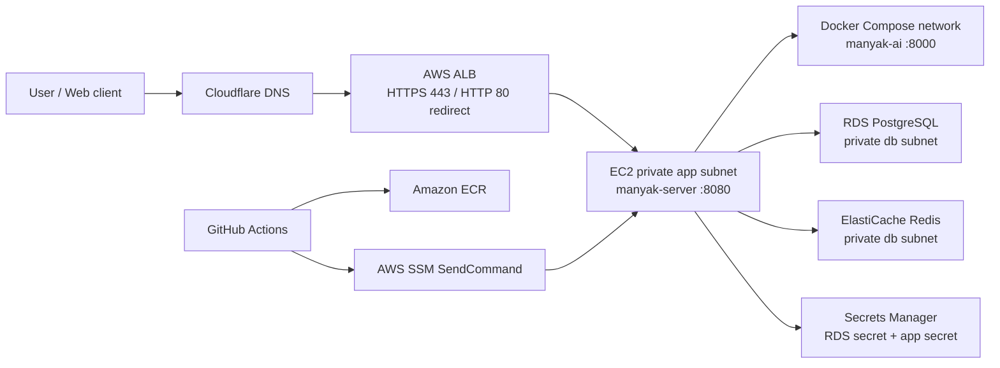

# 7-DEPLOYMENT

이 문서는 마냑 서비스의 배포 단위, 운영·개발 인프라, CI/CD, 런타임 설정, 검수와 롤백 기준을 정의합니다. 운영·개발 배포 기준은 `manyak-terraform`, 로컬 통합 실행 기준은 `manyak-infra`, 서비스별 빌드와 배포 트리거는 `manyak-server`, `manyak-ai`, `manyak-web`, `manyak-android` 레포지토리의 현재 구현을 따릅니다.

개발 환경(AWS)은 **Terraform 코드까지 작성됐고 아직 `apply`하지 않았습니다**(KNK-827, [manyak-terraform #17](https://github.com/KIM-N-KANG/manyak-terraform/pull/17)). 따라서 아래 개발 항목은 코드에 근거가 있는 값이지만 **실물로 검증되지 않았습니다.** `apply` 전까지 확인할 수 없는 항목은 [§7-11](#7-11-미정주의-항목)에 따로 적었습니다.

```text
§7-1  목적과 범위
§7-2  기준 레포지토리와 책임 경계
§7-3  환경 구분과 배포 단위
§7-4  인프라 아키텍처
§7-5  이미지 빌드와 CI/CD
§7-6  런타임 설정과 시크릿
§7-7  운영 배포 절차
§7-8  로컬·통합 실행
§7-9  검수, 관측, 롤백
§7-10 Jira·PR 추적 근거
§7-11 미정·주의 항목
```

| 항목      | 값                                                                                                                                                                  |
| --------- | ------------------------------------------------------------------------------------------------------------------------------------------------------------------- |
| 버전      | v1.2                                                                                                                                                                |
| 작성일    | 2026-07-03                                                                                                                                                          |
| 수정일    | 2026-08-14                                                                                                                                                          |
| 대상      | 마냑 운영·개발·통합 배포                                                                                                                                            |
| 작성 목적 | 배포 책임 경계, 인프라 구성, 배포 절차, 검수·롤백 기준을 정의합니다.                                                                                                |
| 기준 문서 | [`4-backend.md`](./4-backend.md), [`5-ai-server.md`](./5-ai-server.md), [`6-analytics.md`](./6-analytics.md)                                                        |
| 기준 코드 | OpenAI·Terra 전환은 `../manyak-ai` dev `7abfdd5cd6f2`·운영 `v0.2.4`(main `34e1346`), `../manyak-infra` dev `22090d2`(PR #14), `../manyak-terraform` dev `c167073`(PR #15) 기준입니다. OpenAI 키 등록과 세 레포 병합은 2026-08-07, Terraform apply와 운영 키 전달 검증, AI `v0.2.4` 배포와 실컴파일 검증은 2026-08-08 완료했습니다. 그 밖의 기준은 `../manyak-server` dev `f106b8e`, `../manyak-web` dev `0fac4bd`, `../manyak-android` dev `760b4d3`입니다. Langfuse 배선 적용과 키 주입은 2026-07-23 완료했습니다. 개발 환경(ECS Fargate)은 `../manyak-terraform`의 `terraform/envs/dev`·`modules/compute-ecs` 기준입니다([PR #17](https://github.com/KIM-N-KANG/manyak-terraform/pull/17), KNK-825·826·827). 2026-08-14 기준 코드 작성과 `plan`까지 완료했고 **`apply`는 하지 않았습니다** |

## 7-1. 목적과 범위

### 목적

이 문서는 다음 질문에 답하기 위한 운영 스펙입니다.

1. 어떤 레포지토리가 어떤 배포 책임을 갖는가?
2. 운영 AWS 인프라는 어떤 리소스로 구성되는가?
3. `dev`, `main`, release tag가 어떤 이미지와 배포를 만드는가?
4. 런타임 환경변수와 시크릿은 어디에서 생성되고 어떻게 주입되는가?
5. 배포 성공, 장애 감지, 롤백은 무엇을 기준으로 판단하는가?
6. 개발 환경은 무엇을 검증하고 무엇을 검증하지 못하는가?

### 포함 범위

- 운영 AWS 인프라: VPC, 보안 그룹, EC2, ALB, ACM, Cloudflare DNS, ECR, RDS PostgreSQL, ElastiCache Redis, Secrets Manager, SSM, GitHub OIDC
- 서비스 이미지 빌드와 레지스트리: GHCR, ECR, multi-arch 이미지 태그
- 운영 배포 파이프라인: `manyak-server`와 `manyak-ai`의 `main` 배포
- 프론트엔드 이미지 릴리스: `manyak-web`의 GHCR `dev` 이미지와 tag 기반 release 이미지
- 개발 AWS 인프라(`Phase 2 · 계획`): ECS Fargate, EFS, ALB, ACM, Cloudflare DNS, ECR, Secrets Manager
- 로컬·통합 실행: `manyak-infra` Docker Compose
- 검수, 관측, 롤백, 시크릿 회전 기준
- 배포 관련 Jira 키와 GitHub PR 근거

### 제외 범위

- 화면 요구사항과 UX 검수: [`3-1-client.md`](./3-1-client.md)
- API, 데이터 모델, 인증, 오류 처리: [`4-backend.md`](./4-backend.md)
- AI 프롬프트와 요청·응답 계약: [`5-ai-server.md`](./5-ai-server.md)
- 이벤트·지표·관측 수집 정책: [`6-analytics.md`](./6-analytics.md)
- 실제 secret 값, 로컬 `.env`, `terraform.tfvars`, `backend.hcl`, Terraform state
- 운영 웹 호스팅의 외부 플랫폼 설정. 현재 확인한 Terraform에는 `manyak-web` 운영 호스팅 리소스가 없습니다.

### 확인 방식

Jira 원문은 사내 Jira가 소유합니다. 이 문서는 GitHub PR 제목·본문에 연결된 `KNK-*` 키, 병합된 코드, 레포지토리 문서를 근거로 배포 스펙을 정리합니다. 실제 Jira 필드와 이 문서가 다르면 해당 Jira와 병합 PR을 함께 확인해야 합니다.

### 작성 원칙

- 운영 배포 동작은 `manyak-terraform`의 운영 Terraform, SSM 문서, `deploy.sh`, `docker-compose.prod.yml`을 우선 기준으로 씁니다.
- 서비스별 이미지 빌드와 배포 트리거는 각 서비스 레포의 GitHub Actions workflow와 Dockerfile을 기준으로 씁니다.
- 로컬·통합 실행은 `manyak-infra`의 Docker Compose와 `.env.example`을 기준으로 씁니다.
- 개발 환경은 **`terraform apply`로 실물이 생기기 전까지** `Phase 2 · 계획`으로 표기합니다. 인프라는 코드가 병합돼도 apply 전에는 존재하지 않으므로, 병합만으로 `구현`으로 올리지 않습니다. 계획값을 구현 사실처럼 적지 않고, 구현이 계획과 갈라지면 문서를 사후에 맞추지 말고 차이를 [§7-11](#7-11-미정주의-항목)에 기록합니다.
- 문서, PR 설명, 코드가 다르면 병합된 코드를 기준으로 하고 차이는 [§7-11](#7-11-미정주의-항목)에 기록합니다.
- 실제 secret 값, 로컬 전용 설정, Terraform state, 사용자 입력 원문은 예시에도 넣지 않습니다.
- 운영 웹 호스팅처럼 구현 근거가 없는 영역은 추정하지 않고 `미정`으로 표기합니다.

## 7-2. 기준 레포지토리와 책임 경계

| 레포지토리         | 배포 책임                                             | 주요 근거                                                                           |
| ------------------ | ----------------------------------------------------- | ----------------------------------------------------------------------------------- |
| `knk-harness`      | 제품·스펙 문서 정본                                   | `docs/product-specs/`                                                               |
| `manyak-terraform` | 운영·개발 AWS IaC와 운영 compose 원본                 | `terraform/envs/prod`, `terraform/modules`, `docker-compose.prod.yml`. 개발은 `terraform/envs/dev`(`Phase 2 · 계획`)  |
| `manyak-infra`     | 로컬·통합 Docker Compose 실행                         | `docker-compose.yml`, `.env.example`, `README.md`                                   |
| `manyak-server`    | 백엔드 이미지 빌드, 운영 server 배포, API 헬스 스모크 | `.github/workflows/docker-image.yml`, `Dockerfile`, `application-prod.yml`          |
| `manyak-ai`        | AI 이미지 빌드, 운영 AI 배포, AI 헬스 게이트          | `.github/workflows/docker-image.yml`, `Dockerfile`, `src/api/v1/health.py`          |
| `manyak-web`       | Next.js 이미지 빌드, GHCR dev/release 이미지 발행     | `.github/workflows/docker-image.yml`, `.github/workflows/release.yml`, `Dockerfile` |
| `manyak-android`   | Android 앱 소스·Gradle 빌드 소유, PR·push CI(`./gradlew check`·`./gradlew assembleDebug`) | `.github/workflows/android-ci.yml`, `app/build.gradle.kts`                          |

### 책임 경계

- 운영 AWS 리소스 생성·변경은 `manyak-terraform`에서 수행합니다.
- 운영 `server`와 `ai` 컨테이너 이미지는 각 서비스 레포의 `main` push가 ECR로 푸시하고 SSM으로 배포합니다.
- 운영 `web` 호스팅은 현재 확인한 `manyak-terraform`에 정의되어 있지 않습니다. `manyak-web`은 GHCR 이미지 발행까지만 코드로 정의합니다.
- 로컬 통합 실행은 `manyak-infra`가 GHCR `dev` 이미지를 pull해 실행합니다. 서비스 소스코드는 이 레포에서 빌드하지 않습니다.
- 개발 AWS 환경도 `manyak-terraform`이 소유합니다(`Phase 2 · 계획`). 운영과 같은 레포·같은 모듈을 쓰고 state만 분리합니다(S3 backend key `dev/terraform.tfstate`, 버킷은 운영과 공유). 별도 인프라 레포를 만들지 않습니다 — 모듈 하나를 고칠 때 PR이 둘로 갈라지는 비용을 피하기 위해서입니다.
- `manyak-infra`는 개발 AWS 환경이 생겨도 유지합니다. 둘은 대체 관계가 아니며 경계는 [§7-8](#7-8-로컬통합-실행)에 있습니다.
- `manyak-android`는 현재 CI(정적 검사·단위 테스트·debug APK 조립)까지만 코드로 정의합니다. Play Store 배포, 앱 서명, release 빌드·AAB, 내부 테스트 트랙, 운영 배포·롤백 방식은 코드에 근거가 없어 미정입니다([§7-11](#7-11-미정주의-항목)).

## 7-3. 환경 구분과 배포 단위

| 환경              | 목적                    | 배포 단위                                  | 레지스트리·태그                               | 실행 위치                             |
| ----------------- | ----------------------- | ------------------------------------------ | --------------------------------------------- | ------------------------------------- |
| 운영 `prod`       | 실제 사용자 API·AI 운영 | `manyak-server`, `manyak-ai`               | ECR `latest`, `<short-sha>`                   | AWS EC2의 Docker Compose              |
| 개발 `dev`(AWS)   | 클라이언트가 붙는 공용 개발 API, 배포 파이프라인 리허설 | `manyak-server`, `manyak-ai` | **GHCR `dev`**(재현이 필요하면 `<short-sha>`) | AWS ECS Fargate (`Phase 2 · 계획`)    |
| 개발 이미지 `dev` | 통합 실행과 개발 검증   | `manyak-server`, `manyak-ai`, `manyak-web` | GHCR `dev`, `<short-sha>`                     | `manyak-infra` Compose 또는 개별 실행 |
| 웹 릴리스 이미지  | 프론트엔드 버전 릴리스  | `manyak-web`                               | GHCR `{version}`, `{major}.{minor}`, `latest` | 현재 운영 호스팅 리소스는 미정        |
| 로컬·통합         | 전체 스택 수동 검증     | server, web, ai, postgres, redis           | GHCR `dev`, Docker Hub DB·Redis               | 개발자 Docker Compose                 |

개발 `dev`(AWS)는 개발 이미지 `dev`를 **그대로 소비합니다.** 앞은 AWS에서 상시 도는 환경이고 뒤는 GHCR에 올라가는 이미지 태그이며, 개발 환경은 별도 레지스트리를 두지 않고 기존 CI가 만드는 GHCR `dev` 태그를 당겨 씁니다. 따라서 `manyak-server`·`manyak-ai` 레포에는 개발 환경을 위한 변경이 없습니다.

- 운영 ECR을 공유하지 않는 이유: ECR lifecycle이 `tagStatus=any, imageCountMoreThan=10`이라 개발 푸시가 **운영 이미지를 만료**시킵니다.
- GHCR 패키지가 비공개라 태스크 정의에 `repositoryCredentials`가 필요합니다. `read:packages` PAT를 담는 전용 시크릿(`manyak/dev/ghcr-pull`)을 앱 시크릿과 분리해 둡니다.
- `dev` 태그는 가변이라 태스크 정의만으로는 어느 커밋이 도는지 알 수 없습니다. 특정 커밋을 고정해 재현할 때는 `<short-sha>` 태그를 씁니다(GHCR이 둘 다 발행).
- 배포 트리거는 **수동 `aws ecs update-service --force-new-deployment`** 입니다. GitHub Actions 자동 배포는 아직 배선하지 않았습니다([§7-11](#7-11-미정주의-항목)).

### 공개 엔드포인트

| 엔드포인트                                     | 소유 서비스     | 용도                                    | 공개 여부                    |
| ---------------------------------------------- | --------------- | --------------------------------------- | ---------------------------- |
| `https://api.manyak.app`                       | `manyak-server` | 운영 백엔드 API와 헬스체크              | 공개                         |
| `https://dev-api.manyak.app`                   | `manyak-server` | 개발 백엔드 API와 헬스체크(`Phase 2 · 계획`) | 공개                    |
| `http://ai:8000`                               | `manyak-ai`     | server에서 호출하는 compose 내부 AI API | 비공개                       |
| `https://manyak.app`, `https://www.manyak.app` | `manyak-web`    | 프론트엔드 origin으로 CORS 허용         | 운영 호스팅 스택은 현재 미정 |

## 7-4. 인프라 아키텍처

아래 다이어그램과 `네트워크`부터 `이미지 자산 저장·서빙`까지는 **운영 인프라**입니다. 개발 인프라는 이 절 마지막의 `개발 환경 인프라`에서 따로 다룹니다.



### 네트워크

| 항목                | 현재 값·정책                                           |
| ------------------- | ------------------------------------------------------ |
| 리전                | `ap-northeast-2`                                       |
| VPC                 | `10.0.0.0/16`                                          |
| AZ                  | `ap-northeast-2a`, `ap-northeast-2c`                   |
| 서브넷              | 2 AZ x `public`, `app`, `db`                           |
| NAT                 | MVP 비용 절감을 위해 단일 NAT Gateway                  |
| DB 계층             | 인터넷 라우트 없는 isolated subnet                     |
| S3 Gateway Endpoint | app route table에 연결해 S3/ECR 레이어 트래픽 NAT 우회 |

### 보안 그룹과 접근

| 체인             | 허용                                                                    |
| ---------------- | ----------------------------------------------------------------------- |
| Internet -> ALB  | TCP 80, 443                                                             |
| ALB -> App EC2   | TCP 8080                                                                |
| App EC2 -> RDS   | TCP 5432                                                                |
| App EC2 -> Redis | TCP 6379                                                                |
| App EC2 outbound | ECR, SSM, CloudWatch, LLM API, DB, Redis 접근을 위해 전체 outbound 허용 |
| RDS·Redis egress | 별도 egress 없음. App에서 들어온 연결 응답만 stateful하게 허용          |
| 운영 접속        | SSH 22 미개방. SSM Session Manager 사용                                 |

### 컴퓨트와 엣지

| 항목             | 현재 값·정책                                                                  |
| ---------------- | ----------------------------------------------------------------------------- |
| EC2              | Amazon Linux 2023, `t3.small`, private app subnet 2a                          |
| 배포 위치        | `/opt/manyak/docker-compose.yml`, 공용 `/opt/manyak/.env`, AI 모델 전용 `/opt/manyak/.env.ai`, `/opt/manyak/deploy.sh` |
| Compose 서비스   | `server`, `ai`                                                                |
| ALB target group | instance target, HTTP 8080, health path `/actuator/health`                    |
| TLS              | ALB가 ACM 인증서로 종단                                                       |
| DNS              | Cloudflare `api.manyak.app` CNAME -> ALB DNS, `proxied=false`                 |
| user-data 변경   | `user_data_replace_on_change=true`라 apply 시 EC2 교체와 짧은 다운타임 가능   |

### 데이터 계층

| 항목           | 현재 값·정책                                                         |
| -------------- | -------------------------------------------------------------------- |
| RDS            | PostgreSQL 16, `db.t3.micro`, gp3 20GB, storage encrypted            |
| DB 이름·사용자 | `manyak`                                                             |
| DB 비밀번호    | RDS `manage_master_user_password`로 Secrets Manager가 자동 생성·관리 |
| RDS 배치       | 단일 AZ 2a, subnet group은 2 AZ                                      |
| 백업           | 7일                                                                  |
| 삭제 보호      | MVP 기준 false                                                       |
| Redis          | ElastiCache Redis 7.1, `cache.t3.micro`, 단일 노드                   |

### DB 비밀번호 로테이션 재동기화

RDS 관리형 마스터 비밀번호는 자동 로테이션될 수 있지만, EC2의 `/opt/manyak/.env`는 `deploy.sh` 실행 시점의 스냅샷입니다. `manyak-terraform`은 KNK-359에서 EventBridge 5분 스케줄과 전용 SSM 문서 `manyak-prod-db-creds-resync`를 추가했습니다.

- SSM 문서는 secret 값이 아니라 AWSCURRENT 버전 id만 비교합니다.
- 버전 id가 바뀌면 `/opt/manyak/deploy.sh`를 override 없이 실행해 `.env`를 재생성합니다. 이 경로는 server를 pull/up하고, ECR에 AI 이미지가 있으면 AI도 `up -d --wait` healthcheck gate를 탑니다.
- 평시에는 no-op이며, 첫 적용 직후에는 상태 파일이 없어 같은 no-override 동기화가 1회 일어날 수 있습니다.

### 이미지 자산 저장·서빙 — `Phase 1 · 계획`

팀 사전 제작 프리셋 자산(썸네일·채팅 배경·캐릭터 — [`4-backend.md §4-3-9`](./4-backend.md))을 위한 정적 자산 계층입니다. **사용자 업로드는 없습니다** — 회원 presigned 업로드 경로는 이미지 정책 개정(2026-07-07, [`4-backend.md §4-8`](./4-backend.md) B10)으로 계약에서 빠졌고, 업로드 주체는 운영(시드)뿐입니다. 현재 Terraform에는 없으며, Phase 1 이미지 기능 구현과 함께 추가합니다.

| 항목        | 방향                                                                                                                                                                                                                                                                                               |
| ----------- | -------------------------------------------------------------------------------------------------------------------------------------------------------------------------------------------------------------------------------------------------------------------------------------------------- |
| 저장소      | 비공개 S3 버킷 1개(+ CloudFront OAC). prefix로 구분 — `thumbnails/` · `backgrounds/` · `characters/`([`4-backend.md §4-3-9`](./4-backend.md) 자산 카탈로그)                                                                                                                                        |
| 업로드 경로 | 운영 시드 전용 — 자산 파일은 S3에 직접 업로드하고, 카탈로그 등재는 시드 매니페스트 검증을 거칩니다(검증 위반은 시드 실패 — [`4-backend.md §4-3-9`](./4-backend.md)). 클라이언트 업로드 API·presigned URL 발급은 없습니다. 후속에 사용자 업로드류 기능이 도입되면 같은 버킷·CDN 기반을 재사용합니다 |
| 서빙 경로   | CDN(CloudFront) 배포가 버킷을 origin으로 공개 서빙. `imageKey` → 서빙 URL 변환은 백엔드 소유, 객체 키는 불변(교체는 새 키 — 장기 캐시 전제). CDN 도메인·캐시 정책 수치는 `계획`                                                                                                                    |
| 권한        | EC2 인스턴스 role에 해당 버킷 읽기 권한 추가(presigned 발급 권한 불필요)                                                                                                                                                                                                                           |
| 소유        | S3·CloudFront·IAM 리소스 정의는 `manyak-terraform` 소유. 이 문서는 경계와 경로만 고정                                                                                                                                                                                                              |

### 개발 환경 인프라 — `Phase 2 · 계획`(KNK-825)

- **무엇.** 클라이언트가 상시 붙을 수 있는 개발 API를 ECS Fargate로 만듭니다. 운영과 같은 `manyak-terraform`이 소유하며 state만 분리합니다(`terraform/envs/dev`, key `dev/terraform.tfstate`).
- **왜.** 현재 통합 실행 수단은 `manyak-infra` 로컬 Compose뿐이라 web·android가 붙을 공용 엔드포인트가 없고, 운영 배포를 리허설할 곳도 없습니다. 동시에 운영 컴퓨트는 `user_data_replace_on_change=true` 때문에 설정 한 줄을 바꿔도 EC2 교체와 짧은 다운타임을 수반하며(위 `컴퓨트와 엣지`), 배포 경로가 `deploy.sh`와 전용 SSM 문서라는 자체 제작 기계입니다.
- **어떻게.** 최종 목표는 운영·개발 모두 Fargate지만 **개발을 먼저 만들어 검증하고 운영 전환은 별도로 진행합니다.** 개발에서 태스크 정의, execution role과 task role 분리, 시크릿 주입, 태스크 교체 배포를 확인한 뒤 같은 모듈을 운영에 적용합니다. 개발이 검증될 때까지 운영은 EC2로 유지합니다.
- **왜 그 방법.** 운영을 먼저 전환하면 Fargate 고유 실패(태스크 ENI 네트워킹, execution role과 task role 혼동, 시크릿 주입 실패 시 조용한 재시작 루프)를 살아 있는 서비스 위에서 디버깅하게 됩니다. 대가로 전환 기간 동안 개발과 운영의 컴퓨트가 갈라져 **개발이 운영 배포 경로를 검증하지 못하며, 이는 의도된 임시 상태입니다.**

| 항목            | 개발 계획값                                                                        | 운영 현재값과의 차이                         |
| --------------- | ---------------------------------------------------------------------------------- | -------------------------------------------- |
| 컴퓨트          | ECS Fargate Spot                                                                   | 운영은 EC2 `t3.small` + Docker Compose       |
| 실행 단위       | **태스크 정의 1개**에 `manyak-server`·`manyak-ai`·`postgres`·`redis` 컨테이너      | 운영은 EC2 한 대의 Compose에 server·ai 2개   |
| 서비스 간 통신  | 같은 태스크 ENI를 공유하므로 `localhost` — `MANYAK_AI_BASE_URL=http://localhost:8000` | 운영은 Compose 서비스명 DNS `http://ai:8000` |
| 런타임 프로파일 | `SPRING_PROFILES_ACTIVE=prod` **잠정 재사용** + env 오버라이드 5종(아래 주의)      | 운영은 `prod`                                |
| 이미지 출처     | GHCR `dev`(비공개 → `repositoryCredentials`)                                       | 운영은 ECR `latest`/`<short-sha>`            |
| 초기 기동       | `desired_count` 기본값 `0` — 시크릿 주입 후 `1`로 상향하는 2단계                   | 운영은 인스턴스 부팅 시 `deploy.sh`가 주입   |
| DB              | 태스크 컨테이너 `postgres` + **EFS 볼륨**에 데이터 디렉터리 영속화                 | 운영은 RDS PostgreSQL 16 관리형, 백업 7일    |
| 캐시            | 태스크 컨테이너 `redis` — 영속 볼륨 없음                                           | 운영은 ElastiCache Redis 7.1                 |
| 네트워크        | 퍼블릭 서브넷 + 태스크 퍼블릭 IP                                                   | 운영은 인터넷 라우트 없는 private app subnet |
| NAT Gateway     | 없음                                                                               | 운영은 단일 NAT Gateway                      |
| 인바운드        | ALB SG에서 오는 트래픽만 허용                                                      | 운영과 같은 정책                             |
| 엣지            | ALB + ACM + Cloudflare `dev-api.manyak.app`                                        | 운영과 같은 구조                             |
| 시크릿 주입     | Secrets Manager → 태스크 정의 `secrets`                                            | 운영은 `deploy.sh`가 `.env`를 생성           |
| 배포            | `aws ecs update-service`. 구·신 태스크가 겹치지 않는 stop-then-start(아래 주의)    | 운영은 SSM SendCommand → `deploy.sh`         |

관리형 DB·캐시와 NAT Gateway를 두지 않는 것은 비용 결정입니다. 개발은 데이터 계층 고유 동작을 검증 대상에서 제외하는 대신 배포 파이프라인 검증에 집중합니다.

**컨테이너를 태스크 하나에 모으는 이유.** ECS `awsvpc` 네트워킹에서 태스크를 나누면 Compose 서비스명 DNS가 존재하지 않습니다. 운영 Compose는 `MANYAK_AI_BASE_URL: http://ai:8000`을 쓰고 "`localhost` 아님"을 주석으로 못박고 있는데(`../manyak-terraform/docker-compose.prod.yml`), 이 값을 그대로 Fargate 별도 태스크에 옮기면 이름이 풀리지 않습니다. server 헬스체크는 AI에 연결하지 않고 뜨므로(WebClient 지연 연결) **ALB 헬스는 초록인데 스토리·채팅 호출만 전부 실패하는 상태**가 됩니다. 태스크를 나눌 경우 Service Connect 또는 Cloud Map과 server SG → ai SG 규칙이 추가로 필요하므로, 개발은 태스크 1개로 묶고 `localhost`를 씁니다. AI 주소는 운영과 달라지므로 환경변수로 주입합니다.

**런타임 프로파일 — `prod` 잠정 재사용, `dev` 프로파일은 코드 완료·전환 전.** `manyak-server`의 기본 프로파일은 `local`입니다(`application.yml`의 `spring.profiles.default: local`). 프로파일을 주지 않으면 채팅·스토리 AI 스텁이 모두 켜지고(`application-local.yml`의 `stub: true`), 더미 JWT 서명 키와 `/actuator/prometheus` 무인증 노출이 따라옵니다 — **공개된 개발 엔드포인트가 스텁으로 응답하면서 헬스는 정상으로 보입니다.**

현재 프로파일은 `local`과 `prod` 둘뿐이라 개발은 `prod`를 재사용하고 차이를 환경변수로 덮습니다. `@Profile` 애노테이션은 코드에 하나도 없어 프로파일은 YAML만 갈아끼우고, 스텁 빈은 `@ConditionalOnProperty(havingValue = "false", matchIfMissing = true)`라 실 클라이언트가 기본입니다. 환경변수는 프로파일 YAML보다 우선순위가 높아 아래 오버라이드가 소스 변경 없이 성립합니다.

| 환경변수 | 값 | 덮지 않으면 |
| --- | --- | --- |
| `SPRINGDOC_APIDOCS_ENABLED`·`SPRINGDOC_SWAGGERUI_ENABLED` | `true` | 운영이 비공개화한 Swagger가 개발에서도 꺼져 클라이언트 개발자가 API 문서를 못 봅니다 |
| `MANYAK_GOOGLE_FORM_FEEDBACK_ID` | `""` | **개발 피드백이 운영 구글 폼에 적재됩니다**(기본값이 실제 운영 폼 id) |
| `MANYAK_ASSET_BASE_URL` | `https://dev-api.manyak.app` | **개발 가입자의 `profile_image_url`에 운영 주소가 영구 저장됩니다**(전체 URL을 DB에 기록) |
| `MANAGEMENT_HEALTH_REDIS_ENABLED` | `true` | 운영이 배포 사정으로 끈 Redis health가 개발에서도 꺼집니다 |
| `SENTRY_ENVIRONMENT` | `dev` | **개발 프롬프트 원문이 운영 Langfuse(JP)로 흘러갑니다**(활성화 가드가 이 값을 봅니다) |

**5종은 두 경로로 나뉘고, 그 차이가 `dev` 프로파일이 YAML로 되찾을 수 있는 범위를 결정합니다.**

| 경로 | 해당 환경변수 | YAML로 잠글 수 있나 |
| --- | --- | --- |
| **placeholder 경유.** 대상 프로퍼티의 relaxed binding 이름이 아니고, `application.yml`이 `${...}`로 참조해서 값이 들어옵니다 | `MANYAK_GOOGLE_FORM_FEEDBACK_ID`(정규 이름은 `MANYAK_GOOGLEFORM_FEEDBACK_FORMID`), `MANYAK_ASSET_BASE_URL`(정규 이름은 `MANYAK_ASSET_PROFILEPRESETBASEURL`) | **가능.** 프로파일 파일에 리터럴을 두면 환경변수가 남아 있어도 리터럴이 이깁니다 |
| **relaxed binding 직결.** 프로퍼티의 정규 환경변수 이름이라 `systemEnvironment` property source가 프로파일 YAML보다 우선합니다 | `SENTRY_ENVIRONMENT`, `SPRINGDOC_APIDOCS_ENABLED`, `SPRINGDOC_SWAGGERUI_ENABLED`, `MANAGEMENT_HEALTH_REDIS_ENABLED` | **불가능.** 리터럴을 박아도 환경변수가 이깁니다 |

검증 상태를 구분해 둡니다. **실측한 것은 셋입니다**(KNK-828 구현 중 `dev` 프로파일을 실제로 기동해 `/actuator/env`로 확인). `MANYAK_GOOGLE_FORM_FEEDBACK_ID`에 운영 폼 id를 주입한 채 프로파일에서 키를 생략하면 유효값이 운영 폼 id가 되고 origin이 `application.yml`로 잡히며, 빈 문자열 리터럴을 넣으면 리터럴이 이깁니다. `MANYAK_ASSET_BASE_URL`은 환경변수 값이 이기고, `SENTRY_ENVIRONMENT`는 `systemEnvironment`가 최상위 property source로 잡힙니다. **`SPRINGDOC_*` 두 키와 `MANAGEMENT_HEALTH_REDIS_ENABLED`는 실측하지 않았고, 같은 규칙에 따른 추론입니다.**

Amplitude 관련 변수는 **의도적으로 주입하지 않습니다.** 운영에서 켜지는 것은 프로파일이 아니라 user-data가 `.env`에 굽기 때문이며, 개발 태스크 정의에 넣지 않아 개발 이벤트가 운영 프로젝트로 가지 않게 합니다.

**이 재사용은 잠정입니다.** 오버라이드 5종 중 셋은 빠뜨리면 운영 데이터를 오염시키고, `application-prod.yml`에 운영 리소스를 가리키는 기본값이 추가되면 개발이 조용히 물려받습니다(위 구글 폼·asset URL이 그 사례).

**`dev` 프로파일은 코드가 완료됐고 아직 머지 전입니다**(KNK-828, [manyak-server #185](https://github.com/KIM-N-KANG/manyak-server/pull/185)). 구현에서 확정된 것은 셋입니다.

- `SPRING_PROFILES_ACTIVE=prod,dev` 겹쳐쓰기가 아니라 **`application-dev.yml` 단독**입니다. 겹쳐 쓰면 `dev`가 `application-prod.yml`의 현재·미래 기본값을 계속 상속해, 이 프로파일을 만든 이유 자체가 사라집니다. 중복되는 datasource·JPA·Flyway 12줄은 감수했습니다(`application-local.yml`도 같은 12줄을 이미 중복합니다).
- `logback-spring.xml`의 JSON 로깅에 `dev`를 **의도적으로 포함**했습니다(`<springProfile name="prod,dev">`). 개발도 CloudWatch로 나가고 개발 환경의 존재 이유가 운영 배포 리허설이라, 운영용 CloudWatch Insights 쿼리를 개발에서 그대로 리허설할 수 있어야 합니다. 반대편 조건도 `!prod & !dev`로 함께 좁혔습니다 — 한쪽만 고치면 JSON과 콘솔 두 appender가 동시에 붙어 로그가 두 줄씩 찍힙니다.
- 구글 폼 id는 **빈 문자열 리터럴**로 잠갔습니다(placeholder가 아닙니다). 키를 생략하면 base의 placeholder가 환경변수 값을 받아 개발 피드백이 운영 폼에 적재되는 경로가 실재했고, 실측으로 재현했습니다.

**목표 상태 서술을 정정합니다.** "위 값을 YAML로 고정한다"는 5종 전부에 성립하지 않습니다. `dev` 프로파일이 YAML로 되찾는 것은 구글 폼 id 하나이고, Swagger 두 키와 Redis health는 `dev`가 `prod`를 상속하지 않아 base·Spring 기본값이 그대로 살아 **환경변수가 불필요해질 뿐 YAML에 적지는 않습니다**(둘 다 relaxed binding 직결이라, YAML에 적어도 환경변수가 남아 있으면 환경변수가 이깁니다). asset base URL과 `SENTRY_ENVIRONMENT`는 프로파일이 생겨도 환경변수로 남습니다.

**전환 후 정리도 5종이 균등하지 않습니다.**

| 환경변수 | 전환 후 | 이유 |
| --- | --- | --- |
| `MANYAK_ASSET_BASE_URL` | 유지 | 환경별로 다른 실값을 공급받아야 합니다. `dev` 프로파일 기본값(`https://dev-api.manyak.app`)은 잠금이 아니라 주입 부재에 대한 fail-safe입니다 |
| `SENTRY_ENVIRONMENT` | 유지 | `server`만 보면 `dev` 프로파일 기본값이 `dev`라 없어도 되지만, **`ai` 컨테이너에는 반드시 필요합니다** — `manyak-ai`의 Langfuse 활성화 가드가 이 값을 봅니다. 두 컨테이너에 각각 `var.environment`로 배선돼 있어(`terraform/modules/compute-ecs/main.tf`) `server` 쪽을 지워도 `ai` 쪽은 남지만, 같은 값을 두 곳에서 같게 유지하는 편이 안전합니다 |
| `MANYAK_GOOGLE_FORM_FEEDBACK_ID` | 중복 | `dev` 프로파일의 빈 문자열 리터럴이 이기므로 남아 있어도 무해합니다. "YAML이 정본"을 흐리지 않게 지우는 편이 낫습니다. 개발 전용 폼이 생겨 이 값에 실제 id를 넣게 되면, 리터럴이 이기므로 YAML을 함께 바꿔야 합니다 |
| `SPRINGDOC_APIDOCS_ENABLED`·`SPRINGDOC_SWAGGERUI_ENABLED`·`MANAGEMENT_HEALTH_REDIS_ENABLED` | 중복 | `dev`는 `prod`를 상속하지 않아 base·Spring 기본값이 그대로 살아, 환경변수가 주던 값과 같아집니다 |

**프로파일을 바꿔도 계속 필요한 환경변수는 따로 있습니다.** `MANYAK_AI_BASE_URL`·`MANYAK_CORS_ALLOWED_ORIGINS`·`MANYAK_AUTH_JWT_SECRET`은 `application.yml`에 기본값이 없어 주입하지 않으면 기동에 실패합니다(DB 접속정보와 시크릿도 마찬가지입니다). 전환을 "이제 환경변수를 다 지워도 된다"로 읽으면 안 됩니다.

Terraform은 프로파일을 변수로 받으므로 서버 릴리스 후 값 하나만 바꾸면 전환됩니다([§7-11](#7-11-미정주의-항목)).

**DB만 EFS로 유지하고 캐시는 휘발로 둡니다.** Fargate 태스크의 컨테이너 저장소는 태스크가 사라지면 함께 사라지고, Fargate Spot은 임의 시점에 회수됩니다. `postgres` 데이터 디렉터리를 EFS 볼륨에 두면 배포·Spot 회수와 무관하게 계정·스토리가 유지됩니다. `redis`는 붙이지 않습니다 — 저장 대상이 refresh 토큰 위주라 초기화돼도 재로그인으로 회복되고, 볼륨을 하나 더 얹을 값어치가 없습니다.

EFS를 붙일 때 함께 필요한 것은 세 가지입니다.

| 항목        | 내용                                                                              |
| ----------- | --------------------------------------------------------------------------------- |
| 접근 경로   | EFS access point로 `postgres` 데이터 디렉터리 소유자·권한을 고정해 마운트          |
| 보안 그룹   | EFS 마운트 타깃 SG가 **태스크 SG에서 오는 NFS 2049**를 허용해야 합니다             |
| 플랫폼 버전 | Fargate에서 EFS 볼륨은 플랫폼 버전 `1.4.0` 이상이 필요합니다                       |

**대신 태스크 교체가 겹치면 안 됩니다.** 같은 `postgres` 데이터 디렉터리에 두 인스턴스가 동시에 붙을 수 없으므로, 신규 태스크를 띄운 뒤 기존 태스크를 내리는 겹침 방식(`maximumPercent > 100`)을 쓰면 새 `postgres`가 잠금 충돌로 기동에 실패합니다. 개발 서비스는 **기존 태스크를 먼저 내리고 새 태스크를 띄우는 stop-then-start**로 배포하며, 그 사이 짧은 중단이 생깁니다.

이 제약은 **개발에만 해당합니다.** 운영은 DB가 태스크 밖(RDS)에 있어 겹치는 롤링 교체에 걸림돌이 없습니다. 따라서 개발 환경은 ECS 배포 기계 자체는 검증하지만 **무중단 롤링 교체는 검증하지 못하며**, 그 확인은 운영 전환 시점으로 넘어갑니다.

### 개발 환경의 검증 경계 — `Phase 2 · 계획`

| 구분           | 항목                                                                                                                                                                                    |
| -------------- | ----------------------------------------------------------------------------------------------------------------------------------------------------------------------------------------- |
| 검증됨         | 이미지 배포와 태스크 교체, 태스크 기동, Secrets Manager 주입, ALB 헬스체크, CORS·도메인 배선, EFS 볼륨을 통한 배포 간 DB 데이터 유지                                                    |
| 검증되지 않음 | RDS 고유 동작 — 관리형 마스터 비밀번호 자동 로테이션과 재동기화(위 `DB 비밀번호 로테이션 재동기화`, KNK-359), 백업·스냅샷 복구, ElastiCache 파라미터 그룹(`maxmemory-policy=volatile-ttl`) |
| 검증되지 않음 | 운영과 다른 네트워크 경로 — NAT 경유 egress, private subnet 격리                                                                                                                        |
| 검증되지 않음 | 운영과 다른 server→AI 경로 — 개발은 태스크 내 `localhost`, 운영은 Compose 서비스명 DNS                                                                                                  |
| 검증되지 않음 | 무중단 롤링 교체 — 개발은 `postgres` 데이터 디렉터리의 단일 writer 제약 때문에 stop-then-start로 배포합니다. 겹치는 롤링 교체는 DB가 태스크 밖에 있는 운영 전환 시점에 확인합니다      |
| 검증되지 않음 | `redis` 데이터 연속성 — 캐시에는 EFS를 붙이지 않아 태스크 교체 시 refresh 토큰이 사라지고 재로그인이 필요합니다                                                                         |
| 검증되지 않음 | 운영이 EC2로 남아 있는 동안의 운영 배포 경로 전체(`deploy.sh`, 전용 SSM 문서, user-data)                                                                                                |

개발 환경은 컨테이너 DB를 쓰므로 **데이터 계층 사고는 재현되지 않습니다.** 관리형 서비스와 관련된 변경은 개발 통과를 근거로 삼지 않고, 운영 `plan` 리뷰와 운영 검수([§7-9](#7-9-검수-관측-롤백))로 판단합니다.

**개발 검수에서 ALB 헬스만으로 완료 판정하지 않습니다.** `ai` 컨테이너는 `essential = false`입니다 — 운영 Compose가 server를 AI 의존 없이 띄우는 성질을 유지하기 위해서고, AI 하나 때문에 태스크 전체가 재기동 루프에 빠지면 개발 환경이 더 못 쓰게 되기 때문입니다. 대가로 **AI가 죽어도 태스크와 ALB 헬스는 정상으로 남습니다.** server의 `/actuator/health`는 AI를 호출하지 않으므로 겉보기에는 초록인데 스토리·채팅만 `localhost:8000` 연결 실패를 냅니다. 특히 `OPENAI_API_KEY`가 비면 기본 컴파일 모델이 OpenAI라 AI가 기동 검사에서 종료하는데, 이 경로가 정확히 그 상태를 만듭니다. 따라서 개발 배포 검수에는 **AI health를 별도 게이트로** 포함합니다.

## 7-5. 이미지 빌드와 CI/CD

### 레지스트리와 태그

| 서비스          | 개발 이미지                        | 운영 이미지         | 태그 정책                                                                         |
| --------------- | ---------------------------------- | ------------------- | --------------------------------------------------------------------------------- |
| `manyak-server` | `ghcr.io/kim-n-kang/manyak-server` | ECR `manyak-server` | dev: `dev`, `<short-sha>` / prod: `latest`, `<short-sha>`                         |
| `manyak-ai`     | `ghcr.io/kim-n-kang/manyak-ai`     | ECR `manyak-ai`     | dev: `dev`, `<short-sha>` / prod: `latest`, `<short-sha>`                         |
| `manyak-web`    | `ghcr.io/kim-n-kang/manyak-web`    | 현재 ECR 없음       | dev: `dev`, `<short-sha>` / release tag: `{version}`, `{major}.{minor}`, `latest` |

### `manyak-server` CI/CD

| 트리거         | 동작                                                                              |
| -------------- | --------------------------------------------------------------------------------- |
| PR -> `dev`    | Java 21, Gradle test, multi-arch Docker build 검증                                |
| push -> `dev`  | 테스트 후 GHCR `dev`, `<short-sha>` push                                          |
| push -> `main` | 테스트 후 ECR `latest`, `<short-sha>` push, SSM으로 server 배포, 외부 헬스 스모크 |

운영 배포는 다음 순서입니다.

1. workflow가 GitHub OIDC로 `vars.AWS_ROLE_ARN` 역할을 assume합니다.
2. ECR에 `manyak-server:<short-sha>`와 `latest`를 push합니다.
3. 최신 `main` SHA가 아니면 stale 배포를 건너뜁니다.
4. `Project=manyak`, `Name=manyak-prod-app`, `running` 태그로 EC2를 찾습니다.
5. SSM `AWS-RunShellScript`로 `SERVER_IMAGE_OVERRIDE=<ECR short-sha image> bash /opt/manyak/deploy.sh`를 실행합니다.
6. `https://api.manyak.app/actuator/health`가 `{"status":"UP"}`를 반환할 때까지 폴링합니다.

### `manyak-ai` CI/CD

| 트리거         | 동작                                                                |
| -------------- | ------------------------------------------------------------------- |
| PR -> `dev`    | Python 3.11, `pytest`, multi-arch Docker build 검증, DeepSeek·OpenAI 더미 키를 넣은 이미지 스모크 2종(기본 health · 더미 키로 Langfuse 활성 경로 health+기동 로그) |
| push -> `dev`  | 테스트 후 GHCR `dev`, `<short-sha>` push                            |
| push -> `main` | 테스트 후 ECR `latest`, `<short-sha>` push, 전용 SSM 문서로 AI 배포 |

**AI CI는 선택된 모델의 공급자 경로를 검사합니다(KNK-804).**

- **무엇.** AI 테스트와 이미지 스모크는 저장소가 선택한 모델을 등록부에서 해석하고, DeepSeek 모델이면 DeepSeek 경로를, GPT 모델이면 OpenAI 경로를 검사합니다.
- **왜.** 컴파일 기본값이 DeepSeek일 때는 OpenAI 분기가 CI에서 한 번도 실행되지 않았습니다. 기본 모델을 Terra로 바꾸기만 하면 기존 하드코딩 검사는 실패하거나, 반대로 더미 키로 기동만 성공해 실제 OpenAI 호출 인자 연결을 놓칠 수 있었습니다.
- **어떻게.** 비라이브 CI에 DeepSeek·OpenAI 더미 키를 함께 넣고, 컴파일 계약 테스트가 현재 선택된 모델의 공급자와 어댑터 호출 인자를 확인합니다. 기본 모델 값 자체를 고정하는 테스트는 운영 기본값과 함께 바꾸되, 공급자 라우팅 테스트는 등록부 해석값을 따릅니다.
- **왜 그 방법.** 현재 실제로 선택된 모델 경로를 항상 검사하면 쓰지 않는 모든 후보 모델 때문에 CI가 늘어나지 않습니다. 운영에서 여러 모델을 동시에 선택하게 되면 그때 선택된 모델 수만큼 같은 계약 테스트를 매개변수화해 모두 실행합니다.

운영 AI 배포는 `manyak-prod-ai-deploy` SSM 문서를 사용합니다.

1. workflow가 GitHub OIDC로 AI 전용 `vars.AWS_ROLE_ARN` 역할을 assume합니다.
2. ECR에 `manyak-ai:<short-sha>`와 `latest`를 push합니다.
3. 최신 `main` SHA가 아니면 stale 배포를 건너뜁니다.
4. SSM 문서에 `ImageUri=<ECR manyak-ai short-sha image>` 파라미터를 전달합니다.
5. 문서가 EC2에서 `AI_IMAGE_OVERRIDE='{{ImageUri}}' bash /opt/manyak/deploy.sh`를 실행합니다.
6. `deploy.sh`가 새 이미지와 Parameter Store의 모델 설정으로 임시 컨테이너 기동 검사를 먼저 실행합니다. 검사가 성공한 경우에만 설정 파일과 기존 AI 컨테이너를 교체하고, `docker compose up -d --wait ai`로 healthcheck 통과까지 대기합니다. SendCommand 성공은 기동 검사, 배포, AI health 통과를 의미합니다.

### `manyak-web` CI/CD

| 트리거                   | 동작                                                                                                                                |
| ------------------------ | ----------------------------------------------------------------------------------------------------------------------------------- |
| PR -> `dev`              | pnpm install, lint, typecheck, Docker build 검증                                                                                    |
| PR·push -> `dev`, `main` | Playwright: Pixel 5 전체 E2E·비주얼 회귀, Desktop Chrome·iPhone 13 스모크. CI는 Chromium·WebKit을 설치하고 Linux 기준 이미지와 비교 |
| push -> `dev`            | GHCR `dev`, `<short-sha>` push                                                                                                      |
| push tag `v*`            | GHCR release image push. 현재 build arg는 `NEXT_PUBLIC_AMPLITUDE_API_KEY`, `NEXT_PUBLIC_APP_VERSION`, `NEXT_PUBLIC_META_PIXEL_ID`(KNK-616)를 주입                        |

비주얼 기준 이미지는 Linux 렌더링만 정본입니다. UI를 의도적으로 변경하면 `manyak-web`에서 `pnpm test:e2e:visual:update`를 실행해 Playwright Docker 이미지로 기준 이미지를 갱신하고 diff를 검토합니다. macOS 로컬 실행은 폰트·안티앨리어싱 차이 때문에 스냅샷 비교를 건너뜁니다.

현재 확인한 운영 Terraform에는 `manyak-web` 컨테이너를 운영 호스팅에 배포하는 리소스가 없습니다. `manyak-web` release PR들은 GHCR release image 발행과 외부 호스팅 반영을 전제로 합니다.

Web Sentry는 Vercel 호스팅 환경 변수 `NEXT_PUBLIC_SENTRY_DSN`으로 활성화되어 운영 이벤트를 수집하고 있습니다(GHCR release workflow·Dockerfile에는 여전히 이 build arg가 없어 컨테이너 경로는 비활성).

### `manyak-android` CI

컨테이너 이미지가 없는 앱 레포입니다. GitHub Actions(`.github/workflows/android-ci.yml`)가 `dev`·`main` 대상 PR·push와 수동 실행(workflow_dispatch)에서 다음을 수행합니다.

| 트리거                   | 동작                                                                                             |
| ------------------------ | ------------------------------------------------------------------------------------------------ |
| PR·push -> `dev`, `main` | Temurin Java 25 설정(Gradle daemon toolchain `gradle-daemon-jvm.properties`와 일치) → `./gradlew check`(ktlint·detekt·Android lint·단위 테스트) → `./gradlew assembleDebug`(debug APK 조립), 리포트 아티팩트 업로드 |

배포 파이프라인(Play Store, 서명, release 빌드·AAB, 내부 테스트 트랙)은 정의되어 있지 않으며 미정입니다([§7-11](#7-11-미정주의-항목)).

Web Sentry SDK 게이팅은 `NODE_ENV=production`이면서 **Vercel 배포일 때만** 이벤트를 전송합니다(KNK-714). `NODE_ENV`만 보면 로컬 프로덕션 빌드(`pnpm build && pnpm start`)의 이벤트까지 `production` 환경으로 유입되기 때문입니다. 배포 여부는 `NEXT_PUBLIC_VERCEL_ENV`의 존재로 판별하며, 이 값은 대시보드의 시스템 환경 변수 노출 설정에 의존하지 않도록 `next.config.ts`가 `VERCEL_ENV`를 빌드 시점에 직접 인라인합니다. 로컬에서 연동을 확인할 때는 `NEXT_PUBLIC_SENTRY_FORCE_ENABLE=true`로 강제 활성화합니다.

### EC2 `deploy.sh` 공통 규칙

- 모든 배포 호출은 EC2의 `flock`으로 직렬화합니다. server와 ai는 서로 다른 GitHub 레포라 workflow concurrency만으로는 동시 배포를 막을 수 없습니다.
- 매 실행마다 Secrets Manager를 다시 읽고 `/opt/manyak/.env`를 재생성합니다.
- AI 전용 OpenAI·Langfuse 키는 공용 `.env`에 쓰지 않고 `deploy.sh`가 셸 환경변수로만 AI compose에 전달합니다.
- `SERVER_IMAGE_OVERRIDE`만 있으면 AI 모델 Parameter Store를 읽지 않고 server만 pull/up 합니다.
- `AI_IMAGE_OVERRIDE`가 있으면 새 이미지와 모델 설정의 기동 검사를 통과한 뒤 ai만 교체하고 `--wait`로 health를 확인합니다.
- `AI_CONFIG_RELOAD=1`이면 이미지는 유지하고 새 모델 설정의 기동 검사를 통과한 뒤 ai만 재생성합니다.
- override가 없으면 공용 `.env`를 적용하고 server를 먼저 기동합니다. 이후 ECR에 AI 이미지가 존재할 때만 모델 기동 검사를 거쳐 ai를 기동합니다. AI 검사나 ECR 조회가 실패해도 이미 기동한 server는 유지됩니다.
- AI 모델 전용 `.env.ai`는 모든 AI 교체 경로에서 기동 검사 성공 후 적용합니다. `AI_IMAGE_OVERRIDE`와 수동 모델 재적용은 실패한 이미지 핀이나 AI 시크릿이 공용 `.env`에 남지 않도록 공용 `.env`도 검사 뒤 함께 적용합니다.
- 한 서비스만 배포할 때 다른 서비스 이미지가 `latest`로 덮이지 않도록 기존 `.env`의 이미지 좌표를 보존합니다.

## 7-6. 런타임 설정과 시크릿

### GitHub 설정

| 레포            | 설정                                  | 용도                                                            |
| --------------- | ------------------------------------- | --------------------------------------------------------------- |
| `manyak-server` | repository variable `AWS_ROLE_ARN`    | server ECR push와 SSM 배포용 OIDC role ARN                      |
| `manyak-ai`     | repository variable `AWS_ROLE_ARN`    | AI ECR push와 전용 SSM 배포용 OIDC role ARN                     |
| `manyak-web`    | repository secret `AMPLITUDE_API_KEY` | tag release 이미지 빌드 시 `NEXT_PUBLIC_AMPLITUDE_API_KEY` 주입 |
| `manyak-web`    | repository secret `META_PIXEL_ID`     | tag release 이미지 빌드 시 `NEXT_PUBLIC_META_PIXEL_ID` 주입(KNK-616). 미등록 시 빈 값이 주입되어 픽셀은 비활성 상태로 빌드됨 |

`AWS_ROLE_ARN` 값은 `manyak-terraform/terraform/envs/prod` output에서 확인합니다.

`manyak-web`의 `NEXT_PUBLIC_SENTRY_DSN`은 코드가 참조하지만 현재 release workflow 입력으로 정의되어 있지 않습니다.

### Secrets Manager

`manyak-terraform`은 앱 시크릿 컨테이너 `manyak/prod/app`만 만들고, 실제 값은 콘솔 또는 CLI로 별도 입력합니다. 실제 secret 값은 문서나 레포지토리에 넣지 않습니다.

| 키                                     | 필수              | 주입 대상           | 설명                                                                                                                                         |
| -------------------------------------- | ----------------- | ------------------- | -------------------------------------------------------------------------------------------------------------------------------------------- |
| `SERVER_SENTRY_DSN`                    | 아니오            | server `SENTRY_DSN` | 백엔드 Sentry DSN. 비우면 Sentry 비활성                                                                                                      |
| `AI_SENTRY_DSN`                        | 아니오            | ai `SENTRY_DSN`     | AI Sentry DSN. 비우면 Sentry 비활성 |
| `AI_LANGFUSE_PUBLIC_KEY` | 아니오 | ai `LANGFUSE_PUBLIC_KEY` | Langfuse 공개 키. 비우면 관측 비활성(no-op) |
| `AI_LANGFUSE_SECRET_KEY` | 아니오 | ai `LANGFUSE_SECRET_KEY` | Langfuse 시크릿 키. 비우면 관측 비활성(no-op) |
| `AI_LANGFUSE_HOST` | 아니오 | ai `LANGFUSE_HOST` | Langfuse 리전 엔드포인트. JP `https://jp.cloud.langfuse.com` 필수 — 비우면 활성화 가드가 막아 관측 비활성(no-op) |
| `MANYAK_SLACK_FEEDBACK_WEBHOOK_URL`    | 아니오            | server              | 피드백 Slack 알림. 비우면 발송 생략                                                                                                          |
| `MANYAK_ANALYTICS_ANONYMOUS_ID_PEPPER` | 아니오            | server              | 현재 Terraform과 infra가 주입하는 pepper 키. 서버 코드는 새 `MANYAK_ANALYTICS_DEVICE_ID_PEPPER`를 먼저 보고 이 키를 fallback으로 인식합니다. |
| `DEEPSEEK_API_KEY`                     | 예(AI)            | ai                  | 기본 스토리라인·채팅 모델을 호출하는 키                                                                                                      |
| `OPENAI_API_KEY`                       | GPT 모델 선택 시 예 | ai `OPENAI_API_KEY` | 기본 컴파일 모델 Terra를 호출하는 키. `deploy.sh`가 셸 환경변수로만 전달하며 공용 `.env`에는 기록하지 않음                                      |
| `MANYAK_AUTH_JWT_SECRET`               | 예(server)        | server              | access JWT HS256 서명·검증 키. 미주입 또는 빈 값이면 server 부팅 실패                                                                        |
| `MANYAK_GOOGLE_CLIENT_IDS`             | 로그인 사용 시 예 | server              | 허용할 Google OAuth client-id 목록. 비우면 모든 Google 로그인 토큰 거부                                                                      |
| `MANYAK_KAKAO_CLIENT_IDS`              | 카카오 로그인 사용 시 예 | server       | 허용할 Kakao REST API 키 목록(ID 토큰 `aud` 검증). 비우면 모든 Kakao 로그인 토큰 거부. provider별 독립이라 미주입이 Google 로그인에 영향을 주지 않음. **시크릿에 키를 추가하는 것만으로는 서버에 전달되지 않음** — 아래 배선 문단 참조(`Phase 1 · 계획` KNK-721) |
| `SERVER_MANAGEMENT_OTLP_METRICS_EXPORT_URL` | 아니오 | server `MANAGEMENT_OTLP_METRICS_EXPORT_URL` | Grafana Cloud OTLP 게이트웨이 URL. **표준 `OTEL_EXPORTER_OTLP_ENDPOINT`가 아니라 이 Spring 전용 이름으로 주입합니다** — 공용 `.env`를 AI 컨테이너가 함께 읽어 표준 이름은 AI의 OTel SDK까지 집어 들기 때문입니다(아래 메트릭 배선 문단). **끄는 수단은 `MANYAK_OTLP_METRICS_ENABLED` 토글이며, 이 키를 빈 값으로 남기면 안 됩니다** — 미주입은 `localhost:4318` 헛푸시로, 빈 문자열은 빈 URL 전송 오류로 갈립니다([`4-backend.md §4-7`](./4-backend.md)). 끌 때는 키를 넣지 않습니다(`Phase 2 · 구현` — 2026-08-06 주입 완료) |
| `SERVER_MANAGEMENT_OTLP_METRICS_EXPORT_HEADERS_AUTHORIZATION` | 아니오 | server `MANAGEMENT_OTLP_METRICS_EXPORT_HEADERS_AUTHORIZATION` | Grafana Cloud OTLP 인증 헤더(instance ID + 토큰). 시크릿이라 문서·레포에 값을 싣지 않음. 이름 규칙과 비활성 수단은 위 행과 같습니다(`Phase 2 · 구현` — 2026-08-06 주입 완료) |

`aws secretsmanager put-secret-value`는 secret 전체를 덮어씁니다. 일부 키만 바꿀 때도 기존 키를 모두 포함해야 합니다.

**OpenAI 키를 Terra 컴파일에 전달하는 방법(KNK-803·807·808).**

- **무엇.** 컴파일 모델을 `gpt-5.6-terra`로 바꾸면서 로컬·통합 환경과 운영 AI 컨테이너에 `OPENAI_API_KEY`를 전달합니다. OpenAI 키 등록과 AI·Infra·Terraform 변경의 `dev` 병합은 2026-08-07, Terraform apply와 운영 키 전달 검증은 2026-08-08 완료했습니다.
- **왜.** AI 서버는 선택된 모델의 공급자 키를 기동할 때 검사합니다([`5-ai-server.md`](./5-ai-server.md) D13). Terra가 기본 컴파일 모델인데 OpenAI 키가 없으면 AI 컨테이너가 기동하지 않습니다. 반대로 OpenAI를 쓰지 않는 구성에서는 이 키 때문에 server 배포나 EC2 부팅까지 막을 이유가 없습니다.
- **어떻게.** `manyak-infra`는 OpenAI 키를 AI 컨테이너에만 전달하고 컴파일 기본값을 Terra로 맞춥니다. 운영에서는 Secrets Manager의 키를 `deploy.sh`가 읽어 셸 환경변수로 export하고, compose가 AI 컨테이너의 `OPENAI_API_KEY`로 옮깁니다. 공용 필수 키 검사에는 넣지 않아, 키가 없을 때 server 배포는 계속되고 GPT를 선택한 AI만 자체 기동 검사에서 실패합니다. 선택된 키에 개행·앞뒤 공백·비 ASCII·공백·제어문자가 있으면 AI가 기동에서 거부하며, 오류에는 키 원문을 남기지 않습니다. Terraform의 `ignore_changes = [secret_string]` 때문에 코드에 키 이름을 추가해도 기존 Secrets Manager 값은 자동으로 바뀌지 않습니다.
- **왜 그 방법.** 공용 `.env`는 server 컨테이너도 통째로 읽으므로 OpenAI 키를 적으면 AI 전용 비밀이 server까지 전달됩니다. Langfuse 키와 같은 export-only 방식을 써서 소비 범위를 AI로 제한했습니다. 공용 필수 키 검사에서 제외한 것은 조건부 AI 키 하나가 server 배포와 EC2 부팅까지 막는 실패를 피하기 위해서입니다. 키 형식은 외부 요청 없이 기동에서 검사해 복사·붙여넣기 오류를 빨리 드러냅니다. 대가로 글자 형식은 맞지만 값 자체가 틀린 키는 잡지 못하므로 실제 컴파일 검수가 필요하고, `deploy.sh`를 거치지 않고 compose를 직접 실행하면 OpenAI 키가 비어 Terra를 선택한 AI가 기동하지 않으므로 배포와 롤백은 반드시 `deploy.sh`를 거칩니다.

**운영 AI 모델을 이미지 배포 없이 바꾸는 방법 — `Phase 2 · 구현`(KNK-815·816).**

- **무엇.** 운영자는 스토리 컴파일, 스토리라인, 채팅 본문·선택지·판정 모델을 각각 독립적으로 바꾸고, AI 이미지나 Terraform을 다시 배포하지 않은 채 현재 AI 컨테이너에 적용할 수 있습니다. KNK-816의 `manyak-terraform` 변경은 2026-08-08 `dev`에 병합됐고 같은 날 운영 apply와 검수를 완료했습니다.
- **왜.** 기존 운영 Compose는 모델 환경변수를 전달하지 않아 AI 코드 기본값만 사용했습니다. 모델 하나를 바꾸려면 AI 이미지를 새로 배포해야 했고, Secrets Manager에 모델명을 넣으면 비밀이 아닌 값 하나를 바꿀 때 JWT·API 키가 든 JSON 전체를 다시 덮어써야 합니다. 또한 잘못된 모델 설정을 먼저 파일에 저장하거나 기존 AI를 먼저 교체하면, 수동 변경은 실패해도 다음 AI 배포에서 정상 컨테이너가 내려갈 수 있습니다.
- **어떻게.** Terraform은 모델 선택값을 세 개의 SSM Parameter Store `String`으로 만들고 EC2 role에 세 Parameter의 `ssm:GetParameter`만 허용합니다. compute 모듈은 Parameter 이름을 user-data에 넘깁니다. `deploy.sh`는 AI 관련 배포에서 세 값을 읽어 문자열·공백 아님·한 줄 조건을 검사하고, 권한 `0600`인 `/opt/manyak/.env.ai.tmp`를 만듭니다. 운영 Compose의 `ai` 서비스만 선택적인 `.env.ai`를 읽으며 server에는 모델 변수가 전달되지 않습니다. 수동 전환은 SSM 문서 `manyak-prod-ai-model-reload`가 `AI_CONFIG_RELOAD=1 bash /opt/manyak/deploy.sh`를 실행하고, Terraform output은 이 문서 이름과 세 Parameter 이름을 제공합니다. 운영 적용 검수에서 server·AI health, 모델 재적용 SSM 문서 실행, `gpt-5.6-terra`·`provider=openai` 컴파일 응답을 확인했습니다.

| AI 용도 | 환경변수 | Parameter Store | 최초 값 |
| --- | --- | --- | --- |
| 스토리 컴파일 | `STORY_COMPILE_MODEL` | `/manyak/prod/ai/story-compile-model` | `gpt-5.6-terra` |
| 스토리라인 생성 | `STORYLINES_MODEL` | `/manyak/prod/ai/storylines-model` | `deepseek-v4-flash` |
| 채팅 본문·선택지·판정 | `CHAT_MODEL` | `/manyak/prod/ai/chat-model` | `deepseek-v4-flash` |

| `deploy.sh` 진입 경로 | 모델 설정 갱신 | 기존 AI 교체 전 검사 | 결과 |
| --- | --- | --- | --- |
| `AI_CONFIG_RELOAD=1` | 예 | 현재 이미지와 새 모델 설정으로 검사 | 성공 시 ai만 재생성 |
| `AI_IMAGE_OVERRIDE` | 예 | 새 이미지와 새 모델 설정으로 검사 | 성공 시 ai만 교체 |
| override 없음 | 예 | server를 먼저 기동한 뒤, ECR에 AI 이미지가 있을 때 검사 | AI 성공 시 함께 기동하며, AI 이미지·설정·ECR 조회 실패에도 server 유지 |
| `SERVER_IMAGE_OVERRIDE`만 있음 | 아니오 | AI를 건드리지 않음 | server만 교체 |

기동 검사는 `docker compose run --rm --no-deps --entrypoint python ai -c 'from src.main import app'`과 새 모델 환경변수를 사용합니다. `--entrypoint python`은 AI 이미지에 나중에 다른 `ENTRYPOINT`가 생겨도 `-c`가 그 프로그램의 인자로 잘못 해석되지 않게 Python 실행기를 고정합니다. CLI의 `-e` 세 줄은 아직 교체하지 않은 기존 `.env.ai`보다 우선해 실제 적용할 새 모델을 검사합니다. 미등록 모델, 해당 용도에서 금지된 공급자, 필요한 공급자 키 누락은 기존 AI 교체 전에 실패합니다. AI 전용 `.env.ai`는 검사 성공 뒤에만 실제 파일로 옮기므로 실패하면 기존 AI 설정과 컨테이너가 남습니다. 전체 배포의 공용 `.env`와 server는 AI 검사보다 먼저 적용해 AI 실패가 플랫폼 전체 기동을 막지 않게 합니다. 이 검사는 외부 LLM API를 호출하지 않아 계정의 모델 사용 권한, 상류 모델 폐기, 실제 응답 형식·품질은 확인하지 못합니다.

- **왜 그 방법.** 모델명은 비밀이 아니고 세 값은 서로 독립적으로 바뀌므로 전체 JSON을 덮어쓰는 Secrets Manager보다 Parameter Store가 맞습니다. 각 Parameter의 `lifecycle.ignore_changes`는 운영자가 CLI로 고른 값을 다음 `terraform apply`가 최초 값으로 되돌리는 일을 막습니다. `.env.ai`를 공용 `.env`와 분리하면 server가 AI 모델 설정을 받을 필요가 없고, server 단독 배포와 전체 부팅을 Parameter Store 장애나 AI 오설정에서 분리할 수 있습니다. 모든 AI 교체 경로에서 `.env.ai`와 AI 컨테이너를 기동 검사로 보호하면서 전체 부팅에서는 server를 먼저 살리므로, 잘못된 AI 설정이 플랫폼 전체 장애로 번지지 않습니다. 사전검사 실행기를 이미지 설정과 분리하면 AI 레포의 Dockerfile에 `ENTRYPOINT`가 추가되어도 배포 명령이 깨지지 않습니다. 대신 외부 공급자까지 검증하지는 않으므로 적용 후 바꾼 기능의 실제 API를 한 번 호출해야 하며, user-data와 내장 Compose가 바뀌는 최초 Terraform apply는 EC2 교체와 짧은 다운타임을 수반합니다.

**카카오 로그인 배선 — `Phase 1 · 계획`(KNK-721). 아래는 전부 미구현 목표 상태이며, 현재 상태는 아래 'EC2 `.env` 생성 결과' 표가 정본입니다(카카오 키 없음).** compute user-data(`user-data.sh.tftpl`)는 시크릿 JSON에서 키를 하나씩 명시적으로 추출해 `.env`에 기록하므로, 시크릿에 `MANYAK_KAKAO_CLIENT_IDS`를 넣는 것만으로는 서버에 전달되지 않습니다. 배선에는 세 가지가 필요합니다: ① `manyak-terraform` user-data에 추출·기록 라인 추가(적용 시 아래 표에도 반영), ② 로컬·통합용 `manyak-infra` compose에 환경변수 전달 추가, ③ 웹 런타임에 `AUTH_KAKAO_ID`(REST API 키)·`AUTH_KAKAO_SECRET`(클라이언트 시크릿) 주입 — 운영 웹이 호스팅되는 **Vercel 환경 변수**로 넣습니다(Web Sentry DSN과 같은 경로, §7-5. GHCR 컨테이너 배포를 쓰게 되면 주입 방식을 별도 결정). 배포 순서는 **서버 환경변수 반영이 먼저**입니다(미주입은 fail-closed로 Kakao 401만 발생, Google 무영향 — 순서가 바뀌면 웹 버튼이 먼저 노출돼 전원 401). 웹 카카오 버튼 릴리스 전에 서버 컨테이너 `.env`의 키 존재를 릴리스 게이트로 확인하고, 릴리스 후 카카오 로그인 1회 완주(카카오 인가 화면 → 콜백 → 백엔드 200)를 운영 스모크로 확인합니다. 시크릿의 카카오 키는 **단일 카카오 앱의 REST API 키 1개**여야 합니다([`4-backend.md §4-5`](./4-backend.md) — pairwise `sub` 계정 오귀속 방지).

**메트릭(Grafana Cloud OTLP) 배선 — `Phase 2 · 구현`(KNK-781·793, 2026-08-06 활성화 완료).** user-data가 시크릿에서 두 값을 뽑아 `.env`에 기록하며, 적용 결과는 위 'EC2 `.env` 생성 결과' 표에 반영돼 있습니다. 다만 **주입할 환경변수 이름은 표준 `OTEL_EXPORTER_OTLP_*`가 아니라 Spring 전용 이름(`MANAGEMENT_OTLP_METRICS_EXPORT_URL`·`MANAGEMENT_OTLP_METRICS_EXPORT_HEADERS_AUTHORIZATION`)을 씁니다.** 공용 `.env`는 server와 ai 컨테이너가 함께 읽는데, `OTEL_EXPORTER_OTLP_ENDPOINT`·`OTEL_EXPORTER_OTLP_HEADERS`는 **OpenTelemetry 표준 변수라 AI 컨테이너의 SDK도 그대로 집어 듭니다**(Langfuse Python SDK는 OTel 기반 — [`5-ai-server.md §5-6`](./5-ai-server.md)). 공용 `.env`에 표준 이름으로 넣으면 AI 트레이스가 서버용 Grafana Cloud 자격증명으로 새어 나갈 수 있습니다. Spring 전용 이름은 AI 컨테이너가 무시하므로 Langfuse 키처럼 export-only로 우회할 필요 없이 공용 `.env`에 그대로 둘 수 있습니다. 로컬(IntelliJ 단일 프로세스)은 컨테이너 공유가 없으므로 표준 `OTEL_*` 이름을 그대로 써도 됩니다. 켜는 순서는 **주입이 먼저, 토글(`MANYAK_OTLP_METRICS_ENABLED=true`)이 나중**입니다 — 토글만 켜면 레지스트리가 `localhost:4318`로 헛푸시합니다([`4-backend.md §4-7`](./4-backend.md)). 토글 자체는 **시크릿이 아닙니다** — 위 Secrets Manager 표가 아니라 user-data가 `.env`에 직접 쓰는 리터럴이며, 끄고 켜는 데 시크릿 갱신이 필요 없어야 합니다.

시크릿 값을 바꾼 뒤에는 해당 값을 소비하는 서비스를 재기동해야 합니다. GitHub workflow 배포는 `SERVER_IMAGE_OVERRIDE` 또는 `AI_IMAGE_OVERRIDE`가 가리키는 서비스만 재기동합니다. `SERVER_SENTRY_DSN`, `MANYAK_AUTH_JWT_SECRET`, `MANYAK_GOOGLE_CLIENT_IDS`, Slack webhook, analytics pepper는 server 재배포로 반영합니다(`MANYAK_KAKAO_CLIENT_IDS`는 위 배선이 적용된 뒤에야 같은 경로를 탑니다). `DEEPSEEK_API_KEY`, `OPENAI_API_KEY`, `AI_SENTRY_DSN`과 Langfuse 3키는 AI 재배포로 반영합니다. 두 서비스를 동시에 반영하려면 SSM에서 override 없이 `bash /opt/manyak/deploy.sh`를 실행합니다.

> **Langfuse 배선과 키 주입은 2026-07-23 완료했습니다(KNK-653, manyak-terraform).** user-data는 Secrets Manager의 Langfuse 3키(`AI_LANGFUSE_PUBLIC_KEY`·`AI_LANGFUSE_SECRET_KEY`·`AI_LANGFUSE_HOST`)를 배포 스크립트의 **export로만** compose에 넘깁니다. 공용 `.env`에 쓰지 않아 server 컨테이너로 새지 않는 대신, `deploy.sh`를 거치지 않은 수동 compose 실행에서는 값이 비어 Langfuse가 꺼집니다(아래 롤백 표 참고).

**백엔드 score 발행 배선 — `Phase 1 · 계획`(KNK-762).**

- **무엇.** 백엔드가 AI와 같은 Langfuse 프로젝트에 사용자 반응 score를 보내도록 전용 자격 증명과 런타임 설정을 주입합니다.
- **왜.** AI용 키는 현재 AI 컨테이너에만 전달되며, 백엔드는 사용자 반응을 직접 발행하므로 별도 소비 경계가 필요합니다. 키나 리전 설정이 잘못돼도 제작·채팅 기능은 계속 동작해야 합니다.
- **어떻게.** manyak-server는 환경 변수 이름, 키 누락·JP 리전·prod 활성화 가드, worker 기동 조건과 운영 로그를 결정합니다. manyak-terraform은 Secrets Manager 키와 운영 user-data·배포 스크립트 배선을 결정하고, manyak-infra는 로컬·통합 compose 배선을 맞춥니다. 두 인프라 레포는 서버 재기동 절차와 score 발행만 끄는 롤백 방법도 함께 기록합니다. 실제 secret 값은 문서와 레포에 넣지 않습니다.
- **왜 이 방법.** 백엔드 전용 키는 서비스별 권한과 교체 범위를 분리합니다. 서버의 활성화 가드와 인프라의 주입·롤백 책임을 나누면 Langfuse 장애나 설정 누락이 사용자 요청 실패로 번지지 않습니다.

### EC2 `.env` 생성 결과

`deploy.sh`는 RDS managed secret과 앱 secret을 읽어 `/opt/manyak/.env`를 생성합니다.

| 환경변수                                             | 소비 서비스 | 출처                                                  |
| ---------------------------------------------------- | ----------- | ----------------------------------------------------- |
| `SERVER_IMAGE`                                       | compose     | Terraform 기본 이미지 또는 server workflow override   |
| `AI_IMAGE`                                           | compose     | Terraform 기본 이미지 또는 AI workflow override       |
| `MANYAK_DB_URL`                                      | server      | Terraform RDS endpoint, port, DB 이름                 |
| `MANYAK_DB_USERNAME`, `MANYAK_DB_PASSWORD`           | server      | RDS managed secret                                    |
| `SENTRY_DSN`, `SENTRY_ENVIRONMENT`                   | server      | 앱 secret, Terraform environment                      |
| `AI_SENTRY_DSN`, `SENTRY_ENVIRONMENT`                | ai          | 앱 secret, Terraform environment                      |
| `MANYAK_SLACK_FEEDBACK_WEBHOOK_URL`                  | server      | 앱 secret                                             |
| `MANYAK_ANALYTICS_ANONYMOUS_ID_PEPPER`               | server      | 앱 secret                                             |
| `DEEPSEEK_API_KEY`                                   | ai          | 앱 secret                                             |
| `MANYAK_AUTH_JWT_SECRET`, `MANYAK_GOOGLE_CLIENT_IDS` | server      | 앱 secret                                             |
| `MANYAK_CORS_ALLOWED_ORIGINS`                        | server      | Terraform `https://manyak.app,https://www.manyak.app` |
| `SPRING_DATA_REDIS_HOST`, `SPRING_DATA_REDIS_PORT`   | server      | ElastiCache endpoint, port                            |
| `MANAGEMENT_OTLP_METRICS_EXPORT_URL`, `MANAGEMENT_OTLP_METRICS_EXPORT_HEADERS_AUTHORIZATION` | server | 앱 secret(`SERVER_` 접두 키). **URL·Authorization이 둘 다 있을 때만** 기록 |
| `MANYAK_OTLP_METRICS_ENABLED`                        | server      | user-data 리터럴 `true`. 위 두 값이 있을 때만 함께 기록 |

현재 server 코드는 `MANYAK_ANALYTICS_DEVICE_ID_PEPPER`를 우선하고 `MANYAK_ANALYTICS_ANONYMOUS_ID_PEPPER`를 fallback으로 읽습니다. Terraform과 infra는 아직 fallback 키를 주입하므로, 배포 스펙에서는 현재 주입 키와 코드 우선순위를 함께 기록합니다.

`OPENAI_API_KEY`와 Langfuse 3키는 이 표의 공용 `.env`에 들어가지 않습니다. `deploy.sh`가 같은 셸에서 export하고 AI compose에만 전달합니다.

AI 모델 세 값은 공용 `.env`가 아니라 `/opt/manyak/.env.ai`에 기록합니다. 파일은 AI 컨테이너만 읽고, 파일이 아직 없으면 Compose가 선택 항목으로 건너뛰어 AI 코드 기본값을 사용합니다.

| 환경변수 | 소비 서비스 | 출처 |
| --- | --- | --- |
| `STORY_COMPILE_MODEL` | ai | SSM Parameter Store `/manyak/prod/ai/story-compile-model` |
| `STORYLINES_MODEL` | ai | SSM Parameter Store `/manyak/prod/ai/storylines-model` |
| `CHAT_MODEL` | ai | SSM Parameter Store `/manyak/prod/ai/chat-model` |

## 7-7. 운영 배포 절차

### Terra 컴파일 전환과 복구 완료(KNK-803·805·807·808·809·813·814)

- **무엇.** 스토리 컴파일을 `gpt-5.6-terra`의 추론 강도 `medium`으로 전환하고, 통합·운영 환경의 OpenAI 키 전달, AI 기동 검사, 실제 운영 컴파일 검수까지 완료했습니다.
- **왜.** AI 코드만 먼저 배포하면 운영 Compose가 OpenAI 키를 컨테이너에 전달하지 못해 AI가 기동하지 않습니다. 인프라만 준비해도 Terra 기본값이 든 AI 이미지가 배포되기 전에는 전환되지 않습니다. 또한 `v0.2.3`에서 헬스체크가 성공했는데도 키에 ASCII가 아닌 문자가 섞여 첫 컴파일이 500으로 실패해, 헬스만으로는 모델 전환 성공을 판단할 수 없다는 사실이 확인됐습니다.
- **어떻게.** ① `manyak-ai`·`manyak-infra`·`manyak-terraform` 변경을 각각 `dev`에 병합하고 운영 OpenAI 키를 등록했습니다. ② Terraform plan을 확인한 뒤 apply해 EC2를 교체하고, 약 100초 뒤 server health `UP`, AI `status=ok`, 컨테이너 `healthy`, 값 노출 없는 키 전달을 확인했습니다. ③ AI `v0.2.3`을 배포해 자동 배포와 헬스는 통과했지만 실제 컴파일 1건이 500으로 실패했습니다. ④ 운영 키를 원본과 대조해 바로잡고 다른 시크릿 필드가 바뀌지 않았는지 확인했습니다. ⑤ KNK-813에서 선택된 공급자 키의 잘못된 문자를 기동에서 거부하고 키 원문을 숨기는 검사와 회귀 테스트를 추가했습니다. ⑥ `v0.2.4`를 배포한 뒤 health의 정확한 버전과 실제 컴파일 HTTP 200, `provider=openai`, `model=gpt-5.6-terra`, 재시도 0회를 확인했습니다.
- **왜 그 방법.** 인프라를 먼저 적용하고 모델 이미지를 나중에 배포하면 키 전달 경로가 없는 상태에서 Terra가 먼저 선택되는 실패를 피할 수 있습니다. 키 형식 검사는 잘못된 설정을 사용자 요청 시점의 500이 아니라 배포 시점의 기동 실패로 바꿉니다. 마지막에 실제 컴파일을 실행하면 외부 공급자를 호출하지 않는 헬스체크가 놓치는 잘못된 키, 호출 인자, 모델 라우팅까지 한 번에 확인할 수 있습니다. Terraform apply는 EC2 교체를 일으킬 수 있으므로 코드 병합과 분리한 운영 작업으로 실행했습니다.

### 최초 인프라 준비

1. `manyak-terraform/terraform/bootstrap`에서 원격 state S3 backend를 준비합니다.
2. `manyak-terraform/terraform/envs/prod`에서 `backend.hcl`과 `terraform.tfvars`를 로컬에 작성합니다. 이 파일들은 커밋하지 않습니다.
3. `terraform init -reconfigure -backend-config=backend.hcl`을 실행합니다.
4. `terraform plan`으로 변경 범위를 확인합니다.
5. 운영 반영이 승인되면 `terraform apply`를 실행합니다.
6. Terraform output의 server·AI GitHub Actions role ARN을 각 앱 레포의 `AWS_ROLE_ARN` variable에 등록합니다.
7. `manyak/prod/app` secret에 필요한 키를 모두 포함해 실제 값을 입력합니다.

### 일반 server 배포

1. `manyak-server` 변경을 `dev`에 병합해 GHCR `dev` 이미지를 검증합니다.
2. release branch를 `main`에 merge commit으로 병합합니다.
3. `main` push workflow가 ECR 이미지를 만들고 SSM으로 server를 배포합니다.
4. workflow의 `/actuator/health` 스모크가 `UP`인지 확인합니다.
5. 필요하면 `manyak-server/http/smoke-prod.http`로 수동 검증합니다.

### 일반 AI 배포

1. `manyak-ai` 변경을 `dev`에 병합해 GHCR `dev` 이미지를 검증합니다.
2. release branch를 `main`에 merge commit으로 병합합니다.
3. `main` push workflow가 ECR 이미지를 만들고 전용 SSM 문서로 AI를 배포합니다.
4. `deploy.sh`가 Parameter Store의 세 모델을 읽고, 새 이미지와 모델 설정으로 임시 기동 검사를 실행합니다.
5. 기동 검사가 성공하면 설정 파일과 AI 컨테이너를 교체하고 내부 healthcheck까지 기다립니다. SendCommand 성공을 확인합니다.
6. 모델·공급자·호출 설정이 바뀐 배포는 health만으로 완료하지 않고 바뀐 기능의 실제 운영 API를 한 번 호출합니다.

### 운영 AI 모델만 변경

1. 대상 Parameter의 현재 값을 먼저 조회해 롤백 값으로 보관합니다.
2. 대상 Parameter만 `aws ssm put-parameter --overwrite`로 바꿉니다. 여러 모델을 바꾸면 세 값을 모두 수정한 뒤 재적용은 한 번만 실행합니다.
3. Terraform output에서 EC2 instance id와 `ai_model_reload_ssm_document_name`을 읽고 SSM SendCommand를 실행합니다.
4. 기본 `aws ssm wait command-executed`는 약 100초 뒤 아직 기동 중인 작업을 실패로 오판할 수 있으므로 사용하지 않습니다. `get-command-invocation`을 10초 간격으로 최대 60회 조회하고 `Success`, `Failed`, `Cancelled`, `TimedOut`, `Undeliverable`, `Terminated` 중 하나가 될 때까지 기다립니다.
5. 성공하면 AI health와 바꾼 기능의 실제 운영 API 1건을 확인합니다. 기동 검사는 외부 LLM을 호출하지 않으므로 실제 요청 검수를 생략하지 않습니다.
6. 실패하거나 결과가 좋지 않으면 보관한 직전 값을 같은 Parameter에 다시 쓰고 SSM 재적용을 반복합니다. 직전 값을 잃었으면 `aws ssm get-parameter-history`에서 버전 이력을 확인합니다.

### Terraform 변경 배포

1. `terraform fmt -recursive -check`와 `terraform validate`를 먼저 실행합니다.
2. `terraform plan`에서 리소스 추가·변경·삭제와 EC2 교체 여부를 확인합니다.
3. `user-data`, `docker-compose.prod.yml`, CORS, Redis 주입처럼 compute template에 영향을 주는 변경은 EC2 교체와 짧은 다운타임을 수반할 수 있습니다.
4. `apply` 후 `https://api.manyak.app/actuator/health`와 SSM/CloudWatch/Sentry 상태를 확인합니다.

### Web release 이미지 배포

1. `manyak-web` 변경을 `dev`에 병합해 GHCR `dev` 이미지를 검증합니다.
2. release tag `v*`를 push하면 `release.yml`이 GHCR release 이미지를 빌드합니다.
3. 현재 이 문서 기준으로 운영 웹 호스팅 반영 절차는 코드화되어 있지 않습니다. 별도 호스팅 플랫폼 또는 인프라 문서가 정해지면 이 절차를 갱신합니다.

## 7-8. 로컬·통합 실행

`manyak-infra`는 GHCR에 publish된 `dev` 이미지를 실행하는 통합 환경입니다. 서비스 소스코드를 빌드하지 않습니다.

**`manyak-infra`는 개발 AWS 환경([§7-4](#7-4-인프라-아키텍처))이 생겨도 폐기하지 않습니다.** 둘은 대체 관계가 아닙니다.

| 구분        | `manyak-infra` 로컬 Compose                    | 개발 환경(AWS, `Phase 2 · 계획`)                          |
| ----------- | ---------------------------------------------- | --------------------------------------------------------- |
| 포함 서비스 | server, web, ai, postgres, redis, prometheus   | server, ai (+ 컨테이너 postgres·redis)                    |
| `manyak-web` | 포함                                          | 미포함 — 운영과 마찬가지로 AWS에 web 리소스가 없습니다     |
| 비용·접근   | 무료, 오프라인, 개발자 로컬                    | 상시 기동, 팀·기기 공용                                    |
| 주 용도     | 풀스택 수동 검증, 메트릭 pull 경로 확인        | 클라이언트가 붙는 공용 API, 배포 파이프라인 리허설         |

web을 포함한 전체 스택을 한 번에 띄우는 수단은 현재 `manyak-infra`가 유일합니다. 개발 AWS 환경이 생기면 통합 확인 용도 일부가 그쪽으로 옮겨가지만, web이 빠진 구성이라 이 레포를 대체하지 못합니다.

| 서비스          | 이미지                                 | 용도                    |
| --------------- | -------------------------------------- | ----------------------- |
| `manyak-server` | `ghcr.io/kim-n-kang/manyak-server:dev` | 백엔드 API              |
| `manyak-web`    | `ghcr.io/kim-n-kang/manyak-web:dev`    | Next.js 웹              |
| `manyak-ai`     | `ghcr.io/kim-n-kang/manyak-ai:dev`     | AI API                  |
| `postgres`      | `postgres:16-alpine`                   | 로컬 DB                 |
| `redis`         | `redis:7-alpine`                       | refresh token 저장소 등 |
| `prometheus`    | `prom/prometheus:v3.13.2`              | 로컬 메트릭 스크레이프(`Phase 2 · 구현`) |

`prometheus`는 **로컬 전용**입니다. 운영 메트릭은 Grafana Cloud로 OTLP push하므로(§7-9) 운영에는 스크레이프 대상도 Prometheus 인스턴스도 두지 않습니다. 로컬 Prometheus는 server 컨테이너의 `/actuator/prometheus`를 15초마다 긁어 pull 경로(스크레이프 설정·relabel·recording rule)를 실물로 확인하는 용도이며, 운영 구성으로 승격하지 않습니다. 스크레이프 단계에서 `environment=local`, `service_name=manyak-server-local` 라벨을 붙이고, recording rule은 `prometheus/rules.yml`에서 관리합니다([`4-backend.md §4-7`](./4-backend.md)).

**전제조건.** 스크레이프 대상(`/actuator/prometheus`)은 **`local` 프로파일에서만** 존재합니다 — exposure 목록도 Security의 무인증 허용도 `application-local.yml`·`SecurityConfig`가 local로 한정합니다. Compose는 이 계약이 기본 프로파일 변경으로 조용히 깨지지 않도록 `SPRING_PROFILES_ACTIVE: local`을 명시합니다. 이를 `dev`로 바꾸면 스크레이프가 404/401로 깨집니다. 서버 메트릭 구현은 `manyak-server` `dev`에 머지되어(KNK-779) GHCR `dev` 이미지에 엔드포인트가 들어갑니다.

### 실행

```sh
cd ../manyak-infra
cp .env.example .env
docker login ghcr.io
docker compose pull
docker compose up -d
docker compose ps
```

### 기본 로컬 URL

| URL                                     | 용도          |
| --------------------------------------- | ------------- |
| `http://localhost:3000`                 | Web           |
| `http://localhost:8080/actuator/health` | Server health |
| `http://localhost:8000/api/v1/health`   | AI health     |
| `http://localhost:9090`                 | Prometheus    |

### 로컬 환경변수 기준

- `API_BASE_URL`은 web 컨테이너가 server 컨테이너를 호출하는 URL입니다. Compose 내부 기본값은 `http://manyak-server:8080`입니다.
- `MANYAK_AI_BASE_URL`은 server가 AI를 호출하는 URL입니다. Compose 내부 기본값은 `http://manyak-ai:8000`입니다.
- `MANYAK_AI_CHAT_STUB=false`가 통합 실행 기본값입니다. AI 없이 server만 빠르게 확인하려면 `true`로 바꿀 수 있습니다.
- `NEXT_PUBLIC_*` 값은 web 이미지 빌드 시점에 반영됩니다. `manyak-infra` Compose 실행 시점에는 주입하지 않습니다.
- 실제 secret 값은 `.env`에만 두고 커밋하지 않습니다.

**통합 환경의 AI 모델·키 선택(KNK-807).**

- **무엇.** 통합 환경은 컴파일에 `gpt-5.6-terra`, 스토리라인·채팅에 `deepseek-v4-flash`를 기본으로 사용합니다.
- **왜.** Compose가 예전 컴파일 기본값 `deepseek-v4-pro`를 계속 주입하면 AI 코드의 Terra 기본값을 덮어써서, 통합 검수와 운영이 서로 다른 모델을 조용히 사용합니다.
- **어떻게.** `MANYAK_AI_STORY_COMPILE_MODEL`의 Compose 기본값을 Terra로 맞추고 `OPENAI_API_KEY`를 AI 컨테이너에만 전달합니다. 기본 구성을 실행하려면 OpenAI 키와 DeepSeek 키가 모두 필요하며, 실제 값은 로컬 `.env`에만 둡니다.
- **왜 그 방법.** 모델 변수 구조는 유지하고 기본값만 AI 코드와 맞추면 사용자가 명시한 다른 등록 모델로 바꾸는 기능을 보존할 수 있습니다. 키를 서비스별 명시 매핑으로 전달하면 OpenAI 키가 server·web 등 사용하지 않는 컨테이너로 퍼지지 않습니다.

## 7-9. 검수, 관측, 롤백

### 배포 전 검수

| 대상          | 필수 검수                                                                                                        |
| ------------- | ---------------------------------------------------------------------------------------------------------------- |
| Terraform     | `terraform fmt -recursive -check`, `terraform validate`, `terraform plan`                                        |
| server        | `./gradlew test`, Docker build workflow, 운영 health smoke                                                       |
| AI            | `pytest`, Docker build workflow, 새 이미지·모델 설정 기동 검사, AI healthcheck, 모델 변경 시 해당 기능 실제 API 1건 |
| web           | `pnpm typecheck`, `pnpm lint`, `pnpm test`, Playwright E2E·비주얼 회귀, Docker build workflow, tag release build |
| infra Compose | `docker compose config`, 필요 시 `docker compose up -d`와 health 확인                                            |

### 운영 헬스체크

| 서비스          | 기준                                                                                |
| --------------- | ----------------------------------------------------------------------------------- |
| server          | `GET https://api.manyak.app/actuator/health`가 200과 `status=UP`을 반환             |
| server liveness | `GET https://api.manyak.app/actuator/health/liveness`가 200 반환                    |
| AI              | 컨테이너 healthcheck가 `GET http://localhost:8000/api/v1/health`의 `status=ok` 확인 |
| ALB             | target group health path `/actuator/health`                                         |

현재 `manyak-server`의 운영 profile은 Redis endpoint를 주입받지만, 기준 코드에서는 `management.health.redis.enabled=false`입니다. Redis가 실제 장애 감지에 포함되는지 여부는 별도 후속에서 다시 확인해야 합니다.

### Definition of Done

배포는 다음 조건을 만족할 때 완료로 봅니다.

- 변경 대상 레포의 필수 테스트와 Docker build 검증이 통과해야 합니다.
- `web`은 Pixel 5 전체 E2E·비주얼 회귀와 Desktop Chrome·iPhone 13 스모크가 통과해야 합니다. UI 변경 시 Linux 기준 이미지 diff를 함께 검토해야 합니다.
- 운영 server·AI 배포는 ECR에 `latest`와 `<short-sha>` 태그가 존재하고, GitHub Actions가 최신 `main` SHA 기준으로 SSM 배포를 실행해야 합니다.
- server 배포는 외부 `https://api.manyak.app/actuator/health`가 200과 `status=UP`을 반환해야 합니다.
- AI 배포는 `docker compose up -d --wait ai`가 성공하고 컨테이너 healthcheck가 `status=ok`를 확인해야 합니다.
- 운영 AI 모델 변경은 대상 Parameter의 직전 값을 보관하고, 전용 SSM 재적용이 성공하며, 바꾼 기능의 실제 운영 API 1건이 성공해야 완료입니다. 모델명과 provider는 확인하되 API 키 값은 출력하지 않습니다.
- Terra 컴파일 전환은 운영 AI 컨테이너에 `OPENAI_API_KEY`가 전달되고, 컴파일 1건의 응답 metadata가 `provider=openai`·`model=gpt-5.6-terra`인 것까지 확인해야 합니다. 키 값 자체는 로그나 검수 결과에 출력하지 않습니다.
- Terraform 변경은 `terraform plan` 리뷰 후 적용해야 하며, 적용 후 대상 리소스, SSM 문서, ALB target group health 중 변경 영향이 있는 항목을 확인해야 합니다.
- 시크릿 변경은 해당 값을 소비하는 서비스 재기동까지 완료해야 반영된 것으로 봅니다.
- `web` release는 GHCR release 이미지 태그가 발행되어야 합니다. 운영 호스팅 반영은 현재 스펙상 별도 외부 절차로 확인합니다.
- 롤백 기준 이미지 태그 또는 DB 복구 계획을 배포 전 확인해야 합니다. Flyway 마이그레이션은 전진 전용으로 취급합니다.

### 관측

- server는 구조화 로그, Sentry, `ai_call_logs`, Actuator health를 사용합니다.
- server 메트릭은 Micrometer로 계측해 **Grafana Cloud로 OTLP push**합니다(`Phase 2 · 구현` — 서버 계측 KNK-779·784, 운영 배선 KNK-781·793, **2026-08-06 v0.2.7 배포로 활성화 완료**. [`4-backend.md §4-7`](./4-backend.md)). Prometheus·Grafana를 별도 EC2에 자체 호스팅하지 않습니다. push 방식이라 운영은 `/actuator/prometheus`를 노출하지 않고 인바운드 경로도 열지 않습니다. 환경은 `service.name`으로 가릅니다(운영 `manyak-server` / 로컬 `manyak-server-local`). 전송 주기는 운영 60초입니다. 대시보드는 RED(요청률·5xx 오류율·p95)와 AI 호출 지연(`feature`별 p95), JVM·CPU·HikariCP를 봅니다. **알림 임계값은 운영 기준선이 쌓인 뒤 정하며**, 서버 정지 시 규칙이 No Data로 발화하므로 No Data 동작을 함께 설계합니다.
- AI는 Sentry와 request correlation middleware를 사용합니다.
- AI는 정상·실패 LLM 호출의 프롬프트·응답 원문을 Langfuse에 트레이스로 남깁니다(§6-7 원문 예외 — JP 리전·prod 전용). 키·JP host·prod 환경이 모두 충족될 때만 켜지고(활성화 가드, [`5-ai-server.md §5-6`](./5-ai-server.md)) 미충족 시 no-op입니다. 프로덕션은 2026-07-23 활성화했습니다.
- web은 Amplitude, API 오류 캡처, Sentry 연동 코드를 사용합니다. 운영 Sentry 수집은 Vercel 환경 변수 `NEXT_PUBLIC_SENTRY_DSN`으로 활성 상태입니다(§7-5). GHCR release 이미지에는 여전히 주입 경로가 없어 컨테이너 배포 경로는 비활성입니다.
- `X-Manyak-Request-Id`, `X-Manyak-Session-Id`, `X-Manyak-Device-Id-Hash` 계열은 server와 AI 관측 연결에 사용합니다.
- 운영 Swagger UI와 OpenAPI 문서는 비공개입니다. 해당 경로는 운영에서 404여야 합니다.

### Langfuse 활성화 점검 — `Phase 1 · 구현`

프로덕션 Langfuse는 2026-07-23 활성화했습니다. 아래 항목으로 적용 상태를 확인합니다.

- **Langfuse 코드가 담긴 AI 릴리스가 배포됐는지** — **충족**: 관측 그릇(KNK-624·640)과 안전장치(KNK-652)가 `v0.2.1`(2026-07-22)로 운영에 배포됐습니다. 그 이전 릴리스에는 켜질 코드 자체가 없었습니다.
- **배선이 apply됐는지** — **충족**: KNK-653(manyak-terraform) 배선을 2026-07-23 적용했습니다. user-data가 Secrets Manager의 `AI_LANGFUSE_PUBLIC_KEY`·`AI_LANGFUSE_SECRET_KEY`·`AI_LANGFUSE_HOST` 3키를 배포 스크립트의 **export로만** compose에 보간합니다. 공용 `.env`에는 기록하지 않습니다.
- **apply의 파급을 확인했는지** — **충족**: user-data(+임베드된 compose) 변경으로 EC2가 교체됐고 외부 백엔드 health와 AI `v0.2.1` health를 확인했습니다.
- **활성화 가드가 릴리스에 실렸는지** — **충족**: 키가 있어도 `LANGFUSE_HOST`가 JP가 아니거나 환경이 `prod`가 아니면 no-op + 오류 로그로 막는 가드가 `v0.2.1`에 포함됐습니다([`5-ai-server.md §5-6`](./5-ai-server.md)). 원칙: **키 주입은 가드가 담긴 릴리스 배포 뒤**여야 합니다 — 관측 그릇(KNK-624)만 실리고 가드가 없는 릴리스는 키만 있으면 켜지기 때문입니다.
- **`LANGFUSE_HOST`가 JP(`https://jp.cloud.langfuse.com`)인지** — **충족**: 운영 AI 기동 로그의 host와 `env=prod`를 확인했습니다. 가드는 JP가 아니거나 값이 누락되면 Langfuse를 켜지 않습니다.
- **직접 입력 장르 임시 관측 정책을 확인했는지** — KNK-669 결정에 따라 Langfuse 활성화는 KNK-621 배포를 기다리지 않습니다. 활성화 시점부터 사전 정의 장르와 직접 입력 장르가 모두 `genre:*` 필터용 라벨로 저장됩니다. 목적은 기본 장르 목록에서 빠진 사용자 수요를 확인하는 것이며, 직접 입력값이 검색 가능해지고 카디널리티가 커지는 점을 수용합니다. KNK-621이 장르 직접 입력을 차단하면 이 예외는 종료됩니다([`6-analytics.md §6-6-12·§6-7`](./6-analytics.md)).
- **채팅 트레이스 장르 태그 제거가 릴리스에 실렸는지** — **충족**: `v0.2.1`에 포함됐습니다. 장르 태그는 스토리 제작 트레이스에만 싣습니다([`5-ai-server.md §5-6`](./5-ai-server.md)).
- §6-7 원문 수집 예외 조건(JP 리전·1년 보존·AI 담당자 한정 접근·prod 전용)이 지켜지는지([`6-analytics.md §6-7`](./6-analytics.md)).

켠 뒤에는 다음을 확인합니다.

- **AI 컨테이너 기동 로그에 `Langfuse 활성 — host=… env=…`이 있는지** — 가드를 통과해 실제로 켜졌다는 유일한 신호입니다. 조건 미충족이면 같은 자리에 비활성 사유가 오류 로그로 남습니다. 실패 격리 때문에 관측이 비어도 요청은 성공하므로, 로그를 보지 않으면 꺼진 것을 알 수 없습니다([`5-ai-server.md §5-6`](./5-ai-server.md)).
- **Langfuse 웹에 트레이스가 유입되는지**(실호출 1건 — 과금 발생, 실행 전 승인).
- **server 컨테이너에는 `AI_LANGFUSE_*`가 없는지** — 배선이 공용 `.env`가 아니라 export로만 넘기는지 확인하는 점검입니다.

### 롤백

| 상황                     | 기준 롤백                                                                                                                                                                      |
| ------------------------ | ------------------------------------------------------------------------------------------------------------------------------------------------------------------------------ |
| server 이미지 문제       | ECR의 직전 정상 `<short-sha>` 이미지를 `SERVER_IMAGE_OVERRIDE`로 지정해 `bash /opt/manyak/deploy.sh`를 실행합니다. 배포 스크립트가 이미지를 고정하고 server만 pull/up합니다. |
| AI 이미지 문제           | ECR의 직전 정상 `<short-sha>` 이미지를 `AI_IMAGE_OVERRIDE`로 지정해 `bash /opt/manyak/deploy.sh`를 실행합니다. 배포 스크립트가 OpenAI·Langfuse 키를 다시 읽어 AI에 전달하고 `--wait`로 health를 확인합니다. `/opt/manyak/.env` 수정 뒤 Compose를 직접 실행하면 export-only 키가 비므로 금지합니다. |
| AI 모델 설정 문제        | 변경 전에 보관한 직전 모델명을 해당 Parameter Store 값에 다시 쓰고 `manyak-prod-ai-model-reload`를 재실행합니다. 값을 잃었으면 Parameter 이력에서 이전 버전을 확인합니다. 기동 검사 실패 시 기존 `.env.ai`와 AI 컨테이너는 유지됩니다. |
| main release 문제        | revert PR 또는 이전 정상 커밋을 release합니다. 단, 이미 실행된 Flyway 마이그레이션은 전진 전용으로 취급합니다.                                                                 |
| DB 마이그레이션 문제     | 보상 마이그레이션 또는 RDS snapshot 복구가 필요합니다. 파괴적 스키마 변경은 배포 직전 snapshot을 남깁니다.                                                                     |
| Terraform user-data 문제 | Terraform revert apply가 EC2 교체를 유발할 수 있습니다. 다운타임 창을 잡고 plan을 먼저 확인합니다.                                                                             |

ECR은 태그가 붙은 이미지를 레포지토리별 최신 10개만 보존합니다. 보존 범위를 벗어난 버전으로 되돌릴 때는 해당 커밋을 다시 release해 새 이미지를 만들거나 이미지를 재푸시해야 합니다.

## 7-10. Jira·PR 추적 근거

### 운영 AWS 배포 기반

| Jira 키 | PR                                                                       | 배포상 의미                                            |
| ------- | ------------------------------------------------------------------------ | ------------------------------------------------------ |
| KNK-234 | [manyak-server #44](https://github.com/KIM-N-KANG/manyak-server/pull/44) | 컨테이너 healthcheck, prod profile, 아키텍처 문서      |
| KNK-235 | [manyak-server #45](https://github.com/KIM-N-KANG/manyak-server/pull/45) | Terraform bootstrap, S3 remote state 토대              |
| KNK-236 | [manyak-server #46](https://github.com/KIM-N-KANG/manyak-server/pull/46) | ECR, GitHub OIDC, dev=GHCR/main=ECR                    |
| KNK-237 | [manyak-server #47](https://github.com/KIM-N-KANG/manyak-server/pull/47) | VPC 3계층 네트워크                                     |
| KNK-238 | [manyak-server #48](https://github.com/KIM-N-KANG/manyak-server/pull/48) | SG 체인, EC2 IAM, SSH 미개방                           |
| KNK-239 | [manyak-server #50](https://github.com/KIM-N-KANG/manyak-server/pull/50) | RDS PostgreSQL, ElastiCache Redis                      |
| KNK-240 | [manyak-server #51](https://github.com/KIM-N-KANG/manyak-server/pull/51) | EC2, Docker Compose, ALB, ACM, Cloudflare DNS          |
| KNK-241 | [manyak-server #52](https://github.com/KIM-N-KANG/manyak-server/pull/52) | Secrets Manager, `deploy.sh`, SSM deploy, health smoke |

### 운영 보강과 장애 대응

| Jira 키 | PR                                                                           | 배포상 의미                                       |
| ------- | ---------------------------------------------------------------------------- | ------------------------------------------------- |
| KNK-250 | [manyak-server #54](https://github.com/KIM-N-KANG/manyak-server/pull/54)     | server/AI Sentry DSN 분리, analytics pepper 배선  |
| KNK-253 | [manyak-server #56](https://github.com/KIM-N-KANG/manyak-server/pull/56)     | Cloudflare provider `content` 인자 전환           |
| KNK-258 | [manyak-server #59](https://github.com/KIM-N-KANG/manyak-server/pull/59)     | GitHub OIDC owner 대소문자 정정                   |
| KNK-260 | [manyak-server #60](https://github.com/KIM-N-KANG/manyak-server/pull/60)     | 운영 AI 컨테이너 배선, AI 전용 OIDC role, `flock` |
| KNK-268 | [manyak-server #64](https://github.com/KIM-N-KANG/manyak-server/pull/64)     | AI Sentry environment 주입                        |
| KNK-284 | [manyak-server #75](https://github.com/KIM-N-KANG/manyak-server/pull/75)     | 운영 ElastiCache endpoint 주입                    |
| KNK-294 | [manyak-server #77](https://github.com/KIM-N-KANG/manyak-server/pull/77)     | 운영 CORS 허용 origin 주입                        |
| KNK-296 | [manyak-server #79](https://github.com/KIM-N-KANG/manyak-server/pull/79)     | 운영 Terraform을 `manyak-terraform`으로 분리      |
| KNK-321 | [manyak-server #81](https://github.com/KIM-N-KANG/manyak-server/pull/81)     | 운영 Swagger·OpenAPI 비공개화                     |
| KNK-287 | [manyak-terraform #2](https://github.com/KIM-N-KANG/manyak-terraform/pull/2) | 운영 인증 env 주입                                |
| KNK-359 | [manyak-terraform #3](https://github.com/KIM-N-KANG/manyak-terraform/pull/3) | DB 비밀번호 로테이션 후 `.env` 자동 재동기화      |

### 서비스 이미지와 통합 실행

| Jira 키 | PR                                                                     | 배포상 의미                              |
| ------- | ---------------------------------------------------------------------- | ---------------------------------------- |
| KNK-120 | [manyak-web #1](https://github.com/KIM-N-KANG/manyak-web/pull/1)       | web Dockerfile, GHCR dev workflow        |
| KNK-121 | [manyak-ai #3](https://github.com/KIM-N-KANG/manyak-ai/pull/3)         | AI Dockerfile 검증, GHCR dev workflow    |
| KNK-122 | [manyak-infra #1](https://github.com/KIM-N-KANG/manyak-infra/pull/1)   | GHCR dev 이미지 기반 통합 Compose        |
| KNK-130 | [manyak-server #7](https://github.com/KIM-N-KANG/manyak-server/pull/7) | server multi-arch GHCR                   |
| KNK-131 | [manyak-web #2](https://github.com/KIM-N-KANG/manyak-web/pull/2)       | web multi-arch GHCR                      |
| KNK-132 | [manyak-ai #5](https://github.com/KIM-N-KANG/manyak-ai/pull/5)         | AI multi-arch GHCR                       |
| KNK-133 | [manyak-infra #2](https://github.com/KIM-N-KANG/manyak-infra/pull/2)   | Apple Silicon platform workaround 제거   |
| KNK-151 | [manyak-infra #5](https://github.com/KIM-N-KANG/manyak-infra/pull/5)   | web `API_BASE_URL` 주입                  |
| KNK-184 | [manyak-infra #6](https://github.com/KIM-N-KANG/manyak-infra/pull/6)   | server AI stub 비활성화                  |
| KNK-201 | [manyak-infra #7](https://github.com/KIM-N-KANG/manyak-infra/pull/7)   | Slack webhook env 반영                   |
| KNK-214 | [manyak-infra #8](https://github.com/KIM-N-KANG/manyak-infra/pull/8)   | AI 환경변수 Upstage에서 DeepSeek로 전환  |
| KNK-297 | [manyak-infra #9](https://github.com/KIM-N-KANG/manyak-infra/pull/9)   | Redis, JWT, Google, analytics env 최신화 |

### 릴리스와 lockstep

| Jira 키 | PR                                                                       | 배포상 의미                                          |
| ------- | ------------------------------------------------------------------------ | ---------------------------------------------------- |
| KNK-255 | [manyak-server #58](https://github.com/KIM-N-KANG/manyak-server/pull/58) | server v0.1.0 첫 운영 배포                           |
| KNK-264 | [manyak-server #62](https://github.com/KIM-N-KANG/manyak-server/pull/62) | server v0.1.1, UUID 계약과 프론트 lockstep           |
| KNK-270 | [manyak-server #65](https://github.com/KIM-N-KANG/manyak-server/pull/65) | server v0.1.2, AI correlation header와 AI Sentry env |
| KNK-347 | [manyak-server #82](https://github.com/KIM-N-KANG/manyak-server/pull/82) | server v0.1.3, 인증 스택과 운영 env 선행 조건        |
| KNK-352 | [manyak-server #84](https://github.com/KIM-N-KANG/manyak-server/pull/84) | server v0.1.4, 운영 springdoc 404 보강               |
| KNK-259 | [manyak-ai #28](https://github.com/KIM-N-KANG/manyak-ai/pull/28)         | AI 운영 배포 workflow                                |
| KNK-293 | [manyak-ai #33](https://github.com/KIM-N-KANG/manyak-ai/pull/33)         | AI v0.1.0 운영 배포                                  |
| KNK-261 | [manyak-web #24](https://github.com/KIM-N-KANG/manyak-web/pull/24)       | web v0.1.0 release image                             |
| KNK-279 | [manyak-web #29](https://github.com/KIM-N-KANG/manyak-web/pull/29)       | web v0.1.1 release image                             |
| KNK-308 | [manyak-web #33](https://github.com/KIM-N-KANG/manyak-web/pull/33)       | web v0.1.2 release image                             |
| KNK-341 | [manyak-web #38](https://github.com/KIM-N-KANG/manyak-web/pull/38)       | web v0.1.3 release image                             |

### 현재 열린 PR 중 배포 영향 가능 항목

2026-07-03 현재 확인한 기준 레포지토리(`knk-harness`, `manyak-web`, `manyak-server`, `manyak-ai`, `manyak-terraform`, `manyak-infra`)에는 열린 PR이 없습니다.

### 최근 반영 완료된 PR

| Jira 키 | PR                                                                   | 반영 상태          | 배포상 의미                                                                                                                    |
| ------- | -------------------------------------------------------------------- | ------------------ | ------------------------------------------------------------------------------------------------------------------------------ |
| KNK-370 | [manyak-web #42](https://github.com/KIM-N-KANG/manyak-web/pull/42)   | Merged, 2026-07-03 | 공통 용어·네이밍·컴포넌트 구조 정리와 orval 재생성 결과가 `manyak-web` dev에 반영되었습니다. 직접 인프라 배포 영향은 없습니다. |
| KNK-371 | [manyak-ai #38](https://github.com/KIM-N-KANG/manyak-ai/pull/38)     | Merged, 2026-07-03 | AI 와이어 계약 리네임(`storyline`, `additional_info`)과 용어 정렬이 `manyak-ai` dev에 반영되었습니다.                          |
| KNK-362 | [knk-harness #16](https://github.com/KIM-N-KANG/knk-harness/pull/16) | Merged, 2026-07-03 | 분석·프론트 문서의 `tag`, `채팅 화면`, `AI 출력` 명명이 하네스 dev에 반영되었습니다.                                           |

## 7-11. 미정·주의 항목

| 항목                      | 상태      | 처리 기준                                                                                                                                                                           |
| ------------------------- | --------- | ----------------------------------------------------------------------------------------------------------------------------------------------------------------------------------- |
| Web 운영 호스팅           | 미정      | 현재 Terraform에는 web hosting, CDN, web container 배포가 정의되어 있지 않습니다. 호스팅 플랫폼이 정해지면 배포 절차와 도메인 소유를 추가합니다.                                    |
| Android 배포 파이프라인   | 미정      | `manyak-android`는 PR·push CI(`./gradlew check`·`assembleDebug`)만 코드로 정의합니다. Play Store 배포, 앱 서명, release 빌드·AAB, 내부 테스트 트랙, 운영 배포·롤백 방식은 결정·구현 후 §7-2·§7-5와 함께 갱신합니다. |
| Terraform apply 자동화    | 미정      | 현재 `manyak-terraform`에는 GitHub Actions apply workflow가 없습니다. 운영 apply는 수동 절차와 plan 리뷰를 기준으로 합니다.                                                         |
| Web Sentry DSN 주입       | 부분 해결 | Vercel 호스팅 경로는 환경 변수 `NEXT_PUBLIC_SENTRY_DSN`으로 활성입니다(§7-5, KNK-714). 다만 GHCR release 이미지 빌드에는 여전히 build arg가 없어, 컨테이너 배포를 쓰게 되면 주입 방식을 정해야 합니다. |
| 단일 EC2·단일 AZ compute  | 전환 예정 | EC2와 RDS는 MVP 단일 AZ 중심입니다. ECS Fargate 전환 방향은 KNK-825에서 정했고, 개발 환경을 먼저 Fargate로 구축해 검증한 뒤 운영을 전환합니다. 전환 전까지 운영은 단일 EC2·단일 AZ로 유지합니다. multi-AZ HA는 여전히 별도 결정입니다. |
| 개발 환경 구현            | 코드 완료·apply 전 | KNK-825·826·827([manyak-terraform #17](https://github.com/KIM-N-KANG/manyak-terraform/pull/17)). `terraform/envs/dev`·`modules/compute-ecs`가 작성됐고 `fmt`·`validate`·`plan`을 통과했습니다. **`apply`는 하지 않았습니다** — EFS access point uid/gid 999 + `PGDATA` 조합의 `initdb` 통과, 컨테이너 healthcheck 바이너리(`pg_isready`·`redis-cli`·`wget`) 실재 여부는 `apply` 전 확인 불가입니다. 실물 검증 후 이 행을 갱신합니다. |
| 개발 환경 배포 트리거     | 부분 확정 | 레지스트리·태그는 GHCR `dev`로 확정했습니다(§7-3). 배포는 **수동 `aws ecs update-service --force-new-deployment`** 이며, GitHub Actions 자동 배포는 배선하지 않았습니다. 자동화하려면 ECS 배포용 OIDC 역할(`ecs:UpdateService`·`RegisterTaskDefinition`·`iam:PassRole`)과 `manyak-server`·`manyak-ai` 워크플로 변경이 필요해 별도 티켓으로 둡니다. |
| 개발 서버 런타임 프로파일 | 코드 완료·전환 전 | 개발은 아직 `SPRING_PROFILES_ACTIVE=prod`를 재사용하고 차이를 환경변수 5종으로 덮습니다(§7-4). `dev` 프로파일은 **코드가 완료됐고 머지 전**입니다(KNK-828, [manyak-server #185](https://github.com/KIM-N-KANG/manyak-server/pull/185)) — `application-dev.yml` 단독 작성, JSON 로깅에 `dev` 포함, 구글 폼 id 빈 문자열 잠금. 전환 순서는 `manyak-server` `dev` 병합 → GHCR `dev` 이미지 반영 → Terraform `spring_profiles_active` 값 변경이며, 개발 환경이 `apply`로 실제 뜬 뒤에 진행합니다. **순서를 뒤집으면 실패합니다** — 서버 릴리스 없이 Terraform 값만 먼저 바꾸면 `application-dev.yml`이 없는 이미지가 `dev`로 떠서 datasource가 비어 기동에 실패합니다. 전환 후에도 `MANYAK_ASSET_BASE_URL`·`SENTRY_ENVIRONMENT`는 남기고, 기본값 없는 3종(`MANYAK_AI_BASE_URL`·`MANYAK_CORS_ALLOWED_ORIGINS`·`MANYAK_AUTH_JWT_SECRET`)은 계속 주입해야 합니다(§7-4). |
| 개발 데이터 영속성        | 코드 완료·apply 전 | `postgres` 데이터 디렉터리는 EFS 볼륨으로 유지하고 `redis`는 휘발로 둡니다(§7-4). 그 대가로 개발 배포는 겹치지 않는 stop-then-start이며 짧은 중단이 생깁니다. EFS access point·NFS 2049 SG 규칙·플랫폼 버전 `1.4.0`은 코드에 들어갔고, 실제 마운트와 `initdb` 동작은 `apply` 시 확인합니다. |
| 개발 AI 장애의 false-green | 수용     | `ai`가 `essential = false`라 AI가 죽어도 태스크와 ALB 헬스는 정상으로 남고 스토리·채팅만 실패합니다(§7-4). 운영 Compose의 성질을 유지하려는 의도적 선택이며, 대신 개발 배포 검수에 AI health를 별도 게이트로 포함합니다. |
| 개발 무중단 배포 검증     | 이월      | 개발은 단일 writer 제약으로 겹치는 롤링 교체를 쓸 수 없어 무중단 배포를 검증하지 못합니다. 운영은 DB가 RDS라 이 제약이 없으므로, 무중단 확인은 운영 Fargate 전환 검수 항목으로 넘깁니다. |
| 개발 환경 데이터 계층     | 의도된 격차 | 개발은 컨테이너 `postgres`·`redis`를 써서 RDS·ElastiCache 고유 동작을 재현하지 않습니다(§7-4 검증 경계). 관리형 서비스 관련 변경은 개발 통과를 근거로 삼지 않습니다. RDS 경로까지 검증이 필요해지면 개발에 관리형 DB를 붙이는 비용을 다시 판단합니다. |
| 운영 Fargate 전환         | 미정      | 개발 환경 검증 후 별도 티켓으로 진행합니다. 전환 시 §7-4 컴퓨트, §7-5 배포 절차, §7-7, §7-9 롤백을 함께 갱신하고 `deploy.sh`·전용 SSM 문서·`db-creds-resync`의 존치 여부를 결정합니다. 컴퓨트 비용은 EC2 대비 증가가 예상되며, 전환 근거는 비용 절감이 아니라 무중단 배포와 배포 경로 단순화입니다. |
| Cloudflare proxy/WAF      | 미적용    | `api.manyak.app` 레코드는 `proxied=false`입니다. CDN/WAF 요구가 생기면 edge 정책을 별도 정의합니다.                                                                                 |
| Redis health              | 확인 필요 | Redis endpoint는 주입하지만 기준 server 코드는 운영 Redis health를 비활성화합니다. Redis를 배포 게이트에 포함할지는 후속 결정이 필요합니다.                                         |
| Analytics pepper env 명칭 | 전환기    | 코드의 우선 키는 `MANYAK_ANALYTICS_DEVICE_ID_PEPPER`, Terraform·infra 주입 키는 fallback인 `MANYAK_ANALYTICS_ANONYMOUS_ID_PEPPER`입니다. 후속 정렬 시 양쪽을 함께 바꿉니다.         |
| DB schema rollback        | 전진 전용 | Flyway 마이그레이션은 전진 전용입니다. 파괴적 변경 전에는 RDS snapshot과 lockstep 배포 계획이 필요합니다.                                                                           |
