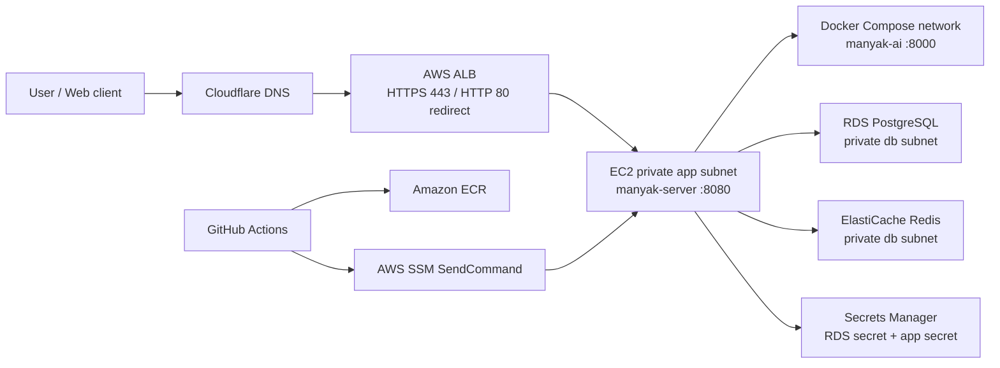

# 7-DEPLOYMENT

이 문서는 마냑 서비스의 배포 단위, 운영 인프라, CI/CD, 런타임 설정, 검수와 롤백 기준을 정의합니다. 운영 배포 기준은 `manyak-terraform`, 로컬 통합 실행 기준은 `manyak-infra`, 서비스별 빌드와 배포 트리거는 `manyak-server`, `manyak-ai`, `manyak-web` 레포지토리의 현재 구현을 따릅니다.

```text
§7-1  목적과 범위
§7-2  기준 레포지토리와 책임 경계
§7-3  환경 구분과 배포 단위
§7-4  운영 인프라 아키텍처
§7-5  이미지 빌드와 CI/CD
§7-6  런타임 설정과 시크릿
§7-7  운영 배포 절차
§7-8  로컬·통합 실행
§7-9  검수, 관측, 롤백
§7-10 Jira·PR 추적 근거
§7-11 미정·주의 항목
```

| 항목 | 값 |
| --- | --- |
| 버전 | v0.2 |
| 작성일 | 2026-07-03 |
| 수정일 | 2026-07-04 |
| 대상 | 마냑 운영·개발·통합 배포 |
| 작성 목적 | 배포 책임 경계, 인프라 구성, 배포 절차, 검수·롤백 기준을 정의합니다. |
| 기준 문서 | [`4-backend.md`](./4-backend.md), [`5-ai-server.md`](./5-ai-server.md), [`6-analytics.md`](./6-analytics.md) |
| 기준 코드 | `../manyak-terraform` dev `447c8fc`, `../manyak-infra` dev `6c892b9`, `../manyak-server` dev `f106b8e`, `../manyak-ai` dev `cddda1f`, `../manyak-web` dev `0fac4bd` |

## 7-1. 목적과 범위

### 목적

이 문서는 다음 질문에 답하기 위한 운영 스펙입니다.

1. 어떤 레포지토리가 어떤 배포 책임을 갖는가?
2. 운영 AWS 인프라는 어떤 리소스로 구성되는가?
3. `dev`, `main`, release tag가 어떤 이미지와 배포를 만드는가?
4. 런타임 환경변수와 시크릿은 어디에서 생성되고 어떻게 주입되는가?
5. 배포 성공, 장애 감지, 롤백은 무엇을 기준으로 판단하는가?

### 포함 범위

- 운영 AWS 인프라: VPC, 보안 그룹, EC2, ALB, ACM, Cloudflare DNS, ECR, RDS PostgreSQL, ElastiCache Redis, Secrets Manager, SSM, GitHub OIDC
- 서비스 이미지 빌드와 레지스트리: GHCR, ECR, multi-arch 이미지 태그
- 운영 배포 파이프라인: `manyak-server`와 `manyak-ai`의 `main` 배포
- 프론트엔드 이미지 릴리스: `manyak-web`의 GHCR `dev` 이미지와 tag 기반 release 이미지
- 로컬·통합 실행: `manyak-infra` Docker Compose
- 검수, 관측, 롤백, 시크릿 회전 기준
- 배포 관련 Jira 키와 GitHub PR 근거

### 제외 범위

- 화면 요구사항과 UX 검수: [`3-frontend.md`](./3-frontend.md)
- API, 데이터 모델, 인증, 오류 처리: [`4-backend.md`](./4-backend.md)
- AI 프롬프트와 요청·응답 계약: [`5-ai-server.md`](./5-ai-server.md)
- 이벤트·지표·관측 수집 정책: [`6-analytics.md`](./6-analytics.md)
- 실제 secret 값, 로컬 `.env`, `terraform.tfvars`, `backend.hcl`, Terraform state
- 운영 웹 호스팅의 외부 플랫폼 설정. 현재 확인한 Terraform에는 `manyak-web` 운영 호스팅 리소스가 없습니다.

### 확인 방식

Jira 원문은 사내 Jira가 소유합니다. 이 문서는 GitHub PR 제목·본문에 연결된 `KNK-*` 키, 병합된 코드, 레포지토리 문서를 근거로 배포 스펙을 정리합니다. 실제 Jira 필드와 이 문서가 다르면 해당 Jira와 병합 PR을 함께 확인해야 합니다.

### 작성 원칙

- 운영 배포 동작은 `manyak-terraform`의 운영 Terraform, SSM 문서, `deploy.sh`, `docker-compose.prod.yml`을 우선 기준으로 씁니다.
- 서비스별 이미지 빌드와 배포 트리거는 각 서비스 레포의 GitHub Actions workflow와 Dockerfile을 기준으로 씁니다.
- 로컬·통합 실행은 `manyak-infra`의 Docker Compose와 `.env.example`을 기준으로 씁니다.
- 문서, PR 설명, 코드가 다르면 병합된 코드를 기준으로 하고 차이는 [§7-11](#7-11-미정주의-항목)에 기록합니다.
- 실제 secret 값, 로컬 전용 설정, Terraform state, 사용자 입력 원문은 예시에도 넣지 않습니다.
- 운영 웹 호스팅처럼 구현 근거가 없는 영역은 추정하지 않고 `미정`으로 표기합니다.

## 7-2. 기준 레포지토리와 책임 경계

| 레포지토리 | 배포 책임 | 주요 근거 |
| --- | --- | --- |
| `knk-harness` | 제품·스펙 문서 정본 | `docs/product-specs/` |
| `manyak-terraform` | 운영 AWS IaC와 운영 compose 원본 | `terraform/envs/prod`, `terraform/modules`, `docker-compose.prod.yml` |
| `manyak-infra` | 로컬·통합 Docker Compose 실행 | `docker-compose.yml`, `.env.example`, `README.md` |
| `manyak-server` | 백엔드 이미지 빌드, 운영 server 배포, API 헬스 스모크 | `.github/workflows/docker-image.yml`, `Dockerfile`, `application-prod.yml` |
| `manyak-ai` | AI 이미지 빌드, 운영 AI 배포, AI 헬스 게이트 | `.github/workflows/docker-image.yml`, `Dockerfile`, `src/api/v1/health.py` |
| `manyak-web` | Next.js 이미지 빌드, GHCR dev/release 이미지 발행 | `.github/workflows/docker-image.yml`, `.github/workflows/release.yml`, `Dockerfile` |

### 책임 경계

- 운영 AWS 리소스 생성·변경은 `manyak-terraform`에서 수행합니다.
- 운영 `server`와 `ai` 컨테이너 이미지는 각 서비스 레포의 `main` push가 ECR로 푸시하고 SSM으로 배포합니다.
- 운영 `web` 호스팅은 현재 확인한 `manyak-terraform`에 정의되어 있지 않습니다. `manyak-web`은 GHCR 이미지 발행까지만 코드로 정의합니다.
- 로컬 통합 실행은 `manyak-infra`가 GHCR `dev` 이미지를 pull해 실행합니다. 서비스 소스코드는 이 레포에서 빌드하지 않습니다.

## 7-3. 환경 구분과 배포 단위

| 환경 | 목적 | 배포 단위 | 레지스트리·태그 | 실행 위치 |
| --- | --- | --- | --- | --- |
| 운영 `prod` | 실제 사용자 API·AI 운영 | `manyak-server`, `manyak-ai` | ECR `latest`, `<short-sha>` | AWS EC2의 Docker Compose |
| 개발 이미지 `dev` | 통합 실행과 개발 검증 | `manyak-server`, `manyak-ai`, `manyak-web` | GHCR `dev`, `<short-sha>` | `manyak-infra` Compose 또는 개별 실행 |
| 웹 릴리스 이미지 | 프론트엔드 버전 릴리스 | `manyak-web` | GHCR `{version}`, `{major}.{minor}`, `latest` | 현재 운영 호스팅 리소스는 미정 |
| 로컬·통합 | 전체 스택 수동 검증 | server, web, ai, postgres, redis | GHCR `dev`, Docker Hub DB·Redis | 개발자 Docker Compose |

### 운영 공개 엔드포인트

| 엔드포인트 | 소유 서비스 | 용도 | 공개 여부 |
| --- | --- | --- | --- |
| `https://api.manyak.app` | `manyak-server` | 백엔드 API와 헬스체크 | 공개 |
| `http://ai:8000` | `manyak-ai` | server에서 호출하는 compose 내부 AI API | 비공개 |
| `https://manyak.app`, `https://www.manyak.app` | `manyak-web` | 프론트엔드 origin으로 CORS 허용 | 운영 호스팅 스택은 현재 미정 |

## 7-4. 운영 인프라 아키텍처



### 네트워크

| 항목 | 현재 값·정책 |
| --- | --- |
| 리전 | `ap-northeast-2` |
| VPC | `10.0.0.0/16` |
| AZ | `ap-northeast-2a`, `ap-northeast-2c` |
| 서브넷 | 2 AZ x `public`, `app`, `db` |
| NAT | MVP 비용 절감을 위해 단일 NAT Gateway |
| DB 계층 | 인터넷 라우트 없는 isolated subnet |
| S3 Gateway Endpoint | app route table에 연결해 S3/ECR 레이어 트래픽 NAT 우회 |

### 보안 그룹과 접근

| 체인 | 허용 |
| --- | --- |
| Internet -> ALB | TCP 80, 443 |
| ALB -> App EC2 | TCP 8080 |
| App EC2 -> RDS | TCP 5432 |
| App EC2 -> Redis | TCP 6379 |
| App EC2 outbound | ECR, SSM, CloudWatch, LLM API, DB, Redis 접근을 위해 전체 outbound 허용 |
| RDS·Redis egress | 별도 egress 없음. App에서 들어온 연결 응답만 stateful하게 허용 |
| 운영 접속 | SSH 22 미개방. SSM Session Manager 사용 |

### 컴퓨트와 엣지

| 항목 | 현재 값·정책 |
| --- | --- |
| EC2 | Amazon Linux 2023, `t3.small`, private app subnet 2a |
| 배포 위치 | `/opt/manyak/docker-compose.yml`, `/opt/manyak/.env`, `/opt/manyak/deploy.sh` |
| Compose 서비스 | `server`, `ai` |
| ALB target group | instance target, HTTP 8080, health path `/actuator/health` |
| TLS | ALB가 ACM 인증서로 종단 |
| DNS | Cloudflare `api.manyak.app` CNAME -> ALB DNS, `proxied=false` |
| user-data 변경 | `user_data_replace_on_change=true`라 apply 시 EC2 교체와 짧은 다운타임 가능 |

### 데이터 계층

| 항목 | 현재 값·정책 |
| --- | --- |
| RDS | PostgreSQL 16, `db.t3.micro`, gp3 20GB, storage encrypted |
| DB 이름·사용자 | `manyak` |
| DB 비밀번호 | RDS `manage_master_user_password`로 Secrets Manager가 자동 생성·관리 |
| RDS 배치 | 단일 AZ 2a, subnet group은 2 AZ |
| 백업 | 7일 |
| 삭제 보호 | MVP 기준 false |
| Redis | ElastiCache Redis 7.1, `cache.t3.micro`, 단일 노드 |

### DB 비밀번호 로테이션 재동기화

RDS 관리형 마스터 비밀번호는 자동 로테이션될 수 있지만, EC2의 `/opt/manyak/.env`는 `deploy.sh` 실행 시점의 스냅샷입니다. `manyak-terraform`은 KNK-359에서 EventBridge 5분 스케줄과 전용 SSM 문서 `manyak-prod-db-creds-resync`를 추가했습니다.

- SSM 문서는 secret 값이 아니라 AWSCURRENT 버전 id만 비교합니다.
- 버전 id가 바뀌면 `/opt/manyak/deploy.sh`를 override 없이 실행해 `.env`를 재생성합니다. 이 경로는 server를 pull/up하고, ECR에 AI 이미지가 있으면 AI도 `up -d --wait` healthcheck gate를 탑니다.
- 평시에는 no-op이며, 첫 적용 직후에는 상태 파일이 없어 같은 no-override 동기화가 1회 일어날 수 있습니다.

### 이미지 자산 저장·서빙 — `Phase 1 · 계획`

팀 사전 제작 프리셋 자산(썸네일·채팅 배경·캐릭터 — [`4-backend.md §4-3-9`](./4-backend.md))을 위한 정적 자산 계층입니다. **사용자 업로드는 없습니다** — 회원 presigned 업로드 경로는 이미지 정책 개정(2026-07-07, [`4-backend.md §4-8`](./4-backend.md) B10)으로 계약에서 빠졌고, 업로드 주체는 운영(시드)뿐입니다. 현재 Terraform에는 없으며, Phase 1 이미지 기능 구현과 함께 추가합니다.

| 항목 | 방향 |
| --- | --- |
| 저장소 | 비공개 S3 버킷 1개(+ CloudFront OAC). prefix로 구분 — `thumbnails/` · `backgrounds/` · `characters/`([`4-backend.md §4-3-9`](./4-backend.md) 자산 카탈로그) |
| 업로드 경로 | 운영 시드 전용 — 자산 파일은 S3에 직접 업로드하고, 카탈로그 등재는 시드 매니페스트 검증을 거칩니다(검증 위반은 시드 실패 — [`4-backend.md §4-3-9`](./4-backend.md)). 클라이언트 업로드 API·presigned URL 발급은 없습니다. 후속에 사용자 업로드류 기능이 도입되면 같은 버킷·CDN 기반을 재사용합니다 |
| 서빙 경로 | CDN(CloudFront) 배포가 버킷을 origin으로 공개 서빙. `imageKey` → 서빙 URL 변환은 백엔드 소유, 객체 키는 불변(교체는 새 키 — 장기 캐시 전제). CDN 도메인·캐시 정책 수치는 `계획` |
| 권한 | EC2 인스턴스 role에 해당 버킷 읽기 권한 추가(presigned 발급 권한 불필요) |
| 소유 | S3·CloudFront·IAM 리소스 정의는 `manyak-terraform` 소유. 이 문서는 경계와 경로만 고정 |

## 7-5. 이미지 빌드와 CI/CD

### 레지스트리와 태그

| 서비스 | 개발 이미지 | 운영 이미지 | 태그 정책 |
| --- | --- | --- | --- |
| `manyak-server` | `ghcr.io/kim-n-kang/manyak-server` | ECR `manyak-server` | dev: `dev`, `<short-sha>` / prod: `latest`, `<short-sha>` |
| `manyak-ai` | `ghcr.io/kim-n-kang/manyak-ai` | ECR `manyak-ai` | dev: `dev`, `<short-sha>` / prod: `latest`, `<short-sha>` |
| `manyak-web` | `ghcr.io/kim-n-kang/manyak-web` | 현재 ECR 없음 | dev: `dev`, `<short-sha>` / release tag: `{version}`, `{major}.{minor}`, `latest` |

### `manyak-server` CI/CD

| 트리거 | 동작 |
| --- | --- |
| PR -> `dev` | Java 21, Gradle test, multi-arch Docker build 검증 |
| push -> `dev` | 테스트 후 GHCR `dev`, `<short-sha>` push |
| push -> `main` | 테스트 후 ECR `latest`, `<short-sha>` push, SSM으로 server 배포, 외부 헬스 스모크 |

운영 배포는 다음 순서입니다.

1. workflow가 GitHub OIDC로 `vars.AWS_ROLE_ARN` 역할을 assume합니다.
2. ECR에 `manyak-server:<short-sha>`와 `latest`를 push합니다.
3. 최신 `main` SHA가 아니면 stale 배포를 건너뜁니다.
4. `Project=manyak`, `Name=manyak-prod-app`, `running` 태그로 EC2를 찾습니다.
5. SSM `AWS-RunShellScript`로 `SERVER_IMAGE_OVERRIDE=<ECR short-sha image> bash /opt/manyak/deploy.sh`를 실행합니다.
6. `https://api.manyak.app/actuator/health`가 `{"status":"UP"}`를 반환할 때까지 폴링합니다.

### `manyak-ai` CI/CD

| 트리거 | 동작 |
| --- | --- |
| PR -> `dev` | Python 3.11, `pytest`, multi-arch Docker build 검증 |
| push -> `dev` | 테스트 후 GHCR `dev`, `<short-sha>` push |
| push -> `main` | 테스트 후 ECR `latest`, `<short-sha>` push, 전용 SSM 문서로 AI 배포 |

운영 AI 배포는 `manyak-prod-ai-deploy` SSM 문서를 사용합니다.

1. workflow가 GitHub OIDC로 AI 전용 `vars.AWS_ROLE_ARN` 역할을 assume합니다.
2. ECR에 `manyak-ai:<short-sha>`와 `latest`를 push합니다.
3. 최신 `main` SHA가 아니면 stale 배포를 건너뜁니다.
4. SSM 문서에 `ImageUri=<ECR manyak-ai short-sha image>` 파라미터를 전달합니다.
5. 문서가 EC2에서 `AI_IMAGE_OVERRIDE='{{ImageUri}}' bash /opt/manyak/deploy.sh`를 실행합니다.
6. `deploy.sh`가 `docker compose up -d --wait ai`로 AI 컨테이너 healthcheck 통과까지 대기합니다. SendCommand 성공은 배포와 AI health 통과를 의미합니다.

### `manyak-web` CI/CD

| 트리거 | 동작 |
| --- | --- |
| PR -> `dev` | pnpm install, lint, typecheck, Docker build 검증 |
| push -> `dev` | GHCR `dev`, `<short-sha>` push |
| push tag `v*` | GHCR release image push. 현재 build arg는 `NEXT_PUBLIC_AMPLITUDE_API_KEY`와 `NEXT_PUBLIC_APP_VERSION`만 주입 |

현재 확인한 운영 Terraform에는 `manyak-web` 컨테이너를 운영 호스팅에 배포하는 리소스가 없습니다. `manyak-web` release PR들은 GHCR release image 발행과 외부 호스팅 반영을 전제로 합니다.

Web Sentry 코드는 `NEXT_PUBLIC_SENTRY_DSN`을 읽지만, 현재 `manyak-web` release workflow와 Dockerfile은 이 값을 build arg로 주입하지 않습니다. 따라서 운영 웹 Sentry 이벤트 수집은 호스팅·빌드 경로가 DSN 주입 방식을 확정한 뒤 활성 상태로 간주합니다.

### EC2 `deploy.sh` 공통 규칙

- 모든 배포 호출은 EC2의 `flock`으로 직렬화합니다. server와 ai는 서로 다른 GitHub 레포라 workflow concurrency만으로는 동시 배포를 막을 수 없습니다.
- 매 실행마다 Secrets Manager를 다시 읽고 `/opt/manyak/.env`를 재생성합니다.
- `SERVER_IMAGE_OVERRIDE`가 있으면 server만 pull/up 합니다.
- `AI_IMAGE_OVERRIDE`가 있으면 ai만 pull/up 하고 `--wait`로 health를 확인합니다.
- override가 없으면 server를 기동하고, ECR에 AI 이미지가 존재할 때만 ai를 함께 기동합니다.
- 한 서비스만 배포할 때 다른 서비스 이미지가 `latest`로 덮이지 않도록 기존 `.env`의 이미지 좌표를 보존합니다.

## 7-6. 런타임 설정과 시크릿

### GitHub 설정

| 레포 | 설정 | 용도 |
| --- | --- | --- |
| `manyak-server` | repository variable `AWS_ROLE_ARN` | server ECR push와 SSM 배포용 OIDC role ARN |
| `manyak-ai` | repository variable `AWS_ROLE_ARN` | AI ECR push와 전용 SSM 배포용 OIDC role ARN |
| `manyak-web` | repository secret `AMPLITUDE_API_KEY` | tag release 이미지 빌드 시 `NEXT_PUBLIC_AMPLITUDE_API_KEY` 주입 |

`AWS_ROLE_ARN` 값은 `manyak-terraform/terraform/envs/prod` output에서 확인합니다.

`manyak-web`의 `NEXT_PUBLIC_SENTRY_DSN`은 코드가 참조하지만 현재 release workflow 입력으로 정의되어 있지 않습니다.

### Secrets Manager

`manyak-terraform`은 앱 시크릿 컨테이너 `manyak/prod/app`만 만들고, 실제 값은 콘솔 또는 CLI로 별도 입력합니다. 실제 secret 값은 문서나 레포지토리에 넣지 않습니다.

| 키 | 필수 | 주입 대상 | 설명 |
| --- | --- | --- | --- |
| `SERVER_SENTRY_DSN` | 아니오 | server `SENTRY_DSN` | 백엔드 Sentry DSN. 비우면 Sentry 비활성 |
| `AI_SENTRY_DSN` | 아니오 | ai `SENTRY_DSN` | AI Sentry DSN. 비우면 Sentry 비활성 |
| `MANYAK_SLACK_FEEDBACK_WEBHOOK_URL` | 아니오 | server | 피드백 Slack 알림. 비우면 발송 생략 |
| `MANYAK_ANALYTICS_ANONYMOUS_ID_PEPPER` | 아니오 | server | 현재 Terraform과 infra가 주입하는 pepper 키. 서버 코드는 새 `MANYAK_ANALYTICS_DEVICE_ID_PEPPER`를 먼저 보고 이 키를 fallback으로 인식합니다. |
| `DEEPSEEK_API_KEY` | 예(AI) | ai | AI 서버 기동 필수 secret |
| `MANYAK_AUTH_JWT_SECRET` | 예(server) | server | access JWT HS256 서명·검증 키. 미주입 또는 빈 값이면 server 부팅 실패 |
| `MANYAK_GOOGLE_CLIENT_IDS` | 로그인 사용 시 예 | server | 허용할 Google OAuth client-id 목록. 비우면 모든 Google 로그인 토큰 거부 |

`aws secretsmanager put-secret-value`는 secret 전체를 덮어씁니다. 일부 키만 바꿀 때도 기존 키를 모두 포함해야 합니다.

시크릿 값을 바꾼 뒤에는 해당 값을 소비하는 서비스를 재기동해야 합니다. GitHub workflow 배포는 `SERVER_IMAGE_OVERRIDE` 또는 `AI_IMAGE_OVERRIDE`가 가리키는 서비스만 재기동합니다. `SERVER_SENTRY_DSN`, `MANYAK_AUTH_JWT_SECRET`, `MANYAK_GOOGLE_CLIENT_IDS`, Slack webhook, analytics pepper는 server 재배포로 반영합니다. `DEEPSEEK_API_KEY`, `AI_SENTRY_DSN`은 AI 재배포로 반영합니다. 두 서비스를 동시에 반영하려면 SSM에서 override 없이 `bash /opt/manyak/deploy.sh`를 실행합니다.

### EC2 `.env` 생성 결과

`deploy.sh`는 RDS managed secret과 앱 secret을 읽어 `/opt/manyak/.env`를 생성합니다.

| 환경변수 | 소비 서비스 | 출처 |
| --- | --- | --- |
| `SERVER_IMAGE` | compose | Terraform 기본 이미지 또는 server workflow override |
| `AI_IMAGE` | compose | Terraform 기본 이미지 또는 AI workflow override |
| `MANYAK_DB_URL` | server | Terraform RDS endpoint, port, DB 이름 |
| `MANYAK_DB_USERNAME`, `MANYAK_DB_PASSWORD` | server | RDS managed secret |
| `SENTRY_DSN`, `SENTRY_ENVIRONMENT` | server | 앱 secret, Terraform environment |
| `AI_SENTRY_DSN`, `SENTRY_ENVIRONMENT` | ai | 앱 secret, Terraform environment |
| `MANYAK_SLACK_FEEDBACK_WEBHOOK_URL` | server | 앱 secret |
| `MANYAK_ANALYTICS_ANONYMOUS_ID_PEPPER` | server | 앱 secret |
| `DEEPSEEK_API_KEY` | ai | 앱 secret |
| `MANYAK_AUTH_JWT_SECRET`, `MANYAK_GOOGLE_CLIENT_IDS` | server | 앱 secret |
| `MANYAK_CORS_ALLOWED_ORIGINS` | server | Terraform `https://manyak.app,https://www.manyak.app` |
| `SPRING_DATA_REDIS_HOST`, `SPRING_DATA_REDIS_PORT` | server | ElastiCache endpoint, port |

현재 server 코드는 `MANYAK_ANALYTICS_DEVICE_ID_PEPPER`를 우선하고 `MANYAK_ANALYTICS_ANONYMOUS_ID_PEPPER`를 fallback으로 읽습니다. Terraform과 infra는 아직 fallback 키를 주입하므로, 배포 스펙에서는 현재 주입 키와 코드 우선순위를 함께 기록합니다.

## 7-7. 운영 배포 절차

### 최초 인프라 준비

1. `manyak-terraform/terraform/bootstrap`에서 원격 state S3 backend를 준비합니다.
2. `manyak-terraform/terraform/envs/prod`에서 `backend.hcl`과 `terraform.tfvars`를 로컬에 작성합니다. 이 파일들은 커밋하지 않습니다.
3. `terraform init -reconfigure -backend-config=backend.hcl`을 실행합니다.
4. `terraform plan`으로 변경 범위를 확인합니다.
5. 운영 반영이 승인되면 `terraform apply`를 실행합니다.
6. Terraform output의 server·AI GitHub Actions role ARN을 각 앱 레포의 `AWS_ROLE_ARN` variable에 등록합니다.
7. `manyak/prod/app` secret에 필요한 키를 모두 포함해 실제 값을 입력합니다.

### 일반 server 배포

1. `manyak-server` 변경을 `dev`에 병합해 GHCR `dev` 이미지를 검증합니다.
2. release branch를 `main`에 merge commit으로 병합합니다.
3. `main` push workflow가 ECR 이미지를 만들고 SSM으로 server를 배포합니다.
4. workflow의 `/actuator/health` 스모크가 `UP`인지 확인합니다.
5. 필요하면 `manyak-server/http/smoke-prod.http`로 수동 검증합니다.

### 일반 AI 배포

1. `manyak-ai` 변경을 `dev`에 병합해 GHCR `dev` 이미지를 검증합니다.
2. release branch를 `main`에 merge commit으로 병합합니다.
3. `main` push workflow가 ECR 이미지를 만들고 전용 SSM 문서로 AI를 배포합니다.
4. SendCommand 성공을 확인합니다. 현재 AI 배포는 전용 문서가 내부 healthcheck까지 수행하므로 별도 외부 smoke endpoint가 없습니다.

### Terraform 변경 배포

1. `terraform fmt -recursive -check`와 `terraform validate`를 먼저 실행합니다.
2. `terraform plan`에서 리소스 추가·변경·삭제와 EC2 교체 여부를 확인합니다.
3. `user-data`, `docker-compose.prod.yml`, CORS, Redis 주입처럼 compute template에 영향을 주는 변경은 EC2 교체와 짧은 다운타임을 수반할 수 있습니다.
4. `apply` 후 `https://api.manyak.app/actuator/health`와 SSM/CloudWatch/Sentry 상태를 확인합니다.

### Web release 이미지 배포

1. `manyak-web` 변경을 `dev`에 병합해 GHCR `dev` 이미지를 검증합니다.
2. release tag `v*`를 push하면 `release.yml`이 GHCR release 이미지를 빌드합니다.
3. 현재 이 문서 기준으로 운영 웹 호스팅 반영 절차는 코드화되어 있지 않습니다. 별도 호스팅 플랫폼 또는 인프라 문서가 정해지면 이 절차를 갱신합니다.

## 7-8. 로컬·통합 실행

`manyak-infra`는 GHCR에 publish된 `dev` 이미지를 실행하는 통합 환경입니다. 서비스 소스코드를 빌드하지 않습니다.

| 서비스 | 이미지 | 용도 |
| --- | --- | --- |
| `manyak-server` | `ghcr.io/kim-n-kang/manyak-server:dev` | 백엔드 API |
| `manyak-web` | `ghcr.io/kim-n-kang/manyak-web:dev` | Next.js 웹 |
| `manyak-ai` | `ghcr.io/kim-n-kang/manyak-ai:dev` | AI API |
| `postgres` | `postgres:16-alpine` | 로컬 DB |
| `redis` | `redis:7-alpine` | refresh token 저장소 등 |

### 실행

```sh
cd ../manyak-infra
cp .env.example .env
docker login ghcr.io
docker compose pull
docker compose up -d
docker compose ps
```

### 기본 로컬 URL

| URL | 용도 |
| --- | --- |
| `http://localhost:3000` | Web |
| `http://localhost:8080/actuator/health` | Server health |
| `http://localhost:8000/api/v1/health` | AI health |

### 로컬 환경변수 기준

- `API_BASE_URL`은 web 컨테이너가 server 컨테이너를 호출하는 URL입니다. Compose 내부 기본값은 `http://manyak-server:8080`입니다.
- `MANYAK_AI_BASE_URL`은 server가 AI를 호출하는 URL입니다. Compose 내부 기본값은 `http://manyak-ai:8000`입니다.
- `MANYAK_AI_CHAT_STUB=false`가 통합 실행 기본값입니다. AI 없이 server만 빠르게 확인하려면 `true`로 바꿀 수 있습니다.
- `NEXT_PUBLIC_*` 값은 web 이미지 빌드 시점에 반영됩니다. `manyak-infra` Compose 실행 시점에는 주입하지 않습니다.
- 실제 secret 값은 `.env`에만 두고 커밋하지 않습니다.

## 7-9. 검수, 관측, 롤백

### 배포 전 검수

| 대상 | 필수 검수 |
| --- | --- |
| Terraform | `terraform fmt -recursive -check`, `terraform validate`, `terraform plan` |
| server | `./gradlew test`, Docker build workflow, 운영 health smoke |
| AI | `pytest`, Docker build workflow, AI healthcheck |
| web | `pnpm lint`, `pnpm typecheck`, Docker build workflow, tag release build |
| infra Compose | `docker compose config`, 필요 시 `docker compose up -d`와 health 확인 |

### 운영 헬스체크

| 서비스 | 기준 |
| --- | --- |
| server | `GET https://api.manyak.app/actuator/health`가 200과 `status=UP`을 반환 |
| server liveness | `GET https://api.manyak.app/actuator/health/liveness`가 200 반환 |
| AI | 컨테이너 healthcheck가 `GET http://localhost:8000/api/v1/health`의 `status=ok` 확인 |
| ALB | target group health path `/actuator/health` |

현재 `manyak-server`의 운영 profile은 Redis endpoint를 주입받지만, 기준 코드에서는 `management.health.redis.enabled=false`입니다. Redis가 실제 장애 감지에 포함되는지 여부는 별도 후속에서 다시 확인해야 합니다.

### Definition of Done

배포는 다음 조건을 만족할 때 완료로 봅니다.

- 변경 대상 레포의 필수 테스트와 Docker build 검증이 통과해야 합니다.
- 운영 server·AI 배포는 ECR에 `latest`와 `<short-sha>` 태그가 존재하고, GitHub Actions가 최신 `main` SHA 기준으로 SSM 배포를 실행해야 합니다.
- server 배포는 외부 `https://api.manyak.app/actuator/health`가 200과 `status=UP`을 반환해야 합니다.
- AI 배포는 `docker compose up -d --wait ai`가 성공하고 컨테이너 healthcheck가 `status=ok`를 확인해야 합니다.
- Terraform 변경은 `terraform plan` 리뷰 후 적용해야 하며, 적용 후 대상 리소스, SSM 문서, ALB target group health 중 변경 영향이 있는 항목을 확인해야 합니다.
- 시크릿 변경은 해당 값을 소비하는 서비스 재기동까지 완료해야 반영된 것으로 봅니다.
- `web` release는 GHCR release 이미지 태그가 발행되어야 합니다. 운영 호스팅 반영은 현재 스펙상 별도 외부 절차로 확인합니다.
- 롤백 기준 이미지 태그 또는 DB 복구 계획을 배포 전 확인해야 합니다. Flyway 마이그레이션은 전진 전용으로 취급합니다.

### 관측

- server는 구조화 로그, Sentry, `ai_call_logs`, Actuator health를 사용합니다.
- AI는 Sentry와 request correlation middleware를 사용합니다.
- web은 Amplitude, API 오류 캡처, Sentry 연동 코드를 사용합니다. 단, 현재 release 이미지에는 `NEXT_PUBLIC_SENTRY_DSN` 주입 경로가 정의되어 있지 않아 운영 Sentry 수집은 미정입니다.
- `X-Manyak-Request-Id`, `X-Manyak-Session-Id`, `X-Manyak-Device-Id-Hash` 계열은 server와 AI 관측 연결에 사용합니다.
- 운영 Swagger UI와 OpenAPI 문서는 비공개입니다. 해당 경로는 운영에서 404여야 합니다.

### 롤백

| 상황 | 기준 롤백 |
| --- | --- |
| server 이미지 문제 | ECR에 직전 정상 `<short-sha>` 태그가 남아 있으면 해당 이미지를 `/opt/manyak/.env`의 `SERVER_IMAGE`에 반영하고 `docker compose pull server && docker compose up -d server` 실행 |
| AI 이미지 문제 | ECR에 직전 정상 `<short-sha>` 태그가 남아 있으면 해당 이미지를 `/opt/manyak/.env`의 `AI_IMAGE`에 반영하고 `docker compose pull ai && docker compose up -d --wait ai` 실행 |
| main release 문제 | revert PR 또는 이전 정상 커밋을 release합니다. 단, 이미 실행된 Flyway 마이그레이션은 전진 전용으로 취급합니다. |
| DB 마이그레이션 문제 | 보상 마이그레이션 또는 RDS snapshot 복구가 필요합니다. 파괴적 스키마 변경은 배포 직전 snapshot을 남깁니다. |
| Terraform user-data 문제 | Terraform revert apply가 EC2 교체를 유발할 수 있습니다. 다운타임 창을 잡고 plan을 먼저 확인합니다. |

ECR은 태그가 붙은 이미지를 레포지토리별 최신 10개만 보존합니다. 보존 범위를 벗어난 버전으로 되돌릴 때는 해당 커밋을 다시 release해 새 이미지를 만들거나 이미지를 재푸시해야 합니다.

## 7-10. Jira·PR 추적 근거

### 운영 AWS 배포 기반

| Jira 키 | PR | 배포상 의미 |
| --- | --- | --- |
| KNK-234 | [manyak-server #44](https://github.com/KIM-N-KANG/manyak-server/pull/44) | 컨테이너 healthcheck, prod profile, 아키텍처 문서 |
| KNK-235 | [manyak-server #45](https://github.com/KIM-N-KANG/manyak-server/pull/45) | Terraform bootstrap, S3 remote state 토대 |
| KNK-236 | [manyak-server #46](https://github.com/KIM-N-KANG/manyak-server/pull/46) | ECR, GitHub OIDC, dev=GHCR/main=ECR |
| KNK-237 | [manyak-server #47](https://github.com/KIM-N-KANG/manyak-server/pull/47) | VPC 3계층 네트워크 |
| KNK-238 | [manyak-server #48](https://github.com/KIM-N-KANG/manyak-server/pull/48) | SG 체인, EC2 IAM, SSH 미개방 |
| KNK-239 | [manyak-server #50](https://github.com/KIM-N-KANG/manyak-server/pull/50) | RDS PostgreSQL, ElastiCache Redis |
| KNK-240 | [manyak-server #51](https://github.com/KIM-N-KANG/manyak-server/pull/51) | EC2, Docker Compose, ALB, ACM, Cloudflare DNS |
| KNK-241 | [manyak-server #52](https://github.com/KIM-N-KANG/manyak-server/pull/52) | Secrets Manager, `deploy.sh`, SSM deploy, health smoke |

### 운영 보강과 장애 대응

| Jira 키 | PR | 배포상 의미 |
| --- | --- | --- |
| KNK-250 | [manyak-server #54](https://github.com/KIM-N-KANG/manyak-server/pull/54) | server/AI Sentry DSN 분리, analytics pepper 배선 |
| KNK-253 | [manyak-server #56](https://github.com/KIM-N-KANG/manyak-server/pull/56) | Cloudflare provider `content` 인자 전환 |
| KNK-258 | [manyak-server #59](https://github.com/KIM-N-KANG/manyak-server/pull/59) | GitHub OIDC owner 대소문자 정정 |
| KNK-260 | [manyak-server #60](https://github.com/KIM-N-KANG/manyak-server/pull/60) | 운영 AI 컨테이너 배선, AI 전용 OIDC role, `flock` |
| KNK-268 | [manyak-server #64](https://github.com/KIM-N-KANG/manyak-server/pull/64) | AI Sentry environment 주입 |
| KNK-284 | [manyak-server #75](https://github.com/KIM-N-KANG/manyak-server/pull/75) | 운영 ElastiCache endpoint 주입 |
| KNK-294 | [manyak-server #77](https://github.com/KIM-N-KANG/manyak-server/pull/77) | 운영 CORS 허용 origin 주입 |
| KNK-296 | [manyak-server #79](https://github.com/KIM-N-KANG/manyak-server/pull/79) | 운영 Terraform을 `manyak-terraform`으로 분리 |
| KNK-321 | [manyak-server #81](https://github.com/KIM-N-KANG/manyak-server/pull/81) | 운영 Swagger·OpenAPI 비공개화 |
| KNK-287 | [manyak-terraform #2](https://github.com/KIM-N-KANG/manyak-terraform/pull/2) | 운영 인증 env 주입 |
| KNK-359 | [manyak-terraform #3](https://github.com/KIM-N-KANG/manyak-terraform/pull/3) | DB 비밀번호 로테이션 후 `.env` 자동 재동기화 |

### 서비스 이미지와 통합 실행

| Jira 키 | PR | 배포상 의미 |
| --- | --- | --- |
| KNK-120 | [manyak-web #1](https://github.com/KIM-N-KANG/manyak-web/pull/1) | web Dockerfile, GHCR dev workflow |
| KNK-121 | [manyak-ai #3](https://github.com/KIM-N-KANG/manyak-ai/pull/3) | AI Dockerfile 검증, GHCR dev workflow |
| KNK-122 | [manyak-infra #1](https://github.com/KIM-N-KANG/manyak-infra/pull/1) | GHCR dev 이미지 기반 통합 Compose |
| KNK-130 | [manyak-server #7](https://github.com/KIM-N-KANG/manyak-server/pull/7) | server multi-arch GHCR |
| KNK-131 | [manyak-web #2](https://github.com/KIM-N-KANG/manyak-web/pull/2) | web multi-arch GHCR |
| KNK-132 | [manyak-ai #5](https://github.com/KIM-N-KANG/manyak-ai/pull/5) | AI multi-arch GHCR |
| KNK-133 | [manyak-infra #2](https://github.com/KIM-N-KANG/manyak-infra/pull/2) | Apple Silicon platform workaround 제거 |
| KNK-151 | [manyak-infra #5](https://github.com/KIM-N-KANG/manyak-infra/pull/5) | web `API_BASE_URL` 주입 |
| KNK-184 | [manyak-infra #6](https://github.com/KIM-N-KANG/manyak-infra/pull/6) | server AI stub 비활성화 |
| KNK-201 | [manyak-infra #7](https://github.com/KIM-N-KANG/manyak-infra/pull/7) | Slack webhook env 반영 |
| KNK-214 | [manyak-infra #8](https://github.com/KIM-N-KANG/manyak-infra/pull/8) | AI 환경변수 Upstage에서 DeepSeek로 전환 |
| KNK-297 | [manyak-infra #9](https://github.com/KIM-N-KANG/manyak-infra/pull/9) | Redis, JWT, Google, analytics env 최신화 |

### 릴리스와 lockstep

| Jira 키 | PR | 배포상 의미 |
| --- | --- | --- |
| KNK-255 | [manyak-server #58](https://github.com/KIM-N-KANG/manyak-server/pull/58) | server v0.1.0 첫 운영 배포 |
| KNK-264 | [manyak-server #62](https://github.com/KIM-N-KANG/manyak-server/pull/62) | server v0.1.1, UUID 계약과 프론트 lockstep |
| KNK-270 | [manyak-server #65](https://github.com/KIM-N-KANG/manyak-server/pull/65) | server v0.1.2, AI correlation header와 AI Sentry env |
| KNK-347 | [manyak-server #82](https://github.com/KIM-N-KANG/manyak-server/pull/82) | server v0.1.3, 인증 스택과 운영 env 선행 조건 |
| KNK-352 | [manyak-server #84](https://github.com/KIM-N-KANG/manyak-server/pull/84) | server v0.1.4, 운영 springdoc 404 보강 |
| KNK-259 | [manyak-ai #28](https://github.com/KIM-N-KANG/manyak-ai/pull/28) | AI 운영 배포 workflow |
| KNK-293 | [manyak-ai #33](https://github.com/KIM-N-KANG/manyak-ai/pull/33) | AI v0.1.0 운영 배포 |
| KNK-261 | [manyak-web #24](https://github.com/KIM-N-KANG/manyak-web/pull/24) | web v0.1.0 release image |
| KNK-279 | [manyak-web #29](https://github.com/KIM-N-KANG/manyak-web/pull/29) | web v0.1.1 release image |
| KNK-308 | [manyak-web #33](https://github.com/KIM-N-KANG/manyak-web/pull/33) | web v0.1.2 release image |
| KNK-341 | [manyak-web #38](https://github.com/KIM-N-KANG/manyak-web/pull/38) | web v0.1.3 release image |

### 현재 열린 PR 중 배포 영향 가능 항목

2026-07-03 현재 확인한 기준 레포지토리(`knk-harness`, `manyak-web`, `manyak-server`, `manyak-ai`, `manyak-terraform`, `manyak-infra`)에는 열린 PR이 없습니다.

### 최근 반영 완료된 PR

| Jira 키 | PR | 반영 상태 | 배포상 의미 |
| --- | --- | --- | --- |
| KNK-370 | [manyak-web #42](https://github.com/KIM-N-KANG/manyak-web/pull/42) | Merged, 2026-07-03 | 공통 용어·네이밍·컴포넌트 구조 정리와 orval 재생성 결과가 `manyak-web` dev에 반영되었습니다. 직접 인프라 배포 영향은 없습니다. |
| KNK-371 | [manyak-ai #38](https://github.com/KIM-N-KANG/manyak-ai/pull/38) | Merged, 2026-07-03 | AI 와이어 계약 리네임(`storyline`, `additional_info`)과 용어 정렬이 `manyak-ai` dev에 반영되었습니다. |
| KNK-362 | [knk-harness #16](https://github.com/KIM-N-KANG/knk-harness/pull/16) | Merged, 2026-07-03 | 분석·프론트 문서의 `tag`, `채팅 화면`, `AI 출력` 명명이 하네스 dev에 반영되었습니다. |

## 7-11. 미정·주의 항목

| 항목 | 상태 | 처리 기준 |
| --- | --- | --- |
| Web 운영 호스팅 | 미정 | 현재 Terraform에는 web hosting, CDN, web container 배포가 정의되어 있지 않습니다. 호스팅 플랫폼이 정해지면 배포 절차와 도메인 소유를 추가합니다. |
| Terraform apply 자동화 | 미정 | 현재 `manyak-terraform`에는 GitHub Actions apply workflow가 없습니다. 운영 apply는 수동 절차와 plan 리뷰를 기준으로 합니다. |
| Web Sentry DSN 주입 | 미정 | web 코드는 `NEXT_PUBLIC_SENTRY_DSN`을 읽지만 현재 GHCR release 이미지 빌드에는 해당 build arg가 없습니다. 운영 웹 Sentry를 활성화할 때 빌드 secret·호스팅 env 주입 방식을 정합니다. |
| 단일 EC2·단일 AZ compute | MVP | EC2와 RDS는 MVP 단일 AZ 중심입니다. HA 요구가 생기면 ECS/Fargate 또는 multi-AZ 설계를 별도 버전으로 정의합니다. |
| Cloudflare proxy/WAF | 미적용 | `api.manyak.app` 레코드는 `proxied=false`입니다. CDN/WAF 요구가 생기면 edge 정책을 별도 정의합니다. |
| Redis health | 확인 필요 | Redis endpoint는 주입하지만 기준 server 코드는 운영 Redis health를 비활성화합니다. Redis를 배포 게이트에 포함할지는 후속 결정이 필요합니다. |
| Analytics pepper env 명칭 | 전환기 | 코드의 우선 키는 `MANYAK_ANALYTICS_DEVICE_ID_PEPPER`, Terraform·infra 주입 키는 fallback인 `MANYAK_ANALYTICS_ANONYMOUS_ID_PEPPER`입니다. 후속 정렬 시 양쪽을 함께 바꿉니다. |
| DB schema rollback | 전진 전용 | Flyway 마이그레이션은 전진 전용입니다. 파괴적 변경 전에는 RDS snapshot과 lockstep 배포 계획이 필요합니다. |
