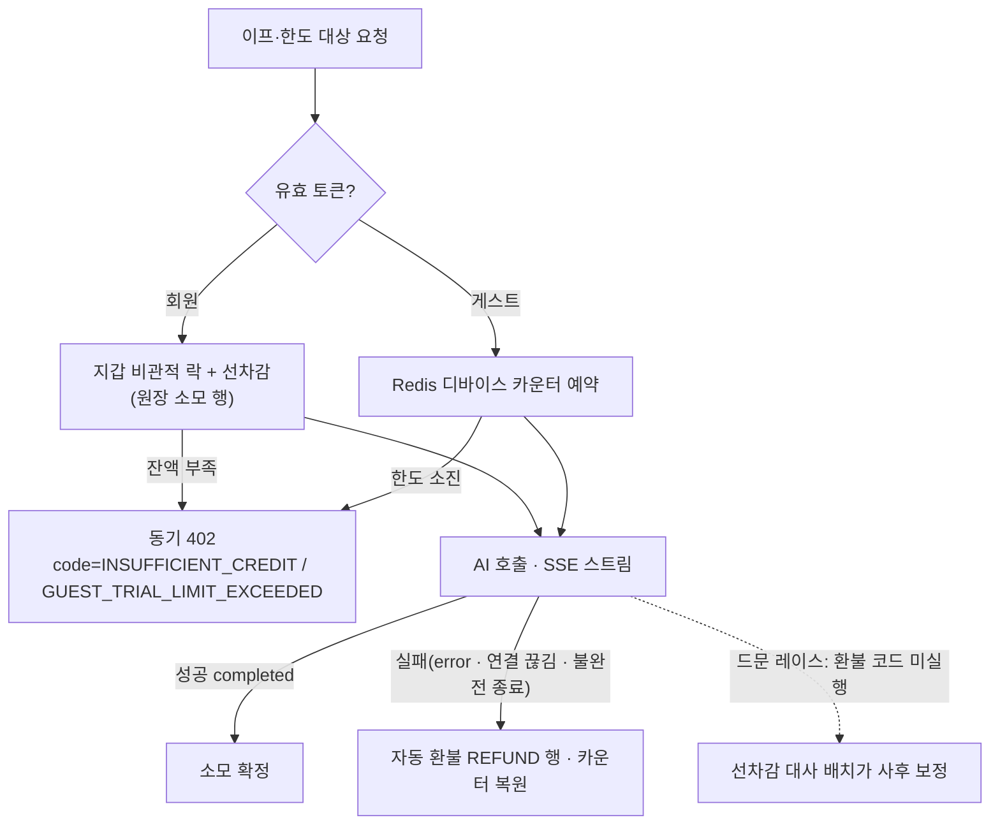

# 4-backend-server-spec

## 문서 정보

| 항목 | 값 |
| --- | --- |
| 버전 | v0.41 |
| 작성일 | 2026-07-03 |
| 수정일 | 2026-09-13 |
| 대상 | 마냑 백엔드 서버 |
| 작성 목적 | 백엔드 API, 데이터 모델, 오류 처리, 운영 기준을 정의합니다. |
| 기준 코드 | `manyak-server` dev `d4fe174`, Kotlin 2.2.21·Spring Boot 4.0.6·Java 21, Flyway V81. 합의된 계약과 관측된 구현의 차이는 추적 문서에 기록합니다. |

## 읽는 순서

- **처음 보는 사람**: §4-1(경계)과 [백엔드 Design §2-1](../design/2-backend-server-design.md#2-1-기술-환경과-요청-흐름)(아키텍처 큰 그림)을 먼저 보고, §4-3 도입의 엔드포인트 카탈로그로 전체 표면을 잡습니다.
- **구현자**: 담당 기능의 §4-3-N 상세 절 → §4-4 데이터 모델 → §4-6 오류 계약 순서로 봅니다. 각 절에서 연결한 백엔드 ADR이 계약 선택의 근거이며 현재 내부 구조는 [백엔드 Design](../design/2-backend-server-design.md)에서 확인합니다.
- **리뷰·QA**: §4-8 검수 체크리스트와 [추적 문서](../planning/backend-deployment-tracking.md)에서 시작해 본문을 역참조합니다.

## 목차

- [4-1. 문서 목적·범위와 관련 문서](#4-1-문서-목적범위와-관련-문서)
- [4-2. 기술 환경과 아키텍처](#4-2-기술-환경과-아키텍처)
- [4-3. API 계약](#4-3-api-계약)
- [4-4. 데이터 모델](#4-4-데이터-모델)
- [4-5. 인증과 권한](#4-5-인증과-권한)
- [4-6. 오류와 예외 처리](#4-6-오류와-예외-처리)
- [4-7. 운영과 관측](#4-7-운영과-관측)
- [4-8. 검수 체크리스트](#4-8-검수-체크리스트)

## 4-1. 문서 목적·범위와 관련 문서

### 목적

이 문서는 백엔드 API, 데이터 모델, 오류 처리와 운영 기준을 정의합니다.

### 범위

- REST API 계약(엔드포인트, 요청·응답 스키마, 상태 코드, 헤더)
- 채팅 SSE 스트리밍 계약
- 데이터 모델과 식별자·삭제 정책
- 인증(소셜 로그인: Google·Kakao, JWT)과 선택적 인증 정책
- 오류 응답 계약과 예외 처리 기준
- 운영·관측(상관관계 식별자, 구조화 로그, Sentry, `ai_call_logs`, 환경 변수, 헬스체크)

### 제외 범위

- 화면, 사용자 흐름, 프론트엔드 상태 처리 (담당: [`3-1-client-spec.md`](3-1-client-spec.md))
- AI 서버 내부 구현, 프롬프트, 레이어 구성 (담당: [`5-ai-server-spec.md`](5-ai-server-spec.md))
- 분석 이벤트 카탈로그, 지표, CloudWatch·Sentry 수집 기준 (담당: [`6-analytics.md`](6-analytics.md))
- 코드 구조, 클래스 설계, 테스트 작성 규칙, 로컬 실행 상세 (서버 레포 `README.md`·`CLAUDE.md`가 소유)
- 인프라 구성(Terraform, VPC, RDS 등)과 배포 절차 (담당: [배포 Design](../design/4-deployment.md))

### 관련 문서와 경계

| 문서 | 소유 영역 | 이 문서와의 관계 |
| --- | --- | --- |
| [`0-glossary.md`](0-glossary.md) | 용어, 계층별 표기 컨벤션 | 필드·테이블·로그 이름의 표기 근거 |
| [`1-background.md`](1-background.md) | 서비스 배경, MVP 범위 | 제품 방향의 상위 근거 |
| [`2-user-stories.md`](2-user-stories.md) | 화면별 사용자 요구(US ID) | 검수 기준을 US ID로 추적 |
| [`3-1-client-spec.md`](3-1-client-spec.md) | 화면, API 호출 시점, 실패 처리 | API의 소비자 계약. 호출 흐름은 위임 |
| [`5-ai-server-spec.md`](5-ai-server-spec.md) | AI 요청·응답 계약, 프롬프트 | AI 와이어 상세 위임 |
| [`6-analytics.md`](6-analytics.md) | 이벤트, 식별자, 관측 수집 기준 | 관측 계약의 기준. 백엔드 구현 현황은 이 문서가 기술 |

### 작성 원칙

- Spec은 현재 계약을 담습니다. 구현 차이와 미결 사항은 [추적 문서](../planning/backend-deployment-tracking.md)에 기록합니다.
- API 경로는 `/api/v1` prefix를 생략해 표기합니다. 예외적으로 전체 경로가 필요한 곳(헬스체크 등)만 전체를 적습니다.
- 클라이언트 와이어 필드는 camelCase, DB·로그 필드는 snake_case로 적습니다([`0-glossary.md §0-4`](0-glossary.md)).
- 이벤트·지표·AI 프롬프트는 담당 문서를 참조합니다.

### 문서 수명과 구현 확인

현재 계약과 코드의 차이는 [추적 문서](../planning/backend-deployment-tracking.md)에서 확인합니다.

## 4-2. 기술 환경과 아키텍처

기술 환경·요청 흐름·도메인 모듈·남용 방지 설계는 [백엔드 Design §2-1](../design/2-backend-server-design.md#2-1-기술-환경과-요청-흐름)이 소유합니다. API 계약은 다음 절을 따릅니다.

## 4-3. API 계약

### 공통 규칙

- 모든 비즈니스 API는 `/api/v1` prefix를 사용합니다.
- 요청·응답 JSON 필드는 camelCase입니다([`0-glossary.md §0-4`](0-glossary.md)).
- 시각 필드(`createdAt`, `updatedAt`)는 ISO 8601 UTC 문자열입니다.
- 문자 수 제약("N자")은 UTF-16 code unit(Java `String.length`, Bean Validation `@Size` 기준)으로 판정합니다. 이모지·서로게이트 페어는 2로 셉니다.
- 배치 조회는 배열이 커질 수 있어 `POST` 본문으로 ID 목록을 받습니다. 상한은 100개(중복 포함 배열 길이 기준)이며, 중복 ID는 각 ID당 1건만 반환합니다.
- 요청 검증 실패는 400과 `ApiErrorResponse.details`로 응답합니다([§4-6](#4-6-오류와-예외-처리)).

### 요청·응답 헤더

프론트엔드가 주입하는 식별 헤더와 백엔드의 처리 규칙입니다. 값의 정책 기준은 [`6-analytics.md §6-6-2`](6-analytics.md)입니다.

| 헤더 | 방향 | 처리 |
| --- | --- | --- |
| `X-Manyak-Request-Id` | 수신·응답 | 없으면 `req_` + UUID(하이픈 제거)로 생성. 응답 헤더로 항상 echo |
| `X-Manyak-Session-Id` | 수신 | MDC `session_id`에 적재. 없으면 `unknown` |
| `X-Manyak-Device-Id` | 수신 | 원본을 저장하지 않고 해시(`device_id_hash`)로 변환해 MDC에 적재. 없으면 `unknown` |

- 식별 헤더가 없어도 요청을 거부하지 않습니다. 예외: 게스트 체험 한도 대상 요청은 `X-Manyak-Device-Id`가 필수이며 누락 시 400입니다([§4-3-7](#4-3-api-계약)).
- 해시 방식과 AI 서버로의 전달 규칙은 [§4-7](#4-7-운영과-관측)에 정의합니다.

### 엔드포인트 카탈로그

| 도메인 | 메서드·경로 | 설명 | 성공 | 주요 실패 | 인증 |
| --- | --- | --- | --- | --- | --- |
| 스토리 | `GET /stories` | 공개 스토리 목록(커서 페이지네이션, `?sort`·`?limit`·`?cursor`) | 200 | 400 | 불필요 |
| 스토리 | `GET /stories/originals` | 마냑 오리지널(공식 계정 소유 공개 스토리) 카드 목록, 등록순. 공식 계정 미설정 환경은 빈 배열 | 200 | 없음 | 불필요 |
| 스토리 | `GET /stories/search` | 공개 스토리 검색(질의 `q`, OpenSearch nori) | 200 | 400·503 | 불필요 |
| 스토리 | `POST /stories/batch` | 공개 ID 목록으로 스토리 카드 조회 | 200 | 400 | 선택 |
| 스토리 | `GET /stories/{storyId}` | 스토리 상세 조회 | 200 | 404 | 선택 |
| 스토리 | `DELETE /stories/{storyId}` | 스토리 소프트 삭제 | 204 | 403·404 | 선택 |
| 스토리 | `GET /stories/lorebooks` | 로어북 카탈로그 조회(`?genre` 필터) | 200 | 없음 | 불필요 |
| 스토리 | `GET /stories/{storyId}/edit` | 스토리 수정 폼 데이터 조회 | 200 | 403·404 | 선택 |
| 스토리 | `PATCH /stories/{storyId}` | 스토리 수정 | 200 | 400·403·404 | 선택 |
| 스토리 | `POST /stories/{storyId}/images/presign` | 이미지 업로드용 presigned PUT 발급(표지·인물) | 201 | 400·401·403·404 | 필수 |
| 스토리 | `DELETE /stories/{storyId}/thumbnail` | 업로드·생성 표지 제거(프리셋 폴백, 멱등) | 204 | 401·403·404 | 필수 |
| 스토리 | `POST /stories/{storyId}/characters/{characterId}/images` | 인물 이미지 연결(업로드 완료 객체 + 이름) | 201 | 400·401·403·404·409 | 필수 |
| 스토리 | `DELETE /stories/{storyId}/characters/{characterId}/images/{imageId}` | 인물 이미지 제거(멱등) | 204 | 401·403·404 | 필수 |
| 스토리 | `POST /stories/general` | 일반 제작 등록 | 201 | 400 | 선택 |
| 스토리 | `POST /stories/{storyId}/like` | 스토리 좋아요 등록(멱등) | 204 | 401·403·404 | 필수 |
| 스토리 | `DELETE /stories/{storyId}/like` | 스토리 좋아요 취소(멱등) | 204 | 401·403·404 | 필수 |
| 스토리 | `POST /stories/{storyId}/reports` | 스토리 신고 등록 | 201 | 400·401·403·404 | 필수 |
| 간편 제작 | `GET /stories/simple/tags` | 제공 태그 목록 조회 | 200 | 없음 | 불필요 |
| 간편 제작 | `POST /stories/simple/storylines` | 스토리라인 3개 생성(AI 호출) | 201 | 400·402·409·502 | 선택 |
| 간편 제작 | `POST /stories/simple` | 최종 스토리 생성(AI 호출) | 201 | 400·402·403·404·409·502 | 선택 |
| 간편 제작 | `GET /stories/simple/creation-requests/{requestId}` | 생성 요청 복구 조회(연결 유실 후 결과 되찾기) | 200 | 404 | 선택 |
| 간편 제작 | `PUT /stories/simple/storylines/{storylineId}/rating` | 스토리라인 평가 설정 | 200 | 400·403·404 | 선택 |
| 간편 제작 | `DELETE /stories/simple/storylines/{storylineId}/rating` | 스토리라인 평가 취소(멱등) | 204 | 403·404 | 선택 |
| 채팅 | `POST /chats` | 채팅 생성(플레이 시작) | 201 | 400·403·404 | 선택 |
| 채팅 | `POST /chats/batch` | 공개 ID 목록으로 채팅 카드 조회 | 200 | 400 | 선택 |
| 채팅 | `GET /chats/{chatId}` | 채팅 상세(턴 이력) 조회 | 200 | 403·404 | 선택 |
| 채팅 | `DELETE /chats/{chatId}` | 채팅 소프트 삭제 | 204 | 403·404 | 선택 |
| 채팅 | `POST /chats/{chatId}/turns/stream` | 턴 진행 SSE 스트리밍 | 200(SSE) | 400·402·403·404 | 선택 |
| 채팅 | `POST /chats/{chatId}/turns/regenerate/stream` | 마지막 턴 AI 응답 재생성 SSE 스트리밍 | 200(SSE) | 400·402·403·404·409 | 선택 |
| 채팅 | `POST /chats/{chatId}/turns/{turnId}/choices` | 선택지 생성 트리거(마지막 턴, 멱등) | 200 | 403·404·409·502 | 선택 |
| 채팅 | `POST /chats/{chatId}/shares` | 채팅 공유 링크 발급(발급 시점 스냅샷) | 201 | 403·404 | 선택 |
| 채팅 | `GET /shares/{shareId}` | 공유된 채팅 열람(읽기 전용) | 200 | 404 | 불필요 |
| 피드백 | `POST /feedbacks` | 피드백 등록 | 201 | 400 | 선택 |
| 인증 | `POST /auth/login/google` | Google ID 토큰 로그인 | 200 | 400·401 | 불필요 |
| 인증 | `POST /auth/login/kakao` | Kakao ID 토큰 로그인 | 200 | 400·401 | 불필요 |
| 인증 | `GET /auth/me` | 현재 사용자 조회 | 200 | 401 | 필수 |
| 인증 | `POST /auth/token/refresh` | 토큰 재발급(회전) | 200 | 400·401 | 불필요 |
| 인증 | `POST /auth/logout` | refresh 토큰 폐기(멱등) | 204 | 400 | 불필요 |
| 인증 | `POST /auth/migrate` | 게스트 데이터 소유권 이관(항목별 부분 성공) | 200 | 400·401 | 필수 |
| 인증 | `POST /auth/handoffs` | 로그인 핸드오프 생성(인앱 게스트 데이터 임시 보관) | 201 | 400 | 불필요 |
| 인증 | `GET /auth/handoffs` | 핸드오프 확인(외부 랜딩 안내용 건수) | 200 | 404 | 불필요 |
| 인증 | `GET /auth/handoffs/status` | 핸드오프 상태 조회(인앱 복귀 정리용) | 200 | 404 | 불필요 |
| 인증 | `POST /auth/links/reauth` | 계정 연동 재인증(일회용 링크 코드 발급) | 201 | 400·401·403 | 필수 |
| 인증 | `POST /auth/links/{provider}` | 계정 연동 추가(링크 코드 필요, 본문 없는 201) | 201 | 400·401·403·409 | 필수 |
| 사용자 | `DELETE /users/me` | 회원 탈퇴(soft delete) | 204 | 401 | 필수 |
| 사용자 | `PATCH /users/me` | 프로필 부분 수정(닉네임·프로필 프리셋, 보낸 필드만) | 200 | 400·401·403·409 | 필수 |
| 사용자 | `GET /profile-presets` | 프로필 프리셋 이미지 목록(선택 화면용) | 200 | 401 | 필수 |
| 사용자 | `GET /users/me/stories` | 내 스토리 목록(서버 정본) | 200 | 401 | 필수 |
| 사용자 | `GET /users/me/chats` | 내 채팅 목록(서버 정본) | 200 | 401 | 필수 |
| 사용자 | `PUT /users/me/push-tokens` | 디바이스 푸시 토큰 등록·갱신(같은 토큰 재등록은 갱신, 멱등) | 204 | 400·401·403 | 필수 |
| 사용자 | `DELETE /users/me/push-tokens` | 디바이스 푸시 토큰 삭제(본문 `token`, 없거나 남의 토큰이어도 204) | 204 | 400·401·403 | 필수 |
| 사용자 | `GET /users/me/push-settings` | 알림 수신 동의 조회(세 boolean) | 200 | 401·403 | 필수 |
| 사용자 | `PUT /users/me/push-settings` | 알림 수신 동의 전체 교체(세 필드 필수, 야간 단독 400) | 200 | 400·401·403 | 필수 |
| 이프 | `GET /credits/policies` | 현재 유효한 적립·소모 수치 6종 조회(정책 오버라이드 반영) | 200 | 없음 | 불필요 |
| 이프 | `GET /credits/products` | 충전 상품 목록 | 200 | 없음 | 불필요 |
| 이프 | `POST /users/me/credits/orders` | 웹 결제 주문 생성 | 201 | 400·401·503 | 필수 |
| 이프 | `GET /users/me/credits/orders/{orderId}` | 본인 주문 상태 조회 | 200 | 401·404 | 필수(본인) |
| 이프 | `POST /webhooks/groble` | 그로블 결제·환불 웹훅 | 200 | 401·503 | 불필요(서명) |
| 이프 | `POST /users/me/credits/purchases/google` | Google Play 구매 검증·적립 | 200(멱등) | 400·401 | 필수 |
| 이프 | `GET /users/me/credits` | 이프 잔액 조회 | 200 | 401 | 필수 |
| 이프 | `POST /users/me/credits/attendance` | 출석체크 적립(1일 1회 멱등) | 200 | 401 | 필수 |
| 이프 | `GET /users/me/credits/transactions` | 이용내역(원장) 커서 조회 | 200 | 400·401 | 필수 |
| 이프 | `GET /users/me/invite` | 내 초대 코드·보상 진행 조회 | 200 | 401 | 필수 |
| 이프 | `POST /users/me/invite/redeem` | 초대 코드 입력·양측 보상 적립 | 200 | 400·401·404·409 | 필수 |

인증 열의 `선택`은 익명을 허용하되 유효한 access 토큰이 오면 `user_id`를 귀속하는 엔드포인트입니다([§4-5](#4-5-인증과-권한)).

### 4-3-1. 스토리 조회·삭제

**`POST /stories/batch`**: 요청 `{storyIds: string[]}`(1~100개: `@NotEmpty`·`@Size` Bean Validation으로 서비스 진입 전 400). 존재하고 삭제되지 않았으며 아래 읽기 가시성을 통과한 스토리만 반환하고, 없는 ID·읽기 불가 항목은 오류 없이 제외합니다. UUID 형식이 아닌 ID는 오류 없이 제외하며 유효 ID가 0개면 DB 조회 없이 빈 배열을 반환합니다. 중복 ID는 1건으로 병합하고, 반환 순서는 중복 제거된 요청 순서를 보존합니다.

**`GET /stories`**: 공개 스토리 목록입니다. 인증이 필요 없고 **요청자 신원을 쓰지 않습니다**: 로그인 여부와 무관하게 같은 결과를 봅니다.

| 쿼리 | 기본값 | 규칙 |
| --- | --- | --- |
| `sort` | `latest` | `latest`(등록 최신순) · `popular`(좋아요 많은 순). 그 외 값은 400 |
| `limit` | 20 | `[1, 50]`으로 clamp(`coerceIn`): 범위 밖은 400이 아니라 보정. 비수치는 타입 변환 실패로 400 |
| `cursor` | 없음 | 이전 응답의 `nextCursor`. 형식이 깨졌거나 **정렬 종류가 다르면** 400 |

응답은 `{items: StorySummaryResponse[], nextCursor: string | null}`입니다. `items`의 카드는 `POST /stories/batch`·`GET /stories/originals`·`GET /users/me/stories`와 **같은 `StorySummaryResponse`**(아래 표)를 재사용합니다: 목록 카드 컴포넌트를 경로마다 다시 만들지 않기 위해서입니다. 마지막 페이지의 `nextCursor`는 null입니다.

**노출 조건.** 다음 넷을 모두 만족하는 스토리만 싣습니다.

```
status = PUBLISHED  AND  visibility = PUBLIC  AND  deleted_at IS NULL  AND  user_id IS NOT NULL
```

앞의 셋은 아래 읽기 가시성의 ①(공개 스토리)과 소프트 삭제 제외에 해당합니다. **네 번째(회원 소유)가 목록 전용 조건**입니다: 읽기 가시성은 게스트 스토리를 UUID 보유자에게 열어 주지만, 목록은 UUID를 모르는 사람에게 스토리를 **발견시키는** 경로라 판정이 다릅니다.

[결정 근거 BE-001](../adr/2-backend-server-adr.md#be-001)

**정렬과 커서.**

| `sort` | 1차 키 | 2차 키 |
| --- | --- | --- |
| `latest` | `created_at` DESC | `public_id` DESC |
| `popular` | 좋아요 수 DESC | `public_id` DESC |

- 인기순의 좋아요 수는 컬럼이 아니라 `story_likes` **실시간 집계**입니다(카드·상세의 `likeCount`와 같은 출처). 정렬과 커서 조건 양쪽에서 같은 상관 서브쿼리를 씁니다. **비정규화 컬럼(`stories.like_count`)은 두지 않습니다**: 좋아요 등록·취소 양쪽의 동기화 비용이 목록 하나의 이득보다 크고, 어긋나면 카드 수치와 상세 수치가 달라집니다. 목록이 커져 정렬이 느려지면 그때 비정규화나 인덱스를 검토합니다.
- 2차 키는 내부 PK가 아니라 `public_id`입니다: 커서에 순차 PK를 실으면 외부 노출 식별자 정책([§4-4](#4-4-데이터-모델))을 어깁니다. 랜덤 UUID지만 값이 안정적이라 동률 구간(같은 시각, 같은 좋아요 수)의 순서를 결정적으로 만듭니다.
- **커서 형식**: `"<정렬 접두>:<정렬값>:<public_id>"`를 Base64URL(패딩 없음)로 감쌉니다. 정렬 접두는 `latest`가 `l`, `popular`가 `p`이며 **디코드 시 검증**합니다: 정렬이 다른 커서를 넘기면 400입니다(인기순 커서의 정렬값은 좋아요 수라 최신순에 넣으면 엉뚱한 시각으로 해석됩니다). 정렬값은 `latest`가 `created_at`의 **epoch nanos**, `popular`가 좋아요 수입니다. millis가 아닌 이유는 PostgreSQL `timestamptz`가 마이크로초까지 담기 때문입니다: 밀리초로 자르면 같은 밀리초 안의 뒤쪽 행이 `created_at < 커서`에도 `= 커서`에도 걸리지 않아 페이지 경계에서 사라집니다.
- offset이 아니라 keyset이라 페이지 사이에 새 스토리가 끼어들어도 중복·누락이 없습니다. `limit + 1`건을 읽어 다음 페이지 유무를 판정합니다.
- 인덱스는 두지 않습니다. 공개 스토리가 늘면 `latest`는 `(status, visibility, deleted_at, created_at DESC, public_id DESC)` 부분 인덱스가, `popular`는 집계 정렬이라 비정규화 컬럼이나 상위 N개 캐시가 필요해질 수 있습니다([추적 PLAN-05](../planning/backend-deployment-tracking.md#미결-결정)).

**인증 배선.** `SecurityConfig`에서 **정확 경로** permitAll이며 `OPTIONAL_AUTH_MATCHERS`에도 등록합니다([§4-5](#4-5-인증과-권한) 선택적 인증). 요청자 신원을 쓰지 않지만, 클라이언트가 자동 첨부한 만료·위조 access 헤더가 리소스 서버 필터에 걸려 401이 나면 로그아웃 상태 화면이 통째로 깨지기 때문입니다(`GET /shares/{shareId}`와 같은 이유).

**읽기 가시성.** 스토리 읽기(배치·상세 조회, `POST /chats`의 시작 전 게이트 포함)는 다음 중 하나일 때만 허용합니다: ① 공개 스토리(`status = PUBLISHED`이면서 `visibility = PUBLIC`), ② 게스트 제작 스토리(`user_id` NULL: UUID 보유가 사실상 본인 서재·공유 링크 보유), ③ 요청자가 소유자 본인. 따라서 **회원 소유 스토리가 PRIVATE(또는 DRAFT)면 타인·익명은 UUID를 알아도 읽을 수 없습니다**: 배치는 결과에서 제외, 상세는 404(존재 여부 비노출)입니다.

**응답 항목(`StorySummaryResponse`)**

| 필드 | 타입 | 설명 |
| --- | --- | --- |
| `id` | string | 스토리 공개 식별자(UUID) |
| `title` | string | 제목 |
| `oneLineIntro` | string | 한 줄 소개. 저장값이 NULL이면 빈 문자열 |
| `genres` | string[] | 장르 태그명 목록: `stories.genre`를 쉼표 분리 후 각 항목 trim·빈 항목 제거 |
| `author` | object·null | 작성자 `{id, nickname, profileImageUrl}`. 익명 생성 시 `author` 자체가 null. `profileImageUrl`은 이미지 미배정 회원이면 null(클라이언트는 기본 아바타로 처리). (KNK-1016, 2026-08-29): 회원 소유 스토리는 목록·상세 모두 실제 작성자의 `nickname`·`profileImageUrl`을 채웁니다(2026-08-28 팀 결정: 스토리 상세의 공개 소비 전환). 목록은 배치 조회로 채워 N+1을 막습니다. `author.id`는 내부 PK 비노출 원칙([§4-4](#4-4-데이터-모델))에 따라 항상 null입니다 |
| `turnCount` | number | 누적 사용자 입력 턴 수: 스토리의 모든 미삭제 채팅 `current_turn` 합(목록은 배치 집계로 N+1 방지). 이전 와이어 필드 `chatCount`(채팅 수)를 대체 |
| `likeCount` | number | 좋아요 수. `story_likes` 실 집계입니다([아래 스토리 좋아요](#4-3-api-계약)). 목록은 배치 집계로 채워 N+1을 막습니다 |
| `status` | enum | `DRAFT` · `PUBLISHED` |
| `thumbnailUrlSm` | string·null | 썸네일 축소 변형(`_sm`) 서빙 URL: 목록·카드 렌더용. 연결된 썸네일이 없으면 null([§4-3-9](#4-3-api-계약) 반응형 변형) |
| `createdAt` | string | 생성 시각 |

**`GET /stories/{storyId}`**: 상세 응답(`StoryDetailResponse`)은 목록 필드에 다음을 더합니다.

| 필드 | 타입 | 설명 |
| --- | --- | --- |
| `description` | string·null | 주요 내용 |
| `thumbnailUrl` | string·null | (KNK-515·V45) 썸네일 **원본** 서빙 URL(상세 히어로용: 목록·카드는 `thumbnailUrlSm`). 이전 `coverImageUrl`을 개명. 자동 연결([§4-3-9](#4-3-api-계약))이 등록 시 확정한 `stories.thumbnail_image_key`로 백엔드가 조합하며, 연결 소스가 없거나 규칙 도입 전 스토리는 null. 컴파일이 생성한 표지가 있으면 `stories.thumbnail_image_url`(WebP 절대 URL)이 이 값을 대신합니다: 필드 이름·타입은 그대로이고 값의 출처만 늘었습니다 |
| `hashtags` | string[] | 해시태그(placeholder) |
| `startSettings` | object[] | 시작 설정 목록(복수화: 등록 순서). 각 항목 `{id, name, prologue, startSituation, suggestedInputs[], endings[]}`: `id`는 시작 설정 공개 식별자(UUID: `POST /chats`의 `startSettingId`로 사용), `suggestedInputs`는 이 시작 설정의 추천 입력, `endings`는 `{name, requirement{minTurns, achievementCondition}, epilogue}`(이름 기반·유형 없음, 활성 엔딩만, 레거시 `enabled=false` 제외, [§4-3-8](#4-3-api-계약)·[§4-3-10](#4-3-api-계약)). 시작 설정이 없으면 빈 배열 |
| `visibility` | enum | `PUBLIC` · `PRIVATE`(기본 PRIVATE) |
| `lorebooks` | object[] | 로어북 `{id, name, genre, content}`(스토리 범위) |
| `mainEvents` | object[] | 주요 사건 `{name, description, keySentence, sortOrder}`(스토리 범위): `sort_order` 오름차순. 런타임 의미는 [§4-3-10](#4-3-api-계약) |
| `reachedEndings` | string[] | 요청자가 이 스토리에서 도달한 엔딩 **이름** 목록(엔딩은 이름으로 식별). 회원은 사용자+스토리 집계, 게스트는 빈 배열([§4-3-10](#4-3-api-계약)) |
| `isOwner` | boolean | (KNK-1016·1018, 2026-08-29) 요청 회원이 이 스토리의 소유자인지. 와이어 필드명은 `@JsonProperty("isOwner")`로 고정(springdoc이 `owner`로 문서화하는 문제 차단). 서버가 요청자 `user_id`와 `stories.user_id`를 비교해 판단하며(클라이언트 id 비교 없음: `author.id`가 null이라 클라이언트는 판단 불가), 게스트·미인증은 false. 용도는 상세 헤더 메뉴(수정·삭제 등) 노출 판단 |
| `isLiked` | boolean | 요청 회원이 이 스토리에 좋아요를 눌렀는지([아래 스토리 좋아요](#4-3-api-계약)). 게스트·미인증은 false |
| `characters` | object[] | 등장인물 `{name, imageUrl}`: `story_characters`([§4-4](#4-4-데이터-모델))를 저장순(컴파일 응답 순서)으로 싣습니다. 이미지 생성에 실패한 인물도 포함하고 그 `imageUrl`은 null입니다(이미지 실패가 스토리를 막지 않는 계약과 같은 취지: [§4-3-9](#4-3-api-계약)). 인물 행이 없는 스토리(컴파일 경로 이전·일반 제작)는 빈 배열입니다 |

- `status`·`visibility`·`lorebooks`·`startSettings[].endings`는 MVP 프론트엔드가 사용하지 않습니다([클라이언트 추적](../planning/client-tracking.md#기존-간극의-처리) G3).
- **인물 목록**: 상세의 `characters[]`에는 이름과 이미지만 싣고 공개 식별자와 외형 필드는 제외합니다. 인물별 설명은 저장하지 않습니다. 수정 폼의 `StoryEditCharacterResponse`는 이미지 연결·삭제에 필요한 `id`·`name`·`images[]`를 반환합니다.

**`DELETE /stories/{storyId}`**: 소프트 삭제 후 204. 존재하지 않거나 이미 삭제된 ID는 404를 반환하며, 프론트엔드는 404를 무음 성공으로 처리합니다([웹 사용자 모델](3-2-web-spec.md#웹-사용자-모델)). 소유권 규칙([§4-5](#4-5-인증과-권한))을 적용합니다: 소유 스토리는 소유자만, `user_id`가 NULL인 스토리는 익명(게스트) 요청만 삭제할 수 있고 위반은 403입니다. 404 판정(형식 오류·순차 정수·부재·이미 삭제: 모두 동일 404로 존재 여부 비노출)을 403보다 먼저 적용하고, 삭제는 스토리 행 비관적 쓰기 락으로 처리해 소유권 검사와 `deleted_at` 기록 사이에 이관 클레임이 끼어드는 경쟁을 차단합니다(KNK-69: 채팅 삭제 동일).

<a id="스토리-검색--phase-3--구현정책-knk-1140-확정-구현-knk-1141"></a>

#### 스토리 검색

공개 스토리를 질의로 찾습니다. 2026-09-07 결정 기록입니다.

**`GET /stories/search`**: 인증 불필요, 요청자 신원을 쓰지 않습니다(목록과 동일).

| 쿼리 | 기본값 | 규칙 |
| --- | --- | --- |
| `q` | 필수 | 앞뒤 공백 제거 후 **2~100자**. 빈 값·1자·100자 초과는 400 |
| `limit` | 20 | `[1, 50]` clamp(목록과 동일) |
| `cursor` | 없음 | 이전 응답의 `nextCursor`. 형식이 깨졌거나 **다른 `q`의 커서**면 400 |

응답은 목록과 같은 `{items: StorySummaryResponse[], nextCursor: string | null}`이며 카드도 같은 `StorySummaryResponse`입니다. 빈 결과는 200 + 빈 배열. 검색 저장소가 설정되지 않은 환경(로컬 기본)은 **503**("검색이 설정되지 않았습니다."). OpenSearch가 `index_not_found_exception`을 반환하면 인덱스가 아직 없는 상태이므로 200 + `items=[]`, `nextCursor=null`로 응답합니다. 그 외 저장소 오류는 503입니다(외부 오류 원문·검색어는 응답과 로그에 싣지 않음).

- **저장소**: `manyak-logs` OpenSearch 도메인의 `stories-{env}` 인덱스를 사용합니다([배포 Design](../design/4-deployment.md)). PostgreSQL이 정본이며 색인은 파생 데이터입니다.
- **문서**: `publicId`, `title`, `oneLineIntro`, `genres[]`, `characterNames[]`, `thumbnailUrlSm`, `author{id, nickname}`, `turnCount`, `likeCount`, `createdAt`, `visible`을 저장합니다. `visible`은 PUBLISHED·PUBLIC·미삭제·회원 소유일 때만 참입니다.
- **분석**: `title`·`oneLineIntro`·`characterNames`는 nori text, `genres`는 keyword입니다. 동의어 사전은 사용하지 않습니다.
- **질의**: `title^3`, `oneLineIntro`, `genres`, `characterNames`의 `multi_match`와 `visible=true` 필터를 사용합니다. 반환 전 PostgreSQL에서 공개 조건을 다시 검사하고 탈락 문서는 재색인합니다. 정렬은 BM25, `createdAt`, `publicId` 순입니다.
- **커서**: `search_after`의 `[점수, createdAt, publicId]`와 `q` 해시를 담습니다. 다른 질의의 커서는 400입니다. 페이지 사이 색인 변경으로 생기는 중복·누락은 허용합니다.
- **동기화**: 저장·수정·공개 전환·삭제·표지 삭제·좋아요 변경 뒤 한 건을 비동기로 색인합니다. 닉네임 변경은 삭제되지 않은 소유 스토리 전체를 갱신합니다. 실패는 로그만 남기며 업무 트랜잭션을 되돌리지 않습니다.
- **초기화와 복구**: 시작 시 인덱스를 확인해 없으면 생성합니다. `MANYAK_OPENSEARCH_REINDEX_ON_STARTUP=true`이면 모든 스토리를 `_bulk`로 다시 색인하며 완료 뒤 토글을 되돌립니다.
- **인증**: 태스크 역할의 SigV4와 `manyak-search-{env}` 역할 매핑을 사용합니다. 권한과 역할 매핑은 [배포 Design §4-4](../design/4-deployment.md#4-4-인프라-아키텍처)를 따릅니다.
- **설정**: `MANYAK_OPENSEARCH_ENDPOINT`가 없으면 검색은 503이고 색인하지 않습니다. 인덱스 이름은 `MANYAK_OPENSEARCH_STORY_INDEX`로 지정합니다.

[결정 근거 BE-002](../adr/2-backend-server-adr.md#be-002)

<a id="스토리-좋아요--phase-2--구현knk-1017-v6x"></a>

#### 스토리 좋아요

스토리 상세의 공개 소비 전환(2026-08-28 팀 결정)에 따른 좋아요 계약입니다. **like만 있고 dislike는 없습니다.**

- **`POST /stories/{storyId}/like`**: 좋아요 등록, 204. **`DELETE /stories/{storyId}/like`**: 좋아요 취소, 204. 둘 다 멱등입니다: 이미 좋아요한 스토리의 재등록, 좋아요 없는 스토리의 취소도 204입니다(스토리라인 평가 취소와 같은 결).
- 인증 필수입니다(게스트 불가: 미인증 401). 대상 스토리에는 읽기 가시성([위](#4-3-api-계약): `Story.isReadableBy`)을 적용하며, 읽을 수 없는 스토리는 404입니다(존재 여부 비노출).
- 저장은 `story_likes`에 `(user_id, story_id)` UNIQUE 1행입니다([§4-4](#4-4-데이터-모델)). `likeCount`(목록·상세)는 이 테이블의 실 집계, 상세 `isLiked`는 요청 회원의 행 존재 여부입니다.

<a id="스토리-신고--phase-2--구현knk-1020"></a>

#### 스토리 신고

- **`POST /stories/{storyId}/reports`**: 신고 등록, 201. 인증 필수(미인증 401)이며, 대상 스토리에는 좋아요와 동일하게 읽기 가시성을 적용합니다(읽을 수 없는 스토리는 404).
- 사유 분류(enum) 체계, 같은 회원의 같은 스토리 중복 신고 정책, 신고 접수 후 처리(운영 알림·노출 제재)는 이 절이 정하지 않습니다: 엔드포인트 골격만 고정하며 나머지 계약은 [추적 PLAN-04](../planning/backend-deployment-tracking.md#미결-결정)에서 확정합니다.

### 4-3-2. 간편 제작

간편 제작 퍼널(키워드 선택 → 스토리라인 선택 → 추가 정보 → 완료)의 서버 계약입니다. 화면 흐름은 [`3-1-client-spec.md §3-1-4`](3-1-client-spec.md)가 정의합니다.

**`GET /stories/simple/tags`**: 활성화된 제공 태그 목록 `{id, name, category}[]`을 반환합니다. `category`는 `GENRE` · `PROTAGONIST` · `SUPPORTING_CHARACTER`입니다. 사전 정의(`PREDEFINED`)·활성 태그만, `category → sort_order → id` 오름차순으로 반환합니다(직접 추가 `CUSTOM` 태그는 목록에 노출하지 않음).

**`POST /stories/simple/storylines`**: 태그 선택으로 스토리라인 3개를 생성합니다. AI 서버 `POST /story/storylines`를 동기 호출하며 실패 시 502를 반환합니다. 회원은 무료이고, 게스트는 디바이스 ID별 스토리라인 생성·재생성 합산 5회 한도를 넘으면 AI 호출 전 402를 반환합니다([§4-3-7](#4-3-api-계약)).

| 요청 필드 | 제약 | 설명 |
| --- | --- | --- |
| `requestId` | UUID, 필수 | 클라이언트 생성 요청 ID: 복구 조회·멱등 키(아래 KNK-623 블록). 누락 시 400 |
| `genreTagIds` | 최대 20개, 각 ≥ 1 | 선택한 제공 장르 태그 ID |
| `customGenreTags` | 최대 20개, 각 trim 후 1~30자 | 직접 입력한 장르 이름 |
| `protagonist` | 필수 | 주인공 입력(아래 인물 객체) |
| `supportingCharacters` | 최대 5개 | 주변 인물 입력 목록(아래 인물 객체) |
| `parentCreationId` | UUID, null 허용 | 재생성이면 직전 생성의 `creation_id`(아래 KNK-751 블록) |
| `isRegenerated` | boolean, null 허용 | 재생성 여부. 서버가 판단하지 않고 AI 호출에 그대로 전달 |

인물 객체(`protagonist`·`supportingCharacters[]`)는 `{name(≤30자, null 허용), gender("MALE"·"FEMALE"·null), featureTagIds[], customTags[] (각 ≤30자)}`입니다. 네 항목 모두 선택이며 비우면 AI가 채웁니다.

- 장르는 `genreTagIds` + `customGenreTags` 합산 20개, 인물은 `featureTagIds` + `customTags` 합산 3개가 상한입니다. 필드별 상한만 두면 합산이 두 배로 열려 옛 계약의 실질 상한을 넘기 때문에, 중복 제거 전 요청 항목 수로 세어 400을 반환합니다.
- `genreTagIds`·`featureTagIds`는 중복 제거 후 존재·활성·사전 정의 여부를 검증하며, 무효 ID가 있으면 400을 반환합니다. **누락 ID 목록은 `message`에 담깁니다**: `details`는 Bean Validation 위반(개수 상한·원소 길이·이름 중복)에만 채워집니다([§4-6](#4-6-오류와-예외-처리)).
- **원소 단위 검증**: `customGenreTags`와 인물 `customTags`의 각 원소는 빈 문자열이거나 30자를 넘으면 400입니다. 코틀린이 컬렉션 원소 애노테이션을 클래스 파일에 내보내지 않아 이 제약이 발동하지 않던 것을 컴파일 옵션으로 살렸습니다: 그전에는 빈 문자열이 201로 통과했고, 31자는 요청 검증을 지나 `story_creation_tags.name`(30자) 저장에서 터져 500이었습니다. 직접 입력 장르는 여기에 더해 **trim 후** 길이도 1~30자여야 합니다(KNK-859: 서버가 trim한 값을 저장하므로 저장 값 기준 상한).
- **최소 입력 요건은 없습니다**: 장르와 인물 특징이 모두 비어도 201입니다(빈 자리는 AI가 채웁니다). 옛 계약의 "선택 태그와 직접 추가 태그 중 하나 이상" 규칙은 인물 단위 교체와 함께 사라졌습니다. 클라이언트는 장르 1개 이상 **그리고** 주인공 특징 1개 이상을 생성 조건으로 두지만([`3-1-client-spec.md §3-1-4`](3-1-client-spec.md)), 서버는 강제하지 않습니다.
- `customGenreTags`·인물 `customTags`는 정규화 키 기준으로 요청 내 중복을 제거하며, 동일한 기존 태그가 있으면 재사용합니다(find-or-create: 아래 정규화 블록). 원문 키 시절에는 대소문자·공백 변형(BL / Bl / bl / b l)이 별개 태그로 저장돼 파편화됐습니다(KNK-717로 교체).
- 저장은 장르와 인물 특징 모두 `story_creation_tags`(직접 입력분은 `CUSTOM`) → `story_creation_session_tags`로 이어집니다. 인물 특징 행은 `character` FK로 어느 인물의 것인지 구분하고, 장르 행은 이 FK가 비어 있습니다. 세션 태그 저장 순서(`st.id`)가 곧 회수 재구성 응답 순서입니다.
- AI 요청에는 `genre_tags`(제공 장르 뒤에 직접 입력 장르를 잇고 정규화 키로 중복 제거) · `protagonist` · `supporting_characters[]`로 전달합니다. 인물 객체의 `features`는 제공 특징 뒤에 직접 입력 특징을 이은 이름 배열입니다([`5-ai-server-spec.md §5-3-2`](5-ai-server-spec.md)).
- **스토리라인 AI 요청의 표기는 저장·응답과 갈릴 수 있습니다**: 이 요청은 태그 해석(저장 트랜잭션)보다 **먼저** 조립합니다. 그래서 직접 입력이 같은 정규화 키의 `PREDEFINED` 태그로 연결되는 경우, AI에는 **사용자 입력 원문**이 가고 저장·응답에는 **제공 표시명**이 나갑니다(`현대판타지` 입력 → AI `현대판타지`, 응답 `현대 판타지`). 장르와 인물 특징 모두 같습니다. 컴파일 요청(`POST /stories/simple`)은 저장된 태그를 읽어 조립하므로 제공 표시명입니다.
- AI 호출은 저장 트랜잭션 밖에서 먼저 수행하고, 성공 후 한 트랜잭션에서 진행(세션) → 세션 태그 → 스토리라인(`storyline_order` 1부터) → 추천 추가 정보(`info_order` 1부터) 순으로 저장합니다. 게스트 카운터는 AI 호출 전에 예약하고 생성·저장이 실패하면(모든 예외) 복원합니다.

(KNK-717, server `v0.2.5` 배포): 커스텀 태그 정규화입니다.

- **정규화 키**: trim → 내부 공백 제거 → lowercase 한 정규화 키(`normalized_name`)로 커스텀 태그 동일성을 판정합니다. find-or-create 조회와 요청 내 중복 제거 모두 `(category, 정규화 키)` 기준이며, 표시명(`name`)은 최초 입력의 trim본을 유지합니다(선행·후행 공백만 제거하고 내부 공백·대소문자는 입력 그대로).
- **PREDEFINED 연결**: 커스텀 입력이 같은 카테고리의 사전 정의 태그와 정규화 키가 일치하면 새 `CUSTOM` 태그를 만들지 않고 해당 `PREDEFINED` 태그로 연결합니다.
- **기존 중복 병합(이행, V51)**
  - `(tag_source, tag_type, normalized_name)`별 정본으로 참조를 옮기고 중복 행을 삭제한 뒤 같은 키로 유니크 제약을 교체합니다.
  - `CUSTOM`과 `PREDEFINED`를 모두 병합합니다. V2·V13의 공백 차이 태그도 정규화하면 충돌하기 때문입니다.
  - 정본은 활성 행을 우선하고, 그 안에서 id가 가장 작은 행을 선택합니다.
  - 같은 카테고리의 `CUSTOM`과 `PREDEFINED`가 겹치면 `PREDEFINED`를 정본으로 삼습니다.
  - 참조 이전 중 `story_creation_session_tags`나 `image_preset_genres`의 키가 겹치면 중복 참조를 먼저 제거합니다.

인물 입력은 장르와 분리한 객체 단위로 받습니다.

- **인물 단위 교체**: 카테고리별 태그 묶음(`selectedTagIds`·`customTags{category}`)을 장르(`genreTagIds`·`customGenreTags`)와 인물(`protagonist`·`supportingCharacters[]`)로 갈랐습니다. 인물은 이름·성별을 함께 받아 그대로 AI에 전달합니다. 제공 특징 태그(`PROTAGONIST`·`SUPPORTING_CHARACTER` 마스터)는 선택 칩의 소스이자 저장 연결 대상입니다.
- **장르 직접 입력 복원**: 인물 단위로 교체할 때 장르 직접 입력이 함께 빠졌다가 `customGenreTags`로 되살아났습니다. 장르 직접 입력은 현행 계약에서 유효하며, 이를 닫는 개편은 [후속 계약 검토](../planning/backend-deployment-tracking.md#후속-계약-검토)에 둡니다.
- **인물 이름 중복 금지**: 한 요청 안에서 주인공과 주변 인물의 이름이 겹치면 400입니다. 판정 키는 NFC 정규화 → trim → 내부 공백 정리 → 공백 제거 → lowercase이며, 비운 이름(null·공백만)은 검사 대상이 아닙니다. 클라이언트도 입력 단계에서 막지만([`3-1-client-spec.md §3-1-4`](3-1-client-spec.md)) 서버가 함께 막는 이유는, AI가 이름 글자로 인물의 등장 여부를 확인하기 때문입니다. 같은 이름이 두 명이면 한 명만 등장해도 확인을 통과해, 사용자가 만든 인물이 누락될 수 있습니다([`5-ai-server-spec.md §5-3-2`](5-ai-server-spec.md)).

현재 시드는 `GENRE` 15종, `PROTAGONIST` 15종, `SUPPORTING_CHARACTER` 10종입니다. 정렬은 카테고리별 `sort_order`를 사용합니다. 이미지·로어북의 장르 문자열은 GENRE 마스터와 함께 관리합니다. 장르·배경 분리 개편은 [후속 계약 검토](../planning/backend-deployment-tracking.md#후속-계약-검토)에 보존하며 현재 요청에 배경 필드를 추가하지 않습니다.

**응답(201)**

| 필드 | 타입 | 설명 |
| --- | --- | --- |
| `simpleCreationId` | number | 간편 제작 진행(세션) ID. 제품 분석 개념은 **`analytics_creation_id`**이고 분석 이벤트의 와이어 키는 `creation_id`입니다([`0-glossary.md §0-3-2`](0-glossary.md)·[`6-analytics.md §6-2`](6-analytics.md)). AI 트레이스의 `trace_creation_id`(§4-7)와 다른 값입니다 |
| `selectedTags` | object | 저장된 입력을 장르와 인물별로 정리한 객체 `{genreTags: {id, name, category}[], protagonist, supportingCharacters[]}`. 인물은 `{name, gender, features: {id, name, category}[]}`이며 직접 입력분도 저장된 태그 행으로 돌아옵니다 |
| `storylines` | object[] | 정확히 3개. 각 항목은 `{id, storyline, recommendedInfos: {id, text}[3]}` |

**`POST /stories/simple`**: 선택한 스토리라인과 추가 정보로 최종 스토리를 생성합니다. AI 서버 `POST /story/compile`을 동기 호출합니다. 회원은 250 이프, 게스트는 디바이스 ID별 스토리 생성 1회 한도를 사용합니다([§4-3-7](#4-3-api-계약)).

| 요청 필드 | 제약 | 설명 |
| --- | --- | --- |
| `requestId` | UUID, 필수 | 클라이언트 생성 요청 ID: 복구 조회·멱등 키(아래 KNK-623 블록). 누락 시 400 |
| `simpleCreationId` | ≥ 1 | 간편 제작 진행 ID |
| `storylineId` | ≥ 1 | 선택한 스토리라인 ID |
| `additionalInfos` | 최대 13개, 각 ≤ 100자 | 추가 정보(추천 채택분 포함 합산) |

**응답(201, `SimpleStoryCreateResponse`)**

| 필드 | 타입 | 설명 |
| --- | --- | --- |
| `id` | string | 스토리 공개 식별자(UUID) |
| `title` · `oneLineIntro` · `description` | string | 기본 정보 |
| `genres` | string[] | 장르 태그 |
| `startSettings` | object[] | 시작 설정 목록(공용 `SimpleStoryCreateResponse`: 복수화). 간편 제작은 항상 1개. 각 항목 `{id, name, prologue, startSituation, suggestedInputs[], endings[]}` |

- 게스트는 `id`를 로컬 서재에 저장합니다. 회원의 서재는 서버가 정본이므로(내 콘텐츠 목록: [§4-3-5](#4-3-api-계약)) 로컬 저장이 필요 없습니다.
- 같은 진행(`simpleCreationId`)으로 이미 스토리를 생성했다면 409를 반환합니다. 프론트엔드의 완성 재시도는 스토리 생성을 건너뛰므로 정상 흐름에서는 발생하지 않습니다([`3-1-client-spec.md §3-1-4`](3-1-client-spec.md)).
- 존재하지 않는 `simpleCreationId`, 또는 그 진행에 속하지 않거나 존재하지 않는 `storylineId`는 404입니다(카탈로그의 404 발생 조건).
- 소유자가 있는 진행은 같은 회원만 완료할 수 있습니다(타인·익명 403). 익명 진행을 회원이 완료하면 스토리와 진행이 그 회원에게 귀속됩니다(claim).
- 409는 AI 호출 전 사전 검사와, 저장 트랜잭션 안의 세션 행 비관적 락(`findByIdForUpdate`) 후 상태 재판정의 이중 구조로 판정합니다(동시 완료 경합 차단).
- 저장 트랜잭션은 선택 스토리라인 표시 → 스토리 → 스토리 설정 → 시작 설정 → 추천 입력 → 로어북 → 주요 사건 → 엔딩 → 세션 완료 순으로 처리합니다. 추천 입력과 로어북의 순서는 1부터, 주요 사건은 0부터, 시작 설정별 엔딩은 1부터 기록합니다. 제목은 100자, 한 줄 소개는 255자로 잘라 저장합니다. 장르는 GENRE 태그명을 `", "`로 연결하고 `visibility`는 PRIVATE, `status`는 PUBLISHED로 고정합니다.
- AI 요청의 `additional_info`는 `additionalInfos`를 개행(`\n`)으로 결합한 단일 문자열입니다.
- AI 호출 실패(응답 본문이 빈 경우 포함)는 502입니다. 컴파일 산출물 검증: 주요 사건·엔딩의 **이름이 중복되면** 사용자 입력이 아니라 불완전 AI 응답으로 보아 502로 저장을 롤백합니다. **엔딩은 빈 배열이어도 정상**이며(AI의 엔딩 폴백: 엔딩 0개로 저장), 주요 사건 개수(3~5)·엔딩 개수(0 또는 3)·폴백 계약의 정본은 [`5-ai-server-spec.md §5-3-3`](5-ai-server-spec.md)입니다.

**`PUT · DELETE /stories/simple/storylines/{storylineId}/rating`**: 평가 설정은 `{rating: "GOOD" | "BAD"}`를 받아 200과 `{id, rating}`을 반환합니다. 평가는 스토리라인당 1행 upsert이며 새 평가가 기존 평가를 덮어씁니다(평가 주체는 저장하지 않음). 취소는 행 물리 삭제 후 204이며 평가가 없어도 성공하는 멱등 동작입니다. 존재하지 않는 스토리라인은 404, 소유자가 있는 진행의 스토리라인은 소유자만 평가·취소할 수 있고 타인·익명은 403입니다.

(KNK-623, V48·V49): 생성 요청 복구입니다. 모바일에서 스토리라인 생성·스토리 완성 대기 중 앱 전환으로 연결이 끊겨도 서버가 생성을 계속 진행하고, 프론트엔드가 복귀 시 진행 상태·결과를 조회할 수 있습니다(2026-07-20 팀 결정, [`3-1-client-spec.md §3-1-4`](3-1-client-spec.md)). 두 생성 호출 모두 servlet 워커 스레드의 동기 블로킹 구조(RestClient)라, 클라이언트 연결이 끊겨도 서버는 AI 호출·저장 트랜잭션을 끝까지 진행하고 응답 쓰기에서만 실패합니다: 결과는 DB에 남지만 클라이언트가 식별자를 받지 못해 되찾을 수 없던 것이 문제였습니다(응답 쓰기 실패는 서비스 밖에서 발생하므로 이프·게스트 카운터도 성공 경로로 정산: 저장 결과와 정합). 따라서 동기 흐름은 유지하고 복구 경로만 추가했습니다(전면 비동기화·폴링 전환은 하지 않음).

- **요청 ID**: `POST /stories/simple/storylines` · `POST /stories/simple` 요청 본문의 클라이언트 생성 `requestId`(UUID, 필수: 위 요청 필드 표). 서버는 요청 수신 시 저장 트랜잭션과 별도 트랜잭션으로 생성 요청 행 `{request_id(유니크), stage, status=PENDING}`을 기록하고, 성공 시 `COMPLETED`로 갱신하며 결과를 연결, 실패 시 `FAILED`로 갱신합니다.
- **복구 조회**: `GET /stories/simple/creation-requests/{requestId}` → `{stage: "STORYLINE_GENERATION" | "STORY_COMPLETION", status: "PENDING" | "COMPLETED" | "FAILED", result}`. `result`는 `COMPLETED`일 때 원 POST 응답 본문과 동일 스키마, 그 외 null입니다. 소유 주체(회원 또는 게스트 디바이스 ID)만 조회할 수 있고 미존재·타인은 404입니다.
- **멱등 처리**: 상태 판정은 요청 행 락 안에서 직렬화합니다. `COMPLETED`면 저장된 결과를 반환하고, `FAILED`면 `PENDING`으로 바꿔 다시 실행합니다. `PENDING`은 409이지만 기본 300초(`manyak.story.pending-reclaim-after-seconds`)를 넘기면 회수해 다시 실행합니다. 다른 소유자나 단계에서 같은 `requestId`를 쓰면 409입니다.
- 요청 행 보존 기간·정리 정책은 [추적 PLAN-03](../planning/backend-deployment-tracking.md#미결-결정)에서 결정합니다.

### 4-3-3. 채팅과 SSE 스트리밍

**`POST /chats`**: 요청 `{storyId: string, startSettingId?: string}`. 스토리가 없거나 읽을 수 없으면 404입니다([§4-3-1](#4-3-api-계약)). 게스트 스토리는 익명 요청만 채팅을 만들 수 있고 회원 요청은 403입니다([§4-5](#4-5-인증과-권한)). `startSettingId`를 생략하면 첫 시작 설정을 사용하고, 잘못된 값은 404입니다. 시작 설정이 없으면 `prologue`와 `suggestedInputs`를 빈 값으로 반환합니다. 응답(201):

| 필드 | 타입 | 설명 |
| --- | --- | --- |
| `id` | string | 채팅 공개 식별자(UUID) |
| `storyId` | string | 스토리 공개 식별자 |
| `prologue` | string | 시작 설정의 프롤로그 |
| `suggestedInputs` | string[] | 추천 입력(첫 입력 후보) |
| `createdAt` | string | 생성 시각 |

**`POST /chats/batch`**: 요청 `{chatIds: string[]}`(1~100개, `@NotEmpty`·`@Size` 검증). UUID 형식이 아닌 항목은 오류 없이 제외하고 유효 항목이 0개면 DB 조회 없이 빈 배열을 반환합니다. 최근 활동순(`updatedAt` 내림차순, 동률은 내부 `id` 내림차순)으로 정렬해 반환하며, 프론트엔드는 이 순서를 유지합니다([웹 사용자 모델](3-2-web-spec.md#웹-사용자-모델)). 채팅 카드는 플레이 기록(`lastStoryPreview` 포함)이므로 열람 규칙([§4-5](#4-5-인증과-권한))으로 필터합니다: 요청자가 열람할 수 없는 채팅(회원 요청의 NULL 채팅, 소유자가 아닌 소유 채팅)은 오류 없이 제외합니다. 배치 조회는 항목 존재를 드러내지 않는 계약이므로 403이 아니라 없는 ID와 동일한 제외 방식입니다.

**응답 항목(`ChatSummaryResponse`)**

| 필드 | 타입 | 설명 |
| --- | --- | --- |
| `id` | string | 채팅 공개 식별자(UUID) |
| `storyId` · `storyTitle` | string | 참조 스토리 |
| `lastStoryPreview` | string | 마지막 ASSISTANT 출력 **전문**: 서버는 자르지 않으며 표시 절단은 프론트엔드 소유. 완료 턴이 없는 채팅(생성 직후)은 빈 문자열. 채팅당 최신 1건만 뽑는 단일 배치 쿼리로 조회(N+1 방지) |
| `turnCount` | number | 완료된 턴 수: 매번 세지 않고 턴 저장과 원자적으로 증가하는 비정규화 카운터(`story_chats.current_turn`)를 반환 |
| `updatedAt` | string | 최근 활동 시각 |
| `reachedEndings` | string[] | 이 채팅에서 도달한 엔딩 **이름** 목록(채팅당 최대 1개, 도달 전 빈 배열: [§4-3-10](#4-3-api-계약)) |
| `thumbnailUrlSm` | string·null | 참조 스토리 썸네일의 축소 변형(`_sm`) 서빙 URL: 카드 렌더용. 연결된 썸네일이 없으면 null([§4-3-9](#4-3-api-계약) 반응형 변형) |

**`GET /chats/{chatId}`**: 응답(`ChatDetailResponse`): `{id, storyId, storyTitle, prologue, turns[], suggestedInputs}`. 채팅 상세는 플레이 기록이므로 소유권 규칙을 적용합니다: 소유 채팅은 소유자만, `user_id`가 NULL인 채팅은 익명(게스트) 요청만 조회할 수 있고 위반은 403입니다([§4-5](#4-5-인증과-권한)). `turns[]`는 USER 직후 ASSISTANT 메시지를 짝지어 구성하며 짝 없는 USER·SYSTEM 메시지는 턴에서 제외합니다. `suggestedInputs`는 턴이 0개일 때만 채우고 진행 턴이 있으면 빈 배열입니다(다음 행동은 마지막 턴 `choices`가 안내).

**턴 항목**

| 필드 | 타입 | 설명 |
| --- | --- | --- |
| `id` | number | 턴 ID |
| `userInput` | string | 사용자 입력 |
| `aiOutput` | string | AI 출력 전문. 이미지가 표시된 대사 줄 **위 별도 줄**(뒤에 빈 줄)에 `[[URL]]` 저장 마커가 포함됩니다(KNK-1002·KNK-1025). 프론트엔드는 마커 줄을 글자로 표시하지 않고 그 줄을 통째로 이미지로 렌더링합니다([§4-3-9](#4-3-api-계약)) |
| `choices` | string[] | 선택지 |
| `reachedEnding` | string·null | 이 턴이 엔딩 도달 턴이면 도달 엔딩 **이름**, 아니면 null(`story_messages.reached_ending_id` 기반: [§4-3-10](#4-3-api-계약)) |
| `createdAt` | string | 생성 시각 |

- 엔딩 도달 턴의 엔딩 노출(`reachedEnding`)은 도달 시각의 SSE `completed`와 채팅 상세 턴 항목 양쪽에 실립니다(KNK-527: 재진입·기록 열람에서도 도달 지점이 보이도록, [§4-3-10](#4-3-api-계약)).

**`DELETE /chats/{chatId}`**: 소프트 삭제 후 204, 없으면 404. 소유권 검증(403)을 포함해 처리 규칙은 스토리 삭제와 같습니다.

**`POST /chats/{chatId}/turns/stream`**: 사용자 입력으로 턴을 진행하고 AI 응답을 SSE로 중계합니다. 회원은 20 이프, 게스트는 모든 채팅방 합산 채팅 턴 5회 한도를 사용합니다([§4-3-7](#4-3-api-계약)).

- 요청: `{userInput: string, userSource?: "choice" | "edited_choice" | "typed", sourceTurnId?: number, choiceOrder?: number}`
  - `userInput`은 공백이 아니어야 하며 최대 3000자입니다. 위반하면 400입니다.
  - `userSource`는 선택지를 그대로 쓴 `choice`, 수정한 `edited_choice`, 직접 입력한 `typed` 중 하나입니다. 서버가 문장만으로 구분할 수 없으므로 프론트엔드가 명시하며, 잘못된 값은 400입니다.
  - 서버는 이 값을 AI 요청의 `user_source`로 전달하고, AI는 Langfuse metadata에 기록합니다([AI Spec §5-6](5-ai-server-spec.md)). 값이 없으면 필드를 생략합니다.
  - 채팅이 없으면 스트림을 열기 전에 404를 반환합니다.
- `sourceTurnId`·`choiceOrder`는 선택 필드로, 사용자가 고른 선택지를 가리킵니다: `sourceTurnId`는 그 선택지가 달린 직전 턴의 `turnId`(채팅 상세 `turns[].id`), `choiceOrder`는 DB와 같은 **1부터 시작하는** 순번(`turns[].choices` 배열 인덱스 + 1)입니다. 둘 다 선택이라 보내지 않는 클라이언트의 요청은 그대로 동작합니다. **두 값은 어떤 경우에도 요청을 거절하지 않습니다**: 값이 없거나, `sourceTurnId`가 지금 마지막 턴이 아니거나(다른 채팅의 턴 ID 포함), `choiceOrder`가 그 턴의 선택지 범위 밖이면 선택 기록만 건너뛰고 턴은 정상 저장합니다. 관측이 채팅 전송을 막지 않기 위함이며, 그래서 형식 검증(`@Positive` 등)도 붙이지 않습니다: 0·음수도 400이 아니라 기록 생략입니다. 기록 규칙은 아래 [선택 기록] 항목이 소유합니다.
- 응답 Content-Type: `text/event-stream;charset=UTF-8`.
- 이벤트 순서: `started` → `token`(반복, `character_image` 끼어들 수 있음) → `completed` 또는 `error`.

| 이벤트 | 데이터(JSON) | 설명 |
| --- | --- | --- |
| `started` | `{chatId}` | 스트리밍 시작 |
| `token` | `{text}` | AI 토큰 청크. AI 서버 스트림을 1:1 중계 |
| `character_image` | `{name, imageUrl}` | AI 서버가 이미지 보유 인물의 줄 머리 `인물명:` 라벨을 감지해 만든 이벤트(KNK-1002). 같은 인물이 다시 말해도 매번 오며 백엔드가 최종 URL을 골라 중계 |
| `completed` | `{chatId, turnId, aiOutput, choices[], reachedEnding}` | 턴 저장 완료. `aiOutput`에는 대사 줄 위 별도 줄의 `[[URL]]` 저장 마커가 포함됩니다(KNK-1002·KNK-1025). 이미지 목록은 따로 싣지 않습니다. `reachedEnding`(string·null)은 이번 턴이 엔딩 도달이면 도달 엔딩 **이름**, 아니면 null([§4-3-10](#4-3-api-계약)) |
| `error` | `{code, message}` | 실패. `completed`를 대체. 백엔드 자체 실패의 `message`는 "AI 응답 생성 중 오류가 발생했습니다." 고정 문구 |

- 이벤트는 위 5종이며 heartbeat(주기 ping)는 없습니다. 상세·공유 응답에도 별도 이미지 목록을 만들지 않습니다. 클라이언트가 이미지를 그리는 근거는 실시간 이벤트의 `imageUrl`과 본문의 `[[URL]]` 마커 둘뿐입니다([BE-044](../adr/2-backend-server-adr.md#be-044)).

- 서버는 `completed` 전에 사용자 입력과 AI 출력을 한 턴으로 저장합니다. 저장은 채팅 행 비관적 락 → 마지막 `message_order` 조회 → USER(n+1) → ASSISTANT(n+2) insert → 선택지 insert → `current_turn` +1 순서의 단일 트랜잭션이며, 메시지 순서는 `(chat_id, message_order)` 유니크 제약으로 보강합니다. 턴 ID는 ASSISTANT 메시지 행의 ID입니다. 저장이 확정한 턴 번호를 `ai_call_logs`에도 반영합니다([§4-7](#4-7-운영과-관측)).
- 선택지는 AI가 준 개수만큼 `story_choices` 행(`choice_order` 1부터, `(message_id, choice_order)` 유니크)으로 저장하고 빈 배열이면 저장하지 않습니다: "3개"는 AI 계약이며 서버가 개수를 보정하지 않습니다. 카드의 최근 활동 시각(`updatedAt`)은 채팅 행 UPDATE 시(턴 저장 포함) 자동 갱신됩니다.
- **선택 기록**: `sourceTurnId`와 `choiceOrder`가 있으면 같은 트랜잭션과 채팅 락 안에서 직전 턴의 선택지를 찾아 `is_selected`와 `selected_at`을 기록합니다.
  - `choice_text`와 최종 `userInput`을 NFC 정규화, 앞뒤 공백 제거, 내부 공백 축약 후 비교해 `is_edited`를 정합니다. 구두점은 보존합니다.
  - 마지막 턴은 `message_order`가 가장 큰 ASSISTANT 메시지입니다. 새 메시지를 저장하기 전에 판정합니다.
  - 요청 시작 뒤 생성된 선택지는 사용자가 본 세대가 아니므로 기록하지 않습니다. 더 오래된 클라이언트 상태는 구분할 수 없어 [RISK-05](../planning/backend-deployment-tracking.md#수용한-한계)로 추적합니다.
  - 기록 조건이 맞지 않으면 턴 처리는 계속하고, `sourceTurnId`가 있을 때만 실패 사유를 WARN으로 남깁니다.
  - `userSource`는 클라이언트가 보낸 값이고 `is_edited`는 서버 판정입니다. 재생성은 선택 기록을 만들지 않습니다.

선택지는 턴 스트림과 분리해 AI의 `POST /chat/choices`로 생성합니다([AI Spec §5-3-5](5-ai-server-spec.md)).

- **선택지 생성 트리거**: `POST /chats/{chatId}/turns/{turnId}/choices`. 프론트엔드는 turnId만 보내고, 백엔드가 턴 요청과 같은 조립 로직으로 AI 요청 재료를 다시 조립한 뒤 DB에 저장된 해당 턴의 본문을 `ai_output`으로 붙여 AI `POST /chat/choices`를 호출합니다. 본문은 `completed` 시점에 이미 저장되어 있으므로 프론트엔드가 되싣지 않습니다(실제 생성 본문과 100% 동일 보장). 단 재조립하는 `history`는 메인 턴 요청과 동일한 스냅샷이어야 하므로 이번 턴을 제외하고 마지막 USER 메시지 직전까지 자릅니다: 선택지 호출 시점에는 이번 턴이 이미 저장돼 있어, 그대로 조립하면 방금 장면이 `history`와 `ai_output` 양쪽에 중복으로 실립니다.
- **저장 플로우**: `completed` 시점 persist는 aiOutput + 판정만 저장하고 choices는 빈 상태로 시작합니다. 선택지 호출 성공 시 그 턴의 `story_choices`를 채웁니다. 트리거 응답 200은 저장 완료 신호이며, 프론트엔드는 응답 본문이 아니라 채팅 상세 재조회의 `turns[].choices`를 렌더 소스로 씁니다(기존 경로 재사용: 2026-07-20 프론트 합의). SSE `completed`의 `choices` 필드는 계약 파괴를 피해 항상 빈 배열로 유지합니다(필드 제거는 추후 SSE 구조 개편 시 함께).
- **`ai_call_logs` 분리**: 메인 턴은 `chat_response`, 선택지는 `choice_generation`(기정의 예약 enum `CHOICE_GENERATION`) 두 행으로 적재합니다. 각 행이 자기 meta(토큰·`retry_count`)를 담고 `chat_id` + `turn_number`로 조인합니다. 스키마 변경 없이 적재 지점만 추가합니다([§4-7](#4-7-운영과-관측)).
- **판정 위치**: 판정은 토글 대상이 아니고 백엔드가 채팅 상태(목표·거쳐온 사건·도달 엔딩)로 저장하는 값이라 `/chat/turns`에 그대로 둡니다([§4-3-10](#4-3-api-계약) 무변경).
- **호출 규칙**: 마지막 턴만 허용합니다(아니면 재생성과 동일 패턴의 409). 이미 choices가 있는 턴은 AI 호출 없이 기존 값을 반환합니다(멱등: 중복 탭·재진입 안전).
- **재생성과의 상호작용**: 재생성 저장([§4-3-9](#4-3-api-계약))도 같은 원칙을 따릅니다: 기존 활성 choices를 버전 이력에 스냅샷 보존한 뒤 삭제하고 빈 상태로 시작하며(현행의 "새 선택지로 교체" 대체), 새 활성 본문 기준의 선택지 재호출은 멱등 규칙상 자연스럽게 허용됩니다. 재생성 이프(20)의 환불 트리거는 `completed` 발행 여부 그대로이고 선택지는 무료 별도 호출이므로, 본문 성공 후 선택지 호출만 실패해도 환불하지 않습니다(2026-07-20 확정).
- **이프·한도**: 선택지 생성은 무료이며(턴 20이프에 포함된 경험 유지) 게스트 채팅 한도도 소모하지 않습니다.
- **타임아웃**: 동기 REST **90초**(`manyak.ai.chat.choices-timeout`). AI가 재호출·폴백을 마치고 200을 주기도 전에 백엔드가 먼저 끊는 타임아웃 역전을 피하기 위한 값입니다(재호출 1회 여유 기준: AI 누적 재호출 최악 케이스는 초과할 수 있음).
- `error.code`는 AI 서버가 보낸 오류 코드를 그대로 중계하고, AI 이벤트 외 실패는 `AI_STREAM_FAILED`로 분류합니다.
- **SSE 전체 상한**: 120초입니다. 초과하면 AI 호출을 취소하고 `error` 이벤트 없이 스트림을 닫습니다.
- **AI 스트림 제한**: 연결 5초, 이벤트 간 60초입니다. 이벤트가 60초 동안 없으면 `AI_STREAM_FAILED`를 보냅니다([§4-6](#4-6-오류와-예외-처리)).
- **클라이언트 처리**: EOF와 자체 제한은 [클라이언트 추적](../planning/client-tracking.md#기존-간극의-처리) G5를 따릅니다.
- 서버 재개(resume) 스트림은 없습니다. 클라이언트는 재진입 시 상세를 다시 조회합니다.

### 4-3-4. 피드백

**`POST /feedbacks`**: 응답 본문 없이 201을 반환합니다.

| 요청 필드 | 필수 | 제약 |
| --- | --- | --- |
| `body` | 예 | 1~2,000자 |
| `email` | 아니오 | 이메일 형식, ≤ 320자 |
| `platform` | 아니오 | `IOS` · `ANDROID` · `WEB` |
| `appVersion` | 아니오 | ≤ 50자 |

- 로그인 상태면 `user_id`를 함께 저장합니다(선택 인증).
- 저장 후 Slack Incoming Webhook으로 알림을 보냅니다. 발송은 저장 트랜잭션 **커밋 후**(`AFTER_COMMIT`) 비동기(`@Async`)로 수행해 요청 지연에 영향을 주지 않고, 저장이 롤백되면 발송하지 않습니다. webhook URL 미설정 시 알림만 생략하고, 알림 실패가 저장 성공(201)을 뒤집지 않습니다.
- Slack HTTP 타임아웃은 연결 2초·읽기 3초입니다. 페이로드는 `{"text": ...}` 단일 필드(피드백 번호·본문 인용·platform/appVersion/email 메타·등록 시각)이며 본문·메타는 Slack mrkdwn 이스케이프를 거칩니다. 발송 실패는 webhook URL(secret) 노출을 막기 위해 예외 타입명만 WARN으로 남기고 Sentry `captureMessage`(WARNING)로도 보냅니다.
- 선택 필드 `email`·`appVersion`의 공백 입력은 null로 정규화해 저장합니다. 등록 성공 시 `feedback_submitted` 구조화 로그를 남기며 필드는 `content_length`·`has_email`뿐입니다(원문 미기록: [§4-7](#4-7-운영과-관측)).
- 본문 상한은 서버 2,000자로 프론트엔드(500자)보다 크게 둡니다. 의도된 여유이며, 표시 상한은 프론트엔드가 유동적으로 조정합니다.
- (KNK-528·V43): `platform`은 클라이언트 제보값이라 세분화에 한계가 있으므로, 서버가 요청 `User-Agent` 헤더 원문을 `feedbacks.user_agent`에 함께 저장해 클라이언트 수정 없이 OS·브라우저 수준으로 세분 수집합니다(512자 절단, 공백은 null: 비인증 공개 쓰기 경로의 임의 길이 값으로 인한 저장 실패 방지).
- Slack과 같은 커밋 후 비동기 패턴으로 구글 폼(formResponse)에도 적재합니다(연결된 스프레드시트에서 집계·보관). form ID 미설정이면 건너뛰고, 발송 실패는 저장 성공(201)을 뒤집지 않습니다.
- 요청량 제한(rate limit)은 두지 않습니다. 인증·이프·한도 장치가 없는 쓰기 엔드포인트라 대량 등록으로 저장소·Slack 알림을 남용할 수 있는 표면이며, 현재는 이를 수용하고 등록량 급증을 관측으로 추적합니다([추적 RISK-02](../planning/backend-deployment-tracking.md#수용한-한계)).

<a id="4-3-5-인증-api--phase-1--구현"></a>

### 4-3-5. 인증 API

구현은 완료됐고 MVP 프론트엔드는 호출하지 않습니다. 흐름과 토큰 정책은 [§4-5](#4-5-인증과-권한)에 정의합니다.

| 엔드포인트 | 요청 | 응답 |
| --- | --- | --- |
| `POST /auth/login/{provider}` (`google` · `kakao`) | `{idToken, handoffCode?}`: provider별 경로만 다르고 요청·응답 본문은 동일합니다([§4-5](#4-5-인증과-권한)). 구 `inviteCode?` 필드는 폐기 완료(KNK-567, [§4-3-7](#4-3-api-계약)). `handoffCode?`는 유효하면 이 호출이 회원 체험 시드(핸드오프의 원본 디바이스 ID를 `X-Manyak-Device-Id` 헤더보다 우선)와 게스트 데이터 이관을 함께 수행([로그인 핸드오프](#로그인-핸드오프--phase-1--구현knk-681684)) | `TokenResponse` |
| `GET /auth/me` | `Authorization: Bearer {access}` | `{id, nickname, profileImageUrl, profileThumbnailBase64, status, creditBalance, attendedToday, linkedProviders}`: (`creditBalance`·`attendedToday` KNK-498, `profileThumbnailBase64` KNK-388, `linkedProviders` KNK-739) |
| `POST /auth/token/refresh` | `{refreshToken}` | `TokenResponse` |
| `POST /auth/logout` | `{refreshToken}` | 204 (멱등) |
| `POST /auth/links/reauth` | `Authorization: Bearer {access}` + `{provider, idToken}` | 201 `{linkCode, expiresAt}`: 계정 연동 재인증([§4-5](#4-5-인증과-권한)) |
| `POST /auth/links/{provider}` (`google` · `kakao`) | `Authorization: Bearer {access}` + `X-Manyak-Link-Code` 헤더 + `{idToken}` | 201, 본문 없음. 연동 후 상태는 `GET /auth/me`의 `linkedProviders`로 확인합니다 |

`TokenResponse`: `{accessToken, refreshToken, expiresIn, tokenType: "Bearer", isNewUser}`. `expiresIn`은 access 토큰 만료까지 남은 초입니다. `isNewUser`(boolean)는 이번 로그인으로 계정이 새로 생성됐는지(신규 가입 여부)이며 프론트엔드 신규 가입 온보딩(초대 코드 입력 스텝, KNK-567)의 판정 신호입니다: 기존 계정 로그인과 refresh 회전은 항상 false. `status`는 `ACTIVE` · `SUSPENDED` · `DELETED`입니다. 웹에서는 이 응답을 BFF가 가로채 httpOnly 쿠키로 보관하고 `refreshToken`을 JS에 노출하지 않습니다(토큰 세션은 [§4-5](#4-5-인증과-권한) 참조).

**연동 상태 조회.** `GET /auth/me` 응답의 `linkedProviders`(string[])가 연동 상태의 정본입니다. 전용 조회 엔드포인트를 두지 않아 마이 페이지가 왕복을 늘리지 않습니다. 값은 **소문자** `google` · `kakao`로 고정하고(프론트엔드 경로·NextAuth provider ID가 소문자라 enum 직렬화를 그대로 쓰면 계약이 달라집니다) 중복 없이 `google` → `kakao` 순으로 정렬합니다. 로그인 경로가 없는 예약 provider(`APPLE` · `NAVER`)는 노출하지 않습니다. 필드 추가는 additive라 기존 웹과 호환되며, 연동 성공 응답에 본문이 없으므로 프론트엔드는 이 호출로 갱신합니다.

**세션 부트스트랩 확장.** `GET /auth/me` 응답에 `creditBalance`(number: 이프 잔액, 지갑이 없으면 0)와 `attendedToday`(boolean: KST 자정 기준 당일 출석체크 적립 완료 여부)를 포함합니다. `attendedToday`는 출석과 같은 멱등 키의 원장 행 존재 여부를 부수효과 없이 조회해 판정합니다. 프론트엔드는 세션 복원 1회 왕복으로 헤더의 잔액 표시와 출석체크 UI 상태까지 그립니다. access 토큰이 유효해도 `sub`가 UUID 형식이 아니면 401입니다.

`profileThumbnailBase64`(string·null): 세션 복원 시 헤더 아바타를 **이미지 호스트 왕복 없이 즉시 렌더**하도록 48×48 저해상도 인라인 썸네일(`users.profile_thumbnail_base64`)을 함께 싣습니다. 원본 전체 해상도는 `profileImageUrl`(외부 스토리지 URL)로 로드하고, 썸네일은 그 사이의 첫 페인트 placeholder를 채웁니다(레티나 선명본은 원본 로드로 교체). 값은 프리셋 배정 시 생성되며([§4-5](#4-5-인증과-권한)), 명사에 매핑된 이미지가 없으면 null(클라이언트 기본 아바타).

[결정 근거 BE-003](../adr/2-backend-server-adr.md#be-003)

<a id="게스트-데이터-마이그레이션--phase-1--구현"></a>

#### 게스트 데이터 마이그레이션

게스트가 기기에 쌓은 스토리·채팅의 소유권을 로그인 계정으로 이관합니다. 서버에는 게스트 식별 수단이 없으므로(콘텐츠 행에 device_id를 저장하지 않음) 클라이언트가 `localStorage`에 보관한 공개 ID 목록을 제출하는 방식입니다. 프론트엔드는 로그인 성공 직후 사용자 확인 없이 자동 호출합니다([`3-1-client-spec.md`](3-1-client-spec.md) FE-SCREEN-008).

**`POST /auth/migrate`**: 인증 필수.

| 요청 필드 | 타입 | 규칙 |
| --- | --- | --- |
| `storyIds` | string[] | 스토리 공개 ID(UUID). 최대 100개(`@Size`: 로컬 상한과 동일), 빈 배열 허용, 필드 생략은 빈 배열로 처리 |
| `chatIds` | string[] | 채팅 공개 ID(UUID). 최대 100개, 빈 배열 허용 |

동작 규칙:

- `user_id`가 NULL인 행에 요청자의 `user_id`를 설정합니다(클레임). 채팅은 참조하는 스토리의 소유자와 무관하게 독립적으로 이관합니다. 처리 순서는 스토리 → 채팅이며, 스토리를 클레임하면 연결된 간편 제작 진행(`story_creation_sessions`)의 소유권도 함께 클레임합니다(익명 진행의 평가 개방 방지).
- **항목별 원자 클레임.** 서로 다른 계정의 동시 클레임은 조건부 UPDATE(`WHERE user_id IS NULL`)로 원자 판정해 한 트랜잭션만 `MIGRATED`가 되고, 선점당한 쪽은 실제 소유자를 재확인해 요청자 본인이면 `ALREADY_OWNED`, 아니면 `CONFLICT`로 응답합니다. 같은 요청 안에 같은 ID가 중복 제출되면 첫 항목만 `MIGRATED`이고 이후 항목은 `ALREADY_OWNED`입니다(항목별 결과 행 유지: 배치 조회의 중복 병합과 다름).
- **항목별 독립 처리·부분 성공.** 일부 항목이 충돌해도 전체를 롤백하지 않습니다: all-or-nothing 대안은 스토리 하나의 충돌이 나머지 채팅·스토리의 이관까지 막아 사용자가 살릴 수 있는 데이터도 잃게 하기 때문입니다.
- **계정당 이관 1회.** 요청에서 1건 이상 `MIGRATED`가 발생하면 그 시점에 계정을 잠급니다(`users.migrated_at` 기록: [§4-4](#4-4-데이터-모델)). 성공 0건인 호출(빈 배열, 전부 `CONFLICT`·`NOT_FOUND` 등)은 잠그지 않으므로 이관 기회가 소진되지 않습니다.
- **동시 호출 직렬화.** 같은 계정의 이관 호출은 `users` 행 비관적 락(`findByIdForUpdate`)으로 직렬화합니다. 두 요청이 경합해도(중복 탭·재시도) 잠금·이관 결과는 순차 실행과 같으며, 잠금 이후 진입한 호출은 닫힌 응답을 받습니다: 직렬화가 없으면 동시 호출 2건이 모두 "잠기지 않은 계정"으로 판정되어 1회 제한이 뚫립니다.
- **닫힌 계정의 재호출.** 잠긴 계정의 호출은 오류가 아니라 정상 흐름입니다(프론트엔드가 매 로그인마다 자동 호출). 서버는 제출 항목을 평가하지 않고 `migrationClosed: true`와 빈 결과로 200을 반환하며, 프론트엔드는 오류 없이 무시합니다.
- **이관 시도 상한.** 계정당 이관 호출 자체를 **5회**로 제한합니다(`users.migration_attempts`: V38, 성공 0건 호출도 카운트). 초과 호출은 닫힌 계정과 동일하게 `migrationClosed: true`·빈 결과의 200입니다.
- **소유 증명 불가·열거 오라클 한계.** 서버는 요청자가 그 UUID의 원래 게스트였는지 증명할 수 없어, NULL 리소스는 UUID를 아는 회원 누구나 이관 창이 열려 있는 동안 클레임할 수 있습니다. `status`의 소유 상태 4종 구분은 열거 오라클이 될 수 있으나, 시도 상한 5회가 열거 규모를 최대 1,000개(5회 × 100+100)로 제한합니다. 잔여 한계는 [추적 RISK-03](../planning/backend-deployment-tracking.md#수용한-한계)가 소유합니다.

응답 200: `{migrationClosed: boolean, stories: MigrationResult[], chats: MigrationResult[]}`: `migrationClosed`가 true면 이미 잠긴 계정의 호출이라 이번 요청이 평가되지 않았고 `stories`·`chats`는 빈 배열입니다. `MigrationResult`는 `{id, status}`이며 `status`는 다음 4종입니다.

| `status` | 의미 |
| --- | --- |
| `MIGRATED` | 이번 요청으로 소유권이 설정됨 |
| `ALREADY_OWNED` | 이미 요청자 소유(회원 상태에서 생성한 항목의 ID가 로컬에 남은 경우 등) |
| `CONFLICT` | 다른 회원 소유: 이관하지 않음 |
| `NOT_FOUND` | 존재하지 않거나 삭제됨 |

오류: 400(UUID 형식 오류·배열 100개 초과), 401(미인증). 부분 실패는 오류가 아니라 `status`로 표현합니다.

[결정 근거 BE-004](../adr/2-backend-server-adr.md#be-004)

<a id="로그인-핸드오프--phase-1--구현knk-681684"></a>

#### 로그인 핸드오프

인앱 브라우저에서 게스트 이용을 허용하면([`1-1-web-design.md §3-2-5`](../design/1-1-web-design.md) 인앱 게스트 허용·로그인 핸드오프) 로그인은 외부 브라우저에서 일어나는데, 게스트 데이터 ID 배열과 디바이스 ID는 인앱 저장소에 고립됩니다. 핸드오프는 외부 전환 전에 두 가지를 서버에 임시 보관했다가 로그인 계정에 잇는 장치입니다. 프론트엔드 흐름·화면은 [`1-1-web-design.md §3-2-5`](../design/1-1-web-design.md)가 정본이고, 이 절은 API 계약과 저장·보안 규칙을 고정합니다.

코드는 URL path·쿼리에 싣지 않습니다. 서버가 매 요청 URI를 구조화 로그·Sentry breadcrumb에 남기므로([§4-7](#4-7-운영과-관측)), path에 두면 "코드 원문을 로그에 남기지 않는다" 규칙을 첫 호출부터 어깁니다. 확인·상태 조회는 코드를 `X-Manyak-Handoff-Code` 헤더로 받습니다: 외부 랜딩이 코드를 HttpOnly 쿠키로 옮겨 담고(`1-1-web-design.md §3-2-5` 흐름 5), 이후 BFF 프록시가 그 쿠키를 헤더로 주입합니다(세션 토큰 주입과 같은 패턴).

| 엔드포인트 | 요청 | 응답 |
| --- | --- | --- |
| `POST /auth/handoffs` | `{storyIds: string[], chatIds: string[], callbackPath: string, sourceApp: string}` + `X-Manyak-Device-Id` 헤더: 배열은 각 최대 100개(이관과 동일), `callbackPath`는 앱 내 상대 경로만 허용, `sourceApp`은 `kakaotalk` · `instagram` · `threads` | 201 `{handoffCode, handoffId, expiresAt}` |
| `GET /auth/handoffs` | `X-Manyak-Handoff-Code` 헤더 (외부 랜딩 안내용) | 200 `{storyCount, chatCount, callbackPath, expiresAt}`: 제목·본문 등 콘텐츠는 노출하지 않음. `callbackPath`는 생성 시 저장한 앱 내 상대 경로로, 외부 랜딩이 로그인 `redirectTo`를 로그인 전에 정하는 데 쓴다(민감정보 아님) |
| `GET /auth/handoffs/status` | `X-Manyak-Handoff-Code` 헤더 (인앱 복귀 정리용) | 200 `{status, migratedStoryIds: string[], migratedChatIds: string[]}` |

동작 규칙:

- **디바이스 ID 원문 보관.** 생성 요청은 디바이스 ID를 `X-Manyak-Device-Id` 헤더로 받습니다(`custom-fetch`가 모든 호출에 자동으로 붙여 프론트 변경이 없고, 게스트 엔드포인트 계약과도 통일: [§4-3-7](#4-3-api-계약)). 회원 체험 시드가 서버 내부에서 pepper 해시로 카운터 키를 만들므로 원문이 필요하며(클라이언트 해시는 못 씀), 원문은 핸드오프 수명(TTL) 동안만 서버에 남습니다.
- **소비는 로그인 호출이 겸합니다.** 별도 `consume` 엔드포인트를 두지 않고, `POST /auth/login/{provider}`의 `handoffCode?`가 유효하면 이 호출이 **시드와 이관을 함께 수행**합니다. 로그인 성공 후 이관을 별도 호출로 미루면 "로그인 → 이관 → 복귀" 순서 경쟁과 헤더 없는 첫 로그인의 소진 시드 확정(1회성·클라이언트 자동 복구 없음: `member_trial_seeded_at`)이 생기므로, 한 호출로 원자화합니다. 시드는 핸드오프의 원본 디바이스 ID를 `X-Manyak-Device-Id` 헤더보다 우선해 사용하고(무효·만료면 헤더 폴백: §4-3-7 규칙 그대로), 이관은 핸드오프의 ID 배열을 기존 이관 로직([게스트 데이터 마이그레이션](#게스트-데이터-마이그레이션--phase-1--구현))에 그대로 제출합니다. 이관 1회 잠금·시도 5회 상한(`migration_attempts` 카운트 포함)·항목별 부분 성공이 동일하게 적용됩니다.
- **멱등 소비.** 이미 소비된 코드로 다시 로그인하면 오류가 아니라 멱등 실행하지 않습니다(기존 `/auth/migrate` 멱등과 같은 결: 응답 유실 후 재시도가 단순해짐). 로그인 응답은 `TokenResponse`뿐이며, 저장된 이관 결과 ID 목록은 `GET /auth/handoffs/status`로 확인합니다. 소비 전 이관 처리가 예외로 실패하면 코드는 미소비로 남아 만료 전까지 재시도할 수 있습니다.
- **시드 성공이 소비의 전제.** 회원 체험 시드가 실패하면(Redis 장애: 미시드로 남아 다음 로그인이 재시도) 핸드오프를 소비하지 않고 기존 상태를 유지합니다. 소비는 보관 규칙상 원본 디바이스 ID를 지우므로, 시드 실패에도 소비해 버리면 재시도가 인앱 디바이스를 잃고 외부 브라우저 디바이스로 시드해 게스트 사용량이 리셋되거나 소진으로 잘못 확정됩니다.
- **상태 전이.** 각 상태는 아래 호출이 진입시킵니다. 인앱 브라우저는 `status`로 로컬 ID 정리·안내를 분기하고, 이관에 성공한 ID만 제거합니다(403 조회 판별 대안을 기각한 결정 기록은 `3-2-web-spec.md §3-2-5` 소유).

| `status` | 진입 트리거 | 의미 |
| --- | --- | --- |
| `PENDING` | `POST /auth/handoffs` | 생성됨: 외부 브라우저가 아직 받지 않음 |
| `LANDED` | `GET /auth/handoffs` | 외부 랜딩이 코드를 수령함(확인 호출) |
| `MIGRATED` | `POST /auth/login/{provider}`(유효 `handoffCode` + 시드 성공) | 소비 완료: 이관 결과 ID 목록 포함(성공 0건 포함) |
| `MIGRATION_CLOSED` | `POST /auth/login/{provider}`(유효 `handoffCode` + 시드 성공) | 소비했으나 계정 잠금·시도 상한으로 이관되지 않음 |

- **소비 결과 보관.** `MIGRATED` · `MIGRATION_CLOSED`는 인앱 복귀가 늦을 수 있어 소비 시점부터 TTL 24시간으로 연장 보관합니다.
- **저장·보안.** Redis `login_handoff:{codeHash}`에 TTL 30분으로 저장하며, 키는 코드 원문이 아니라 SHA-256 해시입니다. 코드는 128비트 이상 무작위 값이고 생성 응답에 1회만 노출합니다. 존재하지 않는 코드와 만료된 코드는 동일하게 404로 응답해 열거 오라클을 만들지 않습니다(만료 상태는 별도 enum 없이 404). 분석에는 코드와 별개의 `handoffId`만 사용하고([`6-analytics.md §6-4-2-12`](6-analytics.md)), 코드 원문은 로그·분석 이벤트·Sentry에 남기지 않습니다.

[결정 근거 BE-005](../adr/2-backend-server-adr.md#be-005)

<a id="내-콘텐츠-목록--phase-1--구현"></a>

#### 내 콘텐츠 목록

다른 기기에서 로그인해도 같은 서재를 보려면(US-9-4) 회원의 서재는 서버가 정본이어야 합니다. 회원 모드에서 `localStorage` 배치 조회(MVP 방식)를 대체합니다.

| 엔드포인트 | 응답 | 정렬 |
| --- | --- | --- |
| `GET /users/me/stories` | 스토리 카드 배열: `POST /stories/batch` 응답과 동일 스키마 | 생성 최신순 |
| `GET /users/me/chats` | 채팅 카드 배열: `POST /chats/batch` 응답과 동일 스키마 | 최근 활동순 |

쿼리 `limit`(기본 100). 정수 값은 `[1, 100]`으로 clamp합니다: 1 미만은 1로, 100 초과는 100으로 보정합니다(`limit.coerceIn(1, 100)`). 비정수·비수치 값은 타입 변환 실패로 400입니다. 페이지네이션 없이 상한 100을 유지합니다. 소프트 삭제된 항목은 제외합니다. 정렬의 동일 시각 tie는 내부 PK 내림차순을 2차 키로 확정합니다(스토리는 `OrderByCreatedAtDescIdDesc`, 채팅은 `OrderByUpdatedAtDescIdDesc`).

<a id="회원-탈퇴--phase-2--구현knk-1019knk-1053"></a>

#### 회원 탈퇴

앱 심사 요건(계정 삭제 제공)에 따른 탈퇴 계약입니다.

**`DELETE /users/me`**: 인증 필수, 204.

- **soft delete**: `users.status`를 `DELETED`로 전환하고 `deleted_at`을 기록합니다(행 물리 삭제 없음: FK·집계·스토리 작성자 참조를 보존). 탈퇴 계정의 refresh 토큰은 즉시 전부 폐기합니다(Redis `rt:user:{userId}`의 family 전체: [§4-5](#4-5-인증과-권한) 토큰 정책). 이후 만료 전 access 토큰이 남아도 선택적 인증이 삭제 사용자를 익명 처리하고 인증 필수 경로는 401이므로([§4-5](#4-5-인증과-권한)) 계정으로는 더 행위할 수 없습니다.
- **개인정보 파기(2026-08-30 팀 결정)**: 닉네임을 `탈퇴한 사용자`로 익명화하고, 프로필 이미지 URL·썸네일을 제거하며, 소셜 연동의 `email`을 NULL로 지웁니다.
- **소셜 연동은 tombstone으로 보존**: `social_accounts` 행을 물리 삭제하지 않고 `deleted_at`만 기록합니다. `provider_user_id`는 남깁니다: 제공자 없이는 누구인지 알 수 없는 pseudonymous 식별자이고, 재가입 판정의 유일한 키입니다. 로그인 조회는 `deleted_at IS NULL`만 매칭하므로 tombstone으로는 로그인되지 않습니다.
- **탈퇴자 소유 스토리는 공개 상태를 유지합니다**(팀 결정). 작성자 표기에는 익명화된 닉네임이 그대로 반영됩니다.
- **탈퇴는 사용자 행을 비관적 락으로 잡고 진행합니다.** `users`에는 낙관적 버전이 없어, 잠그지 않으면 탈퇴가 읽은 스냅샷이 뒤늦게 전 컬럼 UPDATE로 나가면서 그 사이 커밋된 갱신을 되돌립니다. 초대 코드 제출과 탈퇴가 겹치면 방금 기록된 `inviter_user_id`가 NULL로 덮여 **재가입 계정이 초대 자격을 되찾는** 경로가 됩니다(`rejoined_at`·`reward_identity_user_id`·이관 카운터 등 그 행의 모든 동시 갱신이 같은 위험을 공유합니다). 초대 코드 발급·제출이 이미 같은 방식으로 잠그므로 서로 직렬화됩니다.
- **정지 회원의 탈퇴도 막지 않습니다.** 계정 삭제 제공은 심사 요건이라 상태로 거부할 수 없습니다. 대신 재가입 계정이 정지를 물려받습니다(아래).

**재가입 계약**

탈퇴한 계정의 소셜 신원으로 다시 로그인하면 **새 계정**을 만듭니다. 계정 부활이 아닙니다: 탈퇴한 스토리·이프가 되살아나면 심사에서 삭제 미이행으로 읽힙니다. 대신 소셜 행은 tombstone을 **재사용**하고, `users.id`에 매달린 계정 단위 1회성 표식만 새 계정으로 승계합니다.

| 승계 대상 | 승계하는 이유 |
| --- | --- |
| `users.reward_identity_user_id` | 계정 단위 1회성 보상의 멱등 키 신원. 최초 계정의 id를 가리켜 가입 보상·출석 보상이 재가입으로 리셋되지 않게 합니다([§4-3-7](#4-3-api-계약) 보상 신원) |
| `users.inviter_user_id` | 초대 코드 제출의 평생 1회 소진 표식([§4-3-7](#4-3-api-계약)) |
| `users.withdrawn_from_status` | 탈퇴 **직전**의 상태. 정지(`SUSPENDED`)였으면 재가입 계정도 정지로 만듭니다: 승계하지 않으면 정지가 탈퇴·재가입 한 번으로 무력화됩니다. `status` 자체는 탈퇴가 `DELETED`로 덮어써 원래 값이 남지 않으므로, 탈퇴 시점에 별도 컬럼으로 보존해야 합니다 |
| 회원 공유 체험 카운터 | 재가입 계정은 한도값으로 시드해 **소진 상태로 시작**합니다(무료 체험 미부여: [§4-3-7](#4-3-api-계약)) |
| `users.migration_attempts` | 게스트 이관 시도 상한(5회)은 사람 단위 열거 예산이라 승계합니다. `migrated_at`(계정 단위 이관 잠금)은 승계하지 않아 재가입 계정도 이관을 1회 할 수 있습니다 |

- 재가입 시각은 `users.rejoined_at`에 남깁니다. 이 값은 보상 차단이 아니라 **회원 무료 체험 미부여 게이트**와 진단에 씁니다(보상 차단은 보상 신원 키가 담당합니다).
- **행 재사용은 DB가 강제합니다.** `(provider, provider_user_id)` 유니크가 살아 있어 새 소셜 행 insert가 불가능하므로, 재가입은 tombstone claim 외의 경로를 가질 수 없습니다. 이 유니크를 약화시키면 우회가 다시 열립니다.
- **claim 경합.** claim은 insert가 아니라 기존 행 UPDATE라 유니크가 방어선이 되지 못합니다(동시 요청 둘이 같은 행을 갱신해도 위반이 나지 않습니다). tombstone을 비관적 락으로 잡고 락 획득 후 재검사에서 이미 claim됐으면 계정 생성을 중단해, 소셜 행 없는 고아 계정이 남지 않게 합니다: 기존 동시 첫 로그인 복구 경로에 그대로 태웁니다([§4-5](#4-5-인증과-권한) 소셜 로그인 흐름).
- **연동 묶음은 통째로 옮깁니다.** 탈퇴는 그 계정의 모든 provider 연동을 tombstone으로 만드는데, 재가입이 로그인한 provider 한 행만 claim하면 나머지가 옛 소유자를 계속 가리킵니다. 그러면 재가입 이후에 새 계정에 쌓인 표식(초대 소진·이관 시도·정지)이 형제 행에는 보이지 않아, 다른 provider로 로그인할 때 표식 없는 계정이 하나 더 생깁니다. 그래서 **이전 소유자의 tombstone 전부**를 새 계정으로 옮깁니다. 이후 다른 provider 로그인은 tombstone이 아니라 살아 있는 연동을 만나 같은 계정으로 이어집니다. 로그인한 provider의 행만 `email`·`last_login_at`을 갱신하고, 함께 옮겨지는 형제 행은 소유자와 tombstone 해제만 반영합니다(그 provider로 로그인한 것이 아니므로 파기한 이메일도 되살리지 않습니다).
- **묶음 이동의 락은 이전 소유자 `users` 행 하나입니다.** 소셜 행마다 잠그면 첫 락이 요청된 provider의 행이라 provider별로 획득 순서가 갈려 교차 대기 데드락이 성립합니다. 소유자 행은 어느 provider로 들어오든 같은 한 행이라 순서 문제가 없습니다.
- **로그인 시각 갱신은 tombstone을 되돌리지 않습니다.** 살아 있는 연동으로 읽은 행에 `last_login_at`을 엔티티 갱신으로 쓰면, 그 사이 탈퇴가 먼저 커밋됐을 때 전 컬럼이 옛 스냅샷으로 덮여 **tombstone이 풀리고 파기한 이메일이 되살아납니다**. 그래서 `deleted_at IS NULL` 조건이 붙은 단일 컬럼 갱신으로만 씁니다.
- **수용한 잔여 리스크.** ① 초대자 상태 게이트는 초대자 행을 잠그지 않아 **트랜잭션 경계의 보장이 아니라 정책 안내**입니다: 탈퇴·정지 커밋과 겹치면 in-flight 1건이 통과할 수 있습니다(초대자 락은 지갑 락 획득 순서 재설계가 필요해 KNK-587 데드락 방지와 상충). ② 좋아요·신고·엔딩 도달 집계는 새 `user_id`마다 새 행이라 사람 단위 중복이 가능합니다(이프·무료 사용량과 무관, 별도 정책 결정). ③ 초대자 월 상한의 **집계 범위는 보상 신원 전체지만 직렬화는 지갑 단위**입니다: 같은 초대자의 초대 보상이 in-flight인 사이 탈퇴·재가입해 새 계정에서 또 초대 보상이 시작되면 양쪽이 같은 잔여를 보고 상한을 1건 초과할 수 있습니다. 공통 락을 두지 않은 이유는 초대자 루트 행까지 잠그면 서로의 코드를 동시에 제출하는 두 계정이 사용자 행에서 교차 대기해 새 데드락 경로가 생기기 때문입니다(지갑 락의 KNK-587과 같은 문제).
- **탈퇴와 겹친 로그인도 재가입으로 처리합니다.** 로그인 조회의 계약은 "**살아 있는 연동의 살아 있는 계정**"이며, 확인 지점이 둘입니다. ① 로그인 시각 갱신이 0행을 반환하면(조건부 갱신이 tombstone을 걸러냄) 그 사이 탈퇴가 커밋된 것이고, ② 계정을 읽었는데 이미 `DELETED`면 역시 마찬가지입니다. 둘 중 하나라도 걸리면 살아 있는 연동이 없는 것으로 보고 재가입 경로로 넘깁니다. 탈퇴한 계정을 그대로 돌려주면 로그인은 200인데 이후 모든 요청이 401인 좀비 세션이 되기 때문입니다.
  - **남는 창**: 계정을 읽은 뒤 토큰 발급 전에 탈퇴가 커밋되면 여전히 좀비 세션입니다. 로그인이 사용자 행을 선점하면 닫히지만, 그러면 이 경로가 `social_accounts` → `users` 순서가 되어 탈퇴(`users` → `social_accounts`)와 반대가 되고 전 경로의 `users → (wallets · social_accounts)` 단방향 불변이 깨집니다. 결과가 데이터 손상이 아니라 거부되는 토큰이므로, 가장 뜨거운 인증 경로에 상시 비관적 락을 다는 대신 이 창을 수용합니다.
- **소급 불가.** KNK-1053 배포 이전 탈퇴분은 소셜 행이 이미 물리 삭제돼 옛 계정과 새 계정을 잇는 키가 남아 있지 않습니다. 과거 재가입분의 중복 보상은 회수·판정할 수 없으며, 이 계약은 배포 이후 탈퇴분부터 적용됩니다.

[결정 근거 BE-006](../adr/2-backend-server-adr.md#be-006)

<a id="디바이스-푸시-토큰--phase-3--구현knk-1131-v72"></a>

#### 디바이스 푸시 토큰

안드로이드 앱과 웹 PWA가 FCM에서 발급받은 등록 토큰을 서버에 맡기는 계약입니다. 서버는 이 표로 "회원 → 기기"를 찾아 푸시를 보냅니다([아래 발송 모듈](#4-3-api-계약)). 인증 필수이며 **게스트 기기는 받지 않습니다**: 광고성 알림의 동의 주체를 특정할 수 없고([§4-5](#4-5-인증과-권한)), 정보성 알림의 게스트 확장은 시나리오 티켓에서 별도로 정합니다.

| 엔드포인트 | 요청 | 응답 |
| --- | --- | --- |
| `PUT /users/me/push-tokens` | `{ "token": string(1~512, 공백 불가), "platform": "ANDROID" 또는 "WEB" }` | 204(본문 없음) |
| `DELETE /users/me/push-tokens` | `{ "token": string(1~512) }` | 204(본문 없음) |

- **등록은 upsert입니다.** 같은 토큰이면 소유자·플랫폼·`updated_at`만 덮습니다(멱등: 앱은 `onNewToken`과 앱 시작 때 매번 보내도 됩니다). **다른 회원이 같은 토큰을 보내면 소유자가 옮겨갑니다**(한 기기에서 계정 전환): 옛 회원의 알림이 그 기기로 가면 안 되기 때문입니다.
- **회원당 기기 상한 10.** 새 토큰 삽입 또는 소유권 이전으로 상한을 넘기면 `updated_at`이 가장 오래된 토큰부터 지웁니다(가장 안 쓰던 기기가 빠짐). 같은 소유자의 재등록은 개수가 그대로라 대상이 아닙니다. 발송 조회도 같은 수(최근 갱신 10개)로 제한해 방어합니다.
- **토큰은 URL 경로에 싣지 않습니다.** 삭제도 본문으로 받습니다: 경로에 실으면 요청 로그·Sentry breadcrumb에 기기의 푸시 주소가 장기 기록됩니다. Retrofit은 `@HTTP(method = "DELETE", hasBody = true)`가 필요합니다.
- **삭제는 소유자 조건부 단일 `DELETE`**입니다(없거나 남의 토큰이면 0건, 204). 서버 로그아웃(`POST /auth/logout`)은 토큰을 지우지 않습니다: 기기가 여러 대일 수 있어 한 기기의 로그아웃이 다른 기기 토큰까지 지우면 안 되고, 앱이 그 기기 토큰으로 `DELETE`를 부릅니다. **탈퇴는 회원의 토큰을 전부 하드 삭제**합니다(재가입 매칭에 쓰이지 않아 tombstone 불필요).
- **정지·탈퇴 계정의 쓰기 차단**: 두 경로 모두 사용자 행을 비관적 락으로 잠근 뒤 상태를 재검사합니다(`SUSPENDED` 403, `DELETED` 401). 잠금 없이 읽으면 탈퇴가 토큰을 지우고 커밋한 뒤 대기하던 등록이 탈퇴 회원에게 새 토큰을 남깁니다. 등록은 **토큰 행도 잠급니다**(커밋 전 삭제 중인 행을 읽어 UPDATE 0건 → 500이 되는 경합 방지). 잠금 순서는 `users` → `device_push_tokens` 한 방향입니다.
- `platform`은 `ANDROID`와 `WEB`을 허용합니다. KNK-1271의 V80에서 `device_push_tokens` CHECK 제약에 `WEB`을 먼저 추가합니다. iOS는 앱이 생기면 enum·CHECK·APNs 설정을 함께 추가합니다.
- 웹 토큰도 삭제할 때는 기존 삭제 API에 `token`만 보냅니다. 삭제 요청에는 `platform`이 필요하지 않습니다.
- 400 사유: `token` 공백·512자 초과, `platform` 누락·미지원 값. 401: 인증 실패·사용자 없음. 403: 정지 계정.

[결정 근거 BE-007](../adr/2-backend-server-adr.md#be-007)

<a id="푸시-발송-모듈--phase-3--구현knk-1130"></a>

#### 푸시 발송 모듈

서버가 FCM HTTP v1로 푸시를 보내는 공통 모듈입니다. 시나리오별 발송은 전부 이 모듈의 `sendToUser(userId, data)` 하나를 부릅니다; 시나리오별 구현 차이는 추적 문서에서 확인합니다([아래 시나리오 절](#4-3-api-계약)).

| 플랫폼 | 메시지 구성 | 표시 주체 |
| --- | --- | --- |
| `ANDROID` | data-only. 안드로이드 우선순위 `HIGH`. `notification`은 싣지 않음 | 앱이 알림 문구와 딥링크를 조립해 표시 |
| `WEB` | data + webpush notification. 제목·본문·아이콘과 클릭 링크 포함 | 브라우저가 자동 표시 |

웹 앱은 안드로이드 및 서버 FCM과 같은 Firebase 프로젝트에 등록해야 합니다. VAPID 키와 서비스 워커 구성은 웹이 담당합니다. 광고성 알림의 동의 API와 `(광고)` 접두 및 data의 `recipientId`는 두 플랫폼에 공통으로 적용합니다. 웹의 계정별 수신 필터링 계획은 [웹 PWA 푸시](3-2-web-spec.md#pwa-푸시)를 따릅니다.

- 페이로드 키는 camelCase이며 시나리오별 data 키는 각 시나리오 계약이 정합니다. 안드로이드의 `HIGH` 우선순위는 Doze에서 data-only 메시지가 지연되는 것을 줄이기 위한 기존 설정입니다.
- **공통 키 `recipientId`**: 모듈이 모든 시나리오 데이터에 수신 회원의 `public_id`(`GET /auth/me`의 `id`와 같은 문자열)를 `recipientId`로 덧붙입니다. 푸시는 회원이 아니라 기기(토큰)로 도착하므로, A가 로그아웃하고 같은 기기에 B가 로그인한 뒤 남은 토큰이나 늦게 도착한 A 대상 메시지가 B 화면에 뜰 수 있습니다. 앱([`1-2-android-design.md §1-2-5`](../design/1-2-android-design.md))은 이 값이 현재 로그인 회원과 같을 때만 알림을 띄우고 없거나 다르면 버립니다. 시나리오 구현은 이 키를 직접 싣지 않습니다(모듈이 한 곳에서 붙이며, 시나리오가 같은 키를 넘겨도 모듈 값이 이깁니다).
- **대상.** 회원의 등록 기기(최근 갱신 10개). 발송 전에 계정 상태를 확인해 `ACTIVE`가 아니면(정지·탈퇴) 토큰 조회조차 하지 않습니다: 등록 뒤에 정지된 회원의 기존 토큰으로 계속 보내는 것을 막습니다.
- **무효 토큰 정리.** FCM이 `UNREGISTERED`를 돌려주면 그 토큰 행만 지우고 다음 기기로 계속합니다. `INVALID_ARGUMENT`는 지우지 않습니다: 토큰 형식 오류뿐 아니라 **서버가 만든 페이로드 오류**에도 오는 코드라, 삭제 신호로 쓰면 서버 버그 하나가 회원 전체의 토큰을 지웁니다. 정리 자체가 실패해도(DB 오류) 다음 기기 발송은 이어집니다.
- **실패는 전부 삼킵니다.** 로그(토큰은 앞 12자만)와 메트릭만 남깁니다. 푸시는 부가 기능이고 진실의 기준은 복귀 조회([§4-3-8](#4-3-api-계약) 백그라운드 복구, KNK-631)입니다. 명시적 재시도는 두지 않습니다: 일시 오류(429·5xx)는 SDK가 내부에서 재시도하고, 놓친 한 건은 복귀 조회가 덮습니다. 발송은 토큰마다 `send` 한 번씩이며, 대량 발송이 수천 건을 넘기면 `sendEachForMulticast`(500개 묶음)로 바꿉니다.
- **호출 규약.** 커밋 뒤에 불러야 합니다(외부 IO: 도메인 트랜잭션 안에서 부르면 롤백돼도 푸시는 이미 나갑니다). 시나리오 구현은 `@TransactionalEventListener(AFTER_COMMIT)` 관례([§4-3-4](#4-3-api-계약) 피드백 Slack 알림과 동일)를 따릅니다.
- **메트릭.** `manyak.push.send.result{outcome=success|unregistered|failure}`를 기동 시 0으로 사전 등록합니다([§4-7](#4-7-운영과-관측): 임계값 0 알림이 첫 한 건을 놓치는 함정 방지).
- **설정.** 서비스 계정 JSON은 `MANYAK_FCM_SERVICE_ACCOUNT_JSON`으로 받습니다([§4-7](#4-7-운영과-관측)). **비어 있으면 FCM 클라이언트 빈을 만들지 않아 설정 없이 기동하고 발송하지 않습니다**: 빈 값이 주입된 채 발송이 전부 실패하는 OTLP류 사고를 기동 시점에 걸러 냅니다(Slack 웹훅 미설정 시 건너뛰는 것과 같은 관례). 서비스 계정은 앱의 `google-services.json`과 **같은 Firebase 프로젝트**(`manyak`)에서 발급해야 합니다. 클라이언트 라이브러리는 `firebase-admin`이며 Firestore·Storage 의존성은 제외합니다(jar +7.5MB 수준으로 억제).
- **수신 동의·야간 제한**은 시나리오 계약(KNK-1129 정책 결정, KNK-1132 동의 API)에서 정합니다. 정보성 알림(스토리 완성·검수 완료)은 동의 없이, 광고성(프로모션·출석 리마인드)은 사전 동의·야간 별도 동의·`(광고)` 표기가 필요합니다(정보통신망법 제50조). 광고성 발송에 FCM 토픽은 쓰지 않습니다: 서버가 수신자 명단을 알아야 동의 증빙이 가능합니다.


<a id="푸시-수신-동의--phase-3--구현정책-knk-1129-확정-구현-knk-1132-v73"></a>

#### 푸시 수신 동의

푸시는 종류에 따라 동의 요건이 다릅니다(정보통신망법 제50조). 2026-09-04 결정 기록입니다.

| 종류 | 대상 | 기본값 | 요건 |
| --- | --- | --- | --- |
| 서비스 알림 | 스토리 완성, 검수 완료 | **켜짐**: 사용자가 끌 수 있음(옵트아웃) | 사용자가 유발한 작업의 결과 통지라 법적 사전 동의가 필요 없습니다. 끄는 토글은 "종류별 수신 여부 설정"(KNK-1113 완료 조건)을 위해 둡니다 |
| 광고 알림 | 프로모션, **출석 리마인드** | **꺼짐**: 옵트인 | 사전 동의 필수. 제목 앞에 `(광고)` 표기. 출석 리마인드는 보상 수령 유도라 재이용 유도(광고성)로 분류합니다 |
| 야간 광고 허용 | 광고 알림 중 **21:00~08:00 KST** 발송 | **꺼짐**: 별도 옵트인 | 야간 별도 동의 필수. 예외 없음. 서비스 알림에는 야간 제한을 두지 않습니다(사용자 본인이 유발한 작업) |

- **저장.** `users`에 세 컬럼: `service_push_enabled`(boolean, not null, 기본 true) · `marketing_push_agreed_at`(timestamptz, nullable) · `marketing_push_night_agreed_at`(timestamptz, nullable). 광고성 두 값은 boolean이 아니라 **동의 시각**입니다: 값 자체가 증빙이고, 철회는 NULL로 지웁니다. 서비스 알림은 종류별로 더 쪼개지 않습니다(필요해지면 컬럼 추가).
- **철회.** 앱 설정 토글 → 동의 API → **다음 발송부터 즉시** 반영. 별도 확인 절차 없음. 동의·철회 **이력 테이블은 두지 않습니다**: 현재 상태와 동의 시각으로 충분하며, 법의 "2년마다 수신 동의 여부 재확인"은 첫 동의 2년 뒤 별도 과제입니다.
- **발송 판정.** 발송기([위 푸시 발송 모듈](#4-3-api-계약))가 시나리오별로 해당 동의를 확인합니다. 서비스 알림은 `service_push_enabled`, 광고 알림은 `marketing_push_agreed_at IS NOT NULL`, 야간(21~08시 KST)이면 추가로 `marketing_push_night_agreed_at IS NOT NULL`. 게스트(`user_id` NULL)는 토큰을 등록하지 않으므로 어떤 푸시도 받지 않습니다. 정지·탈퇴 회원은 발송기가 제외합니다.
- **토픽 금지.** 광고성 발송에 FCM 토픽을 쓰지 않습니다: 구독은 클라이언트가 하므로 서버가 수신자 명단을 몰라 동의 증빙이 불가능합니다. 토큰 목록으로 직접 보냅니다.

**동의 API.** 앱 설정 화면이 부릅니다. 세션 부트스트랩 응답에는 싣지 않습니다.

| 엔드포인트 | 요청 | 응답 |
| --- | --- | --- |
| `GET /users/me/push-settings` | 없음 | 200 `{ "servicePush": boolean, "marketingPush": boolean, "marketingNightPush": boolean }` |
| `PUT /users/me/push-settings` | 위 세 필드 **전부 필수** | 200 갱신 후 상태(같은 스키마) |

- **응답은 boolean만.** 광고성 두 값의 정본은 동의 시각이지만 시각은 내부 증빙이라 노출하지 않습니다.
- **PUT은 전체 교체.** 필드 누락이나 명시한 `null`은 400(silent wipe 방지: 컬렉션 전체 교체 PUT과 같은 관례). Jackson 3은 primitive에 `null`을 기본 거부하므로 별도 검증 없이 역직렬화 단계에서 400이며, 이 동작은 회귀 테스트로 고정돼 있습니다(기본값 변경 시 회귀할 수 있음).
- **저장 규칙.** `marketingPush=true`이고 미동의면 지금을 기록하고, **이미 동의 상태면 최초 시각을 유지**합니다(증빙은 최초 동의 시점: 재동의마다 밀리면 안 됩니다). `marketingPush=false`면 광고·야간 둘 다 NULL(철회). `marketingNightPush=true`인데 `marketingPush=false`면 400이고 바디 `code`는 `NIGHT_PUSH_REQUIRES_MARKETING`([§4-6](#4-6-오류와-예외-처리)): 오류 없이 무시하면 사용자가 켰다고 믿는 토글이 실제로는 꺼져 있게 됩니다. 이 판정은 사용자 행을 잠그기 전에 합니다(요청 자체가 모순이라 DB를 건드릴 이유가 없음).
- **계정 상태.** 조회·변경 모두 사용자 행을 잠근 뒤 상태를 재검사합니다(푸시 토큰 API와 같은 관례). `SUSPENDED`는 **조회도 403**(정지 계정은 설정 화면 자체를 쓸 수 없음), `DELETED`·사용자 없음은 401. 조회 트랜잭션에 `readOnly`를 쓰지 않습니다: PostgreSQL은 read-only 트랜잭션의 `SELECT … FOR UPDATE`를 거부하는데 H2 테스트는 통과하므로, 실 DB에서만 터지는 부류입니다.
- **판정 헬퍼.** `User.canReceiveMarketingPush(at)`: 광고 동의가 있고, `at`이 야간(21:00~08:00 KST)이면 야간 동의까지 있을 때 true. 광고성 시나리오는 발송 시각을 이 헬퍼에 넣어 야간 규칙을 자동으로 따릅니다. 서비스 알림은 `service_push_enabled` 필드를 그대로 봅니다.

<a id="스토리-완성-푸시--phase-3--구현knk-1115"></a>

#### 스토리 완성 푸시

회원이 간편 제작으로 스토리를 완성하면 제작자 기기에 서비스 알림을 보냅니다. 앱을 백그라운드로 보낸 채 기다리는 사용자를 위한 알림이며, 진실의 기준은 여전히 복귀 조회([§4-3-8](#4-3-api-계약) 백그라운드 복구)입니다.

- **발행 지점.** 스토리 생성 요청 기록기(`StoryCreationRequestRecorder`)가 요청 행을 `COMPLETED`로 마킹하는 **그 트랜잭션 안**에서 이벤트를 발행하고, 리스너가 `AFTER_COMMIT`에서 받습니다. 스토리 저장 트랜잭션이 아니라 마킹 트랜잭션인 이유: 둘은 별개(`REQUIRES_NEW`)라 "저장은 됐지만 마킹이 실패해 `PENDING`으로 남은" 창에서 완료 알림이 먼저 나가면 안 됩니다. 발행 값(스토리 `publicId`·제목)은 방금 만든 응답 객체에서 꺼내며 저장된 `result_json`을 다시 읽지 않습니다.
- **대상.** `STORY_COMPLETION` 단계만(스토리라인 생성은 보내지 않음). 요청 소유 회원이 있어야 하고(게스트는 발행 자체를 하지 않음), `service_push_enabled`가 true여야 합니다. 서비스 알림이라 광고 판정은 쓰지 않습니다. 토큰 없음·정지·탈퇴는 발송 모듈이 걸러 냅니다.
- **페이로드**(공통 data 필드이며 값은 전부 문자열): `type` = `STORY_COMPLETED`, `storyId` = 스토리 `publicId`, `title` = 스토리 제목. 안드로이드 알림 문구·딥링크는 앱이 조립합니다. 웹은 위 플랫폼별 메시지 구성을 따릅니다.
- **중복 없음.** 같은 `requestId` 재요청(멱등 replay)은 기록기 앞단에서 저장 결과를 돌려주고 끝나므로 마킹 줄에 도달하지 않습니다. 저장 JSON이 현재 DTO와 호환되지 않아 다시 만드는 폴백 경로는 `COMPLETED`를 다시 마킹하지만 **콜백을 건너뜁니다**(최초 완성 때 이미 보냈음). 발송 이력 테이블은 두지 않습니다.
- **비동기·격리.** 리스너는 `@Async`입니다([§4-3-4](#4-3-api-계약) 피드백 알림과 동일). `AFTER_COMMIT` 콜백은 원 트랜잭션의 커넥션이 반납되기 **전에** 돌아, 거기서 DB를 읽으면 요청 하나가 커넥션 두 개를 동시에 쥡니다: 풀이 포화되면 두 번째 획득이 타임아웃으로 실패하고 그 실패는 `try` 바깥이라 **이미 커밋된 생성의 응답이 500이 됩니다**. 스레드를 분리해 원 커넥션이 먼저 반납되게 합니다. 발송 실패는 로그만 남기고 생성 응답에 영향을 주지 않습니다.
- **검증 한계.** 통합 테스트(7건)는 발송 모듈 호출까지를 고정합니다. 실기기 도달은 Firebase에 Android 앱이 등록되고 기기가 토큰을 등록한 뒤 dev에서 확인합니다.

<a id="출석-리마인드-푸시--phase-3--구현knk-1116-v74"></a>

#### 출석 리마인드 푸시

당일 출석 보상([§4-3-7](#4-3-api-계약) `POST /users/me/credits/attendance`)을 아직 받지 않은 회원에게 하루 한 번 리마인드를 보냅니다. **광고성 알림**입니다(보상 수령 유도 = 재이용 유도, KNK-1129).

- **대상.** `ACTIVE` 회원 ∩ `marketing_push_agreed_at IS NOT NULL` ∩ 등록 토큰 보유 ∩ 당일(KST) 출석 미수령. 미수령 판정은 새 상태 없이 이프 원장의 멱등 키 부재로 합니다: `credit_transactions`에 `attendance:{보상 신원}:{KST 날짜}`가 없으면 미출석. **보상 신원은 `reward_identity_user_id ?: id`**입니다(재가입 계정은 최초 계정 id로 키가 묶임: [§4-4](#4-4-데이터-모델) `users`). 게스트는 토큰이 없어 자연히 제외됩니다.
- **시각: 매일 09:00 KST**(2026-09-04 결정). `@Scheduled(cron)`이며 설정으로 켜고 끕니다(`manyak.push.attendance-reminder.enabled`, 테스트 프로파일은 끔: 이프 대사 스케줄러와 같은 관례). 아침으로 정한 이유: 하루의 첫 확인 타이밍이고, 08:00 정각은 야간 구간(21:00~08:00) 경계라 cron 지연 하나로 야간 판정에 걸릴 수 있어 한 시간 뒤로 뒀습니다. 판정은 `canReceiveMarketingPush(발송 시각)`으로 하므로 21~08시로 옮겨도 코드 변경 없이 야간 동의자로 좁혀집니다.
- **같은 날 1회.** 운영 태스크가 1대(`ecs_desired_count = 1`)라 정상 경로에서는 cron이 하루 한 번만 실행됩니다. 배포 교체로 태스크 두 개가 cron 시각에 걸치는 창은 Redis `SET NX`(`push:attendance-reminder:{KST 날짜}`, TTL 24h)를 잡은 인스턴스만 발송해 막습니다. Redis 장애면 그날 발송을 **건너뜁니다**: 광고성이라 중복보다 누락이 낫습니다. 회원별 발송 기록 테이블은 두지 않습니다: 한 회차가 중간에 죽으면 그날 나머지는 놓칩니다(`ponytail:` 한도로 남기고, 놓친 리마인드는 다음 날 회차가 덮습니다).
- **문구는 DB 템플릿.** 이벤트 때마다 바뀌는 문구를 앱 배포 없이 갈아끼우기 위해 이프 수치(`credit_policies`, [§4-3-7](#4-3-api-계약))와 같은 패턴의 테이블 `push_message_templates`(V74)를 둡니다: `template_key`(`attendance_reminder`) · `title` · `body` · `effective_from` · `effective_until`(NULL이면 영구). 읽기 규칙도 같습니다: 유효한 오버라이드 행이 있으면 그 값, 없으면 yml 기본 문구. 부팅 1회 적재 + 주기 갱신이고 만료는 읽을 때 판정해 이벤트 종료가 즉시 반영됩니다. 관리자 API 없이 SQL로 운영합니다. `credit_policies`를 재사용하지 않는 이유: 그 표는 0~10000 정수 전용입니다.
- **`(광고)` 접두는 서버가 발송 시점에 항상 붙입니다**(정보통신망법 제50조). DB 값에 맡기면 이벤트 문구를 넣다가 법정 표기를 빠뜨리는 사고가 구조적으로 가능해집니다. 이미 `(광고)`로 시작하는 값에 중복으로 붙이지는 않습니다.
- **페이로드**(공통 data 필드): `type` = `ATTENDANCE_REMINDER`, `date` = KST 날짜(`YYYY-MM-DD`), `title` = `(광고) ` + 템플릿 제목, `body` = 템플릿 본문. 앱은 그대로 표시합니다.
- **처리.** 대상 id를 한 쿼리로 뽑고, 회원마다 **발송 직전에 다시 읽어** `ACTIVE`와 동의를 재확인한 뒤 `sendToUser`를 순차 호출합니다: 조회 스냅샷을 믿으면 회차 도중의 철회가 반영되지 않습니다(회차 길이만 한 창을 밀리초로 좁힘). 건너뛴 수는 로그 `skipped`로 남깁니다. 실패는 모듈이 삼키고 메트릭·로그로 남기며, 회차 요약은 구조화 로그 이벤트(`attendance_reminder_sent{targets, sent}`)로 남깁니다. 회원 수가 수천을 넘기면 발송 모듈의 멀티캐스트로 전환합니다.
- **안드로이드 data에는 딥링크 키를 두지 않습니다**(2026-09-04 보류 결정). 안드로이드는 data 전용 메시지라 탭 시 어느 화면을 열지는 앱이 `type`만 보고 정합니다(`ATTENDANCE_REMINDER` → 출석 화면, `STORY_COMPLETED` → `storyId` 상세). 앱이 특정 키를 원하면 페이로드에 더하는 것은 하위 호환이라 그때 붙입니다.

<a id="프로모션-푸시--phase-3--구현knk-1117-v77"></a>

#### 프로모션 푸시

운영자가 예약한 프로모션·공지 문구를 광고 동의 회원 전원에게 보냅니다. **광고성 알림**입니다. 2026-09-07 결정 기록입니다.

- **트리거는 운영자 SQL 예약.** 관리자 API·화면은 두지 않습니다: 팀이 전원 개발자이고 서버에 관리자 역할 체계가 없습니다. `push_campaigns`([§4-4](#4-4-데이터-모델))에 `status = 'SCHEDULED'`, `scheduled_at`을 넣으면 예약이고, 집기 전 `status = 'CANCELED'`로 바꾸면 취소입니다. 문구는 캠페인 행의 `title`·`body`에 직접 둡니다(`push_message_templates`는 반복 알림용이라 쓰지 않음).
- **선점은 DB 행이 합니다.** 스케줄러가 1분마다 `scheduled_at <= now`인 `SCHEDULED` 행을 `UPDATE … SET status = 'SENDING' WHERE id = ? AND status = 'SCHEDULED'`로 집습니다(갱신 1건이면 내 것). 배포 교체로 태스크가 둘이어도 한쪽만 집으므로 Redis 선점(출석 리마인드)이 필요 없습니다. 한 회차에 도래한 캠페인이 여럿이면 `scheduled_at` 순으로 차례로 보냅니다.
- **대상.** `ACTIVE` ∩ `marketing_push_agreed_at IS NOT NULL` ∩ 등록 토큰 보유. 회원마다 **발송 직전에 다시 읽어** `canReceiveMarketingPush(그 시점의 현재 시각)`을 재확인합니다(출석 리마인드와 같은 이유: 회차 도중 철회 반영). 시각도 회차 시작 때 잡은 값이 아니라 **회원별 발송 시점**입니다: 대상이 많거나 FCM이 느려 루프가 21:00 경계를 넘으면 20:59에 시작한 캠페인이 야간 미동의자에게 나갈 수 있기 때문입니다(Codex 리뷰 P1). 출석 리마인드도 같은 규칙입니다. **야간(21:00~08:00 KST)에 예약된 캠페인은 거부·연기하지 않고 야간 동의자에게만** 나갑니다: 정책이 "야간은 별도 동의"이지 "야간 금지"가 아니고, 야간 동의자 대상 캠페인이 있을 수 있습니다. 건너뛴 수는 `skipped_count`로 남습니다.
- **페이로드**(공통 data 필드): `type` = `PROMOTION`, `campaignId` = 캠페인 `public_id`, `title` = `(광고) ` + 제목(서버가 접두 부착, 중복 방지), `body`. 안드로이드 data에는 딥링크 키가 없습니다(앱이 `type`으로 화면을 정함). 웹 클릭 링크는 위 webpush 구성에 포함합니다.
- **이력은 캠페인 행이 전부입니다.** 회차가 끝나면 `status = 'SENT'`, `target_count`·`sent_count`·`skipped_count`·`started_at`·`finished_at`을 기록합니다. 회원별 발송 기록 테이블은 두지 않습니다. 발송 실패는 모듈이 삼키고 메트릭·로그로 남기며, 회차 요약은 구조화 로그 `promotion_push_sent{campaignId, targets, sent, skipped}`입니다.
- **한도(`ponytail:`).** 회차 중간에 태스크가 죽으면 행이 `SENDING`으로 남고 재개 로직은 없습니다: 운영자가 새 행을 넣습니다(남은 회원만 골라 보낼 수 없어 일부 중복 가능, 캠페인 빈도가 낮아 수용). 회원별 빈도 캡도 두지 않습니다: 캠페인 수가 운영자 손에 있습니다. 예외로 회차가 끝나지 못한 경우는 `FAILED`로 기록합니다(예: 대상 조회 실패).
- **결정 필요 없음.** 프로덕션 릴리스는 검수 트랙과 무관하며, 실기기 도달 확인은 Android 앱 Firebase 등록 뒤입니다.

<a id="4-3-6-로어북--phase-1--구현"></a>

### 4-3-6. 로어북

**`GET /stories/lorebooks`**: 장르 공용 용어 사전 카탈로그 `{id, name, genre}[]`를 반환합니다. 쿼리 `genre`로 필터할 수 있습니다. 스토리 상세 응답의 `lorebooks`·`endings`와 함께 관련 콘텐츠 계약입니다.

로어북의 런타임 반영은 컴파일 입력입니다. 간편 제작 컴파일 시 백엔드가 스토리의 장르 태그와 `genre`가 일치하는 활성 로어북을 선별(`genre → sort_order → id` 오름차순, 장르가 없으면 빈 목록)해 AI 컴파일 요청의 `lorebooks[]`(`{name, content}`)로 전달하고, 저장 성공 시 전달분과 동일한 로어북을 `story_lorebooks`에 연결 저장합니다(`sort_order` 1-based: [`5-ai-server-spec.md §5-3-3`](5-ai-server-spec.md)). 컴파일·저장이 실패해 환불되면 스토리와 함께 연결도 저장되지 않습니다. 로어북 콘텐츠 자체는 운영 시드로 관리하며(관리자 API 없음: [§4-5](#4-5-인증과-권한)), 사용자가 로어북을 직접 선택·편집하는 UI는 현재 범위 밖입니다. 일반 제작은 컴파일이 없어 로어북 연결이 없습니다.

<a id="4-3-7-이프--phase-1--구현"></a>

### 4-3-7. 이프

이프는 회원 전용 재화입니다([`0-glossary.md §0-3-5`](0-glossary.md)). 게스트는 이프 없이 디바이스 ID별 체험 한도로 사용하고, 한도 소진 시 로그인으로 유도합니다. 지급량·소모량·체험 한도 수치와 판정 구조가 이 절의 계약입니다.

#### 조회·적립 API

| 엔드포인트 | 요청 | 응답 | 규칙 |
| --- | --- | --- | --- |
| `GET /users/me/credits` | 없음 | `{balance}` | 인증 필수. 지갑이 없으면 0 반환 |
| `POST /users/me/credits/attendance` | 없음 | `{rewarded, amount, balance}` | 인증 필수. KST 자정 기준 1일 1회(`ZoneId "Asia/Seoul"` 고정). 보상 250 이프(수치는 운영 중 조정 가능: 아래 **정책 오버라이드**). 이미 받았으면 `rewarded: false`·`amount: 0`으로 200(멱등). 멱등 키는 아래 **보상 신원** 기준 |
| `GET /users/me/credits/transactions` | `type`·`limit`·`cursor`(쿼리) | `{items, nextCursor}` | 인증 필수. 원장을 최신순 커서 페이지로 반환합니다. 계약은 아래 이용내역 조회 |
| `GET /users/me/invite` | 없음 | `{inviteCode, monthlyRewardCount, monthlyRewardLimit}` | 인증 필수. 내 초대 코드·이번 달 초대 보상 진행 조회. 진행 필드 2종을 반환하며 `inviteUrl`은 반환하지 않습니다 |
| `POST /users/me/invite/redeem` | `{code}` | `{amount, balance}` | 인증 필수. 초대 코드 입력으로 양측 2000 이프 적립. 계정당 평생 1회. 오류 계약은 아래 초대 코드 입력 규칙 |
| `GET /credits/policies` | 없음 | `{signupReward, inviteReward, inviteMonthlyCap, attendanceReward, storyCreationCost, chatTurnCost}` | 인증 불필요. 현재 유효한 적립·소모 수치 조회(정책 오버라이드 반영). 계약은 아래 수치 조회 |

- **세션 부트스트랩**: `GET /auth/me`에 세션 복원 시점의 `creditBalance`와 `attendedToday`를 포함합니다([§4-3-5](#4-3-api-계약)). `GET /users/me/credits`는 소모·적립 직후 잔액을 갱신할 때 사용합니다.
- **가입 보상**: 회원 가입 시 1000 이프를 자동 적립합니다. 별도 API가 없으며, 적립은 생성 시 1회 실행이 아니라 **매 로그인마다 멱등 키 `signup:{보상 신원 id}`로 재시도**해 일시 실패를 자가 복구합니다(실제 적립은 신원당 1회).
- **보상 신원**
  - 계정 단위 보상의 멱등 키는 `coalesce(users.reward_identity_user_id, users.id)`를 사용합니다.
  - 기존 회원과 신규 가입자는 `reward_identity_user_id`가 NULL이라 기존 키를 그대로 유지합니다. 재가입 계정만 최초 계정의 id를 참조합니다([재가입 계약](#4-3-api-계약)).
  - 가입·출석 보상, 초대 보상과 월 상한을 모두 이 신원에 묶어 탈퇴·재가입으로 보상 자격이 초기화되지 않게 합니다.
  - 앞으로 추가하는 계정 단위 1회성 보상에도 같은 신원을 사용합니다.
- **보상 이프 유효기간·차감 순서 · (V39·KNK-503)** · 보상 적립(`SIGNUP_REWARD` · `INVITE_REWARD` · `ATTENDANCE_REWARD`)과 **환불(`REFUND`) 재적립**은 적립 시점부터 30일 유효하며, 만료분은 잔액에서 제외합니다( 유료 `PURCHASE` 로트는 웹·앱 모두 적립 시점부터 5년 유효). 적립·환불마다 `credit_lots` 행(원금·잔여·`expires_at`)을 만들고, 차감은 만료 임박(`expires_at` 오름차순, 레거시 NULL은 마지막, 동률은 `id` 오름차순) 로트부터 잔여를 소진합니다(FIFO). 만료 회수는 원장에 `EXPIRE` 음수 행(`ref_type=CREDIT_LOT` · `ref_id=로트 ID`)을 남겨 `balance = SUM(amount)` 불변식을 유지합니다. 조회 잔액(`balance`)은 **미만료·잔여 > 0 로트의 합**이며, 부족 판정은 만료 정리(쓰기) 전에 활성 잔여 기준으로 수행해 실패한 차감이 만료 정리를 롤백시키지 않게 합니다.
- **초대 보상(KNK-567)**
  - `POST /users/me/invite/redeem` 성공 시 초대자와 제출자에게 각각 2000 이프를 적립합니다.
  - 제출은 계정당 평생 1회이며 가입 시점과 무관합니다. 자기 코드는 제출할 수 없습니다.
  - 월 10회 상한은 초대자 몫에만 적용합니다. 상한에 도달해도 제출자 몫은 적립하고 성공을 반환합니다.
  - 월 귀속은 적립 시점의 KST 월입니다.
  - 초대 관계 저장과 양측 적립은 한 트랜잭션에서 처리합니다. 지갑 락은 계정 순서로 획득해 교차 제출의 데드락을 막습니다.
  - 기존 가입 링크 방식, 24시간 귀속 기간, 로그인 재적립은 폐기했습니다.
- **초대 코드 입력 규칙**
  - 코드는 앞뒤 공백을 제거하고 대문자로 바꿔 비교합니다.
  - 빈 값·형식 오류는 400, 없는 코드는 404, 자기 코드는 409 `INVITE_SELF_CODE`, 재제출은 409 `INVITE_ALREADY_REDEEMED`입니다([§4-6](#4-6-오류와-예외-처리)).
  - 제출자가 정지 상태면 403입니다. 초대자가 탈퇴했으면 409 `INVITE_INVITER_WITHDRAWN`, 정지 상태면 409 `INVITE_INVITER_UNAVAILABLE`입니다.
  - 탈퇴한 초대자의 코드도 충돌 방지를 위해 보존합니다. 평생 1회 제출 기록은 재가입 계정에 승계됩니다([§4-3-5](#4-3-api-계약)).
- **초대 코드 발급**: 초대 코드는 최초 `GET /users/me/invite` 호출 시 지연 발급합니다(그 전까지 미보유). `SecureRandom` 8자를 생성하고, 충돌 시 최대 10회 재시도하며(DB 유니크 제약이 최종 방어) 발급은 `users` 행 비관적 락으로 직렬화합니다. (KNK-567·V47): 문자 집합은 **혼동 문자(`O`·`0`·`I`·`1`·`L`)를 제외한 대문자+숫자 집합**입니다. 사람이 카카오톡 메시지를 보고 타이핑하는 값이므로 시각 혼동이 곧 입력 실패율입니다. 기존 발급분(영대소문자+숫자 62종)은 V47 마이그레이션으로 전량 리셋해 새 집합으로 재발급합니다: 링크 방식을 실사용한 사용자가 없어 유포된 코드가 없고, 재발급 피해도 없습니다. `inviteUrl` 조립과 `MANYAK_INVITE_BASE_URL`은 폐기했습니다.
- **초대 상한 진행 표시**
  - `GET /users/me/invite`는 `monthlyRewardCount`와 `monthlyRewardLimit`을 반환합니다.
  - count는 이번 KST 월에 초대자 역할로 받은 `INVITE_REWARD`만 셉니다. 제출자 보상과 만료된 잔액은 영향을 주지 않습니다.
  - 상한 판정과 같은 쿼리와 기간(`[월 시작, 익월 시작)`)을 사용합니다. 현재 limit은 `manyak.credit.invite-monthly-cap`의 10입니다.
  - 클라이언트가 잔여 횟수와 다음 KST 월 초기화를 계산합니다. 별도 `remaining` 필드는 없습니다.
- **정책 오버라이드**: 위 적립·소모 수치는 `credit_policies` 테이블(`policy_key` · `amount` · `effective_until`)로 **릴리스 없이 조정**할 수 있습니다. 유효한 오버라이드(`effective_until IS NULL OR effective_until > now`)가 있으면 그 값을, 없으면 `application.yml` 기본값을 씁니다. 한시 적용은 `effective_until`로 자동 만료하므로 출시 이벤트 종료에 사람의 기억이나 재배포가 필요하지 않습니다. 값은 60초 캐시로 읽고, 만료 판정은 캐시가 아니라 조회 시점에 합니다. DB 조회가 실패해도 요청을 막지 않고 직전 스냅샷(없으면 기본값)을 씁니다.
  - **회계 안전의 근거**: 원장이 append-only이고 각 행이 자기 `amount`를 기록하므로, 수치를 바꿔도 과거 거래는 재계산되지 않고 멱등 키도 금액과 무관합니다. 이미 받은 사람에게 소급되지도 않습니다(가입·초대는 1회성, 출석은 날짜별).
  - **차감·환불 짝**: 소모 경로는 요청 진입 시 정책값을 한 번만 읽어 차감과 환불에 같은 값을 씁니다. 환불이 그 시점 정책을 다시 읽으면 차감액과 어긋납니다.
  - **범위 제약**: 보상·소모 키는 1 이상, 월 상한 키는 0 이상만 유효합니다(0이 지갑 API의 `amount > 0` 계약과 충돌해 요청이 실패하기 때문). 위반 값은 무시하고 기본값을 쓰며, DB `CHECK (amount BETWEEN 0 AND 10000)`은 자릿수 오타를 막는 거친 방어선입니다. 원장이 append-only라 잘못 지급한 이프는 회수할 수 없으므로, 변경은 여전히 사람이 검토합니다.
  - 변경 수단은 운영 SQL입니다(관리자 API는 현재 범위 밖: 정지 처리·로어북 시드와 같은 관례). 관리자 화면이 생기면 이 테이블을 CRUD하게 됩니다.
- **수치 조회**
  - `GET /credits/policies`는 현재 유효한 적립·소모 수치 6종을 반환합니다. 클라이언트는 이 값을 사용하며 수치를 하드코딩하지 않습니다.
  - 로그인 전 안내에도 쓰는 공개 정보이므로 인증이 필요 없습니다. 다만 탈퇴 계정의 유효 토큰은 401이며 만료·위조 토큰은 익명으로 처리합니다([§4-3-5](#4-3-api-계약)).
  - 한 응답은 같은 정책 스냅샷에서 계산합니다. 변경 반영은 기본 약 1분인 갱신 주기를 따릅니다.
  - `inviteMonthlyCap`은 초대자 보상의 월 횟수 상한입니다. `storyCreationCost`와 `chatTurnCost`는 회원 무료 체험을 모두 쓴 뒤 적용합니다. 일반 제작은 무료이며 게스트는 디바이스 한도를 사용합니다.
- **이용내역 조회**: `GET /users/me/credits/transactions`로 원장을 사용자에게 공개합니다. 잔액만으로는 그 값이 나온 이유(적립·소모·환불·만료)를 설명할 수 없어, 원장(`credit_transactions`)을 화면용으로 가공해 내려줍니다. 원장을 운영·정산 전용으로 두던 이전 방침을 대체합니다.
  - **분류(`type`)** · 응답의 각 항목과 쿼리 필터가 같은 값을 씁니다: `SPEND`(`STORY_CREATION`·`CHAT_TURN`) · `EARN`(`SIGNUP_REWARD`·`ATTENDANCE_REWARD`·`INVITE_REWARD`·`REFUND`·`PURCHASE`) · `EXPIRE`(`EXPIRE`·`PURCHASE_REVERSAL`). 기본값 `ALL`은 이 셋의 합집합입니다. **환불은 획득으로 분류합니다** · 생성·턴 실패 시 자동 환불이라 사용자 관점에선 재화가 되돌아온 사건입니다. 구매 원장의 `PURCHASE`를 `EARN`과 `ALL`에 포함하고, 결제 환불 회수 `PURCHASE_REVERSAL`은 회수 계열인 `EXPIRE`에 묶습니다. 새 분류는 추가하지 않으며 두 사유의 `title`은 `null`입니다. 분류는 서버가 계산해 내려주며, 클라이언트가 부호나 사유로 재분류하지 않습니다.
  - **응답 항목**: `{type, reason, amount, title, expiresAt, createdAt}`. `reason`은 원장 enum 원문이고 **한국어 라벨은 클라이언트가 붙입니다**: 문구 변경에 서버 배포와 3레포 동반 배포가 걸리지 않게 하기 위해서이며, 402의 `code` 계약과 같은 원칙입니다. `ref_type`·`ref_id`는 순차 PK라 노출하지 않습니다.
  - **`title`(대상 스토리 제목)**: 소모 행은 어느 스토리에 썼는지가 정보의 전부라 원장의 참조를 역으로 풀어 채웁니다. 채팅 소모·환불은 `story_chats`를 거쳐, 제작 소모·환불은 **`story_creation_sessions`를 한 단계 거쳐** 스토리에 닿습니다(원장의 `ref_type`이 `"STORY"`여도 `ref_id`는 스토리 PK가 아니라 제작 세션 PK입니다: 곧장 조인하면 다른 스토리가 붙습니다). 보상·소멸 행과 삭제된 스토리는 `null`이며 클라이언트가 폴백 문구를 씁니다. 조회는 페이지 단위 배치라 항목 수와 무관하게 쿼리 횟수가 고정입니다.
  - **`expiresAt`**: 획득 행은 그 적립이 만든 로트의 만료 예정일, 소멸 행은 **회수된 로트의 실제 만료일**, 소모 행은 `null`입니다. 소멸 행의 `createdAt`을 만료일로 읽으면 안 됩니다: 만료 회수가 배치가 아니라 다음 지갑 락에서 처리되는 지연 정리라 실제 만료보다 며칠 늦게 기록됩니다. 화면의 날짜 표시는 `expiresAt`을 씁니다.
  - **페이징**: 정렬은 `created_at DESC, id DESC`이고 커서는 `(createdAt, id)` 복합입니다. 시각만으로는 같은 시각의 행이 갈리지 않고, 순차 PK 단독으로는 커밋 순서가 시각 순서와 어긋날 수 있어 둘 다 필요합니다. 시각은 **초와 나노초로 보존**합니다: 밀리초로 절삭하면 마이크로초 정밀도인 `created_at`과 어긋나 페이지 경계의 행이 누락됩니다. 커서는 **AES-GCM으로 봉인한 불투명 문자열**입니다(순차 PK가 그대로 드러나면 전역 시퀀스 특성상 커서 두 개의 차이로 서비스 전체 거래량이 추정됩니다). 키는 JWT 대칭키에서 용도 분리 파생이라 주입할 시크릿이 늘지 않습니다. 클라이언트는 받은 값을 그대로 되돌려줄 뿐 파싱하거나 조립하지 않습니다(같은 위치라도 매번 다른 문자열입니다). `limit`은 기본 50·최대 100이며, `nextCursor`는 `limit + 1`건을 조회해 판정하므로 총 건수가 `limit`의 배수여도 빈 페이지를 한 번 더 요청하지 않습니다. 잘못된 커서·지원하지 않는 `type`은 400입니다.
  - **인덱스**: 이용내역이 새로 만드는 두 접근 경로를 덮습니다: `credit_transactions (user_id, created_at DESC, id DESC)`(V65) · `credit_lots (transaction_id)`(V64, 만료일 배치 해석).
  - **제목 읽기 경계**: 요청자가 현재 스토리 메타데이터를 읽을 수 있으면 최신 제목, 그렇지 않으면 마지막 공개 스냅샷의 제목을 반환합니다. 스냅샷이 없으면 이용내역 제목은 null입니다. 비공개 개작의 최신 제목을 다른 회원에게 노출하지 않습니다([공개 스냅샷](#공개-스냅샷과-과거-기록-복원)).

[결정 근거 BE-008](../adr/2-backend-server-adr.md#be-008)

[결정 근거 BE-009](../adr/2-backend-server-adr.md#be-009)

#### 소모 규칙

소모는 별도 API가 아니라 기존 엔드포인트에 내장합니다. 회원 요청은 처리 시작 전에 **선차감**(pre-charge)하고, 생성이 실패로 끝나면 **자동 환불**(원장에 `REFUND` 행 추가)합니다. 스토리라인 생성·재생성은 회원 이프를 소모하지 않지만, 게스트 체험 한도에는 포함합니다.

**소모자 판정**: 이프·체험 한도 대상 엔드포인트는 선택적 인증([§4-5](#4-5-인증과-권한))으로 회원/게스트를 가릅니다. 유효 토큰이면 회원(지갑 차감. 게스트 한도 공유 시 무료), 아니면 게스트(디바이스 ID별 카운터). BFF 선제 재발급([§4-5](#4-5-인증과-권한))이 도입되면 만료 토큰이 익명 통과하지 않아 회원이 게스트로 오분류되지 않습니다.

**402 반환 형태**: 잔액 부족(회원)·한도 소진(게스트)이면 **AI 호출 또는 SSE 스트림을 시작하기 전 동기 HTTP 응답으로 `402`**를 반환합니다([§4-6](#4-6-오류와-예외-처리)). HTTP 상태는 402로 두되 응답 바디 `code`로 사유를 구분합니다: 회원 잔액 부족은 `INSUFFICIENT_CREDIT`("이프가 부족합니다."), 게스트 한도 소진은 `GUEST_TRIAL_LIMIT_EXCEEDED`("게스트 체험 한도를 모두 사용했습니다.")입니다(프론트엔드 분기용 와이어 계약: 문자열 고정). 선차감·한도 검증이 AI 호출·스트림 시작보다 앞서므로, 채팅 턴도 기존 동기 404와 같은 계층에서 402를 반환합니다(스트림이 열린 뒤 `error` 이벤트로 주지 않음).



| 트리거 | 회원 이프 | 게스트 체험 한도 | 처리 시점 | 환불·복원 조건 |
| --- | --- | --- | --- | --- |
| 스토리라인 생성·재생성 | 무료 | `storyline_generation` 1회(최대 5회) | `POST /stories/simple/storylines` 시작 시 | 스토리라인 3개 생성이 성공하지 않으면 게스트 카운터를 복원 |
| 스토리 간편 제작(컴파일) | 250 이프 | `story_creation` 1회(최대 1회) | `POST /stories/simple` 시작 시 | 컴파일이 성공(`stories` 반환)으로 끝나지 않으면 전액 환불·카운터 복원(502, 부분 재호출 소진 실패 포함) |
| 채팅 턴 | 20 이프 | `chat_turn` 1회(최대 5회, 모든 채팅방 합산) | `POST /chats/{chatId}/turns/stream` 시작 시 | `completed` 이벤트 없이 종료되면 전액 환불·카운터 복원(`error` 이벤트·연결 끊김·불완전 종료 모두 포함) |
| AI 응답 재생성 | 20 이프 | `chat_turn` 1회(채팅 턴 한도 공유) | `POST /chats/{chatId}/turns/regenerate/stream`([§4-3-9](#4-3-api-계약)) 시작 시 | 채팅 턴과 동일 |

- 소모는 사용자 관점 "만들기·이어가기 1회" 단위입니다. **컴파일당 250 이프, 완성된 턴당 20 이프**이며, 컴파일 내부 부분 재호출(refill, [`5-ai-server-spec.md`](5-ai-server-spec.md))은 추가 소모하지 않습니다(1회 컴파일에 포함).
- 스토리라인 생성·재생성(`POST /stories/simple/storylines`)은 회원 이프를 소모하지 않고 원장에도 쓰지 않습니다. 단, 게스트는 리롤을 포함해 디바이스 ID별 최대 5회까지만 생성할 수 있습니다.
- 환불은 요청당 정확히 1회를 보장합니다(charge-once/refund-once): 스트림 타임아웃·연결 끊김이 겹쳐 환불 경로가 중복 실행돼도 요청 단위 가드와 턴별 멱등 키의 이중 방어로 이중 환불을 차단합니다.
- **회원도 게스트 체험 횟수를 공유합니다**
  - 회원 체험이 남으면 `reserveMember`로 먼저 소진하고, 없으면 이프를 선차감합니다. 무료 요청이 실패하면 `restoreMember`로 체험 횟수를 복원합니다.
  - 첫 로그인 때 게스트 디바이스 사용량을 회원 카운터로 한 번 옮기고 `member_trial_seeded_at`을 기록합니다. 게스트 체험 초기화를 막기 위한 정책입니다.
  - 디바이스 헤더가 없으면 무료 체험을 모두 쓴 상태로 기록합니다. 웹 BFF는 Amplitude 디바이스 ID, Android는 앱 UUID를 로그인 요청에 전달해야 합니다(KNK-683).
  - 인앱 브라우저 로그인은 핸드오프에 저장한 원본 디바이스 ID를 우선합니다([로그인 핸드오프](#4-3-api-계약)).
  - Redis 오류로 이전에 실패하면 마커를 남기지 않고 다음 로그인에서 재시도합니다. 이전 가입자는 V40에서 마커를 채워 대상에서 제외했습니다.

#### 회원 체험 시드 운영 보정

재가입 계정(`users.rejoined_at` non-null)은 **의도적으로 한도값으로 시드**해 무료 체험 없이 시작하며, 이 절의 보정 대상이 아닙니다(KNK-1053: 보정을 허용하면 탈퇴·재가입 반복으로 무료 스토리·턴을 얻는 우회로가 그대로 열립니다).

정상 제품 경로에는 시드 재실행·사용자 self-service 복구를 두지 않습니다. 다만 로그인 헤더 누락 같은 **확인된 제품 결함으로 잘못 소진 시드**된 계정은 운영자가 다음 절차로 보정할 수 있습니다. 따라서 시드는 제품 동작상 1회성이지만 데이터까지 물리적으로 비가역인 것은 아닙니다.

1. 지원 티켓과 로그인 요청 관측으로 결함을 확인하고, 공개 `user_id`를 내부 `users.id`로 해석합니다. 단순 사용자의 체험 추가 요청에는 이 절차를 쓰지 않습니다.
2. `users.member_trial_seeded_at`과 Redis의 `member_trial:{users.id}:story_creation`, `member_trial:{users.id}:chat_turn` 현재값을 기록합니다. 원본 `device_id`는 조회·로그에 남기지 않습니다.
3. `member_trial_seeded_at IS NULL`이면 수동 보정하지 않고 올바른 헤더를 가진 다음 로그인에서 정상 시드를 재시도합니다. 값이 있으면 마커는 **그대로 보존**합니다: 마커를 지우면 다음 로그인과 운영 보정이 경합해 다시 잘못 시드될 수 있습니다.
4. 정책상 복구할 사용 횟수를 두 키에 반영합니다. 키 없음은 사용량 0(체험 전량 잔여)이므로 전량 복구는 키를 삭제하고, 부분 복구는 `0..limit` 범위의 **사용량**으로 설정합니다. `storyline_generation`은 회원에게 무료라 회원 공유 키가 없고 보정 대상도 아닙니다.
5. 보정 도중 새 사용량을 덮어쓰지 않도록, 운영 스크립트는 읽은 기존값과 현재값이 같을 때만 두 키를 한 Lua 실행에서 변경하는 compare-and-set으로 수행합니다. 값이 달라졌으면 중단하고 다시 산정합니다.
6. 티켓에 사유·대상 공개 ID·변경 전후 사용량·실행자·시각을 남기고, 다음 회원 요청이 체험 잔여를 먼저 소진하는지 확인합니다. 키 원문·토큰·`device_id`는 기록하지 않습니다.

이 runbook은 사고 복구 수단일 뿐 `X-Manyak-Device-Id` 필수 계약을 완화하지 않습니다. 클라이언트는 운영 보정을 기대해 빈 헤더로 로그인 요청을 보내면 안 됩니다.

[결정 근거 BE-010](../adr/2-backend-server-adr.md#be-010)

#### 게스트 체험 한도

- 기준: `X-Manyak-Device-Id`별 누적 카운터 3종입니다. `storyline_generation`은 스토리라인 생성·재생성 합산 5회, `story_creation`은 스토리 간편 제작(컴파일) 1회, `chat_turn`은 모든 채팅방의 채팅 턴·AI 응답 재생성 합산 5회입니다. 일반 제작 등록은 제외합니다. 수치는 `application.yml` 기본값 5·1·5이며 환경 변수로 조정할 수 있습니다. 축소는 카운터 리셋 없이 적용됐으므로, 이전 한도(10·3·15)에서 이미 새 한도 이상을 쓴 기기는 즉시 한도 소진 상태입니다.
- 판정: 게스트 요청은 Redis 카운터로 한도를 확인하고, 한도 소진 시 `402`(`code=GUEST_TRIAL_LIMIT_EXCEEDED`, "게스트 체험 한도를 모두 사용했습니다.": KNK-524)를 반환합니다. 게스트의 체험 한도 대상 요청은 device 헤더가 필수이며, 헤더가 없으면 400("게스트의 체험 한도 대상 요청은 X-Manyak-Device-Id 헤더가 필요합니다.")을 반환합니다(`GuestTrialLimitService.requireDeviceId`).
- 카운터 키는 `guest_trial:{device_id_hash}:{storyline_generation|story_creation|chat_turn}`이며 원본 디바이스 ID가 아니라 SHA-256 해시를 씁니다([§4-7](#4-7-운영과-관측)). 예약은 Lua 스크립트로 "GET → 한도 미만이면 INCR"을 원자 실행하고(이상이면 증가 없이 거절), 복원은 0 아래로 내려가지 않는 조건부 DECR입니다.
- 카운터는 AI 호출·스트림 시작 전에 예약하고, 위 표의 실패 조건을 만나면 복원합니다. 카운터에는 일일 리셋이나 만료를 두지 않습니다. 이 무만료 특성은 디바이스 ID 회전 시 Redis 키를 단조 증가시키므로, 키 TTL·총량 상한 도입은 후속 강화로 둡니다([추적 RISK-01](../planning/backend-deployment-tracking.md#수용한-한계)).
- 한도는 기기 기준이므로 헤더 변조·기기 변경으로 우회할 수 있습니다. 현재는 이 수준을 수용하고 남용 징후는 관측으로 추적합니다. 인앱 게스트 허용 개편 후에는 로그인 없이 브라우저만 옮겨 한도를 한 벌 더 받는 경로가 새로 열립니다: 수용 여부는 미결이며 [클라이언트 추적](../planning/client-tracking.md#웹-핸드오프-잔여)이 확인 항목을 소유합니다.

[결정 근거 BE-011](../adr/2-backend-server-adr.md#be-011)

#### 원장과 동시성

- 모든 증감은 `credit_transactions` 원장에 불변(append-only) 행으로 기록합니다. **상태 컬럼 대신 보상 행 방식**입니다: 환불은 소모 행(`STORY_CREATION`·`CHAT_TURN`)의 수정이 아니라 같은 참조(`ref_type`·`ref_id`)를 가리키는 `REFUND` 행 추가입니다(소모 원장 행을 직접 가리키지 않음: 개수 대조 대사의 전제).
- 차감·적립은 지갑 행 비관적 락(`PESSIMISTIC_WRITE`: 서버 기존 관례)으로 직렬화하고, 같은 트랜잭션에서 원장·로트 행을 함께 씁니다. 지갑은 가입 시점이 아니라 **최초 적립 시 지연 생성**하며, 생성은 `REQUIRES_NEW` 독립 트랜잭션으로 분리해 동시 첫 적립의 유니크 위반을 내부에서 흡수합니다.
- 보상 적립은 결정적 멱등 키로 중복을 차단합니다: `signup:{rewardIdentity}` · `attendance:{rewardIdentity}:{KST날짜}` · `invite:{초대자rewardIdentity}:{피초대자rewardIdentity}:{수령자rewardIdentity}`. 멱등은 3중 방어입니다: 락 없는 사전 키 확인(빠른 경로) → 지갑 락 후 재확인 → 원장 `idempotency_key` 유니크 제약(최종). 초대 보상 월 한도는 **초대자 몫에만** 적용합니다: 수령 계정이 초대자 역할로 받은 `INVITE_REWARD` 원장 행만 월(KST) 단위로 집계해 10회 미만일 때만 적립하고, 제출자 몫 적립은 월 한도 판정 없이 수행합니다. 역할 구분은 멱등 키 `invite:{초대자}:{피초대자}:{수령자}`의 수령자==초대자 여부로 식별합니다(월 귀속: 적립 월: [§4-3-7](#4-3-api-계약)). 동일 지갑에서는 집계·판정·insert를 직렬화합니다. 재가입 전후 서로 다른 지갑이 같은 보상 신원을 공유하는 경합에서는 월 상한을 1회 초과할 수 있으며 현재 수용한 한계입니다. `rewardIdentity`는 `reward_identity_user_id ?: id`입니다.
- in-flight 환불의 멱등 키는 채팅이 `refund:chatturn:{요청당 UUID}`(요청 단위 게이트 병행), 간편 제작이 `refund:story:{차감 시도별 UUID}`입니다(재시도 시 환불 유실 방지).
- 소모 행의 참조는 `ref_type="CHAT"`(채팅 내부 PK) · `ref_type="STORY"`(간편 제작 진행 ID)입니다. 간편 제작 소모의 `ref_id`가 스토리가 아니라 진행(세션) ID인 이유: 스토리 행은 성공 후에야 생기므로, 선차감 시점에 참조할 수 있는 안정 식별자가 진행 ID뿐입니다.
- **선차감 대사 배치**: "먼저 차감하고 실패하면 환불"하는 구조에서, 환불 코드가 도는 도중 서버가 중단되면 돈만 차감되고 환불 행이 영영 안 남는 엣지가 생깁니다. 이를 막기 위해 주기적으로 원장과 실제 처리 결과를 대조(대사, reconciliation)해 "차감됐는데 완료되지 않은 거래"를 찾아 누락된 환불 행을 추가하는 배치입니다. `fixedDelay`로 실행이 겹치지 않게 직렬화합니다(주기 기본 15분 `interval-ms`, 기동 직후 부하 회피용 초기 지연 60초 `initial-delay-ms`, `enabled`로 온오프: 테스트 프로파일은 끔). 배치는 예외를 밖으로 던지지 않고(fixedDelay 태스크가 예외 1회로 영구 중단되는 것 방어) 그룹별 실패를 격리해 다음 회차에 재시도하며, 보정이 실제 발생한 회차만 `credit_reconciliation_refunded` 로그를 남깁니다. 채팅 소모 거래의 완료 수는 `current_turn + regenerated_count`로 판정해 재생성 소모를 미완료로 오인해 이중 환불하지 않습니다([§4-3-9](#4-3-api-계약)).
  - 역할 분담: in-flight 환불 경로가 흔한 실패(AI `error`·스트림 실패)와 워커 미시작 취소를 처리합니다: SSE 워커는 전용 스레드풀(core 4·max 16·큐 100, MDC 전파)에서 돌며, 익스큐터 포화로 스케줄이 거부되면 즉시 환불 후 스트림을 오류로 닫고(`chat_turn_schedule_rejected` 로그), 큐 대기 중 취소로 워커 본문이 실행되지 못한 경우도 완료 콜백 안전망이 환불·복원합니다. 배치는 in-flight가 원리적으로 못 잡는 드문 레이스(선차감 직후 프로세스 중단 등)만 보완합니다.
  - **혼합 단가 주의: (KNK-1056·KNK-1057)**: 아래 개수 대조는 "그룹의 모든 차감이 같은 단가"를 전제로 환불 단위액을 `MIN(ABS(amount))`로 잡습니다. 수치를 런타임에 조정할 수 있게 되면서(정책 오버라이드) 그 전제가 깨졌습니다: 정책 변경 전후의 차감이 한 그룹에 섞이면 차액만큼 **회원이 미보상**됩니다. 편향은 서버가 초과 환불하지 않는 쪽이며, `MIN != MAX`인 그룹은 대사 시 경고 로그로 남겨 탐지할 수 있게 했습니다. 행 단위 정확 대사(차감 행 태깅)는 [KNK-1057](https://kimandkang.atlassian.net/browse/KNK-1057)로 분리했습니다.
  - 대조 방식: 행별 1:1 매칭이 아니라 `(userId, ref_type, ref_id)` 그룹의 **개수 대조**(차감 수 − 완료 수 = 환불 대상)입니다: 참조가 채팅·진행 단위(1:N)라 행 매칭이 불가능하기 때문입니다. 후보는 그룹의 마지막 차감 기준 `MAX(created_at) < cutoff`(기본 15분 전, `charge-age-threshold`)로 골라 진행 중 스트림과의 경합을 피하고, 완료 수가 차감 수보다 많으면(게스트·회원 혼합 이력) 보수적으로 환불하지 않으며(보수적 실패 처리), 완료 수 판정이 불가한 그룹(리소스 삭제·미지원 참조)도 환불하지 않습니다. 환불 단가는 그룹 소모 행의 `MIN(ABS(amount))`로 취해 혼합 단가에서도 초과 환불하지 않게 보수 편향하고, 사후 환불은 멱등 키 없이 지갑 락 안에서 현재 `REFUND` 수를 재확인해 부족분만 발행합니다(다중 인스턴스 동시 실행 포함 멱등).

- `reason` enum: `SIGNUP_REWARD` · `INVITE_REWARD` · `ATTENDANCE_REWARD`(적립), `STORY_CREATION` · `CHAT_TURN`(소모 · 재생성 포함), `REFUND`(환불), `EXPIRE`(로트 만료 회수 · 음수), `PURCHASE`(구매 적립), `PURCHASE_REVERSAL`(결제 환불 회수, 음수). V79의 enum·DB CHECK 제약은 `PURCHASE_REVERSAL`을 허용하며 참조는 `ref_type=CREDIT_ORDER`입니다.

#### 이프 충전(결제)

회원이 웹에서는 그로블, 앱에서는 Google Play로 이프를 구매합니다. 상품은 서버 설정으로 정의하며 별도 상품 DB 테이블은 두지 않습니다. 구독·첫 구매 혜택·광고 보상은 없으며, 필요하면 설정으로 추가합니다.

| 상품 ID | 기본 이프 | 보너스 이프 | 총량 | 웹(그로블) | 앱(Google Play) |
| --- | --- | --- | --- | --- | --- |
| `if_2000` | 2,000 | 0 | 2,000 | 2,000원 | 2,800원 |
| `if_5000` | 4,800 | 200 | 5,000 | 4,800원 | 6,700원 |
| `if_10000` | 9,400 | 600 | 10,000 | 9,400원 | 13,200원 |
| `if_30000` | 27,500 | 2,500 | 30,000 | 27,500원 | 38,500원 |
| `if_50000` | 45,000 | 5,000 | 50,000 | 45,000원 | 63,000원 |
| `if_100000` | 88,000 | 12,000 | 100,000 | 88,000원 | 123,200원 |

기본 이프 수량은 웹 가격의 숫자와 같으며 1이프 = 1원으로 표시합니다. 보너스는 기본 수량에 추가 지급하며 총량은 위 표를 따릅니다.

가격 선택의 원가 가정·비교·결정일은 [BE-038](../adr/2-backend-server-adr.md#be-038)에 보존합니다.

앱은 같은 총량에 웹 가격의 1.4배를 100원 단위로 반올림해 Play 수수료 30%를 흡수합니다. 기본·보너스는 총량에 합쳐 **구매당 `PURCHASE` 로트 1개**로 적립하며 원금·보너스를 구분하지 않습니다. **유료 로트는 웹·앱 모두 적립 시점부터 5년 후 만료**합니다. 차감은 현행 만료 임박순을 유지하며 무료 30일 로트가 먼저 소진됩니다.

##### 결제 API

경로 prefix는 `/api/v1`입니다. `orderId`는 `credit_orders.public_id`(UUID)이며 순차 PK를 노출하지 않습니다.

| API | 요청 | 인증 | 응답·오류 |
| --- | --- | --- | --- |
| `GET /credits/products` | 없음 | 불필요 | 200 `{items:[{productId, baseCredits, bonusCredits, totalCredits, webPriceKrw, appPriceKrw}]}` |
| `POST /users/me/credits/orders` | `{productId}` | 필수 | 201 `{orderId, paymentUrl}`; 400 미지원 상품; 503 결제 미설정 |
| `GET /users/me/credits/orders/{orderId}` | 없음 | 필수(본인) | 200 `{orderId, productId, status, totalCredits, createdAt, completedAt}`; 404 없는 주문·본인 주문 아님 |
| `POST /webhooks/groble` | 서명된 raw body | 불필요(서명) | 200 처리·무시; 401 서명·타임스탬프 실패; 503 시크릿 미설정 |
| `POST /users/me/credits/purchases/google` | `{productId, purchaseToken}` | 필수 | 200 `{orderId, balance}`; 400 검증 실패·상품 불일치. 같은 구매 토큰 재요청은 200으로 같은 적립 결과 반환(멱등, 중복 적립 없음) |

웹 주문은 `PENDING`으로 생성합니다. `paymentUrl`은 상품별 그로블 결제창 링크에 `?ref=<orderId>`를 붙인 값입니다. 웹 결제 복귀 후에는 주문 조회를 폴링해 "확인 중"에서 `COMPLETED`를 확인합니다. 복귀 자체를 적립 성공으로 간주하지 않습니다.

##### 그로블 웹 결제

- **플랜·설정.** Pro 기본형(구독료 0, 그로블 수수료 5% + 외부 결제망 2.9%, VAT 별도)을 사용합니다. 결제창은 단일 금액이므로 상품별 결제창 6개를 `manyak.payment.groble.products[]`의 `id`·`base`·`bonus`·`webPriceKrw`·`appPriceKrw`·`paymentUrl`로 매핑합니다. 상품·링크는 민감정보가 아니므로 yml에 둡니다.
- **판매자 회신(2026-09-08).** 이프는 환금성 포인트가 아니며 비사업자 개인 판매가 가능하고 사전 승인은 불필요합니다. 샌드박스는 없으므로 소액 실결제 후 정산 전 취소로 검증하며 비용은 없습니다.
- **웹훅 검증.** raw body를 확보하고 `HEX(HMAC-SHA256(secret, "{X-Groble-Timestamp}.{raw_body}"))`를 `X-Groble-Signature`와 상수시간 비교합니다. 시크릿 교체 24시간 구간에는 `X-Groble-Signature-Previous`도 허용합니다. 타임스탬프는 현재 시각 ±5분만 허용하며 **검증 전 JSON 파싱을 금지**합니다. 정상·무시 응답은 10초 내 2xx로 반환하고 3xx는 쓰지 않습니다.

| 이벤트 | 조회·처리 | 응답 |
| --- | --- | --- |
| `payment.completed` | `sellerReference`로 주문 조회. merchantUid 표식 행을 먼저 잠근 뒤 `PENDING` 주문을 잠그고, 표식의 환불 금액이 주문가와 같으면 적립 없이 `REFUNDED` 전이(`completed_at`·`refunded_at` 기록, `credit_transaction_id=NULL`, `provider_ref=merchantUid`) 후 표식 삭제. 표식 환불 금액이 NULL이면, 또는 주문가와 달라 warn 후 무시하면 `reward(PURCHASE, amount=총량, idempotencyKey="groble:{이벤트 id}", ref=주문)`·주문 `COMPLETED` 전환·`provider_ref=merchantUid` 저장을 한 트랜잭션으로 실행 | 200 |
| `payment.refunded` | 환불 이벤트에는 `sellerReference`가 없으므로 `merchantUid`로 조회. 표식 행(merchantUid)을 먼저 잠근 뒤 주문 조회. 미매칭 전체 환불은 `groble_refund_marks.refund_amount`에 첫 환불 금액을 보관. `COMPLETED`이면 아래 정책으로 로트 회수 후 `REFUNDED` 전환 | 200 |
| `payment.cancel_requested`·`subscription*` | 무시 | 200 |
| completed 미매칭·ref 없음 또는 이미 처리한 주문 | 적립·회수 없이 무시. completed 미매칭·ref 없음은 warn 로그 | 200 |
| 부분환불(`refund.partialRefund=true`) | 정책상 지원하지 않으므로 회수하지 않고 warn 로그로 운영 확인 | 200 |

멱등 키 `idempotencyKey="groble:{이벤트 id}"`는 헤더 `X-Groble-Idempotency-Key`가 아니라 서명된 본문의 `id`를 쓰는데, 헤더는 HMAC 대상이 아니라 위조 가능하고 같은 주문의 중복 적립은 주문 상태 가드(PENDING 락)가 최종 방어합니다. 원장 `idempotency_key` 유니크 제약도 함께 적용합니다.

그로블은 이벤트 도착 순서를 보장하지 않습니다. 미매칭 전체 환불은 환불 표식 `groble_refund_marks`(`merchant_uid` PK, `created_at`, `refund_amount` BIGINT NULL)에 기록하고 200을 반환합니다. 두 이벤트는 표식 행 락(merchantUid) → 주문 → 지갑 → 로트 순서로 직렬화합니다. 표식 행을 먼저 멱등 생성하고 잠그며, 환불 금액이 NULL인 행은 잠금용입니다. 뒤늦은 완료는 표식 금액과 주문가가 같으면 적립 없이 환불 상태로 전이하고, 다르면 warn 후 정상 적립합니다. 완료 처리 끝에는 표식을 삭제하며 환불 선도착분만 완료까지 보관합니다.

##### 결제 환불·회수

- **환불 대상.** 결제일 7일 이내이며 해당 구매 로트가 미사용(`remaining == originalAmount`)인 경우만 전액 환불합니다.
- **운영 절차.** 판매자가 그로블 판매 관리에서 정산 전 취소합니다(수수료 없음). 정산은 월 2회이며 7일 환불은 정산 전 취소를 기준으로 운영합니다. 정산 후 예외는 운영자가 수동 처리합니다.
- **회수 원장.** 원장에 음수 `PURCHASE_REVERSAL` 행(`ref_type=CREDIT_ORDER`)을 추가하고 해당 로트 잔여 전량을 회수합니다. enum·CHECK 제약은 V79가 추가했습니다.
- **환불 금액 정합.** `refund.partialRefund=true`는 회수하지 않습니다. `refund.partialRefund=false`여도 `refund.amount`가 주문 `price_krw`와 다르면 부분환불로 간주해 회수하지 않고 warn 로그로 운영 확인합니다.
- **역순 도착.** 두 핸들러는 표식 행 락(merchantUid) → 주문 → 지갑 → 로트 순서를 따릅니다. 주문과 미매칭인 전체 환불은 금액을 표식에 저장하고, 완료 시 주문가와 대조해 같으면 적립 없이 `REFUNDED`, 불일치하면 warn 후 정상 적립합니다. 매칭된 환불 처리 후에도 표식을 삭제합니다.
- **잔액 보호.** 외부 환불 통지가 이미 사용한 구매에 도착해도 잔액을 마이너스로 만들지 않습니다. 남은 수량만 회수하고 부족분은 warn 로그와 `credit_orders.reversal_shortfall`(BIGINT NULL, 회수 시 소진돼 못 돌려받은 수량, 0이면 전량 회수)에 기록합니다. 회수·주문 `REFUNDED` 전환·`refunded_at`·부족분 기록은 같은 트랜잭션에서 처리합니다.

##### Google Play 앱 결제

앱이 구매 후 `purchaseToken`을 구매 검증 API로 보냅니다. 서버는 서비스 계정으로 androidpublisher `purchases.products.get`을 호출해 `purchaseState=0`·`productId` 일치를 확인합니다. 인증은 `firebase-admin`이 가져온 `google-auth-library`를 재사용하며 새 의존성을 추가하지 않습니다.

검증 성공 시 주문 생성·`COMPLETED` 전환·적립을 한 트랜잭션으로 처리합니다. `provider_ref`는 구매 토큰의 SHA-256이고 멱등 키는 `google:{sha256(token)}`입니다. 서버 성공 응답 후 앱이 consume합니다. 순서를 뒤집으면 결제하고 적립받지 못할 수 있습니다. acknowledge 또는 consume이 **3일 내** 없으면 Google이 환불하며, **라이선스 테스터 구매는 3분**입니다([일반 구매 처리](https://developer.android.com/google/play/billing/integrate), [라이선스 테스터 검증](https://developer.android.com/google/play/billing/test)).

- **구매 유형.** `purchaseType` 필드가 없는 일반 구매만 적립합니다. 예외로 `0`(라이선스 테스터)은 dev에서만 허용하고 prod에서는 거부합니다. `1`(프로모션)·`2`(리워드) 및 그 외 유형은 항상 400으로 거부하고 적립하지 않습니다. 구독·첫 구매 혜택·광고 보상이 없는 상품 정책에 따릅니다.
- **설정 불변식.** 테스트 구매 허용은 환경변수 placeholder로 열지 않고 프로파일 리터럴로 고정합니다(`dev`: `true`, 그 외: `false`). 서비스 계정 JSON이 비어 있으면 기동을 허용하고 구매 검증은 503·환불 대사는 실행하지 않습니다. 비공백 JSON은 기동 시 파싱하며 잘못된 값이면 기동에 실패합니다(FCM 관례).

환불은 RTDN 대신 **Voided Purchases API 주기 대사**로 확인해 회수합니다. 기존 선차감 대사 스케줄러의 실행 겹침 방지·실패 격리 관례와 위 회수·잔액 보호 규칙을 따릅니다. Play 수수료는 30%(15% 프로그램은 신청제)이며 VAT 제외 순가를 기준으로 계산합니다.

[결정 근거 BE-012](../adr/2-backend-server-adr.md#be-012)

<a id="4-3-8-일반-제작과-스토리-수정--phase-1--구현"></a>

### 4-3-8. 일반 제작과 스토리 수정

일반 제작은 제작 폼에 스토리 구성 항목을 직접 입력하는 제작 방식입니다([`0-glossary.md §0-3-2`](0-glossary.md)). **일반 제작 등록 자체는 AI를 호출하지 않습니다**: 컴파일은 희소 입력을 설정으로 확장하는 기능인데 일반 제작 입력은 이미 확장된 형태이므로 검증 후 그대로 저장합니다. 따라서 일반 제작 등록은 이프 소모·게스트 체험 한도 카운트가 없습니다. 이 예외는 "스토리라인 생성, 스토리 간편 제작, 채팅 턴만 이프·체험 정책의 대상"이라는 정책입니다.

등록은 **단발(single POST)**입니다. 엔딩·주요 사건을 포함한 전부를 `POST /stories/general` 요청 본문 한 번으로 등록하며, 부분 저장용 별도 저작 API는 없습니다(로어북 연결은 간편 제작 컴파일 전용: [§4-3-6](#4-3-api-계약)).

[결정 근거 BE-013](../adr/2-backend-server-adr.md#be-013)

등록 요청에 이미지 필드는 없습니다. 등록 시점의 표지·배경은 팀 제작 자산(자동 연결)이고 인물 이미지는 컴파일 산출물입니다([§4-3-9](#4-3-api-계약)). 등록 **이후** 표지·인물 이미지는 사용자가 직접 올리고 지울 수 있습니다([아래 스토리 이미지 업로드](#4-3-api-계약)).

일반 제작이 저장한 주요 사건·엔딩이 채팅 턴, 선택지, 엔딩 판정으로 실제 반영되는 계약은 [§4-3-10](#4-3-api-계약)이 정의합니다. 이미지의 런타임 반영(썸네일·채팅 이미지 표시)은 [§4-3-9](#4-3-api-계약)가 정의합니다. 이 절은 **편집 폼의 저장·왕복 계약**을 정의합니다.

#### `POST /stories/general`: 일반 제작 등록

인증 선택(간편 제작과 동일: 유효 토큰이면 `user_id` 귀속). 임시 저장 없이 등록만 지원하며, 작성 중 유실 방지는 프론트엔드 로컬 자동 보관이 담당합니다([`3-1-client-spec.md`](3-1-client-spec.md)).

| 요청 필드 | 제약 | 설명 |
| --- | --- | --- |
| `title` · `oneLineIntro` · `description` | 100자 · 255자 · 제한 없음(TEXT) | 기본 정보. `description`만 선택 |
| `genres` | 1~8개, 각 30자 이내 | 장르 태그 문자열 배열(`stories.genre`에 쉼표 결합 저장: 현행 방식). 입력 순서를 보존해 저장·반환하며, 썸네일 자동 연결의 "첫 번째 장르"([§4-3-9](#4-3-api-계약))는 이 순서의 0번 원소로 확정합니다. 상한은 `stories.genre` VARCHAR(255) 오버플로우 방지 |
| `storySettings` | 4필드 모두 필수 | 단일 마크다운 문자열: `worldSetting` · `characterSetting` · `userRoleSetting` · `ruleSetting`. 프론트엔드가 섹션별 입력을 조합 |
| `startSettings` | 최소 1개(상한 없음) | 시작 설정 배열(복수화). 각 항목 `{name, prologue, startSituation, suggestedInputs, endings}`: `name`(100자)·`prologue`·`startSituation` 필수, `suggestedInputs`는 정확히 3개(각 NotBlank), `endings`는 이 시작 설정의 엔딩 0~10개. 채팅 시작 시 선택은 `POST /chats`의 `startSettingId`([§4-3-3](#4-3-api-계약)). 빈 배열은 400 |
| ↳ `startSettings[].endings` | 시작 설정당 0~10개 | 엔딩 `{name, requirement{minTurns, achievementCondition}, epilogue}`: 타입 없이 이름으로 식별(이름은 시작 설정 내 유니크, 중복 400). `name` 100자, `minTurns` ≥ 0, `achievementCondition`·`epilogue` NotBlank. 도달 판정 계약은 [§4-3-10](#4-3-api-계약) |
| `mainEvents` | 최대 10개, 선택 | 주요 사건 `{name, description, keySentence}`(스토리 범위): `name` 100자, `description`·`keySentence` NotBlank, 이름은 스토리 내 유니크. 채팅 런타임 의미는 [§4-3-10](#4-3-api-계약) |
| `visibility` | 선택, 기본 `PRIVATE`. **게스트는 `PRIVATE`만** | 공개 범위(`PUBLIC` · `PRIVATE`). 기본값이 PRIVATE인 이유: 제작자가 명시적으로 공개하기 전까지 타인에게 노출되지 않는 것이 안전하기 때문입니다. 회원 소유 스토리의 읽기 게이팅에 즉시 적용됩니다(읽기 가시성: [§4-3-1](#4-3-api-계약)·[§4-5](#4-5-인증과-권한)). **미인증(게스트) 요청이 `PUBLIC`을 지정하면 400**이고 바디 `code`는 `GUEST_CANNOT_PUBLISH`입니다([아래 게스트 공개 제한](#게스트는-public을-지정할-수-없습니다--phase-2--구현knk-149)) |

- 응답 201: 간편 제작과 동일한 `{id, title, oneLineIntro, description, genres, startSettings[]}`(각 시작 설정에 `suggestedInputs`·`endings` 포함: 복수화). 생성 직후 상세 조회와 채팅 시작의 **기본 메타·스토리 설정·시작 설정**은 제작 방식과 무관하게 동작해야 합니다. 주요 사건·엔딩의 런타임 반영은 [§4-3-10](#4-3-api-계약)을 따릅니다.
- 검증 실패는 400(`details`에 필드별 사유). 주요 사건·엔딩 필드는 저장·편집 왕복만 보장합니다(런타임 반영은 [§4-3-10](#4-3-api-계약)).

<a id="게스트는-public을-지정할-수-없습니다--phase-2--구현knk-149"></a>

#### 게스트는 `PUBLIC`을 지정할 수 없습니다

소유자 없는(`user_id` NULL) 스토리를 공개 상태로 만드는 요청은 **400**이고 바디 `code`는 `GUEST_CANNOT_PUBLISH`, 메시지는 "게스트는 스토리를 공개할 수 없습니다. 로그인 후 공개해 주세요."입니다. 적용 경로는 둘입니다.

| 경로 | 판정 |
| --- | --- |
| `POST /stories/general` | 요청자가 미인증인데 `visibility`가 `PUBLIC`이면 400 |
| `PATCH /stories/{storyId}` | 대상 스토리의 `user_id`가 NULL인데 `PUBLIC`으로 **전환**하려 하면 400 |
| `POST /stories/simple` | 해당 없음: 회원·게스트 모두 `PRIVATE` 고정([§4-3-2](#4-3-api-계약)) |

- **`PRIVATE`으로 바꾸지 않고 거부합니다.** 사용자가 고른 값을 서버가 몰래 뒤집으면 나중에 "공개했는데 왜 안 보이냐"가 됩니다. 거부하고 이유를 알립니다.
- `PATCH`에서 **값이 그대로 실려 오는 폼 왕복은 통과**시킵니다(전환이 아니므로). 수정 폼 응답이 `visibility`를 싣기 때문에 프론트가 전체 폼을 되돌려보내면 값이 그대로 오는데, 이것까지 막으면 규칙 도입 이전에 만들어진 PUBLIC 게스트 스토리는 폼 저장 자체가 불가능해집니다(`PUBLISHED`가 아닌 스토리의 공개 범위 변경 거부와 같은 이유).
- 공개하려면 로그인해 **이관(소유권 획득)** 한 뒤 수정 API로 전환합니다. 게스트에게 공개를 영구히 막는 규칙이 아닙니다.
- 근거는 공개 목록의 게스트 제외 결정과 같습니다([§4-3-1](#4-3-api-계약) 결정 기록): 작성자 신원과 소셜 기능의 책임 주체가 없습니다.

#### 스토리 수정

**`GET /stories/{storyId}/edit`**: 수정 폼 전용 조회입니다. 응답에 `thumbnailUrl`·`thumbnailModerationStatus`·`characters[]`(`{id, name, images: [{id, imageName, imageUrl, moderationStatus}]}`)를 더합니다. 소유자 화면에는 검수 전 원본과 상태를 함께 제공합니다([스토리 이미지 업로드](#4-3-api-계약)). 사용자 표시용 상세 조회는 설정 문자열 4개와 편집 초안 필드를 반환하지 않습니다.

응답 200: 일반 제작 요청과 같은 편집 가능 필드 전체(`title`, `oneLineIntro`, `description`, `genres`, `storySettings`, `startSettings[]`: 각 시작 설정에 `id`·`suggestedInputs`·`endings` 포함, `mainEvents`). 현행 `story_endings` 레거시 구조는 이 응답에서 새 구조로 노출하지 않습니다: 레거시 행은 자동 변환 없이 비활성 보존합니다([§4-3-10](#4-3-api-계약)). 따라서 새 엔딩을 등록하기 전까지 기존 스토리는 시작 설정의 `endings`가 빈 배열일 수 있습니다.

**`PATCH /stories/{storyId}`**: 부분 갱신입니다. 보낸 필드만 교체하고 나머지는 유지합니다. 수정 가능 필드는 일반 제작 요청과 동일 전체이며, **간편 제작으로 만든 스토리도 같은 계약으로 수정**할 수 있습니다(제작 방식 무관: US-4-5의 "아쉬운 설정 고치기"가 주 사용처).

- 소유권: [§4-5](#4-5-인증과-권한) 규칙을 따릅니다. 회원 소유 스토리는 소유자만 수정할 수 있습니다. `user_id`가 NULL인 게스트 스토리는 `GET /stories/{storyId}/edit`와 `PATCH` 모두 익명(게스트) 요청만 허용하고 인증된 회원은 403입니다. 서버는 게스트끼리는 구분할 수 없으므로, 프론트엔드가 로컬 서재에 해당 `storyId`가 있을 때만 수정 진입점을 표시합니다.
- **공개 전환(`visibility`)** 스토리 공개 전환(PRIVATE → PUBLIC, 되돌림 포함)은 별도 엔드포인트 없이 이 수정 API의 `visibility` 부분 갱신으로 수행합니다: 수정 가능 필드가 "일반 제작 요청과 동일 전체"이므로 `visibility`(PUBLIC · PRIVATE)가 계약상 이미 포함되며, 소유권 규칙에 따라 소유자만 전환할 수 있습니다. 전환 즉시 읽기 가시성([§4-3-1](#4-3-api-계약))에 반영됩니다. 게스트(소유자 없는) 스토리의 `PUBLIC` 전환만 400으로 막습니다([위](#게스트는-public을-지정할-수-없습니다--phase-2--구현knk-149)). `GET /stories/{storyId}/edit` 응답에도 `visibility`를 함께 실어 폼 왕복을 보장합니다.
- 진행 중 채팅 반영: 백엔드는 채팅 턴을 만들 때 독자의 읽기 권한에 따라 최신 스토리 또는 공개 스냅샷을 AI 서버에 전달합니다. 최신 스토리를 읽을 권한이 있는 채팅은 다음 턴부터 새 설정을 사용합니다. 이미 저장된 지난 턴은 다시 쓰지 않습니다. 공개 스토리를 타인이 플레이할 때는 현재 읽기 권한과 공개 스냅샷 정책을 적용합니다. 비공개 개작은 해당 독자의 AI 입력에 노출하지 않습니다.
- 응답 200: `GET /stories/{storyId}/edit`과 동일한 편집 폼 스키마. 검증 규칙은 일반 제작과 동일(400), 없는 스토리는 404, 권한 위반은 403입니다.
- 부분 갱신은 전송한 필드만 검증합니다. DTO가 nullable이므로 `null`은 미전송과 같아 기존 값을 유지합니다. `title`·`oneLineIntro`에 빈 문자열이나 공백만 보내면 400입니다. `genres`는 1~8개, 각 30자로 검증한 뒤 `", "`로 연결해 교체합니다. `mainEvents`는 전송하면 전체를 교체하고 빈 배열이면 모두 삭제합니다.
- **`startSettings` 동기화.** 보내면 최소 1개(빈 배열 400)이며 컬렉션 전체를 동기화합니다: 각 항목의 `id`(시작 설정 공개 식별자)가 기존과 일치하면 **행 identity를 보존한 채 in-place 갱신**(진행 중 채팅의 `start_setting_id` 참조 유지), `id`가 없으면 신규 추가, 요청에서 빠진 기존 시작 설정은 자식(추천 입력·엔딩)과 함께 삭제(그 설정을 참조하던 채팅은 FK `ON DELETE SET NULL`로 해제)합니다. 존재하지 않거나 이 스토리 소속이 아닌 `id`, 요청 내 중복 `id`는 모두 400입니다(조용한 무시·silent wipe 금지). 각 시작 설정의 `suggestedInputs`(정확히 3개)·`endings`는 보낸 값으로 전체 교체하며, `endings` 교체 시 레거시 행(`enabled=false`)도 함께 삭제됩니다: 새 엔딩이 `(start_setting_id, sort_order)` 유니크 제약에서 레거시 행과 충돌하지 않게 하기 위해서입니다.
- 보낸 `storySettings`는 기존 행이 없으면 생성하고 있으면 교체합니다(upsert). PATCH는 스토리 행 비관적 쓰기 락으로 동시 수정을 스토리 단위 직렬화합니다(자식 리스트 교체·시작 설정 동기화의 유니크 충돌 방지).
- 저장 순번: 추천 입력 `input_order` 1부터, 주요 사건 `sort_order` 0부터, 엔딩 `sort_order` 1부터(`> 0` 체크 제약): 모두 요청 배열 순서를 그대로 씁니다. 등록되는 스토리의 `status`는 항상 PUBLISHED입니다(초안 저장 경로 없음).
- **표지 교체 `thumbnailObjectKey`.** 아래 presign으로 올린 객체 키를 보내면 표지가 그 이미지로 바뀝니다(`stories.thumbnail_image_url`에 서빙 URL 저장: 생성 표지와 같은 컬럼이라 노출 폴백 규칙([§4-3-9](#4-3-api-계약))이 그대로 적용). 다른 필드와 같은 부분 갱신이며, 회원 소유 스토리만 허용합니다(게스트 스토리는 400). `GET /stories/{storyId}/edit` 응답에는 `thumbnailUrl`과 `characters[]`(`{id, name, images: [{id, imageName, imageUrl, moderationStatus}]}`)와 `thumbnailModerationStatus`를 실어 편집 화면이 현재 이미지와 검수 상태를 보여 줍니다.

<a id="스토리-이미지-업로드--phase-3--구현knk-1126-v76"></a>

#### 스토리 이미지 업로드

등록 이후 소유자가 **표지 1장**과 **인물당 여러 장**의 이미지를 직접 올리고 지웁니다. 2026-09-05 결정 기록입니다. 배경은 제외합니다: 배경은 매 턴 AI가 의미 태그로 고르는 후보라 태그 입력 UI까지 함께 설계해야 해 별도 티켓입니다.

| 엔드포인트 | 요청 | 응답 |
| --- | --- | --- |
| `POST /stories/{storyId}/images/presign` | `{ "kind": "COVER" \| "CHARACTER", "contentType": "image/jpeg" \| "image/png" \| "image/webp", "contentLength": number(1~5,242,880) }` | 201 `{ "uploadUrl": string, "objectKey": string, "expiresInSeconds": 600 }` |
| `PATCH /stories/{storyId}` | `{ "thumbnailObjectKey": string }`(위 표지 교체) | 200 편집 폼 |
| `DELETE /stories/{storyId}/thumbnail` | 없음 | 204: 업로드·생성 표지 URL을 지우고 상태를 `APPROVED`로 되돌려 프리셋 폴백으로 내림. 없어도 204 |
| `POST /stories/{storyId}/characters/{characterId}/images` | `{ "objectKey": string, "imageName": string }` | 201 `{ "id": uuid, "imageName": string, "imageUrl": string, "moderationStatus": string }` |
| `DELETE /stories/{storyId}/characters/{characterId}/images/{imageId}` | 없음 | 204: 없어도 204 |

- **클라이언트가 S3에 직접 올립니다(presigned PUT).** 서버를 거치지 않는 이유는 파일이 서버 메모리·대역폭을 지날 이유가 없기 때문입니다. presign은 `Content-Type`과 `Content-Length`를 서명에 고정하므로 클라이언트는 요청한 값 그대로 PUT해야 합니다. 객체 키는 서버가 정합니다: `thumbnails/uploaded/{storyPublicId}/{uuid}.{ext}` · `characters/uploaded/{storyPublicId}/{uuid}.{ext}`. 표지가 `thumbnails/` 아래인 이유는 웹이 원격 이미지를 `cdn.manyak.app/thumbnails/**`만 허용하기 때문입니다([§4-3-9](#4-3-api-계약)). 만료 10분.
- **연결 시 서버가 검증합니다.** `thumbnailObjectKey`·`objectKey`는 이 스토리의 업로드 prefix 아래여야 하고(다른 스토리·프리셋 키는 400), 서버가 `HEAD`로 객체 존재·`Content-Length`(5MB 이하)·`Content-Type`(3종)을 확인합니다. 객체가 없으면 400이고 바디 `code`는 `UPLOAD_NOT_FOUND`(클라이언트가 PUT 완료 뒤 다시 부르면 됨). 픽셀 크기·비율은 검증하지 않습니다: 변환 없이 원본을 저장하므로 비율 크롭(표지 3:4)은 클라이언트 몫입니다.
- **인물 이미지 이름은 필수이며 형식을 강제합니다.** `{인물이름}_{접미}`: 접미는 1~20자 한글·영문·숫자, 같은 인물 안에서 유일(위반 400, 중복 409 `CONFLICT`). 접미는 표정·상황·감정입니다(`세린_기본`, `세린_웃음`, `세린_분노`). 컴파일이 만든 첫 장은 `{인물이름}_기본`입니다. AI가 대사 문맥으로 여러 장 중 하나를 고르는 것은 AI 서버 몫이며, 그 전까지 AI는 같은 이름의 마지막 항목 한 장만 씁니다. **인물당 상한 10장.**
- **채팅 요청에는 인물별 전부를 실어 보냅니다.** 채팅 요청 `character_images[]`는 `story_character_images` 전체를 `{name, image_name, image_url}`로 싣습니다(같은 `name`의 항목이 여러 개: [§4-3-9](#4-3-api-계약) 채팅 인물 이미지 전달). 상세 응답 `characters[].imageUrl`은 `_기본` 이미지, 없으면 첫 장입니다.
- **삭제·교체는 DB 참조만 지웁니다. S3 객체는 남깁니다.** 지난 채팅의 `[[URL]]` 마커가 그 객체를 가리키고 있어 지우면 옛 대화가 깨집니다. 객체 키가 uuid라 재사용 충돌이 없고 저장 비용은 무시할 수준입니다. 연결되지 않은 고아 객체(PUT 뒤 연결 안 함)도 같은 이유로 방치합니다: 쌓이면 lifecycle 규칙으로 정리합니다.
- **권한.** 네 경로 모두 인증 필수라 미인증은 **401**입니다(좋아요·신고와 같은 결). 회원 소유 스토리만이며 게스트 소유(`user_id` NULL) 스토리는 이관 뒤에 올립니다(presign·연결 모두 400). 소유자가 아니면 403, 스토리·인물이 없으면 404(존재 비노출을 위해 403보다 먼저 판정). 삭제 대상 이미지·표지가 없는 것은 멱등 삭제 계약대로 204입니다. 정지 계정은 403.
- **저장소 미설정 시 503.** 버킷·base URL 설정(`manyak.asset.character-image.*`)이 비어 있으면 presign은 503("이미지 업로드가 설정되지 않았습니다.")입니다. 생성 이미지처럼 건너뛸 수 없는 기능이라 로컬·미구성 환경에서 명시적으로 실패합니다.
- **이미지 검수**
  - 인물 이미지와 표지에는 `APPROVED`·`PENDING`·`REJECTED` 상태를 저장합니다.
  - 상세·목록·채팅 카드와 AI 요청에는 `APPROVED` 이미지만 노출합니다. 나머지 상태는 소유자의 편집 화면에서만 확인할 수 있습니다.
  - 현재 기본값은 `APPROVED`이며 신고로 대응합니다([§4-3-1](#4-3-api-계약)). 자동 검수를 도입할 때는 기본값을 `PENDING`으로 바꾸고 연결 API의 HEAD 검증 뒤에 승인 절차를 추가합니다.
  - 운영 릴리스는 검수 기능과 함께 진행합니다.
- **저장.** 표지는 `stories.thumbnail_image_url`(V68)을 사용합니다. 업로드 이미지가 생성 표지를 대체하며, 삭제하면 프리셋 표지를 사용합니다. 인물 이미지는 `story_character_images`(V76)에 저장합니다([§4-4](#4-4-데이터-모델)). V76은 기존 `story_characters.image_url`의 이미지를 `name || '_기본'` 행으로 옮깁니다. 사용하지 않는 옛 컬럼은 읽는 코드가 사라진 다음 릴리스에서 제거합니다([배포 Design](../design/4-deployment.md)의 두 단계 마이그레이션 규칙).
- **인프라(KNK-1200, `manyak-terraform`).** 서버 역할의 S3 쓰기 범위에 `thumbnails/uploaded/*`·`characters/uploaded/*`(Put·Delete·Head)를 더하고, assets 버킷에 CORS(`PUT`·`HEAD`, 웹 origin)를 신설합니다. apply 전에는 presign 발급은 되지만 PUT이 403입니다. 안드로이드는 CORS와 무관합니다.

[결정 근거 BE-014](../adr/2-backend-server-adr.md#be-014)


<a id="4-3-9-채팅-확장--ai-응답-재생성-phase-1--구현--인물-이미지-phase-2--계획--배경-이미지-phase-1--계획"></a>

### 4-3-9. 채팅 확장: AI 응답 재생성 · 인물 이미지 · 배경 이미지

인물 이미지와 표지는 컴파일 결과를 저장하고 프리셋 표지는 폴백으로 유지합니다. 채팅 인물 이미지는 화자 라벨 감지와 URL 저장 마커를 사용합니다. 배경 마커는 별도 계약이며 구현 차이는 [추적 문서](../planning/backend-deployment-tracking.md)에 기록합니다.

[결정 근거 BE-015](../adr/2-backend-server-adr.md#be-015)

[결정 근거 BE-016](../adr/2-backend-server-adr.md#be-016)

#### `POST /chats/{chatId}/turns/regenerate/stream`: AI 응답 재생성

마지막 턴의 AI 출력(본문)을 같은 사용자 입력으로 다시 생성합니다. 재생성은 마지막 턴만 대상입니다: 중간 턴을 다시 쓰면 이후 대화의 전제가 무너지기 때문입니다. SSE 이벤트 계약(`started` → `token` → `completed` 또는 `error`)과 Content-Type은 턴 진행([§4-3-3](#4-3-api-계약))과 동일합니다.

- 요청: `{turnId: number}`: 클라이언트가 마지막으로 보고 있는 턴 ID(채팅 상세 턴 항목의 `id`와 동일한 숫자 ID). `@Positive` 검증으로 0·음수는 스트림 전 400입니다. 서버의 마지막 턴과 다르면 스트림 시작 전 동기 409를 반환합니다(다른 탭에서 턴이 추가된 낡은 화면의 재생성 방지). 채팅이 없거나 턴이 0개, 마지막 턴의 짝 USER 메시지를 찾을 수 없으면 404입니다. 엔딩에 도달한 채팅은 동기 409("엔딩에 도달한 채팅은 재생성할 수 없습니다.")를 반환합니다. 판정 기준은 도달 기록이 굳힌 채팅 상태(`story_chats.status = ENDED`)입니다([§4-3-10](#4-3-api-계약)). 동기 검증 순서는 정지 계정 403 → 채팅 404 → 소유권 403 → ENDED 409 → 턴 0개 404 → `turnId` 불일치 409 → (모두 통과 후) 선차감 402입니다.
- 이프·체험 한도: 채팅 턴과 동일합니다([§4-3-7](#4-3-api-계약)): 회원은 20 이프 선차감, 게스트는 `chat_turn` 카운터 1턴 집계, 잔액 부족·한도 소진은 동기 402. 재생성 횟수 제한은 따로 두지 않습니다(소모와 게스트 전체 채팅 턴 한도 5회가 반복을 제어). 404·403·409 검증은 선차감보다 앞서 수행합니다: 실패가 확정된 요청에 차감·환불 왕복을 만들지 않기 위해서입니다.
- 구현 구조: 이어쓰기와 재생성은 스트리밍·이프·환불 워커를 공유합니다(단일 내부 워커): 과금·환불·SSE 규칙이 두 경로에서 갈라지지 않게 하는 선택입니다.
- AI 호출: AI 서버 `POST /chat/turns`를 일반 턴과 같은 계약으로 재호출합니다. History는 **마지막 턴의 USER·ASSISTANT 메시지 쌍을 모두 제외**하고(1..N-1턴) 구성하고, `user_input`은 마지막 턴의 사용자 입력을 그대로 다시 보냅니다: 일반 턴에서 이번 턴 입력이 History가 아니라 `user_input`으로만 가는 것과 동일한 형태입니다. AI 서버는 재생성 여부를 구분하지 않습니다(무상태: [`5-ai-server-spec.md §5-3-4`](5-ai-server-spec.md)).
- 저장: `completed` 전에 새 AI 출력·선택지를 마지막 턴의 **활성본**으로 저장합니다(버전 보관 스키마 `story_message_versions`). 이전 출력·선택지는 덮어쓰기 직전 별도 버전 이력 테이블에 보존되고(`version_number`는 기존 이력 개수 + 1, `choices`는 `choice_order` 오름차순 JSON 배열 문자열 스냅샷), 상세 조회·SSE `completed`는 활성본만 싣습니다. 활성 선택지 교체는 `(message_id, choice_order)` 유니크 충돌을 피하려 기존 행 전체 삭제 후 재삽입합니다. 저장 트랜잭션에서 "채팅의 마지막 메시지가 ASSISTANT이며 그 ID가 요청 대상과 일치"하는지 재확인하고, 아니면(스트림 중 새 턴 추가·동시 재생성 경합) 결과를 409로 폐기하고 `error` 이벤트로 종료합니다: 환불은 실패 규칙을 따릅니다. `turn_number`·사용자 입력은 변하지 않습니다.
- 동시성: 이어쓰기·재생성의 저장 트랜잭션은 같은 채팅 행에 비관적 쓰기 락(`findByIdForUpdate`)을 걸어 채팅 단위로 직렬화합니다: READ COMMITTED에서 이어쓰기가 insert한 미커밋 새 턴을 재생성이 보지 못하고 낡은 마지막 턴을 교체하는 경합, 그리고 동시 재생성의 중복 과금을 방지합니다.
- 재생성 횟수 기록: 재생성 성공(활성본 확정) 시 `story_chats.regenerated_count`를 1 증가시킵니다. 이미지 도입 시 같은 트랜잭션에서 메시지의 본문 확정 시각도 갱신합니다(`images[]` 재구성 컷오프 앵커: [§4-4](#4-4-데이터-모델)). 이프 선차감 대사([§4-3-7](#4-3-api-계약))는 채팅의 완료 소모 수를 `current_turn + regenerated_count`로 판정해 재생성 소모를 미완료 거래로 오인해 환불하지 않습니다.
- 실패: 서버가 `completed` 이벤트를 **발행하지 못하고** 종료되면(`error`·AI 실패·저장 전 연결 끊김) 기존 활성본·선택지를 유지하고 이프를 전액 환불합니다. 활성본 확정은 성공 시점에만 일어납니다.
- 전달 실패: `completed` 발행 후 전달 구간의 연결 끊김은 서버가 감지할 수 없습니다. 이 경우 서버 관점은 성공이므로 확정·이프 소모를 유지하고, 클라이언트는 `completed`·`error` 없는 종료(EOF)를 결과 불명으로 보고 상세 refetch로 서버 확정 상태에 수렴합니다([`3-1-client-spec.md §3-1-5`](3-1-client-spec.md)).
- 소유권: 턴 진행과 동일한 규칙입니다([§4-5](#4-5-인증과-권한)).

[결정 근거 BE-017](../adr/2-backend-server-adr.md#be-017)

#### 썸네일 자동 연결 규칙

스토리의 대표 이미지(표지)는 팀 이미지(카탈로그의 `THUMBNAIL` 타입: 아래 자산 카탈로그) 중에서 서버가 자동 연결합니다. 사용자가 썸네일을 업로드하거나 선택하는 계약은 없습니다.

- **자동 연결**: 스토리 등록 시(간편 제작·일반 제작 공통) 서버가 연결합니다: 스토리의 첫 번째 장르 태그가 이미지의 장르 태그 목록(`genres[]`: 복수 가능, 값은 장르 마스터와 정확 일치라 매칭이 문자열 동등 비교)에 포함되는 팀 이미지 중 랜덤 1개 → 없으면 장르 무관 팀 이미지 중 랜덤 1개 → 하나도 없으면 NULL. 확정값은 `stories.thumbnail_image_key`에 저장하고 응답 `thumbnailUrl`은 백엔드가 조합합니다([§4-4](#4-4-데이터-모델)).
- 자동 연결은 등록 시 1회 확정 저장합니다. 이후 수정으로 장르를 바꿔도 자동 재연결하지 않습니다.
- 기존 스토리(규칙 도입 전 생성분)는 백필하지 않고 NULL을 유지합니다. 프론트엔드는 NULL이면 현행 placeholder를 표시합니다.
- **와이어 필드**: 상세 응답의 `coverImageUrl`은 `thumbnailUrl`(string·null, 원본 서빙 URL)로 개명 완료, 자동 연결 소스(이 절)도 구현 완료(V45·46)라 등록 스토리는 값이 채워집니다(후보 없음·규칙 도입 전 스토리만 null). 목록(`StorySummaryResponse`)과 채팅 카드(`ChatSummaryResponse`)에는 축소 변형 `thumbnailUrlSm`을 싣습니다([§4-3-1](#4-3-api-계약)·[§4-3-3](#4-3-api-계약)).
- **반응형 변형(`_sm`)**: 썸네일 단일 원본이 채팅 목록(46px)부터 상세 히어로까지 쓰이면 "가벼운 목록"과 "선명한 상세"를 동시에 잡을 수 없어, 상세=원본(`thumbnails/{imageKey}.png`)·목록·채팅 카드=축소 변형(`thumbnails/{imageKey}_sm.png`)으로 나눕니다. 변형은 썸네일에만 있고(배경·캐릭터는 채팅 중 한 장씩 로드라 단일 원본 유지), `_sm`은 DB에 저장하지 않고 URL 조합 시 접미사로 파생합니다(`imageKey` 불변). `_sm` 객체의 생성·업로드는 인프라 소유(`manyak-terraform`)이며, 응답에 두 URL을 모두 실어 프론트엔드의 URL 문자열 조작을 금지합니다(URL은 백엔드 소유: [`4-deployment.md §4-4`](../design/4-deployment.md)).
- **AI 생성 표지로의 전환.** 간편 제작(컴파일 경로)은 AI가 만든 표지를 우선합니다. 컴파일 응답의 `thumbnail_image`(768×1024 WebP base64: [`5-ai-server-spec.md §5-3-3`](5-ai-server-spec.md))를 백엔드가 디코딩해 `thumbnails/generated/{storyPublicId}/{이름}_{uuid8}.webp`로 S3에 올리고, 그 절대 URL을 `stories.thumbnail_image_url`(V68 신설)에 저장합니다. 위 프리셋 자동 연결은 **생성 성공이어도 계속 돌아가** `thumbnail_image_key`를 함께 채웁니다.
- **2단 폴백**: 노출은 `thumbnail_image_url`이 있고 검수 상태가 `APPROVED`이면 그 값, 아니면 프리셋 키로 조합한 URL입니다. 판정은 백엔드의 URL 조합 지점 한 곳이 소유하며 상세·목록·채팅 카드가 모두 이를 통과합니다. 생성 표지가 없는 경우(구버전 AI 응답, 생성 실패 4종, 일반 제작, 규칙 도입 전 스토리)는 전부 프리셋 경로에 그대로 남습니다. 표지 생성·업로드 실패는 스토리 생성을 막지 않습니다(인물 이미지와 같은 graceful 원칙).
- **왜 컬럼을 새로 두는가**: `stories.thumbnail_image_key`에는 `image_presets.image_key` FK가 걸려 있어 카탈로그 행이 없는 생성 자산을 가리킬 수 없습니다. 생성 자산은 절대 URL을 저장하며 인물은 `story_character_images.image_url`을 사용합니다. 생성 표지의 서빙 URL은 업로드 시점에 확정해 저장하고, 프리셋처럼 조회 때 조합하지 않습니다.
- **생성 표지에는 `_sm` 변형이 없습니다.** 목록·채팅 카드도 원본 URL을 받습니다(카드 무게는 후속 과제: 업로드 시 축소본을 함께 만들거나 CDN 리사이즈를 붙이는 방향). 프리셋 표지의 `_sm` 규칙은 그대로입니다.
- **저장소는 프리셋과 같은 assets 버킷**이며(같은 CloudFront로 서빙, path 제한 없음) 서버 태스크 역할의 쓰기 허용 범위에 `thumbnails/generated/*`를 추가했습니다(KNK-1072, `manyak-terraform`). 프리셋 자산 키(`thumbnails/{imageKey}.png`)는 서버가 덮어쓰지 못하도록 허용 범위에서 제외합니다. 권한 적용이 서버 배포보다 늦으면 업로드가 403으로 실패하고 프리셋으로 폴백합니다.
- **사용자 업로드 표지.** 소유자가 올린 표지도 같은 `thumbnail_image_url` 컬럼에 들어가 생성 표지와 같은 폴백·노출 규칙을 탑니다. 객체 키는 `thumbnails/uploaded/{storyPublicId}/{uuid}.{ext}`이고 `_sm` 변형은 없습니다([§4-3-8](#4-3-api-계약) 스토리 이미지 업로드).
- **채팅 카드 표지**: 현재 메타데이터를 읽을 권한이 있으면 현재 표지, 아니면 마지막 공개 스냅샷의 생성 URL·프리셋 키를 사용합니다. 채팅별 제목·프리셋 키 스냅샷 컬럼은 V71에서 제거했습니다. 생성 URL을 보존하지 않는다는 예전 한계는 현재 구조에 적용하지 않습니다([공개 스냅샷](#공개-스냅샷과-과거-기록-복원)).

#### 이미지 자산 카탈로그와 저장소

팀 제작 자산은 3종이며, 파일명이 메타데이터 입력입니다.

| 타입 | 용도 | 비율 | 의미 태그 축(원본 파일명 유래: 등재는 매니페스트) |
| --- | --- | --- | --- |
| `THUMBNAIL` | 스토리 카드 표지(자동 연결: 위 규칙) | 세로 3:4 | 장르(복수 가능)·분위기·장소·소품 |
| `BACKGROUND` | 채팅 장면 배경(매 턴 AI 선택) | 가로 4:3 | 장르·분위기·장소·소품 |
| `CHARACTER` | 채팅 등장 인물(NPC) 초상(컴파일 시 AI가 생성: KNK-414) | 가로 4:3 | AI가 외형 필드로 직접 생성(카탈로그 아님) |

- **`imageKey` 규칙**: ASCII 소문자·숫자·언더스코어(`[a-z0-9_]`, 1~64자)로 강제하고, 형식은 `{타입 접두}_{연번 4자리}`(`bg_0007` · `char_0031` · `thumb_0012`)입니다. 시드 매니페스트가 부여하며 불변입니다. 문자 집합을 좁게 고정하는 이유: 마커 추출 정규식(`\[\[image:[a-z0-9_]{1,64}\]\]`)이 안전해지고, 한글·공백이 S3 객체 키·CDN 캐시 키·AI 마커에 실리는 위험을 없애며, 짧은 키가 프롬프트 토큰도 아낍니다.
- **등록(시드): 매니페스트 방식**: 서버 등록 입력은 파일명이 아니라 **시드 매니페스트(JSON)**입니다: 항목마다 `imageKey` · `type` · 의미 태그(`genres[]`·분위기/성격·장소/성별·소품) · 원본 파일 참조를 담습니다. 원본 한글 파일명(`{타입}__{장르}_{분위기}_{장소}_{소품}__{번호}` 계열)은 매니페스트 **생성 도구의 입력**(오프라인 파싱 + 큐레이션)으로만 쓰입니다: 실물 자산의 파일명 장르(`재벌`·`헌터`·`판타지` 등)가 장르 마스터(`재벌물`·`헌터물`·`현대 판타지`/`로맨스 판타지`/`게임 판타지`)와 표기가 달라 기계 파싱만으로는 매칭 결과가 0건이 되기 때문입니다(사람 매핑 필수). **런타임 매칭의 정본은 DB 메타이며 파일명이 아닙니다.**
- **매니페스트 검증(시드 시 실패)**: `imageKey` 형식·중복, `type` 3종, 그리고 **`genres[]`의 각 값이 장르 마스터(GENRE 사전 정의 태그명, V13)와 정확히 일치(공백 포함)**해야 하며, 위반 항목이 있으면 시드 전체를 실패시킵니다: 규칙 위반 자산이 매칭에서 누락되는 것이 가장 위험한 실패이기 때문입니다. 썸네일의 복수 장르는 매니페스트 `genres[]` 배열로 표현합니다(파일명 구분자 문제 소멸).
- **시드 실행 경로**: 카탈로그는 태그 마스터 V13과 같은 Flyway 시드 마이그레이션으로 등록합니다([§4-5](#4-5-인증과-권한)). S3 업로드는 먼저 실행하고 카탈로그 등록은 서버 릴리스에 포함합니다. 등록이 잦아지면 별도 도구를 검토합니다. 테스트 프로파일은 Flyway가 꺼져 있어 카탈로그가 비어 있으므로 매칭 테스트에서 픽스처를 직접 넣어야 합니다. 시드 마이그레이션은 실제 PostgreSQL을 사용하는 `scripts/gen-db-docs.sh`로 검증합니다.
- **확장자·서빙 URL**: 프리셋 자산은 전수 PNG이므로 확장자는 `.png` 고정이며 카탈로그에 저장하지 않습니다(포맷이 다양해지면 컬럼 추가). S3 객체 키는 `{prefix}/{imageKey}.png`(prefix는 `type`에서 유도: `thumbnails/`·`backgrounds/`·`characters/`), 서빙 URL은 `{MANYAK_IMAGE_BASE_URL}/{prefix}/{imageKey}.png`로 백엔드가 조합합니다(base URL은 환경 변수: [§4-7](#4-7-운영과-관측)).
- **비활성(`deactivated_at` 기록)의 적용 범위**: 이 규칙은 프리셋 썸네일·배경에 적용합니다. 비활성 자산은 신규 스토리 후보와 기존 스토리의 새 턴 배경 후보에서 제외하고, `completed.images[]`에서도 거릅니다. 지난 배경 턴은 확정 시각 기준으로 판정해 비활성 전에 확정한 턴에는 계속 보이고, 비활성 중에 확정한 턴에는 보이지 않습니다. 인물 이미지는 프리셋 카탈로그가 아니라 `story_character_images`를 사용합니다. `APPROVED` 이미지가 없는 인물은 새 턴의 `character_images[]`에서 제외하지만, 이미 저장한 `[[URL]]` 마커는 현재 인물 상태를 다시 조회하지 않고 그대로 복원합니다. 지난 기록을 보존하기 위한 계약입니다.
- **저장소**: 썸네일·배경·캐릭터는 **S3 + CloudFront**(비공개 버킷 + OAC, prefix `thumbnails/` · `backgrounds/` · `characters/`)로 서빙합니다(아래 결정 기록). `imageKey`는 **불변**이고 이미지 교체는 새 키 발급입니다: 저장된 지난 턴이 언제 봐도 같아야 하기 때문입니다. DB 정본은 `imageKey`이며 `imageKey` → 서빙 URL 변환은 백엔드 소유입니다([`4-deployment.md §4-4`](../design/4-deployment.md)). 프로필 프리셋(서버 static·전체 URL 저장: [§4-5](#4-5-인증과-권한))과는 저장소·정본이 다릅니다.

#### 채팅 이미지: 전달 방식

인물 이미지의 위치는 AI가 감지한 줄 머리 `인물명:` 라벨을 기준으로 합니다. 저장된 `aiOutput`에는 해당 대사 위 별도 줄에 `[[URL]]` 마커와 뒤의 빈 줄을 둡니다. 예전 `[character:이름]` 출력 지시·`[[인물이름:URL]]` 저장 방식의 결정 이력은 [BE-028](../adr/2-backend-server-adr.md#be-028)에 보존합니다.

1. 컴파일 응답 `character_images[]`의 성공 이미지는 디코딩해 S3에 업로드하고 `story_character_images`에 연결합니다. `name`은 인물 이름, `image_name`은 이미지 한 장의 이름입니다. `story_characters.image_name` 컬럼은 만들지 않습니다.
2. 이미지 생성 실패·빈 목록은 스토리 생성을 실패시키지 않습니다. 생성 표지는 `stories.thumbnail_image_url`로 저장하며 노출은 검수 상태와 폴백 규칙을 따릅니다.
3. 채팅 요청은 `APPROVED` 인물 이미지들을 `{name, image_name, image_url}`로 전달합니다. 인물 하나에 여러 이미지가 있을 수 있습니다. 어떤 이미지를 고를지는 AI 계약을 따릅니다.
4. 클라이언트로 나가는 실시간 `character_image`는 `{name, imageUrl}`입니다. 같은 인물이 다시 말하면 그때마다 다시 보냅니다. 이미지 이름은 저장·업로드와 AI 요청에서만 쓰고 클라이언트로 내보내지 않습니다([BE-044](../adr/2-backend-server-adr.md#be-044)).
5. 저장 정본은 마커를 포함한 `aiOutput`입니다. 상세·공유 응답은 본문을 그대로 반환하고 이미지 목록을 재구성하거나 저장하지 않습니다. 상세의 이미지 렌더링과 공유 화면의 마커 숨김은 클라이언트 계약입니다.
6. 재생성 성공 시 새 본문이 활성 결과가 되고 실패 시 이전 본문을 유지합니다. 현재 인물 테이블을 다시 조회해 과거 턴의 이미지 URL을 바꾸지 않습니다. 스트리밍 중 이미지가 표시된 뒤 실패했을 때 화면 처리는 클라이언트 Spec을 따릅니다.

**배경 이미지 계약.** 배경은 인물과 별도 기능입니다. 등록 시 장르로 후보를 연결하고 AI가 매 턴 후보 중 최대 한 장을 선택합니다. 저장 마커는 `[[image:<imageKey>]]`, 완료 응답의 매핑은 `images[]`입니다. 현재 구현되지 않은 후보 저장·전달·완료 매핑은 [IMG-02](../planning/backend-deployment-tracking.md#승인-계약과-구현-차이)에 남깁니다. 인물 이미지 구현을 배경 기능의 구현 완료로 간주하지 않습니다.


#### 검증·저장·스트리밍

아래는 **배경 마커 방식**(`[[image:<imageKey>]]`와 `completed.images[]`)의 검증·저장·스트리밍 규칙입니다. 이 기능은 아직 구현하지 않았습니다. 인물 이미지는 별도 계약이며, 위 "채팅 인물 이미지 전달" 절의 `character_image` 이벤트, `[[URL]]` 저장 마커, `characterImages[]`를 따릅니다.

- **형식 담보 1차는 AI 서버 코드**입니다(후보 밖 키 무효화 · 턴당 개수 상한 · 문법 깨진 마커 제거: [AI 의사결정 D7](../adr/3-ai-server-adr.md#d7) 원칙 소유).
- **`token` 이벤트에는 마커가 실리지 않습니다**: AI가 스트림에는 마커 없는 순수 본문만 흘리고, `completed`에서 검증된 마커가 박힌 확정본 `aiOutput`을 싣습니다. 클라이언트는 기존 계약대로 `completed`의 `aiOutput`(서버 확정본)으로 교체 렌더합니다([§4-3-3](#4-3-api-계약)).
- **백엔드**는 `completed`의 `aiOutput`에서 `[[image:키]]`를 정규식으로 추출해 카탈로그에 있는 키만 `url`·`type`을 붙여 `images[]`를 구성하고, **본문은 손대지 않고 마커 포함 그대로 저장·중계**합니다. **타입별 턴당 상한(배경 1·캐릭터 1)도 백엔드가 이중 강제합니다**: 초과 마커는 본문에서 지우지 않고(본문 무변경) `images[]`에서 제외합니다(등장 순서상 첫 장만 유지). 즉 백엔드 검증은 "카탈로그 키 필터 + 비활성 제외(위 비활성 적용 범위) + 타입별 상한"이고, 걸러진 마커는 아래 프론트엔드 규칙으로 무해화됩니다.
- **무효 마커의 렌더링**: `images[].imageKey`에 없는 마커는 프론트엔드가 **마커 텍스트째 숨깁니다**(이미지를 안 띄우는 것이 아니라 `[[image:…]]` 문자열 자체를 출력하지 않음). 사용자에게 마커 원문이 보이는 것은 어떤 경우에도 계약 위반입니다.
- **`images[]` 재구성**: 본문에 마커만 저장하고 상세 조회에서 카탈로그를 한 번에 조회해 `images[]`를 만듭니다.
  - 포함 조건은 `created_at <= 턴 확정 시각`이고 `deactivated_at`이 없거나 확정 시각보다 뒤인 자산입니다.
  - 카탈로그 행은 삭제하지 않습니다. 비활성화 전에 확정된 턴은 이미지를 유지하고, 확정 뒤 등록됐거나 당시 비활성이던 자산은 제외합니다.
  - 재활성화는 `deactivated_at`을 지우므로 비활성 기간의 잘못된 마커가 다시 유효해질 수 있습니다. 현재는 이 위험을 허용합니다.
  - 재생성 시점으로 다시 판정하려면 턴 확정 시각 컬럼이 필요합니다. 현재 스키마에는 없어 [IMG-02](../planning/backend-deployment-tracking.md#승인-계약과-구현-차이)로 추적합니다.
- 후보가 비었거나(매칭 0건) AI가 삽입하지 않은 턴은 이미지 없는 턴입니다. 무관한 이미지를 임의로 삽입하지 않습니다: 장면과 무관한 이미지는 몰입을 해칩니다.
- 이미 저장된 턴의 본문(마커 포함)은 이후 자산 구성이 바뀌어도 유지합니다(지난 턴 불변: [§4-3-8](#4-3-api-계약)의 수정 규칙과 동일). `imageKey` 불변·교체 시 새 키 발급이 이 불변을 보강합니다.

[결정 근거 BE-018](../adr/2-backend-server-adr.md#be-018)

<a id="4-3-10-주요-사건엔딩-런타임-반영--phase-1--구현knk-521522523-v41"></a>

### 4-3-10. 주요 사건·엔딩 런타임 반영

일반 제작·수정([§4-3-8](#4-3-api-계약))이 저장하고 컴파일이 생성하는([`5-ai-server-spec.md §5-3-3`](5-ai-server-spec.md)) 주요 사건·엔딩을 채팅 턴·선택지·엔딩 판정에 실제 반영하는 계약입니다. 근거는 팀 결정(2026-07-04)이며(엔딩 유형 폐기·이름 기반 전환은 2026-07-05, 조건 2파라미터화·엔딩↔주요 사건 연결 폐지는 2026-07-06 개정), 용어 정의는 [`0-glossary.md §0-3-1`](0-glossary.md), AI 판정 규칙·프롬프트는 [`5-ai-server-spec.md §5-3-4`](5-ai-server-spec.md)가 소유합니다.

[결정 근거 BE-019](../adr/2-backend-server-adr.md#be-019)

[결정 근거 BE-020](../adr/2-backend-server-adr.md#be-020)

#### 판정과 상태의 분담

**의미 판정은 AI, 결정적 판정과 상태 보관은 백엔드**입니다([AI 의사결정 D11](../adr/3-ai-server-adr.md#d11)). AI는 무상태라 채팅의 진행 상태를 보관할 수 없고, 백엔드는 LLM 없이 의미 관련성을 판정할 수 없기 때문입니다.

| 판정·상태 | 담당 | 방식 |
| --- | --- | --- |
| `key_sentence` 관련성(목표 사건 선정·교체) | AI | LLM 정성 판정: 결정적 문자열 매칭이 아님 |
| 주요 사건 완결·진행 카운터 | AI | LLM 정성 판정. 결과를 `completed` 메타로 반환 |
| 엔딩 최소 턴 수(`min_turns`) | 백엔드 | 결정적: 충족한 엔딩만 AI 요청에 실음 |
| 엔딩 달성 조건(`achievement_condition`) | AI | 자연어 조건의 정성 판정(하드): 목적·거쳐온 사건을 한 필드에 서술, 특정 사건 경유는 강제 아님 |
| 목표 사건·거쳐온 사건·도달 기록 저장 | 백엔드 | 채팅 단위로 저장하고 매 턴 요청에 되돌려 실음 |

#### 채팅 턴 전달 계약

`POST /chats/{chatId}/turns/stream`(재생성 포함)에서 백엔드가 AI 채팅 턴 요청에 다음 재료를 추가로 싣습니다. 와이어 필드 상세는 [`5-ai-server-spec.md §5-3-4`](5-ai-server-spec.md)가 정본입니다.

- `main_events[]`: 스토리의 주요 사건 전체(이름 · 설명 · `key_sentence`).
- `target_main_event`: 현재 목표 사건 상태 `{name, progress_turns}` 또는 null. 직전 턴 `completed` 메타를 저장해 두었다가 되돌려 보냅니다.
- `occurred_main_event_names[]`: 이 채팅에서 이미 완결된(거쳐온) 주요 사건 이름.
- `endings[]`: 도달 후보 엔딩. **`min_turns`를 충족한 엔딩만** 싣고, 이 채팅이 이미 엔딩에 도달했다면(`story_chats.reached_ending_id` 존재) 빈 배열을 실어 재판정을 차단합니다(도달 인정은 채팅당 최초 1회).

AI의 `completed` 판정 메타(`endingName` · `targetMainEvent` · `occurredMainEventName`)는 턴 저장 트랜잭션에서 반영합니다([AI Spec §5-3-4](5-ai-server-spec.md)).

- 엔딩 이름을 해당 시작 설정의 엔딩으로 해석해 `reached_ending_id`에 저장합니다.
- 이미 도달했거나 `min_turns`를 채우지 못했으면 무시합니다.
- 재생성은 판정 메타를 반영하지 않습니다. 직전 상태로 요청하되 사건 완료·목표·엔딩을 다시 쓰지 않습니다([추적 OBS-03](../planning/backend-deployment-tracking.md#미결-결정)).
- 엔딩 도달 뒤에는 채팅 상태가 `ENDED`이므로 재생성을 409로 차단합니다.

#### 엔딩 도달 기록: 이원화

도달 이벤트는 채팅 턴에 기록하고, 스토리 상세 표시는 사용자+스토리 단위로 집계합니다(팀 결정).

- **턴 기록**: 도달 턴의 ASSISTANT 메시지에 `reached_ending_id`를 저장하고, SSE `completed`에 `reachedEnding`(엔딩 **이름**·null)으로 싣습니다([§4-3-3](#4-3-api-계약)). 채팅 상세 턴 항목(`GET /chats/{chatId}`)에도 같은 이름 필드로 노출합니다( KNK-527).
- **채팅 가드**: `story_chats.reached_ending_id`에 최초 도달 엔딩을 기록합니다. 값이 있으면 이후 턴 요청에 `endings`를 싣지 않아 채팅당 최초 1회가 구조적으로 보장됩니다. 도달 후에도 턴 진행은 계속 허용합니다(US-6-14).
- **사용자+스토리 집계**: 회원 도달 시(게스트=`user_id` NULL은 집계하지 않음) `user_story_ending_reaches`에 `(user_id, story_id, ending_name_snapshot)` 유니크로 기록합니다(중복 도달은 무시). 집계는 별도 독립 트랜잭션(`REQUIRES_NEW`)에서 수행하고 유니크 위반은 멱등 흡수해 턴 저장을 롤백하지 않습니다. `GET /stories/{storyId}` 응답의 `reachedEndings`(엔딩 **이름** 배열, `string[]`)는 이 집계가 소스이며(`sort_order` 순), 게스트 요청은 빈 배열입니다: 서버에 게스트 식별 수단이 없기 때문입니다(마이그레이션과 동일 근거, [§4-3-5](#4-3-api-계약)).
- **게스트 표시 경로**: 채팅 카드(`ChatSummaryResponse`)에 `reachedEndings`(엔딩 **이름** 배열, `string[]`)를 싣습니다([§4-3-3](#4-3-api-계약)). 게스트의 스토리 상세 "본 엔딩" 표시는 프론트엔드가 로컬 서재 채팅의 이 값을 스토리별로 합산해 구성합니다([`3-1-client-spec.md §3-1-5`](3-1-client-spec.md)). 기기 종속 한계는 게스트 서재와 동일하게 수용합니다.
- **이관 백필**: `POST /auth/migrate`로 채팅이 이관되면 그 채팅의 도달 기록을 `user_story_ending_reaches`에 함께 upsert합니다(게스트 시절 도달의 집계 유실 방지).

#### 스키마 확정과 마이그레이션

저장 스키마·저작 API(단발 등록·수정 왕복: [§4-3-8](#4-3-api-계약))와 이 절의 **런타임 반영(턴 전달·AI 판정 연동·도달 기록 이원화)**이 현재 계약입니다. 재생성의 판정 메타 재기록은 제외합니다([§4-3-9](#4-3-api-계약)·[추적 OBS-03](../planning/backend-deployment-tracking.md#미결-결정)).

- **`story_main_events` 확정: `(스키마·저장)`**: 구조(`name` · `description` · `key_sentence` · `sort_order`, 스토리당 최대 10)를 런타임 계약으로 확정합니다(V29). 간편 제작도 컴파일 산출물의 주요 사건·엔딩을 같은 테이블에 저장해, 제작 방식과 무관하게 동일한 런타임이 동작합니다.
- **`story_endings` 재정의**: V33에서 `name`·`min_turns`·`achievement_condition`·`epilogue`를 추가했습니다. 엔딩은 `start_setting_id`에 속하며(V30) 시작 설정당 최대 10개입니다. 유형 없이 이름으로 식별하고, 달성 조건에 목적과 주요 사건을 함께 적으므로 별도 연결 테이블은 두지 않습니다.
- **레거시 보존**: 기존 `story_endings` 행(제목 · 내용 · `condition_text`)은 새 구조로 자동 변환하지 않고 `enabled = false`로 비활성 보존합니다. 자유 텍스트 조건을 구조화 조건으로 기계 변환할 수 없고, 대상 스토리가 소수라 수정 화면에서의 수동 재등록이 안전하기 때문입니다. 수정으로 `endings`를 교체하면 레거시 행도 함께 삭제됩니다([§4-3-8](#4-3-api-계약)). 새 엔딩을 등록하기 전까지 기존 스토리는 엔딩 판정이 동작하지 않습니다.
- **런타임 상태 컬럼·집계 테이블: (V41, KNK-521)**: `story_chats`에 목표 사건·도달 가드 컬럼(`target_main_event_id` FK · `target_progress_turns` · `reached_ending_id` FK)을 추가하고, 신규 테이블 `story_chat_main_events`(채팅↔완결 사건, `(chat_id, main_event_id)` 유니크)·`user_story_ending_reaches`(현재 `(user_id, story_id, ending_name_snapshot)` 유니크, V70~71에서 이름 기준으로 전환)와 `story_messages.reached_ending_id`(FK) 컬럼을 생성했습니다. 컬럼·제약 상세는 [§4-4](#4-4-데이터-모델).

<a id="4-3-11-채팅-공유--phase-1--구현knk-706-v50"></a>

### 4-3-11. 채팅 공유

채팅 소유자가 발급 시점까지의 채팅을 읽기 전용 링크로 공유합니다(US-6-17·6-18). 화면 계약은 [`3-1-client-spec.md §3-1-5`](3-1-client-spec.md)이 정의합니다.

**`POST /chats/{chatId}/shares`**: 공유 링크를 발급합니다. 요청 본문은 없습니다. 접근 규칙은 채팅 상세 조회와 동일합니다([§4-5](#4-5-인증과-권한)): 소유 채팅은 소유자만, `user_id`가 NULL인 채팅은 익명(게스트) 요청만 발급할 수 있고 위반은 403, 없는 채팅은 404입니다.

- **시점 고정(스냅샷)**: 발급 시점의 `story_chats.current_turn`을 턴 커트라인(`turn_cutoff`)으로 기록합니다. 메시지를 복사하지 않으며, 열람 시 커트라인 이하의 턴만 조회해 구성합니다. 이후 원본 채팅이 진행돼도 공유 열람 내용은 변하지 않고, 재생성으로 커트라인 이내 턴의 활성본이 바뀌면 열람에도 반영됩니다. 스토리 제목·프롤로그는 공유를 읽는 요청자의 권한에 따라 최신 값 또는 마지막 공개 스냅샷을 사용합니다. 공유 발급자의 권한으로 비공개 개작을 노출하지 않으며, 공유 발급 시점의 메타데이터를 별도로 동결하지 않습니다(버전 스냅샷은 두지 않음: 같은 채팅의 "그 시점까지"라는 계약이며, 본문 완전 동결이 필요해지면 그때 복사 방식으로 확장).
- **멱등**: 같은 `(chat_id, turn_cutoff)` 조합의 공유가 이미 있으면 새로 만들지 않고 기존 공유를 반환합니다(중복 클릭·재발급 안전). 턴이 진행된 뒤 발급하면 새 커트라인의 공유가 새로 생기며, 기존 공유도 계속 유효합니다.
- **응답(201)**: `{shareId, turnCount, createdAt}`. `shareId`는 공유 공개 식별자(UUID v4)로, 채팅 `chatId`와 무관한 별도 값입니다. `turnCount`는 커트라인(공유에 포함된 턴 수)입니다.

**`GET /shares/{shareId}`**: 공유된 채팅을 조회합니다. **인증 불필요**: 링크(추측 불가 UUID) 보유가 접근 수단이며, 식별자 비공개성 원칙([§4-4](#4-4-데이터-모델))을 따릅니다. 원본 채팅이 소프트 삭제됐으면 404입니다(형식 오류·부재와 동일 404: 존재 여부 비노출). 공유 해지 기능은 두지 않습니다: 공유를 끊는 수단은 채팅 삭제뿐입니다.

- **응답(200)**: `{id, storyId, storyTitle, prologue, turns[]}`. `turns[]`는 채팅 상세(`ChatDetailResponse`)의 턴 구성 규칙과 동일하되 커트라인 이하 턴만 포함하며, 턴 항목은 `{userInput, aiOutput, reachedEnding, createdAt}`입니다: `choices`·`suggestedInputs`는 열람에 불필요해 싣지 않습니다. 공유 턴에는 `characterImages`를 추가하지 않고, 저장된 `[[URL]]` 마커가 든 `aiOutput`을 그대로 반환합니다. 공유 화면은 저장 마커를 숨기지만 매핑 실패로 남은 `[character:이름]` 태그는 본문 그대로 표시합니다. 원본 `chatId`는 응답에 싣지 않습니다(채팅 식별자 비노출 유지).

[결정 근거 BE-021](../adr/2-backend-server-adr.md#be-021)

---

## 4-4. 데이터 모델

### 식별자 정책

- **외부 노출 식별자는 공개 UUID(`public_id`)만 사용합니다.** 내부 Long PK는 FK·조인 전용이며 API 응답, 로그, 분석 프로퍼티에 싣지 않습니다([`0-glossary.md §0-4`](0-glossary.md)). 순번 PK 노출로 인한 IDOR을 차단하는 장치입니다.
- 공개 식별자를 쓰는 리소스: 스토리(`story_id`), 채팅(`chat_id`), 사용자(`public_id`).
- 간편 제작 진행 ID(`simpleCreationId`: 제품 분석 개념 `analytics_creation_id`)와 태그·스토리라인 ID는 Long을 그대로 노출합니다. 생성 퍼널의 임시 리소스로 소유 개념이 없기 때문입니다.
- 공개 UUID는 무작위(v4)로 생성합니다. `user_id`가 NULL인 리소스는 식별자 비공개성이 사실상 유일한 보호이므로([§4-5](#4-5-인증과-권한)), 추측·열거가 가능한 순차·시간 기반 식별자를 쓰지 않습니다.

### 삭제 정책

- 스토리와 채팅은 `deleted_at` 기록으로 소프트 삭제합니다. 삭제된 리소스는 상세 조회에서 404, 배치 조회에서 제외됩니다.
- 삭제 API는 이미 삭제된 리소스에 404를 반환합니다. 클라이언트는 404를 "이미 삭제됨"으로 해석합니다([웹 사용자 모델](3-2-web-spec.md#웹-사용자-모델)).
- 회원 탈퇴는 `users.status`를 `DELETED`로 두는 소프트 삭제이며, 소셜 연동(`social_accounts`)도 `deleted_at` tombstone으로 남깁니다(행 삭제 금지: 삭제하면 같은 소셜 계정의 재가입이 1회성 혜택을 리셋합니다, [§4-3-5](#4-3-api-계약)).

### 테이블·저장소 구성

물리 테이블·Redis·검색 인덱스의 책임과 컬럼 상세는 [백엔드 Design §2-2](../design/2-backend-server-design.md#2-2-저장소와-데이터-수명)를 따릅니다. 잔존 컬럼·개명 예정 항목은 [추적 SCHEMA-01·02](../planning/backend-deployment-tracking.md#미결-결정)에 있습니다.

### 공개 스냅샷과 과거 기록 복원

현재 스냅샷은 `story_public_snapshots`의 스토리당 한 행에 JSON으로 보존합니다(V69). 스토리가 미삭제·`PUBLISHED`·`PUBLIC`인 상태로 저장될 때 자식 교체가 끝난 동일 트랜잭션에서 갱신합니다. 비공개·초안·삭제 상태의 개작은 이 스냅샷을 덮어쓰지 않습니다.

- 보존 대상은 제목·표지 키와 생성 URL·장르·스토리 설정·시작 설정·프롤로그·추천 입력·활성 엔딩·주요 사건입니다. 행이 없으면 마지막 공개 버전을 알 수 없다는 뜻입니다. V69 백필에서 이미 비공개·초안·삭제였던 과거 데이터는 임의로 현재 값을 공개본으로 만들지 않습니다.
- 서재·채팅 상세·공유·이용내역은 해당 요청자의 현재 메타데이터 읽기 권한을 기준으로 최신 값과 마지막 공개본을 선택합니다. AI 턴 입력은 턴을 진행하는 사람의 권한을 사용합니다. 공유 링크 소지는 비공개 스토리의 최신 개작을 읽을 권한이 아닙니다.
- AI 입력의 최신 값 분기는 선택한 시작 설정과 그 엔딩만 읽는 부분 캡처를 사용합니다. 마지막 공개본 분기도 같은 자료형으로 조립해 두 경로의 필드 누락을 줄입니다.
- `story_chats.story_title_snapshot`·`story_thumbnail_key_snapshot`은 V71에서 제거했습니다. 시작 설정·엔딩·사건 FK가 끊겼을 때 복원할 `story_prologue_snapshot`·`reached_ending_name_snapshot`·`occurred_main_event_names_snapshot`과 메시지의 `reached_ending_name_snapshot`은 유지합니다. 공개 스냅샷도 복원할 참조를 찾지 못하면 해당 이름·프롤로그 폴백을 사용하며, 없는 과거 기록을 새로 만들어 내지 않습니다.
- 엔딩 도달 집계는 V70에서 CASCADE를 SET NULL로 완화하고 V71에서 이름 NOT NULL·이름 유니크로 확정했습니다. 마이그레이션 전에 이미 삭제된 도달 기록은 소급 복구하지 않습니다.

코드 근거는 `StoryPublicSnapshotService`, `StoryPublicSnapshotRow`, `ChatService`, `CreditTransactionHistoryService`, Flyway V69~71입니다. 당시 결정·확장/수축 순서는 [BE-030](../adr/2-backend-server-adr.md#be-030)·[BE-031](../adr/2-backend-server-adr.md#be-031)·[BE-043](../adr/2-backend-server-adr.md#be-043)에 남깁니다.

### 잔존 표기

용어집 정렬(V20~V22)로 `story_creation_examples` → `story_creation_storylines`, `story_play_sessions` → `story_chats`, `turn_index` → `turn_number` 개명은 끝났습니다. 다음 표기는 아직 남아 있으며, 신규 명명에는 쓰지 않습니다([`0-glossary.md §0-1`](0-glossary.md)의 점진 적용 원칙).

| 잔존 표기 | 위치 | 공식 표기 |
| --- | --- | --- |
| `creation_session_id` | 간편 제작 FK 컬럼 | `creation_id` 계열 |

`creation_session_id`는 V20~V22와 같은 Flyway 마이그레이션으로 이름을 바꿀 수 있습니다(2026-07-07 결정). 적용 여부는 [추적 SCHEMA-01](../planning/backend-deployment-tracking.md#미결-결정)에서 확인합니다.

---

## 4-5. 인증과 권한

인증 스택(소셜 로그인, JWT, refresh 저장소)은 서버에 구현되어 있습니다. 클라이언트의 인증·적용 상태는 [추적 문서](../planning/client-tracking.md)에서 확인합니다. 현재 클라이언트 인증 계약은 공통·플랫폼 스펙에서 확인합니다. Kakao 로그인과 계정 연동도 서버 구현이 완료됐습니다.

### 소셜 로그인 흐름

Google과 Kakao 모두 **OIDC ID 토큰 검증** 한 가지 방식으로 처리합니다. 흐름은 provider와 무관하게 동일하고, 아래 검증 파라미터 표만 달라집니다.

1. 클라이언트가 provider가 발급한 ID 토큰을 `POST /auth/login/{provider}`로 보냅니다. 선택 필드 `inviteCode`(초대 URL 경유 가입의 코드 전달)는 초대 방식 개편으로 폐기했습니다(KNK-567: 초대 보상은 로그인이 아니라 `POST /users/me/invite/redeem`에서 적립, [§4-3-7](#4-3-api-계약)).
2. 서버가 서명(provider별 JWKS URI 고정), 만료, issuer, audience를 검증합니다. audience에는 해당 provider의 허용 client ID가 하나 이상 있어야 합니다. client ID 목록이 비어 있으면 해당 provider의 모든 토큰을 거부하며 실패 사유와 관계없이 401을 반환합니다.
3. `(provider, provider_user_id)`로 사용자를 찾거나 새로 만듭니다(find-or-create). 조회는 **살아 있는 연동만**(`deleted_at IS NULL`) 매칭합니다. create는 `REQUIRES_NEW` 독립 트랜잭션이며, 동시 첫 로그인의 유니크 위반은 재조회로 상대 요청이 만든 계정을 재사용합니다(500 대신 정상 로그인). 기존 연동 로그인은 `social_accounts.last_login_at`만 갱신합니다. 매칭되는 행이 tombstone이면 **재가입**으로 분기해 새 계정을 만들고 그 행을 claim합니다(승계 대상·경합 처리는 [§4-3-5](#4-3-api-계약) 재가입 계약). 소셜 provider enum은 GOOGLE·KAKAO 외 APPLE·NAVER를 예약해 둡니다(미사용).
4. access·refresh 토큰을 발급합니다.

| provider | JWKS URI | issuer | audience | `sub` 범위 |
| --- | --- | --- | --- | --- |
| `GOOGLE` | `https://www.googleapis.com/oauth2/v3/certs` | `https://accounts.google.com` · `accounts.google.com` (두 형식 허용) | `MANYAK_GOOGLE_CLIENT_IDS` | 전역 동일 |
| `KAKAO` | `https://kauth.kakao.com/.well-known/jwks.json` | `https://kauth.kakao.com` | `MANYAK_KAKAO_CLIENT_IDS` (같은 카카오 디벨로퍼스 앱의 REST API 키·네이티브 앱 키) | **앱별(pairwise)** |

- **기존 Nimbus 검증기를 파라미터화해 재사용합니다.** 카카오 OIDC discovery(`https://kauth.kakao.com/.well-known/openid-configuration`)가 서명을 `RS256`으로 고정하고 있어 Google 검증 코드가 검증 파라미터만 바꿔 그대로 동작합니다. discovery는 값 확인용이며 서버는 런타임에 조회하지 않고 위 표의 값을 고정 주입합니다(외부 의존 추가 없음).
- **Kakao `sub`는 앱별(pairwise)입니다.** 카카오 디벨로퍼스 앱을 교체하면 같은 사용자라도 `sub`가 바뀌어 `social_accounts.provider_user_id`가 어긋나고 기존 회원이 계정에 접근할 수 없게 됩니다. 앱은 서비스 공용 계정 소유의 단일 앱으로 고정하며, 앱 교체는 사실상 비가역 변경으로 취급합니다.
- **각 서버 환경의 `MANYAK_KAKAO_CLIENT_IDS`에는 단일 카카오 디벨로퍼스 앱에서 발급된 플랫폼별 키만 넣습니다.** 웹 OIDC 토큰의 `aud`는 그 앱의 **REST API 키**, Android Kakao SDK OIDC 토큰의 `aud`는 같은 앱의 **네이티브 앱 키**이므로 두 클라이언트를 함께 운영하면 두 값을 콤마로 구분해 허용해야 합니다([카카오 ID 토큰 페이로드 공식 문서](https://developers.kakao.com/docs/ko/kakaologin/rest-api)). 복수 값은 이 두 플랫폼 키를 뜻할 뿐, **서로 다른 카카오 앱의 키는 한 환경에 절대 함께 넣지 않습니다**(`MUST NOT`). 개발·운영 환경이 서로 다른 카카오 앱을 쓰는 것은 허용하지만 각 앱의 키는 대응 서버에만 둡니다. 계정 식별 키가 `(provider, provider_user_id)`뿐이므로 다른 앱의 키까지 허용하면 앱별로만 유일한 `sub`가 충돌해 서로 다른 사람이 같은 계정으로 오귀속될 수 있습니다(Google은 `sub`가 전역 유일이라 목록이 안전: 카카오만의 제약).
- 키 문자열만 보고 같은 카카오 앱 소속인지 서버가 판별할 수 없으므로 **운영자가 카카오 개발자 콘솔의 앱 ID를 대조**합니다. 허용 목록 변경 PR·배포 기록에는 REST API 키와 네이티브 앱 키가 같은 앱에서 발급됐다는 검증 결과와 앱 ID(키 원문 제외)를 남깁니다. 자동 테스트는 REST·네이티브 두 `aud`를 모두 허용하고 같은 `sub`가 두 `aud`에서 같은 회원으로 귀속되며 목록 밖 `aud`는 거부되는지 검증합니다. 서로 다른 앱 혼입 방지는 이 운영 게이트가 최종 방어선입니다.
- **DB 마이그레이션은 없습니다.** `social_accounts`의 유니크는 `(provider, provider_user_id)`이고 provider 체크 제약(V16)이 이미 KAKAO를 허용하므로 스키마 변경 없이 수용됩니다.

**Kakao 동의항목: 요청하지 않습니다.** 인가 요청 scope는 `openid` 단독입니다. 서버가 소셜 프로필에서 쓰는 값은 `sub`뿐이고(아래 가입 프로필 발급), `sub`는 동의와 무관하게 항상 ID 토큰에 실리는 기본 제공 정보입니다. 따라서 닉네임·프로필 사진·이메일 등 동의항목을 하나도 설정하지 않으며, 그 결과 비즈앱 전환과 추가 기능 심사(이메일·이름·전화번호·CI 등 "권한 없음" 항목의 선행 조건)를 모두 건너뜁니다. 동의항목이 없으면 카카오 동의 화면은 앱 연결 안내만 표시합니다.

[결정 근거 BE-022](../adr/2-backend-server-adr.md#be-022)

[결정 근거 BE-023](../adr/2-backend-server-adr.md#be-023)

<a id="계정-연동--phase-1--구현knk-739"></a>

### 계정 연동

로그인된 세션에서 다른 provider를 같은 `user_id`에 추가합니다. 연동해 두면 그 provider로 로그인해도 같은 계정(같은 이프·서재)으로 들어옵니다. 이미 갈라진 계정을 합치는 계정 통합은 도입하지 않으므로(위 "계정 통합은 도입하지 않음" 결정 기록), 연동은 **계정이 갈라지기 전에만 쓸 수 있는 예방책**입니다. 갈라진 뒤에는 어느 쪽 세션에서 시도해도 상대 provider가 이미 다른 회원에게 연동돼 있어 409로 막힙니다. **연동 해제도 제공하지 않습니다**(아래 "연동 해제는 제공하지 않습니다" 결정 기록).

프로토콜은 2단계입니다.

| 단계 | 요청 | 응답 |
| --- | --- | --- |
| 재인증 | `POST /auth/links/reauth` · 인증 필수 · `{provider, idToken}` | 201 `{linkCode, expiresAt}` |
| 연동 | `POST /auth/links/{provider}` · 인증 필수 · `X-Manyak-Link-Code` 헤더 · `{idToken}` | 201, 본문 없음 |

**재인증이 선행됩니다.** 연동은 계정에 로그인 수단을 영구히 추가하는 작업이라 현재 세션만으로는 부족합니다. 공용 기기에 로그인된 채 남은 세션을 다음 사용자가 그대로 쓰는 상황(US-9-5 계정 보호)을 생각하면, 그 사용자가 자기 소셜 계정을 연동하는 순간 **일시적인 세션 접근이 영구 접근권으로 바뀝니다**. 원래 회원이 로그아웃하거나 세션이 만료돼도 연동된 provider로 언제든 정식 로그인할 수 있고, 해제 기능이 없어 회원이 스스로 떼어낼 수도 없습니다.

따라서 **이미 연동된 provider**의 ID 토큰으로 계정 소유를 다시 증명해야 합니다. 토큰의 `sub`는 해당 `social_accounts.provider_user_id`와 같아야 하고 발급 후 10분 이내여야 합니다(`manyak.auth.link.reauth-max-age`, 시계 오차 60초). `iat`가 없으면 거부합니다. 오래된 로그인 토큰을 재사용하지 못하게 하기 위한 제한입니다. 실패는 연동 정보를 노출하지 않도록 모두 403 `REAUTH_FAILED`로 응답합니다.

**링크 코드는 일회용 불투명 코드입니다.** Redis `link_auth:{codeHash}`에 **TTL 5분**(`manyak.auth.link.code-ttl`)으로 보관하며, 키는 코드 원문이 아니라 SHA-256 해시이고 값은 소유자 `user_id`입니다(로그인 핸드오프의 보관 패턴 재사용). 코드는 **URL이 아니라 `X-Manyak-Link-Code` 헤더로만** 주고받습니다: 서버가 모든 요청 URI를 구조화 로그·Sentry breadcrumb에 남기기 때문입니다. **성공했을 때만 1회 소비**하고, 403·409로 실패하면 소비하지 않은 채 남겨 만료 전까지 재인증 없이 재시도할 수 있습니다(로그인 핸드오프의 "실패 시 미소비 유지"와 같은 원칙). 코드가 없거나, 만료됐거나, 이미 소비됐거나, **코드를 발급받은 회원과 요청자가 다르면** 모두 403 `REAUTH_FAILED`입니다.

**연동 응답 계약**

| 상황 | 상태 | `code` |
| --- | --- | --- |
| 연동 성공 | 201(본문 없음) | 없음 |
| 지원하지 않는 provider(`APPLE` · `NAVER`), `idToken` 누락 | 400 | 기본 |
| 세션 없음·만료·위조, 사용자 부재, `DELETED` 계정 | 401 | 기본 |
| 링크 코드 무효·만료·소비됨·타인 소유, 재인증 실패 | 403 | `REAUTH_FAILED` |
| 연동 대상 ID 토큰 검증 실패 | 403 | `SOCIAL_TOKEN_INVALID` |
| 그 소셜 계정이 다른 회원에게 연동됨 | 409 | `SOCIAL_ACCOUNT_LINKED_TO_OTHER_USER` |
| 그 소셜 계정이 이미 내 것이거나, 내게 그 provider가 이미 연동됨 | 409 | `PROVIDER_ALREADY_LINKED` |
| 그 소셜 계정이 탈퇴한 계정의 tombstone임: | 409 | `SOCIAL_ACCOUNT_WITHDRAWN` |
| 정지(`SUSPENDED`) 계정 | 403 | 기본 |

- **재인증·링크 코드·소셜 토큰 검증 실패에는 401을 쓰지 않습니다.** 이 경로는 세션 자체가 유효하므로, 401을 내면 클라이언트 인터셉터가 세션 만료로 오해해 토큰 재발급이나 로그아웃을 실행합니다. 연동을 한 번 잘못 시도했을 뿐인데 로그인이 풀리는 셈입니다. 401은 계정 자체가 없는 경우(사용자 부재·`DELETED`)에만 씁니다.
- **`DELETED`는 401, `SUSPENDED`는 403입니다.** 정지 판정 유틸(`isActiveAccessAllowed`)이 `SUSPENDED`만 막고 `DELETED`를 통과시키므로, 연동은 이 유틸에 의존하지 않고 사용자 행에서 상태를 직접 확인합니다. 삭제된 계정에 로그인 수단이 새로 붙으면 그 계정으로 다시 로그인할 수 있게 되기 때문입니다.
- **탈퇴 계정의 tombstone은 claim하지 않고 409로 거부합니다.** 이전 소유자가 탈퇴해 비어 있는 소셜 연동이라도 현재 계정에 옮겨 붙이지 않습니다. tombstone을 살아 있는 행으로 바꾸면 재가입 경로에만 있는 승계(보상 신원·초대 소진 표식·정지 상태·이관 예산)와 정지 판정을 전부 건너뛰게 되어, 소진된 소셜 신원의 표식을 세탁하는 경로가 생깁니다([§4-3-5](#4-3-api-계약) 재가입 계약). 잃는 것은 "그 신원을 다른 계정에 붙이기"뿐이고 **그 신원으로 로그인하는 길(재가입)은 그대로 열려 있으므로**, 게이트 우회와 맞바꾸지 않습니다. 프론트엔드는 이 409를 "로그인으로 이용하세요" 안내로 연결합니다.
- **같은 소셜 계정을 다시 요청해도 409입니다**(성공으로 처리하지 않습니다). 재요청해도 이미 연동돼 있다는 상태는 달라지지 않으며, 클라이언트는 409를 받아도 `GET /auth/me`로 현재 상태를 정확히 표시할 수 있습니다.
- **신규 `User`·신규 세션을 만들지 않습니다.** 로그인의 find-or-create를 재사용하지 않는 별도 경로이며(재사용하면 계정이 하나 더 생깁니다), 가입 보상·게스트 체험 시드·토큰 발급이 일어나지 않습니다. 기존 access·refresh는 그대로 유효하고 `migrated_at`·`member_trial_seeded_at`·`signup:{rewardIdentity}` 멱등 키도 건드리지 않습니다. 연동 행의 `last_login_at`은 비워 두고 그 provider로 실제 로그인할 때 로그인 경로가 채웁니다.
- 동시 연동 경합은 `social_accounts`의 유니크 2개가 최종 방어선입니다(`(provider, provider_user_id)` V16 · `(user_id, provider)` V52). 유니크 위반은 재조회로 사유를 확정해 위 409로 변환합니다.

**검증기 하드닝: `azp`.** 로그인과 같은 검증기를 쓰되 `azp`(authorized party) 검사를 더합니다. `aud`가 여러 개면 `azp`가 필수이고, `azp`가 있으면 그 값이 허용 client ID여야 합니다(단일 `aud` + `azp` 없음은 종전대로 통과: 카카오는 `azp`를 싣지 않습니다). 남의 앱이 우리 client ID를 audience로 지정해 받아낸 토큰을 막기 위해서입니다. **운영 주의**: 네이티브 앱이 서버 client ID를 audience로 요청하는 구성을 도입하면 `azp`에 그 앱의 client ID가 실리므로, 해당 값도 `MANYAK_*_CLIENT_IDS`에 함께 넣어야 로그인이 막히지 않습니다.

[결정 근거 BE-024](../adr/2-backend-server-adr.md#be-024)

[결정 근거 BE-025](../adr/2-backend-server-adr.md#be-025)

<a id="가입-프로필-발급--닉네임프로필-이미지-phase-1--구현"></a>

### 가입 프로필 발급: 닉네임·프로필 이미지

실명·외부 사진 노출을 피하기 위해 소셜 클레임 대신 랜덤 발급을 사용합니다. provider와 무관하게 동일하며, Kakao 추가로 바뀌지 않습니다. 닉네임 랜덤 발급과 **닉네임 명사에 1:1 매핑된 프리셋 이미지 배정** 모두 구현 완료됐습니다(가입 시 `NicknameGenerator`로 닉네임 발급 후 `ProfileImagePresetService`가 명사로 원본 URL·썸네일을 배정: Google `name`·`picture`를 쓰지 않음, KNK-388).

| 항목 | 규칙 |
| --- | --- |
| 닉네임 | 한국어 형용사+명사를 공백 없이 붙여 랜덤 생성(예: "몽환적인이야기꾼"): 풀은 형용사 40 × 명사 40(1,600 조합), 각 토큰 무공백. 50자 초과는 절단으로 방어. 정규화 키가 이미 있으면 최대 5회 재생성 후 구분자 없는 랜덤 숫자 4자리 접미(명사는 원본 유지: 프리셋 매핑 키), 중복은 더 이상 허용하지 않음([아래 프로필 수정](#4-5-인증과-권한)) |
| 프로필 이미지 | 닉네임의 **명사에 1:1 매핑된 팀 제작 프리셋 이미지**(명사별 1개, 총 40종)를 가입 시 `ProfileImagePresetService`가 자동 배정. `profile_image_url`에 원본 자산 URL(`imageUrlFor(noun)`), `profile_thumbnail_base64`에 48×48 저해상도 인라인 썸네일(`thumbnailBase64For(noun)`)을 저장(후자는 `GET /auth/me` 첫 페인트용으로도 반환: [§4-3-5](#4-3-api-계약)). 명사에 매핑된 이미지가 없으면 null(클라이언트 기본 아바타: [§4-3-1](#4-3-api-계약)) |
| 소셜 클레임 | `name`·`picture`를 프로필에 사용하지 않습니다. `email`은 `social_accounts`에만 저장하고 어디서도 읽지 않습니다. Kakao는 동의항목을 요청하지 않아 세 클레임이 애초에 오지 않으며(scope `openid` 단독), 세 값 모두 nullable이라 계약 변경이 없습니다 |

프리셋 배정 도입 전 가입해 Google `name`·`picture`가 저장된 기존 회원의 백필(재발급) 여부는 [추적 PLAN-02](../planning/backend-deployment-tracking.md#미결-결정)에서 결정합니다(신규 가입분은 프리셋 배정 적용).

닉네임·프로필 이미지 변경은 아래 **프로필 수정** 절(, KNK-1147)입니다.

<a id="프로필-수정--phase-3--구현정책-knk-1146-확정-구현-knk-1147-v75"></a>

#### 프로필 수정

회원이 닉네임과 프로필 이미지를 바꾸는 계약입니다. 2026-09-05 결정 이후 닉네임 접미와 공백 정책을 2026-09-12에 갱신했습니다.

| 엔드포인트 | 요청 | 응답 |
| --- | --- | --- |
| `PATCH /users/me` | `{ "nickname"?: string, "profileImagePreset"?: string }`: 보낸 필드만 반영, 둘 다 없으면 400 | 200 `MeResponse`(`GET /auth/me`와 같은 스키마) |
| `GET /profile-presets` | 없음 | 200 `[{ "key": string, "imageUrl": string, "thumbnailBase64": string? }]`: 명사 풀 순서로 고정, 40종 |

**닉네임 규칙**

- 입력값 그대로 **2~20자**. 허용 문자는 완성형 한글·영문·숫자입니다. 앞뒤·중간 공백을 포함한 모든 공백과 자모 단독·특수문자·이모지는 400입니다. 자동 trim하지 않습니다. 명시한 `null`은 **보내지 않은 것과 같습니다**: 어떤 필드도 null로 지워지지 않으며(둘 다 필수값), `{"nickname": null}`처럼 반영할 값이 하나도 없으면 400입니다. 미전송과 null을 구분하는 래퍼는 이득 대비 기계장치가 커서 두지 않습니다.
- **정규화 유일.** 정규화 키는 소문자화 + 공백 제거(`replace(lower(nickname), ' ', '')`)이며 이 식의 유니크 인덱스(V75)는 호환을 위해 유지합니다. "Kang"과 "kang"은 같은 이름입니다. 공백은 입력에서 거부하므로 "홍 길동"은 정규화 전에 400입니다. 이유는 **공개 스토리 작성자 사칭 방지**([§4-3-1](#4-3-api-계약) 작성자 표시가 닉네임뿐이라 같은 이름이면 구분할 수 없음). 다른 회원과 충돌하면 **409**이고 바디 `code`는 `NICKNAME_TAKEN`([§4-6](#4-6-오류와-예외-처리)). 자기 자신의 현재 닉네임과 정규화 키가 같은 변경(대소문자만 바꿈)은 허용합니다. 동시 변경 경합은 유니크 위반을 같은 409로 변환합니다.
- **기존 중복 백필.** V75가 붙인 순차 PK 기반 접미는 V81에서 구분자 없는 랜덤 숫자 4자리 접미로 교체합니다. 예시는 `달빛작가4817`입니다. 순차 PK를 노출하지 않으며 허용 문자 밖인 `#`을 사용하지 않습니다. 기존 닉네임의 공백도 V81에서 제거합니다. 접미가 붙은 회원은 다음 프로필 수정에서 원하는 이름으로 바꿀 수 있습니다.
- **가입 랜덤 발급도 유일해야 합니다.** 발급 시 정규화 키가 이미 있으면 재생성(최대 5회)하고, 그래도 충돌하면 랜덤 숫자 4자리를 구분자 없이 바로 붙입니다. 동시 가입의 유니크 위반은 같은 폴백으로 1회 재시도합니다.
- 변경 주기 제한과 금칙어 필터는 두지 않습니다. 유사 문자 사칭("l"과 "1", 자모 분리)을 포함한 문제는 신고로 대응합니다.

**프로필 이미지**

- **프리셋 선택만** 허용하고 업로드는 열지 않습니다(프로필 이미지 정책 "팀 제작 자산만"과 검수·스토리지 부담: 위 결정 기록과 동일). 식별자는 가입 배정에 쓰는 **프리셋 명사 키**(40종)이며 없는 키는 400입니다. 반영 시 `profile_image_url`·`profile_thumbnail_base64`를 그 프리셋 값으로 함께 바꿉니다.
- 닉네임을 바꿔도 이미지는 **자동 재매핑하지 않습니다**. 가입 시 명사 1:1 배정은 초기값일 뿐이고 이후에는 사용자가 고릅니다(위 결정 기록의 "재매핑 정책 필요"를 이렇게 닫음).

**계정 상태·권한.** 인증 필수(게스트 불가). 사용자 행을 잠근 뒤 상태를 재검사합니다: `SUSPENDED` 403, `DELETED`·사용자 없음 401(푸시 토큰·수신 동의 API와 같은 관례).

**이메일 중복은 처리하지 않습니다.** 계정 식별은 `(provider, provider_user_id)`이고 `email`은 저장만 하고 읽지 않습니다. 유니크를 걸면 카카오(null)·다른 제공자로 각각 가입한 별개 계정·탈퇴 시 `email` 삭제와 충돌합니다. "같은 이메일이면 같은 계정" 정책이 필요해지면 별도 결정입니다(현재는 계정 연동이 명시적).

[결정 근거 BE-026](../adr/2-backend-server-adr.md#be-026)

### 토큰 정책

| 항목 | 값 |
| --- | --- |
| access 토큰 | JWT(HS256 대칭키 고정: alg 다운그레이드 차단), TTL 30분, 클레임 `sub`(사용자 `public_id`) · `iss`(`manyak`) · `iat` · `exp`. 검증 시 issuer 일치 요구 |
| refresh 토큰 | 불투명 랜덤 문자열(`SecureRandom` 256bit, base64url 무패딩), TTL 14일. 저장소에는 원문이 아니라 SHA-256 해시만 키로 저장 |
| 저장소 구조 | Redis 3키: `rt:fam:{familyId}`(현재 토큰 해시) · `rt:tok:{tokenHash}`(과거 토큰 포함 family 매핑) · `rt:user:{userId}`(family 집합). 모두 refresh TTL 적용, 회전 시 TTL 재설정, 회전·폐기는 Lua 스크립트로 원자 실행. `familyId`는 UUID |
| 재발급 | refresh는 1회용. 재발급 시 새 쌍을 발급하고 이전 값을 즉시 폐기(회전) |
| 재사용 탐지 | 이미 회전된 refresh가 다시 오면 같은 토큰 계열(family) 전체를 폐기 |
| 로그아웃 | 제시 토큰이 속한 **family 전체**를 폐기(과거 토큰 제시도 동일: 동시 회전으로 발급된 새 토큰까지 무효화). 이미 폐기된 토큰도 204(멱등). 공개 경로라 자동 첨부된 만료 access 헤더로 막히지 않음 |

### 선택적 인증

- 스토리·간편 제작·채팅·피드백 엔드포인트는 모두 익명을 허용합니다.
- `Authorization: Bearer` 토큰이 유효하면 해당 요청의 생성 리소스에 `user_id`를 귀속합니다. 토큰이 없거나 무효(만료·위조)면 401을 반환하지 않고 익명으로 통과시킵니다. `Bearer` 접두는 대소문자를 무시하고, 접두 뒤가 공백뿐이면 익명 처리하며, 토큰이 유효해도 사용자가 삭제됐으면 익명 처리(`user_id` 미귀속)합니다.
- 공개 인증 3종(`login/{provider}`·`token/refresh`·`logout`)과 선택적 인증 경로는 리소스 서버의 Bearer resolve 자체를 건너뜁니다: 클라이언트가 자동 첨부한 만료·위조 access 헤더가 401을 유발하지 않고, 선택 경로의 귀속은 별도 optional 필터가 수행합니다.
- 재발급(`POST /auth/token/refresh`)은 무효·만료·이미 회전된 토큰·매핑 사용자 부재를 모두 401로 응답하며, 회전 직후 사용자가 사라진 경우 방금 발급한 토큰을 포함해 family를 폐기하고 401을 반환합니다.
- 인증을 강제하는 엔드포인트는 [엔드포인트 카탈로그](#엔드포인트-카탈로그)의 인증 열이 `필수`인 경로입니다. 토큰 없음·만료·위조·사용자 삭제 모두 401입니다.
- **정지 계정(`status = SUSPENDED`) 처리.** 소모·쓰기 요청은 진입부의 `SuspensionGuard.requireActive`가 403으로 차단합니다. 토큰 재발급 중 정지 상태를 확인하면 방금 회전한 토큰을 포함한 family를 폐기하고 403을 반환합니다. 기존 access 토큰의 최대 30분 잔여 시간은 공통 게이트가 차단합니다. 정지 사유는 노출하지 않습니다.

<a id="소유권과-권한--phase-1--구현일부"></a>

### 소유권과 권한

원칙: **게스트와 회원 간의 교차 행위는 차단하고, 게스트 간 접근은 막을 수 없음을 수용합니다.** 서버는 콘텐츠에 디바이스 식별자를 저장하지 않으므로 `user_id`가 NULL인 리소스의 "원래 주인"인 게스트를 식별할 수 없습니다. 대신 요청자가 회원인지는 알 수 있으므로, 소유 리소스는 소유자 전용으로(게스트·타인 회원 차단), NULL 리소스는 게스트 전용으로(회원 차단) 제한해 막을 수 있는 교차 방향을 양쪽 모두 막습니다.

| 대상 | 규칙 |
| --- | --- |
| 소유 리소스(`user_id` NOT NULL): 턴 진행·재생성·수정(`GET /stories/{storyId}/edit` · `PATCH`) | 요청자 `user_id`와 일치할 때만 허용. 불일치·미인증이면 `403` |
| NULL 리소스(`user_id` NULL): 턴 진행·재생성·수정·NULL 스토리로 채팅 생성(`POST /chats`)·채팅 상세 조회(`GET /chats/{chatId}`) | 익명(게스트) 요청만 허용. 인증된 회원은 `403`(공통 판정 `isOwnerAccessAllowed`) |
| `DELETE /stories/{storyId}` · `DELETE /chats/{chatId}` | 위 두 규칙을 동일 적용: 소유자만 삭제, NULL 리소스는 게스트만. 위반은 403 |
| 디바이스 푸시 토큰(`PUT·DELETE /users/me/push-tokens`) | 인증 필수(게스트 불가). 사용자 행 잠금 후 상태 재검사: `SUSPENDED` 403, `DELETED` 401. 요청자 소유 토큰만 삭제(남의 토큰은 0건 204)([§4-3-5](#4-3-api-계약)) |
| 푸시 수신 동의(`GET·PUT /users/me/push-settings`) | 인증 필수(게스트 불가). 사용자 행 잠금 후 상태 재검사: `SUSPENDED`는 **조회도** 403, `DELETED` 401([§4-3-5](#4-3-api-계약)) |
| 스토리 이미지 업로드(`POST /stories/{storyId}/images/presign` · `PATCH` `thumbnailObjectKey` · `DELETE …/thumbnail` · `POST·DELETE …/characters/{characterId}/images`) | **회원 소유 스토리만**(게스트 소유는 400). 소유자만, 타인·익명 403. 정지 계정 403([§4-3-8](#4-3-api-계약)) |
| 프로필 수정(`PATCH /users/me`) · 프리셋 목록(`GET /profile-presets`) | 인증 필수(게스트 불가). 수정은 사용자 행 잠금 후 상태 재검사: `SUSPENDED` 403, `DELETED` 401([위 프로필 수정](#4-5-인증과-권한)) |
| 채팅 배치 조회(`POST /chats/batch`) 열람 필터 | 열람 불가 항목(회원 요청의 NULL 채팅·타인 소유)을 오류 없이 제외([§4-3-3](#4-3-api-계약)) |
| 스토리 읽기(`GET /stories/{storyId}` · `POST /stories/batch` · `POST /chats` 시작 전 게이트) | 읽기 가시성 규칙([§4-3-1](#4-3-api-계약)): 공개(PUBLISHED∧PUBLIC)는 누구나, `user_id` NULL은 UUID 보유자, 회원 소유 비공개·초안은 소유자만(위반은 상세 404·배치 제외) |
| 채팅 공유 발급(`POST /chats/{chatId}/shares`) | 채팅 상세 조회와 동일 규칙: 소유 채팅은 소유자만, NULL 채팅은 게스트만. 위반 403([§4-3-11](#4-3-api-계약)) |
| 채팅 공유 열람(`GET /shares/{shareId}`) | 인증 불필요: 공유 토큰(UUID) 보유가 접근 수단. 소유자가 명시 발급한 별도 경로라 채팅 상세 비공개 결정(아래 결정 기록)과 충돌하지 않음([§4-3-11](#4-3-api-계약) 결정 기록) |
| 스토리 좋아요·신고(`POST·DELETE /stories/{storyId}/like` · `POST /stories/{storyId}/reports`) | 인증 필수(게스트 불가) + 대상 스토리에 읽기 가시성 게이트 적용: 읽을 수 없는 스토리는 404([§4-3-1](#4-3-api-계약)) |
| 스토리 공개 지정(`POST /stories/general` · `PATCH /stories/{storyId}`의 `visibility`) | 소유자 없는 스토리를 `PUBLIC`으로 만드는 요청은 400(`GUEST_CANNOT_PUBLISH`): 공개는 이관 후에만([§4-3-8](#4-3-api-계약)) |
| 공개 스토리 목록(`GET /stories`) | 인증 불필요·요청자 신원 미사용. 발행·공개·미삭제·**회원 소유** 넷을 만족하는 스토리만 노출([§4-3-1](#4-3-api-계약)) |

게스트 간 접근(UUID를 아는 다른 게스트의 NULL 리소스 접근)은 서버가 게스트를 식별할 수 없어 차단하지 못합니다. 프론트엔드가 로컬 서재 ID 보유 여부로 수정·삭제 진입점을 제한하는 현행 완화를 유지하고, 이관 완료 후에는 소유자가 생겨 소유자 전용 규칙이 적용됩니다.

`visibility`(PUBLIC·PRIVATE)와 `status`(PUBLISHED·DRAFT)는 회원 소유 스토리의 읽기 게이팅에 이미 사용됩니다(위 표: 회원 소유 비공개는 소유자만). 게스트(NULL) 스토리는 소유자 식별이 불가능해 식별자 비공개성([§4-4](#4-4-데이터-모델))이 유일한 보호로 남습니다. **공개 피드 노출 규칙: 게스트 스토리는 공개 목록(`GET /stories`)에 싣지 않고, 게스트가 스토리를 `PUBLIC`으로 지정하는 것 자체를 400으로 막습니다**(작성자 신원과 소셜 기능 책임 주체 부재: [§4-3-1](#4-3-api-계약) 결정 기록·[§4-3-8](#4-3-api-계약) 게스트 공개 제한). 이관만으로 공개 상태를 바꾸지 않습니다. 소유자가 생긴 뒤 `PUBLISHED`·`PUBLIC`·미삭제 조건까지 충족해야 공개 목록에 노출됩니다.

[결정 근거 BE-027](../adr/2-backend-server-adr.md#be-027)

<a id="토큰-세션과-재발급--phase-1--계획"></a>

### 토큰 세션과 재발급

- 웹은 access·refresh 토큰을 브라우저 JS에 노출하지 않고 BFF 프록시가 httpOnly 쿠키로 보관합니다([`1-1-web-design.md §1-1-3`](../design/1-1-web-design.md#1-1-3-bff-프록시토큰-세션)). 기존 `POST /auth/token/refresh` · `POST /auth/logout`의 `{refreshToken}` 본문 계약은 유지하되, 그 값을 채우는 주체가 클라이언트 JS에서 BFF로 바뀝니다(계약 무변경, 호출 주체만 변경).
- **선제 재발급.** BFF는 access TTL(30분) 만료가 임박하면 백엔드 요청 전에 `POST /auth/token/refresh`로 갱신해 만료 토큰을 백엔드로 보내지 않습니다. 이로써 회원 요청이 선택적 인증에서 익명으로 통과해 `user_id=NULL`로 저장되는 고아 콘텐츠를 방지합니다.
- 재발급 실패(refresh 만료·회전 재사용 탐지로 family 폐기)면 BFF가 세션 쿠키를 폐기하고 게스트 모드로 되돌립니다.

### 보안 설정

- 세션 없는 stateless 구성입니다. CSRF는 비활성화하고 CORS 허용 origin은 환경 변수로 주입합니다([§4-7](#4-7-운영과-관측)).
- 권한(role) 구분은 없습니다. 관리자 API는 MVP·현재 범위 밖입니다.
- 매핑되지 않은 경로는 500이 아니라 404로 응답합니다.

---

## 4-6. 오류와 예외 처리

### 오류 응답 계약

모든 오류는 다음 `ApiErrorResponse` 형태로 응답합니다. 프론트엔드 처리 계약은 [`3-1-client-spec.md §3-1-7`](3-1-client-spec.md)과 정합합니다.

```json
{
  "timestamp": "2026-07-03T12:00:00Z",
  "status": 400,
  "code": "BAD_REQUEST",
  "message": "요청 값이 올바르지 않습니다.",
  "path": "/api/v1/chats/{chatId}/turns/stream",
  "details": [
    { "field": "userInput", "message": "크기가 1에서 3000 사이여야 합니다" }
  ]
}
```

- `details`는 필드 검증 실패에만 포함하며 항목 구조는 `{field, message}` 2필드입니다. 필드 검증은 `field=필드명`, 클래스 수준(global) 검증은 `field=객체명`, 쿼리 파라미터 위반은 `field=propertyPath`를 넣습니다. 본문 JSON 파싱 실패는 `details` 빈 배열의 400입니다.
- 고정 사용자 메시지: 400 검증 실패는 "요청 값이 올바르지 않습니다.", 500은 "서버 오류가 발생했습니다."
- `message`에 스택트레이스나 내부 구현 정보를 싣지 않습니다.

### 상태 코드 카탈로그

`code`는 HTTP 상태의 표준 이름을 사용합니다. **예외: 402와 초대 코드 입력의 409는 사유 구분을 위해 앱 수준 코드를 씁니다**(`CodedResponseStatusException`이 `code`를 오버라이드: 402와 초대 409 모두 앱 수준 사유 코드 적용).

| 상태 | code | 발생 상황 |
| --- | --- | --- |
| 400 | `BAD_REQUEST` · `GUEST_CANNOT_PUBLISH` · `NIGHT_PUSH_REQUIRES_MARKETING` · `UPLOAD_NOT_FOUND` | 본문 형식 오류, 필드 검증 실패. 게스트의 스토리 공개 지정은 `GUEST_CANNOT_PUBLISH`([§4-3-8](#4-3-api-계약)). 광고 동의 없이 야간 광고만 켜는 요청은 `NIGHT_PUSH_REQUIRES_MARKETING`([§4-3-5](#4-3-api-계약)). presign 뒤 PUT이 끝나지 않은 객체 키 연결은 `UPLOAD_NOT_FOUND`([§4-3-8](#4-3-api-계약)) |
| 401 | `UNAUTHORIZED` | (인증 필수 경로) 토큰 없음·만료·위조, 사용자 없음 |
| 402 | `INSUFFICIENT_CREDIT` · `GUEST_TRIAL_LIMIT_EXCEEDED` | 이프 잔액 부족(회원)은 `INSUFFICIENT_CREDIT`("이프가 부족합니다."), 체험 한도 소진(게스트)은 `GUEST_TRIAL_LIMIT_EXCEEDED`("게스트 체험 한도를 모두 사용했습니다."): 같은 402를 바디 `code`로 구분([§4-3-7](#4-3-api-계약)) |
| 403 | `FORBIDDEN` | 소유자가 있는 리소스에 대한 타인·익명의 변경·삭제 시도(변경=턴 진행·수정, 삭제), 인증된 회원의 NULL 소유 리소스 접근(플레이·변경·삭제·채팅 생성·채팅 상세 조회), 정지 계정의 소모·쓰기 요청: [§4-5](#4-5-인증과-권한) |
| 404 | `NOT_FOUND` | 리소스 없음·이미 삭제됨·읽기 가시성 위반([§4-3-1](#4-3-api-계약)), 매핑되지 않은 경로(전용 핸들러로 처리해 catch-all 500·Sentry 노이즈로 떨어지지 않음) |
| 405 | `METHOD_NOT_ALLOWED` | 지원하지 않는 HTTP 메서드. 응답에 `Allow` 헤더 포함 |
| 406 | `NOT_ACCEPTABLE` | Accept 협상 실패 |
| 409 | `CONFLICT` · `INVITE_SELF_CODE` · `INVITE_ALREADY_REDEEMED` · `INVITE_INVITER_WITHDRAWN` · `INVITE_INVITER_UNAVAILABLE` · `SOCIAL_ACCOUNT_WITHDRAWN` · `NICKNAME_TAKEN` | 이미 생성한 간편 제작 진행의 재생성, 마지막 턴이 아닌 `turnId`의 재생성([§4-3-9](#4-3-api-계약)), 자기 초대 코드·재제출·초대자 탈퇴·정지([§4-3-7](#4-3-api-계약)), 탈퇴 계정 소셜 연동, 중복 닉네임([§4-5](#4-5-인증과-권한)) |
| 415 | `UNSUPPORTED_MEDIA_TYPE` | 지원하지 않는 Content-Type |
| 500 | `INTERNAL_SERVER_ERROR` | 예상하지 못한 서버 오류 |
| 502 | `BAD_GATEWAY` | AI 서버 호출 실패(스토리라인 생성·컴파일·선택지 생성 트리거: [§4-3-3](#4-3-api-계약)) |

**OpenAPI 스키마 노출.** 위 오류 응답(`ApiErrorResponse`, `code` 포함)을 Swagger/`GET /v3/api-docs`에 스키마로 노출합니다(이전에는 `hidden` 처리로 누락). 엔드포인트별 문서화된 오류 코드: 채팅 이어쓰기 스트림 400·402·403·404, 재생성 스트림 400·402·403·404·409, 스토리라인 생성 400·402·502, 간편 제작 400·402·404·409·502(스토리라인 생성의 런타임 409(requestId 멱등: [§4-3-2](#4-3-api-계약))는 Swagger 목록 미기재). SSE 엔드포인트도 오류 바디는 `application/json`으로 문서화하며, 회귀 테스트가 402 경로의 스키마 노출을 고정합니다.

### SSE 오류 중계

채팅 스트림은 HTTP 오류 대신 SSE `error` 이벤트로 실패를 전달합니다([§4-3-3](#4-3-api-계약)).

- AI 서버가 `error` 이벤트를 보내면 그 `code`·`message`를 그대로 중계합니다.
- AI 이벤트 외 실패(네트워크, idle 타임아웃, 저장 실패)는 `AI_STREAM_FAILED`로 분류합니다.
- 스트림 시작 전 실패(채팅 없음, 검증 실패)는 일반 `ApiErrorResponse`로 응답합니다.

### 로그·Sentry 기준

- 5xx는 스택트레이스와 함께 ERROR로 남기고 Sentry로 보냅니다. Sentry scope에 `endpoint`·`http_method`·`status_code`·`error_code` 태그와 소요 시간 context를 싣고, 발급된 `sentry_event_id`를 MDC에 넣어 같은 요청의 `api_request_failed` 로그와 상호 연결합니다.
- 예상 가능한 4xx(`BAD_REQUEST` · `NOT_FOUND` · `CONFLICT` 등)는 스택트레이스 없이 요약만 WARN 이하로 남기고 Sentry로 보내지 않습니다: cause가 있으면 "클래스: 메시지" 한 줄 WARN, 없으면 DEBUG(만료 토큰 로그 폭주 방지, KNK-289). 수집 기준의 기준은 [`6-analytics.md §6-6-6`](6-analytics.md)입니다.

---

## 4-7. 운영과 관측

### 상관관계 식별자

모든 요청은 상관관계 필터를 거쳐 MDC에 식별자를 적재하고, 구조화 로그·Sentry·`ai_call_logs`가 같은 값을 공유합니다. 필터는 최상위 우선순위로 Spring Security 체인보다 먼저 실행되어 401·403으로 거부된 요청도 `request_id`로 추적되고, 요청 종료 시 `MDC.clear`로 스레드풀 누수를 막습니다. 공백 헤더는 누락으로 취급하며 device·session 누락은 WARN을 남깁니다. CORS는 `X-Manyak-Request-Id`를 `exposedHeaders`로 노출해 브라우저 JS가 echo된 값을 읽을 수 있습니다. 식별자 정책의 기준은 [`6-analytics.md §6-2·§6-6-3`](6-analytics.md)입니다.

| MDC 필드 | 값 | 규칙 |
| --- | --- | --- |
| `request_id` | `req_` + UUID(하이픈 제거) | 요청 헤더 값 우선, 없으면 생성. 응답 헤더로 echo |
| `session_id` | `X-Manyak-Session-Id` | 없으면 `unknown` |
| `device_id_hash` | `device_hash_` + SHA-256(pepper + 원본) 앞 16자 hex | 원본 `device_id`는 저장하지 않음. pepper는 환경 변수 |

AI 서버 호출 시 다음 헤더를 전달합니다. 값이 `unknown`이면 싣지 않습니다.

| 전달 헤더 | 값 |
| --- | --- |
| `X-Manyak-Request-Id` | MDC `request_id` |
| `X-Manyak-Session-Id` | MDC `session_id` |
| `X-Manyak-Device-Id-Hash` | MDC `device_id_hash` |

원본 `X-Manyak-Device-Id`는 전달하지 않습니다. PII가 서버 경계를 넘지 않게 하는 구조적 장치입니다.

**Langfuse 여정 연결용 헤더: (KNK-707·KNK-751).** 위 3종은 요청 단위 MDC 공통값에서 채우지만, 아래는 도메인 데이터(제작 세션·채팅·턴)에서 채우는 값이라 성격이 다릅니다. 값이 없거나 `unknown`이면 위와 동일하게 헤더를 생략합니다. 근거·확정 경위는 아래 Langfuse 선호 분석용 백엔드 협력 항목을 참조하세요.

| 전달 헤더 | 값 | 적용 호출 |
| --- | --- | --- |
| `X-Manyak-Creation-Id` | AI 트레이스 연결 ID(**`trace_creation_id`**): 스토리라인 단계 `story_creation_requests.request_id`(UUID). 제품 분석의 `analytics_creation_id`(`simpleCreationId`)와 다른 값이라 직접 조인하지 않습니다([`6-analytics.md §6-2`](6-analytics.md)). 컴파일은 세션의 `storyline_request_id`로 조회, 채팅 턴·선택지는 `story_chats.creation_id`로 저장해 둔 같은 값을 그대로 전달 | 스토리라인 생성, 컴파일, 채팅 턴, 선택지 생성 |
| `X-Manyak-Parent-Creation-Id` | 프론트가 재생성 요청에 실어 보내는 **직전** `trace_creation_id`(요청 필드 `parentCreationId`, 체인: 확정, 아래 참고). `story_creation_requests.parent_request_id`로 검증에 성공했을 때만 전달 | 스토리라인 생성(재생성일 때만, 값 없거나 검증 실패 시 생략) |
| `X-Manyak-Storyline-Id` | 컴파일 요청 본문의 Long `storylineId` 그대로(§4-4 정책대로 UUID 아님) | 컴파일 |
| `X-Manyak-Storyline-Order` | `story_creation_storylines.storyline_order`(1~3, AI 후보 id와 일치) | 컴파일 |
| `X-Manyak-Story-Id` | `stories.public_id` | 채팅 턴, 선택지 생성 |
| `X-Manyak-Chat-Id` | `story_chats.public_id` | 채팅 턴, 선택지 생성 |
| `X-Manyak-Start-Setting-Id` | `story_start_settings.public_id` | 채팅 턴, 선택지 생성 |
| `X-Manyak-Turn-Number` | 호출 종류마다 다름(아래 참고) | 채팅 턴(이어쓰기·재생성), 선택지 생성 |
| `X-Manyak-Is-Regenerated` | `true`·`false`(서버가 판단해 채움, 아래 참고) | 채팅 턴(이어쓰기·재생성), 선택지 생성 |

`X-Manyak-Turn-Number`는 호출 종류에 따라 성격이 다릅니다: 같은 헤더 이름이지만 예측치인 경우와 이미 확정된 값인 경우가 섞여 있어 혼동하기 쉽습니다.

- **일반 이어쓰기**(`POST /chats/{chatId}/turns/stream`): 아직 저장되지 않은 **예측치** `current_turn + 1`입니다. 권위값이 아니며, 최종 대조는 저장 트랜잭션 확정 후 사후 반영되는 `ai_call_logs.turn_number`로 합니다.
- **재생성**(`POST /chats/{chatId}/turns/regenerate/stream`): 이미 저장돼 있는 **재생성 대상 턴의 번호**(`current_turn`, 새 턴이 아니라 기존 마지막 턴을 교체하므로 +1 하지 않음)입니다. 정확한 값입니다.
- **선택지 생성**(`POST /chats/{chatId}/turns/{turnId}/choices`): `current_turn`과 같습니다. 별도 조회가 필요 없습니다: `resolveRegenerateTarget`이 그 `turnId`가 마지막 턴이 아니면 409로 막으므로, 선택지 호출이 성립하는 시점에 그 턴은 항상 마지막 턴이고 번호는 항상 `current_turn`과 같습니다.

`X-Manyak-Is-Regenerated`는 다른 헤더의 "값 없으면 생략" 원칙의 예외로, **항상 `true`/`false`를 명시적으로 채워 보냅니다**: 이지선다 값이라 생략하면 "모름"과 "아니오"가 구분되지 않기 때문입니다.

**이 헤더의 의미는 "이 호출이 재생성 호출인가"이지 "이 턴이 재생성된 턴인가"가 아닙니다**: 구현 완료(KNK-751, `fa81b2c`):

- 일반 이어쓰기·자동 재시도: `false`(백엔드에 AI 호출 자동 재시도 경로가 없어: story는 RestClient, chat은 WebClient, 양쪽 다 retry 미설정: 이 경우는 사실상 발생하지 않습니다)
- 채팅 본문 재생성(`/turns/regenerate/stream`): `true`
- **선택지 생성**: 항상 `false`입니다. 이미 선택지가 있으면 AI 호출 없이 기존 값을 반환합니다.
- 스토리라인 재생성은 별도 불리언 헤더가 아니라 위 `X-Manyak-Parent-Creation-Id`의 유무로 판단합니다(있으면 재생성, 없으면 신규)

**"이 턴이 재생성된 턴인가"는 헤더가 아니라 조인으로 구합니다.** 선택지 호출의 `X-Manyak-Is-Regenerated: false`를 "이 턴은 재생성되지 않았다"로 읽으면 안 됩니다: 그 턴이 재생성으로 만들어졌는지는 같은 `chat_id` + `turn_number`를 가진 `chat_response`(채팅 본문) 트레이스의 `is_regenerated` 값에서 유도합니다. 같은 조인 키가 이미 그 정보를 주므로 턴 단위 플래그를 별도로 저장하지 않습니다([`5-ai-server-spec.md §5-6`](5-ai-server-spec.md)).

**Langfuse 선호 분석용 백엔드 협력.** 트레이스 식별자·반응 신호·장르 관측의 계약을 구분합니다. 구현 차이는 추적 문서에 남깁니다.

**배경과 문제.** AI가 남기는 LLM 트레이스(Langfuse: [`5-ai-server-spec.md §5-6`](5-ai-server-spec.md))로 "무엇이 인기 있는가"를 분석하려면 트레이스에 ① 어느 대화·스토리인지 ② 사용자가 좋아했는지 ③ 어떤 장르인지가 붙어야 합니다. 그런데 AI는 무상태라 이 셋을 스스로 알 수 없습니다. 게다가 턴·스토리 ID는 **AI 호출이 끝난 뒤 저장 시점에야 생기고**(`ChatTurnPersister`·`SimpleStoryCreationService`), 장르는 사용자 커스텀 입력이 섞여 옵니다.

**결정.** 백엔드가 아래 세 가지를 제공합니다. 사용자 반응 저장·전송의 구현 상태는 [추적 OBS-02](../planning/backend-deployment-tracking.md#승인-계약과-구현-차이)에서 확인합니다. AI는 받은 연결 식별자를 자체 DB에 저장하지 않지만 Langfuse metadata에는 기록합니다([`5-ai-server-spec.md §5-6`](5-ai-server-spec.md)).

**① 트레이스 연결용 식별자를 호출 전에 만들어 전달: 구현 완료(KNK-707·KNK-751).** 턴·스토리 ID는 호출이 끝난 뒤 저장 시점에야 생기므로(그때는 전달 불가), 백엔드가 호출 **전에** 연결용 식별자를 만들어 전달합니다. 헤더 이름·값·전달 방식은 아래로 확정합니다(표는 위 상관관계 식별자 절).

- **스토리 계열(스토리라인 생성·컴파일)**
  - `X-Manyak-Creation-Id`(`trace_creation_id`)에는 스토리라인 단계의 `story_creation_requests.request_id`를 넣습니다.
  - `simpleCreationId`는 AI 호출 성공 뒤에 생기는 순차 PK라 사용하지 않습니다. `request_id`는 호출 전에 `PENDING`으로 커밋되고 실패 시 `FAILED`로 남으며 재요청에도 유지됩니다([요청 ID](#4-3-api-계약), KNK-623·631).
  - 컴파일 본문에는 해당 단계의 멱등 키 `requestId`를 넣습니다. 원래 스토리라인의 값은 `story_creation_sessions.storyline_request_id`에서 읽어 헤더로 전달합니다.
  - `creation_request_id`(V49)는 컴파일 단계의 `requestId`를 저장하는 회수 재실행 검증용 컬럼입니다. 연결 식별자로 쓰지 않습니다.
  - 헤더 값은 멱등 키가 아니므로 단계 간 재사용 409 검증과 무관합니다.
  - 스토리라인 재생성은 새 `requestId`로 호출합니다. 프론트엔드가 직전 `creation_id`를 보내면 백엔드가 관계를 검증합니다.

  **체인 vs 루트: 체인으로 확정.** 정본 컬럼은 `story_creation_requests.parent_request_id`(자기참조 UUID, 신규)입니다. `story_creation_sessions`가 아닙니다: 세션은 스토리라인 AI 호출이 성공한 뒤에만 생겨서, 실패한 재생성 시도가 그 방식으로는 체인에서 빠집니다. 자기참조 단일 컬럼은 구조적으로 "직전 값"만 표현할 수 있어(최초 값을 담을 별도 자리가 없음), 이 스키마를 채택하는 순간 체인 방식(A→B→C, `B.parent=A`·`C.parent=B`, `C.parent`가 A를 직접 가리키지 않음)으로 자동 확정됩니다: 프론트엔드는 매 재생성마다 **바로 직전** `creation_id`를 보냅니다.

  **부모 검증**
  - 두 요청이 모두 회원 요청이면 `user_id`가 같아야 합니다. 이때 `device_id_hash`는 보조 기준으로 쓰지 않습니다.
  - 하나라도 게스트 요청이면 `device_id_hash`로 연속성을 확인합니다. 회원 요청에도 이 값을 저장하므로 제작 중 로그인한 경우를 연결할 수 있습니다.
  - 부모는 `stage=STORYLINE_GENERATION`이어야 합니다. 다른 단계면 `INVALID_STAGE`를 남깁니다([추적 OBS-02](../planning/backend-deployment-tracking.md#승인-계약과-구현-차이)).
  - 부모는 이미 커밋된 과거 행이어야 하며 `parent != self`를 확인합니다.

  **검증 실패**
  - 요청은 400으로 거부하지 않습니다. `parent_request_id`를 NULL로 저장하고 `X-Manyak-Parent-Creation-Id`를 생략합니다.
  - 클라이언트가 보낸 `attempted_parent_creation_id`와 실패 사유는 따로 저장해 최초 생성과 연결 실패를 구분합니다.
  - 따라서 검증된 `parent_request_id`는 항상 유효한 조상만 가리킵니다. AI는 연결이 불완전하면 `chain_complete: false`와 `chain_error`를 반환합니다.

  일반 제작(저작) 스토리는 제작 세션이 없으므로 `X-Manyak-Creation-Id`를 생략합니다(임의 값 생성 금지).
- **채팅 계열(턴·선택지)**
  - 스토리라인부터 채팅까지 연결하도록 `story_chats.creation_id`를 `X-Manyak-Creation-Id`로 전달합니다. 일반 제작 스토리는 값이 없어 생략합니다.
  - 턴은 `X-Manyak-Chat-Id`(`story_chats.public_id`)와 `X-Manyak-Turn-Number`로 식별합니다. 호출별 턴 번호와 `X-Manyak-Is-Regenerated` 값은 위 표를 따릅니다.
  - 턴 번호는 미리 선점하지 않습니다. 실패한 호출 때문에 번호가 비면 누락 판정이 부정확해집니다.
  - 목표 사건·엔딩 판정은 턴 SSE `completed`에 포함되므로 별도 호출이나 헤더가 없습니다.
  - 선택지 생성(`/chat/choices`)에도 같은 헤더를 붙입니다. 두 호출 모두 `X-Manyak-Story-Id`와 `X-Manyak-Start-Setting-Id`를 전달합니다.
  - `userSource`는 헤더가 아니라 요청 본문의 `user_source`로 전달합니다. 값이 없으면 생략하며 AI는 Langfuse metadata에 기록합니다([AI Spec §5-6](5-ai-server-spec.md)).
- 헤더에 싣는 식별자는 원칙적으로 `public_id`(UUID)를 씁니다. 단 `X-Manyak-Storyline-Id`는 예외입니다: 스토리라인 ID는 [§4-4](#4-4-데이터-모델)가 이미 "제작 퍼널의 임시 리소스로 소유 개념이 없어 Long을 그대로 노출한다"고 정해 뒀고, 그 Long은 컴파일 요청 본문에 이미 실려 있으므로 같은 값을 AI 호출 헤더에 얹는 것은 새로운 노출이 아닙니다: 이 값만을 위해 `story_creation_storylines`에 `public_id` 컬럼을 신설할 필요는 없습니다. `ai_call_logs.story_id`가 내부 PK BIGINT인 채로 남아도 파이프라인 조인은 `request_id` 기준이라 깨지지 않습니다.
- AI는 이 식별자를 **자체 DB에는 저장하지 않지만 Langfuse metadata에는 기록**합니다. 저장 후 실제 turnId·스토리ID와의 매핑은 백엔드가 보관해 이후 반응 신호를 이어 붙입니다.
- **트레이스 자동 병합은 하지 않습니다.** AI는 지금도 요청마다 별도 트레이스를 남기는 구조를 유지하며(식별자를 metadata에 넣는 것만으로 자동 병합되지 않음), 그 구조를 바꿀지는 AI팀 소관이라 이 문서가 확정하지 않습니다. 대신 스토리 계열은 `trace_creation_id`로, 채팅 계열은 `trace_creation_id` + `chat_id` + `turn_number`로 **검색·조인**해 같은 여정임을 식별하는 방식으로 확정합니다([`5-ai-server-spec.md §5-6`](5-ai-server-spec.md)).

**② 사용자 반응 신호를 Langfuse score로 전송.** 백엔드가 직접 전송하며, 저장·검증·비동기 발행 계약은 아래 `Langfuse 선호 행동 저장과 score 발행` 절이 소유합니다. score 이름·값·분석 의미는 [`6-analytics.md §6-6-12`](6-analytics.md)가 정본입니다.

**③ 직접 입력 장르도 임시 관측.** 현재 백엔드는 사전 정의 장르와 직접 입력 장르(`customGenreTags`)를 합쳐 AI의 `genre_tags`로 보냅니다([§4-3-2](#4-3-api-계약)). AI는 출처를 구분할 수 없으므로 두 종류를 모두 스토리 제작 트레이스의 `genre:*` 필터용 라벨로 저장합니다. 기본 장르 목록에서 빠진 사용자 수요를 확인하기 위한 임시 정책이며, 높은 카디널리티와 사용자 입력이 색인된다는 점을 수용합니다. 적용 범위는 장르뿐이고, 주인공·주변 인물의 직접 입력값은 필터용 라벨로 올리지 않습니다. 장르 직접 입력을 닫는 개편([후속 계약 검토](../planning/backend-deployment-tracking.md#후속-계약-검토))이 적용되면 이 예외는 종료되고 `genre_tags`에는 사전 정의 장르만 남습니다. 장르 라벨은 **스토리 제작 트레이스에만** 달고, 채팅 트레이스에는 달지 않습니다(KNK-652, AI `v0.2.1` 배포 완료: [`5-ai-server-spec.md §5-6`](5-ai-server-spec.md)).

- 클라이언트의 선택지 노출·선택·입력 출처 전달은 [`3-1-client-spec.md §3-1-7`](3-1-client-spec.md)이 소유합니다.
- 신호 카탈로그·원문 결합·원문 수집 정책과의 관계는 [`6-analytics.md §6-6-12·§6-7`](6-analytics.md)가 소유합니다.

### 구조화 로그

- 모든 로그는 JSON으로 남깁니다(Logstash Logback Encoder). MDC의 상관관계 식별자는 인코더가 자동 부착합니다.
- API 요청 로그 필터가 endpoint, HTTP 메서드, 상태 코드, 소요 시간을 기록합니다.
- 비즈니스 이벤트 로그는 `event_name` 필드를 선두로 한 snake_case INFO 로그입니다. 예: 턴 저장 시 `user_message_saved` · `ai_response_saved`(`chat_id`, `story_id`, `turn_number`, `ai_call_log_id`), 채팅 생성 `chat_started`, 재생성 성공 `ai_response_regenerated`, 피드백 `feedback_submitted`, SSE 스케줄 거부 `chat_turn_schedule_rejected`, 대사 보정 `credit_reconciliation_refunded`·`credit_reconciliation_group_failed`.
- API 요청 로그는 `api_request_completed`·`api_request_failed`(5xx: `error_code` 추가, 필터 밖 예외 전파 시 200→500 보정)이며 `/actuator`·`/swagger-ui`·`/v3/api-docs`·`/error` 경로는 제외합니다.
- JSON 로그(LogstashEncoder, 고정 필드 `service: "manyak-server"`)는 **prod 프로파일에서만** 적용하고 local·test는 기본 콘솔 패턴입니다.
- 사용자 입력 원문은 로그에 싣지 않고 길이 구간(`message_length_bucket`: `0 / 1-20 / 21-100 / 101-300 / 301-1000 / 1001+`)만 남깁니다([`6-analytics.md §6-7`](6-analytics.md)).
- CloudWatch 로그 이벤트 카탈로그의 기준은 [`6-analytics.md §6-6-5`](6-analytics.md)입니다.

### AI 호출 계약과 `ai_call_logs`

백엔드는 AI 서버 호출 1회당 `ai_call_logs`에 1행을 기록합니다. 기록 기준의 기준은 [`6-analytics.md §6-6-9`](6-analytics.md)이며, 프롬프트·모델 상세는 [`5-ai-server-spec.md`](5-ai-server-spec.md)가 소유합니다.

**호출 경로와 타임아웃**

| feature | AI 엔드포인트 | 방식 | 타임아웃 |
| --- | --- | --- | --- |
| `STORYLINE_GENERATION` | `POST /api/v1/story/storylines` | 동기 REST | 90초 |
| `STORY_COMPLETION` | `POST /api/v1/story/compile` | 동기 REST | 180초 |
| `CHAT_RESPONSE` | `POST /api/v1/chat/turns` | SSE | 연결 5초, 이벤트 간 60초 |
| `CHOICE_GENERATION` | `POST /api/v1/chat/choices`(KNK-636, [§4-3-3](#4-3-api-계약)) | 동기 REST | 90초 |

**와이어 표기**: AI 계약은 이원 표기가 공식입니다([`0-glossary.md §0-4`](0-glossary.md)). story 계열 요청·응답은 snake_case(`genre_tags`, `selected_storyline`, `recommended_infos`)이고, chat SSE `completed` 페이로드는 camelCase(`aiOutput`, `choices`)입니다. AI 와이어의 스토리라인 본문·부가 정보 필드는 용어집 기준 `storyline`·`additional_info`·`recommended_infos`로 정렬 완료입니다(구 `story`·`extra_info` 소멸).

**기록 필드**

- feature는 코드에서 대문자 enum이지만 DB에는 CloudWatch와 같은 소문자 snake_case로 저장합니다. 쿼리와 내보내기 스크립트도 소문자 값을 써야 합니다.
- 상태는 `STARTED`에서 같은 행의 `SUCCEEDED` 또는 `FAILED`로 바뀝니다. `completed_at` 없이 남은 `STARTED`는 호출 중 프로세스가 중단됐다는 신호입니다.
- `request_id`·`device_id_hash`·`session_id`, 스토리·채팅·턴 연결값, 지연 시간, 실패 코드와 Sentry 이벤트 ID를 기록합니다.
- AI 응답의 provider·model·토큰 수·`retry_count`와 프롬프트 버전 맵을 저장합니다. 레거시 `prompt_template_version`도 유지합니다.
- 필드 길이, 음수, `unknown` 값을 정규화해 관측 기록 오류가 요청 처리를 막지 않게 합니다. 턴 번호는 저장 트랜잭션이 끝난 뒤 반영합니다.

**`ai_call_logs` 내보내기(KNK-707·KNK-751)**

- Langfuse 대조에는 `request_id`, 공개 `chat_id`, 최종 `turn_number`, 저장 성공 여부와 가능한 경우 공개 `story_id`가 필요합니다.
- `SUCCEEDED`는 AI 호출 성공만 뜻합니다. DB 저장 완료는 `turn_number IS NOT NULL`로 판정합니다.
- `AiCallRecorder.attachTurnNumber`는 턴 저장이 끝난 뒤에만 실행되므로 저장 실패나 프로세스 중단 시 값이 NULL로 남습니다.
- 쿼리는 manyak-server의 `docs/ai-call-logs-export.sql`에 있습니다.

<a id="langfuse-선호-행동-저장과-score-발행--phase-1--계획knk-762"></a>

### Langfuse 선호 행동 저장과 score 발행

- **무엇.** 백엔드는 스토리라인 평가·재생성·엔딩 도달과 선택지 노출·선택·건너뜀·반영·전송 실패를 도메인 데이터로 검증해 저장하고, 정확한 Langfuse trace에 score로 비동기 발행합니다. 선택지 원본과 생성 trace의 버전별 연결도 함께 보존합니다.
- **왜.** 사용자 반응은 AI 호출이 끝난 뒤 발생하므로 무상태 AI 서버가 알 수 없습니다. 프론트가 보낸 클릭만 신뢰하면 다른 채팅의 ID나 폐기된 선택지를 선호로 기록할 수 있고, Langfuse 전송을 사용자 트랜잭션 안에서 동기 실행하면 관측 장애가 제작·채팅 기능을 실패시킵니다. 재생성 뒤 활성 답변만 남기면 어느 이전 생성물이 버려졌는지도 잃습니다.
- **어떻게.** 다음 계약을 함께 구현합니다.

  1. 시작 추천 입력과 턴 선택지 응답에 `{choiceId, choiceOrder, text}` 객체 배열을 추가합니다. `GET /chats/{chatId}`는 `suggestedInputItems`와 `turns[].choiceItems`, `POST /chats/{chatId}/turns/{turnId}/choices`는 `choiceItems`를 반환합니다. 기존 문자열 배열은 프론트 전환이 끝날 때까지 유지합니다. 컴파일이 만든 시작 추천 입력에는 컴파일 trace 연결을 보존하고, 일반 제작이나 편집으로 교체한 수동 추천 입력에는 AI 연결을 물려주지 않습니다.
  2. 시작 추천 입력과 턴 선택지를 공통으로 받는 선택지 상호작용 기록 API를 제공합니다. API 경로는 구현 티켓에서 확정하되 요청 계약은 고정합니다. 공통 필드는 `interactionType=PRESENTED|SELECTED`, `choiceSource=START_SUGGESTION|TURN_CHOICE`, `choiceId`입니다. `SELECTED`에는 `selectionAction=FILL|SEND|RANDOM`과 `selectionAttemptId`가 필수이고 `PRESENTED`에는 두 필드를 받지 않습니다.
  3. `choiceId`가 요청 채팅에 속한 현재 활성 선택지인지 확인하고 `choiceOrder`는 DB에서 읽습니다. 턴 선택지는 `sourceTurnId`, 시작 추천 입력은 `startSettingId`와 생성 trace 연결을 서버 데이터로 확인합니다. 폐기됐거나 다른 채팅에 속한 ID는 409로 거절합니다. 노출과 선택은 결정적 ID로 멱등 저장합니다.
  4. 다음 턴 요청의 기존 `userSource=choice|edited_choice|typed`는 유지합니다. 특정 선택지를 가리키는 `choiceId`·`choiceSource`·`sourceTurnId`·`selectionAttemptId`는 선택지 계약에 추가하며 동일 의미의 `inputSource`를 만들지 않습니다. 저장된 선택지 원문과 최종 `userInput`을 같은 정규화 규칙으로 비교해 `choice_edited`를 확정합니다. 선택지 출처가 있는 턴 요청이 들어오면 별도 상호작용 API 호출이 유실됐더라도 같은 `selectionAttemptId`의 `choice_selected`를 멱등하게 보충합니다. 턴 요청의 `sourceTurnId`·`choiceOrder`로 선택 행을 특정해 `story_choices`의 `is_selected`·`selected_at`·`is_edited`를 기록하는 계약과 정규화 규칙(NFC → 앞뒤 공백 제거 → 내부 공백 런 축약)은 [§4-3-3](#4-3-api-계약)이 소유합니다. 이 절은 여기에 `choiceId`·`choiceSource`·`selectionAttemptId`와 노출(`PRESENTED`) 기록, score 발행을 더합니다.
  5. `choice_selected`는 다음 턴 성공 여부와 무관하게 선택 시점에 저장합니다. 다음 턴 저장 트랜잭션이 성공할 때만 `choice_applied`를 만들고, 서버가 저장 실패를 확인한 경우에만 `choice_submission_failed`를 만듭니다. 현재 선택지의 노출 기록 뒤 `typed` 입력이 오면 `choice_set_skipped`를 만듭니다. 클라이언트 연결만 끊겨 결과를 확인할 수 없으면 성공·실패 score를 추정하지 않습니다.
  6. 스토리라인 GOOD/BAD는 후보별 고정 `score_id`로 등록·변경·취소를 직렬화합니다. 값 변경은 같은 score를 덮어쓰고 취소는 삭제합니다. 스토리라인 재생성과 채팅 답변 재생성은 새 결과가 저장된 뒤 **버려진 이전 생성 결과**에 붙입니다. 엔딩 도달은 엔딩 본문을 만든 마지막 채팅 응답에만 붙입니다.
  7. `request_id`와 저장된 생성 연결로 score 대상 Langfuse trace ID를 확정합니다. KNK-752 합의대로 AI는 같은 `request_id`를 Langfuse trace metadata에 기록하고 백엔드는 `ai_call_logs`와 생성 버전에 보존합니다. 백엔드는 이 값을 Langfuse에서 조회해 정확한 trace ID를 얻습니다. 조회 API·캐시·저장 방식은 manyak-server 구현 티켓이 결정하며, 비슷한 시각이나 원문 비교로 대상을 추정하지 않습니다. 사용자 행동과 score outbox 행은 같은 DB 트랜잭션에 저장하고, 커밋 뒤 별도 작업자가 전송합니다. 결정적 `score_id`로 재시도 중복을 막고, 제한 재시도 소진·대기 건수·실패 사유는 원문 없는 운영 로그로 관측합니다. Langfuse 클라이언트는 prod·JP 가드를 적용하며 AI 서버와 같은 프로젝트의 별도 키를 우선합니다.
  8. 자동 테스트는 다른 채팅·폐기 선택지 거절, 중복 노출·선택, 평가 변경·취소 순서, 재생성 이전 결과와 엔딩 마지막 턴 연결, 선택·반영·확정 실패의 시점 분리, outbox 롤백·재시도·중복 방지, Langfuse 장애 격리를 검증합니다.

  아직 정하지 않은 세부 계약(상호작용 API 경로·와이어 형식·`selectionAttemptId` 규약 등)은 [추적 OBS-02](../planning/backend-deployment-tracking.md#승인-계약과-구현-차이)에 둡니다. 확정한 내용은 이 절에 기록하며, 위에서 정한 도메인 검증·멱등성·장애 격리 원칙은 바꾸지 않습니다.

- **왜 이 방법.** 프론트는 화면 노출과 클릭처럼 자신만 아는 사실을 보내고, 백엔드는 소유 관계·현재 버전·저장 결과처럼 DB만 아는 사실을 확정하는 책임 분리가 가장 정확합니다. 생성 결과와 사용자 반응을 같은 버전으로 보존해야 재생성된 이전 결과에 score를 붙일 수 있습니다. 트랜잭션 outbox는 사용자 기능과 외부 관측 전송을 분리하면서도 DB 커밋된 행동을 누락하지 않으며, 결정적 ID는 재시도와 순서 역전이 최종 score를 오염시키는 것을 막습니다. score payload에는 사용자 입력·선택지 문장·프롬프트·AI 출력 원문을 추가로 싣지 않습니다.

<a id="서버-분석-이벤트--phase-1--구현knk-514"></a>

### 서버 분석 이벤트

[`6-analytics.md §6-4`](6-analytics.md)가 정의한 `server_*` 분석 이벤트를 Amplitude로 발행합니다(10종: 스토리라인 생성·채팅 응답·피드백 제출·로그인·마이그레이션의 성공·실패). `ServerAnalytics` 파사드가 도메인별 타입 안전 메서드를 제공하고, `AmplitudeAnalyticsEventPublisher`가 Amplitude HTTP V2 API(`POST /2/httpapi`)로 전송합니다. 이벤트 카탈로그·프로퍼티의 기준은 [`6-analytics.md §6-4`](6-analytics.md)이며, 여기서는 발행 구현만 기술합니다.

- **발행 방식**: 비동기 fire-and-forget(응답 대기 없음)이라 요청 지연이 없고, 발행 실패는 삼켜(WARN 로그만) 비즈니스 요청을 깨뜨리지 않습니다. 도메인 이벤트는 트랜잭션 커밋 후 발행합니다(피드백·마이그레이션 등).
- **식별자**: 기존 상관관계 MDC 키를 그대로 재사용합니다: 회원은 `user_id`=사용자 `public_id`, 게스트는 `device_id`=`device_id_hash`(원본 미보유), `session_id`·`request_id`·`is_logged_in`을 공통 프로퍼티로 싣습니다. `insert_id`(`{request_id}:{eventType}`)로 재시도 중복을 제거합니다.
- **error_type 분류**: 실패 이벤트는 `AnalyticsErrorType`(`network`·`validation`·`server`)으로 거칠게 분류합니다(AI 실패 코드·예외 원인 체인에서 매핑: [`6-analytics.md §6-6-7`](6-analytics.md)). 내부 상세 코드(`ai_call_logs.error_code`)와는 별도 taxonomy입니다.
- **토글**: 기본 off입니다. `MANYAK_ANALYTICS_AMPLITUDE_ENABLED=true`이고 API 키가 있을 때만 발행하며(둘 중 하나라도 없으면 파사드는 정상 동작하되 전송하지 않음), 로컬·테스트·키 미주입 운영에서 비활성화됩니다.

클라이언트 이벤트([`6-analytics.md`](6-analytics.md) 관할)와의 경계는 `server_` 접두어이며, 서버는 원본 device_id를 보유하지 않아 클라이언트 device 프로필과의 병합에는 식별자 결합의 한계가 있습니다.

### 메트릭

계측·수집 경로·지표·태그·히스토그램 설정은 [백엔드 Design §2-4](../design/2-backend-server-design.md#2-4-메트릭과-운영-연동)를 따릅니다. 외부 식별자·로그 수집 계약은 이 절의 앞부분을 유지합니다.

### 환경 변수

현재 런타임 설정은 [백엔드 Design §2-5](../design/2-backend-server-design.md#2-5-런타임-설정), 환경별 주입은 [배포 Design](../design/4-deployment.md#4-6-런타임-설정과-시크릿)을 따릅니다.

### 헬스체크·API 문서·배포

- 헬스체크: `GET /actuator/health`(종합), `/actuator/health/liveness`(컨테이너 활성), `/actuator/health/readiness`(DB·Redis 준비).
- Actuator 노출 목록은 운영에서 `health,info`만입니다. 메트릭은 스크레이프가 아니라 OTLP push로 나가므로 `/actuator/prometheus`를 운영에 노출하지 않습니다([백엔드 Design §2-4](../design/2-backend-server-design.md#2-4-메트릭과-운영-연동)). 노출 목록이 1차 게이트이고, Security 설정의 무인증 허용도 로컬 프로파일로 한정합니다.
- OpenAPI: `GET /v3/api-docs`, Swagger UI `GET /swagger-ui.html`. 운영 환경에서는 비공개입니다: 경로 차단이 아니라 springdoc 기능 비활성(`api-docs`·`swagger-ui` enabled=false)으로 구현해 해당 경로는 404로 응답합니다.
- readiness의 Redis 검사는 운영 프로파일에서 비활성입니다(`management.health.redis.enabled=false`). 재활성 여부는 [추적 OBS-01](../planning/backend-deployment-tracking.md#미결-결정)에서 확인합니다. 스케줄러에는 이프 대사 외에도 정책 갱신·푸시·구매 후처리·대사 작업이 있습니다. 각 작업의 활성 조건과 재시도·중복 방지는 담당 서비스가 적용합니다.
- 배포: Docker 이미지 빌드 후 `dev`는 GHCR, `main`은 AWS ECR(OIDC)로 푸시합니다. DB 마이그레이션은 앱 기동 시 Flyway가 자동 실행합니다.
- 스키마 문서: 마이그레이션 변경 시 CI가 `dbdoc/`(tbls) 드리프트를 검사합니다.

---

## 4-8. 검수 체크리스트

### 검수 수단

- 통합·단위 테스트: 서버 레포에서 `./gradlew test`.
- 수동 검증: 서버 레포 `http/` 디렉터리의 `.http` 스크립트(도메인별 요청 모음).
- 스키마 확인: Swagger UI(`/swagger-ui.html`, 비운영 환경)와 `dbdoc/`.

### US ↔ API 매핑

| US | 흐름 | 검증 엔드포인트 |
| --- | --- | --- |
| US-2-1 · 2-4 · 2-6 | 스토리 목록·삭제 | `POST /stories/batch`, `DELETE /stories/{storyId}` |
| US-2-7 | 스토리 카드 썸네일  | `POST /stories/batch` · `GET /users/me/stories`(`thumbnailUrlSm`) · 상세 `thumbnailUrl`([§4-3-9](#4-3-api-계약)) |
| US-3-1 ~ 3-4 | 키워드 선택 | `GET /stories/simple/tags`, `POST /stories/simple/storylines` |
| US-3-5 ~ 3-8 | 스토리라인 선택·평가 | `POST /stories/simple/storylines`, `PUT·DELETE …/rating` |
| US-3-9 ~ 3-13 | 추가 정보·완성 | `POST /stories/simple`, `POST /chats` |
| US-3-15 · 3-16 | 일반 제작  | `POST /stories/general` |
| US-4-5 | 스토리 수정  | `GET /stories/{storyId}/edit`, `PATCH /stories/{storyId}` |
| US-4-6 | 본 엔딩 표시  | `GET /stories/{storyId}`(`reachedEndings` 이름 배열), `POST /chats/batch`(`reachedEndings` 이름 배열) |
| US-4-1 ~ 4-4 | 스토리 상세·채팅 시작·삭제 | `GET·DELETE /stories/{storyId}`, `POST /chats` |
| US-5-1 ~ 5-3 | 채팅 목록·재개·삭제 | `POST /chats/batch`, `GET·DELETE /chats/{chatId}` |
| US-6-1 ~ 6-8 | 채팅 플레이 | `GET /chats/{chatId}`, `POST /chats/{chatId}/turns/stream` |
| US-6-10 | AI 응답 재생성  | `POST /chats/{chatId}/turns/regenerate/stream` |
| US-6-12 | 주요 사건 기반 선택지  | `POST /chats/{chatId}/turns/stream`(AI 전달 계약: [§4-3-10](#4-3-api-계약)) |
| US-6-13 · 6-14 | 엔딩 도달 표시·도달 후 계속  | SSE `completed`의 `reachedEnding`(이름·null). 채팅 상세 턴 항목에도 같은 이름 필드로 노출합니다(KNK-527: [§4-3-10](#4-3-api-계약) 턴 기록). 클라이언트 배지·도달 후 턴 진행 계약은 [공통 스펙](3-1-client-spec.md#엔딩-도달-표시), 적용·검증 상태는 [추적 문서](../planning/client-tracking.md)에서 확인합니다 |
| US-6-11 | 채팅 이미지 표시  | `GET /chats/{chatId}`·SSE `completed`의 `aiOutput` 본문 내 이미지 마커([§4-3-9](#4-3-api-계약)) |
| US-6-17 · 6-18 | 채팅 공유 발급·열람  | `POST /chats/{chatId}/shares`, `GET /shares/{shareId}`([§4-3-11](#4-3-api-계약)) |
| US-7-1 ~ 7-3 | 피드백 | `POST /feedbacks` |
| US-9-1 · 9-5 | 로그인·로그아웃  | `POST /auth/login/google`, `POST /auth/logout` |
| US-9-10 | 카카오 로그인  | `POST /auth/login/kakao`(KNK-721, [§4-5](#4-5-인증과-권한)) |
| US-9-2 | 랜덤 프로필 발급: 닉네임·이미지  | `POST /auth/login/{provider}`(가입 시 닉네임·프리셋 이미지 배정: KNK-388), `GET /auth/me` |
| US-9-3 | 게스트 데이터 이관  | `POST /auth/migrate` |
| US-9-4 | 기기 간 서재  | `GET /users/me/stories`, `GET /users/me/chats` |
| US-10-1 | 잔액 확인  | `GET /users/me/credits` |
| US-10-2 | 이프 보상 (초대 코드 입력 개편 KNK-567 포함) | 가입 자동 적립, `POST /users/me/credits/attendance`, `GET /users/me/invite` + `POST /users/me/invite/redeem`([§4-3-7](#4-3-api-계약)) |
| US-10-3 | 소모량 사전 고지 (수치 조회 API는 KNK-1090으로 선행 구현) | 소모 표시 UI([`3-1-client-spec.md`](3-1-client-spec.md) FE-SCREEN-008): 스토리라인 무료. 수치는 하드코딩하지 않고 `GET /credits/policies`로 조회([§4-3-7](#4-3-api-계약)) |
| US-10-4 | 부족 안내  | `POST /stories/simple`·`POST /chats/{chatId}/turns/stream`·`POST /chats/{chatId}/turns/regenerate/stream` 402 |
| US-10-5 | 게스트 체험 한도  | `POST /stories/simple/storylines`·`POST /stories/simple`·채팅 턴 계열의 디바이스 ID별 카운터, 402 |
| US-10-6 | 이프 내역 조회 (서버 API는 KNK-1044로 선행 구현) | `GET /users/me/credits/transactions`(KNK-1044: [§4-3-7](#4-3-api-계약) 이용내역 조회). 클라이언트 화면은 [`3-1-client-spec.md`](3-1-client-spec.md) FE-SCREEN-008 이프 내역 |

### 엔드포인트 검수 기준

- 배치 조회는 존재하지 않는 ID를 오류 없이 제외하고, 100개 초과·빈 배열 요청에 400을 반환해야 합니다.
- 삭제는 최초 204, 재시도 404를 반환하고, 삭제된 리소스가 상세·배치 조회에서 사라져야 합니다.
- 간편 제작은 계약 위반(장르 합산 20 초과·인물당 특징 3 초과·직접 입력 원소가 빈 문자열이거나 30자 초과·인물 이름 중복·무효 태그 ID) 시 400, 게스트 스토리라인 한도 소진 시 AI 호출 전 402, 같은 진행으로 두 번째 스토리 생성 시 409, AI 실패 시 502를 반환해야 합니다. **장르와 인물 특징이 모두 빈 요청은 400이 아니라 201입니다**([§4-3-2](#4-3-api-계약): 최소 입력 요건 없음).
- 스토리라인 평가는 설정 → 같은 값 재설정 → 취소 → 재취소가 모두 성공해야 합니다(취소 멱등).
- 채팅 스트림은 `started` → `token` → `completed` 순서로 도착하고, `completed`의 `aiOutput`이 이후 `GET /chats/{chatId}`의 마지막 턴과 일치해야 합니다.
- 채팅 스트림 실패 시 `error` 이벤트에 `code`·`message`가 실려야 하며, 실패한 턴은 저장되지 않아야 합니다.
- 오류 응답이 모든 실패 경로에서 `ApiErrorResponse` 형태를 유지해야 합니다.
- 모든 응답에 `X-Manyak-Request-Id` 헤더가 있어야 합니다. MVP·비한도 요청은 식별 헤더가 없어도 거부되지 않아야 하지만, 체험 한도 대상 게스트 요청은 [§4-3-7](#4-3-api-계약)에 따라 `X-Manyak-Device-Id`가 필수이며, 누락 시 400을 반환해야 합니다.
- 사용자 입력 원문이 로그·Sentry에 남지 않아야 합니다([`6-analytics.md §6-8-5`](6-analytics.md)).
- 마이그레이션: 1건 이상 `MIGRATED`로 성공한 계정의 재호출은 `migrationClosed: true`·빈 결과의 200을 반환해야 하고 소유권이 변하지 않아야 합니다. 성공 0건 호출(빈 배열·전부 `CONFLICT`/`NOT_FOUND`)은 계정을 잠그지 않아야 합니다. 다른 회원 소유 ID는 `CONFLICT`, 삭제된 ID는 `NOT_FOUND`, 101개 배열은 400을 반환해야 합니다.
- 마이그레이션 동시성: 같은 계정의 동시 이관 호출 2건이 경합해도 잠금·이관 결과가 순차 실행과 같아야 합니다(직렬화).
- 내 콘텐츠 목록·마이그레이션은 토큰 없음·만료·위조에 401을 반환해야 합니다.
- 세션 부트스트랩: `GET /auth/me`의 `creditBalance`는 원장 합계와, `attendedToday`는 당일(KST) 출석 적립 여부와 일치해야 합니다. 출석 적립 직후 재조회하면 `attendedToday: true`와 증가한 잔액이 반영돼야 합니다.
- 소유권 검증: `user_id`가 설정된 스토리·채팅은 소유자만 삭제·턴 진행·채팅 상세 조회가 가능하고, 타인·익명 요청에 403을 반환해야 합니다. `user_id`가 NULL인 리소스는 익명(게스트) 요청만 허용되고, 인증된 회원의 턴 진행·재생성·채팅 상세 조회·채팅 생성·수정·삭제는 403이어야 합니다. `POST /chats/batch`는 요청자가 열람할 수 없는 채팅을 오류 없이 제외해야 합니다. 스토리 읽기는 가시성 규칙을 따라야 합니다: 공개(PUBLISHED∧PUBLIC)·게스트(NULL) 스토리는 누구나 조회되지만, 회원 소유 PRIVATE·DRAFT 스토리는 타인·익명 요청에 상세 404·배치 제외여야 합니다([§4-3-1](#4-3-api-계약)).
- 이관 시도 상한: 성공 여부와 무관하게 6회째 이관 호출은 `migrationClosed: true`·빈 결과의 200이어야 합니다(`migration_attempts`).
- 이프 만료: 적립 30일이 지난 보상·환불 로트는 잔액에서 빠지고 원장에 `EXPIRE` 음수 행이 남아야 하며, 차감은 만료 임박 로트부터(FIFO: 무기한은 마지막) 소진돼야 합니다.
- 이프 검수는 정책 오버라이드가 없을 때 다음 기본값을 사용합니다.
  - 가입 1000 이프, KST 일일 첫 출석 250 이프. 같은 날 두 번째 출석은 `rewarded: false`이며 잔액이 바뀌지 않아야 합니다.
  - 초대 코드 제출 성공은 관계별 한 번만 양쪽에 2000 이프를 적립합니다. 초대자가 월 10회 상한에 도달해도 제출자만 적립하고 200을 반환합니다.
  - 제출자 보상은 월 상한과 `monthlyRewardCount`에 포함하지 않습니다. count는 해당 KST 월의 초대자 역할 `INVITE_REWARD` 원장과 같아야 합니다.
  - 재제출은 409 `INVITE_ALREADY_REDEEMED`, 자기 코드는 409 `INVITE_SELF_CODE`, 없는 코드는 404입니다.
  - 재가입 전후 다른 지갑의 동시 경합에서 허용하는 초과 범위는 보상 신원 계약을 따릅니다.
- 이프: 회원 스토리라인 생성·재생성은 무료여야 합니다. 스토리 생성은 250 이프, 채팅 턴·AI 응답 재생성은 20 이프를 선차감하고, AI 실패 시 원장에 `REFUND` 행이 추가되어 잔액이 복원돼야 합니다.
- 게스트 한도: 디바이스 ID별 스토리라인 생성·재생성 5회, 스토리 생성 1회, 모든 채팅방 합산 채팅 턴(재생성 포함) 5회 초과 요청은 402를 반환하고 AI 호출이 시작되지 않아야 합니다. 실패한 요청은 예약한 게스트 카운터를 복원해야 합니다. 축소 적용 시 기존 카운터는 리셋하지 않아야 합니다.
- 회원 체험 시드 운영 보정: 잘못 소진 시드된 테스트 계정에서 `member_trial_seeded_at`을 유지한 채 두 회원 카운터를 CAS로 삭제·조정하면 의도한 잔여만 복구돼야 합니다. 보정 중 카운터가 바뀌면 스크립트는 아무 값도 덮어쓰지 않고 실패해야 합니다.
- 이프: 동시 턴 요청 2건이 잔액 20 이프만 남은 지갑에서 경합하면 1건만 성공하고 1건은 402여야 합니다(비관적 락).
- 일반 제작: 등록 후 기본 메타·스토리 설정·시작 설정 기준의 상세 조회·채팅 시작이 간편 제작 산출물과 동일하게 동작해야 하고, 이프가 소모되지 않아야 합니다. 주요 사건·엔딩의 런타임 반영은 [§4-3-10](#4-3-api-계약) 기준으로 검수합니다(이미지는 [§4-3-9](#4-3-api-계약) 기준). 필수 필드 누락은 400에 `details`로 필드별 사유가 와야 합니다.
- 스토리 수정: `GET /stories/{storyId}/edit`이 수정 폼 필드를 왕복할 수 있어야 합니다. 회원 소유 스토리 수정 후 같은 스토리 설정을 참조하는 진행 중 채팅의 다음 턴에 새 설정이 반영돼야 하고, 지난 턴은 변하지 않아야 합니다. 타인 소유 수정 시도는 403이어야 합니다.
- 재생성: 마지막 턴 재생성이 성공하면 상세 조회·SSE의 활성본 `aiOutput`·선택지가 새 값이 되고, `turnCount`·사용자 입력·`turn_number`는 변하지 않아야 합니다. 이전 출력은 버전 이력으로 보존되고 사용자 응답에는 활성본만 실려야 합니다. 제출한 `turnId`가 마지막 턴이 아니면 동기 409, 턴이 없는 채팅은 404여야 합니다. 서버가 `completed`를 발행하지 못하고 종료되면 기존 활성본이 유지되고 이프가 환불돼야 하며, 발행 후 전달 실패는 확정·소모가 유지돼야 합니다.
- 이미지 시드: 매니페스트의 `imageKey`가 `[a-z0-9_]{1,64}` 형식·유니크여야 하고, `genres[]` 값이 GENRE 마스터 태그명과 하나라도 불일치하면 시드가 실패해야 합니다(조용한 매칭 0건 금지). 등재된 키의 서빙 URL(`{base}/{prefix}/{imageKey}.png`)이 실제 S3 객체와 일치해야 합니다.
- 썸네일: 등록한 스토리에 첫 번째 장르와 일치하는 팀 이미지가 자동 연결되어 `stories.thumbnail_image_key`에 저장되고, 상세 응답에 원본 `thumbnailUrl`, 목록·채팅 카드 응답에 축소 변형 `thumbnailUrlSm`(`_sm` 접미사 파생)이 실려야 합니다. 규칙 도입 전 스토리는 두 필드 모두 null이어야 합니다.
- 생성 표지: 간편 제작으로 만든 스토리는 컴파일이 준 표지가 `stories.thumbnail_image_url`에 저장되고 상세·목록·채팅 카드가 그 URL을 써야 합니다. 표지 생성이 실패하거나 구버전 AI라 필드가 없으면 스토리는 그대로 생성되고 프리셋 표지로 떨어져야 하며, 두 경우 모두 `thumbnail_image_key`는 계속 채워져 있어야 합니다.
- 채팅 인물 이미지: 이미지 보유 인물의 모든 `인물명:` 대사 바로 앞에서 `character_image`가 `{name, imageUrl}`로 나와야 합니다. 여러 인물과 같은 인물의 재발화를 모두 반복해야 하며 유효 태그는 `token`에 보이지 않아야 합니다. `completed.aiOutput`에는 같은 위치에 `[[URL]]` 마커가 대사 줄 위 별도 줄(뒤에 빈 줄)로 있어야 하고, 완료 이벤트에 이미지 목록이 실리지 않아야 합니다. 상세·공유 조회는 저장된 `aiOutput`을 마커째 그대로 반환해야 합니다. 재생성 실패는 기존 본문과 이미지를 유지해야 합니다.
- 채팅 배경 이미지: `completed`·상세 조회의 `images[]`에는 카탈로그에 있는 키가 타입별 최대 1장씩만 실려야 합니다(백엔드 이중 강제: 본문 마커는 무변경). `images[]`에 없는 마커는 프론트엔드가 마커 텍스트째 숨겨야 하며 사용자에게 `[[image:…]]` 원문이 보이면 안 됩니다. 상세 조회의 `images[]` 재구성 결과가 `completed` 시점과 동일해야 합니다: 특히 턴 확정 이후 등록된 프리셋 키의 마커는 재구성에서도 무효로 남아야 합니다(삭제 금지 + 등록 시각 컷오프). 비활성(`deactivated_at` 기록)으로 내린 이미지는 다음 턴부터 후보 전달·`images[]`에서 빠져야 하고, 비활성 **이전에** 확정된 지난 턴 재구성에는 계속 남아야 하며, 비활성 **중에** 확정된 턴의 마커는 재구성에서도 무효여야 합니다(`completed` 대칭: 비활성 적용 범위). 후보가 없는 스토리의 턴에는 이미지가 없어야 합니다.
- 주요 사건·엔딩: `min_turns` 미충족 엔딩이 AI 요청의 `endings`에 실리지 않아야 하고, `reached_ending_id`가 있는 채팅은 `endings`가 빈 배열이어야 합니다. 도달 턴은 메시지 `reached_ending_id` 저장과 SSE `completed`의 `reachedEnding`(엔딩 이름·null)이 일치해야 하고, 채팅 상세 턴 항목의 `reachedEnding`에도 같은 이름이 노출돼야 하며, 도달 후에도 턴 진행이 계속 가능해야 합니다.
- 채팅 공유: 발급 응답의 `turnCount`가 발급 시점 `current_turn`과 일치해야 하고, 같은 커트라인의 재발급은 같은 `shareId`를 반환해야 합니다(멱등). 발급 후 턴이 진행돼도 공유 조회 `turns[]`는 커트라인 이하만 반환해야 합니다. 공유 조회는 인증 없이 200이어야 하고, 원본 채팅 삭제 후에는 404여야 합니다. 발급의 소유권 위반(회원의 NULL 채팅, 타인 소유 채팅)은 403이어야 합니다.
- 엔딩 집계: 회원 도달 시 `user_story_ending_reaches`에 1행이 생기고 같은 (사용자, 스토리, 엔딩) 재도달은 행을 늘리지 않아야 합니다. 게스트 채팅 이관 시 도달 기록이 집계로 백필되어야 하고, `GET /stories/{storyId}`의 `reachedEndings`가 집계와 일치해야 합니다(게스트 요청은 빈 배열).
- 레거시 엔딩: 재정의 마이그레이션 후 기존 `story_endings` 행이 `enabled=false`로 보존되고, 수정 폼 응답·런타임 판정에 나타나지 않아야 합니다.
