# 5-ai-server-spec

## 문서 정보

| 항목 | 값 |
| --- | --- |
| 버전 | v2.28 |
| 작성일 | 원문 미기재 |
| 수정일 | 2026-09-12 |
| 대상 | manyak-ai 및 평가 연구 시스템 |
| 작성 목적 | 온라인 AI API와 평가의 입출력·실패·수용 기준을 정의합니다. |
| 기준 코드 | manyak-ai `dev` 브랜치 `6af5b13cd4f6` |
| 자식 이미지 기준 코드 | manyak-ai `feat/KNK-1101-chat-image-generation` 브랜치 `39349ad639d9`. dev 머지·운영 배포 여부와 구분합니다. |
| 연구 기준 | manyak-autoresearch `7a6e7d5` 및 2026-09-07 작업본. 이미지 평가 실행기·관련 문서는 미커밋 로컬 구현입니다. |
| 문서 경계 | API·품질 기준은 이 문서, 현재 호출·설정 구조는 [AI Design](../design/3-ai-server-design.md), 구현 코드는 AI 레포, 평가 실행법·개별 결과는 연구 레포가 정본입니다. |
| 상태 구분 | 별도 표시가 없으면 위 기준의 구현입니다. 로컬 구현·실측 미실시는 각각 명시합니다. |

## 읽는 순서

- 처음에는 §5-1의 범위를 확인합니다. API 구현자는 §5-9의 필드 → §5-3의 동작 → §5-5의 실패를, 평가 작업자는 §5-8을 읽습니다. 호출 구조와 설정은 [AI Design](../design/3-ai-server-design.md), 선택 이유는 [AI ADR](../adr/3-ai-server-adr.md)을 따릅니다.

## 목차

- [5-1. 목적과 범위](#5-1-목적과-범위)
- [5-2. AI 호출 구조](#5-2-ai-호출-구조)
- [5-3. API 기능과 처리 흐름](#5-3-api-기능과-처리-흐름)
- [5-4. 프롬프트와 모델 설정](#5-4-프롬프트와-모델-설정)
- [5-5. 오류와 실패 코드](#5-5-오류와-실패-코드)
- [5-6. 운영과 관측](#5-6-운영과-관측)
- [5-7. 검수와 남은 제약](#5-7-검수와-남은-제약)
- [5-8. 평가 시스템](#5-8-평가-시스템)
- [5-9. API 요청·응답 명세](#5-9-api-요청응답-명세)

---

마냑의 스토리 제작·채팅 생성과 이를 평가하는 연구 시스템의 현재 기준입니다. 선택 배경·대안·변경 이력은 [의사결정 기록](../adr/3-ai-server-adr.md)에 둡니다.

## 5-1. 목적과 범위

사용자가 고른 장르·인물로 이야기 후보를 만들고, 선택한 이야기를 플레이 가능한 설정으로 확장한 뒤 채팅을 이어갑니다. AI는 생성·판정을 담당하고, 백엔드는 인증·저장·진행 상태를 담당합니다. AI 서버에는 DB·대화 세션 저장소가 없으며 요청마다 필요한 재료를 모두 받습니다.

| 참고 문서 | 소유 내용 |
| --- | --- |
| [용어집](0-glossary.md), [배경](1-background.md), [사용자 요구](2-user-stories.md) | 이름·제품 범위·요구사항 |
| [클라이언트](3-1-client-spec.md), [백엔드](4-backend-server-spec.md) | 화면·호출 시점·저장·SSE 중계 |
| [관측](6-analytics.md), [배포](../design/4-deployment.md) | 이벤트·데이터 취급·환경 설정·운영 검수 |
| [스토리라인 상세](../../../manyak-ai/spec/story/1-STORYLINES.md), [컴파일 상세](../../../manyak-ai/spec/story/2-COMPILE.md), [채팅 상세](../../../manyak-ai/spec/chat/4-SERVICE-IMPLEMENTATION.md) | 내부 스키마·변환·프롬프트 조립 상세 |
| [연구 레포 안내](../../../manyak-autoresearch/README.md) | 평가 도구·데이터·실험의 실행법과 저장 위치 |

그림은 제품의 생성 순서와 저장 책임을 보여줍니다. 컴파일 내부 이미지는 기존 기능만 설명하며, 개발 중인 감정 판정·문맥별 이미지 선택·답변과 새 이미지의 동기화 설계는 이 문서 범위 밖입니다.

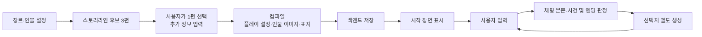

## 5-2. AI 호출 구조

호출 계층·공급자 어댑터·이미지 통로는 [AI Design §3-1](../design/3-ai-server-design.md#3-1-호출-경계와-요청-흐름)이 소유합니다. 기능별 입출력·실패 계약은 다음 절을 따릅니다.

## 5-3. API 기능과 처리 흐름

모든 생성 API는 백엔드가 호출하는 내부 API입니다. 공통 경로는 `/api/v1`이며 아래 표에서는 생략합니다.

| 기능 | 경로 | 핵심 입력 → 출력 | 관측 feature |
| --- | --- | --- | --- |
| 스토리라인 | `POST /story/storylines` | 장르·인물 → 이야기 3편·추천정보 | `storyline_generation` |
| 컴파일 | `POST /story/compile` | 선택 이야기·추가정보·인물·로어북 → 플레이 설정·이미지 | `story_completion` |
| 채팅 본문 | `POST /chat/turns` | 설정·이력·사용자 입력 → 다음 장면·대사(SSE) | `chat_response` |
| 자식 이미지 | 채팅 턴 내부 호출 | 부모 이미지·최근 대화 → 자식 이미지(base64), 실패 시 부모 대체 | Langfuse `이미지 생성:자식` 및 채팅 결과 기록 |
| 사건·엔딩 판정 | 채팅 턴 내부 호출 | 진행 재료·생성된 본문 → 목표·완결 사건·엔딩 | `chat_response`에 합산 |
| 선택지 | `POST /chat/choices` | 턴 재료·생성된 본문 → 다음 행동 3개 | `choice_generation` |
| 인물 이미지·표지 | 컴파일 내부 호출 | 장르·인물 외형 → 이미지 바이너리(base64) | AI Sentry 전용 `character_image_generation`·`thumbnail_image_generation` |

### 5-3-1. 공통 사항

인증은 백엔드 경계가 담당합니다. 요청·REST 응답은 snake_case이며, SSE `completed`와 이미지 이벤트의 필드는 camelCase입니다. 성공 응답의 `meta`는 [운영과 관측](#5-6-운영과-관측)을 따릅니다. 요청 스키마 위반은 422입니다.

SDK 내부 재시도는 모델 호출 안에서 일어나며 [시간 제한](#5-4-프롬프트와-모델-설정)과 [횟수 기록](#5-6-운영과-관측)에 설명합니다.

### 5-3-2. 스토리라인 생성

장르와 인물 정보를 프롬프트에 넣어 이야기 후보를 만듭니다. 아래 기능별 그림의 모델은 문서 상단 기준 코드의 기본값이며, 설정으로 변경할 수 있습니다.

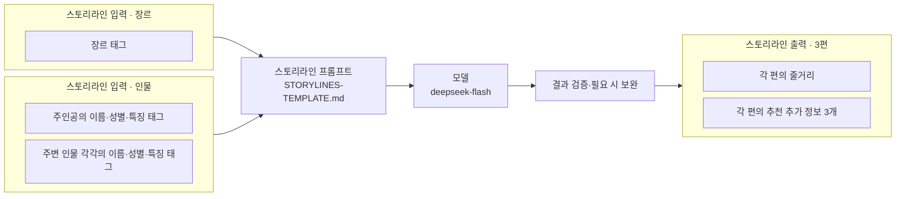

프롬프트: [스토리라인](../../../manyak-ai/prompt/story/STORYLINES-TEMPLATE.md).

요청·응답 예시와 필드 설명: [스토리라인 API 명세](#5-9-1-스토리라인-생성).

인물의 미정 값은 LLM이 채웁니다. 주변 인물 0~5명·특징 최대 3개 제한은 백엔드가 담당합니다. 이름을 채운 인물 간 중복은 정규화 후 422로 거부합니다.

응답은 비어 있지 않은 줄거리 3편과 편당 평서문 추천 정보 3개입니다. id는 코드가 1·2·3으로 덮어씁니다.

이야기 3편은 서술 초점·핵심 갈등·지배 정서·무대·구조가 서로 달라야 합니다. 장르와 인물 특징의 귀속을 지키는 것은 품질 기준이며, 코드가 내용의 충족을 보장하지는 않습니다.

#### 스토리라인 보완 호출

이름 지은 주변 인물이 빠진 편만 최대 2회 다시 생성해 기존 결과에 합칩니다. 보완 결과가 계약을 깨면 원본을 유지하고, 이름 누락만 남으면 결과를 200으로 반환하며 Sentry 경고를 남깁니다. JSON·편수·필수 형식 오류는 이름 보완과 별개로 같은 프롬프트를 최대 2회 재호출하고, 그래도 해결되지 않으면 502를 반환합니다.

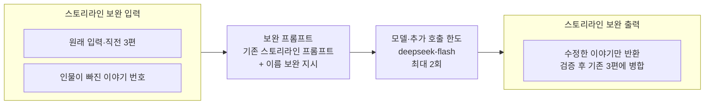

보완 지시 조립: [스토리라인 프롬프트 조립](../../../manyak-ai/src/services/prompt.py).

### 5-3-3. 스토리 컴파일

선택한 줄거리를 플레이 설정으로 확장합니다. 생성된 인물 외형은 아래 이미지 생성의 입력으로 이어집니다.

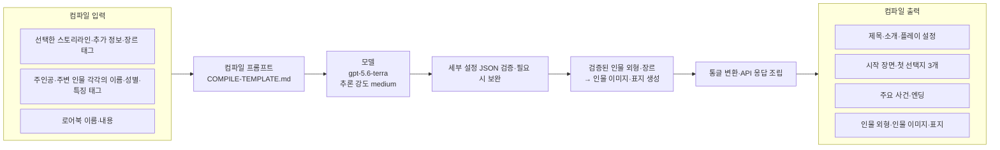

프롬프트: [기본 컴파일](../../../manyak-ai/prompt/story/COMPILE-TEMPLATE.md). Google 공급자를 선택하면 [Gemini용 컴파일](../../../manyak-ai/prompt/story/COMPILE-TEMPLATE-gemini.md)로 전환합니다.

요청·응답 예시와 필드 설명: [컴파일 API 명세](#5-9-2-스토리-컴파일).

`story_settings`는 통글 4필드이며, 저장용 장르는 백엔드가 입력 태그로 채웁니다. 엔딩은 해피·노말·배드 각 1개를 생성 지침으로 사용하되 유형 필드는 반환하지 않습니다. 인물 외형 항목은 외형 누락이 있어도 유지하며, 인물 이미지·썸네일의 성공과 실패 구조는 아래 개별 설명을 따릅니다.

생성된 제목·소개·플레이 설정·시작 설정·첫 선택지·주요 사건에 누락이 있으면 문제 부분을 모아 최대 2회 보완합니다. 이후에도 필요한 값이 부족하거나 최종 형식이 맞지 않으면 502를 반환합니다. 엔딩·인물 외형도 보완을 시도하되, 끝내 부족하면 엔딩은 빈 배열로 반환하고 외형이 부족한 인물의 이미지 생성은 생략합니다.

상세 구조는 [컴파일 스키마](../../../manyak-ai/src/schemas/story_compile.py), 검증은 [컴파일 서비스](../../../manyak-ai/src/services/story_llm.py)를 따릅니다.

컴파일은 세부 설정 JSON을 검증·보완한 뒤 통글로 변환합니다. 입력한 장르·주인공 이름·성별·주변 인물 이름은 코드가 보존합니다. 인물 카드 1~5명 중 입력 인물을 우선 포함합니다. 이름 비교는 NFC 정규화·앞뒤 공백 제거·대소문자 무시 기준이며 NFKC 전각 정규화는 하지 않습니다. 통글 헤더 매핑은 [컴파일 상세](../../../manyak-ai/spec/story/2-COMPILE.md)에 둡니다.

그림의 실패 분기는 스토리 전체를 실패시키는 조건과 부가 결과만 비우는 조건을 구분합니다.

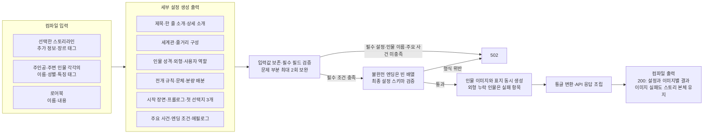

#### 컴파일 보완 호출

기존 설정과 수정 대상을 프롬프트에 더해 필요한 부분만 다시 받습니다.

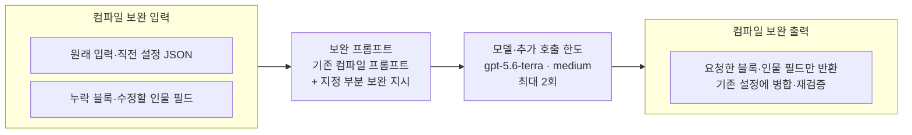

보완 지시 조립: [컴파일 프롬프트 조립](../../../manyak-ai/src/services/prompt.py).

#### 이미지 생성 공통 사항

인물 이미지와 썸네일은 컴파일 내부에서 `IMAGE_MODEL`(기본 `gpt-image-2.5-flare`)로 생성하며 별도의 외부 요청 API는 없습니다. 최대 6건을 동시에 호출하고 모두 끝난 뒤 컴파일 응답에 담습니다. 컴파일이 없는 일반 제작에는 이 생성이 없습니다.

WebP를 base64로 반환하고 백엔드가 저장합니다. 성공은 `image_base64`가 문자열인지로 판단합니다. 실패해도 `content_type`은 `image/webp`이며 스토리 본체와 이미지 응답 필드는 유지합니다. 공급자 실패 사유는 `timeout`·`rate_limited`·`rejected`·`generation_failed`로 나누며, 정확한 원인 대신 큰 분류를 나타냅니다. 아래 그림은 성공 경로입니다.

#### 인물 이미지 생성

채팅에서 해당 인물이 말할 때 보여줄 기본 이미지입니다. 외형 6필드가 모두 채워진 인물별로 한 장(기본 1024×768), 최대 5장을 생성합니다. 외형이 부족한 인물은 호출을 생략하고 `appearance_missing` 실패 항목을 반환합니다. 한 인물의 실패는 다른 인물 생성을 막지 않으며, 인물 이미지 파이프라인 전체 오류는 빈 배열로 반환합니다.

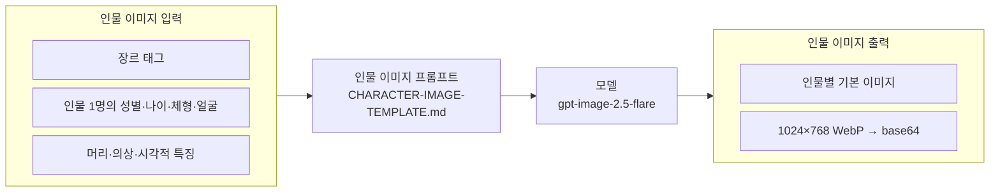

프롬프트: [인물 이미지](../../../manyak-ai/prompt/image/CHARACTER-IMAGE-TEMPLATE.md).

#### 썸네일 생성

스토리 목록 등에서 이야기를 대표하는 표지 한 장(768×1024 고정)입니다. 인물 이미지를 합성하지 않고, 장르와 선택한 인물의 외형 정보로 별도 생성합니다.

외형이 모두 채워진 인물 중 카드 순서 앞 1~2명을 사용합니다. 그런 인물이 없으면 첫 번째 인물의 채워진 정보만 사용하고 빈 외형 필드는 제외합니다. 인물 카드 자체가 없을 때만 장르만 사용합니다. 실패 시에도 `thumbnail_image`는 null이 아닌 실패 객체로 반환합니다.

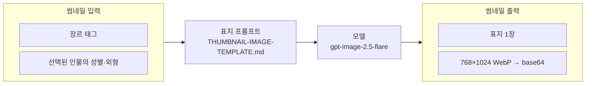

프롬프트: [썸네일](../../../manyak-ai/prompt/image/THUMBNAIL-IMAGE-TEMPLATE.md).

### 5-3-4. 채팅 턴

채팅 본문·사건 및 엔딩 판정·선택지는 서로 다른 프롬프트로 호출합니다. 세 호출의 기본 모델은 모두 `deepseek-flash`(`CHAT_MODEL`)입니다.

**채팅 본문 생성**

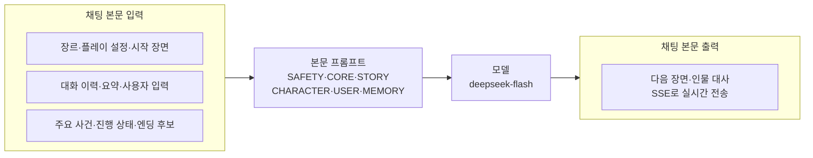

**사건·엔딩 판정**

위에서 생성한 본문을 아래 판정 입력에 넣습니다. 판정 재료와 시간이 있을 때 호출합니다.

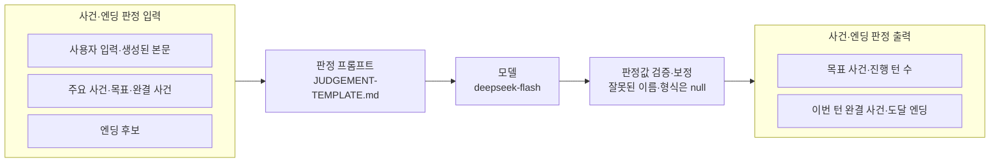

프롬프트: [본문의 6개 레이어](../../../manyak-ai/prompt/chat), [판정](../../../manyak-ai/prompt/chat/JUDGEMENT-TEMPLATE.md), [선택지](../../../manyak-ai/prompt/chat/CHOICES-TEMPLATE.md). 기존 인물 이미지 URL은 코드가 대사에 연결하며 위 모델의 입력에 넣지 않습니다.

요청·응답 예시와 필드 설명: [채팅 턴 API 명세](#5-9-3-채팅-턴).

`history`·`main_events`·`occurred_main_event_names`·`endings`·`character_images`는 생략 시 빈 배열, `target_main_event`·`user_source`는 null입니다. 주요 사건은 최대 10개입니다. 엔딩의 최소 턴 충족 여부와 이미 도달했는지는 백엔드가 걸러 전달합니다. `user_source`는 `choice`·`edited_choice`·`typed` 중 알려진 값만 관측하며 잘못된 값으로 턴을 거부하지 않습니다. 이미지 이름은 생략·빈 문자열·null을 허용하고, 이미지 매핑은 채팅 본문 프롬프트에 넣지 않습니다. `generate_child_image`는 생략 시 false입니다.

현재 기준에서는 백엔드가 전체 History를 보내고 오프닝은 `start_settings`로 전달합니다. 최근 10턴 제한·History 오프닝 시드는 AI 내부 설계와의 미해소 차이입니다. 현재 백엔드가 보내는 `summary`는 빈 문자열입니다. AI는 전달된 이력을 자르거나 요약하지 않습니다.

본문은 `*지문*`과 `인물명: 대사`로 구성하고 최소 한 인물의 대사를 요구합니다. 턴당 700~1000자는 프롬프트 목표이며 코드 상한이나 실측 보장값이 아닙니다. AI는 첫 턴·재생성을 구분하지 않습니다. 재생성 시 이번 턴을 제외한 이력과 같은 사용자 입력을 보내는 것은 백엔드 책임입니다.

다음 그림은 자식 이미지 생성을 끈 요청의 본문·판정·선택지 호출 순서입니다. AI의 완료 이벤트는 판정을 기다리지만 선택지는 기다리지 않습니다.

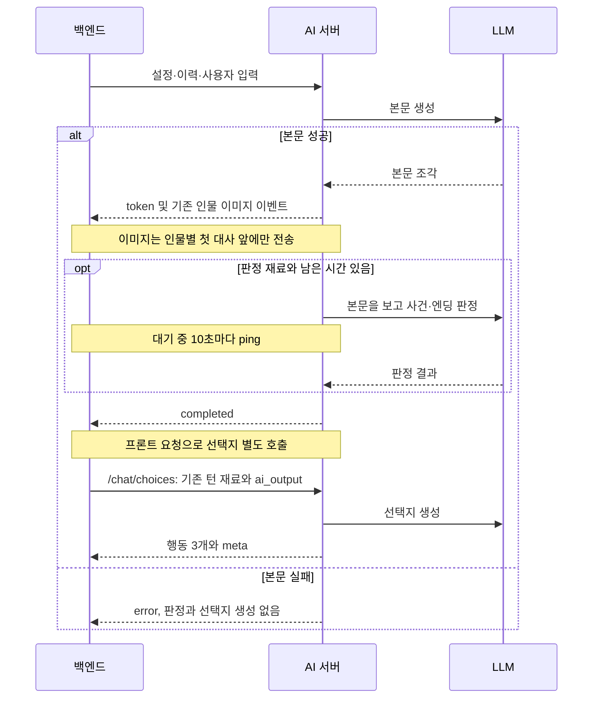

`started` 발행과 `chatId`·`turnId` 부착은 백엔드 책임입니다. 이미지 매핑에 있는 인물의 첫 대사 바로 앞에 턴당 한 번만 이미지 이벤트를 보냅니다. 정식 이름과 별칭은 같은 인물로 처리하며, 표시 기록은 요청마다 초기화합니다. 완료 본문에는 해당 첫 대사 줄 위에 `[[URL]]`과 빈 줄을 넣고, `characterImages[]`에 이벤트와 같은 순서로 인물별 한 항목씩 `{name, imageName, imageUrl}`을 담습니다. `imageName`은 요청값을 그대로 전달합니다.

화자 감지는 정식 이름과 충돌하지 않는 줄임 이름을 허용하고, 볼드 라벨을 평문으로 정리합니다. 자식 이미지 생성을 끈 요청에서는 매핑의 빈 이름·URL을 추가 검증하지 않으며 중복 이름은 마지막 항목을 씁니다. 다음 LLM 입력은 복사본에서만 마커·뒤 줄바꿈 최대 2개를 제거합니다(채팅은 History, 선택지는 History·본문, 판정은 본문). 옛 `[character:이름]` 태그와 `summary`는 제거 대상이 아닙니다. 세부 감지 규칙·경계 사례는 [채팅 상세](../../../manyak-ai/spec/chat/4-SERVICE-IMPLEMENTATION.md)와 [기존 이미지 결정](../adr/3-ai-server-adr.md#기존-인물-이미지-계약)을 참조합니다.

#### 부모 이미지와 자식 이미지

**부모 이미지**는 컴파일에서 만든 기본 인물 이미지입니다. 요청 매핑의 `image_name`이 정확히
`{인물이름}_기본`이고 `image_url`이 비어 있지 않은 항목을 사용합니다. **자식 이미지**는 부모
이미지를 바탕으로 현재 대화 상황에 맞춰 실시간 생성하는 이미지입니다. 이전 자식 이미지는
다음 생성의 부모로 사용하지 않습니다.

**1. 전체 흐름 · 컴파일에서 채팅까지**

```mermaid
%%{init: {"flowchart": {"nodeSpacing": 12, "subGraphTitleMargin": {"top": 8, "bottom": 24}}}}%%
flowchart LR
    subgraph I["컴파일 입력"]
        direction LR
        I_item1["<div style='width:240px;text-align:center;'><span>장르·인물 외형</span></div>"]
    end
    P["부모 이미지 생성"]
    SAVE["백엔드: 부모 저장<br/>기본 이미지 이름·URL 보관"]
    subgraph C["채팅 입력"]
        direction LR
        C_item1["<div style='width:240px;text-align:center;'><span>부모 이미지 매핑</span></div>"]
        C_item2["<div style='width:240px;text-align:center;'><span>최근 대화</span></div>"]
        C_item3["<div style='width:240px;text-align:center;'><span>현재 본문</span></div>"]
    end
    SELECT["부모가 있는 첫 화자 선택"]
    CHILD["부모 파일 + 대화로<br/>자식 이미지 생성"]
    RESULT["백엔드: 생성·저장 성공이면 자식 선택<br/>실패·시간 초과이면 부모 선택"]
    subgraph O["채팅 출력"]
        direction LR
        O_item1["<div style='width:240px;text-align:center;'><span>최종 이미지 → 대사 순서로 표시</span></div>"]
        O_item2["<div style='width:240px;text-align:center;'><span>완료 본문·이미지 참조를 턴에 저장</span></div>"]
    end
    I --> P
    P --> SAVE
    SAVE --> C
    C --> SELECT
    SELECT --> CHILD
    CHILD --> RESULT
    RESULT --> O
```

그림은 부모가 준비되어 있고 자식 생성이 켜진 채팅 흐름입니다. 자식 생성이 꺼져 있거나
부모가 있는 화자가 없으면 자식 생성은 생략하고 기존 이미지 표시를 유지합니다. 본문 생성
실패는 오류로 종료합니다. 판정과 이미지의 병렬 실행은
[Design의 호출 순서](../design/3-ai-server-design.md#자식-이미지가-있는-채팅-흐름)를 따릅니다.

**2. 부모 이미지 생성 · 컴파일 시점**


입력은 장르와 인물 외형이며 참조 이미지 파일은 없습니다. 외형이 모두 채워진 인물별로
기본 이미지 한 장을 생성합니다. AI는 `{인물이름}_기본` 이름과 base64를 반환하고 백엔드가
파일을 저장해 URL을 보관합니다. 이 저장 이미지가 채팅의 부모가 됩니다.
외형 누락·생성 실패 처리는 [인물 이미지 생성](#인물-이미지-생성)을 따릅니다.

프롬프트: [인물 이미지](../../../manyak-ai/prompt/image/CHARACTER-IMAGE-TEMPLATE.md).
아래 자식 그림과 함께 모델은 선택한 `gpt-image-2.5-flare`를 표시하며, 코드 전환 여부는
[Design §3-2](../design/3-ai-server-design.md#3-2-프롬프트와-모델-설정)를 따릅니다.

**3. 자식 이미지 생성 · 채팅 시점**

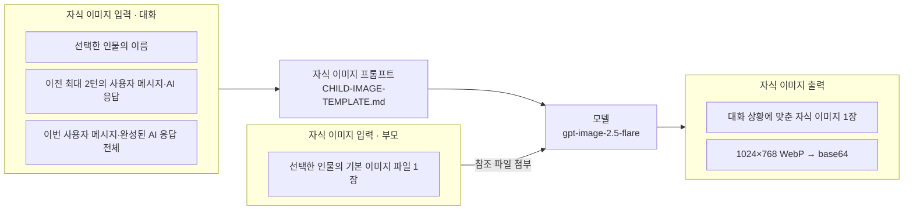

프롬프트: [자식 이미지](../../../manyak-ai/prompt/image/CHILD-IMAGE-TEMPLATE.md).
모델은 선택한 `gpt-image-2.5-flare`를 표시합니다. 실제 코드 설정은
[Design §3-2](../design/3-ai-server-design.md#3-2-프롬프트와-모델-설정)에서 구분합니다.


| 모델에 전달하는 입력 | 실제 내용 |
| --- | --- |
| 부모 이미지 | 선택한 인물의 기본 이미지 **파일 1장**. AI 서버가 URL에서 내려받아 첨부하며 URL 문자열을 참조 이미지 대신 보내지 않습니다. |
| 편집 지시 | 자식 이미지용 고정 프롬프트. 부모 이미지를 바탕으로 대화 상황에 맞게 편집하도록 지시합니다. |
| 대상 인물 | 선택한 인물의 정식 이름. 다른 인물의 이미지 파일은 첨부하지 않습니다. |
| 이전 대화 | 최근 최대 2턴의 **사용자 메시지 + AI 응답**. 오래된 턴부터 순서대로 넣으며, 이력이 부족하면 있는 턴만 보냅니다. |
| 현재 대화 | **이번 사용자 메시지 + 방금 완성된 AI 응답 전체**. 선택한 인물의 대사만 잘라서 보내지 않습니다. |
| 생성 옵션 | 이미지 1장, 설정된 크기·화질, WebP 출력. 모델·옵션의 실제 설정은 [Design §3-2](../design/3-ai-server-design.md#3-2-프롬프트와-모델-설정)를 따릅니다. |

편집 지시·인물 이름·대화는 하나의 텍스트 프롬프트로 전달하고, 부모 파일은 별도 이미지 입력으로
첨부합니다. 이미지 모델용으로 별도의 대화 요약을 만들지 않습니다. 세계관·인물 설정 전체,
사건·엔딩 판정 결과, 전체 대화 이력은 별도 입력으로 보내지 않습니다. 저장 마커는 이전 대화와
현재 AI 응답의 복사본에서 제거합니다.

| 모델에서 받는 출력 | AI 서버의 처리 |
| --- | --- |
| 자식 이미지 데이터 | WebP 이미지의 base64 데이터를 받아 `generatedImage.imageBase64`로 전달합니다. |
| 토큰 사용량 | 응답에 있으면 Langfuse에 기록합니다. 사용량이 없으면 0으로 추정하지 않습니다. |
| 오류 또는 시간 초과 | 자식 이미지를 사용하지 않고 실패 코드와 부모 대체 정보를 전달합니다. |

**이미지 이름·실패 코드·부모 대체 정보는 AI 서버가 붙입니다. 저장 URL은 백엔드가 저장 후
결정합니다.** 이미지 모델이 `generatedImage` 이벤트나 최종 저장 URL을 만들어 주는 것은 아닙니다.

다운로드와 생성을 합쳐 최대 30초이며, 남은 턴 시간이 짧으면 그만큼 줄입니다.
생성에 성공해도 백엔드 저장에 실패하면 부모를 선택합니다. 백엔드는 선택한 이미지를 먼저
전달하고 뒤 대사를 중계하며, AI의 완료 이벤트를 받으면 해당 본문 마커와 이미지 목록을
최종 선택값으로 맞춰 저장합니다.

연결이 끊기면 진행 중인 호출을 취소합니다. 위 흐름의 부모 대체는 생성 실패·시간 초과·저장
실패에 적용하며, 연결 종료 후 이미지를 계속 만들거나 뒤늦게 표시하는 흐름은 아닙니다.

`generate_child_image=true`이면 다음 순서로 처리합니다.

1. 본문 전체가 완성되면 **부모 이미지가 있는 인물 중 처음 말한 인물** 한 명을 선택합니다.
   앞서 말한 인물에게 부모 이미지가 없으면 건너뜁니다. 대상이 없으면 이미지 생성은 생략합니다.
2. 선택한 부모 이미지와 현재 턴을 포함한 최근 최대 3턴으로 자식 이미지를 한 장 생성합니다.
   이전 이력은 인접한 USER·ASSISTANT 한 쌍을 한 턴으로 세어 최근 2쌍을 사용합니다.
   짝 없는 오프닝·메시지는 세지 않습니다. 현재 턴에는 사용자 입력과 완성된 본문 전체를 넣습니다.
3. 본문 완성 후 사건·엔딩 판정과 이미지 생성을 동시에 시작합니다. 앞 지문을 보내고, 선택된
   인물의 첫 대사 앞에서 이미지 결과를 기다립니다. 이미지가 먼저 준비되면 이미지·대사를
   보내며, `completed`는 판정까지 끝난 뒤 보냅니다. 다른 인물은 요청의 기본 이미지를 우선
   사용하고 기본 이미지가 없으면 기존 매핑을 사용합니다. 별칭 충돌은 전체 매핑으로 판단합니다.
4. 생성 성공이면 해당 `character_image`에 `generatedImage`를 한 번만 첨부합니다. 실패·시간
   초과이면 자식 데이터는 null이고 부모 이미지로 대체합니다. 본문 실패는 `error`로 종료하며
   이미지·판정을 호출하지 않습니다. 본문 수집·이미지·판정 대기 중에는 10초마다 `ping`을 보냅니다.

이미지는 부모 다운로드를 포함해 최대 30초, 판정은 최대 60초 기다립니다. 두 호출은 각각
턴 전체 120초에서 경과 시간과 저장·완료 처리 여유 15초를 뺀 시간까지만 사용합니다. 본문
수집도 같은 마감 시각을 적용합니다. 이미지의 시간 초과는 전달 시각이 아닌 생성 완료 시각으로
판단합니다. 연결이 끊기면 진행 중인 호출을 취소하고 정리하며, 채팅을 나간 뒤 계속 생성하지
않습니다. 15초 여유는 백엔드 저장 완료 시간을 보장하지 않습니다.

**저장과 최종 표시 주소는 백엔드가 결정합니다.** AI의 바깥 이미지 필드와 `completed`의
`aiOutput`·`characterImages`에는 부모 주소가 들어 있습니다. 백엔드는 자식 base64를 저장한 뒤
성공하면 자식 이름·URL을, 생성 또는 저장 실패이면 부모 이름·URL을 선택해 프론트에 보냅니다.
base64 이벤트를 그대로 중계하지 않으며, 저장하는 동안 뒤 대사 중계를 기다립니다. 부모를 먼저
보여 줬다가 자식으로 교체하지 않습니다.

백엔드는 최종 선택한 값으로 완료 목록의 해당 인물 항목과 그 순서에 대응하는 본문 마커를 함께
교체하고 해당 턴·응답 버전에 저장합니다. 같은 URL을 쓰는 다른 인물이 있을 수 있으므로 URL
전체 치환은 하지 않습니다. 취소·교체된 응답에 늦은 저장 결과를 연결하지 않습니다. 백엔드가
이 저장·교체 처리를 지원할 때만 `generate_child_image=true`를 보냅니다.

#### 사건·엔딩 진행 상태

목표가 없거나 완결된 직후에는 `targetMainEvent`가 null입니다. 진행 규칙은 다음과 같습니다.

- 사용자 입력과 관련된 사건 하나를 목표로 삼고, 방향을 명확히 바꿀 때만 교체하며 새 목표의 진행 카운터는 0부터 시작합니다. 관련 턴에서 1~10턴 내 개연성 있게 완결하며 무관한 턴은 진행 카운터를 유지합니다. 본문을 결말로 강제 수렴하지 않습니다.
- 엔딩은 달성 조건 충족과 실제 본문이 해당 엔딩으로 맺어짐을 모두 만족해야 기록합니다. 특정 사건 경유를 별도로 강제하지 않으며, 완결 사건 목록은 판단의 맥락으로 참고합니다. 엔딩 후보가 없으면 엔딩을 판정하지 않습니다.
- 판정 재료가 없으면 호출을 생략합니다. 남은 시간 없음·시간 상한 초과는 요청의 목표·카운터를 그대로 반환하고 완결·엔딩은 null입니다. 그 밖의 판정 실패는 세 필드 null로 흡수하고 본문은 정상 완료합니다.

### 5-3-5. 선택지 생성 (별도 API)

채팅이 완료된 뒤 `POST /api/v1/chat/choices`로 다음 행동을 요청합니다. 그림은 프롬프트에 사용하는 입력과 반환되는 선택지를 보여줍니다.

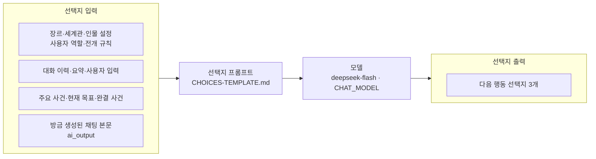

프롬프트: [선택지 생성](../../../manyak-ai/prompt/chat/CHOICES-TEMPLATE.md). 재호출·고정 문구 보완은 아래 계약과 [보완 호출 흐름](#선택지-보완-호출)을 따릅니다.

요청·응답 예시와 필드 설명: [선택지 API 명세](#5-9-4-선택지-생성).

입력은 채팅 턴 재료와 `ai_output`(방금 생성한 본문)입니다. `history`는 이번 턴이 없는 메인 턴 요청과 동일한 스냅샷이어야 합니다. 유효한 요청의 생성 실패도 폴백으로 흡수해 200입니다(스키마 위반은 422).

목표 사건 방향 1개·미완결 비목표 사건 방향 1개·사용자 맥락 방향 1개를 제안합니다. 사건이 없거나 모두 완결되면 서로 다른 행동을 제안하는 규칙으로 대체합니다. 부족한 개수만 최대 2회 더 받고, 그래도 부족하면 중립 행동으로 채우며 초과하면 앞 3개만 남깁니다. 선택지는 이력에 저장하지 않고 사용자가 고른 행동이 다음 `user_input`이 됩니다. 프론트 별도 트리거 전환은 완료됐습니다(기존 A11의 배포 기록).

#### 선택지 보완 호출

기존 선택지와 부족한 개수를 프롬프트에 더해 추가 선택지를 받습니다.

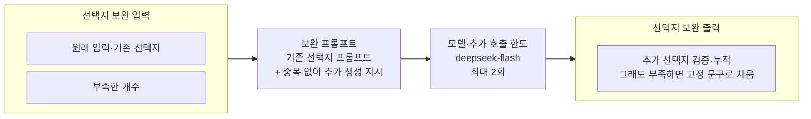

보완 지시 조립: [선택지 생성 서비스](../../../manyak-ai/src/services/chat_choices.py).

### 상태 확인 · GET /api/v1/health

LLM을 호출하지 않고 서비스 상태와 앱 버전을 반환합니다. [상태 확인 API 명세](#5-9-5-상태-확인).

## 5-4. 프롬프트와 모델 설정

프롬프트 조립·모델별 설정·기동 검사는 [AI Design §3-2](../design/3-ai-server-design.md#3-2-프롬프트와-모델-설정)이 소유합니다. API의 입력 의미·실패·관측 필드는 이 Spec을 따릅니다.

## 5-5. 오류와 실패 코드

| 실패 지점 | 사용자에게 반환하는 결과 |
| --- | --- |
| 요청 스키마 | 422 |
| 스토리 JSON·필수 계약·공급자 호출 | 가능한 보완 후 502. 이름 등장 검증·엔딩·이미지 예외는 각 기능 계약 적용 |
| 채팅 본문 | 열린 SSE 안의 `error`, 코드 `LLM_ERROR`. 성공 완료 이벤트 없음 |
| 판정 | 본문 유지, 판정값 null. 시간 예산으로 중단한 경우만 기존 목표 보존 |
| 선택지 | 재호출·고정 폴백으로 3개 반환 |
| 설정 오류 | 기동 또는 호출 전 실패. 공급자 장애로 분류하지 않음 |

Sentry 실패 코드는 `provider_timeout`, `provider_rate_limited`, `provider_bad_request`, `provider_unavailable`, `invalid_ai_response`, `schema_validation_failed`, `unexpected_error`입니다. `content_filter_blocked`는 예약값입니다. 분류 의미는 [관측 카탈로그](6-analytics.md#6-6-9-ai_call_logs-기록-기준)를 따르며, 백엔드 로그의 자체 오류 코드나 SSE 코드와 구분합니다. story 오류에는 정제된 한국어 메시지만 반환합니다(시간 초과·일시 제한·요청 거부·연동 오류·잘못된 응답 형식·컴파일 형식 불일치). 공급자 원문은 반환하지 않습니다. 정확한 문구는 [스토리 생성 서비스](../../../manyak-ai/src/services/story_llm.py)가 관리합니다. 형식 보정은 코드펜스 제거·화자 볼드 정리·입력값 보존·빈 필드 검증입니다. 품질 충족 여부까지 코드로 보장하지 않습니다.

## 5-6. 운영과 관측

성공 응답 `meta`는 `model`, `provider`, `prompt_versions`, `input_token_count`, `output_token_count`, `retry_count`를 담습니다(SSE completed는 camelCase). 본문·판정 토큰은 합산하고 선택지는 별도 집계합니다. 스토리라인은 응답을 받은 invalid 시도의 usage도 포함합니다. 예외로 usage를 못 받은 호출은 누락되므로 토큰 합계가 실제 청구액과 같다고 보장하지 않습니다. 런타임 금액 계산은 미구현입니다.

확인할 수 없는 토큰 수는 해당 필드를 생략하거나 0으로 바꾸지 않고 `null`로 반환합니다. `retry_count`는 SDK 내부 재시도를 제외한 서비스의 추가 호출 횟수입니다. 스토리라인은 형식 재호출·이름 보완을 합쳐 0~4, 컴파일은 부분 보완 0~2, 선택지는 추가 생성 0~2입니다. 채팅 완료 응답은 항상 0이며, SDK 내부에서 재시도가 없었다는 뜻은 아닙니다.

| 기록 | 현재 계약·상세 정본 |
| --- | --- |
| 요청 연결 | `X-Manyak-Request-Id` → `request_id`, `X-Manyak-Session-Id`·`X-Manyak-Device-Id-Hash` → 요청 컨텍스트. 누락·unknown은 생략 |
| 제품 연결 | 제작·이야기·채팅·턴 연결 헤더 9종을 정규화하고 호출별 허용 metadata에만 기록. 정확한 이름·타입·적용 호출은 [백엔드 관측](4-backend-server-spec.md#4-7-운영과-관측) |
| 연결 키 의미 | `creation_id`는 스토리라인 요청 UUID인 `trace_creation_id`. 분석 세션 `analytics_creation_id`와 다릅니다. `request_id`로 백엔드와 trace를 연결하며 AI는 trace ID를 응답하지 않습니다. |
| Sentry | feature·provider·model·error_code 태그와 prompt_versions·retry_count·latency_ms 컨텍스트. 원문·인물 이름·키는 보내지 않으며 SSE 실패는 직접 캡처 |
| 선택지 보완 기록 | 시간 초과·파싱 실패 등 예외는 `choice_generation`으로 Sentry에 기록. 정상 응답의 개수 부족을 고정 선택지로 채운 경우에는 서버 경고 로그만 기록 |
| stdout 로그 | 앱·접근 로그는 한 줄 JSON, 요청 식별자 공유. 성공한 health 접근 로그만 제외하며 다른 접근·실패 health는 보존 |
| Langfuse | 요청별 trace에 구조화 입력과 연결 metadata. 채팅 턴에만 `user_source` 기록하고 선택지 입력·metadata에서는 제외. 호출별 허용 키는 아래 표를 따름 |
| Langfuse 이미지 관측 | 컴파일 trace 안에 인물 이미지·썸네일 호출마다, 채팅 trace 안에 자식 이미지 호출마다 generation 관측을 남깁니다(이름 `이미지 생성:인물`·`이미지 생성:썸네일`·`이미지 생성:자식`). 입력은 이미지 프롬프트, 출력은 형식과 바이트 수(이미지 바이너리는 싣지 않음), 모델·크기·화질·출력 형식을 함께 기록합니다. usage는 표준 키 `input`·`output`·`total`과 세부 키 `input_text`·`input_image`·`output_text`·`output_image`이며, 응답에 없는 값은 생략합니다. 실패는 ERROR와 예외 타입 이름만 남기고 오류 원문은 싣지 않습니다. 비용은 Langfuse 모델 단가 등록에 따릅니다([AI Design §3-3](../design/3-ai-server-design.md#3-3-관측과-런타임-설정)) |
| 자식 이미지 결과 | 생성 기능을 켠 채팅의 루트 관측에 `child_image`를 기록합니다. 전체 생성 시간·결과·실패 및 생략 이유·부모 대체 여부·프롬프트 버전을 담습니다. 인물 이름·이미지 이름·URL·base64는 넣지 않으며, 사용량·비용은 이미지 generation에만 기록합니다. 정확한 필드는 [AI Design §3-3](../design/3-ai-server-design.md#3-3-관측과-런타임-설정)을 따릅니다. |
| DeepSeek 단가 구간 | DeepSeek 텍스트 호출(스토리라인·채팅 본문·판정·선택지)의 generation 관측에 metadata `pricing_window`를 기록합니다. 값은 `peak`(UTC 월~금 01:00~04:00·06:00~10:00, 시작 포함·끝 제외) 또는 `off_peak`이며, Langfuse가 이 값으로 단가 구간을 고릅니다. Langfuse가 꺼져 있으면 기록하지 않습니다 |

| 루트 trace | 구조화 입력 | 제품 연결 metadata |
| --- | --- | --- |
| 스토리라인 | 요청 전체 | `creation_id`, 선택적 `parent_creation_id` |
| 컴파일 | 요청 전체 | `creation_id`, `storyline_id`, `storyline_order` |
| 채팅 턴 | 요청 전체 | `creation_id`, `story_id`, `chat_id`, `start_setting_id`, `turn_number`, `is_regenerated`, 선택적 `user_source` |
| 선택지 | `user_source` 제외 | 채팅 턴과 같되 `user_source` 제외 |

Langfuse의 `session_id`는 클라이언트 접속 세션으로 여러 채팅을 포함할 수 있으며 `chat_id`와 다릅니다. `user_id`에는 원본 기기 식별자 대신 기기 식별자의 해시를 기록합니다.

관측 SDK 활성화·격리·종료 flush와 환경 변수 적용은 [AI Design §3-3](../design/3-ai-server-design.md#3-3-관측과-런타임-설정)을 따릅니다.

## 5-7. 검수와 남은 제약

API 형식·필드 보존·부분 실패·SSE 순서·관측 격리는 AI 레포의 도커 테스트(`scripts/test.sh`·`scripts/test.ps1`)로 검수합니다. 프롬프트·판정 품질은 라이브 실측이 별도로 필요하며 유닛 테스트로 대신하지 않습니다. 호출 전 규모를 보고하고 승인받습니다. 조립 미리보기는 무과금 로컬 스크립트입니다.

현재 제약은 전체 History·오프닝 시드 차이(A3·A4), 출력 한도 미정(A8), 엔딩 판정 강화 미실측(A10), 전체 시간 예산·취소 전파 부족(A1·A11·A12·A15·A18), 공급자 배치·계측 부족(A13), 모델 별칭(A14), 시간 초과 외 판정 실패의 상태 초기화 위험(A16), 요약 마커 미정(A20)입니다. 인물 이미지 매핑·극단 라벨 입력은 수용한 제약(A19·A22)입니다. 종전 추적 항목 전체와 판단 근거는 [ADR 추적 이력](../adr/3-ai-server-adr.md#기존-제약과-후속-판단-이력)에 남깁니다.

다른 서비스의 배포 여부는 해당 서비스 명세가 정본입니다. 구현 동기화 때는 기준 코드 SHA를 갱신하고 현재 계약만 이 문서에 반영하며, 결정이 바뀌면 ADR에 근거를 남깁니다.

## 5-8. 평가 시스템

[manyak-autoresearch](../../../manyak-autoresearch/README.md)는 평가 프롬프트를 검증·개선하는 연구 레포입니다. 평가 호출은 사용자 요청 경로 밖에서 실행합니다. 평가기는 평가 프롬프트·평가 모델·점수 집계 규칙을 합친 것입니다.

### 평가 대상 구분

**평가 프롬프트의 평가**는 같은 생성 결과를 두고 평가 프롬프트를 바꾸며 사람 판단과의 일치도를 확인합니다. **제품 생성 프롬프트의 평가**는 평가 기준을 고정하고 제품 프롬프트로 만든 결과의 품질을 비교하는 것입니다. 아래에서는 채팅·이미지별로 두 대상을 구분합니다.

### 채팅 평가 프롬프트의 평가

목적은 `chat-judge`의 평가 프롬프트가 사람이 ‘더 이어가고 싶은 채팅’을 고르는 판단과 일치하는지 확인하는 것입니다. 같은 채팅 샘플을 고정하고 평가 프롬프트를 개선합니다.

| 항목 | 내용 |
| --- | --- |
| 입력 | 프롤로그·대화 전체·제공된 태그와 인물 정보 |
| 출력 | 대화별 0~100점과 판단 근거 |
| 모델·실행 | Codex CLI로 `gpt-5.6-sol` 호출, 추론 `medium`, 기본 3회 반복 |
| 비교 방식 | 각 대화를 따로 채점한 뒤, 쌍별 점수 순서를 사람의 선택과 비교 |
| 현재 상태 | 실행기 연결·개발셋 실측 있음. 독립 시험셋 검증은 미실시 |

사람 선택은 모델에 주지 않고 점수가 나온 뒤 코드로 비교합니다.

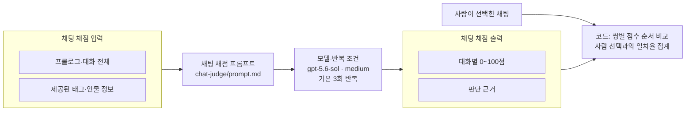

일치율은 각 반복에서 양쪽 점수가 모두 나온 쌍 중 사람이 선택한 쪽의 점수가 더 높은 쌍의 비율이며 동점은 오답입니다. 최종값은 계산 가능한 반복별 일치율의 평균입니다. 한쪽이라도 채점에 실패한 쌍은 분모에서 빠지므로, 전체·평가 완료·미평가 쌍 수와 실패 건수를 함께 보고합니다.

채팅 수집은 DB·Langfuse 기록을 연결하고 원본을 보존해 재처리합니다.

상세: [채점 프롬프트](../../../manyak-autoresearch/chat-judge/prompt.md), [실행기](../../../manyak-autoresearch/chat-judge/eval.py), [사람 평가 규칙](../../../manyak-autoresearch/chat-judge/human-evaluation-guide.md), [개선·반복·예외 규칙](../../../manyak-autoresearch/chat-judge/program.md).

### 이미지 평가 프롬프트의 평가

목적은 `image-judge`의 평가 프롬프트가 인물 이미지의 외형 일치와 오류를 사람처럼 판단하는지 확인하는 것입니다. 같은 이미지 샘플과 사람 레이블을 고정해 평가 프롬프트를 검증합니다.

| 항목 | 내용 |
| --- | --- |
| 입력 | 인물 외형 설정·평가할 이미지·스타일 참고 이미지 |
| 출력 | 질문별 답변·근거와 통과·실패·확인 불가 집계 |
| 모델·실행 | Codex CLI로 `gpt-5.6-sol` 호출, 추론 `medium`, 판독은 기본 3회 반복 |
| 비교 방식 | 외형 질문과 고정 오류 질문으로 판독한 결과를 사람 레이블과 대조 |
| 현재 상태 | 부모(기본) 이미지용 로컬 실행기 구현. 실측·사람 레이블 대조는 미실시 |

**평가 질문 생성**

인물 외형 설정에서 확인 질문을 만듭니다. 같은 입력·프롬프트·모델이면 질문을 재사용합니다.

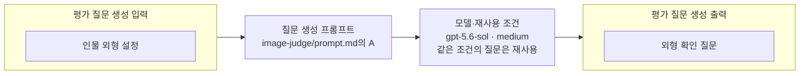

**이미지 판독·집계**

위에서 만든 외형 확인 질문에 고정 오류 질문을 더해 이미지를 판독하고, 코드가 결과를 집계합니다. 고정 질문 추가와 최종 집계에는 AI를 호출하지 않습니다.

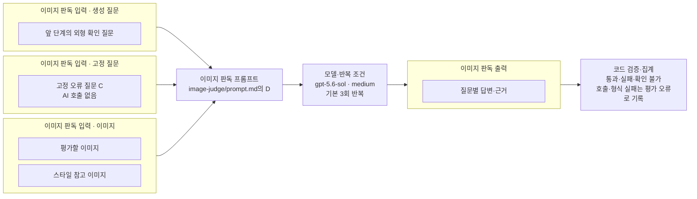

사람이 실패로 본 이미지를 통과시킨 ‘놓침’, 사람이 통과로 본 이미지를 실패시킨 ‘잘못 잡음’, ‘확인 불가’를 나눠 보고합니다. 호출·형식 실패는 평가 오류로 기록합니다.

상세: [질문·판독 프롬프트](../../../manyak-autoresearch/image-judge/prompt.md), [실행기](../../../manyak-autoresearch/image-judge/eval.py), [판정 규칙](../../../manyak-autoresearch/image-judge/program.md).

### 제품 채팅 프롬프트의 평가

평가 대상은 제품 채팅 프롬프트로 생성한 답변의 품질입니다. 현재 연구 레포에는 이 평가 실행기가 구현되어 있지 않습니다. 위 `chat-judge`의 사람 일치율은 채점기의 판단 정확도이며, 제품 답변의 품질 점수가 아닙니다.

### 제품 이미지 생성 프롬프트의 평가

평가 대상은 제품 이미지 생성 프롬프트로 만든 이미지의 품질입니다. 현재 연구 레포에는 이 평가 실행기가 구현되어 있지 않습니다. 위 `image-judge`의 사람 레이블 대조는 이미지 채점기의 판단 정확도를 확인하는 절차입니다.

### 평가 프롬프트 검증용 데이터 관리

다음은 평가 데이터에 적용하는 공통 관리 원칙입니다. 개발용·시험용 분리는 같은 스토리가 양쪽에 섞여 평가 성적이 부풀려지는 것을 막습니다. 각 평가의 구현·실측 상태는 위 개별 절을 따릅니다.

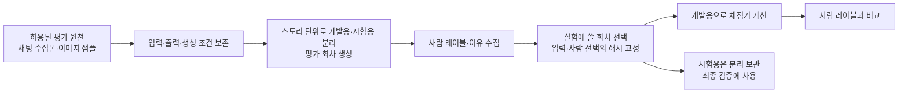

사람에게는 모델과 같은 판정 재료를 보여주고 레이블과 이유를 받습니다. 평가 회차 생성 시 같은 스토리는 개발용·시험용 중 하나에만 배정하고 입력을 보존합니다. 이후 사람이 평가하며, 실험에 쓸 회차를 선택할 때 입력·사람 선택을 포함한 해시를 고정합니다. 제외·삭제·보존 만료 자료가 섞인 회차는 무효화하며 평가에서 거부합니다. 원문·레이블·실행 상세는 Git에 올리지 않습니다. 운영 원천 평가 자산도 분석 명세의 접근·보존·제외·삭제 조건을 따릅니다. 상세는 [연구 데이터 안내](../../../manyak-autoresearch/README.md)에 있습니다.

### 평가 프롬프트 개선 사이클과 결과 보고

채팅 평가 프롬프트와 이미지 평가 프롬프트는 각각의 프로그램·데이터로 개선합니다. 아래는 공통 사이클이며, 채택 기준과 반복·예외 규칙은 각 평가 절에 연결한 프로그램을 따릅니다.

다음 그림은 평가 프롬프트 개선의 한 사이클입니다.

```mermaid
flowchart LR
    H["오답·사람 이유에서 가설"] --> P["채점 프롬프트 변경"]
    P --> E["같은 데이터·모델·반복 조건으로 평가"]
    E --> C["기준 결과와 비교<br/>개선·회귀·흔들림 확인"]
    C --> K{"채택 기준 충족?"}
    K -->|예| Y["채택·새 기준 기록"]
    K -->|아니오| N["폐기·결과는 보존"]
    Y --> H
    N --> H
```

실험 기록은 `results.tsv`(모든 시도), `runs/<실험ID>/`(상세 결과), `patch-notes.md`(채택한 변경·이유)에 남깁니다.

## 5-9. API 요청·응답 명세

아래 body는 마법 도서관 이야기를 사용한 가상 예시이며 실제 생성·실측 기록이 아닙니다. 모델은 기본값을 사용했고 버전·토큰 수는 설명용 값입니다. 본문과 설정은 구조를 보여주기 위해 짧게 작성했습니다. `BASE64_DATA`는 이미지 바이너리의 표시용 자리입니다.

컴파일 요청 표의 **필수 여부**는 O=생략 불가, X=생략 가능입니다. 응답 표의 필드는 모두 포함됩니다. `null`·빈 문자열·빈 배열 허용은 타입과 설명을 따릅니다. 중첩 필드는 부모 객체나 배열 항목이 있을 때 적용합니다. `map<string, integer>`는 프롬프트 이름을 키로, 버전을 값으로 갖는 사전입니다.

### 5-9-1. 스토리라인 생성

[기능 흐름과 동작 설명](#5-3-2-스토리라인-생성).

**Request body · POST /api/v1/story/storylines**

```json
{
  "genre_tags": [
    "판타지",
    "미스터리"
  ],
  "protagonist": {
    "name": "서윤",
    "gender": "FEMALE",
    "features": [
      "호기심 많음",
      "꼼꼼함"
    ]
  },
  "supporting_characters": [
    {
      "name": "도현",
      "gender": "MALE",
      "features": [
        "침착함",
        "과묵함"
      ]
    }
  ]
}
```

**요청 필드**

`genre_tags`·`protagonist`는 필수 입력이며, `supporting_characters`와 인물 내부 항목은 생략할 수 있습니다.

| 필드 | 타입 | 설명 |
| --- | --- | --- |
| `genre_tags` | `string[]` | 장르 태그 |
| `protagonist` | `object` | 주인공 |
| `protagonist.name` | `string / null` | 주인공 이름; 기본 null |
| `protagonist.gender` | `string / null` | 성별(MALE·FEMALE); 기본 null |
| `protagonist.features` | `string[] / null` | 특징 태그; 생략·null 시 빈 배열 |
| `supporting_characters` | `object[] / null` | 주변 인물; 생략·null 시 빈 배열 |
| `supporting_characters[].name` | `string / null` | 인물 이름; 기본 null |
| `supporting_characters[].gender` | `string / null` | 성별(MALE·FEMALE); 기본 null |
| `supporting_characters[].features` | `string[] / null` | 특징 태그; 생략·null 시 빈 배열 |

**Response body · 200**

```json
{
  "stories": [
    {
      "id": 1,
      "storyline": "신입 기록관 서윤은 마법 도서관에서 다음 날의 기록이 지워지고 있음을 발견한다. 과묵한 사서 도현과 함께 사라진 기록의 출처를 추적한다.",
      "recommended_infos": [
        "지워진 기록은 지하 보관실에 흔적으로 남는다.",
        "도현은 과거 기록 소실 사건의 유일한 목격자다.",
        "기록을 복원하려면 누군가의 잊힌 기억을 찾아야 한다."
      ]
    },
    {
      "id": 2,
      "storyline": "서윤은 도서관에서 발견한 편지가 자신의 이름으로 백 년 전에 쓰였다는 사실을 알게 된다. 도현은 편지의 필체를 알아보지만 발신인을 밝히지 않는다.",
      "recommended_infos": [
        "편지는 보름달이 뜨는 밤에만 읽을 수 있다.",
        "도현의 스승이 같은 편지를 보관하고 있었다.",
        "편지를 읽을 때마다 도서관의 방 하나가 과거 모습으로 바뀐다."
      ]
    },
    {
      "id": 3,
      "storyline": "도서관의 장서들이 하나씩 사람의 목소리를 내기 시작한다. 서윤과 도현은 책들이 서로 다르게 증언하는 오래된 재판의 진실을 확인한다.",
      "recommended_infos": [
        "장서마다 재판 당시 다른 인물의 기억이 담겨 있다.",
        "도현은 목소리가 난 책들의 대출 기록을 숨겨 두었다.",
        "마지막 증언은 서윤이 직접 빈 책에 기록해야 한다."
      ]
    }
  ],
  "meta": {
    "model": "deepseek-flash",
    "provider": "deepseek",
    "prompt_versions": {
      "STORYLINES": 1
    },
    "input_token_count": 900,
    "output_token_count": 1400,
    "retry_count": 0
  }
}
```

**응답 필드**

| 필드 | 타입 | 설명 |
| --- | --- | --- |
| `stories` | `object[]` | 스토리라인 후보 3편 |
| `stories[].id` | `integer` | 후보 번호(1~3) |
| `stories[].storyline` | `string` | 줄거리 |
| `stories[].recommended_infos` | `string[]` | 추천 추가 정보 3개 |
| `meta` | `object` | 호출 기록 |
| `meta.model` | `string` | 실제 호출 모델 |
| `meta.prompt_versions` | `map<string, integer>` | 프롬프트 이름별 버전 |
| `meta.provider` | `string` | 모델 공급자 |
| `meta.input_token_count` | `integer / null` | 입력 토큰 수; 미제공 시 null |
| `meta.output_token_count` | `integer / null` | 출력 토큰 수; 미제공 시 null |
| `meta.retry_count` | `integer` | SDK 내부 재시도를 제외한 재호출 수 |

`recommended_infos`는 스토리라인별 추천 추가 설정이며 이 응답에 포함됩니다. 예시는 첫 번째 후보와 그 후보의 첫 추천을 선택해 컴파일 요청의 `selected_storyline`·`additional_info`로 전달합니다. 컴파일 요청에는 `recommended_infos` 필드가 없습니다.

### 5-9-2. 스토리 컴파일

[기능 흐름과 동작 설명](#5-3-3-스토리-컴파일).

**Request body · POST /api/v1/story/compile**

```json
{
  "selected_storyline": "신입 기록관 서윤은 마법 도서관에서 다음 날의 기록이 지워지고 있음을 발견한다. 과묵한 사서 도현과 함께 사라진 기록의 출처를 추적한다.",
  "additional_info": "지워진 기록은 지하 보관실에 흔적으로 남는다.",
  "genre_tags": [
    "판타지",
    "미스터리"
  ],
  "protagonist": {
    "name": "서윤",
    "gender": "FEMALE",
    "features": [
      "호기심 많음",
      "꼼꼼함"
    ]
  },
  "supporting_characters": [
    {
      "name": "도현",
      "gender": "MALE",
      "features": [
        "침착함",
        "과묵함"
      ]
    }
  ],
  "lorebooks": [
    {
      "name": "기록의 잔향",
      "content": "마법으로 지워진 문장은 원본이 보관된 장소에 푸른 빛의 흔적을 남긴다."
    }
  ]
}
```

**요청 필드**

| 필드 | 타입 | 설명 | 필수 여부 |
| --- | --- | --- | --- |
| `selected_storyline` | `string` | 선택한 줄거리 | O |
| `additional_info` | `string` | 확정한 추가 설정; 기본 빈 문자열 | X |
| `genre_tags` | `string[]` | 장르 태그 | O |
| `protagonist` | `object` | 주인공 | O |
| `protagonist.name` | `string / null` | 주인공 이름; 기본 null | X |
| `protagonist.gender` | `string / null` | 성별(MALE·FEMALE); 기본 null | X |
| `protagonist.features` | `string[] / null` | 특징 태그; 생략·null 시 빈 배열 | X |
| `supporting_characters` | `object[] / null` | 주변 인물; 생략·null 시 빈 배열 | X |
| `supporting_characters[].name` | `string / null` | 인물 이름; 기본 null | X |
| `supporting_characters[].gender` | `string / null` | 성별(MALE·FEMALE); 기본 null | X |
| `supporting_characters[].features` | `string[] / null` | 특징 태그; 생략·null 시 빈 배열 | X |
| `lorebooks` | `object[] / null` | 세계관 참고 자료; 생략·빈 배열·null 허용 | X |
| `lorebooks[].name` | `string` | 자료 이름 | O |
| `lorebooks[].content` | `string` | 내용 | O |

**Response body · 200**

```json
{
  "stories": {
    "title": "사라지는 내일의 기록",
    "one_line_intro": "마법 도서관에서 지워진 미래를 추적하는 신입 기록관의 이야기",
    "description": "신입 기록관 서윤은 마법 도서관에서 다음 날의 기록이 지워지고 있음을 발견한다. 과묵한 사서 도현과 함께 사라진 기록의 출처를 추적한다."
  },
  "story_settings": {
    "world_setting": "# 세계관\n왕립 마법 도서관은 도시의 과거와 미래를 기록한다. 지워진 문장은 원본 가까이에 푸른 잔향을 남긴다.",
    "character_setting": "# 도현\n과묵한 남성 사서. 기록을 보호하려 하지만 서윤의 조사 능력을 인정한다.",
    "user_role_setting": "# 주인공\n서윤은 꼼꼼한 여성 신입 기록관이며 기록 소실 사건을 조사한다.",
    "rule_setting": "# 전개 규칙\n사용자의 선택에 따라 단서를 공개한다.\n# 문체\n차분한 미스터리 분위기를 유지한다."
  },
  "story_start_settings": {
    "name": "폐관 뒤의 도서관",
    "prologue": "*마지막 종이 울린 뒤, 서윤은 빈 기록장 가장자리에서 푸른 빛을 발견한다.*\n도현: 아직 퇴근하지 않았군요.",
    "start_situation": "폐관 직후 기록 열람실에서 서윤과 도현이 빛나는 기록장을 살핀다."
  },
  "story_suggested_inputs": [
    "기록장을 빛에 비춰 본다.",
    "도현에게 푸른 흔적을 가리킨다.",
    "기록장의 보관 위치를 확인한다."
  ],
  "story_main_events": [
    {
      "name": "기록의 잔향 발견",
      "description": "기록장에 남은 푸른 흔적이 지하 보관실로 이어진다는 단서를 찾는다.",
      "key_sentence": "사라진 문장의 흔적을 조사한다."
    },
    {
      "name": "봉인된 원본 확보",
      "description": "지하 보관실에서 사건 이전의 원본 기록을 확보한다.",
      "key_sentence": "보관실의 봉인을 풀고 원본을 확인한다."
    },
    {
      "name": "소실 원인 규명",
      "description": "원본과 현재 기록을 대조해 문장이 지워진 원인을 알아낸다.",
      "key_sentence": "기록이 바뀐 이유와 관련 인물을 밝힌다."
    }
  ],
  "story_endings": [
    {
      "name": "되찾은 기록",
      "min_turns": 8,
      "achievement_condition": "소실 원인을 밝히고 원본을 보존한다.",
      "epilogue": "서윤의 조사와 선택이 도서관의 기록을 지켜낸 결과를 보여준다."
    },
    {
      "name": "남겨진 빈 페이지",
      "min_turns": 6,
      "achievement_condition": "추가 소실은 막았지만 사라진 기록을 복원하지 못한다.",
      "epilogue": "서윤과 도현이 남은 단서를 정리하며 다음 조사를 준비한다."
    },
    {
      "name": "사라진 도서관의 기억",
      "min_turns": 6,
      "achievement_condition": "원본까지 잃어 기록의 복원이 불가능해진다.",
      "epilogue": "사용자의 선택이 남긴 손실과 인물들의 반응을 보여준다."
    }
  ],
  "character_appearances": [
    {
      "name": "도현",
      "gender": "남성",
      "age": "30대 초반",
      "body": "키가 크고 마른 체형",
      "face": "갸름한 얼굴과 짙은 눈썹",
      "hair": "짧은 검은 머리",
      "outfit": "남색 사서 제복",
      "visual_identity": "은색 책 모양 브로치"
    }
  ],
  "character_images": [
    {
      "name": "도현",
      "image_name": "도현_기본",
      "image_base64": "BASE64_DATA",
      "content_type": "image/webp",
      "error": null
    }
  ],
  "thumbnail_image": {
    "image_name": "썸네일_기본",
    "image_base64": "BASE64_DATA",
    "content_type": "image/webp",
    "error": null
  },
  "meta": {
    "model": "gpt-5.6-terra",
    "provider": "openai",
    "prompt_versions": {
      "COMPILE": 1,
      "CHARACTER_IMAGE": 1,
      "THUMBNAIL_IMAGE": 1
    },
    "input_token_count": 1700,
    "output_token_count": 4300,
    "retry_count": 0
  }
}
```

**응답 필드**

| 필드 | 타입 | 설명 |
| --- | --- | --- |
| `stories` | `object` | 이야기 정보 |
| `stories.title` | `string` | 이야기 제목 |
| `stories.one_line_intro` | `string` | 한 줄 소개 |
| `stories.description` | `string` | 이야기 상세 소개 |
| `story_settings` | `object` | 플레이 설정 |
| `story_settings.world_setting` | `string` | 세계관 통글 |
| `story_settings.character_setting` | `string` | 주변 인물 설정 통글 |
| `story_settings.user_role_setting` | `string` | 주인공 설정 통글 |
| `story_settings.rule_setting` | `string` | 전개 규칙·문체·분량 배분 통글 |
| `story_start_settings` | `object` | 시작 설정 |
| `story_start_settings.name` | `string` | 시작 설정 이름 |
| `story_start_settings.start_situation` | `string` | 시작 상황 |
| `story_start_settings.prologue` | `string` | 프롤로그 |
| `story_suggested_inputs` | `string[]` | 첫 선택지 3개 |
| `story_main_events` | `object[]` | 주요 사건 3~5개 |
| `story_main_events[].name` | `string` | 사건 이름 |
| `story_main_events[].description` | `string` | 사건 설명 |
| `story_main_events[].key_sentence` | `string` | 사건 관련성 판단 문장 |
| `story_endings` | `object[]` | 엔딩 3개; 보완 실패 시 빈 배열 |
| `story_endings[].name` | `string` | 엔딩 이름 |
| `story_endings[].min_turns` | `integer` | 최소 턴 수; 1 이상 |
| `story_endings[].achievement_condition` | `string` | 엔딩 달성 조건 |
| `story_endings[].epilogue` | `string` | 에필로그 연출 방향 |
| `character_appearances` | `object[]` | 주변 인물 외형; 최대 5명 |
| `character_appearances[].name` | `string` | 인물 이름 |
| `character_appearances[].gender` | `string` | 성별 |
| `character_appearances[].age` | `string` | 나이 묘사 |
| `character_appearances[].body` | `string` | 체형 |
| `character_appearances[].face` | `string` | 얼굴 |
| `character_appearances[].hair` | `string` | 머리 |
| `character_appearances[].outfit` | `string` | 의상 |
| `character_appearances[].visual_identity` | `string` | 식별 가능한 외형 특징 |
| `character_images` | `object[]` | 생성 이미지; 최대 5개 |
| `character_images[].name` | `string` | 인물 이름 |
| `character_images[].image_name` | `string` | 인물이름_기본 |
| `character_images[].image_base64` | `string / null` | 이미지 데이터; 실패 시 null |
| `character_images[].content_type` | `string` | 이미지 형식(image/webp) |
| `character_images[].error` | `string / null` | 실패 사유; 성공 시 null |
| `thumbnail_image` | `object` | 썸네일 생성 결과; 항상 객체 |
| `thumbnail_image.image_name` | `string` | 썸네일_기본 |
| `thumbnail_image.image_base64` | `string / null` | 이미지 데이터; 실패 시 null |
| `thumbnail_image.content_type` | `string` | 이미지 형식(image/webp) |
| `thumbnail_image.error` | `string / null` | 실패 사유; 성공 시 null |
| `meta` | `object` | 호출 기록 |
| `meta.model` | `string` | 실제 호출 모델 |
| `meta.prompt_versions` | `map<string, integer>` | 프롬프트 이름별 버전 |
| `meta.provider` | `string` | 모델 공급자 |
| `meta.input_token_count` | `integer / null` | 입력 토큰 수; 미제공 시 null |
| `meta.output_token_count` | `integer / null` | 출력 토큰 수; 미제공 시 null |
| `meta.retry_count` | `integer` | SDK 내부 재시도를 제외한 재호출 수 |

### 5-9-3. 채팅 턴

[기능 흐름과 동작 설명](#5-3-4-채팅-턴).

**Request body · POST /api/v1/chat/turns**

```json
{
  "genre": "판타지, 미스터리",
  "story_settings": {
    "world_setting": "# 세계관\n왕립 마법 도서관은 도시의 과거와 미래를 기록한다. 지워진 문장은 원본 가까이에 푸른 잔향을 남긴다.",
    "character_setting": "# 도현\n과묵한 남성 사서. 기록을 보호하려 하지만 서윤의 조사 능력을 인정한다.",
    "user_role_setting": "# 주인공\n서윤은 꼼꼼한 여성 신입 기록관이며 기록 소실 사건을 조사한다.",
    "rule_setting": "# 전개 규칙\n사용자의 선택에 따라 단서를 공개한다.\n# 문체\n차분한 미스터리 분위기를 유지한다."
  },
  "start_settings": {
    "name": "폐관 뒤의 도서관",
    "prologue": "*마지막 종이 울린 뒤, 서윤은 빈 기록장 가장자리에서 푸른 빛을 발견한다.*\n도현: 아직 퇴근하지 않았군요.",
    "start_situation": "폐관 직후 기록 열람실에서 서윤과 도현이 빛나는 기록장을 살핀다."
  },
  "history": [
    {
      "role": "USER",
      "content": "도현에게 기록장을 건넨다."
    },
    {
      "role": "ASSISTANT",
      "content": "*도현이 기록장을 펼친다.*\n도현: 원래 여기에 날짜가 적혀 있어야 합니다."
    }
  ],
  "user_input": "기록장 가장자리의 푸른 흔적을 자세히 살펴본다.",
  "user_source": "typed",
  "summary": "",
  "main_events": [
    {
      "name": "기록의 잔향 발견",
      "description": "기록장에 남은 푸른 흔적이 지하 보관실로 이어진다는 단서를 찾는다.",
      "key_sentence": "사라진 문장의 흔적을 조사한다."
    },
    {
      "name": "봉인된 원본 확보",
      "description": "지하 보관실에서 사건 이전의 원본 기록을 확보한다.",
      "key_sentence": "보관실의 봉인을 풀고 원본을 확인한다."
    },
    {
      "name": "소실 원인 규명",
      "description": "원본과 현재 기록을 대조해 문장이 지워진 원인을 알아낸다.",
      "key_sentence": "기록이 바뀐 이유와 관련 인물을 밝힌다."
    }
  ],
  "target_main_event": {
    "name": "기록의 잔향 발견",
    "progress_turns": 1
  },
  "occurred_main_event_names": [],
  "endings": [
    {
      "name": "되찾은 기록",
      "achievement_condition": "소실 원인을 밝히고 원본을 보존한다.",
      "epilogue": "서윤의 조사와 선택이 도서관의 기록을 지켜낸 결과를 보여준다."
    },
    {
      "name": "남겨진 빈 페이지",
      "achievement_condition": "추가 소실은 막았지만 사라진 기록을 복원하지 못한다.",
      "epilogue": "서윤과 도현이 남은 단서를 정리하며 다음 조사를 준비한다."
    },
    {
      "name": "사라진 도서관의 기억",
      "achievement_condition": "원본까지 잃어 기록의 복원이 불가능해진다.",
      "epilogue": "사용자의 선택이 남긴 손실과 인물들의 반응을 보여준다."
    }
  ],
  "character_images": [
    {
      "name": "도현",
      "image_name": "도현_기본",
      "image_url": "https://example.com/images/dohyeon-default.webp"
    }
  ]
}
```

**요청 필드**

필수 입력은 `genre`·`story_settings`·`start_settings`·`user_input`·`summary`이며, 나머지 최상위 필드는 생략할 수 있습니다.

| 필드 | 타입 | 설명 |
| --- | --- | --- |
| `genre` | `string` | 장르 |
| `story_settings` | `object` | 플레이 설정 |
| `story_settings.world_setting` | `string` | 세계관 통글 |
| `story_settings.character_setting` | `string` | 주변 인물 설정 통글 |
| `story_settings.user_role_setting` | `string` | 주인공 설정 통글 |
| `story_settings.rule_setting` | `string` | 전개 규칙·문체·분량 배분 통글 |
| `start_settings` | `object` | 시작 설정 |
| `start_settings.name` | `string` | 시작 설정 이름 |
| `start_settings.prologue` | `string` | 프롤로그 |
| `start_settings.start_situation` | `string` | 시작 상황 |
| `history` | `object[]` | 이번 턴 이전 대화; 기본 빈 배열 |
| `history[].role` | `string` | 발화자(USER·ASSISTANT) |
| `history[].content` | `string` | 내용 |
| `user_input` | `string` | 이번 사용자 입력 |
| `user_source` | `string / null` | 입력 출처(choice·edited_choice·typed); 기본 null |
| `summary` | `string` | 이전 대화 요약; 없으면 빈 문자열 |
| `main_events` | `object[]` | 주요 사건; 최대 10개 |
| `main_events[].name` | `string` | 사건 이름 |
| `main_events[].description` | `string` | 사건 설명 |
| `main_events[].key_sentence` | `string` | 사건 관련성 판단 문장 |
| `target_main_event` | `object / null` | 현재 목표 사건; 없으면 null |
| `target_main_event.name` | `string` | 사건 이름 |
| `target_main_event.progress_turns` | `integer` | 목표 사건 진행 턴 수; 0 이상 |
| `occurred_main_event_names` | `string[]` | 이미 완결된 사건 이름; 기본 빈 배열 |
| `endings` | `object[]` | 최소 턴 조건을 충족한 엔딩 후보 |
| `endings[].name` | `string` | 엔딩 이름 |
| `endings[].achievement_condition` | `string` | 엔딩 달성 조건 |
| `endings[].epilogue` | `string` | 에필로그 연출 방향 |
| `generate_child_image` | `boolean` | 자식 이미지 생성 여부; 생략 시 false. 백엔드 저장·본문 교체 지원 시에만 true |
| `character_images` | `object[]` | 인물별 저장 이미지; 기본 빈 배열 |
| `character_images[].name` | `string` | 인물 이름 |
| `character_images[].image_name` | `string / null` | 이미지 이름; 생략·null 시 빈 문자열 |
| `character_images[].image_url` | `string` | 저장된 이미지 URL |

| SSE 이벤트 | 발생 조건 |
| --- | --- |
| `token` | 본문 조각. 선택지·이미지 저장 마커 제외 |
| `character_image` | 매핑에 있는 인물별 첫 대사 라벨보다 먼저 턴당 한 번 전송. 본명·별칭은 정식 이름 기준으로 중복 제거 |
| `ping` | 판정 또는 자식 이미지용 본문·이미지 대기 중 10초 간격. 빈 객체여도 `data:` 줄 포함 |
| `completed` | 본문과 판정 처리 완료. 선택지는 빈 배열 |
| `error` | 본문 실패. 완료·판정 없이 종료 |

**Response body · 200 text/event-stream**

응답은 단일 JSON이 아니라 아래 SSE 프레임을 순차 전송합니다. `token`은 본문 조각마다, `character_image`는 인물별 첫 대사 앞에 전송하며 `error`는 본문 실패 시의 별도 종료 경로입니다.

```text
event: token
data: {"text":"*푸른 흔적이 책장 아래로 가늘게 이어진다.*"}

event: character_image
data: {"name":"도현","imageName":"도현_기본","imageUrl":"https://example.com/images/dohyeon-default.webp"}

event: ping
data: {}
```


**기타 SSE 이벤트 필드**

각 행은 해당 이벤트의 `data` 안에 있는 필드입니다. `ping`은 빈 객체로 필드가 없습니다.

| 필드 | 타입 | 설명 |
| --- | --- | --- |
| `token.text` | `string` | 본문 조각 |
| `character_image.name` | `string` | 인물 이름 |
| `character_image.imageName` | `string` | 요청의 이미지 이름 |
| `character_image.imageUrl` | `string` | 저장된 이미지 URL; 자식 생성 시 부모 대체용 URL |
| `character_image.generatedImage` | `object` | 자식 생성 대상 이벤트에만 포함; 그 외에는 필드 생략 |
| `character_image.generatedImage.name` | `string` | 바깥 name과 같은 인물 이름 |
| `character_image.generatedImage.imageName` | `string` | `{인물이름}_실시간_{UUID}`; 요청마다 새 이름 |
| `character_image.generatedImage.imageBase64` | `string / null` | 성공 시 자식 이미지, 실패 시 null |
| `character_image.generatedImage.contentType` | `string` | `image/webp` |
| `character_image.generatedImage.error` | `string / null` | 성공 시 null; 실패 시 `timeout`, `rate_limited`, `rejected`, `generation_failed` |
| `error.code` | `string` | 오류 코드(LLM_ERROR) |
| `error.message` | `string` | 오류 설명 |

자식 이미지 생성 대상의 성공 이벤트는 다음 형태입니다. 바깥 필드는 부모이며, 백엔드가
`generatedImage`를 저장·변환합니다. 실패 시 `imageBase64`는 null, `error`는 실패 코드입니다.

```text
event: character_image
data: {"name":"도현","imageName":"도현_기본","imageUrl":"https://example.com/images/dohyeon-default.webp","generatedImage":{"name":"도현","imageName":"도현_실시간_00000000-0000-4000-8000-000000000001","imageBase64":"BASE64_DATA","contentType":"image/webp","error":null}}
```

자식 base64는 `completed`에 중복 포함하지 않습니다. 다음 완료 예시는 AI가 보내는 부모 주소
기준이며, 자식 저장 성공 시 백엔드가 목록과 본문 마커를 함께 교체합니다.

`completed` 프레임의 `data` body는 다음과 같습니다(읽기 위해 들여썼으며 실제 프레임에서는 한 줄 JSON).

```json
{
  "aiOutput": "*푸른 흔적이 책장 아래로 가늘게 이어진다. 도현이 등불을 낮추자 바닥의 작은 문양이 드러난다.*\n[[https://example.com/images/dohyeon-default.webp]]\n\n도현: 지하 보관실의 표식입니다. 이 기록장이 왜 여기 있는지부터 확인해야겠군요.",
  "choices": [],
  "characterImages": [
    {
      "name": "도현",
      "imageName": "도현_기본",
      "imageUrl": "https://example.com/images/dohyeon-default.webp"
    }
  ],
  "targetMainEvent": null,
  "occurredMainEventName": "기록의 잔향 발견",
  "endingName": null,
  "meta": {
    "model": "deepseek-flash",
    "provider": "deepseek",
    "promptVersions": {
      "SAFETY": 1,
      "CORE": 1,
      "STORY": 1,
      "CHARACTER": 1,
      "USER": 1,
      "MEMORY": 1,
      "JUDGEMENT": 1
    },
    "inputTokenCount": 4200,
    "outputTokenCount": 520,
    "retryCount": 0
  }
}
```

**완료 이벤트 필드**

| 필드 | 타입 | 설명 |
| --- | --- | --- |
| `aiOutput` | `string` | 이미지 저장 마커를 포함한 완료 본문 |
| `choices` | `string[]` | 빈 배열 고정; 선택지는 별도 API |
| `characterImages` | `object[]` | 본문에 처음 표시한 순서의 이미지 목록; 정식 인물 이름 기준으로 턴당 한 항목 |
| `characterImages[].name` | `string` | 인물 이름 |
| `characterImages[].imageName` | `string` | 요청의 이미지 이름 |
| `characterImages[].imageUrl` | `string` | 저장된 이미지 URL |
| `meta` | `object` | 호출 기록 |
| `meta.model` | `string` | 실제 호출 모델 |
| `meta.promptVersions` | `map<string, integer>` | 프롬프트 이름별 버전 |
| `meta.provider` | `string` | 모델 공급자 |
| `meta.inputTokenCount` | `integer / null` | 입력 토큰 수; 미제공 시 null |
| `meta.outputTokenCount` | `integer / null` | 출력 토큰 수; 미제공 시 null |
| `meta.retryCount` | `integer` | SDK 내부 재시도를 제외한 재호출 수 |
| `targetMainEvent` | `object / null` | 판정 후 목표 사건; 없으면 null |
| `targetMainEvent.name` | `string` | 사건 이름 |
| `targetMainEvent.progressTurns` | `integer` | 판정 후 진행 턴 수; 0 이상 |
| `occurredMainEventName` | `string / null` | 이번 턴 완결 사건; 없으면 null |
| `endingName` | `string / null` | 이번 턴 도달 엔딩; 없으면 null |

본문 실패 시의 body:

```text
event: error
data: {"code":"LLM_ERROR","message":"LLM 응답 시간이 초과되었습니다."}
```

### 5-9-4. 선택지 생성

[기능 흐름과 동작 설명](#5-3-5-선택지-생성-별도-api).

**Request body · POST /api/v1/chat/choices**

```json
{
  "genre": "판타지, 미스터리",
  "story_settings": {
    "world_setting": "# 세계관\n왕립 마법 도서관은 도시의 과거와 미래를 기록한다. 지워진 문장은 원본 가까이에 푸른 잔향을 남긴다.",
    "character_setting": "# 도현\n과묵한 남성 사서. 기록을 보호하려 하지만 서윤의 조사 능력을 인정한다.",
    "user_role_setting": "# 주인공\n서윤은 꼼꼼한 여성 신입 기록관이며 기록 소실 사건을 조사한다.",
    "rule_setting": "# 전개 규칙\n사용자의 선택에 따라 단서를 공개한다.\n# 문체\n차분한 미스터리 분위기를 유지한다."
  },
  "start_settings": {
    "name": "폐관 뒤의 도서관",
    "prologue": "*마지막 종이 울린 뒤, 서윤은 빈 기록장 가장자리에서 푸른 빛을 발견한다.*\n도현: 아직 퇴근하지 않았군요.",
    "start_situation": "폐관 직후 기록 열람실에서 서윤과 도현이 빛나는 기록장을 살핀다."
  },
  "history": [
    {
      "role": "USER",
      "content": "도현에게 기록장을 건넨다."
    },
    {
      "role": "ASSISTANT",
      "content": "*도현이 기록장을 펼친다.*\n도현: 원래 여기에 날짜가 적혀 있어야 합니다."
    }
  ],
  "user_input": "기록장 가장자리의 푸른 흔적을 자세히 살펴본다.",
  "user_source": "typed",
  "summary": "",
  "main_events": [
    {
      "name": "기록의 잔향 발견",
      "description": "기록장에 남은 푸른 흔적이 지하 보관실로 이어진다는 단서를 찾는다.",
      "key_sentence": "사라진 문장의 흔적을 조사한다."
    },
    {
      "name": "봉인된 원본 확보",
      "description": "지하 보관실에서 사건 이전의 원본 기록을 확보한다.",
      "key_sentence": "보관실의 봉인을 풀고 원본을 확인한다."
    },
    {
      "name": "소실 원인 규명",
      "description": "원본과 현재 기록을 대조해 문장이 지워진 원인을 알아낸다.",
      "key_sentence": "기록이 바뀐 이유와 관련 인물을 밝힌다."
    }
  ],
  "target_main_event": {
    "name": "기록의 잔향 발견",
    "progress_turns": 1
  },
  "occurred_main_event_names": [],
  "endings": [
    {
      "name": "되찾은 기록",
      "achievement_condition": "소실 원인을 밝히고 원본을 보존한다.",
      "epilogue": "서윤의 조사와 선택이 도서관의 기록을 지켜낸 결과를 보여준다."
    },
    {
      "name": "남겨진 빈 페이지",
      "achievement_condition": "추가 소실은 막았지만 사라진 기록을 복원하지 못한다.",
      "epilogue": "서윤과 도현이 남은 단서를 정리하며 다음 조사를 준비한다."
    },
    {
      "name": "사라진 도서관의 기억",
      "achievement_condition": "원본까지 잃어 기록의 복원이 불가능해진다.",
      "epilogue": "사용자의 선택이 남긴 손실과 인물들의 반응을 보여준다."
    }
  ],
  "character_images": [
    {
      "name": "도현",
      "image_name": "도현_기본",
      "image_url": "https://example.com/images/dohyeon-default.webp"
    }
  ],
  "ai_output": "*푸른 흔적이 책장 아래로 가늘게 이어진다. 도현이 등불을 낮추자 바닥의 작은 문양이 드러난다.*\n[[https://example.com/images/dohyeon-default.webp]]\n\n도현: 지하 보관실의 표식입니다. 이 기록장이 왜 여기 있는지부터 확인해야겠군요."
}
```

**요청 필드**

채팅 턴의 필수 입력에 `ai_output`이 추가되며, 나머지 최상위 필드는 생략할 수 있습니다.

| 필드 | 타입 | 설명 |
| --- | --- | --- |
| `genre` | `string` | 장르 |
| `story_settings` | `object` | 플레이 설정 |
| `story_settings.world_setting` | `string` | 세계관 통글 |
| `story_settings.character_setting` | `string` | 주변 인물 설정 통글 |
| `story_settings.user_role_setting` | `string` | 주인공 설정 통글 |
| `story_settings.rule_setting` | `string` | 전개 규칙·문체·분량 배분 통글 |
| `start_settings` | `object` | 시작 설정 |
| `start_settings.name` | `string` | 시작 설정 이름 |
| `start_settings.prologue` | `string` | 프롤로그 |
| `start_settings.start_situation` | `string` | 시작 상황 |
| `history` | `object[]` | 이번 턴 이전 대화; 기본 빈 배열 |
| `history[].role` | `string` | 발화자(USER·ASSISTANT) |
| `history[].content` | `string` | 내용 |
| `user_input` | `string` | 이번 사용자 입력 |
| `user_source` | `string / null` | 상속 필드; 선택지 생성·관측에는 미사용 |
| `summary` | `string` | 이전 대화 요약; 없으면 빈 문자열 |
| `main_events` | `object[]` | 주요 사건; 최대 10개 |
| `main_events[].name` | `string` | 사건 이름 |
| `main_events[].description` | `string` | 사건 설명 |
| `main_events[].key_sentence` | `string` | 사건 관련성 판단 문장 |
| `target_main_event` | `object / null` | 현재 목표 사건; 없으면 null |
| `target_main_event.name` | `string` | 사건 이름 |
| `target_main_event.progress_turns` | `integer` | 목표 사건 진행 턴 수; 0 이상 |
| `occurred_main_event_names` | `string[]` | 이미 완결된 사건 이름; 기본 빈 배열 |
| `endings` | `object[]` | 최소 턴 조건을 충족한 엔딩 후보 |
| `endings[].name` | `string` | 엔딩 이름 |
| `endings[].achievement_condition` | `string` | 엔딩 달성 조건 |
| `endings[].epilogue` | `string` | 에필로그 연출 방향 |
| `generate_child_image` | `boolean` | 턴 요청과 같은 형식으로 받지만 선택지 API에서는 이미지 생성에 사용하지 않음; 기본 false |
| `character_images` | `object[]` | 인물별 저장 이미지; 기본 빈 배열 |
| `character_images[].name` | `string` | 인물 이름 |
| `character_images[].image_name` | `string / null` | 이미지 이름; 생략·null 시 빈 문자열 |
| `character_images[].image_url` | `string` | 저장된 이미지 URL |
| `ai_output` | `string` | 방금 생성된 채팅 본문 |

**Response body · 200**

```json
{
  "choices": [
    "도현에게 지하 보관실로 안내해 달라고 한다.",
    "보관실 출입 기록에서 원본의 위치를 찾는다.",
    "도현에게 이 표식을 본 적이 있는지 묻는다."
  ],
  "meta": {
    "model": "deepseek-flash",
    "provider": "deepseek",
    "prompt_versions": {
      "NEXT_ACTIONS": 1
    },
    "input_token_count": 2500,
    "output_token_count": 160,
    "retry_count": 0
  }
}
```

**응답 필드**

| 필드 | 타입 | 설명 |
| --- | --- | --- |
| `choices` | `string[]` | 다음 행동 3개 |
| `meta` | `object` | 호출 기록 |
| `meta.model` | `string` | 실제 호출 모델 |
| `meta.prompt_versions` | `map<string, integer>` | 프롬프트 이름별 버전 |
| `meta.provider` | `string` | 모델 공급자 |
| `meta.input_token_count` | `integer / null` | 입력 토큰 수; 미제공 시 null |
| `meta.output_token_count` | `integer / null` | 출력 토큰 수; 미제공 시 null |
| `meta.retry_count` | `integer` | SDK 내부 재시도를 제외한 재호출 수 |

### 5-9-5. 상태 확인

Request body는 없습니다. LLM을 호출하지 않으며, Response body(200)는 다음과 같습니다. `version`은 앱 버전입니다.

```json
{
  "status": "ok",
  "version": "0.3.1"
}
```

**응답 필드**

| 필드 | 타입 | 설명 |
| --- | --- | --- |
| `status` | `string` | 상태(ok) |
| `version` | `string` | 앱 버전 |
